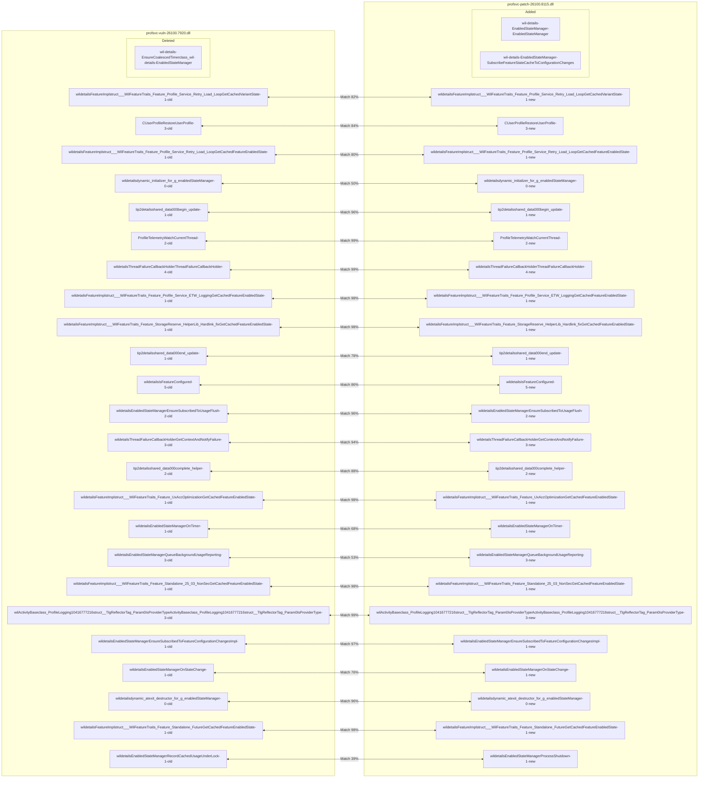
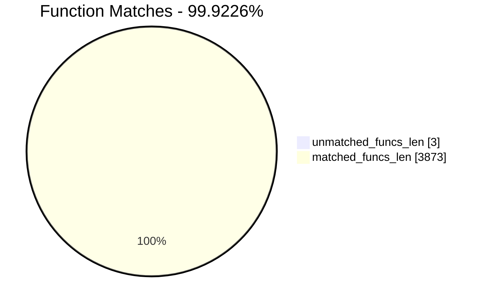
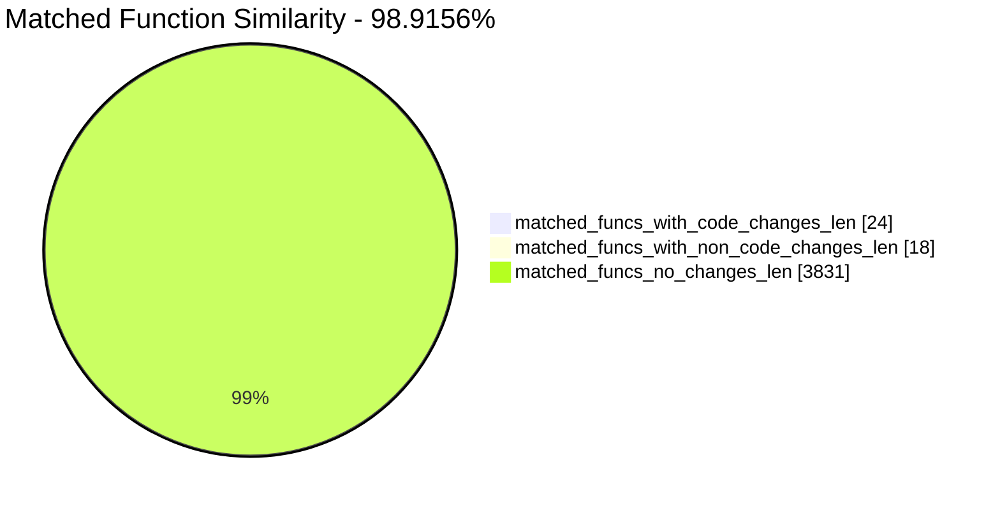
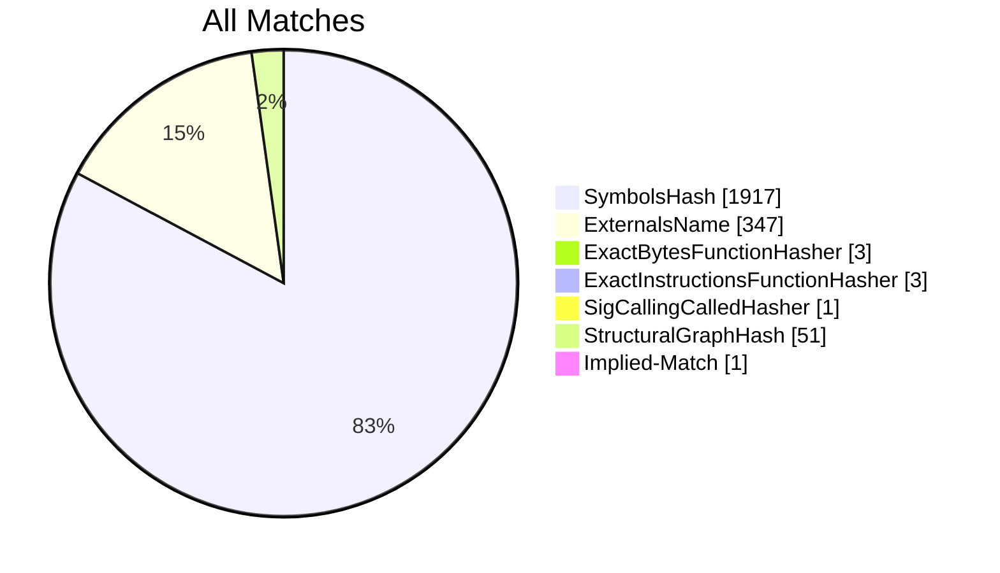
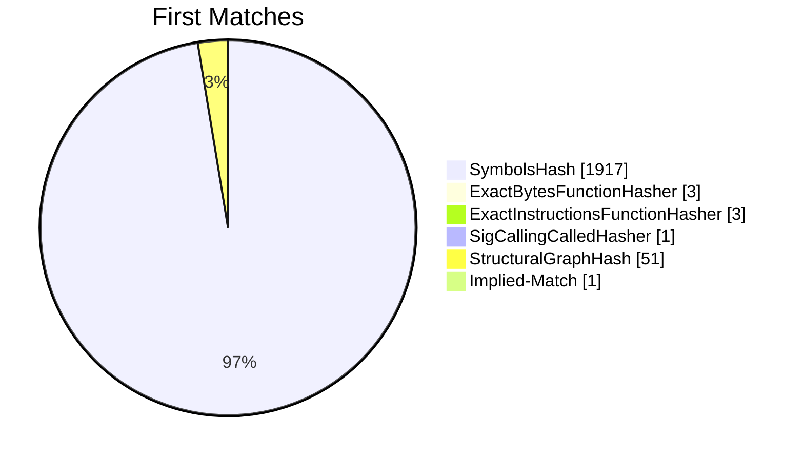
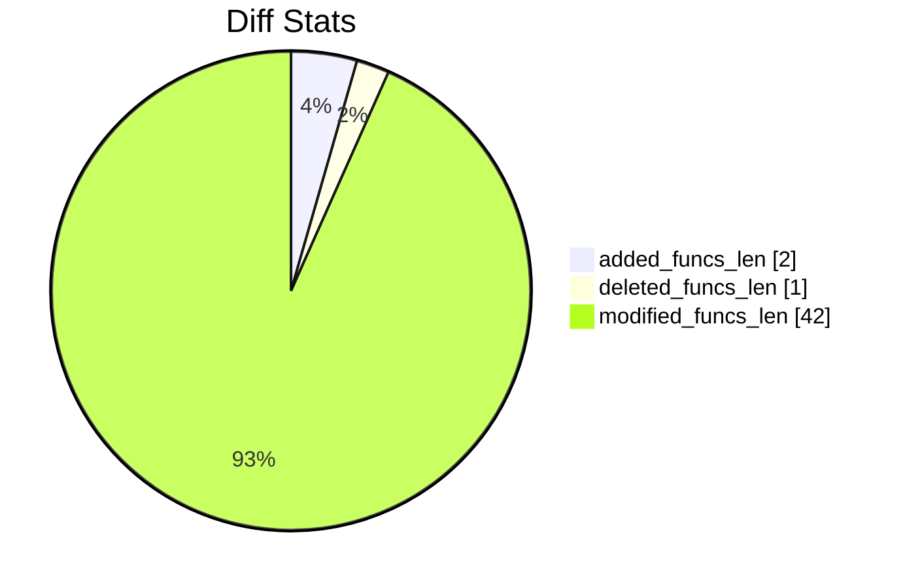

# profsvc-vuln-26100.7920.dll-profsvc-patch-26100.8115.dll Diff

# TOC

* [Visual Chart Diff](#visual-chart-diff)
* [Metadata](#metadata)
	* [Ghidra Diff Engine](#ghidra-diff-engine)
		* [Command Line](#command-line)
	* [Binary Metadata Diff](#binary-metadata-diff)
	* [Program Options](#program-options)
	* [Diff Stats](#diff-stats)
	* [Strings](#strings)
* [Deleted](#deleted)
	* [wil::details::EnsureCoalescedTimer<class_wil::details::EnabledStateManager>](#wildetailsensurecoalescedtimerclass_wildetailsenabledstatemanager)
* [Added](#added)
	* [wil::details::EnabledStateManager::EnabledStateManager](#wildetailsenabledstatemanagerenabledstatemanager)
	* [wil::details::EnabledStateManager::SubscribeFeatureStateCacheToConfigurationChanges](#wildetailsenabledstatemanagersubscribefeaturestatecachetoconfigurationchanges)
* [Modified](#modified)
	* [wil::details::FeatureImpl<struct___WilFeatureTraits_Feature_Profile_Service_Retry_Load_Loop>::GetCachedVariantState](#wildetailsfeatureimplstruct___wilfeaturetraits_feature_profile_service_retry_load_loopgetcachedvariantstate)
	* [CUserProfile::RestoreUserProfile](#cuserprofilerestoreuserprofile)
	* [wil::details::FeatureImpl<struct___WilFeatureTraits_Feature_Profile_Service_Retry_Load_Loop>::GetCachedFeatureEnabledState](#wildetailsfeatureimplstruct___wilfeaturetraits_feature_profile_service_retry_load_loopgetcachedfeatureenabledstate)
	* [wil::details::`dynamic_initializer_for_'g_enabledStateManager''](#wildetailsdynamic_initializer_for_g_enabledstatemanager)
	* [tip2::details::shared_data<0,0,0>::begin_update](#tip2detailsshared_data000begin_update)
	* [ProfileTelemetry::WatchCurrentThread](#profiletelemetrywatchcurrentthread)
	* [wil::details::ThreadFailureCallbackHolder::ThreadFailureCallbackHolder](#wildetailsthreadfailurecallbackholderthreadfailurecallbackholder)
	* [wil::details::FeatureImpl<struct___WilFeatureTraits_Feature_Profile_Service_ETW_Logging>::GetCachedFeatureEnabledState](#wildetailsfeatureimplstruct___wilfeaturetraits_feature_profile_service_etw_logginggetcachedfeatureenabledstate)
	* [wil::details::FeatureImpl<struct___WilFeatureTraits_Feature_StorageReserve_HelperLib_Hardlink_fix>::GetCachedFeatureEnabledState](#wildetailsfeatureimplstruct___wilfeaturetraits_feature_storagereserve_helperlib_hardlink_fixgetcachedfeatureenabledstate)
	* [tip2::details::shared_data<0,0,0>::end_update](#tip2detailsshared_data000end_update)
	* [wil::details::IsFeatureConfigured](#wildetailsisfeatureconfigured)
	* [wil::details::EnabledStateManager::EnsureSubscribedToUsageFlush](#wildetailsenabledstatemanagerensuresubscribedtousageflush)
	* [wil::details::ThreadFailureCallbackHolder::GetContextAndNotifyFailure](#wildetailsthreadfailurecallbackholdergetcontextandnotifyfailure)
	* [tip2::details::shared_data<0,0,0>::complete_helper](#tip2detailsshared_data000complete_helper)
	* [wil::details::FeatureImpl<struct___WilFeatureTraits_Feature_UxAccOptimization>::GetCachedFeatureEnabledState](#wildetailsfeatureimplstruct___wilfeaturetraits_feature_uxaccoptimizationgetcachedfeatureenabledstate)
	* [wil::details::EnabledStateManager::OnTimer](#wildetailsenabledstatemanagerontimer)
	* [wil::details::EnabledStateManager::QueueBackgroundUsageReporting](#wildetailsenabledstatemanagerqueuebackgroundusagereporting)
	* [wil::details::FeatureImpl<struct___WilFeatureTraits_Feature_Standalone_25_03_NonSec>::GetCachedFeatureEnabledState](#wildetailsfeatureimplstruct___wilfeaturetraits_feature_standalone_25_03_nonsecgetcachedfeatureenabledstate)
	* [wil::ActivityBase<class_ProfileLogging,1,0,4,16777216,struct__TlgReflectorTag_Param0IsProviderType>::ActivityBase<class_ProfileLogging,1,0,4,16777216,struct__TlgReflectorTag_Param0IsProviderType>](#wilactivitybaseclass_profilelogging10416777216struct__tlgreflectortag_param0isprovidertypeactivitybaseclass_profilelogging10416777216struct__tlgreflectortag_param0isprovidertype)
	* [wil::details::EnabledStateManager::EnsureSubscribedToFeatureConfigurationChangesImpl](#wildetailsenabledstatemanagerensuresubscribedtofeatureconfigurationchangesimpl)
	* [wil::details::EnabledStateManager::OnStateChange](#wildetailsenabledstatemanageronstatechange)
	* [wil::details::`dynamic_atexit_destructor_for_'g_enabledStateManager''](#wildetailsdynamic_atexit_destructor_for_g_enabledstatemanager)
	* [wil::details::FeatureImpl<struct___WilFeatureTraits_Feature_Standalone_Future>::GetCachedFeatureEnabledState](#wildetailsfeatureimplstruct___wilfeaturetraits_feature_standalone_futuregetcachedfeatureenabledstate)
	* [wil::details::EnabledStateManager::RecordCachedUsageUnderLock](#wildetailsenabledstatemanagerrecordcachedusageunderlock)
* [Modified (No Code Changes)](#modified-no-code-changes)
	* [~NativeString<class_Windows::Internal::ProcessHeapMemPolicy<unsigned_short>_>](#nativestringclass_windowsinternalprocessheapmempolicyunsigned_short_)
	* [API-MS-WIN-CORE-SYNCH-L1-1-0.DLL::AcquireSRWLockExclusive](#api-ms-win-core-synch-l1-1-0dllacquiresrwlockexclusive)
	* [~unique_storage<struct_wil::details::resource_policy<struct__TP_TIMER*___ptr64,void_(__cdecl*)(struct__TP_TIMER*___ptr64),&public:_static_void___cdecl_wil::details::DestroyThreadPoolTimer<struct_wil::details::SystemThreadPoolMethods,0>::Destroy(struct__TP_TIMER*___ptr64),struct_wistd::integral_constant<unsigned___int64,0>,struct__TP_TIMER*___ptr64,struct__TP_TIMER*___ptr64,0,std::nullptr_t>_>](#unique_storagestruct_wildetailsresource_policystruct__tp_timer___ptr64void___cdeclstruct__tp_timer___ptr64public_static_void___cdecl_wildetailsdestroythreadpooltimerstruct_wildetailssystemthreadpoolmethods0destroystruct__tp_timer___ptr64struct_wistdintegral_constantunsigned___int640struct__tp_timer___ptr64struct__tp_timer___ptr640stdnullptr_t_)
	* [Return_Hr](#return_hr)
	* [ProcessShutdownInProgress](#processshutdowninprogress)
	* [_tlgWriteTransfer_EtwEventWriteTransfer](#_tlgwritetransfer_etweventwritetransfer)
	* [push_back](#push_back)
	* [reset](#reset)
	* [API-MS-WIN-CORE-SYNCH-L1-1-0.DLL::EnterCriticalSection](#api-ms-win-core-synch-l1-1-0dllentercriticalsection)
	* [_tlgWriteActivityAutoStop<70368744177664,4>](#_tlgwriteactivityautostop703687441776644)
	* [API-MS-WIN-CORE-SYNCH-L1-2-0.DLL::Sleep](#api-ms-win-core-synch-l1-2-0dllsleep)

# Visual Chart Diff










# Metadata

## Ghidra Diff Engine

### Command Line

#### Captured Command Line


```
ghidriff --project-location ghidra-proj-profsvc --project-name CVE-25187-profsvc --symbols-path symbols --gzfs-path gzfs --threaded --log-level INFO --file-log-level INFO --log-path ghidriff.log --min-func-len 10 --gdt [] --bsim --max-ram-percent 60.0 --max-section-funcs 200 profsvc-vuln-26100.7920.dll profsvc-patch-26100.8115.dll
```


#### Verbose Args


<details>

```
--old ['profsvc-vuln-26100.7920.dll'] --new [['profsvc-patch-26100.8115.dll']] --engine VersionTrackingDiff --output-path diffs/profsvc --summary False --project-location ghidra-proj-profsvc --project-name CVE-25187-profsvc --symbols-path symbols --gzfs-path gzfs --base-address None --program-options None --threaded True --force-analysis False --force-diff False --no-symbols False --log-level INFO --file-log-level INFO --log-path ghidriff.log --va False --min-func-len 10 --use-calling-counts False --gdt [] --bsim True --bsim-full False --max-ram-percent 60.0 --print-flags False --jvm-args None --side-by-side False --max-section-funcs 200 --md-title None
```


</details>

#### Download Original PEs


```
wget https://msdl.microsoft.com/download/symbols/ProfSvc.dll/8E4EB72492000/ProfSvc.dll -O profsvc.dll.x64.10.0.26100.7920
wget https://msdl.microsoft.com/download/symbols/ProfSvc.dll/F89E8D4892000/ProfSvc.dll -O profsvc.dll.x64.10.0.26100.8115
```


## Binary Metadata Diff


```diff
--- profsvc-vuln-26100.7920.dll Meta
+++ profsvc-patch-26100.8115.dll Meta
@@ -1,44 +1,44 @@
-Program Name: profsvc-vuln-26100.7920.dll
+Program Name: profsvc-patch-26100.8115.dll
 Language ID: x86:LE:64:default (4.6)
 Compiler ID: windows
 Processor: x86
 Endian: Little
 Address Size: 64
 Minimum Address: 180000000
 Maximum Address: ff0000184f
 # of Bytes: 600592
 # of Memory Blocks: 10
-# of Instructions: 82377
-# of Defined Data: 9565
-# of Functions: 1937
-# of Symbols: 19574
-# of Data Types: 1372
+# of Instructions: 82404
+# of Defined Data: 9568
+# of Functions: 1939
+# of Symbols: 19584
+# of Data Types: 1373
 # of Data Type Categories: 333
 Analyzed: true
 Compiler: visualstudio:unknown
 Created With Ghidra Version: 12.0.4
-Date Created: Fri Apr 24 10:15:17 AST 2026
+Date Created: Fri Apr 24 10:15:20 AST 2026
 Executable Format: Portable Executable (PE)
-Executable Location: /home/cve/repos/win11-forge/lab/CVE-2026-25187/profsvc-vuln-26100.7920.dll
-Executable MD5: 8c68a476f7d98d4e2dc79282f0b66349
-Executable SHA256: fcd668c27c10518a139dbfc7af2712ded125d62b4a1b7de5eec2bf205414ac16
-FSRL: file:///home/cve/repos/win11-forge/lab/CVE-2026-25187/profsvc-vuln-26100.7920.dll?MD5=8c68a476f7d98d4e2dc79282f0b66349
+Executable Location: /home/cve/repos/win11-forge/lab/CVE-2026-25187/profsvc-patch-26100.8115.dll
+Executable MD5: f8544ad7882e55353f66301f6a037e8a
+Executable SHA256: 32ea778259642ab3b2c86ab9e5ab56b4022392f0e632d514c8c3f585a12d2dc6
+FSRL: file:///home/cve/repos/win11-forge/lab/CVE-2026-25187/profsvc-patch-26100.8115.dll?MD5=f8544ad7882e55353f66301f6a037e8a
 PDB Age: 1
 PDB File: profsvc.pdb
-PDB GUID: 8a9e294a-37f3-264b-98b6-3863ceda02d0
+PDB GUID: 99df630a-6b4a-7779-becd-1c5de86b757b
 PDB Loaded: true
 PDB Version: RSDS
 PE Property[CompanyName]: Microsoft Corporation
 PE Property[FileDescription]: ProfSvc
-PE Property[FileVersion]: 10.0.26100.7920 (WinBuild.160101.0800)
+PE Property[FileVersion]: 10.0.26100.8115 (WinBuild.160101.0800)
 PE Property[InternalName]: ProfSvc
 PE Property[LegalCopyright]: © Microsoft Corporation. All rights reserved.
 PE Property[OriginalFilename]: ProfSvc.dll
 PE Property[ProductName]: Microsoft® Windows® Operating System
-PE Property[ProductVersion]: 10.0.26100.7920
+PE Property[ProductVersion]: 10.0.26100.8115
 PE Property[Translation]: 4b00409
 Preferred Root Namespace Category: 
 RTTI Found: true
 Relocatable: true
 SectionAlignment: 4096
 Should Ask To Analyze: false

```


## Program Options


<details>
<summary>Ghidra profsvc-vuln-26100.7920.dll Decompiler Options</summary>


|Decompiler Option|Value|
| :---: | :---: |
|Prototype Evaluation|__fastcall|

</details>


<details>
<summary>Ghidra profsvc-vuln-26100.7920.dll Specification extensions Options</summary>


|Specification extensions Option|Value|
| :---: | :---: |
|FormatVersion|0|
|VersionCounter|0|

</details>


<details>
<summary>Ghidra profsvc-vuln-26100.7920.dll Analyzers Options</summary>


|Analyzers Option|Value|
| :---: | :---: |
|ASCII Strings|true|
|ASCII Strings.Create Strings Containing Existing Strings|true|
|ASCII Strings.Create Strings Containing References|true|
|ASCII Strings.Force Model Reload|false|
|ASCII Strings.Minimum String Length|LEN_5|
|ASCII Strings.Model File|StringModel.sng|
|ASCII Strings.Require Null Termination for String|true|
|ASCII Strings.Search Only in Accessible Memory Blocks|true|
|ASCII Strings.String Start Alignment|ALIGN_1|
|ASCII Strings.String end alignment|4|
|Aggressive Instruction Finder|false|
|Aggressive Instruction Finder.Create Analysis Bookmarks|true|
|Apply Data Archives|true|
|Apply Data Archives.Archive Chooser|[Auto-Detect]|
|Apply Data Archives.Create Analysis Bookmarks|true|
|Apply Data Archives.GDT User File Archive Path|None|
|Apply Data Archives.User Project Archive Path|None|
|Call Convention ID|true|
|Call Convention ID.Analysis Decompiler Timeout (sec)|60|
|Call-Fixup Installer|true|
|Condense Filler Bytes|false|
|Condense Filler Bytes.Filler Value|Auto|
|Condense Filler Bytes.Minimum number of sequential bytes|1|
|Create Address Tables|true|
|Create Address Tables.Allow Offcut References|false|
|Create Address Tables.Auto Label Table|false|
|Create Address Tables.Create Analysis Bookmarks|true|
|Create Address Tables.Maxmimum Pointer Distance|16777215|
|Create Address Tables.Minimum Pointer Address|4132|
|Create Address Tables.Minimum Table Size|2|
|Create Address Tables.Pointer Alignment|1|
|Create Address Tables.Relocation Table Guide|true|
|Create Address Tables.Table Alignment|4|
|Data Reference|true|
|Data Reference.Address Table Alignment|1|
|Data Reference.Address Table Minimum Size|2|
|Data Reference.Align End of Strings|false|
|Data Reference.Ascii String References|true|
|Data Reference.Create Address Tables|true|
|Data Reference.Minimum String Length|5|
|Data Reference.References to Pointers|true|
|Data Reference.Relocation Table Guide|true|
|Data Reference.Respect Execute Flag|true|
|Data Reference.Subroutine References|true|
|Data Reference.Switch Table References|false|
|Data Reference.Unicode String References|true|
|Decompiler Parameter ID|true|
|Decompiler Parameter ID.Analysis Clear Level|ANALYSIS|
|Decompiler Parameter ID.Analysis Decompiler Timeout (sec)|60|
|Decompiler Parameter ID.Commit Data Types|true|
|Decompiler Parameter ID.Commit Void Return Values|false|
|Decompiler Parameter ID.Prototype Evaluation|__fastcall|
|Decompiler Switch Analysis|true|
|Decompiler Switch Analysis.Analysis Decompiler Timeout (sec)|60|
|Demangler Microsoft|true|
|Demangler Microsoft.Apply Function Calling Conventions|true|
|Demangler Microsoft.Apply Function Signatures|true|
|Demangler Microsoft.C-Style Symbol Interpretation|FUNCTION_IF_EXISTS|
|Demangler Microsoft.Demangle Only Known Mangled Symbols|false|
|Disassemble Entry Points|true|
|Disassemble Entry Points.Respect Execute Flag|true|
|Embedded Media|true|
|Embedded Media.Create Analysis Bookmarks|true|
|External Entry References|true|
|Function ID|true|
|Function ID.Always Apply FID Labels|false|
|Function ID.Create Analysis Bookmarks|true|
|Function ID.Instruction Count Threshold|14.6|
|Function ID.Multiple Match Threshold|30.0|
|Function Start Search|true|
|Function Start Search.Bookmark Functions|false|
|Function Start Search.Search Data Blocks|false|
|Non-Returning Functions - Discovered|true|
|Non-Returning Functions - Discovered.Create Analysis Bookmarks|true|
|Non-Returning Functions - Discovered.Function Non-return Threshold|3|
|Non-Returning Functions - Discovered.Repair Flow Damage|true|
|Non-Returning Functions - Known|true|
|Non-Returning Functions - Known.Create Analysis Bookmarks|true|
|PDB MSDIA|false|
|PDB MSDIA.Search untrusted symbol servers|false|
|PDB Universal|true|
|PDB Universal.Import Source Line Info|true|
|PDB Universal.Search untrusted symbol servers|false|
|Reference|true|
|Reference.Address Table Alignment|1|
|Reference.Address Table Minimum Size|2|
|Reference.Align End of Strings|false|
|Reference.Ascii String References|true|
|Reference.Create Address Tables|true|
|Reference.Minimum String Length|5|
|Reference.References to Pointers|true|
|Reference.Relocation Table Guide|true|
|Reference.Respect Execute Flag|true|
|Reference.Subroutine References|true|
|Reference.Switch Table References|false|
|Reference.Unicode String References|true|
|Scalar Operand References|true|
|Scalar Operand References.Relocation Table Guide|true|
|Shared Return Calls|true|
|Shared Return Calls.Allow Conditional Jumps|false|
|Shared Return Calls.Assume Contiguous Functions Only|true|
|Stack|true|
|Stack.Create Local Variables|true|
|Stack.Create Param Variables|false|
|Stack.Max Threads|2|
|Subroutine References|true|
|Subroutine References.Create Thunks Early|true|
|Variadic Function Signature Override|false|
|Variadic Function Signature Override.Create Analysis Bookmarks|false|
|Windows x86 PE Exception Handling|true|
|Windows x86 PE RTTI Analyzer|true|
|Windows x86 Thread Environment Block (TEB) Analyzer|true|
|Windows x86 Thread Environment Block (TEB) Analyzer.Starting Address of the TEB||
|Windows x86 Thread Environment Block (TEB) Analyzer.Windows OS Version|Windows 7|
|WindowsPE x86 Propagate External Parameters|false|
|WindowsResourceReference|true|
|WindowsResourceReference.Create Analysis Bookmarks|true|
|x86 Constant Reference Analyzer|true|
|x86 Constant Reference Analyzer.Create Data from pointer|false|
|x86 Constant Reference Analyzer.Function parameter/return Pointer analysis|true|
|x86 Constant Reference Analyzer.Max Threads|2|
|x86 Constant Reference Analyzer.Min absolute reference|4|
|x86 Constant Reference Analyzer.Require pointer param data type|false|
|x86 Constant Reference Analyzer.Speculative reference max|256|
|x86 Constant Reference Analyzer.Speculative reference min|1024|
|x86 Constant Reference Analyzer.Stored Value Pointer analysis|true|
|x86 Constant Reference Analyzer.Trust values read from writable memory|true|

</details>


<details>
<summary>Ghidra profsvc-patch-26100.8115.dll Decompiler Options</summary>


|Decompiler Option|Value|
| :---: | :---: |
|Prototype Evaluation|__fastcall|

</details>


<details>
<summary>Ghidra profsvc-patch-26100.8115.dll Specification extensions Options</summary>


|Specification extensions Option|Value|
| :---: | :---: |
|FormatVersion|0|
|VersionCounter|0|

</details>


<details>
<summary>Ghidra profsvc-patch-26100.8115.dll Analyzers Options</summary>


|Analyzers Option|Value|
| :---: | :---: |
|ASCII Strings|true|
|ASCII Strings.Create Strings Containing Existing Strings|true|
|ASCII Strings.Create Strings Containing References|true|
|ASCII Strings.Force Model Reload|false|
|ASCII Strings.Minimum String Length|LEN_5|
|ASCII Strings.Model File|StringModel.sng|
|ASCII Strings.Require Null Termination for String|true|
|ASCII Strings.Search Only in Accessible Memory Blocks|true|
|ASCII Strings.String Start Alignment|ALIGN_1|
|ASCII Strings.String end alignment|4|
|Aggressive Instruction Finder|false|
|Aggressive Instruction Finder.Create Analysis Bookmarks|true|
|Apply Data Archives|true|
|Apply Data Archives.Archive Chooser|[Auto-Detect]|
|Apply Data Archives.Create Analysis Bookmarks|true|
|Apply Data Archives.GDT User File Archive Path|None|
|Apply Data Archives.User Project Archive Path|None|
|Call Convention ID|true|
|Call Convention ID.Analysis Decompiler Timeout (sec)|60|
|Call-Fixup Installer|true|
|Condense Filler Bytes|false|
|Condense Filler Bytes.Filler Value|Auto|
|Condense Filler Bytes.Minimum number of sequential bytes|1|
|Create Address Tables|true|
|Create Address Tables.Allow Offcut References|false|
|Create Address Tables.Auto Label Table|false|
|Create Address Tables.Create Analysis Bookmarks|true|
|Create Address Tables.Maxmimum Pointer Distance|16777215|
|Create Address Tables.Minimum Pointer Address|4132|
|Create Address Tables.Minimum Table Size|2|
|Create Address Tables.Pointer Alignment|1|
|Create Address Tables.Relocation Table Guide|true|
|Create Address Tables.Table Alignment|4|
|Data Reference|true|
|Data Reference.Address Table Alignment|1|
|Data Reference.Address Table Minimum Size|2|
|Data Reference.Align End of Strings|false|
|Data Reference.Ascii String References|true|
|Data Reference.Create Address Tables|true|
|Data Reference.Minimum String Length|5|
|Data Reference.References to Pointers|true|
|Data Reference.Relocation Table Guide|true|
|Data Reference.Respect Execute Flag|true|
|Data Reference.Subroutine References|true|
|Data Reference.Switch Table References|false|
|Data Reference.Unicode String References|true|
|Decompiler Parameter ID|true|
|Decompiler Parameter ID.Analysis Clear Level|ANALYSIS|
|Decompiler Parameter ID.Analysis Decompiler Timeout (sec)|60|
|Decompiler Parameter ID.Commit Data Types|true|
|Decompiler Parameter ID.Commit Void Return Values|false|
|Decompiler Parameter ID.Prototype Evaluation|__fastcall|
|Decompiler Switch Analysis|true|
|Decompiler Switch Analysis.Analysis Decompiler Timeout (sec)|60|
|Demangler Microsoft|true|
|Demangler Microsoft.Apply Function Calling Conventions|true|
|Demangler Microsoft.Apply Function Signatures|true|
|Demangler Microsoft.C-Style Symbol Interpretation|FUNCTION_IF_EXISTS|
|Demangler Microsoft.Demangle Only Known Mangled Symbols|false|
|Disassemble Entry Points|true|
|Disassemble Entry Points.Respect Execute Flag|true|
|Embedded Media|true|
|Embedded Media.Create Analysis Bookmarks|true|
|External Entry References|true|
|Function ID|true|
|Function ID.Always Apply FID Labels|false|
|Function ID.Create Analysis Bookmarks|true|
|Function ID.Instruction Count Threshold|14.6|
|Function ID.Multiple Match Threshold|30.0|
|Function Start Search|true|
|Function Start Search.Bookmark Functions|false|
|Function Start Search.Search Data Blocks|false|
|Non-Returning Functions - Discovered|true|
|Non-Returning Functions - Discovered.Create Analysis Bookmarks|true|
|Non-Returning Functions - Discovered.Function Non-return Threshold|3|
|Non-Returning Functions - Discovered.Repair Flow Damage|true|
|Non-Returning Functions - Known|true|
|Non-Returning Functions - Known.Create Analysis Bookmarks|true|
|PDB MSDIA|false|
|PDB MSDIA.Search untrusted symbol servers|false|
|PDB Universal|true|
|PDB Universal.Import Source Line Info|true|
|PDB Universal.Search untrusted symbol servers|false|
|Reference|true|
|Reference.Address Table Alignment|1|
|Reference.Address Table Minimum Size|2|
|Reference.Align End of Strings|false|
|Reference.Ascii String References|true|
|Reference.Create Address Tables|true|
|Reference.Minimum String Length|5|
|Reference.References to Pointers|true|
|Reference.Relocation Table Guide|true|
|Reference.Respect Execute Flag|true|
|Reference.Subroutine References|true|
|Reference.Switch Table References|false|
|Reference.Unicode String References|true|
|Scalar Operand References|true|
|Scalar Operand References.Relocation Table Guide|true|
|Shared Return Calls|true|
|Shared Return Calls.Allow Conditional Jumps|false|
|Shared Return Calls.Assume Contiguous Functions Only|true|
|Stack|true|
|Stack.Create Local Variables|true|
|Stack.Create Param Variables|false|
|Stack.Max Threads|2|
|Subroutine References|true|
|Subroutine References.Create Thunks Early|true|
|Variadic Function Signature Override|false|
|Variadic Function Signature Override.Create Analysis Bookmarks|false|
|Windows x86 PE Exception Handling|true|
|Windows x86 PE RTTI Analyzer|true|
|Windows x86 Thread Environment Block (TEB) Analyzer|true|
|Windows x86 Thread Environment Block (TEB) Analyzer.Starting Address of the TEB||
|Windows x86 Thread Environment Block (TEB) Analyzer.Windows OS Version|Windows 7|
|WindowsPE x86 Propagate External Parameters|false|
|WindowsResourceReference|true|
|WindowsResourceReference.Create Analysis Bookmarks|true|
|x86 Constant Reference Analyzer|true|
|x86 Constant Reference Analyzer.Create Data from pointer|false|
|x86 Constant Reference Analyzer.Function parameter/return Pointer analysis|true|
|x86 Constant Reference Analyzer.Max Threads|2|
|x86 Constant Reference Analyzer.Min absolute reference|4|
|x86 Constant Reference Analyzer.Require pointer param data type|false|
|x86 Constant Reference Analyzer.Speculative reference max|256|
|x86 Constant Reference Analyzer.Speculative reference min|1024|
|x86 Constant Reference Analyzer.Stored Value Pointer analysis|true|
|x86 Constant Reference Analyzer.Trust values read from writable memory|true|

</details>

## Diff Stats


|Stat|Value|
| :---: | :---: |
|added_funcs_len|2|
|deleted_funcs_len|1|
|modified_funcs_len|42|
|added_symbols_len|0|
|deleted_symbols_len|0|
|diff_time|18.999639749526978|
|deleted_strings_len|0|
|added_strings_len|0|
|match_types|Counter({'SymbolsHash': 1917, 'ExternalsName': 347, 'StructuralGraphHash': 51, 'ExactBytesFunctionHasher': 3, 'ExactInstructionsFunctionHasher': 3, 'SigCallingCalledHasher': 1, 'Implied Match': 1})|
|items_to_process|45|
|diff_types|Counter({'address': 39, 'length': 29, 'code': 24, 'refcount': 17, 'calling': 9, 'called': 8, 'sig': 2, 'name': 1, 'fullname': 1})|
|unmatched_funcs_len|3|
|total_funcs_len|3876|
|matched_funcs_len|3873|
|matched_funcs_with_code_changes_len|24|
|matched_funcs_with_non_code_changes_len|18|
|matched_funcs_no_changes_len|3831|
|match_func_similarity_percent|98.9156%|
|func_match_overall_percent|99.9226%|
|first_matches|Counter({'SymbolsHash': 1917, 'StructuralGraphHash': 51, 'ExactBytesFunctionHasher': 3, 'ExactInstructionsFunctionHasher': 3, 'SigCallingCalledHasher': 1, 'Implied Match': 1})|











```mermaid
pie showData
    title Symbols
"added_symbols_len" : 0
"deleted_symbols_len" : 0
```

## Strings


*No string differences found*

# Deleted

## wil::details::EnsureCoalescedTimer<class_wil::details::EnabledStateManager>

### Function Meta


|Key|profsvc-vuln-26100.7920.dll|
| :---: | :---: |
|name|EnsureCoalescedTimer<class_wil::details::EnabledStateManager>|
|fullname|wil::details::EnsureCoalescedTimer<class_wil::details::EnabledStateManager>|
|refcount|2|
|length|124|
|called|API-MS-WIN-CORE-THREADPOOL-L1-2-0.DLL::CreateThreadpoolTimer<br>wil::details::EnsureCoalescedTimer_SetTimer<br>wil::details::unique_storage<struct_wil::details::resource_policy<struct__TP_TIMER*___ptr64,void_(__cdecl*)(struct__TP_TIMER*___ptr64),&public:_static_void___cdecl_wil::details::DestroyThreadPoolTimer<struct_wil::details::SystemThreadPoolMethods,0>::Destroy(struct__TP_TIMER*___ptr64),struct_wistd::integral_constant<unsigned___int64,0>,struct__TP_TIMER*___ptr64,struct__TP_TIMER*___ptr64,0,std::nullptr_t>_>::reset<br>wil::last_error_context::last_error_context<br>wil::last_error_context::~last_error_context|
|calling|wil::details::EnabledStateManager::QueueBackgroundUsageReporting|
|paramcount|3|
|address|18003f844|
|sig|void __cdecl EnsureCoalescedTimer<class_wil::details::EnabledStateManager>(unique_any_t<class_wil::details::unique_storage<struct_wil::details::resource_policy<struct__TP_TIMER*___ptr64,void_(__cdecl*)(struct__TP_TIMER*___ptr64),&public:_static_void___cdecl_wil::details::DestroyThreadPoolTimer<struct_wil::details::SystemThreadPoolMethods,0>::Destroy(struct__TP_TIMER*___ptr64),struct_wistd::integral_constant<unsigned___int64,0>,struct__TP_TIMER*___ptr64,struct__TP_TIMER*___ptr64,0,std::nullptr_t>_>_> * param_1, bool * param_2, EnabledStateManager * param_3)|
|sym_type|Function|
|sym_source|ANALYSIS|
|external|False|


```diff
--- wil::details::EnsureCoalescedTimer<class_wil::details::EnabledStateManager>
+++ wil::details::EnsureCoalescedTimer<class_wil::details::EnabledStateManager>
@@ -1,35 +0,0 @@
-
-/* void __cdecl wil::details::EnsureCoalescedTimer<class wil::details::EnabledStateManager>(class
-   wil::unique_any_t<class wil::details::unique_storage<struct wil::details::resource_policy<struct
-   _TP_TIMER * __ptr64,void (__cdecl*)(struct _TP_TIMER * __ptr64),&public: static void __cdecl
-   wil::details::DestroyThreadPoolTimer<struct
-   wil::details::SystemThreadPoolMethods,0>::Destroy(struct _TP_TIMER * __ptr64),struct
-   wistd::integral_constant<unsigned __int64,0>,struct _TP_TIMER * __ptr64,struct _TP_TIMER *
-   __ptr64,0,std::nullptr_t> > > & __ptr64,bool & __ptr64,class wil::details::EnabledStateManager *
-   __ptr64) */
-
-void __cdecl
-wil::details::EnsureCoalescedTimer<class_wil::details::EnabledStateManager>
-          (unique_any_t<class_wil::details::unique_storage<struct_wil::details::resource_policy<struct__TP_TIMER*___ptr64,void_(__cdecl*)(struct__TP_TIMER*___ptr64),&public:_static_void___cdecl_wil::details::DestroyThreadPoolTimer<struct_wil::details::SystemThreadPoolMethods,0>::Destroy(struct__TP_TIMER*___ptr64),struct_wistd::integral_constant<unsigned___int64,0>,struct__TP_TIMER*___ptr64,struct__TP_TIMER*___ptr64,0,std::nullptr_t>_>_>
-           *param_1,bool *param_2,EnabledStateManager *param_3)
-
-{
-  PTP_TIMER p_Var1;
-  last_error_context local_res10 [8];
-  
-  if (*param_2 == false) {
-    if (*(longlong *)param_1 == 0) {
-      last_error_context::last_error_context(local_res10);
-      p_Var1 = CreateThreadpoolTimer
-                         (<lambda_0374aa0a5d1201b2358c6bce99369c58>::<lambda_invoker_cdecl>,param_3,
-                          (PTP_CALLBACK_ENVIRON)0x0);
-      unique_storage<struct_wil::details::resource_policy<struct__TP_TIMER*___ptr64,void_(__cdecl*)(struct__TP_TIMER*___ptr64),&public:_static_void___cdecl_wil::details::DestroyThreadPoolTimer<struct_wil::details::SystemThreadPoolMethods,0>::Destroy(struct__TP_TIMER*___ptr64),struct_wistd::integral_constant<unsigned___int64,0>,struct__TP_TIMER*___ptr64,struct__TP_TIMER*___ptr64,0,std::nullptr_t>_>
-      ::reset((unique_storage<struct_wil::details::resource_policy<struct__TP_TIMER*___ptr64,void_(__cdecl*)(struct__TP_TIMER*___ptr64),&public:_static_void___cdecl_wil::details::DestroyThreadPoolTimer<struct_wil::details::SystemThreadPoolMethods,0>::Destroy(struct__TP_TIMER*___ptr64),struct_wistd::integral_constant<unsigned___int64,0>,struct__TP_TIMER*___ptr64,struct__TP_TIMER*___ptr64,0,std::nullptr_t>_>
-               *)param_1,p_Var1);
-      last_error_context::~last_error_context(local_res10);
-    }
-    EnsureCoalescedTimer_SetTimer(param_1,param_2,300000);
-  }
-  return;
-}
-

```


# Added

## wil::details::EnabledStateManager::EnabledStateManager

### Function Meta


|Key|profsvc-patch-26100.8115.dll|
| :---: | :---: |
|name|EnabledStateManager|
|fullname|wil::details::EnabledStateManager::EnabledStateManager|
|refcount|1|
|length|70|
|called||
|calling|wil::details::`dynamic_initializer_for_'g_enabledStateManager''|
|paramcount|1|
|address|180033a30|
|sig|undefined __thiscall EnabledStateManager(EnabledStateManager * this)|
|sym_type|Function|
|sym_source|ANALYSIS|
|external|False|


```diff
--- wil::details::EnabledStateManager::EnabledStateManager
+++ wil::details::EnabledStateManager::EnabledStateManager
@@ -0,0 +1,26 @@
+
+/* public: __cdecl wil::details::EnabledStateManager::EnabledStateManager(void) __ptr64 */
+
+EnabledStateManager * __thiscall
+wil::details::EnabledStateManager::EnabledStateManager(EnabledStateManager *this)
+
+{
+  *(undefined4 *)this = 0;
+  *(undefined8 *)(this + 8) = 0;
+  *(undefined8 *)(this + 0x10) = 0;
+  this[0x18] = (EnabledStateManager)0x0;
+  *(undefined4 *)(this + 0x1c) = 0;
+  *(undefined8 *)(this + 0x20) = 0;
+  *(undefined8 *)(this + 0x28) = 0;
+  *(undefined8 *)(this + 0x30) = 0;
+  *(undefined8 *)(this + 0x38) = 0;
+  *(undefined8 *)(this + 0x40) = 0;
+  *(undefined8 *)(this + 0x48) = 0;
+  *(undefined8 *)(this + 0x50) = 0;
+  *(undefined8 *)(this + 0x58) = 0;
+  *(undefined8 *)(this + 0x60) = 0;
+  *(undefined8 *)(this + 0x68) = 0;
+  *(undefined4 *)this = 1;
+  return this;
+}
+

```


## wil::details::EnabledStateManager::SubscribeFeatureStateCacheToConfigurationChanges

### Function Meta


|Key|profsvc-patch-26100.8115.dll|
| :---: | :---: |
|name|SubscribeFeatureStateCacheToConfigurationChanges|
|fullname|wil::details::EnabledStateManager::SubscribeFeatureStateCacheToConfigurationChanges|
|refcount|4|
|length|156|
|called|API-MS-WIN-CORE-SYNCH-L1-1-0.DLL::AcquireSRWLockExclusive<br>wil::details::unique_storage<struct_wil::details::resource_policy<struct__RTL_SRWLOCK*___ptr64,void_(__cdecl*)(struct__RTL_SRWLOCK*___ptr64),&void___cdecl_ReleaseSRWLockExclusive(struct__RTL_SRWLOCK*___ptr64),struct_wistd::integral_constant<unsigned___int64,1>,struct__RTL_SRWLOCK*___ptr64,struct__RTL_SRWLOCK*___ptr64,0,std::nullptr_t>_>::~unique_storage<struct_wil::details::resource_policy<struct__RTL_SRWLOCK*___ptr64,void_(__cdecl*)(struct__RTL_SRWLOCK*___ptr64),&void___cdecl_ReleaseSRWLockExclusive(struct__RTL_SRWLOCK*___ptr64),struct_wistd::integral_constant<unsigned___int64,1>,struct__RTL_SRWLOCK*___ptr64,struct__RTL_SRWLOCK*___ptr64,0,std::nullptr_t>_><br>wil::details_abi::heap_buffer::push_back|
|calling|wil::details::FeatureImpl<struct___WilFeatureTraits_Feature_Profile_Service_Retry_Load_Loop>::GetCachedFeatureEnabledState<br>wil::details::FeatureImpl<struct___WilFeatureTraits_Feature_Profile_Service_Retry_Load_Loop>::GetCachedVariantState<br>wil::details::IsFeatureConfigured|
|paramcount|4|
|address|18003bab4|
|sig|void __thiscall SubscribeFeatureStateCacheToConfigurationChanges(EnabledStateManager * this, wil_details_FeatureStateCache * param_1, wil_FeatureChangeTime param_2, uint param_3)|
|sym_type|Function|
|sym_source|ANALYSIS|
|external|False|


```diff
--- wil::details::EnabledStateManager::SubscribeFeatureStateCacheToConfigurationChanges
+++ wil::details::EnabledStateManager::SubscribeFeatureStateCacheToConfigurationChanges
@@ -0,0 +1,42 @@
+
+/* public: void __cdecl
+   wil::details::EnabledStateManager::SubscribeFeatureStateCacheToConfigurationChanges(union
+   wil_details_FeatureStateCache * __ptr64,enum wil_FeatureChangeTime,unsigned int) __ptr64 */
+
+void __thiscall
+wil::details::EnabledStateManager::SubscribeFeatureStateCacheToConfigurationChanges
+          (EnabledStateManager *this,wil_details_FeatureStateCache *param_1,
+          wil_FeatureChangeTime param_2,uint param_3)
+
+{
+  EnabledStateManager *SRWLock;
+  bool bVar1;
+  EnabledStateManager *local_res8;
+  wil_FeatureChangeTime local_28 [2];
+  wil_details_FeatureStateCache *local_20;
+  
+  if (*(int *)this == 0) {
+    return;
+  }
+  SRWLock = this + 8;
+  AcquireSRWLockExclusive((PSRWLOCK)SRWLock);
+  local_res8 = SRWLock;
+  if ((param_3 != 0) && (param_3 == *(uint *)(this + 0x1c))) {
+    local_28[1] = 0;
+    local_28[0] = param_2;
+    local_20 = param_1;
+    bVar1 = details_abi::heap_buffer::push_back((heap_buffer *)(this + 0x50),local_28,0x10);
+    if (bVar1) goto LAB_18003bb33;
+  }
+  LOCK();
+  *(uint *)param_1 = *(uint *)param_1 & (-(uint)(param_2 != 0) & 0x83a) - 0x83f;
+  UNLOCK();
+LAB_18003bb33:
+  unique_storage<struct_wil::details::resource_policy<struct__RTL_SRWLOCK*___ptr64,void_(__cdecl*)(struct__RTL_SRWLOCK*___ptr64),&void___cdecl_ReleaseSRWLockExclusive(struct__RTL_SRWLOCK*___ptr64),struct_wistd::integral_constant<unsigned___int64,1>,struct__RTL_SRWLOCK*___ptr64,struct__RTL_SRWLOCK*___ptr64,0,std::nullptr_t>_>
+  ::
+  ~unique_storage<struct_wil::details::resource_policy<struct__RTL_SRWLOCK*___ptr64,void_(__cdecl*)(struct__RTL_SRWLOCK*___ptr64),&void___cdecl_ReleaseSRWLockExclusive(struct__RTL_SRWLOCK*___ptr64),struct_wistd::integral_constant<unsigned___int64,1>,struct__RTL_SRWLOCK*___ptr64,struct__RTL_SRWLOCK*___ptr64,0,std::nullptr_t>_>
+            ((unique_storage<struct_wil::details::resource_policy<struct__RTL_SRWLOCK*___ptr64,void_(__cdecl*)(struct__RTL_SRWLOCK*___ptr64),&void___cdecl_ReleaseSRWLockExclusive(struct__RTL_SRWLOCK*___ptr64),struct_wistd::integral_constant<unsigned___int64,1>,struct__RTL_SRWLOCK*___ptr64,struct__RTL_SRWLOCK*___ptr64,0,std::nullptr_t>_>
+              *)&local_res8);
+  return;
+}
+

```


# Modified


*Modified functions contain code changes*
## wil::details::FeatureImpl<struct___WilFeatureTraits_Feature_Profile_Service_Retry_Load_Loop>::GetCachedVariantState

### Match Info


|Key|profsvc-vuln-26100.7920.dll - profsvc-patch-26100.8115.dll|
| :---: | :---: |
|diff_type|code,length,address,called|
|ratio|0.28|
|i_ratio|0.41|
|m_ratio|0.86|
|b_ratio|0.82|
|match_types|SymbolsHash|

### Function Meta Diff


|Key|profsvc-vuln-26100.7920.dll|profsvc-patch-26100.8115.dll|
| :---: | :---: | :---: |
|name|GetCachedVariantState|GetCachedVariantState|
|fullname|wil::details::FeatureImpl<struct___WilFeatureTraits_Feature_Profile_Service_Retry_Load_Loop>::GetCachedVariantState|wil::details::FeatureImpl<struct___WilFeatureTraits_Feature_Profile_Service_Retry_Load_Loop>::GetCachedVariantState|
|refcount|4|4|
|`length`|320|254|
|`called`|API-MS-WIN-CORE-SYNCH-L1-1-0.DLL::AcquireSRWLockExclusive<br>wil::details::EnsureSubscribedToFeatureConfigurationChanges<br>wil::details::FeatureImpl<struct___WilFeatureTraits_Feature_Profile_Service_Retry_Load_Loop>::GetCurrentVariantState<br>wil::details::unique_storage<struct_wil::details::resource_policy<struct__RTL_SRWLOCK*___ptr64,void_(__cdecl*)(struct__RTL_SRWLOCK*___ptr64),&void___cdecl_ReleaseSRWLockExclusive(struct__RTL_SRWLOCK*___ptr64),struct_wistd::integral_constant<unsigned___int64,1>,struct__RTL_SRWLOCK*___ptr64,struct__RTL_SRWLOCK*___ptr64,0,std::nullptr_t>_>::~unique_storage<struct_wil::details::resource_policy<struct__RTL_SRWLOCK*___ptr64,void_(__cdecl*)(struct__RTL_SRWLOCK*___ptr64),&void___cdecl_ReleaseSRWLockExclusive(struct__RTL_SRWLOCK*___ptr64),struct_wistd::integral_constant<unsigned___int64,1>,struct__RTL_SRWLOCK*___ptr64,struct__RTL_SRWLOCK*___ptr64,0,std::nullptr_t>_><br>wil::details_abi::heap_buffer::push_back|wil::details::EnabledStateManager::SubscribeFeatureStateCacheToConfigurationChanges<br>wil::details::EnsureSubscribedToFeatureConfigurationChanges<br>wil::details::FeatureImpl<struct___WilFeatureTraits_Feature_Profile_Service_Retry_Load_Loop>::GetCurrentVariantState|
|calling|GetLoopParameters<br>wil::details::FeatureImpl<struct___WilFeatureTraits_Feature_Profile_Service_Retry_Load_Loop>::ReportVariantUsage<br>wil::details::FeatureImpl<struct___WilFeatureTraits_Feature_Profile_Service_Retry_Load_Loop>::__private_GetVariant|GetLoopParameters<br>wil::details::FeatureImpl<struct___WilFeatureTraits_Feature_Profile_Service_Retry_Load_Loop>::ReportVariantUsage<br>wil::details::FeatureImpl<struct___WilFeatureTraits_Feature_Profile_Service_Retry_Load_Loop>::__private_GetVariant|
|paramcount|1|1|
|`address`|18001e69c|18001e6bc|
|sig|wil_details_FeatureStateCache __thiscall GetCachedVariantState(FeatureImpl<struct___WilFeatureTraits_Feature_Profile_Service_Retry_Load_Loop> * this)|wil_details_FeatureStateCache __thiscall GetCachedVariantState(FeatureImpl<struct___WilFeatureTraits_Feature_Profile_Service_Retry_Load_Loop> * this)|
|sym_type|Function|Function|
|sym_source|ANALYSIS|ANALYSIS|
|external|False|False|

### wil::details::FeatureImpl<struct___WilFeatureTraits_Feature_Profile_Service_Retry_Load_Loop>::GetCachedVariantState Called Diff


```diff
--- wil::details::FeatureImpl<struct___WilFeatureTraits_Feature_Profile_Service_Retry_Load_Loop>::GetCachedVariantState called
+++ wil::details::FeatureImpl<struct___WilFeatureTraits_Feature_Profile_Service_Retry_Load_Loop>::GetCachedVariantState called
@@ -1 +1 @@
-API-MS-WIN-CORE-SYNCH-L1-1-0.DLL::AcquireSRWLockExclusive
+wil::details::EnabledStateManager::SubscribeFeatureStateCacheToConfigurationChanges
@@ -4,2 +3,0 @@
-wil::details::unique_storage<struct_wil::details::resource_policy<struct__RTL_SRWLOCK*___ptr64,void_(__cdecl*)(struct__RTL_SRWLOCK*___ptr64),&void___cdecl_ReleaseSRWLockExclusive(struct__RTL_SRWLOCK*___ptr64),struct_wistd::integral_constant<unsigned___int64,1>,struct__RTL_SRWLOCK*___ptr64,struct__RTL_SRWLOCK*___ptr64,0,std::nullptr_t>_>::~unique_storage<struct_wil::details::resource_policy<struct__RTL_SRWLOCK*___ptr64,void_(__cdecl*)(struct__RTL_SRWLOCK*___ptr64),&void___cdecl_ReleaseSRWLockExclusive(struct__RTL_SRWLOCK*___ptr64),struct_wistd::integral_constant<unsigned___int64,1>,struct__RTL_SRWLOCK*___ptr64,struct__RTL_SRWLOCK*___ptr64,0,std::nullptr_t>_>
-wil::details_abi::heap_buffer::push_back
```


### wil::details::FeatureImpl<struct___WilFeatureTraits_Feature_Profile_Service_Retry_Load_Loop>::GetCachedVariantState Diff


```diff
--- wil::details::FeatureImpl<struct___WilFeatureTraits_Feature_Profile_Service_Retry_Load_Loop>::GetCachedVariantState
+++ wil::details::FeatureImpl<struct___WilFeatureTraits_Feature_Profile_Service_Retry_Load_Loop>::GetCachedVariantState
@@ -1,83 +1,58 @@
 
 /* private: union wil_details_FeatureStateCache __cdecl wil::details::FeatureImpl<struct
    __WilFeatureTraits_Feature_Profile_Service_Retry_Load_Loop>::GetCachedVariantState(void) __ptr64
     */
 
 void __thiscall
 wil::details::FeatureImpl<struct___WilFeatureTraits_Feature_Profile_Service_Retry_Load_Loop>::
 GetCachedVariantState
           (FeatureImpl<struct___WilFeatureTraits_Feature_Profile_Service_Retry_Load_Loop> *this)
 
 {
   uint uVar1;
   ulonglong uVar2;
   FeatureImpl<struct___WilFeatureTraits_Feature_Profile_Service_Retry_Load_Loop> *this_00;
   ulonglong uVar3;
   ulonglong *in_RDX;
   uint uVar4;
   bool bVar5;
   uint local_res10;
   undefined4 uStackX_14;
-  undefined *local_res18 [2];
-  undefined4 local_38;
-  undefined4 local_34;
-  FeatureImpl<struct___WilFeatureTraits_Feature_Profile_Service_Retry_Load_Loop> *local_30;
   
   uVar2 = *(ulonglong *)this;
   *in_RDX = uVar2;
-  if (((byte)uVar2 & 0xc) == 0xc) {
-    return;
+  if (((byte)uVar2 & 0xc) != 0xc) {
+    this_00 = this;
+    uVar1 = EnsureSubscribedToFeatureConfigurationChanges();
+    GetCurrentVariantState(this_00,(int *)&local_res10);
+    uVar2 = *in_RDX;
+    do {
+      uVar3 = uVar2;
+      uVar4 = (uint)uVar3;
+      *in_RDX = uVar3;
+      if ((uVar3 & 8) == 0) {
+        *(undefined4 *)((longlong)in_RDX + 4) = uStackX_14;
+        uVar4 = local_res10 & 0x3f000 | uVar4 & 0xfffc07f7 | local_res10 & 0x800;
+        *(uint *)in_RDX = uVar4;
+      }
+      if ((uVar3 & 4) == 0) {
+        *(uint *)in_RDX = uVar4 & 0xfffffbff | local_res10 & 0x400 | 4;
+      }
+      LOCK();
+      uVar2 = *(ulonglong *)this;
+      bVar5 = uVar3 == uVar2;
+      if (bVar5) {
+        *(ulonglong *)this = *in_RDX;
+        uVar2 = uVar3;
+      }
+      UNLOCK();
+    } while (!bVar5);
+    if ((uVar3 & 4) == 0) {
+      EnabledStateManager::SubscribeFeatureStateCacheToConfigurationChanges
+                ((EnabledStateManager *)&g_enabledStateManager,(wil_details_FeatureStateCache *)this
+                 ,0,uVar1);
+    }
   }
-  this_00 = this;
-  uVar1 = EnsureSubscribedToFeatureConfigurationChanges();
-  GetCurrentVariantState(this_00,(int *)&local_res10);
-  uVar2 = *in_RDX;
-  do {
-    uVar3 = uVar2;
-    uVar4 = (uint)uVar3;
-    *in_RDX = uVar3;
-    if ((uVar3 & 8) == 0) {
-      *(undefined4 *)((longlong)in_RDX + 4) = uStackX_14;
-      uVar4 = local_res10 & 0x3f000 | uVar4 & 0xfffc07f7 | local_res10 & 0x800;
-      *(uint *)in_RDX = uVar4;
-    }
-    if ((uVar3 & 4) == 0) {
-      *(uint *)in_RDX = uVar4 & 0xfffffbff | local_res10 & 0x400 | 4;
-    }
-    LOCK();
-    uVar2 = *(ulonglong *)this;
-    bVar5 = uVar3 == uVar2;
-    if (bVar5) {
-      *(ulonglong *)this = *in_RDX;
-      uVar2 = uVar3;
-    }
-    UNLOCK();
-  } while (!bVar5);
-  if ((uVar3 & 4) != 0) {
-    return;
-  }
-  if (g_enabledStateManager == (shutdown_aware_object<class_wil::details::EnabledStateManager>)0x0)
-  {
-    return;
-  }
-  AcquireSRWLockExclusive((PSRWLOCK)&DAT_0);
-  local_res18[0] = &DAT_0;
-  if ((uVar1 != 0) && (uVar1 == DAT_1)) {
-    local_34 = 0;
-    local_38 = 0;
-    local_30 = this;
-    bVar5 = details_abi::heap_buffer::push_back((heap_buffer *)&DAT_2,&local_38,0x10);
-    if (bVar5) goto LAB_3;
-  }
-  LOCK();
-  *(uint *)this = *(uint *)this & 0xfffff7c1;
-  UNLOCK();
-LAB_3:
-  unique_storage<struct_wil::details::resource_policy<struct__RTL_SRWLOCK*___ptr64,void_(__cdecl*)(struct__RTL_SRWLOCK*___ptr64),&void___cdecl_ReleaseSRWLockExclusive(struct__RTL_SRWLOCK*___ptr64),struct_wistd::integral_constant<unsigned___int64,1>,struct__RTL_SRWLOCK*___ptr64,struct__RTL_SRWLOCK*___ptr64,0,std::nullptr_t>_>
-  ::
-  ~unique_storage<struct_wil::details::resource_policy<struct__RTL_SRWLOCK*___ptr64,void_(__cdecl*)(struct__RTL_SRWLOCK*___ptr64),&void___cdecl_ReleaseSRWLockExclusive(struct__RTL_SRWLOCK*___ptr64),struct_wistd::integral_constant<unsigned___int64,1>,struct__RTL_SRWLOCK*___ptr64,struct__RTL_SRWLOCK*___ptr64,0,std::nullptr_t>_>
-            ((unique_storage<struct_wil::details::resource_policy<struct__RTL_SRWLOCK*___ptr64,void_(__cdecl*)(struct__RTL_SRWLOCK*___ptr64),&void___cdecl_ReleaseSRWLockExclusive(struct__RTL_SRWLOCK*___ptr64),struct_wistd::integral_constant<unsigned___int64,1>,struct__RTL_SRWLOCK*___ptr64,struct__RTL_SRWLOCK*___ptr64,0,std::nullptr_t>_>
-              *)local_res18);
   return;
 }
 

```


## CUserProfile::RestoreUserProfile

### Match Info


|Key|profsvc-vuln-26100.7920.dll - profsvc-patch-26100.8115.dll|
| :---: | :---: |
|diff_type|code,length,address,called|
|ratio|0.85|
|i_ratio|0.44|
|m_ratio|0.99|
|b_ratio|0.84|
|match_types|SymbolsHash|

### Function Meta Diff


|Key|profsvc-vuln-26100.7920.dll|profsvc-patch-26100.8115.dll|
| :---: | :---: | :---: |
|name|RestoreUserProfile|RestoreUserProfile|
|fullname|CUserProfile::RestoreUserProfile|CUserProfile::RestoreUserProfile|
|refcount|2|2|
|`length`|4377|4281|
|`called`|<details><summary>Expand for full list:<br>API-MS-WIN-CORE-COM-L1-1-0.DLL::CoTaskMemAlloc<br>API-MS-WIN-CORE-COM-L1-1-0.DLL::CoTaskMemFree<br>API-MS-WIN-CORE-ERRORHANDLING-L1-1-0.DLL::GetLastError<br>API-MS-WIN-CORE-ERRORHANDLING-L1-1-0.DLL::SetLastError<br>API-MS-WIN-CORE-HEAP-L1-1-0.DLL::GetProcessHeap<br>API-MS-WIN-CORE-HEAP-L1-1-0.DLL::HeapFree<br>API-MS-WIN-CORE-LIBRARYLOADER-L1-2-0.DLL::GetModuleHandleW<br>API-MS-WIN-CORE-LIBRARYLOADER-L1-2-0.DLL::GetProcAddress<br>API-MS-WIN-CORE-REGISTRY-L1-1-0.DLL::RegCloseKey<br>API-MS-WIN-CORE-REGISTRY-L1-1-0.DLL::RegOpenKeyExW<br>API-MS-WIN-CORE-SYNCH-L1-1-0.DLL::AcquireSRWLockExclusive</summary>API-MS-WIN-CORE-SYNCH-L1-1-0.DLL::EnterCriticalSection<br>API-MS-WIN-CORE-SYNCH-L1-1-0.DLL::InitializeCriticalSection<br>API-MS-WIN-CORE-SYNCH-L1-1-0.DLL::LeaveCriticalSection<br>API-MS-WIN-CORE-SYNCH-L1-1-0.DLL::ReleaseSRWLockExclusive<br>API-MS-WIN-CORE-SYNCH-L1-2-0.DLL::Sleep<br>API-MS-WIN-CORE-SYSINFO-L1-1-0.DLL::GetSystemTimeAsFileTime<br>API-MS-WIN-CORE-SYSINFO-L1-1-0.DLL::GetTickCount64<br>CUserProfile::CheckLocalProfile<br>CUserProfile::IssueTempProfile<br>CUserProfile::SaveInfoToRegistry<br>CUserProfile::UseLocalProfile<br>DeleteProfileLite<br>EnsureKnownFolderCreated<br>GetLoopParameters<br>IsProfileInUse<br>IsUserAGuest<br>IsUserAnAdminMember<br>McGenEventWrite_EtwEventWriteTransfer<br>McTemplateU0_EtwEventWriteTransfer<br>McTemplateU0d_EtwEventWriteTransfer<br>ProfileLogging::Provider<br>ProfileTelemetry::RestoreUserProfile::IsUserAnAdmin<int_const&___ptr64><br>ProfileTelemetry::RestoreUserProfile::StartActivity<br>ProfileTelemetry::RestoreUserProfile::Stop<br>TestClose<br>USERENV.DLL::Ordinal_207<br>Windows::Internal::NativeString<class_Windows::Internal::ProcessHeapMemPolicy<unsigned_short>_>::Initialize<br>Windows::Internal::NativeString<class_Windows::Internal::ProcessHeapMemPolicy<unsigned_short>_>::InitializeFormat<br>Windows::Internal::NativeString<class_Windows::Internal::ProcessHeapMemPolicy<unsigned_short>_>::~NativeString<class_Windows::Internal::ProcessHeapMemPolicy<unsigned_short>_><br>_IsFirstBoot<br>__security_check_cookie<br>_guard_dispatch_icall$thunk$10345483385596137414<br>_tlgWriteTransfer_EtwEventWriteTransfer<br>tip2::details::merged_data<struct__tip_LoopTest,struct__tip_LoopTest>::Release<br>tip2::details::shared_data<0,0,0>::complete_helper<br>tip2::details::shared_data<0,0,0>::end_update<br>tip2::details::shared_data<0,0,0>::serialize_data<br>wil::ActivityBase<class_ProfileLogging,1,70368744177664,4,16777216,struct__TlgReflectorTag_Param0IsProviderType>::Destroy<br>wil::details::FeatureImpl<struct___WilFeatureTraits_Feature_Profile_Service_ETW_Logging>::__private_IsEnabled<br>wil::details::FeatureImpl<struct___WilFeatureTraits_Feature_Profile_Service_Retry_Load_Loop>::ReportUsage<br>wil::details::StoredCallContextInfo::ClearMessage<br>wil::details::ThreadFailureCallbackHolder::ThreadFailureCallbackHolder<br>wil::details::ThreadFailureCallbackHolder::~ThreadFailureCallbackHolder<br>wil::details::WilFailFast<br>wil::details::in1diag3::Return_Hr<br>wil::details::in1diag3::_FailFastImmediate_Unexpected<br>wil::details::in1diag3::_Log_Hr<br>wil::details::shared_buffer::reset<br>wil::details::shared_object<class_wil::ActivityBase<class_ProfileLogging,1,70368744177664,4,16777216,struct__TlgReflectorTag_Param0IsProviderType>::ActivityData<class_ProfileLogging,struct__TlgReflectorTag_Param0IsProviderType>_>::reset</details>|<details><summary>Expand for full list:<br>API-MS-WIN-CORE-COM-L1-1-0.DLL::CoTaskMemAlloc<br>API-MS-WIN-CORE-COM-L1-1-0.DLL::CoTaskMemFree<br>API-MS-WIN-CORE-ERRORHANDLING-L1-1-0.DLL::GetLastError<br>API-MS-WIN-CORE-ERRORHANDLING-L1-1-0.DLL::SetLastError<br>API-MS-WIN-CORE-HEAP-L1-1-0.DLL::GetProcessHeap<br>API-MS-WIN-CORE-HEAP-L1-1-0.DLL::HeapFree<br>API-MS-WIN-CORE-LIBRARYLOADER-L1-2-0.DLL::GetModuleHandleW<br>API-MS-WIN-CORE-LIBRARYLOADER-L1-2-0.DLL::GetProcAddress<br>API-MS-WIN-CORE-REGISTRY-L1-1-0.DLL::RegCloseKey<br>API-MS-WIN-CORE-REGISTRY-L1-1-0.DLL::RegOpenKeyExW<br>API-MS-WIN-CORE-SYNCH-L1-1-0.DLL::AcquireSRWLockExclusive</summary>API-MS-WIN-CORE-SYNCH-L1-1-0.DLL::EnterCriticalSection<br>API-MS-WIN-CORE-SYNCH-L1-1-0.DLL::InitializeCriticalSection<br>API-MS-WIN-CORE-SYNCH-L1-1-0.DLL::LeaveCriticalSection<br>API-MS-WIN-CORE-SYNCH-L1-1-0.DLL::ReleaseSRWLockExclusive<br>API-MS-WIN-CORE-SYNCH-L1-2-0.DLL::Sleep<br>API-MS-WIN-CORE-SYSINFO-L1-1-0.DLL::GetSystemTimeAsFileTime<br>API-MS-WIN-CORE-SYSINFO-L1-1-0.DLL::GetTickCount64<br>CUserProfile::CheckLocalProfile<br>CUserProfile::IssueTempProfile<br>CUserProfile::SaveInfoToRegistry<br>CUserProfile::UseLocalProfile<br>DeleteProfileLite<br>EnsureKnownFolderCreated<br>GetLoopParameters<br>IsProfileInUse<br>IsUserAGuest<br>IsUserAnAdminMember<br>McGenEventWrite_EtwEventWriteTransfer<br>McTemplateU0_EtwEventWriteTransfer<br>McTemplateU0d_EtwEventWriteTransfer<br>ProfileLogging::Provider<br>ProfileTelemetry::RestoreUserProfile::IsUserAnAdmin<int_const&___ptr64><br>ProfileTelemetry::RestoreUserProfile::StartActivity<br>ProfileTelemetry::RestoreUserProfile::Stop<br>TestClose<br>USERENV.DLL::Ordinal_207<br>Windows::Internal::NativeString<class_Windows::Internal::ProcessHeapMemPolicy<unsigned_short>_>::Initialize<br>Windows::Internal::NativeString<class_Windows::Internal::ProcessHeapMemPolicy<unsigned_short>_>::InitializeFormat<br>Windows::Internal::NativeString<class_Windows::Internal::ProcessHeapMemPolicy<unsigned_short>_>::~NativeString<class_Windows::Internal::ProcessHeapMemPolicy<unsigned_short>_><br>_IsFirstBoot<br>__security_check_cookie<br>_guard_dispatch_icall$thunk$10345483385596137414<br>_tlgWriteActivityAutoStop<70368744177664,4><br>_tlgWriteTransfer_EtwEventWriteTransfer<br>tip2::details::merged_data<struct__tip_LoopTest,struct__tip_LoopTest>::Release<br>tip2::details::shared_data<0,0,0>::complete_helper<br>tip2::details::shared_data<0,0,0>::end_update<br>tip2::details::shared_data<0,0,0>::serialize_data<br>wil::ActivityBase<class_ProfileLogging,1,70368744177664,4,16777216,struct__TlgReflectorTag_Param0IsProviderType>::Destroy<br>wil::details::FeatureImpl<struct___WilFeatureTraits_Feature_Profile_Service_ETW_Logging>::__private_IsEnabled<br>wil::details::FeatureImpl<struct___WilFeatureTraits_Feature_Profile_Service_Retry_Load_Loop>::ReportUsage<br>wil::details::StoredCallContextInfo::ClearMessage<br>wil::details::ThreadFailureCallbackHolder::ThreadFailureCallbackHolder<br>wil::details::ThreadFailureCallbackHolder::~ThreadFailureCallbackHolder<br>wil::details::WilFailFast<br>wil::details::in1diag3::Return_Hr<br>wil::details::in1diag3::_FailFastImmediate_Unexpected<br>wil::details::in1diag3::_Log_Hr<br>wil::details::shared_buffer::reset<br>wil::details::shared_object<class_wil::ActivityBase<class_ProfileLogging,1,70368744177664,4,16777216,struct__TlgReflectorTag_Param0IsProviderType>::ActivityData<class_ProfileLogging,struct__TlgReflectorTag_Param0IsProviderType>_>::reset</details>|
|calling|<lambda_ec885908ba4bfbb783c3c471f5168367>::operator()|<lambda_ec885908ba4bfbb783c3c471f5168367>::operator()|
|paramcount|3|3|
|`address`|18002ec70|18002ea70|
|sig|long __thiscall RestoreUserProfile(CUserProfile * this, int param_1, int * param_2)|long __thiscall RestoreUserProfile(CUserProfile * this, int param_1, int * param_2)|
|sym_type|Function|Function|
|sym_source|ANALYSIS|ANALYSIS|
|external|False|False|

### CUserProfile::RestoreUserProfile Called Diff


```diff
--- CUserProfile::RestoreUserProfile called
+++ CUserProfile::RestoreUserProfile called
@@ -43,0 +44 @@
+_tlgWriteActivityAutoStop<70368744177664,4>
```


### CUserProfile::RestoreUserProfile Diff


```diff
--- CUserProfile::RestoreUserProfile
+++ CUserProfile::RestoreUserProfile
@@ -1,834 +1,826 @@
 
 /* WARNING: Function: _guard_dispatch_icall$thunk$10345483385596137414 replaced with injection:
    guard_dispatch_icall */
 /* WARNING: Function: __security_check_cookie replaced with injection: security_check_cookie */
 /* protected: long __cdecl CUserProfile::RestoreUserProfile(int,int * __ptr64) __ptr64 */
 
 long __thiscall CUserProfile::RestoreUserProfile(CUserProfile *this,int param_1,int *param_2)
 
 {
   LPCRITICAL_SECTION lpCriticalSection;
   merged_data<struct__tip_LoopTest,struct__tip_LoopTest> mVar1;
   TestProperties TVar2;
   HTIPTEST__ *pHVar3;
   ReportingKind RVar4;
   bool bVar5;
   char cVar6;
   ushort uVar7;
   int iVar8;
   LSTATUS LVar9;
   uint uVar10;
   DWORD dwErrCode;
   long lVar11;
   long lVar12;
   int iVar13;
   uint uVar14;
   HANDLE pvVar15;
   merged_data<struct__tip_LoopTest,struct__tip_LoopTest> *pmVar16;
   HTIPTEST__ *pHVar17;
   _tlgProvider_t *p_Var18;
   RestoreUserProfile *pRVar19;
   FeatureImpl<struct___WilFeatureTraits_Feature_Profile_Service_ETW_Logging> *pFVar20;
   void *pvVar21;
   PSRWLOCK SRWLock;
   HKEY pHVar22;
   HKEY pHVar23;
   ReportingKind RVar24;
   int *piVar25;
   int *piVar26;
   ReportingKind *pRVar27;
   char *pcVar28;
   wchar_t *pwVar29;
   __uint64 in_R9;
   _GUID *p_Var30;
   HKEY pHVar31;
   void *unaff_retaddr;
-  undefined1 auStackY_ae8 [32];
-  int local_aa4;
-  int local_aa0 [2];
-  HKEY local_a98;
-  ReportingKind local_a90;
-  int local_a8c;
-  ulong local_a88;
-  int local_a84;
-  ushort *local_a80;
-  undefined4 local_a78;
-  undefined4 uStack_a74;
-  char *pcStack_a70;
-  undefined2 local_a68;
-  undefined4 uStack_a66;
-  undefined2 uStack_a62;
+  undefined1 auStackY_af8 [32];
+  int local_ab4;
+  int local_ab0 [2];
+  HKEY local_aa8;
+  ReportingKind local_aa0;
+  int local_a9c;
+  ulong local_a98 [2];
+  ushort *local_a90;
+  int local_a88 [2];
+  undefined4 local_a80;
+  undefined4 uStack_a7c;
+  char *pcStack_a78;
+  undefined2 local_a70;
+  undefined4 uStack_a6e;
+  undefined2 uStack_a6a;
+  undefined8 uStack_a68;
   undefined8 uStack_a60;
   undefined8 uStack_a58;
-  undefined8 uStack_a50;
   undefined **local_a48;
-  ThreadFailureCallbackHolder local_a40 [40];
-  merged_data<struct__tip_LoopTest,struct__tip_LoopTest> *local_a18;
+  ThreadFailureCallbackHolder local_a40 [48];
+  merged_data<struct__tip_LoopTest,struct__tip_LoopTest> *local_a10;
   undefined **local_a08;
   int local_a00;
   undefined1 local_9fc;
-  undefined1 local_9f8 [32];
+  _GUID local_9f8 [2];
   undefined4 local_9d8 [2];
   char *local_9d0;
   undefined8 local_9c8;
   undefined1 local_9c0;
   undefined4 local_9b8;
   undefined8 local_9b0;
   undefined8 uStack_9a8;
   undefined8 local_9a0;
   undefined8 uStack_998;
   undefined8 local_990;
   undefined8 uStack_988;
   undefined8 local_980;
   undefined8 uStack_978;
   undefined8 local_970;
   undefined8 uStack_968;
   undefined8 local_960;
   undefined8 uStack_958;
   undefined8 local_950;
   undefined8 uStack_948;
   undefined8 local_940;
   undefined8 uStack_938;
   undefined8 local_930;
   undefined8 uStack_928;
   undefined8 local_920;
   undefined8 local_918;
   undefined8 uStack_910;
   undefined4 local_908;
   undefined8 local_900;
   int *local_8f8;
   int *local_8f0;
   undefined8 local_8e8;
   undefined ***local_8e0;
   undefined8 local_8d8;
   undefined4 local_8d0;
   undefined4 *local_8c8;
+  undefined1 local_8c0;
   LPVOID local_8b8;
   undefined8 uStack_8b0;
   undefined8 local_8a8;
   undefined8 uStack_8a0;
   undefined8 local_898;
   undefined8 uStack_890;
   undefined8 local_888;
   undefined8 uStack_880;
   undefined8 local_878;
   undefined8 uStack_870;
   undefined8 local_868;
   undefined8 uStack_860;
   undefined8 local_858;
   undefined8 uStack_850;
   undefined8 local_848;
   undefined8 uStack_840;
   undefined8 local_838;
   undefined8 uStack_830;
   undefined8 local_828;
   undefined1 local_af [7];
   longlong local_a8;
   longlong local_a0;
   undefined1 *local_98;
   HKEY local_88;
   undefined8 local_80;
   undefined8 local_78;
   HKEY local_68;
   undefined8 uStack_60;
   ulonglong local_48;
   
-  local_48 = __security_cookie ^ (ulonglong)auStackY_ae8;
-  local_a98 = (HKEY)CONCAT44(local_a98._4_4_,param_1);
+  local_48 = __security_cookie ^ (ulonglong)auStackY_af8;
+  local_aa8 = (HKEY)CONCAT44(local_aa8._4_4_,param_1);
   pcVar28 = (char *)0x0;
   iVar13 = 0;
   lVar11 = 0;
   local_a00 = 0;
   local_9fc = 0;
   local_9c0 = 0;
   local_9d8[0] = 0;
   local_9d0 = "RestoreUserProfile";
   local_9c8 = 0;
   local_9b8 = 0;
   local_918 = 0;
   uStack_910 = 0;
   local_9b0 = 0;
   uStack_9a8 = 0;
   local_9a0 = 0;
   uStack_998 = 0;
   local_990 = 0;
   uStack_988 = 0;
   local_980 = 0;
   uStack_978 = 0;
   local_970 = 0;
   uStack_968 = 0;
   local_960 = 0;
   uStack_958 = 0;
   local_950 = 0;
   uStack_948 = 0;
   local_940 = 0;
   uStack_938 = 0;
   local_930 = 0;
   uStack_928 = 0;
   local_920 = 0;
   local_908 = 1;
   local_900 = 0;
   local_8f8 = &local_a00;
   local_8f0 = (int *)0x0;
   local_8e8 = 0;
   local_8e0 = &local_a08;
   local_8d8 = 0;
   local_8d0 = 0;
   local_8c8 = local_9d8;
+  local_8c0 = 0;
   local_a08 = &ProfileTelemetry::RestoreUserProfile::_vftable_;
   piVar25 = param_2;
-  local_a80 = (ushort *)param_2;
+  local_a90 = (ushort *)param_2;
   ProfileTelemetry::RestoreUserProfile::StartActivity((RestoreUserProfile *)&local_a08);
   *param_2 = 0;
   iVar8 = IsUserAGuest(*(void **)(this + 0x18));
   if (iVar8 != 0) {
     *(uint *)(this + 0xc) = *(uint *)(this + 0xc) | 0x80;
   }
   iVar8 = IsUserAnAdminMember(*(void **)(this + 0x18));
   pRVar19 = (RestoreUserProfile *)&local_a08;
-  local_a84 = iVar8;
-  ProfileTelemetry::RestoreUserProfile::IsUserAnAdmin<int_const&___ptr64>(pRVar19,&local_a84);
+  local_a88[0] = iVar8;
+  ProfileTelemetry::RestoreUserProfile::IsUserAnAdmin<int_const&___ptr64>(pRVar19,local_a88);
   if (iVar8 != 0) {
     *(uint *)(this + 0xc) = *(uint *)(this + 0xc) | 0x100;
     *(uint *)(this + 0xc) = *(uint *)(this + 0xc) & 0xffffff7f;
   }
-  local_aa4 = 1;
-  local_a8c = 0;
+  local_ab4 = 1;
+  local_a9c = 0;
   if (((*(short **)(this + 0x68) == (short *)0x0) || (**(short **)(this + 0x68) == 0)) ||
      (pRVar19 = *(RestoreUserProfile **)(this + 0x120), pRVar19 == (RestoreUserProfile *)0x0)) {
 LAB_0:
     iVar13 = 1;
     cVar6 = _IsFirstBoot();
     if (cVar6 == '\0') {
       if ((Microsoft_Windows_User_Profiles_ServiceEnableBits & 0x40) != 0) {
         in_R9 = 1;
         McGenEventWrite_EtwEventWriteTransfer
                   (pRVar19,&ProfSvc_CreateNewProfile_Start,piVar25,1,&local_88);
       }
     }
     else {
       GetTickCount64();
     }
   }
   else {
-    uVar10 = (**(code **)(*(longlong *)pRVar19 + 8))(pRVar19,&local_a8c);
+    uVar10 = (**(code **)(*(longlong *)pRVar19 + 8))(pRVar19,&local_a9c);
     piVar26 = (int *)(ulonglong)uVar10;
     if (-1 < (int)uVar10) goto LAB_0;
     pFVar20 = &`private:_static_class_wil::details::FeatureImpl<struct___WilFeatureTraits_Feature_Profile_Service_ETW_Logging>&___ptr64___cdecl_wil::Feature<struct___WilFeatureTraits_Feature_Profile_Service_ETW_Logging>::GetImpl(void)'
                ::__l2::impl;
     bVar5 = wil::details::FeatureImpl<struct___WilFeatureTraits_Feature_Profile_Service_ETW_Logging>
             ::__private_IsEnabled
                       (&`private:_static_class_wil::details::FeatureImpl<struct___WilFeatureTraits_Feature_Profile_Service_ETW_Logging>&___ptr64___cdecl_wil::Feature<struct___WilFeatureTraits_Feature_Profile_Service_ETW_Logging>::GetImpl(void)'
                         ::__l2::impl);
     if ((bVar5) && ((DAT_1 & 2) != 0)) {
       McTemplateU0d_EtwEventWriteTransfer(pFVar20,&EVENT_RUP_FAILED_CHECK_ROAMING_PROFILE,piVar26);
       piVar25 = piVar26;
     }
     pFVar20 = &`private:_static_class_wil::details::FeatureImpl<struct___WilFeatureTraits_Feature_Profile_Service_ETW_Logging>&___ptr64___cdecl_wil::Feature<struct___WilFeatureTraits_Feature_Profile_Service_ETW_Logging>::GetImpl(void)'
                ::__l2::impl;
     bVar5 = wil::details::FeatureImpl<struct___WilFeatureTraits_Feature_Profile_Service_ETW_Logging>
             ::__private_IsEnabled
                       (&`private:_static_class_wil::details::FeatureImpl<struct___WilFeatureTraits_Feature_Profile_Service_ETW_Logging>&___ptr64___cdecl_wil::Feature<struct___WilFeatureTraits_Feature_Profile_Service_ETW_Logging>::GetImpl(void)'
                         ::__l2::impl);
     if (bVar5) {
       if (((*(uint *)(this + 0xc) & 0x40000) != 0) && ((DAT_1 & 2) != 0)) {
         in_R9 = 1;
         McGenEventWrite_EtwEventWriteTransfer
                   (pFVar20,&EVENT_RUP_PROFILE_FAILED_SUPERMANDATORY,piVar25,1,&local_88);
       }
     }
     else if ((*(uint *)(this + 0xc) & 0x40000) != 0) {
       pcVar28 = "onecore\\ds\\security\\gina\\profile\\profsvc\\profile.cpp";
       pvVar21 = unaff_retaddr;
       wil::details::in1diag3::Return_Hr
                 (unaff_retaddr,0x575,"onecore\\ds\\security\\gina\\profile\\profsvc\\profile.cpp",
                  uVar10);
       cVar6 = _IsFirstBoot();
       if ((cVar6 == '\0') && ((Microsoft_Windows_User_Profiles_ServiceEnableBits & 0x40) != 0)) {
         McGenEventWrite_EtwEventWriteTransfer
                   (pvVar21,&ProfSvc_CreateNewProfile_Stop,pcVar28,1,&local_88);
       }
       if (((byte)this[0xc] & 4) != 0) {
         bVar5 = false;
-        local_a98 = (HKEY)0x0;
+        local_aa8 = (HKEY)0x0;
         LVar9 = RegOpenKeyExW((HKEY)0xffffffff80000003,*(LPCWSTR *)(this + 0x30),0,0x20019,
-                              &local_a98);
+                              &local_aa8);
         if (LVar9 == 0) {
           bVar5 = true;
 LAB_2:
-          if (local_a98 != (HKEY)0x0) {
-            RegCloseKey(local_a98);
+          if (local_aa8 != (HKEY)0x0) {
+            RegCloseKey(local_aa8);
           }
         }
         else {
           local_88 = (HKEY)0x0;
           local_80 = 0;
           local_78 = 0;
           lVar12 = Windows::Internal::
                    NativeString<class_Windows::Internal::ProcessHeapMemPolicy<unsigned_short>_>::
                    InitializeFormat((NativeString<class_Windows::Internal::ProcessHeapMemPolicy<unsigned_short>_>
                                      *)&local_88,(ushort *)L"%s_Classes");
           pHVar31 = local_88;
           if (-1 < lVar12) {
             local_68 = (HKEY)0x0;
             LVar9 = RegOpenKeyExW((HKEY)0xffffffff80000003,(LPCWSTR)local_88,0,0x20019,&local_68);
             bVar5 = LVar9 == 0;
             if (local_68 != (HKEY)0x0) {
               RegCloseKey(local_68);
             }
             if (pHVar31 != (HKEY)0x0) {
               pvVar15 = GetProcessHeap();
               HeapFree(pvVar15,0,pHVar31);
             }
             goto LAB_2;
           }
           wil::details::in1diag3::Return_Hr
                     (unaff_retaddr,0x31c,"onecore\\ds\\security\\gina\\profile\\profsvc\\util.cpp",
                      lVar12);
           pHVar31 = local_88;
           if (local_88 != (HKEY)0x0) {
             pvVar15 = GetProcessHeap();
             HeapFree(pvVar15,0,pHVar31);
           }
           lVar11 = lVar12;
-          if (local_a98 != (HKEY)0x0) {
-            RegCloseKey(local_a98);
+          if (local_aa8 != (HKEY)0x0) {
+            RegCloseKey(local_aa8);
           }
         }
         if (lVar11 < 0) {
           wil::details::in1diag3::_Log_Hr
                     (unaff_retaddr,0x33a,"onecore\\ds\\security\\gina\\profile\\profsvc\\util.cpp",
                      lVar11);
         }
         if ((!bVar5) &&
            (lVar11 = DeleteProfileLite(*(ushort **)(this + 0x30),*(ushort **)(this + 0x98),0,
                                        *(void **)(this + 0x18)), lVar11 < 0)) {
           wil::details::in1diag3::_Log_Hr
                     (unaff_retaddr,0x552,
                      "onecore\\ds\\security\\gina\\profile\\profsvc\\profile.cpp",lVar11);
         }
       }
       local_a08 = &ProfileTelemetry::RestoreUserProfile::_vftable_;
       bVar5 = true;
       if (local_8f0 != (int *)0x0) {
         SRWLock = (PSRWLOCK)(local_8f0 + 0x42);
         AcquireSRWLockExclusive(SRWLock);
         if ((local_8f0 == (int *)0x0) || (*local_8f0 != 1)) {
           bVar5 = false;
           wil::details::
           shared_object<class_wil::ActivityBase<class_ProfileLogging,1,70368744177664,4,16777216,struct__TlgReflectorTag_Param0IsProviderType>::ActivityData<class_ProfileLogging,struct__TlgReflectorTag_Param0IsProviderType>_>
           ::reset((shared_object<class_wil::ActivityBase<class_ProfileLogging,1,70368744177664,4,16777216,struct__TlgReflectorTag_Param0IsProviderType>::ActivityData<class_ProfileLogging,struct__TlgReflectorTag_Param0IsProviderType>_>
                    *)&local_8f0);
         }
         if (SRWLock != (PSRWLOCK)0x0) {
           ReleaseSRWLockExclusive(SRWLock);
         }
         if (!bVar5) goto LAB_3;
       }
       piVar25 = local_8f8;
       if (*local_8f8 == 1) {
         iVar13 = -0x7ff8fdc2;
         if (local_8f8[0x16] < 0) {
           iVar13 = local_8f8[0x16];
         }
         piVar26 = local_8f8 + 0x3e;
         if (*piVar26 < 1) {
           local_8b8 = (LPVOID)0x0;
           uStack_8b0 = 0;
           local_8a8 = 0;
           uStack_8a0 = 0;
           local_898 = 0;
           uStack_890 = 0;
           local_888 = 0;
           uStack_880 = 0;
           local_878 = 0;
           uStack_870 = 0;
           local_868 = 0;
           uStack_860 = 0;
           local_858 = 0;
           uStack_850 = 0;
           local_848 = 0;
           uStack_840 = 0;
           local_838 = 0;
           uStack_830 = 0;
           local_828 = 0;
                     /* WARNING: Subroutine does not return */
           wil::details::WilFailFast((FailureInfo *)&local_8b8);
         }
         if (-1 < local_8f8[0x12]) {
           local_8f8[0x12] = iVar13;
         }
         piVar25[0x3e] = *piVar26 + -1;
         (*(code *)local_a08[1])(&local_a08);
       }
 LAB_3:
       wil::details::ThreadFailureCallbackHolder::~ThreadFailureCallbackHolder
                 ((ThreadFailureCallbackHolder *)&local_8e8);
       wil::details::
       shared_object<class_wil::ActivityBase<class_ProfileLogging,1,70368744177664,4,16777216,struct__TlgReflectorTag_Param0IsProviderType>::ActivityData<class_ProfileLogging,struct__TlgReflectorTag_Param0IsProviderType>_>
       ::reset((shared_object<class_wil::ActivityBase<class_ProfileLogging,1,70368744177664,4,16777216,struct__TlgReflectorTag_Param0IsProviderType>::ActivityData<class_ProfileLogging,struct__TlgReflectorTag_Param0IsProviderType>_>
                *)&local_8f0);
       wil::details::shared_buffer::reset((shared_buffer *)&local_918);
       wil::details::StoredCallContextInfo::ClearMessage((StoredCallContextInfo *)local_9d8);
       if (local_a00 != 1) {
         return uVar10;
       }
       local_a00 = 2;
       p_Var18 = ProfileLogging::Provider();
       if (*(uint *)p_Var18 < 5) {
         return uVar10;
       }
       if ((*(ulonglong *)(p_Var18 + 0x10) & 0x400000000000) == 0) {
         return uVar10;
       }
       if ((*(ulonglong *)(p_Var18 + 0x18) & 0x400000000000) != *(ulonglong *)(p_Var18 + 0x18)) {
         return uVar10;
       }
       _tlgWriteTransfer_EtwEventWriteTransfer
                 ((longlong)p_Var18,&DAT_4,local_9f8,0,2,&local_88);
       return uVar10;
     }
-    local_aa4 = 0;
-  }
-  local_a90 = 0;
-  pRVar27 = &local_a90;
+    local_ab4 = 0;
+  }
+  local_aa0 = 0;
+  pRVar27 = &local_aa0;
   uVar10 = CheckLocalProfile(this,iVar13,(int *)pRVar27);
   RVar24 = (ReportingKind)pRVar27;
   if ((int)uVar10 < 0) {
     in_R9 = (__uint64)uVar10;
-    RVar24 = 0x80064140;
+    RVar24 = 0x80064160;
     wil::details::in1diag3::_Log_Hr
               (unaff_retaddr,0x590,"onecore\\ds\\security\\gina\\profile\\profsvc\\profile.cpp",
                uVar10);
   }
-  RVar4 = local_a90;
-  bVar5 = local_a90 == 0;
+  RVar4 = local_aa0;
+  bVar5 = local_aa0 == 0;
   uVar10 = (uint)bVar5;
-  local_aa0[0] = 0;
+  local_ab0[0] = 0;
   if (*(longlong *)(this + 0x120) == 0) {
     if (!bVar5) goto LAB_5;
 LAB_6:
     lVar11 = IssueTempProfile(this);
     if (lVar11 < 0) {
       lVar12 = SaveInfoToRegistry(this);
       if (lVar12 < 0) {
         wil::details::in1diag3::_Log_Hr
                   (unaff_retaddr,0x5cd,"onecore\\ds\\security\\gina\\profile\\profsvc\\profile.cpp",
                    lVar12);
       }
       pcVar28 = "onecore\\ds\\security\\gina\\profile\\profsvc\\profile.cpp";
       pvVar21 = unaff_retaddr;
       wil::details::in1diag3::Return_Hr
                 (unaff_retaddr,0x5ce,"onecore\\ds\\security\\gina\\profile\\profsvc\\profile.cpp",
                  lVar11);
       if (((iVar13 != 0) && (cVar6 = _IsFirstBoot(), cVar6 == '\0')) &&
          ((Microsoft_Windows_User_Profiles_ServiceEnableBits & 0x40) != 0)) {
         McGenEventWrite_EtwEventWriteTransfer
                   (pvVar21,&ProfSvc_CreateNewProfile_Stop,pcVar28,1,&local_88);
       }
       if (((((byte)this[0xc] & 4) != 0) &&
           (iVar13 = IsProfileInUse(*(ushort **)(this + 0x30)), iVar13 == 0)) &&
          (lVar12 = DeleteProfileLite(*(ushort **)(this + 0x30),*(ushort **)(this + 0x98),0,
                                      *(void **)(this + 0x18)), lVar12 < 0)) {
         wil::details::in1diag3::_Log_Hr
                   (unaff_retaddr,0x552,"onecore\\ds\\security\\gina\\profile\\profsvc\\profile.cpp",
                    lVar12);
       }
       local_a08 = &ProfileTelemetry::RestoreUserProfile::_vftable_;
       wil::
       ActivityBase<class_ProfileLogging,1,70368744177664,4,16777216,struct__TlgReflectorTag_Param0IsProviderType>
       ::Destroy((ActivityBase<class_ProfileLogging,1,70368744177664,4,16777216,struct__TlgReflectorTag_Param0IsProviderType>
                  *)&local_a08);
       wil::details::ThreadFailureCallbackHolder::~ThreadFailureCallbackHolder
                 ((ThreadFailureCallbackHolder *)&local_8e8);
       wil::details::
       shared_object<class_wil::ActivityBase<class_ProfileLogging,1,70368744177664,4,16777216,struct__TlgReflectorTag_Param0IsProviderType>::ActivityData<class_ProfileLogging,struct__TlgReflectorTag_Param0IsProviderType>_>
       ::reset((shared_object<class_wil::ActivityBase<class_ProfileLogging,1,70368744177664,4,16777216,struct__TlgReflectorTag_Param0IsProviderType>::ActivityData<class_ProfileLogging,struct__TlgReflectorTag_Param0IsProviderType>_>
                *)&local_8f0);
       wil::details::shared_buffer::reset((shared_buffer *)&local_918);
       wil::details::StoredCallContextInfo::ClearMessage((StoredCallContextInfo *)local_9d8);
       if (local_a00 != 1) {
         return lVar11;
       }
       local_a00 = 2;
       p_Var18 = ProfileLogging::Provider();
       if (*(uint *)p_Var18 < 5) {
         return lVar11;
       }
       if ((*(ulonglong *)(p_Var18 + 0x10) & 0x400000000000) == 0) {
         return lVar11;
       }
       if ((*(ulonglong *)(p_Var18 + 0x18) & 0x400000000000) != *(ulonglong *)(p_Var18 + 0x18)) {
         return lVar11;
       }
       _tlgWriteTransfer_EtwEventWriteTransfer
                 ((longlong)p_Var18,&DAT_4,local_9f8,0,2,&local_68);
       return lVar11;
     }
     *(undefined4 *)(this + 0x110) = 0x66;
     *param_2 = 1;
   }
   else {
     if (bVar5) goto LAB_6;
-    if (local_a8c != 0) {
+    if (local_a9c != 0) {
       GetSystemTimeAsFileTime((LPFILETIME)(this + 0x100));
       RVar24 = RVar4;
       iVar8 = (**(code **)(**(longlong **)(this + 0x120) + 0x10))
-                        (*(longlong **)(this + 0x120),local_aa0);
+                        (*(longlong **)(this + 0x120),local_ab0);
       if (iVar8 < 0) {
         wil::details::in1diag3::_Log_Hr
                   (unaff_retaddr,0x59d,"onecore\\ds\\security\\gina\\profile\\profsvc\\profile.cpp",
                    iVar8);
         uVar10 = 1;
         goto LAB_6;
       }
     }
 LAB_5:
     wil::details::FeatureImpl<struct___WilFeatureTraits_Feature_Profile_Service_Retry_Load_Loop>::
     ReportUsage(&`private:_static_class_wil::details::FeatureImpl<struct___WilFeatureTraits_Feature_Profile_Service_Retry_Load_Loop>&___ptr64___cdecl_wil::Feature<struct___WilFeatureTraits_Feature_Profile_Service_Retry_Load_Loop>::GetImpl(void)'
                  ::__l2::impl,true,RVar24,in_R9);
-    pmVar16 = CoTaskMemAlloc(0x120);
+    pmVar16 = CoTaskMemAlloc(0x128);
     if (pmVar16 == (merged_data<struct__tip_LoopTest,struct__tip_LoopTest> *)0x0) {
                     /* WARNING: Subroutine does not return */
       wil::details::in1diag3::_FailFastImmediate_Unexpected();
     }
     *(undefined ***)pmVar16 = &tip2::details::test_data_interface::_vftable_;
-    local_a78 = 0x1c99765;
-    uStack_a74 = 0xc100;
-    pcStack_a70 = "LoopTest";
-    local_a68 = 1;
-    uStack_a66 = 0;
-    uStack_a62 = 0;
+    local_a80 = 0x1c99765;
+    uStack_a7c = 0xc100;
+    pcStack_a78 = "LoopTest";
+    local_a70 = 1;
+    uStack_a6e = 0;
+    uStack_a6a = 0;
+    uStack_a68 = 0;
     uStack_a60 = 0;
     uStack_a58 = 0;
-    uStack_a50 = 0;
     *(merged_data<struct__tip_LoopTest,struct__tip_LoopTest> **)(pmVar16 + 8) = pmVar16;
     *(undefined8 *)(pmVar16 + 0x10) = 0;
     *(undefined4 *)(pmVar16 + 0x48) = 0;
     *(undefined8 *)(pmVar16 + 0x50) = 0;
     *(undefined8 *)(pmVar16 + 0x58) = 0;
     *(undefined8 *)(pmVar16 + 0x60) = 0;
     *(undefined8 *)(pmVar16 + 0x68) = 0;
     *(undefined8 *)(pmVar16 + 0x70) = 0;
     *(undefined8 *)(pmVar16 + 0x78) = 0;
     *(undefined8 *)(pmVar16 + 0x80) = 0;
     *(undefined8 *)(pmVar16 + 0x88) = 0;
     *(undefined8 *)(pmVar16 + 0x90) = 0;
     *(undefined8 *)(pmVar16 + 0x98) = 0;
     *(undefined8 *)(pmVar16 + 0xa0) = 0;
     pmVar16[0xa8] = (merged_data<struct__tip_LoopTest,struct__tip_LoopTest>)0x0;
     *(undefined2 *)(pmVar16 + 0xaa) = 0xffff;
     *(undefined8 *)(pmVar16 + 0xb0) = 0;
     *(undefined8 *)(pmVar16 + 0xb8) = 0;
     *(undefined4 *)(pmVar16 + 0xc0) = 0;
-    *(undefined8 *)(pmVar16 + 0xf0) = 0;
+    *(undefined4 *)(pmVar16 + 0xf0) = 0;
+    *(undefined8 *)(pmVar16 + 0xf8) = 0;
     *(undefined8 *)(pmVar16 + 0x18) = 0xc10001c99765;
     *(char **)(pmVar16 + 0x20) = "LoopTest";
     *(undefined8 *)(pmVar16 + 0x28) = 1;
     *(undefined8 *)(pmVar16 + 0x30) = 0;
     *(undefined8 *)(pmVar16 + 0x38) = 0;
     *(undefined8 *)(pmVar16 + 0x40) = 0;
     InitializeCriticalSection((LPCRITICAL_SECTION)(pmVar16 + 200));
-    *(undefined4 *)(pmVar16 + 0x108) = 1;
-    *(undefined4 *)(pmVar16 + 0x10c) = 100;
-    pmVar16[0x110] = (merged_data<struct__tip_LoopTest,struct__tip_LoopTest>)0x0;
+    *(undefined4 *)(pmVar16 + 0x110) = 1;
+    *(undefined4 *)(pmVar16 + 0x114) = 100;
+    pmVar16[0x118] = (merged_data<struct__tip_LoopTest,struct__tip_LoopTest>)0x0;
     *(undefined ***)pmVar16 =
          &tip2::details::merged_data<struct__tip_LoopTest,struct__tip_LoopTest>::_vftable_;
-    *(undefined4 *)(pmVar16 + 0x118) = 1;
-    *(merged_data<struct__tip_LoopTest,struct__tip_LoopTest> **)(pmVar16 + 0x100) = pmVar16 + 0x10;
+    *(undefined4 *)(pmVar16 + 0x120) = 1;
+    *(merged_data<struct__tip_LoopTest,struct__tip_LoopTest> **)(pmVar16 + 0x108) = pmVar16 + 0x10;
     EnterCriticalSection((LPCRITICAL_SECTION)(pmVar16 + 200));
     local_8b8 = (LPVOID)0x0;
     local_a8 = (longlong)&uStack_8b0 + 1;
     local_98 = local_af;
     uStack_8b0 = CONCAT26(uStack_8b0._6_2_,0x8040804000);
     local_a0 = (longlong)&uStack_8b0 + 6;
     if (((*(uint *)(pmVar16 + 0x48) & 0x800) != 0) && ((*(uint *)(pmVar16 + 0x1c) & 0x8000) == 0)) {
       pcVar28 = tip2::details::shared_data<0,0,0>::serialize_data
                           ((shared_data<0,0,0> *)(pmVar16 + 8),(write_buffer *)&local_8b8,1);
     }
     p_Var30 = (_GUID *)(pmVar16 + 0x98);
     TVar2 = *(TestProperties *)(pmVar16 + 0x1c);
     mVar1 = pmVar16[0x28];
     local_68 = (HKEY)CONCAT44(local_68._4_4_,*(undefined4 *)(pmVar16 + 0x18));
     if (`TestCreate'::__l2::s_pfnTestCreate ==
         (_func_HTIPTEST___ptr_uint_TestRetrievalOptions_TestStorage_TestProperties_char_ptr__GUID_ptr
          *)0x0) {
       if (g_tip_details_kernelbaseModuleHandle == (HMODULE)0x0) {
         g_tip_details_kernelbaseModuleHandle = GetModuleHandleW(L"kernelbase.dll");
       }
       `TestCreate'::__l2::s_pfnTestCreate =
            (_func_HTIPTEST___ptr_uint_TestRetrievalOptions_TestStorage_TestProperties_char_ptr__GUID_ptr
             *)GetProcAddress(g_tip_details_kernelbaseModuleHandle,"TestCreate");
       if (`TestCreate'::__l2::s_pfnTestCreate !=
           (_func_HTIPTEST___ptr_uint_TestRetrievalOptions_TestStorage_TestProperties_char_ptr__GUID_ptr
            *)0x0) goto LAB_7;
       local_68 = (HKEY)0x0;
       uStack_60 = 0;
       p_Var30->Data1 = 0;
       p_Var30->Data2 = 0;
       p_Var30->Data3 = 0;
       *(undefined8 *)(pmVar16 + 0xa0) = 0;
       pHVar17 = (HTIPTEST__ *)0x0;
     }
     else {
 LAB_7:
       pHVar17 = (*`TestCreate'::__l2::s_pfnTestCreate)
                           ((uint)local_68,0,(uint)(byte)mVar1,TVar2,pcVar28,p_Var30);
     }
-    pHVar3 = *(HTIPTEST__ **)(pmVar16 + 0xf0);
+    pHVar3 = *(HTIPTEST__ **)(pmVar16 + 0xf8);
     if (pHVar3 != (HTIPTEST__ *)0x0) {
       dwErrCode = GetLastError();
       TestClose(pHVar3);
       SetLastError(dwErrCode);
     }
-    *(HTIPTEST__ **)(pmVar16 + 0xf0) = pHVar17;
+    *(HTIPTEST__ **)(pmVar16 + 0xf8) = pHVar17;
     *(undefined4 *)(pmVar16 + 0xc0) = 1;
     if (local_8b8 != (LPVOID)0x0) {
       CoTaskMemFree(local_8b8);
     }
     if ((LPCRITICAL_SECTION)(pmVar16 + 200) != (LPCRITICAL_SECTION)0x0) {
       LeaveCriticalSection((LPCRITICAL_SECTION)(pmVar16 + 200));
     }
     local_a48 = &tip2::
                  test_watcher<class_tip2::details::merged_data<struct__tip_LoopTest,struct__tip_LoopTest>_>
                  ::_vftable_;
     wil::details::ThreadFailureCallbackHolder::ThreadFailureCallbackHolder
               (local_a40,(IFailureCallback *)&local_a48,(CallContextInfo *)0x0,true);
     LOCK();
-    *(int *)(pmVar16 + 0x118) = *(int *)(pmVar16 + 0x118) + 1;
+    *(int *)(pmVar16 + 0x120) = *(int *)(pmVar16 + 0x120) + 1;
     UNLOCK();
-    local_a18 = pmVar16;
+    local_a10 = pmVar16;
     tip2::details::merged_data<struct__tip_LoopTest,struct__tip_LoopTest>::Release(pmVar16);
-    pmVar16 = local_a18;
-    local_a88 = 0x32;
-    if (local_a18 != (merged_data<struct__tip_LoopTest,struct__tip_LoopTest> *)0x0) {
+    pmVar16 = local_a10;
+    local_a98[0] = 0x32;
+    if (local_a10 != (merged_data<struct__tip_LoopTest,struct__tip_LoopTest> *)0x0) {
       LOCK();
-      *(int *)(local_a18 + 0x118) = *(int *)(local_a18 + 0x118) + 1;
+      *(int *)(local_a10 + 0x120) = *(int *)(local_a10 + 0x120) + 1;
       UNLOCK();
     }
-    EnterCriticalSection((LPCRITICAL_SECTION)(local_a18 + 200));
-    lVar11 = GetLoopParameters(&local_a88,(ulong *)(pmVar16 + 0x10c));
+    EnterCriticalSection((LPCRITICAL_SECTION)(local_a10 + 200));
+    *(int *)(pmVar16 + 0xf0) = *(int *)(pmVar16 + 0xf0) + 1;
+    lVar11 = GetLoopParameters(local_a98,(ulong *)(pmVar16 + 0x114));
     if (lVar11 < 0) {
       wil::details::in1diag3::_Log_Hr
                 (unaff_retaddr,0x5aa,"onecore\\ds\\security\\gina\\profile\\profsvc\\profile.cpp",
                  lVar11);
     }
     if (pmVar16 != (merged_data<struct__tip_LoopTest,struct__tip_LoopTest> *)0x0) {
       tip2::details::shared_data<0,0,0>::end_update((shared_data<0,0,0> *)(pmVar16 + 8));
       tip2::details::merged_data<struct__tip_LoopTest,struct__tip_LoopTest>::Release(pmVar16);
     }
-    param_2 = (int *)local_a80;
-    iVar13 = (int)local_a98;
+    param_2 = (int *)local_a90;
+    iVar13 = (int)local_aa8;
     do {
-      lVar11 = UseLocalProfile(this,local_aa0[0],iVar13,param_2);
-      pmVar16 = local_a18;
+      lVar11 = UseLocalProfile(this,local_ab0[0],iVar13,param_2);
+      pmVar16 = local_a10;
       if (-1 < lVar11) {
         uVar10 = 0;
         goto LAB_8;
       }
-      if (local_a18 == (merged_data<struct__tip_LoopTest,struct__tip_LoopTest> *)0x0) {
-        EnterCriticalSection((LPCRITICAL_SECTION)0xc8);
-        Sleep(DRam000000000000010c);
-      }
-      else {
+      if (local_a10 != (merged_data<struct__tip_LoopTest,struct__tip_LoopTest> *)0x0) {
         LOCK();
-        *(int *)(local_a18 + 0x118) = *(int *)(local_a18 + 0x118) + 1;
+        *(int *)(local_a10 + 0x120) = *(int *)(local_a10 + 0x120) + 1;
         UNLOCK();
-        EnterCriticalSection((LPCRITICAL_SECTION)(local_a18 + 200));
-        Sleep(*(DWORD *)(pmVar16 + 0x10c));
+      }
+      EnterCriticalSection((LPCRITICAL_SECTION)(local_a10 + 200));
+      *(int *)(pmVar16 + 0xf0) = *(int *)(pmVar16 + 0xf0) + 1;
+      Sleep(*(DWORD *)(pmVar16 + 0x114));
+      if (pmVar16 != (merged_data<struct__tip_LoopTest,struct__tip_LoopTest> *)0x0) {
         tip2::details::shared_data<0,0,0>::end_update((shared_data<0,0,0> *)(pmVar16 + 8));
         tip2::details::merged_data<struct__tip_LoopTest,struct__tip_LoopTest>::Release(pmVar16);
       }
-      pmVar16 = local_a18;
-      if (local_a18 != (merged_data<struct__tip_LoopTest,struct__tip_LoopTest> *)0x0) {
+      pmVar16 = local_a10;
+      if (local_a10 != (merged_data<struct__tip_LoopTest,struct__tip_LoopTest> *)0x0) {
         LOCK();
-        *(int *)(local_a18 + 0x118) = *(int *)(local_a18 + 0x118) + 1;
+        *(int *)(local_a10 + 0x120) = *(int *)(local_a10 + 0x120) + 1;
         UNLOCK();
       }
-      EnterCriticalSection((LPCRITICAL_SECTION)(local_a18 + 200));
-      *(int *)(pmVar16 + 0x108) = *(int *)(pmVar16 + 0x108) + 1;
-      bVar5 = *(uint *)(pmVar16 + 0x108) < local_a88;
+      EnterCriticalSection((LPCRITICAL_SECTION)(local_a10 + 200));
+      *(int *)(pmVar16 + 0xf0) = *(int *)(pmVar16 + 0xf0) + 1;
+      *(int *)(pmVar16 + 0x110) = *(int *)(pmVar16 + 0x110) + 1;
+      bVar5 = *(uint *)(pmVar16 + 0x110) < local_a98[0];
       if (pmVar16 != (merged_data<struct__tip_LoopTest,struct__tip_LoopTest> *)0x0) {
         tip2::details::shared_data<0,0,0>::end_update((shared_data<0,0,0> *)(pmVar16 + 8));
       }
       tip2::details::merged_data<struct__tip_LoopTest,struct__tip_LoopTest>::Release(pmVar16);
     } while (bVar5);
     wil::details::in1diag3::_Log_Hr
               (unaff_retaddr,0x5bb,"onecore\\ds\\security\\gina\\profile\\profsvc\\profile.cpp",
                lVar11);
     uVar10 = 1;
 LAB_8:
-    pmVar16 = local_a18;
-    if (local_a18 == (merged_data<struct__tip_LoopTest,struct__tip_LoopTest> *)0x0) {
-      EnterCriticalSection((LPCRITICAL_SECTION)0xc8);
-      mRam0000000000000110 = SUB41(uVar10,0);
-      tip2::details::shared_data<0,0,0>::end_update((shared_data<0,0,0> *)0x8);
-    }
-    else {
+    pmVar16 = local_a10;
+    if (local_a10 != (merged_data<struct__tip_LoopTest,struct__tip_LoopTest> *)0x0) {
       LOCK();
-      *(int *)(local_a18 + 0x118) = *(int *)(local_a18 + 0x118) + 1;
+      *(int *)(local_a10 + 0x120) = *(int *)(local_a10 + 0x120) + 1;
       UNLOCK();
-      EnterCriticalSection((LPCRITICAL_SECTION)(local_a18 + 200));
-      pmVar16[0x110] = SUB41(uVar10,0);
-      tip2::details::shared_data<0,0,0>::end_update((shared_data<0,0,0> *)(pmVar16 + 8));
+    }
+    EnterCriticalSection((LPCRITICAL_SECTION)(local_a10 + 200));
+    *(int *)(pmVar16 + 0xf0) = *(int *)(pmVar16 + 0xf0) + 1;
+    pmVar16[0x118] = SUB41(uVar10,0);
+    tip2::details::shared_data<0,0,0>::end_update((shared_data<0,0,0> *)(pmVar16 + 8));
+    if (pmVar16 != (merged_data<struct__tip_LoopTest,struct__tip_LoopTest> *)0x0) {
       tip2::details::merged_data<struct__tip_LoopTest,struct__tip_LoopTest>::Release(pmVar16);
     }
-    pmVar16 = local_a18;
-    lpCriticalSection = (LPCRITICAL_SECTION)(local_a18 + 200);
+    pmVar16 = local_a10;
+    lpCriticalSection = (LPCRITICAL_SECTION)(local_a10 + 200);
     EnterCriticalSection(lpCriticalSection);
     *(uint *)(pmVar16 + 0x48) = *(uint *)(pmVar16 + 0x48) | 0x300;
-    if (*(longlong *)(pmVar16 + 0xf0) != 0) {
+    if (*(longlong *)(pmVar16 + 0xf8) != 0) {
       tip2::details::shared_data<0,0,0>::complete_helper((shared_data<0,0,0> *)(pmVar16 + 8),2);
     }
     if (lpCriticalSection != (LPCRITICAL_SECTION)0x0) {
       LeaveCriticalSection(lpCriticalSection);
     }
-    if (local_a18 != (merged_data<struct__tip_LoopTest,struct__tip_LoopTest> *)0x0) {
-      tip2::details::merged_data<struct__tip_LoopTest,struct__tip_LoopTest>::Release(local_a18);
+    if (local_a10 != (merged_data<struct__tip_LoopTest,struct__tip_LoopTest> *)0x0) {
+      tip2::details::merged_data<struct__tip_LoopTest,struct__tip_LoopTest>::Release(local_a10);
     }
     wil::details::ThreadFailureCallbackHolder::~ThreadFailureCallbackHolder(local_a40);
-    iVar13 = local_aa4;
+    iVar13 = local_ab4;
     if (uVar10 != 0) goto LAB_6;
   }
   uVar14 = *(uint *)(this + 0xc);
   if (((byte)this[8] & 4) == 0) {
     uVar14 = uVar14 & 0xffffdfff;
   }
   else {
     if ((uVar14 & 4) == 0) goto LAB_9;
     uVar14 = uVar14 | 0x2000;
   }
   *(uint *)(this + 0xc) = uVar14;
   if (((uVar14 & 4) != 0) && (iVar13 = Ordinal_207(*(undefined8 *)(this + 0x98)), iVar13 < 0)) {
     wil::details::in1diag3::_Log_Hr
               (unaff_retaddr,0x5e6,"onecore\\ds\\security\\gina\\profile\\profsvc\\profile.cpp",
                iVar13);
   }
 LAB_9:
-  if ((((byte)this[0xc] & 0x10) != 0) && (local_aa0[0] != 0)) {
+  if ((((byte)this[0xc] & 0x10) != 0) && (local_ab0[0] != 0)) {
     GetSystemTimeAsFileTime((LPFILETIME)(this + 0xf0));
   }
-  local_a80 = *(ushort **)(this + 0x30);
+  local_a90 = *(ushort **)(this + 0x30);
   local_88 = (HKEY)0x0;
   local_80 = 0;
   local_78 = 0;
   pwVar29 = L"Software\\Microsoft\\Windows NT\\CurrentVersion\\Winlogon";
   lVar11 = Windows::Internal::
            NativeString<class_Windows::Internal::ProcessHeapMemPolicy<unsigned_short>_>::Initialize
                      ((NativeString<class_Windows::Internal::ProcessHeapMemPolicy<unsigned_short>_>
                        *)&local_88,(HKEY__ *)0xffffffff80000002,
                       (ushort *)L"Software\\Microsoft\\Windows NT\\CurrentVersion\\Winlogon",
                       (ushort *)L"PreCreateKnownFolders");
   if (lVar11 < 0) {
+    uVar14 = 0x419;
+LAB_10:
     wil::details::in1diag3::Return_Hr
-              (unaff_retaddr,0x419,"onecore\\ds\\security\\gina\\profile\\profsvc\\util.cpp",lVar11)
-    ;
+              (unaff_retaddr,uVar14,"onecore\\ds\\security\\gina\\profile\\profsvc\\util.cpp",lVar11
+              );
     Windows::Internal::NativeString<class_Windows::Internal::ProcessHeapMemPolicy<unsigned_short>_>
     ::~NativeString<class_Windows::Internal::ProcessHeapMemPolicy<unsigned_short>_>
               ((NativeString<class_Windows::Internal::ProcessHeapMemPolicy<unsigned_short>_> *)
                &local_88);
-LAB_10:
     pcVar28 = "onecore\\ds\\security\\gina\\profile\\profsvc\\profile.cpp";
     wil::details::in1diag3::_Log_Hr
               (unaff_retaddr,0x5f0,"onecore\\ds\\security\\gina\\profile\\profsvc\\profile.cpp",
                lVar11);
   }
   else {
     if ((local_88 != (HKEY)0x0) && ((ushort)local_88->unused != 0)) {
       bVar5 = false;
       uVar7 = (ushort)local_88->unused;
       pHVar23 = local_88;
       pHVar31 = local_88;
 LAB_11:
       do {
         if (uVar7 == 0x3b) {
           *(ushort *)&pHVar23->unused = 0;
           pHVar22 = pHVar23;
         }
         else {
           pHVar23 = (HKEY)((longlong)&pHVar23->unused + 2);
           uVar7 = (ushort)pHVar23->unused;
           if (uVar7 != 0) goto LAB_11;
           bVar5 = true;
           pHVar22 = pHVar23;
         }
-        local_a98 = pHVar22;
-        lVar11 = EnsureKnownFolderCreated(local_a80,(ushort *)pHVar31);
+        local_aa8 = pHVar22;
+        lVar11 = EnsureKnownFolderCreated(local_a90,(ushort *)pHVar31);
         if (lVar11 < 0) {
-          wil::details::in1diag3::Return_Hr
-                    (unaff_retaddr,0x434,"onecore\\ds\\security\\gina\\profile\\profsvc\\util.cpp",
-                     lVar11);
-          Windows::Internal::
-          NativeString<class_Windows::Internal::ProcessHeapMemPolicy<unsigned_short>_>::
-          ~NativeString<class_Windows::Internal::ProcessHeapMemPolicy<unsigned_short>_>
-                    ((NativeString<class_Windows::Internal::ProcessHeapMemPolicy<unsigned_short>_> *
-                     )&local_88);
+          uVar14 = 0x434;
           goto LAB_10;
         }
-        pHVar23 = local_a98;
+        pHVar23 = local_aa8;
         if (!bVar5) {
           pHVar31 = (HKEY)((longlong)&pHVar22->unused + 2);
           pHVar23 = (HKEY)((longlong)&pHVar22->unused + 2);
         }
         uVar7 = (ushort)pHVar23->unused;
         if ((uVar7 == 0) || (bVar5)) break;
       } while( true );
     }
     Windows::Internal::NativeString<class_Windows::Internal::ProcessHeapMemPolicy<unsigned_short>_>
     ::~NativeString<class_Windows::Internal::ProcessHeapMemPolicy<unsigned_short>_>
               ((NativeString<class_Windows::Internal::ProcessHeapMemPolicy<unsigned_short>_> *)
                &local_88);
     pcVar28 = (char *)pwVar29;
   }
   lVar11 = SaveInfoToRegistry(this);
   if (lVar11 < 0) {
     pcVar28 = "onecore\\ds\\security\\gina\\profile\\profsvc\\profile.cpp";
     wil::details::in1diag3::_Log_Hr
               (unaff_retaddr,0x5f3,"onecore\\ds\\security\\gina\\profile\\profsvc\\profile.cpp",
                lVar11);
   }
   iVar13 = (**(code **)(*(longlong *)this + 200))(this,*(undefined8 *)(this + 0x98));
   if (iVar13 < 0) {
     pcVar28 = "onecore\\ds\\security\\gina\\profile\\profsvc\\profile.cpp";
     wil::details::in1diag3::_Log_Hr
               (unaff_retaddr,0x5f6,"onecore\\ds\\security\\gina\\profile\\profsvc\\profile.cpp",
                iVar13);
   }
   if ((*(longlong **)(this + 0x120) != (longlong *)0x0) &&
      (iVar13 = (**(code **)(**(longlong **)(this + 0x120) + 0x20))(), iVar13 < 0)) {
     pcVar28 = "onecore\\ds\\security\\gina\\profile\\profsvc\\profile.cpp";
     wil::details::in1diag3::_Log_Hr
               (unaff_retaddr,0x5fa,"onecore\\ds\\security\\gina\\profile\\profsvc\\profile.cpp",
                iVar13);
   }
   pRVar19 = (RestoreUserProfile *)&local_a08;
   ProfileTelemetry::RestoreUserProfile::Stop(pRVar19,uVar10);
-  if (((local_aa4 != 0) && (cVar6 = _IsFirstBoot(), cVar6 == '\0')) &&
+  if (((local_ab4 != 0) && (cVar6 = _IsFirstBoot(), cVar6 == '\0')) &&
      ((Microsoft_Windows_User_Profiles_ServiceEnableBits & 0x40) != 0)) {
     McTemplateU0_EtwEventWriteTransfer(pRVar19,&ProfSvc_CreateNewProfile_Stop,pcVar28);
   }
   local_a08 = &ProfileTelemetry::RestoreUserProfile::_vftable_;
   wil::
   ActivityBase<class_ProfileLogging,1,70368744177664,4,16777216,struct__TlgReflectorTag_Param0IsProviderType>
   ::Destroy((ActivityBase<class_ProfileLogging,1,70368744177664,4,16777216,struct__TlgReflectorTag_Param0IsProviderType>
              *)&local_a08);
   wil::details::ThreadFailureCallbackHolder::~ThreadFailureCallbackHolder
             ((ThreadFailureCallbackHolder *)&local_8e8);
   wil::details::
   shared_object<class_wil::ActivityBase<class_ProfileLogging,1,70368744177664,4,16777216,struct__TlgReflectorTag_Param0IsProviderType>::ActivityData<class_ProfileLogging,struct__TlgReflectorTag_Param0IsProviderType>_>
   ::reset((shared_object<class_wil::ActivityBase<class_ProfileLogging,1,70368744177664,4,16777216,struct__TlgReflectorTag_Param0IsProviderType>::ActivityData<class_ProfileLogging,struct__TlgReflectorTag_Param0IsProviderType>_>
            *)&local_8f0);
   wil::details::shared_buffer::reset((shared_buffer *)&local_918);
   wil::details::StoredCallContextInfo::ClearMessage((StoredCallContextInfo *)local_9d8);
   if (local_a00 == 1) {
     local_a00 = 2;
     p_Var18 = ProfileLogging::Provider();
-    if (((4 < *(uint *)p_Var18) && ((*(ulonglong *)(p_Var18 + 0x10) & 0x400000000000) != 0)) &&
-       ((*(ulonglong *)(p_Var18 + 0x18) & 0x400000000000) == *(ulonglong *)(p_Var18 + 0x18))) {
-      _tlgWriteTransfer_EtwEventWriteTransfer
-                ((longlong)p_Var18,&DAT_4,local_9f8,0,2,&local_68);
-    }
+    _tlgWriteActivityAutoStop<70368744177664,4>(p_Var18,local_9f8);
   }
   return 0;
 }
 

```


## wil::details::FeatureImpl<struct___WilFeatureTraits_Feature_Profile_Service_Retry_Load_Loop>::GetCachedFeatureEnabledState

### Match Info


|Key|profsvc-vuln-26100.7920.dll - profsvc-patch-26100.8115.dll|
| :---: | :---: |
|diff_type|code,length,address,called|
|ratio|0.28|
|i_ratio|0.49|
|m_ratio|0.85|
|b_ratio|0.8|
|match_types|SymbolsHash|

### Function Meta Diff


|Key|profsvc-vuln-26100.7920.dll|profsvc-patch-26100.8115.dll|
| :---: | :---: | :---: |
|name|GetCachedFeatureEnabledState|GetCachedFeatureEnabledState|
|fullname|wil::details::FeatureImpl<struct___WilFeatureTraits_Feature_Profile_Service_Retry_Load_Loop>::GetCachedFeatureEnabledState|wil::details::FeatureImpl<struct___WilFeatureTraits_Feature_Profile_Service_Retry_Load_Loop>::GetCachedFeatureEnabledState|
|refcount|2|2|
|`length`|300|231|
|`called`|API-MS-WIN-CORE-SYNCH-L1-1-0.DLL::AcquireSRWLockExclusive<br>wil::details::EnsureSubscribedToFeatureConfigurationChanges<br>wil::details::FeatureImpl<struct___WilFeatureTraits_Feature_Profile_Service_Retry_Load_Loop>::GetCurrentFeatureEnabledState<br>wil::details::unique_storage<struct_wil::details::resource_policy<struct__RTL_SRWLOCK*___ptr64,void_(__cdecl*)(struct__RTL_SRWLOCK*___ptr64),&void___cdecl_ReleaseSRWLockExclusive(struct__RTL_SRWLOCK*___ptr64),struct_wistd::integral_constant<unsigned___int64,1>,struct__RTL_SRWLOCK*___ptr64,struct__RTL_SRWLOCK*___ptr64,0,std::nullptr_t>_>::~unique_storage<struct_wil::details::resource_policy<struct__RTL_SRWLOCK*___ptr64,void_(__cdecl*)(struct__RTL_SRWLOCK*___ptr64),&void___cdecl_ReleaseSRWLockExclusive(struct__RTL_SRWLOCK*___ptr64),struct_wistd::integral_constant<unsigned___int64,1>,struct__RTL_SRWLOCK*___ptr64,struct__RTL_SRWLOCK*___ptr64,0,std::nullptr_t>_><br>wil::details_abi::heap_buffer::push_back|wil::details::EnabledStateManager::SubscribeFeatureStateCacheToConfigurationChanges<br>wil::details::EnsureSubscribedToFeatureConfigurationChanges<br>wil::details::FeatureImpl<struct___WilFeatureTraits_Feature_Profile_Service_Retry_Load_Loop>::GetCurrentFeatureEnabledState|
|calling|wil::details::FeatureImpl<struct___WilFeatureTraits_Feature_Profile_Service_Retry_Load_Loop>::ReportUsage|wil::details::FeatureImpl<struct___WilFeatureTraits_Feature_Profile_Service_Retry_Load_Loop>::ReportUsage|
|paramcount|1|1|
|`address`|18002d464|18002d2e4|
|sig|wil_details_FeatureStateCache __thiscall GetCachedFeatureEnabledState(FeatureImpl<struct___WilFeatureTraits_Feature_Profile_Service_Retry_Load_Loop> * this)|wil_details_FeatureStateCache __thiscall GetCachedFeatureEnabledState(FeatureImpl<struct___WilFeatureTraits_Feature_Profile_Service_Retry_Load_Loop> * this)|
|sym_type|Function|Function|
|sym_source|ANALYSIS|ANALYSIS|
|external|False|False|

### wil::details::FeatureImpl<struct___WilFeatureTraits_Feature_Profile_Service_Retry_Load_Loop>::GetCachedFeatureEnabledState Called Diff


```diff
--- wil::details::FeatureImpl<struct___WilFeatureTraits_Feature_Profile_Service_Retry_Load_Loop>::GetCachedFeatureEnabledState called
+++ wil::details::FeatureImpl<struct___WilFeatureTraits_Feature_Profile_Service_Retry_Load_Loop>::GetCachedFeatureEnabledState called
@@ -1 +1 @@
-API-MS-WIN-CORE-SYNCH-L1-1-0.DLL::AcquireSRWLockExclusive
+wil::details::EnabledStateManager::SubscribeFeatureStateCacheToConfigurationChanges
@@ -4,2 +3,0 @@
-wil::details::unique_storage<struct_wil::details::resource_policy<struct__RTL_SRWLOCK*___ptr64,void_(__cdecl*)(struct__RTL_SRWLOCK*___ptr64),&void___cdecl_ReleaseSRWLockExclusive(struct__RTL_SRWLOCK*___ptr64),struct_wistd::integral_constant<unsigned___int64,1>,struct__RTL_SRWLOCK*___ptr64,struct__RTL_SRWLOCK*___ptr64,0,std::nullptr_t>_>::~unique_storage<struct_wil::details::resource_policy<struct__RTL_SRWLOCK*___ptr64,void_(__cdecl*)(struct__RTL_SRWLOCK*___ptr64),&void___cdecl_ReleaseSRWLockExclusive(struct__RTL_SRWLOCK*___ptr64),struct_wistd::integral_constant<unsigned___int64,1>,struct__RTL_SRWLOCK*___ptr64,struct__RTL_SRWLOCK*___ptr64,0,std::nullptr_t>_>
-wil::details_abi::heap_buffer::push_back
```


### wil::details::FeatureImpl<struct___WilFeatureTraits_Feature_Profile_Service_Retry_Load_Loop>::GetCachedFeatureEnabledState Diff


```diff
--- wil::details::FeatureImpl<struct___WilFeatureTraits_Feature_Profile_Service_Retry_Load_Loop>::GetCachedFeatureEnabledState
+++ wil::details::FeatureImpl<struct___WilFeatureTraits_Feature_Profile_Service_Retry_Load_Loop>::GetCachedFeatureEnabledState
@@ -1,84 +1,60 @@
 
-/* WARNING: Removing unreachable block (ram,0x00018002d4bd) */
-/* WARNING: Removing unreachable block (ram,0x00018002d4c3) */
+/* WARNING: Removing unreachable block (ram,0x00018002d344) */
+/* WARNING: Removing unreachable block (ram,0x00018002d34a) */
 /* private: union wil_details_FeatureStateCache __cdecl wil::details::FeatureImpl<struct
    __WilFeatureTraits_Feature_Profile_Service_Retry_Load_Loop>::GetCachedFeatureEnabledState(void)
    __ptr64 */
 
 void __thiscall
 wil::details::FeatureImpl<struct___WilFeatureTraits_Feature_Profile_Service_Retry_Load_Loop>::
 GetCachedFeatureEnabledState
           (FeatureImpl<struct___WilFeatureTraits_Feature_Profile_Service_Retry_Load_Loop> *this)
 
 {
   uint uVar1;
   uint uVar2;
+  FeatureImpl<struct___WilFeatureTraits_Feature_Profile_Service_Retry_Load_Loop> *this_00;
   uint uVar3;
-  FeatureImpl<struct___WilFeatureTraits_Feature_Profile_Service_Retry_Load_Loop> *this_00;
+  uint *in_RDX;
   uint uVar4;
-  uint *in_RDX;
   bool bVar5;
   uint local_res10 [2];
-  undefined *local_res18 [2];
-  undefined4 local_38;
-  undefined4 local_34;
-  FeatureImpl<struct___WilFeatureTraits_Feature_Profile_Service_Retry_Load_Loop> *local_30;
   
   in_RDX[0] = 0;
   in_RDX[1] = 0;
-  uVar3 = *(uint *)this;
-  *in_RDX = uVar3;
-  if (((byte)uVar3 & 6) == 6) {
-    return;
-  }
-  this_00 = this;
-  uVar2 = EnsureSubscribedToFeatureConfigurationChanges();
-  GetCurrentFeatureEnabledState(this_00,(int *)local_res10);
-  uVar3 = *in_RDX;
-  do {
-    uVar1 = uVar3;
-    *in_RDX = uVar1;
-    uVar4 = uVar1;
-    if ((uVar1 & 4) == 0) {
-      uVar4 = uVar1 & 0xfffffbff | local_res10[0] & 0x400 | 4;
+  uVar2 = *(uint *)this;
+  *in_RDX = uVar2;
+  if (((byte)uVar2 & 6) != 6) {
+    this_00 = this;
+    uVar1 = EnsureSubscribedToFeatureConfigurationChanges();
+    GetCurrentFeatureEnabledState(this_00,(int *)local_res10);
+    uVar2 = *in_RDX;
+    do {
+      uVar4 = uVar2;
       *in_RDX = uVar4;
+      uVar3 = uVar4;
+      if ((uVar4 & 4) == 0) {
+        uVar3 = uVar4 & 0xfffffbff | local_res10[0] & 0x400 | 4;
+        *in_RDX = uVar3;
+      }
+      LOCK();
+      uVar2 = *(uint *)this;
+      bVar5 = uVar4 == uVar2;
+      if (bVar5) {
+        *(uint *)this = uVar3;
+        uVar2 = uVar4;
+      }
+      UNLOCK();
+    } while (!bVar5);
+    if ((uVar4 & 4) == 0) {
+      EnabledStateManager::SubscribeFeatureStateCacheToConfigurationChanges
+                ((EnabledStateManager *)&g_enabledStateManager,(wil_details_FeatureStateCache *)this
+                 ,0,uVar1);
     }
-    LOCK();
-    uVar3 = *(uint *)this;
-    bVar5 = uVar1 == uVar3;
-    if (bVar5) {
-      *(uint *)this = uVar4;
-      uVar3 = uVar1;
+    if ((*in_RDX & 2) == 0) {
+      *in_RDX = *in_RDX & 0xfffff63e | local_res10[0] & 0x9c1;
     }
-    UNLOCK();
-  } while (!bVar5);
-  if (((uVar1 & 4) != 0) ||
-     (g_enabledStateManager == (shutdown_aware_object<class_wil::details::EnabledStateManager>)0x0))
-  goto LAB_0;
-  AcquireSRWLockExclusive((PSRWLOCK)&DAT_1);
-  local_res18[0] = &DAT_1;
-  if ((uVar2 == 0) || (uVar2 != DAT_2)) {
-LAB_3:
-    LOCK();
-    *(uint *)this = *(uint *)this & 0xfffff7c1;
-    UNLOCK();
-  }
-  else {
-    local_34 = 0;
-    local_38 = 0;
-    local_30 = this;
-    bVar5 = details_abi::heap_buffer::push_back((heap_buffer *)&DAT_4,&local_38,0x10);
-    if (!bVar5) goto LAB_3;
-  }
-  unique_storage<struct_wil::details::resource_policy<struct__RTL_SRWLOCK*___ptr64,void_(__cdecl*)(struct__RTL_SRWLOCK*___ptr64),&void___cdecl_ReleaseSRWLockExclusive(struct__RTL_SRWLOCK*___ptr64),struct_wistd::integral_constant<unsigned___int64,1>,struct__RTL_SRWLOCK*___ptr64,struct__RTL_SRWLOCK*___ptr64,0,std::nullptr_t>_>
-  ::
-  ~unique_storage<struct_wil::details::resource_policy<struct__RTL_SRWLOCK*___ptr64,void_(__cdecl*)(struct__RTL_SRWLOCK*___ptr64),&void___cdecl_ReleaseSRWLockExclusive(struct__RTL_SRWLOCK*___ptr64),struct_wistd::integral_constant<unsigned___int64,1>,struct__RTL_SRWLOCK*___ptr64,struct__RTL_SRWLOCK*___ptr64,0,std::nullptr_t>_>
-            ((unique_storage<struct_wil::details::resource_policy<struct__RTL_SRWLOCK*___ptr64,void_(__cdecl*)(struct__RTL_SRWLOCK*___ptr64),&void___cdecl_ReleaseSRWLockExclusive(struct__RTL_SRWLOCK*___ptr64),struct_wistd::integral_constant<unsigned___int64,1>,struct__RTL_SRWLOCK*___ptr64,struct__RTL_SRWLOCK*___ptr64,0,std::nullptr_t>_>
-              *)local_res18);
-LAB_0:
-  if ((*in_RDX & 2) == 0) {
-    *in_RDX = *in_RDX & 0xfffff63e | local_res10[0] & 0x9c1;
   }
   return;
 }
 

```


## wil::details::`dynamic_initializer_for_'g_enabledStateManager''

### Match Info


|Key|profsvc-vuln-26100.7920.dll - profsvc-patch-26100.8115.dll|
| :---: | :---: |
|diff_type|code,refcount,length,address,called|
|ratio|0.91|
|i_ratio|0.0|
|m_ratio|0.5|
|b_ratio|0.5|
|match_types|SymbolsHash|

### Function Meta Diff


|Key|profsvc-vuln-26100.7920.dll|profsvc-patch-26100.8115.dll|
| :---: | :---: | :---: |
|name|`dynamic_initializer_for_'g_enabledStateManager''|`dynamic_initializer_for_'g_enabledStateManager''|
|fullname|wil::details::`dynamic_initializer_for_'g_enabledStateManager''|wil::details::`dynamic_initializer_for_'g_enabledStateManager''|
|`refcount`|2|3|
|`length`|12|32|
|`called`|atexit|atexit<br>wil::details::EnabledStateManager::EnabledStateManager|
|calling|||
|paramcount|0|0|
|`address`|180003530|180003510|
|sig|undefined __fastcall `dynamic_initializer_for_'g_enabledStateManager''(void)|undefined __fastcall `dynamic_initializer_for_'g_enabledStateManager''(void)|
|sym_type|Function|Function|
|sym_source|IMPORTED|IMPORTED|
|external|False|False|

### wil::details::`dynamic_initializer_for_'g_enabledStateManager'' Called Diff


```diff
--- wil::details::`dynamic_initializer_for_'g_enabledStateManager'' called
+++ wil::details::`dynamic_initializer_for_'g_enabledStateManager'' called
@@ -1,0 +2 @@
+wil::details::EnabledStateManager::EnabledStateManager
```


### wil::details::`dynamic_initializer_for_'g_enabledStateManager'' Diff


```diff
--- wil::details::`dynamic_initializer_for_'g_enabledStateManager''
+++ wil::details::`dynamic_initializer_for_'g_enabledStateManager''
@@ -1,8 +1,9 @@
 
 void wil::details::_dynamic_initializer_for__g_enabledStateManager__(void)
 
 {
+  EnabledStateManager::EnabledStateManager((EnabledStateManager *)&g_enabledStateManager);
   atexit(_dynamic_atexit_destructor_for__g_enabledStateManager__);
   return;
 }
 

```


## tip2::details::shared_data<0,0,0>::begin_update

### Match Info


|Key|profsvc-vuln-26100.7920.dll - profsvc-patch-26100.8115.dll|
| :---: | :---: |
|diff_type|code,length,address|
|ratio|0.91|
|i_ratio|0.89|
|m_ratio|0.96|
|b_ratio|0.96|
|match_types|SymbolsHash|

### Function Meta Diff


|Key|profsvc-vuln-26100.7920.dll|profsvc-patch-26100.8115.dll|
| :---: | :---: | :---: |
|name|begin_update|begin_update|
|fullname|tip2::details::shared_data<0,0,0>::begin_update|tip2::details::shared_data<0,0,0>::begin_update|
|refcount|2|2|
|`length`|44|50|
|called|API-MS-WIN-CORE-SYNCH-L1-1-0.DLL::EnterCriticalSection|API-MS-WIN-CORE-SYNCH-L1-1-0.DLL::EnterCriticalSection|
|calling|tip2::test_watcher<class_tip2::details::merged_data<struct__tip_LoopTest,struct__tip_LoopTest>_>::NotifyFailure|tip2::test_watcher<class_tip2::details::merged_data<struct__tip_LoopTest,struct__tip_LoopTest>_>::NotifyFailure|
|paramcount|1|1|
|`address`|18002dc10|18002d7b4|
|sig|bool __thiscall begin_update(shared_data<0,0,0> * this)|bool __thiscall begin_update(shared_data<0,0,0> * this)|
|sym_type|Function|Function|
|sym_source|ANALYSIS|ANALYSIS|
|external|False|False|

### tip2::details::shared_data<0,0,0>::begin_update Diff


```diff
--- tip2::details::shared_data<0,0,0>::begin_update
+++ tip2::details::shared_data<0,0,0>::begin_update
@@ -1,10 +1,11 @@
 
 /* private: bool __cdecl tip2::details::shared_data<0,0,0>::begin_update(void) __ptr64 */
 
 bool __thiscall tip2::details::shared_data<0,0,0>::begin_update(shared_data<0,0,0> *this)
 
 {
   EnterCriticalSection((LPCRITICAL_SECTION)(this + 0xc0));
+  *(int *)(this + 0xe8) = *(int *)(this + 0xe8) + 1;
   return (bool)(~(byte)((uint)*(undefined4 *)(this + 0x40) >> 8) & 1);
 }
 

```


## ProfileTelemetry::WatchCurrentThread

### Match Info


|Key|profsvc-vuln-26100.7920.dll - profsvc-patch-26100.8115.dll|
| :---: | :---: |
|diff_type|code,length,address|
|ratio|0.99|
|i_ratio|0.7|
|m_ratio|0.99|
|b_ratio|0.99|
|match_types|SymbolsHash|

### Function Meta Diff


|Key|profsvc-vuln-26100.7920.dll|profsvc-patch-26100.8115.dll|
| :---: | :---: | :---: |
|name|WatchCurrentThread|WatchCurrentThread|
|fullname|ProfileTelemetry::WatchCurrentThread|ProfileTelemetry::WatchCurrentThread|
|refcount|3|3|
|`length`|309|313|
|called|API-MS-WIN-CORE-SYNCH-L1-2-0.DLL::InitOnceBeginInitialize<br>API-MS-WIN-CORE-SYNCH-L1-2-0.DLL::InitOnceComplete<br>ProfileLogging::Provider<br>_guard_dispatch_icall$thunk$10345483385596137414<br>atexit<br>wil::details::StoredCallContextInfo::SetMessage<br>wil::details::ThreadFailureCallbackHolder::StartWatching|API-MS-WIN-CORE-SYNCH-L1-2-0.DLL::InitOnceBeginInitialize<br>API-MS-WIN-CORE-SYNCH-L1-2-0.DLL::InitOnceComplete<br>ProfileLogging::Provider<br>_guard_dispatch_icall$thunk$10345483385596137414<br>atexit<br>wil::details::StoredCallContextInfo::SetMessage<br>wil::details::ThreadFailureCallbackHolder::StartWatching|
|calling|LoadChangeUserClasses<br>NotifyComponent|LoadChangeUserClasses<br>NotifyComponent|
|paramcount|2|2|
|`address`|180012150|180012160|
|sig|ActivityThreadWatcher __cdecl WatchCurrentThread(char * param_1, char * param_2, ...)|ActivityThreadWatcher __cdecl WatchCurrentThread(char * param_1, char * param_2, ...)|
|sym_type|Function|Function|
|sym_source|ANALYSIS|ANALYSIS|
|external|False|False|

### ProfileTelemetry::WatchCurrentThread Diff


```diff
--- ProfileTelemetry::WatchCurrentThread
+++ ProfileTelemetry::WatchCurrentThread
@@ -1,75 +1,76 @@
 
 /* WARNING: Function: _guard_dispatch_icall$thunk$10345483385596137414 replaced with injection:
    guard_dispatch_icall */
 /* WARNING: Globals starting with '_' overlap smaller symbols at the same address */
 /* public: static class wil::ActivityThreadWatcher __cdecl ProfileTelemetry::WatchCurrentThread(char
    const * __ptr64,char const * __ptr64,...) */
 
 char * __cdecl ProfileTelemetry::WatchCurrentThread(char *param_1,char *param_2,...)
 
 {
   BOOL BVar1;
   char *in_R8;
   undefined8 in_R9;
   undefined8 local_res20;
   BOOL local_38 [2];
   undefined8 *local_30;
   
   local_30 = (undefined8 *)0x0;
   local_38[0] = 0;
   local_res20 = in_R9;
   BVar1 = InitOnceBeginInitialize
                     ((LPINIT_ONCE)
                      &`protected:_static_class_ProfileTelemetry*___ptr64___cdecl_ProfileTelemetry::Instance(void)'
                       ::__l2::wrapper,0,local_38,&local_30);
   if ((BVar1 != 0) && (local_38[0] != 0)) {
     local_30 = &DAT_0;
     _DAT_1 = (_tlgProvider_t *)0x0;
     DAT_2 = 0;
     _DAT_3 = 0;
     DAT_0 = &_vftable_;
     atexit(<lambda_5fc566e46d8b54a39d36627b74c496ab>::<lambda_invoker_cdecl>);
     _DAT_1 = ProfileLogging::Provider();
     DAT_2 = 0;
     _DAT_3 = 1;
     (*(code *)DAT_0[1])(&DAT_0);
     InitOnceComplete((LPINIT_ONCE)
                      &`protected:_static_class_ProfileTelemetry*___ptr64___cdecl_ProfileTelemetry::Instance(void)'
                       ::__l2::wrapper,0,&DAT_0);
   }
   param_1[0x18] = '\0';
   param_1[0] = '\0';
   param_1[1] = '\0';
   param_1[2] = '\0';
   param_1[3] = '\0';
   *(char **)(param_1 + 8) = param_2;
   param_1[0x10] = '\0';
   param_1[0x11] = '\0';
   param_1[0x12] = '\0';
   param_1[0x13] = '\0';
   param_1[0x14] = '\0';
   param_1[0x15] = '\0';
   param_1[0x16] = '\0';
   param_1[0x17] = '\0';
   *(undefined8 *)(param_1 + 0x20) = 0;
   *(undefined8 **)(param_1 + 0x28) = local_30;
   param_1[0x30] = '\0';
   param_1[0x31] = '\0';
   param_1[0x32] = '\0';
   param_1[0x33] = '\0';
   param_1[0x34] = '\0';
   param_1[0x35] = '\0';
   param_1[0x36] = '\0';
   param_1[0x37] = '\0';
   param_1[0x38] = '\0';
   param_1[0x39] = '\0';
   param_1[0x3a] = '\0';
   param_1[0x3b] = '\0';
   *(char **)(param_1 + 0x40) = param_1;
+  param_1[0x48] = '\0';
   wil::details::ThreadFailureCallbackHolder::StartWatching
             ((ThreadFailureCallbackHolder *)(param_1 + 0x20));
   wil::details::StoredCallContextInfo::SetMessage
             ((StoredCallContextInfo *)param_1,in_R8,(char *)&local_res20);
   return param_1;
 }
 

```


## wil::details::ThreadFailureCallbackHolder::ThreadFailureCallbackHolder

### Match Info


|Key|profsvc-vuln-26100.7920.dll - profsvc-patch-26100.8115.dll|
| :---: | :---: |
|diff_type|code,length,address|
|ratio|0.99|
|i_ratio|0.81|
|m_ratio|0.99|
|b_ratio|0.99|
|match_types|SymbolsHash|

### Function Meta Diff


|Key|profsvc-vuln-26100.7920.dll|profsvc-patch-26100.8115.dll|
| :---: | :---: | :---: |
|name|ThreadFailureCallbackHolder|ThreadFailureCallbackHolder|
|fullname|wil::details::ThreadFailureCallbackHolder::ThreadFailureCallbackHolder|wil::details::ThreadFailureCallbackHolder::ThreadFailureCallbackHolder|
|refcount|11|11|
|`length`|269|273|
|called|API-MS-WIN-CORE-PROCESSTHREADS-L1-1-0.DLL::GetCurrentThreadId<br>wil::details::ProcessHeapAlloc|API-MS-WIN-CORE-PROCESSTHREADS-L1-1-0.DLL::GetCurrentThreadId<br>wil::details::ProcessHeapAlloc|
|calling|CUserProfile::RestoreUserProfile<br>wil::ActivityBase<class_ProfileLogging,1,0,5,16777216,struct__TlgReflectorTag_Param0IsProviderType>::ActivityBase<class_ProfileLogging,1,0,5,16777216,struct__TlgReflectorTag_Param0IsProviderType><br>wil::ActivityBase<class_ProfileLogging,1,35184372088832,4,16777216,struct__TlgReflectorTag_Param0IsProviderType>::ActivityBase<class_ProfileLogging,1,35184372088832,4,16777216,struct__TlgReflectorTag_Param0IsProviderType><br>wil::ActivityBase<class_ProfileLogging,1,35184372088832,4,2164260864,struct__TlgReflectorTag_Param0IsProviderType>::ActivityBase<class_ProfileLogging,1,35184372088832,4,2164260864,struct__TlgReflectorTag_Param0IsProviderType><br>wil::ActivityBase<class_ProfileLogging,1,70368744177664,1,16777216,struct__TlgReflectorTag_Param0IsProviderType>::ActivityBase<class_ProfileLogging,1,70368744177664,1,16777216,struct__TlgReflectorTag_Param0IsProviderType><br>wil::ActivityBase<class_ProfileLogging,1,70368744177664,4,16777216,struct__TlgReflectorTag_Param0IsProviderType>::ActivityBase<class_ProfileLogging,1,70368744177664,4,16777216,struct__TlgReflectorTag_Param0IsProviderType><br>wil::ActivityBase<class_ProfileLogging,1,70368744177664,5,16777216,struct__TlgReflectorTag_Param0IsProviderType>::ActivityBase<class_ProfileLogging,1,70368744177664,5,16777216,struct__TlgReflectorTag_Param0IsProviderType><br>wil::ActivityBase<class_ProfileServiceLogging,1,0,4,0,struct__TlgReflectorTag_Param0IsProviderType>::ActivityBase<class_ProfileServiceLogging,1,0,4,0,struct__TlgReflectorTag_Param0IsProviderType><br>wil::ActivityBase<class_ProfileServiceLogging,1,35184372088832,4,0,struct__TlgReflectorTag_Param0IsProviderType>::ActivityBase<class_ProfileServiceLogging,1,35184372088832,4,0,struct__TlgReflectorTag_Param0IsProviderType><br>wil::ActivityBase<class_StorageReserveTelemetry::Internal::StorageReserveProvider,1,70368744177664,5,16777216,struct__TlgReflectorTag_Param0IsProviderType>::ActivityBase<class_StorageReserveTelemetry::Internal::StorageReserveProvider,1,70368744177664,5,16777216,struct__TlgReflectorTag_Param0IsProviderType>|CUserProfile::RestoreUserProfile<br>wil::ActivityBase<class_ProfileLogging,1,0,5,16777216,struct__TlgReflectorTag_Param0IsProviderType>::ActivityBase<class_ProfileLogging,1,0,5,16777216,struct__TlgReflectorTag_Param0IsProviderType><br>wil::ActivityBase<class_ProfileLogging,1,35184372088832,4,16777216,struct__TlgReflectorTag_Param0IsProviderType>::ActivityBase<class_ProfileLogging,1,35184372088832,4,16777216,struct__TlgReflectorTag_Param0IsProviderType><br>wil::ActivityBase<class_ProfileLogging,1,35184372088832,4,2164260864,struct__TlgReflectorTag_Param0IsProviderType>::ActivityBase<class_ProfileLogging,1,35184372088832,4,2164260864,struct__TlgReflectorTag_Param0IsProviderType><br>wil::ActivityBase<class_ProfileLogging,1,70368744177664,1,16777216,struct__TlgReflectorTag_Param0IsProviderType>::ActivityBase<class_ProfileLogging,1,70368744177664,1,16777216,struct__TlgReflectorTag_Param0IsProviderType><br>wil::ActivityBase<class_ProfileLogging,1,70368744177664,4,16777216,struct__TlgReflectorTag_Param0IsProviderType>::ActivityBase<class_ProfileLogging,1,70368744177664,4,16777216,struct__TlgReflectorTag_Param0IsProviderType><br>wil::ActivityBase<class_ProfileLogging,1,70368744177664,5,16777216,struct__TlgReflectorTag_Param0IsProviderType>::ActivityBase<class_ProfileLogging,1,70368744177664,5,16777216,struct__TlgReflectorTag_Param0IsProviderType><br>wil::ActivityBase<class_ProfileServiceLogging,1,0,4,0,struct__TlgReflectorTag_Param0IsProviderType>::ActivityBase<class_ProfileServiceLogging,1,0,4,0,struct__TlgReflectorTag_Param0IsProviderType><br>wil::ActivityBase<class_ProfileServiceLogging,1,35184372088832,4,0,struct__TlgReflectorTag_Param0IsProviderType>::ActivityBase<class_ProfileServiceLogging,1,35184372088832,4,0,struct__TlgReflectorTag_Param0IsProviderType><br>wil::ActivityBase<class_StorageReserveTelemetry::Internal::StorageReserveProvider,1,70368744177664,5,16777216,struct__TlgReflectorTag_Param0IsProviderType>::ActivityBase<class_StorageReserveTelemetry::Internal::StorageReserveProvider,1,70368744177664,5,16777216,struct__TlgReflectorTag_Param0IsProviderType>|
|paramcount|4|4|
|`address`|180024e10|180024df0|
|sig|undefined __thiscall ThreadFailureCallbackHolder(ThreadFailureCallbackHolder * this, IFailureCallback * param_1, CallContextInfo * param_2, bool param_3)|undefined __thiscall ThreadFailureCallbackHolder(ThreadFailureCallbackHolder * this, IFailureCallback * param_1, CallContextInfo * param_2, bool param_3)|
|sym_type|Function|Function|
|sym_source|ANALYSIS|ANALYSIS|
|external|False|False|

### wil::details::ThreadFailureCallbackHolder::ThreadFailureCallbackHolder Diff


```diff
--- wil::details::ThreadFailureCallbackHolder::ThreadFailureCallbackHolder
+++ wil::details::ThreadFailureCallbackHolder::ThreadFailureCallbackHolder
@@ -1,70 +1,71 @@
 
 /* public: __cdecl wil::details::ThreadFailureCallbackHolder::ThreadFailureCallbackHolder(struct
    wil::details::IFailureCallback * __ptr64,struct wil::CallContextInfo * __ptr64,bool) __ptr64 */
 
 ThreadFailureCallbackHolder * __thiscall
 wil::details::ThreadFailureCallbackHolder::ThreadFailureCallbackHolder
           (ThreadFailureCallbackHolder *this,IFailureCallback *param_1,CallContextInfo *param_2,
           bool param_3)
 
 {
   ThreadLocalStorage<class_wil::details::ThreadFailureCallbackHolder*___ptr64> *pTVar1;
   longlong lVar2;
   longlong lVar3;
   longlong lVar4;
   ThreadLocalStorage<class_wil::details::ThreadFailureCallbackHolder*___ptr64> *pTVar5;
   DWORD DVar6;
   DWORD *pDVar7;
   DWORD *pDVar8;
   
   pDVar8 = (DWORD *)0x0;
   *(undefined8 *)this = 0;
   *(IFailureCallback **)(this + 8) = param_1;
   *(undefined8 *)(this + 0x10) = 0;
   *(undefined4 *)(this + 0x18) = 0;
   *(CallContextInfo **)(this + 0x20) = param_2;
+  this[0x28] = (ThreadFailureCallbackHolder)0x0;
   pTVar5 = g_pThreadFailureCallbacks;
   if ((param_3) &&
      (g_pThreadFailureCallbacks !=
       (ThreadLocalStorage<class_wil::details::ThreadFailureCallbackHolder*___ptr64> *)0x0)) {
     DVar6 = GetCurrentThreadId();
     lVar2 = ((ulonglong)DVar6 + ((ulonglong)DVar6 / 10) * -10) * 8;
     pTVar1 = pTVar5 + lVar2;
     for (pDVar7 = *(DWORD **)pTVar1; pDVar7 != (DWORD *)0x0; pDVar7 = *(DWORD **)(pDVar7 + 2)) {
       if (*pDVar7 == DVar6) {
         pDVar8 = pDVar7 + 4;
         goto LAB_0;
       }
     }
     pDVar7 = ProcessHeapAlloc(0,0x18);
     if (pDVar7 != (DWORD *)0x0) {
       *pDVar7 = DVar6;
       pDVar7[1] = 0;
       pDVar7[2] = 0;
       pDVar7[3] = 0;
       pDVar8 = pDVar7 + 4;
       pDVar8[0] = 0;
       pDVar8[1] = 0;
       do {
         lVar4 = *(longlong *)(pTVar5 + lVar2);
         *(longlong *)(pDVar7 + 2) = lVar4;
         LOCK();
         lVar3 = *(longlong *)pTVar1;
         if (lVar4 == lVar3) {
           *(DWORD **)pTVar1 = pDVar7;
         }
         UNLOCK();
       } while (lVar4 != lVar3);
     }
 LAB_0:
     *(DWORD **)this = pDVar8;
     if (pDVar8 != (DWORD *)0x0) {
       *(undefined8 *)(this + 0x10) = *(undefined8 *)pDVar8;
       *(ThreadFailureCallbackHolder **)pDVar8 = this;
       DVar6 = GetCurrentThreadId();
       *(DWORD *)(this + 0x18) = DVar6;
     }
   }
   return this;
 }
 

```


## wil::details::FeatureImpl<struct___WilFeatureTraits_Feature_Profile_Service_ETW_Logging>::GetCachedFeatureEnabledState

### Match Info


|Key|profsvc-vuln-26100.7920.dll - profsvc-patch-26100.8115.dll|
| :---: | :---: |
|diff_type|code,length,address|
|ratio|0.97|
|i_ratio|0.76|
|m_ratio|0.99|
|b_ratio|0.98|
|match_types|SymbolsHash|

### Function Meta Diff


|Key|profsvc-vuln-26100.7920.dll|profsvc-patch-26100.8115.dll|
| :---: | :---: | :---: |
|name|GetCachedFeatureEnabledState|GetCachedFeatureEnabledState|
|fullname|wil::details::FeatureImpl<struct___WilFeatureTraits_Feature_Profile_Service_ETW_Logging>::GetCachedFeatureEnabledState|wil::details::FeatureImpl<struct___WilFeatureTraits_Feature_Profile_Service_ETW_Logging>::GetCachedFeatureEnabledState|
|refcount|3|3|
|`length`|293|294|
|called|API-MS-WIN-CORE-SYNCH-L1-1-0.DLL::AcquireSRWLockExclusive<br>wil::details::EnsureSubscribedToFeatureConfigurationChanges<br>wil::details::FeatureImpl<struct___WilFeatureTraits_Feature_Profile_Service_ETW_Logging>::GetCurrentFeatureEnabledState<br>wil::details::unique_storage<struct_wil::details::resource_policy<struct__RTL_SRWLOCK*___ptr64,void_(__cdecl*)(struct__RTL_SRWLOCK*___ptr64),&void___cdecl_ReleaseSRWLockExclusive(struct__RTL_SRWLOCK*___ptr64),struct_wistd::integral_constant<unsigned___int64,1>,struct__RTL_SRWLOCK*___ptr64,struct__RTL_SRWLOCK*___ptr64,0,std::nullptr_t>_>::~unique_storage<struct_wil::details::resource_policy<struct__RTL_SRWLOCK*___ptr64,void_(__cdecl*)(struct__RTL_SRWLOCK*___ptr64),&void___cdecl_ReleaseSRWLockExclusive(struct__RTL_SRWLOCK*___ptr64),struct_wistd::integral_constant<unsigned___int64,1>,struct__RTL_SRWLOCK*___ptr64,struct__RTL_SRWLOCK*___ptr64,0,std::nullptr_t>_><br>wil::details_abi::heap_buffer::push_back|API-MS-WIN-CORE-SYNCH-L1-1-0.DLL::AcquireSRWLockExclusive<br>wil::details::EnsureSubscribedToFeatureConfigurationChanges<br>wil::details::FeatureImpl<struct___WilFeatureTraits_Feature_Profile_Service_ETW_Logging>::GetCurrentFeatureEnabledState<br>wil::details::unique_storage<struct_wil::details::resource_policy<struct__RTL_SRWLOCK*___ptr64,void_(__cdecl*)(struct__RTL_SRWLOCK*___ptr64),&void___cdecl_ReleaseSRWLockExclusive(struct__RTL_SRWLOCK*___ptr64),struct_wistd::integral_constant<unsigned___int64,1>,struct__RTL_SRWLOCK*___ptr64,struct__RTL_SRWLOCK*___ptr64,0,std::nullptr_t>_>::~unique_storage<struct_wil::details::resource_policy<struct__RTL_SRWLOCK*___ptr64,void_(__cdecl*)(struct__RTL_SRWLOCK*___ptr64),&void___cdecl_ReleaseSRWLockExclusive(struct__RTL_SRWLOCK*___ptr64),struct_wistd::integral_constant<unsigned___int64,1>,struct__RTL_SRWLOCK*___ptr64,struct__RTL_SRWLOCK*___ptr64,0,std::nullptr_t>_><br>wil::details_abi::heap_buffer::push_back|
|calling|wil::details::FeatureImpl<struct___WilFeatureTraits_Feature_Profile_Service_ETW_Logging>::ReportUsage<br>wil::details::FeatureImpl<struct___WilFeatureTraits_Feature_Profile_Service_ETW_Logging>::__private_IsEnabled|wil::details::FeatureImpl<struct___WilFeatureTraits_Feature_Profile_Service_ETW_Logging>::ReportUsage<br>wil::details::FeatureImpl<struct___WilFeatureTraits_Feature_Profile_Service_ETW_Logging>::__private_IsEnabled|
|paramcount|1|1|
|`address`|180041e08|180041e78|
|sig|wil_details_FeatureStateCache __thiscall GetCachedFeatureEnabledState(FeatureImpl<struct___WilFeatureTraits_Feature_Profile_Service_ETW_Logging> * this)|wil_details_FeatureStateCache __thiscall GetCachedFeatureEnabledState(FeatureImpl<struct___WilFeatureTraits_Feature_Profile_Service_ETW_Logging> * this)|
|sym_type|Function|Function|
|sym_source|ANALYSIS|ANALYSIS|
|external|False|False|

### wil::details::FeatureImpl<struct___WilFeatureTraits_Feature_Profile_Service_ETW_Logging>::GetCachedFeatureEnabledState Diff


```diff
--- wil::details::FeatureImpl<struct___WilFeatureTraits_Feature_Profile_Service_ETW_Logging>::GetCachedFeatureEnabledState
+++ wil::details::FeatureImpl<struct___WilFeatureTraits_Feature_Profile_Service_ETW_Logging>::GetCachedFeatureEnabledState
@@ -1,84 +1,83 @@
 
-/* WARNING: Removing unreachable block (ram,0x000180041e5a) */
-/* WARNING: Removing unreachable block (ram,0x000180041e60) */
+/* WARNING: Removing unreachable block (ram,0x000180041eca) */
+/* WARNING: Removing unreachable block (ram,0x000180041ed0) */
+/* WARNING: Globals starting with '_' overlap smaller symbols at the same address */
 /* private: union wil_details_FeatureStateCache __cdecl wil::details::FeatureImpl<struct
    __WilFeatureTraits_Feature_Profile_Service_ETW_Logging>::GetCachedFeatureEnabledState(void)
    __ptr64 */
 
 void __thiscall
 wil::details::FeatureImpl<struct___WilFeatureTraits_Feature_Profile_Service_ETW_Logging>::
 GetCachedFeatureEnabledState
           (FeatureImpl<struct___WilFeatureTraits_Feature_Profile_Service_ETW_Logging> *this)
 
 {
   uint uVar1;
   uint uVar2;
   uint uVar3;
   FeatureImpl<struct___WilFeatureTraits_Feature_Profile_Service_ETW_Logging> *this_00;
   uint uVar4;
   uint *in_RDX;
   bool bVar5;
   uint local_res10 [2];
   undefined *local_res18 [2];
   undefined4 local_38;
   undefined4 local_34;
   FeatureImpl<struct___WilFeatureTraits_Feature_Profile_Service_ETW_Logging> *local_30;
   
   in_RDX[0] = 0;
   in_RDX[1] = 0;
   uVar3 = *(uint *)this;
   *in_RDX = uVar3;
   if (((byte)uVar3 & 6) == 6) {
     return;
   }
   this_00 = this;
   uVar2 = EnsureSubscribedToFeatureConfigurationChanges();
   GetCurrentFeatureEnabledState(this_00,(int *)local_res10);
   uVar3 = *in_RDX;
   do {
     uVar1 = uVar3;
     *in_RDX = uVar1;
     uVar4 = uVar1;
     if ((uVar1 & 4) == 0) {
       uVar4 = uVar1 & 0xfffffbff | local_res10[0] & 0x400 | 4;
       *in_RDX = uVar4;
     }
     LOCK();
     uVar3 = *(uint *)this;
     bVar5 = uVar1 == uVar3;
     if (bVar5) {
       *(uint *)this = uVar4;
       uVar3 = uVar1;
     }
     UNLOCK();
   } while (!bVar5);
-  if (((uVar1 & 4) != 0) ||
-     (g_enabledStateManager == (shutdown_aware_object<class_wil::details::EnabledStateManager>)0x0))
-  goto LAB_0;
+  if (((uVar1 & 4) != 0) || (_g_enabledStateManager == 0)) goto LAB_0;
   AcquireSRWLockExclusive((PSRWLOCK)&DAT_1);
   local_res18[0] = &DAT_1;
   if ((uVar2 == 0) || (uVar2 != DAT_2)) {
 LAB_3:
     LOCK();
     *(uint *)this = *(uint *)this & 0xfffffffb;
     UNLOCK();
   }
   else {
     local_34 = 0;
     local_38 = 3;
     local_30 = this;
     bVar5 = details_abi::heap_buffer::push_back((heap_buffer *)&DAT_4,&local_38,0x10);
     if (!bVar5) goto LAB_3;
   }
   unique_storage<struct_wil::details::resource_policy<struct__RTL_SRWLOCK*___ptr64,void_(__cdecl*)(struct__RTL_SRWLOCK*___ptr64),&void___cdecl_ReleaseSRWLockExclusive(struct__RTL_SRWLOCK*___ptr64),struct_wistd::integral_constant<unsigned___int64,1>,struct__RTL_SRWLOCK*___ptr64,struct__RTL_SRWLOCK*___ptr64,0,std::nullptr_t>_>
   ::
   ~unique_storage<struct_wil::details::resource_policy<struct__RTL_SRWLOCK*___ptr64,void_(__cdecl*)(struct__RTL_SRWLOCK*___ptr64),&void___cdecl_ReleaseSRWLockExclusive(struct__RTL_SRWLOCK*___ptr64),struct_wistd::integral_constant<unsigned___int64,1>,struct__RTL_SRWLOCK*___ptr64,struct__RTL_SRWLOCK*___ptr64,0,std::nullptr_t>_>
             ((unique_storage<struct_wil::details::resource_policy<struct__RTL_SRWLOCK*___ptr64,void_(__cdecl*)(struct__RTL_SRWLOCK*___ptr64),&void___cdecl_ReleaseSRWLockExclusive(struct__RTL_SRWLOCK*___ptr64),struct_wistd::integral_constant<unsigned___int64,1>,struct__RTL_SRWLOCK*___ptr64,struct__RTL_SRWLOCK*___ptr64,0,std::nullptr_t>_>
               *)local_res18);
 LAB_0:
   if ((*in_RDX & 2) == 0) {
     *in_RDX = *in_RDX & 0xfffff63e | local_res10[0] & 0x9c1;
   }
   return;
 }
 

```


## wil::details::FeatureImpl<struct___WilFeatureTraits_Feature_StorageReserve_HelperLib_Hardlink_fix>::GetCachedFeatureEnabledState

### Match Info


|Key|profsvc-vuln-26100.7920.dll - profsvc-patch-26100.8115.dll|
| :---: | :---: |
|diff_type|code,length,address|
|ratio|0.97|
|i_ratio|0.77|
|m_ratio|0.99|
|b_ratio|0.98|
|match_types|SymbolsHash|

### Function Meta Diff


|Key|profsvc-vuln-26100.7920.dll|profsvc-patch-26100.8115.dll|
| :---: | :---: | :---: |
|name|GetCachedFeatureEnabledState|GetCachedFeatureEnabledState|
|fullname|wil::details::FeatureImpl<struct___WilFeatureTraits_Feature_StorageReserve_HelperLib_Hardlink_fix>::GetCachedFeatureEnabledState|wil::details::FeatureImpl<struct___WilFeatureTraits_Feature_StorageReserve_HelperLib_Hardlink_fix>::GetCachedFeatureEnabledState|
|refcount|3|3|
|`length`|338|339|
|called|API-MS-WIN-CORE-SYNCH-L1-1-0.DLL::AcquireSRWLockExclusive<br>__security_check_cookie<br>wil::details::EnsureSubscribedToFeatureConfigurationChanges<br>wil::details::FeatureImpl<struct___WilFeatureTraits_Feature_StorageReserve_HelperLib_Hardlink_fix>::GetCurrentFeatureEnabledState<br>wil::details::unique_storage<struct_wil::details::resource_policy<struct__RTL_SRWLOCK*___ptr64,void_(__cdecl*)(struct__RTL_SRWLOCK*___ptr64),&void___cdecl_ReleaseSRWLockExclusive(struct__RTL_SRWLOCK*___ptr64),struct_wistd::integral_constant<unsigned___int64,1>,struct__RTL_SRWLOCK*___ptr64,struct__RTL_SRWLOCK*___ptr64,0,std::nullptr_t>_>::~unique_storage<struct_wil::details::resource_policy<struct__RTL_SRWLOCK*___ptr64,void_(__cdecl*)(struct__RTL_SRWLOCK*___ptr64),&void___cdecl_ReleaseSRWLockExclusive(struct__RTL_SRWLOCK*___ptr64),struct_wistd::integral_constant<unsigned___int64,1>,struct__RTL_SRWLOCK*___ptr64,struct__RTL_SRWLOCK*___ptr64,0,std::nullptr_t>_><br>wil::details_abi::heap_buffer::push_back|API-MS-WIN-CORE-SYNCH-L1-1-0.DLL::AcquireSRWLockExclusive<br>__security_check_cookie<br>wil::details::EnsureSubscribedToFeatureConfigurationChanges<br>wil::details::FeatureImpl<struct___WilFeatureTraits_Feature_StorageReserve_HelperLib_Hardlink_fix>::GetCurrentFeatureEnabledState<br>wil::details::unique_storage<struct_wil::details::resource_policy<struct__RTL_SRWLOCK*___ptr64,void_(__cdecl*)(struct__RTL_SRWLOCK*___ptr64),&void___cdecl_ReleaseSRWLockExclusive(struct__RTL_SRWLOCK*___ptr64),struct_wistd::integral_constant<unsigned___int64,1>,struct__RTL_SRWLOCK*___ptr64,struct__RTL_SRWLOCK*___ptr64,0,std::nullptr_t>_>::~unique_storage<struct_wil::details::resource_policy<struct__RTL_SRWLOCK*___ptr64,void_(__cdecl*)(struct__RTL_SRWLOCK*___ptr64),&void___cdecl_ReleaseSRWLockExclusive(struct__RTL_SRWLOCK*___ptr64),struct_wistd::integral_constant<unsigned___int64,1>,struct__RTL_SRWLOCK*___ptr64,struct__RTL_SRWLOCK*___ptr64,0,std::nullptr_t>_><br>wil::details_abi::heap_buffer::push_back|
|calling|wil::details::FeatureImpl<struct___WilFeatureTraits_Feature_StorageReserve_HelperLib_Hardlink_fix>::ReportUsage<br>wil::details::FeatureImpl<struct___WilFeatureTraits_Feature_StorageReserve_HelperLib_Hardlink_fix>::__private_IsEnabled|wil::details::FeatureImpl<struct___WilFeatureTraits_Feature_StorageReserve_HelperLib_Hardlink_fix>::ReportUsage<br>wil::details::FeatureImpl<struct___WilFeatureTraits_Feature_StorageReserve_HelperLib_Hardlink_fix>::__private_IsEnabled|
|paramcount|1|1|
|`address`|180053318|180053388|
|sig|wil_details_FeatureStateCache __thiscall GetCachedFeatureEnabledState(FeatureImpl<struct___WilFeatureTraits_Feature_StorageReserve_HelperLib_Hardlink_fix> * this)|wil_details_FeatureStateCache __thiscall GetCachedFeatureEnabledState(FeatureImpl<struct___WilFeatureTraits_Feature_StorageReserve_HelperLib_Hardlink_fix> * this)|
|sym_type|Function|Function|
|sym_source|ANALYSIS|ANALYSIS|
|external|False|False|

### wil::details::FeatureImpl<struct___WilFeatureTraits_Feature_StorageReserve_HelperLib_Hardlink_fix>::GetCachedFeatureEnabledState Diff


```diff
--- wil::details::FeatureImpl<struct___WilFeatureTraits_Feature_StorageReserve_HelperLib_Hardlink_fix>::GetCachedFeatureEnabledState
+++ wil::details::FeatureImpl<struct___WilFeatureTraits_Feature_StorageReserve_HelperLib_Hardlink_fix>::GetCachedFeatureEnabledState
@@ -1,93 +1,92 @@
 
 /* WARNING: Function: __security_check_cookie replaced with injection: security_check_cookie */
+/* WARNING: Globals starting with '_' overlap smaller symbols at the same address */
 /* private: union wil_details_FeatureStateCache __cdecl wil::details::FeatureImpl<struct
    __WilFeatureTraits_Feature_StorageReserve_HelperLib_Hardlink_fix>::GetCachedFeatureEnabledState(void)
    __ptr64 */
 
 void __thiscall
 wil::details::FeatureImpl<struct___WilFeatureTraits_Feature_StorageReserve_HelperLib_Hardlink_fix>::
 GetCachedFeatureEnabledState
           (FeatureImpl<struct___WilFeatureTraits_Feature_StorageReserve_HelperLib_Hardlink_fix>
            *this)
 
 {
   uint uVar1;
   uint uVar2;
   uint uVar3;
   FeatureImpl<struct___WilFeatureTraits_Feature_StorageReserve_HelperLib_Hardlink_fix> *this_00;
   uint uVar4;
   uint *in_RDX;
   bool bVar5;
   undefined1 auStack_68 [32];
   uint local_48 [2];
   undefined *local_40;
   undefined4 local_38;
   undefined4 local_34;
   FeatureImpl<struct___WilFeatureTraits_Feature_StorageReserve_HelperLib_Hardlink_fix> *local_30;
   int local_28;
   ulonglong local_20;
   
   local_20 = __security_cookie ^ (ulonglong)auStack_68;
   in_RDX[0] = 0;
   in_RDX[1] = 0;
   uVar3 = *(uint *)this;
   *in_RDX = uVar3;
   if (((byte)uVar3 & 6) == 6) {
     return;
   }
   this_00 = this;
   uVar2 = EnsureSubscribedToFeatureConfigurationChanges();
   local_28 = 0;
   GetCurrentFeatureEnabledState(this_00,(int *)local_48);
   uVar3 = *in_RDX;
   do {
     uVar1 = uVar3;
     *in_RDX = uVar1;
     uVar4 = uVar1;
     if ((local_28 != 0) && ((uVar1 & 2) == 0)) {
       uVar4 = uVar1 & 0xfffff63e | local_48[0] & 0x9c1 | 2;
       *in_RDX = uVar4;
     }
     if ((uVar1 & 4) == 0) {
       uVar4 = uVar4 & 0xfffffbff | local_48[0] & 0x400 | 4;
       *in_RDX = uVar4;
     }
     LOCK();
     uVar3 = *(uint *)this;
     bVar5 = uVar1 == uVar3;
     if (bVar5) {
       *(uint *)this = uVar4;
       uVar3 = uVar1;
     }
     UNLOCK();
   } while (!bVar5);
-  if (((uVar1 & 4) != 0) ||
-     (g_enabledStateManager == (shutdown_aware_object<class_wil::details::EnabledStateManager>)0x0))
-  goto LAB_0;
+  if (((uVar1 & 4) != 0) || (_g_enabledStateManager == 0)) goto LAB_0;
   AcquireSRWLockExclusive((PSRWLOCK)&DAT_1);
   local_40 = &DAT_1;
   if ((uVar2 == 0) || (uVar2 != DAT_2)) {
 LAB_3:
     LOCK();
     *(uint *)this = *(uint *)this & 0xfffffffb;
     UNLOCK();
   }
   else {
     local_34 = 0;
     local_38 = 3;
     local_30 = this;
     bVar5 = details_abi::heap_buffer::push_back((heap_buffer *)&DAT_4,&local_38,0x10);
     if (!bVar5) goto LAB_3;
   }
   unique_storage<struct_wil::details::resource_policy<struct__RTL_SRWLOCK*___ptr64,void_(__cdecl*)(struct__RTL_SRWLOCK*___ptr64),&void___cdecl_ReleaseSRWLockExclusive(struct__RTL_SRWLOCK*___ptr64),struct_wistd::integral_constant<unsigned___int64,1>,struct__RTL_SRWLOCK*___ptr64,struct__RTL_SRWLOCK*___ptr64,0,std::nullptr_t>_>
   ::
   ~unique_storage<struct_wil::details::resource_policy<struct__RTL_SRWLOCK*___ptr64,void_(__cdecl*)(struct__RTL_SRWLOCK*___ptr64),&void___cdecl_ReleaseSRWLockExclusive(struct__RTL_SRWLOCK*___ptr64),struct_wistd::integral_constant<unsigned___int64,1>,struct__RTL_SRWLOCK*___ptr64,struct__RTL_SRWLOCK*___ptr64,0,std::nullptr_t>_>
             ((unique_storage<struct_wil::details::resource_policy<struct__RTL_SRWLOCK*___ptr64,void_(__cdecl*)(struct__RTL_SRWLOCK*___ptr64),&void___cdecl_ReleaseSRWLockExclusive(struct__RTL_SRWLOCK*___ptr64),struct_wistd::integral_constant<unsigned___int64,1>,struct__RTL_SRWLOCK*___ptr64,struct__RTL_SRWLOCK*___ptr64,0,std::nullptr_t>_>
               *)&local_40);
 LAB_0:
   if ((*in_RDX & 2) == 0) {
     *in_RDX = *in_RDX & 0xfffff63e | local_48[0] & 0x9c1;
   }
   return;
 }
 

```


## tip2::details::shared_data<0,0,0>::end_update

### Match Info


|Key|profsvc-vuln-26100.7920.dll - profsvc-patch-26100.8115.dll|
| :---: | :---: |
|diff_type|code,refcount,length,address|
|ratio|0.81|
|i_ratio|0.69|
|m_ratio|0.99|
|b_ratio|0.78|
|match_types|SymbolsHash|

### Function Meta Diff


|Key|profsvc-vuln-26100.7920.dll|profsvc-patch-26100.8115.dll|
| :---: | :---: | :---: |
|name|end_update|end_update|
|fullname|tip2::details::shared_data<0,0,0>::end_update|tip2::details::shared_data<0,0,0>::end_update|
|`refcount`|7|6|
|`length`|307|313|
|called|API-MS-WIN-CORE-COM-L1-1-0.DLL::CoTaskMemFree<br>API-MS-WIN-CORE-SYNCH-L1-1-0.DLL::LeaveCriticalSection<br>TestUnlockData<br>__security_check_cookie<br>tip2::details::shared_data<0,0,0>::serialize_data<br>wil::details::unique_storage<struct_wil::details::resource_policy<unsigned_short*___ptr64,void_(__cdecl*)(void*___ptr64),&void___cdecl_CoTaskMemFree(void*___ptr64),struct_wistd::integral_constant<unsigned___int64,0>,unsigned_short*___ptr64,unsigned_short*___ptr64,0,std::nullptr_t>_>::~unique_storage<struct_wil::details::resource_policy<unsigned_short*___ptr64,void_(__cdecl*)(void*___ptr64),&void___cdecl_CoTaskMemFree(void*___ptr64),struct_wistd::integral_constant<unsigned___int64,0>,unsigned_short*___ptr64,unsigned_short*___ptr64,0,std::nullptr_t>_>|API-MS-WIN-CORE-COM-L1-1-0.DLL::CoTaskMemFree<br>API-MS-WIN-CORE-SYNCH-L1-1-0.DLL::LeaveCriticalSection<br>TestUnlockData<br>__security_check_cookie<br>tip2::details::shared_data<0,0,0>::serialize_data<br>wil::details::unique_storage<struct_wil::details::resource_policy<unsigned_short*___ptr64,void_(__cdecl*)(void*___ptr64),&void___cdecl_CoTaskMemFree(void*___ptr64),struct_wistd::integral_constant<unsigned___int64,0>,unsigned_short*___ptr64,unsigned_short*___ptr64,0,std::nullptr_t>_>::~unique_storage<struct_wil::details::resource_policy<unsigned_short*___ptr64,void_(__cdecl*)(void*___ptr64),&void___cdecl_CoTaskMemFree(void*___ptr64),struct_wistd::integral_constant<unsigned___int64,0>,unsigned_short*___ptr64,unsigned_short*___ptr64,0,std::nullptr_t>_>|
|calling|CUserProfile::RestoreUserProfile<br>tip2::test_watcher<class_tip2::details::merged_data<struct__tip_LoopTest,struct__tip_LoopTest>_>::NotifyFailure|CUserProfile::RestoreUserProfile<br>tip2::test_watcher<class_tip2::details::merged_data<struct__tip_LoopTest,struct__tip_LoopTest>_>::NotifyFailure|
|paramcount|1|1|
|`address`|18002b964|180030798|
|sig|void __thiscall end_update(shared_data<0,0,0> * this)|void __thiscall end_update(shared_data<0,0,0> * this)|
|sym_type|Function|Function|
|sym_source|ANALYSIS|ANALYSIS|
|external|False|False|

### tip2::details::shared_data<0,0,0>::end_update Diff


```diff
--- tip2::details::shared_data<0,0,0>::end_update
+++ tip2::details::shared_data<0,0,0>::end_update
@@ -1,69 +1,66 @@
 
 /* WARNING: Function: __security_check_cookie replaced with injection: security_check_cookie */
 /* private: void __cdecl tip2::details::shared_data<0,0,0>::end_update(void) __ptr64 */
 
 void __thiscall tip2::details::shared_data<0,0,0>::end_update(shared_data<0,0,0> *this)
 
 {
   uint uVar1;
   char *pcVar2;
-  write_buffer *in_RDX;
+  write_buffer *pwVar3;
   undefined1 auStack_898 [32];
   undefined8 local_878;
   undefined8 uStack_870;
   undefined8 local_868;
   LPVOID pvStack_860;
   undefined8 local_858;
   undefined8 uStack_850;
   undefined8 local_848;
   undefined1 local_840;
   undefined4 local_83f;
   undefined1 local_83b;
   undefined1 local_83a [2043];
   undefined1 local_3f [7];
   undefined4 *local_38;
   undefined1 *local_30;
   undefined1 *local_28;
   ulonglong local_18;
   
   local_18 = __security_cookie ^ (ulonglong)auStack_898;
   uVar1 = *(uint *)(this + 0x40);
   *(uint *)(this + 0x40) = uVar1 | 0x800;
-  if ((*(longlong *)(this + 0xe8) != 0) && ((uVar1 & 0x100) == 0)) {
+  if (((*(longlong *)(this + 0xf0) != 0) && ((uVar1 & 0x100) == 0)) &&
+     ((*(uint *)(this + 0x14) & 0x8000) == 0)) {
     local_848 = 0;
     local_38 = &local_83f;
     local_28 = local_3f;
+    local_840 = 0;
+    pwVar3 = (write_buffer *)&local_848;
     local_30 = local_83a;
+    local_83f = 0x80408040;
     local_878 = 0;
     uStack_870 = 0;
-    local_840 = 0;
+    local_83b = 0;
     local_868 = 0;
     pvStack_860 = (LPVOID)0x0;
-    local_83f = 0x80408040;
     local_858 = 0;
     uStack_850 = 0;
-    local_83b = 0;
-    if ((*(uint *)(this + 0x14) & 0x8000) == 0) {
-      in_RDX = (write_buffer *)&local_848;
-      pcVar2 = serialize_data(this,in_RDX,1);
-    }
-    else {
-      pcVar2 = (char *)0x0;
-    }
-    TestUnlockData(*(HTIPTEST__ **)(this + 0xe8),in_RDX,pcVar2,(TestInfo *)&local_878);
+    pcVar2 = serialize_data(this,pwVar3,1);
+    TestUnlockData(*(HTIPTEST__ **)(this + 0xf0),pwVar3,pcVar2,(TestInfo *)&local_878);
     *(uint *)(this + 0x40) = *(uint *)(this + 0x40) | local_868._4_4_;
     if (pvStack_860 == (LPVOID)0x0) {
       *(undefined4 *)(this + 0xb8) = (undefined4)local_868;
     }
     wil::details::
     unique_storage<struct_wil::details::resource_policy<unsigned_short*___ptr64,void_(__cdecl*)(void*___ptr64),&void___cdecl_CoTaskMemFree(void*___ptr64),struct_wistd::integral_constant<unsigned___int64,0>,unsigned_short*___ptr64,unsigned_short*___ptr64,0,std::nullptr_t>_>
     ::
     ~unique_storage<struct_wil::details::resource_policy<unsigned_short*___ptr64,void_(__cdecl*)(void*___ptr64),&void___cdecl_CoTaskMemFree(void*___ptr64),struct_wistd::integral_constant<unsigned___int64,0>,unsigned_short*___ptr64,unsigned_short*___ptr64,0,std::nullptr_t>_>
               ((unique_storage<struct_wil::details::resource_policy<unsigned_short*___ptr64,void_(__cdecl*)(void*___ptr64),&void___cdecl_CoTaskMemFree(void*___ptr64),struct_wistd::integral_constant<unsigned___int64,0>,unsigned_short*___ptr64,unsigned_short*___ptr64,0,std::nullptr_t>_>
                 *)&local_848);
     CoTaskMemFree(pvStack_860);
   }
+  *(int *)(this + 0xe8) = *(int *)(this + 0xe8) + -1;
   LeaveCriticalSection((LPCRITICAL_SECTION)(this + 0xc0));
   return;
 }
 

```


## wil::details::IsFeatureConfigured

### Match Info


|Key|profsvc-vuln-26100.7920.dll - profsvc-patch-26100.8115.dll|
| :---: | :---: |
|diff_type|code,length,address,called|
|ratio|0.4|
|i_ratio|0.32|
|m_ratio|0.87|
|b_ratio|0.86|
|match_types|SymbolsHash|

### Function Meta Diff


|Key|profsvc-vuln-26100.7920.dll|profsvc-patch-26100.8115.dll|
| :---: | :---: | :---: |
|name|IsFeatureConfigured|IsFeatureConfigured|
|fullname|wil::details::IsFeatureConfigured|wil::details::IsFeatureConfigured|
|refcount|3|3|
|`length`|316|220|
|`called`|API-MS-WIN-CORE-SYNCH-L1-1-0.DLL::AcquireSRWLockExclusive<br>wil::details::EnsureSubscribedToFeatureConfigurationChanges<br>wil::details::unique_storage<struct_wil::details::resource_policy<struct__RTL_SRWLOCK*___ptr64,void_(__cdecl*)(struct__RTL_SRWLOCK*___ptr64),&void___cdecl_ReleaseSRWLockExclusive(struct__RTL_SRWLOCK*___ptr64),struct_wistd::integral_constant<unsigned___int64,1>,struct__RTL_SRWLOCK*___ptr64,struct__RTL_SRWLOCK*___ptr64,0,std::nullptr_t>_>::~unique_storage<struct_wil::details::resource_policy<struct__RTL_SRWLOCK*___ptr64,void_(__cdecl*)(struct__RTL_SRWLOCK*___ptr64),&void___cdecl_ReleaseSRWLockExclusive(struct__RTL_SRWLOCK*___ptr64),struct_wistd::integral_constant<unsigned___int64,1>,struct__RTL_SRWLOCK*___ptr64,struct__RTL_SRWLOCK*___ptr64,0,std::nullptr_t>_><br>wil::details_abi::heap_buffer::push_back<br>wil_RtlStagingConfig_QueryFeatureState|wil::details::EnabledStateManager::SubscribeFeatureStateCacheToConfigurationChanges<br>wil::details::EnsureSubscribedToFeatureConfigurationChanges<br>wil_RtlStagingConfig_QueryFeatureState|
|calling|wil::details::WilApiImpl_GetFeatureEnabledState<br>wil::details::WilApiImpl_GetFeatureVariant|wil::details::WilApiImpl_GetFeatureEnabledState<br>wil::details::WilApiImpl_GetFeatureVariant|
|paramcount|5|5|
|`address`|18002d708|18002d200|
|sig|bool __cdecl IsFeatureConfigured(wil_FeatureState * param_1, uint param_2, bool param_3, wil_FeatureStore param_4, int * param_5)|bool __cdecl IsFeatureConfigured(wil_FeatureState * param_1, uint param_2, bool param_3, wil_FeatureStore param_4, int * param_5)|
|sym_type|Function|Function|
|sym_source|ANALYSIS|ANALYSIS|
|external|False|False|

### wil::details::IsFeatureConfigured Called Diff


```diff
--- wil::details::IsFeatureConfigured called
+++ wil::details::IsFeatureConfigured called
@@ -1 +1 @@
-API-MS-WIN-CORE-SYNCH-L1-1-0.DLL::AcquireSRWLockExclusive
+wil::details::EnabledStateManager::SubscribeFeatureStateCacheToConfigurationChanges
@@ -3,2 +2,0 @@
-wil::details::unique_storage<struct_wil::details::resource_policy<struct__RTL_SRWLOCK*___ptr64,void_(__cdecl*)(struct__RTL_SRWLOCK*___ptr64),&void___cdecl_ReleaseSRWLockExclusive(struct__RTL_SRWLOCK*___ptr64),struct_wistd::integral_constant<unsigned___int64,1>,struct__RTL_SRWLOCK*___ptr64,struct__RTL_SRWLOCK*___ptr64,0,std::nullptr_t>_>::~unique_storage<struct_wil::details::resource_policy<struct__RTL_SRWLOCK*___ptr64,void_(__cdecl*)(struct__RTL_SRWLOCK*___ptr64),&void___cdecl_ReleaseSRWLockExclusive(struct__RTL_SRWLOCK*___ptr64),struct_wistd::integral_constant<unsigned___int64,1>,struct__RTL_SRWLOCK*___ptr64,struct__RTL_SRWLOCK*___ptr64,0,std::nullptr_t>_>
-wil::details_abi::heap_buffer::push_back
```


### wil::details::IsFeatureConfigured Diff


```diff
--- wil::details::IsFeatureConfigured
+++ wil::details::IsFeatureConfigured
@@ -1,77 +1,51 @@
 
 /* bool __cdecl wil::details::IsFeatureConfigured(struct wil_FeatureState * __ptr64,unsigned
    int,bool,enum wil_FeatureStore,int * __ptr64) */
 
 bool __cdecl
 wil::details::IsFeatureConfigured
           (wil_FeatureState *param_1,uint param_2,bool param_3,wil_FeatureStore param_4,int *param_5
           )
 
 {
   uint uVar1;
   bool bVar2;
   uint uVar3;
   undefined8 uVar4;
   wil_details_FeatureStateCache *pwVar5;
-  bool bVar6;
   uint local_res20 [2];
-  undefined *local_38;
-  undefined4 local_30;
-  undefined4 local_2c;
-  wil_details_FeatureStateCache *local_28;
   
   pwVar5 = &`bool___cdecl_wil::details::IsFeatureConfigured(struct_wil_FeatureState*___ptr64,unsigned_int,bool,enum_wil_FeatureStore,int*___ptr64)'
             ::__l2::machineStoreProbe;
   if (param_4 != 0) {
     pwVar5 = &`bool___cdecl_wil::details::IsFeatureConfigured(struct_wil_FeatureState*___ptr64,unsigned_int,bool,enum_wil_FeatureStore,int*___ptr64)'
               ::__l2::userStoreProbe;
   }
   if (((byte)*(uint *)pwVar5 & 3) == 2) {
-    return false;
+    bVar2 = false;
   }
-  if ((*(uint *)pwVar5 & 2) != 0) {
+  else if ((*(uint *)pwVar5 & 2) == 0) {
+    uVar3 = EnsureSubscribedToFeatureConfigurationChanges();
+    local_res20[0] = 0;
+    *param_5 = 1;
+    uVar4 = wil_RtlStagingConfig_QueryFeatureState
+                      ((uint *)param_1,param_2,(uint)param_3,local_res20);
+    bVar2 = (int)uVar4 != 0;
+    LOCK();
+    uVar1 = *(uint *)pwVar5;
+    *(uint *)pwVar5 = (local_res20[0] != 0) + 6;
+    UNLOCK();
+    if ((local_res20[0] == 0) && ((uVar1 & 4) == 0)) {
+      EnabledStateManager::SubscribeFeatureStateCacheToConfigurationChanges
+                ((EnabledStateManager *)&g_enabledStateManager,pwVar5,0,uVar3);
+    }
+  }
+  else {
     *param_5 = 1;
     uVar4 = wil_RtlStagingConfig_QueryFeatureState
                       ((uint *)param_1,param_2,(uint)param_3,(uint *)0x0);
-    return (int)uVar4 != 0;
+    bVar2 = (int)uVar4 != 0;
   }
-  uVar3 = EnsureSubscribedToFeatureConfigurationChanges();
-  local_res20[0] = 0;
-  *param_5 = 1;
-  uVar4 = wil_RtlStagingConfig_QueryFeatureState((uint *)param_1,param_2,(uint)param_3,local_res20);
-  bVar6 = (int)uVar4 != 0;
-  LOCK();
-  uVar1 = *(uint *)pwVar5;
-  *(uint *)pwVar5 = (local_res20[0] != 0) + 6;
-  UNLOCK();
-  if (local_res20[0] != 0) {
-    return bVar6;
-  }
-  if ((uVar1 & 4) != 0) {
-    return bVar6;
-  }
-  if (g_enabledStateManager == (shutdown_aware_object<class_wil::details::EnabledStateManager>)0x0)
-  {
-    return bVar6;
-  }
-  AcquireSRWLockExclusive((PSRWLOCK)&DAT_0);
-  local_38 = &DAT_0;
-  if ((uVar3 != 0) && (uVar3 == DAT_1)) {
-    local_2c = 0;
-    local_30 = 0;
-    local_28 = pwVar5;
-    bVar2 = details_abi::heap_buffer::push_back((heap_buffer *)&DAT_2,&local_30,0x10);
-    if (bVar2) goto LAB_3;
-  }
-  LOCK();
-  *(uint *)pwVar5 = *(uint *)pwVar5 & 0xfffff7c1;
-  UNLOCK();
-LAB_3:
-  unique_storage<struct_wil::details::resource_policy<struct__RTL_SRWLOCK*___ptr64,void_(__cdecl*)(struct__RTL_SRWLOCK*___ptr64),&void___cdecl_ReleaseSRWLockExclusive(struct__RTL_SRWLOCK*___ptr64),struct_wistd::integral_constant<unsigned___int64,1>,struct__RTL_SRWLOCK*___ptr64,struct__RTL_SRWLOCK*___ptr64,0,std::nullptr_t>_>
-  ::
-  ~unique_storage<struct_wil::details::resource_policy<struct__RTL_SRWLOCK*___ptr64,void_(__cdecl*)(struct__RTL_SRWLOCK*___ptr64),&void___cdecl_ReleaseSRWLockExclusive(struct__RTL_SRWLOCK*___ptr64),struct_wistd::integral_constant<unsigned___int64,1>,struct__RTL_SRWLOCK*___ptr64,struct__RTL_SRWLOCK*___ptr64,0,std::nullptr_t>_>
-            ((unique_storage<struct_wil::details::resource_policy<struct__RTL_SRWLOCK*___ptr64,void_(__cdecl*)(struct__RTL_SRWLOCK*___ptr64),&void___cdecl_ReleaseSRWLockExclusive(struct__RTL_SRWLOCK*___ptr64),struct_wistd::integral_constant<unsigned___int64,1>,struct__RTL_SRWLOCK*___ptr64,struct__RTL_SRWLOCK*___ptr64,0,std::nullptr_t>_>
-              *)&local_38);
-  return bVar6;
+  return bVar2;
 }
 

```


## wil::details::EnabledStateManager::EnsureSubscribedToUsageFlush

### Match Info


|Key|profsvc-vuln-26100.7920.dll - profsvc-patch-26100.8115.dll|
| :---: | :---: |
|diff_type|code,length,address|
|ratio|0.97|
|i_ratio|0.72|
|m_ratio|0.99|
|b_ratio|0.96|
|match_types|SymbolsHash|

### Function Meta Diff


|Key|profsvc-vuln-26100.7920.dll|profsvc-patch-26100.8115.dll|
| :---: | :---: | :---: |
|name|EnsureSubscribedToUsageFlush|EnsureSubscribedToUsageFlush|
|fullname|wil::details::EnabledStateManager::EnsureSubscribedToUsageFlush|wil::details::EnabledStateManager::EnsureSubscribedToUsageFlush|
|refcount|2|2|
|`length`|127|128|
|called|API-MS-WIN-CORE-SYNCH-L1-1-0.DLL::AcquireSRWLockExclusive<br>_guard_dispatch_icall$thunk$10345483385596137414<br>wil::details::unique_storage<struct_wil::details::resource_policy<struct__RTL_SRWLOCK*___ptr64,void_(__cdecl*)(struct__RTL_SRWLOCK*___ptr64),&void___cdecl_ReleaseSRWLockExclusive(struct__RTL_SRWLOCK*___ptr64),struct_wistd::integral_constant<unsigned___int64,1>,struct__RTL_SRWLOCK*___ptr64,struct__RTL_SRWLOCK*___ptr64,0,std::nullptr_t>_>::~unique_storage<struct_wil::details::resource_policy<struct__RTL_SRWLOCK*___ptr64,void_(__cdecl*)(struct__RTL_SRWLOCK*___ptr64),&void___cdecl_ReleaseSRWLockExclusive(struct__RTL_SRWLOCK*___ptr64),struct_wistd::integral_constant<unsigned___int64,1>,struct__RTL_SRWLOCK*___ptr64,struct__RTL_SRWLOCK*___ptr64,0,std::nullptr_t>_>|API-MS-WIN-CORE-SYNCH-L1-1-0.DLL::AcquireSRWLockExclusive<br>_guard_dispatch_icall$thunk$10345483385596137414<br>wil::details::unique_storage<struct_wil::details::resource_policy<struct__RTL_SRWLOCK*___ptr64,void_(__cdecl*)(struct__RTL_SRWLOCK*___ptr64),&void___cdecl_ReleaseSRWLockExclusive(struct__RTL_SRWLOCK*___ptr64),struct_wistd::integral_constant<unsigned___int64,1>,struct__RTL_SRWLOCK*___ptr64,struct__RTL_SRWLOCK*___ptr64,0,std::nullptr_t>_>::~unique_storage<struct_wil::details::resource_policy<struct__RTL_SRWLOCK*___ptr64,void_(__cdecl*)(struct__RTL_SRWLOCK*___ptr64),&void___cdecl_ReleaseSRWLockExclusive(struct__RTL_SRWLOCK*___ptr64),struct_wistd::integral_constant<unsigned___int64,1>,struct__RTL_SRWLOCK*___ptr64,struct__RTL_SRWLOCK*___ptr64,0,std::nullptr_t>_>|
|calling|wil::details::ReportUsageToServiceDirect|wil::details::ReportUsageToServiceDirect|
|paramcount|2|2|
|`address`|180041c98|180041d08|
|sig|void __thiscall EnsureSubscribedToUsageFlush(EnabledStateManager * this, _func_void_void_ptr * param_1)|void __thiscall EnsureSubscribedToUsageFlush(EnabledStateManager * this, _func_void_void_ptr * param_1)|
|sym_type|Function|Function|
|sym_source|ANALYSIS|ANALYSIS|
|external|False|False|

### wil::details::EnabledStateManager::EnsureSubscribedToUsageFlush Diff


```diff
--- wil::details::EnabledStateManager::EnsureSubscribedToUsageFlush
+++ wil::details::EnabledStateManager::EnsureSubscribedToUsageFlush
@@ -1,39 +1,39 @@
 
 /* WARNING: Function: _guard_dispatch_icall$thunk$10345483385596137414 replaced with injection:
    guard_dispatch_icall */
 /* public: void __cdecl wil::details::EnabledStateManager::EnsureSubscribedToUsageFlush(void
    (__cdecl*)(void * __ptr64)) __ptr64 */
 
 void __thiscall
 wil::details::EnabledStateManager::EnsureSubscribedToUsageFlush
           (EnabledStateManager *this,_func_void_void_ptr *param_1)
 
 {
   EnabledStateManager *SRWLock;
   EnabledStateManager *pEVar1;
   code *pcVar2;
   EnabledStateManager *local_res8;
   
-  if (*this != (EnabledStateManager)0x0) {
+  if (*(int *)this != 0) {
     SRWLock = this + 8;
     AcquireSRWLockExclusive((PSRWLOCK)SRWLock);
     pEVar1 = this + 0x28;
     local_res8 = SRWLock;
     if (*(longlong *)pEVar1 == 0) {
       *(longlong *)pEVar1 = 0;
       pcVar2 = g_wil_details_internalSubscribeFeatureStateChangeNotification;
       if ((g_wil_details_internalSubscribeFeatureStateChangeNotification != (code *)0x0) ||
          (pcVar2 = g_wil_details_apiSubscribeFeatureStateChangeNotification,
          g_wil_details_apiSubscribeFeatureStateChangeNotification != (code *)0x0)) {
         (*pcVar2)(pEVar1,param_1,0xffffffffffffffff);
       }
     }
     unique_storage<struct_wil::details::resource_policy<struct__RTL_SRWLOCK*___ptr64,void_(__cdecl*)(struct__RTL_SRWLOCK*___ptr64),&void___cdecl_ReleaseSRWLockExclusive(struct__RTL_SRWLOCK*___ptr64),struct_wistd::integral_constant<unsigned___int64,1>,struct__RTL_SRWLOCK*___ptr64,struct__RTL_SRWLOCK*___ptr64,0,std::nullptr_t>_>
     ::
     ~unique_storage<struct_wil::details::resource_policy<struct__RTL_SRWLOCK*___ptr64,void_(__cdecl*)(struct__RTL_SRWLOCK*___ptr64),&void___cdecl_ReleaseSRWLockExclusive(struct__RTL_SRWLOCK*___ptr64),struct_wistd::integral_constant<unsigned___int64,1>,struct__RTL_SRWLOCK*___ptr64,struct__RTL_SRWLOCK*___ptr64,0,std::nullptr_t>_>
               ((unique_storage<struct_wil::details::resource_policy<struct__RTL_SRWLOCK*___ptr64,void_(__cdecl*)(struct__RTL_SRWLOCK*___ptr64),&void___cdecl_ReleaseSRWLockExclusive(struct__RTL_SRWLOCK*___ptr64),struct_wistd::integral_constant<unsigned___int64,1>,struct__RTL_SRWLOCK*___ptr64,struct__RTL_SRWLOCK*___ptr64,0,std::nullptr_t>_>
                 *)&local_res8);
   }
   return;
 }
 

```


## wil::details::ThreadFailureCallbackHolder::GetContextAndNotifyFailure

### Match Info


|Key|profsvc-vuln-26100.7920.dll - profsvc-patch-26100.8115.dll|
| :---: | :---: |
|diff_type|code,length,address|
|ratio|0.44|
|i_ratio|0.6|
|m_ratio|0.96|
|b_ratio|0.94|
|match_types|SymbolsHash|

### Function Meta Diff


|Key|profsvc-vuln-26100.7920.dll|profsvc-patch-26100.8115.dll|
| :---: | :---: | :---: |
|name|GetContextAndNotifyFailure|GetContextAndNotifyFailure|
|fullname|wil::details::ThreadFailureCallbackHolder::GetContextAndNotifyFailure|wil::details::ThreadFailureCallbackHolder::GetContextAndNotifyFailure|
|refcount|2|2|
|`length`|191|205|
|called|_guard_dispatch_icall$thunk$10345483385596137414<br>wil::details::ThreadFailureCallbackHolder::GetThreadContext<br>wil::details_abi::ThreadLocalStorage<class_wil::details::ThreadFailureCallbackHolder*___ptr64>::GetLocal|_guard_dispatch_icall$thunk$10345483385596137414<br>wil::details::ThreadFailureCallbackHolder::GetThreadContext<br>wil::details_abi::ThreadLocalStorage<class_wil::details::ThreadFailureCallbackHolder*___ptr64>::GetLocal|
|calling|wil::details::GetContextAndNotifyFailure|wil::details::GetContextAndNotifyFailure|
|paramcount|3|3|
|`address`|180037290|1800371e0|
|sig|void __cdecl GetContextAndNotifyFailure(FailureInfo * param_1, char * param_2, __uint64 param_3)|void __cdecl GetContextAndNotifyFailure(FailureInfo * param_1, char * param_2, __uint64 param_3)|
|sym_type|Function|Function|
|sym_source|ANALYSIS|ANALYSIS|
|external|False|False|

### wil::details::ThreadFailureCallbackHolder::GetContextAndNotifyFailure Diff


```diff
--- wil::details::ThreadFailureCallbackHolder::GetContextAndNotifyFailure
+++ wil::details::ThreadFailureCallbackHolder::GetContextAndNotifyFailure
@@ -1,53 +1,59 @@
 
 /* WARNING: Function: _guard_dispatch_icall$thunk$10345483385596137414 replaced with injection:
    guard_dispatch_icall */
 /* public: static void __cdecl
    wil::details::ThreadFailureCallbackHolder::GetContextAndNotifyFailure(struct wil::FailureInfo *
    __ptr64,char * __ptr64,unsigned __int64) */
 
 void __cdecl
 wil::details::ThreadFailureCallbackHolder::GetContextAndNotifyFailure
           (FailureInfo *param_1,char *param_2,__uint64 param_3)
 
 {
-  bool bVar1;
-  byte bVar2;
-  ThreadFailureCallbackHolder **ppTVar3;
-  bool bVar4;
-  byte bVar5;
-  ThreadFailureCallbackHolder *pTVar6;
+  ThreadFailureCallbackHolder TVar1;
+  bool bVar2;
+  byte bVar3;
+  ThreadFailureCallbackHolder **ppTVar4;
+  bool bVar5;
+  byte bVar6;
+  ThreadFailureCallbackHolder *pTVar7;
   
-  bVar4 = false;
-  bVar5 = 0;
+  bVar5 = false;
+  bVar6 = 0;
   *param_2 = '\0';
   if (g_pThreadFailureCallbacks !=
       (ThreadLocalStorage<class_wil::details::ThreadFailureCallbackHolder*___ptr64> *)0x0) {
-    ppTVar3 = details_abi::
+    ppTVar4 = details_abi::
               ThreadLocalStorage<class_wil::details::ThreadFailureCallbackHolder*___ptr64>::GetLocal
                         ((ThreadLocalStorage<class_wil::details::ThreadFailureCallbackHolder*___ptr64>
                           *)param_1,false);
-    if ((ppTVar3 != (ThreadFailureCallbackHolder **)0x0) &&
-       (*ppTVar3 != (ThreadFailureCallbackHolder *)0x0)) {
+    if ((ppTVar4 != (ThreadFailureCallbackHolder **)0x0) &&
+       (*ppTVar4 != (ThreadFailureCallbackHolder *)0x0)) {
       *param_2 = '\0';
-      bVar1 = GetThreadContext(param_1,*ppTVar3,param_2,param_3);
-      if (bVar1) {
+      bVar2 = GetThreadContext(param_1,*ppTVar4,param_2,param_3);
+      if (bVar2) {
         *(char **)(param_1 + 0x48) = param_2;
       }
-      pTVar6 = *ppTVar3;
-      bVar5 = 0;
+      pTVar7 = *ppTVar4;
+      bVar6 = 0;
       do {
-        bVar2 = (**(code **)**(undefined8 **)(pTVar6 + 8))(*(undefined8 **)(pTVar6 + 8),param_1);
-        bVar5 = bVar5 | bVar2;
-        pTVar6 = *(ThreadFailureCallbackHolder **)(pTVar6 + 0x10);
-      } while (pTVar6 != (ThreadFailureCallbackHolder *)0x0);
+        TVar1 = pTVar7[0x28];
+        pTVar7[0x28] = (ThreadFailureCallbackHolder)0x1;
+        if (TVar1 == (ThreadFailureCallbackHolder)0x0) {
+          bVar3 = (**(code **)**(undefined8 **)(pTVar7 + 8))(*(undefined8 **)(pTVar7 + 8),param_1);
+          bVar6 = bVar6 | bVar3;
+          pTVar7[0x28] = (ThreadFailureCallbackHolder)0x0;
+        }
+        pTVar7 = *(ThreadFailureCallbackHolder **)(pTVar7 + 0x10);
+      } while (pTVar7 != (ThreadFailureCallbackHolder *)0x0);
     }
   }
   if (g_pfnTelemetryCallback != (_func_void_bool_FailureInfo_ptr *)0x0) {
-    if ((bVar5 != 0) || (((byte)param_1[4] & 2) != 0)) {
-      bVar4 = true;
+    if ((bVar6 != 0) || (((byte)param_1[4] & 2) != 0)) {
+      bVar5 = true;
     }
-    (*g_pfnTelemetryCallback)(bVar4,param_1);
+    (*g_pfnTelemetryCallback)(bVar5,param_1);
   }
   return;
 }
 

```


## tip2::details::shared_data<0,0,0>::complete_helper

### Match Info


|Key|profsvc-vuln-26100.7920.dll - profsvc-patch-26100.8115.dll|
| :---: | :---: |
|diff_type|code,length,address|
|ratio|0.94|
|i_ratio|0.76|
|m_ratio|0.98|
|b_ratio|0.88|
|match_types|SymbolsHash|

### Function Meta Diff


|Key|profsvc-vuln-26100.7920.dll|profsvc-patch-26100.8115.dll|
| :---: | :---: | :---: |
|name|complete_helper|complete_helper|
|fullname|tip2::details::shared_data<0,0,0>::complete_helper|tip2::details::shared_data<0,0,0>::complete_helper|
|refcount|3|3|
|`length`|253|265|
|called|API-MS-WIN-CORE-COM-L1-1-0.DLL::CoTaskMemFree<br>API-MS-WIN-CORE-LIBRARYLOADER-L1-2-0.DLL::GetProcAddress<br>__security_check_cookie<br>_guard_dispatch_icall$thunk$10345483385596137414<br>tip2::details::shared_data<0,0,0>::evaluate_and_report<br>tip_details_GetKernelBaseModuleHandle|API-MS-WIN-CORE-COM-L1-1-0.DLL::CoTaskMemFree<br>API-MS-WIN-CORE-LIBRARYLOADER-L1-2-0.DLL::GetProcAddress<br>__security_check_cookie<br>_guard_dispatch_icall$thunk$10345483385596137414<br>tip2::details::shared_data<0,0,0>::evaluate_and_report<br>tip_details_GetKernelBaseModuleHandle|
|calling|CUserProfile::RestoreUserProfile<br>tip2::details::merged_data<struct__tip_LoopTest,struct__tip_LoopTest>::~merged_data<struct__tip_LoopTest,struct__tip_LoopTest>|CUserProfile::RestoreUserProfile<br>tip2::details::merged_data<struct__tip_LoopTest,struct__tip_LoopTest>::~merged_data<struct__tip_LoopTest,struct__tip_LoopTest>|
|paramcount|2|2|
|`address`|1800453a4|180045414|
|sig|void __thiscall complete_helper(shared_data<0,0,0> * this, TestQueryOptions param_1)|void __thiscall complete_helper(shared_data<0,0,0> * this, TestQueryOptions param_1)|
|sym_type|Function|Function|
|sym_source|ANALYSIS|ANALYSIS|
|external|False|False|

### tip2::details::shared_data<0,0,0>::complete_helper Diff


```diff
--- tip2::details::shared_data<0,0,0>::complete_helper
+++ tip2::details::shared_data<0,0,0>::complete_helper
@@ -1,65 +1,68 @@
 
 /* WARNING: Function: __security_check_cookie replaced with injection: security_check_cookie */
 /* WARNING: Function: _guard_dispatch_icall$thunk$10345483385596137414 replaced with injection:
    guard_dispatch_icall */
 /* private: void __cdecl tip2::details::shared_data<0,0,0>::complete_helper(enum TestQueryOptions)
    __ptr64 */
 
 void __thiscall
 tip2::details::shared_data<0,0,0>::complete_helper
           (shared_data<0,0,0> *this,TestQueryOptions param_1)
 
 {
   uint uVar1;
   HTIPTEST__ *pHVar2;
   int iVar3;
   HMODULE hModule;
   undefined1 auStack_88 [48];
   undefined8 local_58;
   undefined8 uStack_50;
   undefined8 local_48;
   LPVOID pvStack_40;
   __int64 local_38;
   undefined8 uStack_30;
   ulonglong local_28;
   
   local_28 = __security_cookie ^ (ulonglong)auStack_88;
   local_58 = 0;
   uStack_50 = 0;
   local_48 = 0;
   pvStack_40 = (LPVOID)0x0;
   local_38 = 0;
   uStack_30 = 0;
+  if (*(int *)(this + 0xe8) != 0) {
+    param_1 = param_1 | 8;
+  }
   uVar1 = *(uint *)(this + 0xb8);
-  pHVar2 = *(HTIPTEST__ **)(this + 0xe8);
-  *(undefined8 *)(this + 0xe8) = 0;
+  pHVar2 = *(HTIPTEST__ **)(this + 0xf0);
+  *(undefined8 *)(this + 0xf0) = 0;
   if (`TestQueryData'::__l2::s_pfnTestQueryData ==
       (_func_int_HTIPTEST___ptr_TestQueryOptions_uint_TestInfo_ptr *)0x0) {
     hModule = (HMODULE)tip_details_GetKernelBaseModuleHandle();
     `TestQueryData'::__l2::s_pfnTestQueryData =
          (_func_int_HTIPTEST___ptr_TestQueryOptions_uint_TestInfo_ptr *)
          GetProcAddress(hModule,"TestQueryData");
     if (`TestQueryData'::__l2::s_pfnTestQueryData ==
         (_func_int_HTIPTEST___ptr_TestQueryOptions_uint_TestInfo_ptr *)0x0) {
       local_58 = 0;
       uStack_50 = 0;
       local_48 = 0;
       pvStack_40 = (LPVOID)0x0;
       local_38 = 0;
       uStack_30 = 0;
       goto LAB_0;
     }
   }
   iVar3 = (*`TestQueryData'::__l2::s_pfnTestQueryData)(pHVar2,param_1,uVar1,(TestInfo *)&local_58);
   if (iVar3 != 0) {
     *(uint *)(this + 0x40) = *(uint *)(this + 0x40) | (uint)((ulonglong)local_48 >> 0x20);
     if (pvStack_40 == (LPVOID)0x0) {
       *(int *)(this + 0xb8) = (int)local_48;
     }
     evaluate_and_report(this,local_38);
   }
 LAB_0:
   CoTaskMemFree(pvStack_40);
   return;
 }
 

```


## wil::details::FeatureImpl<struct___WilFeatureTraits_Feature_UxAccOptimization>::GetCachedFeatureEnabledState

### Match Info


|Key|profsvc-vuln-26100.7920.dll - profsvc-patch-26100.8115.dll|
| :---: | :---: |
|diff_type|code,length,address|
|ratio|0.97|
|i_ratio|0.76|
|m_ratio|0.99|
|b_ratio|0.98|
|match_types|SymbolsHash|

### Function Meta Diff


|Key|profsvc-vuln-26100.7920.dll|profsvc-patch-26100.8115.dll|
| :---: | :---: | :---: |
|name|GetCachedFeatureEnabledState|GetCachedFeatureEnabledState|
|fullname|wil::details::FeatureImpl<struct___WilFeatureTraits_Feature_UxAccOptimization>::GetCachedFeatureEnabledState|wil::details::FeatureImpl<struct___WilFeatureTraits_Feature_UxAccOptimization>::GetCachedFeatureEnabledState|
|refcount|3|3|
|`length`|293|294|
|called|API-MS-WIN-CORE-SYNCH-L1-1-0.DLL::AcquireSRWLockExclusive<br>wil::details::EnsureSubscribedToFeatureConfigurationChanges<br>wil::details::FeatureImpl<struct___WilFeatureTraits_Feature_UxAccOptimization>::GetCurrentFeatureEnabledState<br>wil::details::unique_storage<struct_wil::details::resource_policy<struct__RTL_SRWLOCK*___ptr64,void_(__cdecl*)(struct__RTL_SRWLOCK*___ptr64),&void___cdecl_ReleaseSRWLockExclusive(struct__RTL_SRWLOCK*___ptr64),struct_wistd::integral_constant<unsigned___int64,1>,struct__RTL_SRWLOCK*___ptr64,struct__RTL_SRWLOCK*___ptr64,0,std::nullptr_t>_>::~unique_storage<struct_wil::details::resource_policy<struct__RTL_SRWLOCK*___ptr64,void_(__cdecl*)(struct__RTL_SRWLOCK*___ptr64),&void___cdecl_ReleaseSRWLockExclusive(struct__RTL_SRWLOCK*___ptr64),struct_wistd::integral_constant<unsigned___int64,1>,struct__RTL_SRWLOCK*___ptr64,struct__RTL_SRWLOCK*___ptr64,0,std::nullptr_t>_><br>wil::details_abi::heap_buffer::push_back|API-MS-WIN-CORE-SYNCH-L1-1-0.DLL::AcquireSRWLockExclusive<br>wil::details::EnsureSubscribedToFeatureConfigurationChanges<br>wil::details::FeatureImpl<struct___WilFeatureTraits_Feature_UxAccOptimization>::GetCurrentFeatureEnabledState<br>wil::details::unique_storage<struct_wil::details::resource_policy<struct__RTL_SRWLOCK*___ptr64,void_(__cdecl*)(struct__RTL_SRWLOCK*___ptr64),&void___cdecl_ReleaseSRWLockExclusive(struct__RTL_SRWLOCK*___ptr64),struct_wistd::integral_constant<unsigned___int64,1>,struct__RTL_SRWLOCK*___ptr64,struct__RTL_SRWLOCK*___ptr64,0,std::nullptr_t>_>::~unique_storage<struct_wil::details::resource_policy<struct__RTL_SRWLOCK*___ptr64,void_(__cdecl*)(struct__RTL_SRWLOCK*___ptr64),&void___cdecl_ReleaseSRWLockExclusive(struct__RTL_SRWLOCK*___ptr64),struct_wistd::integral_constant<unsigned___int64,1>,struct__RTL_SRWLOCK*___ptr64,struct__RTL_SRWLOCK*___ptr64,0,std::nullptr_t>_><br>wil::details_abi::heap_buffer::push_back|
|calling|wil::details::FeatureImpl<struct___WilFeatureTraits_Feature_UxAccOptimization>::ReportUsage<br>wil::details::FeatureImpl<struct___WilFeatureTraits_Feature_UxAccOptimization>::__private_IsEnabled|wil::details::FeatureImpl<struct___WilFeatureTraits_Feature_UxAccOptimization>::ReportUsage<br>wil::details::FeatureImpl<struct___WilFeatureTraits_Feature_UxAccOptimization>::__private_IsEnabled|
|paramcount|1|1|
|`address`|180042060|1800420d8|
|sig|wil_details_FeatureStateCache __thiscall GetCachedFeatureEnabledState(FeatureImpl<struct___WilFeatureTraits_Feature_UxAccOptimization> * this)|wil_details_FeatureStateCache __thiscall GetCachedFeatureEnabledState(FeatureImpl<struct___WilFeatureTraits_Feature_UxAccOptimization> * this)|
|sym_type|Function|Function|
|sym_source|ANALYSIS|ANALYSIS|
|external|False|False|

### wil::details::FeatureImpl<struct___WilFeatureTraits_Feature_UxAccOptimization>::GetCachedFeatureEnabledState Diff


```diff
--- wil::details::FeatureImpl<struct___WilFeatureTraits_Feature_UxAccOptimization>::GetCachedFeatureEnabledState
+++ wil::details::FeatureImpl<struct___WilFeatureTraits_Feature_UxAccOptimization>::GetCachedFeatureEnabledState
@@ -1,82 +1,81 @@
 
-/* WARNING: Removing unreachable block (ram,0x0001800420b2) */
-/* WARNING: Removing unreachable block (ram,0x0001800420b8) */
+/* WARNING: Removing unreachable block (ram,0x00018004212a) */
+/* WARNING: Removing unreachable block (ram,0x000180042130) */
+/* WARNING: Globals starting with '_' overlap smaller symbols at the same address */
 /* private: union wil_details_FeatureStateCache __cdecl wil::details::FeatureImpl<struct
    __WilFeatureTraits_Feature_UxAccOptimization>::GetCachedFeatureEnabledState(void) __ptr64 */
 
 void __thiscall
 wil::details::FeatureImpl<struct___WilFeatureTraits_Feature_UxAccOptimization>::
 GetCachedFeatureEnabledState(FeatureImpl<struct___WilFeatureTraits_Feature_UxAccOptimization> *this)
 
 {
   uint uVar1;
   uint uVar2;
   uint uVar3;
   FeatureImpl<struct___WilFeatureTraits_Feature_UxAccOptimization> *this_00;
   uint uVar4;
   uint *in_RDX;
   bool bVar5;
   uint local_res10 [2];
   undefined *local_res18 [2];
   undefined4 local_38;
   undefined4 local_34;
   FeatureImpl<struct___WilFeatureTraits_Feature_UxAccOptimization> *local_30;
   
   in_RDX[0] = 0;
   in_RDX[1] = 0;
   uVar3 = *(uint *)this;
   *in_RDX = uVar3;
   if (((byte)uVar3 & 6) == 6) {
     return;
   }
   this_00 = this;
   uVar2 = EnsureSubscribedToFeatureConfigurationChanges();
   GetCurrentFeatureEnabledState(this_00,(int *)local_res10);
   uVar3 = *in_RDX;
   do {
     uVar1 = uVar3;
     *in_RDX = uVar1;
     uVar4 = uVar1;
     if ((uVar1 & 4) == 0) {
       uVar4 = uVar1 & 0xfffffbff | local_res10[0] & 0x400 | 4;
       *in_RDX = uVar4;
     }
     LOCK();
     uVar3 = *(uint *)this;
     bVar5 = uVar1 == uVar3;
     if (bVar5) {
       *(uint *)this = uVar4;
       uVar3 = uVar1;
     }
     UNLOCK();
   } while (!bVar5);
-  if (((uVar1 & 4) != 0) ||
-     (g_enabledStateManager == (shutdown_aware_object<class_wil::details::EnabledStateManager>)0x0))
-  goto LAB_0;
+  if (((uVar1 & 4) != 0) || (_g_enabledStateManager == 0)) goto LAB_0;
   AcquireSRWLockExclusive((PSRWLOCK)&DAT_1);
   local_res18[0] = &DAT_1;
   if ((uVar2 == 0) || (uVar2 != DAT_2)) {
 LAB_3:
     LOCK();
     *(uint *)this = *(uint *)this & 0xfffffffb;
     UNLOCK();
   }
   else {
     local_34 = 0;
     local_38 = 3;
     local_30 = this;
     bVar5 = details_abi::heap_buffer::push_back((heap_buffer *)&DAT_4,&local_38,0x10);
     if (!bVar5) goto LAB_3;
   }
   unique_storage<struct_wil::details::resource_policy<struct__RTL_SRWLOCK*___ptr64,void_(__cdecl*)(struct__RTL_SRWLOCK*___ptr64),&void___cdecl_ReleaseSRWLockExclusive(struct__RTL_SRWLOCK*___ptr64),struct_wistd::integral_constant<unsigned___int64,1>,struct__RTL_SRWLOCK*___ptr64,struct__RTL_SRWLOCK*___ptr64,0,std::nullptr_t>_>
   ::
   ~unique_storage<struct_wil::details::resource_policy<struct__RTL_SRWLOCK*___ptr64,void_(__cdecl*)(struct__RTL_SRWLOCK*___ptr64),&void___cdecl_ReleaseSRWLockExclusive(struct__RTL_SRWLOCK*___ptr64),struct_wistd::integral_constant<unsigned___int64,1>,struct__RTL_SRWLOCK*___ptr64,struct__RTL_SRWLOCK*___ptr64,0,std::nullptr_t>_>
             ((unique_storage<struct_wil::details::resource_policy<struct__RTL_SRWLOCK*___ptr64,void_(__cdecl*)(struct__RTL_SRWLOCK*___ptr64),&void___cdecl_ReleaseSRWLockExclusive(struct__RTL_SRWLOCK*___ptr64),struct_wistd::integral_constant<unsigned___int64,1>,struct__RTL_SRWLOCK*___ptr64,struct__RTL_SRWLOCK*___ptr64,0,std::nullptr_t>_>
               *)local_res18);
 LAB_0:
   if ((*in_RDX & 2) == 0) {
     *in_RDX = *in_RDX & 0xfffff63e | local_res10[0] & 0x9c1;
   }
   return;
 }
 

```


## wil::details::EnabledStateManager::OnTimer

### Match Info


|Key|profsvc-vuln-26100.7920.dll - profsvc-patch-26100.8115.dll|
| :---: | :---: |
|diff_type|code,length,address|
|ratio|0.6|
|i_ratio|0.59|
|m_ratio|0.91|
|b_ratio|0.68|
|match_types|SymbolsHash|

### Function Meta Diff


|Key|profsvc-vuln-26100.7920.dll|profsvc-patch-26100.8115.dll|
| :---: | :---: | :---: |
|name|OnTimer|OnTimer|
|fullname|wil::details::EnabledStateManager::OnTimer|wil::details::EnabledStateManager::OnTimer|
|refcount|3|3|
|`length`|75|82|
|called|API-MS-WIN-CORE-SYNCH-L1-1-0.DLL::AcquireSRWLockExclusive<br>wil::details::EnabledStateManager::RecordCachedUsageUnderLock<br>wil::details::unique_storage<struct_wil::details::resource_policy<struct__RTL_SRWLOCK*___ptr64,void_(__cdecl*)(struct__RTL_SRWLOCK*___ptr64),&void___cdecl_ReleaseSRWLockExclusive(struct__RTL_SRWLOCK*___ptr64),struct_wistd::integral_constant<unsigned___int64,1>,struct__RTL_SRWLOCK*___ptr64,struct__RTL_SRWLOCK*___ptr64,0,std::nullptr_t>_>::~unique_storage<struct_wil::details::resource_policy<struct__RTL_SRWLOCK*___ptr64,void_(__cdecl*)(struct__RTL_SRWLOCK*___ptr64),&void___cdecl_ReleaseSRWLockExclusive(struct__RTL_SRWLOCK*___ptr64),struct_wistd::integral_constant<unsigned___int64,1>,struct__RTL_SRWLOCK*___ptr64,struct__RTL_SRWLOCK*___ptr64,0,std::nullptr_t>_>|API-MS-WIN-CORE-SYNCH-L1-1-0.DLL::AcquireSRWLockExclusive<br>wil::details::EnabledStateManager::RecordCachedUsageUnderLock<br>wil::details::unique_storage<struct_wil::details::resource_policy<struct__RTL_SRWLOCK*___ptr64,void_(__cdecl*)(struct__RTL_SRWLOCK*___ptr64),&void___cdecl_ReleaseSRWLockExclusive(struct__RTL_SRWLOCK*___ptr64),struct_wistd::integral_constant<unsigned___int64,1>,struct__RTL_SRWLOCK*___ptr64,struct__RTL_SRWLOCK*___ptr64,0,std::nullptr_t>_>::~unique_storage<struct_wil::details::resource_policy<struct__RTL_SRWLOCK*___ptr64,void_(__cdecl*)(struct__RTL_SRWLOCK*___ptr64),&void___cdecl_ReleaseSRWLockExclusive(struct__RTL_SRWLOCK*___ptr64),struct_wistd::integral_constant<unsigned___int64,1>,struct__RTL_SRWLOCK*___ptr64,struct__RTL_SRWLOCK*___ptr64,0,std::nullptr_t>_>|
|calling|<lambda_0374aa0a5d1201b2358c6bce99369c58>::<lambda_invoker_cdecl><br><lambda_aa194dc0bf891154933407eb98fb868a>::<lambda_invoker_cdecl>|<lambda_0374aa0a5d1201b2358c6bce99369c58>::<lambda_invoker_cdecl><br><lambda_aa194dc0bf891154933407eb98fb868a>::<lambda_invoker_cdecl>|
|paramcount|1|1|
|`address`|18002cdf8|18002e7e0|
|sig|void __thiscall OnTimer(EnabledStateManager * this)|void __thiscall OnTimer(EnabledStateManager * this)|
|sym_type|Function|Function|
|sym_source|ANALYSIS|ANALYSIS|
|external|False|False|

### wil::details::EnabledStateManager::OnTimer Diff


```diff
--- wil::details::EnabledStateManager::OnTimer
+++ wil::details::EnabledStateManager::OnTimer
@@ -1,22 +1,28 @@
 
 /* public: void __cdecl wil::details::EnabledStateManager::OnTimer(void) __ptr64 */
 
 void __thiscall wil::details::EnabledStateManager::OnTimer(EnabledStateManager *this)
 
 {
+  EnabledStateManager *SRWLock;
+  unique_any_t<class_wil::details::unique_storage<struct_wil::details::resource_policy<struct__RTL_SRWLOCK*___ptr64,void_(__cdecl*)(struct__RTL_SRWLOCK*___ptr64),&void___cdecl_ReleaseSRWLockExclusive(struct__RTL_SRWLOCK*___ptr64),struct_wistd::integral_constant<unsigned___int64,1>,struct__RTL_SRWLOCK*___ptr64,struct__RTL_SRWLOCK*___ptr64,0,std::nullptr_t>_>_>
+  *in_RDX;
   EnabledStateManager *local_res8;
   
-  if (*this != (EnabledStateManager)0x0) {
-    AcquireSRWLockExclusive((PSRWLOCK)(this + 8));
-    local_res8 = this + 8;
-    RecordCachedUsageUnderLock(this);
-    this[0x18] = (EnabledStateManager)0x0;
+  if (*(int *)this != 0) {
+    SRWLock = this + 8;
+    AcquireSRWLockExclusive((PSRWLOCK)SRWLock);
+    local_res8 = SRWLock;
+    if (*(int *)this != 0) {
+      RecordCachedUsageUnderLock(this,in_RDX);
+      this[0x18] = (EnabledStateManager)0x0;
+    }
     unique_storage<struct_wil::details::resource_policy<struct__RTL_SRWLOCK*___ptr64,void_(__cdecl*)(struct__RTL_SRWLOCK*___ptr64),&void___cdecl_ReleaseSRWLockExclusive(struct__RTL_SRWLOCK*___ptr64),struct_wistd::integral_constant<unsigned___int64,1>,struct__RTL_SRWLOCK*___ptr64,struct__RTL_SRWLOCK*___ptr64,0,std::nullptr_t>_>
     ::
     ~unique_storage<struct_wil::details::resource_policy<struct__RTL_SRWLOCK*___ptr64,void_(__cdecl*)(struct__RTL_SRWLOCK*___ptr64),&void___cdecl_ReleaseSRWLockExclusive(struct__RTL_SRWLOCK*___ptr64),struct_wistd::integral_constant<unsigned___int64,1>,struct__RTL_SRWLOCK*___ptr64,struct__RTL_SRWLOCK*___ptr64,0,std::nullptr_t>_>
               ((unique_storage<struct_wil::details::resource_policy<struct__RTL_SRWLOCK*___ptr64,void_(__cdecl*)(struct__RTL_SRWLOCK*___ptr64),&void___cdecl_ReleaseSRWLockExclusive(struct__RTL_SRWLOCK*___ptr64),struct_wistd::integral_constant<unsigned___int64,1>,struct__RTL_SRWLOCK*___ptr64,struct__RTL_SRWLOCK*___ptr64,0,std::nullptr_t>_>
                 *)&local_res8);
   }
   return;
 }
 

```


## wil::details::EnabledStateManager::QueueBackgroundUsageReporting

### Match Info


|Key|profsvc-vuln-26100.7920.dll - profsvc-patch-26100.8115.dll|
| :---: | :---: |
|diff_type|code,length,address,called|
|ratio|0.35|
|i_ratio|0.43|
|m_ratio|0.76|
|b_ratio|0.53|
|match_types|SymbolsHash|

### Function Meta Diff


|Key|profsvc-vuln-26100.7920.dll|profsvc-patch-26100.8115.dll|
| :---: | :---: | :---: |
|name|QueueBackgroundUsageReporting|QueueBackgroundUsageReporting|
|fullname|wil::details::EnabledStateManager::QueueBackgroundUsageReporting|wil::details::EnabledStateManager::QueueBackgroundUsageReporting|
|refcount|2|2|
|`length`|147|233|
|`called`|API-MS-WIN-CORE-SYNCH-L1-1-0.DLL::AcquireSRWLockExclusive<br>wil::ProcessShutdownInProgress<br>wil::details::EnsureCoalescedTimer<class_wil::details::EnabledStateManager><br>wil::details::unique_storage<struct_wil::details::resource_policy<struct__RTL_SRWLOCK*___ptr64,void_(__cdecl*)(struct__RTL_SRWLOCK*___ptr64),&void___cdecl_ReleaseSRWLockExclusive(struct__RTL_SRWLOCK*___ptr64),struct_wistd::integral_constant<unsigned___int64,1>,struct__RTL_SRWLOCK*___ptr64,struct__RTL_SRWLOCK*___ptr64,0,std::nullptr_t>_>::~unique_storage<struct_wil::details::resource_policy<struct__RTL_SRWLOCK*___ptr64,void_(__cdecl*)(struct__RTL_SRWLOCK*___ptr64),&void___cdecl_ReleaseSRWLockExclusive(struct__RTL_SRWLOCK*___ptr64),struct_wistd::integral_constant<unsigned___int64,1>,struct__RTL_SRWLOCK*___ptr64,struct__RTL_SRWLOCK*___ptr64,0,std::nullptr_t>_><br>wil::details_abi::heap_buffer::push_back|API-MS-WIN-CORE-SYNCH-L1-1-0.DLL::AcquireSRWLockExclusive<br>API-MS-WIN-CORE-THREADPOOL-L1-2-0.DLL::CreateThreadpoolTimer<br>wil::ProcessShutdownInProgress<br>wil::details::EnsureCoalescedTimer_SetTimer<br>wil::details::unique_storage<struct_wil::details::resource_policy<struct__RTL_SRWLOCK*___ptr64,void_(__cdecl*)(struct__RTL_SRWLOCK*___ptr64),&void___cdecl_ReleaseSRWLockExclusive(struct__RTL_SRWLOCK*___ptr64),struct_wistd::integral_constant<unsigned___int64,1>,struct__RTL_SRWLOCK*___ptr64,struct__RTL_SRWLOCK*___ptr64,0,std::nullptr_t>_>::~unique_storage<struct_wil::details::resource_policy<struct__RTL_SRWLOCK*___ptr64,void_(__cdecl*)(struct__RTL_SRWLOCK*___ptr64),&void___cdecl_ReleaseSRWLockExclusive(struct__RTL_SRWLOCK*___ptr64),struct_wistd::integral_constant<unsigned___int64,1>,struct__RTL_SRWLOCK*___ptr64,struct__RTL_SRWLOCK*___ptr64,0,std::nullptr_t>_><br>wil::details::unique_storage<struct_wil::details::resource_policy<struct__TP_TIMER*___ptr64,void_(__cdecl*)(struct__TP_TIMER*___ptr64),&public:_static_void___cdecl_wil::details::DestroyThreadPoolTimer<struct_wil::details::SystemThreadPoolMethods,0>::Destroy(struct__TP_TIMER*___ptr64),struct_wistd::integral_constant<unsigned___int64,0>,struct__TP_TIMER*___ptr64,struct__TP_TIMER*___ptr64,0,std::nullptr_t>_>::reset<br>wil::details_abi::heap_buffer::push_back<br>wil::last_error_context::last_error_context<br>wil::last_error_context::~last_error_context|
|calling|wil::details::ReportUsageToServiceDirect|wil::details::ReportUsageToServiceDirect|
|paramcount|3|3|
|`address`|18002d2c4|18002e83c|
|sig|void __thiscall QueueBackgroundUsageReporting(EnabledStateManager * this, uint param_1, wil_details_FeatureReportingCache * param_2)|void __thiscall QueueBackgroundUsageReporting(EnabledStateManager * this, uint param_1, wil_details_FeatureReportingCache * param_2)|
|sym_type|Function|Function|
|sym_source|ANALYSIS|ANALYSIS|
|external|False|False|

### wil::details::EnabledStateManager::QueueBackgroundUsageReporting Called Diff


```diff
--- wil::details::EnabledStateManager::QueueBackgroundUsageReporting called
+++ wil::details::EnabledStateManager::QueueBackgroundUsageReporting called
@@ -1,0 +2 @@
+API-MS-WIN-CORE-THREADPOOL-L1-2-0.DLL::CreateThreadpoolTimer
@@ -3 +4 @@
-wil::details::EnsureCoalescedTimer<class_wil::details::EnabledStateManager>
+wil::details::EnsureCoalescedTimer_SetTimer
@@ -4,0 +6 @@
+wil::details::unique_storage<struct_wil::details::resource_policy<struct__TP_TIMER*___ptr64,void_(__cdecl*)(struct__TP_TIMER*___ptr64),&public:_static_void___cdecl_wil::details::DestroyThreadPoolTimer<struct_wil::details::SystemThreadPoolMethods,0>::Destroy(struct__TP_TIMER*___ptr64),struct_wistd::integral_constant<unsigned___int64,0>,struct__TP_TIMER*___ptr64,struct__TP_TIMER*___ptr64,0,std::nullptr_t>_>::reset
@@ -5,0 +8,2 @@
+wil::last_error_context::last_error_context
+wil::last_error_context::~last_error_context
```


### wil::details::EnabledStateManager::QueueBackgroundUsageReporting Diff


```diff
--- wil::details::EnabledStateManager::QueueBackgroundUsageReporting
+++ wil::details::EnabledStateManager::QueueBackgroundUsageReporting
@@ -1,36 +1,60 @@
 
 /* public: void __cdecl wil::details::EnabledStateManager::QueueBackgroundUsageReporting(unsigned
    int,struct wil_details_FeatureReportingCache * __ptr64) __ptr64 */
 
 void __thiscall
 wil::details::EnabledStateManager::QueueBackgroundUsageReporting
           (EnabledStateManager *this,uint param_1,wil_details_FeatureReportingCache *param_2)
 
 {
+  EnabledStateManager *SRWLock;
+  unique_storage<struct_wil::details::resource_policy<struct__TP_TIMER*___ptr64,void_(__cdecl*)(struct__TP_TIMER*___ptr64),&public:_static_void___cdecl_wil::details::DestroyThreadPoolTimer<struct_wil::details::SystemThreadPoolMethods,0>::Destroy(struct__TP_TIMER*___ptr64),struct_wistd::integral_constant<unsigned___int64,0>,struct__TP_TIMER*___ptr64,struct__TP_TIMER*___ptr64,0,std::nullptr_t>_>
+  *this_00;
   bool bVar1;
-  EnabledStateManager *local_res8;
-  uint local_18 [2];
-  wil_details_FeatureReportingCache *local_10;
+  PTP_TIMER p_Var2;
+  last_error_context local_res8 [8];
+  EnabledStateManager *local_res20;
+  uint local_28 [2];
+  wil_details_FeatureReportingCache *local_20;
   
-  if (*this != (EnabledStateManager)0x0) {
+  if (*(int *)this != 0) {
     bVar1 = ProcessShutdownInProgress();
     if (!bVar1) {
-      AcquireSRWLockExclusive((PSRWLOCK)(this + 8));
-      local_18[1] = 0;
-      local_res8 = this + 8;
-      local_18[0] = param_1;
-      local_10 = param_2;
-      details_abi::heap_buffer::push_back((heap_buffer *)(this + 0x30),local_18,0x10);
-      EnsureCoalescedTimer<class_wil::details::EnabledStateManager>
-                ((unique_any_t<class_wil::details::unique_storage<struct_wil::details::resource_policy<struct__TP_TIMER*___ptr64,void_(__cdecl*)(struct__TP_TIMER*___ptr64),&public:_static_void___cdecl_wil::details::DestroyThreadPoolTimer<struct_wil::details::SystemThreadPoolMethods,0>::Destroy(struct__TP_TIMER*___ptr64),struct_wistd::integral_constant<unsigned___int64,0>,struct__TP_TIMER*___ptr64,struct__TP_TIMER*___ptr64,0,std::nullptr_t>_>_>
-                  *)(this + 0x10),(bool *)(this + 0x18),this);
+      SRWLock = this + 8;
+      AcquireSRWLockExclusive((PSRWLOCK)SRWLock);
+      local_res20 = SRWLock;
+      if (*(int *)this != 0) {
+        bVar1 = ProcessShutdownInProgress();
+        if (!bVar1) {
+          local_28[1] = 0;
+          local_28[0] = param_1;
+          local_20 = param_2;
+          details_abi::heap_buffer::push_back((heap_buffer *)(this + 0x30),local_28,0x10);
+          this_00 = (unique_storage<struct_wil::details::resource_policy<struct__TP_TIMER*___ptr64,void_(__cdecl*)(struct__TP_TIMER*___ptr64),&public:_static_void___cdecl_wil::details::DestroyThreadPoolTimer<struct_wil::details::SystemThreadPoolMethods,0>::Destroy(struct__TP_TIMER*___ptr64),struct_wistd::integral_constant<unsigned___int64,0>,struct__TP_TIMER*___ptr64,struct__TP_TIMER*___ptr64,0,std::nullptr_t>_>
+                     *)(this + 0x10);
+          if (this[0x18] == (EnabledStateManager)0x0) {
+            if (*(longlong *)this_00 == 0) {
+              last_error_context::last_error_context(local_res8);
+              p_Var2 = CreateThreadpoolTimer
+                                 (<lambda_0374aa0a5d1201b2358c6bce99369c58>::<lambda_invoker_cdecl>,
+                                  this,(PTP_CALLBACK_ENVIRON)0x0);
+              unique_storage<struct_wil::details::resource_policy<struct__TP_TIMER*___ptr64,void_(__cdecl*)(struct__TP_TIMER*___ptr64),&public:_static_void___cdecl_wil::details::DestroyThreadPoolTimer<struct_wil::details::SystemThreadPoolMethods,0>::Destroy(struct__TP_TIMER*___ptr64),struct_wistd::integral_constant<unsigned___int64,0>,struct__TP_TIMER*___ptr64,struct__TP_TIMER*___ptr64,0,std::nullptr_t>_>
+              ::reset(this_00,p_Var2);
+              last_error_context::~last_error_context(local_res8);
+            }
+            EnsureCoalescedTimer_SetTimer
+                      ((unique_any_t<class_wil::details::unique_storage<struct_wil::details::resource_policy<struct__TP_TIMER*___ptr64,void_(__cdecl*)(struct__TP_TIMER*___ptr64),&public:_static_void___cdecl_wil::details::DestroyThreadPoolTimer<struct_wil::details::SystemThreadPoolMethods,0>::Destroy(struct__TP_TIMER*___ptr64),struct_wistd::integral_constant<unsigned___int64,0>,struct__TP_TIMER*___ptr64,struct__TP_TIMER*___ptr64,0,std::nullptr_t>_>_>
+                        *)this_00,(bool *)(this + 0x18),300000);
+          }
+        }
+      }
       unique_storage<struct_wil::details::resource_policy<struct__RTL_SRWLOCK*___ptr64,void_(__cdecl*)(struct__RTL_SRWLOCK*___ptr64),&void___cdecl_ReleaseSRWLockExclusive(struct__RTL_SRWLOCK*___ptr64),struct_wistd::integral_constant<unsigned___int64,1>,struct__RTL_SRWLOCK*___ptr64,struct__RTL_SRWLOCK*___ptr64,0,std::nullptr_t>_>
       ::
       ~unique_storage<struct_wil::details::resource_policy<struct__RTL_SRWLOCK*___ptr64,void_(__cdecl*)(struct__RTL_SRWLOCK*___ptr64),&void___cdecl_ReleaseSRWLockExclusive(struct__RTL_SRWLOCK*___ptr64),struct_wistd::integral_constant<unsigned___int64,1>,struct__RTL_SRWLOCK*___ptr64,struct__RTL_SRWLOCK*___ptr64,0,std::nullptr_t>_>
                 ((unique_storage<struct_wil::details::resource_policy<struct__RTL_SRWLOCK*___ptr64,void_(__cdecl*)(struct__RTL_SRWLOCK*___ptr64),&void___cdecl_ReleaseSRWLockExclusive(struct__RTL_SRWLOCK*___ptr64),struct_wistd::integral_constant<unsigned___int64,1>,struct__RTL_SRWLOCK*___ptr64,struct__RTL_SRWLOCK*___ptr64,0,std::nullptr_t>_>
-                  *)&local_res8);
+                  *)&local_res20);
     }
   }
   return;
 }
 

```


## wil::details::FeatureImpl<struct___WilFeatureTraits_Feature_Standalone_25_03_NonSec>::GetCachedFeatureEnabledState

### Match Info


|Key|profsvc-vuln-26100.7920.dll - profsvc-patch-26100.8115.dll|
| :---: | :---: |
|diff_type|code,length,address|
|ratio|0.97|
|i_ratio|0.77|
|m_ratio|0.99|
|b_ratio|0.98|
|match_types|SymbolsHash|

### Function Meta Diff


|Key|profsvc-vuln-26100.7920.dll|profsvc-patch-26100.8115.dll|
| :---: | :---: | :---: |
|name|GetCachedFeatureEnabledState|GetCachedFeatureEnabledState|
|fullname|wil::details::FeatureImpl<struct___WilFeatureTraits_Feature_Standalone_25_03_NonSec>::GetCachedFeatureEnabledState|wil::details::FeatureImpl<struct___WilFeatureTraits_Feature_Standalone_25_03_NonSec>::GetCachedFeatureEnabledState|
|refcount|2|2|
|`length`|338|339|
|called|API-MS-WIN-CORE-SYNCH-L1-1-0.DLL::AcquireSRWLockExclusive<br>__security_check_cookie<br>wil::details::EnsureSubscribedToFeatureConfigurationChanges<br>wil::details::FeatureImpl<struct___WilFeatureTraits_Feature_Standalone_25_03_NonSec>::GetCurrentFeatureEnabledState<br>wil::details::unique_storage<struct_wil::details::resource_policy<struct__RTL_SRWLOCK*___ptr64,void_(__cdecl*)(struct__RTL_SRWLOCK*___ptr64),&void___cdecl_ReleaseSRWLockExclusive(struct__RTL_SRWLOCK*___ptr64),struct_wistd::integral_constant<unsigned___int64,1>,struct__RTL_SRWLOCK*___ptr64,struct__RTL_SRWLOCK*___ptr64,0,std::nullptr_t>_>::~unique_storage<struct_wil::details::resource_policy<struct__RTL_SRWLOCK*___ptr64,void_(__cdecl*)(struct__RTL_SRWLOCK*___ptr64),&void___cdecl_ReleaseSRWLockExclusive(struct__RTL_SRWLOCK*___ptr64),struct_wistd::integral_constant<unsigned___int64,1>,struct__RTL_SRWLOCK*___ptr64,struct__RTL_SRWLOCK*___ptr64,0,std::nullptr_t>_><br>wil::details_abi::heap_buffer::push_back|API-MS-WIN-CORE-SYNCH-L1-1-0.DLL::AcquireSRWLockExclusive<br>__security_check_cookie<br>wil::details::EnsureSubscribedToFeatureConfigurationChanges<br>wil::details::FeatureImpl<struct___WilFeatureTraits_Feature_Standalone_25_03_NonSec>::GetCurrentFeatureEnabledState<br>wil::details::unique_storage<struct_wil::details::resource_policy<struct__RTL_SRWLOCK*___ptr64,void_(__cdecl*)(struct__RTL_SRWLOCK*___ptr64),&void___cdecl_ReleaseSRWLockExclusive(struct__RTL_SRWLOCK*___ptr64),struct_wistd::integral_constant<unsigned___int64,1>,struct__RTL_SRWLOCK*___ptr64,struct__RTL_SRWLOCK*___ptr64,0,std::nullptr_t>_>::~unique_storage<struct_wil::details::resource_policy<struct__RTL_SRWLOCK*___ptr64,void_(__cdecl*)(struct__RTL_SRWLOCK*___ptr64),&void___cdecl_ReleaseSRWLockExclusive(struct__RTL_SRWLOCK*___ptr64),struct_wistd::integral_constant<unsigned___int64,1>,struct__RTL_SRWLOCK*___ptr64,struct__RTL_SRWLOCK*___ptr64,0,std::nullptr_t>_><br>wil::details_abi::heap_buffer::push_back|
|calling|wil::details::FeatureImpl<struct___WilFeatureTraits_Feature_Standalone_25_03_NonSec>::ReportUsage|wil::details::FeatureImpl<struct___WilFeatureTraits_Feature_Standalone_25_03_NonSec>::ReportUsage|
|paramcount|1|1|
|`address`|1800531bc|18005322c|
|sig|wil_details_FeatureStateCache __thiscall GetCachedFeatureEnabledState(FeatureImpl<struct___WilFeatureTraits_Feature_Standalone_25_03_NonSec> * this)|wil_details_FeatureStateCache __thiscall GetCachedFeatureEnabledState(FeatureImpl<struct___WilFeatureTraits_Feature_Standalone_25_03_NonSec> * this)|
|sym_type|Function|Function|
|sym_source|ANALYSIS|ANALYSIS|
|external|False|False|

### wil::details::FeatureImpl<struct___WilFeatureTraits_Feature_Standalone_25_03_NonSec>::GetCachedFeatureEnabledState Diff


```diff
--- wil::details::FeatureImpl<struct___WilFeatureTraits_Feature_Standalone_25_03_NonSec>::GetCachedFeatureEnabledState
+++ wil::details::FeatureImpl<struct___WilFeatureTraits_Feature_Standalone_25_03_NonSec>::GetCachedFeatureEnabledState
@@ -1,92 +1,91 @@
 
 /* WARNING: Function: __security_check_cookie replaced with injection: security_check_cookie */
+/* WARNING: Globals starting with '_' overlap smaller symbols at the same address */
 /* private: union wil_details_FeatureStateCache __cdecl wil::details::FeatureImpl<struct
    __WilFeatureTraits_Feature_Standalone_25_03_NonSec>::GetCachedFeatureEnabledState(void) __ptr64
     */
 
 void __thiscall
 wil::details::FeatureImpl<struct___WilFeatureTraits_Feature_Standalone_25_03_NonSec>::
 GetCachedFeatureEnabledState
           (FeatureImpl<struct___WilFeatureTraits_Feature_Standalone_25_03_NonSec> *this)
 
 {
   uint uVar1;
   uint uVar2;
   uint uVar3;
   FeatureImpl<struct___WilFeatureTraits_Feature_Standalone_25_03_NonSec> *this_00;
   uint uVar4;
   uint *in_RDX;
   bool bVar5;
   undefined1 auStack_68 [32];
   uint local_48 [2];
   undefined *local_40;
   undefined4 local_38;
   undefined4 local_34;
   FeatureImpl<struct___WilFeatureTraits_Feature_Standalone_25_03_NonSec> *local_30;
   int local_28;
   ulonglong local_20;
   
   local_20 = __security_cookie ^ (ulonglong)auStack_68;
   in_RDX[0] = 0;
   in_RDX[1] = 0;
   uVar3 = *(uint *)this;
   *in_RDX = uVar3;
   if (((byte)uVar3 & 6) == 6) {
     return;
   }
   this_00 = this;
   uVar2 = EnsureSubscribedToFeatureConfigurationChanges();
   local_28 = 0;
   GetCurrentFeatureEnabledState(this_00,(int *)local_48);
   uVar3 = *in_RDX;
   do {
     uVar1 = uVar3;
     *in_RDX = uVar1;
     uVar4 = uVar1;
     if ((local_28 != 0) && ((uVar1 & 2) == 0)) {
       uVar4 = uVar1 & 0xfffff63e | local_48[0] & 0x9c1 | 2;
       *in_RDX = uVar4;
     }
     if ((uVar1 & 4) == 0) {
       uVar4 = uVar4 & 0xfffffbff | local_48[0] & 0x400 | 4;
       *in_RDX = uVar4;
     }
     LOCK();
     uVar3 = *(uint *)this;
     bVar5 = uVar1 == uVar3;
     if (bVar5) {
       *(uint *)this = uVar4;
       uVar3 = uVar1;
     }
     UNLOCK();
   } while (!bVar5);
-  if (((uVar1 & 4) != 0) ||
-     (g_enabledStateManager == (shutdown_aware_object<class_wil::details::EnabledStateManager>)0x0))
-  goto LAB_0;
+  if (((uVar1 & 4) != 0) || (_g_enabledStateManager == 0)) goto LAB_0;
   AcquireSRWLockExclusive((PSRWLOCK)&DAT_1);
   local_40 = &DAT_1;
   if ((uVar2 == 0) || (uVar2 != DAT_2)) {
 LAB_3:
     LOCK();
     *(uint *)this = *(uint *)this & 0xfffffffb;
     UNLOCK();
   }
   else {
     local_34 = 0;
     local_38 = 3;
     local_30 = this;
     bVar5 = details_abi::heap_buffer::push_back((heap_buffer *)&DAT_4,&local_38,0x10);
     if (!bVar5) goto LAB_3;
   }
   unique_storage<struct_wil::details::resource_policy<struct__RTL_SRWLOCK*___ptr64,void_(__cdecl*)(struct__RTL_SRWLOCK*___ptr64),&void___cdecl_ReleaseSRWLockExclusive(struct__RTL_SRWLOCK*___ptr64),struct_wistd::integral_constant<unsigned___int64,1>,struct__RTL_SRWLOCK*___ptr64,struct__RTL_SRWLOCK*___ptr64,0,std::nullptr_t>_>
   ::
   ~unique_storage<struct_wil::details::resource_policy<struct__RTL_SRWLOCK*___ptr64,void_(__cdecl*)(struct__RTL_SRWLOCK*___ptr64),&void___cdecl_ReleaseSRWLockExclusive(struct__RTL_SRWLOCK*___ptr64),struct_wistd::integral_constant<unsigned___int64,1>,struct__RTL_SRWLOCK*___ptr64,struct__RTL_SRWLOCK*___ptr64,0,std::nullptr_t>_>
             ((unique_storage<struct_wil::details::resource_policy<struct__RTL_SRWLOCK*___ptr64,void_(__cdecl*)(struct__RTL_SRWLOCK*___ptr64),&void___cdecl_ReleaseSRWLockExclusive(struct__RTL_SRWLOCK*___ptr64),struct_wistd::integral_constant<unsigned___int64,1>,struct__RTL_SRWLOCK*___ptr64,struct__RTL_SRWLOCK*___ptr64,0,std::nullptr_t>_>
               *)&local_40);
 LAB_0:
   if ((*in_RDX & 2) == 0) {
     *in_RDX = *in_RDX & 0xfffff63e | local_48[0] & 0x9c1;
   }
   return;
 }
 

```


## wil::ActivityBase<class_ProfileLogging,1,0,4,16777216,struct__TlgReflectorTag_Param0IsProviderType>::ActivityBase<class_ProfileLogging,1,0,4,16777216,struct__TlgReflectorTag_Param0IsProviderType>

### Match Info


|Key|profsvc-vuln-26100.7920.dll - profsvc-patch-26100.8115.dll|
| :---: | :---: |
|diff_type|code,length,address|
|ratio|0.97|
|i_ratio|0.96|
|m_ratio|0.99|
|b_ratio|0.99|
|match_types|SymbolsHash|

### Function Meta Diff


|Key|profsvc-vuln-26100.7920.dll|profsvc-patch-26100.8115.dll|
| :---: | :---: | :---: |
|name|ActivityBase<class_ProfileLogging,1,0,4,16777216,struct__TlgReflectorTag_Param0IsProviderType>|ActivityBase<class_ProfileLogging,1,0,4,16777216,struct__TlgReflectorTag_Param0IsProviderType>|
|fullname|wil::ActivityBase<class_ProfileLogging,1,0,4,16777216,struct__TlgReflectorTag_Param0IsProviderType>::ActivityBase<class_ProfileLogging,1,0,4,16777216,struct__TlgReflectorTag_Param0IsProviderType>|wil::ActivityBase<class_ProfileLogging,1,0,4,16777216,struct__TlgReflectorTag_Param0IsProviderType>::ActivityBase<class_ProfileLogging,1,0,4,16777216,struct__TlgReflectorTag_Param0IsProviderType>|
|refcount|5|5|
|`length`|179|186|
|called|memset|memset|
|calling|CUserProfile::CheckExistingLocalImage<br>CUserProfile::IssueDefaultProfile<br>CUserProfile::Unload<br>CUserProfile::Upgrade|CUserProfile::CheckExistingLocalImage<br>CUserProfile::IssueDefaultProfile<br>CUserProfile::Unload<br>CUserProfile::Upgrade|
|paramcount|3|3|
|`address`|180014aa8|180014ab8|
|sig|undefined __thiscall ActivityBase<class_ProfileLogging,1,0,4,16777216,struct__TlgReflectorTag_Param0IsProviderType>(ActivityBase<class_ProfileLogging,1,0,4,16777216,struct__TlgReflectorTag_Param0IsProviderType> * this, char * param_1, bool param_2)|undefined __thiscall ActivityBase<class_ProfileLogging,1,0,4,16777216,struct__TlgReflectorTag_Param0IsProviderType>(ActivityBase<class_ProfileLogging,1,0,4,16777216,struct__TlgReflectorTag_Param0IsProviderType> * this, char * param_1, bool param_2)|
|sym_type|Function|Function|
|sym_source|ANALYSIS|ANALYSIS|
|external|False|False|

### wil::ActivityBase<class_ProfileLogging,1,0,4,16777216,struct__TlgReflectorTag_Param0IsProviderType>::ActivityBase<class_ProfileLogging,1,0,4,16777216,struct__TlgReflectorTag_Param0IsProviderType> Diff


```diff
--- wil::ActivityBase<class_ProfileLogging,1,0,4,16777216,struct__TlgReflectorTag_Param0IsProviderType>::ActivityBase<class_ProfileLogging,1,0,4,16777216,struct__TlgReflectorTag_Param0IsProviderType>
+++ wil::ActivityBase<class_ProfileLogging,1,0,4,16777216,struct__TlgReflectorTag_Param0IsProviderType>::ActivityBase<class_ProfileLogging,1,0,4,16777216,struct__TlgReflectorTag_Param0IsProviderType>
@@ -1,41 +1,43 @@
 
 /* public: __cdecl wil::ActivityBase<class ProfileLogging,1,0,4,16777216,struct
    _TlgReflectorTag_Param0IsProviderType>::ActivityBase<class ProfileLogging,1,0,4,16777216,struct
    _TlgReflectorTag_Param0IsProviderType>(char const * __ptr64,bool) __ptr64 */
 
 ActivityBase<class_ProfileLogging,1,0,4,16777216,struct__TlgReflectorTag_Param0IsProviderType> *
 __thiscall
 wil::ActivityBase<class_ProfileLogging,1,0,4,16777216,struct__TlgReflectorTag_Param0IsProviderType>
 ::ActivityBase<class_ProfileLogging,1,0,4,16777216,struct__TlgReflectorTag_Param0IsProviderType>
           (ActivityBase<class_ProfileLogging,1,0,4,16777216,struct__TlgReflectorTag_Param0IsProviderType>
            *this,char *param_1,bool param_2)
 
 {
   *(undefined ***)this = &_vftable_;
   *(undefined4 *)(this + 8) = 0;
   this[0xc] = (ActivityBase<class_ProfileLogging,1,0,4,16777216,struct__TlgReflectorTag_Param0IsProviderType>
                )0x0;
   this[0x48] = (ActivityBase<class_ProfileLogging,1,0,4,16777216,struct__TlgReflectorTag_Param0IsProviderType>
                 )0x0;
   *(undefined4 *)(this + 0x30) = 0;
   *(char **)(this + 0x38) = param_1;
   *(undefined8 *)(this + 0x40) = 0;
   *(undefined4 *)(this + 0x50) = 0;
   *(undefined8 *)(this + 0xf0) = 0;
   *(undefined8 *)(this + 0xf8) = 0;
   memset(this + 0x58,0,0x98);
   *(undefined4 *)(this + 0x100) = 1;
   *(undefined8 *)(this + 0x108) = 0;
   *(ActivityBase<class_ProfileLogging,1,0,4,16777216,struct__TlgReflectorTag_Param0IsProviderType>
     **)(this + 0x110) = this + 8;
   *(undefined8 *)(this + 0x118) = 0;
   *(undefined8 *)(this + 0x120) = 0;
   *(ActivityBase<class_ProfileLogging,1,0,4,16777216,struct__TlgReflectorTag_Param0IsProviderType>
     **)(this + 0x128) = this;
   *(undefined8 *)(this + 0x130) = 0;
   *(undefined4 *)(this + 0x138) = 0;
   *(ActivityBase<class_ProfileLogging,1,0,4,16777216,struct__TlgReflectorTag_Param0IsProviderType>
     **)(this + 0x140) = this + 0x30;
+  this[0x148] = (ActivityBase<class_ProfileLogging,1,0,4,16777216,struct__TlgReflectorTag_Param0IsProviderType>
+                 )0x0;
   return this;
 }
 

```


## wil::details::EnabledStateManager::EnsureSubscribedToFeatureConfigurationChangesImpl

### Match Info


|Key|profsvc-vuln-26100.7920.dll - profsvc-patch-26100.8115.dll|
| :---: | :---: |
|diff_type|code,length,address|
|ratio|0.74|
|i_ratio|0.67|
|m_ratio|0.99|
|b_ratio|0.97|
|match_types|SymbolsHash|

### Function Meta Diff


|Key|profsvc-vuln-26100.7920.dll|profsvc-patch-26100.8115.dll|
| :---: | :---: | :---: |
|name|EnsureSubscribedToFeatureConfigurationChangesImpl|EnsureSubscribedToFeatureConfigurationChangesImpl|
|fullname|wil::details::EnabledStateManager::EnsureSubscribedToFeatureConfigurationChangesImpl|wil::details::EnabledStateManager::EnsureSubscribedToFeatureConfigurationChangesImpl|
|refcount|2|2|
|`length`|150|151|
|called|API-MS-WIN-CORE-SYNCH-L1-1-0.DLL::AcquireSRWLockExclusive<br>_guard_dispatch_icall$thunk$10345483385596137414<br>wil::details::unique_storage<struct_wil::details::resource_policy<struct__RTL_SRWLOCK*___ptr64,void_(__cdecl*)(struct__RTL_SRWLOCK*___ptr64),&void___cdecl_ReleaseSRWLockExclusive(struct__RTL_SRWLOCK*___ptr64),struct_wistd::integral_constant<unsigned___int64,1>,struct__RTL_SRWLOCK*___ptr64,struct__RTL_SRWLOCK*___ptr64,0,std::nullptr_t>_>::~unique_storage<struct_wil::details::resource_policy<struct__RTL_SRWLOCK*___ptr64,void_(__cdecl*)(struct__RTL_SRWLOCK*___ptr64),&void___cdecl_ReleaseSRWLockExclusive(struct__RTL_SRWLOCK*___ptr64),struct_wistd::integral_constant<unsigned___int64,1>,struct__RTL_SRWLOCK*___ptr64,struct__RTL_SRWLOCK*___ptr64,0,std::nullptr_t>_>|API-MS-WIN-CORE-SYNCH-L1-1-0.DLL::AcquireSRWLockExclusive<br>_guard_dispatch_icall$thunk$10345483385596137414<br>wil::details::unique_storage<struct_wil::details::resource_policy<struct__RTL_SRWLOCK*___ptr64,void_(__cdecl*)(struct__RTL_SRWLOCK*___ptr64),&void___cdecl_ReleaseSRWLockExclusive(struct__RTL_SRWLOCK*___ptr64),struct_wistd::integral_constant<unsigned___int64,1>,struct__RTL_SRWLOCK*___ptr64,struct__RTL_SRWLOCK*___ptr64,0,std::nullptr_t>_>::~unique_storage<struct_wil::details::resource_policy<struct__RTL_SRWLOCK*___ptr64,void_(__cdecl*)(struct__RTL_SRWLOCK*___ptr64),&void___cdecl_ReleaseSRWLockExclusive(struct__RTL_SRWLOCK*___ptr64),struct_wistd::integral_constant<unsigned___int64,1>,struct__RTL_SRWLOCK*___ptr64,struct__RTL_SRWLOCK*___ptr64,0,std::nullptr_t>_>|
|calling|wil::details::EnsureSubscribedToFeatureConfigurationChanges|wil::details::EnsureSubscribedToFeatureConfigurationChanges|
|paramcount|1|1|
|`address`|18003af7c|18003aedc|
|sig|uint __thiscall EnsureSubscribedToFeatureConfigurationChangesImpl(EnabledStateManager * this)|uint __thiscall EnsureSubscribedToFeatureConfigurationChangesImpl(EnabledStateManager * this)|
|sym_type|Function|Function|
|sym_source|ANALYSIS|ANALYSIS|
|external|False|False|

### wil::details::EnabledStateManager::EnsureSubscribedToFeatureConfigurationChangesImpl Diff


```diff
--- wil::details::EnabledStateManager::EnsureSubscribedToFeatureConfigurationChangesImpl
+++ wil::details::EnabledStateManager::EnsureSubscribedToFeatureConfigurationChangesImpl
@@ -1,54 +1,54 @@
 
 /* WARNING: Function: _guard_dispatch_icall$thunk$10345483385596137414 replaced with injection:
    guard_dispatch_icall */
 /* private: unsigned int __cdecl
    wil::details::EnabledStateManager::EnsureSubscribedToFeatureConfigurationChangesImpl(void)
    __ptr64 */
 
 uint __thiscall
 wil::details::EnabledStateManager::EnsureSubscribedToFeatureConfigurationChangesImpl
           (EnabledStateManager *this)
 
 {
   EnabledStateManager *SRWLock;
   EnabledStateManager *pEVar1;
-  code *pcVar2;
-  uint uVar3;
+  uint uVar2;
+  code *pcVar3;
   EnabledStateManager *local_res8;
   
-  if (*this == (EnabledStateManager)0x0) {
-    uVar3 = 0;
+  if (*(int *)this == 0) {
+    uVar2 = 0;
   }
   else {
     SRWLock = this + 8;
     AcquireSRWLockExclusive((PSRWLOCK)SRWLock);
     pEVar1 = this + 0x20;
     local_res8 = SRWLock;
     if (*(longlong *)pEVar1 == 0) {
       *(longlong *)pEVar1 = 0;
-      pcVar2 = g_wil_details_internalSubscribeFeatureStateChangeNotification;
+      pcVar3 = g_wil_details_internalSubscribeFeatureStateChangeNotification;
       if ((g_wil_details_internalSubscribeFeatureStateChangeNotification != (code *)0x0) ||
-         (pcVar2 = g_wil_details_apiSubscribeFeatureStateChangeNotification,
+         (pcVar3 = g_wil_details_apiSubscribeFeatureStateChangeNotification,
          g_wil_details_apiSubscribeFeatureStateChangeNotification != (code *)0x0)) {
-        (*pcVar2)(pEVar1,<lambda_fee8cea507d2413a58be13acfb66740a>::<lambda_invoker_cdecl>,this);
+        (*pcVar3)(pEVar1,<lambda_fee8cea507d2413a58be13acfb66740a>::<lambda_invoker_cdecl>,this);
       }
       if (*(longlong *)pEVar1 == 0) {
-        uVar3 = 0;
+        uVar2 = 0;
       }
       else {
-        uVar3 = 1;
+        uVar2 = 1;
         *(undefined4 *)(this + 0x1c) = 1;
       }
     }
     else {
-      uVar3 = *(uint *)(this + 0x1c);
+      uVar2 = *(uint *)(this + 0x1c);
     }
     unique_storage<struct_wil::details::resource_policy<struct__RTL_SRWLOCK*___ptr64,void_(__cdecl*)(struct__RTL_SRWLOCK*___ptr64),&void___cdecl_ReleaseSRWLockExclusive(struct__RTL_SRWLOCK*___ptr64),struct_wistd::integral_constant<unsigned___int64,1>,struct__RTL_SRWLOCK*___ptr64,struct__RTL_SRWLOCK*___ptr64,0,std::nullptr_t>_>
     ::
     ~unique_storage<struct_wil::details::resource_policy<struct__RTL_SRWLOCK*___ptr64,void_(__cdecl*)(struct__RTL_SRWLOCK*___ptr64),&void___cdecl_ReleaseSRWLockExclusive(struct__RTL_SRWLOCK*___ptr64),struct_wistd::integral_constant<unsigned___int64,1>,struct__RTL_SRWLOCK*___ptr64,struct__RTL_SRWLOCK*___ptr64,0,std::nullptr_t>_>
               ((unique_storage<struct_wil::details::resource_policy<struct__RTL_SRWLOCK*___ptr64,void_(__cdecl*)(struct__RTL_SRWLOCK*___ptr64),&void___cdecl_ReleaseSRWLockExclusive(struct__RTL_SRWLOCK*___ptr64),struct_wistd::integral_constant<unsigned___int64,1>,struct__RTL_SRWLOCK*___ptr64,struct__RTL_SRWLOCK*___ptr64,0,std::nullptr_t>_>
                 *)&local_res8);
   }
-  return uVar3;
+  return uVar2;
 }
 

```


## wil::details::EnabledStateManager::OnStateChange

### Match Info


|Key|profsvc-vuln-26100.7920.dll - profsvc-patch-26100.8115.dll|
| :---: | :---: |
|diff_type|code,refcount,length,address|
|ratio|0.97|
|i_ratio|0.66|
|m_ratio|0.99|
|b_ratio|0.76|
|match_types|SymbolsHash|

### Function Meta Diff


|Key|profsvc-vuln-26100.7920.dll|profsvc-patch-26100.8115.dll|
| :---: | :---: | :---: |
|name|OnStateChange|OnStateChange|
|fullname|wil::details::EnabledStateManager::OnStateChange|wil::details::EnabledStateManager::OnStateChange|
|`refcount`|5|4|
|`length`|138|139|
|called|API-MS-WIN-CORE-SYNCH-L1-1-0.DLL::AcquireSRWLockExclusive<br>API-MS-WIN-CORE-SYNCH-L1-1-0.DLL::ReleaseSRWLockExclusive|API-MS-WIN-CORE-SYNCH-L1-1-0.DLL::AcquireSRWLockExclusive<br>API-MS-WIN-CORE-SYNCH-L1-1-0.DLL::ReleaseSRWLockExclusive|
|calling|||
|paramcount|1|1|
|`address`|1800278e0|18002daf0|
|sig|void __thiscall OnStateChange(EnabledStateManager * this)|void __thiscall OnStateChange(EnabledStateManager * this)|
|sym_type|Function|Function|
|sym_source|ANALYSIS|ANALYSIS|
|external|False|False|

### wil::details::EnabledStateManager::OnStateChange Diff


```diff
--- wil::details::EnabledStateManager::OnStateChange
+++ wil::details::EnabledStateManager::OnStateChange
@@ -1,38 +1,38 @@
 
 /* public: void __cdecl wil::details::EnabledStateManager::OnStateChange(void) __ptr64 */
 
 void __thiscall wil::details::EnabledStateManager::OnStateChange(EnabledStateManager *this)
 
 {
   EnabledStateManager *SRWLock;
   int *piVar1;
   int iVar2;
   int *piVar3;
   uint uVar4;
   
-  if (*this != (EnabledStateManager)0x0) {
+  if (*(int *)this != 0) {
     SRWLock = this + 8;
     AcquireSRWLockExclusive((PSRWLOCK)SRWLock);
     piVar1 = *(int **)(this + 0x58);
     for (piVar3 = *(int **)(this + 0x50); piVar3 != piVar1; piVar3 = piVar3 + 4) {
       uVar4 = 0xfffff7c1;
       if (*piVar3 != 0) {
         uVar4 = 0xfffffffb;
       }
       LOCK();
       **(uint **)(piVar3 + 2) = **(uint **)(piVar3 + 2) & uVar4;
       UNLOCK();
     }
     *(undefined8 *)(this + 0x58) = *(undefined8 *)(this + 0x50);
     iVar2 = 1;
     if (*(int *)(this + 0x1c) + 1 != 0) {
       iVar2 = *(int *)(this + 0x1c) + 1;
     }
     *(int *)(this + 0x1c) = iVar2;
     if (SRWLock != (EnabledStateManager *)0x0) {
       ReleaseSRWLockExclusive((PSRWLOCK)SRWLock);
     }
   }
   return;
 }
 

```


## wil::details::`dynamic_atexit_destructor_for_'g_enabledStateManager''

### Match Info


|Key|profsvc-vuln-26100.7920.dll - profsvc-patch-26100.8115.dll|
| :---: | :---: |
|diff_type|code,length,address,called|
|ratio|0.89|
|i_ratio|0.43|
|m_ratio|0.96|
|b_ratio|0.96|
|match_types|SymbolsHash|

### Function Meta Diff


|Key|profsvc-vuln-26100.7920.dll|profsvc-patch-26100.8115.dll|
| :---: | :---: | :---: |
|name|`dynamic_atexit_destructor_for_'g_enabledStateManager''|`dynamic_atexit_destructor_for_'g_enabledStateManager''|
|fullname|wil::details::`dynamic_atexit_destructor_for_'g_enabledStateManager''|wil::details::`dynamic_atexit_destructor_for_'g_enabledStateManager''|
|refcount|3|3|
|`length`|45|38|
|`called`|wil::ProcessShutdownInProgress<br>wil::details::EnabledStateManager::RecordCachedUsageUnderLock<br>wil::details::EnabledStateManager::~EnabledStateManager|wil::ProcessShutdownInProgress<br>wil::details::EnabledStateManager::ProcessShutdown<br>wil::details::EnabledStateManager::~EnabledStateManager|
|calling|||
|paramcount|0|0|
|`address`|180056260|1800562d0|
|sig|undefined __fastcall `dynamic_atexit_destructor_for_'g_enabledStateManager''(void)|undefined __fastcall `dynamic_atexit_destructor_for_'g_enabledStateManager''(void)|
|sym_type|Function|Function|
|sym_source|IMPORTED|IMPORTED|
|external|False|False|

### wil::details::`dynamic_atexit_destructor_for_'g_enabledStateManager'' Called Diff


```diff
--- wil::details::`dynamic_atexit_destructor_for_'g_enabledStateManager'' called
+++ wil::details::`dynamic_atexit_destructor_for_'g_enabledStateManager'' called
@@ -2 +2 @@
-wil::details::EnabledStateManager::RecordCachedUsageUnderLock
+wil::details::EnabledStateManager::ProcessShutdown
```


### wil::details::`dynamic_atexit_destructor_for_'g_enabledStateManager'' Diff


```diff
--- wil::details::`dynamic_atexit_destructor_for_'g_enabledStateManager''
+++ wil::details::`dynamic_atexit_destructor_for_'g_enabledStateManager''
@@ -1,17 +1,16 @@
 
 void wil::details::_dynamic_atexit_destructor_for__g_enabledStateManager__(void)
 
 {
   bool bVar1;
   
   bVar1 = ProcessShutdownInProgress();
   if (bVar1) {
-    g_enabledStateManager = (shutdown_aware_object<class_wil::details::EnabledStateManager>)0x0;
-    EnabledStateManager::RecordCachedUsageUnderLock((EnabledStateManager *)&g_enabledStateManager);
+    EnabledStateManager::ProcessShutdown((EnabledStateManager *)&g_enabledStateManager);
   }
   else {
     EnabledStateManager::~EnabledStateManager((EnabledStateManager *)&g_enabledStateManager);
   }
   return;
 }
 

```


## wil::details::FeatureImpl<struct___WilFeatureTraits_Feature_Standalone_Future>::GetCachedFeatureEnabledState

### Match Info


|Key|profsvc-vuln-26100.7920.dll - profsvc-patch-26100.8115.dll|
| :---: | :---: |
|diff_type|code,length,address|
|ratio|0.97|
|i_ratio|0.76|
|m_ratio|0.99|
|b_ratio|0.98|
|match_types|SymbolsHash|

### Function Meta Diff


|Key|profsvc-vuln-26100.7920.dll|profsvc-patch-26100.8115.dll|
| :---: | :---: | :---: |
|name|GetCachedFeatureEnabledState|GetCachedFeatureEnabledState|
|fullname|wil::details::FeatureImpl<struct___WilFeatureTraits_Feature_Standalone_Future>::GetCachedFeatureEnabledState|wil::details::FeatureImpl<struct___WilFeatureTraits_Feature_Standalone_Future>::GetCachedFeatureEnabledState|
|refcount|3|3|
|`length`|293|294|
|called|API-MS-WIN-CORE-SYNCH-L1-1-0.DLL::AcquireSRWLockExclusive<br>wil::details::EnsureSubscribedToFeatureConfigurationChanges<br>wil::details::FeatureImpl<struct___WilFeatureTraits_Feature_Standalone_Future>::GetCurrentFeatureEnabledState<br>wil::details::unique_storage<struct_wil::details::resource_policy<struct__RTL_SRWLOCK*___ptr64,void_(__cdecl*)(struct__RTL_SRWLOCK*___ptr64),&void___cdecl_ReleaseSRWLockExclusive(struct__RTL_SRWLOCK*___ptr64),struct_wistd::integral_constant<unsigned___int64,1>,struct__RTL_SRWLOCK*___ptr64,struct__RTL_SRWLOCK*___ptr64,0,std::nullptr_t>_>::~unique_storage<struct_wil::details::resource_policy<struct__RTL_SRWLOCK*___ptr64,void_(__cdecl*)(struct__RTL_SRWLOCK*___ptr64),&void___cdecl_ReleaseSRWLockExclusive(struct__RTL_SRWLOCK*___ptr64),struct_wistd::integral_constant<unsigned___int64,1>,struct__RTL_SRWLOCK*___ptr64,struct__RTL_SRWLOCK*___ptr64,0,std::nullptr_t>_><br>wil::details_abi::heap_buffer::push_back|API-MS-WIN-CORE-SYNCH-L1-1-0.DLL::AcquireSRWLockExclusive<br>wil::details::EnsureSubscribedToFeatureConfigurationChanges<br>wil::details::FeatureImpl<struct___WilFeatureTraits_Feature_Standalone_Future>::GetCurrentFeatureEnabledState<br>wil::details::unique_storage<struct_wil::details::resource_policy<struct__RTL_SRWLOCK*___ptr64,void_(__cdecl*)(struct__RTL_SRWLOCK*___ptr64),&void___cdecl_ReleaseSRWLockExclusive(struct__RTL_SRWLOCK*___ptr64),struct_wistd::integral_constant<unsigned___int64,1>,struct__RTL_SRWLOCK*___ptr64,struct__RTL_SRWLOCK*___ptr64,0,std::nullptr_t>_>::~unique_storage<struct_wil::details::resource_policy<struct__RTL_SRWLOCK*___ptr64,void_(__cdecl*)(struct__RTL_SRWLOCK*___ptr64),&void___cdecl_ReleaseSRWLockExclusive(struct__RTL_SRWLOCK*___ptr64),struct_wistd::integral_constant<unsigned___int64,1>,struct__RTL_SRWLOCK*___ptr64,struct__RTL_SRWLOCK*___ptr64,0,std::nullptr_t>_><br>wil::details_abi::heap_buffer::push_back|
|calling|wil::details::FeatureImpl<struct___WilFeatureTraits_Feature_Standalone_Future>::ReportUsage<br>wil::details::FeatureImpl<struct___WilFeatureTraits_Feature_Standalone_Future>::__private_IsEnabled|wil::details::FeatureImpl<struct___WilFeatureTraits_Feature_Standalone_Future>::ReportUsage<br>wil::details::FeatureImpl<struct___WilFeatureTraits_Feature_Standalone_Future>::__private_IsEnabled|
|paramcount|1|1|
|`address`|180041f34|180041fa8|
|sig|wil_details_FeatureStateCache __thiscall GetCachedFeatureEnabledState(FeatureImpl<struct___WilFeatureTraits_Feature_Standalone_Future> * this)|wil_details_FeatureStateCache __thiscall GetCachedFeatureEnabledState(FeatureImpl<struct___WilFeatureTraits_Feature_Standalone_Future> * this)|
|sym_type|Function|Function|
|sym_source|ANALYSIS|ANALYSIS|
|external|False|False|

### wil::details::FeatureImpl<struct___WilFeatureTraits_Feature_Standalone_Future>::GetCachedFeatureEnabledState Diff


```diff
--- wil::details::FeatureImpl<struct___WilFeatureTraits_Feature_Standalone_Future>::GetCachedFeatureEnabledState
+++ wil::details::FeatureImpl<struct___WilFeatureTraits_Feature_Standalone_Future>::GetCachedFeatureEnabledState
@@ -1,82 +1,81 @@
 
-/* WARNING: Removing unreachable block (ram,0x000180041f86) */
-/* WARNING: Removing unreachable block (ram,0x000180041f8c) */
+/* WARNING: Removing unreachable block (ram,0x000180041ffa) */
+/* WARNING: Removing unreachable block (ram,0x000180042000) */
+/* WARNING: Globals starting with '_' overlap smaller symbols at the same address */
 /* private: union wil_details_FeatureStateCache __cdecl wil::details::FeatureImpl<struct
    __WilFeatureTraits_Feature_Standalone_Future>::GetCachedFeatureEnabledState(void) __ptr64 */
 
 void __thiscall
 wil::details::FeatureImpl<struct___WilFeatureTraits_Feature_Standalone_Future>::
 GetCachedFeatureEnabledState(FeatureImpl<struct___WilFeatureTraits_Feature_Standalone_Future> *this)
 
 {
   uint uVar1;
   uint uVar2;
   uint uVar3;
   FeatureImpl<struct___WilFeatureTraits_Feature_Standalone_Future> *this_00;
   uint uVar4;
   uint *in_RDX;
   bool bVar5;
   uint local_res10 [2];
   undefined *local_res18 [2];
   undefined4 local_38;
   undefined4 local_34;
   FeatureImpl<struct___WilFeatureTraits_Feature_Standalone_Future> *local_30;
   
   in_RDX[0] = 0;
   in_RDX[1] = 0;
   uVar3 = *(uint *)this;
   *in_RDX = uVar3;
   if (((byte)uVar3 & 6) == 6) {
     return;
   }
   this_00 = this;
   uVar2 = EnsureSubscribedToFeatureConfigurationChanges();
   GetCurrentFeatureEnabledState(this_00,(int *)local_res10);
   uVar3 = *in_RDX;
   do {
     uVar1 = uVar3;
     *in_RDX = uVar1;
     uVar4 = uVar1;
     if ((uVar1 & 4) == 0) {
       uVar4 = uVar1 & 0xfffffbff | local_res10[0] & 0x400 | 4;
       *in_RDX = uVar4;
     }
     LOCK();
     uVar3 = *(uint *)this;
     bVar5 = uVar1 == uVar3;
     if (bVar5) {
       *(uint *)this = uVar4;
       uVar3 = uVar1;
     }
     UNLOCK();
   } while (!bVar5);
-  if (((uVar1 & 4) != 0) ||
-     (g_enabledStateManager == (shutdown_aware_object<class_wil::details::EnabledStateManager>)0x0))
-  goto LAB_0;
+  if (((uVar1 & 4) != 0) || (_g_enabledStateManager == 0)) goto LAB_0;
   AcquireSRWLockExclusive((PSRWLOCK)&DAT_1);
   local_res18[0] = &DAT_1;
   if ((uVar2 == 0) || (uVar2 != DAT_2)) {
 LAB_3:
     LOCK();
     *(uint *)this = *(uint *)this & 0xfffffffb;
     UNLOCK();
   }
   else {
     local_34 = 0;
     local_38 = 3;
     local_30 = this;
     bVar5 = details_abi::heap_buffer::push_back((heap_buffer *)&DAT_4,&local_38,0x10);
     if (!bVar5) goto LAB_3;
   }
   unique_storage<struct_wil::details::resource_policy<struct__RTL_SRWLOCK*___ptr64,void_(__cdecl*)(struct__RTL_SRWLOCK*___ptr64),&void___cdecl_ReleaseSRWLockExclusive(struct__RTL_SRWLOCK*___ptr64),struct_wistd::integral_constant<unsigned___int64,1>,struct__RTL_SRWLOCK*___ptr64,struct__RTL_SRWLOCK*___ptr64,0,std::nullptr_t>_>
   ::
   ~unique_storage<struct_wil::details::resource_policy<struct__RTL_SRWLOCK*___ptr64,void_(__cdecl*)(struct__RTL_SRWLOCK*___ptr64),&void___cdecl_ReleaseSRWLockExclusive(struct__RTL_SRWLOCK*___ptr64),struct_wistd::integral_constant<unsigned___int64,1>,struct__RTL_SRWLOCK*___ptr64,struct__RTL_SRWLOCK*___ptr64,0,std::nullptr_t>_>
             ((unique_storage<struct_wil::details::resource_policy<struct__RTL_SRWLOCK*___ptr64,void_(__cdecl*)(struct__RTL_SRWLOCK*___ptr64),&void___cdecl_ReleaseSRWLockExclusive(struct__RTL_SRWLOCK*___ptr64),struct_wistd::integral_constant<unsigned___int64,1>,struct__RTL_SRWLOCK*___ptr64,struct__RTL_SRWLOCK*___ptr64,0,std::nullptr_t>_>
               *)local_res18);
 LAB_0:
   if ((*in_RDX & 2) == 0) {
     *in_RDX = *in_RDX & 0xfffff63e | local_res10[0] & 0x9c1;
   }
   return;
 }
 

```


## wil::details::EnabledStateManager::RecordCachedUsageUnderLock

### Match Info


|Key|profsvc-vuln-26100.7920.dll - profsvc-patch-26100.8115.dll|
| :---: | :---: |
|diff_type|code,name,fullname,refcount,length,sig,address,calling,called|
|ratio|0.22|
|i_ratio|0.21|
|m_ratio|0.93|
|b_ratio|0.39|
|match_types|Implied Match|

### Function Meta Diff


|Key|profsvc-vuln-26100.7920.dll|profsvc-patch-26100.8115.dll|
| :---: | :---: | :---: |
|`name`|RecordCachedUsageUnderLock|ProcessShutdown|
|`fullname`|wil::details::EnabledStateManager::RecordCachedUsageUnderLock|wil::details::EnabledStateManager::ProcessShutdown|
|`refcount`|4|3|
|`length`|100|108|
|`called`|wil::details::WilApi_RecordFeatureUsage<br>wil_details_RecordCachedUsage|API-MS-WIN-CORE-SYNCH-L1-1-0.DLL::AcquireSRWLockExclusive<br>wil::details::EnabledStateManager::RecordCachedUsageUnderLock<br>wil::details::unique_storage<struct_wil::details::resource_policy<struct__RTL_SRWLOCK*___ptr64,void_(__cdecl*)(struct__RTL_SRWLOCK*___ptr64),&void___cdecl_ReleaseSRWLockExclusive(struct__RTL_SRWLOCK*___ptr64),struct_wistd::integral_constant<unsigned___int64,1>,struct__RTL_SRWLOCK*___ptr64,struct__RTL_SRWLOCK*___ptr64,0,std::nullptr_t>_>::~unique_storage<struct_wil::details::resource_policy<struct__RTL_SRWLOCK*___ptr64,void_(__cdecl*)(struct__RTL_SRWLOCK*___ptr64),&void___cdecl_ReleaseSRWLockExclusive(struct__RTL_SRWLOCK*___ptr64),struct_wistd::integral_constant<unsigned___int64,1>,struct__RTL_SRWLOCK*___ptr64,struct__RTL_SRWLOCK*___ptr64,0,std::nullptr_t>_><br>wil::details::unique_storage<struct_wil::details::resource_policy<struct__TP_TIMER*___ptr64,void_(__cdecl*)(struct__TP_TIMER*___ptr64),&public:_static_void___cdecl_wil::details::DestroyThreadPoolTimer<struct_wil::details::SystemThreadPoolMethods,0>::Destroy(struct__TP_TIMER*___ptr64),struct_wistd::integral_constant<unsigned___int64,0>,struct__TP_TIMER*___ptr64,struct__TP_TIMER*___ptr64,0,std::nullptr_t>_>::reset<br>wil::details::unique_storage<struct_wil::details::resource_policy<struct__TP_TIMER*___ptr64,void_(__cdecl*)(struct__TP_TIMER*___ptr64),&public:_static_void___cdecl_wil::details::DestroyThreadPoolTimer<struct_wil::details::SystemThreadPoolMethods,0>::Destroy(struct__TP_TIMER*___ptr64),struct_wistd::integral_constant<unsigned___int64,0>,struct__TP_TIMER*___ptr64,struct__TP_TIMER*___ptr64,0,std::nullptr_t>_>::~unique_storage<struct_wil::details::resource_policy<struct__TP_TIMER*___ptr64,void_(__cdecl*)(struct__TP_TIMER*___ptr64),&public:_static_void___cdecl_wil::details::DestroyThreadPoolTimer<struct_wil::details::SystemThreadPoolMethods,0>::Destroy(struct__TP_TIMER*___ptr64),struct_wistd::integral_constant<unsigned___int64,0>,struct__TP_TIMER*___ptr64,struct__TP_TIMER*___ptr64,0,std::nullptr_t>_>|
|`calling`|wil::details::EnabledStateManager::OnTimer<br>wil::details::EnabledStateManager::~EnabledStateManager<br>wil::details::`dynamic_atexit_destructor_for_'g_enabledStateManager''|wil::details::EnabledStateManager::~EnabledStateManager<br>wil::details::`dynamic_atexit_destructor_for_'g_enabledStateManager''|
|paramcount|1|1|
|`address`|18002ce74|18003b214|
|`sig`|void __thiscall RecordCachedUsageUnderLock(EnabledStateManager * this)|void __thiscall ProcessShutdown(EnabledStateManager * this)|
|sym_type|Function|Function|
|sym_source|ANALYSIS|ANALYSIS|
|external|False|False|

### wil::details::EnabledStateManager::RecordCachedUsageUnderLock Called Diff


```diff
--- wil::details::EnabledStateManager::RecordCachedUsageUnderLock called
+++ wil::details::EnabledStateManager::ProcessShutdown called
@@ -1,2 +1,5 @@
-wil::details::WilApi_RecordFeatureUsage
-wil_details_RecordCachedUsage
+API-MS-WIN-CORE-SYNCH-L1-1-0.DLL::AcquireSRWLockExclusive
+wil::details::EnabledStateManager::RecordCachedUsageUnderLock
+wil::details::unique_storage<struct_wil::details::resource_policy<struct__RTL_SRWLOCK*___ptr64,void_(__cdecl*)(struct__RTL_SRWLOCK*___ptr64),&void___cdecl_ReleaseSRWLockExclusive(struct__RTL_SRWLOCK*___ptr64),struct_wistd::integral_constant<unsigned___int64,1>,struct__RTL_SRWLOCK*___ptr64,struct__RTL_SRWLOCK*___ptr64,0,std::nullptr_t>_>::~unique_storage<struct_wil::details::resource_policy<struct__RTL_SRWLOCK*___ptr64,void_(__cdecl*)(struct__RTL_SRWLOCK*___ptr64),&void___cdecl_ReleaseSRWLockExclusive(struct__RTL_SRWLOCK*___ptr64),struct_wistd::integral_constant<unsigned___int64,1>,struct__RTL_SRWLOCK*___ptr64,struct__RTL_SRWLOCK*___ptr64,0,std::nullptr_t>_>
+wil::details::unique_storage<struct_wil::details::resource_policy<struct__TP_TIMER*___ptr64,void_(__cdecl*)(struct__TP_TIMER*___ptr64),&public:_static_void___cdecl_wil::details::DestroyThreadPoolTimer<struct_wil::details::SystemThreadPoolMethods,0>::Destroy(struct__TP_TIMER*___ptr64),struct_wistd::integral_constant<unsigned___int64,0>,struct__TP_TIMER*___ptr64,struct__TP_TIMER*___ptr64,0,std::nullptr_t>_>::reset
+wil::details::unique_storage<struct_wil::details::resource_policy<struct__TP_TIMER*___ptr64,void_(__cdecl*)(struct__TP_TIMER*___ptr64),&public:_static_void___cdecl_wil::details::DestroyThreadPoolTimer<struct_wil::details::SystemThreadPoolMethods,0>::Destroy(struct__TP_TIMER*___ptr64),struct_wistd::integral_constant<unsigned___int64,0>,struct__TP_TIMER*___ptr64,struct__TP_TIMER*___ptr64,0,std::nullptr_t>_>::~unique_storage<struct_wil::details::resource_policy<struct__TP_TIMER*___ptr64,void_(__cdecl*)(struct__TP_TIMER*___ptr64),&public:_static_void___cdecl_wil::details::DestroyThreadPoolTimer<struct_wil::details::SystemThreadPoolMethods,0>::Destroy(struct__TP_TIMER*___ptr64),struct_wistd::integral_constant<unsigned___int64,0>,struct__TP_TIMER*___ptr64,struct__TP_TIMER*___ptr64,0,std::nullptr_t>_>
```


### wil::details::EnabledStateManager::RecordCachedUsageUnderLock Calling Diff


```diff
--- wil::details::EnabledStateManager::RecordCachedUsageUnderLock calling
+++ wil::details::EnabledStateManager::ProcessShutdown calling
@@ -1 +0,0 @@
-wil::details::EnabledStateManager::OnTimer
```


### wil::details::EnabledStateManager::RecordCachedUsageUnderLock Diff


```diff
--- wil::details::EnabledStateManager::RecordCachedUsageUnderLock
+++ wil::details::EnabledStateManager::ProcessShutdown
@@ -1,24 +1,33 @@
 
-/* private: void __cdecl wil::details::EnabledStateManager::RecordCachedUsageUnderLock(void) __ptr64
-    */
+/* public: void __cdecl wil::details::EnabledStateManager::ProcessShutdown(void) __ptr64 */
 
-void __thiscall
-wil::details::EnabledStateManager::RecordCachedUsageUnderLock(EnabledStateManager *this)
+void __thiscall wil::details::EnabledStateManager::ProcessShutdown(EnabledStateManager *this)
 
 {
-  undefined4 *puVar1;
-  undefined4 *puVar2;
-  char *in_R9;
+  unique_any_t<class_wil::details::unique_storage<struct_wil::details::resource_policy<struct__RTL_SRWLOCK*___ptr64,void_(__cdecl*)(struct__RTL_SRWLOCK*___ptr64),&void___cdecl_ReleaseSRWLockExclusive(struct__RTL_SRWLOCK*___ptr64),struct_wistd::integral_constant<unsigned___int64,1>,struct__RTL_SRWLOCK*___ptr64,struct__RTL_SRWLOCK*___ptr64,0,std::nullptr_t>_>_>
+  *in_RDX;
+  undefined8 local_res8;
+  EnabledStateManager *local_res10;
   
-  puVar1 = *(undefined4 **)(this + 0x38);
-  puVar2 = *(undefined4 **)(this + 0x30);
-  if (0xf < (ulonglong)((longlong)puVar1 - (longlong)puVar2)) {
-    for (; puVar2 != puVar1; puVar2 = puVar2 + 4) {
-      wil_details_RecordCachedUsage(*puVar2,*(uint **)(puVar2 + 2));
-    }
-    *(undefined8 *)(this + 0x38) = *(undefined8 *)(this + 0x30);
-    WilApi_RecordFeatureUsage(0,0xfe,0,in_R9);
-  }
+  *(undefined4 *)this = 0;
+  local_res8 = *(undefined8 *)(this + 0x10);
+  *(undefined8 *)(this + 0x10) = 0;
+  AcquireSRWLockExclusive((PSRWLOCK)(this + 8));
+  local_res10 = this + 8;
+  RecordCachedUsageUnderLock(this,in_RDX);
+  unique_storage<struct_wil::details::resource_policy<struct__RTL_SRWLOCK*___ptr64,void_(__cdecl*)(struct__RTL_SRWLOCK*___ptr64),&void___cdecl_ReleaseSRWLockExclusive(struct__RTL_SRWLOCK*___ptr64),struct_wistd::integral_constant<unsigned___int64,1>,struct__RTL_SRWLOCK*___ptr64,struct__RTL_SRWLOCK*___ptr64,0,std::nullptr_t>_>
+  ::
+  ~unique_storage<struct_wil::details::resource_policy<struct__RTL_SRWLOCK*___ptr64,void_(__cdecl*)(struct__RTL_SRWLOCK*___ptr64),&void___cdecl_ReleaseSRWLockExclusive(struct__RTL_SRWLOCK*___ptr64),struct_wistd::integral_constant<unsigned___int64,1>,struct__RTL_SRWLOCK*___ptr64,struct__RTL_SRWLOCK*___ptr64,0,std::nullptr_t>_>
+            ((unique_storage<struct_wil::details::resource_policy<struct__RTL_SRWLOCK*___ptr64,void_(__cdecl*)(struct__RTL_SRWLOCK*___ptr64),&void___cdecl_ReleaseSRWLockExclusive(struct__RTL_SRWLOCK*___ptr64),struct_wistd::integral_constant<unsigned___int64,1>,struct__RTL_SRWLOCK*___ptr64,struct__RTL_SRWLOCK*___ptr64,0,std::nullptr_t>_>
+              *)&local_res10);
+  unique_storage<struct_wil::details::resource_policy<struct__TP_TIMER*___ptr64,void_(__cdecl*)(struct__TP_TIMER*___ptr64),&public:_static_void___cdecl_wil::details::DestroyThreadPoolTimer<struct_wil::details::SystemThreadPoolMethods,0>::Destroy(struct__TP_TIMER*___ptr64),struct_wistd::integral_constant<unsigned___int64,0>,struct__TP_TIMER*___ptr64,struct__TP_TIMER*___ptr64,0,std::nullptr_t>_>
+  ::reset((unique_storage<struct_wil::details::resource_policy<struct__TP_TIMER*___ptr64,void_(__cdecl*)(struct__TP_TIMER*___ptr64),&public:_static_void___cdecl_wil::details::DestroyThreadPoolTimer<struct_wil::details::SystemThreadPoolMethods,0>::Destroy(struct__TP_TIMER*___ptr64),struct_wistd::integral_constant<unsigned___int64,0>,struct__TP_TIMER*___ptr64,struct__TP_TIMER*___ptr64,0,std::nullptr_t>_>
+           *)&local_res8,(_TP_TIMER *)0x0);
+  unique_storage<struct_wil::details::resource_policy<struct__TP_TIMER*___ptr64,void_(__cdecl*)(struct__TP_TIMER*___ptr64),&public:_static_void___cdecl_wil::details::DestroyThreadPoolTimer<struct_wil::details::SystemThreadPoolMethods,0>::Destroy(struct__TP_TIMER*___ptr64),struct_wistd::integral_constant<unsigned___int64,0>,struct__TP_TIMER*___ptr64,struct__TP_TIMER*___ptr64,0,std::nullptr_t>_>
+  ::
+  ~unique_storage<struct_wil::details::resource_policy<struct__TP_TIMER*___ptr64,void_(__cdecl*)(struct__TP_TIMER*___ptr64),&public:_static_void___cdecl_wil::details::DestroyThreadPoolTimer<struct_wil::details::SystemThreadPoolMethods,0>::Destroy(struct__TP_TIMER*___ptr64),struct_wistd::integral_constant<unsigned___int64,0>,struct__TP_TIMER*___ptr64,struct__TP_TIMER*___ptr64,0,std::nullptr_t>_>
+            ((unique_storage<struct_wil::details::resource_policy<struct__TP_TIMER*___ptr64,void_(__cdecl*)(struct__TP_TIMER*___ptr64),&public:_static_void___cdecl_wil::details::DestroyThreadPoolTimer<struct_wil::details::SystemThreadPoolMethods,0>::Destroy(struct__TP_TIMER*___ptr64),struct_wistd::integral_constant<unsigned___int64,0>,struct__TP_TIMER*___ptr64,struct__TP_TIMER*___ptr64,0,std::nullptr_t>_>
+              *)&local_res8);
   return;
 }
 

```


# Modified (No Code Changes)


*Slightly modified functions have no code changes, rather differnces in:*
- refcount
- length
- called
- calling
- name
- fullname

## ~NativeString<class_Windows::Internal::ProcessHeapMemPolicy<unsigned_short>_>

### Match Info


|Key|profsvc-vuln-26100.7920.dll - profsvc-patch-26100.8115.dll|
| :---: | :---: |
|diff_type|refcount,address,calling|
|ratio|1.0|
|i_ratio|0.85|
|m_ratio|1.0|
|b_ratio|1.0|
|match_types|SymbolsHash|

### Function Meta Diff


|Key|profsvc-vuln-26100.7920.dll|profsvc-patch-26100.8115.dll|
| :---: | :---: | :---: |
|name|~NativeString<class_Windows::Internal::ProcessHeapMemPolicy<unsigned_short>_>|~NativeString<class_Windows::Internal::ProcessHeapMemPolicy<unsigned_short>_>|
|fullname|Windows::Internal::NativeString<class_Windows::Internal::ProcessHeapMemPolicy<unsigned_short>_>::~NativeString<class_Windows::Internal::ProcessHeapMemPolicy<unsigned_short>_>|Windows::Internal::NativeString<class_Windows::Internal::ProcessHeapMemPolicy<unsigned_short>_>::~NativeString<class_Windows::Internal::ProcessHeapMemPolicy<unsigned_short>_>|
|`refcount`|329|328|
|length|89|89|
|called|API-MS-WIN-CORE-HEAP-L1-1-0.DLL::GetProcessHeap<br>API-MS-WIN-CORE-HEAP-L1-1-0.DLL::HeapFree|API-MS-WIN-CORE-HEAP-L1-1-0.DLL::GetProcessHeap<br>API-MS-WIN-CORE-HEAP-L1-1-0.DLL::HeapFree|
|`calling`|<details><summary>Expand for full list:<br>AllocateAndExpandProfilePath<br>BackupProfileListEntry<br>CUserProfile::CheckExistingLocalImage<br>CUserProfile::CheckIfProfileLoadedAndForceUnloadIfNecessary<br>CUserProfile::CheckNetDefaultProfile<br>CUserProfile::CheckNtUserIni<br>CUserProfile::CheckProfileListKey<br>CUserProfile::CleanupProfileFromKey<br>CUserProfile::ClearDefaultPath<br>CUserProfile::ClearRoamingPath<br>CUserProfile::CopyDefaultProfileAndLoadHive</summary>CUserProfile::CreateLocalProfileImage<br>CUserProfile::DeleteTempHive<br>CUserProfile::GetOldKeyFromGuid<br>CUserProfile::Initialize<br>CUserProfile::IssueDefaultProfile<br>CUserProfile::IssueTempProfile<br>CUserProfile::LoadInfoFromRegistry<br>CUserProfile::RestoreKeyFromBackup<br>CUserProfile::RestoreUserProfile<br>CUserProfile::SaveInfoToRegistry<br>CUserProfile::SaveTempHive<br>CUserProfile::SetMandatoryProfileACLIfSafe<br>CUserProfile::ShowErrorInLogonUI<br>CUserProfile::Unload<br>CUserProfile::Upgrade<br>CUserProfileManager::InitializeRedirectionLinks<br>CleanupProfiles<br>CopyRedirectedProfileListKeyForSid<br>CreateHomeDirectory<br>CreateProfileP<br>CreateTempDirectoryForUser<br>DeleteProfileGuidEntry<br>DeleteProfileListEntry<br>DeleteProfileP<br>DumpMountedRegkeys<br>EnsureKnownFolderCreated<br>FixAccessOnExistingUserHives<br>GetExclusionListFromRegistry<br>GetHomeDirConfigPolicy<br>GetHomeDirConfigPreference<br>GetLocalProfileName<br>GetLoopParameters<br>GetMountedRegkeys<br>GetNextLogonCacheable<br>GetOldSidString<br>GetPreferenceKeyName<br>GetProfileListKeyNameFromSid<br>GetProfileSidString<br>GetUserPreferenceValue<br>GetUserProfileListRootKeyName<br>GetVirtualServiceAccountProfileName<br>IsProfileInUse<br>LoadChangeUserClasses<br>LogHiveListInfo<br>MapUserClassesIntoUserHive<br>MountRegHive<br>PrepareEnvBlock<br>RemapProfileP<br>SendNotification<br>SetHiveFileAccessInternal<br>SetNextLogonCacheable<br>SetOldSidString<br>SetProfileDirectorySecurity<br>SetProfileListSecurity<br>SetProfileSecurity<br>SetupPreferenceKey<br>UnloadUserClasses<br>UnmountRegHive<br>VerifyCriticalKeysInUserHive<br>Windows::Internal::NativeString<class_Windows::Internal::ProcessHeapMemPolicy<unsigned_short>_>::ConcatFormat<br>Windows::Internal::NativeString<class_Windows::Internal::ProcessHeapMemPolicy<unsigned_short>_>::InitializeFormat<br>Windows::Internal::NativeString<class_Windows::Internal::ProcessHeapMemPolicy<unsigned_short>_>::InitializeFormat<br>Windows::Internal::NativeString<class_Windows::Internal::ProcessHeapMemPolicy<unsigned_short>_>::InitializeNoExpand<br>Windows::Internal::NativeString<class_Windows::Internal::ProcessHeapMemPolicy<unsigned_short>_>::_Initialize<br>WriteUnloadTime<br>_CheckIfProfileListKeyExists<br>_CopyFromDefaultProfile<br>_SaveProfileListKeyInfo<br>_SetupNetworkDefaultProfilePath<br>_WaitForNetworkIfNecessary<br>`CUserProfile::CheckIfProfileLoadedAndForceUnloadIfNecessary'::__l1::dtor$0<br>`CUserProfile::CheckIfProfileLoadedAndForceUnloadIfNecessary'::__l1::dtor$1<br>`CUserProfile::CheckIfProfileLoadedAndForceUnloadIfNecessary'::__l1::dtor$2<br>`CUserProfile::CheckIfProfileLoadedAndForceUnloadIfNecessary'::__l1::dtor$3<br>`CleanupProfiles'::__l1::dtor$0<br>`CreateProfileP'::__l1::dtor$0<br>`CreateProfileP'::__l1::dtor$1<br>`CreateProfileP'::__l1::dtor$2<br>`DeleteProfileP'::__l1::dtor$1<br>`DeleteProfileP'::__l1::dtor$2<br>`GetUserPreferenceValue'::__l1::dtor$0<br>`LogHiveListInfo'::__l1::dtor$1<br>`PrepareEnvBlock'::__l1::dtor$0<br>`PrepareEnvBlock'::__l1::dtor$5<br>`RemapProfileP'::__l1::dtor$0<br>`RemapProfileP'::__l1::dtor$5<br>`SetHomeDirectory'::__l1::dtor$0<br>`UnloadUserClasses'::__l1::dtor$0</details>|<details><summary>Expand for full list:<br>AllocateAndExpandProfilePath<br>BackupProfileListEntry<br>CUserProfile::CheckExistingLocalImage<br>CUserProfile::CheckIfProfileLoadedAndForceUnloadIfNecessary<br>CUserProfile::CheckNetDefaultProfile<br>CUserProfile::CheckNtUserIni<br>CUserProfile::CheckProfileListKey<br>CUserProfile::CleanupProfileFromKey<br>CUserProfile::ClearDefaultPath<br>CUserProfile::ClearRoamingPath<br>CUserProfile::CopyDefaultProfileAndLoadHive</summary>CUserProfile::CreateLocalProfileImage<br>CUserProfile::DeleteTempHive<br>CUserProfile::GetOldKeyFromGuid<br>CUserProfile::Initialize<br>CUserProfile::IssueDefaultProfile<br>CUserProfile::IssueTempProfile<br>CUserProfile::LoadInfoFromRegistry<br>CUserProfile::RestoreKeyFromBackup<br>CUserProfile::RestoreUserProfile<br>CUserProfile::SaveInfoToRegistry<br>CUserProfile::SaveTempHive<br>CUserProfile::SetMandatoryProfileACLIfSafe<br>CUserProfile::ShowErrorInLogonUI<br>CUserProfile::Unload<br>CUserProfile::Upgrade<br>CUserProfileManager::InitializeRedirectionLinks<br>CleanupProfiles<br>CopyRedirectedProfileListKeyForSid<br>CreateHomeDirectory<br>CreateProfileP<br>CreateTempDirectoryForUser<br>DeleteProfileGuidEntry<br>DeleteProfileListEntry<br>DeleteProfileP<br>DumpMountedRegkeys<br>EnsureKnownFolderCreated<br>FixAccessOnExistingUserHives<br>GetExclusionListFromRegistry<br>GetHomeDirConfigPolicy<br>GetHomeDirConfigPreference<br>GetLocalProfileName<br>GetLoopParameters<br>GetMountedRegkeys<br>GetNextLogonCacheable<br>GetOldSidString<br>GetPreferenceKeyName<br>GetProfileListKeyNameFromSid<br>GetProfileSidString<br>GetUserPreferenceValue<br>GetUserProfileListRootKeyName<br>GetVirtualServiceAccountProfileName<br>IsProfileInUse<br>LoadChangeUserClasses<br>LogHiveListInfo<br>MapUserClassesIntoUserHive<br>MountRegHive<br>PrepareEnvBlock<br>RemapProfileP<br>SendNotification<br>SetHiveFileAccessInternal<br>SetNextLogonCacheable<br>SetOldSidString<br>SetProfileDirectorySecurity<br>SetProfileListSecurity<br>SetProfileSecurity<br>SetupPreferenceKey<br>UnloadUserClasses<br>UnmountRegHive<br>VerifyCriticalKeysInUserHive<br>Windows::Internal::NativeString<class_Windows::Internal::ProcessHeapMemPolicy<unsigned_short>_>::ConcatFormat<br>Windows::Internal::NativeString<class_Windows::Internal::ProcessHeapMemPolicy<unsigned_short>_>::InitializeFormat<br>Windows::Internal::NativeString<class_Windows::Internal::ProcessHeapMemPolicy<unsigned_short>_>::InitializeFormat<br>Windows::Internal::NativeString<class_Windows::Internal::ProcessHeapMemPolicy<unsigned_short>_>::InitializeNoExpand<br>Windows::Internal::NativeString<class_Windows::Internal::ProcessHeapMemPolicy<unsigned_short>_>::_Initialize<br>WriteUnloadTime<br>_CheckIfProfileListKeyExists<br>_CopyFromDefaultProfile<br>_SaveProfileListKeyInfo<br>_SetupNetworkDefaultProfilePath<br>_WaitForNetworkIfNecessary<br>`CUserProfile::CheckIfProfileLoadedAndForceUnloadIfNecessary'::__l1::dtor$0<br>`CUserProfile::CheckIfProfileLoadedAndForceUnloadIfNecessary'::__l1::dtor$1<br>`CUserProfile::CheckIfProfileLoadedAndForceUnloadIfNecessary'::__l1::dtor$2<br>`CUserProfile::CheckIfProfileLoadedAndForceUnloadIfNecessary'::__l1::dtor$3<br>`CleanupProfiles'::__l1::dtor$0<br>`CreateProfileP'::__l1::dtor$0<br>`CreateProfileP'::__l1::dtor$1<br>`CreateProfileP'::__l1::dtor$2<br>`DeleteProfileP'::__l1::dtor$1<br>`DeleteProfileP'::__l1::dtor$2<br>`GetUserPreferenceValue'::__l1::dtor$0<br>`LogHiveListInfo'::__l1::dtor$1<br>`PrepareEnvBlock'::__l1::dtor$0<br>`PrepareEnvBlock'::__l1::dtor$5<br>`RemapProfileP'::__l1::dtor$0<br>`RemapProfileP'::__l1::dtor$5<br>`SetHomeDirectory'::__l1::dtor$0<br>`UnloadUserClasses'::__l1::dtor$0</details>|
|paramcount|1|1|
|`address`|180007a10|180007a20|
|sig|void __thiscall ~NativeString<class_Windows::Internal::ProcessHeapMemPolicy<unsigned_short>_>(NativeString<class_Windows::Internal::ProcessHeapMemPolicy<unsigned_short>_> * this)|void __thiscall ~NativeString<class_Windows::Internal::ProcessHeapMemPolicy<unsigned_short>_>(NativeString<class_Windows::Internal::ProcessHeapMemPolicy<unsigned_short>_> * this)|
|sym_type|Function|Function|
|sym_source|ANALYSIS|ANALYSIS|
|external|False|False|

### ~NativeString<class_Windows::Internal::ProcessHeapMemPolicy<unsigned_short>_> Calling Diff


```diff

```


## API-MS-WIN-CORE-SYNCH-L1-1-0.DLL::AcquireSRWLockExclusive

### Match Info


|Key|profsvc-vuln-26100.7920.dll - profsvc-patch-26100.8115.dll|
| :---: | :---: |
|diff_type|refcount,calling|
|ratio|1.0|
|i_ratio|1.0|
|m_ratio|1.0|
|b_ratio|1.0|
|match_types|SymbolsHash,ExternalsName|

### Function Meta Diff


|Key|profsvc-vuln-26100.7920.dll|profsvc-patch-26100.8115.dll|
| :---: | :---: | :---: |
|name|AcquireSRWLockExclusive|AcquireSRWLockExclusive|
|fullname|API-MS-WIN-CORE-SYNCH-L1-1-0.DLL::AcquireSRWLockExclusive|API-MS-WIN-CORE-SYNCH-L1-1-0.DLL::AcquireSRWLockExclusive|
|`refcount`|56|55|
|length|0|0|
|called|||
|`calling`|<details><summary>Expand for full list:<br><lambda_5035b992506f4af81a770c5842624510>::<lambda_invoker_cdecl><br>CUserProfile::DecrementRefCount<br>CUserProfile::IncrementRefCount<br>CUserProfile::IsUserProfileLoadedByProfileService<br>CUserProfile::Load<br>CUserProfile::RestoreUserProfile<br>CUserProfile::UseLocalProfile<br>CUserProfileManager::CreateSessionEntry<br>CUserProfileManager::EnterLock<br>CUserProfileManager::RemoveSessionEntry<br>CUserProfileManager::RetrieveRegKeyHandlesForUser</summary>CUserProfileManager::SetMessage<br>CUserProfileManager::SetParams<br>CUserProfileManager::SetResult<br>CUserProfileManager::SetSessionDone<br>CUserProfileManager::StoreRegKeyHandlesForUser<br>wil::ActivityBase<class_ProfileLogging,1,0,4,16777216,struct__TlgReflectorTag_Param0IsProviderType>::LockExclusive<br>wil::ActivityBase<class_ProfileLogging,1,0,4,16777216,struct__TlgReflectorTag_Param0IsProviderType>::Stop<br>wil::ActivityBase<class_ProfileLogging,1,0,4,16777216,struct__TlgReflectorTag_Param0IsProviderType>::zInternalStart<br>wil::ActivityBase<class_ProfileLogging,1,0,4,16777216,struct__TlgReflectorTag_Param0IsProviderType>::zInternalStop<br>wil::ActivityBase<class_ProfileLogging,1,0,5,16777216,struct__TlgReflectorTag_Param0IsProviderType>::LockExclusive<br>wil::ActivityBase<class_ProfileLogging,1,35184372088832,4,16777216,struct__TlgReflectorTag_Param0IsProviderType>::LockExclusive<br>wil::ActivityBase<class_ProfileLogging,1,70368744177664,4,16777216,struct__TlgReflectorTag_Param0IsProviderType>::LockExclusive<br>wil::ActivityBase<class_ProfileLogging,1,70368744177664,4,16777216,struct__TlgReflectorTag_Param0IsProviderType>::Stop<br>wil::ActivityBase<class_ProfileLogging,1,70368744177664,4,16777216,struct__TlgReflectorTag_Param0IsProviderType>::zInternalStart<br>wil::ActivityBase<class_ProfileLogging,1,70368744177664,4,16777216,struct__TlgReflectorTag_Param0IsProviderType>::zInternalStop<br>wil::ActivityBase<class_StorageReserveTelemetry::Internal::StorageReserveProvider,1,70368744177664,5,16777216,struct__TlgReflectorTag_Param0IsProviderType>::LockExclusive<br>wil::ActivityBase<class_StorageReserveTelemetry::Internal::StorageReserveProvider,1,70368744177664,5,16777216,struct__TlgReflectorTag_Param0IsProviderType>::zInternalStop<br>wil::details::EnabledStateManager::EnsureSubscribedToFeatureConfigurationChangesImpl<br>wil::details::EnabledStateManager::EnsureSubscribedToUsageFlush<br>wil::details::EnabledStateManager::OnStateChange<br>wil::details::EnabledStateManager::OnTimer<br>wil::details::EnabledStateManager::QueueBackgroundUsageReporting<br>wil::details::FeatureImpl<struct___WilFeatureTraits_Feature_Profile_Service_ETW_Logging>::GetCachedFeatureEnabledState<br>wil::details::FeatureImpl<struct___WilFeatureTraits_Feature_Profile_Service_Retry_Load_Loop>::GetCachedFeatureEnabledState<br>wil::details::FeatureImpl<struct___WilFeatureTraits_Feature_Profile_Service_Retry_Load_Loop>::GetCachedVariantState<br>wil::details::FeatureImpl<struct___WilFeatureTraits_Feature_Standalone_25_03_NonSec>::GetCachedFeatureEnabledState<br>wil::details::FeatureImpl<struct___WilFeatureTraits_Feature_Standalone_Future>::GetCachedFeatureEnabledState<br>wil::details::FeatureImpl<struct___WilFeatureTraits_Feature_StorageReserve_HelperLib_Hardlink_fix>::GetCachedFeatureEnabledState<br>wil::details::FeatureImpl<struct___WilFeatureTraits_Feature_UxAccOptimization>::GetCachedFeatureEnabledState<br>wil::details::FeatureStateManager::EnsureStateData<br>wil::details::FeatureStateManager::OnTimer<br>wil::details::FeatureStateManager::QueueBackgroundSRUMUsageReporting<br>wil::details::FeatureStateManager::RecordFeatureUsage<br>wil::details::FeatureStateManager::SubscribeToEnabledStateChanges<br>wil::details::FeatureStateManager::SubscribeToUsageFlush<br>wil::details::IsFeatureConfigured<br>wil::details_abi::FeatureStateData::RecordUsage<br>wil::details_abi::SubscriptionList::OnSignaled<br>wil::details_abi::SubscriptionList::Unsubscribe</details>|<details><summary>Expand for full list:<br><lambda_5035b992506f4af81a770c5842624510>::<lambda_invoker_cdecl><br>CUserProfile::DecrementRefCount<br>CUserProfile::IncrementRefCount<br>CUserProfile::IsUserProfileLoadedByProfileService<br>CUserProfile::Load<br>CUserProfile::RestoreUserProfile<br>CUserProfile::UseLocalProfile<br>CUserProfileManager::CreateSessionEntry<br>CUserProfileManager::EnterLock<br>CUserProfileManager::RemoveSessionEntry<br>CUserProfileManager::RetrieveRegKeyHandlesForUser</summary>CUserProfileManager::SetMessage<br>CUserProfileManager::SetParams<br>CUserProfileManager::SetResult<br>CUserProfileManager::SetSessionDone<br>CUserProfileManager::StoreRegKeyHandlesForUser<br>wil::ActivityBase<class_ProfileLogging,1,0,4,16777216,struct__TlgReflectorTag_Param0IsProviderType>::LockExclusive<br>wil::ActivityBase<class_ProfileLogging,1,0,4,16777216,struct__TlgReflectorTag_Param0IsProviderType>::Stop<br>wil::ActivityBase<class_ProfileLogging,1,0,4,16777216,struct__TlgReflectorTag_Param0IsProviderType>::zInternalStart<br>wil::ActivityBase<class_ProfileLogging,1,0,4,16777216,struct__TlgReflectorTag_Param0IsProviderType>::zInternalStop<br>wil::ActivityBase<class_ProfileLogging,1,0,5,16777216,struct__TlgReflectorTag_Param0IsProviderType>::LockExclusive<br>wil::ActivityBase<class_ProfileLogging,1,35184372088832,4,16777216,struct__TlgReflectorTag_Param0IsProviderType>::LockExclusive<br>wil::ActivityBase<class_ProfileLogging,1,70368744177664,4,16777216,struct__TlgReflectorTag_Param0IsProviderType>::LockExclusive<br>wil::ActivityBase<class_ProfileLogging,1,70368744177664,4,16777216,struct__TlgReflectorTag_Param0IsProviderType>::Stop<br>wil::ActivityBase<class_ProfileLogging,1,70368744177664,4,16777216,struct__TlgReflectorTag_Param0IsProviderType>::zInternalStart<br>wil::ActivityBase<class_ProfileLogging,1,70368744177664,4,16777216,struct__TlgReflectorTag_Param0IsProviderType>::zInternalStop<br>wil::ActivityBase<class_StorageReserveTelemetry::Internal::StorageReserveProvider,1,70368744177664,5,16777216,struct__TlgReflectorTag_Param0IsProviderType>::LockExclusive<br>wil::ActivityBase<class_StorageReserveTelemetry::Internal::StorageReserveProvider,1,70368744177664,5,16777216,struct__TlgReflectorTag_Param0IsProviderType>::zInternalStop<br>wil::details::EnabledStateManager::EnsureSubscribedToFeatureConfigurationChangesImpl<br>wil::details::EnabledStateManager::EnsureSubscribedToUsageFlush<br>wil::details::EnabledStateManager::OnStateChange<br>wil::details::EnabledStateManager::OnTimer<br>wil::details::EnabledStateManager::ProcessShutdown<br>wil::details::EnabledStateManager::QueueBackgroundUsageReporting<br>wil::details::EnabledStateManager::SubscribeFeatureStateCacheToConfigurationChanges<br>wil::details::FeatureImpl<struct___WilFeatureTraits_Feature_Profile_Service_ETW_Logging>::GetCachedFeatureEnabledState<br>wil::details::FeatureImpl<struct___WilFeatureTraits_Feature_Standalone_25_03_NonSec>::GetCachedFeatureEnabledState<br>wil::details::FeatureImpl<struct___WilFeatureTraits_Feature_Standalone_Future>::GetCachedFeatureEnabledState<br>wil::details::FeatureImpl<struct___WilFeatureTraits_Feature_StorageReserve_HelperLib_Hardlink_fix>::GetCachedFeatureEnabledState<br>wil::details::FeatureImpl<struct___WilFeatureTraits_Feature_UxAccOptimization>::GetCachedFeatureEnabledState<br>wil::details::FeatureStateManager::EnsureStateData<br>wil::details::FeatureStateManager::OnTimer<br>wil::details::FeatureStateManager::QueueBackgroundSRUMUsageReporting<br>wil::details::FeatureStateManager::RecordFeatureUsage<br>wil::details::FeatureStateManager::SubscribeToEnabledStateChanges<br>wil::details::FeatureStateManager::SubscribeToUsageFlush<br>wil::details_abi::FeatureStateData::RecordUsage<br>wil::details_abi::SubscriptionList::OnSignaled<br>wil::details_abi::SubscriptionList::Unsubscribe</details>|
|paramcount|1|1|
|address|EXTERNAL:00000043|EXTERNAL:00000043|
|sig|void __stdcall AcquireSRWLockExclusive(PSRWLOCK SRWLock)|void __stdcall AcquireSRWLockExclusive(PSRWLOCK SRWLock)|
|sym_type|Function|Function|
|sym_source|IMPORTED|IMPORTED|
|external|True|True|

### API-MS-WIN-CORE-SYNCH-L1-1-0.DLL::AcquireSRWLockExclusive Calling Diff


```diff
--- API-MS-WIN-CORE-SYNCH-L1-1-0.DLL::AcquireSRWLockExclusive calling
+++ API-MS-WIN-CORE-SYNCH-L1-1-0.DLL::AcquireSRWLockExclusive calling
@@ -32,0 +33 @@
+wil::details::EnabledStateManager::ProcessShutdown
@@ -33,0 +35 @@
+wil::details::EnabledStateManager::SubscribeFeatureStateCacheToConfigurationChanges
@@ -35,2 +36,0 @@
-wil::details::FeatureImpl<struct___WilFeatureTraits_Feature_Profile_Service_Retry_Load_Loop>::GetCachedFeatureEnabledState
-wil::details::FeatureImpl<struct___WilFeatureTraits_Feature_Profile_Service_Retry_Load_Loop>::GetCachedVariantState
@@ -47 +46,0 @@
-wil::details::IsFeatureConfigured
```


## ~unique_storage<struct_wil::details::resource_policy<struct__TP_TIMER*___ptr64,void_(__cdecl*)(struct__TP_TIMER*___ptr64),&public:_static_void___cdecl_wil::details::DestroyThreadPoolTimer<struct_wil::details::SystemThreadPoolMethods,0>::Destroy(struct__TP_TIMER*___ptr64),struct_wistd::integral_constant<unsigned___int64,0>,struct__TP_TIMER*___ptr64,struct__TP_TIMER*___ptr64,0,std::nullptr_t>_>

### Match Info


|Key|profsvc-vuln-26100.7920.dll - profsvc-patch-26100.8115.dll|
| :---: | :---: |
|diff_type|refcount,address,calling|
|ratio|1.0|
|i_ratio|0.71|
|m_ratio|1.0|
|b_ratio|1.0|
|match_types|SymbolsHash|

### Function Meta Diff


|Key|profsvc-vuln-26100.7920.dll|profsvc-patch-26100.8115.dll|
| :---: | :---: | :---: |
|name|~unique_storage<struct_wil::details::resource_policy<struct__TP_TIMER*___ptr64,void_(__cdecl*)(struct__TP_TIMER*___ptr64),&public:_static_void___cdecl_wil::details::DestroyThreadPoolTimer<struct_wil::details::SystemThreadPoolMethods,0>::Destroy(struct__TP_TIMER*___ptr64),struct_wistd::integral_constant<unsigned___int64,0>,struct__TP_TIMER*___ptr64,struct__TP_TIMER*___ptr64,0,std::nullptr_t>_>|~unique_storage<struct_wil::details::resource_policy<struct__TP_TIMER*___ptr64,void_(__cdecl*)(struct__TP_TIMER*___ptr64),&public:_static_void___cdecl_wil::details::DestroyThreadPoolTimer<struct_wil::details::SystemThreadPoolMethods,0>::Destroy(struct__TP_TIMER*___ptr64),struct_wistd::integral_constant<unsigned___int64,0>,struct__TP_TIMER*___ptr64,struct__TP_TIMER*___ptr64,0,std::nullptr_t>_>|
|fullname|wil::details::unique_storage<struct_wil::details::resource_policy<struct__TP_TIMER*___ptr64,void_(__cdecl*)(struct__TP_TIMER*___ptr64),&public:_static_void___cdecl_wil::details::DestroyThreadPoolTimer<struct_wil::details::SystemThreadPoolMethods,0>::Destroy(struct__TP_TIMER*___ptr64),struct_wistd::integral_constant<unsigned___int64,0>,struct__TP_TIMER*___ptr64,struct__TP_TIMER*___ptr64,0,std::nullptr_t>_>::~unique_storage<struct_wil::details::resource_policy<struct__TP_TIMER*___ptr64,void_(__cdecl*)(struct__TP_TIMER*___ptr64),&public:_static_void___cdecl_wil::details::DestroyThreadPoolTimer<struct_wil::details::SystemThreadPoolMethods,0>::Destroy(struct__TP_TIMER*___ptr64),struct_wistd::integral_constant<unsigned___int64,0>,struct__TP_TIMER*___ptr64,struct__TP_TIMER*___ptr64,0,std::nullptr_t>_>|wil::details::unique_storage<struct_wil::details::resource_policy<struct__TP_TIMER*___ptr64,void_(__cdecl*)(struct__TP_TIMER*___ptr64),&public:_static_void___cdecl_wil::details::DestroyThreadPoolTimer<struct_wil::details::SystemThreadPoolMethods,0>::Destroy(struct__TP_TIMER*___ptr64),struct_wistd::integral_constant<unsigned___int64,0>,struct__TP_TIMER*___ptr64,struct__TP_TIMER*___ptr64,0,std::nullptr_t>_>::~unique_storage<struct_wil::details::resource_policy<struct__TP_TIMER*___ptr64,void_(__cdecl*)(struct__TP_TIMER*___ptr64),&public:_static_void___cdecl_wil::details::DestroyThreadPoolTimer<struct_wil::details::SystemThreadPoolMethods,0>::Destroy(struct__TP_TIMER*___ptr64),struct_wistd::integral_constant<unsigned___int64,0>,struct__TP_TIMER*___ptr64,struct__TP_TIMER*___ptr64,0,std::nullptr_t>_>|
|`refcount`|4|5|
|length|22|22|
|called|wil::details::DestroyThreadPoolTimer<struct_wil::details::SystemThreadPoolMethods,0>::Destroy|wil::details::DestroyThreadPoolTimer<struct_wil::details::SystemThreadPoolMethods,0>::Destroy|
|`calling`|wil::details::EnabledStateManager::~EnabledStateManager<br>wil::details::FeatureStateManager::~FeatureStateManager|wil::details::EnabledStateManager::ProcessShutdown<br>wil::details::EnabledStateManager::~EnabledStateManager<br>wil::details::FeatureStateManager::~FeatureStateManager|
|paramcount|1|1|
|`address`|180034058|180033f88|
|sig|void __thiscall ~unique_storage<struct_wil::details::resource_policy<struct__TP_TIMER*___ptr64,void_(__cdecl*)(struct__TP_TIMER*___ptr64),&public:_static_void___cdecl_wil::details::DestroyThreadPoolTimer<struct_wil::details::SystemThreadPoolMethods,0>::Destroy(struct__TP_TIMER*___ptr64),struct_wistd::integral_constant<unsigned___int64,0>,struct__TP_TIMER*___ptr64,struct__TP_TIMER*___ptr64,0,std::nullptr_t>_>(unique_storage<struct_wil::details::resource_policy<struct__TP_TIMER*___ptr64,void_(__cdecl*)(struct__TP_TIMER*___ptr64),&public:_static_void___cdecl_wil::details::DestroyThreadPoolTimer<struct_wil::details::SystemThreadPoolMethods,0>::Destroy(struct__TP_TIMER*___ptr64),struct_wistd::integral_constant<unsigned___int64,0>,struct__TP_TIMER*___ptr64,struct__TP_TIMER*___ptr64,0,std::nullptr_t>_> * this)|void __thiscall ~unique_storage<struct_wil::details::resource_policy<struct__TP_TIMER*___ptr64,void_(__cdecl*)(struct__TP_TIMER*___ptr64),&public:_static_void___cdecl_wil::details::DestroyThreadPoolTimer<struct_wil::details::SystemThreadPoolMethods,0>::Destroy(struct__TP_TIMER*___ptr64),struct_wistd::integral_constant<unsigned___int64,0>,struct__TP_TIMER*___ptr64,struct__TP_TIMER*___ptr64,0,std::nullptr_t>_>(unique_storage<struct_wil::details::resource_policy<struct__TP_TIMER*___ptr64,void_(__cdecl*)(struct__TP_TIMER*___ptr64),&public:_static_void___cdecl_wil::details::DestroyThreadPoolTimer<struct_wil::details::SystemThreadPoolMethods,0>::Destroy(struct__TP_TIMER*___ptr64),struct_wistd::integral_constant<unsigned___int64,0>,struct__TP_TIMER*___ptr64,struct__TP_TIMER*___ptr64,0,std::nullptr_t>_> * this)|
|sym_type|Function|Function|
|sym_source|ANALYSIS|ANALYSIS|
|external|False|False|

### ~unique_storage<struct_wil::details::resource_policy<struct__TP_TIMER*___ptr64,void_(__cdecl*)(struct__TP_TIMER*___ptr64),&public:_static_void___cdecl_wil::details::DestroyThreadPoolTimer<struct_wil::details::SystemThreadPoolMethods,0>::Destroy(struct__TP_TIMER*___ptr64),struct_wistd::integral_constant<unsigned___int64,0>,struct__TP_TIMER*___ptr64,struct__TP_TIMER*___ptr64,0,std::nullptr_t>_> Calling Diff


```diff
--- wil::details::unique_storage<struct_wil::details::resource_policy<struct__TP_TIMER*___ptr64,void_(__cdecl*)(struct__TP_TIMER*___ptr64),&public:_static_void___cdecl_wil::details::DestroyThreadPoolTimer<struct_wil::details::SystemThreadPoolMethods,0>::Destroy(struct__TP_TIMER*___ptr64),struct_wistd::integral_constant<unsigned___int64,0>,struct__TP_TIMER*___ptr64,struct__TP_TIMER*___ptr64,0,std::nullptr_t>_>::~unique_storage<struct_wil::details::resource_policy<struct__TP_TIMER*___ptr64,void_(__cdecl*)(struct__TP_TIMER*___ptr64),&public:_static_void___cdecl_wil::details::DestroyThreadPoolTimer<struct_wil::details::SystemThreadPoolMethods,0>::Destroy(struct__TP_TIMER*___ptr64),struct_wistd::integral_constant<unsigned___int64,0>,struct__TP_TIMER*___ptr64,struct__TP_TIMER*___ptr64,0,std::nullptr_t>_> calling
+++ wil::details::unique_storage<struct_wil::details::resource_policy<struct__TP_TIMER*___ptr64,void_(__cdecl*)(struct__TP_TIMER*___ptr64),&public:_static_void___cdecl_wil::details::DestroyThreadPoolTimer<struct_wil::details::SystemThreadPoolMethods,0>::Destroy(struct__TP_TIMER*___ptr64),struct_wistd::integral_constant<unsigned___int64,0>,struct__TP_TIMER*___ptr64,struct__TP_TIMER*___ptr64,0,std::nullptr_t>_>::~unique_storage<struct_wil::details::resource_policy<struct__TP_TIMER*___ptr64,void_(__cdecl*)(struct__TP_TIMER*___ptr64),&public:_static_void___cdecl_wil::details::DestroyThreadPoolTimer<struct_wil::details::SystemThreadPoolMethods,0>::Destroy(struct__TP_TIMER*___ptr64),struct_wistd::integral_constant<unsigned___int64,0>,struct__TP_TIMER*___ptr64,struct__TP_TIMER*___ptr64,0,std::nullptr_t>_> calling
@@ -0,0 +1 @@
+wil::details::EnabledStateManager::ProcessShutdown
```


## Return_Hr

### Match Info


|Key|profsvc-vuln-26100.7920.dll - profsvc-patch-26100.8115.dll|
| :---: | :---: |
|diff_type|refcount,address|
|ratio|1.0|
|i_ratio|0.88|
|m_ratio|1.0|
|b_ratio|1.0|
|match_types|SymbolsHash|

### Function Meta Diff


|Key|profsvc-vuln-26100.7920.dll|profsvc-patch-26100.8115.dll|
| :---: | :---: | :---: |
|name|Return_Hr|Return_Hr|
|fullname|wil::details::in1diag3::Return_Hr|wil::details::in1diag3::Return_Hr|
|`refcount`|386|385|
|length|30|30|
|called|wil::details::ReportFailure_Hr<1>|wil::details::ReportFailure_Hr<1>|
|calling|<details><summary>Expand for full list:<br><lambda_ec885908ba4bfbb783c3c471f5168367>::operator()<br>AddNetworkConnection<br>AddPostBootReminder<br>AddSidToAcl<br>AllocateAndExpandProfilePath<br>AttemptToTransitionSlowScope<br>BackupProfileListEntry<br>CAutoImpersonate::ImpersonateUser<br>CProfMgrAutoLock::Lock<br>CUserProfile::CheckExistingLocalImage<br>CUserProfile::CheckIfProfileLoadedAndForceUnloadIfNecessary</summary>CUserProfile::CheckLocalProfile<br>CUserProfile::CheckNetDefaultProfile<br>CUserProfile::CheckNtUserIni<br>CUserProfile::CheckProfileListKey<br>CUserProfile::CheckUserPrefrenceKey<br>CUserProfile::CleanupProfileFromKey<br>CUserProfile::CloneEnvBlock<br>CUserProfile::CopyDefaultProfileAndLoadHive<br>CUserProfile::CreateLocalProfileImage<br>CUserProfile::DeleteTempHive<br>CUserProfile::GetOldKeyFromGuid<br>CUserProfile::Initialize<br>CUserProfile::IssueDefaultProfile<br>CUserProfile::IssueTempProfile<br>CUserProfile::Load<br>CUserProfile::LoadInfoFromRegistry<br>CUserProfile::NotifyCredMan<br>CUserProfile::RestoreKeyFromBackup<br>CUserProfile::RestoreUserProfile<br>CUserProfile::SaveInfoToRegistry<br>CUserProfile::SaveTempHive<br>CUserProfile::ShowErrorInLogonUI<br>CUserProfile::Unload<br>CUserProfile::UnloadHives<br>CUserProfile::Upgrade<br>CUserProfile::UseLocalProfile<br>CUserProfileManager::CreateSessionEntry<br>CUserProfileManager::GetMessageW<br>CUserProfileManager::Initialize<br>CUserProfileManager::SetMessage<br>CUserProfileManager::SetParams<br>CUserProfileManager::SetResult<br>CUserProfileManager::SetSessionDone<br>CUserProfileService::ServiceMain<br>CUserProfileService::_StartService<br>ChangeProfileDirectoryOwner<br>CheckForUserObjectUpdates<br>CheckFullAccessOnFile<br>CleanupProfiles<br>CopyRedirectedProfileListKeyForSid<br>CreateHomeDirectory<br>CreateProfileP<br>CreateProfileServer<br>CreateTempDirectoryForUser<br>DeleteProfileGuidEntry<br>DeleteProfileListEntry<br>DeleteProfileP<br>DeleteProfileServer<br>DisplayMessageForWinlogon<br>DropClientContext<br>EnsureKnownFolderCreated<br>EnsurePathCreated<br>FixAccessOnExistingUserHives<br>GetDomainSidFromDomainRid<br>GetExclusionListFromRegistry<br>GetHomeDirConfigPolicy<br>GetLocalProfileName<br>GetLoopParameters<br>GetMountedRegkeys<br>GetMyOwnToken<br>GetNextLogonCacheable<br>GetOldSidString<br>GetPreferenceKeyName<br>GetProcessNameFromPID<br>GetProfileListKeyNameFromSid<br>GetProfileSidString<br>GetRoamingVersionExtension<br>GetUserDomainName<br>GetUserGuid<br>GetUserProfileListRootKeyName<br>GetVirtualServiceAccountProfileName<br>ImpersonateUser<br>InitializeRpcServer<br>IsProfileInUse<br>IsUserAGuest<br>IsUserAnAdminMember<br>LoadChangeUserClasses<br>LoadUserProfileServer<br>LogHiveListInfo<br>LogOpenKeys<br>LogProcessInfo<br>LogProcessesWithOpenFileHandles<br>LogoffThreadProcInternal<br>LogonThreadProcInternal<br>MapUserClassesIntoUserHive<br>MountRegHive<br>NotifyComponent<br>OpenSubkeys::EnsureInitialized<br>OpenSubkeys::ForEachOpenSubkey<<lambda_d1fb842c68b30bddff88d45ace1651b0>_&><br>PrepareEnvBlock<br>ProcessWmiSettingsServer<br>Profile::GetLocalSetting<br>Profile_OnLogonLogoff<br>RemapProfileP<br>RemapProfileServer<br>RevertHiveFileAccessRestriction<br>SendNotification<br>SetHiveFileAccessInternal<br>SetHomeDirectory<br>SetNextLogonCacheable<br>SetOldSidString<br>SetProfileDirectorySecurity<br>SetProfileListSecurity<br>SetProfileSecurity<br>SetupPreferenceKey<br>StorageReserveHelper::Internal::GetHandle<br>StorageReserveHelper::Internal::QueryAreaID<br>StorageReserveHelper::Internal::RecursiveScanDirectory<br>StorageReserveHelper::Internal::SetAreaID<br>StorageReserveHelper::QueryStorageReserveID<br>StorageReserveHelper::SetReserveAreaOnFileTreeEx<br>UninitializeRpcServer<br>UnloadUserClasses<br>UnloadUserProfileServer<br>UnmountRegHive<br>UnmountRegHiveFromPath<br>ValidateUserClassesHive<br>WriteUnloadTime<br>_ChangeOwnerRecursively<br>_CheckAdmin<br>_CheckIfProfileListKeyExists<br>_CleanupProfile<br>_CopyFromDefaultProfile<br>_SaveProfileListKeyInfo<br>_SetEnvVar<br>_SetupNetworkDefaultProfilePath<br>_WorkItemWrapper<br>`SendNotification'::__l1::catch$20<br>wil::AdaptFixedSizeToAllocatedResult<class_wil::unique_any_t<class_wil::details::unique_storage<struct_wil::details::resource_policy<unsigned_short*___ptr64,void_(__cdecl*)(void*___ptr64),&void___cdecl_wil::details::FreeProcessHeap(void*___ptr64),struct_wistd::integral_constant<unsigned___int64,0>,unsigned_short*___ptr64,unsigned_short*___ptr64,0,std::nullptr_t>_>_>,256><br>wil::details_abi::ProcessLocalStorageData<class_wil::details_abi::FeatureStateData>::Acquire<br>wil::details_abi::ProcessLocalStorageData<class_wil::details_abi::FeatureStateData>::MakeAndInitialize<br>wil::details_abi::ProcessLocalStorageData<struct_wil::details_abi::ProcessLocalData>::Acquire<br>wil::details_abi::ProcessLocalStorageData<struct_wil::details_abi::ProcessLocalData>::MakeAndInitialize<br>wil::details_abi::SemaphoreValue::CreateFromValueInternal<br>wil::details_abi::SemaphoreValue::GetValueFromSemaphore<br>wil::details_abi::SemaphoreValue::TryGetPointer<br>wil::details_abi::SemaphoreValue::TryGetValueInternal</details>|<details><summary>Expand for full list:<br><lambda_ec885908ba4bfbb783c3c471f5168367>::operator()<br>AddNetworkConnection<br>AddPostBootReminder<br>AddSidToAcl<br>AllocateAndExpandProfilePath<br>AttemptToTransitionSlowScope<br>BackupProfileListEntry<br>CAutoImpersonate::ImpersonateUser<br>CProfMgrAutoLock::Lock<br>CUserProfile::CheckExistingLocalImage<br>CUserProfile::CheckIfProfileLoadedAndForceUnloadIfNecessary</summary>CUserProfile::CheckLocalProfile<br>CUserProfile::CheckNetDefaultProfile<br>CUserProfile::CheckNtUserIni<br>CUserProfile::CheckProfileListKey<br>CUserProfile::CheckUserPrefrenceKey<br>CUserProfile::CleanupProfileFromKey<br>CUserProfile::CloneEnvBlock<br>CUserProfile::CopyDefaultProfileAndLoadHive<br>CUserProfile::CreateLocalProfileImage<br>CUserProfile::DeleteTempHive<br>CUserProfile::GetOldKeyFromGuid<br>CUserProfile::Initialize<br>CUserProfile::IssueDefaultProfile<br>CUserProfile::IssueTempProfile<br>CUserProfile::Load<br>CUserProfile::LoadInfoFromRegistry<br>CUserProfile::NotifyCredMan<br>CUserProfile::RestoreKeyFromBackup<br>CUserProfile::RestoreUserProfile<br>CUserProfile::SaveInfoToRegistry<br>CUserProfile::SaveTempHive<br>CUserProfile::ShowErrorInLogonUI<br>CUserProfile::Unload<br>CUserProfile::UnloadHives<br>CUserProfile::Upgrade<br>CUserProfile::UseLocalProfile<br>CUserProfileManager::CreateSessionEntry<br>CUserProfileManager::GetMessageW<br>CUserProfileManager::Initialize<br>CUserProfileManager::SetMessage<br>CUserProfileManager::SetParams<br>CUserProfileManager::SetResult<br>CUserProfileManager::SetSessionDone<br>CUserProfileService::ServiceMain<br>CUserProfileService::_StartService<br>ChangeProfileDirectoryOwner<br>CheckForUserObjectUpdates<br>CheckFullAccessOnFile<br>CleanupProfiles<br>CopyRedirectedProfileListKeyForSid<br>CreateHomeDirectory<br>CreateProfileP<br>CreateProfileServer<br>CreateTempDirectoryForUser<br>DeleteProfileGuidEntry<br>DeleteProfileListEntry<br>DeleteProfileP<br>DeleteProfileServer<br>DisplayMessageForWinlogon<br>DropClientContext<br>EnsureKnownFolderCreated<br>EnsurePathCreated<br>FixAccessOnExistingUserHives<br>GetDomainSidFromDomainRid<br>GetExclusionListFromRegistry<br>GetHomeDirConfigPolicy<br>GetLocalProfileName<br>GetLoopParameters<br>GetMountedRegkeys<br>GetMyOwnToken<br>GetNextLogonCacheable<br>GetOldSidString<br>GetPreferenceKeyName<br>GetProcessNameFromPID<br>GetProfileListKeyNameFromSid<br>GetProfileSidString<br>GetRoamingVersionExtension<br>GetUserDomainName<br>GetUserGuid<br>GetUserProfileListRootKeyName<br>GetVirtualServiceAccountProfileName<br>ImpersonateUser<br>InitializeRpcServer<br>IsProfileInUse<br>IsUserAGuest<br>IsUserAnAdminMember<br>LoadChangeUserClasses<br>LoadUserProfileServer<br>LogHiveListInfo<br>LogOpenKeys<br>LogProcessInfo<br>LogProcessesWithOpenFileHandles<br>LogoffThreadProcInternal<br>LogonThreadProcInternal<br>MapUserClassesIntoUserHive<br>MountRegHive<br>NotifyComponent<br>OpenSubkeys::EnsureInitialized<br>OpenSubkeys::ForEachOpenSubkey<<lambda_d1fb842c68b30bddff88d45ace1651b0>_&><br>PrepareEnvBlock<br>ProcessWmiSettingsServer<br>Profile::GetLocalSetting<br>Profile_OnLogonLogoff<br>RemapProfileP<br>RemapProfileServer<br>RevertHiveFileAccessRestriction<br>SendNotification<br>SetHiveFileAccessInternal<br>SetHomeDirectory<br>SetNextLogonCacheable<br>SetOldSidString<br>SetProfileDirectorySecurity<br>SetProfileListSecurity<br>SetProfileSecurity<br>SetupPreferenceKey<br>StorageReserveHelper::Internal::GetHandle<br>StorageReserveHelper::Internal::QueryAreaID<br>StorageReserveHelper::Internal::RecursiveScanDirectory<br>StorageReserveHelper::Internal::SetAreaID<br>StorageReserveHelper::QueryStorageReserveID<br>StorageReserveHelper::SetReserveAreaOnFileTreeEx<br>UninitializeRpcServer<br>UnloadUserClasses<br>UnloadUserProfileServer<br>UnmountRegHive<br>UnmountRegHiveFromPath<br>ValidateUserClassesHive<br>WriteUnloadTime<br>_ChangeOwnerRecursively<br>_CheckAdmin<br>_CheckIfProfileListKeyExists<br>_CleanupProfile<br>_CopyFromDefaultProfile<br>_SaveProfileListKeyInfo<br>_SetEnvVar<br>_SetupNetworkDefaultProfilePath<br>_WorkItemWrapper<br>`SendNotification'::__l1::catch$20<br>wil::AdaptFixedSizeToAllocatedResult<class_wil::unique_any_t<class_wil::details::unique_storage<struct_wil::details::resource_policy<unsigned_short*___ptr64,void_(__cdecl*)(void*___ptr64),&void___cdecl_wil::details::FreeProcessHeap(void*___ptr64),struct_wistd::integral_constant<unsigned___int64,0>,unsigned_short*___ptr64,unsigned_short*___ptr64,0,std::nullptr_t>_>_>,256><br>wil::details_abi::ProcessLocalStorageData<class_wil::details_abi::FeatureStateData>::Acquire<br>wil::details_abi::ProcessLocalStorageData<class_wil::details_abi::FeatureStateData>::MakeAndInitialize<br>wil::details_abi::ProcessLocalStorageData<struct_wil::details_abi::ProcessLocalData>::Acquire<br>wil::details_abi::ProcessLocalStorageData<struct_wil::details_abi::ProcessLocalData>::MakeAndInitialize<br>wil::details_abi::SemaphoreValue::CreateFromValueInternal<br>wil::details_abi::SemaphoreValue::GetValueFromSemaphore<br>wil::details_abi::SemaphoreValue::TryGetPointer<br>wil::details_abi::SemaphoreValue::TryGetValueInternal</details>|
|paramcount|4|4|
|`address`|180031f64|180031d64|
|sig|void __cdecl Return_Hr(void * param_1, uint param_2, char * param_3, long param_4)|void __cdecl Return_Hr(void * param_1, uint param_2, char * param_3, long param_4)|
|sym_type|Function|Function|
|sym_source|ANALYSIS|ANALYSIS|
|external|False|False|

## ProcessShutdownInProgress

### Match Info


|Key|profsvc-vuln-26100.7920.dll - profsvc-patch-26100.8115.dll|
| :---: | :---: |
|diff_type|refcount,address|
|ratio|1.0|
|i_ratio|0.65|
|m_ratio|1.0|
|b_ratio|1.0|
|match_types|SymbolsHash|

### Function Meta Diff


|Key|profsvc-vuln-26100.7920.dll|profsvc-patch-26100.8115.dll|
| :---: | :---: | :---: |
|name|ProcessShutdownInProgress|ProcessShutdownInProgress|
|fullname|wil::ProcessShutdownInProgress|wil::ProcessShutdownInProgress|
|`refcount`|10|11|
|length|49|49|
|called|_guard_dispatch_icall$thunk$10345483385596137414|_guard_dispatch_icall$thunk$10345483385596137414|
|calling|wil::details::EnabledStateManager::QueueBackgroundUsageReporting<br>wil::details::FeatureStateManager::FlushUsage<br>wil::details::FeatureStateManager::QueueBackgroundSRUMUsageReporting<br>wil::details::FeatureStateManager::RecordFeatureUsage<br>wil::details::FeatureStateManager::SubscribeToUsageFlush<br>wil::details::`dynamic_atexit_destructor_for_'g_enabledStateManager''<br>wil::details::`dynamic_atexit_destructor_for_'g_featureStateManager''<br>wil::details_abi::ProcessLocalStorageData<class_wil::details_abi::FeatureStateData>::Release<br>wil::details_abi::ProcessLocalStorageData<struct_wil::details_abi::ProcessLocalData>::Release|wil::details::EnabledStateManager::QueueBackgroundUsageReporting<br>wil::details::FeatureStateManager::FlushUsage<br>wil::details::FeatureStateManager::QueueBackgroundSRUMUsageReporting<br>wil::details::FeatureStateManager::RecordFeatureUsage<br>wil::details::FeatureStateManager::SubscribeToUsageFlush<br>wil::details::`dynamic_atexit_destructor_for_'g_enabledStateManager''<br>wil::details::`dynamic_atexit_destructor_for_'g_featureStateManager''<br>wil::details_abi::ProcessLocalStorageData<class_wil::details_abi::FeatureStateData>::Release<br>wil::details_abi::ProcessLocalStorageData<struct_wil::details_abi::ProcessLocalData>::Release|
|paramcount|0|0|
|`address`|18002ac14|18002ab54|
|sig|bool __cdecl ProcessShutdownInProgress(void)|bool __cdecl ProcessShutdownInProgress(void)|
|sym_type|Function|Function|
|sym_source|ANALYSIS|ANALYSIS|
|external|False|False|

## _tlgWriteTransfer_EtwEventWriteTransfer

### Match Info


|Key|profsvc-vuln-26100.7920.dll - profsvc-patch-26100.8115.dll|
| :---: | :---: |
|diff_type|refcount,address|
|ratio|1.0|
|i_ratio|0.92|
|m_ratio|1.0|
|b_ratio|1.0|
|match_types|SymbolsHash|

### Function Meta Diff


|Key|profsvc-vuln-26100.7920.dll|profsvc-patch-26100.8115.dll|
| :---: | :---: | :---: |
|name|_tlgWriteTransfer_EtwEventWriteTransfer|_tlgWriteTransfer_EtwEventWriteTransfer|
|fullname|_tlgWriteTransfer_EtwEventWriteTransfer|_tlgWriteTransfer_EtwEventWriteTransfer|
|`refcount`|32|31|
|length|157|157|
|called|NTDLL.DLL::EtwEventWriteTransfer|NTDLL.DLL::EtwEventWriteTransfer|
|calling|<details><summary>Expand for full list:<br>CUserProfile::Load<br>CUserProfile::RestoreUserProfile<br>CUserProfile::UseLocalProfile<br>ProfileServiceTelemetry::HiveFileLocked<unsigned_long,unsigned_long&___ptr64><br>_tlgWriteTemplate<long___cdecl(struct__tlgProvider_t_const*___ptr64,void_const*___ptr64,struct__GUID_const*___ptr64,struct__GUID_const*___ptr64,unsigned_int,struct__EVENT_DATA_DESCRIPTOR*___ptr64),&long___cdecl__tlgWriteTransfer_EtwEventWriteTransfer(struct__tlgProvider_t_const*___ptr64,void_const*___ptr64,struct__GUID_const*___ptr64,struct__GUID_const*___ptr64,unsigned_int,struct__EVENT_DATA_DESCRIPTOR*___ptr64),struct__GUID_const*___ptr64,struct__GUID_const*___ptr64>::Write<><br>_tlgWriteTemplate<long___cdecl(struct__tlgProvider_t_const*___ptr64,void_const*___ptr64,struct__GUID_const*___ptr64,struct__GUID_const*___ptr64,unsigned_int,struct__EVENT_DATA_DESCRIPTOR*___ptr64),&long___cdecl__tlgWriteTransfer_EtwEventWriteTransfer(struct__tlgProvider_t_const*___ptr64,void_const*___ptr64,struct__GUID_const*___ptr64,struct__GUID_const*___ptr64,unsigned_int,struct__EVENT_DATA_DESCRIPTOR*___ptr64),struct__GUID_const*___ptr64,struct__GUID_const*___ptr64>::Write<struct__tlgWrapSz<unsigned_short>,struct__tlgWrapSz<unsigned_short>,struct__tlgWrapperByVal<8>_><br>_tlgWriteTemplate<long___cdecl(struct__tlgProvider_t_const*___ptr64,void_const*___ptr64,struct__GUID_const*___ptr64,struct__GUID_const*___ptr64,unsigned_int,struct__EVENT_DATA_DESCRIPTOR*___ptr64),&long___cdecl__tlgWriteTransfer_EtwEventWriteTransfer(struct__tlgProvider_t_const*___ptr64,void_const*___ptr64,struct__GUID_const*___ptr64,struct__GUID_const*___ptr64,unsigned_int,struct__EVENT_DATA_DESCRIPTOR*___ptr64),struct__GUID_const*___ptr64,struct__GUID_const*___ptr64>::Write<struct__tlgWrapSz<unsigned_short>,struct__tlgWrapperByVal<4>,struct__tlgWrapSz<unsigned_short>,struct__tlgWrapperByVal<8>_><br>_tlgWriteTemplate<long___cdecl(struct__tlgProvider_t_const*___ptr64,void_const*___ptr64,struct__GUID_const*___ptr64,struct__GUID_const*___ptr64,unsigned_int,struct__EVENT_DATA_DESCRIPTOR*___ptr64),&long___cdecl__tlgWriteTransfer_EtwEventWriteTransfer(struct__tlgProvider_t_const*___ptr64,void_const*___ptr64,struct__GUID_const*___ptr64,struct__GUID_const*___ptr64,unsigned_int,struct__EVENT_DATA_DESCRIPTOR*___ptr64),struct__GUID_const*___ptr64,struct__GUID_const*___ptr64>::Write<struct__tlgWrapSz<unsigned_short>,struct__tlgWrapperByVal<4>,struct__tlgWrapperByVal<4>,struct__tlgWrapSz<unsigned_short>_><br>_tlgWriteTemplate<long___cdecl(struct__tlgProvider_t_const*___ptr64,void_const*___ptr64,struct__GUID_const*___ptr64,struct__GUID_const*___ptr64,unsigned_int,struct__EVENT_DATA_DESCRIPTOR*___ptr64),&long___cdecl__tlgWriteTransfer_EtwEventWriteTransfer(struct__tlgProvider_t_const*___ptr64,void_const*___ptr64,struct__GUID_const*___ptr64,struct__GUID_const*___ptr64,unsigned_int,struct__EVENT_DATA_DESCRIPTOR*___ptr64),struct__GUID_const*___ptr64,struct__GUID_const*___ptr64>::Write<struct__tlgWrapSz<unsigned_short>,struct__tlgWrapperByVal<4>,struct__tlgWrapperByVal<8>_><br>_tlgWriteTemplate<long___cdecl(struct__tlgProvider_t_const*___ptr64,void_const*___ptr64,struct__GUID_const*___ptr64,struct__GUID_const*___ptr64,unsigned_int,struct__EVENT_DATA_DESCRIPTOR*___ptr64),&long___cdecl__tlgWriteTransfer_EtwEventWriteTransfer(struct__tlgProvider_t_const*___ptr64,void_const*___ptr64,struct__GUID_const*___ptr64,struct__GUID_const*___ptr64,unsigned_int,struct__EVENT_DATA_DESCRIPTOR*___ptr64),struct__GUID_const*___ptr64,struct__GUID_const*___ptr64>::Write<struct__tlgWrapSz<unsigned_short>,struct__tlgWrapperByVal<8>_><br>_tlgWriteTemplate<long___cdecl(struct__tlgProvider_t_const*___ptr64,void_const*___ptr64,struct__GUID_const*___ptr64,struct__GUID_const*___ptr64,unsigned_int,struct__EVENT_DATA_DESCRIPTOR*___ptr64),&long___cdecl__tlgWriteTransfer_EtwEventWriteTransfer(struct__tlgProvider_t_const*___ptr64,void_const*___ptr64,struct__GUID_const*___ptr64,struct__GUID_const*___ptr64,unsigned_int,struct__EVENT_DATA_DESCRIPTOR*___ptr64),struct__GUID_const*___ptr64,struct__GUID_const*___ptr64>::Write<struct__tlgWrapperByVal<4>,struct__tlgWrapSz<unsigned_short>,struct__tlgWrapSz<unsigned_short>,struct__tlgWrapperByVal<8>_></summary>_tlgWriteTemplate<long___cdecl(struct__tlgProvider_t_const*___ptr64,void_const*___ptr64,struct__GUID_const*___ptr64,struct__GUID_const*___ptr64,unsigned_int,struct__EVENT_DATA_DESCRIPTOR*___ptr64),&long___cdecl__tlgWriteTransfer_EtwEventWriteTransfer(struct__tlgProvider_t_const*___ptr64,void_const*___ptr64,struct__GUID_const*___ptr64,struct__GUID_const*___ptr64,unsigned_int,struct__EVENT_DATA_DESCRIPTOR*___ptr64),struct__GUID_const*___ptr64,struct__GUID_const*___ptr64>::Write<struct__tlgWrapperByVal<4>,struct__tlgWrapperByVal<4>,struct__tlgWrapperByVal<4>,struct__tlgWrapperByVal<8>_><br>_tlgWriteTemplate<long___cdecl(struct__tlgProvider_t_const*___ptr64,void_const*___ptr64,struct__GUID_const*___ptr64,struct__GUID_const*___ptr64,unsigned_int,struct__EVENT_DATA_DESCRIPTOR*___ptr64),&long___cdecl__tlgWriteTransfer_EtwEventWriteTransfer(struct__tlgProvider_t_const*___ptr64,void_const*___ptr64,struct__GUID_const*___ptr64,struct__GUID_const*___ptr64,unsigned_int,struct__EVENT_DATA_DESCRIPTOR*___ptr64),struct__GUID_const*___ptr64,struct__GUID_const*___ptr64>::Write<struct__tlgWrapperByVal<4>,struct__tlgWrapperByVal<4>,struct__tlgWrapperByVal<8>_><br>_tlgWriteTemplate<long___cdecl(struct__tlgProvider_t_const*___ptr64,void_const*___ptr64,struct__GUID_const*___ptr64,struct__GUID_const*___ptr64,unsigned_int,struct__EVENT_DATA_DESCRIPTOR*___ptr64),&long___cdecl__tlgWriteTransfer_EtwEventWriteTransfer(struct__tlgProvider_t_const*___ptr64,void_const*___ptr64,struct__GUID_const*___ptr64,struct__GUID_const*___ptr64,unsigned_int,struct__EVENT_DATA_DESCRIPTOR*___ptr64),struct__GUID_const*___ptr64,struct__GUID_const*___ptr64>::Write<struct__tlgWrapperByVal<8>,struct__tlgWrapperByVal<4>,struct__tlgWrapSz<char>,struct__tlgWrapperByVal<4>,struct__tlgWrapSz<char>,struct__tlgWrapperByVal<4>,struct__tlgWrapSz<unsigned_short>,struct__tlgWrapperByVal<4>,struct__tlgWrapSz<char>,struct__tlgWrapperByVal<4>,struct__tlgWrapSz<char>,struct__tlgWrapSz<unsigned_short>,struct__tlgWrapperByVal<4>,struct__tlgWrapSz<char>,struct__tlgWrapSz<unsigned_short>,struct__tlgWrapperByVal<4>,struct__tlgWrapperByVal<4>,struct__tlgWrapSz<char>_><br>_tlgWriteTemplate<long___cdecl(struct__tlgProvider_t_const*___ptr64,void_const*___ptr64,struct__GUID_const*___ptr64,struct__GUID_const*___ptr64,unsigned_int,struct__EVENT_DATA_DESCRIPTOR*___ptr64),&long___cdecl__tlgWriteTransfer_EtwEventWriteTransfer(struct__tlgProvider_t_const*___ptr64,void_const*___ptr64,struct__GUID_const*___ptr64,struct__GUID_const*___ptr64,unsigned_int,struct__EVENT_DATA_DESCRIPTOR*___ptr64),struct__GUID_const*___ptr64,struct__GUID_const*___ptr64>::Write<struct__tlgWrapperByVal<8>,struct__tlgWrapperByVal<4>,struct__tlgWrapSz<char>,struct__tlgWrapperByVal<4>,struct__tlgWrapSz<char>,struct__tlgWrapperByVal<4>,struct__tlgWrapSz<unsigned_short>,struct__tlgWrapperByVal<4>,struct__tlgWrapSz<char>,struct__tlgWrapperByVal<4>,struct__tlgWrapSz<char>,struct__tlgWrapSz<unsigned_short>,struct__tlgWrapperByVal<4>,struct__tlgWrapSz<char>,struct__tlgWrapSz<unsigned_short>_><br>_tlgWriteTemplate<long___cdecl(struct__tlgProvider_t_const*___ptr64,void_const*___ptr64,struct__GUID_const*___ptr64,struct__GUID_const*___ptr64,unsigned_int,struct__EVENT_DATA_DESCRIPTOR*___ptr64),&long___cdecl__tlgWriteTransfer_EtwEventWriteTransfer(struct__tlgProvider_t_const*___ptr64,void_const*___ptr64,struct__GUID_const*___ptr64,struct__GUID_const*___ptr64,unsigned_int,struct__EVENT_DATA_DESCRIPTOR*___ptr64),struct__GUID_const*___ptr64,struct__GUID_const*___ptr64>::Write<struct__tlgWrapperByVal<8>,struct__tlgWrapperByVal<4>,struct__tlgWrapSz<unsigned_short>,struct__tlgWrapSz<unsigned_short>_><br>_tlgWriteTemplate<long___cdecl(struct__tlgProvider_t_const*___ptr64,void_const*___ptr64,struct__GUID_const*___ptr64,struct__GUID_const*___ptr64,unsigned_int,struct__EVENT_DATA_DESCRIPTOR*___ptr64),&long___cdecl__tlgWriteTransfer_EtwEventWriteTransfer(struct__tlgProvider_t_const*___ptr64,void_const*___ptr64,struct__GUID_const*___ptr64,struct__GUID_const*___ptr64,unsigned_int,struct__EVENT_DATA_DESCRIPTOR*___ptr64),struct__GUID_const*___ptr64,struct__GUID_const*___ptr64>::Write<struct__tlgWrapperByVal<8>,struct__tlgWrapperByVal<4>,struct__tlgWrapperByVal<4>,struct__tlgWrapSz<char>,struct__tlgWrapSz<unsigned_short>_><br>_tlgWriteTemplate<long___cdecl(struct__tlgProvider_t_const*___ptr64,void_const*___ptr64,struct__GUID_const*___ptr64,struct__GUID_const*___ptr64,unsigned_int,struct__EVENT_DATA_DESCRIPTOR*___ptr64),&long___cdecl__tlgWriteTransfer_EtwEventWriteTransfer(struct__tlgProvider_t_const*___ptr64,void_const*___ptr64,struct__GUID_const*___ptr64,struct__GUID_const*___ptr64,unsigned_int,struct__EVENT_DATA_DESCRIPTOR*___ptr64),struct__GUID_const*___ptr64,struct__GUID_const*___ptr64>::Write<struct__tlgWrapperByVal<8>,struct__tlgWrapperByVal<4>,struct__tlgWrapperByVal<4>,struct__tlgWrapSz<unsigned_short>_><br>_tlgWriteTemplate<long___cdecl(struct__tlgProvider_t_const*___ptr64,void_const*___ptr64,struct__GUID_const*___ptr64,struct__GUID_const*___ptr64,unsigned_int,struct__EVENT_DATA_DESCRIPTOR*___ptr64),&long___cdecl__tlgWriteTransfer_EtwEventWriteTransfer(struct__tlgProvider_t_const*___ptr64,void_const*___ptr64,struct__GUID_const*___ptr64,struct__GUID_const*___ptr64,unsigned_int,struct__EVENT_DATA_DESCRIPTOR*___ptr64),struct__GUID_const*___ptr64,struct__GUID_const*___ptr64>::Write<struct__tlgWrapperByVal<8>,struct__tlgWrapperByVal<4>,struct__tlgWrapperByVal<4>,struct__tlgWrapperByVal<4>_><br>_tlgWriteTemplate<long___cdecl(struct__tlgProvider_t_const*___ptr64,void_const*___ptr64,struct__GUID_const*___ptr64,struct__GUID_const*___ptr64,unsigned_int,struct__EVENT_DATA_DESCRIPTOR*___ptr64),&long___cdecl__tlgWriteTransfer_EtwEventWriteTransfer(struct__tlgProvider_t_const*___ptr64,void_const*___ptr64,struct__GUID_const*___ptr64,struct__GUID_const*___ptr64,unsigned_int,struct__EVENT_DATA_DESCRIPTOR*___ptr64),struct__GUID_const*___ptr64,struct__GUID_const*___ptr64>::Write<struct__tlgWrapperByVal<8>,struct__tlgWrapperByVal<8>,struct__tlgWrapperByVal<4>,struct__tlgWrapSz<char>,struct__tlgWrapperByVal<4>,struct__tlgWrapSz<char>,struct__tlgWrapperByVal<4>,struct__tlgWrapSz<unsigned_short>,struct__tlgWrapperByVal<4>,struct__tlgWrapSz<char>,struct__tlgWrapperByVal<4>,struct__tlgWrapSz<char>,struct__tlgWrapSz<unsigned_short>,struct__tlgWrapperByVal<4>,struct__tlgWrapSz<char>,struct__tlgWrapSz<unsigned_short>,struct__tlgWrapSz<unsigned_short>_><br>_tlgWriteTemplate<long___cdecl(struct__tlgProvider_t_const*___ptr64,void_const*___ptr64,struct__GUID_const*___ptr64,struct__GUID_const*___ptr64,unsigned_int,struct__EVENT_DATA_DESCRIPTOR*___ptr64),&long___cdecl__tlgWriteTransfer_EtwEventWriteTransfer(struct__tlgProvider_t_const*___ptr64,void_const*___ptr64,struct__GUID_const*___ptr64,struct__GUID_const*___ptr64,unsigned_int,struct__EVENT_DATA_DESCRIPTOR*___ptr64),struct__GUID_const*___ptr64,struct__GUID_const*___ptr64>::Write<struct__tlgWrapperByVal<8>,struct__tlgWrapperByVal<8>,struct__tlgWrapperByVal<4>,struct__tlgWrapSz<char>,struct__tlgWrapperByVal<4>,struct__tlgWrapSz<char>,struct__tlgWrapperByVal<4>,struct__tlgWrapSz<unsigned_short>,struct__tlgWrapperByVal<4>,struct__tlgWrapSz<char>,struct__tlgWrapperByVal<4>,struct__tlgWrapSz<char>,struct__tlgWrapSz<unsigned_short>,struct__tlgWrapperByVal<4>,struct__tlgWrapSz<char>,struct__tlgWrapSz<unsigned_short>,struct__tlgWrapperByVal<4>,struct__tlgWrapperByVal<4>,struct__tlgWrapSz<char>_><br>_tlgWriteTemplate<long___cdecl(struct__tlgProvider_t_const*___ptr64,void_const*___ptr64,struct__GUID_const*___ptr64,struct__GUID_const*___ptr64,unsigned_int,struct__EVENT_DATA_DESCRIPTOR*___ptr64),&long___cdecl__tlgWriteTransfer_EtwEventWriteTransfer(struct__tlgProvider_t_const*___ptr64,void_const*___ptr64,struct__GUID_const*___ptr64,struct__GUID_const*___ptr64,unsigned_int,struct__EVENT_DATA_DESCRIPTOR*___ptr64),struct__GUID_const*___ptr64,struct__GUID_const*___ptr64>::Write<struct__tlgWrapperByVal<8>,struct__tlgWrapperByVal<8>,struct__tlgWrapperByVal<4>,struct__tlgWrapSz<char>,struct__tlgWrapperByVal<4>,struct__tlgWrapSz<char>,struct__tlgWrapperByVal<4>,struct__tlgWrapSz<unsigned_short>,struct__tlgWrapperByVal<4>,struct__tlgWrapSz<char>,struct__tlgWrapperByVal<4>,struct__tlgWrapSz<char>,struct__tlgWrapSz<unsigned_short>,struct__tlgWrapperByVal<4>,struct__tlgWrapSz<char>,struct__tlgWrapSz<unsigned_short>,struct__tlgWrapperByVal<4>_><br>_tlgWriteTemplate<long___cdecl(struct__tlgProvider_t_const*___ptr64,void_const*___ptr64,struct__GUID_const*___ptr64,struct__GUID_const*___ptr64,unsigned_int,struct__EVENT_DATA_DESCRIPTOR*___ptr64),&long___cdecl__tlgWriteTransfer_EtwEventWriteTransfer(struct__tlgProvider_t_const*___ptr64,void_const*___ptr64,struct__GUID_const*___ptr64,struct__GUID_const*___ptr64,unsigned_int,struct__EVENT_DATA_DESCRIPTOR*___ptr64),struct__GUID_const*___ptr64,struct__GUID_const*___ptr64>::Write<struct__tlgWrapperByVal<8>,struct__tlgWrapperByVal<8>,struct__tlgWrapperByVal<4>,struct__tlgWrapSz<char>,struct__tlgWrapperByVal<4>,struct__tlgWrapSz<char>,struct__tlgWrapperByVal<4>,struct__tlgWrapSz<unsigned_short>,struct__tlgWrapperByVal<4>,struct__tlgWrapSz<char>,struct__tlgWrapperByVal<4>,struct__tlgWrapSz<char>,struct__tlgWrapSz<unsigned_short>,struct__tlgWrapperByVal<4>,struct__tlgWrapSz<char>,struct__tlgWrapSz<unsigned_short>_></details>|<details><summary>Expand for full list:<br>CUserProfile::Load<br>CUserProfile::RestoreUserProfile<br>CUserProfile::UseLocalProfile<br>ProfileServiceTelemetry::HiveFileLocked<unsigned_long,unsigned_long&___ptr64><br>_tlgWriteTemplate<long___cdecl(struct__tlgProvider_t_const*___ptr64,void_const*___ptr64,struct__GUID_const*___ptr64,struct__GUID_const*___ptr64,unsigned_int,struct__EVENT_DATA_DESCRIPTOR*___ptr64),&long___cdecl__tlgWriteTransfer_EtwEventWriteTransfer(struct__tlgProvider_t_const*___ptr64,void_const*___ptr64,struct__GUID_const*___ptr64,struct__GUID_const*___ptr64,unsigned_int,struct__EVENT_DATA_DESCRIPTOR*___ptr64),struct__GUID_const*___ptr64,struct__GUID_const*___ptr64>::Write<><br>_tlgWriteTemplate<long___cdecl(struct__tlgProvider_t_const*___ptr64,void_const*___ptr64,struct__GUID_const*___ptr64,struct__GUID_const*___ptr64,unsigned_int,struct__EVENT_DATA_DESCRIPTOR*___ptr64),&long___cdecl__tlgWriteTransfer_EtwEventWriteTransfer(struct__tlgProvider_t_const*___ptr64,void_const*___ptr64,struct__GUID_const*___ptr64,struct__GUID_const*___ptr64,unsigned_int,struct__EVENT_DATA_DESCRIPTOR*___ptr64),struct__GUID_const*___ptr64,struct__GUID_const*___ptr64>::Write<struct__tlgWrapSz<unsigned_short>,struct__tlgWrapSz<unsigned_short>,struct__tlgWrapperByVal<8>_><br>_tlgWriteTemplate<long___cdecl(struct__tlgProvider_t_const*___ptr64,void_const*___ptr64,struct__GUID_const*___ptr64,struct__GUID_const*___ptr64,unsigned_int,struct__EVENT_DATA_DESCRIPTOR*___ptr64),&long___cdecl__tlgWriteTransfer_EtwEventWriteTransfer(struct__tlgProvider_t_const*___ptr64,void_const*___ptr64,struct__GUID_const*___ptr64,struct__GUID_const*___ptr64,unsigned_int,struct__EVENT_DATA_DESCRIPTOR*___ptr64),struct__GUID_const*___ptr64,struct__GUID_const*___ptr64>::Write<struct__tlgWrapSz<unsigned_short>,struct__tlgWrapperByVal<4>,struct__tlgWrapSz<unsigned_short>,struct__tlgWrapperByVal<8>_><br>_tlgWriteTemplate<long___cdecl(struct__tlgProvider_t_const*___ptr64,void_const*___ptr64,struct__GUID_const*___ptr64,struct__GUID_const*___ptr64,unsigned_int,struct__EVENT_DATA_DESCRIPTOR*___ptr64),&long___cdecl__tlgWriteTransfer_EtwEventWriteTransfer(struct__tlgProvider_t_const*___ptr64,void_const*___ptr64,struct__GUID_const*___ptr64,struct__GUID_const*___ptr64,unsigned_int,struct__EVENT_DATA_DESCRIPTOR*___ptr64),struct__GUID_const*___ptr64,struct__GUID_const*___ptr64>::Write<struct__tlgWrapSz<unsigned_short>,struct__tlgWrapperByVal<4>,struct__tlgWrapperByVal<4>,struct__tlgWrapSz<unsigned_short>_><br>_tlgWriteTemplate<long___cdecl(struct__tlgProvider_t_const*___ptr64,void_const*___ptr64,struct__GUID_const*___ptr64,struct__GUID_const*___ptr64,unsigned_int,struct__EVENT_DATA_DESCRIPTOR*___ptr64),&long___cdecl__tlgWriteTransfer_EtwEventWriteTransfer(struct__tlgProvider_t_const*___ptr64,void_const*___ptr64,struct__GUID_const*___ptr64,struct__GUID_const*___ptr64,unsigned_int,struct__EVENT_DATA_DESCRIPTOR*___ptr64),struct__GUID_const*___ptr64,struct__GUID_const*___ptr64>::Write<struct__tlgWrapSz<unsigned_short>,struct__tlgWrapperByVal<4>,struct__tlgWrapperByVal<8>_><br>_tlgWriteTemplate<long___cdecl(struct__tlgProvider_t_const*___ptr64,void_const*___ptr64,struct__GUID_const*___ptr64,struct__GUID_const*___ptr64,unsigned_int,struct__EVENT_DATA_DESCRIPTOR*___ptr64),&long___cdecl__tlgWriteTransfer_EtwEventWriteTransfer(struct__tlgProvider_t_const*___ptr64,void_const*___ptr64,struct__GUID_const*___ptr64,struct__GUID_const*___ptr64,unsigned_int,struct__EVENT_DATA_DESCRIPTOR*___ptr64),struct__GUID_const*___ptr64,struct__GUID_const*___ptr64>::Write<struct__tlgWrapSz<unsigned_short>,struct__tlgWrapperByVal<8>_><br>_tlgWriteTemplate<long___cdecl(struct__tlgProvider_t_const*___ptr64,void_const*___ptr64,struct__GUID_const*___ptr64,struct__GUID_const*___ptr64,unsigned_int,struct__EVENT_DATA_DESCRIPTOR*___ptr64),&long___cdecl__tlgWriteTransfer_EtwEventWriteTransfer(struct__tlgProvider_t_const*___ptr64,void_const*___ptr64,struct__GUID_const*___ptr64,struct__GUID_const*___ptr64,unsigned_int,struct__EVENT_DATA_DESCRIPTOR*___ptr64),struct__GUID_const*___ptr64,struct__GUID_const*___ptr64>::Write<struct__tlgWrapperByVal<4>,struct__tlgWrapSz<unsigned_short>,struct__tlgWrapSz<unsigned_short>,struct__tlgWrapperByVal<8>_></summary>_tlgWriteTemplate<long___cdecl(struct__tlgProvider_t_const*___ptr64,void_const*___ptr64,struct__GUID_const*___ptr64,struct__GUID_const*___ptr64,unsigned_int,struct__EVENT_DATA_DESCRIPTOR*___ptr64),&long___cdecl__tlgWriteTransfer_EtwEventWriteTransfer(struct__tlgProvider_t_const*___ptr64,void_const*___ptr64,struct__GUID_const*___ptr64,struct__GUID_const*___ptr64,unsigned_int,struct__EVENT_DATA_DESCRIPTOR*___ptr64),struct__GUID_const*___ptr64,struct__GUID_const*___ptr64>::Write<struct__tlgWrapperByVal<4>,struct__tlgWrapperByVal<4>,struct__tlgWrapperByVal<4>,struct__tlgWrapperByVal<8>_><br>_tlgWriteTemplate<long___cdecl(struct__tlgProvider_t_const*___ptr64,void_const*___ptr64,struct__GUID_const*___ptr64,struct__GUID_const*___ptr64,unsigned_int,struct__EVENT_DATA_DESCRIPTOR*___ptr64),&long___cdecl__tlgWriteTransfer_EtwEventWriteTransfer(struct__tlgProvider_t_const*___ptr64,void_const*___ptr64,struct__GUID_const*___ptr64,struct__GUID_const*___ptr64,unsigned_int,struct__EVENT_DATA_DESCRIPTOR*___ptr64),struct__GUID_const*___ptr64,struct__GUID_const*___ptr64>::Write<struct__tlgWrapperByVal<4>,struct__tlgWrapperByVal<4>,struct__tlgWrapperByVal<8>_><br>_tlgWriteTemplate<long___cdecl(struct__tlgProvider_t_const*___ptr64,void_const*___ptr64,struct__GUID_const*___ptr64,struct__GUID_const*___ptr64,unsigned_int,struct__EVENT_DATA_DESCRIPTOR*___ptr64),&long___cdecl__tlgWriteTransfer_EtwEventWriteTransfer(struct__tlgProvider_t_const*___ptr64,void_const*___ptr64,struct__GUID_const*___ptr64,struct__GUID_const*___ptr64,unsigned_int,struct__EVENT_DATA_DESCRIPTOR*___ptr64),struct__GUID_const*___ptr64,struct__GUID_const*___ptr64>::Write<struct__tlgWrapperByVal<8>,struct__tlgWrapperByVal<4>,struct__tlgWrapSz<char>,struct__tlgWrapperByVal<4>,struct__tlgWrapSz<char>,struct__tlgWrapperByVal<4>,struct__tlgWrapSz<unsigned_short>,struct__tlgWrapperByVal<4>,struct__tlgWrapSz<char>,struct__tlgWrapperByVal<4>,struct__tlgWrapSz<char>,struct__tlgWrapSz<unsigned_short>,struct__tlgWrapperByVal<4>,struct__tlgWrapSz<char>,struct__tlgWrapSz<unsigned_short>,struct__tlgWrapperByVal<4>,struct__tlgWrapperByVal<4>,struct__tlgWrapSz<char>_><br>_tlgWriteTemplate<long___cdecl(struct__tlgProvider_t_const*___ptr64,void_const*___ptr64,struct__GUID_const*___ptr64,struct__GUID_const*___ptr64,unsigned_int,struct__EVENT_DATA_DESCRIPTOR*___ptr64),&long___cdecl__tlgWriteTransfer_EtwEventWriteTransfer(struct__tlgProvider_t_const*___ptr64,void_const*___ptr64,struct__GUID_const*___ptr64,struct__GUID_const*___ptr64,unsigned_int,struct__EVENT_DATA_DESCRIPTOR*___ptr64),struct__GUID_const*___ptr64,struct__GUID_const*___ptr64>::Write<struct__tlgWrapperByVal<8>,struct__tlgWrapperByVal<4>,struct__tlgWrapSz<char>,struct__tlgWrapperByVal<4>,struct__tlgWrapSz<char>,struct__tlgWrapperByVal<4>,struct__tlgWrapSz<unsigned_short>,struct__tlgWrapperByVal<4>,struct__tlgWrapSz<char>,struct__tlgWrapperByVal<4>,struct__tlgWrapSz<char>,struct__tlgWrapSz<unsigned_short>,struct__tlgWrapperByVal<4>,struct__tlgWrapSz<char>,struct__tlgWrapSz<unsigned_short>_><br>_tlgWriteTemplate<long___cdecl(struct__tlgProvider_t_const*___ptr64,void_const*___ptr64,struct__GUID_const*___ptr64,struct__GUID_const*___ptr64,unsigned_int,struct__EVENT_DATA_DESCRIPTOR*___ptr64),&long___cdecl__tlgWriteTransfer_EtwEventWriteTransfer(struct__tlgProvider_t_const*___ptr64,void_const*___ptr64,struct__GUID_const*___ptr64,struct__GUID_const*___ptr64,unsigned_int,struct__EVENT_DATA_DESCRIPTOR*___ptr64),struct__GUID_const*___ptr64,struct__GUID_const*___ptr64>::Write<struct__tlgWrapperByVal<8>,struct__tlgWrapperByVal<4>,struct__tlgWrapSz<unsigned_short>,struct__tlgWrapSz<unsigned_short>_><br>_tlgWriteTemplate<long___cdecl(struct__tlgProvider_t_const*___ptr64,void_const*___ptr64,struct__GUID_const*___ptr64,struct__GUID_const*___ptr64,unsigned_int,struct__EVENT_DATA_DESCRIPTOR*___ptr64),&long___cdecl__tlgWriteTransfer_EtwEventWriteTransfer(struct__tlgProvider_t_const*___ptr64,void_const*___ptr64,struct__GUID_const*___ptr64,struct__GUID_const*___ptr64,unsigned_int,struct__EVENT_DATA_DESCRIPTOR*___ptr64),struct__GUID_const*___ptr64,struct__GUID_const*___ptr64>::Write<struct__tlgWrapperByVal<8>,struct__tlgWrapperByVal<4>,struct__tlgWrapperByVal<4>,struct__tlgWrapSz<char>,struct__tlgWrapSz<unsigned_short>_><br>_tlgWriteTemplate<long___cdecl(struct__tlgProvider_t_const*___ptr64,void_const*___ptr64,struct__GUID_const*___ptr64,struct__GUID_const*___ptr64,unsigned_int,struct__EVENT_DATA_DESCRIPTOR*___ptr64),&long___cdecl__tlgWriteTransfer_EtwEventWriteTransfer(struct__tlgProvider_t_const*___ptr64,void_const*___ptr64,struct__GUID_const*___ptr64,struct__GUID_const*___ptr64,unsigned_int,struct__EVENT_DATA_DESCRIPTOR*___ptr64),struct__GUID_const*___ptr64,struct__GUID_const*___ptr64>::Write<struct__tlgWrapperByVal<8>,struct__tlgWrapperByVal<4>,struct__tlgWrapperByVal<4>,struct__tlgWrapSz<unsigned_short>_><br>_tlgWriteTemplate<long___cdecl(struct__tlgProvider_t_const*___ptr64,void_const*___ptr64,struct__GUID_const*___ptr64,struct__GUID_const*___ptr64,unsigned_int,struct__EVENT_DATA_DESCRIPTOR*___ptr64),&long___cdecl__tlgWriteTransfer_EtwEventWriteTransfer(struct__tlgProvider_t_const*___ptr64,void_const*___ptr64,struct__GUID_const*___ptr64,struct__GUID_const*___ptr64,unsigned_int,struct__EVENT_DATA_DESCRIPTOR*___ptr64),struct__GUID_const*___ptr64,struct__GUID_const*___ptr64>::Write<struct__tlgWrapperByVal<8>,struct__tlgWrapperByVal<4>,struct__tlgWrapperByVal<4>,struct__tlgWrapperByVal<4>_><br>_tlgWriteTemplate<long___cdecl(struct__tlgProvider_t_const*___ptr64,void_const*___ptr64,struct__GUID_const*___ptr64,struct__GUID_const*___ptr64,unsigned_int,struct__EVENT_DATA_DESCRIPTOR*___ptr64),&long___cdecl__tlgWriteTransfer_EtwEventWriteTransfer(struct__tlgProvider_t_const*___ptr64,void_const*___ptr64,struct__GUID_const*___ptr64,struct__GUID_const*___ptr64,unsigned_int,struct__EVENT_DATA_DESCRIPTOR*___ptr64),struct__GUID_const*___ptr64,struct__GUID_const*___ptr64>::Write<struct__tlgWrapperByVal<8>,struct__tlgWrapperByVal<8>,struct__tlgWrapperByVal<4>,struct__tlgWrapSz<char>,struct__tlgWrapperByVal<4>,struct__tlgWrapSz<char>,struct__tlgWrapperByVal<4>,struct__tlgWrapSz<unsigned_short>,struct__tlgWrapperByVal<4>,struct__tlgWrapSz<char>,struct__tlgWrapperByVal<4>,struct__tlgWrapSz<char>,struct__tlgWrapSz<unsigned_short>,struct__tlgWrapperByVal<4>,struct__tlgWrapSz<char>,struct__tlgWrapSz<unsigned_short>,struct__tlgWrapSz<unsigned_short>_><br>_tlgWriteTemplate<long___cdecl(struct__tlgProvider_t_const*___ptr64,void_const*___ptr64,struct__GUID_const*___ptr64,struct__GUID_const*___ptr64,unsigned_int,struct__EVENT_DATA_DESCRIPTOR*___ptr64),&long___cdecl__tlgWriteTransfer_EtwEventWriteTransfer(struct__tlgProvider_t_const*___ptr64,void_const*___ptr64,struct__GUID_const*___ptr64,struct__GUID_const*___ptr64,unsigned_int,struct__EVENT_DATA_DESCRIPTOR*___ptr64),struct__GUID_const*___ptr64,struct__GUID_const*___ptr64>::Write<struct__tlgWrapperByVal<8>,struct__tlgWrapperByVal<8>,struct__tlgWrapperByVal<4>,struct__tlgWrapSz<char>,struct__tlgWrapperByVal<4>,struct__tlgWrapSz<char>,struct__tlgWrapperByVal<4>,struct__tlgWrapSz<unsigned_short>,struct__tlgWrapperByVal<4>,struct__tlgWrapSz<char>,struct__tlgWrapperByVal<4>,struct__tlgWrapSz<char>,struct__tlgWrapSz<unsigned_short>,struct__tlgWrapperByVal<4>,struct__tlgWrapSz<char>,struct__tlgWrapSz<unsigned_short>,struct__tlgWrapperByVal<4>,struct__tlgWrapperByVal<4>,struct__tlgWrapSz<char>_><br>_tlgWriteTemplate<long___cdecl(struct__tlgProvider_t_const*___ptr64,void_const*___ptr64,struct__GUID_const*___ptr64,struct__GUID_const*___ptr64,unsigned_int,struct__EVENT_DATA_DESCRIPTOR*___ptr64),&long___cdecl__tlgWriteTransfer_EtwEventWriteTransfer(struct__tlgProvider_t_const*___ptr64,void_const*___ptr64,struct__GUID_const*___ptr64,struct__GUID_const*___ptr64,unsigned_int,struct__EVENT_DATA_DESCRIPTOR*___ptr64),struct__GUID_const*___ptr64,struct__GUID_const*___ptr64>::Write<struct__tlgWrapperByVal<8>,struct__tlgWrapperByVal<8>,struct__tlgWrapperByVal<4>,struct__tlgWrapSz<char>,struct__tlgWrapperByVal<4>,struct__tlgWrapSz<char>,struct__tlgWrapperByVal<4>,struct__tlgWrapSz<unsigned_short>,struct__tlgWrapperByVal<4>,struct__tlgWrapSz<char>,struct__tlgWrapperByVal<4>,struct__tlgWrapSz<char>,struct__tlgWrapSz<unsigned_short>,struct__tlgWrapperByVal<4>,struct__tlgWrapSz<char>,struct__tlgWrapSz<unsigned_short>,struct__tlgWrapperByVal<4>_><br>_tlgWriteTemplate<long___cdecl(struct__tlgProvider_t_const*___ptr64,void_const*___ptr64,struct__GUID_const*___ptr64,struct__GUID_const*___ptr64,unsigned_int,struct__EVENT_DATA_DESCRIPTOR*___ptr64),&long___cdecl__tlgWriteTransfer_EtwEventWriteTransfer(struct__tlgProvider_t_const*___ptr64,void_const*___ptr64,struct__GUID_const*___ptr64,struct__GUID_const*___ptr64,unsigned_int,struct__EVENT_DATA_DESCRIPTOR*___ptr64),struct__GUID_const*___ptr64,struct__GUID_const*___ptr64>::Write<struct__tlgWrapperByVal<8>,struct__tlgWrapperByVal<8>,struct__tlgWrapperByVal<4>,struct__tlgWrapSz<char>,struct__tlgWrapperByVal<4>,struct__tlgWrapSz<char>,struct__tlgWrapperByVal<4>,struct__tlgWrapSz<unsigned_short>,struct__tlgWrapperByVal<4>,struct__tlgWrapSz<char>,struct__tlgWrapperByVal<4>,struct__tlgWrapSz<char>,struct__tlgWrapSz<unsigned_short>,struct__tlgWrapperByVal<4>,struct__tlgWrapSz<char>,struct__tlgWrapSz<unsigned_short>_></details>|
|paramcount|6|6|
|`address`|180025600|1800255e0|
|sig|undefined __fastcall _tlgWriteTransfer_EtwEventWriteTransfer(longlong param_1, byte * param_2, undefined8 param_3, undefined8 param_4, undefined4 param_5, undefined8 * param_6)|undefined __fastcall _tlgWriteTransfer_EtwEventWriteTransfer(longlong param_1, byte * param_2, undefined8 param_3, undefined8 param_4, undefined4 param_5, undefined8 * param_6)|
|sym_type|Function|Function|
|sym_source|IMPORTED|IMPORTED|
|external|False|False|

## push_back

### Match Info


|Key|profsvc-vuln-26100.7920.dll - profsvc-patch-26100.8115.dll|
| :---: | :---: |
|diff_type|refcount,address,calling|
|ratio|1.0|
|i_ratio|0.89|
|m_ratio|1.0|
|b_ratio|1.0|
|match_types|SymbolsHash|

### Function Meta Diff


|Key|profsvc-vuln-26100.7920.dll|profsvc-patch-26100.8115.dll|
| :---: | :---: | :---: |
|name|push_back|push_back|
|fullname|wil::details_abi::heap_buffer::push_back|wil::details_abi::heap_buffer::push_back|
|`refcount`|11|9|
|length|157|157|
|called|memcpy_s<br>wil::details_abi::heap_buffer::reserve|memcpy_s<br>wil::details_abi::heap_buffer::reserve|
|`calling`|wil::details::EnabledStateManager::QueueBackgroundUsageReporting<br>wil::details::FeatureImpl<struct___WilFeatureTraits_Feature_Profile_Service_ETW_Logging>::GetCachedFeatureEnabledState<br>wil::details::FeatureImpl<struct___WilFeatureTraits_Feature_Profile_Service_Retry_Load_Loop>::GetCachedFeatureEnabledState<br>wil::details::FeatureImpl<struct___WilFeatureTraits_Feature_Profile_Service_Retry_Load_Loop>::GetCachedVariantState<br>wil::details::FeatureImpl<struct___WilFeatureTraits_Feature_Standalone_25_03_NonSec>::GetCachedFeatureEnabledState<br>wil::details::FeatureImpl<struct___WilFeatureTraits_Feature_Standalone_Future>::GetCachedFeatureEnabledState<br>wil::details::FeatureImpl<struct___WilFeatureTraits_Feature_StorageReserve_HelperLib_Hardlink_fix>::GetCachedFeatureEnabledState<br>wil::details::FeatureImpl<struct___WilFeatureTraits_Feature_UxAccOptimization>::GetCachedFeatureEnabledState<br>wil::details::FeatureStateManager::QueueBackgroundSRUMUsageReporting<br>wil::details::IsFeatureConfigured|wil::details::EnabledStateManager::QueueBackgroundUsageReporting<br>wil::details::EnabledStateManager::SubscribeFeatureStateCacheToConfigurationChanges<br>wil::details::FeatureImpl<struct___WilFeatureTraits_Feature_Profile_Service_ETW_Logging>::GetCachedFeatureEnabledState<br>wil::details::FeatureImpl<struct___WilFeatureTraits_Feature_Standalone_25_03_NonSec>::GetCachedFeatureEnabledState<br>wil::details::FeatureImpl<struct___WilFeatureTraits_Feature_Standalone_Future>::GetCachedFeatureEnabledState<br>wil::details::FeatureImpl<struct___WilFeatureTraits_Feature_StorageReserve_HelperLib_Hardlink_fix>::GetCachedFeatureEnabledState<br>wil::details::FeatureImpl<struct___WilFeatureTraits_Feature_UxAccOptimization>::GetCachedFeatureEnabledState<br>wil::details::FeatureStateManager::QueueBackgroundSRUMUsageReporting|
|paramcount|3|3|
|`address`|18002923c|18002917c|
|sig|bool __thiscall push_back(heap_buffer * this, void * param_1, __uint64 param_2)|bool __thiscall push_back(heap_buffer * this, void * param_1, __uint64 param_2)|
|sym_type|Function|Function|
|sym_source|ANALYSIS|ANALYSIS|
|external|False|False|

### push_back Calling Diff


```diff
--- wil::details_abi::heap_buffer::push_back calling
+++ wil::details_abi::heap_buffer::push_back calling
@@ -1,0 +2 @@
+wil::details::EnabledStateManager::SubscribeFeatureStateCacheToConfigurationChanges
@@ -3,2 +3,0 @@
-wil::details::FeatureImpl<struct___WilFeatureTraits_Feature_Profile_Service_Retry_Load_Loop>::GetCachedFeatureEnabledState
-wil::details::FeatureImpl<struct___WilFeatureTraits_Feature_Profile_Service_Retry_Load_Loop>::GetCachedVariantState
@@ -10 +8,0 @@
-wil::details::IsFeatureConfigured
```


## reset

### Match Info


|Key|profsvc-vuln-26100.7920.dll - profsvc-patch-26100.8115.dll|
| :---: | :---: |
|diff_type|refcount,address,calling|
|ratio|1.0|
|i_ratio|0.81|
|m_ratio|1.0|
|b_ratio|1.0|
|match_types|SymbolsHash|

### Function Meta Diff


|Key|profsvc-vuln-26100.7920.dll|profsvc-patch-26100.8115.dll|
| :---: | :---: | :---: |
|name|reset|reset|
|fullname|wil::details::unique_storage<struct_wil::details::resource_policy<struct__TP_TIMER*___ptr64,void_(__cdecl*)(struct__TP_TIMER*___ptr64),&public:_static_void___cdecl_wil::details::DestroyThreadPoolTimer<struct_wil::details::SystemThreadPoolMethods,0>::Destroy(struct__TP_TIMER*___ptr64),struct_wistd::integral_constant<unsigned___int64,0>,struct__TP_TIMER*___ptr64,struct__TP_TIMER*___ptr64,0,std::nullptr_t>_>::reset|wil::details::unique_storage<struct_wil::details::resource_policy<struct__TP_TIMER*___ptr64,void_(__cdecl*)(struct__TP_TIMER*___ptr64),&public:_static_void___cdecl_wil::details::DestroyThreadPoolTimer<struct_wil::details::SystemThreadPoolMethods,0>::Destroy(struct__TP_TIMER*___ptr64),struct_wistd::integral_constant<unsigned___int64,0>,struct__TP_TIMER*___ptr64,struct__TP_TIMER*___ptr64,0,std::nullptr_t>_>::reset|
|`refcount`|7|8|
|length|76|76|
|called|wil::details::DestroyThreadPoolTimer<struct_wil::details::SystemThreadPoolMethods,0>::Destroy<br>wil::last_error_context::last_error_context<br>wil::last_error_context::~last_error_context|wil::details::DestroyThreadPoolTimer<struct_wil::details::SystemThreadPoolMethods,0>::Destroy<br>wil::last_error_context::last_error_context<br>wil::last_error_context::~last_error_context|
|`calling`|wil::details::EnabledStateManager::~EnabledStateManager<br>wil::details::EnsureCoalescedTimer<class_wil::details::EnabledStateManager><br>wil::details::EnsureCoalescedTimer<class_wil::details::FeatureStateManager><br>wil::details::EnsureCoalescedTimerSRUM<class_wil::details::FeatureStateManager><br>wil::details::FeatureStateManager::~FeatureStateManager|wil::details::EnabledStateManager::ProcessShutdown<br>wil::details::EnabledStateManager::QueueBackgroundUsageReporting<br>wil::details::EnabledStateManager::~EnabledStateManager<br>wil::details::EnsureCoalescedTimer<class_wil::details::FeatureStateManager><br>wil::details::EnsureCoalescedTimerSRUM<class_wil::details::FeatureStateManager><br>wil::details::FeatureStateManager::~FeatureStateManager|
|paramcount|2|2|
|`address`|180031538|180032860|
|sig|void __thiscall reset(unique_storage<struct_wil::details::resource_policy<struct__TP_TIMER*___ptr64,void_(__cdecl*)(struct__TP_TIMER*___ptr64),&public:_static_void___cdecl_wil::details::DestroyThreadPoolTimer<struct_wil::details::SystemThreadPoolMethods,0>::Destroy(struct__TP_TIMER*___ptr64),struct_wistd::integral_constant<unsigned___int64,0>,struct__TP_TIMER*___ptr64,struct__TP_TIMER*___ptr64,0,std::nullptr_t>_> * this, _TP_TIMER * param_1)|void __thiscall reset(unique_storage<struct_wil::details::resource_policy<struct__TP_TIMER*___ptr64,void_(__cdecl*)(struct__TP_TIMER*___ptr64),&public:_static_void___cdecl_wil::details::DestroyThreadPoolTimer<struct_wil::details::SystemThreadPoolMethods,0>::Destroy(struct__TP_TIMER*___ptr64),struct_wistd::integral_constant<unsigned___int64,0>,struct__TP_TIMER*___ptr64,struct__TP_TIMER*___ptr64,0,std::nullptr_t>_> * this, _TP_TIMER * param_1)|
|sym_type|Function|Function|
|sym_source|ANALYSIS|ANALYSIS|
|external|False|False|

### reset Calling Diff


```diff
--- wil::details::unique_storage<struct_wil::details::resource_policy<struct__TP_TIMER*___ptr64,void_(__cdecl*)(struct__TP_TIMER*___ptr64),&public:_static_void___cdecl_wil::details::DestroyThreadPoolTimer<struct_wil::details::SystemThreadPoolMethods,0>::Destroy(struct__TP_TIMER*___ptr64),struct_wistd::integral_constant<unsigned___int64,0>,struct__TP_TIMER*___ptr64,struct__TP_TIMER*___ptr64,0,std::nullptr_t>_>::reset calling
+++ wil::details::unique_storage<struct_wil::details::resource_policy<struct__TP_TIMER*___ptr64,void_(__cdecl*)(struct__TP_TIMER*___ptr64),&public:_static_void___cdecl_wil::details::DestroyThreadPoolTimer<struct_wil::details::SystemThreadPoolMethods,0>::Destroy(struct__TP_TIMER*___ptr64),struct_wistd::integral_constant<unsigned___int64,0>,struct__TP_TIMER*___ptr64,struct__TP_TIMER*___ptr64,0,std::nullptr_t>_>::reset calling
@@ -0,0 +1,2 @@
+wil::details::EnabledStateManager::ProcessShutdown
+wil::details::EnabledStateManager::QueueBackgroundUsageReporting
@@ -2 +3,0 @@
-wil::details::EnsureCoalescedTimer<class_wil::details::EnabledStateManager>
```


## API-MS-WIN-CORE-SYNCH-L1-1-0.DLL::EnterCriticalSection

### Match Info


|Key|profsvc-vuln-26100.7920.dll - profsvc-patch-26100.8115.dll|
| :---: | :---: |
|diff_type|refcount|
|ratio|1.0|
|i_ratio|1.0|
|m_ratio|1.0|
|b_ratio|1.0|
|match_types|SymbolsHash,ExternalsName|

### Function Meta Diff


|Key|profsvc-vuln-26100.7920.dll|profsvc-patch-26100.8115.dll|
| :---: | :---: | :---: |
|name|EnterCriticalSection|EnterCriticalSection|
|fullname|API-MS-WIN-CORE-SYNCH-L1-1-0.DLL::EnterCriticalSection|API-MS-WIN-CORE-SYNCH-L1-1-0.DLL::EnterCriticalSection|
|`refcount`|13|11|
|length|0|0|
|called|||
|calling|CUserProfile::RestoreUserProfile<br>CUserProfileService::ServiceHandler<br>tip2::details::shared_data<0,0,0>::begin_update<br>wil::EnterCriticalSection<br>wil::details_abi::SubscriptionList::OnSignaled|CUserProfile::RestoreUserProfile<br>CUserProfileService::ServiceHandler<br>tip2::details::shared_data<0,0,0>::begin_update<br>wil::EnterCriticalSection<br>wil::details_abi::SubscriptionList::OnSignaled|
|paramcount|1|1|
|address|EXTERNAL:0000003c|EXTERNAL:0000003c|
|sig|void __stdcall EnterCriticalSection(LPCRITICAL_SECTION lpCriticalSection)|void __stdcall EnterCriticalSection(LPCRITICAL_SECTION lpCriticalSection)|
|sym_type|Function|Function|
|sym_source|IMPORTED|IMPORTED|
|external|True|True|

## _tlgWriteActivityAutoStop<70368744177664,4>

### Match Info


|Key|profsvc-vuln-26100.7920.dll - profsvc-patch-26100.8115.dll|
| :---: | :---: |
|diff_type|refcount,address,calling|
|ratio|1.0|
|i_ratio|0.69|
|m_ratio|1.0|
|b_ratio|1.0|
|match_types|SymbolsHash|

### Function Meta Diff


|Key|profsvc-vuln-26100.7920.dll|profsvc-patch-26100.8115.dll|
| :---: | :---: | :---: |
|name|_tlgWriteActivityAutoStop<70368744177664,4>|_tlgWriteActivityAutoStop<70368744177664,4>|
|fullname|_tlgWriteActivityAutoStop<70368744177664,4>|_tlgWriteActivityAutoStop<70368744177664,4>|
|`refcount`|2|3|
|length|51|51|
|called|_tlgKeywordOn<br>_tlgWriteTemplate<long___cdecl(struct__tlgProvider_t_const*___ptr64,void_const*___ptr64,struct__GUID_const*___ptr64,struct__GUID_const*___ptr64,unsigned_int,struct__EVENT_DATA_DESCRIPTOR*___ptr64),&long___cdecl__tlgWriteTransfer_EtwEventWriteTransfer(struct__tlgProvider_t_const*___ptr64,void_const*___ptr64,struct__GUID_const*___ptr64,struct__GUID_const*___ptr64,unsigned_int,struct__EVENT_DATA_DESCRIPTOR*___ptr64),struct__GUID_const*___ptr64,struct__GUID_const*___ptr64>::Write<>|_tlgKeywordOn<br>_tlgWriteTemplate<long___cdecl(struct__tlgProvider_t_const*___ptr64,void_const*___ptr64,struct__GUID_const*___ptr64,struct__GUID_const*___ptr64,unsigned_int,struct__EVENT_DATA_DESCRIPTOR*___ptr64),&long___cdecl__tlgWriteTransfer_EtwEventWriteTransfer(struct__tlgProvider_t_const*___ptr64,void_const*___ptr64,struct__GUID_const*___ptr64,struct__GUID_const*___ptr64,unsigned_int,struct__EVENT_DATA_DESCRIPTOR*___ptr64),struct__GUID_const*___ptr64,struct__GUID_const*___ptr64>::Write<>|
|`calling`|_TlgActivityBase<class_wil::ActivityBase<class_ProfileLogging,1,70368744177664,4,16777216,struct__TlgReflectorTag_Param0IsProviderType>::ActivityData<class_ProfileLogging,struct__TlgReflectorTag_Param0IsProviderType>,70368744177664,4>::~_TlgActivityBase<class_wil::ActivityBase<class_ProfileLogging,1,70368744177664,4,16777216,struct__TlgReflectorTag_Param0IsProviderType>::ActivityData<class_ProfileLogging,struct__TlgReflectorTag_Param0IsProviderType>,70368744177664,4>|CUserProfile::RestoreUserProfile<br>_TlgActivityBase<class_wil::ActivityBase<class_ProfileLogging,1,70368744177664,4,16777216,struct__TlgReflectorTag_Param0IsProviderType>::ActivityData<class_ProfileLogging,struct__TlgReflectorTag_Param0IsProviderType>,70368744177664,4>::~_TlgActivityBase<class_wil::ActivityBase<class_ProfileLogging,1,70368744177664,4,16777216,struct__TlgReflectorTag_Param0IsProviderType>::ActivityData<class_ProfileLogging,struct__TlgReflectorTag_Param0IsProviderType>,70368744177664,4>|
|paramcount|2|2|
|`address`|18003f9fc|18003fa68|
|sig|void __cdecl _tlgWriteActivityAutoStop<70368744177664,4>(_tlgProvider_t * param_1, _GUID * param_2)|void __cdecl _tlgWriteActivityAutoStop<70368744177664,4>(_tlgProvider_t * param_1, _GUID * param_2)|
|sym_type|Function|Function|
|sym_source|ANALYSIS|ANALYSIS|
|external|False|False|

### _tlgWriteActivityAutoStop<70368744177664,4> Calling Diff


```diff
--- _tlgWriteActivityAutoStop<70368744177664,4> calling
+++ _tlgWriteActivityAutoStop<70368744177664,4> calling
@@ -0,0 +1 @@
+CUserProfile::RestoreUserProfile
```


## API-MS-WIN-CORE-SYNCH-L1-2-0.DLL::Sleep

### Match Info


|Key|profsvc-vuln-26100.7920.dll - profsvc-patch-26100.8115.dll|
| :---: | :---: |
|diff_type|refcount|
|ratio|1.0|
|i_ratio|1.0|
|m_ratio|1.0|
|b_ratio|1.0|
|match_types|SymbolsHash,ExternalsName|

### Function Meta Diff


|Key|profsvc-vuln-26100.7920.dll|profsvc-patch-26100.8115.dll|
| :---: | :---: | :---: |
|name|Sleep|Sleep|
|fullname|API-MS-WIN-CORE-SYNCH-L1-2-0.DLL::Sleep|API-MS-WIN-CORE-SYNCH-L1-2-0.DLL::Sleep|
|`refcount`|5|4|
|length|0|0|
|called|||
|calling|CUserProfile::RestoreUserProfile<br>DeleteProfileP<br>DisplayMessageForWinlogon|CUserProfile::RestoreUserProfile<br>DeleteProfileP<br>DisplayMessageForWinlogon|
|paramcount|1|1|
|address|EXTERNAL:0000009f|EXTERNAL:0000009f|
|sig|void __stdcall Sleep(DWORD dwMilliseconds)|void __stdcall Sleep(DWORD dwMilliseconds)|
|sym_type|Function|Function|
|sym_source|IMPORTED|IMPORTED|
|external|True|True|


<sub>Generated with `ghidriff` version: 1.0.0 on 2026-04-24T10:16:28</sub>