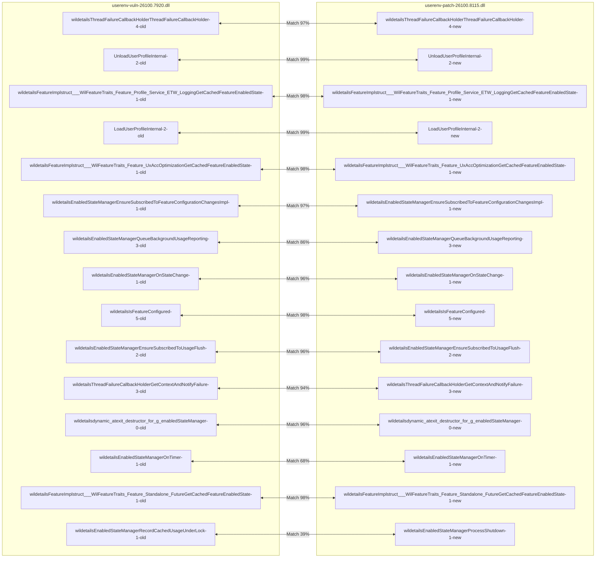
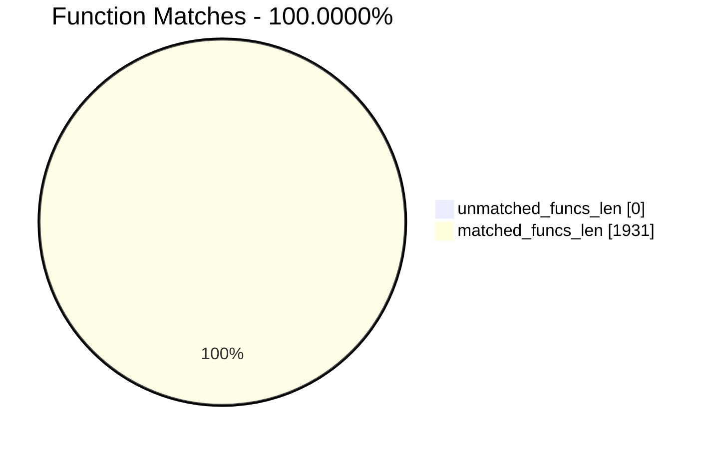
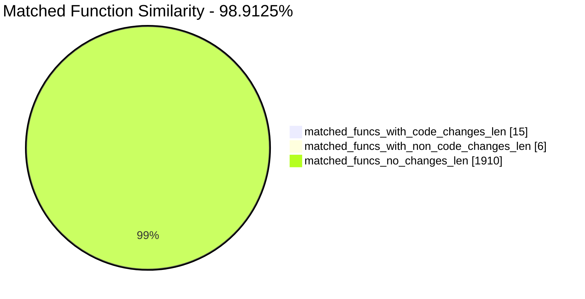
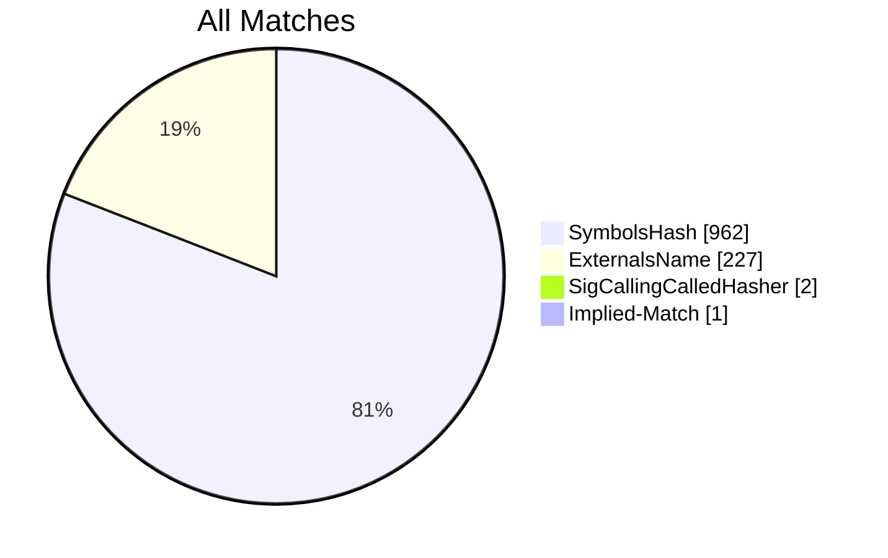
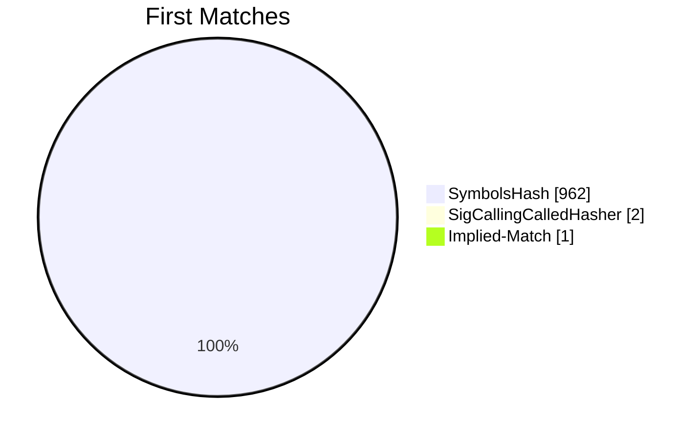
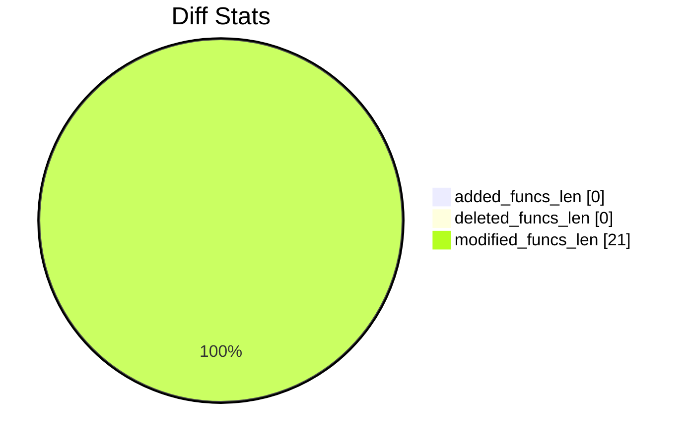

# userenv-vuln-26100.7920.dll-userenv-patch-26100.8115.dll Diff

# TOC

* [Visual Chart Diff](#visual-chart-diff)
* [Metadata](#metadata)
	* [Ghidra Diff Engine](#ghidra-diff-engine)
		* [Command Line](#command-line)
	* [Binary Metadata Diff](#binary-metadata-diff)
	* [Program Options](#program-options)
	* [Diff Stats](#diff-stats)
	* [Strings](#strings)
* [Deleted](#deleted)
* [Added](#added)
* [Modified](#modified)
	* [wil::details::ThreadFailureCallbackHolder::ThreadFailureCallbackHolder](#wildetailsthreadfailurecallbackholderthreadfailurecallbackholder)
	* [UnloadUserProfileInternal](#unloaduserprofileinternal)
	* [wil::details::FeatureImpl<struct___WilFeatureTraits_Feature_Profile_Service_ETW_Logging>::GetCachedFeatureEnabledState](#wildetailsfeatureimplstruct___wilfeaturetraits_feature_profile_service_etw_logginggetcachedfeatureenabledstate)
	* [LoadUserProfileInternal](#loaduserprofileinternal)
	* [wil::details::FeatureImpl<struct___WilFeatureTraits_Feature_UxAccOptimization>::GetCachedFeatureEnabledState](#wildetailsfeatureimplstruct___wilfeaturetraits_feature_uxaccoptimizationgetcachedfeatureenabledstate)
	* [wil::details::EnabledStateManager::EnsureSubscribedToFeatureConfigurationChangesImpl](#wildetailsenabledstatemanagerensuresubscribedtofeatureconfigurationchangesimpl)
	* [wil::details::EnabledStateManager::QueueBackgroundUsageReporting](#wildetailsenabledstatemanagerqueuebackgroundusagereporting)
	* [wil::details::EnabledStateManager::OnStateChange](#wildetailsenabledstatemanageronstatechange)
	* [wil::details::IsFeatureConfigured](#wildetailsisfeatureconfigured)
	* [wil::details::EnabledStateManager::EnsureSubscribedToUsageFlush](#wildetailsenabledstatemanagerensuresubscribedtousageflush)
	* [wil::details::ThreadFailureCallbackHolder::GetContextAndNotifyFailure](#wildetailsthreadfailurecallbackholdergetcontextandnotifyfailure)
	* [wil::details::`dynamic_atexit_destructor_for_'g_enabledStateManager''](#wildetailsdynamic_atexit_destructor_for_g_enabledstatemanager)
	* [wil::details::EnabledStateManager::OnTimer](#wildetailsenabledstatemanagerontimer)
	* [wil::details::FeatureImpl<struct___WilFeatureTraits_Feature_Standalone_Future>::GetCachedFeatureEnabledState](#wildetailsfeatureimplstruct___wilfeaturetraits_feature_standalone_futuregetcachedfeatureenabledstate)
	* [wil::details::EnabledStateManager::RecordCachedUsageUnderLock](#wildetailsenabledstatemanagerrecordcachedusageunderlock)
* [Modified (No Code Changes)](#modified-no-code-changes)
	* [API-MS-WIN-CORE-SYNCH-L1-1-0.DLL::AcquireSRWLockExclusive](#api-ms-win-core-synch-l1-1-0dllacquiresrwlockexclusive)
	* [~unique_storage<struct_wil::details::resource_policy<struct__TP_TIMER*___ptr64,void_(__cdecl*)(struct__TP_TIMER*___ptr64),&public:_static_void___cdecl_wil::details::DestroyThreadPoolTimer<struct_wil::details::SystemThreadPoolMethods,0>::Destroy(struct__TP_TIMER*___ptr64),struct_wistd::integral_constant<unsigned___int64,0>,struct__TP_TIMER*___ptr64,struct__TP_TIMER*___ptr64,0,std::nullptr_t>_>](#unique_storagestruct_wildetailsresource_policystruct__tp_timer___ptr64void___cdeclstruct__tp_timer___ptr64public_static_void___cdecl_wildetailsdestroythreadpooltimerstruct_wildetailssystemthreadpoolmethods0destroystruct__tp_timer___ptr64struct_wistdintegral_constantunsigned___int640struct__tp_timer___ptr64struct__tp_timer___ptr640stdnullptr_t_)
	* [ProcessShutdownInProgress](#processshutdowninprogress)
	* [reset](#reset)
	* [~unique_storage<struct_wil::details::resource_policy<struct__RTL_SRWLOCK*___ptr64,void_(__cdecl*)(struct__RTL_SRWLOCK*___ptr64),&void___cdecl_ReleaseSRWLockExclusive(struct__RTL_SRWLOCK*___ptr64),struct_wistd::integral_constant<unsigned___int64,1>,struct__RTL_SRWLOCK*___ptr64,struct__RTL_SRWLOCK*___ptr64,0,std::nullptr_t>_>](#unique_storagestruct_wildetailsresource_policystruct__rtl_srwlock___ptr64void___cdeclstruct__rtl_srwlock___ptr64void___cdecl_releasesrwlockexclusivestruct__rtl_srwlock___ptr64struct_wistdintegral_constantunsigned___int641struct__rtl_srwlock___ptr64struct__rtl_srwlock___ptr640stdnullptr_t_)

# Visual Chart Diff










# Metadata

## Ghidra Diff Engine

### Command Line

#### Captured Command Line


```
ghidriff --project-location ghidra-proj-userenv --project-name CVE-25187-userenv --symbols-path symbols --gzfs-path gzfs --threaded --log-level INFO --file-log-level INFO --log-path ghidriff.log --min-func-len 10 --gdt [] --bsim --max-ram-percent 60.0 --max-section-funcs 200 userenv-vuln-26100.7920.dll userenv-patch-26100.8115.dll
```


#### Verbose Args


<details>

```
--old ['userenv-vuln-26100.7920.dll'] --new [['userenv-patch-26100.8115.dll']] --engine VersionTrackingDiff --output-path diffs/userenv --summary False --project-location ghidra-proj-userenv --project-name CVE-25187-userenv --symbols-path symbols --gzfs-path gzfs --base-address None --program-options None --threaded True --force-analysis False --force-diff False --no-symbols False --log-level INFO --file-log-level INFO --log-path ghidriff.log --va False --min-func-len 10 --use-calling-counts False --gdt [] --bsim True --bsim-full False --max-ram-percent 60.0 --print-flags False --jvm-args None --side-by-side False --max-section-funcs 200 --md-title None
```


</details>

#### Download Original PEs


```
wget https://msdl.microsoft.com/download/symbols/userenv.dll/B36A3F3332000/userenv.dll -O userenv.dll.x64.10.0.26100.7920
wget https://msdl.microsoft.com/download/symbols/userenv.dll/86BF430033000/userenv.dll -O userenv.dll.x64.10.0.26100.8115
```


## Binary Metadata Diff


```diff
--- userenv-vuln-26100.7920.dll Meta
+++ userenv-patch-26100.8115.dll Meta
@@ -1,44 +1,44 @@
-Program Name: userenv-vuln-26100.7920.dll
+Program Name: userenv-patch-26100.8115.dll
 Language ID: x86:LE:64:default (4.6)
 Compiler ID: windows
 Processor: x86
 Endian: Little
 Address Size: 64
 Minimum Address: 180000000
 Maximum Address: ff0000184f
-# of Bytes: 211024
+# of Bytes: 215120
 # of Memory Blocks: 10
-# of Instructions: 27011
-# of Defined Data: 2931
-# of Functions: 965
-# of Symbols: 7701
-# of Data Types: 976
+# of Instructions: 27062
+# of Defined Data: 2934
+# of Functions: 966
+# of Symbols: 7712
+# of Data Types: 977
 # of Data Type Categories: 94
 Analyzed: true
 Compiler: visualstudio:unknown
 Created With Ghidra Version: 12.0.4
-Date Created: Fri Apr 24 10:13:05 AST 2026
+Date Created: Fri Apr 24 10:13:07 AST 2026
 Executable Format: Portable Executable (PE)
-Executable Location: /home/cve/repos/win11-forge/lab/CVE-2026-25187/userenv-vuln-26100.7920.dll
-Executable MD5: 3a3f02ba5a903bd4744e6b8779cd4b06
-Executable SHA256: afd30c3e785dedf8d5feb2a289fb9ba2d7627ac976daaf618d4d0d2973fc901c
-FSRL: file:///home/cve/repos/win11-forge/lab/CVE-2026-25187/userenv-vuln-26100.7920.dll?MD5=3a3f02ba5a903bd4744e6b8779cd4b06
+Executable Location: /home/cve/repos/win11-forge/lab/CVE-2026-25187/userenv-patch-26100.8115.dll
+Executable MD5: 3133cf45a410a3bab6e41e133f26dbe0
+Executable SHA256: fbd271defda2e636fa860f31090249c9141ccf9acc659828892f1abd341d68c7
+FSRL: file:///home/cve/repos/win11-forge/lab/CVE-2026-25187/userenv-patch-26100.8115.dll?MD5=3133cf45a410a3bab6e41e133f26dbe0
 PDB Age: 1
 PDB File: userenv.pdb
-PDB GUID: 4dc94fd2-43f8-494a-d234-9893cf1e8bb5
+PDB GUID: d608a1a5-7be5-3912-6153-fda6244a4530
 PDB Loaded: true
 PDB Version: RSDS
 PE Property[CompanyName]: Microsoft Corporation
 PE Property[FileDescription]: Userenv
-PE Property[FileVersion]: 10.0.26100.7920 (WinBuild.160101.0800)
+PE Property[FileVersion]: 10.0.26100.8115 (WinBuild.160101.0800)
 PE Property[InternalName]: userenv
 PE Property[LegalCopyright]: © Microsoft Corporation. All rights reserved.
 PE Property[OriginalFilename]: userenv.dll
 PE Property[ProductName]: Microsoft® Windows® Operating System
-PE Property[ProductVersion]: 10.0.26100.7920
+PE Property[ProductVersion]: 10.0.26100.8115
 PE Property[Translation]: 4b00409
 Preferred Root Namespace Category: 
 RTTI Found: true
 Relocatable: true
 SectionAlignment: 4096
 Should Ask To Analyze: false

```


## Program Options


<details>
<summary>Ghidra userenv-vuln-26100.7920.dll Decompiler Options</summary>


|Decompiler Option|Value|
| :---: | :---: |
|Prototype Evaluation|__fastcall|

</details>


<details>
<summary>Ghidra userenv-vuln-26100.7920.dll Specification extensions Options</summary>


|Specification extensions Option|Value|
| :---: | :---: |
|FormatVersion|0|
|VersionCounter|0|

</details>


<details>
<summary>Ghidra userenv-vuln-26100.7920.dll Analyzers Options</summary>


|Analyzers Option|Value|
| :---: | :---: |
|ASCII Strings|true|
|ASCII Strings.Create Strings Containing Existing Strings|true|
|ASCII Strings.Create Strings Containing References|true|
|ASCII Strings.Force Model Reload|false|
|ASCII Strings.Minimum String Length|LEN_5|
|ASCII Strings.Model File|StringModel.sng|
|ASCII Strings.Require Null Termination for String|true|
|ASCII Strings.Search Only in Accessible Memory Blocks|true|
|ASCII Strings.String Start Alignment|ALIGN_1|
|ASCII Strings.String end alignment|4|
|Aggressive Instruction Finder|false|
|Aggressive Instruction Finder.Create Analysis Bookmarks|true|
|Apply Data Archives|true|
|Apply Data Archives.Archive Chooser|[Auto-Detect]|
|Apply Data Archives.Create Analysis Bookmarks|true|
|Apply Data Archives.GDT User File Archive Path|None|
|Apply Data Archives.User Project Archive Path|None|
|Call Convention ID|true|
|Call Convention ID.Analysis Decompiler Timeout (sec)|60|
|Call-Fixup Installer|true|
|Condense Filler Bytes|false|
|Condense Filler Bytes.Filler Value|Auto|
|Condense Filler Bytes.Minimum number of sequential bytes|1|
|Create Address Tables|true|
|Create Address Tables.Allow Offcut References|false|
|Create Address Tables.Auto Label Table|false|
|Create Address Tables.Create Analysis Bookmarks|true|
|Create Address Tables.Maxmimum Pointer Distance|16777215|
|Create Address Tables.Minimum Pointer Address|4132|
|Create Address Tables.Minimum Table Size|2|
|Create Address Tables.Pointer Alignment|1|
|Create Address Tables.Relocation Table Guide|true|
|Create Address Tables.Table Alignment|4|
|Data Reference|true|
|Data Reference.Address Table Alignment|1|
|Data Reference.Address Table Minimum Size|2|
|Data Reference.Align End of Strings|false|
|Data Reference.Ascii String References|true|
|Data Reference.Create Address Tables|true|
|Data Reference.Minimum String Length|5|
|Data Reference.References to Pointers|true|
|Data Reference.Relocation Table Guide|true|
|Data Reference.Respect Execute Flag|true|
|Data Reference.Subroutine References|true|
|Data Reference.Switch Table References|false|
|Data Reference.Unicode String References|true|
|Decompiler Parameter ID|true|
|Decompiler Parameter ID.Analysis Clear Level|ANALYSIS|
|Decompiler Parameter ID.Analysis Decompiler Timeout (sec)|60|
|Decompiler Parameter ID.Commit Data Types|true|
|Decompiler Parameter ID.Commit Void Return Values|false|
|Decompiler Parameter ID.Prototype Evaluation|__fastcall|
|Decompiler Switch Analysis|true|
|Decompiler Switch Analysis.Analysis Decompiler Timeout (sec)|60|
|Demangler Microsoft|true|
|Demangler Microsoft.Apply Function Calling Conventions|true|
|Demangler Microsoft.Apply Function Signatures|true|
|Demangler Microsoft.C-Style Symbol Interpretation|FUNCTION_IF_EXISTS|
|Demangler Microsoft.Demangle Only Known Mangled Symbols|false|
|Disassemble Entry Points|true|
|Disassemble Entry Points.Respect Execute Flag|true|
|Embedded Media|true|
|Embedded Media.Create Analysis Bookmarks|true|
|External Entry References|true|
|Function ID|true|
|Function ID.Always Apply FID Labels|false|
|Function ID.Create Analysis Bookmarks|true|
|Function ID.Instruction Count Threshold|14.6|
|Function ID.Multiple Match Threshold|30.0|
|Function Start Search|true|
|Function Start Search.Bookmark Functions|false|
|Function Start Search.Search Data Blocks|false|
|Non-Returning Functions - Discovered|true|
|Non-Returning Functions - Discovered.Create Analysis Bookmarks|true|
|Non-Returning Functions - Discovered.Function Non-return Threshold|3|
|Non-Returning Functions - Discovered.Repair Flow Damage|true|
|Non-Returning Functions - Known|true|
|Non-Returning Functions - Known.Create Analysis Bookmarks|true|
|PDB MSDIA|false|
|PDB MSDIA.Search untrusted symbol servers|false|
|PDB Universal|true|
|PDB Universal.Import Source Line Info|true|
|PDB Universal.Search untrusted symbol servers|false|
|Reference|true|
|Reference.Address Table Alignment|1|
|Reference.Address Table Minimum Size|2|
|Reference.Align End of Strings|false|
|Reference.Ascii String References|true|
|Reference.Create Address Tables|true|
|Reference.Minimum String Length|5|
|Reference.References to Pointers|true|
|Reference.Relocation Table Guide|true|
|Reference.Respect Execute Flag|true|
|Reference.Subroutine References|true|
|Reference.Switch Table References|false|
|Reference.Unicode String References|true|
|Scalar Operand References|true|
|Scalar Operand References.Relocation Table Guide|true|
|Shared Return Calls|true|
|Shared Return Calls.Allow Conditional Jumps|false|
|Shared Return Calls.Assume Contiguous Functions Only|true|
|Stack|true|
|Stack.Create Local Variables|true|
|Stack.Create Param Variables|false|
|Stack.Max Threads|2|
|Subroutine References|true|
|Subroutine References.Create Thunks Early|true|
|Variadic Function Signature Override|false|
|Variadic Function Signature Override.Create Analysis Bookmarks|false|
|Windows x86 PE Exception Handling|true|
|Windows x86 PE RTTI Analyzer|true|
|Windows x86 Thread Environment Block (TEB) Analyzer|true|
|Windows x86 Thread Environment Block (TEB) Analyzer.Starting Address of the TEB||
|Windows x86 Thread Environment Block (TEB) Analyzer.Windows OS Version|Windows 7|
|WindowsPE x86 Propagate External Parameters|false|
|WindowsResourceReference|true|
|WindowsResourceReference.Create Analysis Bookmarks|true|
|x86 Constant Reference Analyzer|true|
|x86 Constant Reference Analyzer.Create Data from pointer|false|
|x86 Constant Reference Analyzer.Function parameter/return Pointer analysis|true|
|x86 Constant Reference Analyzer.Max Threads|2|
|x86 Constant Reference Analyzer.Min absolute reference|4|
|x86 Constant Reference Analyzer.Require pointer param data type|false|
|x86 Constant Reference Analyzer.Speculative reference max|256|
|x86 Constant Reference Analyzer.Speculative reference min|1024|
|x86 Constant Reference Analyzer.Stored Value Pointer analysis|true|
|x86 Constant Reference Analyzer.Trust values read from writable memory|true|

</details>


<details>
<summary>Ghidra userenv-patch-26100.8115.dll Decompiler Options</summary>


|Decompiler Option|Value|
| :---: | :---: |
|Prototype Evaluation|__fastcall|

</details>


<details>
<summary>Ghidra userenv-patch-26100.8115.dll Specification extensions Options</summary>


|Specification extensions Option|Value|
| :---: | :---: |
|FormatVersion|0|
|VersionCounter|0|

</details>


<details>
<summary>Ghidra userenv-patch-26100.8115.dll Analyzers Options</summary>


|Analyzers Option|Value|
| :---: | :---: |
|ASCII Strings|true|
|ASCII Strings.Create Strings Containing Existing Strings|true|
|ASCII Strings.Create Strings Containing References|true|
|ASCII Strings.Force Model Reload|false|
|ASCII Strings.Minimum String Length|LEN_5|
|ASCII Strings.Model File|StringModel.sng|
|ASCII Strings.Require Null Termination for String|true|
|ASCII Strings.Search Only in Accessible Memory Blocks|true|
|ASCII Strings.String Start Alignment|ALIGN_1|
|ASCII Strings.String end alignment|4|
|Aggressive Instruction Finder|false|
|Aggressive Instruction Finder.Create Analysis Bookmarks|true|
|Apply Data Archives|true|
|Apply Data Archives.Archive Chooser|[Auto-Detect]|
|Apply Data Archives.Create Analysis Bookmarks|true|
|Apply Data Archives.GDT User File Archive Path|None|
|Apply Data Archives.User Project Archive Path|None|
|Call Convention ID|true|
|Call Convention ID.Analysis Decompiler Timeout (sec)|60|
|Call-Fixup Installer|true|
|Condense Filler Bytes|false|
|Condense Filler Bytes.Filler Value|Auto|
|Condense Filler Bytes.Minimum number of sequential bytes|1|
|Create Address Tables|true|
|Create Address Tables.Allow Offcut References|false|
|Create Address Tables.Auto Label Table|false|
|Create Address Tables.Create Analysis Bookmarks|true|
|Create Address Tables.Maxmimum Pointer Distance|16777215|
|Create Address Tables.Minimum Pointer Address|4132|
|Create Address Tables.Minimum Table Size|2|
|Create Address Tables.Pointer Alignment|1|
|Create Address Tables.Relocation Table Guide|true|
|Create Address Tables.Table Alignment|4|
|Data Reference|true|
|Data Reference.Address Table Alignment|1|
|Data Reference.Address Table Minimum Size|2|
|Data Reference.Align End of Strings|false|
|Data Reference.Ascii String References|true|
|Data Reference.Create Address Tables|true|
|Data Reference.Minimum String Length|5|
|Data Reference.References to Pointers|true|
|Data Reference.Relocation Table Guide|true|
|Data Reference.Respect Execute Flag|true|
|Data Reference.Subroutine References|true|
|Data Reference.Switch Table References|false|
|Data Reference.Unicode String References|true|
|Decompiler Parameter ID|true|
|Decompiler Parameter ID.Analysis Clear Level|ANALYSIS|
|Decompiler Parameter ID.Analysis Decompiler Timeout (sec)|60|
|Decompiler Parameter ID.Commit Data Types|true|
|Decompiler Parameter ID.Commit Void Return Values|false|
|Decompiler Parameter ID.Prototype Evaluation|__fastcall|
|Decompiler Switch Analysis|true|
|Decompiler Switch Analysis.Analysis Decompiler Timeout (sec)|60|
|Demangler Microsoft|true|
|Demangler Microsoft.Apply Function Calling Conventions|true|
|Demangler Microsoft.Apply Function Signatures|true|
|Demangler Microsoft.C-Style Symbol Interpretation|FUNCTION_IF_EXISTS|
|Demangler Microsoft.Demangle Only Known Mangled Symbols|false|
|Disassemble Entry Points|true|
|Disassemble Entry Points.Respect Execute Flag|true|
|Embedded Media|true|
|Embedded Media.Create Analysis Bookmarks|true|
|External Entry References|true|
|Function ID|true|
|Function ID.Always Apply FID Labels|false|
|Function ID.Create Analysis Bookmarks|true|
|Function ID.Instruction Count Threshold|14.6|
|Function ID.Multiple Match Threshold|30.0|
|Function Start Search|true|
|Function Start Search.Bookmark Functions|false|
|Function Start Search.Search Data Blocks|false|
|Non-Returning Functions - Discovered|true|
|Non-Returning Functions - Discovered.Create Analysis Bookmarks|true|
|Non-Returning Functions - Discovered.Function Non-return Threshold|3|
|Non-Returning Functions - Discovered.Repair Flow Damage|true|
|Non-Returning Functions - Known|true|
|Non-Returning Functions - Known.Create Analysis Bookmarks|true|
|PDB MSDIA|false|
|PDB MSDIA.Search untrusted symbol servers|false|
|PDB Universal|true|
|PDB Universal.Import Source Line Info|true|
|PDB Universal.Search untrusted symbol servers|false|
|Reference|true|
|Reference.Address Table Alignment|1|
|Reference.Address Table Minimum Size|2|
|Reference.Align End of Strings|false|
|Reference.Ascii String References|true|
|Reference.Create Address Tables|true|
|Reference.Minimum String Length|5|
|Reference.References to Pointers|true|
|Reference.Relocation Table Guide|true|
|Reference.Respect Execute Flag|true|
|Reference.Subroutine References|true|
|Reference.Switch Table References|false|
|Reference.Unicode String References|true|
|Scalar Operand References|true|
|Scalar Operand References.Relocation Table Guide|true|
|Shared Return Calls|true|
|Shared Return Calls.Allow Conditional Jumps|false|
|Shared Return Calls.Assume Contiguous Functions Only|true|
|Stack|true|
|Stack.Create Local Variables|true|
|Stack.Create Param Variables|false|
|Stack.Max Threads|2|
|Subroutine References|true|
|Subroutine References.Create Thunks Early|true|
|Variadic Function Signature Override|false|
|Variadic Function Signature Override.Create Analysis Bookmarks|false|
|Windows x86 PE Exception Handling|true|
|Windows x86 PE RTTI Analyzer|true|
|Windows x86 Thread Environment Block (TEB) Analyzer|true|
|Windows x86 Thread Environment Block (TEB) Analyzer.Starting Address of the TEB||
|Windows x86 Thread Environment Block (TEB) Analyzer.Windows OS Version|Windows 7|
|WindowsPE x86 Propagate External Parameters|false|
|WindowsResourceReference|true|
|WindowsResourceReference.Create Analysis Bookmarks|true|
|x86 Constant Reference Analyzer|true|
|x86 Constant Reference Analyzer.Create Data from pointer|false|
|x86 Constant Reference Analyzer.Function parameter/return Pointer analysis|true|
|x86 Constant Reference Analyzer.Max Threads|2|
|x86 Constant Reference Analyzer.Min absolute reference|4|
|x86 Constant Reference Analyzer.Require pointer param data type|false|
|x86 Constant Reference Analyzer.Speculative reference max|256|
|x86 Constant Reference Analyzer.Speculative reference min|1024|
|x86 Constant Reference Analyzer.Stored Value Pointer analysis|true|
|x86 Constant Reference Analyzer.Trust values read from writable memory|true|

</details>

## Diff Stats


|Stat|Value|
| :---: | :---: |
|added_funcs_len|0|
|deleted_funcs_len|0|
|modified_funcs_len|21|
|added_symbols_len|0|
|deleted_symbols_len|0|
|diff_time|10.010193586349487|
|deleted_strings_len|0|
|added_strings_len|0|
|match_types|Counter({'SymbolsHash': 962, 'ExternalsName': 227, 'SigCallingCalledHasher': 2, 'Implied Match': 1})|
|items_to_process|21|
|diff_types|Counter({'address': 18, 'code': 15, 'length': 15, 'refcount': 7, 'calling': 6, 'called': 2, 'sig': 2, 'name': 1, 'fullname': 1})|
|unmatched_funcs_len|0|
|total_funcs_len|1931|
|matched_funcs_len|1931|
|matched_funcs_with_code_changes_len|15|
|matched_funcs_with_non_code_changes_len|6|
|matched_funcs_no_changes_len|1910|
|match_func_similarity_percent|98.9125%|
|func_match_overall_percent|100.0000%|
|first_matches|Counter({'SymbolsHash': 962, 'SigCallingCalledHasher': 2, 'Implied Match': 1})|











```mermaid
pie showData
    title Symbols
"added_symbols_len" : 0
"deleted_symbols_len" : 0
```

## Strings


*No string differences found*

# Deleted

# Added

# Modified


*Modified functions contain code changes*
## wil::details::ThreadFailureCallbackHolder::ThreadFailureCallbackHolder

### Match Info


|Key|userenv-vuln-26100.7920.dll - userenv-patch-26100.8115.dll|
| :---: | :---: |
|diff_type|code,length,address|
|ratio|0.96|
|i_ratio|0.91|
|m_ratio|0.97|
|b_ratio|0.97|
|match_types|SymbolsHash|

### Function Meta Diff


|Key|userenv-vuln-26100.7920.dll|userenv-patch-26100.8115.dll|
| :---: | :---: | :---: |
|name|ThreadFailureCallbackHolder|ThreadFailureCallbackHolder|
|fullname|wil::details::ThreadFailureCallbackHolder::ThreadFailureCallbackHolder|wil::details::ThreadFailureCallbackHolder::ThreadFailureCallbackHolder|
|refcount|2|2|
|`length`|48|51|
|called|wil::details::ThreadFailureCallbackHolder::StartWatching|wil::details::ThreadFailureCallbackHolder::StartWatching|
|calling|wil::ActivityBase<class_ProfileAPILogging,1,70368744177664,5,16777216,struct__TlgReflectorTag_Param0IsProviderType>::ActivityBase<class_ProfileAPILogging,1,70368744177664,5,16777216,struct__TlgReflectorTag_Param0IsProviderType>|wil::ActivityBase<class_ProfileAPILogging,1,70368744177664,5,16777216,struct__TlgReflectorTag_Param0IsProviderType>::ActivityBase<class_ProfileAPILogging,1,70368744177664,5,16777216,struct__TlgReflectorTag_Param0IsProviderType>|
|paramcount|4|4|
|`address`|180004dac|180004db4|
|sig|undefined __thiscall ThreadFailureCallbackHolder(ThreadFailureCallbackHolder * this, IFailureCallback * param_1, CallContextInfo * param_2, bool param_3)|undefined __thiscall ThreadFailureCallbackHolder(ThreadFailureCallbackHolder * this, IFailureCallback * param_1, CallContextInfo * param_2, bool param_3)|
|sym_type|Function|Function|
|sym_source|ANALYSIS|ANALYSIS|
|external|False|False|

### wil::details::ThreadFailureCallbackHolder::ThreadFailureCallbackHolder Diff


```diff
--- wil::details::ThreadFailureCallbackHolder::ThreadFailureCallbackHolder
+++ wil::details::ThreadFailureCallbackHolder::ThreadFailureCallbackHolder
@@ -1,21 +1,22 @@
 
 /* public: __cdecl wil::details::ThreadFailureCallbackHolder::ThreadFailureCallbackHolder(struct
    wil::details::IFailureCallback * __ptr64,struct wil::CallContextInfo * __ptr64,bool) __ptr64 */
 
 ThreadFailureCallbackHolder * __thiscall
 wil::details::ThreadFailureCallbackHolder::ThreadFailureCallbackHolder
           (ThreadFailureCallbackHolder *this,IFailureCallback *param_1,CallContextInfo *param_2,
           bool param_3)
 
 {
   *(undefined8 *)this = 0;
   *(IFailureCallback **)(this + 8) = param_1;
   *(undefined8 *)(this + 0x10) = 0;
   *(undefined4 *)(this + 0x18) = 0;
   *(CallContextInfo **)(this + 0x20) = param_2;
+  this[0x28] = (ThreadFailureCallbackHolder)0x0;
   if (param_3) {
     StartWatching(this);
   }
   return this;
 }
 

```


## UnloadUserProfileInternal

### Match Info


|Key|userenv-vuln-26100.7920.dll - userenv-patch-26100.8115.dll|
| :---: | :---: |
|diff_type|code,length|
|ratio|0.63|
|i_ratio|0.58|
|m_ratio|0.99|
|b_ratio|0.99|
|match_types|SymbolsHash|

### Function Meta Diff


|Key|userenv-vuln-26100.7920.dll|userenv-patch-26100.8115.dll|
| :---: | :---: | :---: |
|name|UnloadUserProfileInternal|UnloadUserProfileInternal|
|fullname|UnloadUserProfileInternal|UnloadUserProfileInternal|
|refcount|2|2|
|`length`|301|311|
|called|API-MS-WIN-CORE-REGISTRY-L1-1-0.DLL::RegCloseKey<br>GetSidString<br>IsServiceSid<br>Windows::Internal::NativeString<class_Windows::Internal::ProcessHeapMemPolicy<unsigned_short>_>::_Free<br>_LoadUnloadUserProfileClient<br>wil::details::ThreadFailureCallbackHolder::StartWatching<br>wil::details::ThreadFailureCallbackHolder::~ThreadFailureCallbackHolder<br>wil::details::in1diag3::Return_Hr|API-MS-WIN-CORE-REGISTRY-L1-1-0.DLL::RegCloseKey<br>GetSidString<br>IsServiceSid<br>Windows::Internal::NativeString<class_Windows::Internal::ProcessHeapMemPolicy<unsigned_short>_>::_Free<br>_LoadUnloadUserProfileClient<br>wil::details::ThreadFailureCallbackHolder::StartWatching<br>wil::details::ThreadFailureCallbackHolder::~ThreadFailureCallbackHolder<br>wil::details::in1diag3::Return_Hr|
|calling|UnloadUserProfile|UnloadUserProfile|
|paramcount|2|2|
|address|180004c74|180004c74|
|sig|long __cdecl UnloadUserProfileInternal(void * param_1, void * param_2)|long __cdecl UnloadUserProfileInternal(void * param_1, void * param_2)|
|sym_type|Function|Function|
|sym_source|ANALYSIS|ANALYSIS|
|external|False|False|

### UnloadUserProfileInternal Diff


```diff
--- UnloadUserProfileInternal
+++ UnloadUserProfileInternal
@@ -1,71 +1,73 @@
 
 /* long __cdecl UnloadUserProfileInternal(void * __ptr64,void * __ptr64) */
 
 long __cdecl UnloadUserProfileInternal(void *param_1,void *param_2)
 
 {
   LSTATUS LVar1;
   long lVar2;
   int iVar3;
   long lVar4;
   void *unaff_retaddr;
-  ushort *local_58;
-  undefined8 local_50;
-  undefined8 local_48;
-  undefined **local_40 [2];
-  undefined8 local_30;
-  undefined ***local_28;
-  undefined8 local_20;
-  undefined4 local_18;
-  undefined8 local_10;
+  ushort *local_68;
+  undefined8 local_60;
+  undefined8 local_58;
+  undefined **local_48 [2];
+  undefined8 local_38;
+  undefined ***local_30;
+  undefined8 local_28;
+  undefined4 local_20;
+  undefined8 local_18;
+  undefined1 local_10;
   
   if ((((longlong)param_1 - 1U < 0xfffffffffffffffe) &&
       ((longlong)param_2 - 1U < 0xfffffffffffffffe)) && (LVar1 = RegCloseKey(param_2), LVar1 == 0))
   {
-    local_58 = (ushort *)0x0;
-    local_50 = 0;
-    local_48 = 0;
+    local_68 = (ushort *)0x0;
+    local_60 = 0;
+    local_58 = 0;
     Windows::Internal::NativeString<class_Windows::Internal::ProcessHeapMemPolicy<unsigned_short>_>
     ::_Free((NativeString<class_Windows::Internal::ProcessHeapMemPolicy<unsigned_short>_> *)
-            &local_58);
-    local_50 = 0xffffffffffffffff;
-    local_48 = 0xffffffffffffffff;
-    lVar2 = GetSidString(param_1,&local_58);
+            &local_68);
+    local_60 = 0xffffffffffffffff;
+    local_58 = 0xffffffffffffffff;
+    lVar2 = GetSidString(param_1,&local_68);
     lVar4 = -0x7ff8fffa;
     if (lVar2 != -0x7ff8fffa) {
       if (lVar2 < 0) {
         wil::details::in1diag3::Return_Hr
                   (unaff_retaddr,0x154,
                    "onecore\\ds\\security\\gina\\profile\\userenv\\dll\\profrpc.cpp",lVar2);
         lVar4 = lVar2;
       }
       else {
-        local_40[0] = &PTR_NotifyFailure_18001e008;
-        local_30 = 0;
-        local_28 = local_40;
+        local_48[0] = &PTR_NotifyFailure_18001e008;
+        local_38 = 0;
+        local_30 = local_48;
+        local_28 = 0;
         local_20 = 0;
         local_18 = 0;
         local_10 = 0;
         wil::details::ThreadFailureCallbackHolder::StartWatching
-                  ((ThreadFailureCallbackHolder *)&local_30);
-        iVar3 = IsServiceSid(local_58);
+                  ((ThreadFailureCallbackHolder *)&local_38);
+        iVar3 = IsServiceSid(local_68);
         if ((iVar3 == 0) &&
            (lVar4 = _LoadUnloadUserProfileClient(true,param_1,(_PROFILEINFOW *)0x0), lVar4 < 0)) {
           wil::details::ThreadFailureCallbackHolder::~ThreadFailureCallbackHolder
-                    ((ThreadFailureCallbackHolder *)&local_30);
+                    ((ThreadFailureCallbackHolder *)&local_38);
         }
         else {
           wil::details::ThreadFailureCallbackHolder::~ThreadFailureCallbackHolder
-                    ((ThreadFailureCallbackHolder *)&local_30);
+                    ((ThreadFailureCallbackHolder *)&local_38);
           lVar4 = 0;
         }
       }
     }
     Windows::Internal::NativeString<class_Windows::Internal::ProcessHeapMemPolicy<unsigned_short>_>
     ::_Free((NativeString<class_Windows::Internal::ProcessHeapMemPolicy<unsigned_short>_> *)
-            &local_58);
+            &local_68);
     return lVar4;
   }
   return -0x7ff8fffa;
 }
 

```


## wil::details::FeatureImpl<struct___WilFeatureTraits_Feature_Profile_Service_ETW_Logging>::GetCachedFeatureEnabledState

### Match Info


|Key|userenv-vuln-26100.7920.dll - userenv-patch-26100.8115.dll|
| :---: | :---: |
|diff_type|code,length,address|
|ratio|0.97|
|i_ratio|0.77|
|m_ratio|0.99|
|b_ratio|0.98|
|match_types|SymbolsHash|

### Function Meta Diff


|Key|userenv-vuln-26100.7920.dll|userenv-patch-26100.8115.dll|
| :---: | :---: | :---: |
|name|GetCachedFeatureEnabledState|GetCachedFeatureEnabledState|
|fullname|wil::details::FeatureImpl<struct___WilFeatureTraits_Feature_Profile_Service_ETW_Logging>::GetCachedFeatureEnabledState|wil::details::FeatureImpl<struct___WilFeatureTraits_Feature_Profile_Service_ETW_Logging>::GetCachedFeatureEnabledState|
|refcount|3|3|
|`length`|293|294|
|called|API-MS-WIN-CORE-SYNCH-L1-1-0.DLL::AcquireSRWLockExclusive<br>wil::details::EnsureSubscribedToFeatureConfigurationChanges<br>wil::details::FeatureImpl<struct___WilFeatureTraits_Feature_Profile_Service_ETW_Logging>::GetCurrentFeatureEnabledState<br>wil::details::unique_storage<struct_wil::details::resource_policy<struct__RTL_SRWLOCK*___ptr64,void_(__cdecl*)(struct__RTL_SRWLOCK*___ptr64),&void___cdecl_ReleaseSRWLockExclusive(struct__RTL_SRWLOCK*___ptr64),struct_wistd::integral_constant<unsigned___int64,1>,struct__RTL_SRWLOCK*___ptr64,struct__RTL_SRWLOCK*___ptr64,0,std::nullptr_t>_>::~unique_storage<struct_wil::details::resource_policy<struct__RTL_SRWLOCK*___ptr64,void_(__cdecl*)(struct__RTL_SRWLOCK*___ptr64),&void___cdecl_ReleaseSRWLockExclusive(struct__RTL_SRWLOCK*___ptr64),struct_wistd::integral_constant<unsigned___int64,1>,struct__RTL_SRWLOCK*___ptr64,struct__RTL_SRWLOCK*___ptr64,0,std::nullptr_t>_><br>wil::details_abi::heap_buffer::push_back|API-MS-WIN-CORE-SYNCH-L1-1-0.DLL::AcquireSRWLockExclusive<br>wil::details::EnsureSubscribedToFeatureConfigurationChanges<br>wil::details::FeatureImpl<struct___WilFeatureTraits_Feature_Profile_Service_ETW_Logging>::GetCurrentFeatureEnabledState<br>wil::details::unique_storage<struct_wil::details::resource_policy<struct__RTL_SRWLOCK*___ptr64,void_(__cdecl*)(struct__RTL_SRWLOCK*___ptr64),&void___cdecl_ReleaseSRWLockExclusive(struct__RTL_SRWLOCK*___ptr64),struct_wistd::integral_constant<unsigned___int64,1>,struct__RTL_SRWLOCK*___ptr64,struct__RTL_SRWLOCK*___ptr64,0,std::nullptr_t>_>::~unique_storage<struct_wil::details::resource_policy<struct__RTL_SRWLOCK*___ptr64,void_(__cdecl*)(struct__RTL_SRWLOCK*___ptr64),&void___cdecl_ReleaseSRWLockExclusive(struct__RTL_SRWLOCK*___ptr64),struct_wistd::integral_constant<unsigned___int64,1>,struct__RTL_SRWLOCK*___ptr64,struct__RTL_SRWLOCK*___ptr64,0,std::nullptr_t>_><br>wil::details_abi::heap_buffer::push_back|
|calling|wil::details::FeatureImpl<struct___WilFeatureTraits_Feature_Profile_Service_ETW_Logging>::ReportUsage<br>wil::details::FeatureImpl<struct___WilFeatureTraits_Feature_Profile_Service_ETW_Logging>::__private_IsEnabled|wil::details::FeatureImpl<struct___WilFeatureTraits_Feature_Profile_Service_ETW_Logging>::ReportUsage<br>wil::details::FeatureImpl<struct___WilFeatureTraits_Feature_Profile_Service_ETW_Logging>::__private_IsEnabled|
|paramcount|1|1|
|`address`|180016004|180016024|
|sig|wil_details_FeatureStateCache __thiscall GetCachedFeatureEnabledState(FeatureImpl<struct___WilFeatureTraits_Feature_Profile_Service_ETW_Logging> * this)|wil_details_FeatureStateCache __thiscall GetCachedFeatureEnabledState(FeatureImpl<struct___WilFeatureTraits_Feature_Profile_Service_ETW_Logging> * this)|
|sym_type|Function|Function|
|sym_source|ANALYSIS|ANALYSIS|
|external|False|False|

### wil::details::FeatureImpl<struct___WilFeatureTraits_Feature_Profile_Service_ETW_Logging>::GetCachedFeatureEnabledState Diff


```diff
--- wil::details::FeatureImpl<struct___WilFeatureTraits_Feature_Profile_Service_ETW_Logging>::GetCachedFeatureEnabledState
+++ wil::details::FeatureImpl<struct___WilFeatureTraits_Feature_Profile_Service_ETW_Logging>::GetCachedFeatureEnabledState
@@ -1,84 +1,83 @@
 
-/* WARNING: Removing unreachable block (ram,0x000180016056) */
-/* WARNING: Removing unreachable block (ram,0x00018001605c) */
+/* WARNING: Removing unreachable block (ram,0x000180016076) */
+/* WARNING: Removing unreachable block (ram,0x00018001607c) */
+/* WARNING: Globals starting with '_' overlap smaller symbols at the same address */
 /* private: union wil_details_FeatureStateCache __cdecl wil::details::FeatureImpl<struct
    __WilFeatureTraits_Feature_Profile_Service_ETW_Logging>::GetCachedFeatureEnabledState(void)
    __ptr64 */
 
 void __thiscall
 wil::details::FeatureImpl<struct___WilFeatureTraits_Feature_Profile_Service_ETW_Logging>::
 GetCachedFeatureEnabledState
           (FeatureImpl<struct___WilFeatureTraits_Feature_Profile_Service_ETW_Logging> *this)
 
 {
   uint uVar1;
   uint uVar2;
   uint uVar3;
   FeatureImpl<struct___WilFeatureTraits_Feature_Profile_Service_ETW_Logging> *this_00;
   uint uVar4;
   uint *in_RDX;
   bool bVar5;
   uint local_res10 [2];
   undefined *local_res18 [2];
   undefined4 local_38;
   undefined4 local_34;
   FeatureImpl<struct___WilFeatureTraits_Feature_Profile_Service_ETW_Logging> *local_30;
   
   in_RDX[0] = 0;
   in_RDX[1] = 0;
   uVar3 = *(uint *)this;
   *in_RDX = uVar3;
   if (((byte)uVar3 & 6) == 6) {
     return;
   }
   this_00 = this;
   uVar2 = EnsureSubscribedToFeatureConfigurationChanges();
   GetCurrentFeatureEnabledState(this_00,(int *)local_res10);
   uVar3 = *in_RDX;
   do {
     uVar1 = uVar3;
     *in_RDX = uVar1;
     uVar4 = uVar1;
     if ((uVar1 & 4) == 0) {
       uVar4 = uVar1 & 0xfffffbff | local_res10[0] & 0x400 | 4;
       *in_RDX = uVar4;
     }
     LOCK();
     uVar3 = *(uint *)this;
     bVar5 = uVar1 == uVar3;
     if (bVar5) {
       *(uint *)this = uVar4;
       uVar3 = uVar1;
     }
     UNLOCK();
   } while (!bVar5);
-  if (((uVar1 & 4) != 0) ||
-     (g_enabledStateManager == (shutdown_aware_object<class_wil::details::EnabledStateManager>)0x0))
-  goto LAB_0;
+  if (((uVar1 & 4) != 0) || (_g_enabledStateManager == 0)) goto LAB_0;
   AcquireSRWLockExclusive((PSRWLOCK)&DAT_1);
   local_res18[0] = &DAT_1;
   if ((uVar2 == 0) || (uVar2 != DAT_2)) {
 LAB_3:
     LOCK();
     *(uint *)this = *(uint *)this & 0xfffffffb;
     UNLOCK();
   }
   else {
     local_34 = 0;
     local_38 = 3;
     local_30 = this;
     bVar5 = details_abi::heap_buffer::push_back((heap_buffer *)&DAT_4,&local_38,0x10);
     if (!bVar5) goto LAB_3;
   }
   unique_storage<struct_wil::details::resource_policy<struct__RTL_SRWLOCK*___ptr64,void_(__cdecl*)(struct__RTL_SRWLOCK*___ptr64),&void___cdecl_ReleaseSRWLockExclusive(struct__RTL_SRWLOCK*___ptr64),struct_wistd::integral_constant<unsigned___int64,1>,struct__RTL_SRWLOCK*___ptr64,struct__RTL_SRWLOCK*___ptr64,0,std::nullptr_t>_>
   ::
   ~unique_storage<struct_wil::details::resource_policy<struct__RTL_SRWLOCK*___ptr64,void_(__cdecl*)(struct__RTL_SRWLOCK*___ptr64),&void___cdecl_ReleaseSRWLockExclusive(struct__RTL_SRWLOCK*___ptr64),struct_wistd::integral_constant<unsigned___int64,1>,struct__RTL_SRWLOCK*___ptr64,struct__RTL_SRWLOCK*___ptr64,0,std::nullptr_t>_>
             ((unique_storage<struct_wil::details::resource_policy<struct__RTL_SRWLOCK*___ptr64,void_(__cdecl*)(struct__RTL_SRWLOCK*___ptr64),&void___cdecl_ReleaseSRWLockExclusive(struct__RTL_SRWLOCK*___ptr64),struct_wistd::integral_constant<unsigned___int64,1>,struct__RTL_SRWLOCK*___ptr64,struct__RTL_SRWLOCK*___ptr64,0,std::nullptr_t>_>
               *)local_res18);
 LAB_0:
   if ((*in_RDX & 2) == 0) {
     *in_RDX = *in_RDX & 0xfffff63e | local_res10[0] & 0x9c1;
   }
   return;
 }
 

```


## LoadUserProfileInternal

### Match Info


|Key|userenv-vuln-26100.7920.dll - userenv-patch-26100.8115.dll|
| :---: | :---: |
|diff_type|code,length|
|ratio|0.65|
|i_ratio|0.55|
|m_ratio|0.99|
|b_ratio|0.99|
|match_types|SymbolsHash|

### Function Meta Diff


|Key|userenv-vuln-26100.7920.dll|userenv-patch-26100.8115.dll|
| :---: | :---: | :---: |
|name|LoadUserProfileInternal|LoadUserProfileInternal|
|fullname|LoadUserProfileInternal|LoadUserProfileInternal|
|refcount|3|3|
|`length`|648|653|
|called|<details><summary>Expand for full list:<br>API-MS-WIN-CORE-REGISTRY-L1-1-0.DLL::RegOpenKeyExW<br>API-MS-WIN-CORE-STRING-L1-1-0.DLL::CompareStringOrdinal<br>GetSidString<br>PROFAPI.DLL::Ordinal_105<br>Windows::Internal::NativeString<class_Windows::Internal::ProcessHeapMemPolicy<unsigned_short>_>::_Free<br>_LoadUnloadUserProfileClient<br>_ShorterThanMaxPath<br>wil::details::ThreadFailureCallbackHolder::StartWatching<br>wil::details::ThreadFailureCallbackHolder::~ThreadFailureCallbackHolder<br>wil::details::in1diag3::Return_Hr<br>wil::details::in1diag3::Return_Win32</summary></details>|<details><summary>Expand for full list:<br>API-MS-WIN-CORE-REGISTRY-L1-1-0.DLL::RegOpenKeyExW<br>API-MS-WIN-CORE-STRING-L1-1-0.DLL::CompareStringOrdinal<br>GetSidString<br>PROFAPI.DLL::Ordinal_105<br>Windows::Internal::NativeString<class_Windows::Internal::ProcessHeapMemPolicy<unsigned_short>_>::_Free<br>_LoadUnloadUserProfileClient<br>_ShorterThanMaxPath<br>wil::details::ThreadFailureCallbackHolder::StartWatching<br>wil::details::ThreadFailureCallbackHolder::~ThreadFailureCallbackHolder<br>wil::details::in1diag3::Return_Hr<br>wil::details::in1diag3::Return_Win32</summary></details>|
|calling|LoadUserProfileA<br>LoadUserProfileW|LoadUserProfileA<br>LoadUserProfileW|
|paramcount|2|2|
|address|180004604|180004604|
|sig|long __cdecl LoadUserProfileInternal(void * param_1, _PROFILEINFOW * param_2)|long __cdecl LoadUserProfileInternal(void * param_1, _PROFILEINFOW * param_2)|
|sym_type|Function|Function|
|sym_source|ANALYSIS|ANALYSIS|
|external|False|False|

### LoadUserProfileInternal Diff


```diff
--- LoadUserProfileInternal
+++ LoadUserProfileInternal
@@ -1,90 +1,92 @@
 
 /* long __cdecl LoadUserProfileInternal(void * __ptr64,struct _PROFILEINFOW * __ptr64) */
 
 long __cdecl LoadUserProfileInternal(void *param_1,_PROFILEINFOW *param_2)
 
 {
   ushort *puVar1;
   int iVar2;
   long lVar3;
   ulong uVar4;
   void *unaff_retaddr;
   _PROFILEINFOW *local_res10;
-  LPCWSTR local_68;
-  undefined8 local_60;
-  undefined8 local_58;
-  undefined **local_50;
-  _PROFILEINFOW **local_48;
-  undefined8 local_40;
-  undefined ***local_38;
-  undefined8 local_30;
-  undefined4 local_28;
-  undefined8 local_20;
+  LPCWSTR local_78;
+  undefined8 local_70;
+  undefined8 local_68;
+  undefined **local_58;
+  _PROFILEINFOW **local_50;
+  undefined8 local_48;
+  undefined ***local_40;
+  undefined8 local_38;
+  undefined4 local_30;
+  undefined8 local_28;
+  undefined1 local_20;
   
   if (((longlong)param_1 + 1U & 0xfffffffffffffffe) == 0) {
     return -0x7ff8fffa;
   }
   if ((((((param_2 == (_PROFILEINFOW *)0x0) || (*(int *)param_2 != 0x38)) ||
         (puVar1 = *(ushort **)(param_2 + 8), puVar1 == (ushort *)0x0)) ||
        ((*puVar1 == 0 || (((byte)param_2[4] & 2) != 0)))) ||
       ((local_res10 = param_2, iVar2 = _ShorterThanMaxPath(puVar1), iVar2 == 0 ||
        ((iVar2 = _ShorterThanMaxPath(*(ushort **)(local_res10 + 0x10)), iVar2 == 0 ||
         (iVar2 = _ShorterThanMaxPath(*(ushort **)(local_res10 + 0x18)), iVar2 == 0)))))) ||
      ((iVar2 = _ShorterThanMaxPath(*(ushort **)(local_res10 + 0x20)), iVar2 == 0 ||
       (iVar2 = _ShorterThanMaxPath(*(ushort **)(local_res10 + 0x28)), iVar2 == 0)))) {
     return -0x7ff8ffa9;
   }
-  local_68 = (LPCWSTR)0x0;
-  local_60 = 0;
-  local_58 = 0;
+  local_78 = (LPCWSTR)0x0;
+  local_70 = 0;
+  local_68 = 0;
   Windows::Internal::NativeString<class_Windows::Internal::ProcessHeapMemPolicy<unsigned_short>_>::
-  _Free((NativeString<class_Windows::Internal::ProcessHeapMemPolicy<unsigned_short>_> *)&local_68);
-  local_60 = 0xffffffffffffffff;
-  local_58 = 0xffffffffffffffff;
-  lVar3 = GetSidString(param_1,(ushort **)&local_68);
+  _Free((NativeString<class_Windows::Internal::ProcessHeapMemPolicy<unsigned_short>_> *)&local_78);
+  local_70 = 0xffffffffffffffff;
+  local_68 = 0xffffffffffffffff;
+  lVar3 = GetSidString(param_1,(ushort **)&local_78);
   if (lVar3 < 0) goto LAB_0;
-  local_50 = &PTR_NotifyFailure_18001e000;
-  local_48 = &local_res10;
-  local_40 = 0;
-  local_38 = &local_50;
+  local_58 = &PTR_NotifyFailure_18001e000;
+  local_50 = &local_res10;
+  local_48 = 0;
+  local_40 = &local_58;
+  local_38 = 0;
   local_30 = 0;
   local_28 = 0;
   local_20 = 0;
-  wil::details::ThreadFailureCallbackHolder::StartWatching((ThreadFailureCallbackHolder *)&local_40)
+  wil::details::ThreadFailureCallbackHolder::StartWatching((ThreadFailureCallbackHolder *)&local_48)
   ;
-  iVar2 = CompareStringOrdinal(local_68,-1,L"S-1-5-18",-1,1);
+  iVar2 = CompareStringOrdinal(local_78,-1,L"S-1-5-18",-1,1);
   if (iVar2 == 2) {
 LAB_1:
-    uVar4 = RegOpenKeyExW((HKEY)0xffffffff80000003,local_68,0,0xf003f,(PHKEY)(local_res10 + 0x30));
+    uVar4 = RegOpenKeyExW((HKEY)0xffffffff80000003,local_78,0,0xf003f,(PHKEY)(local_res10 + 0x30));
     if (uVar4 == 0) {
       wil::details::ThreadFailureCallbackHolder::~ThreadFailureCallbackHolder
-                ((ThreadFailureCallbackHolder *)&local_40);
+                ((ThreadFailureCallbackHolder *)&local_48);
       lVar3 = 0;
       goto LAB_0;
     }
     lVar3 = wil::details::in1diag3::Return_Win32
                       (unaff_retaddr,0x137,
                        "onecore\\ds\\security\\gina\\profile\\userenv\\dll\\profrpc.cpp",uVar4);
   }
   else {
-    iVar2 = CompareStringOrdinal(local_68,-1,L"S-1-5-19",-1,1);
-    if ((iVar2 == 2) || (iVar2 = CompareStringOrdinal(local_68,-1,L"S-1-5-20",-1,1), iVar2 == 2)) {
+    iVar2 = CompareStringOrdinal(local_78,-1,L"S-1-5-19",-1,1);
+    if ((iVar2 == 2) || (iVar2 = CompareStringOrdinal(local_78,-1,L"S-1-5-20",-1,1), iVar2 == 2)) {
       lVar3 = Ordinal_105(param_1,0);
       if (-1 < lVar3) goto LAB_1;
       wil::details::in1diag3::Return_Hr
                 (unaff_retaddr,0x129,
                  "onecore\\ds\\security\\gina\\profile\\userenv\\dll\\profrpc.cpp",lVar3);
     }
     else {
       lVar3 = _LoadUnloadUserProfileClient(false,param_1,local_res10);
       if (-1 < lVar3) goto LAB_1;
     }
   }
   wil::details::ThreadFailureCallbackHolder::~ThreadFailureCallbackHolder
-            ((ThreadFailureCallbackHolder *)&local_40);
+            ((ThreadFailureCallbackHolder *)&local_48);
 LAB_0:
   Windows::Internal::NativeString<class_Windows::Internal::ProcessHeapMemPolicy<unsigned_short>_>::
-  _Free((NativeString<class_Windows::Internal::ProcessHeapMemPolicy<unsigned_short>_> *)&local_68);
+  _Free((NativeString<class_Windows::Internal::ProcessHeapMemPolicy<unsigned_short>_> *)&local_78);
   return lVar3;
 }
 

```


## wil::details::FeatureImpl<struct___WilFeatureTraits_Feature_UxAccOptimization>::GetCachedFeatureEnabledState

### Match Info


|Key|userenv-vuln-26100.7920.dll - userenv-patch-26100.8115.dll|
| :---: | :---: |
|diff_type|code,length,address|
|ratio|0.97|
|i_ratio|0.77|
|m_ratio|0.99|
|b_ratio|0.98|
|match_types|SymbolsHash|

### Function Meta Diff


|Key|userenv-vuln-26100.7920.dll|userenv-patch-26100.8115.dll|
| :---: | :---: | :---: |
|name|GetCachedFeatureEnabledState|GetCachedFeatureEnabledState|
|fullname|wil::details::FeatureImpl<struct___WilFeatureTraits_Feature_UxAccOptimization>::GetCachedFeatureEnabledState|wil::details::FeatureImpl<struct___WilFeatureTraits_Feature_UxAccOptimization>::GetCachedFeatureEnabledState|
|refcount|3|3|
|`length`|293|294|
|called|API-MS-WIN-CORE-SYNCH-L1-1-0.DLL::AcquireSRWLockExclusive<br>wil::details::EnsureSubscribedToFeatureConfigurationChanges<br>wil::details::FeatureImpl<struct___WilFeatureTraits_Feature_UxAccOptimization>::GetCurrentFeatureEnabledState<br>wil::details::unique_storage<struct_wil::details::resource_policy<struct__RTL_SRWLOCK*___ptr64,void_(__cdecl*)(struct__RTL_SRWLOCK*___ptr64),&void___cdecl_ReleaseSRWLockExclusive(struct__RTL_SRWLOCK*___ptr64),struct_wistd::integral_constant<unsigned___int64,1>,struct__RTL_SRWLOCK*___ptr64,struct__RTL_SRWLOCK*___ptr64,0,std::nullptr_t>_>::~unique_storage<struct_wil::details::resource_policy<struct__RTL_SRWLOCK*___ptr64,void_(__cdecl*)(struct__RTL_SRWLOCK*___ptr64),&void___cdecl_ReleaseSRWLockExclusive(struct__RTL_SRWLOCK*___ptr64),struct_wistd::integral_constant<unsigned___int64,1>,struct__RTL_SRWLOCK*___ptr64,struct__RTL_SRWLOCK*___ptr64,0,std::nullptr_t>_><br>wil::details_abi::heap_buffer::push_back|API-MS-WIN-CORE-SYNCH-L1-1-0.DLL::AcquireSRWLockExclusive<br>wil::details::EnsureSubscribedToFeatureConfigurationChanges<br>wil::details::FeatureImpl<struct___WilFeatureTraits_Feature_UxAccOptimization>::GetCurrentFeatureEnabledState<br>wil::details::unique_storage<struct_wil::details::resource_policy<struct__RTL_SRWLOCK*___ptr64,void_(__cdecl*)(struct__RTL_SRWLOCK*___ptr64),&void___cdecl_ReleaseSRWLockExclusive(struct__RTL_SRWLOCK*___ptr64),struct_wistd::integral_constant<unsigned___int64,1>,struct__RTL_SRWLOCK*___ptr64,struct__RTL_SRWLOCK*___ptr64,0,std::nullptr_t>_>::~unique_storage<struct_wil::details::resource_policy<struct__RTL_SRWLOCK*___ptr64,void_(__cdecl*)(struct__RTL_SRWLOCK*___ptr64),&void___cdecl_ReleaseSRWLockExclusive(struct__RTL_SRWLOCK*___ptr64),struct_wistd::integral_constant<unsigned___int64,1>,struct__RTL_SRWLOCK*___ptr64,struct__RTL_SRWLOCK*___ptr64,0,std::nullptr_t>_><br>wil::details_abi::heap_buffer::push_back|
|calling|wil::details::FeatureImpl<struct___WilFeatureTraits_Feature_UxAccOptimization>::ReportUsage<br>wil::details::FeatureImpl<struct___WilFeatureTraits_Feature_UxAccOptimization>::__private_IsEnabled|wil::details::FeatureImpl<struct___WilFeatureTraits_Feature_UxAccOptimization>::ReportUsage<br>wil::details::FeatureImpl<struct___WilFeatureTraits_Feature_UxAccOptimization>::__private_IsEnabled|
|paramcount|1|1|
|`address`|18001625c|180016284|
|sig|wil_details_FeatureStateCache __thiscall GetCachedFeatureEnabledState(FeatureImpl<struct___WilFeatureTraits_Feature_UxAccOptimization> * this)|wil_details_FeatureStateCache __thiscall GetCachedFeatureEnabledState(FeatureImpl<struct___WilFeatureTraits_Feature_UxAccOptimization> * this)|
|sym_type|Function|Function|
|sym_source|ANALYSIS|ANALYSIS|
|external|False|False|

### wil::details::FeatureImpl<struct___WilFeatureTraits_Feature_UxAccOptimization>::GetCachedFeatureEnabledState Diff


```diff
--- wil::details::FeatureImpl<struct___WilFeatureTraits_Feature_UxAccOptimization>::GetCachedFeatureEnabledState
+++ wil::details::FeatureImpl<struct___WilFeatureTraits_Feature_UxAccOptimization>::GetCachedFeatureEnabledState
@@ -1,82 +1,81 @@
 
-/* WARNING: Removing unreachable block (ram,0x0001800162ae) */
-/* WARNING: Removing unreachable block (ram,0x0001800162b4) */
+/* WARNING: Removing unreachable block (ram,0x0001800162d6) */
+/* WARNING: Removing unreachable block (ram,0x0001800162dc) */
+/* WARNING: Globals starting with '_' overlap smaller symbols at the same address */
 /* private: union wil_details_FeatureStateCache __cdecl wil::details::FeatureImpl<struct
    __WilFeatureTraits_Feature_UxAccOptimization>::GetCachedFeatureEnabledState(void) __ptr64 */
 
 void __thiscall
 wil::details::FeatureImpl<struct___WilFeatureTraits_Feature_UxAccOptimization>::
 GetCachedFeatureEnabledState(FeatureImpl<struct___WilFeatureTraits_Feature_UxAccOptimization> *this)
 
 {
   uint uVar1;
   uint uVar2;
   uint uVar3;
   FeatureImpl<struct___WilFeatureTraits_Feature_UxAccOptimization> *this_00;
   uint uVar4;
   uint *in_RDX;
   bool bVar5;
   uint local_res10 [2];
   undefined *local_res18 [2];
   undefined4 local_38;
   undefined4 local_34;
   FeatureImpl<struct___WilFeatureTraits_Feature_UxAccOptimization> *local_30;
   
   in_RDX[0] = 0;
   in_RDX[1] = 0;
   uVar3 = *(uint *)this;
   *in_RDX = uVar3;
   if (((byte)uVar3 & 6) == 6) {
     return;
   }
   this_00 = this;
   uVar2 = EnsureSubscribedToFeatureConfigurationChanges();
   GetCurrentFeatureEnabledState(this_00,(int *)local_res10);
   uVar3 = *in_RDX;
   do {
     uVar1 = uVar3;
     *in_RDX = uVar1;
     uVar4 = uVar1;
     if ((uVar1 & 4) == 0) {
       uVar4 = uVar1 & 0xfffffbff | local_res10[0] & 0x400 | 4;
       *in_RDX = uVar4;
     }
     LOCK();
     uVar3 = *(uint *)this;
     bVar5 = uVar1 == uVar3;
     if (bVar5) {
       *(uint *)this = uVar4;
       uVar3 = uVar1;
     }
     UNLOCK();
   } while (!bVar5);
-  if (((uVar1 & 4) != 0) ||
-     (g_enabledStateManager == (shutdown_aware_object<class_wil::details::EnabledStateManager>)0x0))
-  goto LAB_0;
+  if (((uVar1 & 4) != 0) || (_g_enabledStateManager == 0)) goto LAB_0;
   AcquireSRWLockExclusive((PSRWLOCK)&DAT_1);
   local_res18[0] = &DAT_1;
   if ((uVar2 == 0) || (uVar2 != DAT_2)) {
 LAB_3:
     LOCK();
     *(uint *)this = *(uint *)this & 0xfffffffb;
     UNLOCK();
   }
   else {
     local_34 = 0;
     local_38 = 3;
     local_30 = this;
     bVar5 = details_abi::heap_buffer::push_back((heap_buffer *)&DAT_4,&local_38,0x10);
     if (!bVar5) goto LAB_3;
   }
   unique_storage<struct_wil::details::resource_policy<struct__RTL_SRWLOCK*___ptr64,void_(__cdecl*)(struct__RTL_SRWLOCK*___ptr64),&void___cdecl_ReleaseSRWLockExclusive(struct__RTL_SRWLOCK*___ptr64),struct_wistd::integral_constant<unsigned___int64,1>,struct__RTL_SRWLOCK*___ptr64,struct__RTL_SRWLOCK*___ptr64,0,std::nullptr_t>_>
   ::
   ~unique_storage<struct_wil::details::resource_policy<struct__RTL_SRWLOCK*___ptr64,void_(__cdecl*)(struct__RTL_SRWLOCK*___ptr64),&void___cdecl_ReleaseSRWLockExclusive(struct__RTL_SRWLOCK*___ptr64),struct_wistd::integral_constant<unsigned___int64,1>,struct__RTL_SRWLOCK*___ptr64,struct__RTL_SRWLOCK*___ptr64,0,std::nullptr_t>_>
             ((unique_storage<struct_wil::details::resource_policy<struct__RTL_SRWLOCK*___ptr64,void_(__cdecl*)(struct__RTL_SRWLOCK*___ptr64),&void___cdecl_ReleaseSRWLockExclusive(struct__RTL_SRWLOCK*___ptr64),struct_wistd::integral_constant<unsigned___int64,1>,struct__RTL_SRWLOCK*___ptr64,struct__RTL_SRWLOCK*___ptr64,0,std::nullptr_t>_>
               *)local_res18);
 LAB_0:
   if ((*in_RDX & 2) == 0) {
     *in_RDX = *in_RDX & 0xfffff63e | local_res10[0] & 0x9c1;
   }
   return;
 }
 

```


## wil::details::EnabledStateManager::EnsureSubscribedToFeatureConfigurationChangesImpl

### Match Info


|Key|userenv-vuln-26100.7920.dll - userenv-patch-26100.8115.dll|
| :---: | :---: |
|diff_type|code,length,address|
|ratio|0.74|
|i_ratio|0.7|
|m_ratio|0.99|
|b_ratio|0.97|
|match_types|SymbolsHash|

### Function Meta Diff


|Key|userenv-vuln-26100.7920.dll|userenv-patch-26100.8115.dll|
| :---: | :---: | :---: |
|name|EnsureSubscribedToFeatureConfigurationChangesImpl|EnsureSubscribedToFeatureConfigurationChangesImpl|
|fullname|wil::details::EnabledStateManager::EnsureSubscribedToFeatureConfigurationChangesImpl|wil::details::EnabledStateManager::EnsureSubscribedToFeatureConfigurationChangesImpl|
|refcount|2|2|
|`length`|150|151|
|called|API-MS-WIN-CORE-SYNCH-L1-1-0.DLL::AcquireSRWLockExclusive<br>_guard_dispatch_icall$thunk$10345483385596137414<br>wil::details::unique_storage<struct_wil::details::resource_policy<struct__RTL_SRWLOCK*___ptr64,void_(__cdecl*)(struct__RTL_SRWLOCK*___ptr64),&void___cdecl_ReleaseSRWLockExclusive(struct__RTL_SRWLOCK*___ptr64),struct_wistd::integral_constant<unsigned___int64,1>,struct__RTL_SRWLOCK*___ptr64,struct__RTL_SRWLOCK*___ptr64,0,std::nullptr_t>_>::~unique_storage<struct_wil::details::resource_policy<struct__RTL_SRWLOCK*___ptr64,void_(__cdecl*)(struct__RTL_SRWLOCK*___ptr64),&void___cdecl_ReleaseSRWLockExclusive(struct__RTL_SRWLOCK*___ptr64),struct_wistd::integral_constant<unsigned___int64,1>,struct__RTL_SRWLOCK*___ptr64,struct__RTL_SRWLOCK*___ptr64,0,std::nullptr_t>_>|API-MS-WIN-CORE-SYNCH-L1-1-0.DLL::AcquireSRWLockExclusive<br>_guard_dispatch_icall$thunk$10345483385596137414<br>wil::details::unique_storage<struct_wil::details::resource_policy<struct__RTL_SRWLOCK*___ptr64,void_(__cdecl*)(struct__RTL_SRWLOCK*___ptr64),&void___cdecl_ReleaseSRWLockExclusive(struct__RTL_SRWLOCK*___ptr64),struct_wistd::integral_constant<unsigned___int64,1>,struct__RTL_SRWLOCK*___ptr64,struct__RTL_SRWLOCK*___ptr64,0,std::nullptr_t>_>::~unique_storage<struct_wil::details::resource_policy<struct__RTL_SRWLOCK*___ptr64,void_(__cdecl*)(struct__RTL_SRWLOCK*___ptr64),&void___cdecl_ReleaseSRWLockExclusive(struct__RTL_SRWLOCK*___ptr64),struct_wistd::integral_constant<unsigned___int64,1>,struct__RTL_SRWLOCK*___ptr64,struct__RTL_SRWLOCK*___ptr64,0,std::nullptr_t>_>|
|calling|wil::details::EnsureSubscribedToFeatureConfigurationChanges|wil::details::EnsureSubscribedToFeatureConfigurationChanges|
|paramcount|1|1|
|`address`|180015ca0|180015cc0|
|sig|uint __thiscall EnsureSubscribedToFeatureConfigurationChangesImpl(EnabledStateManager * this)|uint __thiscall EnsureSubscribedToFeatureConfigurationChangesImpl(EnabledStateManager * this)|
|sym_type|Function|Function|
|sym_source|ANALYSIS|ANALYSIS|
|external|False|False|

### wil::details::EnabledStateManager::EnsureSubscribedToFeatureConfigurationChangesImpl Diff


```diff
--- wil::details::EnabledStateManager::EnsureSubscribedToFeatureConfigurationChangesImpl
+++ wil::details::EnabledStateManager::EnsureSubscribedToFeatureConfigurationChangesImpl
@@ -1,54 +1,54 @@
 
 /* WARNING: Function: _guard_dispatch_icall$thunk$10345483385596137414 replaced with injection:
    guard_dispatch_icall */
 /* private: unsigned int __cdecl
    wil::details::EnabledStateManager::EnsureSubscribedToFeatureConfigurationChangesImpl(void)
    __ptr64 */
 
 uint __thiscall
 wil::details::EnabledStateManager::EnsureSubscribedToFeatureConfigurationChangesImpl
           (EnabledStateManager *this)
 
 {
   EnabledStateManager *SRWLock;
   EnabledStateManager *pEVar1;
-  code *pcVar2;
-  uint uVar3;
+  uint uVar2;
+  code *pcVar3;
   EnabledStateManager *local_res8;
   
-  if (*this == (EnabledStateManager)0x0) {
-    uVar3 = 0;
+  if (*(int *)this == 0) {
+    uVar2 = 0;
   }
   else {
     SRWLock = this + 8;
     AcquireSRWLockExclusive((PSRWLOCK)SRWLock);
     pEVar1 = this + 0x20;
     local_res8 = SRWLock;
     if (*(longlong *)pEVar1 == 0) {
       *(longlong *)pEVar1 = 0;
-      pcVar2 = g_wil_details_internalSubscribeFeatureStateChangeNotification;
+      pcVar3 = g_wil_details_internalSubscribeFeatureStateChangeNotification;
       if ((g_wil_details_internalSubscribeFeatureStateChangeNotification != (code *)0x0) ||
-         (pcVar2 = g_wil_details_apiSubscribeFeatureStateChangeNotification,
+         (pcVar3 = g_wil_details_apiSubscribeFeatureStateChangeNotification,
          g_wil_details_apiSubscribeFeatureStateChangeNotification != (code *)0x0)) {
-        (*pcVar2)(pEVar1,<lambda_fee8cea507d2413a58be13acfb66740a>::<lambda_invoker_cdecl>,this);
+        (*pcVar3)(pEVar1,<lambda_fee8cea507d2413a58be13acfb66740a>::<lambda_invoker_cdecl>,this);
       }
       if (*(longlong *)pEVar1 == 0) {
-        uVar3 = 0;
+        uVar2 = 0;
       }
       else {
-        uVar3 = 1;
+        uVar2 = 1;
         *(undefined4 *)(this + 0x1c) = 1;
       }
     }
     else {
-      uVar3 = *(uint *)(this + 0x1c);
+      uVar2 = *(uint *)(this + 0x1c);
     }
     unique_storage<struct_wil::details::resource_policy<struct__RTL_SRWLOCK*___ptr64,void_(__cdecl*)(struct__RTL_SRWLOCK*___ptr64),&void___cdecl_ReleaseSRWLockExclusive(struct__RTL_SRWLOCK*___ptr64),struct_wistd::integral_constant<unsigned___int64,1>,struct__RTL_SRWLOCK*___ptr64,struct__RTL_SRWLOCK*___ptr64,0,std::nullptr_t>_>
     ::
     ~unique_storage<struct_wil::details::resource_policy<struct__RTL_SRWLOCK*___ptr64,void_(__cdecl*)(struct__RTL_SRWLOCK*___ptr64),&void___cdecl_ReleaseSRWLockExclusive(struct__RTL_SRWLOCK*___ptr64),struct_wistd::integral_constant<unsigned___int64,1>,struct__RTL_SRWLOCK*___ptr64,struct__RTL_SRWLOCK*___ptr64,0,std::nullptr_t>_>
               ((unique_storage<struct_wil::details::resource_policy<struct__RTL_SRWLOCK*___ptr64,void_(__cdecl*)(struct__RTL_SRWLOCK*___ptr64),&void___cdecl_ReleaseSRWLockExclusive(struct__RTL_SRWLOCK*___ptr64),struct_wistd::integral_constant<unsigned___int64,1>,struct__RTL_SRWLOCK*___ptr64,struct__RTL_SRWLOCK*___ptr64,0,std::nullptr_t>_>
                 *)&local_res8);
   }
-  return uVar3;
+  return uVar2;
 }
 

```


## wil::details::EnabledStateManager::QueueBackgroundUsageReporting

### Match Info


|Key|userenv-vuln-26100.7920.dll - userenv-patch-26100.8115.dll|
| :---: | :---: |
|diff_type|code,length,address|
|ratio|0.49|
|i_ratio|0.72|
|m_ratio|0.94|
|b_ratio|0.86|
|match_types|SymbolsHash|

### Function Meta Diff


|Key|userenv-vuln-26100.7920.dll|userenv-patch-26100.8115.dll|
| :---: | :---: | :---: |
|name|QueueBackgroundUsageReporting|QueueBackgroundUsageReporting|
|fullname|wil::details::EnabledStateManager::QueueBackgroundUsageReporting|wil::details::EnabledStateManager::QueueBackgroundUsageReporting|
|refcount|2|2|
|`length`|213|233|
|called|API-MS-WIN-CORE-SYNCH-L1-1-0.DLL::AcquireSRWLockExclusive<br>API-MS-WIN-CORE-THREADPOOL-L1-2-0.DLL::CreateThreadpoolTimer<br>wil::ProcessShutdownInProgress<br>wil::details::EnsureCoalescedTimer_SetTimer<br>wil::details::unique_storage<struct_wil::details::resource_policy<struct__RTL_SRWLOCK*___ptr64,void_(__cdecl*)(struct__RTL_SRWLOCK*___ptr64),&void___cdecl_ReleaseSRWLockExclusive(struct__RTL_SRWLOCK*___ptr64),struct_wistd::integral_constant<unsigned___int64,1>,struct__RTL_SRWLOCK*___ptr64,struct__RTL_SRWLOCK*___ptr64,0,std::nullptr_t>_>::~unique_storage<struct_wil::details::resource_policy<struct__RTL_SRWLOCK*___ptr64,void_(__cdecl*)(struct__RTL_SRWLOCK*___ptr64),&void___cdecl_ReleaseSRWLockExclusive(struct__RTL_SRWLOCK*___ptr64),struct_wistd::integral_constant<unsigned___int64,1>,struct__RTL_SRWLOCK*___ptr64,struct__RTL_SRWLOCK*___ptr64,0,std::nullptr_t>_><br>wil::details::unique_storage<struct_wil::details::resource_policy<struct__TP_TIMER*___ptr64,void_(__cdecl*)(struct__TP_TIMER*___ptr64),&public:_static_void___cdecl_wil::details::DestroyThreadPoolTimer<struct_wil::details::SystemThreadPoolMethods,0>::Destroy(struct__TP_TIMER*___ptr64),struct_wistd::integral_constant<unsigned___int64,0>,struct__TP_TIMER*___ptr64,struct__TP_TIMER*___ptr64,0,std::nullptr_t>_>::reset<br>wil::details_abi::heap_buffer::push_back<br>wil::last_error_context::last_error_context<br>wil::last_error_context::~last_error_context|API-MS-WIN-CORE-SYNCH-L1-1-0.DLL::AcquireSRWLockExclusive<br>API-MS-WIN-CORE-THREADPOOL-L1-2-0.DLL::CreateThreadpoolTimer<br>wil::ProcessShutdownInProgress<br>wil::details::EnsureCoalescedTimer_SetTimer<br>wil::details::unique_storage<struct_wil::details::resource_policy<struct__RTL_SRWLOCK*___ptr64,void_(__cdecl*)(struct__RTL_SRWLOCK*___ptr64),&void___cdecl_ReleaseSRWLockExclusive(struct__RTL_SRWLOCK*___ptr64),struct_wistd::integral_constant<unsigned___int64,1>,struct__RTL_SRWLOCK*___ptr64,struct__RTL_SRWLOCK*___ptr64,0,std::nullptr_t>_>::~unique_storage<struct_wil::details::resource_policy<struct__RTL_SRWLOCK*___ptr64,void_(__cdecl*)(struct__RTL_SRWLOCK*___ptr64),&void___cdecl_ReleaseSRWLockExclusive(struct__RTL_SRWLOCK*___ptr64),struct_wistd::integral_constant<unsigned___int64,1>,struct__RTL_SRWLOCK*___ptr64,struct__RTL_SRWLOCK*___ptr64,0,std::nullptr_t>_><br>wil::details::unique_storage<struct_wil::details::resource_policy<struct__TP_TIMER*___ptr64,void_(__cdecl*)(struct__TP_TIMER*___ptr64),&public:_static_void___cdecl_wil::details::DestroyThreadPoolTimer<struct_wil::details::SystemThreadPoolMethods,0>::Destroy(struct__TP_TIMER*___ptr64),struct_wistd::integral_constant<unsigned___int64,0>,struct__TP_TIMER*___ptr64,struct__TP_TIMER*___ptr64,0,std::nullptr_t>_>::reset<br>wil::details_abi::heap_buffer::push_back<br>wil::last_error_context::last_error_context<br>wil::last_error_context::~last_error_context|
|calling|wil::details::ReportUsageToServiceDirect|wil::details::ReportUsageToServiceDirect|
|paramcount|3|3|
|`address`|18001733c|1800173e4|
|sig|void __thiscall QueueBackgroundUsageReporting(EnabledStateManager * this, uint param_1, wil_details_FeatureReportingCache * param_2)|void __thiscall QueueBackgroundUsageReporting(EnabledStateManager * this, uint param_1, wil_details_FeatureReportingCache * param_2)|
|sym_type|Function|Function|
|sym_source|ANALYSIS|ANALYSIS|
|external|False|False|

### wil::details::EnabledStateManager::QueueBackgroundUsageReporting Diff


```diff
--- wil::details::EnabledStateManager::QueueBackgroundUsageReporting
+++ wil::details::EnabledStateManager::QueueBackgroundUsageReporting
@@ -1,53 +1,60 @@
 
 /* public: void __cdecl wil::details::EnabledStateManager::QueueBackgroundUsageReporting(unsigned
    int,struct wil_details_FeatureReportingCache * __ptr64) __ptr64 */
 
 void __thiscall
 wil::details::EnabledStateManager::QueueBackgroundUsageReporting
           (EnabledStateManager *this,uint param_1,wil_details_FeatureReportingCache *param_2)
 
 {
+  EnabledStateManager *SRWLock;
   unique_storage<struct_wil::details::resource_policy<struct__TP_TIMER*___ptr64,void_(__cdecl*)(struct__TP_TIMER*___ptr64),&public:_static_void___cdecl_wil::details::DestroyThreadPoolTimer<struct_wil::details::SystemThreadPoolMethods,0>::Destroy(struct__TP_TIMER*___ptr64),struct_wistd::integral_constant<unsigned___int64,0>,struct__TP_TIMER*___ptr64,struct__TP_TIMER*___ptr64,0,std::nullptr_t>_>
   *this_00;
   bool bVar1;
   PTP_TIMER p_Var2;
   last_error_context local_res8 [8];
   EnabledStateManager *local_res20;
   uint local_28 [2];
   wil_details_FeatureReportingCache *local_20;
   
-  if (*this != (EnabledStateManager)0x0) {
+  if (*(int *)this != 0) {
     bVar1 = ProcessShutdownInProgress();
     if (!bVar1) {
-      AcquireSRWLockExclusive((PSRWLOCK)(this + 8));
-      local_28[1] = 0;
-      local_res20 = this + 8;
-      local_28[0] = param_1;
-      local_20 = param_2;
-      details_abi::heap_buffer::push_back((heap_buffer *)(this + 0x30),local_28,0x10);
-      this_00 = (unique_storage<struct_wil::details::resource_policy<struct__TP_TIMER*___ptr64,void_(__cdecl*)(struct__TP_TIMER*___ptr64),&public:_static_void___cdecl_wil::details::DestroyThreadPoolTimer<struct_wil::details::SystemThreadPoolMethods,0>::Destroy(struct__TP_TIMER*___ptr64),struct_wistd::integral_constant<unsigned___int64,0>,struct__TP_TIMER*___ptr64,struct__TP_TIMER*___ptr64,0,std::nullptr_t>_>
-                 *)(this + 0x10);
-      if (this[0x18] == (EnabledStateManager)0x0) {
-        if (*(longlong *)this_00 == 0) {
-          last_error_context::last_error_context(local_res8);
-          p_Var2 = CreateThreadpoolTimer
-                             (<lambda_0374aa0a5d1201b2358c6bce99369c58>::<lambda_invoker_cdecl>,this
-                              ,(PTP_CALLBACK_ENVIRON)0x0);
-          unique_storage<struct_wil::details::resource_policy<struct__TP_TIMER*___ptr64,void_(__cdecl*)(struct__TP_TIMER*___ptr64),&public:_static_void___cdecl_wil::details::DestroyThreadPoolTimer<struct_wil::details::SystemThreadPoolMethods,0>::Destroy(struct__TP_TIMER*___ptr64),struct_wistd::integral_constant<unsigned___int64,0>,struct__TP_TIMER*___ptr64,struct__TP_TIMER*___ptr64,0,std::nullptr_t>_>
-          ::reset(this_00,p_Var2);
-          last_error_context::~last_error_context(local_res8);
+      SRWLock = this + 8;
+      AcquireSRWLockExclusive((PSRWLOCK)SRWLock);
+      local_res20 = SRWLock;
+      if (*(int *)this != 0) {
+        bVar1 = ProcessShutdownInProgress();
+        if (!bVar1) {
+          local_28[1] = 0;
+          local_28[0] = param_1;
+          local_20 = param_2;
+          details_abi::heap_buffer::push_back((heap_buffer *)(this + 0x30),local_28,0x10);
+          this_00 = (unique_storage<struct_wil::details::resource_policy<struct__TP_TIMER*___ptr64,void_(__cdecl*)(struct__TP_TIMER*___ptr64),&public:_static_void___cdecl_wil::details::DestroyThreadPoolTimer<struct_wil::details::SystemThreadPoolMethods,0>::Destroy(struct__TP_TIMER*___ptr64),struct_wistd::integral_constant<unsigned___int64,0>,struct__TP_TIMER*___ptr64,struct__TP_TIMER*___ptr64,0,std::nullptr_t>_>
+                     *)(this + 0x10);
+          if (this[0x18] == (EnabledStateManager)0x0) {
+            if (*(longlong *)this_00 == 0) {
+              last_error_context::last_error_context(local_res8);
+              p_Var2 = CreateThreadpoolTimer
+                                 (<lambda_0374aa0a5d1201b2358c6bce99369c58>::<lambda_invoker_cdecl>,
+                                  this,(PTP_CALLBACK_ENVIRON)0x0);
+              unique_storage<struct_wil::details::resource_policy<struct__TP_TIMER*___ptr64,void_(__cdecl*)(struct__TP_TIMER*___ptr64),&public:_static_void___cdecl_wil::details::DestroyThreadPoolTimer<struct_wil::details::SystemThreadPoolMethods,0>::Destroy(struct__TP_TIMER*___ptr64),struct_wistd::integral_constant<unsigned___int64,0>,struct__TP_TIMER*___ptr64,struct__TP_TIMER*___ptr64,0,std::nullptr_t>_>
+              ::reset(this_00,p_Var2);
+              last_error_context::~last_error_context(local_res8);
+            }
+            EnsureCoalescedTimer_SetTimer
+                      ((unique_any_t<class_wil::details::unique_storage<struct_wil::details::resource_policy<struct__TP_TIMER*___ptr64,void_(__cdecl*)(struct__TP_TIMER*___ptr64),&public:_static_void___cdecl_wil::details::DestroyThreadPoolTimer<struct_wil::details::SystemThreadPoolMethods,0>::Destroy(struct__TP_TIMER*___ptr64),struct_wistd::integral_constant<unsigned___int64,0>,struct__TP_TIMER*___ptr64,struct__TP_TIMER*___ptr64,0,std::nullptr_t>_>_>
+                        *)this_00,(bool *)(this + 0x18),300000);
+          }
         }
-        EnsureCoalescedTimer_SetTimer
-                  ((unique_any_t<class_wil::details::unique_storage<struct_wil::details::resource_policy<struct__TP_TIMER*___ptr64,void_(__cdecl*)(struct__TP_TIMER*___ptr64),&public:_static_void___cdecl_wil::details::DestroyThreadPoolTimer<struct_wil::details::SystemThreadPoolMethods,0>::Destroy(struct__TP_TIMER*___ptr64),struct_wistd::integral_constant<unsigned___int64,0>,struct__TP_TIMER*___ptr64,struct__TP_TIMER*___ptr64,0,std::nullptr_t>_>_>
-                    *)this_00,(bool *)(this + 0x18),300000);
       }
       unique_storage<struct_wil::details::resource_policy<struct__RTL_SRWLOCK*___ptr64,void_(__cdecl*)(struct__RTL_SRWLOCK*___ptr64),&void___cdecl_ReleaseSRWLockExclusive(struct__RTL_SRWLOCK*___ptr64),struct_wistd::integral_constant<unsigned___int64,1>,struct__RTL_SRWLOCK*___ptr64,struct__RTL_SRWLOCK*___ptr64,0,std::nullptr_t>_>
       ::
       ~unique_storage<struct_wil::details::resource_policy<struct__RTL_SRWLOCK*___ptr64,void_(__cdecl*)(struct__RTL_SRWLOCK*___ptr64),&void___cdecl_ReleaseSRWLockExclusive(struct__RTL_SRWLOCK*___ptr64),struct_wistd::integral_constant<unsigned___int64,1>,struct__RTL_SRWLOCK*___ptr64,struct__RTL_SRWLOCK*___ptr64,0,std::nullptr_t>_>
                 ((unique_storage<struct_wil::details::resource_policy<struct__RTL_SRWLOCK*___ptr64,void_(__cdecl*)(struct__RTL_SRWLOCK*___ptr64),&void___cdecl_ReleaseSRWLockExclusive(struct__RTL_SRWLOCK*___ptr64),struct_wistd::integral_constant<unsigned___int64,1>,struct__RTL_SRWLOCK*___ptr64,struct__RTL_SRWLOCK*___ptr64,0,std::nullptr_t>_>
                   *)&local_res20);
     }
   }
   return;
 }
 

```


## wil::details::EnabledStateManager::OnStateChange

### Match Info


|Key|userenv-vuln-26100.7920.dll - userenv-patch-26100.8115.dll|
| :---: | :---: |
|diff_type|code,length,address|
|ratio|0.97|
|i_ratio|0.86|
|m_ratio|0.99|
|b_ratio|0.96|
|match_types|SymbolsHash|

### Function Meta Diff


|Key|userenv-vuln-26100.7920.dll|userenv-patch-26100.8115.dll|
| :---: | :---: | :---: |
|name|OnStateChange|OnStateChange|
|fullname|wil::details::EnabledStateManager::OnStateChange|wil::details::EnabledStateManager::OnStateChange|
|refcount|2|2|
|`length`|132|133|
|called|API-MS-WIN-CORE-SYNCH-L1-1-0.DLL::AcquireSRWLockExclusive<br>wil::details::unique_storage<struct_wil::details::resource_policy<struct__RTL_SRWLOCK*___ptr64,void_(__cdecl*)(struct__RTL_SRWLOCK*___ptr64),&void___cdecl_ReleaseSRWLockExclusive(struct__RTL_SRWLOCK*___ptr64),struct_wistd::integral_constant<unsigned___int64,1>,struct__RTL_SRWLOCK*___ptr64,struct__RTL_SRWLOCK*___ptr64,0,std::nullptr_t>_>::~unique_storage<struct_wil::details::resource_policy<struct__RTL_SRWLOCK*___ptr64,void_(__cdecl*)(struct__RTL_SRWLOCK*___ptr64),&void___cdecl_ReleaseSRWLockExclusive(struct__RTL_SRWLOCK*___ptr64),struct_wistd::integral_constant<unsigned___int64,1>,struct__RTL_SRWLOCK*___ptr64,struct__RTL_SRWLOCK*___ptr64,0,std::nullptr_t>_>|API-MS-WIN-CORE-SYNCH-L1-1-0.DLL::AcquireSRWLockExclusive<br>wil::details::unique_storage<struct_wil::details::resource_policy<struct__RTL_SRWLOCK*___ptr64,void_(__cdecl*)(struct__RTL_SRWLOCK*___ptr64),&void___cdecl_ReleaseSRWLockExclusive(struct__RTL_SRWLOCK*___ptr64),struct_wistd::integral_constant<unsigned___int64,1>,struct__RTL_SRWLOCK*___ptr64,struct__RTL_SRWLOCK*___ptr64,0,std::nullptr_t>_>::~unique_storage<struct_wil::details::resource_policy<struct__RTL_SRWLOCK*___ptr64,void_(__cdecl*)(struct__RTL_SRWLOCK*___ptr64),&void___cdecl_ReleaseSRWLockExclusive(struct__RTL_SRWLOCK*___ptr64),struct_wistd::integral_constant<unsigned___int64,1>,struct__RTL_SRWLOCK*___ptr64,struct__RTL_SRWLOCK*___ptr64,0,std::nullptr_t>_>|
|calling|||
|paramcount|1|1|
|`address`|180016cc0|180016cec|
|sig|void __thiscall OnStateChange(EnabledStateManager * this)|void __thiscall OnStateChange(EnabledStateManager * this)|
|sym_type|Function|Function|
|sym_source|ANALYSIS|ANALYSIS|
|external|False|False|

### wil::details::EnabledStateManager::OnStateChange Diff


```diff
--- wil::details::EnabledStateManager::OnStateChange
+++ wil::details::EnabledStateManager::OnStateChange
@@ -1,35 +1,35 @@
 
 /* public: void __cdecl wil::details::EnabledStateManager::OnStateChange(void) __ptr64 */
 
 void __thiscall wil::details::EnabledStateManager::OnStateChange(EnabledStateManager *this)
 
 {
   int *piVar1;
   int iVar2;
   int *piVar3;
   EnabledStateManager *local_res8;
   
-  if (*this != (EnabledStateManager)0x0) {
+  if (*(int *)this != 0) {
     AcquireSRWLockExclusive((PSRWLOCK)(this + 8));
     piVar1 = *(int **)(this + 0x58);
     for (piVar3 = *(int **)(this + 0x50); piVar3 != piVar1; piVar3 = piVar3 + 4) {
       LOCK();
       **(uint **)(piVar3 + 2) = **(uint **)(piVar3 + 2) & (-(uint)(*piVar3 != 0) & 0x83a) - 0x83f;
       UNLOCK();
     }
     *(undefined8 *)(this + 0x58) = *(undefined8 *)(this + 0x50);
     iVar2 = 1;
     if (*(int *)(this + 0x1c) + 1 != 0) {
       iVar2 = *(int *)(this + 0x1c) + 1;
     }
     *(int *)(this + 0x1c) = iVar2;
     local_res8 = this + 8;
     unique_storage<struct_wil::details::resource_policy<struct__RTL_SRWLOCK*___ptr64,void_(__cdecl*)(struct__RTL_SRWLOCK*___ptr64),&void___cdecl_ReleaseSRWLockExclusive(struct__RTL_SRWLOCK*___ptr64),struct_wistd::integral_constant<unsigned___int64,1>,struct__RTL_SRWLOCK*___ptr64,struct__RTL_SRWLOCK*___ptr64,0,std::nullptr_t>_>
     ::
     ~unique_storage<struct_wil::details::resource_policy<struct__RTL_SRWLOCK*___ptr64,void_(__cdecl*)(struct__RTL_SRWLOCK*___ptr64),&void___cdecl_ReleaseSRWLockExclusive(struct__RTL_SRWLOCK*___ptr64),struct_wistd::integral_constant<unsigned___int64,1>,struct__RTL_SRWLOCK*___ptr64,struct__RTL_SRWLOCK*___ptr64,0,std::nullptr_t>_>
               ((unique_storage<struct_wil::details::resource_policy<struct__RTL_SRWLOCK*___ptr64,void_(__cdecl*)(struct__RTL_SRWLOCK*___ptr64),&void___cdecl_ReleaseSRWLockExclusive(struct__RTL_SRWLOCK*___ptr64),struct_wistd::integral_constant<unsigned___int64,1>,struct__RTL_SRWLOCK*___ptr64,struct__RTL_SRWLOCK*___ptr64,0,std::nullptr_t>_>
                 *)&local_res8);
   }
   return;
 }
 

```


## wil::details::IsFeatureConfigured

### Match Info


|Key|userenv-vuln-26100.7920.dll - userenv-patch-26100.8115.dll|
| :---: | :---: |
|diff_type|code,length,address|
|ratio|0.98|
|i_ratio|0.74|
|m_ratio|0.99|
|b_ratio|0.98|
|match_types|SymbolsHash|

### Function Meta Diff


|Key|userenv-vuln-26100.7920.dll|userenv-patch-26100.8115.dll|
| :---: | :---: | :---: |
|name|IsFeatureConfigured|IsFeatureConfigured|
|fullname|wil::details::IsFeatureConfigured|wil::details::IsFeatureConfigured|
|refcount|2|2|
|`length`|307|308|
|called|API-MS-WIN-CORE-SYNCH-L1-1-0.DLL::AcquireSRWLockExclusive<br>wil::details::EnsureSubscribedToFeatureConfigurationChanges<br>wil::details::unique_storage<struct_wil::details::resource_policy<struct__RTL_SRWLOCK*___ptr64,void_(__cdecl*)(struct__RTL_SRWLOCK*___ptr64),&void___cdecl_ReleaseSRWLockExclusive(struct__RTL_SRWLOCK*___ptr64),struct_wistd::integral_constant<unsigned___int64,1>,struct__RTL_SRWLOCK*___ptr64,struct__RTL_SRWLOCK*___ptr64,0,std::nullptr_t>_>::~unique_storage<struct_wil::details::resource_policy<struct__RTL_SRWLOCK*___ptr64,void_(__cdecl*)(struct__RTL_SRWLOCK*___ptr64),&void___cdecl_ReleaseSRWLockExclusive(struct__RTL_SRWLOCK*___ptr64),struct_wistd::integral_constant<unsigned___int64,1>,struct__RTL_SRWLOCK*___ptr64,struct__RTL_SRWLOCK*___ptr64,0,std::nullptr_t>_><br>wil::details_abi::heap_buffer::push_back<br>wil_RtlStagingConfig_QueryFeatureState|API-MS-WIN-CORE-SYNCH-L1-1-0.DLL::AcquireSRWLockExclusive<br>wil::details::EnsureSubscribedToFeatureConfigurationChanges<br>wil::details::unique_storage<struct_wil::details::resource_policy<struct__RTL_SRWLOCK*___ptr64,void_(__cdecl*)(struct__RTL_SRWLOCK*___ptr64),&void___cdecl_ReleaseSRWLockExclusive(struct__RTL_SRWLOCK*___ptr64),struct_wistd::integral_constant<unsigned___int64,1>,struct__RTL_SRWLOCK*___ptr64,struct__RTL_SRWLOCK*___ptr64,0,std::nullptr_t>_>::~unique_storage<struct_wil::details::resource_policy<struct__RTL_SRWLOCK*___ptr64,void_(__cdecl*)(struct__RTL_SRWLOCK*___ptr64),&void___cdecl_ReleaseSRWLockExclusive(struct__RTL_SRWLOCK*___ptr64),struct_wistd::integral_constant<unsigned___int64,1>,struct__RTL_SRWLOCK*___ptr64,struct__RTL_SRWLOCK*___ptr64,0,std::nullptr_t>_><br>wil::details_abi::heap_buffer::push_back<br>wil_RtlStagingConfig_QueryFeatureState|
|calling|wil::details::WilApiImpl_GetFeatureEnabledState|wil::details::WilApiImpl_GetFeatureEnabledState|
|paramcount|5|5|
|`address`|18001671c|180016748|
|sig|bool __cdecl IsFeatureConfigured(wil_FeatureState * param_1, uint param_2, bool param_3, wil_FeatureStore param_4, int * param_5)|bool __cdecl IsFeatureConfigured(wil_FeatureState * param_1, uint param_2, bool param_3, wil_FeatureStore param_4, int * param_5)|
|sym_type|Function|Function|
|sym_source|ANALYSIS|ANALYSIS|
|external|False|False|

### wil::details::IsFeatureConfigured Diff


```diff
--- wil::details::IsFeatureConfigured
+++ wil::details::IsFeatureConfigured
@@ -1,77 +1,77 @@
 
+/* WARNING: Globals starting with '_' overlap smaller symbols at the same address */
 /* bool __cdecl wil::details::IsFeatureConfigured(struct wil_FeatureState * __ptr64,unsigned
    int,bool,enum wil_FeatureStore,int * __ptr64) */
 
 bool __cdecl
 wil::details::IsFeatureConfigured
           (wil_FeatureState *param_1,uint param_2,bool param_3,wil_FeatureStore param_4,int *param_5
           )
 
 {
   uint uVar1;
   bool bVar2;
   int iVar3;
   uint uVar4;
   wil_details_FeatureStateCache *pwVar5;
   bool bVar6;
   uint local_res20 [2];
   undefined *local_38;
   undefined4 local_30;
   undefined4 local_2c;
   wil_details_FeatureStateCache *local_28;
   
   pwVar5 = &`bool___cdecl_wil::details::IsFeatureConfigured(struct_wil_FeatureState*___ptr64,unsigned_int,bool,enum_wil_FeatureStore,int*___ptr64)'
             ::__l2::machineStoreProbe;
   if (param_4 != 0) {
     pwVar5 = &`bool___cdecl_wil::details::IsFeatureConfigured(struct_wil_FeatureState*___ptr64,unsigned_int,bool,enum_wil_FeatureStore,int*___ptr64)'
               ::__l2::userStoreProbe;
   }
   if ((*(uint *)pwVar5 & 2) != 0) {
     if ((*(uint *)pwVar5 & 1) == 0) {
       return false;
     }
     *param_5 = 1;
     iVar3 = wil_RtlStagingConfig_QueryFeatureState
                       ((uint *)param_1,param_2,(uint)param_3,(uint *)0x0);
     return iVar3 != 0;
   }
   uVar4 = EnsureSubscribedToFeatureConfigurationChanges();
   local_res20[0] = 0;
   *param_5 = 1;
   iVar3 = wil_RtlStagingConfig_QueryFeatureState((uint *)param_1,param_2,(uint)param_3,local_res20);
   bVar6 = iVar3 != 0;
   LOCK();
   uVar1 = *(uint *)pwVar5;
   *(uint *)pwVar5 = (local_res20[0] != 0) + 6;
   UNLOCK();
   if (local_res20[0] != 0) {
     return bVar6;
   }
   if ((uVar1 & 4) != 0) {
     return bVar6;
   }
-  if (g_enabledStateManager == (shutdown_aware_object<class_wil::details::EnabledStateManager>)0x0)
-  {
+  if (_g_enabledStateManager == 0) {
     return bVar6;
   }
   AcquireSRWLockExclusive((PSRWLOCK)&DAT_0);
   local_38 = &DAT_0;
   if ((uVar4 != 0) && (uVar4 == DAT_1)) {
     local_2c = 0;
     local_30 = 0;
     local_28 = pwVar5;
     bVar2 = details_abi::heap_buffer::push_back((heap_buffer *)&DAT_2,&local_30,0x10);
     if (bVar2) goto LAB_3;
   }
   LOCK();
   *(uint *)pwVar5 = *(uint *)pwVar5 & 0xfffff7c1;
   UNLOCK();
 LAB_3:
   unique_storage<struct_wil::details::resource_policy<struct__RTL_SRWLOCK*___ptr64,void_(__cdecl*)(struct__RTL_SRWLOCK*___ptr64),&void___cdecl_ReleaseSRWLockExclusive(struct__RTL_SRWLOCK*___ptr64),struct_wistd::integral_constant<unsigned___int64,1>,struct__RTL_SRWLOCK*___ptr64,struct__RTL_SRWLOCK*___ptr64,0,std::nullptr_t>_>
   ::
   ~unique_storage<struct_wil::details::resource_policy<struct__RTL_SRWLOCK*___ptr64,void_(__cdecl*)(struct__RTL_SRWLOCK*___ptr64),&void___cdecl_ReleaseSRWLockExclusive(struct__RTL_SRWLOCK*___ptr64),struct_wistd::integral_constant<unsigned___int64,1>,struct__RTL_SRWLOCK*___ptr64,struct__RTL_SRWLOCK*___ptr64,0,std::nullptr_t>_>
             ((unique_storage<struct_wil::details::resource_policy<struct__RTL_SRWLOCK*___ptr64,void_(__cdecl*)(struct__RTL_SRWLOCK*___ptr64),&void___cdecl_ReleaseSRWLockExclusive(struct__RTL_SRWLOCK*___ptr64),struct_wistd::integral_constant<unsigned___int64,1>,struct__RTL_SRWLOCK*___ptr64,struct__RTL_SRWLOCK*___ptr64,0,std::nullptr_t>_>
               *)&local_38);
   return bVar6;
 }
 

```


## wil::details::EnabledStateManager::EnsureSubscribedToUsageFlush

### Match Info


|Key|userenv-vuln-26100.7920.dll - userenv-patch-26100.8115.dll|
| :---: | :---: |
|diff_type|code,length,address|
|ratio|0.97|
|i_ratio|0.75|
|m_ratio|0.99|
|b_ratio|0.96|
|match_types|SymbolsHash|

### Function Meta Diff


|Key|userenv-vuln-26100.7920.dll|userenv-patch-26100.8115.dll|
| :---: | :---: | :---: |
|name|EnsureSubscribedToUsageFlush|EnsureSubscribedToUsageFlush|
|fullname|wil::details::EnabledStateManager::EnsureSubscribedToUsageFlush|wil::details::EnabledStateManager::EnsureSubscribedToUsageFlush|
|refcount|2|2|
|`length`|127|128|
|called|API-MS-WIN-CORE-SYNCH-L1-1-0.DLL::AcquireSRWLockExclusive<br>_guard_dispatch_icall$thunk$10345483385596137414<br>wil::details::unique_storage<struct_wil::details::resource_policy<struct__RTL_SRWLOCK*___ptr64,void_(__cdecl*)(struct__RTL_SRWLOCK*___ptr64),&void___cdecl_ReleaseSRWLockExclusive(struct__RTL_SRWLOCK*___ptr64),struct_wistd::integral_constant<unsigned___int64,1>,struct__RTL_SRWLOCK*___ptr64,struct__RTL_SRWLOCK*___ptr64,0,std::nullptr_t>_>::~unique_storage<struct_wil::details::resource_policy<struct__RTL_SRWLOCK*___ptr64,void_(__cdecl*)(struct__RTL_SRWLOCK*___ptr64),&void___cdecl_ReleaseSRWLockExclusive(struct__RTL_SRWLOCK*___ptr64),struct_wistd::integral_constant<unsigned___int64,1>,struct__RTL_SRWLOCK*___ptr64,struct__RTL_SRWLOCK*___ptr64,0,std::nullptr_t>_>|API-MS-WIN-CORE-SYNCH-L1-1-0.DLL::AcquireSRWLockExclusive<br>_guard_dispatch_icall$thunk$10345483385596137414<br>wil::details::unique_storage<struct_wil::details::resource_policy<struct__RTL_SRWLOCK*___ptr64,void_(__cdecl*)(struct__RTL_SRWLOCK*___ptr64),&void___cdecl_ReleaseSRWLockExclusive(struct__RTL_SRWLOCK*___ptr64),struct_wistd::integral_constant<unsigned___int64,1>,struct__RTL_SRWLOCK*___ptr64,struct__RTL_SRWLOCK*___ptr64,0,std::nullptr_t>_>::~unique_storage<struct_wil::details::resource_policy<struct__RTL_SRWLOCK*___ptr64,void_(__cdecl*)(struct__RTL_SRWLOCK*___ptr64),&void___cdecl_ReleaseSRWLockExclusive(struct__RTL_SRWLOCK*___ptr64),struct_wistd::integral_constant<unsigned___int64,1>,struct__RTL_SRWLOCK*___ptr64,struct__RTL_SRWLOCK*___ptr64,0,std::nullptr_t>_>|
|calling|wil::details::ReportUsageToServiceDirect|wil::details::ReportUsageToServiceDirect|
|paramcount|2|2|
|`address`|180015dbc|180015ddc|
|sig|void __thiscall EnsureSubscribedToUsageFlush(EnabledStateManager * this, _func_void_void_ptr * param_1)|void __thiscall EnsureSubscribedToUsageFlush(EnabledStateManager * this, _func_void_void_ptr * param_1)|
|sym_type|Function|Function|
|sym_source|ANALYSIS|ANALYSIS|
|external|False|False|

### wil::details::EnabledStateManager::EnsureSubscribedToUsageFlush Diff


```diff
--- wil::details::EnabledStateManager::EnsureSubscribedToUsageFlush
+++ wil::details::EnabledStateManager::EnsureSubscribedToUsageFlush
@@ -1,39 +1,39 @@
 
 /* WARNING: Function: _guard_dispatch_icall$thunk$10345483385596137414 replaced with injection:
    guard_dispatch_icall */
 /* public: void __cdecl wil::details::EnabledStateManager::EnsureSubscribedToUsageFlush(void
    (__cdecl*)(void * __ptr64)) __ptr64 */
 
 void __thiscall
 wil::details::EnabledStateManager::EnsureSubscribedToUsageFlush
           (EnabledStateManager *this,_func_void_void_ptr *param_1)
 
 {
   EnabledStateManager *SRWLock;
   EnabledStateManager *pEVar1;
   code *pcVar2;
   EnabledStateManager *local_res8;
   
-  if (*this != (EnabledStateManager)0x0) {
+  if (*(int *)this != 0) {
     SRWLock = this + 8;
     AcquireSRWLockExclusive((PSRWLOCK)SRWLock);
     pEVar1 = this + 0x28;
     local_res8 = SRWLock;
     if (*(longlong *)pEVar1 == 0) {
       *(longlong *)pEVar1 = 0;
       pcVar2 = g_wil_details_internalSubscribeFeatureStateChangeNotification;
       if ((g_wil_details_internalSubscribeFeatureStateChangeNotification != (code *)0x0) ||
          (pcVar2 = g_wil_details_apiSubscribeFeatureStateChangeNotification,
          g_wil_details_apiSubscribeFeatureStateChangeNotification != (code *)0x0)) {
         (*pcVar2)(pEVar1,param_1,0xffffffffffffffff);
       }
     }
     unique_storage<struct_wil::details::resource_policy<struct__RTL_SRWLOCK*___ptr64,void_(__cdecl*)(struct__RTL_SRWLOCK*___ptr64),&void___cdecl_ReleaseSRWLockExclusive(struct__RTL_SRWLOCK*___ptr64),struct_wistd::integral_constant<unsigned___int64,1>,struct__RTL_SRWLOCK*___ptr64,struct__RTL_SRWLOCK*___ptr64,0,std::nullptr_t>_>
     ::
     ~unique_storage<struct_wil::details::resource_policy<struct__RTL_SRWLOCK*___ptr64,void_(__cdecl*)(struct__RTL_SRWLOCK*___ptr64),&void___cdecl_ReleaseSRWLockExclusive(struct__RTL_SRWLOCK*___ptr64),struct_wistd::integral_constant<unsigned___int64,1>,struct__RTL_SRWLOCK*___ptr64,struct__RTL_SRWLOCK*___ptr64,0,std::nullptr_t>_>
               ((unique_storage<struct_wil::details::resource_policy<struct__RTL_SRWLOCK*___ptr64,void_(__cdecl*)(struct__RTL_SRWLOCK*___ptr64),&void___cdecl_ReleaseSRWLockExclusive(struct__RTL_SRWLOCK*___ptr64),struct_wistd::integral_constant<unsigned___int64,1>,struct__RTL_SRWLOCK*___ptr64,struct__RTL_SRWLOCK*___ptr64,0,std::nullptr_t>_>
                 *)&local_res8);
   }
   return;
 }
 

```


## wil::details::ThreadFailureCallbackHolder::GetContextAndNotifyFailure

### Match Info


|Key|userenv-vuln-26100.7920.dll - userenv-patch-26100.8115.dll|
| :---: | :---: |
|diff_type|code,length,address|
|ratio|0.44|
|i_ratio|0.61|
|m_ratio|0.96|
|b_ratio|0.94|
|match_types|SymbolsHash|

### Function Meta Diff


|Key|userenv-vuln-26100.7920.dll|userenv-patch-26100.8115.dll|
| :---: | :---: | :---: |
|name|GetContextAndNotifyFailure|GetContextAndNotifyFailure|
|fullname|wil::details::ThreadFailureCallbackHolder::GetContextAndNotifyFailure|wil::details::ThreadFailureCallbackHolder::GetContextAndNotifyFailure|
|refcount|2|2|
|`length`|191|205|
|called|_guard_dispatch_icall$thunk$10345483385596137414<br>wil::details::ThreadFailureCallbackHolder::GetThreadContext<br>wil::details_abi::ThreadLocalStorage<class_wil::details::ThreadFailureCallbackHolder*___ptr64>::GetLocal|_guard_dispatch_icall$thunk$10345483385596137414<br>wil::details::ThreadFailureCallbackHolder::GetThreadContext<br>wil::details_abi::ThreadLocalStorage<class_wil::details::ThreadFailureCallbackHolder*___ptr64>::GetLocal|
|calling|wil::details::GetContextAndNotifyFailure|wil::details::GetContextAndNotifyFailure|
|paramcount|3|3|
|`address`|180006704|18000ad14|
|sig|void __cdecl GetContextAndNotifyFailure(FailureInfo * param_1, char * param_2, __uint64 param_3)|void __cdecl GetContextAndNotifyFailure(FailureInfo * param_1, char * param_2, __uint64 param_3)|
|sym_type|Function|Function|
|sym_source|ANALYSIS|ANALYSIS|
|external|False|False|

### wil::details::ThreadFailureCallbackHolder::GetContextAndNotifyFailure Diff


```diff
--- wil::details::ThreadFailureCallbackHolder::GetContextAndNotifyFailure
+++ wil::details::ThreadFailureCallbackHolder::GetContextAndNotifyFailure
@@ -1,53 +1,59 @@
 
 /* WARNING: Function: _guard_dispatch_icall$thunk$10345483385596137414 replaced with injection:
    guard_dispatch_icall */
 /* public: static void __cdecl
    wil::details::ThreadFailureCallbackHolder::GetContextAndNotifyFailure(struct wil::FailureInfo *
    __ptr64,char * __ptr64,unsigned __int64) */
 
 void __cdecl
 wil::details::ThreadFailureCallbackHolder::GetContextAndNotifyFailure
           (FailureInfo *param_1,char *param_2,__uint64 param_3)
 
 {
-  bool bVar1;
-  byte bVar2;
-  ThreadFailureCallbackHolder **ppTVar3;
-  bool bVar4;
-  byte bVar5;
-  ThreadFailureCallbackHolder *pTVar6;
+  ThreadFailureCallbackHolder TVar1;
+  bool bVar2;
+  byte bVar3;
+  ThreadFailureCallbackHolder **ppTVar4;
+  bool bVar5;
+  byte bVar6;
+  ThreadFailureCallbackHolder *pTVar7;
   
-  bVar4 = false;
-  bVar5 = 0;
+  bVar5 = false;
+  bVar6 = 0;
   *param_2 = '\0';
   if (g_pThreadFailureCallbacks !=
       (ThreadLocalStorage<class_wil::details::ThreadFailureCallbackHolder*___ptr64> *)0x0) {
-    ppTVar3 = details_abi::
+    ppTVar4 = details_abi::
               ThreadLocalStorage<class_wil::details::ThreadFailureCallbackHolder*___ptr64>::GetLocal
                         ((ThreadLocalStorage<class_wil::details::ThreadFailureCallbackHolder*___ptr64>
                           *)param_1,false);
-    if ((ppTVar3 != (ThreadFailureCallbackHolder **)0x0) &&
-       (*ppTVar3 != (ThreadFailureCallbackHolder *)0x0)) {
+    if ((ppTVar4 != (ThreadFailureCallbackHolder **)0x0) &&
+       (*ppTVar4 != (ThreadFailureCallbackHolder *)0x0)) {
       *param_2 = '\0';
-      bVar1 = GetThreadContext(param_1,*ppTVar3,param_2,param_3);
-      if (bVar1) {
+      bVar2 = GetThreadContext(param_1,*ppTVar4,param_2,param_3);
+      if (bVar2) {
         *(char **)(param_1 + 0x48) = param_2;
       }
-      pTVar6 = *ppTVar3;
-      bVar5 = 0;
+      pTVar7 = *ppTVar4;
+      bVar6 = 0;
       do {
-        bVar2 = (**(code **)**(undefined8 **)(pTVar6 + 8))(*(undefined8 **)(pTVar6 + 8),param_1);
-        bVar5 = bVar5 | bVar2;
-        pTVar6 = *(ThreadFailureCallbackHolder **)(pTVar6 + 0x10);
-      } while (pTVar6 != (ThreadFailureCallbackHolder *)0x0);
+        TVar1 = pTVar7[0x28];
+        pTVar7[0x28] = (ThreadFailureCallbackHolder)0x1;
+        if (TVar1 == (ThreadFailureCallbackHolder)0x0) {
+          bVar3 = (**(code **)**(undefined8 **)(pTVar7 + 8))(*(undefined8 **)(pTVar7 + 8),param_1);
+          bVar6 = bVar6 | bVar3;
+          pTVar7[0x28] = (ThreadFailureCallbackHolder)0x0;
+        }
+        pTVar7 = *(ThreadFailureCallbackHolder **)(pTVar7 + 0x10);
+      } while (pTVar7 != (ThreadFailureCallbackHolder *)0x0);
     }
   }
   if (g_pfnTelemetryCallback != (_func_void_bool_FailureInfo_ptr *)0x0) {
-    if ((bVar5 != 0) || (((byte)param_1[4] & 2) != 0)) {
-      bVar4 = true;
+    if ((bVar6 != 0) || (((byte)param_1[4] & 2) != 0)) {
+      bVar5 = true;
     }
-    (*g_pfnTelemetryCallback)(bVar4,param_1);
+    (*g_pfnTelemetryCallback)(bVar5,param_1);
   }
   return;
 }
 

```


## wil::details::`dynamic_atexit_destructor_for_'g_enabledStateManager''

### Match Info


|Key|userenv-vuln-26100.7920.dll - userenv-patch-26100.8115.dll|
| :---: | :---: |
|diff_type|code,length,address,called|
|ratio|0.89|
|i_ratio|0.43|
|m_ratio|0.96|
|b_ratio|0.96|
|match_types|SymbolsHash|

### Function Meta Diff


|Key|userenv-vuln-26100.7920.dll|userenv-patch-26100.8115.dll|
| :---: | :---: | :---: |
|name|`dynamic_atexit_destructor_for_'g_enabledStateManager''|`dynamic_atexit_destructor_for_'g_enabledStateManager''|
|fullname|wil::details::`dynamic_atexit_destructor_for_'g_enabledStateManager''|wil::details::`dynamic_atexit_destructor_for_'g_enabledStateManager''|
|refcount|3|3|
|`length`|45|38|
|`called`|wil::ProcessShutdownInProgress<br>wil::details::EnabledStateManager::RecordCachedUsageUnderLock<br>wil::details::EnabledStateManager::~EnabledStateManager|wil::ProcessShutdownInProgress<br>wil::details::EnabledStateManager::ProcessShutdown<br>wil::details::EnabledStateManager::~EnabledStateManager|
|calling|||
|paramcount|0|0|
|`address`|18001c9a0|18001ca60|
|sig|undefined __fastcall `dynamic_atexit_destructor_for_'g_enabledStateManager''(void)|undefined __fastcall `dynamic_atexit_destructor_for_'g_enabledStateManager''(void)|
|sym_type|Function|Function|
|sym_source|IMPORTED|IMPORTED|
|external|False|False|

### wil::details::`dynamic_atexit_destructor_for_'g_enabledStateManager'' Called Diff


```diff
--- wil::details::`dynamic_atexit_destructor_for_'g_enabledStateManager'' called
+++ wil::details::`dynamic_atexit_destructor_for_'g_enabledStateManager'' called
@@ -2 +2 @@
-wil::details::EnabledStateManager::RecordCachedUsageUnderLock
+wil::details::EnabledStateManager::ProcessShutdown
```


### wil::details::`dynamic_atexit_destructor_for_'g_enabledStateManager'' Diff


```diff
--- wil::details::`dynamic_atexit_destructor_for_'g_enabledStateManager''
+++ wil::details::`dynamic_atexit_destructor_for_'g_enabledStateManager''
@@ -1,17 +1,16 @@
 
 void wil::details::_dynamic_atexit_destructor_for__g_enabledStateManager__(void)
 
 {
   bool bVar1;
   
   bVar1 = ProcessShutdownInProgress();
   if (bVar1) {
-    g_enabledStateManager = (shutdown_aware_object<class_wil::details::EnabledStateManager>)0x0;
-    EnabledStateManager::RecordCachedUsageUnderLock((EnabledStateManager *)&g_enabledStateManager);
+    EnabledStateManager::ProcessShutdown((EnabledStateManager *)&g_enabledStateManager);
   }
   else {
     EnabledStateManager::~EnabledStateManager((EnabledStateManager *)&g_enabledStateManager);
   }
   return;
 }
 

```


## wil::details::EnabledStateManager::OnTimer

### Match Info


|Key|userenv-vuln-26100.7920.dll - userenv-patch-26100.8115.dll|
| :---: | :---: |
|diff_type|code,length,address|
|ratio|0.6|
|i_ratio|0.64|
|m_ratio|0.91|
|b_ratio|0.68|
|match_types|SymbolsHash|

### Function Meta Diff


|Key|userenv-vuln-26100.7920.dll|userenv-patch-26100.8115.dll|
| :---: | :---: | :---: |
|name|OnTimer|OnTimer|
|fullname|wil::details::EnabledStateManager::OnTimer|wil::details::EnabledStateManager::OnTimer|
|refcount|3|3|
|`length`|75|82|
|called|API-MS-WIN-CORE-SYNCH-L1-1-0.DLL::AcquireSRWLockExclusive<br>wil::details::EnabledStateManager::RecordCachedUsageUnderLock<br>wil::details::unique_storage<struct_wil::details::resource_policy<struct__RTL_SRWLOCK*___ptr64,void_(__cdecl*)(struct__RTL_SRWLOCK*___ptr64),&void___cdecl_ReleaseSRWLockExclusive(struct__RTL_SRWLOCK*___ptr64),struct_wistd::integral_constant<unsigned___int64,1>,struct__RTL_SRWLOCK*___ptr64,struct__RTL_SRWLOCK*___ptr64,0,std::nullptr_t>_>::~unique_storage<struct_wil::details::resource_policy<struct__RTL_SRWLOCK*___ptr64,void_(__cdecl*)(struct__RTL_SRWLOCK*___ptr64),&void___cdecl_ReleaseSRWLockExclusive(struct__RTL_SRWLOCK*___ptr64),struct_wistd::integral_constant<unsigned___int64,1>,struct__RTL_SRWLOCK*___ptr64,struct__RTL_SRWLOCK*___ptr64,0,std::nullptr_t>_>|API-MS-WIN-CORE-SYNCH-L1-1-0.DLL::AcquireSRWLockExclusive<br>wil::details::EnabledStateManager::RecordCachedUsageUnderLock<br>wil::details::unique_storage<struct_wil::details::resource_policy<struct__RTL_SRWLOCK*___ptr64,void_(__cdecl*)(struct__RTL_SRWLOCK*___ptr64),&void___cdecl_ReleaseSRWLockExclusive(struct__RTL_SRWLOCK*___ptr64),struct_wistd::integral_constant<unsigned___int64,1>,struct__RTL_SRWLOCK*___ptr64,struct__RTL_SRWLOCK*___ptr64,0,std::nullptr_t>_>::~unique_storage<struct_wil::details::resource_policy<struct__RTL_SRWLOCK*___ptr64,void_(__cdecl*)(struct__RTL_SRWLOCK*___ptr64),&void___cdecl_ReleaseSRWLockExclusive(struct__RTL_SRWLOCK*___ptr64),struct_wistd::integral_constant<unsigned___int64,1>,struct__RTL_SRWLOCK*___ptr64,struct__RTL_SRWLOCK*___ptr64,0,std::nullptr_t>_>|
|calling|<lambda_0374aa0a5d1201b2358c6bce99369c58>::<lambda_invoker_cdecl><br><lambda_aa194dc0bf891154933407eb98fb868a>::<lambda_invoker_cdecl>|<lambda_0374aa0a5d1201b2358c6bce99369c58>::<lambda_invoker_cdecl><br><lambda_aa194dc0bf891154933407eb98fb868a>::<lambda_invoker_cdecl>|
|paramcount|1|1|
|`address`|180016d4c|180016d78|
|sig|void __thiscall OnTimer(EnabledStateManager * this)|void __thiscall OnTimer(EnabledStateManager * this)|
|sym_type|Function|Function|
|sym_source|ANALYSIS|ANALYSIS|
|external|False|False|

### wil::details::EnabledStateManager::OnTimer Diff


```diff
--- wil::details::EnabledStateManager::OnTimer
+++ wil::details::EnabledStateManager::OnTimer
@@ -1,22 +1,28 @@
 
 /* public: void __cdecl wil::details::EnabledStateManager::OnTimer(void) __ptr64 */
 
 void __thiscall wil::details::EnabledStateManager::OnTimer(EnabledStateManager *this)
 
 {
+  EnabledStateManager *SRWLock;
+  unique_any_t<class_wil::details::unique_storage<struct_wil::details::resource_policy<struct__RTL_SRWLOCK*___ptr64,void_(__cdecl*)(struct__RTL_SRWLOCK*___ptr64),&void___cdecl_ReleaseSRWLockExclusive(struct__RTL_SRWLOCK*___ptr64),struct_wistd::integral_constant<unsigned___int64,1>,struct__RTL_SRWLOCK*___ptr64,struct__RTL_SRWLOCK*___ptr64,0,std::nullptr_t>_>_>
+  *in_RDX;
   EnabledStateManager *local_res8;
   
-  if (*this != (EnabledStateManager)0x0) {
-    AcquireSRWLockExclusive((PSRWLOCK)(this + 8));
-    local_res8 = this + 8;
-    RecordCachedUsageUnderLock(this);
-    this[0x18] = (EnabledStateManager)0x0;
+  if (*(int *)this != 0) {
+    SRWLock = this + 8;
+    AcquireSRWLockExclusive((PSRWLOCK)SRWLock);
+    local_res8 = SRWLock;
+    if (*(int *)this != 0) {
+      RecordCachedUsageUnderLock(this,in_RDX);
+      this[0x18] = (EnabledStateManager)0x0;
+    }
     unique_storage<struct_wil::details::resource_policy<struct__RTL_SRWLOCK*___ptr64,void_(__cdecl*)(struct__RTL_SRWLOCK*___ptr64),&void___cdecl_ReleaseSRWLockExclusive(struct__RTL_SRWLOCK*___ptr64),struct_wistd::integral_constant<unsigned___int64,1>,struct__RTL_SRWLOCK*___ptr64,struct__RTL_SRWLOCK*___ptr64,0,std::nullptr_t>_>
     ::
     ~unique_storage<struct_wil::details::resource_policy<struct__RTL_SRWLOCK*___ptr64,void_(__cdecl*)(struct__RTL_SRWLOCK*___ptr64),&void___cdecl_ReleaseSRWLockExclusive(struct__RTL_SRWLOCK*___ptr64),struct_wistd::integral_constant<unsigned___int64,1>,struct__RTL_SRWLOCK*___ptr64,struct__RTL_SRWLOCK*___ptr64,0,std::nullptr_t>_>
               ((unique_storage<struct_wil::details::resource_policy<struct__RTL_SRWLOCK*___ptr64,void_(__cdecl*)(struct__RTL_SRWLOCK*___ptr64),&void___cdecl_ReleaseSRWLockExclusive(struct__RTL_SRWLOCK*___ptr64),struct_wistd::integral_constant<unsigned___int64,1>,struct__RTL_SRWLOCK*___ptr64,struct__RTL_SRWLOCK*___ptr64,0,std::nullptr_t>_>
                 *)&local_res8);
   }
   return;
 }
 

```


## wil::details::FeatureImpl<struct___WilFeatureTraits_Feature_Standalone_Future>::GetCachedFeatureEnabledState

### Match Info


|Key|userenv-vuln-26100.7920.dll - userenv-patch-26100.8115.dll|
| :---: | :---: |
|diff_type|code,length,address|
|ratio|0.97|
|i_ratio|0.77|
|m_ratio|0.99|
|b_ratio|0.98|
|match_types|SymbolsHash|

### Function Meta Diff


|Key|userenv-vuln-26100.7920.dll|userenv-patch-26100.8115.dll|
| :---: | :---: | :---: |
|name|GetCachedFeatureEnabledState|GetCachedFeatureEnabledState|
|fullname|wil::details::FeatureImpl<struct___WilFeatureTraits_Feature_Standalone_Future>::GetCachedFeatureEnabledState|wil::details::FeatureImpl<struct___WilFeatureTraits_Feature_Standalone_Future>::GetCachedFeatureEnabledState|
|refcount|3|3|
|`length`|293|294|
|called|API-MS-WIN-CORE-SYNCH-L1-1-0.DLL::AcquireSRWLockExclusive<br>wil::details::EnsureSubscribedToFeatureConfigurationChanges<br>wil::details::FeatureImpl<struct___WilFeatureTraits_Feature_Standalone_Future>::GetCurrentFeatureEnabledState<br>wil::details::unique_storage<struct_wil::details::resource_policy<struct__RTL_SRWLOCK*___ptr64,void_(__cdecl*)(struct__RTL_SRWLOCK*___ptr64),&void___cdecl_ReleaseSRWLockExclusive(struct__RTL_SRWLOCK*___ptr64),struct_wistd::integral_constant<unsigned___int64,1>,struct__RTL_SRWLOCK*___ptr64,struct__RTL_SRWLOCK*___ptr64,0,std::nullptr_t>_>::~unique_storage<struct_wil::details::resource_policy<struct__RTL_SRWLOCK*___ptr64,void_(__cdecl*)(struct__RTL_SRWLOCK*___ptr64),&void___cdecl_ReleaseSRWLockExclusive(struct__RTL_SRWLOCK*___ptr64),struct_wistd::integral_constant<unsigned___int64,1>,struct__RTL_SRWLOCK*___ptr64,struct__RTL_SRWLOCK*___ptr64,0,std::nullptr_t>_><br>wil::details_abi::heap_buffer::push_back|API-MS-WIN-CORE-SYNCH-L1-1-0.DLL::AcquireSRWLockExclusive<br>wil::details::EnsureSubscribedToFeatureConfigurationChanges<br>wil::details::FeatureImpl<struct___WilFeatureTraits_Feature_Standalone_Future>::GetCurrentFeatureEnabledState<br>wil::details::unique_storage<struct_wil::details::resource_policy<struct__RTL_SRWLOCK*___ptr64,void_(__cdecl*)(struct__RTL_SRWLOCK*___ptr64),&void___cdecl_ReleaseSRWLockExclusive(struct__RTL_SRWLOCK*___ptr64),struct_wistd::integral_constant<unsigned___int64,1>,struct__RTL_SRWLOCK*___ptr64,struct__RTL_SRWLOCK*___ptr64,0,std::nullptr_t>_>::~unique_storage<struct_wil::details::resource_policy<struct__RTL_SRWLOCK*___ptr64,void_(__cdecl*)(struct__RTL_SRWLOCK*___ptr64),&void___cdecl_ReleaseSRWLockExclusive(struct__RTL_SRWLOCK*___ptr64),struct_wistd::integral_constant<unsigned___int64,1>,struct__RTL_SRWLOCK*___ptr64,struct__RTL_SRWLOCK*___ptr64,0,std::nullptr_t>_><br>wil::details_abi::heap_buffer::push_back|
|calling|wil::details::FeatureImpl<struct___WilFeatureTraits_Feature_Standalone_Future>::ReportUsage<br>wil::details::FeatureImpl<struct___WilFeatureTraits_Feature_Standalone_Future>::__private_IsEnabled|wil::details::FeatureImpl<struct___WilFeatureTraits_Feature_Standalone_Future>::ReportUsage<br>wil::details::FeatureImpl<struct___WilFeatureTraits_Feature_Standalone_Future>::__private_IsEnabled|
|paramcount|1|1|
|`address`|180016130|180016154|
|sig|wil_details_FeatureStateCache __thiscall GetCachedFeatureEnabledState(FeatureImpl<struct___WilFeatureTraits_Feature_Standalone_Future> * this)|wil_details_FeatureStateCache __thiscall GetCachedFeatureEnabledState(FeatureImpl<struct___WilFeatureTraits_Feature_Standalone_Future> * this)|
|sym_type|Function|Function|
|sym_source|ANALYSIS|ANALYSIS|
|external|False|False|

### wil::details::FeatureImpl<struct___WilFeatureTraits_Feature_Standalone_Future>::GetCachedFeatureEnabledState Diff


```diff
--- wil::details::FeatureImpl<struct___WilFeatureTraits_Feature_Standalone_Future>::GetCachedFeatureEnabledState
+++ wil::details::FeatureImpl<struct___WilFeatureTraits_Feature_Standalone_Future>::GetCachedFeatureEnabledState
@@ -1,82 +1,81 @@
 
-/* WARNING: Removing unreachable block (ram,0x000180016182) */
-/* WARNING: Removing unreachable block (ram,0x000180016188) */
+/* WARNING: Removing unreachable block (ram,0x0001800161a6) */
+/* WARNING: Removing unreachable block (ram,0x0001800161ac) */
+/* WARNING: Globals starting with '_' overlap smaller symbols at the same address */
 /* private: union wil_details_FeatureStateCache __cdecl wil::details::FeatureImpl<struct
    __WilFeatureTraits_Feature_Standalone_Future>::GetCachedFeatureEnabledState(void) __ptr64 */
 
 void __thiscall
 wil::details::FeatureImpl<struct___WilFeatureTraits_Feature_Standalone_Future>::
 GetCachedFeatureEnabledState(FeatureImpl<struct___WilFeatureTraits_Feature_Standalone_Future> *this)
 
 {
   uint uVar1;
   uint uVar2;
   uint uVar3;
   FeatureImpl<struct___WilFeatureTraits_Feature_Standalone_Future> *this_00;
   uint uVar4;
   uint *in_RDX;
   bool bVar5;
   uint local_res10 [2];
   undefined *local_res18 [2];
   undefined4 local_38;
   undefined4 local_34;
   FeatureImpl<struct___WilFeatureTraits_Feature_Standalone_Future> *local_30;
   
   in_RDX[0] = 0;
   in_RDX[1] = 0;
   uVar3 = *(uint *)this;
   *in_RDX = uVar3;
   if (((byte)uVar3 & 6) == 6) {
     return;
   }
   this_00 = this;
   uVar2 = EnsureSubscribedToFeatureConfigurationChanges();
   GetCurrentFeatureEnabledState(this_00,(int *)local_res10);
   uVar3 = *in_RDX;
   do {
     uVar1 = uVar3;
     *in_RDX = uVar1;
     uVar4 = uVar1;
     if ((uVar1 & 4) == 0) {
       uVar4 = uVar1 & 0xfffffbff | local_res10[0] & 0x400 | 4;
       *in_RDX = uVar4;
     }
     LOCK();
     uVar3 = *(uint *)this;
     bVar5 = uVar1 == uVar3;
     if (bVar5) {
       *(uint *)this = uVar4;
       uVar3 = uVar1;
     }
     UNLOCK();
   } while (!bVar5);
-  if (((uVar1 & 4) != 0) ||
-     (g_enabledStateManager == (shutdown_aware_object<class_wil::details::EnabledStateManager>)0x0))
-  goto LAB_0;
+  if (((uVar1 & 4) != 0) || (_g_enabledStateManager == 0)) goto LAB_0;
   AcquireSRWLockExclusive((PSRWLOCK)&DAT_1);
   local_res18[0] = &DAT_1;
   if ((uVar2 == 0) || (uVar2 != DAT_2)) {
 LAB_3:
     LOCK();
     *(uint *)this = *(uint *)this & 0xfffffffb;
     UNLOCK();
   }
   else {
     local_34 = 0;
     local_38 = 3;
     local_30 = this;
     bVar5 = details_abi::heap_buffer::push_back((heap_buffer *)&DAT_4,&local_38,0x10);
     if (!bVar5) goto LAB_3;
   }
   unique_storage<struct_wil::details::resource_policy<struct__RTL_SRWLOCK*___ptr64,void_(__cdecl*)(struct__RTL_SRWLOCK*___ptr64),&void___cdecl_ReleaseSRWLockExclusive(struct__RTL_SRWLOCK*___ptr64),struct_wistd::integral_constant<unsigned___int64,1>,struct__RTL_SRWLOCK*___ptr64,struct__RTL_SRWLOCK*___ptr64,0,std::nullptr_t>_>
   ::
   ~unique_storage<struct_wil::details::resource_policy<struct__RTL_SRWLOCK*___ptr64,void_(__cdecl*)(struct__RTL_SRWLOCK*___ptr64),&void___cdecl_ReleaseSRWLockExclusive(struct__RTL_SRWLOCK*___ptr64),struct_wistd::integral_constant<unsigned___int64,1>,struct__RTL_SRWLOCK*___ptr64,struct__RTL_SRWLOCK*___ptr64,0,std::nullptr_t>_>
             ((unique_storage<struct_wil::details::resource_policy<struct__RTL_SRWLOCK*___ptr64,void_(__cdecl*)(struct__RTL_SRWLOCK*___ptr64),&void___cdecl_ReleaseSRWLockExclusive(struct__RTL_SRWLOCK*___ptr64),struct_wistd::integral_constant<unsigned___int64,1>,struct__RTL_SRWLOCK*___ptr64,struct__RTL_SRWLOCK*___ptr64,0,std::nullptr_t>_>
               *)local_res18);
 LAB_0:
   if ((*in_RDX & 2) == 0) {
     *in_RDX = *in_RDX & 0xfffff63e | local_res10[0] & 0x9c1;
   }
   return;
 }
 

```


## wil::details::EnabledStateManager::RecordCachedUsageUnderLock

### Match Info


|Key|userenv-vuln-26100.7920.dll - userenv-patch-26100.8115.dll|
| :---: | :---: |
|diff_type|code,name,fullname,refcount,length,sig,address,calling,called|
|ratio|0.22|
|i_ratio|0.21|
|m_ratio|0.93|
|b_ratio|0.39|
|match_types|Implied Match|

### Function Meta Diff


|Key|userenv-vuln-26100.7920.dll|userenv-patch-26100.8115.dll|
| :---: | :---: | :---: |
|`name`|RecordCachedUsageUnderLock|ProcessShutdown|
|`fullname`|wil::details::EnabledStateManager::RecordCachedUsageUnderLock|wil::details::EnabledStateManager::ProcessShutdown|
|`refcount`|4|3|
|`length`|100|108|
|`called`|wil::details::WilApi_RecordFeatureUsage<br>wil_details_RecordCachedUsage|API-MS-WIN-CORE-SYNCH-L1-1-0.DLL::AcquireSRWLockExclusive<br>wil::details::EnabledStateManager::RecordCachedUsageUnderLock<br>wil::details::unique_storage<struct_wil::details::resource_policy<struct__RTL_SRWLOCK*___ptr64,void_(__cdecl*)(struct__RTL_SRWLOCK*___ptr64),&void___cdecl_ReleaseSRWLockExclusive(struct__RTL_SRWLOCK*___ptr64),struct_wistd::integral_constant<unsigned___int64,1>,struct__RTL_SRWLOCK*___ptr64,struct__RTL_SRWLOCK*___ptr64,0,std::nullptr_t>_>::~unique_storage<struct_wil::details::resource_policy<struct__RTL_SRWLOCK*___ptr64,void_(__cdecl*)(struct__RTL_SRWLOCK*___ptr64),&void___cdecl_ReleaseSRWLockExclusive(struct__RTL_SRWLOCK*___ptr64),struct_wistd::integral_constant<unsigned___int64,1>,struct__RTL_SRWLOCK*___ptr64,struct__RTL_SRWLOCK*___ptr64,0,std::nullptr_t>_><br>wil::details::unique_storage<struct_wil::details::resource_policy<struct__TP_TIMER*___ptr64,void_(__cdecl*)(struct__TP_TIMER*___ptr64),&public:_static_void___cdecl_wil::details::DestroyThreadPoolTimer<struct_wil::details::SystemThreadPoolMethods,0>::Destroy(struct__TP_TIMER*___ptr64),struct_wistd::integral_constant<unsigned___int64,0>,struct__TP_TIMER*___ptr64,struct__TP_TIMER*___ptr64,0,std::nullptr_t>_>::reset<br>wil::details::unique_storage<struct_wil::details::resource_policy<struct__TP_TIMER*___ptr64,void_(__cdecl*)(struct__TP_TIMER*___ptr64),&public:_static_void___cdecl_wil::details::DestroyThreadPoolTimer<struct_wil::details::SystemThreadPoolMethods,0>::Destroy(struct__TP_TIMER*___ptr64),struct_wistd::integral_constant<unsigned___int64,0>,struct__TP_TIMER*___ptr64,struct__TP_TIMER*___ptr64,0,std::nullptr_t>_>::~unique_storage<struct_wil::details::resource_policy<struct__TP_TIMER*___ptr64,void_(__cdecl*)(struct__TP_TIMER*___ptr64),&public:_static_void___cdecl_wil::details::DestroyThreadPoolTimer<struct_wil::details::SystemThreadPoolMethods,0>::Destroy(struct__TP_TIMER*___ptr64),struct_wistd::integral_constant<unsigned___int64,0>,struct__TP_TIMER*___ptr64,struct__TP_TIMER*___ptr64,0,std::nullptr_t>_>|
|`calling`|wil::details::EnabledStateManager::OnTimer<br>wil::details::EnabledStateManager::~EnabledStateManager<br>wil::details::`dynamic_atexit_destructor_for_'g_enabledStateManager''|wil::details::EnabledStateManager::~EnabledStateManager<br>wil::details::`dynamic_atexit_destructor_for_'g_enabledStateManager''|
|paramcount|1|1|
|`address`|180017614|180017220|
|`sig`|void __thiscall RecordCachedUsageUnderLock(EnabledStateManager * this)|void __thiscall ProcessShutdown(EnabledStateManager * this)|
|sym_type|Function|Function|
|sym_source|ANALYSIS|ANALYSIS|
|external|False|False|

### wil::details::EnabledStateManager::RecordCachedUsageUnderLock Called Diff


```diff
--- wil::details::EnabledStateManager::RecordCachedUsageUnderLock called
+++ wil::details::EnabledStateManager::ProcessShutdown called
@@ -1,2 +1,5 @@
-wil::details::WilApi_RecordFeatureUsage
-wil_details_RecordCachedUsage
+API-MS-WIN-CORE-SYNCH-L1-1-0.DLL::AcquireSRWLockExclusive
+wil::details::EnabledStateManager::RecordCachedUsageUnderLock
+wil::details::unique_storage<struct_wil::details::resource_policy<struct__RTL_SRWLOCK*___ptr64,void_(__cdecl*)(struct__RTL_SRWLOCK*___ptr64),&void___cdecl_ReleaseSRWLockExclusive(struct__RTL_SRWLOCK*___ptr64),struct_wistd::integral_constant<unsigned___int64,1>,struct__RTL_SRWLOCK*___ptr64,struct__RTL_SRWLOCK*___ptr64,0,std::nullptr_t>_>::~unique_storage<struct_wil::details::resource_policy<struct__RTL_SRWLOCK*___ptr64,void_(__cdecl*)(struct__RTL_SRWLOCK*___ptr64),&void___cdecl_ReleaseSRWLockExclusive(struct__RTL_SRWLOCK*___ptr64),struct_wistd::integral_constant<unsigned___int64,1>,struct__RTL_SRWLOCK*___ptr64,struct__RTL_SRWLOCK*___ptr64,0,std::nullptr_t>_>
+wil::details::unique_storage<struct_wil::details::resource_policy<struct__TP_TIMER*___ptr64,void_(__cdecl*)(struct__TP_TIMER*___ptr64),&public:_static_void___cdecl_wil::details::DestroyThreadPoolTimer<struct_wil::details::SystemThreadPoolMethods,0>::Destroy(struct__TP_TIMER*___ptr64),struct_wistd::integral_constant<unsigned___int64,0>,struct__TP_TIMER*___ptr64,struct__TP_TIMER*___ptr64,0,std::nullptr_t>_>::reset
+wil::details::unique_storage<struct_wil::details::resource_policy<struct__TP_TIMER*___ptr64,void_(__cdecl*)(struct__TP_TIMER*___ptr64),&public:_static_void___cdecl_wil::details::DestroyThreadPoolTimer<struct_wil::details::SystemThreadPoolMethods,0>::Destroy(struct__TP_TIMER*___ptr64),struct_wistd::integral_constant<unsigned___int64,0>,struct__TP_TIMER*___ptr64,struct__TP_TIMER*___ptr64,0,std::nullptr_t>_>::~unique_storage<struct_wil::details::resource_policy<struct__TP_TIMER*___ptr64,void_(__cdecl*)(struct__TP_TIMER*___ptr64),&public:_static_void___cdecl_wil::details::DestroyThreadPoolTimer<struct_wil::details::SystemThreadPoolMethods,0>::Destroy(struct__TP_TIMER*___ptr64),struct_wistd::integral_constant<unsigned___int64,0>,struct__TP_TIMER*___ptr64,struct__TP_TIMER*___ptr64,0,std::nullptr_t>_>
```


### wil::details::EnabledStateManager::RecordCachedUsageUnderLock Calling Diff


```diff
--- wil::details::EnabledStateManager::RecordCachedUsageUnderLock calling
+++ wil::details::EnabledStateManager::ProcessShutdown calling
@@ -1 +0,0 @@
-wil::details::EnabledStateManager::OnTimer
```


### wil::details::EnabledStateManager::RecordCachedUsageUnderLock Diff


```diff
--- wil::details::EnabledStateManager::RecordCachedUsageUnderLock
+++ wil::details::EnabledStateManager::ProcessShutdown
@@ -1,24 +1,33 @@
 
-/* private: void __cdecl wil::details::EnabledStateManager::RecordCachedUsageUnderLock(void) __ptr64
-    */
+/* public: void __cdecl wil::details::EnabledStateManager::ProcessShutdown(void) __ptr64 */
 
-void __thiscall
-wil::details::EnabledStateManager::RecordCachedUsageUnderLock(EnabledStateManager *this)
+void __thiscall wil::details::EnabledStateManager::ProcessShutdown(EnabledStateManager *this)
 
 {
-  undefined4 *puVar1;
-  undefined4 *puVar2;
-  char *in_R9;
+  unique_any_t<class_wil::details::unique_storage<struct_wil::details::resource_policy<struct__RTL_SRWLOCK*___ptr64,void_(__cdecl*)(struct__RTL_SRWLOCK*___ptr64),&void___cdecl_ReleaseSRWLockExclusive(struct__RTL_SRWLOCK*___ptr64),struct_wistd::integral_constant<unsigned___int64,1>,struct__RTL_SRWLOCK*___ptr64,struct__RTL_SRWLOCK*___ptr64,0,std::nullptr_t>_>_>
+  *in_RDX;
+  undefined8 local_res8;
+  EnabledStateManager *local_res10;
   
-  puVar1 = *(undefined4 **)(this + 0x38);
-  puVar2 = *(undefined4 **)(this + 0x30);
-  if (0xf < (ulonglong)((longlong)puVar1 - (longlong)puVar2)) {
-    for (; puVar2 != puVar1; puVar2 = puVar2 + 4) {
-      wil_details_RecordCachedUsage(*puVar2,*(uint **)(puVar2 + 2));
-    }
-    *(undefined8 *)(this + 0x38) = *(undefined8 *)(this + 0x30);
-    WilApi_RecordFeatureUsage(0,0xfe,0,in_R9);
-  }
+  *(undefined4 *)this = 0;
+  local_res8 = *(undefined8 *)(this + 0x10);
+  *(undefined8 *)(this + 0x10) = 0;
+  AcquireSRWLockExclusive((PSRWLOCK)(this + 8));
+  local_res10 = this + 8;
+  RecordCachedUsageUnderLock(this,in_RDX);
+  unique_storage<struct_wil::details::resource_policy<struct__RTL_SRWLOCK*___ptr64,void_(__cdecl*)(struct__RTL_SRWLOCK*___ptr64),&void___cdecl_ReleaseSRWLockExclusive(struct__RTL_SRWLOCK*___ptr64),struct_wistd::integral_constant<unsigned___int64,1>,struct__RTL_SRWLOCK*___ptr64,struct__RTL_SRWLOCK*___ptr64,0,std::nullptr_t>_>
+  ::
+  ~unique_storage<struct_wil::details::resource_policy<struct__RTL_SRWLOCK*___ptr64,void_(__cdecl*)(struct__RTL_SRWLOCK*___ptr64),&void___cdecl_ReleaseSRWLockExclusive(struct__RTL_SRWLOCK*___ptr64),struct_wistd::integral_constant<unsigned___int64,1>,struct__RTL_SRWLOCK*___ptr64,struct__RTL_SRWLOCK*___ptr64,0,std::nullptr_t>_>
+            ((unique_storage<struct_wil::details::resource_policy<struct__RTL_SRWLOCK*___ptr64,void_(__cdecl*)(struct__RTL_SRWLOCK*___ptr64),&void___cdecl_ReleaseSRWLockExclusive(struct__RTL_SRWLOCK*___ptr64),struct_wistd::integral_constant<unsigned___int64,1>,struct__RTL_SRWLOCK*___ptr64,struct__RTL_SRWLOCK*___ptr64,0,std::nullptr_t>_>
+              *)&local_res10);
+  unique_storage<struct_wil::details::resource_policy<struct__TP_TIMER*___ptr64,void_(__cdecl*)(struct__TP_TIMER*___ptr64),&public:_static_void___cdecl_wil::details::DestroyThreadPoolTimer<struct_wil::details::SystemThreadPoolMethods,0>::Destroy(struct__TP_TIMER*___ptr64),struct_wistd::integral_constant<unsigned___int64,0>,struct__TP_TIMER*___ptr64,struct__TP_TIMER*___ptr64,0,std::nullptr_t>_>
+  ::reset((unique_storage<struct_wil::details::resource_policy<struct__TP_TIMER*___ptr64,void_(__cdecl*)(struct__TP_TIMER*___ptr64),&public:_static_void___cdecl_wil::details::DestroyThreadPoolTimer<struct_wil::details::SystemThreadPoolMethods,0>::Destroy(struct__TP_TIMER*___ptr64),struct_wistd::integral_constant<unsigned___int64,0>,struct__TP_TIMER*___ptr64,struct__TP_TIMER*___ptr64,0,std::nullptr_t>_>
+           *)&local_res8,(_TP_TIMER *)0x0);
+  unique_storage<struct_wil::details::resource_policy<struct__TP_TIMER*___ptr64,void_(__cdecl*)(struct__TP_TIMER*___ptr64),&public:_static_void___cdecl_wil::details::DestroyThreadPoolTimer<struct_wil::details::SystemThreadPoolMethods,0>::Destroy(struct__TP_TIMER*___ptr64),struct_wistd::integral_constant<unsigned___int64,0>,struct__TP_TIMER*___ptr64,struct__TP_TIMER*___ptr64,0,std::nullptr_t>_>
+  ::
+  ~unique_storage<struct_wil::details::resource_policy<struct__TP_TIMER*___ptr64,void_(__cdecl*)(struct__TP_TIMER*___ptr64),&public:_static_void___cdecl_wil::details::DestroyThreadPoolTimer<struct_wil::details::SystemThreadPoolMethods,0>::Destroy(struct__TP_TIMER*___ptr64),struct_wistd::integral_constant<unsigned___int64,0>,struct__TP_TIMER*___ptr64,struct__TP_TIMER*___ptr64,0,std::nullptr_t>_>
+            ((unique_storage<struct_wil::details::resource_policy<struct__TP_TIMER*___ptr64,void_(__cdecl*)(struct__TP_TIMER*___ptr64),&public:_static_void___cdecl_wil::details::DestroyThreadPoolTimer<struct_wil::details::SystemThreadPoolMethods,0>::Destroy(struct__TP_TIMER*___ptr64),struct_wistd::integral_constant<unsigned___int64,0>,struct__TP_TIMER*___ptr64,struct__TP_TIMER*___ptr64,0,std::nullptr_t>_>
+              *)&local_res8);
   return;
 }
 

```


# Modified (No Code Changes)


*Slightly modified functions have no code changes, rather differnces in:*
- refcount
- length
- called
- calling
- name
- fullname

## API-MS-WIN-CORE-SYNCH-L1-1-0.DLL::AcquireSRWLockExclusive

### Match Info


|Key|userenv-vuln-26100.7920.dll - userenv-patch-26100.8115.dll|
| :---: | :---: |
|diff_type|refcount,calling|
|ratio|1.0|
|i_ratio|1.0|
|m_ratio|1.0|
|b_ratio|1.0|
|match_types|SymbolsHash,ExternalsName|

### Function Meta Diff


|Key|userenv-vuln-26100.7920.dll|userenv-patch-26100.8115.dll|
| :---: | :---: | :---: |
|name|AcquireSRWLockExclusive|AcquireSRWLockExclusive|
|fullname|API-MS-WIN-CORE-SYNCH-L1-1-0.DLL::AcquireSRWLockExclusive|API-MS-WIN-CORE-SYNCH-L1-1-0.DLL::AcquireSRWLockExclusive|
|`refcount`|23|24|
|length|0|0|
|called|||
|`calling`|<details><summary>Expand for full list:<br><lambda_5035b992506f4af81a770c5842624510>::<lambda_invoker_cdecl><br><lambda_d51448ba32f8ef42e59400edd4566183>::<lambda_invoker_cdecl><br>wil::ActivityBase<class_ProfileAPILogging,1,70368744177664,5,16777216,struct__TlgReflectorTag_Param0IsProviderType>::LockExclusive<br>wil::details::EnabledStateManager::EnsureSubscribedToFeatureConfigurationChangesImpl<br>wil::details::EnabledStateManager::EnsureSubscribedToUsageFlush<br>wil::details::EnabledStateManager::OnStateChange<br>wil::details::EnabledStateManager::OnTimer<br>wil::details::EnabledStateManager::QueueBackgroundUsageReporting<br>wil::details::FeatureImpl<struct___WilFeatureTraits_Feature_Profile_Service_ETW_Logging>::GetCachedFeatureEnabledState<br>wil::details::FeatureImpl<struct___WilFeatureTraits_Feature_Standalone_Future>::GetCachedFeatureEnabledState<br>wil::details::FeatureImpl<struct___WilFeatureTraits_Feature_UxAccOptimization>::GetCachedFeatureEnabledState</summary>wil::details::FeatureStateManager::EnsureStateData<br>wil::details::FeatureStateManager::EnsureSubscribedToProcessWideUsageFlushUnderLock<br>wil::details::FeatureStateManager::QueueBackgroundSRUMUsageReporting<br>wil::details::FeatureStateManager::RecordFeatureUsage<br>wil::details::FeatureStateManager::SubscribeToEnabledStateChanges<br>wil::details::FeatureStateManager::SubscribeToUsageFlush<br>wil::details::IsFeatureConfigured<br>wil::details_abi::FeatureStateData::RecordFeatureUsage<br>wil::details_abi::FeatureStateData::RecordUsage<br>wil::details_abi::SubscriptionList::OnSignaled<br>wil::details_abi::SubscriptionList::Unsubscribe</details>|<details><summary>Expand for full list:<br><lambda_5035b992506f4af81a770c5842624510>::<lambda_invoker_cdecl><br><lambda_d51448ba32f8ef42e59400edd4566183>::<lambda_invoker_cdecl><br>wil::ActivityBase<class_ProfileAPILogging,1,70368744177664,5,16777216,struct__TlgReflectorTag_Param0IsProviderType>::LockExclusive<br>wil::details::EnabledStateManager::EnsureSubscribedToFeatureConfigurationChangesImpl<br>wil::details::EnabledStateManager::EnsureSubscribedToUsageFlush<br>wil::details::EnabledStateManager::OnStateChange<br>wil::details::EnabledStateManager::OnTimer<br>wil::details::EnabledStateManager::ProcessShutdown<br>wil::details::EnabledStateManager::QueueBackgroundUsageReporting<br>wil::details::FeatureImpl<struct___WilFeatureTraits_Feature_Profile_Service_ETW_Logging>::GetCachedFeatureEnabledState<br>wil::details::FeatureImpl<struct___WilFeatureTraits_Feature_Standalone_Future>::GetCachedFeatureEnabledState</summary>wil::details::FeatureImpl<struct___WilFeatureTraits_Feature_UxAccOptimization>::GetCachedFeatureEnabledState<br>wil::details::FeatureStateManager::EnsureStateData<br>wil::details::FeatureStateManager::EnsureSubscribedToProcessWideUsageFlushUnderLock<br>wil::details::FeatureStateManager::QueueBackgroundSRUMUsageReporting<br>wil::details::FeatureStateManager::RecordFeatureUsage<br>wil::details::FeatureStateManager::SubscribeToEnabledStateChanges<br>wil::details::FeatureStateManager::SubscribeToUsageFlush<br>wil::details::IsFeatureConfigured<br>wil::details_abi::FeatureStateData::RecordFeatureUsage<br>wil::details_abi::FeatureStateData::RecordUsage<br>wil::details_abi::SubscriptionList::OnSignaled<br>wil::details_abi::SubscriptionList::Unsubscribe</details>|
|paramcount|1|1|
|address|EXTERNAL:0000005d|EXTERNAL:0000005d|
|sig|void __stdcall AcquireSRWLockExclusive(PSRWLOCK SRWLock)|void __stdcall AcquireSRWLockExclusive(PSRWLOCK SRWLock)|
|sym_type|Function|Function|
|sym_source|IMPORTED|IMPORTED|
|external|True|True|

### API-MS-WIN-CORE-SYNCH-L1-1-0.DLL::AcquireSRWLockExclusive Calling Diff


```diff
--- API-MS-WIN-CORE-SYNCH-L1-1-0.DLL::AcquireSRWLockExclusive calling
+++ API-MS-WIN-CORE-SYNCH-L1-1-0.DLL::AcquireSRWLockExclusive calling
@@ -7,0 +8 @@
+wil::details::EnabledStateManager::ProcessShutdown
```


## ~unique_storage<struct_wil::details::resource_policy<struct__TP_TIMER*___ptr64,void_(__cdecl*)(struct__TP_TIMER*___ptr64),&public:_static_void___cdecl_wil::details::DestroyThreadPoolTimer<struct_wil::details::SystemThreadPoolMethods,0>::Destroy(struct__TP_TIMER*___ptr64),struct_wistd::integral_constant<unsigned___int64,0>,struct__TP_TIMER*___ptr64,struct__TP_TIMER*___ptr64,0,std::nullptr_t>_>

### Match Info


|Key|userenv-vuln-26100.7920.dll - userenv-patch-26100.8115.dll|
| :---: | :---: |
|diff_type|refcount,address,calling|
|ratio|1.0|
|i_ratio|0.71|
|m_ratio|1.0|
|b_ratio|1.0|
|match_types|SymbolsHash|

### Function Meta Diff


|Key|userenv-vuln-26100.7920.dll|userenv-patch-26100.8115.dll|
| :---: | :---: | :---: |
|name|~unique_storage<struct_wil::details::resource_policy<struct__TP_TIMER*___ptr64,void_(__cdecl*)(struct__TP_TIMER*___ptr64),&public:_static_void___cdecl_wil::details::DestroyThreadPoolTimer<struct_wil::details::SystemThreadPoolMethods,0>::Destroy(struct__TP_TIMER*___ptr64),struct_wistd::integral_constant<unsigned___int64,0>,struct__TP_TIMER*___ptr64,struct__TP_TIMER*___ptr64,0,std::nullptr_t>_>|~unique_storage<struct_wil::details::resource_policy<struct__TP_TIMER*___ptr64,void_(__cdecl*)(struct__TP_TIMER*___ptr64),&public:_static_void___cdecl_wil::details::DestroyThreadPoolTimer<struct_wil::details::SystemThreadPoolMethods,0>::Destroy(struct__TP_TIMER*___ptr64),struct_wistd::integral_constant<unsigned___int64,0>,struct__TP_TIMER*___ptr64,struct__TP_TIMER*___ptr64,0,std::nullptr_t>_>|
|fullname|wil::details::unique_storage<struct_wil::details::resource_policy<struct__TP_TIMER*___ptr64,void_(__cdecl*)(struct__TP_TIMER*___ptr64),&public:_static_void___cdecl_wil::details::DestroyThreadPoolTimer<struct_wil::details::SystemThreadPoolMethods,0>::Destroy(struct__TP_TIMER*___ptr64),struct_wistd::integral_constant<unsigned___int64,0>,struct__TP_TIMER*___ptr64,struct__TP_TIMER*___ptr64,0,std::nullptr_t>_>::~unique_storage<struct_wil::details::resource_policy<struct__TP_TIMER*___ptr64,void_(__cdecl*)(struct__TP_TIMER*___ptr64),&public:_static_void___cdecl_wil::details::DestroyThreadPoolTimer<struct_wil::details::SystemThreadPoolMethods,0>::Destroy(struct__TP_TIMER*___ptr64),struct_wistd::integral_constant<unsigned___int64,0>,struct__TP_TIMER*___ptr64,struct__TP_TIMER*___ptr64,0,std::nullptr_t>_>|wil::details::unique_storage<struct_wil::details::resource_policy<struct__TP_TIMER*___ptr64,void_(__cdecl*)(struct__TP_TIMER*___ptr64),&public:_static_void___cdecl_wil::details::DestroyThreadPoolTimer<struct_wil::details::SystemThreadPoolMethods,0>::Destroy(struct__TP_TIMER*___ptr64),struct_wistd::integral_constant<unsigned___int64,0>,struct__TP_TIMER*___ptr64,struct__TP_TIMER*___ptr64,0,std::nullptr_t>_>::~unique_storage<struct_wil::details::resource_policy<struct__TP_TIMER*___ptr64,void_(__cdecl*)(struct__TP_TIMER*___ptr64),&public:_static_void___cdecl_wil::details::DestroyThreadPoolTimer<struct_wil::details::SystemThreadPoolMethods,0>::Destroy(struct__TP_TIMER*___ptr64),struct_wistd::integral_constant<unsigned___int64,0>,struct__TP_TIMER*___ptr64,struct__TP_TIMER*___ptr64,0,std::nullptr_t>_>|
|`refcount`|4|5|
|length|22|22|
|called|wil::details::DestroyThreadPoolTimer<struct_wil::details::SystemThreadPoolMethods,0>::Destroy|wil::details::DestroyThreadPoolTimer<struct_wil::details::SystemThreadPoolMethods,0>::Destroy|
|`calling`|wil::details::EnabledStateManager::~EnabledStateManager<br>wil::details::FeatureStateManager::~FeatureStateManager|wil::details::EnabledStateManager::ProcessShutdown<br>wil::details::EnabledStateManager::~EnabledStateManager<br>wil::details::FeatureStateManager::~FeatureStateManager|
|paramcount|1|1|
|`address`|1800155f4|180015614|
|sig|void __thiscall ~unique_storage<struct_wil::details::resource_policy<struct__TP_TIMER*___ptr64,void_(__cdecl*)(struct__TP_TIMER*___ptr64),&public:_static_void___cdecl_wil::details::DestroyThreadPoolTimer<struct_wil::details::SystemThreadPoolMethods,0>::Destroy(struct__TP_TIMER*___ptr64),struct_wistd::integral_constant<unsigned___int64,0>,struct__TP_TIMER*___ptr64,struct__TP_TIMER*___ptr64,0,std::nullptr_t>_>(unique_storage<struct_wil::details::resource_policy<struct__TP_TIMER*___ptr64,void_(__cdecl*)(struct__TP_TIMER*___ptr64),&public:_static_void___cdecl_wil::details::DestroyThreadPoolTimer<struct_wil::details::SystemThreadPoolMethods,0>::Destroy(struct__TP_TIMER*___ptr64),struct_wistd::integral_constant<unsigned___int64,0>,struct__TP_TIMER*___ptr64,struct__TP_TIMER*___ptr64,0,std::nullptr_t>_> * this)|void __thiscall ~unique_storage<struct_wil::details::resource_policy<struct__TP_TIMER*___ptr64,void_(__cdecl*)(struct__TP_TIMER*___ptr64),&public:_static_void___cdecl_wil::details::DestroyThreadPoolTimer<struct_wil::details::SystemThreadPoolMethods,0>::Destroy(struct__TP_TIMER*___ptr64),struct_wistd::integral_constant<unsigned___int64,0>,struct__TP_TIMER*___ptr64,struct__TP_TIMER*___ptr64,0,std::nullptr_t>_>(unique_storage<struct_wil::details::resource_policy<struct__TP_TIMER*___ptr64,void_(__cdecl*)(struct__TP_TIMER*___ptr64),&public:_static_void___cdecl_wil::details::DestroyThreadPoolTimer<struct_wil::details::SystemThreadPoolMethods,0>::Destroy(struct__TP_TIMER*___ptr64),struct_wistd::integral_constant<unsigned___int64,0>,struct__TP_TIMER*___ptr64,struct__TP_TIMER*___ptr64,0,std::nullptr_t>_> * this)|
|sym_type|Function|Function|
|sym_source|ANALYSIS|ANALYSIS|
|external|False|False|

### ~unique_storage<struct_wil::details::resource_policy<struct__TP_TIMER*___ptr64,void_(__cdecl*)(struct__TP_TIMER*___ptr64),&public:_static_void___cdecl_wil::details::DestroyThreadPoolTimer<struct_wil::details::SystemThreadPoolMethods,0>::Destroy(struct__TP_TIMER*___ptr64),struct_wistd::integral_constant<unsigned___int64,0>,struct__TP_TIMER*___ptr64,struct__TP_TIMER*___ptr64,0,std::nullptr_t>_> Calling Diff


```diff
--- wil::details::unique_storage<struct_wil::details::resource_policy<struct__TP_TIMER*___ptr64,void_(__cdecl*)(struct__TP_TIMER*___ptr64),&public:_static_void___cdecl_wil::details::DestroyThreadPoolTimer<struct_wil::details::SystemThreadPoolMethods,0>::Destroy(struct__TP_TIMER*___ptr64),struct_wistd::integral_constant<unsigned___int64,0>,struct__TP_TIMER*___ptr64,struct__TP_TIMER*___ptr64,0,std::nullptr_t>_>::~unique_storage<struct_wil::details::resource_policy<struct__TP_TIMER*___ptr64,void_(__cdecl*)(struct__TP_TIMER*___ptr64),&public:_static_void___cdecl_wil::details::DestroyThreadPoolTimer<struct_wil::details::SystemThreadPoolMethods,0>::Destroy(struct__TP_TIMER*___ptr64),struct_wistd::integral_constant<unsigned___int64,0>,struct__TP_TIMER*___ptr64,struct__TP_TIMER*___ptr64,0,std::nullptr_t>_> calling
+++ wil::details::unique_storage<struct_wil::details::resource_policy<struct__TP_TIMER*___ptr64,void_(__cdecl*)(struct__TP_TIMER*___ptr64),&public:_static_void___cdecl_wil::details::DestroyThreadPoolTimer<struct_wil::details::SystemThreadPoolMethods,0>::Destroy(struct__TP_TIMER*___ptr64),struct_wistd::integral_constant<unsigned___int64,0>,struct__TP_TIMER*___ptr64,struct__TP_TIMER*___ptr64,0,std::nullptr_t>_>::~unique_storage<struct_wil::details::resource_policy<struct__TP_TIMER*___ptr64,void_(__cdecl*)(struct__TP_TIMER*___ptr64),&public:_static_void___cdecl_wil::details::DestroyThreadPoolTimer<struct_wil::details::SystemThreadPoolMethods,0>::Destroy(struct__TP_TIMER*___ptr64),struct_wistd::integral_constant<unsigned___int64,0>,struct__TP_TIMER*___ptr64,struct__TP_TIMER*___ptr64,0,std::nullptr_t>_> calling
@@ -0,0 +1 @@
+wil::details::EnabledStateManager::ProcessShutdown
```


## ProcessShutdownInProgress

### Match Info


|Key|userenv-vuln-26100.7920.dll - userenv-patch-26100.8115.dll|
| :---: | :---: |
|diff_type|refcount,address|
|ratio|1.0|
|i_ratio|0.69|
|m_ratio|1.0|
|b_ratio|1.0|
|match_types|SymbolsHash|

### Function Meta Diff


|Key|userenv-vuln-26100.7920.dll|userenv-patch-26100.8115.dll|
| :---: | :---: | :---: |
|name|ProcessShutdownInProgress|ProcessShutdownInProgress|
|fullname|wil::ProcessShutdownInProgress|wil::ProcessShutdownInProgress|
|`refcount`|10|11|
|length|47|47|
|called|_guard_dispatch_icall$thunk$10345483385596137414|_guard_dispatch_icall$thunk$10345483385596137414|
|calling|wil::details::EnabledStateManager::QueueBackgroundUsageReporting<br>wil::details::FeatureStateManager::FlushUsage<br>wil::details::FeatureStateManager::QueueBackgroundSRUMUsageReporting<br>wil::details::FeatureStateManager::RecordFeatureUsage<br>wil::details::FeatureStateManager::SubscribeToUsageFlush<br>wil::details::`dynamic_atexit_destructor_for_'g_enabledStateManager''<br>wil::details::`dynamic_atexit_destructor_for_'g_featureStateManager''<br>wil::details_abi::ProcessLocalStorageData<class_wil::details_abi::FeatureStateData>::Release<br>wil::details_abi::ProcessLocalStorageData<struct_wil::details_abi::ProcessLocalData>::Release|wil::details::EnabledStateManager::QueueBackgroundUsageReporting<br>wil::details::FeatureStateManager::FlushUsage<br>wil::details::FeatureStateManager::QueueBackgroundSRUMUsageReporting<br>wil::details::FeatureStateManager::RecordFeatureUsage<br>wil::details::FeatureStateManager::SubscribeToUsageFlush<br>wil::details::`dynamic_atexit_destructor_for_'g_enabledStateManager''<br>wil::details::`dynamic_atexit_destructor_for_'g_featureStateManager''<br>wil::details_abi::ProcessLocalStorageData<class_wil::details_abi::FeatureStateData>::Release<br>wil::details_abi::ProcessLocalStorageData<struct_wil::details_abi::ProcessLocalData>::Release|
|paramcount|0|0|
|`address`|18001302c|18001304c|
|sig|bool __cdecl ProcessShutdownInProgress(void)|bool __cdecl ProcessShutdownInProgress(void)|
|sym_type|Function|Function|
|sym_source|ANALYSIS|ANALYSIS|
|external|False|False|

## reset

### Match Info


|Key|userenv-vuln-26100.7920.dll - userenv-patch-26100.8115.dll|
| :---: | :---: |
|diff_type|refcount,address,calling|
|ratio|1.0|
|i_ratio|0.81|
|m_ratio|1.0|
|b_ratio|1.0|
|match_types|SymbolsHash|

### Function Meta Diff


|Key|userenv-vuln-26100.7920.dll|userenv-patch-26100.8115.dll|
| :---: | :---: | :---: |
|name|reset|reset|
|fullname|wil::details::unique_storage<struct_wil::details::resource_policy<struct__TP_TIMER*___ptr64,void_(__cdecl*)(struct__TP_TIMER*___ptr64),&public:_static_void___cdecl_wil::details::DestroyThreadPoolTimer<struct_wil::details::SystemThreadPoolMethods,0>::Destroy(struct__TP_TIMER*___ptr64),struct_wistd::integral_constant<unsigned___int64,0>,struct__TP_TIMER*___ptr64,struct__TP_TIMER*___ptr64,0,std::nullptr_t>_>::reset|wil::details::unique_storage<struct_wil::details::resource_policy<struct__TP_TIMER*___ptr64,void_(__cdecl*)(struct__TP_TIMER*___ptr64),&public:_static_void___cdecl_wil::details::DestroyThreadPoolTimer<struct_wil::details::SystemThreadPoolMethods,0>::Destroy(struct__TP_TIMER*___ptr64),struct_wistd::integral_constant<unsigned___int64,0>,struct__TP_TIMER*___ptr64,struct__TP_TIMER*___ptr64,0,std::nullptr_t>_>::reset|
|`refcount`|7|8|
|length|76|76|
|called|wil::details::DestroyThreadPoolTimer<struct_wil::details::SystemThreadPoolMethods,0>::Destroy<br>wil::last_error_context::last_error_context<br>wil::last_error_context::~last_error_context|wil::details::DestroyThreadPoolTimer<struct_wil::details::SystemThreadPoolMethods,0>::Destroy<br>wil::last_error_context::last_error_context<br>wil::last_error_context::~last_error_context|
|`calling`|wil::details::EnabledStateManager::QueueBackgroundUsageReporting<br>wil::details::EnabledStateManager::~EnabledStateManager<br>wil::details::FeatureStateManager::QueueBackgroundSRUMUsageReporting<br>wil::details::FeatureStateManager::RecordFeatureUsage<br>wil::details::FeatureStateManager::~FeatureStateManager|wil::details::EnabledStateManager::ProcessShutdown<br>wil::details::EnabledStateManager::QueueBackgroundUsageReporting<br>wil::details::EnabledStateManager::~EnabledStateManager<br>wil::details::FeatureStateManager::QueueBackgroundSRUMUsageReporting<br>wil::details::FeatureStateManager::RecordFeatureUsage<br>wil::details::FeatureStateManager::~FeatureStateManager|
|paramcount|2|2|
|`address`|180018f7c|18001903c|
|sig|void __thiscall reset(unique_storage<struct_wil::details::resource_policy<struct__TP_TIMER*___ptr64,void_(__cdecl*)(struct__TP_TIMER*___ptr64),&public:_static_void___cdecl_wil::details::DestroyThreadPoolTimer<struct_wil::details::SystemThreadPoolMethods,0>::Destroy(struct__TP_TIMER*___ptr64),struct_wistd::integral_constant<unsigned___int64,0>,struct__TP_TIMER*___ptr64,struct__TP_TIMER*___ptr64,0,std::nullptr_t>_> * this, _TP_TIMER * param_1)|void __thiscall reset(unique_storage<struct_wil::details::resource_policy<struct__TP_TIMER*___ptr64,void_(__cdecl*)(struct__TP_TIMER*___ptr64),&public:_static_void___cdecl_wil::details::DestroyThreadPoolTimer<struct_wil::details::SystemThreadPoolMethods,0>::Destroy(struct__TP_TIMER*___ptr64),struct_wistd::integral_constant<unsigned___int64,0>,struct__TP_TIMER*___ptr64,struct__TP_TIMER*___ptr64,0,std::nullptr_t>_> * this, _TP_TIMER * param_1)|
|sym_type|Function|Function|
|sym_source|ANALYSIS|ANALYSIS|
|external|False|False|

### reset Calling Diff


```diff
--- wil::details::unique_storage<struct_wil::details::resource_policy<struct__TP_TIMER*___ptr64,void_(__cdecl*)(struct__TP_TIMER*___ptr64),&public:_static_void___cdecl_wil::details::DestroyThreadPoolTimer<struct_wil::details::SystemThreadPoolMethods,0>::Destroy(struct__TP_TIMER*___ptr64),struct_wistd::integral_constant<unsigned___int64,0>,struct__TP_TIMER*___ptr64,struct__TP_TIMER*___ptr64,0,std::nullptr_t>_>::reset calling
+++ wil::details::unique_storage<struct_wil::details::resource_policy<struct__TP_TIMER*___ptr64,void_(__cdecl*)(struct__TP_TIMER*___ptr64),&public:_static_void___cdecl_wil::details::DestroyThreadPoolTimer<struct_wil::details::SystemThreadPoolMethods,0>::Destroy(struct__TP_TIMER*___ptr64),struct_wistd::integral_constant<unsigned___int64,0>,struct__TP_TIMER*___ptr64,struct__TP_TIMER*___ptr64,0,std::nullptr_t>_>::reset calling
@@ -0,0 +1 @@
+wil::details::EnabledStateManager::ProcessShutdown
```


## ~unique_storage<struct_wil::details::resource_policy<struct__RTL_SRWLOCK*___ptr64,void_(__cdecl*)(struct__RTL_SRWLOCK*___ptr64),&void___cdecl_ReleaseSRWLockExclusive(struct__RTL_SRWLOCK*___ptr64),struct_wistd::integral_constant<unsigned___int64,1>,struct__RTL_SRWLOCK*___ptr64,struct__RTL_SRWLOCK*___ptr64,0,std::nullptr_t>_>

### Match Info


|Key|userenv-vuln-26100.7920.dll - userenv-patch-26100.8115.dll|
| :---: | :---: |
|diff_type|refcount,address,calling|
|ratio|1.0|
|i_ratio|0.88|
|m_ratio|1.0|
|b_ratio|1.0|
|match_types|SymbolsHash|

### Function Meta Diff


|Key|userenv-vuln-26100.7920.dll|userenv-patch-26100.8115.dll|
| :---: | :---: | :---: |
|name|~unique_storage<struct_wil::details::resource_policy<struct__RTL_SRWLOCK*___ptr64,void_(__cdecl*)(struct__RTL_SRWLOCK*___ptr64),&void___cdecl_ReleaseSRWLockExclusive(struct__RTL_SRWLOCK*___ptr64),struct_wistd::integral_constant<unsigned___int64,1>,struct__RTL_SRWLOCK*___ptr64,struct__RTL_SRWLOCK*___ptr64,0,std::nullptr_t>_>|~unique_storage<struct_wil::details::resource_policy<struct__RTL_SRWLOCK*___ptr64,void_(__cdecl*)(struct__RTL_SRWLOCK*___ptr64),&void___cdecl_ReleaseSRWLockExclusive(struct__RTL_SRWLOCK*___ptr64),struct_wistd::integral_constant<unsigned___int64,1>,struct__RTL_SRWLOCK*___ptr64,struct__RTL_SRWLOCK*___ptr64,0,std::nullptr_t>_>|
|fullname|wil::details::unique_storage<struct_wil::details::resource_policy<struct__RTL_SRWLOCK*___ptr64,void_(__cdecl*)(struct__RTL_SRWLOCK*___ptr64),&void___cdecl_ReleaseSRWLockExclusive(struct__RTL_SRWLOCK*___ptr64),struct_wistd::integral_constant<unsigned___int64,1>,struct__RTL_SRWLOCK*___ptr64,struct__RTL_SRWLOCK*___ptr64,0,std::nullptr_t>_>::~unique_storage<struct_wil::details::resource_policy<struct__RTL_SRWLOCK*___ptr64,void_(__cdecl*)(struct__RTL_SRWLOCK*___ptr64),&void___cdecl_ReleaseSRWLockExclusive(struct__RTL_SRWLOCK*___ptr64),struct_wistd::integral_constant<unsigned___int64,1>,struct__RTL_SRWLOCK*___ptr64,struct__RTL_SRWLOCK*___ptr64,0,std::nullptr_t>_>|wil::details::unique_storage<struct_wil::details::resource_policy<struct__RTL_SRWLOCK*___ptr64,void_(__cdecl*)(struct__RTL_SRWLOCK*___ptr64),&void___cdecl_ReleaseSRWLockExclusive(struct__RTL_SRWLOCK*___ptr64),struct_wistd::integral_constant<unsigned___int64,1>,struct__RTL_SRWLOCK*___ptr64,struct__RTL_SRWLOCK*___ptr64,0,std::nullptr_t>_>::~unique_storage<struct_wil::details::resource_policy<struct__RTL_SRWLOCK*___ptr64,void_(__cdecl*)(struct__RTL_SRWLOCK*___ptr64),&void___cdecl_ReleaseSRWLockExclusive(struct__RTL_SRWLOCK*___ptr64),struct_wistd::integral_constant<unsigned___int64,1>,struct__RTL_SRWLOCK*___ptr64,struct__RTL_SRWLOCK*___ptr64,0,std::nullptr_t>_>|
|`refcount`|27|28|
|length|29|29|
|called|API-MS-WIN-CORE-SYNCH-L1-1-0.DLL::ReleaseSRWLockExclusive|API-MS-WIN-CORE-SYNCH-L1-1-0.DLL::ReleaseSRWLockExclusive|
|`calling`|<details><summary>Expand for full list:<br><lambda_5035b992506f4af81a770c5842624510>::<lambda_invoker_cdecl><br><lambda_d51448ba32f8ef42e59400edd4566183>::<lambda_invoker_cdecl><br>wil::ActivityBase<class_ProfileAPILogging,1,70368744177664,5,16777216,struct__TlgReflectorTag_Param0IsProviderType>::Destroy<br>wil::ActivityBase<class_ProfileAPILogging,1,70368744177664,5,16777216,struct__TlgReflectorTag_Param0IsProviderType>::LockExclusive<br>wil::ActivityBase<class_ProfileAPILogging,1,70368744177664,5,16777216,struct__TlgReflectorTag_Param0IsProviderType>::Stop<br>wil::ActivityBase<class_ProfileAPILogging,1,70368744177664,5,16777216,struct__TlgReflectorTag_Param0IsProviderType>::zInternalStop<br>wil::details::EnabledStateManager::EnsureSubscribedToFeatureConfigurationChangesImpl<br>wil::details::EnabledStateManager::EnsureSubscribedToUsageFlush<br>wil::details::EnabledStateManager::OnStateChange<br>wil::details::EnabledStateManager::OnTimer<br>wil::details::EnabledStateManager::QueueBackgroundUsageReporting</summary>wil::details::FeatureImpl<struct___WilFeatureTraits_Feature_Profile_Service_ETW_Logging>::GetCachedFeatureEnabledState<br>wil::details::FeatureImpl<struct___WilFeatureTraits_Feature_Standalone_Future>::GetCachedFeatureEnabledState<br>wil::details::FeatureImpl<struct___WilFeatureTraits_Feature_UxAccOptimization>::GetCachedFeatureEnabledState<br>wil::details::FeatureStateManager::EnsureStateData<br>wil::details::FeatureStateManager::EnsureSubscribedToProcessWideUsageFlushUnderLock<br>wil::details::FeatureStateManager::QueueBackgroundSRUMUsageReporting<br>wil::details::FeatureStateManager::RecordFeatureUsage<br>wil::details::FeatureStateManager::SubscribeToEnabledStateChanges<br>wil::details::FeatureStateManager::SubscribeToUsageFlush<br>wil::details::IsFeatureConfigured<br>wil::details_abi::FeatureStateData::RecordFeatureUsage<br>wil::details_abi::FeatureStateData::RecordUsage<br>wil::details_abi::SubscriptionList::OnSignaled<br>wil::details_abi::SubscriptionList::Unsubscribe</details>|<details><summary>Expand for full list:<br><lambda_5035b992506f4af81a770c5842624510>::<lambda_invoker_cdecl><br><lambda_d51448ba32f8ef42e59400edd4566183>::<lambda_invoker_cdecl><br>wil::ActivityBase<class_ProfileAPILogging,1,70368744177664,5,16777216,struct__TlgReflectorTag_Param0IsProviderType>::Destroy<br>wil::ActivityBase<class_ProfileAPILogging,1,70368744177664,5,16777216,struct__TlgReflectorTag_Param0IsProviderType>::LockExclusive<br>wil::ActivityBase<class_ProfileAPILogging,1,70368744177664,5,16777216,struct__TlgReflectorTag_Param0IsProviderType>::Stop<br>wil::ActivityBase<class_ProfileAPILogging,1,70368744177664,5,16777216,struct__TlgReflectorTag_Param0IsProviderType>::zInternalStop<br>wil::details::EnabledStateManager::EnsureSubscribedToFeatureConfigurationChangesImpl<br>wil::details::EnabledStateManager::EnsureSubscribedToUsageFlush<br>wil::details::EnabledStateManager::OnStateChange<br>wil::details::EnabledStateManager::OnTimer<br>wil::details::EnabledStateManager::ProcessShutdown</summary>wil::details::EnabledStateManager::QueueBackgroundUsageReporting<br>wil::details::FeatureImpl<struct___WilFeatureTraits_Feature_Profile_Service_ETW_Logging>::GetCachedFeatureEnabledState<br>wil::details::FeatureImpl<struct___WilFeatureTraits_Feature_Standalone_Future>::GetCachedFeatureEnabledState<br>wil::details::FeatureImpl<struct___WilFeatureTraits_Feature_UxAccOptimization>::GetCachedFeatureEnabledState<br>wil::details::FeatureStateManager::EnsureStateData<br>wil::details::FeatureStateManager::EnsureSubscribedToProcessWideUsageFlushUnderLock<br>wil::details::FeatureStateManager::QueueBackgroundSRUMUsageReporting<br>wil::details::FeatureStateManager::RecordFeatureUsage<br>wil::details::FeatureStateManager::SubscribeToEnabledStateChanges<br>wil::details::FeatureStateManager::SubscribeToUsageFlush<br>wil::details::IsFeatureConfigured<br>wil::details_abi::FeatureStateData::RecordFeatureUsage<br>wil::details_abi::FeatureStateData::RecordUsage<br>wil::details_abi::SubscriptionList::OnSignaled<br>wil::details_abi::SubscriptionList::Unsubscribe</details>|
|paramcount|1|1|
|`address`|18000e4d0|18000e4f0|
|sig|void __thiscall ~unique_storage<struct_wil::details::resource_policy<struct__RTL_SRWLOCK*___ptr64,void_(__cdecl*)(struct__RTL_SRWLOCK*___ptr64),&void___cdecl_ReleaseSRWLockExclusive(struct__RTL_SRWLOCK*___ptr64),struct_wistd::integral_constant<unsigned___int64,1>,struct__RTL_SRWLOCK*___ptr64,struct__RTL_SRWLOCK*___ptr64,0,std::nullptr_t>_>(unique_storage<struct_wil::details::resource_policy<struct__RTL_SRWLOCK*___ptr64,void_(__cdecl*)(struct__RTL_SRWLOCK*___ptr64),&void___cdecl_ReleaseSRWLockExclusive(struct__RTL_SRWLOCK*___ptr64),struct_wistd::integral_constant<unsigned___int64,1>,struct__RTL_SRWLOCK*___ptr64,struct__RTL_SRWLOCK*___ptr64,0,std::nullptr_t>_> * this)|void __thiscall ~unique_storage<struct_wil::details::resource_policy<struct__RTL_SRWLOCK*___ptr64,void_(__cdecl*)(struct__RTL_SRWLOCK*___ptr64),&void___cdecl_ReleaseSRWLockExclusive(struct__RTL_SRWLOCK*___ptr64),struct_wistd::integral_constant<unsigned___int64,1>,struct__RTL_SRWLOCK*___ptr64,struct__RTL_SRWLOCK*___ptr64,0,std::nullptr_t>_>(unique_storage<struct_wil::details::resource_policy<struct__RTL_SRWLOCK*___ptr64,void_(__cdecl*)(struct__RTL_SRWLOCK*___ptr64),&void___cdecl_ReleaseSRWLockExclusive(struct__RTL_SRWLOCK*___ptr64),struct_wistd::integral_constant<unsigned___int64,1>,struct__RTL_SRWLOCK*___ptr64,struct__RTL_SRWLOCK*___ptr64,0,std::nullptr_t>_> * this)|
|sym_type|Function|Function|
|sym_source|ANALYSIS|ANALYSIS|
|external|False|False|

### ~unique_storage<struct_wil::details::resource_policy<struct__RTL_SRWLOCK*___ptr64,void_(__cdecl*)(struct__RTL_SRWLOCK*___ptr64),&void___cdecl_ReleaseSRWLockExclusive(struct__RTL_SRWLOCK*___ptr64),struct_wistd::integral_constant<unsigned___int64,1>,struct__RTL_SRWLOCK*___ptr64,struct__RTL_SRWLOCK*___ptr64,0,std::nullptr_t>_> Calling Diff


```diff
--- wil::details::unique_storage<struct_wil::details::resource_policy<struct__RTL_SRWLOCK*___ptr64,void_(__cdecl*)(struct__RTL_SRWLOCK*___ptr64),&void___cdecl_ReleaseSRWLockExclusive(struct__RTL_SRWLOCK*___ptr64),struct_wistd::integral_constant<unsigned___int64,1>,struct__RTL_SRWLOCK*___ptr64,struct__RTL_SRWLOCK*___ptr64,0,std::nullptr_t>_>::~unique_storage<struct_wil::details::resource_policy<struct__RTL_SRWLOCK*___ptr64,void_(__cdecl*)(struct__RTL_SRWLOCK*___ptr64),&void___cdecl_ReleaseSRWLockExclusive(struct__RTL_SRWLOCK*___ptr64),struct_wistd::integral_constant<unsigned___int64,1>,struct__RTL_SRWLOCK*___ptr64,struct__RTL_SRWLOCK*___ptr64,0,std::nullptr_t>_> calling
+++ wil::details::unique_storage<struct_wil::details::resource_policy<struct__RTL_SRWLOCK*___ptr64,void_(__cdecl*)(struct__RTL_SRWLOCK*___ptr64),&void___cdecl_ReleaseSRWLockExclusive(struct__RTL_SRWLOCK*___ptr64),struct_wistd::integral_constant<unsigned___int64,1>,struct__RTL_SRWLOCK*___ptr64,struct__RTL_SRWLOCK*___ptr64,0,std::nullptr_t>_>::~unique_storage<struct_wil::details::resource_policy<struct__RTL_SRWLOCK*___ptr64,void_(__cdecl*)(struct__RTL_SRWLOCK*___ptr64),&void___cdecl_ReleaseSRWLockExclusive(struct__RTL_SRWLOCK*___ptr64),struct_wistd::integral_constant<unsigned___int64,1>,struct__RTL_SRWLOCK*___ptr64,struct__RTL_SRWLOCK*___ptr64,0,std::nullptr_t>_> calling
@@ -10,0 +11 @@
+wil::details::EnabledStateManager::ProcessShutdown
```


<sub>Generated with `ghidriff` version: 1.0.0 on 2026-04-24T10:13:49</sub>