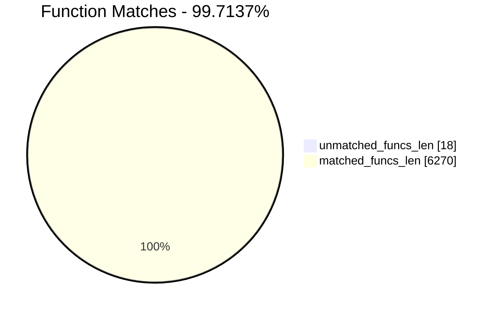
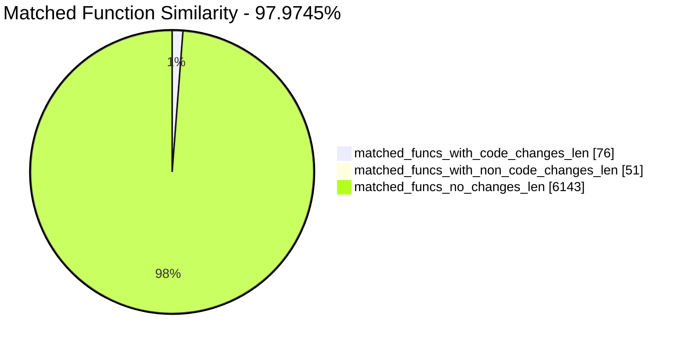
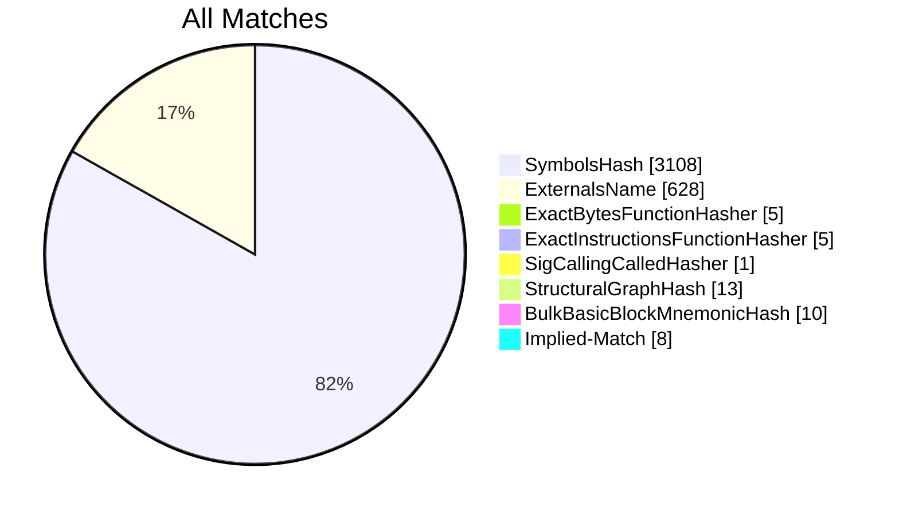
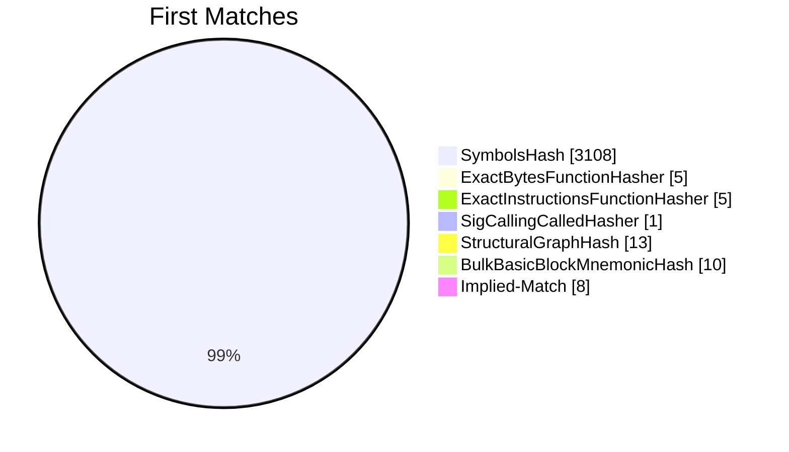
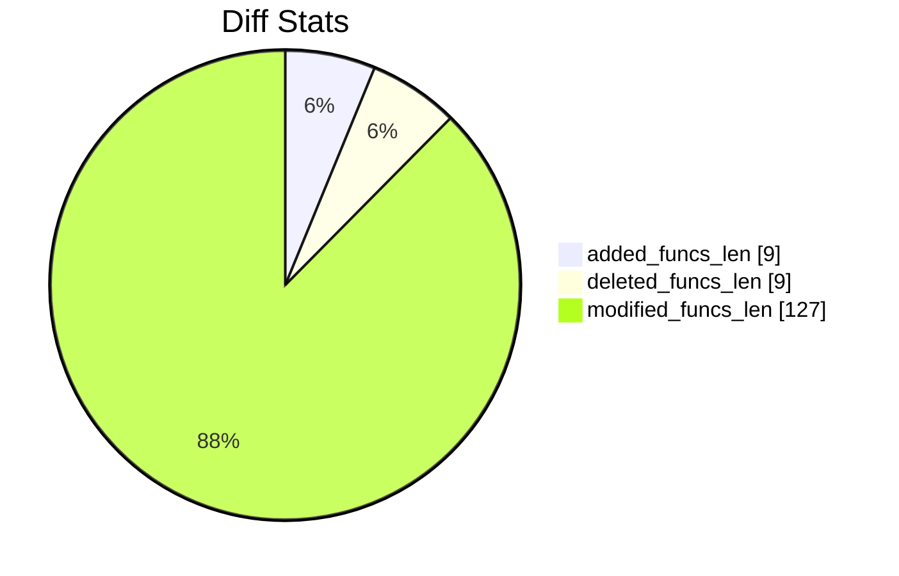
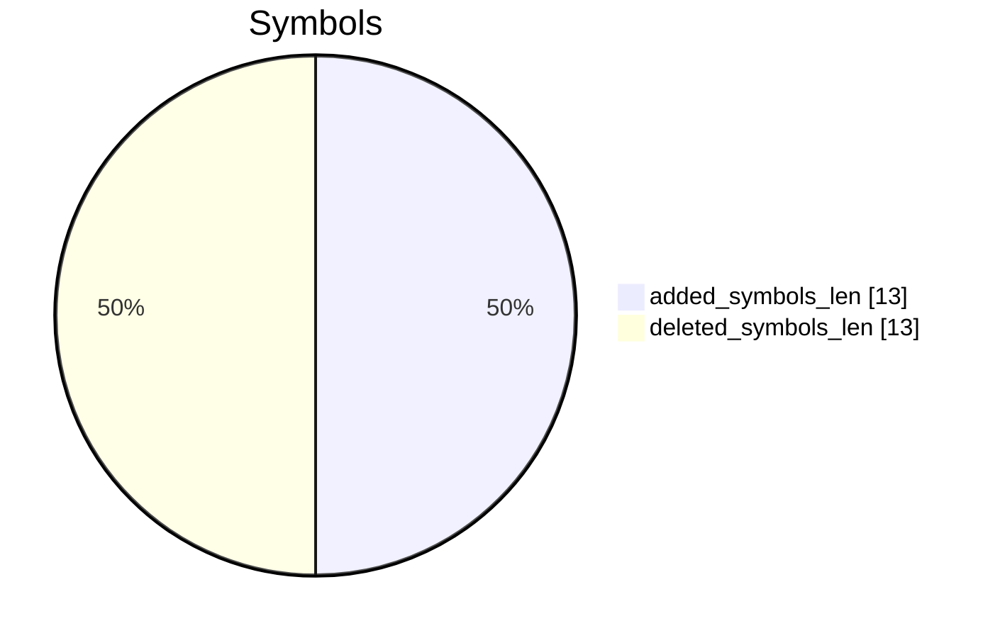
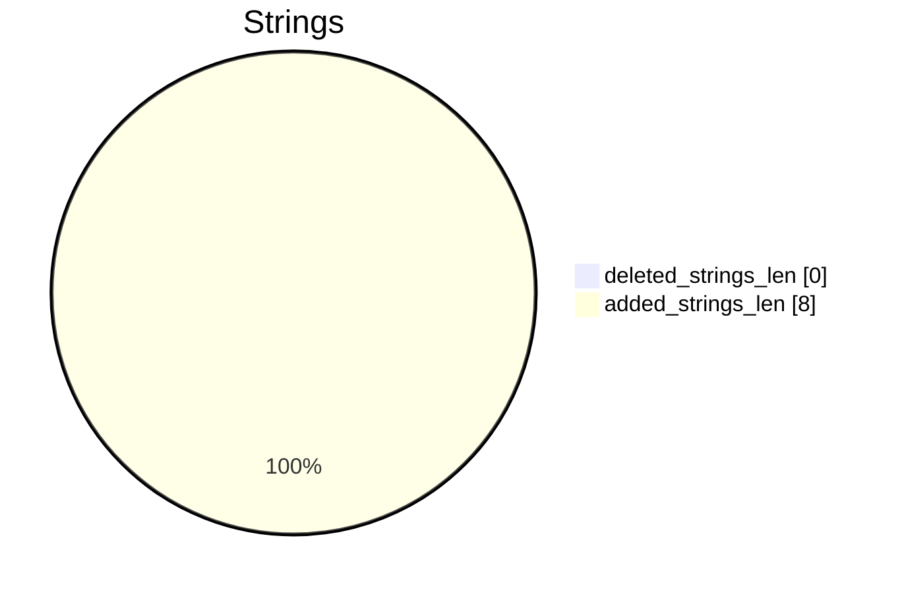

# winlogon-vuln-26100.8036.exe-winlogon-patch-26100.8115.exe Diff

# TOC

* [Visual Chart Diff](#visual-chart-diff)
* [Metadata](#metadata)
	* [Ghidra Diff Engine](#ghidra-diff-engine)
		* [Command Line](#command-line)
	* [Binary Metadata Diff](#binary-metadata-diff)
	* [Program Options](#program-options)
	* [Diff Stats](#diff-stats)
	* [Strings](#strings)
* [Deleted](#deleted)
	* [wil::details::EnsureCoalescedTimer<class_wil::details::EnabledStateManager>](#wildetailsensurecoalescedtimerclass_wildetailsenabledstatemanager)
	* [wil::details::FeatureImpl<struct___WilFeatureTraits_Feature_UxLabTest>::GetCachedFeatureEnabledState](#wildetailsfeatureimplstruct___wilfeaturetraits_feature_uxlabtestgetcachedfeatureenabledstate)
	* [wil::details::FeatureImpl<struct___WilFeatureTraits_Feature_UxLabTest>::GetCurrentFeatureEnabledState](#wildetailsfeatureimplstruct___wilfeaturetraits_feature_uxlabtestgetcurrentfeatureenabledstate)
	* [wil::details::FeatureImpl<struct___WilFeatureTraits_Feature_UxLabTest>::ReportUsage](#wildetailsfeatureimplstruct___wilfeaturetraits_feature_uxlabtestreportusage)
	* [wil::details::FeatureImpl<struct___WilFeatureTraits_Feature_Standalone_25_11_NonSec>::GetCachedFeatureEnabledState](#wildetailsfeatureimplstruct___wilfeaturetraits_feature_standalone_25_11_nonsecgetcachedfeatureenabledstate)
	* [wil::details::FeatureImpl<struct___WilFeatureTraits_Feature_DesktopReadyNotif>::GetCurrentFeatureEnabledState](#wildetailsfeatureimplstruct___wilfeaturetraits_feature_desktopreadynotifgetcurrentfeatureenabledstate)
	* [wil::details::FeatureImpl<struct___WilFeatureTraits_Feature_ITSNotifySinkEx>::GetCurrentFeatureEnabledState](#wildetailsfeatureimplstruct___wilfeaturetraits_feature_itsnotifysinkexgetcurrentfeatureenabledstate)
	* [wil::details::FeatureImpl<struct___WilFeatureTraits_Feature_Standalone_25_11_NonSec>::GetCurrentFeatureEnabledState](#wildetailsfeatureimplstruct___wilfeaturetraits_feature_standalone_25_11_nonsecgetcurrentfeatureenabledstate)
	* [wil::details::FeatureImpl<struct___WilFeatureTraits_Feature_Standalone_25_11_NonSec>::ReportUsage](#wildetailsfeatureimplstruct___wilfeaturetraits_feature_standalone_25_11_nonsecreportusage)
* [Added](#added)
	* [_tlgWriteTemplate<long___cdecl(struct__tlgProvider_t_const*___ptr64,void_const*___ptr64,struct__GUID_const*___ptr64,struct__GUID_const*___ptr64,unsigned_int,struct__EVENT_DATA_DESCRIPTOR*___ptr64),&long___cdecl__tlgWriteTransfer_EtwEventWriteTransfer(struct__tlgProvider_t_const*___ptr64,void_const*___ptr64,struct__GUID_const*___ptr64,struct__GUID_const*___ptr64,unsigned_int,struct__EVENT_DATA_DESCRIPTOR*___ptr64),struct__GUID_const*___ptr64,struct__GUID_const*___ptr64>::Write<struct__tlgWrapSz<unsigned_short>,struct__tlgWrapperByVal<8>,struct__tlgWrapperByVal<8>_>](#_tlgwritetemplatelong___cdeclstruct__tlgprovider_t_const___ptr64void_const___ptr64struct__guid_const___ptr64struct__guid_const___ptr64unsigned_intstruct__event_data_descriptor___ptr64long___cdecl__tlgwritetransfer_etweventwritetransferstruct__tlgprovider_t_const___ptr64void_const___ptr64struct__guid_const___ptr64struct__guid_const___ptr64unsigned_intstruct__event_data_descriptor___ptr64struct__guid_const___ptr64struct__guid_const___ptr64writestruct__tlgwrapszunsigned_shortstruct__tlgwrapperbyval8struct__tlgwrapperbyval8_)
	* [_tlgWriteTemplate<long___cdecl(struct__tlgProvider_t_const*___ptr64,void_const*___ptr64,struct__GUID_const*___ptr64,struct__GUID_const*___ptr64,unsigned_int,struct__EVENT_DATA_DESCRIPTOR*___ptr64),&long___cdecl__tlgWriteTransfer_EtwEventWriteTransfer(struct__tlgProvider_t_const*___ptr64,void_const*___ptr64,struct__GUID_const*___ptr64,struct__GUID_const*___ptr64,unsigned_int,struct__EVENT_DATA_DESCRIPTOR*___ptr64),struct__GUID_const*___ptr64,struct__GUID_const*___ptr64>::Write<struct__tlgWrapSz<unsigned_short>,struct__tlgWrapperByVal<8>,struct__tlgWrapperByVal<8>,struct__tlgWrapperByVal<8>_>](#_tlgwritetemplatelong___cdeclstruct__tlgprovider_t_const___ptr64void_const___ptr64struct__guid_const___ptr64struct__guid_const___ptr64unsigned_intstruct__event_data_descriptor___ptr64long___cdecl__tlgwritetransfer_etweventwritetransferstruct__tlgprovider_t_const___ptr64void_const___ptr64struct__guid_const___ptr64struct__guid_const___ptr64unsigned_intstruct__event_data_descriptor___ptr64struct__guid_const___ptr64struct__guid_const___ptr64writestruct__tlgwrapszunsigned_shortstruct__tlgwrapperbyval8struct__tlgwrapperbyval8struct__tlgwrapperbyval8_)
	* [_tlgWriteTemplate<long___cdecl(struct__tlgProvider_t_const*___ptr64,void_const*___ptr64,struct__GUID_const*___ptr64,struct__GUID_const*___ptr64,unsigned_int,struct__EVENT_DATA_DESCRIPTOR*___ptr64),&long___cdecl__tlgWriteTransfer_EtwEventWriteTransfer(struct__tlgProvider_t_const*___ptr64,void_const*___ptr64,struct__GUID_const*___ptr64,struct__GUID_const*___ptr64,unsigned_int,struct__EVENT_DATA_DESCRIPTOR*___ptr64),struct__GUID_const*___ptr64,struct__GUID_const*___ptr64>::Write<struct__tlgWrapSz<unsigned_short>,struct__tlgWrapperByVal<8>,struct__tlgWrapperByVal<8>,struct__tlgWrapperByVal<4>_>](#_tlgwritetemplatelong___cdeclstruct__tlgprovider_t_const___ptr64void_const___ptr64struct__guid_const___ptr64struct__guid_const___ptr64unsigned_intstruct__event_data_descriptor___ptr64long___cdecl__tlgwritetransfer_etweventwritetransferstruct__tlgprovider_t_const___ptr64void_const___ptr64struct__guid_const___ptr64struct__guid_const___ptr64unsigned_intstruct__event_data_descriptor___ptr64struct__guid_const___ptr64struct__guid_const___ptr64writestruct__tlgwrapszunsigned_shortstruct__tlgwrapperbyval8struct__tlgwrapperbyval8struct__tlgwrapperbyval4_)
	* [_tlgWriteTemplate<long___cdecl(struct__tlgProvider_t_const*___ptr64,void_const*___ptr64,struct__GUID_const*___ptr64,struct__GUID_const*___ptr64,unsigned_int,struct__EVENT_DATA_DESCRIPTOR*___ptr64),&long___cdecl__tlgWriteTransfer_EtwEventWriteTransfer(struct__tlgProvider_t_const*___ptr64,void_const*___ptr64,struct__GUID_const*___ptr64,struct__GUID_const*___ptr64,unsigned_int,struct__EVENT_DATA_DESCRIPTOR*___ptr64),struct__GUID_const*___ptr64,struct__GUID_const*___ptr64>::Write<struct__tlgWrapperByVal<8>,struct__tlgWrapperByVal<8>,struct__tlgWrapSz<unsigned_short>,struct__tlgWrapperByVal<8>_>](#_tlgwritetemplatelong___cdeclstruct__tlgprovider_t_const___ptr64void_const___ptr64struct__guid_const___ptr64struct__guid_const___ptr64unsigned_intstruct__event_data_descriptor___ptr64long___cdecl__tlgwritetransfer_etweventwritetransferstruct__tlgprovider_t_const___ptr64void_const___ptr64struct__guid_const___ptr64struct__guid_const___ptr64unsigned_intstruct__event_data_descriptor___ptr64struct__guid_const___ptr64struct__guid_const___ptr64writestruct__tlgwrapperbyval8struct__tlgwrapperbyval8struct__tlgwrapszunsigned_shortstruct__tlgwrapperbyval8_)
	* [wil::details::ThreadFailureCallbackHolder::GetContextAndNotifyFailure](#wildetailsthreadfailurecallbackholdergetcontextandnotifyfailure)
	* [wil::details::EnabledStateManager::EnabledStateManager](#wildetailsenabledstatemanagerenabledstatemanager)
	* [wil::details::FeatureImpl<struct___WilFeatureTraits_Feature_SyncOnPreConnect>::GetCurrentFeatureEnabledState](#wildetailsfeatureimplstruct___wilfeaturetraits_feature_synconpreconnectgetcurrentfeatureenabledstate)
	* [wil::details::FeatureImpl<struct___WilFeatureTraits_Feature_WinlogonStateTrace>::GetCurrentFeatureEnabledState](#wildetailsfeatureimplstruct___wilfeaturetraits_feature_winlogonstatetracegetcurrentfeatureenabledstate)
	* [Feature_WinlogonStateTrace__private_IsEnabledDeviceUsageNoInline](#feature_winlogonstatetrace__private_isenableddeviceusagenoinline)
* [Modified](#modified)
	* [wil::details::FeatureImpl<struct___WilFeatureTraits_Feature_W365Boot_DedicatedCloudOnly>::ReportUsage](#wildetailsfeatureimplstruct___wilfeaturetraits_feature_w365boot_dedicatedcloudonlyreportusage)
	* [wil::details::SubscribeFeatureStateCacheToConfigurationChanges](#wildetailssubscribefeaturestatecachetoconfigurationchanges)
	* [wil::details::FeatureImpl<struct___WilFeatureTraits_Feature_843259193>::GetCachedFeatureEnabledState](#wildetailsfeatureimplstruct___wilfeaturetraits_feature_843259193getcachedfeatureenabledstate)
	* [wil::details::`dynamic_initializer_for_'g_enabledStateManager''](#wildetailsdynamic_initializer_for_g_enabledstatemanager)
	* [tip2::details::shared_data<0,0,0>::begin_update](#tip2detailsshared_data000begin_update)
	* [wil::details::FeatureImpl<struct___WilFeatureTraits_Feature_SkipThemesOnReconnect>::GetCachedFeatureEnabledState](#wildetailsfeatureimplstruct___wilfeaturetraits_feature_skipthemesonreconnectgetcachedfeatureenabledstate)
	* [wil::details::ThreadFailureCallbackHolder::ThreadFailureCallbackHolder](#wildetailsthreadfailurecallbackholderthreadfailurecallbackholder)
	* [WLGeneric_AppLauncher_Enter](#wlgeneric_applauncher_enter)
	* [wil::details::FeatureImpl<struct___WilFeatureTraits_Feature_HangDetectionOnLogonUICallouts2>::GetCachedFeatureEnabledState](#wildetailsfeatureimplstruct___wilfeaturetraits_feature_hangdetectiononlogonuicallouts2getcachedfeatureenabledstate)
	* [tip2::details::merged_data<struct__tip_ActivityIdReceivedTip,struct__tip_ActivityIdReceivedTip>::merged_data<struct__tip_ActivityIdReceivedTip,struct__tip_ActivityIdReceivedTip>](#tip2detailsmerged_datastruct__tip_activityidreceivedtipstruct__tip_activityidreceivedtipmerged_datastruct__tip_activityidreceivedtipstruct__tip_activityidreceivedtip)
	* [wil::details::FeatureImpl<struct___WilFeatureTraits_Feature_TestLoc1Perf>::GetCurrentFeatureEnabledState](#wildetailsfeatureimplstruct___wilfeaturetraits_feature_testloc1perfgetcurrentfeatureenabledstate)
	* [WLGeneric_DelayedSwitchDesktop_Enter](#wlgeneric_delayedswitchdesktop_enter)
	* [wil::details::FeatureImpl<struct___WilFeatureTraits_Feature_2045735225>::GetCachedFeatureEnabledState](#wildetailsfeatureimplstruct___wilfeaturetraits_feature_2045735225getcachedfeatureenabledstate)
	* [wil::details::FeatureImpl<struct___WilFeatureTraits_Feature_ShadowAdmin>::GetCachedFeatureEnabledState](#wildetailsfeatureimplstruct___wilfeaturetraits_feature_shadowadmingetcachedfeatureenabledstate)
	* [tip2::details::shared_data<1,0,0>::end_update](#tip2detailsshared_data100end_update)
	* [CSession::CSession](#csessioncsession)
	* [wil::details::EnabledStateManager::EnsureSubscribedToUsageFlush](#wildetailsenabledstatemanagerensuresubscribedtousageflush)
	* [tip2::details::shared_data<0,0,0>::complete_helper](#tip2detailsshared_data000complete_helper)
	* [wil::details::FeatureImpl<struct___WilFeatureTraits_Feature_W365Boot_CopyCorrelationId>::GetCachedFeatureEnabledState](#wildetailsfeatureimplstruct___wilfeaturetraits_feature_w365boot_copycorrelationidgetcachedfeatureenabledstate)
	* [wil::details::FeatureImpl<struct___WilFeatureTraits_Feature_EPDA>::GetCachedFeatureEnabledState](#wildetailsfeatureimplstruct___wilfeaturetraits_feature_epdagetcachedfeatureenabledstate)
	* [wil::details::FeatureImpl<struct___WilFeatureTraits_Feature_TestAccPerf>::GetCachedFeatureEnabledState](#wildetailsfeatureimplstruct___wilfeaturetraits_feature_testaccperfgetcachedfeatureenabledstate)
	* [wil::details::FeatureImpl<struct___WilFeatureTraits_Feature_WinlogonJobHandleDuplicate>::GetCachedFeatureEnabledState](#wildetailsfeatureimplstruct___wilfeaturetraits_feature_winlogonjobhandleduplicategetcachedfeatureenabledstate)
	* [wil::details::EnabledStateManager::OnTimer](#wildetailsenabledstatemanagerontimer)
	* [wil::details::ReportUsageToService](#wildetailsreportusagetoservice)
	* [wil::details::EnabledStateManager::QueueBackgroundUsageReporting](#wildetailsenabledstatemanagerqueuebackgroundusagereporting)
	* [wil::details::FeatureImpl<struct___WilFeatureTraits_Feature_SetLsmSyncEventNullCheck>::GetCachedFeatureEnabledState](#wildetailsfeatureimplstruct___wilfeaturetraits_feature_setlsmsynceventnullcheckgetcachedfeatureenabledstate)
	* [wil::details::FeatureImpl<struct___WilFeatureTraits_Feature_ValAccTest>::GetCachedFeatureEnabledState](#wildetailsfeatureimplstruct___wilfeaturetraits_feature_valacctestgetcachedfeatureenabledstate)
	* [wil::ActivityBase<class_WinlogonProvider,1,140737488355328,5,16777216,struct__TlgReflectorTag_Param0IsProviderType>::ActivityBase<class_WinlogonProvider,1,140737488355328,5,16777216,struct__TlgReflectorTag_Param0IsProviderType>](#wilactivitybaseclass_winlogonprovider1140737488355328516777216struct__tlgreflectortag_param0isprovidertypeactivitybaseclass_winlogonprovider1140737488355328516777216struct__tlgreflectortag_param0isprovidertype)
	* [wil::details::FeatureImpl<struct___WilFeatureTraits_Feature_ImmersiveColorFight>::GetCachedFeatureEnabledState](#wildetailsfeatureimplstruct___wilfeaturetraits_feature_immersivecolorfightgetcachedfeatureenabledstate)
	* [wil::details::FeatureImpl<struct___WilFeatureTraits_Feature_TestLoc1Perf>::GetCachedFeatureEnabledState](#wildetailsfeatureimplstruct___wilfeaturetraits_feature_testloc1perfgetcachedfeatureenabledstate)
	* [wil::details::FeatureImpl<struct___WilFeatureTraits_Feature_GatePerf>::GetCachedFeatureEnabledState](#wildetailsfeatureimplstruct___wilfeaturetraits_feature_gateperfgetcachedfeatureenabledstate)
	* [WMsgMessageHandler](#wmsgmessagehandler)
	* [CSession::~CSession](#csessioncsession)
	* [tip2::details::shared_data<1,0,0>::complete_helper](#tip2detailsshared_data100complete_helper)
	* [wil::details::GetContextAndNotifyFailure](#wildetailsgetcontextandnotifyfailure)
	* [wil::details::FeatureImpl<struct___WilFeatureTraits_Feature_UpdateAndShutdownFlag>::GetCachedFeatureEnabledState](#wildetailsfeatureimplstruct___wilfeaturetraits_feature_updateandshutdownflaggetcachedfeatureenabledstate)
	* [wil::details::FeatureImpl<struct___WilFeatureTraits_Feature_Standalone_26_01_NonSec>::GetCachedFeatureEnabledState](#wildetailsfeatureimplstruct___wilfeaturetraits_feature_standalone_26_01_nonsecgetcachedfeatureenabledstate)
	* [wil::details::FeatureImpl<struct___WilFeatureTraits_Feature_ContentDeliveryPolicyRestrictions>::GetCachedFeatureEnabledState](#wildetailsfeatureimplstruct___wilfeaturetraits_feature_contentdeliverypolicyrestrictionsgetcachedfeatureenabledstate)
	* [wil::details::FeatureImpl<struct___WilFeatureTraits_Feature_TestAccPerf>::GetCurrentFeatureEnabledState](#wildetailsfeatureimplstruct___wilfeaturetraits_feature_testaccperfgetcurrentfeatureenabledstate)
	* [WLGeneric_No_Unlock_DisconnectedLock_Execute](#wlgeneric_no_unlock_disconnectedlock_execute)
	* [wil::details::FeatureImpl<struct___WilFeatureTraits_Feature_UxAccOptimization>::GetCachedFeatureEnabledState](#wildetailsfeatureimplstruct___wilfeaturetraits_feature_uxaccoptimizationgetcachedfeatureenabledstate)
	* [wil::details::FeatureImpl<struct___WilFeatureTraits_Feature_WinlogonNotifySubscriberRefactor>::GetCachedFeatureEnabledState](#wildetailsfeatureimplstruct___wilfeaturetraits_feature_winlogonnotifysubscriberrefactorgetcachedfeatureenabledstate)
	* [wil::details::EnabledStateManager::EnsureSubscribedToFeatureConfigurationChangesImpl](#wildetailsenabledstatemanagerensuresubscribedtofeatureconfigurationchangesimpl)
	* [wil::details::FeatureImpl<struct___WilFeatureTraits_Feature_AutomaticSignOnLockSetting>::GetCachedFeatureEnabledState](#wildetailsfeatureimplstruct___wilfeaturetraits_feature_automaticsignonlocksettinggetcachedfeatureenabledstate)
	* [StateMachineRun](#statemachinerun)
	* [wil::details::FeatureImpl<struct___WilFeatureTraits_Feature_SetLsmSyncEventNullCheck>::GetCurrentFeatureEnabledState](#wildetailsfeatureimplstruct___wilfeaturetraits_feature_setlsmsynceventnullcheckgetcurrentfeatureenabledstate)
	* [WLGeneric_NotifyTerminateSession_Execute](#wlgeneric_notifyterminatesession_execute)
	* [wil::details::FeatureImpl<struct___WilFeatureTraits_Feature_BackupRestoreCoordinatorWait>::GetCachedFeatureEnabledState](#wildetailsfeatureimplstruct___wilfeaturetraits_feature_backuprestorecoordinatorwaitgetcachedfeatureenabledstate)
	* [wil::details::FeatureImpl<struct___WilFeatureTraits_Feature_60064795>::GetCachedFeatureEnabledState](#wildetailsfeatureimplstruct___wilfeaturetraits_feature_60064795getcachedfeatureenabledstate)
	* [wil::details::FeatureImpl<struct___WilFeatureTraits_Feature_WinlogonExceptionFilter>::GetCachedFeatureEnabledState](#wildetailsfeatureimplstruct___wilfeaturetraits_feature_winlogonexceptionfiltergetcachedfeatureenabledstate)
	* [WLGeneric_FindDestinationSession_Execute](#wlgeneric_finddestinationsession_execute)
	* [WLGeneric_No_Unlock_Disconnected_Execute](#wlgeneric_no_unlock_disconnected_execute)
	* [tip2::details::shared_data<0,0,0>::end_update](#tip2detailsshared_data000end_update)
	* [wil::details::FeatureImpl<struct___WilFeatureTraits_Feature_TestAccPerf>::ReportUsage](#wildetailsfeatureimplstruct___wilfeaturetraits_feature_testaccperfreportusage)
	* [CSession::Initialize](#csessioninitialize)
	* [wil::details::FeatureImpl<struct___WilFeatureTraits_Feature_W365Boot_DedicatedCloudOnly>::GetCachedFeatureEnabledState](#wildetailsfeatureimplstruct___wilfeaturetraits_feature_w365boot_dedicatedcloudonlygetcachedfeatureenabledstate)
	* [tip2::details::shared_data<1,0,0>::shared_data<1,0,0>](#tip2detailsshared_data100shared_data100)
	* [wil::details::FeatureImpl<struct___WilFeatureTraits_Feature_OobeRestoreDataLayer>::GetCachedFeatureEnabledState](#wildetailsfeatureimplstruct___wilfeaturetraits_feature_ooberestoredatalayergetcachedfeatureenabledstate)
	* [`WLGeneric_NotifyTerminateSession_Execute'::__l1::fin$0](#wlgeneric_notifyterminatesession_execute__l1fin0)
	* [tip2::details::shared_data<1,0,0>::begin_update](#tip2detailsshared_data100begin_update)
	* [wil::details::FeatureImpl<struct___WilFeatureTraits_Feature_WinlogonExtendedLogonUITerminate>::GetCachedFeatureEnabledState](#wildetailsfeatureimplstruct___wilfeaturetraits_feature_winlogonextendedlogonuiterminategetcachedfeatureenabledstate)
	* [wil::details::EnabledStateManager::OnStateChange](#wildetailsenabledstatemanageronstatechange)
	* [wil::details::`dynamic_atexit_destructor_for_'g_enabledStateManager''](#wildetailsdynamic_atexit_destructor_for_g_enabledstatemanager)
	* [wil::details::FeatureImpl<struct___WilFeatureTraits_Feature_HangDetectionOnDWMCallouts2>::GetCachedFeatureEnabledState](#wildetailsfeatureimplstruct___wilfeaturetraits_feature_hangdetectionondwmcallouts2getcachedfeatureenabledstate)
	* [wil::details::FeatureImpl<struct___WilFeatureTraits_Feature_SettingsDel>::GetCachedFeatureEnabledState](#wildetailsfeatureimplstruct___wilfeaturetraits_feature_settingsdelgetcachedfeatureenabledstate)
	* [wil::details::FeatureImpl<struct___WilFeatureTraits_Feature_Standalone_Future>::GetCachedFeatureEnabledState](#wildetailsfeatureimplstruct___wilfeaturetraits_feature_standalone_futuregetcachedfeatureenabledstate)
	* [wil::details::FeatureImpl<struct___WilFeatureTraits_Feature_WinlogonTSActivityId2>::GetCachedFeatureEnabledState](#wildetailsfeatureimplstruct___wilfeaturetraits_feature_winlogontsactivityid2getcachedfeatureenabledstate)
	* [wil::details::EnabledStateManager::RecordCachedUsageUnderLock](#wildetailsenabledstatemanagerrecordcachedusageunderlock)
	* [wil::details::FeatureImpl<struct___WilFeatureTraits_Feature_TestAccPerf>::GetCachedFeatureEnabledState](#wildetailsfeatureimplstruct___wilfeaturetraits_feature_testaccperfgetcachedfeatureenabledstate)
	* [wil::details::FeatureImpl<struct___WilFeatureTraits_Feature_ITSNotifySinkEx>::GetCachedFeatureEnabledState](#wildetailsfeatureimplstruct___wilfeaturetraits_feature_itsnotifysinkexgetcachedfeatureenabledstate)
	* [wil::details::FeatureImpl<struct___WilFeatureTraits_Feature_DesktopReadyNotif>::GetCachedFeatureEnabledState](#wildetailsfeatureimplstruct___wilfeaturetraits_feature_desktopreadynotifgetcachedfeatureenabledstate)
	* [wil::details::SubscribeFeatureStateCacheToConfigurationChanges](#wildetailssubscribefeaturestatecachetoconfigurationchanges)
	* [wil::details::FeatureImpl<struct___WilFeatureTraits_Feature_TestAccPerf>::GetCachedFeatureEnabledState](#wildetailsfeatureimplstruct___wilfeaturetraits_feature_testaccperfgetcachedfeatureenabledstate)
	* [wil::details::FeatureImpl<struct___WilFeatureTraits_Feature_ITSNotifySinkEx>::GetCachedFeatureEnabledState](#wildetailsfeatureimplstruct___wilfeaturetraits_feature_itsnotifysinkexgetcachedfeatureenabledstate)
	* [wil::details::EnabledStateManager::RecordCachedUsageUnderLock](#wildetailsenabledstatemanagerrecordcachedusageunderlock)
	* [wil::details_abi::heap_buffer::reserve](#wildetails_abiheap_bufferreserve)
* [Modified (No Code Changes)](#modified-no-code-changes)
	* [wil_details_RecordCachedUsage](#wil_details_recordcachedusage)
	* [API-MS-WIN-CORE-HEAP-L1-1-0.DLL::HeapFree](#api-ms-win-core-heap-l1-1-0dllheapfree)
	* [<lambda_invoker_cdecl>](#lambda_invoker_cdecl)
	* [ProcessShutdownInProgress](#processshutdowninprogress)
	* [last_error_context](#last_error_context)
	* [Write<struct__tlgWrapSz<unsigned_short>,struct__tlgWrapperByVal<8>_>](#writestruct__tlgwrapszunsigned_shortstruct__tlgwrapperbyval8_)
	* [WilApi_RecordFeatureUsage](#wilapi_recordfeatureusage)
	* [WLFree](#wlfree)
	* [WilApi_GetFeatureEnabledState](#wilapi_getfeatureenabledstate)
	* [NTDLL.DLL::RtlReleaseResource](#ntdlldllrtlreleaseresource)
	* [reset](#reset)
	* [API-MS-WIN-EVENTING-PROVIDER-L1-1-0.DLL::EventWriteTransfer](#api-ms-win-eventing-provider-l1-1-0dlleventwritetransfer)
	* [push_back](#push_back)
	* [EnsureCoalescedTimer_SetTimer](#ensurecoalescedtimer_settimer)
	* [EnsureSubscribedToFeatureConfigurationChanges](#ensuresubscribedtofeatureconfigurationchanges)
	* [ProcessHeapAlloc](#processheapalloc)
	* [__private_IsEnabled](#__private_isenabled)
	* [API-MS-WIN-CORE-THREADPOOL-L1-2-0.DLL::CreateThreadpoolTimer](#api-ms-win-core-threadpool-l1-2-0dllcreatethreadpooltimer)
	* [API-MS-WIN-CORE-SYNCH-L1-1-0.DLL::AcquireSRWLockExclusive](#api-ms-win-core-synch-l1-1-0dllacquiresrwlockexclusive)
	* [_tlgWriteTransfer_EtwEventWriteTransfer](#_tlgwritetransfer_etweventwritetransfer)
	* [API-MS-WIN-CORE-SYNCH-L1-1-0.DLL::WaitForSingleObject](#api-ms-win-core-synch-l1-1-0dllwaitforsingleobject)
	* [~last_error_context](#last_error_context)
	* [ReportUsage](#reportusage)
	* [__security_check_cookie](#__security_check_cookie)
	* [~unique_storage<struct_wil::details::resource_policy<struct__RTL_SRWLOCK*___ptr64,void_(__cdecl*)(struct__RTL_SRWLOCK*___ptr64),&void___cdecl_ReleaseSRWLockExclusive(struct__RTL_SRWLOCK*___ptr64),struct_wistd::integral_constant<unsigned___int64,1>,struct__RTL_SRWLOCK*___ptr64,struct__RTL_SRWLOCK*___ptr64,0,std::nullptr_t>_>](#unique_storagestruct_wildetailsresource_policystruct__rtl_srwlock___ptr64void___cdeclstruct__rtl_srwlock___ptr64void___cdecl_releasesrwlockexclusivestruct__rtl_srwlock___ptr64struct_wistdintegral_constantunsigned___int641struct__rtl_srwlock___ptr64struct__rtl_srwlock___ptr640stdnullptr_t_)
	* [API-MS-WIN-CORE-SYNCH-L1-1-0.DLL::CreateEventW](#api-ms-win-core-synch-l1-1-0dllcreateeventw)
	* [WPP_SF_](#wpp_sf_)
	* [API-MS-WIN-CORE-SYNCH-L1-1-0.DLL::ReleaseSRWLockExclusive](#api-ms-win-core-synch-l1-1-0dllreleasesrwlockexclusive)
	* [API-MS-WIN-CORE-ERRORHANDLING-L1-1-0.DLL::SetLastError](#api-ms-win-core-errorhandling-l1-1-0dllsetlasterror)
	* [API-MS-WIN-CORE-SYNCH-L1-1-0.DLL::SetEvent](#api-ms-win-core-synch-l1-1-0dllsetevent)
	* [API-MS-WIN-CORE-HEAP-L1-1-0.DLL::GetProcessHeap](#api-ms-win-core-heap-l1-1-0dllgetprocessheap)
	* [API-MS-WIN-CORE-HANDLE-L1-1-0.DLL::CloseHandle](#api-ms-win-core-handle-l1-1-0dllclosehandle)
	* [wil_details_IsEnabledFallback](#wil_details_isenabledfallback)
	* [NTDLL.DLL::RtlAcquireResourceShared](#ntdlldllrtlacquireresourceshared)
	* [memcpy_s](#memcpy_s)

# Visual Chart Diff

```mermaid

flowchart LR

wildetailsFeatureImplstruct___WilFeatureTraits_Feature_W365Boot_DedicatedCloudOnlyReportUsage-4-old<--Match 86%-->wildetailsFeatureImplstruct___WilFeatureTraits_Feature_W365Boot_DedicatedCloudOnlyReportUsage-4-new
wildetailsSubscribeFeatureStateCacheToConfigurationChanges-3-old<--Match 10%-->wildetailsSubscribeFeatureStateCacheToConfigurationChanges-3-new
wildetailsFeatureImplstruct___WilFeatureTraits_Feature_843259193GetCachedFeatureEnabledState-1-old<--Match 79%-->wildetailsFeatureImplstruct___WilFeatureTraits_Feature_843259193GetCachedFeatureEnabledState-1-new
wildetailsdynamic_initializer_for_g_enabledStateManager-0-old<--Match 50%-->wildetailsdynamic_initializer_for_g_enabledStateManager-0-new
tip2detailsshared_data000begin_update-1-old<--Match 96%-->tip2detailsshared_data000begin_update-1-new
wildetailsFeatureImplstruct___WilFeatureTraits_Feature_SkipThemesOnReconnectGetCachedFeatureEnabledState-1-old<--Match 79%-->wildetailsFeatureImplstruct___WilFeatureTraits_Feature_SkipThemesOnReconnectGetCachedFeatureEnabledState-1-new
wildetailsThreadFailureCallbackHolderThreadFailureCallbackHolder-4-old<--Match 97%-->wildetailsThreadFailureCallbackHolderThreadFailureCallbackHolder-4-new
WLGeneric_AppLauncher_Enter-1-old<--Match 97%-->WLGeneric_AppLauncher_Enter-1-new
wildetailsFeatureImplstruct___WilFeatureTraits_Feature_HangDetectionOnLogonUICallouts2GetCachedFeatureEnabledState-1-old<--Match 79%-->wildetailsFeatureImplstruct___WilFeatureTraits_Feature_HangDetectionOnLogonUICallouts2GetCachedFeatureEnabledState-1-new
tip2detailsmerged_datastruct__tip_ActivityIdReceivedTipstruct__tip_ActivityIdReceivedTipmerged_datastruct__tip_ActivityIdReceivedTipstruct__tip_ActivityIdReceivedTip-1-old<--Match 99%-->tip2detailsmerged_datastruct__tip_ActivityIdReceivedTipstruct__tip_ActivityIdReceivedTipmerged_datastruct__tip_ActivityIdReceivedTipstruct__tip_ActivityIdReceivedTip-1-new
wildetailsFeatureImplstruct___WilFeatureTraits_Feature_TestLoc1PerfGetCurrentFeatureEnabledState-2-old<--Match 88%-->wildetailsFeatureImplstruct___WilFeatureTraits_Feature_TestLoc1PerfGetCurrentFeatureEnabledState-2-new
WLGeneric_DelayedSwitchDesktop_Enter-1-old<--Match 22%-->WLGeneric_DelayedSwitchDesktop_Enter-1-new
wildetailsFeatureImplstruct___WilFeatureTraits_Feature_2045735225GetCachedFeatureEnabledState-1-old<--Match 79%-->wildetailsFeatureImplstruct___WilFeatureTraits_Feature_2045735225GetCachedFeatureEnabledState-1-new
wildetailsFeatureImplstruct___WilFeatureTraits_Feature_ShadowAdminGetCachedFeatureEnabledState-1-old<--Match 79%-->wildetailsFeatureImplstruct___WilFeatureTraits_Feature_ShadowAdminGetCachedFeatureEnabledState-1-new
tip2detailsshared_data100end_update-1-old<--Match 99%-->tip2detailsshared_data100end_update-1-new
CSessionCSession-1-old<--Match 99%-->CSessionCSession-1-new
wildetailsEnabledStateManagerEnsureSubscribedToUsageFlush-2-old<--Match 96%-->wildetailsEnabledStateManagerEnsureSubscribedToUsageFlush-2-new
tip2detailsshared_data000complete_helper-2-old<--Match 77%-->tip2detailsshared_data000complete_helper-2-new
wildetailsFeatureImplstruct___WilFeatureTraits_Feature_W365Boot_CopyCorrelationIdGetCachedFeatureEnabledState-1-old<--Match 99%-->wildetailsFeatureImplstruct___WilFeatureTraits_Feature_W365Boot_CopyCorrelationIdGetCachedFeatureEnabledState-1-new
wildetailsFeatureImplstruct___WilFeatureTraits_Feature_EPDAGetCachedFeatureEnabledState-1-old<--Match 79%-->wildetailsFeatureImplstruct___WilFeatureTraits_Feature_EPDAGetCachedFeatureEnabledState-1-new
wildetailsFeatureImplstruct___WilFeatureTraits_Feature_TestAccPerfGetCachedFeatureEnabledState-1-old<--Match 79%-->wildetailsFeatureImplstruct___WilFeatureTraits_Feature_TestAccPerfGetCachedFeatureEnabledState-1-new
wildetailsFeatureImplstruct___WilFeatureTraits_Feature_WinlogonJobHandleDuplicateGetCachedFeatureEnabledState-1-old<--Match 79%-->wildetailsFeatureImplstruct___WilFeatureTraits_Feature_WinlogonJobHandleDuplicateGetCachedFeatureEnabledState-1-new
wildetailsEnabledStateManagerOnTimer-1-old<--Match 51%-->wildetailsEnabledStateManagerOnTimer-1-new
wildetailsReportUsageToService-8-old<--Match 87%-->wildetailsReportUsageToService-8-new
wildetailsEnabledStateManagerQueueBackgroundUsageReporting-3-old<--Match 51%-->wildetailsEnabledStateManagerQueueBackgroundUsageReporting-3-new
wildetailsFeatureImplstruct___WilFeatureTraits_Feature_SetLsmSyncEventNullCheckGetCachedFeatureEnabledState-1-old<--Match 79%-->wildetailsFeatureImplstruct___WilFeatureTraits_Feature_SetLsmSyncEventNullCheckGetCachedFeatureEnabledState-1-new
winlogon-vuln-26100.8036.exe<--51ommited-->winlogon-patch-26100.8115.exe

subgraph winlogon-patch-26100.8115.exe
    wildetailsFeatureImplstruct___WilFeatureTraits_Feature_W365Boot_DedicatedCloudOnlyReportUsage-4-new
wildetailsSubscribeFeatureStateCacheToConfigurationChanges-3-new
wildetailsFeatureImplstruct___WilFeatureTraits_Feature_843259193GetCachedFeatureEnabledState-1-new
wildetailsdynamic_initializer_for_g_enabledStateManager-0-new
tip2detailsshared_data000begin_update-1-new
wildetailsFeatureImplstruct___WilFeatureTraits_Feature_SkipThemesOnReconnectGetCachedFeatureEnabledState-1-new
wildetailsThreadFailureCallbackHolderThreadFailureCallbackHolder-4-new
WLGeneric_AppLauncher_Enter-1-new
wildetailsFeatureImplstruct___WilFeatureTraits_Feature_HangDetectionOnLogonUICallouts2GetCachedFeatureEnabledState-1-new
tip2detailsmerged_datastruct__tip_ActivityIdReceivedTipstruct__tip_ActivityIdReceivedTipmerged_datastruct__tip_ActivityIdReceivedTipstruct__tip_ActivityIdReceivedTip-1-new
wildetailsFeatureImplstruct___WilFeatureTraits_Feature_TestLoc1PerfGetCurrentFeatureEnabledState-2-new
WLGeneric_DelayedSwitchDesktop_Enter-1-new
wildetailsFeatureImplstruct___WilFeatureTraits_Feature_2045735225GetCachedFeatureEnabledState-1-new
wildetailsFeatureImplstruct___WilFeatureTraits_Feature_ShadowAdminGetCachedFeatureEnabledState-1-new
tip2detailsshared_data100end_update-1-new
CSessionCSession-1-new
wildetailsEnabledStateManagerEnsureSubscribedToUsageFlush-2-new
tip2detailsshared_data000complete_helper-2-new
wildetailsFeatureImplstruct___WilFeatureTraits_Feature_W365Boot_CopyCorrelationIdGetCachedFeatureEnabledState-1-new
wildetailsFeatureImplstruct___WilFeatureTraits_Feature_EPDAGetCachedFeatureEnabledState-1-new
wildetailsFeatureImplstruct___WilFeatureTraits_Feature_TestAccPerfGetCachedFeatureEnabledState-1-new
wildetailsFeatureImplstruct___WilFeatureTraits_Feature_WinlogonJobHandleDuplicateGetCachedFeatureEnabledState-1-new
wildetailsEnabledStateManagerOnTimer-1-new
wildetailsReportUsageToService-8-new
wildetailsEnabledStateManagerQueueBackgroundUsageReporting-3-new
wildetailsFeatureImplstruct___WilFeatureTraits_Feature_SetLsmSyncEventNullCheckGetCachedFeatureEnabledState-1-new
    subgraph Added
direction LR
_tlgWriteTemplatelong___cdeclstruct__tlgProvider_t_const___ptr64void_const___ptr64struct__GUID_const___ptr64struct__GUID_const___ptr64unsigned_intstruct__EVENT_DATA_DESCRIPTOR___ptr64long___cdecl__tlgWriteTransfer_EtwEventWriteTransferstruct__tlgProvider_t_const___ptr64void_const___ptr64struct__GUID_const___ptr64struct__GUID_const___ptr64unsigned_intstruct__EVENT_DATA_DESCRIPTOR___ptr64struct__GUID_const___ptr64struct__GUID_const___ptr64-Writestruct__tlgWrapSzunsigned_shortstruct__tlgWrapperByVal8struct__tlgWrapperByVal8_
    _tlgWriteTemplatelong___cdeclstruct__tlgProvider_t_const___ptr64void_const___ptr64struct__GUID_const___ptr64struct__GUID_const___ptr64unsigned_intstruct__EVENT_DATA_DESCRIPTOR___ptr64long___cdecl__tlgWriteTransfer_EtwEventWriteTransferstruct__tlgProvider_t_const___ptr64void_const___ptr64struct__GUID_const___ptr64struct__GUID_const___ptr64unsigned_intstruct__EVENT_DATA_DESCRIPTOR___ptr64struct__GUID_const___ptr64struct__GUID_const___ptr64-Writestruct__tlgWrapSzunsigned_shortstruct__tlgWrapperByVal8struct__tlgWrapperByVal8struct__tlgWrapperByVal8_
    _tlgWriteTemplatelong___cdeclstruct__tlgProvider_t_const___ptr64void_const___ptr64struct__GUID_const___ptr64struct__GUID_const___ptr64unsigned_intstruct__EVENT_DATA_DESCRIPTOR___ptr64long___cdecl__tlgWriteTransfer_EtwEventWriteTransferstruct__tlgProvider_t_const___ptr64void_const___ptr64struct__GUID_const___ptr64struct__GUID_const___ptr64unsigned_intstruct__EVENT_DATA_DESCRIPTOR___ptr64struct__GUID_const___ptr64struct__GUID_const___ptr64-Writestruct__tlgWrapSzunsigned_shortstruct__tlgWrapperByVal8struct__tlgWrapperByVal8struct__tlgWrapperByVal4_
    _tlgWriteTemplatelong___cdeclstruct__tlgProvider_t_const___ptr64void_const___ptr64struct__GUID_const___ptr64struct__GUID_const___ptr64unsigned_intstruct__EVENT_DATA_DESCRIPTOR___ptr64long___cdecl__tlgWriteTransfer_EtwEventWriteTransferstruct__tlgProvider_t_const___ptr64void_const___ptr64struct__GUID_const___ptr64struct__GUID_const___ptr64unsigned_intstruct__EVENT_DATA_DESCRIPTOR___ptr64struct__GUID_const___ptr64struct__GUID_const___ptr64-Writestruct__tlgWrapperByVal8struct__tlgWrapperByVal8struct__tlgWrapSzunsigned_shortstruct__tlgWrapperByVal8_
    wil-details-ThreadFailureCallbackHolder-GetContextAndNotifyFailure
    wil-details-EnabledStateManager-EnabledStateManager
    wil-details-FeatureImplstruct___WilFeatureTraits_Feature_SyncOnPreConnect-GetCurrentFeatureEnabledState
    wil-details-FeatureImplstruct___WilFeatureTraits_Feature_WinlogonStateTrace-GetCurrentFeatureEnabledState
    Feature_WinlogonStateTrace__private_IsEnabledDeviceUsageNoInline
end
end

subgraph winlogon-vuln-26100.8036.exe
    wildetailsFeatureImplstruct___WilFeatureTraits_Feature_W365Boot_DedicatedCloudOnlyReportUsage-4-old
wildetailsSubscribeFeatureStateCacheToConfigurationChanges-3-old
wildetailsFeatureImplstruct___WilFeatureTraits_Feature_843259193GetCachedFeatureEnabledState-1-old
wildetailsdynamic_initializer_for_g_enabledStateManager-0-old
tip2detailsshared_data000begin_update-1-old
wildetailsFeatureImplstruct___WilFeatureTraits_Feature_SkipThemesOnReconnectGetCachedFeatureEnabledState-1-old
wildetailsThreadFailureCallbackHolderThreadFailureCallbackHolder-4-old
WLGeneric_AppLauncher_Enter-1-old
wildetailsFeatureImplstruct___WilFeatureTraits_Feature_HangDetectionOnLogonUICallouts2GetCachedFeatureEnabledState-1-old
tip2detailsmerged_datastruct__tip_ActivityIdReceivedTipstruct__tip_ActivityIdReceivedTipmerged_datastruct__tip_ActivityIdReceivedTipstruct__tip_ActivityIdReceivedTip-1-old
wildetailsFeatureImplstruct___WilFeatureTraits_Feature_TestLoc1PerfGetCurrentFeatureEnabledState-2-old
WLGeneric_DelayedSwitchDesktop_Enter-1-old
wildetailsFeatureImplstruct___WilFeatureTraits_Feature_2045735225GetCachedFeatureEnabledState-1-old
wildetailsFeatureImplstruct___WilFeatureTraits_Feature_ShadowAdminGetCachedFeatureEnabledState-1-old
tip2detailsshared_data100end_update-1-old
CSessionCSession-1-old
wildetailsEnabledStateManagerEnsureSubscribedToUsageFlush-2-old
tip2detailsshared_data000complete_helper-2-old
wildetailsFeatureImplstruct___WilFeatureTraits_Feature_W365Boot_CopyCorrelationIdGetCachedFeatureEnabledState-1-old
wildetailsFeatureImplstruct___WilFeatureTraits_Feature_EPDAGetCachedFeatureEnabledState-1-old
wildetailsFeatureImplstruct___WilFeatureTraits_Feature_TestAccPerfGetCachedFeatureEnabledState-1-old
wildetailsFeatureImplstruct___WilFeatureTraits_Feature_WinlogonJobHandleDuplicateGetCachedFeatureEnabledState-1-old
wildetailsEnabledStateManagerOnTimer-1-old
wildetailsReportUsageToService-8-old
wildetailsEnabledStateManagerQueueBackgroundUsageReporting-3-old
wildetailsFeatureImplstruct___WilFeatureTraits_Feature_SetLsmSyncEventNullCheckGetCachedFeatureEnabledState-1-old
    subgraph Deleted
direction LR
wil-details-EnsureCoalescedTimerclass_wil-details-EnabledStateManager
    wil-details-FeatureImplstruct___WilFeatureTraits_Feature_UxLabTest-GetCachedFeatureEnabledState
    wil-details-FeatureImplstruct___WilFeatureTraits_Feature_UxLabTest-GetCurrentFeatureEnabledState
    wil-details-FeatureImplstruct___WilFeatureTraits_Feature_UxLabTest-ReportUsage
    wil-details-FeatureImplstruct___WilFeatureTraits_Feature_Standalone_25_11_NonSec-GetCachedFeatureEnabledState
    wil-details-FeatureImplstruct___WilFeatureTraits_Feature_DesktopReadyNotif-GetCurrentFeatureEnabledState
    wil-details-FeatureImplstruct___WilFeatureTraits_Feature_ITSNotifySinkEx-GetCurrentFeatureEnabledState
    wil-details-FeatureImplstruct___WilFeatureTraits_Feature_Standalone_25_11_NonSec-GetCurrentFeatureEnabledState
    wil-details-FeatureImplstruct___WilFeatureTraits_Feature_Standalone_25_11_NonSec-ReportUsage
end
end

```










# Metadata

## Ghidra Diff Engine

### Command Line

#### Captured Command Line


```
ghidriff --project-location ghidra-proj --project-name CVE-2026-25187 --symbols-path symbols --gzfs-path gzfs --threaded --log-level INFO --file-log-level INFO --log-path ghidriff.log --min-func-len 10 --gdt [] --bsim --max-ram-percent 60.0 --max-section-funcs 200 winlogon-vuln-26100.8036.exe winlogon-patch-26100.8115.exe
```


#### Verbose Args


<details>

```
--old ['winlogon-vuln-26100.8036.exe'] --new [['winlogon-patch-26100.8115.exe']] --engine VersionTrackingDiff --output-path diffs --summary False --project-location ghidra-proj --project-name CVE-2026-25187 --symbols-path symbols --gzfs-path gzfs --base-address None --program-options None --threaded True --force-analysis False --force-diff False --no-symbols False --log-level INFO --file-log-level INFO --log-path ghidriff.log --va False --min-func-len 10 --use-calling-counts False --gdt [] --bsim True --bsim-full False --max-ram-percent 60.0 --print-flags False --jvm-args None --side-by-side False --max-section-funcs 200 --md-title None
```


</details>

#### Download Original PEs


```
wget https://msdl.microsoft.com/download/symbols/WINLOGON.EXE/9C248474EA000/WINLOGON.EXE -O winlogon.exe.x64.10.0.26100.8036
wget https://msdl.microsoft.com/download/symbols/WINLOGON.EXE/49A60692EC000/WINLOGON.EXE -O winlogon.exe.x64.10.0.26100.8115
```


## Binary Metadata Diff


```diff
--- winlogon-vuln-26100.8036.exe Meta
+++ winlogon-patch-26100.8115.exe Meta
@@ -1,44 +1,44 @@
-Program Name: winlogon-vuln-26100.8036.exe
+Program Name: winlogon-patch-26100.8115.exe
 Language ID: x86:LE:64:default (4.6)
 Compiler ID: windows
 Processor: x86
 Endian: Little
 Address Size: 64
 Minimum Address: 140000000
 Maximum Address: ff0000184f
-# of Bytes: 963984
+# of Bytes: 972144
 # of Memory Blocks: 10
-# of Instructions: 158859
-# of Defined Data: 10040
+# of Instructions: 159874
+# of Defined Data: 10066
 # of Functions: 3144
-# of Symbols: 29595
-# of Data Types: 1595
+# of Symbols: 29775
+# of Data Types: 1593
 # of Data Type Categories: 250
 Analyzed: true
 Compiler: visualstudio:unknown
 Created With Ghidra Version: 12.0.4
-Date Created: Thu Apr 23 22:20:38 AST 2026
+Date Created: Thu Apr 23 22:20:41 AST 2026
 Executable Format: Portable Executable (PE)
-Executable Location: /home/cve/repos/win11-forge/lab/CVE-2026-25187/winlogon-vuln-26100.8036.exe
-Executable MD5: 9c137b11bf414f37a82df3587559db8b
-Executable SHA256: 562c197eb2c4b6bb7c9d1ea26d6366a344d4e23e8c61ac590de4a3e4fe914dd2
-FSRL: file:///home/cve/repos/win11-forge/lab/CVE-2026-25187/winlogon-vuln-26100.8036.exe?MD5=9c137b11bf414f37a82df3587559db8b
+Executable Location: /home/cve/repos/win11-forge/lab/CVE-2026-25187/winlogon-patch-26100.8115.exe
+Executable MD5: 72ff34390699af1e7c16b4f436c22994
+Executable SHA256: 4d00732ae68a01660af9adcc145e747731f1fcd113d3850f153059d621054945
+FSRL: file:///home/cve/repos/win11-forge/lab/CVE-2026-25187/winlogon-patch-26100.8115.exe?MD5=72ff34390699af1e7c16b4f436c22994
 PDB Age: 1
 PDB File: winlogon.pdb
-PDB GUID: 28b27ead-5c63-064c-a701-886aa624df0e
+PDB GUID: fec834c2-48bc-1d30-d63d-84ee7b6a097e
 PDB Loaded: true
 PDB Version: RSDS
 PE Property[CompanyName]: Microsoft Corporation
 PE Property[FileDescription]: Windows Logon Application
-PE Property[FileVersion]: 10.0.26100.8036 (WinBuild.160101.0800)
+PE Property[FileVersion]: 10.0.26100.8115 (WinBuild.160101.0800)
 PE Property[InternalName]: winlogon
 PE Property[LegalCopyright]: © Microsoft Corporation. All rights reserved.
 PE Property[OriginalFilename]: WINLOGON.EXE
 PE Property[ProductName]: Microsoft® Windows® Operating System
-PE Property[ProductVersion]: 10.0.26100.8036
+PE Property[ProductVersion]: 10.0.26100.8115
 PE Property[Translation]: 4b00409
 Preferred Root Namespace Category: 
 RTTI Found: true
 Relocatable: true
 SectionAlignment: 4096
 Should Ask To Analyze: false

```


## Program Options


<details>
<summary>Ghidra winlogon-vuln-26100.8036.exe Decompiler Options</summary>


|Decompiler Option|Value|
| :---: | :---: |
|Prototype Evaluation|__fastcall|

</details>


<details>
<summary>Ghidra winlogon-vuln-26100.8036.exe Specification extensions Options</summary>


|Specification extensions Option|Value|
| :---: | :---: |
|FormatVersion|0|
|VersionCounter|0|

</details>


<details>
<summary>Ghidra winlogon-vuln-26100.8036.exe Analyzers Options</summary>


|Analyzers Option|Value|
| :---: | :---: |
|ASCII Strings|true|
|ASCII Strings.Create Strings Containing Existing Strings|true|
|ASCII Strings.Create Strings Containing References|true|
|ASCII Strings.Force Model Reload|false|
|ASCII Strings.Minimum String Length|LEN_5|
|ASCII Strings.Model File|StringModel.sng|
|ASCII Strings.Require Null Termination for String|true|
|ASCII Strings.Search Only in Accessible Memory Blocks|true|
|ASCII Strings.String Start Alignment|ALIGN_1|
|ASCII Strings.String end alignment|4|
|Aggressive Instruction Finder|false|
|Aggressive Instruction Finder.Create Analysis Bookmarks|true|
|Apply Data Archives|true|
|Apply Data Archives.Archive Chooser|[Auto-Detect]|
|Apply Data Archives.Create Analysis Bookmarks|true|
|Apply Data Archives.GDT User File Archive Path|None|
|Apply Data Archives.User Project Archive Path|None|
|Call Convention ID|true|
|Call Convention ID.Analysis Decompiler Timeout (sec)|60|
|Call-Fixup Installer|true|
|Condense Filler Bytes|false|
|Condense Filler Bytes.Filler Value|Auto|
|Condense Filler Bytes.Minimum number of sequential bytes|1|
|Create Address Tables|true|
|Create Address Tables.Allow Offcut References|false|
|Create Address Tables.Auto Label Table|false|
|Create Address Tables.Create Analysis Bookmarks|true|
|Create Address Tables.Maxmimum Pointer Distance|16777215|
|Create Address Tables.Minimum Pointer Address|4132|
|Create Address Tables.Minimum Table Size|2|
|Create Address Tables.Pointer Alignment|1|
|Create Address Tables.Relocation Table Guide|true|
|Create Address Tables.Table Alignment|4|
|Data Reference|true|
|Data Reference.Address Table Alignment|1|
|Data Reference.Address Table Minimum Size|2|
|Data Reference.Align End of Strings|false|
|Data Reference.Ascii String References|true|
|Data Reference.Create Address Tables|true|
|Data Reference.Minimum String Length|5|
|Data Reference.References to Pointers|true|
|Data Reference.Relocation Table Guide|true|
|Data Reference.Respect Execute Flag|true|
|Data Reference.Subroutine References|true|
|Data Reference.Switch Table References|false|
|Data Reference.Unicode String References|true|
|Decompiler Parameter ID|true|
|Decompiler Parameter ID.Analysis Clear Level|ANALYSIS|
|Decompiler Parameter ID.Analysis Decompiler Timeout (sec)|60|
|Decompiler Parameter ID.Commit Data Types|true|
|Decompiler Parameter ID.Commit Void Return Values|false|
|Decompiler Parameter ID.Prototype Evaluation|__fastcall|
|Decompiler Switch Analysis|true|
|Decompiler Switch Analysis.Analysis Decompiler Timeout (sec)|60|
|Demangler Microsoft|true|
|Demangler Microsoft.Apply Function Calling Conventions|true|
|Demangler Microsoft.Apply Function Signatures|true|
|Demangler Microsoft.C-Style Symbol Interpretation|FUNCTION_IF_EXISTS|
|Demangler Microsoft.Demangle Only Known Mangled Symbols|false|
|Disassemble Entry Points|true|
|Disassemble Entry Points.Respect Execute Flag|true|
|Embedded Media|true|
|Embedded Media.Create Analysis Bookmarks|true|
|External Entry References|true|
|Function ID|true|
|Function ID.Always Apply FID Labels|false|
|Function ID.Create Analysis Bookmarks|true|
|Function ID.Instruction Count Threshold|14.6|
|Function ID.Multiple Match Threshold|30.0|
|Function Start Search|true|
|Function Start Search.Bookmark Functions|false|
|Function Start Search.Search Data Blocks|false|
|Non-Returning Functions - Discovered|true|
|Non-Returning Functions - Discovered.Create Analysis Bookmarks|true|
|Non-Returning Functions - Discovered.Function Non-return Threshold|3|
|Non-Returning Functions - Discovered.Repair Flow Damage|true|
|Non-Returning Functions - Known|true|
|Non-Returning Functions - Known.Create Analysis Bookmarks|true|
|PDB MSDIA|false|
|PDB MSDIA.Search untrusted symbol servers|false|
|PDB Universal|true|
|PDB Universal.Import Source Line Info|true|
|PDB Universal.Search untrusted symbol servers|false|
|Reference|true|
|Reference.Address Table Alignment|1|
|Reference.Address Table Minimum Size|2|
|Reference.Align End of Strings|false|
|Reference.Ascii String References|true|
|Reference.Create Address Tables|true|
|Reference.Minimum String Length|5|
|Reference.References to Pointers|true|
|Reference.Relocation Table Guide|true|
|Reference.Respect Execute Flag|true|
|Reference.Subroutine References|true|
|Reference.Switch Table References|false|
|Reference.Unicode String References|true|
|Scalar Operand References|true|
|Scalar Operand References.Relocation Table Guide|true|
|Shared Return Calls|true|
|Shared Return Calls.Allow Conditional Jumps|false|
|Shared Return Calls.Assume Contiguous Functions Only|true|
|Stack|true|
|Stack.Create Local Variables|true|
|Stack.Create Param Variables|false|
|Stack.Max Threads|2|
|Subroutine References|true|
|Subroutine References.Create Thunks Early|true|
|Variadic Function Signature Override|false|
|Variadic Function Signature Override.Create Analysis Bookmarks|false|
|Windows x86 PE Exception Handling|true|
|Windows x86 PE RTTI Analyzer|true|
|Windows x86 Thread Environment Block (TEB) Analyzer|true|
|Windows x86 Thread Environment Block (TEB) Analyzer.Starting Address of the TEB||
|Windows x86 Thread Environment Block (TEB) Analyzer.Windows OS Version|Windows 7|
|WindowsPE x86 Propagate External Parameters|false|
|WindowsResourceReference|true|
|WindowsResourceReference.Create Analysis Bookmarks|true|
|x86 Constant Reference Analyzer|true|
|x86 Constant Reference Analyzer.Create Data from pointer|false|
|x86 Constant Reference Analyzer.Function parameter/return Pointer analysis|true|
|x86 Constant Reference Analyzer.Max Threads|2|
|x86 Constant Reference Analyzer.Min absolute reference|4|
|x86 Constant Reference Analyzer.Require pointer param data type|false|
|x86 Constant Reference Analyzer.Speculative reference max|256|
|x86 Constant Reference Analyzer.Speculative reference min|1024|
|x86 Constant Reference Analyzer.Stored Value Pointer analysis|true|
|x86 Constant Reference Analyzer.Trust values read from writable memory|true|

</details>


<details>
<summary>Ghidra winlogon-patch-26100.8115.exe Decompiler Options</summary>


|Decompiler Option|Value|
| :---: | :---: |
|Prototype Evaluation|__fastcall|

</details>


<details>
<summary>Ghidra winlogon-patch-26100.8115.exe Specification extensions Options</summary>


|Specification extensions Option|Value|
| :---: | :---: |
|FormatVersion|0|
|VersionCounter|0|

</details>


<details>
<summary>Ghidra winlogon-patch-26100.8115.exe Analyzers Options</summary>


|Analyzers Option|Value|
| :---: | :---: |
|ASCII Strings|true|
|ASCII Strings.Create Strings Containing Existing Strings|true|
|ASCII Strings.Create Strings Containing References|true|
|ASCII Strings.Force Model Reload|false|
|ASCII Strings.Minimum String Length|LEN_5|
|ASCII Strings.Model File|StringModel.sng|
|ASCII Strings.Require Null Termination for String|true|
|ASCII Strings.Search Only in Accessible Memory Blocks|true|
|ASCII Strings.String Start Alignment|ALIGN_1|
|ASCII Strings.String end alignment|4|
|Aggressive Instruction Finder|false|
|Aggressive Instruction Finder.Create Analysis Bookmarks|true|
|Apply Data Archives|true|
|Apply Data Archives.Archive Chooser|[Auto-Detect]|
|Apply Data Archives.Create Analysis Bookmarks|true|
|Apply Data Archives.GDT User File Archive Path|None|
|Apply Data Archives.User Project Archive Path|None|
|Call Convention ID|true|
|Call Convention ID.Analysis Decompiler Timeout (sec)|60|
|Call-Fixup Installer|true|
|Condense Filler Bytes|false|
|Condense Filler Bytes.Filler Value|Auto|
|Condense Filler Bytes.Minimum number of sequential bytes|1|
|Create Address Tables|true|
|Create Address Tables.Allow Offcut References|false|
|Create Address Tables.Auto Label Table|false|
|Create Address Tables.Create Analysis Bookmarks|true|
|Create Address Tables.Maxmimum Pointer Distance|16777215|
|Create Address Tables.Minimum Pointer Address|4132|
|Create Address Tables.Minimum Table Size|2|
|Create Address Tables.Pointer Alignment|1|
|Create Address Tables.Relocation Table Guide|true|
|Create Address Tables.Table Alignment|4|
|Data Reference|true|
|Data Reference.Address Table Alignment|1|
|Data Reference.Address Table Minimum Size|2|
|Data Reference.Align End of Strings|false|
|Data Reference.Ascii String References|true|
|Data Reference.Create Address Tables|true|
|Data Reference.Minimum String Length|5|
|Data Reference.References to Pointers|true|
|Data Reference.Relocation Table Guide|true|
|Data Reference.Respect Execute Flag|true|
|Data Reference.Subroutine References|true|
|Data Reference.Switch Table References|false|
|Data Reference.Unicode String References|true|
|Decompiler Parameter ID|true|
|Decompiler Parameter ID.Analysis Clear Level|ANALYSIS|
|Decompiler Parameter ID.Analysis Decompiler Timeout (sec)|60|
|Decompiler Parameter ID.Commit Data Types|true|
|Decompiler Parameter ID.Commit Void Return Values|false|
|Decompiler Parameter ID.Prototype Evaluation|__fastcall|
|Decompiler Switch Analysis|true|
|Decompiler Switch Analysis.Analysis Decompiler Timeout (sec)|60|
|Demangler Microsoft|true|
|Demangler Microsoft.Apply Function Calling Conventions|true|
|Demangler Microsoft.Apply Function Signatures|true|
|Demangler Microsoft.C-Style Symbol Interpretation|FUNCTION_IF_EXISTS|
|Demangler Microsoft.Demangle Only Known Mangled Symbols|false|
|Disassemble Entry Points|true|
|Disassemble Entry Points.Respect Execute Flag|true|
|Embedded Media|true|
|Embedded Media.Create Analysis Bookmarks|true|
|External Entry References|true|
|Function ID|true|
|Function ID.Always Apply FID Labels|false|
|Function ID.Create Analysis Bookmarks|true|
|Function ID.Instruction Count Threshold|14.6|
|Function ID.Multiple Match Threshold|30.0|
|Function Start Search|true|
|Function Start Search.Bookmark Functions|false|
|Function Start Search.Search Data Blocks|false|
|Non-Returning Functions - Discovered|true|
|Non-Returning Functions - Discovered.Create Analysis Bookmarks|true|
|Non-Returning Functions - Discovered.Function Non-return Threshold|3|
|Non-Returning Functions - Discovered.Repair Flow Damage|true|
|Non-Returning Functions - Known|true|
|Non-Returning Functions - Known.Create Analysis Bookmarks|true|
|PDB MSDIA|false|
|PDB MSDIA.Search untrusted symbol servers|false|
|PDB Universal|true|
|PDB Universal.Import Source Line Info|true|
|PDB Universal.Search untrusted symbol servers|false|
|Reference|true|
|Reference.Address Table Alignment|1|
|Reference.Address Table Minimum Size|2|
|Reference.Align End of Strings|false|
|Reference.Ascii String References|true|
|Reference.Create Address Tables|true|
|Reference.Minimum String Length|5|
|Reference.References to Pointers|true|
|Reference.Relocation Table Guide|true|
|Reference.Respect Execute Flag|true|
|Reference.Subroutine References|true|
|Reference.Switch Table References|false|
|Reference.Unicode String References|true|
|Scalar Operand References|true|
|Scalar Operand References.Relocation Table Guide|true|
|Shared Return Calls|true|
|Shared Return Calls.Allow Conditional Jumps|false|
|Shared Return Calls.Assume Contiguous Functions Only|true|
|Stack|true|
|Stack.Create Local Variables|true|
|Stack.Create Param Variables|false|
|Stack.Max Threads|2|
|Subroutine References|true|
|Subroutine References.Create Thunks Early|true|
|Variadic Function Signature Override|false|
|Variadic Function Signature Override.Create Analysis Bookmarks|false|
|Windows x86 PE Exception Handling|true|
|Windows x86 PE RTTI Analyzer|true|
|Windows x86 Thread Environment Block (TEB) Analyzer|true|
|Windows x86 Thread Environment Block (TEB) Analyzer.Starting Address of the TEB||
|Windows x86 Thread Environment Block (TEB) Analyzer.Windows OS Version|Windows 7|
|WindowsPE x86 Propagate External Parameters|false|
|WindowsResourceReference|true|
|WindowsResourceReference.Create Analysis Bookmarks|true|
|x86 Constant Reference Analyzer|true|
|x86 Constant Reference Analyzer.Create Data from pointer|false|
|x86 Constant Reference Analyzer.Function parameter/return Pointer analysis|true|
|x86 Constant Reference Analyzer.Max Threads|2|
|x86 Constant Reference Analyzer.Min absolute reference|4|
|x86 Constant Reference Analyzer.Require pointer param data type|false|
|x86 Constant Reference Analyzer.Speculative reference max|256|
|x86 Constant Reference Analyzer.Speculative reference min|1024|
|x86 Constant Reference Analyzer.Stored Value Pointer analysis|true|
|x86 Constant Reference Analyzer.Trust values read from writable memory|true|

</details>

## Diff Stats


|Stat|Value|
| :---: | :---: |
|added_funcs_len|9|
|deleted_funcs_len|9|
|modified_funcs_len|127|
|added_symbols_len|13|
|deleted_symbols_len|13|
|diff_time|34.38305926322937|
|deleted_strings_len|0|
|added_strings_len|8|
|match_types|Counter({'SymbolsHash': 3108, 'ExternalsName': 628, 'StructuralGraphHash': 13, 'BulkBasicBlockMnemonicHash': 10, 'Implied Match': 8, 'ExactBytesFunctionHasher': 5, 'ExactInstructionsFunctionHasher': 5, 'SigCallingCalledHasher': 1})|
|items_to_process|171|
|diff_types|Counter({'address': 113, 'length': 80, 'code': 76, 'called': 70, 'calling': 60, 'refcount': 56, 'sig': 17, 'fullname': 16, 'parent': 15, 'name': 2})|
|unmatched_funcs_len|18|
|total_funcs_len|6288|
|matched_funcs_len|6270|
|matched_funcs_with_code_changes_len|76|
|matched_funcs_with_non_code_changes_len|51|
|matched_funcs_no_changes_len|6143|
|match_func_similarity_percent|97.9745%|
|func_match_overall_percent|99.7137%|
|first_matches|Counter({'SymbolsHash': 3108, 'StructuralGraphHash': 13, 'BulkBasicBlockMnemonicHash': 10, 'Implied Match': 8, 'ExactBytesFunctionHasher': 5, 'ExactInstructionsFunctionHasher': 5, 'SigCallingCalledHasher': 1})|













## Strings




### Strings Diff


```diff
--- deleted strings
+++ added strings
@@ -0,0 +1,8 @@
+u_DisconnectRefus
+u_DisplayDisconne
+u_HandleSessionBu
+u_Invalid_action
+u_TSDisconnectOpt
+u_TSReconnectOpti
+u_WinStationNegot
+u_WinStationRepor

```


### String References

#### Old


|String|Ref Count|Ref Func|
| :---: | :---: | :---: |

#### New


|String|Ref Count|Ref Func|
| :---: | :---: | :---: |
|u_DisconnectRefus|6|WLGeneric_FindDestinationSession_Execute|
|u_DisplayDisconne|2|WLGeneric_FindDestinationSession_Execute|
|u_HandleSessionBu|2|WLGeneric_FindDestinationSession_Execute|
|u_TSDisconnectOpt|6|WLGeneric_FindDestinationSession_Execute|
|u_TSReconnectOpti|6|WLGeneric_FindDestinationSession_Execute|
|u_WinStationRepor|6|WLGeneric_FindDestinationSession_Execute|
|u_Invalid_action_|2|WLGeneric_FindDestinationSession_Execute|
|u_WinStationNegot|2|WLGeneric_FindDestinationSession_Execute|

# Deleted

## wil::details::EnsureCoalescedTimer<class_wil::details::EnabledStateManager>

### Function Meta


|Key|winlogon-vuln-26100.8036.exe|
| :---: | :---: |
|name|EnsureCoalescedTimer<class_wil::details::EnabledStateManager>|
|fullname|wil::details::EnsureCoalescedTimer<class_wil::details::EnabledStateManager>|
|refcount|2|
|length|124|
|called|API-MS-WIN-CORE-THREADPOOL-L1-2-0.DLL::CreateThreadpoolTimer<br>wil::details::EnsureCoalescedTimer_SetTimer<br>wil::details::unique_storage<struct_wil::details::resource_policy<struct__TP_TIMER*___ptr64,void_(__cdecl*)(struct__TP_TIMER*___ptr64),&public:_static_void___cdecl_wil::details::DestroyThreadPoolTimer<struct_wil::details::SystemThreadPoolMethods,0>::Destroy(struct__TP_TIMER*___ptr64),struct_wistd::integral_constant<unsigned___int64,0>,struct__TP_TIMER*___ptr64,struct__TP_TIMER*___ptr64,0,std::nullptr_t>_>::reset<br>wil::last_error_context::last_error_context<br>wil::last_error_context::~last_error_context|
|calling|wil::details::FeatureImpl<struct___WilFeatureTraits_Feature_W365Boot_DedicatedCloudOnly>::ReportUsage|
|paramcount|3|
|address|140063918|
|sig|void __cdecl EnsureCoalescedTimer<class_wil::details::EnabledStateManager>(unique_any_t<class_wil::details::unique_storage<struct_wil::details::resource_policy<struct__TP_TIMER*___ptr64,void_(__cdecl*)(struct__TP_TIMER*___ptr64),&public:_static_void___cdecl_wil::details::DestroyThreadPoolTimer<struct_wil::details::SystemThreadPoolMethods,0>::Destroy(struct__TP_TIMER*___ptr64),struct_wistd::integral_constant<unsigned___int64,0>,struct__TP_TIMER*___ptr64,struct__TP_TIMER*___ptr64,0,std::nullptr_t>_>_> * param_1, bool * param_2, EnabledStateManager * param_3)|
|sym_type|Function|
|sym_source|ANALYSIS|
|external|False|


```diff
--- wil::details::EnsureCoalescedTimer<class_wil::details::EnabledStateManager>
+++ wil::details::EnsureCoalescedTimer<class_wil::details::EnabledStateManager>
@@ -1,35 +0,0 @@
-
-/* void __cdecl wil::details::EnsureCoalescedTimer<class wil::details::EnabledStateManager>(class
-   wil::unique_any_t<class wil::details::unique_storage<struct wil::details::resource_policy<struct
-   _TP_TIMER * __ptr64,void (__cdecl*)(struct _TP_TIMER * __ptr64),&public: static void __cdecl
-   wil::details::DestroyThreadPoolTimer<struct
-   wil::details::SystemThreadPoolMethods,0>::Destroy(struct _TP_TIMER * __ptr64),struct
-   wistd::integral_constant<unsigned __int64,0>,struct _TP_TIMER * __ptr64,struct _TP_TIMER *
-   __ptr64,0,std::nullptr_t> > > & __ptr64,bool & __ptr64,class wil::details::EnabledStateManager *
-   __ptr64) */
-
-void __cdecl
-wil::details::EnsureCoalescedTimer<class_wil::details::EnabledStateManager>
-          (unique_any_t<class_wil::details::unique_storage<struct_wil::details::resource_policy<struct__TP_TIMER*___ptr64,void_(__cdecl*)(struct__TP_TIMER*___ptr64),&public:_static_void___cdecl_wil::details::DestroyThreadPoolTimer<struct_wil::details::SystemThreadPoolMethods,0>::Destroy(struct__TP_TIMER*___ptr64),struct_wistd::integral_constant<unsigned___int64,0>,struct__TP_TIMER*___ptr64,struct__TP_TIMER*___ptr64,0,std::nullptr_t>_>_>
-           *param_1,bool *param_2,EnabledStateManager *param_3)
-
-{
-  PTP_TIMER p_Var1;
-  last_error_context local_res10 [8];
-  
-  if (*param_2 == false) {
-    if (*(longlong *)param_1 == 0) {
-      last_error_context::last_error_context(local_res10);
-      p_Var1 = CreateThreadpoolTimer
-                         (<lambda_0374aa0a5d1201b2358c6bce99369c58>::<lambda_invoker_cdecl>,param_3,
-                          (PTP_CALLBACK_ENVIRON)0x0);
-      unique_storage<struct_wil::details::resource_policy<struct__TP_TIMER*___ptr64,void_(__cdecl*)(struct__TP_TIMER*___ptr64),&public:_static_void___cdecl_wil::details::DestroyThreadPoolTimer<struct_wil::details::SystemThreadPoolMethods,0>::Destroy(struct__TP_TIMER*___ptr64),struct_wistd::integral_constant<unsigned___int64,0>,struct__TP_TIMER*___ptr64,struct__TP_TIMER*___ptr64,0,std::nullptr_t>_>
-      ::reset((unique_storage<struct_wil::details::resource_policy<struct__TP_TIMER*___ptr64,void_(__cdecl*)(struct__TP_TIMER*___ptr64),&public:_static_void___cdecl_wil::details::DestroyThreadPoolTimer<struct_wil::details::SystemThreadPoolMethods,0>::Destroy(struct__TP_TIMER*___ptr64),struct_wistd::integral_constant<unsigned___int64,0>,struct__TP_TIMER*___ptr64,struct__TP_TIMER*___ptr64,0,std::nullptr_t>_>
-               *)param_1,p_Var1);
-      last_error_context::~last_error_context(local_res10);
-    }
-    EnsureCoalescedTimer_SetTimer(param_1,param_2,300000);
-  }
-  return;
-}
-

```


## wil::details::FeatureImpl<struct___WilFeatureTraits_Feature_UxLabTest>::GetCachedFeatureEnabledState

### Function Meta


|Key|winlogon-vuln-26100.8036.exe|
| :---: | :---: |
|name|GetCachedFeatureEnabledState|
|fullname|wil::details::FeatureImpl<struct___WilFeatureTraits_Feature_UxLabTest>::GetCachedFeatureEnabledState|
|refcount|2|
|length|218|
|called|wil::details::EnsureSubscribedToFeatureConfigurationChanges<br>wil::details::FeatureImpl<struct___WilFeatureTraits_Feature_UxLabTest>::GetCurrentFeatureEnabledState<br>wil::details::SubscribeFeatureStateCacheToConfigurationChanges|
|calling|wil::details::FeatureImpl<struct___WilFeatureTraits_Feature_UxLabTest>::ReportUsage|
|paramcount|1|
|address|14006a5f4|
|sig|wil_details_FeatureStateCache __thiscall GetCachedFeatureEnabledState(FeatureImpl<struct___WilFeatureTraits_Feature_UxLabTest> * this)|
|sym_type|Function|
|sym_source|ANALYSIS|
|external|False|


```diff
--- wil::details::FeatureImpl<struct___WilFeatureTraits_Feature_UxLabTest>::GetCachedFeatureEnabledState
+++ wil::details::FeatureImpl<struct___WilFeatureTraits_Feature_UxLabTest>::GetCachedFeatureEnabledState
@@ -1,57 +0,0 @@
-
-/* WARNING: Removing unreachable block (ram,0x00014006a64c) */
-/* WARNING: Removing unreachable block (ram,0x00014006a652) */
-/* private: union wil_details_FeatureStateCache __cdecl wil::details::FeatureImpl<struct
-   __WilFeatureTraits_Feature_UxLabTest>::GetCachedFeatureEnabledState(void) __ptr64 */
-
-void __thiscall
-wil::details::FeatureImpl<struct___WilFeatureTraits_Feature_UxLabTest>::GetCachedFeatureEnabledState
-          (FeatureImpl<struct___WilFeatureTraits_Feature_UxLabTest> *this)
-
-{
-  uint uVar1;
-  uint uVar2;
-  FeatureImpl<struct___WilFeatureTraits_Feature_UxLabTest> *this_00;
-  uint uVar3;
-  uint *in_RDX;
-  uint uVar4;
-  bool bVar5;
-  uint local_res10 [2];
-  
-  in_RDX[0] = 0;
-  in_RDX[1] = 0;
-  uVar2 = *(uint *)this;
-  *in_RDX = uVar2;
-  if (((byte)uVar2 & 6) != 6) {
-    this_00 = this;
-    uVar1 = EnsureSubscribedToFeatureConfigurationChanges();
-    GetCurrentFeatureEnabledState(this_00,(int *)local_res10);
-    uVar2 = *in_RDX;
-    do {
-      uVar4 = uVar2;
-      *in_RDX = uVar4;
-      uVar3 = uVar4;
-      if ((uVar4 & 4) == 0) {
-        uVar3 = uVar4 & 0xfffffbff | local_res10[0] & 0x400 | 4;
-        *in_RDX = uVar3;
-      }
-      LOCK();
-      uVar2 = *(uint *)this;
-      bVar5 = uVar4 == uVar2;
-      if (bVar5) {
-        *(uint *)this = uVar3;
-        uVar2 = uVar4;
-      }
-      UNLOCK();
-    } while (!bVar5);
-    if ((uVar4 & 4) == 0) {
-      SubscribeFeatureStateCacheToConfigurationChanges
-                ((wil_details_FeatureStateCache *)this,3,uVar1);
-    }
-    if ((*in_RDX & 2) == 0) {
-      *in_RDX = *in_RDX & 0xfffff63e | local_res10[0] & 0x9c1;
-    }
-  }
-  return;
-}
-

```


## wil::details::FeatureImpl<struct___WilFeatureTraits_Feature_UxLabTest>::GetCurrentFeatureEnabledState

### Function Meta


|Key|winlogon-vuln-26100.8036.exe|
| :---: | :---: |
|name|GetCurrentFeatureEnabledState|
|fullname|wil::details::FeatureImpl<struct___WilFeatureTraits_Feature_UxLabTest>::GetCurrentFeatureEnabledState|
|refcount|2|
|length|127|
|called|wil::details::WilApi_GetFeatureEnabledState|
|calling|wil::details::FeatureImpl<struct___WilFeatureTraits_Feature_UxLabTest>::GetCachedFeatureEnabledState|
|paramcount|2|
|address|14006ac0c|
|sig|wil_details_FeatureStateCache __thiscall GetCurrentFeatureEnabledState(FeatureImpl<struct___WilFeatureTraits_Feature_UxLabTest> * this, int * param_1)|
|sym_type|Function|
|sym_source|ANALYSIS|
|external|False|


```diff
--- wil::details::FeatureImpl<struct___WilFeatureTraits_Feature_UxLabTest>::GetCurrentFeatureEnabledState
+++ wil::details::FeatureImpl<struct___WilFeatureTraits_Feature_UxLabTest>::GetCurrentFeatureEnabledState
@@ -1,29 +0,0 @@
-
-/* private: union wil_details_FeatureStateCache __cdecl wil::details::FeatureImpl<struct
-   __WilFeatureTraits_Feature_UxLabTest>::GetCurrentFeatureEnabledState(int * __ptr64) __ptr64 */
-
-int * __thiscall
-wil::details::FeatureImpl<struct___WilFeatureTraits_Feature_UxLabTest>::
-GetCurrentFeatureEnabledState
-          (FeatureImpl<struct___WilFeatureTraits_Feature_UxLabTest> *this,int *param_1)
-
-{
-  FEATURE_ENABLED_STATE FVar1;
-  uint uVar2;
-  int *in_R8;
-  uint uVar3;
-  
-  FVar1 = WilApi_GetFeatureEnabledState(0x3667c9a,3,in_R8);
-  param_1[0] = 0;
-  param_1[1] = 0;
-  uVar2 = -(uint)((FVar1 & 0x40) != 0) & 0x800 | -(uint)((FVar1 & 0x80) != 0) & 0x400 |
-          (FVar1 & 3) << 7;
-  *param_1 = uVar2;
-  uVar3 = 0x40;
-  if (((FVar1 & 0xffffff3f) != 0) && (uVar3 = 0, (FVar1 & 0xffffff3f) == 2)) {
-    uVar3 = 0x40;
-  }
-  *param_1 = uVar2 | uVar3 | 1;
-  return param_1;
-}
-

```


## wil::details::FeatureImpl<struct___WilFeatureTraits_Feature_UxLabTest>::ReportUsage

### Function Meta


|Key|winlogon-vuln-26100.8036.exe|
| :---: | :---: |
|name|ReportUsage|
|fullname|wil::details::FeatureImpl<struct___WilFeatureTraits_Feature_UxLabTest>::ReportUsage|
|refcount|3|
|length|117|
|called|wil::details::FeatureImpl<struct___WilFeatureTraits_Feature_UxLabTest>::GetCachedFeatureEnabledState<br>wil::details::ReportUsageToService|
|calling|wil::details::FeatureImpl<struct___WilFeatureTraits_Feature_DesktopReadyNotif>::GetCurrentFeatureEnabledState<br>wil::details::FeatureImpl<struct___WilFeatureTraits_Feature_ITSNotifySinkEx>::GetCurrentFeatureEnabledState|
|paramcount|4|
|address|14006b0f4|
|sig|void __thiscall ReportUsage(FeatureImpl<struct___WilFeatureTraits_Feature_UxLabTest> * this, bool param_1, ReportingKind param_2, __uint64 param_3)|
|sym_type|Function|
|sym_source|ANALYSIS|
|external|False|


```diff
--- wil::details::FeatureImpl<struct___WilFeatureTraits_Feature_UxLabTest>::ReportUsage
+++ wil::details::FeatureImpl<struct___WilFeatureTraits_Feature_UxLabTest>::ReportUsage
@@ -1,33 +0,0 @@
-
-/* public: void __cdecl wil::details::FeatureImpl<struct
-   __WilFeatureTraits_Feature_UxLabTest>::ReportUsage(bool,enum wil::ReportingKind,unsigned __int64)
-   __ptr64 */
-
-void __thiscall
-wil::details::FeatureImpl<struct___WilFeatureTraits_Feature_UxLabTest>::ReportUsage
-          (FeatureImpl<struct___WilFeatureTraits_Feature_UxLabTest> *this,bool param_1,
-          ReportingKind param_2,__uint64 param_3)
-
-{
-  __uint64 *p_Var1;
-  uint uVar2;
-  undefined4 local_res8;
-  undefined2 local_resc;
-  __uint64 local_res20;
-  __uint64 in_stack_ffffffffffffffe0;
-  
-  uVar2 = *(uint *)this;
-  local_res20 = param_3;
-  if ((uVar2 & 4) == 0) {
-    p_Var1 = (__uint64 *)GetCachedFeatureEnabledState(this);
-    local_res20 = *p_Var1;
-    uVar2 = (uint)local_res20;
-  }
-  local_resc = 3;
-  local_res8 = 0;
-  ReportUsageToService
-            ((wil_details_FeatureReportingCache *)(this + 8),0x3667c9a,uVar2 >> 10 & 1,
-             uVar2 >> 0xb & 1,(FEATURE_LOGGED_TRAITS *)&local_res8,1,0,in_stack_ffffffffffffffe0);
-  return;
-}
-

```


## wil::details::FeatureImpl<struct___WilFeatureTraits_Feature_Standalone_25_11_NonSec>::GetCachedFeatureEnabledState

### Function Meta


|Key|winlogon-vuln-26100.8036.exe|
| :---: | :---: |
|name|GetCachedFeatureEnabledState|
|fullname|wil::details::FeatureImpl<struct___WilFeatureTraits_Feature_Standalone_25_11_NonSec>::GetCachedFeatureEnabledState|
|refcount|2|
|length|218|
|called|wil::details::EnsureSubscribedToFeatureConfigurationChanges<br>wil::details::FeatureImpl<struct___WilFeatureTraits_Feature_Standalone_25_11_NonSec>::GetCurrentFeatureEnabledState<br>wil::details::SubscribeFeatureStateCacheToConfigurationChanges|
|calling|wil::details::FeatureImpl<struct___WilFeatureTraits_Feature_Standalone_25_11_NonSec>::ReportUsage|
|paramcount|1|
|address|14007ab54|
|sig|wil_details_FeatureStateCache __thiscall GetCachedFeatureEnabledState(FeatureImpl<struct___WilFeatureTraits_Feature_Standalone_25_11_NonSec> * this)|
|sym_type|Function|
|sym_source|ANALYSIS|
|external|False|


```diff
--- wil::details::FeatureImpl<struct___WilFeatureTraits_Feature_Standalone_25_11_NonSec>::GetCachedFeatureEnabledState
+++ wil::details::FeatureImpl<struct___WilFeatureTraits_Feature_Standalone_25_11_NonSec>::GetCachedFeatureEnabledState
@@ -1,59 +0,0 @@
-
-/* WARNING: Removing unreachable block (ram,0x00014007abac) */
-/* WARNING: Removing unreachable block (ram,0x00014007abb2) */
-/* private: union wil_details_FeatureStateCache __cdecl wil::details::FeatureImpl<struct
-   __WilFeatureTraits_Feature_Standalone_25_11_NonSec>::GetCachedFeatureEnabledState(void) __ptr64
-    */
-
-void __thiscall
-wil::details::FeatureImpl<struct___WilFeatureTraits_Feature_Standalone_25_11_NonSec>::
-GetCachedFeatureEnabledState
-          (FeatureImpl<struct___WilFeatureTraits_Feature_Standalone_25_11_NonSec> *this)
-
-{
-  uint uVar1;
-  uint uVar2;
-  FeatureImpl<struct___WilFeatureTraits_Feature_Standalone_25_11_NonSec> *this_00;
-  uint uVar3;
-  uint *in_RDX;
-  uint uVar4;
-  bool bVar5;
-  uint local_res10 [2];
-  
-  in_RDX[0] = 0;
-  in_RDX[1] = 0;
-  uVar2 = *(uint *)this;
-  *in_RDX = uVar2;
-  if (((byte)uVar2 & 6) != 6) {
-    this_00 = this;
-    uVar1 = EnsureSubscribedToFeatureConfigurationChanges();
-    GetCurrentFeatureEnabledState(this_00,(int *)local_res10);
-    uVar2 = *in_RDX;
-    do {
-      uVar4 = uVar2;
-      *in_RDX = uVar4;
-      uVar3 = uVar4;
-      if ((uVar4 & 4) == 0) {
-        uVar3 = uVar4 & 0xfffffbff | local_res10[0] & 0x400 | 4;
-        *in_RDX = uVar3;
-      }
-      LOCK();
-      uVar2 = *(uint *)this;
-      bVar5 = uVar4 == uVar2;
-      if (bVar5) {
-        *(uint *)this = uVar3;
-        uVar2 = uVar4;
-      }
-      UNLOCK();
-    } while (!bVar5);
-    if ((uVar4 & 4) == 0) {
-      SubscribeFeatureStateCacheToConfigurationChanges
-                ((wil_details_FeatureStateCache *)this,3,uVar1);
-    }
-    if ((*in_RDX & 2) == 0) {
-      *in_RDX = *in_RDX & 0xfffff63e | local_res10[0] & 0x9c1;
-    }
-  }
-  return;
-}
-

```


## wil::details::FeatureImpl<struct___WilFeatureTraits_Feature_DesktopReadyNotif>::GetCurrentFeatureEnabledState

### Function Meta


|Key|winlogon-vuln-26100.8036.exe|
| :---: | :---: |
|name|GetCurrentFeatureEnabledState|
|fullname|wil::details::FeatureImpl<struct___WilFeatureTraits_Feature_DesktopReadyNotif>::GetCurrentFeatureEnabledState|
|refcount|2|
|length|259|
|called|wil::details::FeatureImpl<struct___WilFeatureTraits_Feature_ITSNotifySinkEx>::__private_IsEnabled<br>wil::details::FeatureImpl<struct___WilFeatureTraits_Feature_UxLabTest>::ReportUsage<br>wil::details::WilApi_GetFeatureEnabledState|
|calling|wil::details::FeatureImpl<struct___WilFeatureTraits_Feature_DesktopReadyNotif>::GetCachedFeatureEnabledState|
|paramcount|2|
|address|14007adf0|
|sig|wil_details_FeatureStateCache __thiscall GetCurrentFeatureEnabledState(FeatureImpl<struct___WilFeatureTraits_Feature_DesktopReadyNotif> * this, int * param_1)|
|sym_type|Function|
|sym_source|ANALYSIS|
|external|False|


```diff
--- wil::details::FeatureImpl<struct___WilFeatureTraits_Feature_DesktopReadyNotif>::GetCurrentFeatureEnabledState
+++ wil::details::FeatureImpl<struct___WilFeatureTraits_Feature_DesktopReadyNotif>::GetCurrentFeatureEnabledState
@@ -1,73 +0,0 @@
-
-/* private: union wil_details_FeatureStateCache __cdecl wil::details::FeatureImpl<struct
-   __WilFeatureTraits_Feature_DesktopReadyNotif>::GetCurrentFeatureEnabledState(int * __ptr64)
-   __ptr64 */
-
-int * __thiscall
-wil::details::FeatureImpl<struct___WilFeatureTraits_Feature_DesktopReadyNotif>::
-GetCurrentFeatureEnabledState
-          (FeatureImpl<struct___WilFeatureTraits_Feature_DesktopReadyNotif> *this,int *param_1)
-
-{
-  bool bVar1;
-  bool bVar2;
-  FEATURE_ENABLED_STATE FVar3;
-  ReportingKind RVar4;
-  undefined1 uVar5;
-  ReportingKind RVar6;
-  ReportingKind RVar7;
-  uint uVar8;
-  ReportingKind RVar9;
-  int *in_R8;
-  FEATURE_ENABLED_STATE FVar10;
-  __uint64 _Var11;
-  
-  FVar3 = WilApi_GetFeatureEnabledState(0x2ab1dcf,3,in_R8);
-  param_1[0] = 0;
-  param_1[1] = 0;
-  FVar10 = FVar3 & 0xffffff3f;
-  _Var11 = (__uint64)FVar10;
-  RVar6 = -(uint)((FVar3 & 0x40) != 0) & 0x800 | -(uint)((FVar3 & 0x80) != 0) & 0x400;
-  RVar7 = RVar6 | (FVar3 & 3) << 7;
-  *param_1 = RVar7;
-  if (FVar10 == 0) {
-    RVar4 = 0x40;
-  }
-  else {
-    RVar4 = 0;
-    if (FVar10 == 2) {
-      RVar4 = 0x40;
-    }
-  }
-  RVar7 = RVar7 | RVar4;
-  uVar5 = (undefined1)RVar7;
-  RVar9 = 0xc00;
-  *param_1 = RVar7;
-  bVar2 = false;
-  uVar8 = 1;
-  if (RVar6 == 0xc00) {
-    bVar1 = true;
-  }
-  else {
-    bVar1 = false;
-    if (RVar4 == 0) goto LAB_14007aec7;
-  }
-  bVar2 = FeatureImpl<struct___WilFeatureTraits_Feature_ITSNotifySinkEx>::__private_IsEnabled
-                    (&`private:_static_class_wil::details::FeatureImpl<struct___WilFeatureTraits_Feature_ITSNotifySinkEx>&___ptr64___cdecl_wil::Feature<struct___WilFeatureTraits_Feature_ITSNotifySinkEx>::GetImpl(void)'
-                      ::__l2::impl,RVar7);
-  if (bVar2) {
-    FeatureImpl<struct___WilFeatureTraits_Feature_UxLabTest>::ReportUsage
-              (&`private:_static_class_wil::details::FeatureImpl<struct___WilFeatureTraits_Feature_UxLabTest>&___ptr64___cdecl_wil::Feature<struct___WilFeatureTraits_Feature_UxLabTest>::GetImpl(void)'
-                ::__l2::impl,(bool)uVar5,RVar9,_Var11);
-  }
-  if ((bVar1) && (!bVar2)) {
-    *param_1 = *param_1 & 0xfffffbff;
-  }
-LAB_14007aec7:
-  if (((*param_1 & 0x40U) == 0) || (!bVar2)) {
-    uVar8 = 0;
-  }
-  *param_1 = *param_1 & 0xfffffffeU | uVar8;
-  return param_1;
-}
-

```


## wil::details::FeatureImpl<struct___WilFeatureTraits_Feature_ITSNotifySinkEx>::GetCurrentFeatureEnabledState

### Function Meta


|Key|winlogon-vuln-26100.8036.exe|
| :---: | :---: |
|name|GetCurrentFeatureEnabledState|
|fullname|wil::details::FeatureImpl<struct___WilFeatureTraits_Feature_ITSNotifySinkEx>::GetCurrentFeatureEnabledState|
|refcount|2|
|length|208|
|called|wil::details::FeatureImpl<struct___WilFeatureTraits_Feature_UxLabTest>::ReportUsage<br>wil::details::WilApi_GetFeatureEnabledState|
|calling|wil::details::FeatureImpl<struct___WilFeatureTraits_Feature_ITSNotifySinkEx>::GetCachedFeatureEnabledState|
|paramcount|2|
|address|14007aefc|
|sig|wil_details_FeatureStateCache __thiscall GetCurrentFeatureEnabledState(FeatureImpl<struct___WilFeatureTraits_Feature_ITSNotifySinkEx> * this, int * param_1)|
|sym_type|Function|
|sym_source|ANALYSIS|
|external|False|


```diff
--- wil::details::FeatureImpl<struct___WilFeatureTraits_Feature_ITSNotifySinkEx>::GetCurrentFeatureEnabledState
+++ wil::details::FeatureImpl<struct___WilFeatureTraits_Feature_ITSNotifySinkEx>::GetCurrentFeatureEnabledState
@@ -1,53 +0,0 @@
-
-/* private: union wil_details_FeatureStateCache __cdecl wil::details::FeatureImpl<struct
-   __WilFeatureTraits_Feature_ITSNotifySinkEx>::GetCurrentFeatureEnabledState(int * __ptr64) __ptr64
-    */
-
-int * __thiscall
-wil::details::FeatureImpl<struct___WilFeatureTraits_Feature_ITSNotifySinkEx>::
-GetCurrentFeatureEnabledState
-          (FeatureImpl<struct___WilFeatureTraits_Feature_ITSNotifySinkEx> *this,int *param_1)
-
-{
-  bool bVar1;
-  FEATURE_ENABLED_STATE FVar2;
-  uint uVar3;
-  uint uVar4;
-  uint uVar5;
-  uint uVar6;
-  int *in_R8;
-  FEATURE_ENABLED_STATE FVar7;
-  
-  FVar2 = WilApi_GetFeatureEnabledState(0x36747dc,3,in_R8);
-  param_1[0] = 0;
-  param_1[1] = 0;
-  FVar7 = FVar2 & 0xffffff3f;
-  uVar4 = -(uint)((FVar2 & 0x40) != 0) & 0x800 | -(uint)((FVar2 & 0x80) != 0) & 0x400;
-  uVar5 = uVar4 | (FVar2 & 3) << 7;
-  *param_1 = uVar5;
-  if (FVar7 == 0) {
-    uVar3 = 0x40;
-  }
-  else {
-    uVar3 = 0;
-    if (FVar7 == 2) {
-      uVar3 = 0x40;
-    }
-  }
-  uVar5 = uVar5 | uVar3;
-  *param_1 = uVar5;
-  bVar1 = false;
-  uVar6 = 1;
-  if ((uVar4 == 0xc00) || (uVar3 != 0)) {
-    FeatureImpl<struct___WilFeatureTraits_Feature_UxLabTest>::ReportUsage
-              (&`private:_static_class_wil::details::FeatureImpl<struct___WilFeatureTraits_Feature_UxLabTest>&___ptr64___cdecl_wil::Feature<struct___WilFeatureTraits_Feature_UxLabTest>::GetImpl(void)'
-                ::__l2::impl,SUB41(uVar5,0),0xc00,(ulonglong)FVar7);
-    bVar1 = true;
-  }
-  if (((*param_1 & 0x40U) == 0) || (!bVar1)) {
-    uVar6 = 0;
-  }
-  *param_1 = *param_1 & 0xfffffffeU | uVar6;
-  return param_1;
-}
-

```


## wil::details::FeatureImpl<struct___WilFeatureTraits_Feature_Standalone_25_11_NonSec>::GetCurrentFeatureEnabledState

### Function Meta


|Key|winlogon-vuln-26100.8036.exe|
| :---: | :---: |
|name|GetCurrentFeatureEnabledState|
|fullname|wil::details::FeatureImpl<struct___WilFeatureTraits_Feature_Standalone_25_11_NonSec>::GetCurrentFeatureEnabledState|
|refcount|2|
|length|127|
|called|wil::details::WilApi_GetFeatureEnabledState|
|calling|wil::details::FeatureImpl<struct___WilFeatureTraits_Feature_Standalone_25_11_NonSec>::GetCachedFeatureEnabledState|
|paramcount|2|
|address|14007afd4|
|sig|wil_details_FeatureStateCache __thiscall GetCurrentFeatureEnabledState(FeatureImpl<struct___WilFeatureTraits_Feature_Standalone_25_11_NonSec> * this, int * param_1)|
|sym_type|Function|
|sym_source|ANALYSIS|
|external|False|


```diff
--- wil::details::FeatureImpl<struct___WilFeatureTraits_Feature_Standalone_25_11_NonSec>::GetCurrentFeatureEnabledState
+++ wil::details::FeatureImpl<struct___WilFeatureTraits_Feature_Standalone_25_11_NonSec>::GetCurrentFeatureEnabledState
@@ -1,31 +0,0 @@
-
-/* private: union wil_details_FeatureStateCache __cdecl wil::details::FeatureImpl<struct
-   __WilFeatureTraits_Feature_Standalone_25_11_NonSec>::GetCurrentFeatureEnabledState(int * __ptr64)
-   __ptr64 */
-
-int * __thiscall
-wil::details::FeatureImpl<struct___WilFeatureTraits_Feature_Standalone_25_11_NonSec>::
-GetCurrentFeatureEnabledState
-          (FeatureImpl<struct___WilFeatureTraits_Feature_Standalone_25_11_NonSec> *this,int *param_1
-          )
-
-{
-  FEATURE_ENABLED_STATE FVar1;
-  uint uVar2;
-  int *in_R8;
-  uint uVar3;
-  
-  FVar1 = WilApi_GetFeatureEnabledState(0x2af34fd,3,in_R8);
-  param_1[0] = 0;
-  param_1[1] = 0;
-  uVar2 = -(uint)((FVar1 & 0x40) != 0) & 0x800 | -(uint)((FVar1 & 0x80) != 0) & 0x400 |
-          (FVar1 & 3) << 7;
-  *param_1 = uVar2;
-  uVar3 = 0x40;
-  if (((FVar1 & 0xffffff3f) != 0) && (uVar3 = 0, (FVar1 & 0xffffff3f) == 2)) {
-    uVar3 = 0x40;
-  }
-  *param_1 = uVar2 | uVar3 | 1;
-  return param_1;
-}
-

```


## wil::details::FeatureImpl<struct___WilFeatureTraits_Feature_Standalone_25_11_NonSec>::ReportUsage

### Function Meta


|Key|winlogon-vuln-26100.8036.exe|
| :---: | :---: |
|name|ReportUsage|
|fullname|wil::details::FeatureImpl<struct___WilFeatureTraits_Feature_Standalone_25_11_NonSec>::ReportUsage|
|refcount|2|
|length|117|
|called|wil::details::FeatureImpl<struct___WilFeatureTraits_Feature_Standalone_25_11_NonSec>::GetCachedFeatureEnabledState<br>wil::details::ReportUsageToService|
|calling|wil::details::FeatureImpl<struct___WilFeatureTraits_Feature_TestAccPerf>::GetCurrentFeatureEnabledState|
|paramcount|4|
|address|14007ca60|
|sig|void __thiscall ReportUsage(FeatureImpl<struct___WilFeatureTraits_Feature_Standalone_25_11_NonSec> * this, bool param_1, ReportingKind param_2, __uint64 param_3)|
|sym_type|Function|
|sym_source|ANALYSIS|
|external|False|


```diff
--- wil::details::FeatureImpl<struct___WilFeatureTraits_Feature_Standalone_25_11_NonSec>::ReportUsage
+++ wil::details::FeatureImpl<struct___WilFeatureTraits_Feature_Standalone_25_11_NonSec>::ReportUsage
@@ -1,33 +0,0 @@
-
-/* public: void __cdecl wil::details::FeatureImpl<struct
-   __WilFeatureTraits_Feature_Standalone_25_11_NonSec>::ReportUsage(bool,enum
-   wil::ReportingKind,unsigned __int64) __ptr64 */
-
-void __thiscall
-wil::details::FeatureImpl<struct___WilFeatureTraits_Feature_Standalone_25_11_NonSec>::ReportUsage
-          (FeatureImpl<struct___WilFeatureTraits_Feature_Standalone_25_11_NonSec> *this,bool param_1
-          ,ReportingKind param_2,__uint64 param_3)
-
-{
-  __uint64 *p_Var1;
-  uint uVar2;
-  undefined4 local_res8;
-  undefined2 local_resc;
-  __uint64 local_res20;
-  __uint64 in_stack_ffffffffffffffe0;
-  
-  uVar2 = *(uint *)this;
-  local_res20 = param_3;
-  if ((uVar2 & 4) == 0) {
-    p_Var1 = (__uint64 *)GetCachedFeatureEnabledState(this);
-    local_res20 = *p_Var1;
-    uVar2 = (uint)local_res20;
-  }
-  local_resc = 3;
-  local_res8 = 0;
-  ReportUsageToService
-            ((wil_details_FeatureReportingCache *)(this + 8),0x2af34fd,uVar2 >> 10 & 1,
-             uVar2 >> 0xb & 1,(FEATURE_LOGGED_TRAITS *)&local_res8,1,0,in_stack_ffffffffffffffe0);
-  return;
-}
-

```


# Added

## _tlgWriteTemplate<long___cdecl(struct__tlgProvider_t_const*___ptr64,void_const*___ptr64,struct__GUID_const*___ptr64,struct__GUID_const*___ptr64,unsigned_int,struct__EVENT_DATA_DESCRIPTOR*___ptr64),&long___cdecl__tlgWriteTransfer_EtwEventWriteTransfer(struct__tlgProvider_t_const*___ptr64,void_const*___ptr64,struct__GUID_const*___ptr64,struct__GUID_const*___ptr64,unsigned_int,struct__EVENT_DATA_DESCRIPTOR*___ptr64),struct__GUID_const*___ptr64,struct__GUID_const*___ptr64>::Write<struct__tlgWrapSz<unsigned_short>,struct__tlgWrapperByVal<8>,struct__tlgWrapperByVal<8>_>

### Function Meta


|Key|winlogon-patch-26100.8115.exe|
| :---: | :---: |
|name|Write<struct__tlgWrapSz<unsigned_short>,struct__tlgWrapperByVal<8>,struct__tlgWrapperByVal<8>_>|
|fullname|_tlgWriteTemplate<long___cdecl(struct__tlgProvider_t_const*___ptr64,void_const*___ptr64,struct__GUID_const*___ptr64,struct__GUID_const*___ptr64,unsigned_int,struct__EVENT_DATA_DESCRIPTOR*___ptr64),&long___cdecl__tlgWriteTransfer_EtwEventWriteTransfer(struct__tlgProvider_t_const*___ptr64,void_const*___ptr64,struct__GUID_const*___ptr64,struct__GUID_const*___ptr64,unsigned_int,struct__EVENT_DATA_DESCRIPTOR*___ptr64),struct__GUID_const*___ptr64,struct__GUID_const*___ptr64>::Write<struct__tlgWrapSz<unsigned_short>,struct__tlgWrapperByVal<8>,struct__tlgWrapperByVal<8>_>|
|refcount|5|
|length|190|
|called|__security_check_cookie<br>_tlgWriteTransfer_EtwEventWriteTransfer|
|calling|WLGeneric_FindDestinationSession_Execute|
|paramcount|7|
|address|140001afc|
|sig|long __cdecl Write<struct__tlgWrapSz<unsigned_short>,struct__tlgWrapperByVal<8>,struct__tlgWrapperByVal<8>_>(_tlgProvider_t * param_1, void * param_2, _GUID * param_3, _GUID * param_4, _tlgWrapSz<unsigned_short> * param_5, _tlgWrapperByVal<8> * param_6, _tlgWrapperByVal<8> * param_7)|
|sym_type|Function|
|sym_source|ANALYSIS|
|external|False|


```diff
--- _tlgWriteTemplate<long___cdecl(struct__tlgProvider_t_const*___ptr64,void_const*___ptr64,struct__GUID_const*___ptr64,struct__GUID_const*___ptr64,unsigned_int,struct__EVENT_DATA_DESCRIPTOR*___ptr64),&long___cdecl__tlgWriteTransfer_EtwEventWriteTransfer(struct__tlgProvider_t_const*___ptr64,void_const*___ptr64,struct__GUID_const*___ptr64,struct__GUID_const*___ptr64,unsigned_int,struct__EVENT_DATA_DESCRIPTOR*___ptr64),struct__GUID_const*___ptr64,struct__GUID_const*___ptr64>::Write<struct__tlgWrapSz<unsigned_short>,struct__tlgWrapperByVal<8>,struct__tlgWrapperByVal<8>_>
+++ _tlgWriteTemplate<long___cdecl(struct__tlgProvider_t_const*___ptr64,void_const*___ptr64,struct__GUID_const*___ptr64,struct__GUID_const*___ptr64,unsigned_int,struct__EVENT_DATA_DESCRIPTOR*___ptr64),&long___cdecl__tlgWriteTransfer_EtwEventWriteTransfer(struct__tlgProvider_t_const*___ptr64,void_const*___ptr64,struct__GUID_const*___ptr64,struct__GUID_const*___ptr64,unsigned_int,struct__EVENT_DATA_DESCRIPTOR*___ptr64),struct__GUID_const*___ptr64,struct__GUID_const*___ptr64>::Write<struct__tlgWrapSz<unsigned_short>,struct__tlgWrapperByVal<8>,struct__tlgWrapperByVal<8>_>
@@ -0,0 +1,56 @@
+
+/* WARNING: Function: __security_check_cookie replaced with injection: security_check_cookie */
+/* public: static long __cdecl _tlgWriteTemplate<long __cdecl(struct _tlgProvider_t const *
+   __ptr64,void const * __ptr64,struct _GUID const * __ptr64,struct _GUID const * __ptr64,unsigned
+   int,struct _EVENT_DATA_DESCRIPTOR * __ptr64),&long __cdecl
+   _tlgWriteTransfer_EtwEventWriteTransfer(struct _tlgProvider_t const * __ptr64,void const *
+   __ptr64,struct _GUID const * __ptr64,struct _GUID const * __ptr64,unsigned int,struct
+   _EVENT_DATA_DESCRIPTOR * __ptr64),struct _GUID const * __ptr64,struct _GUID const *
+   __ptr64>::Write<struct _tlgWrapSz<unsigned short>,struct _tlgWrapperByVal<8>,struct
+   _tlgWrapperByVal<8> >(struct _tlgProvider_t const * __ptr64,void const * __ptr64,struct _GUID
+   const * __ptr64,struct _GUID const * __ptr64,struct _tlgWrapSz<unsigned short> const &
+   __ptr64,struct _tlgWrapperByVal<8> const & __ptr64,struct _tlgWrapperByVal<8> const & __ptr64) */
+
+long __cdecl
+_tlgWriteTemplate<long___cdecl(struct__tlgProvider_t_const*___ptr64,void_const*___ptr64,struct__GUID_const*___ptr64,struct__GUID_const*___ptr64,unsigned_int,struct__EVENT_DATA_DESCRIPTOR*___ptr64),&long___cdecl__tlgWriteTransfer_EtwEventWriteTransfer(struct__tlgProvider_t_const*___ptr64,void_const*___ptr64,struct__GUID_const*___ptr64,struct__GUID_const*___ptr64,unsigned_int,struct__EVENT_DATA_DESCRIPTOR*___ptr64),struct__GUID_const*___ptr64,struct__GUID_const*___ptr64>
+::Write<struct__tlgWrapSz<unsigned_short>,struct__tlgWrapperByVal<8>,struct__tlgWrapperByVal<8>_>
+          (_tlgProvider_t *param_1,void *param_2,_GUID *param_3,_GUID *param_4,
+          _tlgWrapSz<unsigned_short> *param_5,_tlgWrapperByVal<8> *param_6,
+          _tlgWrapperByVal<8> *param_7)
+
+{
+  long lVar1;
+  longlong lVar2;
+  undefined1 auStackY_98 [32];
+  undefined8 local_68 [4];
+  wchar_t *local_48;
+  int local_40;
+  undefined4 local_3c;
+  _tlgWrapperByVal<8> *local_38;
+  undefined8 local_30;
+  _tlgWrapperByVal<8> *local_28;
+  undefined8 local_20;
+  ulonglong local_18;
+  
+  local_18 = __security_cookie ^ (ulonglong)auStackY_98;
+  local_28 = param_7;
+  local_38 = param_6;
+  local_20 = 8;
+  local_30 = 8;
+  local_48 = *(wchar_t **)param_5;
+  if (local_48 == (wchar_t *)0x0) {
+    local_48 = L"";
+    local_40 = 2;
+  }
+  else {
+    lVar2 = -1;
+    do {
+      lVar2 = lVar2 + 1;
+    } while (local_48[lVar2] != L'\0');
+    local_40 = (int)lVar2 * 2 + 2;
+  }
+  local_3c = 0;
+  lVar1 = _tlgWriteTransfer_EtwEventWriteTransfer(0x1400d9778,param_2,param_3,0,5,local_68);
+  return lVar1;
+}
+

```


## _tlgWriteTemplate<long___cdecl(struct__tlgProvider_t_const*___ptr64,void_const*___ptr64,struct__GUID_const*___ptr64,struct__GUID_const*___ptr64,unsigned_int,struct__EVENT_DATA_DESCRIPTOR*___ptr64),&long___cdecl__tlgWriteTransfer_EtwEventWriteTransfer(struct__tlgProvider_t_const*___ptr64,void_const*___ptr64,struct__GUID_const*___ptr64,struct__GUID_const*___ptr64,unsigned_int,struct__EVENT_DATA_DESCRIPTOR*___ptr64),struct__GUID_const*___ptr64,struct__GUID_const*___ptr64>::Write<struct__tlgWrapSz<unsigned_short>,struct__tlgWrapperByVal<8>,struct__tlgWrapperByVal<8>,struct__tlgWrapperByVal<8>_>

### Function Meta


|Key|winlogon-patch-26100.8115.exe|
| :---: | :---: |
|name|Write<struct__tlgWrapSz<unsigned_short>,struct__tlgWrapperByVal<8>,struct__tlgWrapperByVal<8>,struct__tlgWrapperByVal<8>_>|
|fullname|_tlgWriteTemplate<long___cdecl(struct__tlgProvider_t_const*___ptr64,void_const*___ptr64,struct__GUID_const*___ptr64,struct__GUID_const*___ptr64,unsigned_int,struct__EVENT_DATA_DESCRIPTOR*___ptr64),&long___cdecl__tlgWriteTransfer_EtwEventWriteTransfer(struct__tlgProvider_t_const*___ptr64,void_const*___ptr64,struct__GUID_const*___ptr64,struct__GUID_const*___ptr64,unsigned_int,struct__EVENT_DATA_DESCRIPTOR*___ptr64),struct__GUID_const*___ptr64,struct__GUID_const*___ptr64>::Write<struct__tlgWrapSz<unsigned_short>,struct__tlgWrapperByVal<8>,struct__tlgWrapperByVal<8>,struct__tlgWrapperByVal<8>_>|
|refcount|2|
|length|187|
|called|__security_check_cookie<br>_tlgWriteTransfer_EtwEventWriteTransfer|
|calling|WLGeneric_FindDestinationSession_Execute|
|paramcount|8|
|address|140001bc4|
|sig|long __cdecl Write<struct__tlgWrapSz<unsigned_short>,struct__tlgWrapperByVal<8>,struct__tlgWrapperByVal<8>,struct__tlgWrapperByVal<8>_>(_tlgProvider_t * param_1, void * param_2, _GUID * param_3, _GUID * param_4, _tlgWrapSz<unsigned_short> * param_5, _tlgWrapperByVal<8> * param_6, _tlgWrapperByVal<8> * param_7, _tlgWrapperByVal<8> * param_8)|
|sym_type|Function|
|sym_source|ANALYSIS|
|external|False|


```diff
--- _tlgWriteTemplate<long___cdecl(struct__tlgProvider_t_const*___ptr64,void_const*___ptr64,struct__GUID_const*___ptr64,struct__GUID_const*___ptr64,unsigned_int,struct__EVENT_DATA_DESCRIPTOR*___ptr64),&long___cdecl__tlgWriteTransfer_EtwEventWriteTransfer(struct__tlgProvider_t_const*___ptr64,void_const*___ptr64,struct__GUID_const*___ptr64,struct__GUID_const*___ptr64,unsigned_int,struct__EVENT_DATA_DESCRIPTOR*___ptr64),struct__GUID_const*___ptr64,struct__GUID_const*___ptr64>::Write<struct__tlgWrapSz<unsigned_short>,struct__tlgWrapperByVal<8>,struct__tlgWrapperByVal<8>,struct__tlgWrapperByVal<8>_>
+++ _tlgWriteTemplate<long___cdecl(struct__tlgProvider_t_const*___ptr64,void_const*___ptr64,struct__GUID_const*___ptr64,struct__GUID_const*___ptr64,unsigned_int,struct__EVENT_DATA_DESCRIPTOR*___ptr64),&long___cdecl__tlgWriteTransfer_EtwEventWriteTransfer(struct__tlgProvider_t_const*___ptr64,void_const*___ptr64,struct__GUID_const*___ptr64,struct__GUID_const*___ptr64,unsigned_int,struct__EVENT_DATA_DESCRIPTOR*___ptr64),struct__GUID_const*___ptr64,struct__GUID_const*___ptr64>::Write<struct__tlgWrapSz<unsigned_short>,struct__tlgWrapperByVal<8>,struct__tlgWrapperByVal<8>,struct__tlgWrapperByVal<8>_>
@@ -0,0 +1,62 @@
+
+/* WARNING: Function: __security_check_cookie replaced with injection: security_check_cookie */
+/* public: static long __cdecl _tlgWriteTemplate<long __cdecl(struct _tlgProvider_t const *
+   __ptr64,void const * __ptr64,struct _GUID const * __ptr64,struct _GUID const * __ptr64,unsigned
+   int,struct _EVENT_DATA_DESCRIPTOR * __ptr64),&long __cdecl
+   _tlgWriteTransfer_EtwEventWriteTransfer(struct _tlgProvider_t const * __ptr64,void const *
+   __ptr64,struct _GUID const * __ptr64,struct _GUID const * __ptr64,unsigned int,struct
+   _EVENT_DATA_DESCRIPTOR * __ptr64),struct _GUID const * __ptr64,struct _GUID const *
+   __ptr64>::Write<struct _tlgWrapSz<unsigned short>,struct _tlgWrapperByVal<8>,struct
+   _tlgWrapperByVal<8>,struct _tlgWrapperByVal<8> >(struct _tlgProvider_t const * __ptr64,void const
+   * __ptr64,struct _GUID const * __ptr64,struct _GUID const * __ptr64,struct _tlgWrapSz<unsigned
+   short> const & __ptr64,struct _tlgWrapperByVal<8> const & __ptr64,struct _tlgWrapperByVal<8>
+   const & __ptr64,struct _tlgWrapperByVal<8> const & __ptr64) */
+
+long __cdecl
+_tlgWriteTemplate<long___cdecl(struct__tlgProvider_t_const*___ptr64,void_const*___ptr64,struct__GUID_const*___ptr64,struct__GUID_const*___ptr64,unsigned_int,struct__EVENT_DATA_DESCRIPTOR*___ptr64),&long___cdecl__tlgWriteTransfer_EtwEventWriteTransfer(struct__tlgProvider_t_const*___ptr64,void_const*___ptr64,struct__GUID_const*___ptr64,struct__GUID_const*___ptr64,unsigned_int,struct__EVENT_DATA_DESCRIPTOR*___ptr64),struct__GUID_const*___ptr64,struct__GUID_const*___ptr64>
+::
+Write<struct__tlgWrapSz<unsigned_short>,struct__tlgWrapperByVal<8>,struct__tlgWrapperByVal<8>,struct__tlgWrapperByVal<8>_>
+          (_tlgProvider_t *param_1,void *param_2,_GUID *param_3,_GUID *param_4,
+          _tlgWrapSz<unsigned_short> *param_5,_tlgWrapperByVal<8> *param_6,
+          _tlgWrapperByVal<8> *param_7,_tlgWrapperByVal<8> *param_8)
+
+{
+  long lVar1;
+  longlong lVar2;
+  undefined1 auStackY_a8 [32];
+  undefined8 local_78 [4];
+  wchar_t *local_58;
+  int local_50;
+  undefined4 local_4c;
+  _tlgWrapperByVal<8> *local_48;
+  undefined8 local_40;
+  _tlgWrapperByVal<8> *local_38;
+  undefined8 local_30;
+  _tlgWrapperByVal<8> *local_28;
+  undefined8 local_20;
+  ulonglong local_18;
+  
+  local_18 = __security_cookie ^ (ulonglong)auStackY_a8;
+  local_28 = param_8;
+  local_38 = param_7;
+  local_48 = param_6;
+  local_20 = 8;
+  local_30 = 8;
+  local_40 = 8;
+  local_58 = *(wchar_t **)param_5;
+  if (local_58 == (wchar_t *)0x0) {
+    local_58 = L"";
+    local_50 = 2;
+  }
+  else {
+    lVar2 = -1;
+    do {
+      lVar2 = lVar2 + 1;
+    } while (local_58[lVar2] != L'\0');
+    local_50 = (int)lVar2 * 2 + 2;
+  }
+  local_4c = 0;
+  lVar1 = _tlgWriteTransfer_EtwEventWriteTransfer(0x1400d9778,param_2,param_3,0,6,local_78);
+  return lVar1;
+}
+

```


## _tlgWriteTemplate<long___cdecl(struct__tlgProvider_t_const*___ptr64,void_const*___ptr64,struct__GUID_const*___ptr64,struct__GUID_const*___ptr64,unsigned_int,struct__EVENT_DATA_DESCRIPTOR*___ptr64),&long___cdecl__tlgWriteTransfer_EtwEventWriteTransfer(struct__tlgProvider_t_const*___ptr64,void_const*___ptr64,struct__GUID_const*___ptr64,struct__GUID_const*___ptr64,unsigned_int,struct__EVENT_DATA_DESCRIPTOR*___ptr64),struct__GUID_const*___ptr64,struct__GUID_const*___ptr64>::Write<struct__tlgWrapSz<unsigned_short>,struct__tlgWrapperByVal<8>,struct__tlgWrapperByVal<8>,struct__tlgWrapperByVal<4>_>

### Function Meta


|Key|winlogon-patch-26100.8115.exe|
| :---: | :---: |
|name|Write<struct__tlgWrapSz<unsigned_short>,struct__tlgWrapperByVal<8>,struct__tlgWrapperByVal<8>,struct__tlgWrapperByVal<4>_>|
|fullname|_tlgWriteTemplate<long___cdecl(struct__tlgProvider_t_const*___ptr64,void_const*___ptr64,struct__GUID_const*___ptr64,struct__GUID_const*___ptr64,unsigned_int,struct__EVENT_DATA_DESCRIPTOR*___ptr64),&long___cdecl__tlgWriteTransfer_EtwEventWriteTransfer(struct__tlgProvider_t_const*___ptr64,void_const*___ptr64,struct__GUID_const*___ptr64,struct__GUID_const*___ptr64,unsigned_int,struct__EVENT_DATA_DESCRIPTOR*___ptr64),struct__GUID_const*___ptr64,struct__GUID_const*___ptr64>::Write<struct__tlgWrapSz<unsigned_short>,struct__tlgWrapperByVal<8>,struct__tlgWrapperByVal<8>,struct__tlgWrapperByVal<4>_>|
|refcount|2|
|length|187|
|called|__security_check_cookie<br>_tlgWriteTransfer_EtwEventWriteTransfer|
|calling|WLGeneric_FindDestinationSession_Execute|
|paramcount|8|
|address|140001c88|
|sig|long __cdecl Write<struct__tlgWrapSz<unsigned_short>,struct__tlgWrapperByVal<8>,struct__tlgWrapperByVal<8>,struct__tlgWrapperByVal<4>_>(_tlgProvider_t * param_1, void * param_2, _GUID * param_3, _GUID * param_4, _tlgWrapSz<unsigned_short> * param_5, _tlgWrapperByVal<8> * param_6, _tlgWrapperByVal<8> * param_7, _tlgWrapperByVal<4> * param_8)|
|sym_type|Function|
|sym_source|ANALYSIS|
|external|False|


```diff
--- _tlgWriteTemplate<long___cdecl(struct__tlgProvider_t_const*___ptr64,void_const*___ptr64,struct__GUID_const*___ptr64,struct__GUID_const*___ptr64,unsigned_int,struct__EVENT_DATA_DESCRIPTOR*___ptr64),&long___cdecl__tlgWriteTransfer_EtwEventWriteTransfer(struct__tlgProvider_t_const*___ptr64,void_const*___ptr64,struct__GUID_const*___ptr64,struct__GUID_const*___ptr64,unsigned_int,struct__EVENT_DATA_DESCRIPTOR*___ptr64),struct__GUID_const*___ptr64,struct__GUID_const*___ptr64>::Write<struct__tlgWrapSz<unsigned_short>,struct__tlgWrapperByVal<8>,struct__tlgWrapperByVal<8>,struct__tlgWrapperByVal<4>_>
+++ _tlgWriteTemplate<long___cdecl(struct__tlgProvider_t_const*___ptr64,void_const*___ptr64,struct__GUID_const*___ptr64,struct__GUID_const*___ptr64,unsigned_int,struct__EVENT_DATA_DESCRIPTOR*___ptr64),&long___cdecl__tlgWriteTransfer_EtwEventWriteTransfer(struct__tlgProvider_t_const*___ptr64,void_const*___ptr64,struct__GUID_const*___ptr64,struct__GUID_const*___ptr64,unsigned_int,struct__EVENT_DATA_DESCRIPTOR*___ptr64),struct__GUID_const*___ptr64,struct__GUID_const*___ptr64>::Write<struct__tlgWrapSz<unsigned_short>,struct__tlgWrapperByVal<8>,struct__tlgWrapperByVal<8>,struct__tlgWrapperByVal<4>_>
@@ -0,0 +1,62 @@
+
+/* WARNING: Function: __security_check_cookie replaced with injection: security_check_cookie */
+/* public: static long __cdecl _tlgWriteTemplate<long __cdecl(struct _tlgProvider_t const *
+   __ptr64,void const * __ptr64,struct _GUID const * __ptr64,struct _GUID const * __ptr64,unsigned
+   int,struct _EVENT_DATA_DESCRIPTOR * __ptr64),&long __cdecl
+   _tlgWriteTransfer_EtwEventWriteTransfer(struct _tlgProvider_t const * __ptr64,void const *
+   __ptr64,struct _GUID const * __ptr64,struct _GUID const * __ptr64,unsigned int,struct
+   _EVENT_DATA_DESCRIPTOR * __ptr64),struct _GUID const * __ptr64,struct _GUID const *
+   __ptr64>::Write<struct _tlgWrapSz<unsigned short>,struct _tlgWrapperByVal<8>,struct
+   _tlgWrapperByVal<8>,struct _tlgWrapperByVal<4> >(struct _tlgProvider_t const * __ptr64,void const
+   * __ptr64,struct _GUID const * __ptr64,struct _GUID const * __ptr64,struct _tlgWrapSz<unsigned
+   short> const & __ptr64,struct _tlgWrapperByVal<8> const & __ptr64,struct _tlgWrapperByVal<8>
+   const & __ptr64,struct _tlgWrapperByVal<4> const & __ptr64) */
+
+long __cdecl
+_tlgWriteTemplate<long___cdecl(struct__tlgProvider_t_const*___ptr64,void_const*___ptr64,struct__GUID_const*___ptr64,struct__GUID_const*___ptr64,unsigned_int,struct__EVENT_DATA_DESCRIPTOR*___ptr64),&long___cdecl__tlgWriteTransfer_EtwEventWriteTransfer(struct__tlgProvider_t_const*___ptr64,void_const*___ptr64,struct__GUID_const*___ptr64,struct__GUID_const*___ptr64,unsigned_int,struct__EVENT_DATA_DESCRIPTOR*___ptr64),struct__GUID_const*___ptr64,struct__GUID_const*___ptr64>
+::
+Write<struct__tlgWrapSz<unsigned_short>,struct__tlgWrapperByVal<8>,struct__tlgWrapperByVal<8>,struct__tlgWrapperByVal<4>_>
+          (_tlgProvider_t *param_1,void *param_2,_GUID *param_3,_GUID *param_4,
+          _tlgWrapSz<unsigned_short> *param_5,_tlgWrapperByVal<8> *param_6,
+          _tlgWrapperByVal<8> *param_7,_tlgWrapperByVal<4> *param_8)
+
+{
+  long lVar1;
+  longlong lVar2;
+  undefined1 auStackY_a8 [32];
+  undefined8 local_78 [4];
+  wchar_t *local_58;
+  int local_50;
+  undefined4 local_4c;
+  _tlgWrapperByVal<8> *local_48;
+  undefined8 local_40;
+  _tlgWrapperByVal<8> *local_38;
+  undefined8 local_30;
+  _tlgWrapperByVal<4> *local_28;
+  undefined8 local_20;
+  ulonglong local_18;
+  
+  local_18 = __security_cookie ^ (ulonglong)auStackY_a8;
+  local_28 = param_8;
+  local_38 = param_7;
+  local_48 = param_6;
+  local_20 = 4;
+  local_30 = 8;
+  local_40 = 8;
+  local_58 = *(wchar_t **)param_5;
+  if (local_58 == (wchar_t *)0x0) {
+    local_58 = L"";
+    local_50 = 2;
+  }
+  else {
+    lVar2 = -1;
+    do {
+      lVar2 = lVar2 + 1;
+    } while (local_58[lVar2] != L'\0');
+    local_50 = (int)lVar2 * 2 + 2;
+  }
+  local_4c = 0;
+  lVar1 = _tlgWriteTransfer_EtwEventWriteTransfer(0x1400d9778,param_2,param_3,0,6,local_78);
+  return lVar1;
+}
+

```


## _tlgWriteTemplate<long___cdecl(struct__tlgProvider_t_const*___ptr64,void_const*___ptr64,struct__GUID_const*___ptr64,struct__GUID_const*___ptr64,unsigned_int,struct__EVENT_DATA_DESCRIPTOR*___ptr64),&long___cdecl__tlgWriteTransfer_EtwEventWriteTransfer(struct__tlgProvider_t_const*___ptr64,void_const*___ptr64,struct__GUID_const*___ptr64,struct__GUID_const*___ptr64,unsigned_int,struct__EVENT_DATA_DESCRIPTOR*___ptr64),struct__GUID_const*___ptr64,struct__GUID_const*___ptr64>::Write<struct__tlgWrapperByVal<8>,struct__tlgWrapperByVal<8>,struct__tlgWrapSz<unsigned_short>,struct__tlgWrapperByVal<8>_>

### Function Meta


|Key|winlogon-patch-26100.8115.exe|
| :---: | :---: |
|name|Write<struct__tlgWrapperByVal<8>,struct__tlgWrapperByVal<8>,struct__tlgWrapSz<unsigned_short>,struct__tlgWrapperByVal<8>_>|
|fullname|_tlgWriteTemplate<long___cdecl(struct__tlgProvider_t_const*___ptr64,void_const*___ptr64,struct__GUID_const*___ptr64,struct__GUID_const*___ptr64,unsigned_int,struct__EVENT_DATA_DESCRIPTOR*___ptr64),&long___cdecl__tlgWriteTransfer_EtwEventWriteTransfer(struct__tlgProvider_t_const*___ptr64,void_const*___ptr64,struct__GUID_const*___ptr64,struct__GUID_const*___ptr64,unsigned_int,struct__EVENT_DATA_DESCRIPTOR*___ptr64),struct__GUID_const*___ptr64,struct__GUID_const*___ptr64>::Write<struct__tlgWrapperByVal<8>,struct__tlgWrapperByVal<8>,struct__tlgWrapSz<unsigned_short>,struct__tlgWrapperByVal<8>_>|
|refcount|10|
|length|187|
|called|__security_check_cookie<br>_tlgWriteTransfer_EtwEventWriteTransfer|
|calling|WLGeneric_FindDestinationSession_Execute|
|paramcount|8|
|address|1400023a8|
|sig|long __cdecl Write<struct__tlgWrapperByVal<8>,struct__tlgWrapperByVal<8>,struct__tlgWrapSz<unsigned_short>,struct__tlgWrapperByVal<8>_>(_tlgProvider_t * param_1, void * param_2, _GUID * param_3, _GUID * param_4, _tlgWrapperByVal<8> * param_5, _tlgWrapperByVal<8> * param_6, _tlgWrapSz<unsigned_short> * param_7, _tlgWrapperByVal<8> * param_8)|
|sym_type|Function|
|sym_source|ANALYSIS|
|external|False|


```diff
--- _tlgWriteTemplate<long___cdecl(struct__tlgProvider_t_const*___ptr64,void_const*___ptr64,struct__GUID_const*___ptr64,struct__GUID_const*___ptr64,unsigned_int,struct__EVENT_DATA_DESCRIPTOR*___ptr64),&long___cdecl__tlgWriteTransfer_EtwEventWriteTransfer(struct__tlgProvider_t_const*___ptr64,void_const*___ptr64,struct__GUID_const*___ptr64,struct__GUID_const*___ptr64,unsigned_int,struct__EVENT_DATA_DESCRIPTOR*___ptr64),struct__GUID_const*___ptr64,struct__GUID_const*___ptr64>::Write<struct__tlgWrapperByVal<8>,struct__tlgWrapperByVal<8>,struct__tlgWrapSz<unsigned_short>,struct__tlgWrapperByVal<8>_>
+++ _tlgWriteTemplate<long___cdecl(struct__tlgProvider_t_const*___ptr64,void_const*___ptr64,struct__GUID_const*___ptr64,struct__GUID_const*___ptr64,unsigned_int,struct__EVENT_DATA_DESCRIPTOR*___ptr64),&long___cdecl__tlgWriteTransfer_EtwEventWriteTransfer(struct__tlgProvider_t_const*___ptr64,void_const*___ptr64,struct__GUID_const*___ptr64,struct__GUID_const*___ptr64,unsigned_int,struct__EVENT_DATA_DESCRIPTOR*___ptr64),struct__GUID_const*___ptr64,struct__GUID_const*___ptr64>::Write<struct__tlgWrapperByVal<8>,struct__tlgWrapperByVal<8>,struct__tlgWrapSz<unsigned_short>,struct__tlgWrapperByVal<8>_>
@@ -0,0 +1,62 @@
+
+/* WARNING: Function: __security_check_cookie replaced with injection: security_check_cookie */
+/* public: static long __cdecl _tlgWriteTemplate<long __cdecl(struct _tlgProvider_t const *
+   __ptr64,void const * __ptr64,struct _GUID const * __ptr64,struct _GUID const * __ptr64,unsigned
+   int,struct _EVENT_DATA_DESCRIPTOR * __ptr64),&long __cdecl
+   _tlgWriteTransfer_EtwEventWriteTransfer(struct _tlgProvider_t const * __ptr64,void const *
+   __ptr64,struct _GUID const * __ptr64,struct _GUID const * __ptr64,unsigned int,struct
+   _EVENT_DATA_DESCRIPTOR * __ptr64),struct _GUID const * __ptr64,struct _GUID const *
+   __ptr64>::Write<struct _tlgWrapperByVal<8>,struct _tlgWrapperByVal<8>,struct _tlgWrapSz<unsigned
+   short>,struct _tlgWrapperByVal<8> >(struct _tlgProvider_t const * __ptr64,void const *
+   __ptr64,struct _GUID const * __ptr64,struct _GUID const * __ptr64,struct _tlgWrapperByVal<8>
+   const & __ptr64,struct _tlgWrapperByVal<8> const & __ptr64,struct _tlgWrapSz<unsigned short>
+   const & __ptr64,struct _tlgWrapperByVal<8> const & __ptr64) */
+
+long __cdecl
+_tlgWriteTemplate<long___cdecl(struct__tlgProvider_t_const*___ptr64,void_const*___ptr64,struct__GUID_const*___ptr64,struct__GUID_const*___ptr64,unsigned_int,struct__EVENT_DATA_DESCRIPTOR*___ptr64),&long___cdecl__tlgWriteTransfer_EtwEventWriteTransfer(struct__tlgProvider_t_const*___ptr64,void_const*___ptr64,struct__GUID_const*___ptr64,struct__GUID_const*___ptr64,unsigned_int,struct__EVENT_DATA_DESCRIPTOR*___ptr64),struct__GUID_const*___ptr64,struct__GUID_const*___ptr64>
+::
+Write<struct__tlgWrapperByVal<8>,struct__tlgWrapperByVal<8>,struct__tlgWrapSz<unsigned_short>,struct__tlgWrapperByVal<8>_>
+          (_tlgProvider_t *param_1,void *param_2,_GUID *param_3,_GUID *param_4,
+          _tlgWrapperByVal<8> *param_5,_tlgWrapperByVal<8> *param_6,
+          _tlgWrapSz<unsigned_short> *param_7,_tlgWrapperByVal<8> *param_8)
+
+{
+  long lVar1;
+  longlong lVar2;
+  undefined1 auStackY_a8 [32];
+  undefined8 local_78 [4];
+  _tlgWrapperByVal<8> *local_58;
+  undefined8 local_50;
+  _tlgWrapperByVal<8> *local_48;
+  undefined8 local_40;
+  wchar_t *local_38;
+  int local_30;
+  undefined4 local_2c;
+  _tlgWrapperByVal<8> *local_28;
+  undefined8 local_20;
+  ulonglong local_18;
+  
+  local_18 = __security_cookie ^ (ulonglong)auStackY_a8;
+  local_28 = param_8;
+  local_20 = 8;
+  local_38 = *(wchar_t **)param_7;
+  if (local_38 == (wchar_t *)0x0) {
+    local_38 = L"";
+    local_30 = 2;
+  }
+  else {
+    lVar2 = -1;
+    do {
+      lVar2 = lVar2 + 1;
+    } while (local_38[lVar2] != L'\0');
+    local_30 = (int)lVar2 * 2 + 2;
+  }
+  local_48 = param_6;
+  local_58 = param_5;
+  local_2c = 0;
+  local_40 = 8;
+  local_50 = 8;
+  lVar1 = _tlgWriteTransfer_EtwEventWriteTransfer(0x1400d9778,param_2,param_3,0,6,local_78);
+  return lVar1;
+}
+

```


## wil::details::ThreadFailureCallbackHolder::GetContextAndNotifyFailure

### Function Meta


|Key|winlogon-patch-26100.8115.exe|
| :---: | :---: |
|name|GetContextAndNotifyFailure|
|fullname|wil::details::ThreadFailureCallbackHolder::GetContextAndNotifyFailure|
|refcount|2|
|length|204|
|called|_guard_dispatch_icall$thunk$10345483385596137414<br>wil::details::ThreadFailureCallbackHolder::GetThreadContext<br>wil::details_abi::ThreadLocalStorage<class_wil::details::ThreadFailureCallbackHolder*___ptr64>::GetLocal|
|calling|wil::details::GetContextAndNotifyFailure|
|paramcount|3|
|address|14001c784|
|sig|void __cdecl GetContextAndNotifyFailure(FailureInfo * param_1, char * param_2, __uint64 param_3)|
|sym_type|Function|
|sym_source|ANALYSIS|
|external|False|


```diff
--- wil::details::ThreadFailureCallbackHolder::GetContextAndNotifyFailure
+++ wil::details::ThreadFailureCallbackHolder::GetContextAndNotifyFailure
@@ -0,0 +1,59 @@
+
+/* WARNING: Function: _guard_dispatch_icall$thunk$10345483385596137414 replaced with injection:
+   guard_dispatch_icall */
+/* public: static void __cdecl
+   wil::details::ThreadFailureCallbackHolder::GetContextAndNotifyFailure(struct wil::FailureInfo *
+   __ptr64,char * __ptr64,unsigned __int64) */
+
+void __cdecl
+wil::details::ThreadFailureCallbackHolder::GetContextAndNotifyFailure
+          (FailureInfo *param_1,char *param_2,__uint64 param_3)
+
+{
+  ThreadFailureCallbackHolder TVar1;
+  bool bVar2;
+  byte bVar3;
+  ThreadFailureCallbackHolder **ppTVar4;
+  bool bVar5;
+  byte bVar6;
+  ThreadFailureCallbackHolder *pTVar7;
+  
+  bVar5 = false;
+  bVar6 = 0;
+  *param_2 = '\0';
+  if (g_pThreadFailureCallbacks !=
+      (ThreadLocalStorage<class_wil::details::ThreadFailureCallbackHolder*___ptr64> *)0x0) {
+    ppTVar4 = details_abi::
+              ThreadLocalStorage<class_wil::details::ThreadFailureCallbackHolder*___ptr64>::GetLocal
+                        ((ThreadLocalStorage<class_wil::details::ThreadFailureCallbackHolder*___ptr64>
+                          *)param_1,false);
+    if ((ppTVar4 != (ThreadFailureCallbackHolder **)0x0) &&
+       (*ppTVar4 != (ThreadFailureCallbackHolder *)0x0)) {
+      *param_2 = '\0';
+      bVar2 = GetThreadContext(param_1,*ppTVar4,param_2,param_3);
+      if (bVar2) {
+        *(char **)(param_1 + 0x48) = param_2;
+      }
+      pTVar7 = *ppTVar4;
+      bVar6 = 0;
+      do {
+        TVar1 = pTVar7[0x28];
+        pTVar7[0x28] = (ThreadFailureCallbackHolder)0x1;
+        if (TVar1 == (ThreadFailureCallbackHolder)0x0) {
+          bVar3 = (**(code **)**(undefined8 **)(pTVar7 + 8))(*(undefined8 **)(pTVar7 + 8),param_1);
+          bVar6 = bVar6 | bVar3;
+          pTVar7[0x28] = (ThreadFailureCallbackHolder)0x0;
+        }
+        pTVar7 = *(ThreadFailureCallbackHolder **)(pTVar7 + 0x10);
+      } while (pTVar7 != (ThreadFailureCallbackHolder *)0x0);
+    }
+  }
+  if (g_pfnTelemetryCallback != (_func_void_bool_FailureInfo_ptr *)0x0) {
+    if ((bVar6 != 0) || (((byte)param_1[4] & 2) != 0)) {
+      bVar5 = true;
+    }
+    (*g_pfnTelemetryCallback)(bVar5,param_1);
+  }
+  return;
+}
+

```


## wil::details::EnabledStateManager::EnabledStateManager

### Function Meta


|Key|winlogon-patch-26100.8115.exe|
| :---: | :---: |
|name|EnabledStateManager|
|fullname|wil::details::EnabledStateManager::EnabledStateManager|
|refcount|1|
|length|70|
|called||
|calling|wil::details::`dynamic_initializer_for_'g_enabledStateManager''|
|paramcount|1|
|address|140064cc4|
|sig|undefined __thiscall EnabledStateManager(EnabledStateManager * this)|
|sym_type|Function|
|sym_source|ANALYSIS|
|external|False|


```diff
--- wil::details::EnabledStateManager::EnabledStateManager
+++ wil::details::EnabledStateManager::EnabledStateManager
@@ -0,0 +1,26 @@
+
+/* public: __cdecl wil::details::EnabledStateManager::EnabledStateManager(void) __ptr64 */
+
+EnabledStateManager * __thiscall
+wil::details::EnabledStateManager::EnabledStateManager(EnabledStateManager *this)
+
+{
+  *(undefined4 *)this = 0;
+  *(undefined8 *)(this + 8) = 0;
+  *(undefined8 *)(this + 0x10) = 0;
+  this[0x18] = (EnabledStateManager)0x0;
+  *(undefined4 *)(this + 0x1c) = 0;
+  *(undefined8 *)(this + 0x20) = 0;
+  *(undefined8 *)(this + 0x28) = 0;
+  *(undefined8 *)(this + 0x30) = 0;
+  *(undefined8 *)(this + 0x38) = 0;
+  *(undefined8 *)(this + 0x40) = 0;
+  *(undefined8 *)(this + 0x48) = 0;
+  *(undefined8 *)(this + 0x50) = 0;
+  *(undefined8 *)(this + 0x58) = 0;
+  *(undefined8 *)(this + 0x60) = 0;
+  *(undefined8 *)(this + 0x68) = 0;
+  *(undefined4 *)this = 1;
+  return this;
+}
+

```


## wil::details::FeatureImpl<struct___WilFeatureTraits_Feature_SyncOnPreConnect>::GetCurrentFeatureEnabledState

### Function Meta


|Key|winlogon-patch-26100.8115.exe|
| :---: | :---: |
|name|GetCurrentFeatureEnabledState|
|fullname|wil::details::FeatureImpl<struct___WilFeatureTraits_Feature_SyncOnPreConnect>::GetCurrentFeatureEnabledState|
|refcount|2|
|length|229|
|called|wil::details::FeatureImpl<struct___WilFeatureTraits_Feature_UxAccOptimization>::__private_IsEnabled<br>wil::details::WilApi_GetFeatureEnabledState|
|calling|wil::details::FeatureImpl<struct___WilFeatureTraits_Feature_SyncOnPreConnect>::GetCachedFeatureEnabledState|
|paramcount|2|
|address|140075248|
|sig|wil_details_FeatureStateCache __thiscall GetCurrentFeatureEnabledState(FeatureImpl<struct___WilFeatureTraits_Feature_SyncOnPreConnect> * this, int * param_1)|
|sym_type|Function|
|sym_source|ANALYSIS|
|external|False|


```diff
--- wil::details::FeatureImpl<struct___WilFeatureTraits_Feature_SyncOnPreConnect>::GetCurrentFeatureEnabledState
+++ wil::details::FeatureImpl<struct___WilFeatureTraits_Feature_SyncOnPreConnect>::GetCurrentFeatureEnabledState
@@ -0,0 +1,55 @@
+
+/* private: union wil_details_FeatureStateCache __cdecl wil::details::FeatureImpl<struct
+   __WilFeatureTraits_Feature_SyncOnPreConnect>::GetCurrentFeatureEnabledState(int * __ptr64)
+   __ptr64 */
+
+int * __thiscall
+wil::details::FeatureImpl<struct___WilFeatureTraits_Feature_SyncOnPreConnect>::
+GetCurrentFeatureEnabledState
+          (FeatureImpl<struct___WilFeatureTraits_Feature_SyncOnPreConnect> *this,int *param_1)
+
+{
+  bool bVar1;
+  bool bVar2;
+  FEATURE_ENABLED_STATE FVar3;
+  ReportingKind RVar4;
+  ReportingKind RVar5;
+  uint uVar6;
+  int *in_R8;
+  
+  FVar3 = WilApi_GetFeatureEnabledState(0x36a10fb,3,in_R8);
+  param_1[0] = 0;
+  param_1[1] = 0;
+  RVar5 = -(uint)((FVar3 & 0x40) != 0) & 0x800 | -(uint)((FVar3 & 0x80) != 0) & 0x400 |
+          (FVar3 & 3) << 7;
+  if ((FVar3 & 0xffffff3f) != 0) {
+    RVar4 = 0;
+    if ((FVar3 & 0xffffff3f) == 2) {
+      RVar4 = 0x40;
+    }
+    RVar5 = RVar5 | RVar4;
+  }
+  *param_1 = RVar5;
+  bVar2 = false;
+  uVar6 = 1;
+  if ((RVar5 & 0xc00) == 0xc00) {
+    bVar1 = true;
+  }
+  else {
+    bVar1 = false;
+    if ((RVar5 & 0x40) == 0) goto LAB_140075301;
+  }
+  bVar2 = FeatureImpl<struct___WilFeatureTraits_Feature_UxAccOptimization>::__private_IsEnabled
+                    (&`private:_static_class_wil::details::FeatureImpl<struct___WilFeatureTraits_Feature_UxAccOptimization>&___ptr64___cdecl_wil::Feature<struct___WilFeatureTraits_Feature_UxAccOptimization>::GetImpl(void)'
+                      ::__l2::impl,RVar5);
+  if ((bVar1) && (!bVar2)) {
+    *param_1 = *param_1 & 0xfffffbff;
+  }
+LAB_140075301:
+  if (((*param_1 & 0x40U) == 0) || (bVar2 == false)) {
+    uVar6 = 0;
+  }
+  *param_1 = *param_1 & 0xfffffffeU | uVar6;
+  return param_1;
+}
+

```


## wil::details::FeatureImpl<struct___WilFeatureTraits_Feature_WinlogonStateTrace>::GetCurrentFeatureEnabledState

### Function Meta


|Key|winlogon-patch-26100.8115.exe|
| :---: | :---: |
|name|GetCurrentFeatureEnabledState|
|fullname|wil::details::FeatureImpl<struct___WilFeatureTraits_Feature_WinlogonStateTrace>::GetCurrentFeatureEnabledState|
|refcount|2|
|length|226|
|called|wil::details::FeatureImpl<struct___WilFeatureTraits_Feature_UxAccOptimization>::__private_IsEnabled<br>wil::details::WilApi_GetFeatureEnabledState|
|calling|wil::details::FeatureImpl<struct___WilFeatureTraits_Feature_WinlogonStateTrace>::GetCachedFeatureEnabledState|
|paramcount|2|
|address|14007c03c|
|sig|wil_details_FeatureStateCache __thiscall GetCurrentFeatureEnabledState(FeatureImpl<struct___WilFeatureTraits_Feature_WinlogonStateTrace> * this, int * param_1)|
|sym_type|Function|
|sym_source|ANALYSIS|
|external|False|


```diff
--- wil::details::FeatureImpl<struct___WilFeatureTraits_Feature_WinlogonStateTrace>::GetCurrentFeatureEnabledState
+++ wil::details::FeatureImpl<struct___WilFeatureTraits_Feature_WinlogonStateTrace>::GetCurrentFeatureEnabledState
@@ -0,0 +1,55 @@
+
+/* private: union wil_details_FeatureStateCache __cdecl wil::details::FeatureImpl<struct
+   __WilFeatureTraits_Feature_WinlogonStateTrace>::GetCurrentFeatureEnabledState(int * __ptr64)
+   __ptr64 */
+
+int * __thiscall
+wil::details::FeatureImpl<struct___WilFeatureTraits_Feature_WinlogonStateTrace>::
+GetCurrentFeatureEnabledState
+          (FeatureImpl<struct___WilFeatureTraits_Feature_WinlogonStateTrace> *this,int *param_1)
+
+{
+  bool bVar1;
+  bool bVar2;
+  FEATURE_ENABLED_STATE FVar3;
+  ReportingKind RVar4;
+  ReportingKind RVar5;
+  uint uVar6;
+  int *in_R8;
+  
+  FVar3 = WilApi_GetFeatureEnabledState(0x2e8ec9d,0,in_R8);
+  param_1[0] = 0;
+  param_1[1] = 0;
+  RVar5 = -(uint)((FVar3 & 0x40) != 0) & 0x800 | -(uint)((FVar3 & 0x80) != 0) & 0x400 |
+          (FVar3 & 3) << 7;
+  if ((FVar3 & 0xffffff3f) != 0) {
+    RVar4 = 0;
+    if ((FVar3 & 0xffffff3f) == 2) {
+      RVar4 = 0x40;
+    }
+    RVar5 = RVar5 | RVar4;
+  }
+  *param_1 = RVar5;
+  bVar2 = false;
+  uVar6 = 1;
+  if ((RVar5 & 0xc00) == 0xc00) {
+    bVar1 = true;
+  }
+  else {
+    bVar1 = false;
+    if ((RVar5 & 0x40) == 0) goto LAB_14007c0f2;
+  }
+  bVar2 = FeatureImpl<struct___WilFeatureTraits_Feature_UxAccOptimization>::__private_IsEnabled
+                    (&`private:_static_class_wil::details::FeatureImpl<struct___WilFeatureTraits_Feature_UxAccOptimization>&___ptr64___cdecl_wil::Feature<struct___WilFeatureTraits_Feature_UxAccOptimization>::GetImpl(void)'
+                      ::__l2::impl,RVar5);
+  if ((bVar1) && (!bVar2)) {
+    *param_1 = *param_1 & 0xfffffbff;
+  }
+LAB_14007c0f2:
+  if (((*param_1 & 0x40U) == 0) || (bVar2 == false)) {
+    uVar6 = 0;
+  }
+  *param_1 = *param_1 & 0xfffffffeU | uVar6;
+  return param_1;
+}
+

```


## Feature_WinlogonStateTrace__private_IsEnabledDeviceUsageNoInline

### Function Meta


|Key|winlogon-patch-26100.8115.exe|
| :---: | :---: |
|name|Feature_WinlogonStateTrace__private_IsEnabledDeviceUsageNoInline|
|fullname|Feature_WinlogonStateTrace__private_IsEnabledDeviceUsageNoInline|
|refcount|1|
|length|51|
|called|wil_details_IsEnabledFallback|
|calling|StateMachineRun|
|paramcount|0|
|address|1400a3994|
|sig|uint __fastcall Feature_WinlogonStateTrace__private_IsEnabledDeviceUsageNoInline(void)|
|sym_type|Function|
|sym_source|IMPORTED|
|external|False|


```diff
--- Feature_WinlogonStateTrace__private_IsEnabledDeviceUsageNoInline
+++ Feature_WinlogonStateTrace__private_IsEnabledDeviceUsageNoInline
@@ -0,0 +1,17 @@
+
+uint Feature_WinlogonStateTrace__private_IsEnabledDeviceUsageNoInline(void)
+
+{
+  uint uVar1;
+  undefined8 in_R9;
+  ulonglong local_res8;
+  
+  local_res8 = (ulonglong)Feature_WinlogonStateTrace__private_featureState;
+  if ((Feature_WinlogonStateTrace__private_featureState & 0x10) != 0) {
+    return Feature_WinlogonStateTrace__private_featureState & 1;
+  }
+  uVar1 = wil_details_IsEnabledFallback
+                    (local_res8,3,&Feature_WinlogonStateTrace__private_descriptor,in_R9);
+  return uVar1;
+}
+

```


# Modified


*Modified functions contain code changes*
## wil::details::FeatureImpl<struct___WilFeatureTraits_Feature_W365Boot_DedicatedCloudOnly>::ReportUsage

### Match Info


|Key|winlogon-vuln-26100.8036.exe - winlogon-patch-26100.8115.exe|
| :---: | :---: |
|diff_type|code,length,address,called|
|ratio|0.46|
|i_ratio|0.42|
|m_ratio|0.91|
|b_ratio|0.86|
|match_types|SymbolsHash|

### Function Meta Diff


|Key|winlogon-vuln-26100.8036.exe|winlogon-patch-26100.8115.exe|
| :---: | :---: | :---: |
|name|ReportUsage|ReportUsage|
|fullname|wil::details::FeatureImpl<struct___WilFeatureTraits_Feature_W365Boot_DedicatedCloudOnly>::ReportUsage|wil::details::FeatureImpl<struct___WilFeatureTraits_Feature_W365Boot_DedicatedCloudOnly>::ReportUsage|
|refcount|5|5|
|`length`|552|468|
|`called`|API-MS-WIN-CORE-SYNCH-L1-1-0.DLL::AcquireSRWLockExclusive<br>API-MS-WIN-CORE-SYNCH-L1-1-0.DLL::ReleaseSRWLockExclusive<br>_guard_dispatch_icall$thunk$10345483385596137414<br>wil::ProcessShutdownInProgress<br>wil::details::EnabledStateManager::EnsureSubscribedToUsageFlush<br>wil::details::EnsureCoalescedTimer<class_wil::details::EnabledStateManager><br>wil::details::FeatureImpl<struct___WilFeatureTraits_Feature_W365Boot_DedicatedCloudOnly>::GetCachedFeatureEnabledState<br>wil::details::WilApi_RecordFeatureUsage<br>wil::details_abi::heap_buffer::push_back<br>wil_details_FeatureReporting_RecordUsageInCache|_guard_dispatch_icall$thunk$10345483385596137414<br>wil::details::EnabledStateManager::EnsureSubscribedToUsageFlush<br>wil::details::EnabledStateManager::QueueBackgroundUsageReporting<br>wil::details::FeatureImpl<struct___WilFeatureTraits_Feature_W365Boot_DedicatedCloudOnly>::GetCachedFeatureEnabledState<br>wil::details::WilApi_RecordFeatureUsage<br>wil_details_FeatureReporting_RecordUsageInCache|
|calling|CloudPCHelpers::IsBootToCloudModeRegistryCheck<br>ShutdownWindowsWorkerThread<br>WLGeneric_Logging_Off_Execute<br>WLGeneric_NotifyEndShell_Execute|CloudPCHelpers::IsBootToCloudModeRegistryCheck<br>ShutdownWindowsWorkerThread<br>WLGeneric_Logging_Off_Execute<br>WLGeneric_NotifyEndShell_Execute|
|paramcount|4|4|
|`address`|14000c138|14002f928|
|sig|void __thiscall ReportUsage(FeatureImpl<struct___WilFeatureTraits_Feature_W365Boot_DedicatedCloudOnly> * this, bool param_1, ReportingKind param_2, __uint64 param_3)|void __thiscall ReportUsage(FeatureImpl<struct___WilFeatureTraits_Feature_W365Boot_DedicatedCloudOnly> * this, bool param_1, ReportingKind param_2, __uint64 param_3)|
|sym_type|Function|Function|
|sym_source|ANALYSIS|ANALYSIS|
|external|False|False|

### wil::details::FeatureImpl<struct___WilFeatureTraits_Feature_W365Boot_DedicatedCloudOnly>::ReportUsage Called Diff


```diff
--- wil::details::FeatureImpl<struct___WilFeatureTraits_Feature_W365Boot_DedicatedCloudOnly>::ReportUsage called
+++ wil::details::FeatureImpl<struct___WilFeatureTraits_Feature_W365Boot_DedicatedCloudOnly>::ReportUsage called
@@ -1,2 +0,0 @@
-API-MS-WIN-CORE-SYNCH-L1-1-0.DLL::AcquireSRWLockExclusive
-API-MS-WIN-CORE-SYNCH-L1-1-0.DLL::ReleaseSRWLockExclusive
@@ -4 +1,0 @@
-wil::ProcessShutdownInProgress
@@ -6 +3 @@
-wil::details::EnsureCoalescedTimer<class_wil::details::EnabledStateManager>
+wil::details::EnabledStateManager::QueueBackgroundUsageReporting
@@ -9 +5,0 @@
-wil::details_abi::heap_buffer::push_back
```


### wil::details::FeatureImpl<struct___WilFeatureTraits_Feature_W365Boot_DedicatedCloudOnly>::ReportUsage Diff


```diff
--- wil::details::FeatureImpl<struct___WilFeatureTraits_Feature_W365Boot_DedicatedCloudOnly>::ReportUsage
+++ wil::details::FeatureImpl<struct___WilFeatureTraits_Feature_W365Boot_DedicatedCloudOnly>::ReportUsage
@@ -1,95 +1,84 @@
 
 /* WARNING: Function: _guard_dispatch_icall$thunk$10345483385596137414 replaced with injection:
    guard_dispatch_icall */
 /* public: void __cdecl wil::details::FeatureImpl<struct
    __WilFeatureTraits_Feature_W365Boot_DedicatedCloudOnly>::ReportUsage(bool,enum
    wil::ReportingKind,unsigned __int64) __ptr64 */
 
 void __thiscall
 wil::details::FeatureImpl<struct___WilFeatureTraits_Feature_W365Boot_DedicatedCloudOnly>::
 ReportUsage(FeatureImpl<struct___WilFeatureTraits_Feature_W365Boot_DedicatedCloudOnly> *this,
            bool param_1,ReportingKind param_2,__uint64 param_3)
 
 {
   uint uVar1;
-  uint uVar2;
-  int iVar3;
-  bool bVar4;
-  uint *puVar5;
-  code *pcVar6;
-  __uint64 *p_Var7;
+  undefined8 uVar2;
+  uint uVar3;
+  uint *puVar4;
+  code *pcVar5;
+  __uint64 *p_Var6;
+  uint uVar7;
   uint uVar8;
-  uint uVar9;
-  char *pcVar10;
+  char *pcVar9;
   undefined4 local_res8;
   undefined2 local_resc;
   undefined4 local_res18 [2];
   __uint64 local_res20;
-  undefined8 local_78;
-  FeatureImpl<struct___WilFeatureTraits_Feature_W365Boot_DedicatedCloudOnly> *local_70;
-  undefined8 local_58;
-  uint local_50 [6];
+  int local_48;
+  uint local_40 [6];
   
   local_res18[0] = CONCAT31(local_res18[0]._1_3_,(char)param_2);
-  uVar9 = *(uint *)this;
+  uVar8 = *(uint *)this;
   local_res20 = param_3;
-  if ((uVar9 & 4) == 0) {
-    p_Var7 = (__uint64 *)GetCachedFeatureEnabledState(this);
-    local_res20 = *p_Var7;
-    uVar9 = (uint)local_res20;
+  if ((uVar8 & 4) == 0) {
+    p_Var6 = (__uint64 *)GetCachedFeatureEnabledState(this);
+    local_res20 = *p_Var6;
+    uVar8 = (uint)local_res20;
   }
   local_resc = 3;
   local_res18[0] = 3;
-  pcVar10 = (char *)0x0;
+  pcVar9 = (char *)0x0;
   local_res8 = 0;
   uVar1 = (param_1 ^ 1) * 4 + 2;
-  puVar5 = wil_details_FeatureReporting_RecordUsageInCache
-                     (local_50,(uint *)(this + 8),(ulonglong)uVar1,0);
-  uVar8 = puVar5[1];
-  uVar2 = puVar5[2];
-  local_58 = *(undefined8 *)(puVar5 + 4);
-  if (((*puVar5 != 0) &&
-      (g_enabledStateManager != (shutdown_aware_object<class_wil::details::EnabledStateManager>)0x0)
-      ) && (bVar4 = ProcessShutdownInProgress(), !bVar4)) {
-    AcquireSRWLockExclusive((PSRWLOCK)&DAT_0);
-    local_78 = 0x2b5edce;
-    local_70 = this + 8;
-    details_abi::heap_buffer::push_back((heap_buffer *)&DAT_1,&local_78,0x10);
-    EnsureCoalescedTimer<class_wil::details::EnabledStateManager>
-              ((unique_any_t<class_wil::details::unique_storage<struct_wil::details::resource_policy<struct__TP_TIMER*___ptr64,void_(__cdecl*)(struct__TP_TIMER*___ptr64),&public:_static_void___cdecl_wil::details::DestroyThreadPoolTimer<struct_wil::details::SystemThreadPoolMethods,0>::Destroy(struct__TP_TIMER*___ptr64),struct_wistd::integral_constant<unsigned___int64,0>,struct__TP_TIMER*___ptr64,struct__TP_TIMER*___ptr64,0,std::nullptr_t>_>_>
-                *)&DAT_2,(bool *)&DAT_1400d9be0,
-               (EnabledStateManager *)&g_enabledStateManager);
-    ReleaseSRWLockExclusive((PSRWLOCK)&DAT_0);
+  puVar4 = wil_details_FeatureReporting_RecordUsageInCache
+                     (local_40,(uint *)(this + 8),(ulonglong)uVar1,0);
+  uVar7 = puVar4[1];
+  uVar3 = puVar4[2];
+  uVar2 = *(undefined8 *)(puVar4 + 4);
+  if (*puVar4 != 0) {
+    EnabledStateManager::QueueBackgroundUsageReporting
+              ((EnabledStateManager *)&g_enabledStateManager,0x2b5edce,
+               (wil_details_FeatureReportingCache *)(this + 8));
   }
-  if (uVar8 != 0) {
-    WilApi_RecordFeatureUsage(0x2b5edce,uVar2,uVar8,pcVar10);
+  if (uVar7 != 0) {
+    WilApi_RecordFeatureUsage(0x2b5edce,uVar3,uVar7,pcVar9);
   }
-  iVar3 = (int)local_58;
-  if ((int)local_58 == 0) {
+  local_48 = (int)uVar2;
+  if (local_48 == 0) {
     EnabledStateManager::EnsureSubscribedToUsageFlush
               ((EnabledStateManager *)&g_enabledStateManager,
                <lambda_aa194dc0bf891154933407eb98fb868a>::<lambda_invoker_cdecl>);
   }
-  if ((uVar9 >> 10 & 1) != 0) {
-    uVar8 = uVar1;
-    if ((uVar9 >> 0xb & 1) != 0) {
-      uVar8 = uVar1 | 0x80000000;
+  if ((uVar8 >> 10 & 1) != 0) {
+    uVar7 = uVar1;
+    if ((uVar8 >> 0xb & 1) != 0) {
+      uVar7 = uVar1 | 0x80000000;
     }
-    pcVar6 = g_wil_details_internalRecordFeatureUsage;
+    pcVar5 = g_wil_details_internalRecordFeatureUsage;
     if ((g_wil_details_internalRecordFeatureUsage != (code *)0x0) ||
-       (pcVar6 = g_wil_details_apiRecordFeatureUsage,
+       (pcVar5 = g_wil_details_apiRecordFeatureUsage,
        g_wil_details_apiRecordFeatureUsage != (code *)0x0)) {
-      (*pcVar6)(0x2b5edce,uVar8,0,0);
+      (*pcVar5)(0x2b5edce,uVar7,0,0);
     }
   }
-  if (iVar3 == 0) {
+  if (local_48 == 0) {
     if (g_wil_details_realtimeFeatureUsageHook != (code *)0x0) {
       (*g_wil_details_realtimeFeatureUsageHook)(0x2b5edce,uVar1,3);
     }
     if (g_wil_details_pfnFeatureLoggingHook != (code *)0x0) {
       (*g_wil_details_pfnFeatureLoggingHook)(0x2b5edce,&local_res8,0,param_1,local_res18,0,0,1);
     }
   }
   return;
 }
 

```


## wil::details::SubscribeFeatureStateCacheToConfigurationChanges

### Match Info


|Key|winlogon-vuln-26100.8036.exe - winlogon-patch-26100.8115.exe|
| :---: | :---: |
|diff_type|code,refcount,length,address,calling,called|
|ratio|0.11|
|i_ratio|0.0|
|m_ratio|0.1|
|b_ratio|0.1|
|match_types|SymbolsHash|

### Function Meta Diff


|Key|winlogon-vuln-26100.8036.exe|winlogon-patch-26100.8115.exe|
| :---: | :---: | :---: |
|name|SubscribeFeatureStateCacheToConfigurationChanges|SubscribeFeatureStateCacheToConfigurationChanges|
|fullname|wil::details::SubscribeFeatureStateCacheToConfigurationChanges|wil::details::SubscribeFeatureStateCacheToConfigurationChanges|
|`refcount`|39|2|
|`length`|437|21|
|`called`|?FreeProcessHeap@details@wil@@YAXPEAX@Z<br>API-MS-WIN-CORE-SYNCH-L1-1-0.DLL::AcquireSRWLockExclusive<br>API-MS-WIN-CORE-SYNCH-L1-1-0.DLL::ReleaseSRWLockExclusive<br>memcpy_s<br>wil::details::ProcessHeapAlloc<br>wil::last_error_context::last_error_context<br>wil::last_error_context::~last_error_context|wil::details::EnabledStateManager::SubscribeFeatureStateCacheToConfigurationChanges|
|`calling`|<details><summary>Expand for full list:<br>wil::details::FeatureImpl<struct___WilFeatureTraits_Feature_2045735225>::GetCachedFeatureEnabledState<br>wil::details::FeatureImpl<struct___WilFeatureTraits_Feature_60064795>::GetCachedFeatureEnabledState<br>wil::details::FeatureImpl<struct___WilFeatureTraits_Feature_843259193>::GetCachedFeatureEnabledState<br>wil::details::FeatureImpl<struct___WilFeatureTraits_Feature_AutomaticSignOnLockSetting>::GetCachedFeatureEnabledState<br>wil::details::FeatureImpl<struct___WilFeatureTraits_Feature_BackupRestoreCoordinatorWait>::GetCachedFeatureEnabledState<br>wil::details::FeatureImpl<struct___WilFeatureTraits_Feature_ContentDeliveryPolicyRestrictions>::GetCachedFeatureEnabledState<br>wil::details::FeatureImpl<struct___WilFeatureTraits_Feature_DesktopReadyNotif>::GetCachedFeatureEnabledState<br>wil::details::FeatureImpl<struct___WilFeatureTraits_Feature_EPDA>::GetCachedFeatureEnabledState<br>wil::details::FeatureImpl<struct___WilFeatureTraits_Feature_GatePerf>::GetCachedFeatureEnabledState<br>wil::details::FeatureImpl<struct___WilFeatureTraits_Feature_HangDetectionOnDWMCallouts2>::GetCachedFeatureEnabledState<br>wil::details::FeatureImpl<struct___WilFeatureTraits_Feature_HangDetectionOnLogonUICallouts2>::GetCachedFeatureEnabledState</summary>wil::details::FeatureImpl<struct___WilFeatureTraits_Feature_ITSNotifySinkEx>::GetCachedFeatureEnabledState<br>wil::details::FeatureImpl<struct___WilFeatureTraits_Feature_ImmersiveColorFight>::GetCachedFeatureEnabledState<br>wil::details::FeatureImpl<struct___WilFeatureTraits_Feature_OobeRestoreDataLayer>::GetCachedFeatureEnabledState<br>wil::details::FeatureImpl<struct___WilFeatureTraits_Feature_SetLsmSyncEventNullCheck>::GetCachedFeatureEnabledState<br>wil::details::FeatureImpl<struct___WilFeatureTraits_Feature_SettingsDel>::GetCachedFeatureEnabledState<br>wil::details::FeatureImpl<struct___WilFeatureTraits_Feature_ShadowAdmin>::GetCachedFeatureEnabledState<br>wil::details::FeatureImpl<struct___WilFeatureTraits_Feature_SkipThemesOnReconnect>::GetCachedFeatureEnabledState<br>wil::details::FeatureImpl<struct___WilFeatureTraits_Feature_Standalone_25_11_NonSec>::GetCachedFeatureEnabledState<br>wil::details::FeatureImpl<struct___WilFeatureTraits_Feature_Standalone_26_01_NonSec>::GetCachedFeatureEnabledState<br>wil::details::FeatureImpl<struct___WilFeatureTraits_Feature_Standalone_Future>::GetCachedFeatureEnabledState<br>wil::details::FeatureImpl<struct___WilFeatureTraits_Feature_SyncDpapiCredKeyToUserProfile>::ReportUsage<br>wil::details::FeatureImpl<struct___WilFeatureTraits_Feature_TestAccPerf>::GetCachedFeatureEnabledState<br>wil::details::FeatureImpl<struct___WilFeatureTraits_Feature_TestLoc1Perf>::GetCachedFeatureEnabledState<br>wil::details::FeatureImpl<struct___WilFeatureTraits_Feature_UpdateAndShutdownFlag>::GetCachedFeatureEnabledState<br>wil::details::FeatureImpl<struct___WilFeatureTraits_Feature_UxAccOptimization>::GetCachedFeatureEnabledState<br>wil::details::FeatureImpl<struct___WilFeatureTraits_Feature_UxLabTest>::GetCachedFeatureEnabledState<br>wil::details::FeatureImpl<struct___WilFeatureTraits_Feature_ValAccTest>::GetCachedFeatureEnabledState<br>wil::details::FeatureImpl<struct___WilFeatureTraits_Feature_W365Boot_CopyCorrelationId>::GetCachedFeatureEnabledState<br>wil::details::FeatureImpl<struct___WilFeatureTraits_Feature_W365Boot_DedicatedCloudOnly>::GetCachedFeatureEnabledState<br>wil::details::FeatureImpl<struct___WilFeatureTraits_Feature_WinlogonExceptionFilter>::GetCachedFeatureEnabledState<br>wil::details::FeatureImpl<struct___WilFeatureTraits_Feature_WinlogonExtendedLogonUITerminate>::GetCachedFeatureEnabledState<br>wil::details::FeatureImpl<struct___WilFeatureTraits_Feature_WinlogonJobHandleDuplicate>::GetCachedFeatureEnabledState<br>wil::details::FeatureImpl<struct___WilFeatureTraits_Feature_WinlogonNotifySubscriberRefactor>::GetCachedFeatureEnabledState<br>wil::details::FeatureImpl<struct___WilFeatureTraits_Feature_WinlogonTSActivityId2>::GetCachedFeatureEnabledState<br>wil::details::WilApiImpl_GetFeatureEnabledState</details>||
|paramcount|3|3|
|`address`|14000b080|140040b70|
|sig|void __cdecl SubscribeFeatureStateCacheToConfigurationChanges(wil_details_FeatureStateCache * param_1, wil_FeatureChangeTime param_2, uint param_3)|void __cdecl SubscribeFeatureStateCacheToConfigurationChanges(wil_details_FeatureStateCache * param_1, wil_FeatureChangeTime param_2, uint param_3)|
|sym_type|Function|Function|
|sym_source|ANALYSIS|ANALYSIS|
|external|False|False|

### wil::details::SubscribeFeatureStateCacheToConfigurationChanges Called Diff


```diff
--- wil::details::SubscribeFeatureStateCacheToConfigurationChanges called
+++ wil::details::SubscribeFeatureStateCacheToConfigurationChanges called
@@ -1,7 +1 @@
-?FreeProcessHeap@details@wil@@YAXPEAX@Z
-API-MS-WIN-CORE-SYNCH-L1-1-0.DLL::AcquireSRWLockExclusive
-API-MS-WIN-CORE-SYNCH-L1-1-0.DLL::ReleaseSRWLockExclusive
-memcpy_s
-wil::details::ProcessHeapAlloc
-wil::last_error_context::last_error_context
-wil::last_error_context::~last_error_context
+wil::details::EnabledStateManager::SubscribeFeatureStateCacheToConfigurationChanges
```


### wil::details::SubscribeFeatureStateCacheToConfigurationChanges Calling Diff


```diff
--- wil::details::SubscribeFeatureStateCacheToConfigurationChanges calling
+++ wil::details::SubscribeFeatureStateCacheToConfigurationChanges calling
@@ -1,36 +0,0 @@
-wil::details::FeatureImpl<struct___WilFeatureTraits_Feature_2045735225>::GetCachedFeatureEnabledState
-wil::details::FeatureImpl<struct___WilFeatureTraits_Feature_60064795>::GetCachedFeatureEnabledState
-wil::details::FeatureImpl<struct___WilFeatureTraits_Feature_843259193>::GetCachedFeatureEnabledState
-wil::details::FeatureImpl<struct___WilFeatureTraits_Feature_AutomaticSignOnLockSetting>::GetCachedFeatureEnabledState
-wil::details::FeatureImpl<struct___WilFeatureTraits_Feature_BackupRestoreCoordinatorWait>::GetCachedFeatureEnabledState
-wil::details::FeatureImpl<struct___WilFeatureTraits_Feature_ContentDeliveryPolicyRestrictions>::GetCachedFeatureEnabledState
-wil::details::FeatureImpl<struct___WilFeatureTraits_Feature_DesktopReadyNotif>::GetCachedFeatureEnabledState
-wil::details::FeatureImpl<struct___WilFeatureTraits_Feature_EPDA>::GetCachedFeatureEnabledState
-wil::details::FeatureImpl<struct___WilFeatureTraits_Feature_GatePerf>::GetCachedFeatureEnabledState
-wil::details::FeatureImpl<struct___WilFeatureTraits_Feature_HangDetectionOnDWMCallouts2>::GetCachedFeatureEnabledState
-wil::details::FeatureImpl<struct___WilFeatureTraits_Feature_HangDetectionOnLogonUICallouts2>::GetCachedFeatureEnabledState
-wil::details::FeatureImpl<struct___WilFeatureTraits_Feature_ITSNotifySinkEx>::GetCachedFeatureEnabledState
-wil::details::FeatureImpl<struct___WilFeatureTraits_Feature_ImmersiveColorFight>::GetCachedFeatureEnabledState
-wil::details::FeatureImpl<struct___WilFeatureTraits_Feature_OobeRestoreDataLayer>::GetCachedFeatureEnabledState
-wil::details::FeatureImpl<struct___WilFeatureTraits_Feature_SetLsmSyncEventNullCheck>::GetCachedFeatureEnabledState
-wil::details::FeatureImpl<struct___WilFeatureTraits_Feature_SettingsDel>::GetCachedFeatureEnabledState
-wil::details::FeatureImpl<struct___WilFeatureTraits_Feature_ShadowAdmin>::GetCachedFeatureEnabledState
-wil::details::FeatureImpl<struct___WilFeatureTraits_Feature_SkipThemesOnReconnect>::GetCachedFeatureEnabledState
-wil::details::FeatureImpl<struct___WilFeatureTraits_Feature_Standalone_25_11_NonSec>::GetCachedFeatureEnabledState
-wil::details::FeatureImpl<struct___WilFeatureTraits_Feature_Standalone_26_01_NonSec>::GetCachedFeatureEnabledState
-wil::details::FeatureImpl<struct___WilFeatureTraits_Feature_Standalone_Future>::GetCachedFeatureEnabledState
-wil::details::FeatureImpl<struct___WilFeatureTraits_Feature_SyncDpapiCredKeyToUserProfile>::ReportUsage
-wil::details::FeatureImpl<struct___WilFeatureTraits_Feature_TestAccPerf>::GetCachedFeatureEnabledState
-wil::details::FeatureImpl<struct___WilFeatureTraits_Feature_TestLoc1Perf>::GetCachedFeatureEnabledState
-wil::details::FeatureImpl<struct___WilFeatureTraits_Feature_UpdateAndShutdownFlag>::GetCachedFeatureEnabledState
-wil::details::FeatureImpl<struct___WilFeatureTraits_Feature_UxAccOptimization>::GetCachedFeatureEnabledState
-wil::details::FeatureImpl<struct___WilFeatureTraits_Feature_UxLabTest>::GetCachedFeatureEnabledState
-wil::details::FeatureImpl<struct___WilFeatureTraits_Feature_ValAccTest>::GetCachedFeatureEnabledState
-wil::details::FeatureImpl<struct___WilFeatureTraits_Feature_W365Boot_CopyCorrelationId>::GetCachedFeatureEnabledState
-wil::details::FeatureImpl<struct___WilFeatureTraits_Feature_W365Boot_DedicatedCloudOnly>::GetCachedFeatureEnabledState
-wil::details::FeatureImpl<struct___WilFeatureTraits_Feature_WinlogonExceptionFilter>::GetCachedFeatureEnabledState
-wil::details::FeatureImpl<struct___WilFeatureTraits_Feature_WinlogonExtendedLogonUITerminate>::GetCachedFeatureEnabledState
-wil::details::FeatureImpl<struct___WilFeatureTraits_Feature_WinlogonJobHandleDuplicate>::GetCachedFeatureEnabledState
-wil::details::FeatureImpl<struct___WilFeatureTraits_Feature_WinlogonNotifySubscriberRefactor>::GetCachedFeatureEnabledState
-wil::details::FeatureImpl<struct___WilFeatureTraits_Feature_WinlogonTSActivityId2>::GetCachedFeatureEnabledState
-wil::details::WilApiImpl_GetFeatureEnabledState
```


### wil::details::SubscribeFeatureStateCacheToConfigurationChanges Diff


```diff
--- wil::details::SubscribeFeatureStateCacheToConfigurationChanges
+++ wil::details::SubscribeFeatureStateCacheToConfigurationChanges
@@ -1,72 +1,14 @@
 
 /* void __cdecl wil::details::SubscribeFeatureStateCacheToConfigurationChanges(union
    wil_details_FeatureStateCache * __ptr64,enum wil_FeatureChangeTime,unsigned int) */
 
 void __cdecl
 wil::details::SubscribeFeatureStateCacheToConfigurationChanges
           (wil_details_FeatureStateCache *param_1,wil_FeatureChangeTime param_2,uint param_3)
 
 {
-  void *pvVar1;
-  void *_Dst;
-  ulonglong uVar2;
-  rsize_t _MaxCount;
-  ulonglong uVar3;
-  __uint64 _DstSize;
-  bool bVar4;
-  last_error_context local_res20 [8];
-  wil_FeatureChangeTime local_18 [2];
-  wil_details_FeatureStateCache *local_10;
-  
-  if (g_enabledStateManager == (shutdown_aware_object<class_wil::details::EnabledStateManager>)0x0)
-  {
-    return;
-  }
-  AcquireSRWLockExclusive((PSRWLOCK)&DAT_0);
-  if ((param_3 == 0) || (param_3 != DAT_1)) {
-LAB_2:
-    LOCK();
-    *(uint *)param_1 = *(uint *)param_1 & (-(uint)(param_2 != 0) & 0x83a) - 0x83f;
-    UNLOCK();
-  }
-  else {
-    local_18[1] = 0;
-    uVar2 = (longlong)DAT_3 - (longlong)DAT_1400d9c18;
-    local_18[0] = param_2;
-    local_10 = param_1;
-    if (uVar2 <= (ulonglong)((longlong)DAT_4 + (0x10 - (longlong)DAT_1400d9c18))) {
-      uVar3 = 0x10;
-      if (0x10 < uVar2 * 2) {
-        uVar3 = uVar2 * 2;
-      }
-      if (uVar2 < uVar3) {
-        last_error_context::last_error_context(local_res20);
-        _DstSize = (uVar3 & 0xffffffffffffffc0) + 0x40;
-        _Dst = ProcessHeapAlloc(0,_DstSize);
-        if (_Dst == (void *)0x0) {
-          last_error_context::~last_error_context(local_res20);
-          goto LAB_2;
-        }
-        _MaxCount = (longlong)DAT_4 - (longlong)DAT_1400d9c18;
-        memcpy_s(_Dst,_DstSize,DAT_5,_MaxCount);
-        pvVar1 = DAT_6;
-        bVar4 = DAT_6 != (void *)0x0;
-        DAT_6 = _Dst;
-        if (bVar4) {
-          _FreeProcessHeap_details_wil__YAXPEAX_Z(pvVar1);
-        }
-        DAT_4 = (void *)(_MaxCount + (longlong)_Dst);
-        DAT_3 = (void *)((longlong)_Dst + _DstSize);
-        DAT_5 = _Dst;
-        last_error_context::~last_error_context(local_res20);
-      }
-    }
-    memcpy_s(DAT_4,
-             -(ulonglong)(DAT_4 < DAT_1400d9c28) &
-             (longlong)DAT_3 - (longlong)DAT_1400d9c20,local_18,0x10);
-    DAT_4 = (void *)((longlong)DAT_4 + 0x10);
-  }
-  ReleaseSRWLockExclusive((PSRWLOCK)&DAT_0);
+  EnabledStateManager::SubscribeFeatureStateCacheToConfigurationChanges
+            ((EnabledStateManager *)&g_enabledStateManager,param_1,param_2,param_3);
   return;
 }
 

```


## wil::details::FeatureImpl<struct___WilFeatureTraits_Feature_843259193>::GetCachedFeatureEnabledState

### Match Info


|Key|winlogon-vuln-26100.8036.exe - winlogon-patch-26100.8115.exe|
| :---: | :---: |
|diff_type|code,length,address,called|
|ratio|0.29|
|i_ratio|0.49|
|m_ratio|0.83|
|b_ratio|0.79|
|match_types|SymbolsHash|

### Function Meta Diff


|Key|winlogon-vuln-26100.8036.exe|winlogon-patch-26100.8115.exe|
| :---: | :---: | :---: |
|name|GetCachedFeatureEnabledState|GetCachedFeatureEnabledState|
|fullname|wil::details::FeatureImpl<struct___WilFeatureTraits_Feature_843259193>::GetCachedFeatureEnabledState|wil::details::FeatureImpl<struct___WilFeatureTraits_Feature_843259193>::GetCachedFeatureEnabledState|
|refcount|3|3|
|`length`|218|294|
|`called`|wil::details::EnsureSubscribedToFeatureConfigurationChanges<br>wil::details::FeatureImpl<struct___WilFeatureTraits_Feature_843259193>::GetCurrentFeatureEnabledState<br>wil::details::SubscribeFeatureStateCacheToConfigurationChanges|API-MS-WIN-CORE-SYNCH-L1-1-0.DLL::AcquireSRWLockExclusive<br>wil::details::EnsureSubscribedToFeatureConfigurationChanges<br>wil::details::FeatureImpl<struct___WilFeatureTraits_Feature_843259193>::GetCurrentFeatureEnabledState<br>wil::details::unique_storage<struct_wil::details::resource_policy<struct__RTL_SRWLOCK*___ptr64,void_(__cdecl*)(struct__RTL_SRWLOCK*___ptr64),&void___cdecl_ReleaseSRWLockExclusive(struct__RTL_SRWLOCK*___ptr64),struct_wistd::integral_constant<unsigned___int64,1>,struct__RTL_SRWLOCK*___ptr64,struct__RTL_SRWLOCK*___ptr64,0,std::nullptr_t>_>::~unique_storage<struct_wil::details::resource_policy<struct__RTL_SRWLOCK*___ptr64,void_(__cdecl*)(struct__RTL_SRWLOCK*___ptr64),&void___cdecl_ReleaseSRWLockExclusive(struct__RTL_SRWLOCK*___ptr64),struct_wistd::integral_constant<unsigned___int64,1>,struct__RTL_SRWLOCK*___ptr64,struct__RTL_SRWLOCK*___ptr64,0,std::nullptr_t>_><br>wil::details_abi::heap_buffer::push_back|
|calling|wil::details::FeatureImpl<struct___WilFeatureTraits_Feature_843259193>::ReportUsage<br>wil::details::FeatureImpl<struct___WilFeatureTraits_Feature_843259193>::__private_IsEnabled|wil::details::FeatureImpl<struct___WilFeatureTraits_Feature_843259193>::ReportUsage<br>wil::details::FeatureImpl<struct___WilFeatureTraits_Feature_843259193>::__private_IsEnabled|
|paramcount|1|1|
|`address`|14006a348|14006b124|
|sig|wil_details_FeatureStateCache __thiscall GetCachedFeatureEnabledState(FeatureImpl<struct___WilFeatureTraits_Feature_843259193> * this)|wil_details_FeatureStateCache __thiscall GetCachedFeatureEnabledState(FeatureImpl<struct___WilFeatureTraits_Feature_843259193> * this)|
|sym_type|Function|Function|
|sym_source|ANALYSIS|ANALYSIS|
|external|False|False|

### wil::details::FeatureImpl<struct___WilFeatureTraits_Feature_843259193>::GetCachedFeatureEnabledState Called Diff


```diff
--- wil::details::FeatureImpl<struct___WilFeatureTraits_Feature_843259193>::GetCachedFeatureEnabledState called
+++ wil::details::FeatureImpl<struct___WilFeatureTraits_Feature_843259193>::GetCachedFeatureEnabledState called
@@ -0,0 +1 @@
+API-MS-WIN-CORE-SYNCH-L1-1-0.DLL::AcquireSRWLockExclusive
@@ -3 +4,2 @@
-wil::details::SubscribeFeatureStateCacheToConfigurationChanges
+wil::details::unique_storage<struct_wil::details::resource_policy<struct__RTL_SRWLOCK*___ptr64,void_(__cdecl*)(struct__RTL_SRWLOCK*___ptr64),&void___cdecl_ReleaseSRWLockExclusive(struct__RTL_SRWLOCK*___ptr64),struct_wistd::integral_constant<unsigned___int64,1>,struct__RTL_SRWLOCK*___ptr64,struct__RTL_SRWLOCK*___ptr64,0,std::nullptr_t>_>::~unique_storage<struct_wil::details::resource_policy<struct__RTL_SRWLOCK*___ptr64,void_(__cdecl*)(struct__RTL_SRWLOCK*___ptr64),&void___cdecl_ReleaseSRWLockExclusive(struct__RTL_SRWLOCK*___ptr64),struct_wistd::integral_constant<unsigned___int64,1>,struct__RTL_SRWLOCK*___ptr64,struct__RTL_SRWLOCK*___ptr64,0,std::nullptr_t>_>
+wil::details_abi::heap_buffer::push_back
```


### wil::details::FeatureImpl<struct___WilFeatureTraits_Feature_843259193>::GetCachedFeatureEnabledState Diff


```diff
--- wil::details::FeatureImpl<struct___WilFeatureTraits_Feature_843259193>::GetCachedFeatureEnabledState
+++ wil::details::FeatureImpl<struct___WilFeatureTraits_Feature_843259193>::GetCachedFeatureEnabledState
@@ -1,57 +1,81 @@
 
-/* WARNING: Removing unreachable block (ram,0x00014006a3a0) */
-/* WARNING: Removing unreachable block (ram,0x00014006a3a6) */
+/* WARNING: Removing unreachable block (ram,0x00014006b176) */
+/* WARNING: Removing unreachable block (ram,0x00014006b17c) */
+/* WARNING: Globals starting with '_' overlap smaller symbols at the same address */
 /* private: union wil_details_FeatureStateCache __cdecl wil::details::FeatureImpl<struct
    __WilFeatureTraits_Feature_843259193>::GetCachedFeatureEnabledState(void) __ptr64 */
 
 void __thiscall
 wil::details::FeatureImpl<struct___WilFeatureTraits_Feature_843259193>::GetCachedFeatureEnabledState
           (FeatureImpl<struct___WilFeatureTraits_Feature_843259193> *this)
 
 {
   uint uVar1;
   uint uVar2;
+  uint uVar3;
   FeatureImpl<struct___WilFeatureTraits_Feature_843259193> *this_00;
-  uint uVar3;
+  uint uVar4;
   uint *in_RDX;
-  uint uVar4;
   bool bVar5;
   uint local_res10 [2];
+  undefined *local_res18 [2];
+  undefined4 local_38;
+  undefined4 local_34;
+  FeatureImpl<struct___WilFeatureTraits_Feature_843259193> *local_30;
   
   in_RDX[0] = 0;
   in_RDX[1] = 0;
-  uVar2 = *(uint *)this;
-  *in_RDX = uVar2;
-  if (((byte)uVar2 & 6) != 6) {
-    this_00 = this;
-    uVar1 = EnsureSubscribedToFeatureConfigurationChanges();
-    GetCurrentFeatureEnabledState(this_00,(int *)local_res10);
-    uVar2 = *in_RDX;
-    do {
-      uVar4 = uVar2;
+  uVar3 = *(uint *)this;
+  *in_RDX = uVar3;
+  if (((byte)uVar3 & 6) == 6) {
+    return;
+  }
+  this_00 = this;
+  uVar2 = EnsureSubscribedToFeatureConfigurationChanges();
+  GetCurrentFeatureEnabledState(this_00,(int *)local_res10);
+  uVar3 = *in_RDX;
+  do {
+    uVar1 = uVar3;
+    *in_RDX = uVar1;
+    uVar4 = uVar1;
+    if ((uVar1 & 4) == 0) {
+      uVar4 = uVar1 & 0xfffffbff | local_res10[0] & 0x400 | 4;
       *in_RDX = uVar4;
-      uVar3 = uVar4;
-      if ((uVar4 & 4) == 0) {
-        uVar3 = uVar4 & 0xfffffbff | local_res10[0] & 0x400 | 4;
-        *in_RDX = uVar3;
-      }
-      LOCK();
-      uVar2 = *(uint *)this;
-      bVar5 = uVar4 == uVar2;
-      if (bVar5) {
-        *(uint *)this = uVar3;
-        uVar2 = uVar4;
-      }
-      UNLOCK();
-    } while (!bVar5);
-    if ((uVar4 & 4) == 0) {
-      SubscribeFeatureStateCacheToConfigurationChanges
-                ((wil_details_FeatureStateCache *)this,3,uVar1);
     }
-    if ((*in_RDX & 2) == 0) {
-      *in_RDX = *in_RDX & 0xfffff63e | local_res10[0] & 0x9c1;
+    LOCK();
+    uVar3 = *(uint *)this;
+    bVar5 = uVar1 == uVar3;
+    if (bVar5) {
+      *(uint *)this = uVar4;
+      uVar3 = uVar1;
     }
+    UNLOCK();
+  } while (!bVar5);
+  if (((uVar1 & 4) != 0) || (_g_enabledStateManager == 0)) goto LAB_0;
+  AcquireSRWLockExclusive((PSRWLOCK)&DAT_1);
+  local_res18[0] = &DAT_1;
+  if ((uVar2 == 0) || (uVar2 != DAT_2)) {
+LAB_3:
+    LOCK();
+    *(uint *)this = *(uint *)this & 0xfffffffb;
+    UNLOCK();
+  }
+  else {
+    local_34 = 0;
+    local_38 = 3;
+    local_30 = this;
+    bVar5 = details_abi::heap_buffer::push_back((heap_buffer *)&DAT_4,&local_38,0x10);
+    if (!bVar5) goto LAB_3;
+  }
+  unique_storage<struct_wil::details::resource_policy<struct__RTL_SRWLOCK*___ptr64,void_(__cdecl*)(struct__RTL_SRWLOCK*___ptr64),&void___cdecl_ReleaseSRWLockExclusive(struct__RTL_SRWLOCK*___ptr64),struct_wistd::integral_constant<unsigned___int64,1>,struct__RTL_SRWLOCK*___ptr64,struct__RTL_SRWLOCK*___ptr64,0,std::nullptr_t>_>
+  ::
+  ~unique_storage<struct_wil::details::resource_policy<struct__RTL_SRWLOCK*___ptr64,void_(__cdecl*)(struct__RTL_SRWLOCK*___ptr64),&void___cdecl_ReleaseSRWLockExclusive(struct__RTL_SRWLOCK*___ptr64),struct_wistd::integral_constant<unsigned___int64,1>,struct__RTL_SRWLOCK*___ptr64,struct__RTL_SRWLOCK*___ptr64,0,std::nullptr_t>_>
+            ((unique_storage<struct_wil::details::resource_policy<struct__RTL_SRWLOCK*___ptr64,void_(__cdecl*)(struct__RTL_SRWLOCK*___ptr64),&void___cdecl_ReleaseSRWLockExclusive(struct__RTL_SRWLOCK*___ptr64),struct_wistd::integral_constant<unsigned___int64,1>,struct__RTL_SRWLOCK*___ptr64,struct__RTL_SRWLOCK*___ptr64,0,std::nullptr_t>_>
+              *)local_res18);
+LAB_0:
+  if ((*in_RDX & 2) == 0) {
+    *in_RDX = *in_RDX & 0xfffff63e | local_res10[0] & 0x9c1;
   }
   return;
 }
 

```


## wil::details::`dynamic_initializer_for_'g_enabledStateManager''

### Match Info


|Key|winlogon-vuln-26100.8036.exe - winlogon-patch-26100.8115.exe|
| :---: | :---: |
|diff_type|code,refcount,length,address,called|
|ratio|0.91|
|i_ratio|0.0|
|m_ratio|0.5|
|b_ratio|0.5|
|match_types|SymbolsHash|

### Function Meta Diff


|Key|winlogon-vuln-26100.8036.exe|winlogon-patch-26100.8115.exe|
| :---: | :---: | :---: |
|name|`dynamic_initializer_for_'g_enabledStateManager''|`dynamic_initializer_for_'g_enabledStateManager''|
|fullname|wil::details::`dynamic_initializer_for_'g_enabledStateManager''|wil::details::`dynamic_initializer_for_'g_enabledStateManager''|
|`refcount`|2|3|
|`length`|12|32|
|`called`|atexit|atexit<br>wil::details::EnabledStateManager::EnabledStateManager|
|calling|||
|paramcount|0|0|
|`address`|140003030|1400032b0|
|sig|undefined __fastcall `dynamic_initializer_for_'g_enabledStateManager''(void)|undefined __fastcall `dynamic_initializer_for_'g_enabledStateManager''(void)|
|sym_type|Function|Function|
|sym_source|IMPORTED|IMPORTED|
|external|False|False|

### wil::details::`dynamic_initializer_for_'g_enabledStateManager'' Called Diff


```diff
--- wil::details::`dynamic_initializer_for_'g_enabledStateManager'' called
+++ wil::details::`dynamic_initializer_for_'g_enabledStateManager'' called
@@ -1,0 +2 @@
+wil::details::EnabledStateManager::EnabledStateManager
```


### wil::details::`dynamic_initializer_for_'g_enabledStateManager'' Diff


```diff
--- wil::details::`dynamic_initializer_for_'g_enabledStateManager''
+++ wil::details::`dynamic_initializer_for_'g_enabledStateManager''
@@ -1,8 +1,9 @@
 
 void wil::details::_dynamic_initializer_for__g_enabledStateManager__(void)
 
 {
+  EnabledStateManager::EnabledStateManager((EnabledStateManager *)&g_enabledStateManager);
   atexit(_dynamic_atexit_destructor_for__g_enabledStateManager__);
   return;
 }
 

```


## tip2::details::shared_data<0,0,0>::begin_update

### Match Info


|Key|winlogon-vuln-26100.8036.exe - winlogon-patch-26100.8115.exe|
| :---: | :---: |
|diff_type|code,length,address|
|ratio|0.91|
|i_ratio|0.89|
|m_ratio|0.96|
|b_ratio|0.96|
|match_types|SymbolsHash|

### Function Meta Diff


|Key|winlogon-vuln-26100.8036.exe|winlogon-patch-26100.8115.exe|
| :---: | :---: | :---: |
|name|begin_update|begin_update|
|fullname|tip2::details::shared_data<0,0,0>::begin_update|tip2::details::shared_data<0,0,0>::begin_update|
|refcount|3|3|
|`length`|44|50|
|called|API-MS-WIN-CORE-SYNCH-L1-1-0.DLL::EnterCriticalSection|API-MS-WIN-CORE-SYNCH-L1-1-0.DLL::EnterCriticalSection|
|calling|tip2::test_data_control<class_tip2::details::merged_data<struct__tip_ActivityIdReceivedTip,struct__tip_ActivityIdReceivedTip>_>::test_data_control<class_tip2::details::merged_data<struct__tip_ActivityIdReceivedTip,struct__tip_ActivityIdReceivedTip>_><br>tip2::test_watcher<class_tip2::details::merged_data<struct__tip_ActivityIdReceivedTip,struct__tip_ActivityIdReceivedTip>_>::NotifyFailure|tip2::test_data_control<class_tip2::details::merged_data<struct__tip_ActivityIdReceivedTip,struct__tip_ActivityIdReceivedTip>_>::test_data_control<class_tip2::details::merged_data<struct__tip_ActivityIdReceivedTip,struct__tip_ActivityIdReceivedTip>_><br>tip2::test_watcher<class_tip2::details::merged_data<struct__tip_ActivityIdReceivedTip,struct__tip_ActivityIdReceivedTip>_>::NotifyFailure|
|paramcount|1|1|
|`address`|14008b8dc|14008c898|
|sig|bool __thiscall begin_update(shared_data<0,0,0> * this)|bool __thiscall begin_update(shared_data<0,0,0> * this)|
|sym_type|Function|Function|
|sym_source|ANALYSIS|ANALYSIS|
|external|False|False|

### tip2::details::shared_data<0,0,0>::begin_update Diff


```diff
--- tip2::details::shared_data<0,0,0>::begin_update
+++ tip2::details::shared_data<0,0,0>::begin_update
@@ -1,10 +1,11 @@
 
 /* private: bool __cdecl tip2::details::shared_data<0,0,0>::begin_update(void) __ptr64 */
 
 bool __thiscall tip2::details::shared_data<0,0,0>::begin_update(shared_data<0,0,0> *this)
 
 {
   EnterCriticalSection((LPCRITICAL_SECTION)(this + 0xc0));
+  *(int *)(this + 0xe8) = *(int *)(this + 0xe8) + 1;
   return (bool)(~(byte)((uint)*(undefined4 *)(this + 0x40) >> 8) & 1);
 }
 

```


## wil::details::FeatureImpl<struct___WilFeatureTraits_Feature_SkipThemesOnReconnect>::GetCachedFeatureEnabledState

### Match Info


|Key|winlogon-vuln-26100.8036.exe - winlogon-patch-26100.8115.exe|
| :---: | :---: |
|diff_type|code,length,address,called|
|ratio|0.29|
|i_ratio|0.49|
|m_ratio|0.83|
|b_ratio|0.79|
|match_types|SymbolsHash|

### Function Meta Diff


|Key|winlogon-vuln-26100.8036.exe|winlogon-patch-26100.8115.exe|
| :---: | :---: | :---: |
|name|GetCachedFeatureEnabledState|GetCachedFeatureEnabledState|
|fullname|wil::details::FeatureImpl<struct___WilFeatureTraits_Feature_SkipThemesOnReconnect>::GetCachedFeatureEnabledState|wil::details::FeatureImpl<struct___WilFeatureTraits_Feature_SkipThemesOnReconnect>::GetCachedFeatureEnabledState|
|refcount|3|3|
|`length`|218|294|
|`called`|wil::details::EnsureSubscribedToFeatureConfigurationChanges<br>wil::details::FeatureImpl<struct___WilFeatureTraits_Feature_SkipThemesOnReconnect>::GetCurrentFeatureEnabledState<br>wil::details::SubscribeFeatureStateCacheToConfigurationChanges|API-MS-WIN-CORE-SYNCH-L1-1-0.DLL::AcquireSRWLockExclusive<br>wil::details::EnsureSubscribedToFeatureConfigurationChanges<br>wil::details::FeatureImpl<struct___WilFeatureTraits_Feature_SkipThemesOnReconnect>::GetCurrentFeatureEnabledState<br>wil::details::unique_storage<struct_wil::details::resource_policy<struct__RTL_SRWLOCK*___ptr64,void_(__cdecl*)(struct__RTL_SRWLOCK*___ptr64),&void___cdecl_ReleaseSRWLockExclusive(struct__RTL_SRWLOCK*___ptr64),struct_wistd::integral_constant<unsigned___int64,1>,struct__RTL_SRWLOCK*___ptr64,struct__RTL_SRWLOCK*___ptr64,0,std::nullptr_t>_>::~unique_storage<struct_wil::details::resource_policy<struct__RTL_SRWLOCK*___ptr64,void_(__cdecl*)(struct__RTL_SRWLOCK*___ptr64),&void___cdecl_ReleaseSRWLockExclusive(struct__RTL_SRWLOCK*___ptr64),struct_wistd::integral_constant<unsigned___int64,1>,struct__RTL_SRWLOCK*___ptr64,struct__RTL_SRWLOCK*___ptr64,0,std::nullptr_t>_><br>wil::details_abi::heap_buffer::push_back|
|calling|wil::details::FeatureImpl<struct___WilFeatureTraits_Feature_SkipThemesOnReconnect>::ReportUsage<br>wil::details::FeatureImpl<struct___WilFeatureTraits_Feature_SkipThemesOnReconnect>::__private_IsEnabled|wil::details::FeatureImpl<struct___WilFeatureTraits_Feature_SkipThemesOnReconnect>::ReportUsage<br>wil::details::FeatureImpl<struct___WilFeatureTraits_Feature_SkipThemesOnReconnect>::__private_IsEnabled|
|paramcount|1|1|
|`address`|140073e38|140074d68|
|sig|wil_details_FeatureStateCache __thiscall GetCachedFeatureEnabledState(FeatureImpl<struct___WilFeatureTraits_Feature_SkipThemesOnReconnect> * this)|wil_details_FeatureStateCache __thiscall GetCachedFeatureEnabledState(FeatureImpl<struct___WilFeatureTraits_Feature_SkipThemesOnReconnect> * this)|
|sym_type|Function|Function|
|sym_source|ANALYSIS|ANALYSIS|
|external|False|False|

### wil::details::FeatureImpl<struct___WilFeatureTraits_Feature_SkipThemesOnReconnect>::GetCachedFeatureEnabledState Called Diff


```diff
--- wil::details::FeatureImpl<struct___WilFeatureTraits_Feature_SkipThemesOnReconnect>::GetCachedFeatureEnabledState called
+++ wil::details::FeatureImpl<struct___WilFeatureTraits_Feature_SkipThemesOnReconnect>::GetCachedFeatureEnabledState called
@@ -0,0 +1 @@
+API-MS-WIN-CORE-SYNCH-L1-1-0.DLL::AcquireSRWLockExclusive
@@ -3 +4,2 @@
-wil::details::SubscribeFeatureStateCacheToConfigurationChanges
+wil::details::unique_storage<struct_wil::details::resource_policy<struct__RTL_SRWLOCK*___ptr64,void_(__cdecl*)(struct__RTL_SRWLOCK*___ptr64),&void___cdecl_ReleaseSRWLockExclusive(struct__RTL_SRWLOCK*___ptr64),struct_wistd::integral_constant<unsigned___int64,1>,struct__RTL_SRWLOCK*___ptr64,struct__RTL_SRWLOCK*___ptr64,0,std::nullptr_t>_>::~unique_storage<struct_wil::details::resource_policy<struct__RTL_SRWLOCK*___ptr64,void_(__cdecl*)(struct__RTL_SRWLOCK*___ptr64),&void___cdecl_ReleaseSRWLockExclusive(struct__RTL_SRWLOCK*___ptr64),struct_wistd::integral_constant<unsigned___int64,1>,struct__RTL_SRWLOCK*___ptr64,struct__RTL_SRWLOCK*___ptr64,0,std::nullptr_t>_>
+wil::details_abi::heap_buffer::push_back
```


### wil::details::FeatureImpl<struct___WilFeatureTraits_Feature_SkipThemesOnReconnect>::GetCachedFeatureEnabledState Diff


```diff
--- wil::details::FeatureImpl<struct___WilFeatureTraits_Feature_SkipThemesOnReconnect>::GetCachedFeatureEnabledState
+++ wil::details::FeatureImpl<struct___WilFeatureTraits_Feature_SkipThemesOnReconnect>::GetCachedFeatureEnabledState
@@ -1,58 +1,82 @@
 
-/* WARNING: Removing unreachable block (ram,0x000140073e90) */
-/* WARNING: Removing unreachable block (ram,0x000140073e96) */
+/* WARNING: Removing unreachable block (ram,0x000140074dba) */
+/* WARNING: Removing unreachable block (ram,0x000140074dc0) */
+/* WARNING: Globals starting with '_' overlap smaller symbols at the same address */
 /* private: union wil_details_FeatureStateCache __cdecl wil::details::FeatureImpl<struct
    __WilFeatureTraits_Feature_SkipThemesOnReconnect>::GetCachedFeatureEnabledState(void) __ptr64 */
 
 void __thiscall
 wil::details::FeatureImpl<struct___WilFeatureTraits_Feature_SkipThemesOnReconnect>::
 GetCachedFeatureEnabledState
           (FeatureImpl<struct___WilFeatureTraits_Feature_SkipThemesOnReconnect> *this)
 
 {
   uint uVar1;
   uint uVar2;
+  uint uVar3;
   FeatureImpl<struct___WilFeatureTraits_Feature_SkipThemesOnReconnect> *this_00;
-  uint uVar3;
+  uint uVar4;
   uint *in_RDX;
-  uint uVar4;
   bool bVar5;
   uint local_res10 [2];
+  undefined *local_res18 [2];
+  undefined4 local_38;
+  undefined4 local_34;
+  FeatureImpl<struct___WilFeatureTraits_Feature_SkipThemesOnReconnect> *local_30;
   
   in_RDX[0] = 0;
   in_RDX[1] = 0;
-  uVar2 = *(uint *)this;
-  *in_RDX = uVar2;
-  if (((byte)uVar2 & 6) != 6) {
-    this_00 = this;
-    uVar1 = EnsureSubscribedToFeatureConfigurationChanges();
-    GetCurrentFeatureEnabledState(this_00,(int *)local_res10);
-    uVar2 = *in_RDX;
-    do {
-      uVar4 = uVar2;
+  uVar3 = *(uint *)this;
+  *in_RDX = uVar3;
+  if (((byte)uVar3 & 6) == 6) {
+    return;
+  }
+  this_00 = this;
+  uVar2 = EnsureSubscribedToFeatureConfigurationChanges();
+  GetCurrentFeatureEnabledState(this_00,(int *)local_res10);
+  uVar3 = *in_RDX;
+  do {
+    uVar1 = uVar3;
+    *in_RDX = uVar1;
+    uVar4 = uVar1;
+    if ((uVar1 & 4) == 0) {
+      uVar4 = uVar1 & 0xfffffbff | local_res10[0] & 0x400 | 4;
       *in_RDX = uVar4;
-      uVar3 = uVar4;
-      if ((uVar4 & 4) == 0) {
-        uVar3 = uVar4 & 0xfffffbff | local_res10[0] & 0x400 | 4;
-        *in_RDX = uVar3;
-      }
-      LOCK();
-      uVar2 = *(uint *)this;
-      bVar5 = uVar4 == uVar2;
-      if (bVar5) {
-        *(uint *)this = uVar3;
-        uVar2 = uVar4;
-      }
-      UNLOCK();
-    } while (!bVar5);
-    if ((uVar4 & 4) == 0) {
-      SubscribeFeatureStateCacheToConfigurationChanges
-                ((wil_details_FeatureStateCache *)this,3,uVar1);
     }
-    if ((*in_RDX & 2) == 0) {
-      *in_RDX = *in_RDX & 0xfffff63e | local_res10[0] & 0x9c1;
+    LOCK();
+    uVar3 = *(uint *)this;
+    bVar5 = uVar1 == uVar3;
+    if (bVar5) {
+      *(uint *)this = uVar4;
+      uVar3 = uVar1;
     }
+    UNLOCK();
+  } while (!bVar5);
+  if (((uVar1 & 4) != 0) || (_g_enabledStateManager == 0)) goto LAB_0;
+  AcquireSRWLockExclusive((PSRWLOCK)&DAT_1);
+  local_res18[0] = &DAT_1;
+  if ((uVar2 == 0) || (uVar2 != DAT_2)) {
+LAB_3:
+    LOCK();
+    *(uint *)this = *(uint *)this & 0xfffffffb;
+    UNLOCK();
+  }
+  else {
+    local_34 = 0;
+    local_38 = 3;
+    local_30 = this;
+    bVar5 = details_abi::heap_buffer::push_back((heap_buffer *)&DAT_4,&local_38,0x10);
+    if (!bVar5) goto LAB_3;
+  }
+  unique_storage<struct_wil::details::resource_policy<struct__RTL_SRWLOCK*___ptr64,void_(__cdecl*)(struct__RTL_SRWLOCK*___ptr64),&void___cdecl_ReleaseSRWLockExclusive(struct__RTL_SRWLOCK*___ptr64),struct_wistd::integral_constant<unsigned___int64,1>,struct__RTL_SRWLOCK*___ptr64,struct__RTL_SRWLOCK*___ptr64,0,std::nullptr_t>_>
+  ::
+  ~unique_storage<struct_wil::details::resource_policy<struct__RTL_SRWLOCK*___ptr64,void_(__cdecl*)(struct__RTL_SRWLOCK*___ptr64),&void___cdecl_ReleaseSRWLockExclusive(struct__RTL_SRWLOCK*___ptr64),struct_wistd::integral_constant<unsigned___int64,1>,struct__RTL_SRWLOCK*___ptr64,struct__RTL_SRWLOCK*___ptr64,0,std::nullptr_t>_>
+            ((unique_storage<struct_wil::details::resource_policy<struct__RTL_SRWLOCK*___ptr64,void_(__cdecl*)(struct__RTL_SRWLOCK*___ptr64),&void___cdecl_ReleaseSRWLockExclusive(struct__RTL_SRWLOCK*___ptr64),struct_wistd::integral_constant<unsigned___int64,1>,struct__RTL_SRWLOCK*___ptr64,struct__RTL_SRWLOCK*___ptr64,0,std::nullptr_t>_>
+              *)local_res18);
+LAB_0:
+  if ((*in_RDX & 2) == 0) {
+    *in_RDX = *in_RDX & 0xfffff63e | local_res10[0] & 0x9c1;
   }
   return;
 }
 

```


## wil::details::ThreadFailureCallbackHolder::ThreadFailureCallbackHolder

### Match Info


|Key|winlogon-vuln-26100.8036.exe - winlogon-patch-26100.8115.exe|
| :---: | :---: |
|diff_type|code,length,address|
|ratio|0.96|
|i_ratio|0.85|
|m_ratio|0.97|
|b_ratio|0.97|
|match_types|SymbolsHash|

### Function Meta Diff


|Key|winlogon-vuln-26100.8036.exe|winlogon-patch-26100.8115.exe|
| :---: | :---: | :---: |
|name|ThreadFailureCallbackHolder|ThreadFailureCallbackHolder|
|fullname|wil::details::ThreadFailureCallbackHolder::ThreadFailureCallbackHolder|wil::details::ThreadFailureCallbackHolder::ThreadFailureCallbackHolder|
|refcount|4|4|
|`length`|48|51|
|called|wil::details::ThreadFailureCallbackHolder::StartWatching|wil::details::ThreadFailureCallbackHolder::StartWatching|
|calling|tip2::start_and_watch_errors<class_tip2::tip_test<class_tip2::details::merged_data<struct__tip_ActivityIdReceivedTip,struct__tip_ActivityIdReceivedTip>_>_><br>wil::ActivityBase<class_WinlogonProvider,1,140737488355328,5,16777216,struct__TlgReflectorTag_Param0IsProviderType>::ActivityBase<class_WinlogonProvider,1,140737488355328,5,16777216,struct__TlgReflectorTag_Param0IsProviderType><br>wil::ActivityBase<class_WinlogonProvider,1,70368744177664,5,16777216,struct__TlgReflectorTag_Param0IsProviderType>::ActivityBase<class_WinlogonProvider,1,70368744177664,5,16777216,struct__TlgReflectorTag_Param0IsProviderType>|tip2::start_and_watch_errors<class_tip2::tip_test<class_tip2::details::merged_data<struct__tip_ActivityIdReceivedTip,struct__tip_ActivityIdReceivedTip>_>_><br>wil::ActivityBase<class_WinlogonProvider,1,140737488355328,5,16777216,struct__TlgReflectorTag_Param0IsProviderType>::ActivityBase<class_WinlogonProvider,1,140737488355328,5,16777216,struct__TlgReflectorTag_Param0IsProviderType><br>wil::ActivityBase<class_WinlogonProvider,1,70368744177664,5,16777216,struct__TlgReflectorTag_Param0IsProviderType>::ActivityBase<class_WinlogonProvider,1,70368744177664,5,16777216,struct__TlgReflectorTag_Param0IsProviderType>|
|paramcount|4|4|
|`address`|1400637b4|140064394|
|sig|undefined __thiscall ThreadFailureCallbackHolder(ThreadFailureCallbackHolder * this, IFailureCallback * param_1, CallContextInfo * param_2, bool param_3)|undefined __thiscall ThreadFailureCallbackHolder(ThreadFailureCallbackHolder * this, IFailureCallback * param_1, CallContextInfo * param_2, bool param_3)|
|sym_type|Function|Function|
|sym_source|ANALYSIS|ANALYSIS|
|external|False|False|

### wil::details::ThreadFailureCallbackHolder::ThreadFailureCallbackHolder Diff


```diff
--- wil::details::ThreadFailureCallbackHolder::ThreadFailureCallbackHolder
+++ wil::details::ThreadFailureCallbackHolder::ThreadFailureCallbackHolder
@@ -1,21 +1,22 @@
 
 /* public: __cdecl wil::details::ThreadFailureCallbackHolder::ThreadFailureCallbackHolder(struct
    wil::details::IFailureCallback * __ptr64,struct wil::CallContextInfo * __ptr64,bool) __ptr64 */
 
 ThreadFailureCallbackHolder * __thiscall
 wil::details::ThreadFailureCallbackHolder::ThreadFailureCallbackHolder
           (ThreadFailureCallbackHolder *this,IFailureCallback *param_1,CallContextInfo *param_2,
           bool param_3)
 
 {
   *(IFailureCallback **)(this + 8) = param_1;
   *(undefined8 *)this = 0;
   *(undefined8 *)(this + 0x10) = 0;
   *(undefined4 *)(this + 0x18) = 0;
   *(CallContextInfo **)(this + 0x20) = param_2;
+  this[0x28] = (ThreadFailureCallbackHolder)0x0;
   if (param_3) {
     StartWatching(this);
   }
   return this;
 }
 

```


## WLGeneric_AppLauncher_Enter

### Match Info


|Key|winlogon-vuln-26100.8036.exe - winlogon-patch-26100.8115.exe|
| :---: | :---: |
|diff_type|code,length,address|
|ratio|0.92|
|i_ratio|0.62|
|m_ratio|1.0|
|b_ratio|0.97|
|match_types|SymbolsHash|

### Function Meta Diff


|Key|winlogon-vuln-26100.8036.exe|winlogon-patch-26100.8115.exe|
| :---: | :---: | :---: |
|name|WLGeneric_AppLauncher_Enter|WLGeneric_AppLauncher_Enter|
|fullname|WLGeneric_AppLauncher_Enter|WLGeneric_AppLauncher_Enter|
|refcount|3|3|
|`length`|949|945|
|called|<details><summary>Expand for full list:<br>API-MS-WIN-CORE-HANDLE-L1-1-0.DLL::CloseHandle<br>CUser::CreateProcessW<br>CUser::GetPwdResetInfo<br>CUser::IsTaskMgrDisabled<br>NTDLL.DLL::RtlNtStatusToDosError<br>StringCchPrintfW<br>WLFree<br>WLGetTSActivityId<br>WPP_SF_<br>WPP_SF_L<br>WlRemindersDisplay</summary>WlStateMachineSetSignal<br>__security_check_cookie<br>_tlgKeywordOn<br>_tlgWriteTemplate<long___cdecl(struct__tlgProvider_t_const*___ptr64,void_const*___ptr64,struct__GUID_const*___ptr64,struct__GUID_const*___ptr64,unsigned_int,struct__EVENT_DATA_DESCRIPTOR*___ptr64),&long___cdecl__tlgWriteTransfer_EtwEventWriteTransfer(struct__tlgProvider_t_const*___ptr64,void_const*___ptr64,struct__GUID_const*___ptr64,struct__GUID_const*___ptr64,unsigned_int,struct__EVENT_DATA_DESCRIPTOR*___ptr64),struct__GUID_const*___ptr64,struct__GUID_const*___ptr64>::Write<struct__tlgWrapperByVal<8>,struct__tlgWrapperByVal<4>_><br>memset</details>|<details><summary>Expand for full list:<br>API-MS-WIN-CORE-HANDLE-L1-1-0.DLL::CloseHandle<br>CUser::CreateProcessW<br>CUser::GetPwdResetInfo<br>CUser::IsTaskMgrDisabled<br>NTDLL.DLL::RtlNtStatusToDosError<br>StringCchPrintfW<br>WLFree<br>WLGetTSActivityId<br>WPP_SF_<br>WPP_SF_L<br>WlRemindersDisplay</summary>WlStateMachineSetSignal<br>__security_check_cookie<br>_tlgKeywordOn<br>_tlgWriteTemplate<long___cdecl(struct__tlgProvider_t_const*___ptr64,void_const*___ptr64,struct__GUID_const*___ptr64,struct__GUID_const*___ptr64,unsigned_int,struct__EVENT_DATA_DESCRIPTOR*___ptr64),&long___cdecl__tlgWriteTransfer_EtwEventWriteTransfer(struct__tlgProvider_t_const*___ptr64,void_const*___ptr64,struct__GUID_const*___ptr64,struct__GUID_const*___ptr64,unsigned_int,struct__EVENT_DATA_DESCRIPTOR*___ptr64),struct__GUID_const*___ptr64,struct__GUID_const*___ptr64>::Write<struct__tlgWrapperByVal<8>,struct__tlgWrapperByVal<4>_><br>memset</details>|
|calling|||
|paramcount|1|1|
|`address`|140050270|14004f800|
|sig|void __cdecl WLGeneric_AppLauncher_Enter(_StateMachineCallContext * param_1)|void __cdecl WLGeneric_AppLauncher_Enter(_StateMachineCallContext * param_1)|
|sym_type|Function|Function|
|sym_source|ANALYSIS|ANALYSIS|
|external|False|False|

### WLGeneric_AppLauncher_Enter Diff


```diff
--- WLGeneric_AppLauncher_Enter
+++ WLGeneric_AppLauncher_Enter
@@ -1,139 +1,139 @@
 
 /* WARNING: Function: __security_check_cookie replaced with injection: security_check_cookie */
 /* void __cdecl WLGeneric_AppLauncher_Enter(struct _StateMachineCallContext * __ptr64) */
 
 void __cdecl WLGeneric_AppLauncher_Enter(_StateMachineCallContext *param_1)
 
 {
   longlong lVar1;
   undefined *puVar2;
   long lVar3;
   ulong uVar4;
   int iVar5;
   undefined8 uVar6;
   _tlgProvider_t *p_Var7;
   undefined1 auStackY_168 [32];
   ulong local_124;
   ushort *local_120;
   undefined4 local_118 [2];
   undefined8 local_110;
   _FILETIME local_108;
   ushort *local_100;
   _StateMachineCallContext *local_f8;
   _PROCESS_INFORMATION local_f0;
   _STARTUPINFOW local_d8;
   _GUID local_68;
   ushort local_58 [28];
   ulonglong local_20;
   
   local_20 = __security_cookie ^ (ulonglong)auStackY_168;
   local_f8 = param_1;
   if ((((undefined **)WPP_GLOBAL_Control != &WPP_GLOBAL_Control) &&
       ((*(uint *)(WPP_GLOBAL_Control + 0x1c) & 0x100) != 0)) && (3 < (byte)WPP_GLOBAL_Control[0x19])
      ) {
-    WPP_SF_(*(undefined8 *)(WPP_GLOBAL_Control + 0x10),0xff,
-            &WPP_d1c72b431f003c7cfe8f18ba9e200065_Traceguids);
+    WPP_SF_(*(undefined8 *)(WPP_GLOBAL_Control + 0x10),0x100,
+            &WPP_d59378bb1b0136578593e1d19c25934c_Traceguids);
   }
   puVar2 = WPP_GLOBAL_Control;
   uVar4 = 0;
   local_118[0] = 0xffffffff;
   memset(&local_d8,0,0x68);
   local_f0.hProcess = (HANDLE)0x0;
   local_f0.hThread = (HANDLE)0x0;
   local_f0.dwProcessId = 0;
   local_f0.dwThreadId = 0;
   lVar1 = *(longlong *)(param_1 + 8);
   local_108.dwLowDateTime = 0;
   local_108.dwHighDateTime = 0;
   local_120 = (ushort *)0x0;
   if (*(int *)(param_1 + 0x30) == 0) {
     if ((((undefined **)puVar2 != &WPP_GLOBAL_Control) && ((puVar2[0x1c] & 1) != 0)) &&
        (4 < (byte)puVar2[0x19])) {
-      WPP_SF_L(*(undefined8 *)(puVar2 + 0x10),0x100,&WPP_d1c72b431f003c7cfe8f18ba9e200065_Traceguids
+      WPP_SF_L(*(undefined8 *)(puVar2 + 0x10),0x101,&WPP_d59378bb1b0136578593e1d19c25934c_Traceguids
                ,*(undefined4 *)(param_1 + 0x34));
     }
     iVar5 = CUser::IsTaskMgrDisabled(*(CUser **)(lVar1 + 0x20));
     if (iVar5 == 0) {
       if ((((undefined **)WPP_GLOBAL_Control != &WPP_GLOBAL_Control) &&
           ((WPP_GLOBAL_Control[0x1c] & 1) != 0)) && (4 < (byte)WPP_GLOBAL_Control[0x19])) {
-        WPP_SF_(*(undefined8 *)(WPP_GLOBAL_Control + 0x10),0x102,
-                &WPP_d1c72b431f003c7cfe8f18ba9e200065_Traceguids);
+        WPP_SF_(*(undefined8 *)(WPP_GLOBAL_Control + 0x10),0x103,
+                &WPP_d59378bb1b0136578593e1d19c25934c_Traceguids);
       }
       local_d8.cb = 0x68;
       local_d8.dwFlags = 1;
       local_d8.wShowWindow = 5;
       local_d8.lpDesktop = (LPWSTR)0x0;
       local_100 = (ushort *)0x0;
       if (*(int *)(param_1 + 0x34) != 0) {
         lVar3 = StringCchPrintfW(local_58,0x1b,(ushort *)L"launchtm.exe /%lu");
         local_100 = local_58;
         if (lVar3 < 0) {
           local_100 = (ushort *)0x0;
         }
       }
       uVar4 = CUser::CreateProcessW
                         (*(CUser **)(lVar1 + 0x20),(ushort *)L"launchtm.exe",local_100,0,&local_d8,
                          &local_f0,0);
       if (uVar4 == 0) {
         CloseHandle(local_f0.hThread);
         CloseHandle(local_f0.hProcess);
       }
     }
     else if ((((undefined **)WPP_GLOBAL_Control != &WPP_GLOBAL_Control) &&
              ((WPP_GLOBAL_Control[0x1c] & 1) != 0)) && (3 < (byte)WPP_GLOBAL_Control[0x19])) {
-      WPP_SF_(*(undefined8 *)(WPP_GLOBAL_Control + 0x10),0x101,
-              &WPP_d1c72b431f003c7cfe8f18ba9e200065_Traceguids);
+      WPP_SF_(*(undefined8 *)(WPP_GLOBAL_Control + 0x10),0x102,
+              &WPP_d59378bb1b0136578593e1d19c25934c_Traceguids);
     }
   }
   else if (*(int *)(param_1 + 0x30) == 1) {
     if ((((undefined **)puVar2 != &WPP_GLOBAL_Control) && ((puVar2[0x1c] & 1) != 0)) &&
        (4 < (byte)puVar2[0x19])) {
-      WPP_SF_(*(undefined8 *)(puVar2 + 0x10),0x103,&WPP_d1c72b431f003c7cfe8f18ba9e200065_Traceguids)
+      WPP_SF_(*(undefined8 *)(puVar2 + 0x10),0x104,&WPP_d59378bb1b0136578593e1d19c25934c_Traceguids)
       ;
     }
     lVar3 = CUser::GetPwdResetInfo(*(CUser **)(lVar1 + 0x20),&local_108,&local_120);
     if (lVar3 < 0) {
       uVar4 = RtlNtStatusToDosError(lVar3);
       if ((((undefined **)WPP_GLOBAL_Control != &WPP_GLOBAL_Control) &&
           ((WPP_GLOBAL_Control[0x1c] & 1) != 0)) && (1 < (byte)WPP_GLOBAL_Control[0x19])) {
-        WPP_SF_L(*(undefined8 *)(WPP_GLOBAL_Control + 0x10),0x104,
-                 &WPP_d1c72b431f003c7cfe8f18ba9e200065_Traceguids,uVar4);
+        WPP_SF_L(*(undefined8 *)(WPP_GLOBAL_Control + 0x10),0x105,
+                 &WPP_d59378bb1b0136578593e1d19c25934c_Traceguids,uVar4);
       }
     }
     else {
       uVar4 = WlRemindersDisplay(0xb,local_118,local_120,0);
     }
   }
   if (local_120 != (ushort *)0x0) {
     WLFree(&local_120);
   }
   if (*(int *)(param_1 + 0x30) == 1) {
     local_68.Data1 = 0;
     local_68.Data2 = 0;
     local_68.Data3 = 0;
     local_68.Data4[0] = '\0';
     local_68.Data4[1] = '\0';
     local_68.Data4[2] = '\0';
     local_68.Data4[3] = '\0';
     local_68.Data4[4] = '\0';
     local_68.Data4[5] = '\0';
     local_68.Data4[6] = '\0';
     local_68.Data4[7] = '\0';
     WLGetTSActivityId(&local_68.Data1);
     if (5 < DAT_0) {
       p_Var7 = (_tlgProvider_t *)&DAT_0;
-      uVar6 = _tlgKeywordOn(0x1400d7778,0x400000000000);
+      uVar6 = _tlgKeywordOn(0x1400d9778,0x400000000000);
       if ((char)uVar6 != '\0') {
         local_110 = 0x1000000;
         local_124 = uVar4;
         _tlgWriteTemplate<long___cdecl(struct__tlgProvider_t_const*___ptr64,void_const*___ptr64,struct__GUID_const*___ptr64,struct__GUID_const*___ptr64,unsigned_int,struct__EVENT_DATA_DESCRIPTOR*___ptr64),&long___cdecl__tlgWriteTransfer_EtwEventWriteTransfer(struct__tlgProvider_t_const*___ptr64,void_const*___ptr64,struct__GUID_const*___ptr64,struct__GUID_const*___ptr64,unsigned_int,struct__EVENT_DATA_DESCRIPTOR*___ptr64),struct__GUID_const*___ptr64,struct__GUID_const*___ptr64>
         ::Write<struct__tlgWrapperByVal<8>,struct__tlgWrapperByVal<4>_>
                   (p_Var7,&DAT_1,&local_68,(_GUID *)0x0,(_tlgWrapperByVal<8> *)&local_110,
                    (_tlgWrapperByVal<4> *)&local_124);
       }
     }
   }
   WlStateMachineSetSignal(0,(_StateMachineSignalData *)0x0);
   return;
 }
 

```


## wil::details::FeatureImpl<struct___WilFeatureTraits_Feature_HangDetectionOnLogonUICallouts2>::GetCachedFeatureEnabledState

### Match Info


|Key|winlogon-vuln-26100.8036.exe - winlogon-patch-26100.8115.exe|
| :---: | :---: |
|diff_type|code,length,address,calling,called|
|ratio|0.29|
|i_ratio|0.49|
|m_ratio|0.83|
|b_ratio|0.79|
|match_types|SymbolsHash|

### Function Meta Diff


|Key|winlogon-vuln-26100.8036.exe|winlogon-patch-26100.8115.exe|
| :---: | :---: | :---: |
|name|GetCachedFeatureEnabledState|GetCachedFeatureEnabledState|
|fullname|wil::details::FeatureImpl<struct___WilFeatureTraits_Feature_HangDetectionOnLogonUICallouts2>::GetCachedFeatureEnabledState|wil::details::FeatureImpl<struct___WilFeatureTraits_Feature_HangDetectionOnLogonUICallouts2>::GetCachedFeatureEnabledState|
|refcount|4|4|
|`length`|218|294|
|`called`|wil::details::EnsureSubscribedToFeatureConfigurationChanges<br>wil::details::FeatureImpl<struct___WilFeatureTraits_Feature_HangDetectionOnLogonUICallouts2>::GetCurrentFeatureEnabledState<br>wil::details::SubscribeFeatureStateCacheToConfigurationChanges|API-MS-WIN-CORE-SYNCH-L1-1-0.DLL::AcquireSRWLockExclusive<br>wil::details::EnsureSubscribedToFeatureConfigurationChanges<br>wil::details::FeatureImpl<struct___WilFeatureTraits_Feature_HangDetectionOnLogonUICallouts2>::GetCurrentFeatureEnabledState<br>wil::details::unique_storage<struct_wil::details::resource_policy<struct__RTL_SRWLOCK*___ptr64,void_(__cdecl*)(struct__RTL_SRWLOCK*___ptr64),&void___cdecl_ReleaseSRWLockExclusive(struct__RTL_SRWLOCK*___ptr64),struct_wistd::integral_constant<unsigned___int64,1>,struct__RTL_SRWLOCK*___ptr64,struct__RTL_SRWLOCK*___ptr64,0,std::nullptr_t>_>::~unique_storage<struct_wil::details::resource_policy<struct__RTL_SRWLOCK*___ptr64,void_(__cdecl*)(struct__RTL_SRWLOCK*___ptr64),&void___cdecl_ReleaseSRWLockExclusive(struct__RTL_SRWLOCK*___ptr64),struct_wistd::integral_constant<unsigned___int64,1>,struct__RTL_SRWLOCK*___ptr64,struct__RTL_SRWLOCK*___ptr64,0,std::nullptr_t>_><br>wil::details_abi::heap_buffer::push_back|
|`calling`|wil::details::FeatureImpl<struct___WilFeatureTraits_Feature_HangDetectionOnLogonUICallouts2>::ReportUsage<br>wil::details::FeatureImpl<struct___WilFeatureTraits_Feature_HangDetectionOnLogonUICallouts2>::__private_IsEnabled<br>wil::details::FeatureImpl<struct___WilFeatureTraits_Feature_HangDetectionOnLogonUICallouts2>::__private_IsEnabled|wil::details::FeatureImpl<struct___WilFeatureTraits_Feature_HangDetectionOnLogonUICallouts2>::ReportUsage<br>wil::details::FeatureImpl<struct___WilFeatureTraits_Feature_HangDetectionOnLogonUICallouts2>::__private_IsEnabled<br>wil::details::FeatureImpl<struct___WilFeatureTraits_Feature_HangDetectionOnLogonUICallouts2>::__private_IsEnabled|
|paramcount|1|1|
|`address`|14006e948|14006f744|
|sig|wil_details_FeatureStateCache __thiscall GetCachedFeatureEnabledState(FeatureImpl<struct___WilFeatureTraits_Feature_HangDetectionOnLogonUICallouts2> * this)|wil_details_FeatureStateCache __thiscall GetCachedFeatureEnabledState(FeatureImpl<struct___WilFeatureTraits_Feature_HangDetectionOnLogonUICallouts2> * this)|
|sym_type|Function|Function|
|sym_source|ANALYSIS|ANALYSIS|
|external|False|False|

### wil::details::FeatureImpl<struct___WilFeatureTraits_Feature_HangDetectionOnLogonUICallouts2>::GetCachedFeatureEnabledState Called Diff


```diff
--- wil::details::FeatureImpl<struct___WilFeatureTraits_Feature_HangDetectionOnLogonUICallouts2>::GetCachedFeatureEnabledState called
+++ wil::details::FeatureImpl<struct___WilFeatureTraits_Feature_HangDetectionOnLogonUICallouts2>::GetCachedFeatureEnabledState called
@@ -0,0 +1 @@
+API-MS-WIN-CORE-SYNCH-L1-1-0.DLL::AcquireSRWLockExclusive
@@ -3 +4,2 @@
-wil::details::SubscribeFeatureStateCacheToConfigurationChanges
+wil::details::unique_storage<struct_wil::details::resource_policy<struct__RTL_SRWLOCK*___ptr64,void_(__cdecl*)(struct__RTL_SRWLOCK*___ptr64),&void___cdecl_ReleaseSRWLockExclusive(struct__RTL_SRWLOCK*___ptr64),struct_wistd::integral_constant<unsigned___int64,1>,struct__RTL_SRWLOCK*___ptr64,struct__RTL_SRWLOCK*___ptr64,0,std::nullptr_t>_>::~unique_storage<struct_wil::details::resource_policy<struct__RTL_SRWLOCK*___ptr64,void_(__cdecl*)(struct__RTL_SRWLOCK*___ptr64),&void___cdecl_ReleaseSRWLockExclusive(struct__RTL_SRWLOCK*___ptr64),struct_wistd::integral_constant<unsigned___int64,1>,struct__RTL_SRWLOCK*___ptr64,struct__RTL_SRWLOCK*___ptr64,0,std::nullptr_t>_>
+wil::details_abi::heap_buffer::push_back
```


### wil::details::FeatureImpl<struct___WilFeatureTraits_Feature_HangDetectionOnLogonUICallouts2>::GetCachedFeatureEnabledState Calling Diff


```diff

```


### wil::details::FeatureImpl<struct___WilFeatureTraits_Feature_HangDetectionOnLogonUICallouts2>::GetCachedFeatureEnabledState Diff


```diff
--- wil::details::FeatureImpl<struct___WilFeatureTraits_Feature_HangDetectionOnLogonUICallouts2>::GetCachedFeatureEnabledState
+++ wil::details::FeatureImpl<struct___WilFeatureTraits_Feature_HangDetectionOnLogonUICallouts2>::GetCachedFeatureEnabledState
@@ -1,59 +1,83 @@
 
-/* WARNING: Removing unreachable block (ram,0x00014006e9a0) */
-/* WARNING: Removing unreachable block (ram,0x00014006e9a6) */
+/* WARNING: Removing unreachable block (ram,0x00014006f796) */
+/* WARNING: Removing unreachable block (ram,0x00014006f79c) */
+/* WARNING: Globals starting with '_' overlap smaller symbols at the same address */
 /* private: union wil_details_FeatureStateCache __cdecl wil::details::FeatureImpl<struct
    __WilFeatureTraits_Feature_HangDetectionOnLogonUICallouts2>::GetCachedFeatureEnabledState(void)
    __ptr64 */
 
 void __thiscall
 wil::details::FeatureImpl<struct___WilFeatureTraits_Feature_HangDetectionOnLogonUICallouts2>::
 GetCachedFeatureEnabledState
           (FeatureImpl<struct___WilFeatureTraits_Feature_HangDetectionOnLogonUICallouts2> *this)
 
 {
   uint uVar1;
   uint uVar2;
+  uint uVar3;
   FeatureImpl<struct___WilFeatureTraits_Feature_HangDetectionOnLogonUICallouts2> *this_00;
-  uint uVar3;
+  uint uVar4;
   uint *in_RDX;
-  uint uVar4;
   bool bVar5;
   uint local_res10 [2];
+  undefined *local_res18 [2];
+  undefined4 local_38;
+  undefined4 local_34;
+  FeatureImpl<struct___WilFeatureTraits_Feature_HangDetectionOnLogonUICallouts2> *local_30;
   
   in_RDX[0] = 0;
   in_RDX[1] = 0;
-  uVar2 = *(uint *)this;
-  *in_RDX = uVar2;
-  if (((byte)uVar2 & 6) != 6) {
-    this_00 = this;
-    uVar1 = EnsureSubscribedToFeatureConfigurationChanges();
-    GetCurrentFeatureEnabledState(this_00,(int *)local_res10);
-    uVar2 = *in_RDX;
-    do {
-      uVar4 = uVar2;
+  uVar3 = *(uint *)this;
+  *in_RDX = uVar3;
+  if (((byte)uVar3 & 6) == 6) {
+    return;
+  }
+  this_00 = this;
+  uVar2 = EnsureSubscribedToFeatureConfigurationChanges();
+  GetCurrentFeatureEnabledState(this_00,(int *)local_res10);
+  uVar3 = *in_RDX;
+  do {
+    uVar1 = uVar3;
+    *in_RDX = uVar1;
+    uVar4 = uVar1;
+    if ((uVar1 & 4) == 0) {
+      uVar4 = uVar1 & 0xfffffbff | local_res10[0] & 0x400 | 4;
       *in_RDX = uVar4;
-      uVar3 = uVar4;
-      if ((uVar4 & 4) == 0) {
-        uVar3 = uVar4 & 0xfffffbff | local_res10[0] & 0x400 | 4;
-        *in_RDX = uVar3;
-      }
-      LOCK();
-      uVar2 = *(uint *)this;
-      bVar5 = uVar4 == uVar2;
-      if (bVar5) {
-        *(uint *)this = uVar3;
-        uVar2 = uVar4;
-      }
-      UNLOCK();
-    } while (!bVar5);
-    if ((uVar4 & 4) == 0) {
-      SubscribeFeatureStateCacheToConfigurationChanges
-                ((wil_details_FeatureStateCache *)this,3,uVar1);
     }
-    if ((*in_RDX & 2) == 0) {
-      *in_RDX = *in_RDX & 0xfffff63e | local_res10[0] & 0x9c1;
+    LOCK();
+    uVar3 = *(uint *)this;
+    bVar5 = uVar1 == uVar3;
+    if (bVar5) {
+      *(uint *)this = uVar4;
+      uVar3 = uVar1;
     }
+    UNLOCK();
+  } while (!bVar5);
+  if (((uVar1 & 4) != 0) || (_g_enabledStateManager == 0)) goto LAB_0;
+  AcquireSRWLockExclusive((PSRWLOCK)&DAT_1);
+  local_res18[0] = &DAT_1;
+  if ((uVar2 == 0) || (uVar2 != DAT_2)) {
+LAB_3:
+    LOCK();
+    *(uint *)this = *(uint *)this & 0xfffffffb;
+    UNLOCK();
+  }
+  else {
+    local_34 = 0;
+    local_38 = 3;
+    local_30 = this;
+    bVar5 = details_abi::heap_buffer::push_back((heap_buffer *)&DAT_4,&local_38,0x10);
+    if (!bVar5) goto LAB_3;
+  }
+  unique_storage<struct_wil::details::resource_policy<struct__RTL_SRWLOCK*___ptr64,void_(__cdecl*)(struct__RTL_SRWLOCK*___ptr64),&void___cdecl_ReleaseSRWLockExclusive(struct__RTL_SRWLOCK*___ptr64),struct_wistd::integral_constant<unsigned___int64,1>,struct__RTL_SRWLOCK*___ptr64,struct__RTL_SRWLOCK*___ptr64,0,std::nullptr_t>_>
+  ::
+  ~unique_storage<struct_wil::details::resource_policy<struct__RTL_SRWLOCK*___ptr64,void_(__cdecl*)(struct__RTL_SRWLOCK*___ptr64),&void___cdecl_ReleaseSRWLockExclusive(struct__RTL_SRWLOCK*___ptr64),struct_wistd::integral_constant<unsigned___int64,1>,struct__RTL_SRWLOCK*___ptr64,struct__RTL_SRWLOCK*___ptr64,0,std::nullptr_t>_>
+            ((unique_storage<struct_wil::details::resource_policy<struct__RTL_SRWLOCK*___ptr64,void_(__cdecl*)(struct__RTL_SRWLOCK*___ptr64),&void___cdecl_ReleaseSRWLockExclusive(struct__RTL_SRWLOCK*___ptr64),struct_wistd::integral_constant<unsigned___int64,1>,struct__RTL_SRWLOCK*___ptr64,struct__RTL_SRWLOCK*___ptr64,0,std::nullptr_t>_>
+              *)local_res18);
+LAB_0:
+  if ((*in_RDX & 2) == 0) {
+    *in_RDX = *in_RDX & 0xfffff63e | local_res10[0] & 0x9c1;
   }
   return;
 }
 

```


## tip2::details::merged_data<struct__tip_ActivityIdReceivedTip,struct__tip_ActivityIdReceivedTip>::merged_data<struct__tip_ActivityIdReceivedTip,struct__tip_ActivityIdReceivedTip>

### Match Info


|Key|winlogon-vuln-26100.8036.exe - winlogon-patch-26100.8115.exe|
| :---: | :---: |
|diff_type|code,length,address|
|ratio|0.82|
|i_ratio|0.78|
|m_ratio|0.99|
|b_ratio|0.99|
|match_types|SymbolsHash|

### Function Meta Diff


|Key|winlogon-vuln-26100.8036.exe|winlogon-patch-26100.8115.exe|
| :---: | :---: | :---: |
|name|merged_data<struct__tip_ActivityIdReceivedTip,struct__tip_ActivityIdReceivedTip>|merged_data<struct__tip_ActivityIdReceivedTip,struct__tip_ActivityIdReceivedTip>|
|fullname|tip2::details::merged_data<struct__tip_ActivityIdReceivedTip,struct__tip_ActivityIdReceivedTip>::merged_data<struct__tip_ActivityIdReceivedTip,struct__tip_ActivityIdReceivedTip>|tip2::details::merged_data<struct__tip_ActivityIdReceivedTip,struct__tip_ActivityIdReceivedTip>::merged_data<struct__tip_ActivityIdReceivedTip,struct__tip_ActivityIdReceivedTip>|
|refcount|2|2|
|`length`|229|236|
|called|API-MS-WIN-CORE-SYNCH-L1-1-0.DLL::InitializeCriticalSection<br>tip2::test_state::test_state|API-MS-WIN-CORE-SYNCH-L1-1-0.DLL::InitializeCriticalSection<br>tip2::test_state::test_state|
|calling|tip2::tip_test<class_tip2::details::merged_data<struct__tip_ActivityIdReceivedTip,struct__tip_ActivityIdReceivedTip>_>::ensure_data|tip2::tip_test<class_tip2::details::merged_data<struct__tip_ActivityIdReceivedTip,struct__tip_ActivityIdReceivedTip>_>::ensure_data|
|paramcount|1|1|
|`address`|14008941c|14008a36c|
|sig|undefined __thiscall merged_data<struct__tip_ActivityIdReceivedTip,struct__tip_ActivityIdReceivedTip>(merged_data<struct__tip_ActivityIdReceivedTip,struct__tip_ActivityIdReceivedTip> * this)|undefined __thiscall merged_data<struct__tip_ActivityIdReceivedTip,struct__tip_ActivityIdReceivedTip>(merged_data<struct__tip_ActivityIdReceivedTip,struct__tip_ActivityIdReceivedTip> * this)|
|sym_type|Function|Function|
|sym_source|ANALYSIS|ANALYSIS|
|external|False|False|

### tip2::details::merged_data<struct__tip_ActivityIdReceivedTip,struct__tip_ActivityIdReceivedTip>::merged_data<struct__tip_ActivityIdReceivedTip,struct__tip_ActivityIdReceivedTip> Diff


```diff
--- tip2::details::merged_data<struct__tip_ActivityIdReceivedTip,struct__tip_ActivityIdReceivedTip>::merged_data<struct__tip_ActivityIdReceivedTip,struct__tip_ActivityIdReceivedTip>
+++ tip2::details::merged_data<struct__tip_ActivityIdReceivedTip,struct__tip_ActivityIdReceivedTip>::merged_data<struct__tip_ActivityIdReceivedTip,struct__tip_ActivityIdReceivedTip>
@@ -1,40 +1,41 @@
 
 /* public: __cdecl tip2::details::merged_data<struct _tip_ActivityIdReceivedTip,struct
    _tip_ActivityIdReceivedTip>::merged_data<struct _tip_ActivityIdReceivedTip,struct
    _tip_ActivityIdReceivedTip>(void) __ptr64 */
 
 merged_data<struct__tip_ActivityIdReceivedTip,struct__tip_ActivityIdReceivedTip> * __thiscall
 tip2::details::merged_data<struct__tip_ActivityIdReceivedTip,struct__tip_ActivityIdReceivedTip>::
 merged_data<struct__tip_ActivityIdReceivedTip,struct__tip_ActivityIdReceivedTip>
           (merged_data<struct__tip_ActivityIdReceivedTip,struct__tip_ActivityIdReceivedTip> *this)
 
 {
   *(undefined ***)this = &test_data_interface::_vftable_;
   *(merged_data<struct__tip_ActivityIdReceivedTip,struct__tip_ActivityIdReceivedTip> **)(this + 8) =
        this;
   test_state::test_state((test_state *)(this + 0x10));
-  *(undefined8 *)(this + 0xf0) = 0;
+  *(undefined8 *)(this + 0xf8) = 0;
   *(undefined4 *)(this + 0xc0) = 0;
+  *(undefined4 *)(this + 0xf0) = 0;
   *(undefined8 *)(this + 0x18) = 0xc1000337aa3d;
   *(char **)(this + 0x20) = "ActivityIdReceivedTip";
   *(undefined4 *)(this + 0x28) = 1;
   *(undefined4 *)(this + 0x2c) = 0;
   *(undefined4 *)(this + 0x30) = 0;
   *(undefined4 *)(this + 0x34) = 0;
   *(undefined4 *)(this + 0x38) = 0;
   *(undefined4 *)(this + 0x3c) = 0;
   *(undefined4 *)(this + 0x40) = 0;
   *(undefined4 *)(this + 0x44) = 0;
   InitializeCriticalSection((LPCRITICAL_SECTION)(this + 200));
-  *(undefined4 *)(this + 0x108) = 0;
-  *(undefined4 *)(this + 0x10c) = 0;
   *(undefined4 *)(this + 0x110) = 0;
   *(undefined4 *)(this + 0x114) = 0;
   *(undefined4 *)(this + 0x118) = 0;
+  *(undefined4 *)(this + 0x11c) = 0;
+  *(undefined4 *)(this + 0x120) = 0;
   *(undefined ***)this = &_vftable_;
   *(merged_data<struct__tip_ActivityIdReceivedTip,struct__tip_ActivityIdReceivedTip> **)
-   (this + 0x100) = this + 0x10;
-  *(undefined4 *)(this + 0x120) = 1;
+   (this + 0x108) = this + 0x10;
+  *(undefined4 *)(this + 0x128) = 1;
   return this;
 }
 

```


## wil::details::FeatureImpl<struct___WilFeatureTraits_Feature_TestLoc1Perf>::GetCurrentFeatureEnabledState

### Match Info


|Key|winlogon-vuln-26100.8036.exe - winlogon-patch-26100.8115.exe|
| :---: | :---: |
|diff_type|code,length,address,called|
|ratio|0.3|
|i_ratio|0.64|
|m_ratio|0.91|
|b_ratio|0.88|
|match_types|SymbolsHash|

### Function Meta Diff


|Key|winlogon-vuln-26100.8036.exe|winlogon-patch-26100.8115.exe|
| :---: | :---: | :---: |
|name|GetCurrentFeatureEnabledState|GetCurrentFeatureEnabledState|
|fullname|wil::details::FeatureImpl<struct___WilFeatureTraits_Feature_TestLoc1Perf>::GetCurrentFeatureEnabledState|wil::details::FeatureImpl<struct___WilFeatureTraits_Feature_TestLoc1Perf>::GetCurrentFeatureEnabledState|
|refcount|2|2|
|`length`|259|220|
|`called`|wil::details::FeatureImpl<struct___WilFeatureTraits_Feature_Standalone_26_01_NonSec>::ReportUsage<br>wil::details::FeatureImpl<struct___WilFeatureTraits_Feature_TestAccPerf>::__private_IsEnabled<br>wil::details::WilApi_GetFeatureEnabledState|wil::details::FeatureImpl<struct___WilFeatureTraits_Feature_Standalone_26_01_NonSec>::ReportUsage<br>wil::details::FeatureImpl<struct___WilFeatureTraits_Feature_TestAccPerf>::ReportUsage<br>wil::details::WilApi_GetFeatureEnabledState|
|calling|wil::details::FeatureImpl<struct___WilFeatureTraits_Feature_TestLoc1Perf>::GetCachedFeatureEnabledState|wil::details::FeatureImpl<struct___WilFeatureTraits_Feature_TestLoc1Perf>::GetCachedFeatureEnabledState|
|paramcount|2|2|
|`address`|14008f7c4|140090878|
|sig|wil_details_FeatureStateCache __thiscall GetCurrentFeatureEnabledState(FeatureImpl<struct___WilFeatureTraits_Feature_TestLoc1Perf> * this, int * param_1)|wil_details_FeatureStateCache __thiscall GetCurrentFeatureEnabledState(FeatureImpl<struct___WilFeatureTraits_Feature_TestLoc1Perf> * this, int * param_1)|
|sym_type|Function|Function|
|sym_source|ANALYSIS|ANALYSIS|
|external|False|False|

### wil::details::FeatureImpl<struct___WilFeatureTraits_Feature_TestLoc1Perf>::GetCurrentFeatureEnabledState Called Diff


```diff
--- wil::details::FeatureImpl<struct___WilFeatureTraits_Feature_TestLoc1Perf>::GetCurrentFeatureEnabledState called
+++ wil::details::FeatureImpl<struct___WilFeatureTraits_Feature_TestLoc1Perf>::GetCurrentFeatureEnabledState called
@@ -2 +2 @@
-wil::details::FeatureImpl<struct___WilFeatureTraits_Feature_TestAccPerf>::__private_IsEnabled
+wil::details::FeatureImpl<struct___WilFeatureTraits_Feature_TestAccPerf>::ReportUsage
```


### wil::details::FeatureImpl<struct___WilFeatureTraits_Feature_TestLoc1Perf>::GetCurrentFeatureEnabledState Diff


```diff
--- wil::details::FeatureImpl<struct___WilFeatureTraits_Feature_TestLoc1Perf>::GetCurrentFeatureEnabledState
+++ wil::details::FeatureImpl<struct___WilFeatureTraits_Feature_TestLoc1Perf>::GetCurrentFeatureEnabledState
@@ -1,72 +1,60 @@
 
 /* private: union wil_details_FeatureStateCache __cdecl wil::details::FeatureImpl<struct
    __WilFeatureTraits_Feature_TestLoc1Perf>::GetCurrentFeatureEnabledState(int * __ptr64) __ptr64 */
 
 int * __thiscall
 wil::details::FeatureImpl<struct___WilFeatureTraits_Feature_TestLoc1Perf>::
 GetCurrentFeatureEnabledState
           (FeatureImpl<struct___WilFeatureTraits_Feature_TestLoc1Perf> *this,int *param_1)
 
 {
   bool bVar1;
-  bool bVar2;
-  FEATURE_ENABLED_STATE FVar3;
-  ReportingKind RVar4;
-  undefined1 uVar5;
-  ReportingKind RVar6;
+  FEATURE_ENABLED_STATE FVar2;
+  uint uVar3;
+  bool bVar4;
+  uint uVar5;
+  uint uVar6;
   ReportingKind RVar7;
-  uint uVar8;
-  ReportingKind RVar9;
   int *in_R8;
-  FEATURE_ENABLED_STATE FVar10;
-  __uint64 _Var11;
+  FEATURE_ENABLED_STATE FVar8;
+  __uint64 _Var9;
   
-  FVar3 = WilApi_GetFeatureEnabledState(0x38419ac,3,in_R8);
+  FVar2 = WilApi_GetFeatureEnabledState(0x38419ac,3,in_R8);
   param_1[0] = 0;
   param_1[1] = 0;
-  FVar10 = FVar3 & 0xffffff3f;
-  _Var11 = (__uint64)FVar10;
-  RVar6 = -(uint)((FVar3 & 0x40) != 0) & 0x800 | -(uint)((FVar3 & 0x80) != 0) & 0x400;
-  RVar7 = RVar6 | (FVar3 & 3) << 7;
-  *param_1 = RVar7;
-  if (FVar10 == 0) {
-    RVar4 = 0x40;
+  FVar8 = FVar2 & 0xffffff3f;
+  _Var9 = (__uint64)FVar8;
+  uVar5 = -(uint)((FVar2 & 0x40) != 0) & 0x800 | -(uint)((FVar2 & 0x80) != 0) & 0x400;
+  uVar6 = uVar5 | (FVar2 & 3) << 7;
+  *param_1 = uVar6;
+  if (FVar8 == 0) {
+    uVar3 = 0x40;
   }
   else {
-    RVar4 = 0;
-    if (FVar10 == 2) {
-      RVar4 = 0x40;
+    uVar3 = 0;
+    if (FVar8 == 2) {
+      uVar3 = 0x40;
     }
   }
-  RVar7 = RVar7 | RVar4;
-  uVar5 = (undefined1)RVar7;
-  RVar9 = 0xc00;
-  *param_1 = RVar7;
-  bVar2 = false;
-  uVar8 = 1;
-  if (RVar6 == 0xc00) {
+  uVar6 = uVar6 | uVar3;
+  bVar4 = SUB41(uVar6,0);
+  RVar7 = 0xc00;
+  *param_1 = uVar6;
+  bVar1 = false;
+  uVar6 = 1;
+  if ((uVar5 == 0xc00) || (uVar3 != 0)) {
+    FeatureImpl<struct___WilFeatureTraits_Feature_TestAccPerf>::ReportUsage
+              (&`private:_static_class_wil::details::FeatureImpl<struct___WilFeatureTraits_Feature_TestAccPerf>&___ptr64___cdecl_wil::Feature<struct___WilFeatureTraits_Feature_TestAccPerf>::GetImpl(void)'
+                ::__l2::impl,bVar4,0xc00,_Var9);
+    FeatureImpl<struct___WilFeatureTraits_Feature_Standalone_26_01_NonSec>::ReportUsage
+              (&`private:_static_class_wil::details::FeatureImpl<struct___WilFeatureTraits_Feature_Standalone_26_01_NonSec>&___ptr64___cdecl_wil::Feature<struct___WilFeatureTraits_Feature_Standalone_26_01_NonSec>::GetImpl(void)'
+                ::__l2::impl,bVar4,RVar7,_Var9);
     bVar1 = true;
   }
-  else {
-    bVar1 = false;
-    if (RVar4 == 0) goto LAB_0;
+  if (((*param_1 & 0x40U) == 0) || (!bVar1)) {
+    uVar6 = 0;
   }
-  bVar2 = FeatureImpl<struct___WilFeatureTraits_Feature_TestAccPerf>::__private_IsEnabled
-                    (&`private:_static_class_wil::details::FeatureImpl<struct___WilFeatureTraits_Feature_TestAccPerf>&___ptr64___cdecl_wil::Feature<struct___WilFeatureTraits_Feature_TestAccPerf>::GetImpl(void)'
-                      ::__l2::impl,RVar7);
-  if (bVar2) {
-    FeatureImpl<struct___WilFeatureTraits_Feature_Standalone_26_01_NonSec>::ReportUsage
-              (&`private:_static_class_wil::details::FeatureImpl<struct___WilFeatureTraits_Feature_Standalone_26_01_NonSec>&___ptr64___cdecl_wil::Feature<struct___WilFeatureTraits_Feature_Standalone_26_01_NonSec>::GetImpl(void)'
-                ::__l2::impl,(bool)uVar5,RVar9,_Var11);
-  }
-  if ((bVar1) && (!bVar2)) {
-    *param_1 = *param_1 & 0xfffffbff;
-  }
-LAB_0:
-  if (((*param_1 & 0x40U) == 0) || (!bVar2)) {
-    uVar8 = 0;
-  }
-  *param_1 = *param_1 & 0xfffffffeU | uVar8;
+  *param_1 = *param_1 & 0xfffffffeU | uVar6;
   return param_1;
 }
 

```


## WLGeneric_DelayedSwitchDesktop_Enter

### Match Info


|Key|winlogon-vuln-26100.8036.exe - winlogon-patch-26100.8115.exe|
| :---: | :---: |
|diff_type|code,length,address,called|
|ratio|0.85|
|i_ratio|0.41|
|m_ratio|0.99|
|b_ratio|0.22|
|match_types|SymbolsHash|

### Function Meta Diff


|Key|winlogon-vuln-26100.8036.exe|winlogon-patch-26100.8115.exe|
| :---: | :---: | :---: |
|name|WLGeneric_DelayedSwitchDesktop_Enter|WLGeneric_DelayedSwitchDesktop_Enter|
|fullname|WLGeneric_DelayedSwitchDesktop_Enter|WLGeneric_DelayedSwitchDesktop_Enter|
|refcount|4|4|
|`length`|1616|1596|
|`called`|<details><summary>Expand for full list:<br>API-MS-WIN-CORE-HANDLE-L1-1-0.DLL::CloseHandle<br>API-MS-WIN-CORE-SYNCH-L1-1-0.DLL::WaitForSingleObject<br>CGlobalStore::GetNotifyConfig<br>CGlobalStore::StopAndDeleteGlobalTraceLoggingActivity<br>CSession::IsBoundToConsole<br>CUser::ImpersonateUser<br>CUser::StopImpersonating<br>CallWithHangTimeout::CallWithHangTimeout<br>CallWithHangTimeout::~CallWithHangTimeout<br>InternalNotifyExecute<br>IsNotifyInteractiveSessionLogoffPresent</summary>IsSwitchDesktopWithFadePresent<br>RecordBlackboxInfo<br>WLEventWrite<br>WPP_SF_<br>WPP_SF_L<br>WPP_SF_lll<br>WillUserRunOobeEnduserSession<br>WlAccessibilitySwitchDesktop<br>WluiFinishOperation<br>WluiNotifyIsReadyForDesktopSwitch<br>WluiReleaseUI<br>wil::details::FeatureImpl<struct___WilFeatureTraits_Feature_DesktopReadyNotif>::__private_IsEnabled<br>wil::details::FeatureImpl<struct___WilFeatureTraits_Feature_HangDetectionOnLogonUICallouts2>::__private_IsEnabled<br>wil::details::in1diag3::_Log_Hr</details>|<details><summary>Expand for full list:<br>API-MS-WIN-CORE-HANDLE-L1-1-0.DLL::CloseHandle<br>API-MS-WIN-CORE-SYNCH-L1-1-0.DLL::WaitForSingleObject<br>CGlobalStore::GetNotifyConfig<br>CGlobalStore::StopAndDeleteGlobalTraceLoggingActivity<br>CSession::IsBoundToConsole<br>CUser::ImpersonateUser<br>CUser::StopImpersonating<br>CallWithHangTimeout::CallWithHangTimeout<br>CallWithHangTimeout::~CallWithHangTimeout<br>InternalNotifyExecute<br>IsNotifyInteractiveSessionLogoffPresent</summary>IsSwitchDesktopWithFadePresent<br>RecordBlackboxInfo<br>WLEventWrite<br>WPP_SF_<br>WPP_SF_L<br>WPP_SF_lll<br>WillUserRunOobeEnduserSession<br>WlAccessibilitySwitchDesktop<br>WluiFinishOperation<br>WluiNotifyIsReadyForDesktopSwitch<br>WluiReleaseUI<br>wil::details::FeatureImpl<struct___WilFeatureTraits_Feature_HangDetectionOnLogonUICallouts2>::__private_IsEnabled<br>wil::details::in1diag3::_Log_Hr</details>|
|calling|WLGeneric_ShellStartup_Execute|WLGeneric_ShellStartup_Execute|
|paramcount|1|1|
|`address`|140051600|140050b90|
|sig|void __cdecl WLGeneric_DelayedSwitchDesktop_Enter(_StateMachineCallContext * param_1)|void __cdecl WLGeneric_DelayedSwitchDesktop_Enter(_StateMachineCallContext * param_1)|
|sym_type|Function|Function|
|sym_source|ANALYSIS|ANALYSIS|
|external|False|False|

### WLGeneric_DelayedSwitchDesktop_Enter Called Diff


```diff
--- WLGeneric_DelayedSwitchDesktop_Enter called
+++ WLGeneric_DelayedSwitchDesktop_Enter called
@@ -23 +22,0 @@
-wil::details::FeatureImpl<struct___WilFeatureTraits_Feature_DesktopReadyNotif>::__private_IsEnabled
```


### WLGeneric_DelayedSwitchDesktop_Enter Diff


```diff
--- WLGeneric_DelayedSwitchDesktop_Enter
+++ WLGeneric_DelayedSwitchDesktop_Enter
@@ -1,222 +1,214 @@
 
 /* void __cdecl WLGeneric_DelayedSwitchDesktop_Enter(struct _StateMachineCallContext * __ptr64) */
 
 void __cdecl WLGeneric_DelayedSwitchDesktop_Enter(_StateMachineCallContext *param_1)
 
 {
   int iVar1;
   _WLSM_GLOBAL_CONTEXT *p_Var2;
   CGlobalStore *pCVar3;
   bool bVar4;
   bool bVar5;
   int iVar6;
   long lVar7;
   undefined4 uVar8;
   DWORD DVar9;
   ulong uVar10;
   HANDLE hHandle;
   void *pvVar11;
   _EVENT_DESCRIPTOR *p_Var12;
   CUser *this;
   undefined2 uVar13;
   void *unaff_retaddr;
   CallWithHangTimeout local_40 [40];
   
   p_Var2 = *(_WLSM_GLOBAL_CONTEXT **)(param_1 + 8);
   bVar5 = false;
   if ((((undefined **)WPP_GLOBAL_Control != &WPP_GLOBAL_Control) &&
       ((*(uint *)(WPP_GLOBAL_Control + 0x1c) & 0x100) != 0)) && (3 < (byte)WPP_GLOBAL_Control[0x19])
      ) {
-    WPP_SF_(*(undefined8 *)(WPP_GLOBAL_Control + 0x10),0x113,
-            &WPP_d1c72b431f003c7cfe8f18ba9e200065_Traceguids);
+    WPP_SF_(*(undefined8 *)(WPP_GLOBAL_Control + 0x10),0x114,
+            &WPP_d59378bb1b0136578593e1d19c25934c_Traceguids);
   }
   if (*(int *)(*(longlong *)(p_Var2 + 0x10) + 0x90) == 2) {
     if ((((undefined **)WPP_GLOBAL_Control != &WPP_GLOBAL_Control) &&
         ((*(uint *)(WPP_GLOBAL_Control + 0x1c) & 0x1000) != 0)) &&
        (3 < (byte)WPP_GLOBAL_Control[0x19])) {
-      WPP_SF_(*(undefined8 *)(WPP_GLOBAL_Control + 0x10),0x114,
-              &WPP_d1c72b431f003c7cfe8f18ba9e200065_Traceguids);
+      WPP_SF_(*(undefined8 *)(WPP_GLOBAL_Control + 0x10),0x115,
+              &WPP_d59378bb1b0136578593e1d19c25934c_Traceguids);
     }
     p_Var12 = (_EVENT_DESCRIPTOR *)&WLDiagEvt_FirstLogonSuccessSwitchToUserDesktop_Stop;
     if (*(int *)(*(longlong *)(p_Var2 + 0x20) + 0x208) == 0) {
       p_Var12 = (_EVENT_DESCRIPTOR *)&WLDiagEvt_NthLogonSuccessSwitchToUserDesktop_Stop;
     }
     WLEventWrite(p_Var12);
     pCVar3 = *(CGlobalStore **)p_Var2;
     iVar1 = *(int *)(*(longlong *)(p_Var2 + 0x20) + 0x208);
     iVar6 = CSession::IsBoundToConsole(*(CSession **)(p_Var2 + 0x10));
     lVar7 = CGlobalStore::StopAndDeleteGlobalTraceLoggingActivity
                       (pCVar3,*(ulong *)(*(longlong *)(p_Var2 + 0x10) + 0x58),0,
                        (uint)(*(int *)(param_1 + 0x40) == 0x1f),(uint)(iVar6 == 0),iVar1,1,0,1);
     if (-1 < lVar7) {
       return;
     }
     wil::details::in1diag3::_Log_Hr
-              (unaff_retaddr,0x1ad6,"clientcore\\ds\\security\\umstartup\\winlogon\\core\\logon.cxx"
+              (unaff_retaddr,0x1b2d,"clientcore\\ds\\security\\umstartup\\winlogon\\core\\logon.cxx"
                ,lVar7);
     return;
   }
   uVar8 = IsNotifyInteractiveSessionLogoffPresent();
   if ((char)uVar8 != '\0') {
     RecordBlackboxInfo((ushort *)L"WluiNotifyIsReadyForDesktopSwitch",1,p_Var2);
     bVar4 = wil::details::
             FeatureImpl<struct___WilFeatureTraits_Feature_HangDetectionOnLogonUICallouts2>::
             __private_IsEnabled(&`private:_static_class_wil::details::FeatureImpl<struct___WilFeatureTraits_Feature_HangDetectionOnLogonUICallouts2>&___ptr64___cdecl_wil::Feature<struct___WilFeatureTraits_Feature_HangDetectionOnLogonUICallouts2>::GetImpl(void)'
                                  ::__l2::impl);
     if (bVar4) {
       CallWithHangTimeout::CallWithHangTimeout(local_40,0);
       hHandle = WluiNotifyIsReadyForDesktopSwitch();
       CallWithHangTimeout::~CallWithHangTimeout(local_40);
     }
     else {
       hHandle = WluiNotifyIsReadyForDesktopSwitch();
     }
     RecordBlackboxInfo((ushort *)L"WluiNotifyIsReadyForDesktopSwitch",0,p_Var2);
     if (hHandle != (HANDLE)0x0) {
       if ((((undefined **)WPP_GLOBAL_Control != &WPP_GLOBAL_Control) &&
           ((*(uint *)(WPP_GLOBAL_Control + 0x1c) & 0x1000) != 0)) &&
          (3 < (byte)WPP_GLOBAL_Control[0x19])) {
-        WPP_SF_(*(undefined8 *)(WPP_GLOBAL_Control + 0x10),0x115,
-                &WPP_d1c72b431f003c7cfe8f18ba9e200065_Traceguids);
+        WPP_SF_(*(undefined8 *)(WPP_GLOBAL_Control + 0x10),0x116,
+                &WPP_d59378bb1b0136578593e1d19c25934c_Traceguids);
       }
       RecordBlackboxInfo((ushort *)L"ReadyForDesktopSwitchEvent",1,p_Var2);
       DVar9 = WaitForSingleObject(hHandle,5000);
       RecordBlackboxInfo((ushort *)L"ReadyForDesktopSwitchEvent",0,p_Var2);
       if ((((undefined **)WPP_GLOBAL_Control != &WPP_GLOBAL_Control) &&
           ((*(uint *)(WPP_GLOBAL_Control + 0x1c) & 0x1000) != 0)) &&
          (3 < (byte)WPP_GLOBAL_Control[0x19])) {
-        WPP_SF_L(*(undefined8 *)(WPP_GLOBAL_Control + 0x10),0x116,
-                 &WPP_d1c72b431f003c7cfe8f18ba9e200065_Traceguids,DVar9);
+        WPP_SF_L(*(undefined8 *)(WPP_GLOBAL_Control + 0x10),0x117,
+                 &WPP_d59378bb1b0136578593e1d19c25934c_Traceguids,DVar9);
       }
       CloseHandle(hHandle);
     }
   }
   uVar8 = IsSwitchDesktopWithFadePresent();
   if ((char)uVar8 != '\0') {
     if (g_fLaunchedFirstLogonAnimation == 0) {
       WlAccessibilitySwitchDesktop(p_Var2,2,1000,0x37);
     }
     else {
       RecordBlackboxInfo((ushort *)L"WluiFinishOperation",1,p_Var2);
       bVar4 = wil::details::
               FeatureImpl<struct___WilFeatureTraits_Feature_HangDetectionOnLogonUICallouts2>::
               __private_IsEnabled(&`private:_static_class_wil::details::FeatureImpl<struct___WilFeatureTraits_Feature_HangDetectionOnLogonUICallouts2>&___ptr64___cdecl_wil::Feature<struct___WilFeatureTraits_Feature_HangDetectionOnLogonUICallouts2>::GetImpl(void)'
                                    ::__l2::impl);
       if (bVar4) {
         CallWithHangTimeout::CallWithHangTimeout(local_40,0);
         WluiFinishOperation();
         CallWithHangTimeout::~CallWithHangTimeout(local_40);
       }
       else {
         WluiFinishOperation();
       }
       RecordBlackboxInfo((ushort *)L"WluiFinishOperation",0,p_Var2);
       if ((((undefined **)WPP_GLOBAL_Control != &WPP_GLOBAL_Control) &&
           ((*(uint *)(WPP_GLOBAL_Control + 0x1c) & 0x1000) != 0)) &&
          (3 < (byte)WPP_GLOBAL_Control[0x19])) {
-        WPP_SF_lll(*(undefined8 *)(WPP_GLOBAL_Control + 0x10),0x117,
-                   &WPP_d1c72b431f003c7cfe8f18ba9e200065_Traceguids,6);
+        WPP_SF_lll(*(undefined8 *)(WPP_GLOBAL_Control + 0x10),0x118,
+                   &WPP_d59378bb1b0136578593e1d19c25934c_Traceguids,6);
       }
       bVar4 = WillUserRunOobeEnduserSession(p_Var2);
       WlAccessibilitySwitchDesktop(p_Var2,2,-(uint)bVar4 & 1000,-(uint)bVar4 & 0x37);
     }
   }
   p_Var12 = (_EVENT_DESCRIPTOR *)&WLDiagEvt_FirstLogonSuccessSwitchToUserDesktop_Stop;
   if (*(int *)(*(longlong *)(p_Var2 + 0x20) + 0x208) == 0) {
     p_Var12 = (_EVENT_DESCRIPTOR *)&WLDiagEvt_NthLogonSuccessSwitchToUserDesktop_Stop;
   }
   WLEventWrite(p_Var12);
-  bVar4 = wil::details::FeatureImpl<struct___WilFeatureTraits_Feature_DesktopReadyNotif>::
-          __private_IsEnabled(&`private:_static_class_wil::details::FeatureImpl<struct___WilFeatureTraits_Feature_DesktopReadyNotif>&___ptr64___cdecl_wil::Feature<struct___WilFeatureTraits_Feature_DesktopReadyNotif>::GetImpl(void)'
-                               ::__l2::impl);
-  if (!bVar4) goto LAB_0;
   uVar10 = CUser::ImpersonateUser(*(CUser **)(p_Var2 + 0x20),0);
   if (uVar10 == 0) {
     bVar5 = true;
     if ((((undefined **)WPP_GLOBAL_Control != &WPP_GLOBAL_Control) &&
         ((*(uint *)(WPP_GLOBAL_Control + 0x1c) & 0x1000) != 0)) &&
        (4 < (byte)WPP_GLOBAL_Control[0x19])) {
-      WPP_SF_(*(undefined8 *)(WPP_GLOBAL_Control + 0x10),0x119,
-              &WPP_d1c72b431f003c7cfe8f18ba9e200065_Traceguids);
+      WPP_SF_(*(undefined8 *)(WPP_GLOBAL_Control + 0x10),0x11a,
+              &WPP_d59378bb1b0136578593e1d19c25934c_Traceguids);
     }
     pvVar11 = CGlobalStore::GetNotifyConfig(*(CGlobalStore **)p_Var2,0,(ushort *)0x0);
     uVar10 = InternalNotifyExecute
                        (pvVar11,0xe,(_WLN_CLIENT_PARAMS *)0x0,(_func_void_void_ptr_ushort_ptr *)0x0,
                         (void *)0x0,(ushort *)0x0);
     this = (CUser *)WPP_GLOBAL_Control;
-    if ((((undefined **)WPP_GLOBAL_Control != &WPP_GLOBAL_Control) &&
-        ((*(uint *)(WPP_GLOBAL_Control + 0x1c) & 0x1000) != 0)) &&
-       (4 < (byte)WPP_GLOBAL_Control[0x19])) {
-      uVar13 = 0x11a;
-      bVar5 = true;
-      goto LAB_1;
-    }
+    if ((((undefined **)WPP_GLOBAL_Control == &WPP_GLOBAL_Control) ||
+        ((*(uint *)(WPP_GLOBAL_Control + 0x1c) & 0x1000) == 0)) ||
+       ((byte)WPP_GLOBAL_Control[0x19] < 5)) goto LAB_0;
+    uVar13 = 0x11b;
+    bVar5 = true;
   }
   else {
     this = (CUser *)WPP_GLOBAL_Control;
-    if ((((undefined **)WPP_GLOBAL_Control != &WPP_GLOBAL_Control) &&
-        ((*(uint *)(WPP_GLOBAL_Control + 0x1c) & 0x1000) != 0)) &&
-       (1 < (byte)WPP_GLOBAL_Control[0x19])) {
-      uVar13 = 0x118;
-LAB_1:
-      this = *(CUser **)(WPP_GLOBAL_Control + 0x10);
-      WPP_SF_L(this,uVar13,&WPP_d1c72b431f003c7cfe8f18ba9e200065_Traceguids,uVar10);
-    }
-  }
+    if ((((undefined **)WPP_GLOBAL_Control == &WPP_GLOBAL_Control) ||
+        ((*(uint *)(WPP_GLOBAL_Control + 0x1c) & 0x1000) == 0)) ||
+       ((byte)WPP_GLOBAL_Control[0x19] < 2)) goto LAB_0;
+    uVar13 = 0x119;
+  }
+  this = *(CUser **)(WPP_GLOBAL_Control + 0x10);
+  WPP_SF_L(this,uVar13,&WPP_d59378bb1b0136578593e1d19c25934c_Traceguids,uVar10);
+LAB_0:
   if (bVar5) {
     CUser::StopImpersonating(this);
   }
-LAB_0:
   pCVar3 = *(CGlobalStore **)p_Var2;
   iVar1 = *(int *)(*(longlong *)(p_Var2 + 0x20) + 0x208);
   iVar6 = CSession::IsBoundToConsole(*(CSession **)(p_Var2 + 0x10));
   lVar7 = CGlobalStore::StopAndDeleteGlobalTraceLoggingActivity
                     (pCVar3,*(ulong *)(*(longlong *)(p_Var2 + 0x10) + 0x58),0,0,(uint)(iVar6 == 0),
                      iVar1,0,0,1);
   if (lVar7 < 0) {
     wil::details::in1diag3::_Log_Hr
-              (unaff_retaddr,0x1b5c,"clientcore\\ds\\security\\umstartup\\winlogon\\core\\logon.cxx"
+              (unaff_retaddr,0x1bb1,"clientcore\\ds\\security\\umstartup\\winlogon\\core\\logon.cxx"
                ,lVar7);
   }
   if (g_fLaunchedFirstLogonAnimation == 0) {
     uVar8 = IsNotifyInteractiveSessionLogoffPresent();
     if ((char)uVar8 != '\0') {
       RecordBlackboxInfo((ushort *)L"WluiFinishOperation",1,p_Var2);
       bVar5 = wil::details::
               FeatureImpl<struct___WilFeatureTraits_Feature_HangDetectionOnLogonUICallouts2>::
               __private_IsEnabled(&`private:_static_class_wil::details::FeatureImpl<struct___WilFeatureTraits_Feature_HangDetectionOnLogonUICallouts2>&___ptr64___cdecl_wil::Feature<struct___WilFeatureTraits_Feature_HangDetectionOnLogonUICallouts2>::GetImpl(void)'
                                    ::__l2::impl);
       if (bVar5) {
         CallWithHangTimeout::CallWithHangTimeout(local_40,0);
         WluiFinishOperation();
         CallWithHangTimeout::~CallWithHangTimeout(local_40);
       }
       else {
         WluiFinishOperation();
       }
       RecordBlackboxInfo((ushort *)L"WluiFinishOperation",0,p_Var2);
     }
   }
   else {
     g_fLaunchedFirstLogonAnimation = 0;
   }
   uVar8 = IsNotifyInteractiveSessionLogoffPresent();
   if ((char)uVar8 != '\0') {
     RecordBlackboxInfo((ushort *)L"WluiReleaseUI",1,p_Var2);
     bVar5 = wil::details::
             FeatureImpl<struct___WilFeatureTraits_Feature_HangDetectionOnLogonUICallouts2>::
             __private_IsEnabled(&`private:_static_class_wil::details::FeatureImpl<struct___WilFeatureTraits_Feature_HangDetectionOnLogonUICallouts2>&___ptr64___cdecl_wil::Feature<struct___WilFeatureTraits_Feature_HangDetectionOnLogonUICallouts2>::GetImpl(void)'
                                  ::__l2::impl);
     if (bVar5) {
       CallWithHangTimeout::CallWithHangTimeout(local_40,0);
       WluiReleaseUI();
       CallWithHangTimeout::~CallWithHangTimeout(local_40);
     }
     else {
       WluiReleaseUI();
     }
     RecordBlackboxInfo((ushort *)L"WluiReleaseUI",0,p_Var2);
   }
   return;
 }
 

```


## wil::details::FeatureImpl<struct___WilFeatureTraits_Feature_2045735225>::GetCachedFeatureEnabledState

### Match Info


|Key|winlogon-vuln-26100.8036.exe - winlogon-patch-26100.8115.exe|
| :---: | :---: |
|diff_type|code,length,address,called|
|ratio|0.29|
|i_ratio|0.49|
|m_ratio|0.83|
|b_ratio|0.79|
|match_types|SymbolsHash|

### Function Meta Diff


|Key|winlogon-vuln-26100.8036.exe|winlogon-patch-26100.8115.exe|
| :---: | :---: | :---: |
|name|GetCachedFeatureEnabledState|GetCachedFeatureEnabledState|
|fullname|wil::details::FeatureImpl<struct___WilFeatureTraits_Feature_2045735225>::GetCachedFeatureEnabledState|wil::details::FeatureImpl<struct___WilFeatureTraits_Feature_2045735225>::GetCachedFeatureEnabledState|
|refcount|3|3|
|`length`|218|294|
|`called`|wil::details::EnsureSubscribedToFeatureConfigurationChanges<br>wil::details::FeatureImpl<struct___WilFeatureTraits_Feature_2045735225>::GetCurrentFeatureEnabledState<br>wil::details::SubscribeFeatureStateCacheToConfigurationChanges|API-MS-WIN-CORE-SYNCH-L1-1-0.DLL::AcquireSRWLockExclusive<br>wil::details::EnsureSubscribedToFeatureConfigurationChanges<br>wil::details::FeatureImpl<struct___WilFeatureTraits_Feature_2045735225>::GetCurrentFeatureEnabledState<br>wil::details::unique_storage<struct_wil::details::resource_policy<struct__RTL_SRWLOCK*___ptr64,void_(__cdecl*)(struct__RTL_SRWLOCK*___ptr64),&void___cdecl_ReleaseSRWLockExclusive(struct__RTL_SRWLOCK*___ptr64),struct_wistd::integral_constant<unsigned___int64,1>,struct__RTL_SRWLOCK*___ptr64,struct__RTL_SRWLOCK*___ptr64,0,std::nullptr_t>_>::~unique_storage<struct_wil::details::resource_policy<struct__RTL_SRWLOCK*___ptr64,void_(__cdecl*)(struct__RTL_SRWLOCK*___ptr64),&void___cdecl_ReleaseSRWLockExclusive(struct__RTL_SRWLOCK*___ptr64),struct_wistd::integral_constant<unsigned___int64,1>,struct__RTL_SRWLOCK*___ptr64,struct__RTL_SRWLOCK*___ptr64,0,std::nullptr_t>_><br>wil::details_abi::heap_buffer::push_back|
|calling|wil::details::FeatureImpl<struct___WilFeatureTraits_Feature_2045735225>::ReportUsage<br>wil::details::FeatureImpl<struct___WilFeatureTraits_Feature_2045735225>::__private_IsEnabled|wil::details::FeatureImpl<struct___WilFeatureTraits_Feature_2045735225>::ReportUsage<br>wil::details::FeatureImpl<struct___WilFeatureTraits_Feature_2045735225>::__private_IsEnabled|
|paramcount|1|1|
|`address`|14006a264|14006aff4|
|sig|wil_details_FeatureStateCache __thiscall GetCachedFeatureEnabledState(FeatureImpl<struct___WilFeatureTraits_Feature_2045735225> * this)|wil_details_FeatureStateCache __thiscall GetCachedFeatureEnabledState(FeatureImpl<struct___WilFeatureTraits_Feature_2045735225> * this)|
|sym_type|Function|Function|
|sym_source|ANALYSIS|ANALYSIS|
|external|False|False|

### wil::details::FeatureImpl<struct___WilFeatureTraits_Feature_2045735225>::GetCachedFeatureEnabledState Called Diff


```diff
--- wil::details::FeatureImpl<struct___WilFeatureTraits_Feature_2045735225>::GetCachedFeatureEnabledState called
+++ wil::details::FeatureImpl<struct___WilFeatureTraits_Feature_2045735225>::GetCachedFeatureEnabledState called
@@ -0,0 +1 @@
+API-MS-WIN-CORE-SYNCH-L1-1-0.DLL::AcquireSRWLockExclusive
@@ -3 +4,2 @@
-wil::details::SubscribeFeatureStateCacheToConfigurationChanges
+wil::details::unique_storage<struct_wil::details::resource_policy<struct__RTL_SRWLOCK*___ptr64,void_(__cdecl*)(struct__RTL_SRWLOCK*___ptr64),&void___cdecl_ReleaseSRWLockExclusive(struct__RTL_SRWLOCK*___ptr64),struct_wistd::integral_constant<unsigned___int64,1>,struct__RTL_SRWLOCK*___ptr64,struct__RTL_SRWLOCK*___ptr64,0,std::nullptr_t>_>::~unique_storage<struct_wil::details::resource_policy<struct__RTL_SRWLOCK*___ptr64,void_(__cdecl*)(struct__RTL_SRWLOCK*___ptr64),&void___cdecl_ReleaseSRWLockExclusive(struct__RTL_SRWLOCK*___ptr64),struct_wistd::integral_constant<unsigned___int64,1>,struct__RTL_SRWLOCK*___ptr64,struct__RTL_SRWLOCK*___ptr64,0,std::nullptr_t>_>
+wil::details_abi::heap_buffer::push_back
```


### wil::details::FeatureImpl<struct___WilFeatureTraits_Feature_2045735225>::GetCachedFeatureEnabledState Diff


```diff
--- wil::details::FeatureImpl<struct___WilFeatureTraits_Feature_2045735225>::GetCachedFeatureEnabledState
+++ wil::details::FeatureImpl<struct___WilFeatureTraits_Feature_2045735225>::GetCachedFeatureEnabledState
@@ -1,57 +1,81 @@
 
-/* WARNING: Removing unreachable block (ram,0x00014006a2bc) */
-/* WARNING: Removing unreachable block (ram,0x00014006a2c2) */
+/* WARNING: Removing unreachable block (ram,0x00014006b046) */
+/* WARNING: Removing unreachable block (ram,0x00014006b04c) */
+/* WARNING: Globals starting with '_' overlap smaller symbols at the same address */
 /* private: union wil_details_FeatureStateCache __cdecl wil::details::FeatureImpl<struct
    __WilFeatureTraits_Feature_2045735225>::GetCachedFeatureEnabledState(void) __ptr64 */
 
 void __thiscall
 wil::details::FeatureImpl<struct___WilFeatureTraits_Feature_2045735225>::
 GetCachedFeatureEnabledState(FeatureImpl<struct___WilFeatureTraits_Feature_2045735225> *this)
 
 {
   uint uVar1;
   uint uVar2;
+  uint uVar3;
   FeatureImpl<struct___WilFeatureTraits_Feature_2045735225> *this_00;
-  uint uVar3;
+  uint uVar4;
   uint *in_RDX;
-  uint uVar4;
   bool bVar5;
   uint local_res10 [2];
+  undefined *local_res18 [2];
+  undefined4 local_38;
+  undefined4 local_34;
+  FeatureImpl<struct___WilFeatureTraits_Feature_2045735225> *local_30;
   
   in_RDX[0] = 0;
   in_RDX[1] = 0;
-  uVar2 = *(uint *)this;
-  *in_RDX = uVar2;
-  if (((byte)uVar2 & 6) != 6) {
-    this_00 = this;
-    uVar1 = EnsureSubscribedToFeatureConfigurationChanges();
-    GetCurrentFeatureEnabledState(this_00,(int *)local_res10);
-    uVar2 = *in_RDX;
-    do {
-      uVar4 = uVar2;
+  uVar3 = *(uint *)this;
+  *in_RDX = uVar3;
+  if (((byte)uVar3 & 6) == 6) {
+    return;
+  }
+  this_00 = this;
+  uVar2 = EnsureSubscribedToFeatureConfigurationChanges();
+  GetCurrentFeatureEnabledState(this_00,(int *)local_res10);
+  uVar3 = *in_RDX;
+  do {
+    uVar1 = uVar3;
+    *in_RDX = uVar1;
+    uVar4 = uVar1;
+    if ((uVar1 & 4) == 0) {
+      uVar4 = uVar1 & 0xfffffbff | local_res10[0] & 0x400 | 4;
       *in_RDX = uVar4;
-      uVar3 = uVar4;
-      if ((uVar4 & 4) == 0) {
-        uVar3 = uVar4 & 0xfffffbff | local_res10[0] & 0x400 | 4;
-        *in_RDX = uVar3;
-      }
-      LOCK();
-      uVar2 = *(uint *)this;
-      bVar5 = uVar4 == uVar2;
-      if (bVar5) {
-        *(uint *)this = uVar3;
-        uVar2 = uVar4;
-      }
-      UNLOCK();
-    } while (!bVar5);
-    if ((uVar4 & 4) == 0) {
-      SubscribeFeatureStateCacheToConfigurationChanges
-                ((wil_details_FeatureStateCache *)this,3,uVar1);
     }
-    if ((*in_RDX & 2) == 0) {
-      *in_RDX = *in_RDX & 0xfffff63e | local_res10[0] & 0x9c1;
+    LOCK();
+    uVar3 = *(uint *)this;
+    bVar5 = uVar1 == uVar3;
+    if (bVar5) {
+      *(uint *)this = uVar4;
+      uVar3 = uVar1;
     }
+    UNLOCK();
+  } while (!bVar5);
+  if (((uVar1 & 4) != 0) || (_g_enabledStateManager == 0)) goto LAB_0;
+  AcquireSRWLockExclusive((PSRWLOCK)&DAT_1);
+  local_res18[0] = &DAT_1;
+  if ((uVar2 == 0) || (uVar2 != DAT_2)) {
+LAB_3:
+    LOCK();
+    *(uint *)this = *(uint *)this & 0xfffffffb;
+    UNLOCK();
+  }
+  else {
+    local_34 = 0;
+    local_38 = 3;
+    local_30 = this;
+    bVar5 = details_abi::heap_buffer::push_back((heap_buffer *)&DAT_4,&local_38,0x10);
+    if (!bVar5) goto LAB_3;
+  }
+  unique_storage<struct_wil::details::resource_policy<struct__RTL_SRWLOCK*___ptr64,void_(__cdecl*)(struct__RTL_SRWLOCK*___ptr64),&void___cdecl_ReleaseSRWLockExclusive(struct__RTL_SRWLOCK*___ptr64),struct_wistd::integral_constant<unsigned___int64,1>,struct__RTL_SRWLOCK*___ptr64,struct__RTL_SRWLOCK*___ptr64,0,std::nullptr_t>_>
+  ::
+  ~unique_storage<struct_wil::details::resource_policy<struct__RTL_SRWLOCK*___ptr64,void_(__cdecl*)(struct__RTL_SRWLOCK*___ptr64),&void___cdecl_ReleaseSRWLockExclusive(struct__RTL_SRWLOCK*___ptr64),struct_wistd::integral_constant<unsigned___int64,1>,struct__RTL_SRWLOCK*___ptr64,struct__RTL_SRWLOCK*___ptr64,0,std::nullptr_t>_>
+            ((unique_storage<struct_wil::details::resource_policy<struct__RTL_SRWLOCK*___ptr64,void_(__cdecl*)(struct__RTL_SRWLOCK*___ptr64),&void___cdecl_ReleaseSRWLockExclusive(struct__RTL_SRWLOCK*___ptr64),struct_wistd::integral_constant<unsigned___int64,1>,struct__RTL_SRWLOCK*___ptr64,struct__RTL_SRWLOCK*___ptr64,0,std::nullptr_t>_>
+              *)local_res18);
+LAB_0:
+  if ((*in_RDX & 2) == 0) {
+    *in_RDX = *in_RDX & 0xfffff63e | local_res10[0] & 0x9c1;
   }
   return;
 }
 

```


## wil::details::FeatureImpl<struct___WilFeatureTraits_Feature_ShadowAdmin>::GetCachedFeatureEnabledState

### Match Info


|Key|winlogon-vuln-26100.8036.exe - winlogon-patch-26100.8115.exe|
| :---: | :---: |
|diff_type|code,length,address,called|
|ratio|0.29|
|i_ratio|0.49|
|m_ratio|0.83|
|b_ratio|0.79|
|match_types|SymbolsHash|

### Function Meta Diff


|Key|winlogon-vuln-26100.8036.exe|winlogon-patch-26100.8115.exe|
| :---: | :---: | :---: |
|name|GetCachedFeatureEnabledState|GetCachedFeatureEnabledState|
|fullname|wil::details::FeatureImpl<struct___WilFeatureTraits_Feature_ShadowAdmin>::GetCachedFeatureEnabledState|wil::details::FeatureImpl<struct___WilFeatureTraits_Feature_ShadowAdmin>::GetCachedFeatureEnabledState|
|refcount|3|3|
|`length`|218|294|
|`called`|wil::details::EnsureSubscribedToFeatureConfigurationChanges<br>wil::details::FeatureImpl<struct___WilFeatureTraits_Feature_ShadowAdmin>::GetCurrentFeatureEnabledState<br>wil::details::SubscribeFeatureStateCacheToConfigurationChanges|API-MS-WIN-CORE-SYNCH-L1-1-0.DLL::AcquireSRWLockExclusive<br>wil::details::EnsureSubscribedToFeatureConfigurationChanges<br>wil::details::FeatureImpl<struct___WilFeatureTraits_Feature_ShadowAdmin>::GetCurrentFeatureEnabledState<br>wil::details::unique_storage<struct_wil::details::resource_policy<struct__RTL_SRWLOCK*___ptr64,void_(__cdecl*)(struct__RTL_SRWLOCK*___ptr64),&void___cdecl_ReleaseSRWLockExclusive(struct__RTL_SRWLOCK*___ptr64),struct_wistd::integral_constant<unsigned___int64,1>,struct__RTL_SRWLOCK*___ptr64,struct__RTL_SRWLOCK*___ptr64,0,std::nullptr_t>_>::~unique_storage<struct_wil::details::resource_policy<struct__RTL_SRWLOCK*___ptr64,void_(__cdecl*)(struct__RTL_SRWLOCK*___ptr64),&void___cdecl_ReleaseSRWLockExclusive(struct__RTL_SRWLOCK*___ptr64),struct_wistd::integral_constant<unsigned___int64,1>,struct__RTL_SRWLOCK*___ptr64,struct__RTL_SRWLOCK*___ptr64,0,std::nullptr_t>_><br>wil::details_abi::heap_buffer::push_back|
|calling|wil::details::FeatureImpl<struct___WilFeatureTraits_Feature_ShadowAdmin>::ReportUsage<br>wil::details::FeatureImpl<struct___WilFeatureTraits_Feature_ShadowAdmin>::__private_IsEnabled|wil::details::FeatureImpl<struct___WilFeatureTraits_Feature_ShadowAdmin>::ReportUsage<br>wil::details::FeatureImpl<struct___WilFeatureTraits_Feature_ShadowAdmin>::__private_IsEnabled|
|paramcount|1|1|
|`address`|14008f3fc|140090418|
|sig|wil_details_FeatureStateCache __thiscall GetCachedFeatureEnabledState(FeatureImpl<struct___WilFeatureTraits_Feature_ShadowAdmin> * this)|wil_details_FeatureStateCache __thiscall GetCachedFeatureEnabledState(FeatureImpl<struct___WilFeatureTraits_Feature_ShadowAdmin> * this)|
|sym_type|Function|Function|
|sym_source|ANALYSIS|ANALYSIS|
|external|False|False|

### wil::details::FeatureImpl<struct___WilFeatureTraits_Feature_ShadowAdmin>::GetCachedFeatureEnabledState Called Diff


```diff
--- wil::details::FeatureImpl<struct___WilFeatureTraits_Feature_ShadowAdmin>::GetCachedFeatureEnabledState called
+++ wil::details::FeatureImpl<struct___WilFeatureTraits_Feature_ShadowAdmin>::GetCachedFeatureEnabledState called
@@ -0,0 +1 @@
+API-MS-WIN-CORE-SYNCH-L1-1-0.DLL::AcquireSRWLockExclusive
@@ -3 +4,2 @@
-wil::details::SubscribeFeatureStateCacheToConfigurationChanges
+wil::details::unique_storage<struct_wil::details::resource_policy<struct__RTL_SRWLOCK*___ptr64,void_(__cdecl*)(struct__RTL_SRWLOCK*___ptr64),&void___cdecl_ReleaseSRWLockExclusive(struct__RTL_SRWLOCK*___ptr64),struct_wistd::integral_constant<unsigned___int64,1>,struct__RTL_SRWLOCK*___ptr64,struct__RTL_SRWLOCK*___ptr64,0,std::nullptr_t>_>::~unique_storage<struct_wil::details::resource_policy<struct__RTL_SRWLOCK*___ptr64,void_(__cdecl*)(struct__RTL_SRWLOCK*___ptr64),&void___cdecl_ReleaseSRWLockExclusive(struct__RTL_SRWLOCK*___ptr64),struct_wistd::integral_constant<unsigned___int64,1>,struct__RTL_SRWLOCK*___ptr64,struct__RTL_SRWLOCK*___ptr64,0,std::nullptr_t>_>
+wil::details_abi::heap_buffer::push_back
```


### wil::details::FeatureImpl<struct___WilFeatureTraits_Feature_ShadowAdmin>::GetCachedFeatureEnabledState Diff


```diff
--- wil::details::FeatureImpl<struct___WilFeatureTraits_Feature_ShadowAdmin>::GetCachedFeatureEnabledState
+++ wil::details::FeatureImpl<struct___WilFeatureTraits_Feature_ShadowAdmin>::GetCachedFeatureEnabledState
@@ -1,57 +1,81 @@
 
-/* WARNING: Removing unreachable block (ram,0x00014008f454) */
-/* WARNING: Removing unreachable block (ram,0x00014008f45a) */
+/* WARNING: Removing unreachable block (ram,0x00014009046a) */
+/* WARNING: Removing unreachable block (ram,0x000140090470) */
+/* WARNING: Globals starting with '_' overlap smaller symbols at the same address */
 /* private: union wil_details_FeatureStateCache __cdecl wil::details::FeatureImpl<struct
    __WilFeatureTraits_Feature_ShadowAdmin>::GetCachedFeatureEnabledState(void) __ptr64 */
 
 void __thiscall
 wil::details::FeatureImpl<struct___WilFeatureTraits_Feature_ShadowAdmin>::
 GetCachedFeatureEnabledState(FeatureImpl<struct___WilFeatureTraits_Feature_ShadowAdmin> *this)
 
 {
   uint uVar1;
   uint uVar2;
+  uint uVar3;
   FeatureImpl<struct___WilFeatureTraits_Feature_ShadowAdmin> *this_00;
-  uint uVar3;
+  uint uVar4;
   uint *in_RDX;
-  uint uVar4;
   bool bVar5;
   uint local_res10 [2];
+  undefined *local_res18 [2];
+  undefined4 local_38;
+  undefined4 local_34;
+  FeatureImpl<struct___WilFeatureTraits_Feature_ShadowAdmin> *local_30;
   
   in_RDX[0] = 0;
   in_RDX[1] = 0;
-  uVar2 = *(uint *)this;
-  *in_RDX = uVar2;
-  if (((byte)uVar2 & 6) != 6) {
-    this_00 = this;
-    uVar1 = EnsureSubscribedToFeatureConfigurationChanges();
-    GetCurrentFeatureEnabledState(this_00,(int *)local_res10);
-    uVar2 = *in_RDX;
-    do {
-      uVar4 = uVar2;
+  uVar3 = *(uint *)this;
+  *in_RDX = uVar3;
+  if (((byte)uVar3 & 6) == 6) {
+    return;
+  }
+  this_00 = this;
+  uVar2 = EnsureSubscribedToFeatureConfigurationChanges();
+  GetCurrentFeatureEnabledState(this_00,(int *)local_res10);
+  uVar3 = *in_RDX;
+  do {
+    uVar1 = uVar3;
+    *in_RDX = uVar1;
+    uVar4 = uVar1;
+    if ((uVar1 & 4) == 0) {
+      uVar4 = uVar1 & 0xfffffbff | local_res10[0] & 0x400 | 4;
       *in_RDX = uVar4;
-      uVar3 = uVar4;
-      if ((uVar4 & 4) == 0) {
-        uVar3 = uVar4 & 0xfffffbff | local_res10[0] & 0x400 | 4;
-        *in_RDX = uVar3;
-      }
-      LOCK();
-      uVar2 = *(uint *)this;
-      bVar5 = uVar4 == uVar2;
-      if (bVar5) {
-        *(uint *)this = uVar3;
-        uVar2 = uVar4;
-      }
-      UNLOCK();
-    } while (!bVar5);
-    if ((uVar4 & 4) == 0) {
-      SubscribeFeatureStateCacheToConfigurationChanges
-                ((wil_details_FeatureStateCache *)this,3,uVar1);
     }
-    if ((*in_RDX & 2) == 0) {
-      *in_RDX = *in_RDX & 0xfffff63e | local_res10[0] & 0x9c1;
+    LOCK();
+    uVar3 = *(uint *)this;
+    bVar5 = uVar1 == uVar3;
+    if (bVar5) {
+      *(uint *)this = uVar4;
+      uVar3 = uVar1;
     }
+    UNLOCK();
+  } while (!bVar5);
+  if (((uVar1 & 4) != 0) || (_g_enabledStateManager == 0)) goto LAB_0;
+  AcquireSRWLockExclusive((PSRWLOCK)&DAT_1);
+  local_res18[0] = &DAT_1;
+  if ((uVar2 == 0) || (uVar2 != DAT_2)) {
+LAB_3:
+    LOCK();
+    *(uint *)this = *(uint *)this & 0xfffffffb;
+    UNLOCK();
+  }
+  else {
+    local_34 = 0;
+    local_38 = 3;
+    local_30 = this;
+    bVar5 = details_abi::heap_buffer::push_back((heap_buffer *)&DAT_4,&local_38,0x10);
+    if (!bVar5) goto LAB_3;
+  }
+  unique_storage<struct_wil::details::resource_policy<struct__RTL_SRWLOCK*___ptr64,void_(__cdecl*)(struct__RTL_SRWLOCK*___ptr64),&void___cdecl_ReleaseSRWLockExclusive(struct__RTL_SRWLOCK*___ptr64),struct_wistd::integral_constant<unsigned___int64,1>,struct__RTL_SRWLOCK*___ptr64,struct__RTL_SRWLOCK*___ptr64,0,std::nullptr_t>_>
+  ::
+  ~unique_storage<struct_wil::details::resource_policy<struct__RTL_SRWLOCK*___ptr64,void_(__cdecl*)(struct__RTL_SRWLOCK*___ptr64),&void___cdecl_ReleaseSRWLockExclusive(struct__RTL_SRWLOCK*___ptr64),struct_wistd::integral_constant<unsigned___int64,1>,struct__RTL_SRWLOCK*___ptr64,struct__RTL_SRWLOCK*___ptr64,0,std::nullptr_t>_>
+            ((unique_storage<struct_wil::details::resource_policy<struct__RTL_SRWLOCK*___ptr64,void_(__cdecl*)(struct__RTL_SRWLOCK*___ptr64),&void___cdecl_ReleaseSRWLockExclusive(struct__RTL_SRWLOCK*___ptr64),struct_wistd::integral_constant<unsigned___int64,1>,struct__RTL_SRWLOCK*___ptr64,struct__RTL_SRWLOCK*___ptr64,0,std::nullptr_t>_>
+              *)local_res18);
+LAB_0:
+  if ((*in_RDX & 2) == 0) {
+    *in_RDX = *in_RDX & 0xfffff63e | local_res10[0] & 0x9c1;
   }
   return;
 }
 

```


## tip2::details::shared_data<1,0,0>::end_update

### Match Info


|Key|winlogon-vuln-26100.8036.exe - winlogon-patch-26100.8115.exe|
| :---: | :---: |
|diff_type|code,length,address|
|ratio|0.96|
|i_ratio|0.76|
|m_ratio|0.99|
|b_ratio|0.99|
|match_types|SymbolsHash|

### Function Meta Diff


|Key|winlogon-vuln-26100.8036.exe|winlogon-patch-26100.8115.exe|
| :---: | :---: | :---: |
|name|end_update|end_update|
|fullname|tip2::details::shared_data<1,0,0>::end_update|tip2::details::shared_data<1,0,0>::end_update|
|refcount|2|2|
|`length`|309|315|
|called|API-MS-WIN-CORE-COM-L1-1-0.DLL::CoTaskMemFree<br>API-MS-WIN-CORE-SYNCH-L1-1-0.DLL::LeaveCriticalSection<br>TestUnlockData<br>__security_check_cookie<br>tip2::details::shared_data<1,0,0>::deserialize_data<br>tip2::details::shared_data<1,0,0>::serialize_data<br>wil::details::unique_storage<struct_wil::details::resource_policy<unsigned_short*___ptr64,void_(__cdecl*)(void*___ptr64),&void___cdecl_CoTaskMemFree(void*___ptr64),struct_wistd::integral_constant<unsigned___int64,0>,unsigned_short*___ptr64,unsigned_short*___ptr64,0,std::nullptr_t>_>::~unique_storage<struct_wil::details::resource_policy<unsigned_short*___ptr64,void_(__cdecl*)(void*___ptr64),&void___cdecl_CoTaskMemFree(void*___ptr64),struct_wistd::integral_constant<unsigned___int64,0>,unsigned_short*___ptr64,unsigned_short*___ptr64,0,std::nullptr_t>_>|API-MS-WIN-CORE-COM-L1-1-0.DLL::CoTaskMemFree<br>API-MS-WIN-CORE-SYNCH-L1-1-0.DLL::LeaveCriticalSection<br>TestUnlockData<br>__security_check_cookie<br>tip2::details::shared_data<1,0,0>::deserialize_data<br>tip2::details::shared_data<1,0,0>::serialize_data<br>wil::details::unique_storage<struct_wil::details::resource_policy<unsigned_short*___ptr64,void_(__cdecl*)(void*___ptr64),&void___cdecl_CoTaskMemFree(void*___ptr64),struct_wistd::integral_constant<unsigned___int64,0>,unsigned_short*___ptr64,unsigned_short*___ptr64,0,std::nullptr_t>_>::~unique_storage<struct_wil::details::resource_policy<unsigned_short*___ptr64,void_(__cdecl*)(void*___ptr64),&void___cdecl_CoTaskMemFree(void*___ptr64),struct_wistd::integral_constant<unsigned___int64,0>,unsigned_short*___ptr64,unsigned_short*___ptr64,0,std::nullptr_t>_>|
|calling|tip2::test_data_control<class_tip2::details::merged_data<struct_UserLogonTip::_tip_UserLogonToUxShownTest,struct_UserLogonTip::_tip_UserLogonToUxShownTest>_>::~test_data_control<class_tip2::details::merged_data<struct_UserLogonTip::_tip_UserLogonToUxShownTest,struct_UserLogonTip::_tip_UserLogonToUxShownTest>_>|tip2::test_data_control<class_tip2::details::merged_data<struct_UserLogonTip::_tip_UserLogonToUxShownTest,struct_UserLogonTip::_tip_UserLogonToUxShownTest>_>::~test_data_control<class_tip2::details::merged_data<struct_UserLogonTip::_tip_UserLogonToUxShownTest,struct_UserLogonTip::_tip_UserLogonToUxShownTest>_>|
|paramcount|1|1|
|`address`|1400817cc|14008271c|
|sig|void __thiscall end_update(shared_data<1,0,0> * this)|void __thiscall end_update(shared_data<1,0,0> * this)|
|sym_type|Function|Function|
|sym_source|ANALYSIS|ANALYSIS|
|external|False|False|

### tip2::details::shared_data<1,0,0>::end_update Diff


```diff
--- tip2::details::shared_data<1,0,0>::end_update
+++ tip2::details::shared_data<1,0,0>::end_update
@@ -1,67 +1,68 @@
 
 /* WARNING: Function: __security_check_cookie replaced with injection: security_check_cookie */
 /* private: void __cdecl tip2::details::shared_data<1,0,0>::end_update(void) __ptr64 */
 
 void __thiscall tip2::details::shared_data<1,0,0>::end_update(shared_data<1,0,0> *this)
 
 {
   uint uVar1;
   char *pcVar2;
   write_buffer *pwVar3;
   undefined1 auStack_898 [32];
   undefined8 local_878;
   undefined8 uStack_870;
   undefined8 local_868;
   LPVOID pvStack_860;
   undefined8 local_858;
   undefined8 uStack_850;
   undefined8 local_848;
   undefined1 local_840;
   undefined4 local_83f;
   undefined1 local_83b;
   undefined1 local_83a [2043];
   undefined1 local_3f [7];
   undefined4 *local_38;
   undefined1 *local_30;
   undefined1 *local_28;
   ulonglong local_18;
   
   local_18 = __security_cookie ^ (ulonglong)auStack_898;
   uVar1 = *(uint *)(this + 0x40);
   *(uint *)(this + 0x40) = uVar1 | 0x800;
-  if ((*(longlong *)(this + 0xe8) != 0) && ((uVar1 & 0x100) == 0)) {
+  if ((*(longlong *)(this + 0xf0) != 0) && ((uVar1 & 0x100) == 0)) {
     local_848 = 0;
     local_38 = &local_83f;
     local_28 = local_3f;
     local_840 = 0;
     pwVar3 = (write_buffer *)&local_848;
     local_30 = local_83a;
     local_83f = 0x80408040;
     local_878 = 0;
     uStack_870 = 0;
     local_83b = 0;
     local_868 = 0;
     pvStack_860 = (LPVOID)0x0;
     local_858 = 0;
     uStack_850 = 0;
     pcVar2 = serialize_data(this,pwVar3,1);
-    TestUnlockData(*(HTIPTEST__ **)(this + 0xe8),pwVar3,pcVar2,(TestInfo *)&local_878);
+    TestUnlockData(*(HTIPTEST__ **)(this + 0xf0),pwVar3,pcVar2,(TestInfo *)&local_878);
     *(uint *)(this + 0x40) = *(uint *)(this + 0x40) | local_868._4_4_;
     if (pvStack_860 == (LPVOID)0x0) {
       *(undefined4 *)(this + 0xb8) = (undefined4)local_868;
     }
     else {
       deserialize_data(this,(TestInfo *)&local_878);
     }
     wil::details::
     unique_storage<struct_wil::details::resource_policy<unsigned_short*___ptr64,void_(__cdecl*)(void*___ptr64),&void___cdecl_CoTaskMemFree(void*___ptr64),struct_wistd::integral_constant<unsigned___int64,0>,unsigned_short*___ptr64,unsigned_short*___ptr64,0,std::nullptr_t>_>
     ::
     ~unique_storage<struct_wil::details::resource_policy<unsigned_short*___ptr64,void_(__cdecl*)(void*___ptr64),&void___cdecl_CoTaskMemFree(void*___ptr64),struct_wistd::integral_constant<unsigned___int64,0>,unsigned_short*___ptr64,unsigned_short*___ptr64,0,std::nullptr_t>_>
               ((unique_storage<struct_wil::details::resource_policy<unsigned_short*___ptr64,void_(__cdecl*)(void*___ptr64),&void___cdecl_CoTaskMemFree(void*___ptr64),struct_wistd::integral_constant<unsigned___int64,0>,unsigned_short*___ptr64,unsigned_short*___ptr64,0,std::nullptr_t>_>
                 *)&local_848);
     CoTaskMemFree(pvStack_860);
   }
+  *(int *)(this + 0xe8) = *(int *)(this + 0xe8) + -1;
   LeaveCriticalSection((LPCRITICAL_SECTION)(this + 0xc0));
   return;
 }
 

```


## CSession::CSession

### Match Info


|Key|winlogon-vuln-26100.8036.exe - winlogon-patch-26100.8115.exe|
| :---: | :---: |
|diff_type|code,length,address|
|ratio|0.81|
|i_ratio|0.79|
|m_ratio|0.99|
|b_ratio|0.99|
|match_types|SymbolsHash|

### Function Meta Diff


|Key|winlogon-vuln-26100.8036.exe|winlogon-patch-26100.8115.exe|
| :---: | :---: | :---: |
|name|CSession|CSession|
|fullname|CSession::CSession|CSession::CSession|
|refcount|2|2|
|`length`|343|350|
|called|Timer::Timer|Timer::Timer|
|calling|InitializeData|InitializeData|
|paramcount|1|1|
|`address`|140089560|14008a4b8|
|sig|undefined __thiscall CSession(CSession * this)|undefined __thiscall CSession(CSession * this)|
|sym_type|Function|Function|
|sym_source|ANALYSIS|ANALYSIS|
|external|False|False|

### CSession::CSession Diff


```diff
--- CSession::CSession
+++ CSession::CSession
@@ -1,59 +1,60 @@
 
 /* public: __cdecl CSession::CSession(void) __ptr64 */
 
 CSession * __thiscall CSession::CSession(CSession *this)
 
 {
   undefined4 uVar1;
   int in_EDX;
   
   *(undefined ***)this = &CDataStoreObject::_vftable_;
   *(undefined8 *)(this + 8) = 0;
   *(undefined4 *)(this + 0x38) = 0;
   Timer::Timer((Timer *)(this + 0x40),in_EDX);
   *(undefined8 *)(this + 0xb8) = 0;
   *(undefined ***)this = &_vftable_;
-  *(undefined8 *)(this + 0x178) = 0;
-  *(undefined2 *)(this + 0x198) = 0;
+  *(undefined8 *)(this + 0x180) = 0;
+  *(undefined2 *)(this + 0x1a0) = 0;
   *(undefined4 *)(this + 0xa8) = 0;
   uVar1 = *(undefined4 *)((longlong)ProcessEnvironmentBlock + 0x2c0);
   *(undefined4 *)(this + 0x120) = 0xffffffff;
   *(undefined4 *)(this + 0x110) = 0xffffffff;
   *(undefined4 *)(this + 0x124) = 0xffffffff;
   *(undefined4 *)(this + 0x58) = uVar1;
   *(undefined8 *)(this + 0x50) = 0;
   *(undefined8 *)(this + 0x60) = 0;
   *(undefined8 *)(this + 0x70) = 0;
   *(undefined8 *)(this + 0x78) = 0;
   *(undefined8 *)(this + 0x80) = 0;
   *(undefined8 *)(this + 0x88) = 0;
   *(undefined8 *)(this + 0x68) = 0;
   *(undefined8 *)(this + 0xa0) = 0;
   *(undefined4 *)(this + 0xac) = 0;
   *(undefined8 *)(this + 0xb0) = 0;
   *(undefined8 *)(this + 0xc0) = 0;
   *(undefined4 *)(this + 200) = 0;
   *(undefined8 *)(this + 0xd0) = 0;
   *(undefined8 *)(this + 0xd8) = 0;
   *(undefined8 *)(this + 0xe0) = 0;
   *(undefined8 *)(this + 0x128) = 0;
+  *(undefined8 *)(this + 0x130) = 0;
   *(undefined8 *)(this + 0xf0) = 0;
   *(undefined8 *)(this + 0xf8) = 0;
   *(undefined4 *)(this + 0x100) = 0;
-  *(undefined8 *)(this + 0x130) = 0;
-  *(undefined4 *)(this + 0x138) = 0;
-  *(undefined8 *)(this + 0x140) = 0;
+  *(undefined8 *)(this + 0x138) = 0;
+  *(undefined4 *)(this + 0x140) = 0;
   *(undefined8 *)(this + 0x148) = 0;
   *(undefined8 *)(this + 0x150) = 0;
-  *(undefined4 *)(this + 0x158) = 0;
-  *(undefined8 *)(this + 0x160) = 0;
+  *(undefined8 *)(this + 0x158) = 0;
+  *(undefined4 *)(this + 0x160) = 0;
+  *(undefined8 *)(this + 0x168) = 0;
   *(undefined8 *)(this + 0x108) = 0;
   *(undefined8 *)(this + 0x118) = 0;
-  *(undefined8 *)(this + 0x168) = 0;
-  *(undefined4 *)(this + 0x170) = 0;
-  *(undefined8 *)(this + 0x180) = 0;
+  *(undefined8 *)(this + 0x170) = 0;
+  *(undefined4 *)(this + 0x178) = 0;
   *(undefined8 *)(this + 0x188) = 0;
   *(undefined8 *)(this + 400) = 0;
+  *(undefined8 *)(this + 0x198) = 0;
   return this;
 }
 

```


## wil::details::EnabledStateManager::EnsureSubscribedToUsageFlush

### Match Info


|Key|winlogon-vuln-26100.8036.exe - winlogon-patch-26100.8115.exe|
| :---: | :---: |
|diff_type|code,length,address|
|ratio|0.97|
|i_ratio|0.69|
|m_ratio|0.99|
|b_ratio|0.96|
|match_types|SymbolsHash|

### Function Meta Diff


|Key|winlogon-vuln-26100.8036.exe|winlogon-patch-26100.8115.exe|
| :---: | :---: | :---: |
|name|EnsureSubscribedToUsageFlush|EnsureSubscribedToUsageFlush|
|fullname|wil::details::EnabledStateManager::EnsureSubscribedToUsageFlush|wil::details::EnabledStateManager::EnsureSubscribedToUsageFlush|
|refcount|4|4|
|`length`|126|127|
|called|API-MS-WIN-CORE-SYNCH-L1-1-0.DLL::AcquireSRWLockExclusive<br>_guard_dispatch_icall$thunk$10345483385596137414<br>wil::details::unique_storage<struct_wil::details::resource_policy<struct__RTL_SRWLOCK*___ptr64,void_(__cdecl*)(struct__RTL_SRWLOCK*___ptr64),&void___cdecl_ReleaseSRWLockExclusive(struct__RTL_SRWLOCK*___ptr64),struct_wistd::integral_constant<unsigned___int64,1>,struct__RTL_SRWLOCK*___ptr64,struct__RTL_SRWLOCK*___ptr64,0,std::nullptr_t>_>::~unique_storage<struct_wil::details::resource_policy<struct__RTL_SRWLOCK*___ptr64,void_(__cdecl*)(struct__RTL_SRWLOCK*___ptr64),&void___cdecl_ReleaseSRWLockExclusive(struct__RTL_SRWLOCK*___ptr64),struct_wistd::integral_constant<unsigned___int64,1>,struct__RTL_SRWLOCK*___ptr64,struct__RTL_SRWLOCK*___ptr64,0,std::nullptr_t>_>|API-MS-WIN-CORE-SYNCH-L1-1-0.DLL::AcquireSRWLockExclusive<br>_guard_dispatch_icall$thunk$10345483385596137414<br>wil::details::unique_storage<struct_wil::details::resource_policy<struct__RTL_SRWLOCK*___ptr64,void_(__cdecl*)(struct__RTL_SRWLOCK*___ptr64),&void___cdecl_ReleaseSRWLockExclusive(struct__RTL_SRWLOCK*___ptr64),struct_wistd::integral_constant<unsigned___int64,1>,struct__RTL_SRWLOCK*___ptr64,struct__RTL_SRWLOCK*___ptr64,0,std::nullptr_t>_>::~unique_storage<struct_wil::details::resource_policy<struct__RTL_SRWLOCK*___ptr64,void_(__cdecl*)(struct__RTL_SRWLOCK*___ptr64),&void___cdecl_ReleaseSRWLockExclusive(struct__RTL_SRWLOCK*___ptr64),struct_wistd::integral_constant<unsigned___int64,1>,struct__RTL_SRWLOCK*___ptr64,struct__RTL_SRWLOCK*___ptr64,0,std::nullptr_t>_>|
|calling|wil::details::FeatureImpl<struct___WilFeatureTraits_Feature_SyncDpapiCredKeyToUserProfile>::ReportUsage<br>wil::details::FeatureImpl<struct___WilFeatureTraits_Feature_W365Boot_DedicatedCloudOnly>::ReportUsage<br>wil::details::ReportUsageToService|wil::details::FeatureImpl<struct___WilFeatureTraits_Feature_SyncDpapiCredKeyToUserProfile>::ReportUsage<br>wil::details::FeatureImpl<struct___WilFeatureTraits_Feature_W365Boot_DedicatedCloudOnly>::ReportUsage<br>wil::details::ReportUsageToService|
|paramcount|2|2|
|`address`|14006a1dc|14006af6c|
|sig|void __thiscall EnsureSubscribedToUsageFlush(EnabledStateManager * this, _func_void_void_ptr * param_1)|void __thiscall EnsureSubscribedToUsageFlush(EnabledStateManager * this, _func_void_void_ptr * param_1)|
|sym_type|Function|Function|
|sym_source|ANALYSIS|ANALYSIS|
|external|False|False|

### wil::details::EnabledStateManager::EnsureSubscribedToUsageFlush Diff


```diff
--- wil::details::EnabledStateManager::EnsureSubscribedToUsageFlush
+++ wil::details::EnabledStateManager::EnsureSubscribedToUsageFlush
@@ -1,39 +1,39 @@
 
 /* WARNING: Function: _guard_dispatch_icall$thunk$10345483385596137414 replaced with injection:
    guard_dispatch_icall */
 /* public: void __cdecl wil::details::EnabledStateManager::EnsureSubscribedToUsageFlush(void
    (__cdecl*)(void * __ptr64)) __ptr64 */
 
 void __thiscall
 wil::details::EnabledStateManager::EnsureSubscribedToUsageFlush
           (EnabledStateManager *this,_func_void_void_ptr *param_1)
 
 {
   EnabledStateManager *SRWLock;
   EnabledStateManager *pEVar1;
   code *pcVar2;
   EnabledStateManager *local_res8;
   
-  if (*this != (EnabledStateManager)0x0) {
+  if (*(int *)this != 0) {
     SRWLock = this + 8;
     AcquireSRWLockExclusive((PSRWLOCK)SRWLock);
     pEVar1 = this + 0x28;
     local_res8 = SRWLock;
     if (*(longlong *)pEVar1 == 0) {
       *(longlong *)pEVar1 = 0;
       pcVar2 = g_wil_details_internalSubscribeFeatureStateChangeNotification;
       if ((g_wil_details_internalSubscribeFeatureStateChangeNotification != (code *)0x0) ||
          (pcVar2 = g_wil_details_apiSubscribeFeatureStateChangeNotification,
          g_wil_details_apiSubscribeFeatureStateChangeNotification != (code *)0x0)) {
         (*pcVar2)(pEVar1,param_1,0xffffffffffffffff);
       }
     }
     unique_storage<struct_wil::details::resource_policy<struct__RTL_SRWLOCK*___ptr64,void_(__cdecl*)(struct__RTL_SRWLOCK*___ptr64),&void___cdecl_ReleaseSRWLockExclusive(struct__RTL_SRWLOCK*___ptr64),struct_wistd::integral_constant<unsigned___int64,1>,struct__RTL_SRWLOCK*___ptr64,struct__RTL_SRWLOCK*___ptr64,0,std::nullptr_t>_>
     ::
     ~unique_storage<struct_wil::details::resource_policy<struct__RTL_SRWLOCK*___ptr64,void_(__cdecl*)(struct__RTL_SRWLOCK*___ptr64),&void___cdecl_ReleaseSRWLockExclusive(struct__RTL_SRWLOCK*___ptr64),struct_wistd::integral_constant<unsigned___int64,1>,struct__RTL_SRWLOCK*___ptr64,struct__RTL_SRWLOCK*___ptr64,0,std::nullptr_t>_>
               ((unique_storage<struct_wil::details::resource_policy<struct__RTL_SRWLOCK*___ptr64,void_(__cdecl*)(struct__RTL_SRWLOCK*___ptr64),&void___cdecl_ReleaseSRWLockExclusive(struct__RTL_SRWLOCK*___ptr64),struct_wistd::integral_constant<unsigned___int64,1>,struct__RTL_SRWLOCK*___ptr64,struct__RTL_SRWLOCK*___ptr64,0,std::nullptr_t>_>
                 *)&local_res8);
   }
   return;
 }
 

```


## tip2::details::shared_data<0,0,0>::complete_helper

### Match Info


|Key|winlogon-vuln-26100.8036.exe - winlogon-patch-26100.8115.exe|
| :---: | :---: |
|diff_type|code,length,address|
|ratio|0.9|
|i_ratio|0.58|
|m_ratio|0.96|
|b_ratio|0.77|
|match_types|SymbolsHash|

### Function Meta Diff


|Key|winlogon-vuln-26100.8036.exe|winlogon-patch-26100.8115.exe|
| :---: | :---: | :---: |
|name|complete_helper|complete_helper|
|fullname|tip2::details::shared_data<0,0,0>::complete_helper|tip2::details::shared_data<0,0,0>::complete_helper|
|refcount|3|3|
|`length`|152|164|
|called|API-MS-WIN-CORE-COM-L1-1-0.DLL::CoTaskMemFree<br>TestQueryData<br>__security_check_cookie<br>tip2::details::shared_data<0,0,0>::evaluate_and_report|API-MS-WIN-CORE-COM-L1-1-0.DLL::CoTaskMemFree<br>TestQueryData<br>__security_check_cookie<br>tip2::details::shared_data<0,0,0>::evaluate_and_report|
|calling|CSession::CreatePrimaryTerminal<br>tip2::details::merged_data<struct__tip_ActivityIdReceivedTip,struct__tip_ActivityIdReceivedTip>::~merged_data<struct__tip_ActivityIdReceivedTip,struct__tip_ActivityIdReceivedTip>|CSession::CreatePrimaryTerminal<br>tip2::details::merged_data<struct__tip_ActivityIdReceivedTip,struct__tip_ActivityIdReceivedTip>::~merged_data<struct__tip_ActivityIdReceivedTip,struct__tip_ActivityIdReceivedTip>|
|paramcount|2|2|
|`address`|14008b940|14008c904|
|sig|void __thiscall complete_helper(shared_data<0,0,0> * this, TestQueryOptions param_1)|void __thiscall complete_helper(shared_data<0,0,0> * this, TestQueryOptions param_1)|
|sym_type|Function|Function|
|sym_source|ANALYSIS|ANALYSIS|
|external|False|False|

### tip2::details::shared_data<0,0,0>::complete_helper Diff


```diff
--- tip2::details::shared_data<0,0,0>::complete_helper
+++ tip2::details::shared_data<0,0,0>::complete_helper
@@ -1,42 +1,45 @@
 
 /* WARNING: Function: __security_check_cookie replaced with injection: security_check_cookie */
 /* private: void __cdecl tip2::details::shared_data<0,0,0>::complete_helper(enum TestQueryOptions)
    __ptr64 */
 
 void __thiscall
 tip2::details::shared_data<0,0,0>::complete_helper
           (shared_data<0,0,0> *this,TestQueryOptions param_1)
 
 {
   HTIPTEST__ *pHVar1;
   int iVar2;
   undefined1 auStack_68 [32];
   undefined8 local_48;
   undefined8 uStack_40;
   undefined8 local_38;
   LPVOID pvStack_30;
   __int64 local_28;
   undefined8 uStack_20;
   ulonglong local_18;
   
   local_18 = __security_cookie ^ (ulonglong)auStack_68;
-  pHVar1 = *(HTIPTEST__ **)(this + 0xe8);
   local_48 = 0;
   uStack_40 = 0;
-  *(undefined8 *)(this + 0xe8) = 0;
   local_38 = 0;
   pvStack_30 = (LPVOID)0x0;
   local_28 = 0;
   uStack_20 = 0;
+  if (*(int *)(this + 0xe8) != 0) {
+    param_1 = param_1 | 8;
+  }
+  pHVar1 = *(HTIPTEST__ **)(this + 0xf0);
+  *(undefined8 *)(this + 0xf0) = 0;
   iVar2 = TestQueryData(pHVar1,param_1,*(uint *)(this + 0xb8),(TestInfo *)&local_48);
   if (iVar2 != 0) {
     *(uint *)(this + 0x40) = *(uint *)(this + 0x40) | local_38._4_4_;
     if (pvStack_30 == (LPVOID)0x0) {
       *(undefined4 *)(this + 0xb8) = (undefined4)local_38;
     }
     evaluate_and_report(this,local_28);
   }
   CoTaskMemFree(pvStack_30);
   return;
 }
 

```


## wil::details::FeatureImpl<struct___WilFeatureTraits_Feature_W365Boot_CopyCorrelationId>::GetCachedFeatureEnabledState

### Match Info


|Key|winlogon-vuln-26100.8036.exe - winlogon-patch-26100.8115.exe|
| :---: | :---: |
|diff_type|code,length,address,called|
|ratio|0.95|
|i_ratio|0.78|
|m_ratio|0.99|
|b_ratio|0.99|
|match_types|SymbolsHash|

### Function Meta Diff


|Key|winlogon-vuln-26100.8036.exe|winlogon-patch-26100.8115.exe|
| :---: | :---: | :---: |
|name|GetCachedFeatureEnabledState|GetCachedFeatureEnabledState|
|fullname|wil::details::FeatureImpl<struct___WilFeatureTraits_Feature_W365Boot_CopyCorrelationId>::GetCachedFeatureEnabledState|wil::details::FeatureImpl<struct___WilFeatureTraits_Feature_W365Boot_CopyCorrelationId>::GetCachedFeatureEnabledState|
|refcount|2|2|
|`length`|218|226|
|`called`|wil::details::EnsureSubscribedToFeatureConfigurationChanges<br>wil::details::FeatureImpl<struct___WilFeatureTraits_Feature_W365Boot_CopyCorrelationId>::GetCurrentFeatureEnabledState<br>wil::details::SubscribeFeatureStateCacheToConfigurationChanges|wil::details::EnabledStateManager::SubscribeFeatureStateCacheToConfigurationChanges<br>wil::details::EnsureSubscribedToFeatureConfigurationChanges<br>wil::details::FeatureImpl<struct___WilFeatureTraits_Feature_W365Boot_CopyCorrelationId>::GetCurrentFeatureEnabledState|
|calling|wil::details::FeatureImpl<struct___WilFeatureTraits_Feature_W365Boot_CopyCorrelationId>::ReportUsage|wil::details::FeatureImpl<struct___WilFeatureTraits_Feature_W365Boot_CopyCorrelationId>::ReportUsage|
|paramcount|1|1|
|`address`|140061334|1400620c4|
|sig|wil_details_FeatureStateCache __thiscall GetCachedFeatureEnabledState(FeatureImpl<struct___WilFeatureTraits_Feature_W365Boot_CopyCorrelationId> * this)|wil_details_FeatureStateCache __thiscall GetCachedFeatureEnabledState(FeatureImpl<struct___WilFeatureTraits_Feature_W365Boot_CopyCorrelationId> * this)|
|sym_type|Function|Function|
|sym_source|ANALYSIS|ANALYSIS|
|external|False|False|

### wil::details::FeatureImpl<struct___WilFeatureTraits_Feature_W365Boot_CopyCorrelationId>::GetCachedFeatureEnabledState Called Diff


```diff
--- wil::details::FeatureImpl<struct___WilFeatureTraits_Feature_W365Boot_CopyCorrelationId>::GetCachedFeatureEnabledState called
+++ wil::details::FeatureImpl<struct___WilFeatureTraits_Feature_W365Boot_CopyCorrelationId>::GetCachedFeatureEnabledState called
@@ -0,0 +1 @@
+wil::details::EnabledStateManager::SubscribeFeatureStateCacheToConfigurationChanges
@@ -3 +3,0 @@
-wil::details::SubscribeFeatureStateCacheToConfigurationChanges
```


### wil::details::FeatureImpl<struct___WilFeatureTraits_Feature_W365Boot_CopyCorrelationId>::GetCachedFeatureEnabledState Diff


```diff
--- wil::details::FeatureImpl<struct___WilFeatureTraits_Feature_W365Boot_CopyCorrelationId>::GetCachedFeatureEnabledState
+++ wil::details::FeatureImpl<struct___WilFeatureTraits_Feature_W365Boot_CopyCorrelationId>::GetCachedFeatureEnabledState
@@ -1,59 +1,60 @@
 
-/* WARNING: Removing unreachable block (ram,0x00014006138c) */
-/* WARNING: Removing unreachable block (ram,0x000140061392) */
+/* WARNING: Removing unreachable block (ram,0x00014006211c) */
+/* WARNING: Removing unreachable block (ram,0x000140062122) */
 /* private: union wil_details_FeatureStateCache __cdecl wil::details::FeatureImpl<struct
    __WilFeatureTraits_Feature_W365Boot_CopyCorrelationId>::GetCachedFeatureEnabledState(void)
    __ptr64 */
 
 void __thiscall
 wil::details::FeatureImpl<struct___WilFeatureTraits_Feature_W365Boot_CopyCorrelationId>::
 GetCachedFeatureEnabledState
           (FeatureImpl<struct___WilFeatureTraits_Feature_W365Boot_CopyCorrelationId> *this)
 
 {
   uint uVar1;
   uint uVar2;
   FeatureImpl<struct___WilFeatureTraits_Feature_W365Boot_CopyCorrelationId> *this_00;
   uint uVar3;
   uint *in_RDX;
   uint uVar4;
   bool bVar5;
   uint local_res10 [2];
   
   in_RDX[0] = 0;
   in_RDX[1] = 0;
   uVar2 = *(uint *)this;
   *in_RDX = uVar2;
   if (((byte)uVar2 & 6) != 6) {
     this_00 = this;
     uVar1 = EnsureSubscribedToFeatureConfigurationChanges();
     GetCurrentFeatureEnabledState(this_00,(int *)local_res10);
     uVar2 = *in_RDX;
     do {
       uVar4 = uVar2;
       *in_RDX = uVar4;
       uVar3 = uVar4;
       if ((uVar4 & 4) == 0) {
         uVar3 = uVar4 & 0xfffffbff | local_res10[0] & 0x400 | 4;
         *in_RDX = uVar3;
       }
       LOCK();
       uVar2 = *(uint *)this;
       bVar5 = uVar4 == uVar2;
       if (bVar5) {
         *(uint *)this = uVar3;
         uVar2 = uVar4;
       }
       UNLOCK();
     } while (!bVar5);
     if ((uVar4 & 4) == 0) {
-      SubscribeFeatureStateCacheToConfigurationChanges
-                ((wil_details_FeatureStateCache *)this,3,uVar1);
+      EnabledStateManager::SubscribeFeatureStateCacheToConfigurationChanges
+                ((EnabledStateManager *)&g_enabledStateManager,(wil_details_FeatureStateCache *)this
+                 ,3,uVar1);
     }
     if ((*in_RDX & 2) == 0) {
       *in_RDX = *in_RDX & 0xfffff63e | local_res10[0] & 0x9c1;
     }
   }
   return;
 }
 

```


## wil::details::FeatureImpl<struct___WilFeatureTraits_Feature_EPDA>::GetCachedFeatureEnabledState

### Match Info


|Key|winlogon-vuln-26100.8036.exe - winlogon-patch-26100.8115.exe|
| :---: | :---: |
|diff_type|code,length,address,called|
|ratio|0.29|
|i_ratio|0.49|
|m_ratio|0.83|
|b_ratio|0.79|
|match_types|SymbolsHash|

### Function Meta Diff


|Key|winlogon-vuln-26100.8036.exe|winlogon-patch-26100.8115.exe|
| :---: | :---: | :---: |
|name|GetCachedFeatureEnabledState|GetCachedFeatureEnabledState|
|fullname|wil::details::FeatureImpl<struct___WilFeatureTraits_Feature_EPDA>::GetCachedFeatureEnabledState|wil::details::FeatureImpl<struct___WilFeatureTraits_Feature_EPDA>::GetCachedFeatureEnabledState|
|refcount|3|3|
|`length`|218|294|
|`called`|wil::details::EnsureSubscribedToFeatureConfigurationChanges<br>wil::details::FeatureImpl<struct___WilFeatureTraits_Feature_EPDA>::GetCurrentFeatureEnabledState<br>wil::details::SubscribeFeatureStateCacheToConfigurationChanges|API-MS-WIN-CORE-SYNCH-L1-1-0.DLL::AcquireSRWLockExclusive<br>wil::details::EnsureSubscribedToFeatureConfigurationChanges<br>wil::details::FeatureImpl<struct___WilFeatureTraits_Feature_EPDA>::GetCurrentFeatureEnabledState<br>wil::details::unique_storage<struct_wil::details::resource_policy<struct__RTL_SRWLOCK*___ptr64,void_(__cdecl*)(struct__RTL_SRWLOCK*___ptr64),&void___cdecl_ReleaseSRWLockExclusive(struct__RTL_SRWLOCK*___ptr64),struct_wistd::integral_constant<unsigned___int64,1>,struct__RTL_SRWLOCK*___ptr64,struct__RTL_SRWLOCK*___ptr64,0,std::nullptr_t>_>::~unique_storage<struct_wil::details::resource_policy<struct__RTL_SRWLOCK*___ptr64,void_(__cdecl*)(struct__RTL_SRWLOCK*___ptr64),&void___cdecl_ReleaseSRWLockExclusive(struct__RTL_SRWLOCK*___ptr64),struct_wistd::integral_constant<unsigned___int64,1>,struct__RTL_SRWLOCK*___ptr64,struct__RTL_SRWLOCK*___ptr64,0,std::nullptr_t>_><br>wil::details_abi::heap_buffer::push_back|
|calling|wil::details::FeatureImpl<struct___WilFeatureTraits_Feature_EPDA>::ReportUsage<br>wil::details::FeatureImpl<struct___WilFeatureTraits_Feature_EPDA>::__private_IsEnabled|wil::details::FeatureImpl<struct___WilFeatureTraits_Feature_EPDA>::ReportUsage<br>wil::details::FeatureImpl<struct___WilFeatureTraits_Feature_EPDA>::__private_IsEnabled|
|paramcount|1|1|
|`address`|140070b14|1400719f4|
|sig|wil_details_FeatureStateCache __thiscall GetCachedFeatureEnabledState(FeatureImpl<struct___WilFeatureTraits_Feature_EPDA> * this)|wil_details_FeatureStateCache __thiscall GetCachedFeatureEnabledState(FeatureImpl<struct___WilFeatureTraits_Feature_EPDA> * this)|
|sym_type|Function|Function|
|sym_source|ANALYSIS|ANALYSIS|
|external|False|False|

### wil::details::FeatureImpl<struct___WilFeatureTraits_Feature_EPDA>::GetCachedFeatureEnabledState Called Diff


```diff
--- wil::details::FeatureImpl<struct___WilFeatureTraits_Feature_EPDA>::GetCachedFeatureEnabledState called
+++ wil::details::FeatureImpl<struct___WilFeatureTraits_Feature_EPDA>::GetCachedFeatureEnabledState called
@@ -0,0 +1 @@
+API-MS-WIN-CORE-SYNCH-L1-1-0.DLL::AcquireSRWLockExclusive
@@ -3 +4,2 @@
-wil::details::SubscribeFeatureStateCacheToConfigurationChanges
+wil::details::unique_storage<struct_wil::details::resource_policy<struct__RTL_SRWLOCK*___ptr64,void_(__cdecl*)(struct__RTL_SRWLOCK*___ptr64),&void___cdecl_ReleaseSRWLockExclusive(struct__RTL_SRWLOCK*___ptr64),struct_wistd::integral_constant<unsigned___int64,1>,struct__RTL_SRWLOCK*___ptr64,struct__RTL_SRWLOCK*___ptr64,0,std::nullptr_t>_>::~unique_storage<struct_wil::details::resource_policy<struct__RTL_SRWLOCK*___ptr64,void_(__cdecl*)(struct__RTL_SRWLOCK*___ptr64),&void___cdecl_ReleaseSRWLockExclusive(struct__RTL_SRWLOCK*___ptr64),struct_wistd::integral_constant<unsigned___int64,1>,struct__RTL_SRWLOCK*___ptr64,struct__RTL_SRWLOCK*___ptr64,0,std::nullptr_t>_>
+wil::details_abi::heap_buffer::push_back
```


### wil::details::FeatureImpl<struct___WilFeatureTraits_Feature_EPDA>::GetCachedFeatureEnabledState Diff


```diff
--- wil::details::FeatureImpl<struct___WilFeatureTraits_Feature_EPDA>::GetCachedFeatureEnabledState
+++ wil::details::FeatureImpl<struct___WilFeatureTraits_Feature_EPDA>::GetCachedFeatureEnabledState
@@ -1,57 +1,81 @@
 
-/* WARNING: Removing unreachable block (ram,0x000140070b6c) */
-/* WARNING: Removing unreachable block (ram,0x000140070b72) */
+/* WARNING: Removing unreachable block (ram,0x000140071a46) */
+/* WARNING: Removing unreachable block (ram,0x000140071a4c) */
+/* WARNING: Globals starting with '_' overlap smaller symbols at the same address */
 /* private: union wil_details_FeatureStateCache __cdecl wil::details::FeatureImpl<struct
    __WilFeatureTraits_Feature_EPDA>::GetCachedFeatureEnabledState(void) __ptr64 */
 
 void __thiscall
 wil::details::FeatureImpl<struct___WilFeatureTraits_Feature_EPDA>::GetCachedFeatureEnabledState
           (FeatureImpl<struct___WilFeatureTraits_Feature_EPDA> *this)
 
 {
   uint uVar1;
   uint uVar2;
+  uint uVar3;
   FeatureImpl<struct___WilFeatureTraits_Feature_EPDA> *this_00;
-  uint uVar3;
+  uint uVar4;
   uint *in_RDX;
-  uint uVar4;
   bool bVar5;
   uint local_res10 [2];
+  undefined *local_res18 [2];
+  undefined4 local_38;
+  undefined4 local_34;
+  FeatureImpl<struct___WilFeatureTraits_Feature_EPDA> *local_30;
   
   in_RDX[0] = 0;
   in_RDX[1] = 0;
-  uVar2 = *(uint *)this;
-  *in_RDX = uVar2;
-  if (((byte)uVar2 & 6) != 6) {
-    this_00 = this;
-    uVar1 = EnsureSubscribedToFeatureConfigurationChanges();
-    GetCurrentFeatureEnabledState(this_00,(int *)local_res10);
-    uVar2 = *in_RDX;
-    do {
-      uVar4 = uVar2;
+  uVar3 = *(uint *)this;
+  *in_RDX = uVar3;
+  if (((byte)uVar3 & 6) == 6) {
+    return;
+  }
+  this_00 = this;
+  uVar2 = EnsureSubscribedToFeatureConfigurationChanges();
+  GetCurrentFeatureEnabledState(this_00,(int *)local_res10);
+  uVar3 = *in_RDX;
+  do {
+    uVar1 = uVar3;
+    *in_RDX = uVar1;
+    uVar4 = uVar1;
+    if ((uVar1 & 4) == 0) {
+      uVar4 = uVar1 & 0xfffffbff | local_res10[0] & 0x400 | 4;
       *in_RDX = uVar4;
-      uVar3 = uVar4;
-      if ((uVar4 & 4) == 0) {
-        uVar3 = uVar4 & 0xfffffbff | local_res10[0] & 0x400 | 4;
-        *in_RDX = uVar3;
-      }
-      LOCK();
-      uVar2 = *(uint *)this;
-      bVar5 = uVar4 == uVar2;
-      if (bVar5) {
-        *(uint *)this = uVar3;
-        uVar2 = uVar4;
-      }
-      UNLOCK();
-    } while (!bVar5);
-    if ((uVar4 & 4) == 0) {
-      SubscribeFeatureStateCacheToConfigurationChanges
-                ((wil_details_FeatureStateCache *)this,3,uVar1);
     }
-    if ((*in_RDX & 2) == 0) {
-      *in_RDX = *in_RDX & 0xfffff63e | local_res10[0] & 0x9c1;
+    LOCK();
+    uVar3 = *(uint *)this;
+    bVar5 = uVar1 == uVar3;
+    if (bVar5) {
+      *(uint *)this = uVar4;
+      uVar3 = uVar1;
     }
+    UNLOCK();
+  } while (!bVar5);
+  if (((uVar1 & 4) != 0) || (_g_enabledStateManager == 0)) goto LAB_0;
+  AcquireSRWLockExclusive((PSRWLOCK)&DAT_1);
+  local_res18[0] = &DAT_1;
+  if ((uVar2 == 0) || (uVar2 != DAT_2)) {
+LAB_3:
+    LOCK();
+    *(uint *)this = *(uint *)this & 0xfffffffb;
+    UNLOCK();
+  }
+  else {
+    local_34 = 0;
+    local_38 = 3;
+    local_30 = this;
+    bVar5 = details_abi::heap_buffer::push_back((heap_buffer *)&DAT_4,&local_38,0x10);
+    if (!bVar5) goto LAB_3;
+  }
+  unique_storage<struct_wil::details::resource_policy<struct__RTL_SRWLOCK*___ptr64,void_(__cdecl*)(struct__RTL_SRWLOCK*___ptr64),&void___cdecl_ReleaseSRWLockExclusive(struct__RTL_SRWLOCK*___ptr64),struct_wistd::integral_constant<unsigned___int64,1>,struct__RTL_SRWLOCK*___ptr64,struct__RTL_SRWLOCK*___ptr64,0,std::nullptr_t>_>
+  ::
+  ~unique_storage<struct_wil::details::resource_policy<struct__RTL_SRWLOCK*___ptr64,void_(__cdecl*)(struct__RTL_SRWLOCK*___ptr64),&void___cdecl_ReleaseSRWLockExclusive(struct__RTL_SRWLOCK*___ptr64),struct_wistd::integral_constant<unsigned___int64,1>,struct__RTL_SRWLOCK*___ptr64,struct__RTL_SRWLOCK*___ptr64,0,std::nullptr_t>_>
+            ((unique_storage<struct_wil::details::resource_policy<struct__RTL_SRWLOCK*___ptr64,void_(__cdecl*)(struct__RTL_SRWLOCK*___ptr64),&void___cdecl_ReleaseSRWLockExclusive(struct__RTL_SRWLOCK*___ptr64),struct_wistd::integral_constant<unsigned___int64,1>,struct__RTL_SRWLOCK*___ptr64,struct__RTL_SRWLOCK*___ptr64,0,std::nullptr_t>_>
+              *)local_res18);
+LAB_0:
+  if ((*in_RDX & 2) == 0) {
+    *in_RDX = *in_RDX & 0xfffff63e | local_res10[0] & 0x9c1;
   }
   return;
 }
 

```


## wil::details::FeatureImpl<struct___WilFeatureTraits_Feature_TestAccPerf>::GetCachedFeatureEnabledState

### Match Info


|Key|winlogon-vuln-26100.8036.exe - winlogon-patch-26100.8115.exe|
| :---: | :---: |
|diff_type|code,refcount,length,address,calling,called|
|ratio|0.29|
|i_ratio|0.49|
|m_ratio|0.83|
|b_ratio|0.79|
|match_types|SymbolsHash|

### Function Meta Diff


|Key|winlogon-vuln-26100.8036.exe|winlogon-patch-26100.8115.exe|
| :---: | :---: | :---: |
|name|GetCachedFeatureEnabledState|GetCachedFeatureEnabledState|
|fullname|wil::details::FeatureImpl<struct___WilFeatureTraits_Feature_TestAccPerf>::GetCachedFeatureEnabledState|wil::details::FeatureImpl<struct___WilFeatureTraits_Feature_TestAccPerf>::GetCachedFeatureEnabledState|
|`refcount`|3|2|
|`length`|218|294|
|`called`|wil::details::EnsureSubscribedToFeatureConfigurationChanges<br>wil::details::FeatureImpl<struct___WilFeatureTraits_Feature_TestAccPerf>::GetCurrentFeatureEnabledState<br>wil::details::SubscribeFeatureStateCacheToConfigurationChanges|API-MS-WIN-CORE-SYNCH-L1-1-0.DLL::AcquireSRWLockExclusive<br>wil::details::EnsureSubscribedToFeatureConfigurationChanges<br>wil::details::FeatureImpl<struct___WilFeatureTraits_Feature_TestAccPerf>::GetCurrentFeatureEnabledState<br>wil::details::unique_storage<struct_wil::details::resource_policy<struct__RTL_SRWLOCK*___ptr64,void_(__cdecl*)(struct__RTL_SRWLOCK*___ptr64),&void___cdecl_ReleaseSRWLockExclusive(struct__RTL_SRWLOCK*___ptr64),struct_wistd::integral_constant<unsigned___int64,1>,struct__RTL_SRWLOCK*___ptr64,struct__RTL_SRWLOCK*___ptr64,0,std::nullptr_t>_>::~unique_storage<struct_wil::details::resource_policy<struct__RTL_SRWLOCK*___ptr64,void_(__cdecl*)(struct__RTL_SRWLOCK*___ptr64),&void___cdecl_ReleaseSRWLockExclusive(struct__RTL_SRWLOCK*___ptr64),struct_wistd::integral_constant<unsigned___int64,1>,struct__RTL_SRWLOCK*___ptr64,struct__RTL_SRWLOCK*___ptr64,0,std::nullptr_t>_><br>wil::details_abi::heap_buffer::push_back|
|`calling`|wil::details::FeatureImpl<struct___WilFeatureTraits_Feature_TestAccPerf>::ReportUsage<br>wil::details::FeatureImpl<struct___WilFeatureTraits_Feature_TestAccPerf>::__private_IsEnabled|wil::details::FeatureImpl<struct___WilFeatureTraits_Feature_TestAccPerf>::ReportUsage|
|paramcount|1|1|
|`address`|14008a100|14008b0cc|
|sig|wil_details_FeatureStateCache __thiscall GetCachedFeatureEnabledState(FeatureImpl<struct___WilFeatureTraits_Feature_TestAccPerf> * this)|wil_details_FeatureStateCache __thiscall GetCachedFeatureEnabledState(FeatureImpl<struct___WilFeatureTraits_Feature_TestAccPerf> * this)|
|sym_type|Function|Function|
|sym_source|ANALYSIS|ANALYSIS|
|external|False|False|

### wil::details::FeatureImpl<struct___WilFeatureTraits_Feature_TestAccPerf>::GetCachedFeatureEnabledState Called Diff


```diff
--- wil::details::FeatureImpl<struct___WilFeatureTraits_Feature_TestAccPerf>::GetCachedFeatureEnabledState called
+++ wil::details::FeatureImpl<struct___WilFeatureTraits_Feature_TestAccPerf>::GetCachedFeatureEnabledState called
@@ -0,0 +1 @@
+API-MS-WIN-CORE-SYNCH-L1-1-0.DLL::AcquireSRWLockExclusive
@@ -3 +4,2 @@
-wil::details::SubscribeFeatureStateCacheToConfigurationChanges
+wil::details::unique_storage<struct_wil::details::resource_policy<struct__RTL_SRWLOCK*___ptr64,void_(__cdecl*)(struct__RTL_SRWLOCK*___ptr64),&void___cdecl_ReleaseSRWLockExclusive(struct__RTL_SRWLOCK*___ptr64),struct_wistd::integral_constant<unsigned___int64,1>,struct__RTL_SRWLOCK*___ptr64,struct__RTL_SRWLOCK*___ptr64,0,std::nullptr_t>_>::~unique_storage<struct_wil::details::resource_policy<struct__RTL_SRWLOCK*___ptr64,void_(__cdecl*)(struct__RTL_SRWLOCK*___ptr64),&void___cdecl_ReleaseSRWLockExclusive(struct__RTL_SRWLOCK*___ptr64),struct_wistd::integral_constant<unsigned___int64,1>,struct__RTL_SRWLOCK*___ptr64,struct__RTL_SRWLOCK*___ptr64,0,std::nullptr_t>_>
+wil::details_abi::heap_buffer::push_back
```


### wil::details::FeatureImpl<struct___WilFeatureTraits_Feature_TestAccPerf>::GetCachedFeatureEnabledState Calling Diff


```diff
--- wil::details::FeatureImpl<struct___WilFeatureTraits_Feature_TestAccPerf>::GetCachedFeatureEnabledState calling
+++ wil::details::FeatureImpl<struct___WilFeatureTraits_Feature_TestAccPerf>::GetCachedFeatureEnabledState calling
@@ -2 +1,0 @@
-wil::details::FeatureImpl<struct___WilFeatureTraits_Feature_TestAccPerf>::__private_IsEnabled
```


### wil::details::FeatureImpl<struct___WilFeatureTraits_Feature_TestAccPerf>::GetCachedFeatureEnabledState Diff


```diff
--- wil::details::FeatureImpl<struct___WilFeatureTraits_Feature_TestAccPerf>::GetCachedFeatureEnabledState
+++ wil::details::FeatureImpl<struct___WilFeatureTraits_Feature_TestAccPerf>::GetCachedFeatureEnabledState
@@ -1,57 +1,81 @@
 
-/* WARNING: Removing unreachable block (ram,0x00014008a158) */
-/* WARNING: Removing unreachable block (ram,0x00014008a15e) */
+/* WARNING: Removing unreachable block (ram,0x00014008b11e) */
+/* WARNING: Removing unreachable block (ram,0x00014008b124) */
+/* WARNING: Globals starting with '_' overlap smaller symbols at the same address */
 /* private: union wil_details_FeatureStateCache __cdecl wil::details::FeatureImpl<struct
    __WilFeatureTraits_Feature_TestAccPerf>::GetCachedFeatureEnabledState(void) __ptr64 */
 
 void __thiscall
 wil::details::FeatureImpl<struct___WilFeatureTraits_Feature_TestAccPerf>::
 GetCachedFeatureEnabledState(FeatureImpl<struct___WilFeatureTraits_Feature_TestAccPerf> *this)
 
 {
   uint uVar1;
   uint uVar2;
+  uint uVar3;
   FeatureImpl<struct___WilFeatureTraits_Feature_TestAccPerf> *this_00;
-  uint uVar3;
+  uint uVar4;
   uint *in_RDX;
-  uint uVar4;
   bool bVar5;
   uint local_res10 [2];
+  undefined *local_res18 [2];
+  undefined4 local_38;
+  undefined4 local_34;
+  FeatureImpl<struct___WilFeatureTraits_Feature_TestAccPerf> *local_30;
   
   in_RDX[0] = 0;
   in_RDX[1] = 0;
-  uVar2 = *(uint *)this;
-  *in_RDX = uVar2;
-  if (((byte)uVar2 & 6) != 6) {
-    this_00 = this;
-    uVar1 = EnsureSubscribedToFeatureConfigurationChanges();
-    GetCurrentFeatureEnabledState(this_00,(int *)local_res10);
-    uVar2 = *in_RDX;
-    do {
-      uVar4 = uVar2;
+  uVar3 = *(uint *)this;
+  *in_RDX = uVar3;
+  if (((byte)uVar3 & 6) == 6) {
+    return;
+  }
+  this_00 = this;
+  uVar2 = EnsureSubscribedToFeatureConfigurationChanges();
+  GetCurrentFeatureEnabledState(this_00,(int *)local_res10);
+  uVar3 = *in_RDX;
+  do {
+    uVar1 = uVar3;
+    *in_RDX = uVar1;
+    uVar4 = uVar1;
+    if ((uVar1 & 4) == 0) {
+      uVar4 = uVar1 & 0xfffffbff | local_res10[0] & 0x400 | 4;
       *in_RDX = uVar4;
-      uVar3 = uVar4;
-      if ((uVar4 & 4) == 0) {
-        uVar3 = uVar4 & 0xfffffbff | local_res10[0] & 0x400 | 4;
-        *in_RDX = uVar3;
-      }
-      LOCK();
-      uVar2 = *(uint *)this;
-      bVar5 = uVar4 == uVar2;
-      if (bVar5) {
-        *(uint *)this = uVar3;
-        uVar2 = uVar4;
-      }
-      UNLOCK();
-    } while (!bVar5);
-    if ((uVar4 & 4) == 0) {
-      SubscribeFeatureStateCacheToConfigurationChanges
-                ((wil_details_FeatureStateCache *)this,3,uVar1);
     }
-    if ((*in_RDX & 2) == 0) {
-      *in_RDX = *in_RDX & 0xfffff63e | local_res10[0] & 0x9c1;
+    LOCK();
+    uVar3 = *(uint *)this;
+    bVar5 = uVar1 == uVar3;
+    if (bVar5) {
+      *(uint *)this = uVar4;
+      uVar3 = uVar1;
     }
+    UNLOCK();
+  } while (!bVar5);
+  if (((uVar1 & 4) != 0) || (_g_enabledStateManager == 0)) goto LAB_0;
+  AcquireSRWLockExclusive((PSRWLOCK)&DAT_1);
+  local_res18[0] = &DAT_1;
+  if ((uVar2 == 0) || (uVar2 != DAT_2)) {
+LAB_3:
+    LOCK();
+    *(uint *)this = *(uint *)this & 0xfffffffb;
+    UNLOCK();
+  }
+  else {
+    local_34 = 0;
+    local_38 = 3;
+    local_30 = this;
+    bVar5 = details_abi::heap_buffer::push_back((heap_buffer *)&DAT_4,&local_38,0x10);
+    if (!bVar5) goto LAB_3;
+  }
+  unique_storage<struct_wil::details::resource_policy<struct__RTL_SRWLOCK*___ptr64,void_(__cdecl*)(struct__RTL_SRWLOCK*___ptr64),&void___cdecl_ReleaseSRWLockExclusive(struct__RTL_SRWLOCK*___ptr64),struct_wistd::integral_constant<unsigned___int64,1>,struct__RTL_SRWLOCK*___ptr64,struct__RTL_SRWLOCK*___ptr64,0,std::nullptr_t>_>
+  ::
+  ~unique_storage<struct_wil::details::resource_policy<struct__RTL_SRWLOCK*___ptr64,void_(__cdecl*)(struct__RTL_SRWLOCK*___ptr64),&void___cdecl_ReleaseSRWLockExclusive(struct__RTL_SRWLOCK*___ptr64),struct_wistd::integral_constant<unsigned___int64,1>,struct__RTL_SRWLOCK*___ptr64,struct__RTL_SRWLOCK*___ptr64,0,std::nullptr_t>_>
+            ((unique_storage<struct_wil::details::resource_policy<struct__RTL_SRWLOCK*___ptr64,void_(__cdecl*)(struct__RTL_SRWLOCK*___ptr64),&void___cdecl_ReleaseSRWLockExclusive(struct__RTL_SRWLOCK*___ptr64),struct_wistd::integral_constant<unsigned___int64,1>,struct__RTL_SRWLOCK*___ptr64,struct__RTL_SRWLOCK*___ptr64,0,std::nullptr_t>_>
+              *)local_res18);
+LAB_0:
+  if ((*in_RDX & 2) == 0) {
+    *in_RDX = *in_RDX & 0xfffff63e | local_res10[0] & 0x9c1;
   }
   return;
 }
 

```


## wil::details::FeatureImpl<struct___WilFeatureTraits_Feature_WinlogonJobHandleDuplicate>::GetCachedFeatureEnabledState

### Match Info


|Key|winlogon-vuln-26100.8036.exe - winlogon-patch-26100.8115.exe|
| :---: | :---: |
|diff_type|code,length,address,called|
|ratio|0.29|
|i_ratio|0.49|
|m_ratio|0.83|
|b_ratio|0.79|
|match_types|SymbolsHash|

### Function Meta Diff


|Key|winlogon-vuln-26100.8036.exe|winlogon-patch-26100.8115.exe|
| :---: | :---: | :---: |
|name|GetCachedFeatureEnabledState|GetCachedFeatureEnabledState|
|fullname|wil::details::FeatureImpl<struct___WilFeatureTraits_Feature_WinlogonJobHandleDuplicate>::GetCachedFeatureEnabledState|wil::details::FeatureImpl<struct___WilFeatureTraits_Feature_WinlogonJobHandleDuplicate>::GetCachedFeatureEnabledState|
|refcount|3|3|
|`length`|218|294|
|`called`|wil::details::EnsureSubscribedToFeatureConfigurationChanges<br>wil::details::FeatureImpl<struct___WilFeatureTraits_Feature_WinlogonJobHandleDuplicate>::GetCurrentFeatureEnabledState<br>wil::details::SubscribeFeatureStateCacheToConfigurationChanges|API-MS-WIN-CORE-SYNCH-L1-1-0.DLL::AcquireSRWLockExclusive<br>wil::details::EnsureSubscribedToFeatureConfigurationChanges<br>wil::details::FeatureImpl<struct___WilFeatureTraits_Feature_WinlogonJobHandleDuplicate>::GetCurrentFeatureEnabledState<br>wil::details::unique_storage<struct_wil::details::resource_policy<struct__RTL_SRWLOCK*___ptr64,void_(__cdecl*)(struct__RTL_SRWLOCK*___ptr64),&void___cdecl_ReleaseSRWLockExclusive(struct__RTL_SRWLOCK*___ptr64),struct_wistd::integral_constant<unsigned___int64,1>,struct__RTL_SRWLOCK*___ptr64,struct__RTL_SRWLOCK*___ptr64,0,std::nullptr_t>_>::~unique_storage<struct_wil::details::resource_policy<struct__RTL_SRWLOCK*___ptr64,void_(__cdecl*)(struct__RTL_SRWLOCK*___ptr64),&void___cdecl_ReleaseSRWLockExclusive(struct__RTL_SRWLOCK*___ptr64),struct_wistd::integral_constant<unsigned___int64,1>,struct__RTL_SRWLOCK*___ptr64,struct__RTL_SRWLOCK*___ptr64,0,std::nullptr_t>_><br>wil::details_abi::heap_buffer::push_back|
|calling|wil::details::FeatureImpl<struct___WilFeatureTraits_Feature_WinlogonJobHandleDuplicate>::ReportUsage<br>wil::details::FeatureImpl<struct___WilFeatureTraits_Feature_WinlogonJobHandleDuplicate>::__private_IsEnabled|wil::details::FeatureImpl<struct___WilFeatureTraits_Feature_WinlogonJobHandleDuplicate>::ReportUsage<br>wil::details::FeatureImpl<struct___WilFeatureTraits_Feature_WinlogonJobHandleDuplicate>::__private_IsEnabled|
|paramcount|1|1|
|`address`|14006a8a0|14006b714|
|sig|wil_details_FeatureStateCache __thiscall GetCachedFeatureEnabledState(FeatureImpl<struct___WilFeatureTraits_Feature_WinlogonJobHandleDuplicate> * this)|wil_details_FeatureStateCache __thiscall GetCachedFeatureEnabledState(FeatureImpl<struct___WilFeatureTraits_Feature_WinlogonJobHandleDuplicate> * this)|
|sym_type|Function|Function|
|sym_source|ANALYSIS|ANALYSIS|
|external|False|False|

### wil::details::FeatureImpl<struct___WilFeatureTraits_Feature_WinlogonJobHandleDuplicate>::GetCachedFeatureEnabledState Called Diff


```diff
--- wil::details::FeatureImpl<struct___WilFeatureTraits_Feature_WinlogonJobHandleDuplicate>::GetCachedFeatureEnabledState called
+++ wil::details::FeatureImpl<struct___WilFeatureTraits_Feature_WinlogonJobHandleDuplicate>::GetCachedFeatureEnabledState called
@@ -0,0 +1 @@
+API-MS-WIN-CORE-SYNCH-L1-1-0.DLL::AcquireSRWLockExclusive
@@ -3 +4,2 @@
-wil::details::SubscribeFeatureStateCacheToConfigurationChanges
+wil::details::unique_storage<struct_wil::details::resource_policy<struct__RTL_SRWLOCK*___ptr64,void_(__cdecl*)(struct__RTL_SRWLOCK*___ptr64),&void___cdecl_ReleaseSRWLockExclusive(struct__RTL_SRWLOCK*___ptr64),struct_wistd::integral_constant<unsigned___int64,1>,struct__RTL_SRWLOCK*___ptr64,struct__RTL_SRWLOCK*___ptr64,0,std::nullptr_t>_>::~unique_storage<struct_wil::details::resource_policy<struct__RTL_SRWLOCK*___ptr64,void_(__cdecl*)(struct__RTL_SRWLOCK*___ptr64),&void___cdecl_ReleaseSRWLockExclusive(struct__RTL_SRWLOCK*___ptr64),struct_wistd::integral_constant<unsigned___int64,1>,struct__RTL_SRWLOCK*___ptr64,struct__RTL_SRWLOCK*___ptr64,0,std::nullptr_t>_>
+wil::details_abi::heap_buffer::push_back
```


### wil::details::FeatureImpl<struct___WilFeatureTraits_Feature_WinlogonJobHandleDuplicate>::GetCachedFeatureEnabledState Diff


```diff
--- wil::details::FeatureImpl<struct___WilFeatureTraits_Feature_WinlogonJobHandleDuplicate>::GetCachedFeatureEnabledState
+++ wil::details::FeatureImpl<struct___WilFeatureTraits_Feature_WinlogonJobHandleDuplicate>::GetCachedFeatureEnabledState
@@ -1,59 +1,83 @@
 
-/* WARNING: Removing unreachable block (ram,0x00014006a8f8) */
-/* WARNING: Removing unreachable block (ram,0x00014006a8fe) */
+/* WARNING: Removing unreachable block (ram,0x00014006b766) */
+/* WARNING: Removing unreachable block (ram,0x00014006b76c) */
+/* WARNING: Globals starting with '_' overlap smaller symbols at the same address */
 /* private: union wil_details_FeatureStateCache __cdecl wil::details::FeatureImpl<struct
    __WilFeatureTraits_Feature_WinlogonJobHandleDuplicate>::GetCachedFeatureEnabledState(void)
    __ptr64 */
 
 void __thiscall
 wil::details::FeatureImpl<struct___WilFeatureTraits_Feature_WinlogonJobHandleDuplicate>::
 GetCachedFeatureEnabledState
           (FeatureImpl<struct___WilFeatureTraits_Feature_WinlogonJobHandleDuplicate> *this)
 
 {
   uint uVar1;
   uint uVar2;
+  uint uVar3;
   FeatureImpl<struct___WilFeatureTraits_Feature_WinlogonJobHandleDuplicate> *this_00;
-  uint uVar3;
+  uint uVar4;
   uint *in_RDX;
-  uint uVar4;
   bool bVar5;
   uint local_res10 [2];
+  undefined *local_res18 [2];
+  undefined4 local_38;
+  undefined4 local_34;
+  FeatureImpl<struct___WilFeatureTraits_Feature_WinlogonJobHandleDuplicate> *local_30;
   
   in_RDX[0] = 0;
   in_RDX[1] = 0;
-  uVar2 = *(uint *)this;
-  *in_RDX = uVar2;
-  if (((byte)uVar2 & 6) != 6) {
-    this_00 = this;
-    uVar1 = EnsureSubscribedToFeatureConfigurationChanges();
-    GetCurrentFeatureEnabledState(this_00,(int *)local_res10);
-    uVar2 = *in_RDX;
-    do {
-      uVar4 = uVar2;
+  uVar3 = *(uint *)this;
+  *in_RDX = uVar3;
+  if (((byte)uVar3 & 6) == 6) {
+    return;
+  }
+  this_00 = this;
+  uVar2 = EnsureSubscribedToFeatureConfigurationChanges();
+  GetCurrentFeatureEnabledState(this_00,(int *)local_res10);
+  uVar3 = *in_RDX;
+  do {
+    uVar1 = uVar3;
+    *in_RDX = uVar1;
+    uVar4 = uVar1;
+    if ((uVar1 & 4) == 0) {
+      uVar4 = uVar1 & 0xfffffbff | local_res10[0] & 0x400 | 4;
       *in_RDX = uVar4;
-      uVar3 = uVar4;
-      if ((uVar4 & 4) == 0) {
-        uVar3 = uVar4 & 0xfffffbff | local_res10[0] & 0x400 | 4;
-        *in_RDX = uVar3;
-      }
-      LOCK();
-      uVar2 = *(uint *)this;
-      bVar5 = uVar4 == uVar2;
-      if (bVar5) {
-        *(uint *)this = uVar3;
-        uVar2 = uVar4;
-      }
-      UNLOCK();
-    } while (!bVar5);
-    if ((uVar4 & 4) == 0) {
-      SubscribeFeatureStateCacheToConfigurationChanges
-                ((wil_details_FeatureStateCache *)this,3,uVar1);
     }
-    if ((*in_RDX & 2) == 0) {
-      *in_RDX = *in_RDX & 0xfffff63e | local_res10[0] & 0x9c1;
+    LOCK();
+    uVar3 = *(uint *)this;
+    bVar5 = uVar1 == uVar3;
+    if (bVar5) {
+      *(uint *)this = uVar4;
+      uVar3 = uVar1;
     }
+    UNLOCK();
+  } while (!bVar5);
+  if (((uVar1 & 4) != 0) || (_g_enabledStateManager == 0)) goto LAB_0;
+  AcquireSRWLockExclusive((PSRWLOCK)&DAT_1);
+  local_res18[0] = &DAT_1;
+  if ((uVar2 == 0) || (uVar2 != DAT_2)) {
+LAB_3:
+    LOCK();
+    *(uint *)this = *(uint *)this & 0xfffffffb;
+    UNLOCK();
+  }
+  else {
+    local_34 = 0;
+    local_38 = 3;
+    local_30 = this;
+    bVar5 = details_abi::heap_buffer::push_back((heap_buffer *)&DAT_4,&local_38,0x10);
+    if (!bVar5) goto LAB_3;
+  }
+  unique_storage<struct_wil::details::resource_policy<struct__RTL_SRWLOCK*___ptr64,void_(__cdecl*)(struct__RTL_SRWLOCK*___ptr64),&void___cdecl_ReleaseSRWLockExclusive(struct__RTL_SRWLOCK*___ptr64),struct_wistd::integral_constant<unsigned___int64,1>,struct__RTL_SRWLOCK*___ptr64,struct__RTL_SRWLOCK*___ptr64,0,std::nullptr_t>_>
+  ::
+  ~unique_storage<struct_wil::details::resource_policy<struct__RTL_SRWLOCK*___ptr64,void_(__cdecl*)(struct__RTL_SRWLOCK*___ptr64),&void___cdecl_ReleaseSRWLockExclusive(struct__RTL_SRWLOCK*___ptr64),struct_wistd::integral_constant<unsigned___int64,1>,struct__RTL_SRWLOCK*___ptr64,struct__RTL_SRWLOCK*___ptr64,0,std::nullptr_t>_>
+            ((unique_storage<struct_wil::details::resource_policy<struct__RTL_SRWLOCK*___ptr64,void_(__cdecl*)(struct__RTL_SRWLOCK*___ptr64),&void___cdecl_ReleaseSRWLockExclusive(struct__RTL_SRWLOCK*___ptr64),struct_wistd::integral_constant<unsigned___int64,1>,struct__RTL_SRWLOCK*___ptr64,struct__RTL_SRWLOCK*___ptr64,0,std::nullptr_t>_>
+              *)local_res18);
+LAB_0:
+  if ((*in_RDX & 2) == 0) {
+    *in_RDX = *in_RDX & 0xfffff63e | local_res10[0] & 0x9c1;
   }
   return;
 }
 

```


## wil::details::EnabledStateManager::OnTimer

### Match Info


|Key|winlogon-vuln-26100.8036.exe - winlogon-patch-26100.8115.exe|
| :---: | :---: |
|diff_type|code,length,address,called|
|ratio|0.37|
|i_ratio|0.16|
|m_ratio|0.64|
|b_ratio|0.51|
|match_types|SymbolsHash|

### Function Meta Diff


|Key|winlogon-vuln-26100.8036.exe|winlogon-patch-26100.8115.exe|
| :---: | :---: | :---: |
|name|OnTimer|OnTimer|
|fullname|wil::details::EnabledStateManager::OnTimer|wil::details::EnabledStateManager::OnTimer|
|refcount|3|3|
|`length`|186|82|
|`called`|API-MS-WIN-CORE-SYNCH-L1-1-0.DLL::AcquireSRWLockExclusive<br>API-MS-WIN-CORE-SYNCH-L1-1-0.DLL::ReleaseSRWLockExclusive<br>_guard_dispatch_icall$thunk$10345483385596137414<br>wil_details_RecordCachedUsage|API-MS-WIN-CORE-SYNCH-L1-1-0.DLL::AcquireSRWLockExclusive<br>wil::details::EnabledStateManager::RecordCachedUsageUnderLock<br>wil::details::unique_storage<struct_wil::details::resource_policy<struct__RTL_SRWLOCK*___ptr64,void_(__cdecl*)(struct__RTL_SRWLOCK*___ptr64),&void___cdecl_ReleaseSRWLockExclusive(struct__RTL_SRWLOCK*___ptr64),struct_wistd::integral_constant<unsigned___int64,1>,struct__RTL_SRWLOCK*___ptr64,struct__RTL_SRWLOCK*___ptr64,0,std::nullptr_t>_>::~unique_storage<struct_wil::details::resource_policy<struct__RTL_SRWLOCK*___ptr64,void_(__cdecl*)(struct__RTL_SRWLOCK*___ptr64),&void___cdecl_ReleaseSRWLockExclusive(struct__RTL_SRWLOCK*___ptr64),struct_wistd::integral_constant<unsigned___int64,1>,struct__RTL_SRWLOCK*___ptr64,struct__RTL_SRWLOCK*___ptr64,0,std::nullptr_t>_>|
|calling|<lambda_0374aa0a5d1201b2358c6bce99369c58>::<lambda_invoker_cdecl><br><lambda_aa194dc0bf891154933407eb98fb868a>::<lambda_invoker_cdecl>|<lambda_0374aa0a5d1201b2358c6bce99369c58>::<lambda_invoker_cdecl><br><lambda_aa194dc0bf891154933407eb98fb868a>::<lambda_invoker_cdecl>|
|paramcount|1|1|
|`address`|14003d098|140046cfc|
|sig|void __thiscall OnTimer(EnabledStateManager * this)|void __thiscall OnTimer(EnabledStateManager * this)|
|sym_type|Function|Function|
|sym_source|ANALYSIS|ANALYSIS|
|external|False|False|

### wil::details::EnabledStateManager::OnTimer Called Diff


```diff
--- wil::details::EnabledStateManager::OnTimer called
+++ wil::details::EnabledStateManager::OnTimer called
@@ -2,3 +2,2 @@
-API-MS-WIN-CORE-SYNCH-L1-1-0.DLL::ReleaseSRWLockExclusive
-_guard_dispatch_icall$thunk$10345483385596137414
-wil_details_RecordCachedUsage
+wil::details::EnabledStateManager::RecordCachedUsageUnderLock
+wil::details::unique_storage<struct_wil::details::resource_policy<struct__RTL_SRWLOCK*___ptr64,void_(__cdecl*)(struct__RTL_SRWLOCK*___ptr64),&void___cdecl_ReleaseSRWLockExclusive(struct__RTL_SRWLOCK*___ptr64),struct_wistd::integral_constant<unsigned___int64,1>,struct__RTL_SRWLOCK*___ptr64,struct__RTL_SRWLOCK*___ptr64,0,std::nullptr_t>_>::~unique_storage<struct_wil::details::resource_policy<struct__RTL_SRWLOCK*___ptr64,void_(__cdecl*)(struct__RTL_SRWLOCK*___ptr64),&void___cdecl_ReleaseSRWLockExclusive(struct__RTL_SRWLOCK*___ptr64),struct_wistd::integral_constant<unsigned___int64,1>,struct__RTL_SRWLOCK*___ptr64,struct__RTL_SRWLOCK*___ptr64,0,std::nullptr_t>_>
```


### wil::details::EnabledStateManager::OnTimer Diff


```diff
--- wil::details::EnabledStateManager::OnTimer
+++ wil::details::EnabledStateManager::OnTimer
@@ -1,38 +1,28 @@
 
-/* WARNING: Function: _guard_dispatch_icall$thunk$10345483385596137414 replaced with injection:
-   guard_dispatch_icall */
 /* public: void __cdecl wil::details::EnabledStateManager::OnTimer(void) __ptr64 */
 
 void __thiscall wil::details::EnabledStateManager::OnTimer(EnabledStateManager *this)
 
 {
   EnabledStateManager *SRWLock;
-  undefined4 *puVar1;
-  code *pcVar2;
-  undefined4 *puVar3;
+  unique_any_t<class_wil::details::unique_storage<struct_wil::details::resource_policy<struct__RTL_SRWLOCK*___ptr64,void_(__cdecl*)(struct__RTL_SRWLOCK*___ptr64),&void___cdecl_ReleaseSRWLockExclusive(struct__RTL_SRWLOCK*___ptr64),struct_wistd::integral_constant<unsigned___int64,1>,struct__RTL_SRWLOCK*___ptr64,struct__RTL_SRWLOCK*___ptr64,0,std::nullptr_t>_>_>
+  *in_RDX;
+  EnabledStateManager *local_res8;
   
-  if (*this != (EnabledStateManager)0x0) {
+  if (*(int *)this != 0) {
     SRWLock = this + 8;
     AcquireSRWLockExclusive((PSRWLOCK)SRWLock);
-    puVar1 = *(undefined4 **)(this + 0x38);
-    puVar3 = *(undefined4 **)(this + 0x30);
-    if (0xf < (ulonglong)((longlong)puVar1 - (longlong)puVar3)) {
-      for (; puVar3 != puVar1; puVar3 = puVar3 + 4) {
-        wil_details_RecordCachedUsage(*puVar3,*(uint **)(puVar3 + 2));
-      }
-      *(undefined8 *)(this + 0x38) = *(undefined8 *)(this + 0x30);
-      pcVar2 = g_wil_details_internalRecordFeatureUsage;
-      if ((g_wil_details_internalRecordFeatureUsage != (code *)0x0) ||
-         (pcVar2 = g_wil_details_apiRecordFeatureUsage,
-         g_wil_details_apiRecordFeatureUsage != (code *)0x0)) {
-        (*pcVar2)(0,0xfe,0,0);
-      }
+    local_res8 = SRWLock;
+    if (*(int *)this != 0) {
+      RecordCachedUsageUnderLock(this,in_RDX);
+      this[0x18] = (EnabledStateManager)0x0;
     }
-    this[0x18] = (EnabledStateManager)0x0;
-    if (SRWLock != (EnabledStateManager *)0x0) {
-      ReleaseSRWLockExclusive((PSRWLOCK)SRWLock);
-    }
+    unique_storage<struct_wil::details::resource_policy<struct__RTL_SRWLOCK*___ptr64,void_(__cdecl*)(struct__RTL_SRWLOCK*___ptr64),&void___cdecl_ReleaseSRWLockExclusive(struct__RTL_SRWLOCK*___ptr64),struct_wistd::integral_constant<unsigned___int64,1>,struct__RTL_SRWLOCK*___ptr64,struct__RTL_SRWLOCK*___ptr64,0,std::nullptr_t>_>
+    ::
+    ~unique_storage<struct_wil::details::resource_policy<struct__RTL_SRWLOCK*___ptr64,void_(__cdecl*)(struct__RTL_SRWLOCK*___ptr64),&void___cdecl_ReleaseSRWLockExclusive(struct__RTL_SRWLOCK*___ptr64),struct_wistd::integral_constant<unsigned___int64,1>,struct__RTL_SRWLOCK*___ptr64,struct__RTL_SRWLOCK*___ptr64,0,std::nullptr_t>_>
+              ((unique_storage<struct_wil::details::resource_policy<struct__RTL_SRWLOCK*___ptr64,void_(__cdecl*)(struct__RTL_SRWLOCK*___ptr64),&void___cdecl_ReleaseSRWLockExclusive(struct__RTL_SRWLOCK*___ptr64),struct_wistd::integral_constant<unsigned___int64,1>,struct__RTL_SRWLOCK*___ptr64,struct__RTL_SRWLOCK*___ptr64,0,std::nullptr_t>_>
+                *)&local_res8);
   }
   return;
 }
 

```


## wil::details::ReportUsageToService

### Match Info


|Key|winlogon-vuln-26100.8036.exe - winlogon-patch-26100.8115.exe|
| :---: | :---: |
|diff_type|code,refcount,length,address,calling,called|
|ratio|0.56|
|i_ratio|0.5|
|m_ratio|0.89|
|b_ratio|0.87|
|match_types|SymbolsHash|

### Function Meta Diff


|Key|winlogon-vuln-26100.8036.exe|winlogon-patch-26100.8115.exe|
| :---: | :---: | :---: |
|name|ReportUsageToService|ReportUsageToService|
|fullname|wil::details::ReportUsageToService|wil::details::ReportUsageToService|
|`refcount`|37|35|
|`length`|925|690|
|`called`|<details><summary>Expand for full list:<br>API-MS-WIN-CORE-ERRORHANDLING-L1-1-0.DLL::GetLastError<br>API-MS-WIN-CORE-ERRORHANDLING-L1-1-0.DLL::SetLastError<br>API-MS-WIN-CORE-SYNCH-L1-1-0.DLL::AcquireSRWLockExclusive<br>API-MS-WIN-CORE-SYNCH-L1-1-0.DLL::ReleaseSRWLockExclusive<br>API-MS-WIN-CORE-THREADPOOL-L1-2-0.DLL::CreateThreadpoolTimer<br>_guard_dispatch_icall$thunk$10345483385596137414<br>wil::details::EnabledStateManager::EnsureSubscribedToUsageFlush<br>wil::details::EnsureCoalescedTimer_SetTimer<br>wil::details::unique_storage<struct_wil::details::resource_policy<struct__TP_TIMER*___ptr64,void_(__cdecl*)(struct__TP_TIMER*___ptr64),&public:_static_void___cdecl_wil::details::DestroyThreadPoolTimer<struct_wil::details::SystemThreadPoolMethods,0>::Destroy(struct__TP_TIMER*___ptr64),struct_wistd::integral_constant<unsigned___int64,0>,struct__TP_TIMER*___ptr64,struct__TP_TIMER*___ptr64,0,std::nullptr_t>_>::reset<br>wil::details_abi::heap_buffer::push_back<br>wil_details_FeatureReporting_RecordUsageInCache</summary></details>|_guard_dispatch_icall$thunk$10345483385596137414<br>wil::details::EnabledStateManager::EnsureSubscribedToUsageFlush<br>wil::details::EnabledStateManager::QueueBackgroundUsageReporting<br>wil_details_FeatureReporting_RecordUsageInCache|
|`calling`|<details><summary>Expand for full list:<br>wil::details::FeatureImpl<struct___WilFeatureTraits_Feature_2045735225>::ReportUsage<br>wil::details::FeatureImpl<struct___WilFeatureTraits_Feature_60064795>::ReportUsage<br>wil::details::FeatureImpl<struct___WilFeatureTraits_Feature_843259193>::ReportUsage<br>wil::details::FeatureImpl<struct___WilFeatureTraits_Feature_AutomaticSignOnLockSetting>::ReportUsage<br>wil::details::FeatureImpl<struct___WilFeatureTraits_Feature_BackupRestoreCoordinatorWait>::ReportUsage<br>wil::details::FeatureImpl<struct___WilFeatureTraits_Feature_ContentDeliveryPolicyRestrictions>::__private_IsEnabledPreCheck<br>wil::details::FeatureImpl<struct___WilFeatureTraits_Feature_DesktopReadyNotif>::ReportUsage<br>wil::details::FeatureImpl<struct___WilFeatureTraits_Feature_EPDA>::ReportUsage<br>wil::details::FeatureImpl<struct___WilFeatureTraits_Feature_GatePerf>::ReportUsage<br>wil::details::FeatureImpl<struct___WilFeatureTraits_Feature_HangDetectionOnDWMCallouts2>::ReportUsage<br>wil::details::FeatureImpl<struct___WilFeatureTraits_Feature_HangDetectionOnLogonUICallouts2>::ReportUsage</summary>wil::details::FeatureImpl<struct___WilFeatureTraits_Feature_ITSNotifySinkEx>::ReportUsage<br>wil::details::FeatureImpl<struct___WilFeatureTraits_Feature_ImmersiveColorFight>::ReportUsage<br>wil::details::FeatureImpl<struct___WilFeatureTraits_Feature_OobeRestoreDataLayer>::ReportUsage<br>wil::details::FeatureImpl<struct___WilFeatureTraits_Feature_SetLsmSyncEventNullCheck>::ReportUsage<br>wil::details::FeatureImpl<struct___WilFeatureTraits_Feature_SettingsDel>::ReportUsage<br>wil::details::FeatureImpl<struct___WilFeatureTraits_Feature_ShadowAdmin>::ReportUsage<br>wil::details::FeatureImpl<struct___WilFeatureTraits_Feature_SkipThemesOnReconnect>::ReportUsage<br>wil::details::FeatureImpl<struct___WilFeatureTraits_Feature_Standalone_25_11_NonSec>::ReportUsage<br>wil::details::FeatureImpl<struct___WilFeatureTraits_Feature_Standalone_26_01_NonSec>::ReportUsage<br>wil::details::FeatureImpl<struct___WilFeatureTraits_Feature_Standalone_Future>::ReportUsage<br>wil::details::FeatureImpl<struct___WilFeatureTraits_Feature_TestAccPerf>::ReportUsage<br>wil::details::FeatureImpl<struct___WilFeatureTraits_Feature_TestLoc1Perf>::ReportUsage<br>wil::details::FeatureImpl<struct___WilFeatureTraits_Feature_UpdateAndShutdownFlag>::ReportUsage<br>wil::details::FeatureImpl<struct___WilFeatureTraits_Feature_UxAccOptimization>::ReportUsage<br>wil::details::FeatureImpl<struct___WilFeatureTraits_Feature_UxLabTest>::ReportUsage<br>wil::details::FeatureImpl<struct___WilFeatureTraits_Feature_ValAccTest>::ReportUsage<br>wil::details::FeatureImpl<struct___WilFeatureTraits_Feature_W365Boot_CopyCorrelationId>::ReportUsage<br>wil::details::FeatureImpl<struct___WilFeatureTraits_Feature_WinlogonExceptionFilter>::ReportUsage<br>wil::details::FeatureImpl<struct___WilFeatureTraits_Feature_WinlogonExtendedLogonUITerminate>::ReportUsage<br>wil::details::FeatureImpl<struct___WilFeatureTraits_Feature_WinlogonJobHandleDuplicate>::ReportUsage<br>wil::details::FeatureImpl<struct___WilFeatureTraits_Feature_WinlogonNotifySubscriberRefactor>::ReportUsage<br>wil::details::FeatureImpl<struct___WilFeatureTraits_Feature_WinlogonTSActivityId2>::ReportUsage</details>|<details><summary>Expand for full list:<br>wil::details::FeatureImpl<struct___WilFeatureTraits_Feature_2045735225>::ReportUsage<br>wil::details::FeatureImpl<struct___WilFeatureTraits_Feature_60064795>::ReportUsage<br>wil::details::FeatureImpl<struct___WilFeatureTraits_Feature_843259193>::ReportUsage<br>wil::details::FeatureImpl<struct___WilFeatureTraits_Feature_AutomaticSignOnLockSetting>::ReportUsage<br>wil::details::FeatureImpl<struct___WilFeatureTraits_Feature_BackupRestoreCoordinatorWait>::ReportUsage<br>wil::details::FeatureImpl<struct___WilFeatureTraits_Feature_ContentDeliveryPolicyRestrictions>::__private_IsEnabledPreCheck<br>wil::details::FeatureImpl<struct___WilFeatureTraits_Feature_EPDA>::ReportUsage<br>wil::details::FeatureImpl<struct___WilFeatureTraits_Feature_GatePerf>::ReportUsage<br>wil::details::FeatureImpl<struct___WilFeatureTraits_Feature_HangDetectionOnDWMCallouts2>::ReportUsage<br>wil::details::FeatureImpl<struct___WilFeatureTraits_Feature_HangDetectionOnLogonUICallouts2>::ReportUsage<br>wil::details::FeatureImpl<struct___WilFeatureTraits_Feature_ImmersiveColorFight>::ReportUsage</summary>wil::details::FeatureImpl<struct___WilFeatureTraits_Feature_OobeRestoreDataLayer>::ReportUsage<br>wil::details::FeatureImpl<struct___WilFeatureTraits_Feature_SetLsmSyncEventNullCheck>::ReportUsage<br>wil::details::FeatureImpl<struct___WilFeatureTraits_Feature_SettingsDel>::ReportUsage<br>wil::details::FeatureImpl<struct___WilFeatureTraits_Feature_ShadowAdmin>::ReportUsage<br>wil::details::FeatureImpl<struct___WilFeatureTraits_Feature_SkipThemesOnReconnect>::ReportUsage<br>wil::details::FeatureImpl<struct___WilFeatureTraits_Feature_Standalone_26_01_NonSec>::ReportUsage<br>wil::details::FeatureImpl<struct___WilFeatureTraits_Feature_Standalone_Future>::ReportUsage<br>wil::details::FeatureImpl<struct___WilFeatureTraits_Feature_SyncOnPreConnect>::ReportUsage<br>wil::details::FeatureImpl<struct___WilFeatureTraits_Feature_TestAccPerf>::ReportUsage<br>wil::details::FeatureImpl<struct___WilFeatureTraits_Feature_TestLoc1Perf>::ReportUsage<br>wil::details::FeatureImpl<struct___WilFeatureTraits_Feature_UpdateAndShutdownFlag>::ReportUsage<br>wil::details::FeatureImpl<struct___WilFeatureTraits_Feature_UxAccOptimization>::ReportUsage<br>wil::details::FeatureImpl<struct___WilFeatureTraits_Feature_ValAccTest>::ReportUsage<br>wil::details::FeatureImpl<struct___WilFeatureTraits_Feature_W365Boot_CopyCorrelationId>::ReportUsage<br>wil::details::FeatureImpl<struct___WilFeatureTraits_Feature_WinlogonExceptionFilter>::ReportUsage<br>wil::details::FeatureImpl<struct___WilFeatureTraits_Feature_WinlogonExtendedLogonUITerminate>::ReportUsage<br>wil::details::FeatureImpl<struct___WilFeatureTraits_Feature_WinlogonJobHandleDuplicate>::ReportUsage<br>wil::details::FeatureImpl<struct___WilFeatureTraits_Feature_WinlogonNotifySubscriberRefactor>::ReportUsage<br>wil::details::FeatureImpl<struct___WilFeatureTraits_Feature_WinlogonStateTrace>::ReportUsage<br>wil::details::FeatureImpl<struct___WilFeatureTraits_Feature_WinlogonTSActivityId2>::ReportUsage</details>|
|paramcount|8|8|
|`address`|14000c7e0|14002fb10|
|sig|void __cdecl ReportUsageToService(wil_details_FeatureReportingCache * param_1, uint param_2, int param_3, int param_4, FEATURE_LOGGED_TRAITS * param_5, int param_6, wil_ReportingKind param_7, __uint64 param_8)|void __cdecl ReportUsageToService(wil_details_FeatureReportingCache * param_1, uint param_2, int param_3, int param_4, FEATURE_LOGGED_TRAITS * param_5, int param_6, wil_ReportingKind param_7, __uint64 param_8)|
|sym_type|Function|Function|
|sym_source|ANALYSIS|ANALYSIS|
|external|False|False|

### wil::details::ReportUsageToService Called Diff


```diff
--- wil::details::ReportUsageToService called
+++ wil::details::ReportUsageToService called
@@ -1,5 +0,0 @@
-API-MS-WIN-CORE-ERRORHANDLING-L1-1-0.DLL::GetLastError
-API-MS-WIN-CORE-ERRORHANDLING-L1-1-0.DLL::SetLastError
-API-MS-WIN-CORE-SYNCH-L1-1-0.DLL::AcquireSRWLockExclusive
-API-MS-WIN-CORE-SYNCH-L1-1-0.DLL::ReleaseSRWLockExclusive
-API-MS-WIN-CORE-THREADPOOL-L1-2-0.DLL::CreateThreadpoolTimer
@@ -8,3 +3 @@
-wil::details::EnsureCoalescedTimer_SetTimer
-wil::details::unique_storage<struct_wil::details::resource_policy<struct__TP_TIMER*___ptr64,void_(__cdecl*)(struct__TP_TIMER*___ptr64),&public:_static_void___cdecl_wil::details::DestroyThreadPoolTimer<struct_wil::details::SystemThreadPoolMethods,0>::Destroy(struct__TP_TIMER*___ptr64),struct_wistd::integral_constant<unsigned___int64,0>,struct__TP_TIMER*___ptr64,struct__TP_TIMER*___ptr64,0,std::nullptr_t>_>::reset
-wil::details_abi::heap_buffer::push_back
+wil::details::EnabledStateManager::QueueBackgroundUsageReporting
```


### wil::details::ReportUsageToService Calling Diff


```diff
--- wil::details::ReportUsageToService calling
+++ wil::details::ReportUsageToService calling
@@ -7 +6,0 @@
-wil::details::FeatureImpl<struct___WilFeatureTraits_Feature_DesktopReadyNotif>::ReportUsage
@@ -12 +10,0 @@
-wil::details::FeatureImpl<struct___WilFeatureTraits_Feature_ITSNotifySinkEx>::ReportUsage
@@ -19 +16,0 @@
-wil::details::FeatureImpl<struct___WilFeatureTraits_Feature_Standalone_25_11_NonSec>::ReportUsage
@@ -21,0 +19 @@
+wil::details::FeatureImpl<struct___WilFeatureTraits_Feature_SyncOnPreConnect>::ReportUsage
@@ -26 +23,0 @@
-wil::details::FeatureImpl<struct___WilFeatureTraits_Feature_UxLabTest>::ReportUsage
@@ -32,0 +30 @@
+wil::details::FeatureImpl<struct___WilFeatureTraits_Feature_WinlogonStateTrace>::ReportUsage
```


### wil::details::ReportUsageToService Diff


```diff
--- wil::details::ReportUsageToService
+++ wil::details::ReportUsageToService
@@ -1,155 +1,124 @@
 
 /* WARNING: Function: _guard_dispatch_icall$thunk$10345483385596137414 replaced with injection:
    guard_dispatch_icall */
 /* void __cdecl wil::details::ReportUsageToService(struct wil_details_FeatureReportingCache *
    __ptr64,unsigned int,int,int,struct FEATURE_LOGGED_TRAITS const * __ptr64,int,enum
    wil_ReportingKind,unsigned __int64) */
 
 void __cdecl
 wil::details::ReportUsageToService
           (wil_details_FeatureReportingCache *param_1,uint param_2,int param_3,int param_4,
           FEATURE_LOGGED_TRAITS *param_5,int param_6,wil_ReportingKind param_7,__uint64 param_8)
 
 {
-  FEATURE_LOGGED_TRAITS FVar1;
-  undefined8 uVar2;
-  uchar uVar3;
+  undefined8 uVar1;
+  undefined1 auVar2 [16];
+  FEATURE_LOGGED_TRAITS FVar3;
   uint uVar4;
-  DWORD dwErrCode;
-  uint *puVar5;
+  undefined1 (*pauVar5) [16];
   code *pcVar6;
-  PTP_TIMER p_Var7;
-  ulonglong uVar8;
-  int iVar9;
-  ulonglong uVar10;
-  int local_78;
-  int iStack_74;
-  uint local_68 [2];
-  wil_details_FeatureReportingCache *local_60;
-  undefined8 local_48;
+  ulonglong uVar7;
+  int iVar8;
+  ulonglong uVar9;
+  int local_48;
   uint local_40 [6];
   
   if (param_7 == 0) {
     return;
   }
   if (param_7 == 2) {
-    uVar10 = 1;
+    uVar9 = 1;
     uVar4 = 5;
     goto LAB_0;
   }
   switch(param_7) {
   case 0:
-    goto switchD_14000ca4f_caseD_0;
+    goto switchD_14002fcff_caseD_0;
   case 1:
-    uVar10 = 0;
+    uVar9 = 0;
     uVar4 = 4;
     break;
   default:
     if ((byte)((char)param_7 + 0x9cU) < 0x32) {
-      iVar9 = 100;
+      iVar8 = 100;
       if (param_6 == 0) {
-        iVar9 = 0x96;
+        iVar8 = 0x96;
       }
-      uVar10 = (ulonglong)(iVar9 + (param_7 - 100 & 0xff));
+      uVar9 = (ulonglong)(iVar8 + (param_7 - 100 & 0xff));
       goto LAB_1;
     }
-    goto switchD_14000ca4f_caseD_0;
+    goto switchD_14002fcff_caseD_0;
   case 3:
-    uVar10 = 2;
+    uVar9 = 2;
     uVar4 = 6;
     break;
   case 4:
-    uVar10 = 3;
+    uVar9 = 3;
     uVar4 = 7;
     break;
   case 5:
-    uVar10 = 8;
+    uVar9 = 8;
     uVar4 = 10;
     break;
   case 6:
-    uVar10 = 9;
+    uVar9 = 9;
     uVar4 = 0xb;
   }
 LAB_0:
   if (param_6 == 0) {
-    uVar10 = (ulonglong)uVar4;
+    uVar9 = (ulonglong)uVar4;
   }
 LAB_1:
-  uVar4 = (uint)uVar10;
-  FVar1 = param_5[4];
-  puVar5 = wil_details_FeatureReporting_RecordUsageInCache(local_40,(uint *)param_1,uVar10,0);
-  uVar2 = *(undefined8 *)puVar5;
-  uVar8 = *(ulonglong *)(puVar5 + 2);
-  local_48 = *(undefined8 *)(puVar5 + 4);
+  uVar4 = (uint)uVar9;
+  FVar3 = param_5[4];
+  pauVar5 = (undefined1 (*) [16])
+            wil_details_FeatureReporting_RecordUsageInCache(local_40,(uint *)param_1,uVar9,0);
+  auVar2 = *pauVar5;
+  uVar1 = *(undefined8 *)pauVar5[1];
   if ((g_wil_details_RecordSRUMFeatureUsage != (code *)0x0) &&
      ((uVar4 - 100 < 0x32 || (uVar4 == 0)))) {
-    (*g_wil_details_RecordSRUMFeatureUsage)(param_2,uVar10,1);
+    (*g_wil_details_RecordSRUMFeatureUsage)(param_2,uVar9,1);
   }
-  local_78 = (int)uVar2;
-  iStack_74 = (int)((ulonglong)uVar2 >> 0x20);
-  if ((((local_78 != 0) &&
-       (g_enabledStateManager != (shutdown_aware_object<class_wil::details::EnabledStateManager>)0x0
-       )) && (g_processShutdownInProgress == false)) &&
-     ((g_pfnDllShutdownInProgress == (_func_uchar *)0x0 ||
-      (uVar3 = (*g_pfnDllShutdownInProgress)(), uVar3 == '\0')))) {
-    AcquireSRWLockExclusive((PSRWLOCK)&DAT_2);
-    local_68[1] = 0;
-    local_68[0] = param_2;
-    local_60 = param_1;
-    details_abi::heap_buffer::push_back((heap_buffer *)&DAT_3,local_68,0x10);
-    if (DAT_4 == '\0') {
-      if (DAT_5 == 0) {
-        dwErrCode = GetLastError();
-        p_Var7 = CreateThreadpoolTimer
-                           (<lambda_0374aa0a5d1201b2358c6bce99369c58>::<lambda_invoker_cdecl>,
-                            &g_enabledStateManager,(PTP_CALLBACK_ENVIRON)0x0);
-        unique_storage<struct_wil::details::resource_policy<struct__TP_TIMER*___ptr64,void_(__cdecl*)(struct__TP_TIMER*___ptr64),&public:_static_void___cdecl_wil::details::DestroyThreadPoolTimer<struct_wil::details::SystemThreadPoolMethods,0>::Destroy(struct__TP_TIMER*___ptr64),struct_wistd::integral_constant<unsigned___int64,0>,struct__TP_TIMER*___ptr64,struct__TP_TIMER*___ptr64,0,std::nullptr_t>_>
-        ::reset((unique_storage<struct_wil::details::resource_policy<struct__TP_TIMER*___ptr64,void_(__cdecl*)(struct__TP_TIMER*___ptr64),&public:_static_void___cdecl_wil::details::DestroyThreadPoolTimer<struct_wil::details::SystemThreadPoolMethods,0>::Destroy(struct__TP_TIMER*___ptr64),struct_wistd::integral_constant<unsigned___int64,0>,struct__TP_TIMER*___ptr64,struct__TP_TIMER*___ptr64,0,std::nullptr_t>_>
-                 *)&DAT_5,p_Var7);
-        SetLastError(dwErrCode);
-      }
-      EnsureCoalescedTimer_SetTimer
-                ((unique_any_t<class_wil::details::unique_storage<struct_wil::details::resource_policy<struct__TP_TIMER*___ptr64,void_(__cdecl*)(struct__TP_TIMER*___ptr64),&public:_static_void___cdecl_wil::details::DestroyThreadPoolTimer<struct_wil::details::SystemThreadPoolMethods,0>::Destroy(struct__TP_TIMER*___ptr64),struct_wistd::integral_constant<unsigned___int64,0>,struct__TP_TIMER*___ptr64,struct__TP_TIMER*___ptr64,0,std::nullptr_t>_>_>
-                  *)&DAT_5,(bool *)&DAT_1400d9be0,300000);
-    }
-    ReleaseSRWLockExclusive((PSRWLOCK)&DAT_2);
+  if (auVar2._0_4_ != 0) {
+    EnabledStateManager::QueueBackgroundUsageReporting
+              ((EnabledStateManager *)&g_enabledStateManager,param_2,param_1);
   }
-  if ((iStack_74 != 0) &&
+  if ((auVar2._4_4_ != 0) &&
      ((pcVar6 = g_wil_details_internalRecordFeatureUsage,
       g_wil_details_internalRecordFeatureUsage != (code *)0x0 ||
       (pcVar6 = g_wil_details_apiRecordFeatureUsage,
       g_wil_details_apiRecordFeatureUsage != (code *)0x0)))) {
-    (*pcVar6)(param_2,uVar8 & 0xffffffff,iStack_74,0);
+    (*pcVar6)(param_2,auVar2._8_4_,auVar2._4_4_,0);
   }
-  iVar9 = (int)local_48;
-  if ((int)local_48 == 0) {
+  local_48 = (int)uVar1;
+  if (local_48 == 0) {
     EnabledStateManager::EnsureSubscribedToUsageFlush
               ((EnabledStateManager *)&g_enabledStateManager,
                <lambda_aa194dc0bf891154933407eb98fb868a>::<lambda_invoker_cdecl>);
   }
   if (param_3 != 0) {
-    uVar8 = uVar10;
+    uVar7 = uVar9;
     if (param_4 != 0) {
-      uVar8 = (ulonglong)(uVar4 | 0x80000000);
+      uVar7 = (ulonglong)(uVar4 | 0x80000000);
     }
     pcVar6 = g_wil_details_internalRecordFeatureUsage;
     if ((g_wil_details_internalRecordFeatureUsage != (code *)0x0) ||
        (pcVar6 = g_wil_details_apiRecordFeatureUsage,
        g_wil_details_apiRecordFeatureUsage != (code *)0x0)) {
-      (*pcVar6)(param_2,uVar8,0,0);
+      (*pcVar6)(param_2,uVar7,0,0);
     }
   }
-  if (iVar9 == 0) {
+  if (local_48 == 0) {
     if (g_wil_details_realtimeFeatureUsageHook != (code *)0x0) {
-      (*g_wil_details_realtimeFeatureUsageHook)(param_2,uVar10,FVar1);
+      (*g_wil_details_realtimeFeatureUsageHook)(param_2,uVar9,FVar3);
     }
     if (g_wil_details_pfnFeatureLoggingHook != (code *)0x0) {
       (*g_wil_details_pfnFeatureLoggingHook)(param_2,param_5,0,param_6,&param_7,0,0,1);
     }
   }
   return;
-switchD_14000ca4f_caseD_0:
-  uVar10 = 0xff;
+switchD_14002fcff_caseD_0:
+  uVar9 = 0xff;
   goto LAB_1;
 }
 

```


## wil::details::EnabledStateManager::QueueBackgroundUsageReporting

### Match Info


|Key|winlogon-vuln-26100.8036.exe - winlogon-patch-26100.8115.exe|
| :---: | :---: |
|diff_type|code,refcount,length,address,calling,called|
|ratio|0.17|
|i_ratio|0.15|
|m_ratio|0.83|
|b_ratio|0.51|
|match_types|SymbolsHash|

### Function Meta Diff


|Key|winlogon-vuln-26100.8036.exe|winlogon-patch-26100.8115.exe|
| :---: | :---: | :---: |
|name|QueueBackgroundUsageReporting|QueueBackgroundUsageReporting|
|fullname|wil::details::EnabledStateManager::QueueBackgroundUsageReporting|wil::details::EnabledStateManager::QueueBackgroundUsageReporting|
|`refcount`|2|4|
|`length`|342|232|
|`called`|API-MS-WIN-CORE-SYNCH-L1-1-0.DLL::AcquireSRWLockExclusive<br>API-MS-WIN-CORE-SYNCH-L1-1-0.DLL::ReleaseSRWLockExclusive<br>API-MS-WIN-CORE-THREADPOOL-L1-2-0.DLL::CreateThreadpoolTimer<br>_guard_dispatch_icall$thunk$10345483385596137414<br>memcpy_s<br>wil::details::EnsureCoalescedTimer_SetTimer<br>wil::details::unique_storage<struct_wil::details::resource_policy<struct__TP_TIMER*___ptr64,void_(__cdecl*)(struct__TP_TIMER*___ptr64),&public:_static_void___cdecl_wil::details::DestroyThreadPoolTimer<struct_wil::details::SystemThreadPoolMethods,0>::Destroy(struct__TP_TIMER*___ptr64),struct_wistd::integral_constant<unsigned___int64,0>,struct__TP_TIMER*___ptr64,struct__TP_TIMER*___ptr64,0,std::nullptr_t>_>::reset<br>wil::details_abi::heap_buffer::reserve<br>wil::last_error_context::last_error_context<br>wil::last_error_context::~last_error_context|API-MS-WIN-CORE-SYNCH-L1-1-0.DLL::AcquireSRWLockExclusive<br>API-MS-WIN-CORE-THREADPOOL-L1-2-0.DLL::CreateThreadpoolTimer<br>wil::ProcessShutdownInProgress<br>wil::details::EnsureCoalescedTimer_SetTimer<br>wil::details::unique_storage<struct_wil::details::resource_policy<struct__RTL_SRWLOCK*___ptr64,void_(__cdecl*)(struct__RTL_SRWLOCK*___ptr64),&void___cdecl_ReleaseSRWLockExclusive(struct__RTL_SRWLOCK*___ptr64),struct_wistd::integral_constant<unsigned___int64,1>,struct__RTL_SRWLOCK*___ptr64,struct__RTL_SRWLOCK*___ptr64,0,std::nullptr_t>_>::~unique_storage<struct_wil::details::resource_policy<struct__RTL_SRWLOCK*___ptr64,void_(__cdecl*)(struct__RTL_SRWLOCK*___ptr64),&void___cdecl_ReleaseSRWLockExclusive(struct__RTL_SRWLOCK*___ptr64),struct_wistd::integral_constant<unsigned___int64,1>,struct__RTL_SRWLOCK*___ptr64,struct__RTL_SRWLOCK*___ptr64,0,std::nullptr_t>_><br>wil::details::unique_storage<struct_wil::details::resource_policy<struct__TP_TIMER*___ptr64,void_(__cdecl*)(struct__TP_TIMER*___ptr64),&public:_static_void___cdecl_wil::details::DestroyThreadPoolTimer<struct_wil::details::SystemThreadPoolMethods,0>::Destroy(struct__TP_TIMER*___ptr64),struct_wistd::integral_constant<unsigned___int64,0>,struct__TP_TIMER*___ptr64,struct__TP_TIMER*___ptr64,0,std::nullptr_t>_>::reset<br>wil::details_abi::heap_buffer::push_back<br>wil::last_error_context::last_error_context<br>wil::last_error_context::~last_error_context|
|`calling`|wil::details::FeatureImpl<struct___WilFeatureTraits_Feature_SyncDpapiCredKeyToUserProfile>::ReportUsage|wil::details::FeatureImpl<struct___WilFeatureTraits_Feature_SyncDpapiCredKeyToUserProfile>::ReportUsage<br>wil::details::FeatureImpl<struct___WilFeatureTraits_Feature_W365Boot_DedicatedCloudOnly>::ReportUsage<br>wil::details::ReportUsageToService|
|paramcount|3|3|
|`address`|14000b73c|14002fdec|
|sig|void __thiscall QueueBackgroundUsageReporting(EnabledStateManager * this, uint param_1, wil_details_FeatureReportingCache * param_2)|void __thiscall QueueBackgroundUsageReporting(EnabledStateManager * this, uint param_1, wil_details_FeatureReportingCache * param_2)|
|sym_type|Function|Function|
|sym_source|ANALYSIS|ANALYSIS|
|external|False|False|

### wil::details::EnabledStateManager::QueueBackgroundUsageReporting Called Diff


```diff
--- wil::details::EnabledStateManager::QueueBackgroundUsageReporting called
+++ wil::details::EnabledStateManager::QueueBackgroundUsageReporting called
@@ -2 +1,0 @@
-API-MS-WIN-CORE-SYNCH-L1-1-0.DLL::ReleaseSRWLockExclusive
@@ -4,2 +3 @@
-_guard_dispatch_icall$thunk$10345483385596137414
-memcpy_s
+wil::ProcessShutdownInProgress
@@ -6,0 +5 @@
+wil::details::unique_storage<struct_wil::details::resource_policy<struct__RTL_SRWLOCK*___ptr64,void_(__cdecl*)(struct__RTL_SRWLOCK*___ptr64),&void___cdecl_ReleaseSRWLockExclusive(struct__RTL_SRWLOCK*___ptr64),struct_wistd::integral_constant<unsigned___int64,1>,struct__RTL_SRWLOCK*___ptr64,struct__RTL_SRWLOCK*___ptr64,0,std::nullptr_t>_>::~unique_storage<struct_wil::details::resource_policy<struct__RTL_SRWLOCK*___ptr64,void_(__cdecl*)(struct__RTL_SRWLOCK*___ptr64),&void___cdecl_ReleaseSRWLockExclusive(struct__RTL_SRWLOCK*___ptr64),struct_wistd::integral_constant<unsigned___int64,1>,struct__RTL_SRWLOCK*___ptr64,struct__RTL_SRWLOCK*___ptr64,0,std::nullptr_t>_>
@@ -8 +7 @@
-wil::details_abi::heap_buffer::reserve
+wil::details_abi::heap_buffer::push_back
```


### wil::details::EnabledStateManager::QueueBackgroundUsageReporting Calling Diff


```diff
--- wil::details::EnabledStateManager::QueueBackgroundUsageReporting calling
+++ wil::details::EnabledStateManager::QueueBackgroundUsageReporting calling
@@ -1,0 +2,2 @@
+wil::details::FeatureImpl<struct___WilFeatureTraits_Feature_W365Boot_DedicatedCloudOnly>::ReportUsage
+wil::details::ReportUsageToService
```


### wil::details::EnabledStateManager::QueueBackgroundUsageReporting Diff


```diff
--- wil::details::EnabledStateManager::QueueBackgroundUsageReporting
+++ wil::details::EnabledStateManager::QueueBackgroundUsageReporting
@@ -1,78 +1,60 @@
 
-/* WARNING: Function: _guard_dispatch_icall$thunk$10345483385596137414 replaced with injection:
-   guard_dispatch_icall */
 /* public: void __cdecl wil::details::EnabledStateManager::QueueBackgroundUsageReporting(unsigned
    int,struct wil_details_FeatureReportingCache * __ptr64) __ptr64 */
 
 void __thiscall
 wil::details::EnabledStateManager::QueueBackgroundUsageReporting
           (EnabledStateManager *this,uint param_1,wil_details_FeatureReportingCache *param_2)
 
 {
   EnabledStateManager *SRWLock;
-  heap_buffer *this_00;
   unique_storage<struct_wil::details::resource_policy<struct__TP_TIMER*___ptr64,void_(__cdecl*)(struct__TP_TIMER*___ptr64),&public:_static_void___cdecl_wil::details::DestroyThreadPoolTimer<struct_wil::details::SystemThreadPoolMethods,0>::Destroy(struct__TP_TIMER*___ptr64),struct_wistd::integral_constant<unsigned___int64,0>,struct__TP_TIMER*___ptr64,struct__TP_TIMER*___ptr64,0,std::nullptr_t>_>
-  *this_01;
-  void *_Dst;
-  ulonglong uVar1;
-  uchar uVar2;
-  bool bVar3;
-  PTP_TIMER p_Var4;
-  __uint64 _Var5;
+  *this_00;
+  bool bVar1;
+  PTP_TIMER p_Var2;
   last_error_context local_res8 [8];
-  uint local_18 [2];
-  wil_details_FeatureReportingCache *local_10;
+  EnabledStateManager *local_res20;
+  uint local_28 [2];
+  wil_details_FeatureReportingCache *local_20;
   
-  if (*this == (EnabledStateManager)0x0) {
-    return;
-  }
-  if (g_processShutdownInProgress) {
-    return;
-  }
-  if ((g_pfnDllShutdownInProgress != (_func_uchar *)0x0) &&
-     (uVar2 = (*g_pfnDllShutdownInProgress)(), uVar2 != '\0')) {
-    return;
-  }
-  SRWLock = this + 8;
-  AcquireSRWLockExclusive((PSRWLOCK)SRWLock);
-  this_00 = (heap_buffer *)(this + 0x30);
-  local_18[1] = 0;
-  local_18[0] = param_1;
-  local_10 = param_2;
-  if ((ulonglong)(*(longlong *)(this + 0x40) - *(longlong *)this_00) <=
-      (*(longlong *)(this + 0x38) - *(longlong *)this_00) + 0x10U) {
-    uVar1 = (*(longlong *)(this + 0x40) - *(longlong *)this_00) * 2;
-    _Var5 = 0x10;
-    if (0x10 < uVar1) {
-      _Var5 = uVar1;
+  if (*(int *)this != 0) {
+    bVar1 = ProcessShutdownInProgress();
+    if (!bVar1) {
+      SRWLock = this + 8;
+      AcquireSRWLockExclusive((PSRWLOCK)SRWLock);
+      local_res20 = SRWLock;
+      if (*(int *)this != 0) {
+        bVar1 = ProcessShutdownInProgress();
+        if (!bVar1) {
+          local_28[1] = 0;
+          local_28[0] = param_1;
+          local_20 = param_2;
+          details_abi::heap_buffer::push_back((heap_buffer *)(this + 0x30),local_28,0x10);
+          this_00 = (unique_storage<struct_wil::details::resource_policy<struct__TP_TIMER*___ptr64,void_(__cdecl*)(struct__TP_TIMER*___ptr64),&public:_static_void___cdecl_wil::details::DestroyThreadPoolTimer<struct_wil::details::SystemThreadPoolMethods,0>::Destroy(struct__TP_TIMER*___ptr64),struct_wistd::integral_constant<unsigned___int64,0>,struct__TP_TIMER*___ptr64,struct__TP_TIMER*___ptr64,0,std::nullptr_t>_>
+                     *)(this + 0x10);
+          if (this[0x18] == (EnabledStateManager)0x0) {
+            if (*(longlong *)this_00 == 0) {
+              last_error_context::last_error_context(local_res8);
+              p_Var2 = CreateThreadpoolTimer
+                                 (<lambda_0374aa0a5d1201b2358c6bce99369c58>::<lambda_invoker_cdecl>,
+                                  this,(PTP_CALLBACK_ENVIRON)0x0);
+              unique_storage<struct_wil::details::resource_policy<struct__TP_TIMER*___ptr64,void_(__cdecl*)(struct__TP_TIMER*___ptr64),&public:_static_void___cdecl_wil::details::DestroyThreadPoolTimer<struct_wil::details::SystemThreadPoolMethods,0>::Destroy(struct__TP_TIMER*___ptr64),struct_wistd::integral_constant<unsigned___int64,0>,struct__TP_TIMER*___ptr64,struct__TP_TIMER*___ptr64,0,std::nullptr_t>_>
+              ::reset(this_00,p_Var2);
+              last_error_context::~last_error_context(local_res8);
+            }
+            EnsureCoalescedTimer_SetTimer
+                      ((unique_any_t<class_wil::details::unique_storage<struct_wil::details::resource_policy<struct__TP_TIMER*___ptr64,void_(__cdecl*)(struct__TP_TIMER*___ptr64),&public:_static_void___cdecl_wil::details::DestroyThreadPoolTimer<struct_wil::details::SystemThreadPoolMethods,0>::Destroy(struct__TP_TIMER*___ptr64),struct_wistd::integral_constant<unsigned___int64,0>,struct__TP_TIMER*___ptr64,struct__TP_TIMER*___ptr64,0,std::nullptr_t>_>_>
+                        *)this_00,(bool *)(this + 0x18),300000);
+          }
+        }
+      }
+      unique_storage<struct_wil::details::resource_policy<struct__RTL_SRWLOCK*___ptr64,void_(__cdecl*)(struct__RTL_SRWLOCK*___ptr64),&void___cdecl_ReleaseSRWLockExclusive(struct__RTL_SRWLOCK*___ptr64),struct_wistd::integral_constant<unsigned___int64,1>,struct__RTL_SRWLOCK*___ptr64,struct__RTL_SRWLOCK*___ptr64,0,std::nullptr_t>_>
+      ::
+      ~unique_storage<struct_wil::details::resource_policy<struct__RTL_SRWLOCK*___ptr64,void_(__cdecl*)(struct__RTL_SRWLOCK*___ptr64),&void___cdecl_ReleaseSRWLockExclusive(struct__RTL_SRWLOCK*___ptr64),struct_wistd::integral_constant<unsigned___int64,1>,struct__RTL_SRWLOCK*___ptr64,struct__RTL_SRWLOCK*___ptr64,0,std::nullptr_t>_>
+                ((unique_storage<struct_wil::details::resource_policy<struct__RTL_SRWLOCK*___ptr64,void_(__cdecl*)(struct__RTL_SRWLOCK*___ptr64),&void___cdecl_ReleaseSRWLockExclusive(struct__RTL_SRWLOCK*___ptr64),struct_wistd::integral_constant<unsigned___int64,1>,struct__RTL_SRWLOCK*___ptr64,struct__RTL_SRWLOCK*___ptr64,0,std::nullptr_t>_>
+                  *)&local_res20);
     }
-    bVar3 = details_abi::heap_buffer::reserve(this_00,_Var5);
-    if (!bVar3) goto LAB_0;
-  }
-  _Dst = *(void **)(this + 0x38);
-  memcpy_s(_Dst,-(ulonglong)(_Dst < *(void **)(this + 0x40)) &
-                *(longlong *)(this + 0x40) - (longlong)_Dst,local_18,0x10);
-  *(longlong *)(this + 0x38) = *(longlong *)(this + 0x38) + 0x10;
-LAB_0:
-  this_01 = (unique_storage<struct_wil::details::resource_policy<struct__TP_TIMER*___ptr64,void_(__cdecl*)(struct__TP_TIMER*___ptr64),&public:_static_void___cdecl_wil::details::DestroyThreadPoolTimer<struct_wil::details::SystemThreadPoolMethods,0>::Destroy(struct__TP_TIMER*___ptr64),struct_wistd::integral_constant<unsigned___int64,0>,struct__TP_TIMER*___ptr64,struct__TP_TIMER*___ptr64,0,std::nullptr_t>_>
-             *)(this + 0x10);
-  if (this[0x18] == (EnabledStateManager)0x0) {
-    if (*(longlong *)this_01 == 0) {
-      last_error_context::last_error_context(local_res8);
-      p_Var4 = CreateThreadpoolTimer
-                         (<lambda_0374aa0a5d1201b2358c6bce99369c58>::<lambda_invoker_cdecl>,this,
-                          (PTP_CALLBACK_ENVIRON)0x0);
-      unique_storage<struct_wil::details::resource_policy<struct__TP_TIMER*___ptr64,void_(__cdecl*)(struct__TP_TIMER*___ptr64),&public:_static_void___cdecl_wil::details::DestroyThreadPoolTimer<struct_wil::details::SystemThreadPoolMethods,0>::Destroy(struct__TP_TIMER*___ptr64),struct_wistd::integral_constant<unsigned___int64,0>,struct__TP_TIMER*___ptr64,struct__TP_TIMER*___ptr64,0,std::nullptr_t>_>
-      ::reset(this_01,p_Var4);
-      last_error_context::~last_error_context(local_res8);
-    }
-    EnsureCoalescedTimer_SetTimer
-              ((unique_any_t<class_wil::details::unique_storage<struct_wil::details::resource_policy<struct__TP_TIMER*___ptr64,void_(__cdecl*)(struct__TP_TIMER*___ptr64),&public:_static_void___cdecl_wil::details::DestroyThreadPoolTimer<struct_wil::details::SystemThreadPoolMethods,0>::Destroy(struct__TP_TIMER*___ptr64),struct_wistd::integral_constant<unsigned___int64,0>,struct__TP_TIMER*___ptr64,struct__TP_TIMER*___ptr64,0,std::nullptr_t>_>_>
-                *)this_01,(bool *)(this + 0x18),300000);
-  }
-  if (SRWLock != (EnabledStateManager *)0x0) {
-    ReleaseSRWLockExclusive((PSRWLOCK)SRWLock);
   }
   return;
 }
 

```


## wil::details::FeatureImpl<struct___WilFeatureTraits_Feature_SetLsmSyncEventNullCheck>::GetCachedFeatureEnabledState

### Match Info


|Key|winlogon-vuln-26100.8036.exe - winlogon-patch-26100.8115.exe|
| :---: | :---: |
|diff_type|code,length,address,called|
|ratio|0.29|
|i_ratio|0.49|
|m_ratio|0.83|
|b_ratio|0.79|
|match_types|SymbolsHash|

### Function Meta Diff


|Key|winlogon-vuln-26100.8036.exe|winlogon-patch-26100.8115.exe|
| :---: | :---: | :---: |
|name|GetCachedFeatureEnabledState|GetCachedFeatureEnabledState|
|fullname|wil::details::FeatureImpl<struct___WilFeatureTraits_Feature_SetLsmSyncEventNullCheck>::GetCachedFeatureEnabledState|wil::details::FeatureImpl<struct___WilFeatureTraits_Feature_SetLsmSyncEventNullCheck>::GetCachedFeatureEnabledState|
|refcount|3|3|
|`length`|218|294|
|`called`|wil::details::EnsureSubscribedToFeatureConfigurationChanges<br>wil::details::FeatureImpl<struct___WilFeatureTraits_Feature_SetLsmSyncEventNullCheck>::GetCurrentFeatureEnabledState<br>wil::details::SubscribeFeatureStateCacheToConfigurationChanges|API-MS-WIN-CORE-SYNCH-L1-1-0.DLL::AcquireSRWLockExclusive<br>wil::details::EnsureSubscribedToFeatureConfigurationChanges<br>wil::details::FeatureImpl<struct___WilFeatureTraits_Feature_SetLsmSyncEventNullCheck>::GetCurrentFeatureEnabledState<br>wil::details::unique_storage<struct_wil::details::resource_policy<struct__RTL_SRWLOCK*___ptr64,void_(__cdecl*)(struct__RTL_SRWLOCK*___ptr64),&void___cdecl_ReleaseSRWLockExclusive(struct__RTL_SRWLOCK*___ptr64),struct_wistd::integral_constant<unsigned___int64,1>,struct__RTL_SRWLOCK*___ptr64,struct__RTL_SRWLOCK*___ptr64,0,std::nullptr_t>_>::~unique_storage<struct_wil::details::resource_policy<struct__RTL_SRWLOCK*___ptr64,void_(__cdecl*)(struct__RTL_SRWLOCK*___ptr64),&void___cdecl_ReleaseSRWLockExclusive(struct__RTL_SRWLOCK*___ptr64),struct_wistd::integral_constant<unsigned___int64,1>,struct__RTL_SRWLOCK*___ptr64,struct__RTL_SRWLOCK*___ptr64,0,std::nullptr_t>_><br>wil::details_abi::heap_buffer::push_back|
|calling|wil::details::FeatureImpl<struct___WilFeatureTraits_Feature_SetLsmSyncEventNullCheck>::ReportUsage<br>wil::details::FeatureImpl<struct___WilFeatureTraits_Feature_SetLsmSyncEventNullCheck>::__private_IsEnabled|wil::details::FeatureImpl<struct___WilFeatureTraits_Feature_SetLsmSyncEventNullCheck>::ReportUsage<br>wil::details::FeatureImpl<struct___WilFeatureTraits_Feature_SetLsmSyncEventNullCheck>::__private_IsEnabled|
|paramcount|1|1|
|`address`|14008a01c|14008af9c|
|sig|wil_details_FeatureStateCache __thiscall GetCachedFeatureEnabledState(FeatureImpl<struct___WilFeatureTraits_Feature_SetLsmSyncEventNullCheck> * this)|wil_details_FeatureStateCache __thiscall GetCachedFeatureEnabledState(FeatureImpl<struct___WilFeatureTraits_Feature_SetLsmSyncEventNullCheck> * this)|
|sym_type|Function|Function|
|sym_source|ANALYSIS|ANALYSIS|
|external|False|False|

### wil::details::FeatureImpl<struct___WilFeatureTraits_Feature_SetLsmSyncEventNullCheck>::GetCachedFeatureEnabledState Called Diff


```diff
--- wil::details::FeatureImpl<struct___WilFeatureTraits_Feature_SetLsmSyncEventNullCheck>::GetCachedFeatureEnabledState called
+++ wil::details::FeatureImpl<struct___WilFeatureTraits_Feature_SetLsmSyncEventNullCheck>::GetCachedFeatureEnabledState called
@@ -0,0 +1 @@
+API-MS-WIN-CORE-SYNCH-L1-1-0.DLL::AcquireSRWLockExclusive
@@ -3 +4,2 @@
-wil::details::SubscribeFeatureStateCacheToConfigurationChanges
+wil::details::unique_storage<struct_wil::details::resource_policy<struct__RTL_SRWLOCK*___ptr64,void_(__cdecl*)(struct__RTL_SRWLOCK*___ptr64),&void___cdecl_ReleaseSRWLockExclusive(struct__RTL_SRWLOCK*___ptr64),struct_wistd::integral_constant<unsigned___int64,1>,struct__RTL_SRWLOCK*___ptr64,struct__RTL_SRWLOCK*___ptr64,0,std::nullptr_t>_>::~unique_storage<struct_wil::details::resource_policy<struct__RTL_SRWLOCK*___ptr64,void_(__cdecl*)(struct__RTL_SRWLOCK*___ptr64),&void___cdecl_ReleaseSRWLockExclusive(struct__RTL_SRWLOCK*___ptr64),struct_wistd::integral_constant<unsigned___int64,1>,struct__RTL_SRWLOCK*___ptr64,struct__RTL_SRWLOCK*___ptr64,0,std::nullptr_t>_>
+wil::details_abi::heap_buffer::push_back
```


### wil::details::FeatureImpl<struct___WilFeatureTraits_Feature_SetLsmSyncEventNullCheck>::GetCachedFeatureEnabledState Diff


```diff
--- wil::details::FeatureImpl<struct___WilFeatureTraits_Feature_SetLsmSyncEventNullCheck>::GetCachedFeatureEnabledState
+++ wil::details::FeatureImpl<struct___WilFeatureTraits_Feature_SetLsmSyncEventNullCheck>::GetCachedFeatureEnabledState
@@ -1,59 +1,83 @@
 
-/* WARNING: Removing unreachable block (ram,0x00014008a074) */
-/* WARNING: Removing unreachable block (ram,0x00014008a07a) */
+/* WARNING: Removing unreachable block (ram,0x00014008afee) */
+/* WARNING: Removing unreachable block (ram,0x00014008aff4) */
+/* WARNING: Globals starting with '_' overlap smaller symbols at the same address */
 /* private: union wil_details_FeatureStateCache __cdecl wil::details::FeatureImpl<struct
    __WilFeatureTraits_Feature_SetLsmSyncEventNullCheck>::GetCachedFeatureEnabledState(void) __ptr64
     */
 
 void __thiscall
 wil::details::FeatureImpl<struct___WilFeatureTraits_Feature_SetLsmSyncEventNullCheck>::
 GetCachedFeatureEnabledState
           (FeatureImpl<struct___WilFeatureTraits_Feature_SetLsmSyncEventNullCheck> *this)
 
 {
   uint uVar1;
   uint uVar2;
+  uint uVar3;
   FeatureImpl<struct___WilFeatureTraits_Feature_SetLsmSyncEventNullCheck> *this_00;
-  uint uVar3;
+  uint uVar4;
   uint *in_RDX;
-  uint uVar4;
   bool bVar5;
   uint local_res10 [2];
+  undefined *local_res18 [2];
+  undefined4 local_38;
+  undefined4 local_34;
+  FeatureImpl<struct___WilFeatureTraits_Feature_SetLsmSyncEventNullCheck> *local_30;
   
   in_RDX[0] = 0;
   in_RDX[1] = 0;
-  uVar2 = *(uint *)this;
-  *in_RDX = uVar2;
-  if (((byte)uVar2 & 6) != 6) {
-    this_00 = this;
-    uVar1 = EnsureSubscribedToFeatureConfigurationChanges();
-    GetCurrentFeatureEnabledState(this_00,(int *)local_res10);
-    uVar2 = *in_RDX;
-    do {
-      uVar4 = uVar2;
+  uVar3 = *(uint *)this;
+  *in_RDX = uVar3;
+  if (((byte)uVar3 & 6) == 6) {
+    return;
+  }
+  this_00 = this;
+  uVar2 = EnsureSubscribedToFeatureConfigurationChanges();
+  GetCurrentFeatureEnabledState(this_00,(int *)local_res10);
+  uVar3 = *in_RDX;
+  do {
+    uVar1 = uVar3;
+    *in_RDX = uVar1;
+    uVar4 = uVar1;
+    if ((uVar1 & 4) == 0) {
+      uVar4 = uVar1 & 0xfffffbff | local_res10[0] & 0x400 | 4;
       *in_RDX = uVar4;
-      uVar3 = uVar4;
-      if ((uVar4 & 4) == 0) {
-        uVar3 = uVar4 & 0xfffffbff | local_res10[0] & 0x400 | 4;
-        *in_RDX = uVar3;
-      }
-      LOCK();
-      uVar2 = *(uint *)this;
-      bVar5 = uVar4 == uVar2;
-      if (bVar5) {
-        *(uint *)this = uVar3;
-        uVar2 = uVar4;
-      }
-      UNLOCK();
-    } while (!bVar5);
-    if ((uVar4 & 4) == 0) {
-      SubscribeFeatureStateCacheToConfigurationChanges
-                ((wil_details_FeatureStateCache *)this,3,uVar1);
     }
-    if ((*in_RDX & 2) == 0) {
-      *in_RDX = *in_RDX & 0xfffff63e | local_res10[0] & 0x9c1;
+    LOCK();
+    uVar3 = *(uint *)this;
+    bVar5 = uVar1 == uVar3;
+    if (bVar5) {
+      *(uint *)this = uVar4;
+      uVar3 = uVar1;
     }
+    UNLOCK();
+  } while (!bVar5);
+  if (((uVar1 & 4) != 0) || (_g_enabledStateManager == 0)) goto LAB_0;
+  AcquireSRWLockExclusive((PSRWLOCK)&DAT_1);
+  local_res18[0] = &DAT_1;
+  if ((uVar2 == 0) || (uVar2 != DAT_2)) {
+LAB_3:
+    LOCK();
+    *(uint *)this = *(uint *)this & 0xfffffffb;
+    UNLOCK();
+  }
+  else {
+    local_34 = 0;
+    local_38 = 3;
+    local_30 = this;
+    bVar5 = details_abi::heap_buffer::push_back((heap_buffer *)&DAT_4,&local_38,0x10);
+    if (!bVar5) goto LAB_3;
+  }
+  unique_storage<struct_wil::details::resource_policy<struct__RTL_SRWLOCK*___ptr64,void_(__cdecl*)(struct__RTL_SRWLOCK*___ptr64),&void___cdecl_ReleaseSRWLockExclusive(struct__RTL_SRWLOCK*___ptr64),struct_wistd::integral_constant<unsigned___int64,1>,struct__RTL_SRWLOCK*___ptr64,struct__RTL_SRWLOCK*___ptr64,0,std::nullptr_t>_>
+  ::
+  ~unique_storage<struct_wil::details::resource_policy<struct__RTL_SRWLOCK*___ptr64,void_(__cdecl*)(struct__RTL_SRWLOCK*___ptr64),&void___cdecl_ReleaseSRWLockExclusive(struct__RTL_SRWLOCK*___ptr64),struct_wistd::integral_constant<unsigned___int64,1>,struct__RTL_SRWLOCK*___ptr64,struct__RTL_SRWLOCK*___ptr64,0,std::nullptr_t>_>
+            ((unique_storage<struct_wil::details::resource_policy<struct__RTL_SRWLOCK*___ptr64,void_(__cdecl*)(struct__RTL_SRWLOCK*___ptr64),&void___cdecl_ReleaseSRWLockExclusive(struct__RTL_SRWLOCK*___ptr64),struct_wistd::integral_constant<unsigned___int64,1>,struct__RTL_SRWLOCK*___ptr64,struct__RTL_SRWLOCK*___ptr64,0,std::nullptr_t>_>
+              *)local_res18);
+LAB_0:
+  if ((*in_RDX & 2) == 0) {
+    *in_RDX = *in_RDX & 0xfffff63e | local_res10[0] & 0x9c1;
   }
   return;
 }
 

```


## wil::details::FeatureImpl<struct___WilFeatureTraits_Feature_ValAccTest>::GetCachedFeatureEnabledState

### Match Info


|Key|winlogon-vuln-26100.8036.exe - winlogon-patch-26100.8115.exe|
| :---: | :---: |
|diff_type|code,length,address,called|
|ratio|0.29|
|i_ratio|0.49|
|m_ratio|0.83|
|b_ratio|0.79|
|match_types|SymbolsHash|

### Function Meta Diff


|Key|winlogon-vuln-26100.8036.exe|winlogon-patch-26100.8115.exe|
| :---: | :---: | :---: |
|name|GetCachedFeatureEnabledState|GetCachedFeatureEnabledState|
|fullname|wil::details::FeatureImpl<struct___WilFeatureTraits_Feature_ValAccTest>::GetCachedFeatureEnabledState|wil::details::FeatureImpl<struct___WilFeatureTraits_Feature_ValAccTest>::GetCachedFeatureEnabledState|
|refcount|2|2|
|`length`|218|294|
|`called`|wil::details::EnsureSubscribedToFeatureConfigurationChanges<br>wil::details::FeatureImpl<struct___WilFeatureTraits_Feature_ValAccTest>::GetCurrentFeatureEnabledState<br>wil::details::SubscribeFeatureStateCacheToConfigurationChanges|API-MS-WIN-CORE-SYNCH-L1-1-0.DLL::AcquireSRWLockExclusive<br>wil::details::EnsureSubscribedToFeatureConfigurationChanges<br>wil::details::FeatureImpl<struct___WilFeatureTraits_Feature_ValAccTest>::GetCurrentFeatureEnabledState<br>wil::details::unique_storage<struct_wil::details::resource_policy<struct__RTL_SRWLOCK*___ptr64,void_(__cdecl*)(struct__RTL_SRWLOCK*___ptr64),&void___cdecl_ReleaseSRWLockExclusive(struct__RTL_SRWLOCK*___ptr64),struct_wistd::integral_constant<unsigned___int64,1>,struct__RTL_SRWLOCK*___ptr64,struct__RTL_SRWLOCK*___ptr64,0,std::nullptr_t>_>::~unique_storage<struct_wil::details::resource_policy<struct__RTL_SRWLOCK*___ptr64,void_(__cdecl*)(struct__RTL_SRWLOCK*___ptr64),&void___cdecl_ReleaseSRWLockExclusive(struct__RTL_SRWLOCK*___ptr64),struct_wistd::integral_constant<unsigned___int64,1>,struct__RTL_SRWLOCK*___ptr64,struct__RTL_SRWLOCK*___ptr64,0,std::nullptr_t>_><br>wil::details_abi::heap_buffer::push_back|
|calling|wil::details::FeatureImpl<struct___WilFeatureTraits_Feature_ValAccTest>::ReportUsage|wil::details::FeatureImpl<struct___WilFeatureTraits_Feature_ValAccTest>::ReportUsage|
|paramcount|1|1|
|`address`|14006a6d8|14006b4b4|
|sig|wil_details_FeatureStateCache __thiscall GetCachedFeatureEnabledState(FeatureImpl<struct___WilFeatureTraits_Feature_ValAccTest> * this)|wil_details_FeatureStateCache __thiscall GetCachedFeatureEnabledState(FeatureImpl<struct___WilFeatureTraits_Feature_ValAccTest> * this)|
|sym_type|Function|Function|
|sym_source|ANALYSIS|ANALYSIS|
|external|False|False|

### wil::details::FeatureImpl<struct___WilFeatureTraits_Feature_ValAccTest>::GetCachedFeatureEnabledState Called Diff


```diff
--- wil::details::FeatureImpl<struct___WilFeatureTraits_Feature_ValAccTest>::GetCachedFeatureEnabledState called
+++ wil::details::FeatureImpl<struct___WilFeatureTraits_Feature_ValAccTest>::GetCachedFeatureEnabledState called
@@ -0,0 +1 @@
+API-MS-WIN-CORE-SYNCH-L1-1-0.DLL::AcquireSRWLockExclusive
@@ -3 +4,2 @@
-wil::details::SubscribeFeatureStateCacheToConfigurationChanges
+wil::details::unique_storage<struct_wil::details::resource_policy<struct__RTL_SRWLOCK*___ptr64,void_(__cdecl*)(struct__RTL_SRWLOCK*___ptr64),&void___cdecl_ReleaseSRWLockExclusive(struct__RTL_SRWLOCK*___ptr64),struct_wistd::integral_constant<unsigned___int64,1>,struct__RTL_SRWLOCK*___ptr64,struct__RTL_SRWLOCK*___ptr64,0,std::nullptr_t>_>::~unique_storage<struct_wil::details::resource_policy<struct__RTL_SRWLOCK*___ptr64,void_(__cdecl*)(struct__RTL_SRWLOCK*___ptr64),&void___cdecl_ReleaseSRWLockExclusive(struct__RTL_SRWLOCK*___ptr64),struct_wistd::integral_constant<unsigned___int64,1>,struct__RTL_SRWLOCK*___ptr64,struct__RTL_SRWLOCK*___ptr64,0,std::nullptr_t>_>
+wil::details_abi::heap_buffer::push_back
```


### wil::details::FeatureImpl<struct___WilFeatureTraits_Feature_ValAccTest>::GetCachedFeatureEnabledState Diff


```diff
--- wil::details::FeatureImpl<struct___WilFeatureTraits_Feature_ValAccTest>::GetCachedFeatureEnabledState
+++ wil::details::FeatureImpl<struct___WilFeatureTraits_Feature_ValAccTest>::GetCachedFeatureEnabledState
@@ -1,57 +1,81 @@
 
-/* WARNING: Removing unreachable block (ram,0x00014006a730) */
-/* WARNING: Removing unreachable block (ram,0x00014006a736) */
+/* WARNING: Removing unreachable block (ram,0x00014006b506) */
+/* WARNING: Removing unreachable block (ram,0x00014006b50c) */
+/* WARNING: Globals starting with '_' overlap smaller symbols at the same address */
 /* private: union wil_details_FeatureStateCache __cdecl wil::details::FeatureImpl<struct
    __WilFeatureTraits_Feature_ValAccTest>::GetCachedFeatureEnabledState(void) __ptr64 */
 
 void __thiscall
 wil::details::FeatureImpl<struct___WilFeatureTraits_Feature_ValAccTest>::
 GetCachedFeatureEnabledState(FeatureImpl<struct___WilFeatureTraits_Feature_ValAccTest> *this)
 
 {
   uint uVar1;
   uint uVar2;
+  uint uVar3;
   FeatureImpl<struct___WilFeatureTraits_Feature_ValAccTest> *this_00;
-  uint uVar3;
+  uint uVar4;
   uint *in_RDX;
-  uint uVar4;
   bool bVar5;
   uint local_res10 [2];
+  undefined *local_res18 [2];
+  undefined4 local_38;
+  undefined4 local_34;
+  FeatureImpl<struct___WilFeatureTraits_Feature_ValAccTest> *local_30;
   
   in_RDX[0] = 0;
   in_RDX[1] = 0;
-  uVar2 = *(uint *)this;
-  *in_RDX = uVar2;
-  if (((byte)uVar2 & 6) != 6) {
-    this_00 = this;
-    uVar1 = EnsureSubscribedToFeatureConfigurationChanges();
-    GetCurrentFeatureEnabledState(this_00,(int *)local_res10);
-    uVar2 = *in_RDX;
-    do {
-      uVar4 = uVar2;
+  uVar3 = *(uint *)this;
+  *in_RDX = uVar3;
+  if (((byte)uVar3 & 6) == 6) {
+    return;
+  }
+  this_00 = this;
+  uVar2 = EnsureSubscribedToFeatureConfigurationChanges();
+  GetCurrentFeatureEnabledState(this_00,(int *)local_res10);
+  uVar3 = *in_RDX;
+  do {
+    uVar1 = uVar3;
+    *in_RDX = uVar1;
+    uVar4 = uVar1;
+    if ((uVar1 & 4) == 0) {
+      uVar4 = uVar1 & 0xfffffbff | local_res10[0] & 0x400 | 4;
       *in_RDX = uVar4;
-      uVar3 = uVar4;
-      if ((uVar4 & 4) == 0) {
-        uVar3 = uVar4 & 0xfffffbff | local_res10[0] & 0x400 | 4;
-        *in_RDX = uVar3;
-      }
-      LOCK();
-      uVar2 = *(uint *)this;
-      bVar5 = uVar4 == uVar2;
-      if (bVar5) {
-        *(uint *)this = uVar3;
-        uVar2 = uVar4;
-      }
-      UNLOCK();
-    } while (!bVar5);
-    if ((uVar4 & 4) == 0) {
-      SubscribeFeatureStateCacheToConfigurationChanges
-                ((wil_details_FeatureStateCache *)this,3,uVar1);
     }
-    if ((*in_RDX & 2) == 0) {
-      *in_RDX = *in_RDX & 0xfffff63e | local_res10[0] & 0x9c1;
+    LOCK();
+    uVar3 = *(uint *)this;
+    bVar5 = uVar1 == uVar3;
+    if (bVar5) {
+      *(uint *)this = uVar4;
+      uVar3 = uVar1;
     }
+    UNLOCK();
+  } while (!bVar5);
+  if (((uVar1 & 4) != 0) || (_g_enabledStateManager == 0)) goto LAB_0;
+  AcquireSRWLockExclusive((PSRWLOCK)&DAT_1);
+  local_res18[0] = &DAT_1;
+  if ((uVar2 == 0) || (uVar2 != DAT_2)) {
+LAB_3:
+    LOCK();
+    *(uint *)this = *(uint *)this & 0xfffffffb;
+    UNLOCK();
+  }
+  else {
+    local_34 = 0;
+    local_38 = 3;
+    local_30 = this;
+    bVar5 = details_abi::heap_buffer::push_back((heap_buffer *)&DAT_4,&local_38,0x10);
+    if (!bVar5) goto LAB_3;
+  }
+  unique_storage<struct_wil::details::resource_policy<struct__RTL_SRWLOCK*___ptr64,void_(__cdecl*)(struct__RTL_SRWLOCK*___ptr64),&void___cdecl_ReleaseSRWLockExclusive(struct__RTL_SRWLOCK*___ptr64),struct_wistd::integral_constant<unsigned___int64,1>,struct__RTL_SRWLOCK*___ptr64,struct__RTL_SRWLOCK*___ptr64,0,std::nullptr_t>_>
+  ::
+  ~unique_storage<struct_wil::details::resource_policy<struct__RTL_SRWLOCK*___ptr64,void_(__cdecl*)(struct__RTL_SRWLOCK*___ptr64),&void___cdecl_ReleaseSRWLockExclusive(struct__RTL_SRWLOCK*___ptr64),struct_wistd::integral_constant<unsigned___int64,1>,struct__RTL_SRWLOCK*___ptr64,struct__RTL_SRWLOCK*___ptr64,0,std::nullptr_t>_>
+            ((unique_storage<struct_wil::details::resource_policy<struct__RTL_SRWLOCK*___ptr64,void_(__cdecl*)(struct__RTL_SRWLOCK*___ptr64),&void___cdecl_ReleaseSRWLockExclusive(struct__RTL_SRWLOCK*___ptr64),struct_wistd::integral_constant<unsigned___int64,1>,struct__RTL_SRWLOCK*___ptr64,struct__RTL_SRWLOCK*___ptr64,0,std::nullptr_t>_>
+              *)local_res18);
+LAB_0:
+  if ((*in_RDX & 2) == 0) {
+    *in_RDX = *in_RDX & 0xfffff63e | local_res10[0] & 0x9c1;
   }
   return;
 }
 

```


## wil::ActivityBase<class_WinlogonProvider,1,140737488355328,5,16777216,struct__TlgReflectorTag_Param0IsProviderType>::ActivityBase<class_WinlogonProvider,1,140737488355328,5,16777216,struct__TlgReflectorTag_Param0IsProviderType>

### Match Info


|Key|winlogon-vuln-26100.8036.exe - winlogon-patch-26100.8115.exe|
| :---: | :---: |
|diff_type|code,length,address|
|ratio|0.97|
|i_ratio|0.89|
|m_ratio|0.99|
|b_ratio|0.99|
|match_types|SymbolsHash|

### Function Meta Diff


|Key|winlogon-vuln-26100.8036.exe|winlogon-patch-26100.8115.exe|
| :---: | :---: | :---: |
|name|ActivityBase<class_WinlogonProvider,1,140737488355328,5,16777216,struct__TlgReflectorTag_Param0IsProviderType>|ActivityBase<class_WinlogonProvider,1,140737488355328,5,16777216,struct__TlgReflectorTag_Param0IsProviderType>|
|fullname|wil::ActivityBase<class_WinlogonProvider,1,140737488355328,5,16777216,struct__TlgReflectorTag_Param0IsProviderType>::ActivityBase<class_WinlogonProvider,1,140737488355328,5,16777216,struct__TlgReflectorTag_Param0IsProviderType>|wil::ActivityBase<class_WinlogonProvider,1,140737488355328,5,16777216,struct__TlgReflectorTag_Param0IsProviderType>::ActivityBase<class_WinlogonProvider,1,140737488355328,5,16777216,struct__TlgReflectorTag_Param0IsProviderType>|
|refcount|3|3|
|`length`|186|193|
|called|memset|memset|
|calling|WinlogonProvider::AuthenticateUser::AuthenticateUser<br>WinlogonProvider::AuthenticateUser::Start<>|WinlogonProvider::AuthenticateUser::AuthenticateUser<br>WinlogonProvider::AuthenticateUser::Start<>|
|paramcount|3|3|
|`address`|140062188|140062d10|
|sig|undefined __thiscall ActivityBase<class_WinlogonProvider,1,140737488355328,5,16777216,struct__TlgReflectorTag_Param0IsProviderType>(ActivityBase<class_WinlogonProvider,1,140737488355328,5,16777216,struct__TlgReflectorTag_Param0IsProviderType> * this, char * param_1, bool param_2)|undefined __thiscall ActivityBase<class_WinlogonProvider,1,140737488355328,5,16777216,struct__TlgReflectorTag_Param0IsProviderType>(ActivityBase<class_WinlogonProvider,1,140737488355328,5,16777216,struct__TlgReflectorTag_Param0IsProviderType> * this, char * param_1, bool param_2)|
|sym_type|Function|Function|
|sym_source|ANALYSIS|ANALYSIS|
|external|False|False|

### wil::ActivityBase<class_WinlogonProvider,1,140737488355328,5,16777216,struct__TlgReflectorTag_Param0IsProviderType>::ActivityBase<class_WinlogonProvider,1,140737488355328,5,16777216,struct__TlgReflectorTag_Param0IsProviderType> Diff


```diff
--- wil::ActivityBase<class_WinlogonProvider,1,140737488355328,5,16777216,struct__TlgReflectorTag_Param0IsProviderType>::ActivityBase<class_WinlogonProvider,1,140737488355328,5,16777216,struct__TlgReflectorTag_Param0IsProviderType>
+++ wil::ActivityBase<class_WinlogonProvider,1,140737488355328,5,16777216,struct__TlgReflectorTag_Param0IsProviderType>::ActivityBase<class_WinlogonProvider,1,140737488355328,5,16777216,struct__TlgReflectorTag_Param0IsProviderType>
@@ -1,44 +1,46 @@
 
 /* public: __cdecl wil::ActivityBase<class WinlogonProvider,1,140737488355328,5,16777216,struct
    _TlgReflectorTag_Param0IsProviderType>::ActivityBase<class
    WinlogonProvider,1,140737488355328,5,16777216,struct _TlgReflectorTag_Param0IsProviderType>(char
    const * __ptr64,bool) __ptr64 */
 
 ActivityBase<class_WinlogonProvider,1,140737488355328,5,16777216,struct__TlgReflectorTag_Param0IsProviderType>
 * __thiscall
 wil::
 ActivityBase<class_WinlogonProvider,1,140737488355328,5,16777216,struct__TlgReflectorTag_Param0IsProviderType>
 ::
 ActivityBase<class_WinlogonProvider,1,140737488355328,5,16777216,struct__TlgReflectorTag_Param0IsProviderType>
           (ActivityBase<class_WinlogonProvider,1,140737488355328,5,16777216,struct__TlgReflectorTag_Param0IsProviderType>
            *this,char *param_1,bool param_2)
 
 {
   *(undefined ***)this = &_vftable_;
   *(undefined4 *)(this + 8) = 0;
   this[0xc] = (ActivityBase<class_WinlogonProvider,1,140737488355328,5,16777216,struct__TlgReflectorTag_Param0IsProviderType>
                )0x0;
   *(char **)(this + 0x38) = "AuthenticateUser";
   this[0x48] = (ActivityBase<class_WinlogonProvider,1,140737488355328,5,16777216,struct__TlgReflectorTag_Param0IsProviderType>
                 )0x0;
   *(undefined4 *)(this + 0x30) = 0;
   *(undefined8 *)(this + 0x40) = 0;
   *(undefined4 *)(this + 0x50) = 0;
   *(undefined8 *)(this + 0xf0) = 0;
   *(undefined8 *)(this + 0xf8) = 0;
   memset(this + 0x58,0,0x98);
   *(undefined4 *)(this + 0x100) = 1;
   *(undefined8 *)(this + 0x108) = 0;
   *(ActivityBase<class_WinlogonProvider,1,140737488355328,5,16777216,struct__TlgReflectorTag_Param0IsProviderType>
     **)(this + 0x110) = this + 8;
   *(undefined8 *)(this + 0x118) = 0;
   *(undefined8 *)(this + 0x120) = 0;
   *(undefined8 *)(this + 0x130) = 0;
   *(undefined4 *)(this + 0x138) = 0;
   *(ActivityBase<class_WinlogonProvider,1,140737488355328,5,16777216,struct__TlgReflectorTag_Param0IsProviderType>
     **)(this + 0x140) = this + 0x30;
+  this[0x148] = (ActivityBase<class_WinlogonProvider,1,140737488355328,5,16777216,struct__TlgReflectorTag_Param0IsProviderType>
+                 )0x0;
   *(ActivityBase<class_WinlogonProvider,1,140737488355328,5,16777216,struct__TlgReflectorTag_Param0IsProviderType>
     **)(this + 0x128) = this;
   return this;
 }
 

```


## wil::details::FeatureImpl<struct___WilFeatureTraits_Feature_ImmersiveColorFight>::GetCachedFeatureEnabledState

### Match Info


|Key|winlogon-vuln-26100.8036.exe - winlogon-patch-26100.8115.exe|
| :---: | :---: |
|diff_type|code,length,address,called|
|ratio|0.29|
|i_ratio|0.49|
|m_ratio|0.83|
|b_ratio|0.79|
|match_types|SymbolsHash|

### Function Meta Diff


|Key|winlogon-vuln-26100.8036.exe|winlogon-patch-26100.8115.exe|
| :---: | :---: | :---: |
|name|GetCachedFeatureEnabledState|GetCachedFeatureEnabledState|
|fullname|wil::details::FeatureImpl<struct___WilFeatureTraits_Feature_ImmersiveColorFight>::GetCachedFeatureEnabledState|wil::details::FeatureImpl<struct___WilFeatureTraits_Feature_ImmersiveColorFight>::GetCachedFeatureEnabledState|
|refcount|3|3|
|`length`|218|294|
|`called`|wil::details::EnsureSubscribedToFeatureConfigurationChanges<br>wil::details::FeatureImpl<struct___WilFeatureTraits_Feature_ImmersiveColorFight>::GetCurrentFeatureEnabledState<br>wil::details::SubscribeFeatureStateCacheToConfigurationChanges|API-MS-WIN-CORE-SYNCH-L1-1-0.DLL::AcquireSRWLockExclusive<br>wil::details::EnsureSubscribedToFeatureConfigurationChanges<br>wil::details::FeatureImpl<struct___WilFeatureTraits_Feature_ImmersiveColorFight>::GetCurrentFeatureEnabledState<br>wil::details::unique_storage<struct_wil::details::resource_policy<struct__RTL_SRWLOCK*___ptr64,void_(__cdecl*)(struct__RTL_SRWLOCK*___ptr64),&void___cdecl_ReleaseSRWLockExclusive(struct__RTL_SRWLOCK*___ptr64),struct_wistd::integral_constant<unsigned___int64,1>,struct__RTL_SRWLOCK*___ptr64,struct__RTL_SRWLOCK*___ptr64,0,std::nullptr_t>_>::~unique_storage<struct_wil::details::resource_policy<struct__RTL_SRWLOCK*___ptr64,void_(__cdecl*)(struct__RTL_SRWLOCK*___ptr64),&void___cdecl_ReleaseSRWLockExclusive(struct__RTL_SRWLOCK*___ptr64),struct_wistd::integral_constant<unsigned___int64,1>,struct__RTL_SRWLOCK*___ptr64,struct__RTL_SRWLOCK*___ptr64,0,std::nullptr_t>_><br>wil::details_abi::heap_buffer::push_back|
|calling|wil::details::FeatureImpl<struct___WilFeatureTraits_Feature_ImmersiveColorFight>::ReportUsage<br>wil::details::FeatureImpl<struct___WilFeatureTraits_Feature_ImmersiveColorFight>::__private_IsEnabled|wil::details::FeatureImpl<struct___WilFeatureTraits_Feature_ImmersiveColorFight>::ReportUsage<br>wil::details::FeatureImpl<struct___WilFeatureTraits_Feature_ImmersiveColorFight>::__private_IsEnabled|
|paramcount|1|1|
|`address`|14008f318|1400902e8|
|sig|wil_details_FeatureStateCache __thiscall GetCachedFeatureEnabledState(FeatureImpl<struct___WilFeatureTraits_Feature_ImmersiveColorFight> * this)|wil_details_FeatureStateCache __thiscall GetCachedFeatureEnabledState(FeatureImpl<struct___WilFeatureTraits_Feature_ImmersiveColorFight> * this)|
|sym_type|Function|Function|
|sym_source|ANALYSIS|ANALYSIS|
|external|False|False|

### wil::details::FeatureImpl<struct___WilFeatureTraits_Feature_ImmersiveColorFight>::GetCachedFeatureEnabledState Called Diff


```diff
--- wil::details::FeatureImpl<struct___WilFeatureTraits_Feature_ImmersiveColorFight>::GetCachedFeatureEnabledState called
+++ wil::details::FeatureImpl<struct___WilFeatureTraits_Feature_ImmersiveColorFight>::GetCachedFeatureEnabledState called
@@ -0,0 +1 @@
+API-MS-WIN-CORE-SYNCH-L1-1-0.DLL::AcquireSRWLockExclusive
@@ -3 +4,2 @@
-wil::details::SubscribeFeatureStateCacheToConfigurationChanges
+wil::details::unique_storage<struct_wil::details::resource_policy<struct__RTL_SRWLOCK*___ptr64,void_(__cdecl*)(struct__RTL_SRWLOCK*___ptr64),&void___cdecl_ReleaseSRWLockExclusive(struct__RTL_SRWLOCK*___ptr64),struct_wistd::integral_constant<unsigned___int64,1>,struct__RTL_SRWLOCK*___ptr64,struct__RTL_SRWLOCK*___ptr64,0,std::nullptr_t>_>::~unique_storage<struct_wil::details::resource_policy<struct__RTL_SRWLOCK*___ptr64,void_(__cdecl*)(struct__RTL_SRWLOCK*___ptr64),&void___cdecl_ReleaseSRWLockExclusive(struct__RTL_SRWLOCK*___ptr64),struct_wistd::integral_constant<unsigned___int64,1>,struct__RTL_SRWLOCK*___ptr64,struct__RTL_SRWLOCK*___ptr64,0,std::nullptr_t>_>
+wil::details_abi::heap_buffer::push_back
```


### wil::details::FeatureImpl<struct___WilFeatureTraits_Feature_ImmersiveColorFight>::GetCachedFeatureEnabledState Diff


```diff
--- wil::details::FeatureImpl<struct___WilFeatureTraits_Feature_ImmersiveColorFight>::GetCachedFeatureEnabledState
+++ wil::details::FeatureImpl<struct___WilFeatureTraits_Feature_ImmersiveColorFight>::GetCachedFeatureEnabledState
@@ -1,58 +1,82 @@
 
-/* WARNING: Removing unreachable block (ram,0x00014008f370) */
-/* WARNING: Removing unreachable block (ram,0x00014008f376) */
+/* WARNING: Removing unreachable block (ram,0x00014009033a) */
+/* WARNING: Removing unreachable block (ram,0x000140090340) */
+/* WARNING: Globals starting with '_' overlap smaller symbols at the same address */
 /* private: union wil_details_FeatureStateCache __cdecl wil::details::FeatureImpl<struct
    __WilFeatureTraits_Feature_ImmersiveColorFight>::GetCachedFeatureEnabledState(void) __ptr64 */
 
 void __thiscall
 wil::details::FeatureImpl<struct___WilFeatureTraits_Feature_ImmersiveColorFight>::
 GetCachedFeatureEnabledState
           (FeatureImpl<struct___WilFeatureTraits_Feature_ImmersiveColorFight> *this)
 
 {
   uint uVar1;
   uint uVar2;
+  uint uVar3;
   FeatureImpl<struct___WilFeatureTraits_Feature_ImmersiveColorFight> *this_00;
-  uint uVar3;
+  uint uVar4;
   uint *in_RDX;
-  uint uVar4;
   bool bVar5;
   uint local_res10 [2];
+  undefined *local_res18 [2];
+  undefined4 local_38;
+  undefined4 local_34;
+  FeatureImpl<struct___WilFeatureTraits_Feature_ImmersiveColorFight> *local_30;
   
   in_RDX[0] = 0;
   in_RDX[1] = 0;
-  uVar2 = *(uint *)this;
-  *in_RDX = uVar2;
-  if (((byte)uVar2 & 6) != 6) {
-    this_00 = this;
-    uVar1 = EnsureSubscribedToFeatureConfigurationChanges();
-    GetCurrentFeatureEnabledState(this_00,(int *)local_res10);
-    uVar2 = *in_RDX;
-    do {
-      uVar4 = uVar2;
+  uVar3 = *(uint *)this;
+  *in_RDX = uVar3;
+  if (((byte)uVar3 & 6) == 6) {
+    return;
+  }
+  this_00 = this;
+  uVar2 = EnsureSubscribedToFeatureConfigurationChanges();
+  GetCurrentFeatureEnabledState(this_00,(int *)local_res10);
+  uVar3 = *in_RDX;
+  do {
+    uVar1 = uVar3;
+    *in_RDX = uVar1;
+    uVar4 = uVar1;
+    if ((uVar1 & 4) == 0) {
+      uVar4 = uVar1 & 0xfffffbff | local_res10[0] & 0x400 | 4;
       *in_RDX = uVar4;
-      uVar3 = uVar4;
-      if ((uVar4 & 4) == 0) {
-        uVar3 = uVar4 & 0xfffffbff | local_res10[0] & 0x400 | 4;
-        *in_RDX = uVar3;
-      }
-      LOCK();
-      uVar2 = *(uint *)this;
-      bVar5 = uVar4 == uVar2;
-      if (bVar5) {
-        *(uint *)this = uVar3;
-        uVar2 = uVar4;
-      }
-      UNLOCK();
-    } while (!bVar5);
-    if ((uVar4 & 4) == 0) {
-      SubscribeFeatureStateCacheToConfigurationChanges
-                ((wil_details_FeatureStateCache *)this,3,uVar1);
     }
-    if ((*in_RDX & 2) == 0) {
-      *in_RDX = *in_RDX & 0xfffff63e | local_res10[0] & 0x9c1;
+    LOCK();
+    uVar3 = *(uint *)this;
+    bVar5 = uVar1 == uVar3;
+    if (bVar5) {
+      *(uint *)this = uVar4;
+      uVar3 = uVar1;
     }
+    UNLOCK();
+  } while (!bVar5);
+  if (((uVar1 & 4) != 0) || (_g_enabledStateManager == 0)) goto LAB_0;
+  AcquireSRWLockExclusive((PSRWLOCK)&DAT_1);
+  local_res18[0] = &DAT_1;
+  if ((uVar2 == 0) || (uVar2 != DAT_2)) {
+LAB_3:
+    LOCK();
+    *(uint *)this = *(uint *)this & 0xfffffffb;
+    UNLOCK();
+  }
+  else {
+    local_34 = 0;
+    local_38 = 3;
+    local_30 = this;
+    bVar5 = details_abi::heap_buffer::push_back((heap_buffer *)&DAT_4,&local_38,0x10);
+    if (!bVar5) goto LAB_3;
+  }
+  unique_storage<struct_wil::details::resource_policy<struct__RTL_SRWLOCK*___ptr64,void_(__cdecl*)(struct__RTL_SRWLOCK*___ptr64),&void___cdecl_ReleaseSRWLockExclusive(struct__RTL_SRWLOCK*___ptr64),struct_wistd::integral_constant<unsigned___int64,1>,struct__RTL_SRWLOCK*___ptr64,struct__RTL_SRWLOCK*___ptr64,0,std::nullptr_t>_>
+  ::
+  ~unique_storage<struct_wil::details::resource_policy<struct__RTL_SRWLOCK*___ptr64,void_(__cdecl*)(struct__RTL_SRWLOCK*___ptr64),&void___cdecl_ReleaseSRWLockExclusive(struct__RTL_SRWLOCK*___ptr64),struct_wistd::integral_constant<unsigned___int64,1>,struct__RTL_SRWLOCK*___ptr64,struct__RTL_SRWLOCK*___ptr64,0,std::nullptr_t>_>
+            ((unique_storage<struct_wil::details::resource_policy<struct__RTL_SRWLOCK*___ptr64,void_(__cdecl*)(struct__RTL_SRWLOCK*___ptr64),&void___cdecl_ReleaseSRWLockExclusive(struct__RTL_SRWLOCK*___ptr64),struct_wistd::integral_constant<unsigned___int64,1>,struct__RTL_SRWLOCK*___ptr64,struct__RTL_SRWLOCK*___ptr64,0,std::nullptr_t>_>
+              *)local_res18);
+LAB_0:
+  if ((*in_RDX & 2) == 0) {
+    *in_RDX = *in_RDX & 0xfffff63e | local_res10[0] & 0x9c1;
   }
   return;
 }
 

```


## wil::details::FeatureImpl<struct___WilFeatureTraits_Feature_TestLoc1Perf>::GetCachedFeatureEnabledState

### Match Info


|Key|winlogon-vuln-26100.8036.exe - winlogon-patch-26100.8115.exe|
| :---: | :---: |
|diff_type|code,length,address,called|
|ratio|0.29|
|i_ratio|0.49|
|m_ratio|0.83|
|b_ratio|0.79|
|match_types|SymbolsHash|

### Function Meta Diff


|Key|winlogon-vuln-26100.8036.exe|winlogon-patch-26100.8115.exe|
| :---: | :---: | :---: |
|name|GetCachedFeatureEnabledState|GetCachedFeatureEnabledState|
|fullname|wil::details::FeatureImpl<struct___WilFeatureTraits_Feature_TestLoc1Perf>::GetCachedFeatureEnabledState|wil::details::FeatureImpl<struct___WilFeatureTraits_Feature_TestLoc1Perf>::GetCachedFeatureEnabledState|
|refcount|3|3|
|`length`|218|294|
|`called`|wil::details::EnsureSubscribedToFeatureConfigurationChanges<br>wil::details::FeatureImpl<struct___WilFeatureTraits_Feature_TestLoc1Perf>::GetCurrentFeatureEnabledState<br>wil::details::SubscribeFeatureStateCacheToConfigurationChanges|API-MS-WIN-CORE-SYNCH-L1-1-0.DLL::AcquireSRWLockExclusive<br>wil::details::EnsureSubscribedToFeatureConfigurationChanges<br>wil::details::FeatureImpl<struct___WilFeatureTraits_Feature_TestLoc1Perf>::GetCurrentFeatureEnabledState<br>wil::details::unique_storage<struct_wil::details::resource_policy<struct__RTL_SRWLOCK*___ptr64,void_(__cdecl*)(struct__RTL_SRWLOCK*___ptr64),&void___cdecl_ReleaseSRWLockExclusive(struct__RTL_SRWLOCK*___ptr64),struct_wistd::integral_constant<unsigned___int64,1>,struct__RTL_SRWLOCK*___ptr64,struct__RTL_SRWLOCK*___ptr64,0,std::nullptr_t>_>::~unique_storage<struct_wil::details::resource_policy<struct__RTL_SRWLOCK*___ptr64,void_(__cdecl*)(struct__RTL_SRWLOCK*___ptr64),&void___cdecl_ReleaseSRWLockExclusive(struct__RTL_SRWLOCK*___ptr64),struct_wistd::integral_constant<unsigned___int64,1>,struct__RTL_SRWLOCK*___ptr64,struct__RTL_SRWLOCK*___ptr64,0,std::nullptr_t>_><br>wil::details_abi::heap_buffer::push_back|
|calling|wil::details::FeatureImpl<struct___WilFeatureTraits_Feature_TestLoc1Perf>::ReportUsage<br>wil::details::FeatureImpl<struct___WilFeatureTraits_Feature_TestLoc1Perf>::__private_IsEnabled|wil::details::FeatureImpl<struct___WilFeatureTraits_Feature_TestLoc1Perf>::ReportUsage<br>wil::details::FeatureImpl<struct___WilFeatureTraits_Feature_TestLoc1Perf>::__private_IsEnabled|
|paramcount|1|1|
|`address`|14008f4e0|140090548|
|sig|wil_details_FeatureStateCache __thiscall GetCachedFeatureEnabledState(FeatureImpl<struct___WilFeatureTraits_Feature_TestLoc1Perf> * this)|wil_details_FeatureStateCache __thiscall GetCachedFeatureEnabledState(FeatureImpl<struct___WilFeatureTraits_Feature_TestLoc1Perf> * this)|
|sym_type|Function|Function|
|sym_source|ANALYSIS|ANALYSIS|
|external|False|False|

### wil::details::FeatureImpl<struct___WilFeatureTraits_Feature_TestLoc1Perf>::GetCachedFeatureEnabledState Called Diff


```diff
--- wil::details::FeatureImpl<struct___WilFeatureTraits_Feature_TestLoc1Perf>::GetCachedFeatureEnabledState called
+++ wil::details::FeatureImpl<struct___WilFeatureTraits_Feature_TestLoc1Perf>::GetCachedFeatureEnabledState called
@@ -0,0 +1 @@
+API-MS-WIN-CORE-SYNCH-L1-1-0.DLL::AcquireSRWLockExclusive
@@ -3 +4,2 @@
-wil::details::SubscribeFeatureStateCacheToConfigurationChanges
+wil::details::unique_storage<struct_wil::details::resource_policy<struct__RTL_SRWLOCK*___ptr64,void_(__cdecl*)(struct__RTL_SRWLOCK*___ptr64),&void___cdecl_ReleaseSRWLockExclusive(struct__RTL_SRWLOCK*___ptr64),struct_wistd::integral_constant<unsigned___int64,1>,struct__RTL_SRWLOCK*___ptr64,struct__RTL_SRWLOCK*___ptr64,0,std::nullptr_t>_>::~unique_storage<struct_wil::details::resource_policy<struct__RTL_SRWLOCK*___ptr64,void_(__cdecl*)(struct__RTL_SRWLOCK*___ptr64),&void___cdecl_ReleaseSRWLockExclusive(struct__RTL_SRWLOCK*___ptr64),struct_wistd::integral_constant<unsigned___int64,1>,struct__RTL_SRWLOCK*___ptr64,struct__RTL_SRWLOCK*___ptr64,0,std::nullptr_t>_>
+wil::details_abi::heap_buffer::push_back
```


### wil::details::FeatureImpl<struct___WilFeatureTraits_Feature_TestLoc1Perf>::GetCachedFeatureEnabledState Diff


```diff
--- wil::details::FeatureImpl<struct___WilFeatureTraits_Feature_TestLoc1Perf>::GetCachedFeatureEnabledState
+++ wil::details::FeatureImpl<struct___WilFeatureTraits_Feature_TestLoc1Perf>::GetCachedFeatureEnabledState
@@ -1,57 +1,81 @@
 
-/* WARNING: Removing unreachable block (ram,0x00014008f538) */
-/* WARNING: Removing unreachable block (ram,0x00014008f53e) */
+/* WARNING: Removing unreachable block (ram,0x00014009059a) */
+/* WARNING: Removing unreachable block (ram,0x0001400905a0) */
+/* WARNING: Globals starting with '_' overlap smaller symbols at the same address */
 /* private: union wil_details_FeatureStateCache __cdecl wil::details::FeatureImpl<struct
    __WilFeatureTraits_Feature_TestLoc1Perf>::GetCachedFeatureEnabledState(void) __ptr64 */
 
 void __thiscall
 wil::details::FeatureImpl<struct___WilFeatureTraits_Feature_TestLoc1Perf>::
 GetCachedFeatureEnabledState(FeatureImpl<struct___WilFeatureTraits_Feature_TestLoc1Perf> *this)
 
 {
   uint uVar1;
   uint uVar2;
+  uint uVar3;
   FeatureImpl<struct___WilFeatureTraits_Feature_TestLoc1Perf> *this_00;
-  uint uVar3;
+  uint uVar4;
   uint *in_RDX;
-  uint uVar4;
   bool bVar5;
   uint local_res10 [2];
+  undefined *local_res18 [2];
+  undefined4 local_38;
+  undefined4 local_34;
+  FeatureImpl<struct___WilFeatureTraits_Feature_TestLoc1Perf> *local_30;
   
   in_RDX[0] = 0;
   in_RDX[1] = 0;
-  uVar2 = *(uint *)this;
-  *in_RDX = uVar2;
-  if (((byte)uVar2 & 6) != 6) {
-    this_00 = this;
-    uVar1 = EnsureSubscribedToFeatureConfigurationChanges();
-    GetCurrentFeatureEnabledState(this_00,(int *)local_res10);
-    uVar2 = *in_RDX;
-    do {
-      uVar4 = uVar2;
+  uVar3 = *(uint *)this;
+  *in_RDX = uVar3;
+  if (((byte)uVar3 & 6) == 6) {
+    return;
+  }
+  this_00 = this;
+  uVar2 = EnsureSubscribedToFeatureConfigurationChanges();
+  GetCurrentFeatureEnabledState(this_00,(int *)local_res10);
+  uVar3 = *in_RDX;
+  do {
+    uVar1 = uVar3;
+    *in_RDX = uVar1;
+    uVar4 = uVar1;
+    if ((uVar1 & 4) == 0) {
+      uVar4 = uVar1 & 0xfffffbff | local_res10[0] & 0x400 | 4;
       *in_RDX = uVar4;
-      uVar3 = uVar4;
-      if ((uVar4 & 4) == 0) {
-        uVar3 = uVar4 & 0xfffffbff | local_res10[0] & 0x400 | 4;
-        *in_RDX = uVar3;
-      }
-      LOCK();
-      uVar2 = *(uint *)this;
-      bVar5 = uVar4 == uVar2;
-      if (bVar5) {
-        *(uint *)this = uVar3;
-        uVar2 = uVar4;
-      }
-      UNLOCK();
-    } while (!bVar5);
-    if ((uVar4 & 4) == 0) {
-      SubscribeFeatureStateCacheToConfigurationChanges
-                ((wil_details_FeatureStateCache *)this,3,uVar1);
     }
-    if ((*in_RDX & 2) == 0) {
-      *in_RDX = *in_RDX & 0xfffff63e | local_res10[0] & 0x9c1;
+    LOCK();
+    uVar3 = *(uint *)this;
+    bVar5 = uVar1 == uVar3;
+    if (bVar5) {
+      *(uint *)this = uVar4;
+      uVar3 = uVar1;
     }
+    UNLOCK();
+  } while (!bVar5);
+  if (((uVar1 & 4) != 0) || (_g_enabledStateManager == 0)) goto LAB_0;
+  AcquireSRWLockExclusive((PSRWLOCK)&DAT_1);
+  local_res18[0] = &DAT_1;
+  if ((uVar2 == 0) || (uVar2 != DAT_2)) {
+LAB_3:
+    LOCK();
+    *(uint *)this = *(uint *)this & 0xfffffffb;
+    UNLOCK();
+  }
+  else {
+    local_34 = 0;
+    local_38 = 3;
+    local_30 = this;
+    bVar5 = details_abi::heap_buffer::push_back((heap_buffer *)&DAT_4,&local_38,0x10);
+    if (!bVar5) goto LAB_3;
+  }
+  unique_storage<struct_wil::details::resource_policy<struct__RTL_SRWLOCK*___ptr64,void_(__cdecl*)(struct__RTL_SRWLOCK*___ptr64),&void___cdecl_ReleaseSRWLockExclusive(struct__RTL_SRWLOCK*___ptr64),struct_wistd::integral_constant<unsigned___int64,1>,struct__RTL_SRWLOCK*___ptr64,struct__RTL_SRWLOCK*___ptr64,0,std::nullptr_t>_>
+  ::
+  ~unique_storage<struct_wil::details::resource_policy<struct__RTL_SRWLOCK*___ptr64,void_(__cdecl*)(struct__RTL_SRWLOCK*___ptr64),&void___cdecl_ReleaseSRWLockExclusive(struct__RTL_SRWLOCK*___ptr64),struct_wistd::integral_constant<unsigned___int64,1>,struct__RTL_SRWLOCK*___ptr64,struct__RTL_SRWLOCK*___ptr64,0,std::nullptr_t>_>
+            ((unique_storage<struct_wil::details::resource_policy<struct__RTL_SRWLOCK*___ptr64,void_(__cdecl*)(struct__RTL_SRWLOCK*___ptr64),&void___cdecl_ReleaseSRWLockExclusive(struct__RTL_SRWLOCK*___ptr64),struct_wistd::integral_constant<unsigned___int64,1>,struct__RTL_SRWLOCK*___ptr64,struct__RTL_SRWLOCK*___ptr64,0,std::nullptr_t>_>
+              *)local_res18);
+LAB_0:
+  if ((*in_RDX & 2) == 0) {
+    *in_RDX = *in_RDX & 0xfffff63e | local_res10[0] & 0x9c1;
   }
   return;
 }
 

```


## wil::details::FeatureImpl<struct___WilFeatureTraits_Feature_GatePerf>::GetCachedFeatureEnabledState

### Match Info


|Key|winlogon-vuln-26100.8036.exe - winlogon-patch-26100.8115.exe|
| :---: | :---: |
|diff_type|code,length,address,called|
|ratio|0.29|
|i_ratio|0.49|
|m_ratio|0.83|
|b_ratio|0.79|
|match_types|SymbolsHash|

### Function Meta Diff


|Key|winlogon-vuln-26100.8036.exe|winlogon-patch-26100.8115.exe|
| :---: | :---: | :---: |
|name|GetCachedFeatureEnabledState|GetCachedFeatureEnabledState|
|fullname|wil::details::FeatureImpl<struct___WilFeatureTraits_Feature_GatePerf>::GetCachedFeatureEnabledState|wil::details::FeatureImpl<struct___WilFeatureTraits_Feature_GatePerf>::GetCachedFeatureEnabledState|
|refcount|2|2|
|`length`|218|294|
|`called`|wil::details::EnsureSubscribedToFeatureConfigurationChanges<br>wil::details::FeatureImpl<struct___WilFeatureTraits_Feature_GatePerf>::GetCurrentFeatureEnabledState<br>wil::details::SubscribeFeatureStateCacheToConfigurationChanges|API-MS-WIN-CORE-SYNCH-L1-1-0.DLL::AcquireSRWLockExclusive<br>wil::details::EnsureSubscribedToFeatureConfigurationChanges<br>wil::details::FeatureImpl<struct___WilFeatureTraits_Feature_GatePerf>::GetCurrentFeatureEnabledState<br>wil::details::unique_storage<struct_wil::details::resource_policy<struct__RTL_SRWLOCK*___ptr64,void_(__cdecl*)(struct__RTL_SRWLOCK*___ptr64),&void___cdecl_ReleaseSRWLockExclusive(struct__RTL_SRWLOCK*___ptr64),struct_wistd::integral_constant<unsigned___int64,1>,struct__RTL_SRWLOCK*___ptr64,struct__RTL_SRWLOCK*___ptr64,0,std::nullptr_t>_>::~unique_storage<struct_wil::details::resource_policy<struct__RTL_SRWLOCK*___ptr64,void_(__cdecl*)(struct__RTL_SRWLOCK*___ptr64),&void___cdecl_ReleaseSRWLockExclusive(struct__RTL_SRWLOCK*___ptr64),struct_wistd::integral_constant<unsigned___int64,1>,struct__RTL_SRWLOCK*___ptr64,struct__RTL_SRWLOCK*___ptr64,0,std::nullptr_t>_><br>wil::details_abi::heap_buffer::push_back|
|calling|wil::details::FeatureImpl<struct___WilFeatureTraits_Feature_GatePerf>::ReportUsage|wil::details::FeatureImpl<struct___WilFeatureTraits_Feature_GatePerf>::ReportUsage|
|paramcount|1|1|
|`address`|14006a42c|14006b254|
|sig|wil_details_FeatureStateCache __thiscall GetCachedFeatureEnabledState(FeatureImpl<struct___WilFeatureTraits_Feature_GatePerf> * this)|wil_details_FeatureStateCache __thiscall GetCachedFeatureEnabledState(FeatureImpl<struct___WilFeatureTraits_Feature_GatePerf> * this)|
|sym_type|Function|Function|
|sym_source|ANALYSIS|ANALYSIS|
|external|False|False|

### wil::details::FeatureImpl<struct___WilFeatureTraits_Feature_GatePerf>::GetCachedFeatureEnabledState Called Diff


```diff
--- wil::details::FeatureImpl<struct___WilFeatureTraits_Feature_GatePerf>::GetCachedFeatureEnabledState called
+++ wil::details::FeatureImpl<struct___WilFeatureTraits_Feature_GatePerf>::GetCachedFeatureEnabledState called
@@ -0,0 +1 @@
+API-MS-WIN-CORE-SYNCH-L1-1-0.DLL::AcquireSRWLockExclusive
@@ -3 +4,2 @@
-wil::details::SubscribeFeatureStateCacheToConfigurationChanges
+wil::details::unique_storage<struct_wil::details::resource_policy<struct__RTL_SRWLOCK*___ptr64,void_(__cdecl*)(struct__RTL_SRWLOCK*___ptr64),&void___cdecl_ReleaseSRWLockExclusive(struct__RTL_SRWLOCK*___ptr64),struct_wistd::integral_constant<unsigned___int64,1>,struct__RTL_SRWLOCK*___ptr64,struct__RTL_SRWLOCK*___ptr64,0,std::nullptr_t>_>::~unique_storage<struct_wil::details::resource_policy<struct__RTL_SRWLOCK*___ptr64,void_(__cdecl*)(struct__RTL_SRWLOCK*___ptr64),&void___cdecl_ReleaseSRWLockExclusive(struct__RTL_SRWLOCK*___ptr64),struct_wistd::integral_constant<unsigned___int64,1>,struct__RTL_SRWLOCK*___ptr64,struct__RTL_SRWLOCK*___ptr64,0,std::nullptr_t>_>
+wil::details_abi::heap_buffer::push_back
```


### wil::details::FeatureImpl<struct___WilFeatureTraits_Feature_GatePerf>::GetCachedFeatureEnabledState Diff


```diff
--- wil::details::FeatureImpl<struct___WilFeatureTraits_Feature_GatePerf>::GetCachedFeatureEnabledState
+++ wil::details::FeatureImpl<struct___WilFeatureTraits_Feature_GatePerf>::GetCachedFeatureEnabledState
@@ -1,57 +1,81 @@
 
-/* WARNING: Removing unreachable block (ram,0x00014006a484) */
-/* WARNING: Removing unreachable block (ram,0x00014006a48a) */
+/* WARNING: Removing unreachable block (ram,0x00014006b2a6) */
+/* WARNING: Removing unreachable block (ram,0x00014006b2ac) */
+/* WARNING: Globals starting with '_' overlap smaller symbols at the same address */
 /* private: union wil_details_FeatureStateCache __cdecl wil::details::FeatureImpl<struct
    __WilFeatureTraits_Feature_GatePerf>::GetCachedFeatureEnabledState(void) __ptr64 */
 
 void __thiscall
 wil::details::FeatureImpl<struct___WilFeatureTraits_Feature_GatePerf>::GetCachedFeatureEnabledState
           (FeatureImpl<struct___WilFeatureTraits_Feature_GatePerf> *this)
 
 {
   uint uVar1;
   uint uVar2;
+  uint uVar3;
   FeatureImpl<struct___WilFeatureTraits_Feature_GatePerf> *this_00;
-  uint uVar3;
+  uint uVar4;
   uint *in_RDX;
-  uint uVar4;
   bool bVar5;
   uint local_res10 [2];
+  undefined *local_res18 [2];
+  undefined4 local_38;
+  undefined4 local_34;
+  FeatureImpl<struct___WilFeatureTraits_Feature_GatePerf> *local_30;
   
   in_RDX[0] = 0;
   in_RDX[1] = 0;
-  uVar2 = *(uint *)this;
-  *in_RDX = uVar2;
-  if (((byte)uVar2 & 6) != 6) {
-    this_00 = this;
-    uVar1 = EnsureSubscribedToFeatureConfigurationChanges();
-    GetCurrentFeatureEnabledState(this_00,(int *)local_res10);
-    uVar2 = *in_RDX;
-    do {
-      uVar4 = uVar2;
+  uVar3 = *(uint *)this;
+  *in_RDX = uVar3;
+  if (((byte)uVar3 & 6) == 6) {
+    return;
+  }
+  this_00 = this;
+  uVar2 = EnsureSubscribedToFeatureConfigurationChanges();
+  GetCurrentFeatureEnabledState(this_00,(int *)local_res10);
+  uVar3 = *in_RDX;
+  do {
+    uVar1 = uVar3;
+    *in_RDX = uVar1;
+    uVar4 = uVar1;
+    if ((uVar1 & 4) == 0) {
+      uVar4 = uVar1 & 0xfffffbff | local_res10[0] & 0x400 | 4;
       *in_RDX = uVar4;
-      uVar3 = uVar4;
-      if ((uVar4 & 4) == 0) {
-        uVar3 = uVar4 & 0xfffffbff | local_res10[0] & 0x400 | 4;
-        *in_RDX = uVar3;
-      }
-      LOCK();
-      uVar2 = *(uint *)this;
-      bVar5 = uVar4 == uVar2;
-      if (bVar5) {
-        *(uint *)this = uVar3;
-        uVar2 = uVar4;
-      }
-      UNLOCK();
-    } while (!bVar5);
-    if ((uVar4 & 4) == 0) {
-      SubscribeFeatureStateCacheToConfigurationChanges
-                ((wil_details_FeatureStateCache *)this,3,uVar1);
     }
-    if ((*in_RDX & 2) == 0) {
-      *in_RDX = *in_RDX & 0xfffff63e | local_res10[0] & 0x9c1;
+    LOCK();
+    uVar3 = *(uint *)this;
+    bVar5 = uVar1 == uVar3;
+    if (bVar5) {
+      *(uint *)this = uVar4;
+      uVar3 = uVar1;
     }
+    UNLOCK();
+  } while (!bVar5);
+  if (((uVar1 & 4) != 0) || (_g_enabledStateManager == 0)) goto LAB_0;
+  AcquireSRWLockExclusive((PSRWLOCK)&DAT_1);
+  local_res18[0] = &DAT_1;
+  if ((uVar2 == 0) || (uVar2 != DAT_2)) {
+LAB_3:
+    LOCK();
+    *(uint *)this = *(uint *)this & 0xfffffffb;
+    UNLOCK();
+  }
+  else {
+    local_34 = 0;
+    local_38 = 3;
+    local_30 = this;
+    bVar5 = details_abi::heap_buffer::push_back((heap_buffer *)&DAT_4,&local_38,0x10);
+    if (!bVar5) goto LAB_3;
+  }
+  unique_storage<struct_wil::details::resource_policy<struct__RTL_SRWLOCK*___ptr64,void_(__cdecl*)(struct__RTL_SRWLOCK*___ptr64),&void___cdecl_ReleaseSRWLockExclusive(struct__RTL_SRWLOCK*___ptr64),struct_wistd::integral_constant<unsigned___int64,1>,struct__RTL_SRWLOCK*___ptr64,struct__RTL_SRWLOCK*___ptr64,0,std::nullptr_t>_>
+  ::
+  ~unique_storage<struct_wil::details::resource_policy<struct__RTL_SRWLOCK*___ptr64,void_(__cdecl*)(struct__RTL_SRWLOCK*___ptr64),&void___cdecl_ReleaseSRWLockExclusive(struct__RTL_SRWLOCK*___ptr64),struct_wistd::integral_constant<unsigned___int64,1>,struct__RTL_SRWLOCK*___ptr64,struct__RTL_SRWLOCK*___ptr64,0,std::nullptr_t>_>
+            ((unique_storage<struct_wil::details::resource_policy<struct__RTL_SRWLOCK*___ptr64,void_(__cdecl*)(struct__RTL_SRWLOCK*___ptr64),&void___cdecl_ReleaseSRWLockExclusive(struct__RTL_SRWLOCK*___ptr64),struct_wistd::integral_constant<unsigned___int64,1>,struct__RTL_SRWLOCK*___ptr64,struct__RTL_SRWLOCK*___ptr64,0,std::nullptr_t>_>
+              *)local_res18);
+LAB_0:
+  if ((*in_RDX & 2) == 0) {
+    *in_RDX = *in_RDX & 0xfffff63e | local_res10[0] & 0x9c1;
   }
   return;
 }
 

```


## WMsgMessageHandler

### Match Info


|Key|winlogon-vuln-26100.8036.exe - winlogon-patch-26100.8115.exe|
| :---: | :---: |
|diff_type|code,length,address,called|
|ratio|0.92|
|i_ratio|0.38|
|m_ratio|0.99|
|b_ratio|0.99|
|match_types|SymbolsHash|

### Function Meta Diff


|Key|winlogon-vuln-26100.8036.exe|winlogon-patch-26100.8115.exe|
| :---: | :---: | :---: |
|name|WMsgMessageHandler|WMsgMessageHandler|
|fullname|WMsgMessageHandler|WMsgMessageHandler|
|refcount|5|5|
|`length`|2563|2618|
|`called`|<details><summary>Expand for full list:<br>API-MS-WIN-CORE-ERRORHANDLING-L1-1-0.DLL::GetLastError<br>AllowSAS<br>AsyncLogoff<br>CSession::SetLsmSyncEvent<br>CSession::SetUserSwitchLogonInfoCollectedSyncEvent<br>CallCheckForHiberbootRpc<br>LogLocalRpcCaller<br>MicrosoftTelemetryAssertTriggeredArgs<br>NTDLL.DLL::RtlAcquireResourceExclusive<br>NTDLL.DLL::RtlReleaseResource<br>SignalManagerSetSignal</summary>UpdateTSActivityId<br>WLEventWrite<br>WLEventWriteStartStopScenario<br>WPP_SF_<br>WPP_SF_L<br>WPP_SF_llq<br>WlStateMachineSetSignal<br>WppStart<br>wil::details::FeatureImpl<struct___WilFeatureTraits_Feature_WinlogonTSActivityId2>::__private_IsEnabled</details>|<details><summary>Expand for full list:<br>API-MS-WIN-CORE-ERRORHANDLING-L1-1-0.DLL::GetLastError<br>API-MS-WIN-CORE-SYNCH-L1-1-0.DLL::WaitForSingleObject<br>AllowSAS<br>AsyncLogoff<br>CSession::SetLsmSyncEvent<br>CSession::SetUserSwitchLogonInfoCollectedSyncEvent<br>CallCheckForHiberbootRpc<br>LogLocalRpcCaller<br>MicrosoftTelemetryAssertTriggeredArgs<br>NTDLL.DLL::RtlAcquireResourceExclusive<br>NTDLL.DLL::RtlReleaseResource</summary>SignalManagerSetSignal<br>UpdateTSActivityId<br>WLEventWrite<br>WLEventWriteStartStopScenario<br>WPP_SF_<br>WPP_SF_L<br>WPP_SF_llq<br>WlStateMachineSetSignal<br>WppStart<br>wil::details::FeatureImpl<struct___WilFeatureTraits_Feature_SyncOnPreConnect>::__private_IsEnabled<br>wil::details::FeatureImpl<struct___WilFeatureTraits_Feature_WinlogonTSActivityId2>::__private_IsEnabled</details>|
|calling|WMsgKMessageHandler|WMsgKMessageHandler|
|paramcount|4|4|
|`address`|14005f1b0|14005f410|
|sig|int __cdecl WMsgMessageHandler(ulong param_1, ulong param_2, _RPC_ASYNC_STATE * param_3, long * param_4)|int __cdecl WMsgMessageHandler(ulong param_1, ulong param_2, _RPC_ASYNC_STATE * param_3, long * param_4)|
|sym_type|Function|Function|
|sym_source|ANALYSIS|ANALYSIS|
|external|False|False|

### WMsgMessageHandler Called Diff


```diff
--- WMsgMessageHandler called
+++ WMsgMessageHandler called
@@ -1,0 +2 @@
+API-MS-WIN-CORE-SYNCH-L1-1-0.DLL::WaitForSingleObject
@@ -19,0 +21 @@
+wil::details::FeatureImpl<struct___WilFeatureTraits_Feature_SyncOnPreConnect>::__private_IsEnabled
```


### WMsgMessageHandler Diff


```diff
--- WMsgMessageHandler
+++ WMsgMessageHandler
@@ -1,450 +1,452 @@
 
 /* WARNING: Globals starting with '_' overlap smaller symbols at the same address */
 /* int __cdecl WMsgMessageHandler(unsigned long,unsigned long,struct _RPC_ASYNC_STATE * __ptr64,long
    * __ptr64) */
 
 int __cdecl WMsgMessageHandler(ulong param_1,ulong param_2,_RPC_ASYNC_STATE *param_3,long *param_4)
 
 {
   bool bVar1;
   int iVar2;
   DWORD DVar3;
   ulong uVar4;
   undefined1 uVar5;
   uchar uVar6;
   undefined2 uVar7;
   _RPC_ASYNC_STATE *local_38;
   ulong uStack_30;
   undefined4 uStack_2c;
   undefined4 uStack_28;
   undefined4 uStack_24;
   
   uVar6 = (uchar)param_2;
   if ((((undefined **)WPP_GLOBAL_Control != &WPP_GLOBAL_Control) &&
       ((WPP_GLOBAL_Control[0x1c] & 0x40) != 0)) && (4 < (byte)WPP_GLOBAL_Control[0x19])) {
     uVar6 = '\x1b';
     WPP_SF_llq(*(undefined8 *)(WPP_GLOBAL_Control + 0x10),0x1b,param_3,param_1);
   }
   *param_4 = 0;
   if (0x200 < param_1) {
     if (param_1 < 0x404) {
       if (param_1 == 0x403) {
         local_38 = (_RPC_ASYNC_STATE *)0x0;
         uStack_2c = 0;
         uStack_30 = 1;
         uStack_28 = 0;
         uStack_24 = 0;
         if ((((undefined **)WPP_GLOBAL_Control != &WPP_GLOBAL_Control) &&
             ((WPP_GLOBAL_Control[0x1c] & 0x40) != 0)) && (4 < (byte)WPP_GLOBAL_Control[0x19])) {
           WPP_SF_(*(undefined8 *)(WPP_GLOBAL_Control + 0x10),0x2f,
-                  &WPP_edd865f12dbf347482512f42358a6835_Traceguids);
+                  &WPP_bd3027cd91263cb5074cb432462b2b29_Traceguids);
         }
         if (DAT_0 == (longlong *)0x0) {
           return 1;
         }
         SignalManagerSetSignal(*DAT_0,0xc,*(longlong *)(DAT_0[4] + 0x60),&local_38);
         return 1;
       }
       switch(param_1) {
       case 0x201:
         if ((undefined **)WPP_GLOBAL_Control == &WPP_GLOBAL_Control) {
           return 1;
         }
         if ((WPP_GLOBAL_Control[0x1c] & 0x40) == 0) {
           return 1;
         }
         if ((byte)WPP_GLOBAL_Control[0x19] < 5) {
           return 1;
         }
         uVar7 = 0x21;
         break;
       case 0x202:
         WlStateMachineSetSignal(0x13,(_StateMachineSignalData *)0x0);
         if ((undefined **)WPP_GLOBAL_Control == &WPP_GLOBAL_Control) {
           return 1;
         }
         if ((WPP_GLOBAL_Control[0x1c] & 0x40) == 0) {
           return 1;
         }
         if ((byte)WPP_GLOBAL_Control[0x19] < 5) {
           return 1;
         }
         uVar7 = 0x22;
         break;
       case 0x203:
         if ((undefined **)WPP_GLOBAL_Control == &WPP_GLOBAL_Control) {
           return 1;
         }
         if ((WPP_GLOBAL_Control[0x1c] & 0x40) == 0) {
           return 1;
         }
         if ((byte)WPP_GLOBAL_Control[0x19] < 5) {
           return 1;
         }
         uVar7 = 0x28;
         break;
       case 0x204:
         if ((undefined **)WPP_GLOBAL_Control == &WPP_GLOBAL_Control) {
           return 1;
         }
         if ((WPP_GLOBAL_Control[0x1c] & 0x40) == 0) {
           return 1;
         }
         if ((byte)WPP_GLOBAL_Control[0x19] < 5) {
           return 1;
         }
         uVar7 = 0x2c;
         break;
       case 0x205:
         bVar1 = wil::details::FeatureImpl<struct___WilFeatureTraits_Feature_WinlogonTSActivityId2>::
                 __private_IsEnabled(&`private:_static_class_wil::details::FeatureImpl<struct___WilFeatureTraits_Feature_WinlogonTSActivityId2>&___ptr64___cdecl_wil::Feature<struct___WilFeatureTraits_Feature_WinlogonTSActivityId2>::GetImpl(void)'
                                      ::__l2::impl);
         if (bVar1) {
           UpdateTSActivityId();
         }
         WlStateMachineSetSignal(0x14,(_StateMachineSignalData *)0x0);
         if ((undefined **)WPP_GLOBAL_Control == &WPP_GLOBAL_Control) {
           return 1;
         }
         if ((WPP_GLOBAL_Control[0x1c] & 0x40) == 0) {
           return 1;
         }
         if ((byte)WPP_GLOBAL_Control[0x19] < 5) {
           return 1;
         }
         uVar7 = 0x2d;
         break;
       case 0x206:
         if ((undefined **)WPP_GLOBAL_Control == &WPP_GLOBAL_Control) {
           return 1;
         }
         if ((WPP_GLOBAL_Control[0x1c] & 0x40) == 0) {
           return 1;
         }
         if ((byte)WPP_GLOBAL_Control[0x19] < 5) {
           return 1;
         }
         uVar7 = 0x2e;
         break;
       default:
-switchD_14005f3b0_caseD_207:
+switchD_14005f610_caseD_207:
         if ((undefined **)WPP_GLOBAL_Control == &WPP_GLOBAL_Control) {
           return 1;
         }
         if ((WPP_GLOBAL_Control[0x1c] & 0x40) == 0) {
           return 1;
         }
         if ((byte)WPP_GLOBAL_Control[0x19] < 3) {
           return 1;
         }
         WPP_SF_L(*(undefined8 *)(WPP_GLOBAL_Control + 0x10),0x34,
-                 &WPP_edd865f12dbf347482512f42358a6835_Traceguids,param_1);
+                 &WPP_bd3027cd91263cb5074cb432462b2b29_Traceguids,param_1);
         return 1;
       case 0x208:
         if ((((undefined **)WPP_GLOBAL_Control != &WPP_GLOBAL_Control) &&
             ((WPP_GLOBAL_Control[0x1c] & 0x40) != 0)) && (4 < (byte)WPP_GLOBAL_Control[0x19])) {
           WPP_SF_(*(undefined8 *)(WPP_GLOBAL_Control + 0x10),0x1d,
-                  &WPP_edd865f12dbf347482512f42358a6835_Traceguids);
+                  &WPP_bd3027cd91263cb5074cb432462b2b29_Traceguids);
         }
         if (*(int *)(DAT_1 + 0x94) - 1U < 3) {
           return 1;
         }
         iVar2 = AllowSAS();
         if (iVar2 == 0) {
           return 1;
         }
         WlStateMachineSetSignal(3,(_StateMachineSignalData *)0x0);
         return 1;
       case 0x209:
         WlStateMachineSetSignal(0x15,(_StateMachineSignalData *)0x0);
-        if ((undefined **)WPP_GLOBAL_Control == &WPP_GLOBAL_Control) {
-          return 1;
-        }
-        if ((WPP_GLOBAL_Control[0x1c] & 0x40) == 0) {
-          return 1;
-        }
-        if ((byte)WPP_GLOBAL_Control[0x19] < 5) {
-          return 1;
-        }
-        uVar7 = 0x2b;
-        break;
+        if ((((undefined **)WPP_GLOBAL_Control != &WPP_GLOBAL_Control) &&
+            ((WPP_GLOBAL_Control[0x1c] & 0x40) != 0)) && (4 < (byte)WPP_GLOBAL_Control[0x19])) {
+          WPP_SF_(*(undefined8 *)(WPP_GLOBAL_Control + 0x10),0x2b,
+                  &WPP_bd3027cd91263cb5074cb432462b2b29_Traceguids);
+        }
+        bVar1 = wil::details::FeatureImpl<struct___WilFeatureTraits_Feature_SyncOnPreConnect>::
+                __private_IsEnabled(&`private:_static_class_wil::details::FeatureImpl<struct___WilFeatureTraits_Feature_SyncOnPreConnect>&___ptr64___cdecl_wil::Feature<struct___WilFeatureTraits_Feature_SyncOnPreConnect>::GetImpl(void)'
+                                     ::__l2::impl);
+        if (!bVar1) {
+          return 1;
+        }
+        WaitForSingleObject(*(HANDLE *)(DAT_1 + 0x130),0xffffffff);
+        return 1;
       case 0x20a:
         bVar1 = wil::details::FeatureImpl<struct___WilFeatureTraits_Feature_WinlogonTSActivityId2>::
                 __private_IsEnabled(&`private:_static_class_wil::details::FeatureImpl<struct___WilFeatureTraits_Feature_WinlogonTSActivityId2>&___ptr64___cdecl_wil::Feature<struct___WilFeatureTraits_Feature_WinlogonTSActivityId2>::GetImpl(void)'
                                      ::__l2::impl);
         if (bVar1) {
           UpdateTSActivityId();
         }
         WlStateMachineSetSignal(0x16,(_StateMachineSignalData *)0x0);
         if ((undefined **)WPP_GLOBAL_Control == &WPP_GLOBAL_Control) {
           return 1;
         }
         if ((WPP_GLOBAL_Control[0x1c] & 0x40) == 0) {
           return 1;
         }
         if ((byte)WPP_GLOBAL_Control[0x19] < 5) {
           return 1;
         }
         uVar7 = 0x29;
         break;
       case 0x20b:
         bVar1 = wil::details::FeatureImpl<struct___WilFeatureTraits_Feature_WinlogonTSActivityId2>::
                 __private_IsEnabled(&`private:_static_class_wil::details::FeatureImpl<struct___WilFeatureTraits_Feature_WinlogonTSActivityId2>&___ptr64___cdecl_wil::Feature<struct___WilFeatureTraits_Feature_WinlogonTSActivityId2>::GetImpl(void)'
                                      ::__l2::impl);
         if (bVar1) {
           RtlAcquireResourceExclusive(&g_TSActivityIdLock,1);
           _g_TSActivityId = __prevTSActivityId;
-          uRam00000001400dbb3c = uRam00000001400dbb2c;
-          uRam00000001400dbb40 = uRam00000001400dbb30;
-          uRam00000001400dbb44 = uRam00000001400dbb34;
+          uRam00000001400ddb1c = uRam00000001400ddb0c;
+          uRam00000001400ddb20 = uRam00000001400ddb10;
+          uRam00000001400ddb24 = uRam00000001400ddb14;
           __prevTSActivityId = 0;
-          uRam00000001400dbb2c = 0;
-          uRam00000001400dbb30 = 0;
-          uRam00000001400dbb34 = 0;
+          uRam00000001400ddb0c = 0;
+          uRam00000001400ddb10 = 0;
+          uRam00000001400ddb14 = 0;
           RtlReleaseResource(&g_TSActivityIdLock);
         }
         uStack_28 = 0;
         uStack_24 = 0;
         local_38 = (_RPC_ASYNC_STATE *)0x0;
         uStack_2c = 0;
         uStack_30 = 1;
         if (DAT_0 != (longlong *)0x0) {
           SignalManagerSetSignal
                     (*DAT_0,0x17,*(longlong *)(DAT_0[4] + 0xb8),&local_38);
         }
         if ((undefined **)WPP_GLOBAL_Control == &WPP_GLOBAL_Control) {
           return 1;
         }
         if ((WPP_GLOBAL_Control[0x1c] & 0x40) == 0) {
           return 1;
         }
         if ((byte)WPP_GLOBAL_Control[0x19] < 5) {
           return 1;
         }
         uVar7 = 0x2a;
         break;
       case 0x20c:
         if (((*(int *)(DAT_1 + 0xf0) == 0) && (*(int *)(DAT_1 + 0xf8) == 0)) &&
            (*(int *)(DAT_1 + 0xf4) == 0)) {
           MicrosoftTelemetryAssertTriggeredArgs("lsm.dll",0,0);
         }
         if ((undefined **)WPP_GLOBAL_Control == &WPP_GLOBAL_Control) {
           return 1;
         }
         if ((WPP_GLOBAL_Control[0x1c] & 0x40) == 0) {
           return 1;
         }
         if ((byte)WPP_GLOBAL_Control[0x19] < 5) {
           return 1;
         }
         uVar7 = 0x23;
         break;
       case 0x20d:
         bVar1 = wil::details::FeatureImpl<struct___WilFeatureTraits_Feature_WinlogonTSActivityId2>::
                 __private_IsEnabled(&`private:_static_class_wil::details::FeatureImpl<struct___WilFeatureTraits_Feature_WinlogonTSActivityId2>&___ptr64___cdecl_wil::Feature<struct___WilFeatureTraits_Feature_WinlogonTSActivityId2>::GetImpl(void)'
                                      ::__l2::impl);
         if (bVar1) {
           UpdateTSActivityId();
         }
         if (((*(int *)(DAT_1 + 0xf0) == 0) && (*(int *)(DAT_1 + 0xf8) == 0)) &&
            (*(int *)(DAT_1 + 0xf4) == 0)) {
           MicrosoftTelemetryAssertTriggeredArgs("lsm.dll",0,0);
         }
         if ((((undefined **)WPP_GLOBAL_Control != &WPP_GLOBAL_Control) &&
             ((WPP_GLOBAL_Control[0x1c] & 0x40) != 0)) && (4 < (byte)WPP_GLOBAL_Control[0x19])) {
           WPP_SF_(*(undefined8 *)(WPP_GLOBAL_Control + 0x10),0x24,
-                  &WPP_edd865f12dbf347482512f42358a6835_Traceguids);
+                  &WPP_bd3027cd91263cb5074cb432462b2b29_Traceguids);
         }
         iVar2 = CSession::SetLsmSyncEvent(DAT_1);
         if (iVar2 != 0) {
           return 1;
         }
         if ((undefined **)WPP_GLOBAL_Control == &WPP_GLOBAL_Control) {
           return 1;
         }
         if ((WPP_GLOBAL_Control[0x1c] & 0x40) == 0) {
           return 1;
         }
         if ((byte)WPP_GLOBAL_Control[0x19] < 2) {
           return 1;
         }
         DVar3 = GetLastError();
         WPP_SF_L(*(undefined8 *)(WPP_GLOBAL_Control + 0x10),0x25,
-                 &WPP_edd865f12dbf347482512f42358a6835_Traceguids,DVar3);
+                 &WPP_bd3027cd91263cb5074cb432462b2b29_Traceguids,DVar3);
         return 1;
       case 0x20e:
         if (((*(int *)(DAT_1 + 0xf0) == 0) && (*(int *)(DAT_1 + 0xf8) == 0)) &&
            (*(int *)(DAT_1 + 0xf4) == 0)) {
           MicrosoftTelemetryAssertTriggeredArgs("lsm.dll",0,0);
         }
         if ((((undefined **)WPP_GLOBAL_Control != &WPP_GLOBAL_Control) &&
             ((WPP_GLOBAL_Control[0x1c] & 0x40) != 0)) && (4 < (byte)WPP_GLOBAL_Control[0x19])) {
           WPP_SF_(*(undefined8 *)(WPP_GLOBAL_Control + 0x10),0x26,
-                  &WPP_edd865f12dbf347482512f42358a6835_Traceguids);
+                  &WPP_bd3027cd91263cb5074cb432462b2b29_Traceguids);
         }
         if (*(int *)(DAT_1 + 0xf0) == 0) {
           if (*(int *)(DAT_1 + 0xf8) == 0) {
             if (*(int *)(DAT_1 + 0xf4) != 0) {
               *(undefined4 *)(DAT_1 + 0xf4) = 0;
             }
           }
           else {
             *(undefined4 *)(DAT_1 + 0xf8) = 0;
           }
         }
         else {
           *(undefined4 *)(DAT_1 + 0xf0) = 0;
         }
         iVar2 = CSession::SetLsmSyncEvent(DAT_1);
         if ((((iVar2 == 0) && ((undefined **)WPP_GLOBAL_Control != &WPP_GLOBAL_Control)) &&
             ((WPP_GLOBAL_Control[0x1c] & 0x40) != 0)) && (1 < (byte)WPP_GLOBAL_Control[0x19])) {
           DVar3 = GetLastError();
           WPP_SF_L(*(undefined8 *)(WPP_GLOBAL_Control + 0x10),0x27,
-                   &WPP_edd865f12dbf347482512f42358a6835_Traceguids,DVar3);
+                   &WPP_bd3027cd91263cb5074cb432462b2b29_Traceguids,DVar3);
         }
         CSession::SetUserSwitchLogonInfoCollectedSyncEvent(DAT_1);
         WlStateMachineSetSignal(2,(_StateMachineSignalData *)0x0);
         return 1;
       }
     }
     else if (param_1 == 0x405) {
       if (DAT_0 != (longlong *)0x0) {
         SignalManagerSetSignal
                   (*DAT_0,0xe,*(longlong *)(DAT_0[4] + 0x70),(undefined8 *)0x0);
       }
       if ((undefined **)WPP_GLOBAL_Control == &WPP_GLOBAL_Control) {
         return 1;
       }
       if ((WPP_GLOBAL_Control[0x1c] & 0x40) == 0) {
         return 1;
       }
       if ((byte)WPP_GLOBAL_Control[0x19] < 5) {
         return 1;
       }
       uVar7 = 0x1c;
     }
     else {
       if (param_1 == 0x500) {
         uStack_2c = 0;
         uStack_28 = 0;
         uStack_24 = 0;
         if ((((undefined **)WPP_GLOBAL_Control != &WPP_GLOBAL_Control) &&
             ((WPP_GLOBAL_Control[0x1c] & 0x40) != 0)) && (4 < (byte)WPP_GLOBAL_Control[0x19])) {
           WPP_SF_(*(undefined8 *)(WPP_GLOBAL_Control + 0x10),0x30,
-                  &WPP_edd865f12dbf347482512f42358a6835_Traceguids);
+                  &WPP_bd3027cd91263cb5074cb432462b2b29_Traceguids);
         }
         if (DAT_0 != (longlong *)0x0) {
           local_38 = param_3;
           uStack_30 = param_2;
           SignalManagerSetSignal
                     (*DAT_0,0x10,*(longlong *)(DAT_0[4] + 0x80),&local_38);
         }
         return 0;
       }
       if (param_1 == 0x501) {
         if ((((undefined **)WPP_GLOBAL_Control != &WPP_GLOBAL_Control) &&
             ((WPP_GLOBAL_Control[0x1c] & 0x40) != 0)) && (4 < (byte)WPP_GLOBAL_Control[0x19])) {
           WPP_SF_(*(undefined8 *)(WPP_GLOBAL_Control + 0x10),0x32,
-                  &WPP_edd865f12dbf347482512f42358a6835_Traceguids);
+                  &WPP_bd3027cd91263cb5074cb432462b2b29_Traceguids);
         }
         if (DAT_0 == (longlong *)0x0) {
           return 1;
         }
         SignalManagerSetSignal
                   (*DAT_0,0x12,*(longlong *)(DAT_0[4] + 0x90),(undefined8 *)0x0);
         return 1;
       }
       if (param_1 == 0x502) {
         uStack_2c = 0;
         uStack_28 = 0;
         uStack_24 = 0;
         if ((((undefined **)WPP_GLOBAL_Control != &WPP_GLOBAL_Control) &&
             ((WPP_GLOBAL_Control[0x1c] & 0x40) != 0)) && (4 < (byte)WPP_GLOBAL_Control[0x19])) {
           WPP_SF_(*(undefined8 *)(WPP_GLOBAL_Control + 0x10),0x31,
-                  &WPP_edd865f12dbf347482512f42358a6835_Traceguids);
+                  &WPP_bd3027cd91263cb5074cb432462b2b29_Traceguids);
         }
         if (DAT_0 == (longlong *)0x0) {
           return 0;
         }
         local_38 = param_3;
         uStack_30 = param_2;
         SignalManagerSetSignal(*DAT_0,0x11,*(longlong *)(DAT_0[4] + 0x88),&local_38)
         ;
         return 0;
       }
-      if (param_1 != 0x550) goto switchD_14005f3b0_caseD_207;
+      if (param_1 != 0x550) goto switchD_14005f610_caseD_207;
       WppStart('\0',4);
       if ((undefined **)WPP_GLOBAL_Control == &WPP_GLOBAL_Control) {
         return 1;
       }
       if ((WPP_GLOBAL_Control[0x1c] & 0x40) == 0) {
         return 1;
       }
       if ((byte)WPP_GLOBAL_Control[0x19] < 5) {
         return 1;
       }
       uVar7 = 0x33;
     }
 LAB_2:
     WPP_SF_(*(undefined8 *)(WPP_GLOBAL_Control + 0x10),uVar7,
-            &WPP_edd865f12dbf347482512f42358a6835_Traceguids);
+            &WPP_bd3027cd91263cb5074cb432462b2b29_Traceguids);
     return 1;
   }
   if (param_1 == 0x200) {
     if ((undefined **)WPP_GLOBAL_Control == &WPP_GLOBAL_Control) {
       return 1;
     }
     if ((WPP_GLOBAL_Control[0x1c] & 0x40) == 0) {
       return 1;
     }
     if ((byte)WPP_GLOBAL_Control[0x19] < 5) {
       return 1;
     }
     uVar7 = 0x20;
     goto LAB_2;
   }
-  if (param_1 != 1) goto switchD_14005f3b0_caseD_207;
+  if (param_1 != 1) goto switchD_14005f610_caseD_207;
   if ((((undefined **)WPP_GLOBAL_Control != &WPP_GLOBAL_Control) &&
       ((WPP_GLOBAL_Control[0x1c] & 0x40) != 0)) && (4 < (byte)WPP_GLOBAL_Control[0x19])) {
     uVar6 = '\x1e';
     WPP_SF_L(*(undefined8 *)(WPP_GLOBAL_Control + 0x10),0x1e,
-             &WPP_edd865f12dbf347482512f42358a6835_Traceguids,param_2);
+             &WPP_bd3027cd91263cb5074cb432462b2b29_Traceguids,param_2);
   }
   LogLocalRpcCaller();
   if (*(int *)(DAT_1 + 0xf0) == 0) {
     if (*(int *)(DAT_1 + 0xf8) == 0) {
-      if (*(int *)(DAT_1 + 0xf4) == 0) goto LAB_14005f30a;
+      if (*(int *)(DAT_1 + 0xf4) == 0) goto LAB_14005f56a;
       *(undefined4 *)(DAT_1 + 0xf4) = 0;
     }
     else {
       *(undefined4 *)(DAT_1 + 0xf8) = 0;
     }
   }
   else {
     iVar2 = CallCheckForHiberbootRpc('\0',uVar6);
     if (iVar2 != 0) {
       return 1;
     }
     *(undefined4 *)(DAT_1 + 0xf0) = 0;
   }
   iVar2 = CSession::SetLsmSyncEvent(DAT_1);
   if (((iVar2 == 0) && ((undefined **)WPP_GLOBAL_Control != &WPP_GLOBAL_Control)) &&
      (((WPP_GLOBAL_Control[0x1c] & 0x40) != 0 && (1 < (byte)WPP_GLOBAL_Control[0x19])))) {
     DVar3 = GetLastError();
     WPP_SF_L(*(undefined8 *)(WPP_GLOBAL_Control + 0x10),0x1f,
-             &WPP_edd865f12dbf347482512f42358a6835_Traceguids,DVar3);
+             &WPP_bd3027cd91263cb5074cb432462b2b29_Traceguids,DVar3);
   }
 LAB_3:
   CSession::SetUserSwitchLogonInfoCollectedSyncEvent(DAT_1);
-  uVar5 = 0xb0;
+  uVar5 = 0x90;
   WLEventWrite((_EVENT_DESCRIPTOR *)&WLEvt_ReceivedLogoffRequest_Info,param_2);
   if (((param_2 & 0x22000) == 0) && ((param_2 & 0xb) != 0)) {
     WLEventWriteStartStopScenario
               ((bool)uVar5,(_EVENT_DESCRIPTOR *)&WLDiagEvt_ShutdownDiagnostics_Start,
                (_GUID *)&DAT_4,param_2);
   }
   uVar4 = AsyncLogoff(param_2);
   *param_4 = uVar4;
   return 1;
 }
 

```


## CSession::~CSession

### Match Info


|Key|winlogon-vuln-26100.8036.exe - winlogon-patch-26100.8115.exe|
| :---: | :---: |
|diff_type|code,length,address,called|
|ratio|0.71|
|i_ratio|0.24|
|m_ratio|0.93|
|b_ratio|0.44|
|match_types|SymbolsHash|

### Function Meta Diff


|Key|winlogon-vuln-26100.8036.exe|winlogon-patch-26100.8115.exe|
| :---: | :---: | :---: |
|name|~CSession|~CSession|
|fullname|CSession::~CSession|CSession::~CSession|
|refcount|2|2|
|`length`|772|795|
|`called`|<details><summary>Expand for full list:<br>API-MS-WIN-CORE-HANDLE-L1-1-0.DLL::CloseHandle<br>API-MS-WIN-CORE-JOB-L2-1-0.DLL::TerminateJobObject<br>API-MS-WIN-CORE-SYNCH-L1-1-0.DLL::ResetEvent<br>EXT-MS-WIN-NTUSER-WINDOWSTATION-L1-1-0.DLL::CloseDesktop<br>NTDLL.DLL::RtlDeleteCriticalSection<br>NTDLL.DLL::RtlEnterCriticalSection<br>NTDLL.DLL::RtlLeaveCriticalSection<br>NTDLL.DLL::RtlUnsubscribeWnfNotificationWaitForCompletion<br>NTDLL.DLL::TpReleaseWait<br>NTDLL.DLL::TpReleaseWork<br>NTDLL.DLL::TpSetWait</summary>NTDLL.DLL::TpWaitForWait<br>NTDLL.DLL::TpWaitForWork<br>WLFree</details>|<details><summary>Expand for full list:<br>API-MS-WIN-CORE-HANDLE-L1-1-0.DLL::CloseHandle<br>API-MS-WIN-CORE-HEAP-L1-1-0.DLL::GetProcessHeap<br>API-MS-WIN-CORE-HEAP-L1-1-0.DLL::HeapFree<br>API-MS-WIN-CORE-JOB-L2-1-0.DLL::TerminateJobObject<br>API-MS-WIN-CORE-SYNCH-L1-1-0.DLL::ResetEvent<br>EXT-MS-WIN-NTUSER-WINDOWSTATION-L1-1-0.DLL::CloseDesktop<br>NTDLL.DLL::RtlDeleteCriticalSection<br>NTDLL.DLL::RtlEnterCriticalSection<br>NTDLL.DLL::RtlLeaveCriticalSection<br>NTDLL.DLL::RtlUnsubscribeWnfNotificationWaitForCompletion<br>NTDLL.DLL::TpReleaseWait</summary>NTDLL.DLL::TpReleaseWork<br>NTDLL.DLL::TpSetWait<br>NTDLL.DLL::TpWaitForWait<br>NTDLL.DLL::TpWaitForWork<br>wil::details::FeatureImpl<struct___WilFeatureTraits_Feature_SyncOnPreConnect>::__private_IsEnabled</details>|
|calling|CSession::`scalar_deleting_destructor'|CSession::`scalar_deleting_destructor'|
|paramcount|1|1|
|`address`|140033dc0|140041df0|
|sig|void __thiscall ~CSession(CSession * this)|void __thiscall ~CSession(CSession * this)|
|sym_type|Function|Function|
|sym_source|ANALYSIS|ANALYSIS|
|external|False|False|

### CSession::~CSession Called Diff


```diff
--- CSession::~CSession called
+++ CSession::~CSession called
@@ -1,0 +2,2 @@
+API-MS-WIN-CORE-HEAP-L1-1-0.DLL::GetProcessHeap
+API-MS-WIN-CORE-HEAP-L1-1-0.DLL::HeapFree
@@ -14 +16 @@
-WLFree
+wil::details::FeatureImpl<struct___WilFeatureTraits_Feature_SyncOnPreConnect>::__private_IsEnabled
```


### CSession::~CSession Diff


```diff
--- CSession::~CSession
+++ CSession::~CSession
@@ -1,70 +1,89 @@
 
 /* public: virtual __cdecl CSession::~CSession(void) __ptr64 */
 
 void __thiscall CSession::~CSession(CSession *this)
 
 {
+  LPVOID pvVar1;
+  bool bVar2;
+  HANDLE pvVar3;
+  
+  pvVar1 = *(LPVOID *)(this + 0x68);
   *(undefined ***)this = &_vftable_;
-  if (*(longlong *)(this + 0x68) != 0) {
-    WLFree((void **)(this + 0x68));
+  if (pvVar1 != (LPVOID)0x0) {
+    pvVar3 = GetProcessHeap();
+    HeapFree(pvVar3,0,pvVar1);
+    *(undefined8 *)(this + 0x68) = 0;
   }
   if (*(HANDLE *)(this + 0xa0) != (HANDLE)0x0) {
     TerminateJobObject(*(HANDLE *)(this + 0xa0),0x45b);
     CloseHandle(*(HANDLE *)(this + 0xa0));
     *(undefined8 *)(this + 0xa0) = 0;
   }
   if (*(longlong *)(this + 0xb0) != 0) {
     TpSetWait(*(longlong *)(this + 0xb0),0,0);
     TpWaitForWait(*(undefined8 *)(this + 0xb0),1);
     TpReleaseWait(*(undefined8 *)(this + 0xb0));
   }
   if (*(longlong *)(this + 0xb8) != 0) {
     TpSetWait(*(longlong *)(this + 0xb8),0,0);
     TpWaitForWait(*(undefined8 *)(this + 0xb8),1);
     TpReleaseWait(*(undefined8 *)(this + 0xb8));
   }
   if (*(HANDLE *)(this + 0xc0) != (HANDLE)0x0) {
     ResetEvent(*(HANDLE *)(this + 0xc0));
     CloseHandle(*(HANDLE *)(this + 0xc0));
   }
   RtlEnterCriticalSection(this + 0x10);
   if (*(longlong *)(this + 0xd0) != 0) {
     TpWaitForWork(*(longlong *)(this + 0xd0),0);
     TpReleaseWork(*(undefined8 *)(this + 0xd0));
     *(undefined8 *)(this + 0xd0) = 0;
   }
   RtlLeaveCriticalSection(this + 0x10);
   if (*(HDESK *)(this + 0x88) != (HDESK)0x0) {
     CloseDesktop(*(HDESK *)(this + 0x88));
   }
   if (*(HANDLE *)(this + 0x128) != (HANDLE)0x0) {
     CloseHandle(*(HANDLE *)(this + 0x128));
   }
-  if (*(HANDLE *)(this + 0x140) != (HANDLE)0x0) {
-    ResetEvent(*(HANDLE *)(this + 0x140));
-    CloseHandle(*(HANDLE *)(this + 0x140));
+  bVar2 = wil::details::FeatureImpl<struct___WilFeatureTraits_Feature_SyncOnPreConnect>::
+          __private_IsEnabled(&`private:_static_class_wil::details::FeatureImpl<struct___WilFeatureTraits_Feature_SyncOnPreConnect>&___ptr64___cdecl_wil::Feature<struct___WilFeatureTraits_Feature_SyncOnPreConnect>::GetImpl(void)'
+                               ::__l2::impl);
+  if ((bVar2) && (*(HANDLE *)(this + 0x130) != (HANDLE)0x0)) {
+    CloseHandle(*(HANDLE *)(this + 0x130));
   }
-  if (*(HANDLE *)(this + 0x150) != (HANDLE)0x0) {
-    CloseHandle(*(HANDLE *)(this + 0x150));
+  if (*(HANDLE *)(this + 0x148) != (HANDLE)0x0) {
+    ResetEvent(*(HANDLE *)(this + 0x148));
+    CloseHandle(*(HANDLE *)(this + 0x148));
   }
-  if (*(longlong *)(this + 0x160) != 0) {
+  if (*(HANDLE *)(this + 0x158) != (HANDLE)0x0) {
+    CloseHandle(*(HANDLE *)(this + 0x158));
+  }
+  if (*(longlong *)(this + 0x168) != 0) {
     RtlUnsubscribeWnfNotificationWaitForCompletion();
   }
-  if (*(void **)(this + 0x108) != (void *)0x0) {
-    WLFree((void **)(this + 0x108));
+  pvVar1 = *(LPVOID *)(this + 0x108);
+  if (pvVar1 != (LPVOID)0x0) {
+    pvVar3 = GetProcessHeap();
+    HeapFree(pvVar3,0,pvVar1);
+    *(undefined8 *)(this + 0x108) = 0;
   }
   if (*(HANDLE *)(this + 0x118) != (HANDLE)0x0) {
     CloseHandle(*(HANDLE *)(this + 0x118));
   }
   RtlEnterCriticalSection(this + 0x10);
-  if (*(void **)(this + 0x168) != (void *)0x0) {
-    WLFree((void **)(this + 0x168));
+  pvVar1 = *(LPVOID *)(this + 0x170);
+  if (pvVar1 != (LPVOID)0x0) {
+    pvVar3 = GetProcessHeap();
+    HeapFree(pvVar3,0,pvVar1);
+    *(undefined8 *)(this + 0x170) = 0;
   }
   RtlLeaveCriticalSection(this + 0x10);
   *(undefined ***)this = &CDataStoreObject::_vftable_;
   if (*(int *)(this + 0x38) != 0) {
     RtlDeleteCriticalSection(this + 0x10);
   }
   return;
 }
 

```


## tip2::details::shared_data<1,0,0>::complete_helper

### Match Info


|Key|winlogon-vuln-26100.8036.exe - winlogon-patch-26100.8115.exe|
| :---: | :---: |
|diff_type|code,length,address|
|ratio|0.91|
|i_ratio|0.57|
|m_ratio|0.96|
|b_ratio|0.79|
|match_types|SymbolsHash|

### Function Meta Diff


|Key|winlogon-vuln-26100.8036.exe|winlogon-patch-26100.8115.exe|
| :---: | :---: | :---: |
|name|complete_helper|complete_helper|
|fullname|tip2::details::shared_data<1,0,0>::complete_helper|tip2::details::shared_data<1,0,0>::complete_helper|
|refcount|3|3|
|`length`|167|179|
|called|API-MS-WIN-CORE-COM-L1-1-0.DLL::CoTaskMemFree<br>TestQueryData<br>__security_check_cookie<br>tip2::details::shared_data<0,0,0>::evaluate_and_report<br>tip2::details::shared_data<1,0,0>::deserialize_data|API-MS-WIN-CORE-COM-L1-1-0.DLL::CoTaskMemFree<br>TestQueryData<br>__security_check_cookie<br>tip2::details::shared_data<0,0,0>::evaluate_and_report<br>tip2::details::shared_data<1,0,0>::deserialize_data|
|calling|tip2::details::merged_data<struct_UserLogonTip::_tip_UserLogonToUxShownTest,struct_UserLogonTip::_tip_UserLogonToUxShownTest>::~merged_data<struct_UserLogonTip::_tip_UserLogonToUxShownTest,struct_UserLogonTip::_tip_UserLogonToUxShownTest><br>tip2::tip_test<class_tip2::details::merged_data<struct_UserLogonTip::_tip_UserLogonToUxShownTest,struct_UserLogonTip::_tip_UserLogonToUxShownTest>_>::complete|tip2::details::merged_data<struct_UserLogonTip::_tip_UserLogonToUxShownTest,struct_UserLogonTip::_tip_UserLogonToUxShownTest>::~merged_data<struct_UserLogonTip::_tip_UserLogonToUxShownTest,struct_UserLogonTip::_tip_UserLogonToUxShownTest><br>tip2::tip_test<class_tip2::details::merged_data<struct_UserLogonTip::_tip_UserLogonToUxShownTest,struct_UserLogonTip::_tip_UserLogonToUxShownTest>_>::complete|
|paramcount|2|2|
|`address`|140081438|140082370|
|sig|void __thiscall complete_helper(shared_data<1,0,0> * this, TestQueryOptions param_1)|void __thiscall complete_helper(shared_data<1,0,0> * this, TestQueryOptions param_1)|
|sym_type|Function|Function|
|sym_source|ANALYSIS|ANALYSIS|
|external|False|False|

### tip2::details::shared_data<1,0,0>::complete_helper Diff


```diff
--- tip2::details::shared_data<1,0,0>::complete_helper
+++ tip2::details::shared_data<1,0,0>::complete_helper
@@ -1,45 +1,48 @@
 
 /* WARNING: Function: __security_check_cookie replaced with injection: security_check_cookie */
 /* private: void __cdecl tip2::details::shared_data<1,0,0>::complete_helper(enum TestQueryOptions)
    __ptr64 */
 
 void __thiscall
 tip2::details::shared_data<1,0,0>::complete_helper
           (shared_data<1,0,0> *this,TestQueryOptions param_1)
 
 {
   HTIPTEST__ *pHVar1;
   int iVar2;
   undefined1 auStack_68 [32];
   undefined8 local_48;
   undefined8 uStack_40;
   undefined8 local_38;
   LPVOID pvStack_30;
   __int64 local_28;
   undefined8 uStack_20;
   ulonglong local_18;
   
   local_18 = __security_cookie ^ (ulonglong)auStack_68;
-  pHVar1 = *(HTIPTEST__ **)(this + 0xe8);
   local_48 = 0;
   uStack_40 = 0;
-  *(undefined8 *)(this + 0xe8) = 0;
   local_38 = 0;
   pvStack_30 = (LPVOID)0x0;
   local_28 = 0;
   uStack_20 = 0;
+  if (*(int *)(this + 0xe8) != 0) {
+    param_1 = param_1 | 8;
+  }
+  pHVar1 = *(HTIPTEST__ **)(this + 0xf0);
+  *(undefined8 *)(this + 0xf0) = 0;
   iVar2 = TestQueryData(pHVar1,param_1,*(uint *)(this + 0xb8),(TestInfo *)&local_48);
   if (iVar2 != 0) {
     *(uint *)(this + 0x40) = *(uint *)(this + 0x40) | local_38._4_4_;
     if (pvStack_30 == (LPVOID)0x0) {
       *(undefined4 *)(this + 0xb8) = (undefined4)local_38;
     }
     else {
       deserialize_data(this,(TestInfo *)&local_48);
     }
     shared_data<0,0,0>::evaluate_and_report((shared_data<0,0,0> *)this,local_28);
   }
   CoTaskMemFree(pvStack_30);
   return;
 }
 

```


## wil::details::GetContextAndNotifyFailure

### Match Info


|Key|winlogon-vuln-26100.8036.exe - winlogon-patch-26100.8115.exe|
| :---: | :---: |
|diff_type|code,length,address,called|
|ratio|0.47|
|i_ratio|0.13|
|m_ratio|0.5|
|b_ratio|0.44|
|match_types|SymbolsHash|

### Function Meta Diff


|Key|winlogon-vuln-26100.8036.exe|winlogon-patch-26100.8115.exe|
| :---: | :---: | :---: |
|name|GetContextAndNotifyFailure|GetContextAndNotifyFailure|
|fullname|wil::details::GetContextAndNotifyFailure|wil::details::GetContextAndNotifyFailure|
|refcount|3|3|
|`length`|282|106|
|`called`|API-MS-WIN-CORE-PROCESSTHREADS-L1-1-0.DLL::GetCurrentThreadId<br>_guard_dispatch_icall$thunk$10345483385596137414<br>wil::details::ThreadFailureCallbackHolder::GetThreadContext<br>wil::details_abi::GetThreadLocalDataCache<br>wil::details_abi::ThreadLocalData::SetLastError<br>wil::details_abi::ThreadLocalStorage<class_wil::details::ThreadFailureCallbackHolder*___ptr64>::GetLocal|API-MS-WIN-CORE-PROCESSTHREADS-L1-1-0.DLL::GetCurrentThreadId<br>wil::details::ThreadFailureCallbackHolder::GetContextAndNotifyFailure<br>wil::details_abi::GetThreadLocalDataCache<br>wil::details_abi::ThreadLocalData::SetLastError|
|calling|||
|paramcount|3|3|
|`address`|14001e960|14001c710|
|sig|void __cdecl GetContextAndNotifyFailure(FailureInfo * param_1, char * param_2, __uint64 param_3)|void __cdecl GetContextAndNotifyFailure(FailureInfo * param_1, char * param_2, __uint64 param_3)|
|sym_type|Function|Function|
|sym_source|ANALYSIS|ANALYSIS|
|external|False|False|

### wil::details::GetContextAndNotifyFailure Called Diff


```diff
--- wil::details::GetContextAndNotifyFailure called
+++ wil::details::GetContextAndNotifyFailure called
@@ -2,2 +2 @@
-_guard_dispatch_icall$thunk$10345483385596137414
-wil::details::ThreadFailureCallbackHolder::GetThreadContext
+wil::details::ThreadFailureCallbackHolder::GetContextAndNotifyFailure
@@ -6 +4,0 @@
-wil::details_abi::ThreadLocalStorage<class_wil::details::ThreadFailureCallbackHolder*___ptr64>::GetLocal
```


### wil::details::GetContextAndNotifyFailure Diff


```diff
--- wil::details::GetContextAndNotifyFailure
+++ wil::details::GetContextAndNotifyFailure
@@ -1,80 +1,46 @@
 
-/* WARNING: Function: _guard_dispatch_icall$thunk$10345483385596137414 replaced with injection:
-   guard_dispatch_icall */
 /* void __cdecl wil::details::GetContextAndNotifyFailure(struct wil::FailureInfo * __ptr64,char *
    __ptr64,unsigned __int64) */
 
 void __cdecl
 wil::details::GetContextAndNotifyFailure(FailureInfo *param_1,char *param_2,__uint64 param_3)
 
 {
   int iVar1;
-  bool bVar2;
-  byte bVar3;
-  DWORD DVar4;
-  ThreadFailureCallbackHolder **ppTVar5;
+  DWORD DVar2;
   ThreadLocalData *this;
-  int iVar6;
-  byte bVar7;
-  ThreadFailureCallbackHolder *pTVar8;
+  undefined1 uVar3;
+  int iVar5;
+  FailureInfo *pFVar4;
   
-  bVar7 = 0;
-  *param_2 = '\0';
-  if (g_pThreadFailureCallbacks !=
-      (ThreadLocalStorage<class_wil::details::ThreadFailureCallbackHolder*___ptr64> *)0x0) {
-    ppTVar5 = details_abi::
-              ThreadLocalStorage<class_wil::details::ThreadFailureCallbackHolder*___ptr64>::GetLocal
-                        ((ThreadLocalStorage<class_wil::details::ThreadFailureCallbackHolder*___ptr64>
-                          *)param_1,false);
-    if ((ppTVar5 != (ThreadFailureCallbackHolder **)0x0) &&
-       (*ppTVar5 != (ThreadFailureCallbackHolder *)0x0)) {
-      *param_2 = '\0';
-      bVar2 = ThreadFailureCallbackHolder::GetThreadContext(param_1,*ppTVar5,param_2,param_3);
-      if (bVar2) {
-        *(char **)(param_1 + 0x48) = param_2;
-      }
-      pTVar8 = *ppTVar5;
-      do {
-        bVar3 = (**(code **)**(undefined8 **)(pTVar8 + 8))(*(undefined8 **)(pTVar8 + 8),param_1);
-        pTVar8 = *(ThreadFailureCallbackHolder **)(pTVar8 + 0x10);
-        bVar7 = bVar7 | bVar3;
-      } while (pTVar8 != (ThreadFailureCallbackHolder *)0x0);
-    }
-  }
-  if (g_pfnTelemetryCallback != (_func_void_bool_FailureInfo_ptr *)0x0) {
-    if ((bVar7 == 0) && (((byte)param_1[4] & 2) == 0)) {
-      bVar2 = false;
-    }
-    else {
-      bVar2 = true;
-    }
-    (*g_pfnTelemetryCallback)(bVar2,param_1);
-  }
-  DVar4 = GetCurrentThreadId();
+  pFVar4 = param_1;
+  ThreadFailureCallbackHolder::GetContextAndNotifyFailure(param_1,param_2,param_3);
+  uVar3 = SUB81(pFVar4,0);
+  DVar2 = GetCurrentThreadId();
   if (`void___cdecl_wil::SetLastError(struct_wil::FailureInfo_const&___ptr64)'::__l2::lastThread !=
-      DVar4) {
+      DVar2) {
     LOCK();
     iVar1 = `void___cdecl_wil::SetLastError(struct_wil::FailureInfo_const&___ptr64)'::__l5::depth +
             1;
     UNLOCK();
-    iVar6 = `void___cdecl_wil::SetLastError(struct_wil::FailureInfo_const&___ptr64)'::__l5::depth +
+    iVar5 = `void___cdecl_wil::SetLastError(struct_wil::FailureInfo_const&___ptr64)'::__l5::depth +
             1;
     `void___cdecl_wil::SetLastError(struct_wil::FailureInfo_const&___ptr64)'::__l5::depth = iVar1;
-    if (iVar6 < 4) {
+    if (iVar5 < 4) {
       `void___cdecl_wil::SetLastError(struct_wil::FailureInfo_const&___ptr64)'::__l2::lastThread =
-           DVar4;
-      this = details_abi::GetThreadLocalDataCache(SUB41(iVar6,0));
+           DVar2;
+      this = details_abi::GetThreadLocalDataCache((bool)uVar3);
       if (this != (ThreadLocalData *)0x0) {
         details_abi::ThreadLocalData::SetLastError(this,param_1);
       }
       `void___cdecl_wil::SetLastError(struct_wil::FailureInfo_const&___ptr64)'::__l2::lastThread = 0
       ;
     }
     LOCK();
     `void___cdecl_wil::SetLastError(struct_wil::FailureInfo_const&___ptr64)'::__l5::depth =
          `void___cdecl_wil::SetLastError(struct_wil::FailureInfo_const&___ptr64)'::__l5::depth + -1;
     UNLOCK();
   }
   return;
 }
 

```


## wil::details::FeatureImpl<struct___WilFeatureTraits_Feature_UpdateAndShutdownFlag>::GetCachedFeatureEnabledState

### Match Info


|Key|winlogon-vuln-26100.8036.exe - winlogon-patch-26100.8115.exe|
| :---: | :---: |
|diff_type|code,length,address,called|
|ratio|0.29|
|i_ratio|0.49|
|m_ratio|0.84|
|b_ratio|0.79|
|match_types|SymbolsHash|

### Function Meta Diff


|Key|winlogon-vuln-26100.8036.exe|winlogon-patch-26100.8115.exe|
| :---: | :---: | :---: |
|name|GetCachedFeatureEnabledState|GetCachedFeatureEnabledState|
|fullname|wil::details::FeatureImpl<struct___WilFeatureTraits_Feature_UpdateAndShutdownFlag>::GetCachedFeatureEnabledState|wil::details::FeatureImpl<struct___WilFeatureTraits_Feature_UpdateAndShutdownFlag>::GetCachedFeatureEnabledState|
|refcount|3|3|
|`length`|223|301|
|`called`|wil::details::EnsureSubscribedToFeatureConfigurationChanges<br>wil::details::FeatureImpl<struct___WilFeatureTraits_Feature_UpdateAndShutdownFlag>::GetCurrentFeatureEnabledState<br>wil::details::SubscribeFeatureStateCacheToConfigurationChanges|API-MS-WIN-CORE-SYNCH-L1-1-0.DLL::AcquireSRWLockExclusive<br>wil::details::EnsureSubscribedToFeatureConfigurationChanges<br>wil::details::FeatureImpl<struct___WilFeatureTraits_Feature_UpdateAndShutdownFlag>::GetCurrentFeatureEnabledState<br>wil::details::unique_storage<struct_wil::details::resource_policy<struct__RTL_SRWLOCK*___ptr64,void_(__cdecl*)(struct__RTL_SRWLOCK*___ptr64),&void___cdecl_ReleaseSRWLockExclusive(struct__RTL_SRWLOCK*___ptr64),struct_wistd::integral_constant<unsigned___int64,1>,struct__RTL_SRWLOCK*___ptr64,struct__RTL_SRWLOCK*___ptr64,0,std::nullptr_t>_>::~unique_storage<struct_wil::details::resource_policy<struct__RTL_SRWLOCK*___ptr64,void_(__cdecl*)(struct__RTL_SRWLOCK*___ptr64),&void___cdecl_ReleaseSRWLockExclusive(struct__RTL_SRWLOCK*___ptr64),struct_wistd::integral_constant<unsigned___int64,1>,struct__RTL_SRWLOCK*___ptr64,struct__RTL_SRWLOCK*___ptr64,0,std::nullptr_t>_><br>wil::details_abi::heap_buffer::push_back|
|calling|wil::details::FeatureImpl<struct___WilFeatureTraits_Feature_UpdateAndShutdownFlag>::ReportUsage<br>wil::details::FeatureImpl<struct___WilFeatureTraits_Feature_UpdateAndShutdownFlag>::__private_IsEnabled|wil::details::FeatureImpl<struct___WilFeatureTraits_Feature_UpdateAndShutdownFlag>::ReportUsage<br>wil::details::FeatureImpl<struct___WilFeatureTraits_Feature_UpdateAndShutdownFlag>::__private_IsEnabled|
|paramcount|1|1|
|`address`|140091f6c|140092ffc|
|sig|wil_details_FeatureStateCache __thiscall GetCachedFeatureEnabledState(FeatureImpl<struct___WilFeatureTraits_Feature_UpdateAndShutdownFlag> * this)|wil_details_FeatureStateCache __thiscall GetCachedFeatureEnabledState(FeatureImpl<struct___WilFeatureTraits_Feature_UpdateAndShutdownFlag> * this)|
|sym_type|Function|Function|
|sym_source|ANALYSIS|ANALYSIS|
|external|False|False|

### wil::details::FeatureImpl<struct___WilFeatureTraits_Feature_UpdateAndShutdownFlag>::GetCachedFeatureEnabledState Called Diff


```diff
--- wil::details::FeatureImpl<struct___WilFeatureTraits_Feature_UpdateAndShutdownFlag>::GetCachedFeatureEnabledState called
+++ wil::details::FeatureImpl<struct___WilFeatureTraits_Feature_UpdateAndShutdownFlag>::GetCachedFeatureEnabledState called
@@ -0,0 +1 @@
+API-MS-WIN-CORE-SYNCH-L1-1-0.DLL::AcquireSRWLockExclusive
@@ -3 +4,2 @@
-wil::details::SubscribeFeatureStateCacheToConfigurationChanges
+wil::details::unique_storage<struct_wil::details::resource_policy<struct__RTL_SRWLOCK*___ptr64,void_(__cdecl*)(struct__RTL_SRWLOCK*___ptr64),&void___cdecl_ReleaseSRWLockExclusive(struct__RTL_SRWLOCK*___ptr64),struct_wistd::integral_constant<unsigned___int64,1>,struct__RTL_SRWLOCK*___ptr64,struct__RTL_SRWLOCK*___ptr64,0,std::nullptr_t>_>::~unique_storage<struct_wil::details::resource_policy<struct__RTL_SRWLOCK*___ptr64,void_(__cdecl*)(struct__RTL_SRWLOCK*___ptr64),&void___cdecl_ReleaseSRWLockExclusive(struct__RTL_SRWLOCK*___ptr64),struct_wistd::integral_constant<unsigned___int64,1>,struct__RTL_SRWLOCK*___ptr64,struct__RTL_SRWLOCK*___ptr64,0,std::nullptr_t>_>
+wil::details_abi::heap_buffer::push_back
```


### wil::details::FeatureImpl<struct___WilFeatureTraits_Feature_UpdateAndShutdownFlag>::GetCachedFeatureEnabledState Diff


```diff
--- wil::details::FeatureImpl<struct___WilFeatureTraits_Feature_UpdateAndShutdownFlag>::GetCachedFeatureEnabledState
+++ wil::details::FeatureImpl<struct___WilFeatureTraits_Feature_UpdateAndShutdownFlag>::GetCachedFeatureEnabledState
@@ -1,58 +1,82 @@
 
-/* WARNING: Removing unreachable block (ram,0x000140091fcc) */
-/* WARNING: Removing unreachable block (ram,0x000140091fd2) */
+/* WARNING: Removing unreachable block (ram,0x000140093055) */
+/* WARNING: Removing unreachable block (ram,0x00014009305b) */
+/* WARNING: Globals starting with '_' overlap smaller symbols at the same address */
 /* private: union wil_details_FeatureStateCache __cdecl wil::details::FeatureImpl<struct
    __WilFeatureTraits_Feature_UpdateAndShutdownFlag>::GetCachedFeatureEnabledState(void) __ptr64 */
 
 void __thiscall
 wil::details::FeatureImpl<struct___WilFeatureTraits_Feature_UpdateAndShutdownFlag>::
 GetCachedFeatureEnabledState
           (FeatureImpl<struct___WilFeatureTraits_Feature_UpdateAndShutdownFlag> *this)
 
 {
   uint uVar1;
   uint uVar2;
+  uint uVar3;
   FeatureImpl<struct___WilFeatureTraits_Feature_UpdateAndShutdownFlag> *this_00;
-  uint uVar3;
+  uint uVar4;
   uint *in_RDX;
-  uint uVar4;
   bool bVar5;
   uint local_res10 [2];
+  undefined *local_res18 [2];
+  undefined4 local_38;
+  undefined4 local_34;
+  FeatureImpl<struct___WilFeatureTraits_Feature_UpdateAndShutdownFlag> *local_30;
   
   in_RDX[0] = 0;
   in_RDX[1] = 0;
-  uVar2 = *(uint *)this;
-  *in_RDX = uVar2;
-  if (((byte)uVar2 & 6) != 6) {
-    this_00 = this;
-    uVar1 = EnsureSubscribedToFeatureConfigurationChanges();
-    GetCurrentFeatureEnabledState(this_00,(int *)local_res10);
-    uVar2 = *in_RDX;
-    do {
-      uVar4 = uVar2;
+  uVar3 = *(uint *)this;
+  *in_RDX = uVar3;
+  if (((byte)uVar3 & 6) == 6) {
+    return;
+  }
+  this_00 = this;
+  uVar2 = EnsureSubscribedToFeatureConfigurationChanges();
+  GetCurrentFeatureEnabledState(this_00,(int *)local_res10);
+  uVar3 = *in_RDX;
+  do {
+    uVar1 = uVar3;
+    *in_RDX = uVar1;
+    uVar4 = uVar1;
+    if ((uVar1 & 4) == 0) {
+      uVar4 = uVar1 & 0xfffffbff | local_res10[0] & 0x400 | 4;
       *in_RDX = uVar4;
-      uVar3 = uVar4;
-      if ((uVar4 & 4) == 0) {
-        uVar3 = uVar4 & 0xfffffbff | local_res10[0] & 0x400 | 4;
-        *in_RDX = uVar3;
-      }
-      LOCK();
-      uVar2 = *(uint *)this;
-      bVar5 = uVar4 == uVar2;
-      if (bVar5) {
-        *(uint *)this = uVar3;
-        uVar2 = uVar4;
-      }
-      UNLOCK();
-    } while (!bVar5);
-    if ((uVar4 & 4) == 0) {
-      SubscribeFeatureStateCacheToConfigurationChanges
-                ((wil_details_FeatureStateCache *)this,0,uVar1);
     }
-    if ((*in_RDX & 2) == 0) {
-      *in_RDX = *in_RDX & 0xfffff63e | local_res10[0] & 0x9c1;
+    LOCK();
+    uVar3 = *(uint *)this;
+    bVar5 = uVar1 == uVar3;
+    if (bVar5) {
+      *(uint *)this = uVar4;
+      uVar3 = uVar1;
     }
+    UNLOCK();
+  } while (!bVar5);
+  if (((uVar1 & 4) != 0) || (_g_enabledStateManager == 0)) goto LAB_0;
+  AcquireSRWLockExclusive((PSRWLOCK)&DAT_1);
+  local_res18[0] = &DAT_1;
+  if ((uVar2 == 0) || (uVar2 != DAT_2)) {
+LAB_3:
+    LOCK();
+    *(uint *)this = *(uint *)this & 0xfffff7c1;
+    UNLOCK();
+  }
+  else {
+    local_34 = 0;
+    local_38 = 0;
+    local_30 = this;
+    bVar5 = details_abi::heap_buffer::push_back((heap_buffer *)&DAT_4,&local_38,0x10);
+    if (!bVar5) goto LAB_3;
+  }
+  unique_storage<struct_wil::details::resource_policy<struct__RTL_SRWLOCK*___ptr64,void_(__cdecl*)(struct__RTL_SRWLOCK*___ptr64),&void___cdecl_ReleaseSRWLockExclusive(struct__RTL_SRWLOCK*___ptr64),struct_wistd::integral_constant<unsigned___int64,1>,struct__RTL_SRWLOCK*___ptr64,struct__RTL_SRWLOCK*___ptr64,0,std::nullptr_t>_>
+  ::
+  ~unique_storage<struct_wil::details::resource_policy<struct__RTL_SRWLOCK*___ptr64,void_(__cdecl*)(struct__RTL_SRWLOCK*___ptr64),&void___cdecl_ReleaseSRWLockExclusive(struct__RTL_SRWLOCK*___ptr64),struct_wistd::integral_constant<unsigned___int64,1>,struct__RTL_SRWLOCK*___ptr64,struct__RTL_SRWLOCK*___ptr64,0,std::nullptr_t>_>
+            ((unique_storage<struct_wil::details::resource_policy<struct__RTL_SRWLOCK*___ptr64,void_(__cdecl*)(struct__RTL_SRWLOCK*___ptr64),&void___cdecl_ReleaseSRWLockExclusive(struct__RTL_SRWLOCK*___ptr64),struct_wistd::integral_constant<unsigned___int64,1>,struct__RTL_SRWLOCK*___ptr64,struct__RTL_SRWLOCK*___ptr64,0,std::nullptr_t>_>
+              *)local_res18);
+LAB_0:
+  if ((*in_RDX & 2) == 0) {
+    *in_RDX = *in_RDX & 0xfffff63e | local_res10[0] & 0x9c1;
   }
   return;
 }
 

```


## wil::details::FeatureImpl<struct___WilFeatureTraits_Feature_Standalone_26_01_NonSec>::GetCachedFeatureEnabledState

### Match Info


|Key|winlogon-vuln-26100.8036.exe - winlogon-patch-26100.8115.exe|
| :---: | :---: |
|diff_type|code,length,address,called|
|ratio|0.29|
|i_ratio|0.49|
|m_ratio|0.83|
|b_ratio|0.79|
|match_types|SymbolsHash|

### Function Meta Diff


|Key|winlogon-vuln-26100.8036.exe|winlogon-patch-26100.8115.exe|
| :---: | :---: | :---: |
|name|GetCachedFeatureEnabledState|GetCachedFeatureEnabledState|
|fullname|wil::details::FeatureImpl<struct___WilFeatureTraits_Feature_Standalone_26_01_NonSec>::GetCachedFeatureEnabledState|wil::details::FeatureImpl<struct___WilFeatureTraits_Feature_Standalone_26_01_NonSec>::GetCachedFeatureEnabledState|
|refcount|2|2|
|`length`|218|294|
|`called`|wil::details::EnsureSubscribedToFeatureConfigurationChanges<br>wil::details::FeatureImpl<struct___WilFeatureTraits_Feature_Standalone_26_01_NonSec>::GetCurrentFeatureEnabledState<br>wil::details::SubscribeFeatureStateCacheToConfigurationChanges|API-MS-WIN-CORE-SYNCH-L1-1-0.DLL::AcquireSRWLockExclusive<br>wil::details::EnsureSubscribedToFeatureConfigurationChanges<br>wil::details::FeatureImpl<struct___WilFeatureTraits_Feature_Standalone_26_01_NonSec>::GetCurrentFeatureEnabledState<br>wil::details::unique_storage<struct_wil::details::resource_policy<struct__RTL_SRWLOCK*___ptr64,void_(__cdecl*)(struct__RTL_SRWLOCK*___ptr64),&void___cdecl_ReleaseSRWLockExclusive(struct__RTL_SRWLOCK*___ptr64),struct_wistd::integral_constant<unsigned___int64,1>,struct__RTL_SRWLOCK*___ptr64,struct__RTL_SRWLOCK*___ptr64,0,std::nullptr_t>_>::~unique_storage<struct_wil::details::resource_policy<struct__RTL_SRWLOCK*___ptr64,void_(__cdecl*)(struct__RTL_SRWLOCK*___ptr64),&void___cdecl_ReleaseSRWLockExclusive(struct__RTL_SRWLOCK*___ptr64),struct_wistd::integral_constant<unsigned___int64,1>,struct__RTL_SRWLOCK*___ptr64,struct__RTL_SRWLOCK*___ptr64,0,std::nullptr_t>_><br>wil::details_abi::heap_buffer::push_back|
|calling|wil::details::FeatureImpl<struct___WilFeatureTraits_Feature_Standalone_26_01_NonSec>::ReportUsage|wil::details::FeatureImpl<struct___WilFeatureTraits_Feature_Standalone_26_01_NonSec>::ReportUsage|
|paramcount|1|1|
|`address`|14007ac38|14007bc7c|
|sig|wil_details_FeatureStateCache __thiscall GetCachedFeatureEnabledState(FeatureImpl<struct___WilFeatureTraits_Feature_Standalone_26_01_NonSec> * this)|wil_details_FeatureStateCache __thiscall GetCachedFeatureEnabledState(FeatureImpl<struct___WilFeatureTraits_Feature_Standalone_26_01_NonSec> * this)|
|sym_type|Function|Function|
|sym_source|ANALYSIS|ANALYSIS|
|external|False|False|

### wil::details::FeatureImpl<struct___WilFeatureTraits_Feature_Standalone_26_01_NonSec>::GetCachedFeatureEnabledState Called Diff


```diff
--- wil::details::FeatureImpl<struct___WilFeatureTraits_Feature_Standalone_26_01_NonSec>::GetCachedFeatureEnabledState called
+++ wil::details::FeatureImpl<struct___WilFeatureTraits_Feature_Standalone_26_01_NonSec>::GetCachedFeatureEnabledState called
@@ -0,0 +1 @@
+API-MS-WIN-CORE-SYNCH-L1-1-0.DLL::AcquireSRWLockExclusive
@@ -3 +4,2 @@
-wil::details::SubscribeFeatureStateCacheToConfigurationChanges
+wil::details::unique_storage<struct_wil::details::resource_policy<struct__RTL_SRWLOCK*___ptr64,void_(__cdecl*)(struct__RTL_SRWLOCK*___ptr64),&void___cdecl_ReleaseSRWLockExclusive(struct__RTL_SRWLOCK*___ptr64),struct_wistd::integral_constant<unsigned___int64,1>,struct__RTL_SRWLOCK*___ptr64,struct__RTL_SRWLOCK*___ptr64,0,std::nullptr_t>_>::~unique_storage<struct_wil::details::resource_policy<struct__RTL_SRWLOCK*___ptr64,void_(__cdecl*)(struct__RTL_SRWLOCK*___ptr64),&void___cdecl_ReleaseSRWLockExclusive(struct__RTL_SRWLOCK*___ptr64),struct_wistd::integral_constant<unsigned___int64,1>,struct__RTL_SRWLOCK*___ptr64,struct__RTL_SRWLOCK*___ptr64,0,std::nullptr_t>_>
+wil::details_abi::heap_buffer::push_back
```


### wil::details::FeatureImpl<struct___WilFeatureTraits_Feature_Standalone_26_01_NonSec>::GetCachedFeatureEnabledState Diff


```diff
--- wil::details::FeatureImpl<struct___WilFeatureTraits_Feature_Standalone_26_01_NonSec>::GetCachedFeatureEnabledState
+++ wil::details::FeatureImpl<struct___WilFeatureTraits_Feature_Standalone_26_01_NonSec>::GetCachedFeatureEnabledState
@@ -1,59 +1,83 @@
 
-/* WARNING: Removing unreachable block (ram,0x00014007ac90) */
-/* WARNING: Removing unreachable block (ram,0x00014007ac96) */
+/* WARNING: Removing unreachable block (ram,0x00014007bcce) */
+/* WARNING: Removing unreachable block (ram,0x00014007bcd4) */
+/* WARNING: Globals starting with '_' overlap smaller symbols at the same address */
 /* private: union wil_details_FeatureStateCache __cdecl wil::details::FeatureImpl<struct
    __WilFeatureTraits_Feature_Standalone_26_01_NonSec>::GetCachedFeatureEnabledState(void) __ptr64
     */
 
 void __thiscall
 wil::details::FeatureImpl<struct___WilFeatureTraits_Feature_Standalone_26_01_NonSec>::
 GetCachedFeatureEnabledState
           (FeatureImpl<struct___WilFeatureTraits_Feature_Standalone_26_01_NonSec> *this)
 
 {
   uint uVar1;
   uint uVar2;
+  uint uVar3;
   FeatureImpl<struct___WilFeatureTraits_Feature_Standalone_26_01_NonSec> *this_00;
-  uint uVar3;
+  uint uVar4;
   uint *in_RDX;
-  uint uVar4;
   bool bVar5;
   uint local_res10 [2];
+  undefined *local_res18 [2];
+  undefined4 local_38;
+  undefined4 local_34;
+  FeatureImpl<struct___WilFeatureTraits_Feature_Standalone_26_01_NonSec> *local_30;
   
   in_RDX[0] = 0;
   in_RDX[1] = 0;
-  uVar2 = *(uint *)this;
-  *in_RDX = uVar2;
-  if (((byte)uVar2 & 6) != 6) {
-    this_00 = this;
-    uVar1 = EnsureSubscribedToFeatureConfigurationChanges();
-    GetCurrentFeatureEnabledState(this_00,(int *)local_res10);
-    uVar2 = *in_RDX;
-    do {
-      uVar4 = uVar2;
+  uVar3 = *(uint *)this;
+  *in_RDX = uVar3;
+  if (((byte)uVar3 & 6) == 6) {
+    return;
+  }
+  this_00 = this;
+  uVar2 = EnsureSubscribedToFeatureConfigurationChanges();
+  GetCurrentFeatureEnabledState(this_00,(int *)local_res10);
+  uVar3 = *in_RDX;
+  do {
+    uVar1 = uVar3;
+    *in_RDX = uVar1;
+    uVar4 = uVar1;
+    if ((uVar1 & 4) == 0) {
+      uVar4 = uVar1 & 0xfffffbff | local_res10[0] & 0x400 | 4;
       *in_RDX = uVar4;
-      uVar3 = uVar4;
-      if ((uVar4 & 4) == 0) {
-        uVar3 = uVar4 & 0xfffffbff | local_res10[0] & 0x400 | 4;
-        *in_RDX = uVar3;
-      }
-      LOCK();
-      uVar2 = *(uint *)this;
-      bVar5 = uVar4 == uVar2;
-      if (bVar5) {
-        *(uint *)this = uVar3;
-        uVar2 = uVar4;
-      }
-      UNLOCK();
-    } while (!bVar5);
-    if ((uVar4 & 4) == 0) {
-      SubscribeFeatureStateCacheToConfigurationChanges
-                ((wil_details_FeatureStateCache *)this,3,uVar1);
     }
-    if ((*in_RDX & 2) == 0) {
-      *in_RDX = *in_RDX & 0xfffff63e | local_res10[0] & 0x9c1;
+    LOCK();
+    uVar3 = *(uint *)this;
+    bVar5 = uVar1 == uVar3;
+    if (bVar5) {
+      *(uint *)this = uVar4;
+      uVar3 = uVar1;
     }
+    UNLOCK();
+  } while (!bVar5);
+  if (((uVar1 & 4) != 0) || (_g_enabledStateManager == 0)) goto LAB_0;
+  AcquireSRWLockExclusive((PSRWLOCK)&DAT_1);
+  local_res18[0] = &DAT_1;
+  if ((uVar2 == 0) || (uVar2 != DAT_2)) {
+LAB_3:
+    LOCK();
+    *(uint *)this = *(uint *)this & 0xfffffffb;
+    UNLOCK();
+  }
+  else {
+    local_34 = 0;
+    local_38 = 3;
+    local_30 = this;
+    bVar5 = details_abi::heap_buffer::push_back((heap_buffer *)&DAT_4,&local_38,0x10);
+    if (!bVar5) goto LAB_3;
+  }
+  unique_storage<struct_wil::details::resource_policy<struct__RTL_SRWLOCK*___ptr64,void_(__cdecl*)(struct__RTL_SRWLOCK*___ptr64),&void___cdecl_ReleaseSRWLockExclusive(struct__RTL_SRWLOCK*___ptr64),struct_wistd::integral_constant<unsigned___int64,1>,struct__RTL_SRWLOCK*___ptr64,struct__RTL_SRWLOCK*___ptr64,0,std::nullptr_t>_>
+  ::
+  ~unique_storage<struct_wil::details::resource_policy<struct__RTL_SRWLOCK*___ptr64,void_(__cdecl*)(struct__RTL_SRWLOCK*___ptr64),&void___cdecl_ReleaseSRWLockExclusive(struct__RTL_SRWLOCK*___ptr64),struct_wistd::integral_constant<unsigned___int64,1>,struct__RTL_SRWLOCK*___ptr64,struct__RTL_SRWLOCK*___ptr64,0,std::nullptr_t>_>
+            ((unique_storage<struct_wil::details::resource_policy<struct__RTL_SRWLOCK*___ptr64,void_(__cdecl*)(struct__RTL_SRWLOCK*___ptr64),&void___cdecl_ReleaseSRWLockExclusive(struct__RTL_SRWLOCK*___ptr64),struct_wistd::integral_constant<unsigned___int64,1>,struct__RTL_SRWLOCK*___ptr64,struct__RTL_SRWLOCK*___ptr64,0,std::nullptr_t>_>
+              *)local_res18);
+LAB_0:
+  if ((*in_RDX & 2) == 0) {
+    *in_RDX = *in_RDX & 0xfffff63e | local_res10[0] & 0x9c1;
   }
   return;
 }
 

```


## wil::details::FeatureImpl<struct___WilFeatureTraits_Feature_ContentDeliveryPolicyRestrictions>::GetCachedFeatureEnabledState

### Match Info


|Key|winlogon-vuln-26100.8036.exe - winlogon-patch-26100.8115.exe|
| :---: | :---: |
|diff_type|code,length,address,called|
|ratio|0.95|
|i_ratio|0.78|
|m_ratio|0.99|
|b_ratio|0.99|
|match_types|SymbolsHash|

### Function Meta Diff


|Key|winlogon-vuln-26100.8036.exe|winlogon-patch-26100.8115.exe|
| :---: | :---: | :---: |
|name|GetCachedFeatureEnabledState|GetCachedFeatureEnabledState|
|fullname|wil::details::FeatureImpl<struct___WilFeatureTraits_Feature_ContentDeliveryPolicyRestrictions>::GetCachedFeatureEnabledState|wil::details::FeatureImpl<struct___WilFeatureTraits_Feature_ContentDeliveryPolicyRestrictions>::GetCachedFeatureEnabledState|
|refcount|2|2|
|`length`|218|226|
|`called`|wil::details::EnsureSubscribedToFeatureConfigurationChanges<br>wil::details::FeatureImpl<struct___WilFeatureTraits_Feature_ContentDeliveryPolicyRestrictions>::GetCurrentFeatureEnabledState<br>wil::details::SubscribeFeatureStateCacheToConfigurationChanges|wil::details::EnabledStateManager::SubscribeFeatureStateCacheToConfigurationChanges<br>wil::details::EnsureSubscribedToFeatureConfigurationChanges<br>wil::details::FeatureImpl<struct___WilFeatureTraits_Feature_ContentDeliveryPolicyRestrictions>::GetCurrentFeatureEnabledState|
|calling|wil::details::FeatureImpl<struct___WilFeatureTraits_Feature_ContentDeliveryPolicyRestrictions>::__private_IsEnabledPreCheck|wil::details::FeatureImpl<struct___WilFeatureTraits_Feature_ContentDeliveryPolicyRestrictions>::__private_IsEnabledPreCheck|
|paramcount|1|1|
|`address`|140089e50|14008adc0|
|sig|wil_details_FeatureStateCache __thiscall GetCachedFeatureEnabledState(FeatureImpl<struct___WilFeatureTraits_Feature_ContentDeliveryPolicyRestrictions> * this)|wil_details_FeatureStateCache __thiscall GetCachedFeatureEnabledState(FeatureImpl<struct___WilFeatureTraits_Feature_ContentDeliveryPolicyRestrictions> * this)|
|sym_type|Function|Function|
|sym_source|ANALYSIS|ANALYSIS|
|external|False|False|

### wil::details::FeatureImpl<struct___WilFeatureTraits_Feature_ContentDeliveryPolicyRestrictions>::GetCachedFeatureEnabledState Called Diff


```diff
--- wil::details::FeatureImpl<struct___WilFeatureTraits_Feature_ContentDeliveryPolicyRestrictions>::GetCachedFeatureEnabledState called
+++ wil::details::FeatureImpl<struct___WilFeatureTraits_Feature_ContentDeliveryPolicyRestrictions>::GetCachedFeatureEnabledState called
@@ -0,0 +1 @@
+wil::details::EnabledStateManager::SubscribeFeatureStateCacheToConfigurationChanges
@@ -3 +3,0 @@
-wil::details::SubscribeFeatureStateCacheToConfigurationChanges
```


### wil::details::FeatureImpl<struct___WilFeatureTraits_Feature_ContentDeliveryPolicyRestrictions>::GetCachedFeatureEnabledState Diff


```diff
--- wil::details::FeatureImpl<struct___WilFeatureTraits_Feature_ContentDeliveryPolicyRestrictions>::GetCachedFeatureEnabledState
+++ wil::details::FeatureImpl<struct___WilFeatureTraits_Feature_ContentDeliveryPolicyRestrictions>::GetCachedFeatureEnabledState
@@ -1,59 +1,60 @@
 
-/* WARNING: Removing unreachable block (ram,0x000140089ea8) */
-/* WARNING: Removing unreachable block (ram,0x000140089eae) */
+/* WARNING: Removing unreachable block (ram,0x00014008ae18) */
+/* WARNING: Removing unreachable block (ram,0x00014008ae1e) */
 /* private: union wil_details_FeatureStateCache __cdecl wil::details::FeatureImpl<struct
    __WilFeatureTraits_Feature_ContentDeliveryPolicyRestrictions>::GetCachedFeatureEnabledState(void)
    __ptr64 */
 
 void __thiscall
 wil::details::FeatureImpl<struct___WilFeatureTraits_Feature_ContentDeliveryPolicyRestrictions>::
 GetCachedFeatureEnabledState
           (FeatureImpl<struct___WilFeatureTraits_Feature_ContentDeliveryPolicyRestrictions> *this)
 
 {
   uint uVar1;
   uint uVar2;
   FeatureImpl<struct___WilFeatureTraits_Feature_ContentDeliveryPolicyRestrictions> *this_00;
   uint uVar3;
   uint *in_RDX;
   uint uVar4;
   bool bVar5;
   uint local_res10 [2];
   
   in_RDX[0] = 0;
   in_RDX[1] = 0;
   uVar2 = *(uint *)this;
   *in_RDX = uVar2;
   if (((byte)uVar2 & 6) != 6) {
     this_00 = this;
     uVar1 = EnsureSubscribedToFeatureConfigurationChanges();
     GetCurrentFeatureEnabledState(this_00,(int *)local_res10);
     uVar2 = *in_RDX;
     do {
       uVar4 = uVar2;
       *in_RDX = uVar4;
       uVar3 = uVar4;
       if ((uVar4 & 4) == 0) {
         uVar3 = uVar4 & 0xfffffbff | local_res10[0] & 0x400 | 4;
         *in_RDX = uVar3;
       }
       LOCK();
       uVar2 = *(uint *)this;
       bVar5 = uVar4 == uVar2;
       if (bVar5) {
         *(uint *)this = uVar3;
         uVar2 = uVar4;
       }
       UNLOCK();
     } while (!bVar5);
     if ((uVar4 & 4) == 0) {
-      SubscribeFeatureStateCacheToConfigurationChanges
-                ((wil_details_FeatureStateCache *)this,1,uVar1);
+      EnabledStateManager::SubscribeFeatureStateCacheToConfigurationChanges
+                ((EnabledStateManager *)&g_enabledStateManager,(wil_details_FeatureStateCache *)this
+                 ,1,uVar1);
     }
     if ((*in_RDX & 2) == 0) {
       *in_RDX = *in_RDX & 0xfffff63e | local_res10[0] & 0x9c1;
     }
   }
   return;
 }
 

```


## wil::details::FeatureImpl<struct___WilFeatureTraits_Feature_TestAccPerf>::GetCurrentFeatureEnabledState

### Match Info


|Key|winlogon-vuln-26100.8036.exe - winlogon-patch-26100.8115.exe|
| :---: | :---: |
|diff_type|code,length,address,called|
|ratio|0.28|
|i_ratio|0.38|
|m_ratio|0.74|
|b_ratio|0.66|
|match_types|SymbolsHash|

### Function Meta Diff


|Key|winlogon-vuln-26100.8036.exe|winlogon-patch-26100.8115.exe|
| :---: | :---: | :---: |
|name|GetCurrentFeatureEnabledState|GetCurrentFeatureEnabledState|
|fullname|wil::details::FeatureImpl<struct___WilFeatureTraits_Feature_TestAccPerf>::GetCurrentFeatureEnabledState|wil::details::FeatureImpl<struct___WilFeatureTraits_Feature_TestAccPerf>::GetCurrentFeatureEnabledState|
|refcount|2|2|
|`length`|220|127|
|`called`|wil::details::FeatureImpl<struct___WilFeatureTraits_Feature_Standalone_25_11_NonSec>::ReportUsage<br>wil::details::FeatureImpl<struct___WilFeatureTraits_Feature_ValAccTest>::ReportUsage<br>wil::details::WilApi_GetFeatureEnabledState|wil::details::WilApi_GetFeatureEnabledState|
|calling|wil::details::FeatureImpl<struct___WilFeatureTraits_Feature_TestAccPerf>::GetCachedFeatureEnabledState|wil::details::FeatureImpl<struct___WilFeatureTraits_Feature_TestAccPerf>::GetCachedFeatureEnabledState|
|paramcount|2|2|
|`address`|14008a568|14008b5c8|
|sig|wil_details_FeatureStateCache __thiscall GetCurrentFeatureEnabledState(FeatureImpl<struct___WilFeatureTraits_Feature_TestAccPerf> * this, int * param_1)|wil_details_FeatureStateCache __thiscall GetCurrentFeatureEnabledState(FeatureImpl<struct___WilFeatureTraits_Feature_TestAccPerf> * this, int * param_1)|
|sym_type|Function|Function|
|sym_source|ANALYSIS|ANALYSIS|
|external|False|False|

### wil::details::FeatureImpl<struct___WilFeatureTraits_Feature_TestAccPerf>::GetCurrentFeatureEnabledState Called Diff


```diff
--- wil::details::FeatureImpl<struct___WilFeatureTraits_Feature_TestAccPerf>::GetCurrentFeatureEnabledState called
+++ wil::details::FeatureImpl<struct___WilFeatureTraits_Feature_TestAccPerf>::GetCurrentFeatureEnabledState called
@@ -1,2 +0,0 @@
-wil::details::FeatureImpl<struct___WilFeatureTraits_Feature_Standalone_25_11_NonSec>::ReportUsage
-wil::details::FeatureImpl<struct___WilFeatureTraits_Feature_ValAccTest>::ReportUsage
```


### wil::details::FeatureImpl<struct___WilFeatureTraits_Feature_TestAccPerf>::GetCurrentFeatureEnabledState Diff


```diff
--- wil::details::FeatureImpl<struct___WilFeatureTraits_Feature_TestAccPerf>::GetCurrentFeatureEnabledState
+++ wil::details::FeatureImpl<struct___WilFeatureTraits_Feature_TestAccPerf>::GetCurrentFeatureEnabledState
@@ -1,60 +1,29 @@
 
 /* private: union wil_details_FeatureStateCache __cdecl wil::details::FeatureImpl<struct
    __WilFeatureTraits_Feature_TestAccPerf>::GetCurrentFeatureEnabledState(int * __ptr64) __ptr64 */
 
 int * __thiscall
 wil::details::FeatureImpl<struct___WilFeatureTraits_Feature_TestAccPerf>::
 GetCurrentFeatureEnabledState
           (FeatureImpl<struct___WilFeatureTraits_Feature_TestAccPerf> *this,int *param_1)
 
 {
-  bool bVar1;
-  FEATURE_ENABLED_STATE FVar2;
+  FEATURE_ENABLED_STATE FVar1;
+  uint uVar2;
+  int *in_R8;
   uint uVar3;
-  bool bVar4;
-  uint uVar5;
-  uint uVar6;
-  ReportingKind RVar7;
-  int *in_R8;
-  FEATURE_ENABLED_STATE FVar8;
-  __uint64 _Var9;
   
-  FVar2 = WilApi_GetFeatureEnabledState(0x3667cad,3,in_R8);
+  FVar1 = WilApi_GetFeatureEnabledState(0x3667cad,3,in_R8);
   param_1[0] = 0;
   param_1[1] = 0;
-  FVar8 = FVar2 & 0xffffff3f;
-  _Var9 = (__uint64)FVar8;
-  uVar5 = -(uint)((FVar2 & 0x40) != 0) & 0x800 | -(uint)((FVar2 & 0x80) != 0) & 0x400;
-  uVar6 = uVar5 | (FVar2 & 3) << 7;
-  *param_1 = uVar6;
-  if (FVar8 == 0) {
+  uVar2 = -(uint)((FVar1 & 0x40) != 0) & 0x800 | -(uint)((FVar1 & 0x80) != 0) & 0x400 |
+          (FVar1 & 3) << 7;
+  *param_1 = uVar2;
+  uVar3 = 0x40;
+  if (((FVar1 & 0xffffff3f) != 0) && (uVar3 = 0, (FVar1 & 0xffffff3f) == 2)) {
     uVar3 = 0x40;
   }
-  else {
-    uVar3 = 0;
-    if (FVar8 == 2) {
-      uVar3 = 0x40;
-    }
-  }
-  uVar6 = uVar6 | uVar3;
-  bVar4 = SUB41(uVar6,0);
-  RVar7 = 0xc00;
-  *param_1 = uVar6;
-  bVar1 = false;
-  uVar6 = 1;
-  if ((uVar5 == 0xc00) || (uVar3 != 0)) {
-    FeatureImpl<struct___WilFeatureTraits_Feature_ValAccTest>::ReportUsage
-              (&`private:_static_class_wil::details::FeatureImpl<struct___WilFeatureTraits_Feature_ValAccTest>&___ptr64___cdecl_wil::Feature<struct___WilFeatureTraits_Feature_ValAccTest>::GetImpl(void)'
-                ::__l2::impl,bVar4,0xc00,_Var9);
-    FeatureImpl<struct___WilFeatureTraits_Feature_Standalone_25_11_NonSec>::ReportUsage
-              (&`private:_static_class_wil::details::FeatureImpl<struct___WilFeatureTraits_Feature_Standalone_25_11_NonSec>&___ptr64___cdecl_wil::Feature<struct___WilFeatureTraits_Feature_Standalone_25_11_NonSec>::GetImpl(void)'
-                ::__l2::impl,bVar4,RVar7,_Var9);
-    bVar1 = true;
-  }
-  if (((*param_1 & 0x40U) == 0) || (!bVar1)) {
-    uVar6 = 0;
-  }
-  *param_1 = *param_1 & 0xfffffffeU | uVar6;
+  *param_1 = uVar2 | uVar3 | 1;
   return param_1;
 }
 

```


## WLGeneric_No_Unlock_DisconnectedLock_Execute

### Match Info


|Key|winlogon-vuln-26100.8036.exe - winlogon-patch-26100.8115.exe|
| :---: | :---: |
|diff_type|code,length,address,called|
|ratio|0.89|
|i_ratio|0.5|
|m_ratio|0.92|
|b_ratio|0.92|
|match_types|SymbolsHash|

### Function Meta Diff


|Key|winlogon-vuln-26100.8036.exe|winlogon-patch-26100.8115.exe|
| :---: | :---: | :---: |
|name|WLGeneric_No_Unlock_DisconnectedLock_Execute|WLGeneric_No_Unlock_DisconnectedLock_Execute|
|fullname|WLGeneric_No_Unlock_DisconnectedLock_Execute|WLGeneric_No_Unlock_DisconnectedLock_Execute|
|refcount|3|3|
|`length`|197|236|
|`called`|CGlobalStore::RegQueryWinlogonDWORD<br>CallWithHangTimeout::CallWithHangTimeout<br>CallWithHangTimeout::~CallWithHangTimeout<br>RecordBlackboxInfo<br>WPP_SF_<br>WluiReleaseUI<br>wil::details::FeatureImpl<struct___WilFeatureTraits_Feature_HangDetectionOnLogonUICallouts2>::__private_IsEnabled|API-MS-WIN-CORE-SYNCH-L1-1-0.DLL::SetEvent<br>CGlobalStore::RegQueryWinlogonDWORD<br>CallWithHangTimeout::CallWithHangTimeout<br>CallWithHangTimeout::~CallWithHangTimeout<br>RecordBlackboxInfo<br>WPP_SF_<br>WluiReleaseUI<br>wil::details::FeatureImpl<struct___WilFeatureTraits_Feature_HangDetectionOnLogonUICallouts2>::__private_IsEnabled<br>wil::details::FeatureImpl<struct___WilFeatureTraits_Feature_SyncOnPreConnect>::__private_IsEnabled|
|calling|||
|paramcount|1|1|
|`address`|140075600|140076830|
|sig|ulong __cdecl WLGeneric_No_Unlock_DisconnectedLock_Execute(_StateMachineCallContext * param_1)|ulong __cdecl WLGeneric_No_Unlock_DisconnectedLock_Execute(_StateMachineCallContext * param_1)|
|sym_type|Function|Function|
|sym_source|ANALYSIS|ANALYSIS|
|external|False|False|

### WLGeneric_No_Unlock_DisconnectedLock_Execute Called Diff


```diff
--- WLGeneric_No_Unlock_DisconnectedLock_Execute called
+++ WLGeneric_No_Unlock_DisconnectedLock_Execute called
@@ -0,0 +1 @@
+API-MS-WIN-CORE-SYNCH-L1-1-0.DLL::SetEvent
@@ -7,0 +9 @@
+wil::details::FeatureImpl<struct___WilFeatureTraits_Feature_SyncOnPreConnect>::__private_IsEnabled
```


### WLGeneric_No_Unlock_DisconnectedLock_Execute Diff


```diff
--- WLGeneric_No_Unlock_DisconnectedLock_Execute
+++ WLGeneric_No_Unlock_DisconnectedLock_Execute
@@ -1,41 +1,47 @@
 
 /* unsigned long __cdecl WLGeneric_No_Unlock_DisconnectedLock_Execute(struct
    _StateMachineCallContext * __ptr64) */
 
 ulong __cdecl WLGeneric_No_Unlock_DisconnectedLock_Execute(_StateMachineCallContext *param_1)
 
 {
   _WLSM_GLOBAL_CONTEXT *p_Var1;
   bool bVar2;
   ulong uVar3;
   CallWithHangTimeout local_28 [32];
   
   p_Var1 = *(_WLSM_GLOBAL_CONTEXT **)(param_1 + 8);
   if ((((undefined **)WPP_GLOBAL_Control != &WPP_GLOBAL_Control) &&
       ((*(uint *)(WPP_GLOBAL_Control + 0x1c) & 0x100) != 0)) && (3 < (byte)WPP_GLOBAL_Control[0x19])
      ) {
     WPP_SF_(*(undefined8 *)(WPP_GLOBAL_Control + 0x10),0xa1,
-            &WPP_02903987806b3740836ca8fedfca1785_Traceguids);
+            &WPP_c5e5272b992c34fe2fd843835616e99d_Traceguids);
+  }
+  bVar2 = wil::details::FeatureImpl<struct___WilFeatureTraits_Feature_SyncOnPreConnect>::
+          __private_IsEnabled(&`private:_static_class_wil::details::FeatureImpl<struct___WilFeatureTraits_Feature_SyncOnPreConnect>&___ptr64___cdecl_wil::Feature<struct___WilFeatureTraits_Feature_SyncOnPreConnect>::GetImpl(void)'
+                               ::__l2::impl);
+  if (bVar2) {
+    SetEvent(*(HANDLE *)(*(longlong *)(p_Var1 + 0x10) + 0x130));
   }
   uVar3 = CGlobalStore::RegQueryWinlogonDWORD
                     (*(CGlobalStore **)p_Var1,(ushort *)L"RestartLogonUI",1);
   if (uVar3 != 0) {
     RecordBlackboxInfo((ushort *)L"WluiReleaseUI",1,p_Var1);
     bVar2 = wil::details::
             FeatureImpl<struct___WilFeatureTraits_Feature_HangDetectionOnLogonUICallouts2>::
             __private_IsEnabled(&`private:_static_class_wil::details::FeatureImpl<struct___WilFeatureTraits_Feature_HangDetectionOnLogonUICallouts2>&___ptr64___cdecl_wil::Feature<struct___WilFeatureTraits_Feature_HangDetectionOnLogonUICallouts2>::GetImpl(void)'
                                  ::__l2::impl);
     if (bVar2) {
       CallWithHangTimeout::CallWithHangTimeout(local_28,0);
       WluiReleaseUI();
       CallWithHangTimeout::~CallWithHangTimeout(local_28);
     }
     else {
       WluiReleaseUI();
     }
     RecordBlackboxInfo((ushort *)L"WluiReleaseUI",0,p_Var1);
   }
   *(undefined4 *)(*(longlong *)(p_Var1 + 0x10) + 0xe8) = 0;
   return 0;
 }
 

```


## wil::details::FeatureImpl<struct___WilFeatureTraits_Feature_UxAccOptimization>::GetCachedFeatureEnabledState

### Match Info


|Key|winlogon-vuln-26100.8036.exe - winlogon-patch-26100.8115.exe|
| :---: | :---: |
|diff_type|code,length,address,called|
|ratio|0.29|
|i_ratio|0.49|
|m_ratio|0.83|
|b_ratio|0.79|
|match_types|SymbolsHash|

### Function Meta Diff


|Key|winlogon-vuln-26100.8036.exe|winlogon-patch-26100.8115.exe|
| :---: | :---: | :---: |
|name|GetCachedFeatureEnabledState|GetCachedFeatureEnabledState|
|fullname|wil::details::FeatureImpl<struct___WilFeatureTraits_Feature_UxAccOptimization>::GetCachedFeatureEnabledState|wil::details::FeatureImpl<struct___WilFeatureTraits_Feature_UxAccOptimization>::GetCachedFeatureEnabledState|
|refcount|3|3|
|`length`|218|294|
|`called`|wil::details::EnsureSubscribedToFeatureConfigurationChanges<br>wil::details::FeatureImpl<struct___WilFeatureTraits_Feature_UxAccOptimization>::GetCurrentFeatureEnabledState<br>wil::details::SubscribeFeatureStateCacheToConfigurationChanges|API-MS-WIN-CORE-SYNCH-L1-1-0.DLL::AcquireSRWLockExclusive<br>wil::details::EnsureSubscribedToFeatureConfigurationChanges<br>wil::details::FeatureImpl<struct___WilFeatureTraits_Feature_UxAccOptimization>::GetCurrentFeatureEnabledState<br>wil::details::unique_storage<struct_wil::details::resource_policy<struct__RTL_SRWLOCK*___ptr64,void_(__cdecl*)(struct__RTL_SRWLOCK*___ptr64),&void___cdecl_ReleaseSRWLockExclusive(struct__RTL_SRWLOCK*___ptr64),struct_wistd::integral_constant<unsigned___int64,1>,struct__RTL_SRWLOCK*___ptr64,struct__RTL_SRWLOCK*___ptr64,0,std::nullptr_t>_>::~unique_storage<struct_wil::details::resource_policy<struct__RTL_SRWLOCK*___ptr64,void_(__cdecl*)(struct__RTL_SRWLOCK*___ptr64),&void___cdecl_ReleaseSRWLockExclusive(struct__RTL_SRWLOCK*___ptr64),struct_wistd::integral_constant<unsigned___int64,1>,struct__RTL_SRWLOCK*___ptr64,struct__RTL_SRWLOCK*___ptr64,0,std::nullptr_t>_><br>wil::details_abi::heap_buffer::push_back|
|calling|wil::details::FeatureImpl<struct___WilFeatureTraits_Feature_UxAccOptimization>::ReportUsage<br>wil::details::FeatureImpl<struct___WilFeatureTraits_Feature_UxAccOptimization>::__private_IsEnabled|wil::details::FeatureImpl<struct___WilFeatureTraits_Feature_UxAccOptimization>::ReportUsage<br>wil::details::FeatureImpl<struct___WilFeatureTraits_Feature_UxAccOptimization>::__private_IsEnabled|
|paramcount|1|1|
|`address`|14006eb10|14006f9a4|
|sig|wil_details_FeatureStateCache __thiscall GetCachedFeatureEnabledState(FeatureImpl<struct___WilFeatureTraits_Feature_UxAccOptimization> * this)|wil_details_FeatureStateCache __thiscall GetCachedFeatureEnabledState(FeatureImpl<struct___WilFeatureTraits_Feature_UxAccOptimization> * this)|
|sym_type|Function|Function|
|sym_source|ANALYSIS|ANALYSIS|
|external|False|False|

### wil::details::FeatureImpl<struct___WilFeatureTraits_Feature_UxAccOptimization>::GetCachedFeatureEnabledState Called Diff


```diff
--- wil::details::FeatureImpl<struct___WilFeatureTraits_Feature_UxAccOptimization>::GetCachedFeatureEnabledState called
+++ wil::details::FeatureImpl<struct___WilFeatureTraits_Feature_UxAccOptimization>::GetCachedFeatureEnabledState called
@@ -0,0 +1 @@
+API-MS-WIN-CORE-SYNCH-L1-1-0.DLL::AcquireSRWLockExclusive
@@ -3 +4,2 @@
-wil::details::SubscribeFeatureStateCacheToConfigurationChanges
+wil::details::unique_storage<struct_wil::details::resource_policy<struct__RTL_SRWLOCK*___ptr64,void_(__cdecl*)(struct__RTL_SRWLOCK*___ptr64),&void___cdecl_ReleaseSRWLockExclusive(struct__RTL_SRWLOCK*___ptr64),struct_wistd::integral_constant<unsigned___int64,1>,struct__RTL_SRWLOCK*___ptr64,struct__RTL_SRWLOCK*___ptr64,0,std::nullptr_t>_>::~unique_storage<struct_wil::details::resource_policy<struct__RTL_SRWLOCK*___ptr64,void_(__cdecl*)(struct__RTL_SRWLOCK*___ptr64),&void___cdecl_ReleaseSRWLockExclusive(struct__RTL_SRWLOCK*___ptr64),struct_wistd::integral_constant<unsigned___int64,1>,struct__RTL_SRWLOCK*___ptr64,struct__RTL_SRWLOCK*___ptr64,0,std::nullptr_t>_>
+wil::details_abi::heap_buffer::push_back
```


### wil::details::FeatureImpl<struct___WilFeatureTraits_Feature_UxAccOptimization>::GetCachedFeatureEnabledState Diff


```diff
--- wil::details::FeatureImpl<struct___WilFeatureTraits_Feature_UxAccOptimization>::GetCachedFeatureEnabledState
+++ wil::details::FeatureImpl<struct___WilFeatureTraits_Feature_UxAccOptimization>::GetCachedFeatureEnabledState
@@ -1,57 +1,81 @@
 
-/* WARNING: Removing unreachable block (ram,0x00014006eb68) */
-/* WARNING: Removing unreachable block (ram,0x00014006eb6e) */
+/* WARNING: Removing unreachable block (ram,0x00014006f9f6) */
+/* WARNING: Removing unreachable block (ram,0x00014006f9fc) */
+/* WARNING: Globals starting with '_' overlap smaller symbols at the same address */
 /* private: union wil_details_FeatureStateCache __cdecl wil::details::FeatureImpl<struct
    __WilFeatureTraits_Feature_UxAccOptimization>::GetCachedFeatureEnabledState(void) __ptr64 */
 
 void __thiscall
 wil::details::FeatureImpl<struct___WilFeatureTraits_Feature_UxAccOptimization>::
 GetCachedFeatureEnabledState(FeatureImpl<struct___WilFeatureTraits_Feature_UxAccOptimization> *this)
 
 {
   uint uVar1;
   uint uVar2;
+  uint uVar3;
   FeatureImpl<struct___WilFeatureTraits_Feature_UxAccOptimization> *this_00;
-  uint uVar3;
+  uint uVar4;
   uint *in_RDX;
-  uint uVar4;
   bool bVar5;
   uint local_res10 [2];
+  undefined *local_res18 [2];
+  undefined4 local_38;
+  undefined4 local_34;
+  FeatureImpl<struct___WilFeatureTraits_Feature_UxAccOptimization> *local_30;
   
   in_RDX[0] = 0;
   in_RDX[1] = 0;
-  uVar2 = *(uint *)this;
-  *in_RDX = uVar2;
-  if (((byte)uVar2 & 6) != 6) {
-    this_00 = this;
-    uVar1 = EnsureSubscribedToFeatureConfigurationChanges();
-    GetCurrentFeatureEnabledState(this_00,(int *)local_res10);
-    uVar2 = *in_RDX;
-    do {
-      uVar4 = uVar2;
+  uVar3 = *(uint *)this;
+  *in_RDX = uVar3;
+  if (((byte)uVar3 & 6) == 6) {
+    return;
+  }
+  this_00 = this;
+  uVar2 = EnsureSubscribedToFeatureConfigurationChanges();
+  GetCurrentFeatureEnabledState(this_00,(int *)local_res10);
+  uVar3 = *in_RDX;
+  do {
+    uVar1 = uVar3;
+    *in_RDX = uVar1;
+    uVar4 = uVar1;
+    if ((uVar1 & 4) == 0) {
+      uVar4 = uVar1 & 0xfffffbff | local_res10[0] & 0x400 | 4;
       *in_RDX = uVar4;
-      uVar3 = uVar4;
-      if ((uVar4 & 4) == 0) {
-        uVar3 = uVar4 & 0xfffffbff | local_res10[0] & 0x400 | 4;
-        *in_RDX = uVar3;
-      }
-      LOCK();
-      uVar2 = *(uint *)this;
-      bVar5 = uVar4 == uVar2;
-      if (bVar5) {
-        *(uint *)this = uVar3;
-        uVar2 = uVar4;
-      }
-      UNLOCK();
-    } while (!bVar5);
-    if ((uVar4 & 4) == 0) {
-      SubscribeFeatureStateCacheToConfigurationChanges
-                ((wil_details_FeatureStateCache *)this,3,uVar1);
     }
-    if ((*in_RDX & 2) == 0) {
-      *in_RDX = *in_RDX & 0xfffff63e | local_res10[0] & 0x9c1;
+    LOCK();
+    uVar3 = *(uint *)this;
+    bVar5 = uVar1 == uVar3;
+    if (bVar5) {
+      *(uint *)this = uVar4;
+      uVar3 = uVar1;
     }
+    UNLOCK();
+  } while (!bVar5);
+  if (((uVar1 & 4) != 0) || (_g_enabledStateManager == 0)) goto LAB_0;
+  AcquireSRWLockExclusive((PSRWLOCK)&DAT_1);
+  local_res18[0] = &DAT_1;
+  if ((uVar2 == 0) || (uVar2 != DAT_2)) {
+LAB_3:
+    LOCK();
+    *(uint *)this = *(uint *)this & 0xfffffffb;
+    UNLOCK();
+  }
+  else {
+    local_34 = 0;
+    local_38 = 3;
+    local_30 = this;
+    bVar5 = details_abi::heap_buffer::push_back((heap_buffer *)&DAT_4,&local_38,0x10);
+    if (!bVar5) goto LAB_3;
+  }
+  unique_storage<struct_wil::details::resource_policy<struct__RTL_SRWLOCK*___ptr64,void_(__cdecl*)(struct__RTL_SRWLOCK*___ptr64),&void___cdecl_ReleaseSRWLockExclusive(struct__RTL_SRWLOCK*___ptr64),struct_wistd::integral_constant<unsigned___int64,1>,struct__RTL_SRWLOCK*___ptr64,struct__RTL_SRWLOCK*___ptr64,0,std::nullptr_t>_>
+  ::
+  ~unique_storage<struct_wil::details::resource_policy<struct__RTL_SRWLOCK*___ptr64,void_(__cdecl*)(struct__RTL_SRWLOCK*___ptr64),&void___cdecl_ReleaseSRWLockExclusive(struct__RTL_SRWLOCK*___ptr64),struct_wistd::integral_constant<unsigned___int64,1>,struct__RTL_SRWLOCK*___ptr64,struct__RTL_SRWLOCK*___ptr64,0,std::nullptr_t>_>
+            ((unique_storage<struct_wil::details::resource_policy<struct__RTL_SRWLOCK*___ptr64,void_(__cdecl*)(struct__RTL_SRWLOCK*___ptr64),&void___cdecl_ReleaseSRWLockExclusive(struct__RTL_SRWLOCK*___ptr64),struct_wistd::integral_constant<unsigned___int64,1>,struct__RTL_SRWLOCK*___ptr64,struct__RTL_SRWLOCK*___ptr64,0,std::nullptr_t>_>
+              *)local_res18);
+LAB_0:
+  if ((*in_RDX & 2) == 0) {
+    *in_RDX = *in_RDX & 0xfffff63e | local_res10[0] & 0x9c1;
   }
   return;
 }
 

```


## wil::details::FeatureImpl<struct___WilFeatureTraits_Feature_WinlogonNotifySubscriberRefactor>::GetCachedFeatureEnabledState

### Match Info


|Key|winlogon-vuln-26100.8036.exe - winlogon-patch-26100.8115.exe|
| :---: | :---: |
|diff_type|code,length,address,called|
|ratio|0.29|
|i_ratio|0.49|
|m_ratio|0.83|
|b_ratio|0.79|
|match_types|SymbolsHash|

### Function Meta Diff


|Key|winlogon-vuln-26100.8036.exe|winlogon-patch-26100.8115.exe|
| :---: | :---: | :---: |
|name|GetCachedFeatureEnabledState|GetCachedFeatureEnabledState|
|fullname|wil::details::FeatureImpl<struct___WilFeatureTraits_Feature_WinlogonNotifySubscriberRefactor>::GetCachedFeatureEnabledState|wil::details::FeatureImpl<struct___WilFeatureTraits_Feature_WinlogonNotifySubscriberRefactor>::GetCachedFeatureEnabledState|
|refcount|3|3|
|`length`|218|294|
|`called`|wil::details::EnsureSubscribedToFeatureConfigurationChanges<br>wil::details::FeatureImpl<struct___WilFeatureTraits_Feature_WinlogonNotifySubscriberRefactor>::GetCurrentFeatureEnabledState<br>wil::details::SubscribeFeatureStateCacheToConfigurationChanges|API-MS-WIN-CORE-SYNCH-L1-1-0.DLL::AcquireSRWLockExclusive<br>wil::details::EnsureSubscribedToFeatureConfigurationChanges<br>wil::details::FeatureImpl<struct___WilFeatureTraits_Feature_WinlogonNotifySubscriberRefactor>::GetCurrentFeatureEnabledState<br>wil::details::unique_storage<struct_wil::details::resource_policy<struct__RTL_SRWLOCK*___ptr64,void_(__cdecl*)(struct__RTL_SRWLOCK*___ptr64),&void___cdecl_ReleaseSRWLockExclusive(struct__RTL_SRWLOCK*___ptr64),struct_wistd::integral_constant<unsigned___int64,1>,struct__RTL_SRWLOCK*___ptr64,struct__RTL_SRWLOCK*___ptr64,0,std::nullptr_t>_>::~unique_storage<struct_wil::details::resource_policy<struct__RTL_SRWLOCK*___ptr64,void_(__cdecl*)(struct__RTL_SRWLOCK*___ptr64),&void___cdecl_ReleaseSRWLockExclusive(struct__RTL_SRWLOCK*___ptr64),struct_wistd::integral_constant<unsigned___int64,1>,struct__RTL_SRWLOCK*___ptr64,struct__RTL_SRWLOCK*___ptr64,0,std::nullptr_t>_><br>wil::details_abi::heap_buffer::push_back|
|calling|wil::details::FeatureImpl<struct___WilFeatureTraits_Feature_WinlogonNotifySubscriberRefactor>::ReportUsage<br>wil::details::FeatureImpl<struct___WilFeatureTraits_Feature_WinlogonNotifySubscriberRefactor>::__private_IsEnabled|wil::details::FeatureImpl<struct___WilFeatureTraits_Feature_WinlogonNotifySubscriberRefactor>::ReportUsage<br>wil::details::FeatureImpl<struct___WilFeatureTraits_Feature_WinlogonNotifySubscriberRefactor>::__private_IsEnabled|
|paramcount|1|1|
|`address`|14009a700|14009b830|
|sig|wil_details_FeatureStateCache __thiscall GetCachedFeatureEnabledState(FeatureImpl<struct___WilFeatureTraits_Feature_WinlogonNotifySubscriberRefactor> * this)|wil_details_FeatureStateCache __thiscall GetCachedFeatureEnabledState(FeatureImpl<struct___WilFeatureTraits_Feature_WinlogonNotifySubscriberRefactor> * this)|
|sym_type|Function|Function|
|sym_source|ANALYSIS|ANALYSIS|
|external|False|False|

### wil::details::FeatureImpl<struct___WilFeatureTraits_Feature_WinlogonNotifySubscriberRefactor>::GetCachedFeatureEnabledState Called Diff


```diff
--- wil::details::FeatureImpl<struct___WilFeatureTraits_Feature_WinlogonNotifySubscriberRefactor>::GetCachedFeatureEnabledState called
+++ wil::details::FeatureImpl<struct___WilFeatureTraits_Feature_WinlogonNotifySubscriberRefactor>::GetCachedFeatureEnabledState called
@@ -0,0 +1 @@
+API-MS-WIN-CORE-SYNCH-L1-1-0.DLL::AcquireSRWLockExclusive
@@ -3 +4,2 @@
-wil::details::SubscribeFeatureStateCacheToConfigurationChanges
+wil::details::unique_storage<struct_wil::details::resource_policy<struct__RTL_SRWLOCK*___ptr64,void_(__cdecl*)(struct__RTL_SRWLOCK*___ptr64),&void___cdecl_ReleaseSRWLockExclusive(struct__RTL_SRWLOCK*___ptr64),struct_wistd::integral_constant<unsigned___int64,1>,struct__RTL_SRWLOCK*___ptr64,struct__RTL_SRWLOCK*___ptr64,0,std::nullptr_t>_>::~unique_storage<struct_wil::details::resource_policy<struct__RTL_SRWLOCK*___ptr64,void_(__cdecl*)(struct__RTL_SRWLOCK*___ptr64),&void___cdecl_ReleaseSRWLockExclusive(struct__RTL_SRWLOCK*___ptr64),struct_wistd::integral_constant<unsigned___int64,1>,struct__RTL_SRWLOCK*___ptr64,struct__RTL_SRWLOCK*___ptr64,0,std::nullptr_t>_>
+wil::details_abi::heap_buffer::push_back
```


### wil::details::FeatureImpl<struct___WilFeatureTraits_Feature_WinlogonNotifySubscriberRefactor>::GetCachedFeatureEnabledState Diff


```diff
--- wil::details::FeatureImpl<struct___WilFeatureTraits_Feature_WinlogonNotifySubscriberRefactor>::GetCachedFeatureEnabledState
+++ wil::details::FeatureImpl<struct___WilFeatureTraits_Feature_WinlogonNotifySubscriberRefactor>::GetCachedFeatureEnabledState
@@ -1,59 +1,83 @@
 
-/* WARNING: Removing unreachable block (ram,0x00014009a758) */
-/* WARNING: Removing unreachable block (ram,0x00014009a75e) */
+/* WARNING: Removing unreachable block (ram,0x00014009b882) */
+/* WARNING: Removing unreachable block (ram,0x00014009b888) */
+/* WARNING: Globals starting with '_' overlap smaller symbols at the same address */
 /* private: union wil_details_FeatureStateCache __cdecl wil::details::FeatureImpl<struct
    __WilFeatureTraits_Feature_WinlogonNotifySubscriberRefactor>::GetCachedFeatureEnabledState(void)
    __ptr64 */
 
 void __thiscall
 wil::details::FeatureImpl<struct___WilFeatureTraits_Feature_WinlogonNotifySubscriberRefactor>::
 GetCachedFeatureEnabledState
           (FeatureImpl<struct___WilFeatureTraits_Feature_WinlogonNotifySubscriberRefactor> *this)
 
 {
   uint uVar1;
   uint uVar2;
+  uint uVar3;
   FeatureImpl<struct___WilFeatureTraits_Feature_WinlogonNotifySubscriberRefactor> *this_00;
-  uint uVar3;
+  uint uVar4;
   uint *in_RDX;
-  uint uVar4;
   bool bVar5;
   uint local_res10 [2];
+  undefined *local_res18 [2];
+  undefined4 local_38;
+  undefined4 local_34;
+  FeatureImpl<struct___WilFeatureTraits_Feature_WinlogonNotifySubscriberRefactor> *local_30;
   
   in_RDX[0] = 0;
   in_RDX[1] = 0;
-  uVar2 = *(uint *)this;
-  *in_RDX = uVar2;
-  if (((byte)uVar2 & 6) != 6) {
-    this_00 = this;
-    uVar1 = EnsureSubscribedToFeatureConfigurationChanges();
-    GetCurrentFeatureEnabledState(this_00,(int *)local_res10);
-    uVar2 = *in_RDX;
-    do {
-      uVar4 = uVar2;
+  uVar3 = *(uint *)this;
+  *in_RDX = uVar3;
+  if (((byte)uVar3 & 6) == 6) {
+    return;
+  }
+  this_00 = this;
+  uVar2 = EnsureSubscribedToFeatureConfigurationChanges();
+  GetCurrentFeatureEnabledState(this_00,(int *)local_res10);
+  uVar3 = *in_RDX;
+  do {
+    uVar1 = uVar3;
+    *in_RDX = uVar1;
+    uVar4 = uVar1;
+    if ((uVar1 & 4) == 0) {
+      uVar4 = uVar1 & 0xfffffbff | local_res10[0] & 0x400 | 4;
       *in_RDX = uVar4;
-      uVar3 = uVar4;
-      if ((uVar4 & 4) == 0) {
-        uVar3 = uVar4 & 0xfffffbff | local_res10[0] & 0x400 | 4;
-        *in_RDX = uVar3;
-      }
-      LOCK();
-      uVar2 = *(uint *)this;
-      bVar5 = uVar4 == uVar2;
-      if (bVar5) {
-        *(uint *)this = uVar3;
-        uVar2 = uVar4;
-      }
-      UNLOCK();
-    } while (!bVar5);
-    if ((uVar4 & 4) == 0) {
-      SubscribeFeatureStateCacheToConfigurationChanges
-                ((wil_details_FeatureStateCache *)this,3,uVar1);
     }
-    if ((*in_RDX & 2) == 0) {
-      *in_RDX = *in_RDX & 0xfffff63e | local_res10[0] & 0x9c1;
+    LOCK();
+    uVar3 = *(uint *)this;
+    bVar5 = uVar1 == uVar3;
+    if (bVar5) {
+      *(uint *)this = uVar4;
+      uVar3 = uVar1;
     }
+    UNLOCK();
+  } while (!bVar5);
+  if (((uVar1 & 4) != 0) || (_g_enabledStateManager == 0)) goto LAB_0;
+  AcquireSRWLockExclusive((PSRWLOCK)&DAT_1);
+  local_res18[0] = &DAT_1;
+  if ((uVar2 == 0) || (uVar2 != DAT_2)) {
+LAB_3:
+    LOCK();
+    *(uint *)this = *(uint *)this & 0xfffffffb;
+    UNLOCK();
+  }
+  else {
+    local_34 = 0;
+    local_38 = 3;
+    local_30 = this;
+    bVar5 = details_abi::heap_buffer::push_back((heap_buffer *)&DAT_4,&local_38,0x10);
+    if (!bVar5) goto LAB_3;
+  }
+  unique_storage<struct_wil::details::resource_policy<struct__RTL_SRWLOCK*___ptr64,void_(__cdecl*)(struct__RTL_SRWLOCK*___ptr64),&void___cdecl_ReleaseSRWLockExclusive(struct__RTL_SRWLOCK*___ptr64),struct_wistd::integral_constant<unsigned___int64,1>,struct__RTL_SRWLOCK*___ptr64,struct__RTL_SRWLOCK*___ptr64,0,std::nullptr_t>_>
+  ::
+  ~unique_storage<struct_wil::details::resource_policy<struct__RTL_SRWLOCK*___ptr64,void_(__cdecl*)(struct__RTL_SRWLOCK*___ptr64),&void___cdecl_ReleaseSRWLockExclusive(struct__RTL_SRWLOCK*___ptr64),struct_wistd::integral_constant<unsigned___int64,1>,struct__RTL_SRWLOCK*___ptr64,struct__RTL_SRWLOCK*___ptr64,0,std::nullptr_t>_>
+            ((unique_storage<struct_wil::details::resource_policy<struct__RTL_SRWLOCK*___ptr64,void_(__cdecl*)(struct__RTL_SRWLOCK*___ptr64),&void___cdecl_ReleaseSRWLockExclusive(struct__RTL_SRWLOCK*___ptr64),struct_wistd::integral_constant<unsigned___int64,1>,struct__RTL_SRWLOCK*___ptr64,struct__RTL_SRWLOCK*___ptr64,0,std::nullptr_t>_>
+              *)local_res18);
+LAB_0:
+  if ((*in_RDX & 2) == 0) {
+    *in_RDX = *in_RDX & 0xfffff63e | local_res10[0] & 0x9c1;
   }
   return;
 }
 

```


## wil::details::EnabledStateManager::EnsureSubscribedToFeatureConfigurationChangesImpl

### Match Info


|Key|winlogon-vuln-26100.8036.exe - winlogon-patch-26100.8115.exe|
| :---: | :---: |
|diff_type|code,length,address|
|ratio|0.74|
|i_ratio|0.65|
|m_ratio|0.99|
|b_ratio|0.97|
|match_types|SymbolsHash|

### Function Meta Diff


|Key|winlogon-vuln-26100.8036.exe|winlogon-patch-26100.8115.exe|
| :---: | :---: | :---: |
|name|EnsureSubscribedToFeatureConfigurationChangesImpl|EnsureSubscribedToFeatureConfigurationChangesImpl|
|fullname|wil::details::EnabledStateManager::EnsureSubscribedToFeatureConfigurationChangesImpl|wil::details::EnabledStateManager::EnsureSubscribedToFeatureConfigurationChangesImpl|
|refcount|4|4|
|`length`|150|151|
|called|API-MS-WIN-CORE-SYNCH-L1-1-0.DLL::AcquireSRWLockExclusive<br>_guard_dispatch_icall$thunk$10345483385596137414<br>wil::details::unique_storage<struct_wil::details::resource_policy<struct__RTL_SRWLOCK*___ptr64,void_(__cdecl*)(struct__RTL_SRWLOCK*___ptr64),&void___cdecl_ReleaseSRWLockExclusive(struct__RTL_SRWLOCK*___ptr64),struct_wistd::integral_constant<unsigned___int64,1>,struct__RTL_SRWLOCK*___ptr64,struct__RTL_SRWLOCK*___ptr64,0,std::nullptr_t>_>::~unique_storage<struct_wil::details::resource_policy<struct__RTL_SRWLOCK*___ptr64,void_(__cdecl*)(struct__RTL_SRWLOCK*___ptr64),&void___cdecl_ReleaseSRWLockExclusive(struct__RTL_SRWLOCK*___ptr64),struct_wistd::integral_constant<unsigned___int64,1>,struct__RTL_SRWLOCK*___ptr64,struct__RTL_SRWLOCK*___ptr64,0,std::nullptr_t>_>|API-MS-WIN-CORE-SYNCH-L1-1-0.DLL::AcquireSRWLockExclusive<br>_guard_dispatch_icall$thunk$10345483385596137414<br>wil::details::unique_storage<struct_wil::details::resource_policy<struct__RTL_SRWLOCK*___ptr64,void_(__cdecl*)(struct__RTL_SRWLOCK*___ptr64),&void___cdecl_ReleaseSRWLockExclusive(struct__RTL_SRWLOCK*___ptr64),struct_wistd::integral_constant<unsigned___int64,1>,struct__RTL_SRWLOCK*___ptr64,struct__RTL_SRWLOCK*___ptr64,0,std::nullptr_t>_>::~unique_storage<struct_wil::details::resource_policy<struct__RTL_SRWLOCK*___ptr64,void_(__cdecl*)(struct__RTL_SRWLOCK*___ptr64),&void___cdecl_ReleaseSRWLockExclusive(struct__RTL_SRWLOCK*___ptr64),struct_wistd::integral_constant<unsigned___int64,1>,struct__RTL_SRWLOCK*___ptr64,struct__RTL_SRWLOCK*___ptr64,0,std::nullptr_t>_>|
|calling|wil::details::EnsureSubscribedToFeatureConfigurationChanges<br>wil::details::FeatureImpl<struct___WilFeatureTraits_Feature_W365Boot_DedicatedCloudOnly>::GetCachedFeatureEnabledState<br>wil::details::WilApiImpl_GetFeatureEnabledState|wil::details::EnsureSubscribedToFeatureConfigurationChanges<br>wil::details::FeatureImpl<struct___WilFeatureTraits_Feature_W365Boot_DedicatedCloudOnly>::GetCachedFeatureEnabledState<br>wil::details::WilApiImpl_GetFeatureEnabledState|
|paramcount|1|1|
|`address`|14006867c|14006931c|
|sig|uint __thiscall EnsureSubscribedToFeatureConfigurationChangesImpl(EnabledStateManager * this)|uint __thiscall EnsureSubscribedToFeatureConfigurationChangesImpl(EnabledStateManager * this)|
|sym_type|Function|Function|
|sym_source|ANALYSIS|ANALYSIS|
|external|False|False|

### wil::details::EnabledStateManager::EnsureSubscribedToFeatureConfigurationChangesImpl Diff


```diff
--- wil::details::EnabledStateManager::EnsureSubscribedToFeatureConfigurationChangesImpl
+++ wil::details::EnabledStateManager::EnsureSubscribedToFeatureConfigurationChangesImpl
@@ -1,54 +1,54 @@
 
 /* WARNING: Function: _guard_dispatch_icall$thunk$10345483385596137414 replaced with injection:
    guard_dispatch_icall */
 /* private: unsigned int __cdecl
    wil::details::EnabledStateManager::EnsureSubscribedToFeatureConfigurationChangesImpl(void)
    __ptr64 */
 
 uint __thiscall
 wil::details::EnabledStateManager::EnsureSubscribedToFeatureConfigurationChangesImpl
           (EnabledStateManager *this)
 
 {
   EnabledStateManager *SRWLock;
   EnabledStateManager *pEVar1;
-  code *pcVar2;
-  uint uVar3;
+  uint uVar2;
+  code *pcVar3;
   EnabledStateManager *local_res8;
   
-  if (*this == (EnabledStateManager)0x0) {
-    uVar3 = 0;
+  if (*(int *)this == 0) {
+    uVar2 = 0;
   }
   else {
     SRWLock = this + 8;
     AcquireSRWLockExclusive((PSRWLOCK)SRWLock);
     pEVar1 = this + 0x20;
     local_res8 = SRWLock;
     if (*(longlong *)pEVar1 == 0) {
       *(longlong *)pEVar1 = 0;
-      pcVar2 = g_wil_details_internalSubscribeFeatureStateChangeNotification;
+      pcVar3 = g_wil_details_internalSubscribeFeatureStateChangeNotification;
       if ((g_wil_details_internalSubscribeFeatureStateChangeNotification != (code *)0x0) ||
-         (pcVar2 = g_wil_details_apiSubscribeFeatureStateChangeNotification,
+         (pcVar3 = g_wil_details_apiSubscribeFeatureStateChangeNotification,
          g_wil_details_apiSubscribeFeatureStateChangeNotification != (code *)0x0)) {
-        (*pcVar2)(pEVar1,<lambda_fee8cea507d2413a58be13acfb66740a>::<lambda_invoker_cdecl>,this);
+        (*pcVar3)(pEVar1,<lambda_fee8cea507d2413a58be13acfb66740a>::<lambda_invoker_cdecl>,this);
       }
       if (*(longlong *)pEVar1 == 0) {
-        uVar3 = 0;
+        uVar2 = 0;
       }
       else {
-        uVar3 = 1;
+        uVar2 = 1;
         *(undefined4 *)(this + 0x1c) = 1;
       }
     }
     else {
-      uVar3 = *(uint *)(this + 0x1c);
+      uVar2 = *(uint *)(this + 0x1c);
     }
     unique_storage<struct_wil::details::resource_policy<struct__RTL_SRWLOCK*___ptr64,void_(__cdecl*)(struct__RTL_SRWLOCK*___ptr64),&void___cdecl_ReleaseSRWLockExclusive(struct__RTL_SRWLOCK*___ptr64),struct_wistd::integral_constant<unsigned___int64,1>,struct__RTL_SRWLOCK*___ptr64,struct__RTL_SRWLOCK*___ptr64,0,std::nullptr_t>_>
     ::
     ~unique_storage<struct_wil::details::resource_policy<struct__RTL_SRWLOCK*___ptr64,void_(__cdecl*)(struct__RTL_SRWLOCK*___ptr64),&void___cdecl_ReleaseSRWLockExclusive(struct__RTL_SRWLOCK*___ptr64),struct_wistd::integral_constant<unsigned___int64,1>,struct__RTL_SRWLOCK*___ptr64,struct__RTL_SRWLOCK*___ptr64,0,std::nullptr_t>_>
               ((unique_storage<struct_wil::details::resource_policy<struct__RTL_SRWLOCK*___ptr64,void_(__cdecl*)(struct__RTL_SRWLOCK*___ptr64),&void___cdecl_ReleaseSRWLockExclusive(struct__RTL_SRWLOCK*___ptr64),struct_wistd::integral_constant<unsigned___int64,1>,struct__RTL_SRWLOCK*___ptr64,struct__RTL_SRWLOCK*___ptr64,0,std::nullptr_t>_>
                 *)&local_res8);
   }
-  return uVar3;
+  return uVar2;
 }
 

```


## wil::details::FeatureImpl<struct___WilFeatureTraits_Feature_AutomaticSignOnLockSetting>::GetCachedFeatureEnabledState

### Match Info


|Key|winlogon-vuln-26100.8036.exe - winlogon-patch-26100.8115.exe|
| :---: | :---: |
|diff_type|code,length,address,called|
|ratio|0.95|
|i_ratio|0.77|
|m_ratio|0.99|
|b_ratio|0.99|
|match_types|SymbolsHash|

### Function Meta Diff


|Key|winlogon-vuln-26100.8036.exe|winlogon-patch-26100.8115.exe|
| :---: | :---: | :---: |
|name|GetCachedFeatureEnabledState|GetCachedFeatureEnabledState|
|fullname|wil::details::FeatureImpl<struct___WilFeatureTraits_Feature_AutomaticSignOnLockSetting>::GetCachedFeatureEnabledState|wil::details::FeatureImpl<struct___WilFeatureTraits_Feature_AutomaticSignOnLockSetting>::GetCachedFeatureEnabledState|
|refcount|2|2|
|`length`|223|231|
|`called`|wil::details::EnsureSubscribedToFeatureConfigurationChanges<br>wil::details::FeatureImpl<struct___WilFeatureTraits_Feature_AutomaticSignOnLockSetting>::GetCurrentFeatureEnabledState<br>wil::details::SubscribeFeatureStateCacheToConfigurationChanges|wil::details::EnabledStateManager::SubscribeFeatureStateCacheToConfigurationChanges<br>wil::details::EnsureSubscribedToFeatureConfigurationChanges<br>wil::details::FeatureImpl<struct___WilFeatureTraits_Feature_AutomaticSignOnLockSetting>::GetCurrentFeatureEnabledState|
|calling|wil::details::FeatureImpl<struct___WilFeatureTraits_Feature_AutomaticSignOnLockSetting>::ReportUsage|wil::details::FeatureImpl<struct___WilFeatureTraits_Feature_AutomaticSignOnLockSetting>::ReportUsage|
|paramcount|1|1|
|`address`|140089c80|14008abe0|
|sig|wil_details_FeatureStateCache __thiscall GetCachedFeatureEnabledState(FeatureImpl<struct___WilFeatureTraits_Feature_AutomaticSignOnLockSetting> * this)|wil_details_FeatureStateCache __thiscall GetCachedFeatureEnabledState(FeatureImpl<struct___WilFeatureTraits_Feature_AutomaticSignOnLockSetting> * this)|
|sym_type|Function|Function|
|sym_source|ANALYSIS|ANALYSIS|
|external|False|False|

### wil::details::FeatureImpl<struct___WilFeatureTraits_Feature_AutomaticSignOnLockSetting>::GetCachedFeatureEnabledState Called Diff


```diff
--- wil::details::FeatureImpl<struct___WilFeatureTraits_Feature_AutomaticSignOnLockSetting>::GetCachedFeatureEnabledState called
+++ wil::details::FeatureImpl<struct___WilFeatureTraits_Feature_AutomaticSignOnLockSetting>::GetCachedFeatureEnabledState called
@@ -0,0 +1 @@
+wil::details::EnabledStateManager::SubscribeFeatureStateCacheToConfigurationChanges
@@ -3 +3,0 @@
-wil::details::SubscribeFeatureStateCacheToConfigurationChanges
```


### wil::details::FeatureImpl<struct___WilFeatureTraits_Feature_AutomaticSignOnLockSetting>::GetCachedFeatureEnabledState Diff


```diff
--- wil::details::FeatureImpl<struct___WilFeatureTraits_Feature_AutomaticSignOnLockSetting>::GetCachedFeatureEnabledState
+++ wil::details::FeatureImpl<struct___WilFeatureTraits_Feature_AutomaticSignOnLockSetting>::GetCachedFeatureEnabledState
@@ -1,59 +1,60 @@
 
-/* WARNING: Removing unreachable block (ram,0x000140089ce0) */
-/* WARNING: Removing unreachable block (ram,0x000140089ce6) */
+/* WARNING: Removing unreachable block (ram,0x00014008ac40) */
+/* WARNING: Removing unreachable block (ram,0x00014008ac46) */
 /* private: union wil_details_FeatureStateCache __cdecl wil::details::FeatureImpl<struct
    __WilFeatureTraits_Feature_AutomaticSignOnLockSetting>::GetCachedFeatureEnabledState(void)
    __ptr64 */
 
 void __thiscall
 wil::details::FeatureImpl<struct___WilFeatureTraits_Feature_AutomaticSignOnLockSetting>::
 GetCachedFeatureEnabledState
           (FeatureImpl<struct___WilFeatureTraits_Feature_AutomaticSignOnLockSetting> *this)
 
 {
   uint uVar1;
   uint uVar2;
   FeatureImpl<struct___WilFeatureTraits_Feature_AutomaticSignOnLockSetting> *this_00;
   uint uVar3;
   uint *in_RDX;
   uint uVar4;
   bool bVar5;
   uint local_res10 [2];
   
   in_RDX[0] = 0;
   in_RDX[1] = 0;
   uVar2 = *(uint *)this;
   *in_RDX = uVar2;
   if (((byte)uVar2 & 6) != 6) {
     this_00 = this;
     uVar1 = EnsureSubscribedToFeatureConfigurationChanges();
     GetCurrentFeatureEnabledState(this_00,(int *)local_res10);
     uVar2 = *in_RDX;
     do {
       uVar4 = uVar2;
       *in_RDX = uVar4;
       uVar3 = uVar4;
       if ((uVar4 & 4) == 0) {
         uVar3 = uVar4 & 0xfffffbff | local_res10[0] & 0x400 | 4;
         *in_RDX = uVar3;
       }
       LOCK();
       uVar2 = *(uint *)this;
       bVar5 = uVar4 == uVar2;
       if (bVar5) {
         *(uint *)this = uVar3;
         uVar2 = uVar4;
       }
       UNLOCK();
     } while (!bVar5);
     if ((uVar4 & 4) == 0) {
-      SubscribeFeatureStateCacheToConfigurationChanges
-                ((wil_details_FeatureStateCache *)this,0,uVar1);
+      EnabledStateManager::SubscribeFeatureStateCacheToConfigurationChanges
+                ((EnabledStateManager *)&g_enabledStateManager,(wil_details_FeatureStateCache *)this
+                 ,0,uVar1);
     }
     if ((*in_RDX & 2) == 0) {
       *in_RDX = *in_RDX & 0xfffff63e | local_res10[0] & 0x9c1;
     }
   }
   return;
 }
 

```


## StateMachineRun

### Match Info


|Key|winlogon-vuln-26100.8036.exe - winlogon-patch-26100.8115.exe|
| :---: | :---: |
|diff_type|code,refcount,length,address,called|
|ratio|0.06|
|i_ratio|0.08|
|m_ratio|0.96|
|b_ratio|0.12|
|match_types|SymbolsHash|

### Function Meta Diff


|Key|winlogon-vuln-26100.8036.exe|winlogon-patch-26100.8115.exe|
| :---: | :---: | :---: |
|name|StateMachineRun|StateMachineRun|
|fullname|StateMachineRun|StateMachineRun|
|`refcount`|8|2|
|`length`|2714|2807|
|`called`|<details><summary>Expand for full list:<br>API-MS-WIN-CORE-DEBUG-L1-1-0.DLL::DebugBreak<br>API-MS-WIN-CORE-ERRORHANDLING-L1-1-0.DLL::GetLastError<br>API-MS-WIN-CORE-HANDLE-L1-1-0.DLL::CloseHandle<br>API-MS-WIN-CORE-SYNCH-L1-1-0.DLL::ResetEvent<br>API-MS-WIN-CORE-SYNCH-L1-1-0.DLL::WaitForSingleObject<br>API-MS-WIN-CORE-SYNCH-L1-2-0.DLL::Sleep<br>API-MS-WIN-CORE-THREADPOOL-L1-2-0.DLL::CloseThreadpoolWork<br>API-MS-WIN-CORE-THREADPOOL-L1-2-0.DLL::SubmitThreadpoolWork<br>NTDLL.DLL::RtlEnterCriticalSection<br>NTDLL.DLL::RtlLeaveCriticalSection<br>SignalManagerClearSignal</summary>SignalManagerGetSignal<br>SignalManagerResetSignal<br>SignalManagerWaitForSignal<br>StateMachineThreadContext_InitializeContextPool<br>WPP_SF_<br>WPP_SF_L<br>WPP_SF_q<br>__security_check_cookie<br>_guard_dispatch_icall$thunk$10345483385596137414<br>memset</details>|<details><summary>Expand for full list:<br>API-MS-WIN-CORE-DEBUG-L1-1-0.DLL::DebugBreak<br>API-MS-WIN-CORE-ERRORHANDLING-L1-1-0.DLL::GetLastError<br>API-MS-WIN-CORE-HANDLE-L1-1-0.DLL::CloseHandle<br>API-MS-WIN-CORE-SYNCH-L1-1-0.DLL::ResetEvent<br>API-MS-WIN-CORE-SYNCH-L1-1-0.DLL::WaitForSingleObject<br>API-MS-WIN-CORE-SYNCH-L1-2-0.DLL::Sleep<br>API-MS-WIN-CORE-THREADPOOL-L1-2-0.DLL::CloseThreadpoolWork<br>API-MS-WIN-CORE-THREADPOOL-L1-2-0.DLL::SubmitThreadpoolWork<br>API-MS-WIN-EVENTING-PROVIDER-L1-1-0.DLL::EventWriteTransfer<br>Feature_WinlogonStateTrace__private_IsEnabledDeviceUsageNoInline<br>NTDLL.DLL::RtlAcquireResourceShared</summary>NTDLL.DLL::RtlEnterCriticalSection<br>NTDLL.DLL::RtlLeaveCriticalSection<br>NTDLL.DLL::RtlReleaseResource<br>SignalManagerClearSignal<br>SignalManagerGetSignal<br>SignalManagerResetSignal<br>SignalManagerWaitForSignal<br>StateMachineThreadContext_InitializeContextPool<br>WPP_SF_<br>WPP_SF_L<br>WPP_SF_q<br>__security_check_cookie<br>_guard_dispatch_icall$thunk$10345483385596137414<br>memset</details>|
|calling|WinMain|WinMain|
|paramcount|3|3|
|`address`|1400177f0|1400610b0|
|sig|DWORD __fastcall StateMachineRun(undefined8 param_1, HANDLE param_2, undefined4 * param_3)|DWORD __fastcall StateMachineRun(undefined8 param_1, HANDLE param_2, undefined4 * param_3)|
|sym_type|Function|Function|
|sym_source|IMPORTED|IMPORTED|
|external|False|False|

### StateMachineRun Called Diff


```diff
--- StateMachineRun called
+++ StateMachineRun called
@@ -8,0 +9,3 @@
+API-MS-WIN-EVENTING-PROVIDER-L1-1-0.DLL::EventWriteTransfer
+Feature_WinlogonStateTrace__private_IsEnabledDeviceUsageNoInline
+NTDLL.DLL::RtlAcquireResourceShared
@@ -10,0 +14 @@
+NTDLL.DLL::RtlReleaseResource
```


### StateMachineRun Diff


```diff
--- StateMachineRun
+++ StateMachineRun
@@ -1,382 +1,466 @@
 
+/* WARNING: Function: __security_check_cookie replaced with injection: security_check_cookie */
 /* WARNING: Function: _guard_dispatch_icall$thunk$10345483385596137414 replaced with injection:
    guard_dispatch_icall */
-/* WARNING: Function: __security_check_cookie replaced with injection: security_check_cookie */
 /* WARNING: Type propagation algorithm not settling */
+/* WARNING: Globals starting with '_' overlap smaller symbols at the same address */
 
 DWORD StateMachineRun(undefined8 param_1,HANDLE param_2,undefined4 *param_3)
 
 {
-  longlong lVar1;
-  HANDLE pvVar2;
+  PTP_WORK p_Var1;
+  longlong lVar2;
   longlong lVar3;
-  longlong lVar4;
-  HANDLE pvVar5;
-  longlong *plVar6;
-  undefined4 *puVar7;
-  DWORD DVar8;
-  uint uVar9;
-  BOOL BVar10;
-  ulonglong uVar11;
-  uint uVar12;
-  uint *puVar13;
-  undefined4 uVar14;
-  ulonglong uVar15;
-  HANDLE *ppvVar16;
-  undefined1 auStackY_348 [32];
-  uint local_318;
-  uint local_314;
-  HANDLE local_310;
-  undefined4 *local_308;
-  undefined8 local_300;
-  undefined8 uStack_2f8;
-  PTP_WORK local_2f0;
+  HANDLE pvVar4;
+  DWORD DVar5;
+  uint uVar6;
+  uint uVar7;
+  BOOL BVar8;
+  longlong lVar9;
+  ulonglong uVar10;
+  uint uVar11;
+  uint *puVar12;
+  ulonglong uVar13;
+  longlong *plVar14;
+  undefined4 uVar15;
+  ulonglong uVar16;
+  PTP_WORK *pp_Var17;
+  undefined1 auStackY_398 [32];
+  uint local_368;
+  uint local_364;
+  PTP_WORK *local_360;
+  undefined4 *local_358;
+  HANDLE local_350;
+  undefined8 local_348;
+  undefined8 uStack_340;
+  PTP_WORK local_338;
+  undefined8 local_330;
+  undefined8 uStack_328;
+  PTP_WORK local_320;
+  ulonglong local_318;
+  longlong *local_310;
+  EVENT_DESCRIPTOR local_308;
+  longlong *local_2f8;
+  HANDLE pvStack_2f0;
   undefined8 local_2e8;
   undefined8 uStack_2e0;
-  PTP_WORK local_2d8;
-  HANDLE *local_2c8;
-  ulonglong local_2c0;
+  undefined8 local_2d8;
+  undefined8 uStack_2d0;
+  undefined8 local_2c8;
+  PTP_WORK p_Stack_2c0;
   undefined8 local_2b8;
-  undefined8 uStack_2b0;
-  longlong *local_2a8;
-  HANDLE pvStack_2a0;
-  undefined8 local_298;
-  undefined8 uStack_290;
-  undefined8 local_288;
-  undefined8 uStack_280;
-  undefined8 local_278;
-  PTP_WORK p_Stack_270;
-  undefined8 local_268;
+  GUID local_2a8;
+  _EVENT_DATA_DESCRIPTOR local_298;
+  undefined *local_288;
+  undefined4 local_280;
+  undefined4 local_27c;
+  wchar_t *local_278;
+  int local_270;
+  undefined4 local_26c;
+  ulonglong *local_268;
+  undefined8 local_260;
   PTP_WORK local_258;
-  HANDLE local_250 [6];
-  undefined8 auStack_220 [5];
-  PTP_WORK ap_Stack_1f8 [2];
+  HANDLE local_250 [8];
+  undefined8 local_210;
+  undefined4 uStack_20c;
+  undefined8 uStack_208;
+  PTP_WORK local_200;
+  undefined8 uStack_1f8;
+  PTP_WORK local_1f0;
   HANDLE local_1e8;
   PTP_WORK local_188;
   HANDLE local_180;
   PTP_WORK local_120;
   HANDLE local_118;
   PTP_WORK local_b8;
   HANDLE local_b0;
   ulonglong local_48;
   
-  plVar6 = DAT_0;
-  local_48 = __security_cookie ^ (ulonglong)auStackY_348;
-  uVar12 = 0;
-  local_318 = 0xffffffff;
-  uVar14 = 0xffffffff;
-  local_2d8 = (PTP_WORK)0x0;
-  local_314 = 0xffffffff;
-  local_2b8 = 0;
-  uStack_2b0 = 0;
-  local_2f0 = (PTP_WORK)0x0;
-  local_2e8 = 0;
-  uStack_2e0 = 0;
-  uVar15 = 0;
+  plVar14 = DAT_0;
+  local_48 = __security_cookie ^ (ulonglong)auStackY_398;
+  uVar16 = 0;
+  local_310 = DAT_0;
+  local_320 = (PTP_WORK)0x0;
+  uVar15 = 0xffffffff;
+  local_338 = (PTP_WORK)0x0;
+  local_364 = 0xffffffff;
   local_258 = (PTP_WORK)0x0;
-  local_300 = 0;
-  uStack_2f8 = 0;
-  local_310 = param_2;
-  local_308 = param_3;
-  memset(local_250,0,0x60);
-  memset(ap_Stack_1f8 + 1,0,0x1a0);
+  local_368 = 0xffffffff;
+  local_330 = 0;
+  uStack_328 = 0;
+  local_348 = 0;
+  uStack_340 = 0;
+  local_250[0] = (HANDLE)0x0;
+  local_250[1] = (HANDLE)0x0;
+  local_250[2] = (HANDLE)0x0;
+  local_250[3] = (HANDLE)0x0;
+  local_250[4] = (HANDLE)0x0;
+  local_250[5] = (HANDLE)0x0;
+  local_250[6] = (HANDLE)0x0;
+  local_250[7] = (HANDLE)0x0;
+  local_210 = 0;
+  uStack_208 = 0;
+  local_200 = (PTP_WORK)0x0;
+  uStack_1f8 = 0;
+  local_358 = param_3;
+  local_350 = param_2;
+  memset(&local_1f0,0,0x1a0);
   if ((((undefined **)WPP_GLOBAL_Control != &WPP_GLOBAL_Control) &&
       ((WPP_GLOBAL_Control[0x1c] & 1) != 0)) && (4 < (byte)WPP_GLOBAL_Control[0x19])) {
     WPP_SF_(*(undefined8 *)(WPP_GLOBAL_Control + 0x10),0x1e,
-            &WPP_3a199ac4e79f3515431425cc83caa3dd_Traceguids);
+            &WPP_f2e01b7621ca3bcfa24541a0811d71c2_Traceguids);
   }
-  DVar8 = StateMachineThreadContext_InitializeContextPool(&local_258);
-  if (DVar8 != 0) {
-    if ((((undefined **)WPP_GLOBAL_Control != &WPP_GLOBAL_Control) &&
-        ((WPP_GLOBAL_Control[0x1c] & 1) != 0)) && (4 < (byte)WPP_GLOBAL_Control[0x19])) {
-      WPP_SF_L(*(undefined8 *)(WPP_GLOBAL_Control + 0x10),0x1f,
-               &WPP_3a199ac4e79f3515431425cc83caa3dd_Traceguids,DVar8);
-    }
-    return DVar8;
-  }
-  do {
-    if ((((undefined **)WPP_GLOBAL_Control != &WPP_GLOBAL_Control) &&
-        ((WPP_GLOBAL_Control[0x1c] & 1) != 0)) && (4 < (byte)WPP_GLOBAL_Control[0x19])) {
-      WPP_SF_L(*(undefined8 *)(WPP_GLOBAL_Control + 0x10),0x20,
-               &WPP_3a199ac4e79f3515431425cc83caa3dd_Traceguids,uVar12);
-    }
-    pvVar2 = *(HANDLE *)(plVar6[2] + (ulonglong)uVar12 * 8);
-    if ((((undefined **)WPP_GLOBAL_Control != &WPP_GLOBAL_Control) &&
-        ((WPP_GLOBAL_Control[0x1c] & 1) != 0)) && (4 < (byte)WPP_GLOBAL_Control[0x19])) {
-      WPP_SF_(*(undefined8 *)(WPP_GLOBAL_Control + 0x10),0x21,
-              &WPP_3a199ac4e79f3515431425cc83caa3dd_Traceguids);
-    }
-    uVar15 = (ulonglong)((int)uVar15 + 1);
-LAB_1:
-    uVar12 = 0;
-    while( true ) {
-      uVar9 = 0;
-      if ((uint)uVar15 != 5) {
-        uVar9 = (uint)uVar15;
-      }
-      uVar15 = (ulonglong)uVar9;
-      local_2c0 = uVar15;
-      DVar8 = WaitForSingleObject(local_250[uVar15 * 0xd],0);
-      if (DVar8 == 0) break;
-      uVar12 = uVar12 + 1;
-      if (4 < uVar12) goto code_r0x000140017e68;
-    }
-    ppvVar16 = local_250 + uVar15 * 0xd + -1;
-    auStack_220[uVar15 * 0xd + 2] = local_2b8;
-    auStack_220[uVar15 * 0xd + 3] = uStack_2b0;
-    local_250[uVar15 * 0xd + 4] = local_310;
-    local_250[uVar15 * 0xd + 3] = plVar6;
-    auStack_220[uVar15 * 0xd + -1] = 0;
-    ap_Stack_1f8[uVar15 * 0xd + -1] = local_2d8;
-    *(undefined4 *)(ap_Stack_1f8 + uVar15 * 0xd) = uVar14;
-    if (local_308 == (undefined4 *)0x0) {
-      uVar14 = 0;
-    }
-    else {
-      uVar14 = *local_308;
-    }
-    *(undefined4 *)(auStack_220 + uVar15 * 0xd) = uVar14;
-    local_2c8 = ppvVar16;
-    if (*(longlong *)((longlong)pvVar2 + 8) != 0) {
+  DVar5 = StateMachineThreadContext_InitializeContextPool(&local_258);
+  uVar13 = uVar16;
+  if (DVar5 == 0) {
+    do {
+      uVar11 = 0;
       if ((((undefined **)WPP_GLOBAL_Control != &WPP_GLOBAL_Control) &&
           ((WPP_GLOBAL_Control[0x1c] & 1) != 0)) && (4 < (byte)WPP_GLOBAL_Control[0x19])) {
-        WPP_SF_q(*(undefined8 *)(WPP_GLOBAL_Control + 0x10),0x22,
-                 &WPP_3a199ac4e79f3515431425cc83caa3dd_Traceguids,ppvVar16);
-      }
-      (**(code **)((longlong)pvVar2 + 8))(local_250 + uVar15 * 0xd + 3);
-    }
-    pvVar5 = local_310;
-    if (*(longlong *)((longlong)pvVar2 + 0x10) != 0) {
-      if (*(longlong *)((longlong)pvVar2 + 0x18) == 0) {
-        lVar1 = *plVar6;
-        puVar13 = *(uint **)((longlong)pvVar2 + 0x28);
-        uVar12 = *(uint *)((longlong)pvVar2 + 0x20);
-        uVar15 = (ulonglong)uVar12;
-        RtlEnterCriticalSection(lVar1);
-        if (uVar12 != 0) {
-          do {
-            uVar12 = *puVar13;
-            if ((*(int *)(*(longlong *)(lVar1 + 0x38) + (ulonglong)uVar12 * 4) != 0) &&
-               ((puVar13[2] & 1) == 0)) {
-              if (((undefined **)WPP_GLOBAL_Control != &WPP_GLOBAL_Control) &&
-                 (((WPP_GLOBAL_Control[0x1c] & 2) != 0 && (2 < (byte)WPP_GLOBAL_Control[0x19])))) {
-                WPP_SF_L(*(undefined8 *)(WPP_GLOBAL_Control + 0x10),0x21,
-                         &WPP_6352de8e852d39dc2999ab350b3ac855_Traceguids,uVar12);
-              }
-              if (*(char *)((longlong)ProcessEnvironmentBlock + 2) != '\0') {
-                DebugBreak();
-              }
-              SignalManagerClearSignal(lVar1,uVar12);
-            }
-            puVar13 = puVar13 + 3;
-            uVar15 = uVar15 - 1;
-            ppvVar16 = local_2c8;
-          } while (uVar15 != 0);
-        }
-        RtlLeaveCriticalSection(lVar1);
-      }
-      ppvVar16[2] = pvVar2;
-      BVar10 = ResetEvent(ppvVar16[1]);
-      if ((((BVar10 == 0) && ((undefined **)WPP_GLOBAL_Control != &WPP_GLOBAL_Control)) &&
-          ((WPP_GLOBAL_Control[0x1c] & 1) != 0)) && (1 < (byte)WPP_GLOBAL_Control[0x19])) {
-        DVar8 = GetLastError();
-        WPP_SF_L(*(undefined8 *)(WPP_GLOBAL_Control + 0x10),0x23,
-                 &WPP_3a199ac4e79f3515431425cc83caa3dd_Traceguids,DVar8);
-      }
-      *(undefined4 *)(ppvVar16 + 3) = 0xffffffff;
+        WPP_SF_L(*(undefined8 *)(WPP_GLOBAL_Control + 0x10),0x20,
+                 &WPP_f2e01b7621ca3bcfa24541a0811d71c2_Traceguids,(int)uVar16);
+      }
+      p_Var1 = *(PTP_WORK *)(plVar14[2] + uVar16 * 8);
+      uVar6 = Feature_WinlogonStateTrace__private_IsEnabledDeviceUsageNoInline();
+      if (uVar6 != 0) {
+        local_2a8.Data1 = 0;
+        local_2a8.Data2 = 0;
+        local_2a8.Data3 = 0;
+        local_2a8.Data4[0] = '\0';
+        local_2a8.Data4[1] = '\0';
+        local_2a8.Data4[2] = '\0';
+        local_2a8.Data4[3] = '\0';
+        local_2a8.Data4[4] = '\0';
+        local_2a8.Data4[5] = '\0';
+        local_2a8.Data4[6] = '\0';
+        local_2a8.Data4[7] = '\0';
+        RtlAcquireResourceShared(&g_TSActivityIdLock,1);
+        local_2a8._4_4_ = uRam00000001400ddb1c;
+        local_2a8.Data1 = _g_TSActivityId;
+        local_2a8.Data4[4] = (undefined1)uRam00000001400ddb24;
+        local_2a8.Data4[5] = uRam00000001400ddb24._1_1_;
+        local_2a8.Data4[6] = uRam00000001400ddb26;
+        local_2a8.Data4[7] = uRam00000001400ddb27;
+        local_2a8.Data4[0] = (undefined1)uRam00000001400ddb20;
+        local_2a8.Data4[1] = uRam00000001400ddb20._1_1_;
+        local_2a8.Data4[2] = uRam00000001400ddb22;
+        local_2a8.Data4[3] = uRam00000001400ddb23;
+        RtlReleaseResource(&g_TSActivityIdLock);
+        if (5 < DAT_1) {
+          local_278 = *(wchar_t **)p_Var1;
+          if (local_278 == (wchar_t *)0x0) {
+            local_278 = L"";
+            local_270 = 2;
+          }
+          else {
+            lVar9 = -1;
+            do {
+              lVar2 = lVar9 + 1;
+              lVar9 = lVar9 + 1;
+            } while (local_278[lVar2] != L'\0');
+            local_270 = (int)lVar9 * 2 + 2;
+          }
+          local_26c = 0;
+          local_308.Id = 0;
+          local_308.Version = '\0';
+          local_308.Channel = '\v';
+          local_308.Keyword = 0;
+          local_318 = (ulonglong)*(uint *)((longlong)ProcessEnvironmentBlock + 0x2c0);
+          local_268 = &local_318;
+          local_308.Level = '\x05';
+          local_308.Opcode = '\0';
+          local_308.Task = 0;
+          local_298.Ptr = (ULONGLONG)PTR_DAT_2;
+          local_260 = 8;
+          local_298.Size = (ULONG)*(ushort *)PTR_DAT_2;
+          local_298.Reserved = 2;
+          local_288 = &DAT_3;
+          local_280 = 0x2c;
+          local_27c = 1;
+          local_360 = (PTP_WORK *)CONCAT44(local_360._4_4_,0x3821);
+          EventWriteTransfer(DAT_4,&local_308,&local_2a8,(LPCGUID)0x0,4,&local_298);
+        }
+      }
       if ((((undefined **)WPP_GLOBAL_Control != &WPP_GLOBAL_Control) &&
           ((WPP_GLOBAL_Control[0x1c] & 1) != 0)) && (4 < (byte)WPP_GLOBAL_Control[0x19])) {
-        WPP_SF_(*(undefined8 *)(WPP_GLOBAL_Control + 0x10),0x24,
-                &WPP_3a199ac4e79f3515431425cc83caa3dd_Traceguids);
-      }
-      SubmitThreadpoolWork(*ppvVar16);
-      pvVar5 = local_310;
-    }
-    while( true ) {
-      if ((((undefined **)WPP_GLOBAL_Control != &WPP_GLOBAL_Control) &&
-          ((WPP_GLOBAL_Control[0x1c] & 1) != 0)) && (4 < (byte)WPP_GLOBAL_Control[0x19])) {
-        WPP_SF_(*(undefined8 *)(WPP_GLOBAL_Control + 0x10),0x25,
-                &WPP_3a199ac4e79f3515431425cc83caa3dd_Traceguids);
-      }
-      SignalManagerWaitForSignal
-                (*plVar6,*(uint *)((longlong)pvVar2 + 0x20),*(longlong *)((longlong)pvVar2 + 0x28),
-                 plVar6[4],&local_314,&local_300);
-      if ((((undefined **)WPP_GLOBAL_Control != &WPP_GLOBAL_Control) &&
-          ((WPP_GLOBAL_Control[0x1c] & 1) != 0)) && (4 < (byte)WPP_GLOBAL_Control[0x19])) {
-        WPP_SF_(*(undefined8 *)(WPP_GLOBAL_Control + 0x10),0x26,
-                &WPP_3a199ac4e79f3515431425cc83caa3dd_Traceguids);
-      }
-      uVar12 = local_314;
-      uVar15 = (ulonglong)local_314;
-      lVar1 = uVar15 * 0xc;
-      if ((*(uint *)(lVar1 + 8 + *(longlong *)((longlong)pvVar2 + 0x28)) & 1) == 0) break;
-      local_2a8 = (longlong *)0x0;
-      pvStack_2a0 = (HANDLE)0x0;
-      local_268 = 0;
-      local_298 = 0;
-      uStack_290 = 0;
-      local_288 = 0;
-      uStack_280 = 0;
-      local_278 = 0;
-      p_Stack_270 = (PTP_WORK)0x0;
-      if ((((undefined **)WPP_GLOBAL_Control != &WPP_GLOBAL_Control) &&
-          ((WPP_GLOBAL_Control[0x1c] & 1) != 0)) && (4 < (byte)WPP_GLOBAL_Control[0x19])) {
-        WPP_SF_(*(undefined8 *)(WPP_GLOBAL_Control + 0x10),0x27,
-                &WPP_3a199ac4e79f3515431425cc83caa3dd_Traceguids);
-      }
-      lVar3 = *(longlong *)((longlong)pvVar2 + 0x28);
-      uStack_280 = local_300;
-      local_278 = uStack_2f8;
-      local_2a8 = plVar6;
-      local_298 = 0;
-      p_Stack_270 = local_2f0;
-      local_268 = CONCAT44(local_268._4_4_,*(undefined4 *)(lVar3 + lVar1));
-      lVar4 = *(longlong *)(plVar6[2] + (ulonglong)*(uint *)(lVar3 + 4 + lVar1) * 8);
-      pvStack_2a0 = pvVar5;
-      SignalManagerResetSignal
-                (*plVar6,*(uint *)(lVar3 + lVar1),
-                 *(longlong *)(plVar6[4] + (ulonglong)*(uint *)(lVar3 + lVar1) * 8));
-      *(undefined4 *)((longlong)plVar6 + (ulonglong)*(uint *)((longlong)plVar6 + 0x9c) * 0xc + 0x40)
-           = *(undefined4 *)(lVar1 + 4 + *(longlong *)((longlong)pvVar2 + 0x28));
-      *(undefined4 *)((longlong)plVar6 + ((ulonglong)*(uint *)((longlong)plVar6 + 0x9c) + 5) * 0xc)
-           = *(undefined4 *)(lVar1 + *(longlong *)((longlong)pvVar2 + 0x28));
-      *(int *)((longlong)plVar6 + 0x9c) = *(int *)((longlong)plVar6 + 0x9c) + 1;
-      if (*(int *)((longlong)plVar6 + 0x9c) == 8) {
-        *(undefined4 *)((longlong)plVar6 + 0x9c) = 0;
-      }
-      if (*(longlong *)(lVar4 + 8) != 0) {
-        if ((((undefined **)WPP_GLOBAL_Control != &WPP_GLOBAL_Control) &&
-            ((WPP_GLOBAL_Control[0x1c] & 1) != 0)) && (4 < (byte)WPP_GLOBAL_Control[0x19])) {
-          WPP_SF_q(*(undefined8 *)(WPP_GLOBAL_Control + 0x10),0x1d,
-                   &WPP_3a199ac4e79f3515431425cc83caa3dd_Traceguids,&local_2a8);
-        }
-        (**(code **)(lVar4 + 8))(&local_2a8);
-      }
-    }
-    if (*(longlong *)((longlong)pvVar2 + 0x18) != 0) {
-      if ((((undefined **)WPP_GLOBAL_Control != &WPP_GLOBAL_Control) &&
-          ((WPP_GLOBAL_Control[0x1c] & 1) != 0)) && (4 < (byte)WPP_GLOBAL_Control[0x19])) {
-        WPP_SF_q(*(undefined8 *)(WPP_GLOBAL_Control + 0x10),0x28,
-                 &WPP_3a199ac4e79f3515431425cc83caa3dd_Traceguids,ppvVar16);
-      }
-      *(undefined4 *)((longlong)ppvVar16 + 100) =
-           *(undefined4 *)(lVar1 + *(longlong *)((longlong)pvVar2 + 0x28));
-      (**(code **)((longlong)pvVar2 + 0x18))(ppvVar16 + 4);
-    }
-    if (*(longlong *)((longlong)pvVar2 + 0x10) != 0) {
-      if ((((undefined **)WPP_GLOBAL_Control != &WPP_GLOBAL_Control) &&
-          ((WPP_GLOBAL_Control[0x1c] & 1) != 0)) && (4 < (byte)WPP_GLOBAL_Control[0x19])) {
-        WPP_SF_q(*(undefined8 *)(WPP_GLOBAL_Control + 0x10),0x29,
-                 &WPP_3a199ac4e79f3515431425cc83caa3dd_Traceguids,ppvVar16);
-      }
-      WaitForSingleObject(ppvVar16[1],0xffffffff);
-    }
-    SignalManagerGetSignal
-              (*plVar6,*(uint *)((longlong)pvVar2 + 0x20),*(longlong *)((longlong)pvVar2 + 0x28),
-               plVar6[4],&local_318,&local_2e8);
-    uVar11 = (ulonglong)local_318;
-    if (local_318 == 0xffffffff) {
-      local_2e8 = local_300;
-      uStack_2e0 = uStack_2f8;
-      local_2d8 = local_2f0;
-      uVar11 = uVar15;
-      local_318 = uVar12;
-    }
-    uVar15 = 0;
-    lVar1 = uVar11 * 0xc;
-    uVar14 = *(undefined4 *)(lVar1 + *(longlong *)((longlong)pvVar2 + 0x28));
-    local_2b8 = local_2e8;
-    uStack_2b0 = uStack_2e0;
-    if (*(int *)((longlong)pvVar2 + 0x30) != 0) {
-      do {
-        uVar12 = *(uint *)(*(longlong *)((longlong)pvVar2 + 0x38) + uVar15 * 4);
-        if (uVar12 != *(uint *)(lVar1 + *(longlong *)((longlong)pvVar2 + 0x28))) {
-          SignalManagerResetSignal(*plVar6,uVar12,*(longlong *)(plVar6[4] + (ulonglong)uVar12 * 8));
-        }
-        uVar12 = (int)uVar15 + 1;
-        uVar15 = (ulonglong)uVar12;
-      } while (uVar12 < *(uint *)((longlong)pvVar2 + 0x30));
-    }
-    uVar15 = 0;
-    if ((int)plVar6[3] != 0) {
-      do {
-        lVar3 = *(longlong *)(plVar6[4] + uVar15 * 8);
-        if ((*(byte *)(lVar3 + 8) & 1) != 0) {
-          SignalManagerResetSignal(*plVar6,(uint)uVar15,lVar3);
-        }
-        uVar12 = (uint)uVar15 + 1;
-        uVar15 = (ulonglong)uVar12;
-      } while (uVar12 < *(uint *)(plVar6 + 3));
-    }
-    puVar7 = local_308;
-    uVar12 = *(uint *)(*(longlong *)((longlong)pvVar2 + 0x28) + 4 + lVar1);
-    if (local_308 != (undefined4 *)0x0) {
-      if ((((undefined **)WPP_GLOBAL_Control != &WPP_GLOBAL_Control) &&
-          ((WPP_GLOBAL_Control[0x1c] & 1) != 0)) && (4 < (byte)WPP_GLOBAL_Control[0x19])) {
-        WPP_SF_L(*(undefined8 *)(WPP_GLOBAL_Control + 0x10),0x2a,
-                 &WPP_3a199ac4e79f3515431425cc83caa3dd_Traceguids,*(undefined4 *)(ppvVar16 + 7));
-      }
-      *puVar7 = *(undefined4 *)(ppvVar16 + 7);
-    }
-    *(uint *)((longlong)plVar6 + (ulonglong)*(uint *)((longlong)plVar6 + 0x9c) * 0xc + 0x40) =
-         uVar12;
-    *(undefined4 *)((longlong)plVar6 + ((ulonglong)*(uint *)((longlong)plVar6 + 0x9c) + 5) * 0xc) =
-         *(undefined4 *)(lVar1 + *(longlong *)((longlong)pvVar2 + 0x28));
-    *(int *)((longlong)plVar6 + 0x9c) = *(int *)((longlong)plVar6 + 0x9c) + 1;
-    if (*(int *)((longlong)plVar6 + 0x9c) == 8) {
-      *(undefined4 *)((longlong)plVar6 + 0x9c) = 0;
-    }
-    uVar15 = local_2c0;
-    if (uVar12 == 0xffffffff) {
-      if (local_258 != (PTP_WORK)0x0) {
-        CloseThreadpoolWork(local_258);
-        local_258 = (PTP_WORK)0x0;
-      }
-      if (local_250[0] != (HANDLE)0x0) {
-        CloseHandle(local_250[0]);
-        local_250[0] = (HANDLE)0x0;
-      }
-      if (ap_Stack_1f8[1] != (PTP_WORK)0x0) {
-        CloseThreadpoolWork(ap_Stack_1f8[1]);
-        ap_Stack_1f8[1] = (PTP_WORK)0x0;
-      }
-      if (local_1e8 != (HANDLE)0x0) {
-        CloseHandle(local_1e8);
-        local_1e8 = (HANDLE)0x0;
-      }
-      if (local_188 != (PTP_WORK)0x0) {
-        CloseThreadpoolWork(local_188);
-        local_188 = (PTP_WORK)0x0;
-      }
-      if (local_180 != (HANDLE)0x0) {
-        CloseHandle(local_180);
-        local_180 = (HANDLE)0x0;
-      }
-      if (local_120 != (PTP_WORK)0x0) {
-        CloseThreadpoolWork(local_120);
-        local_120 = (PTP_WORK)0x0;
-      }
-      if (local_118 != (HANDLE)0x0) {
-        CloseHandle(local_118);
-        local_118 = (HANDLE)0x0;
-      }
-      if (local_b8 != (PTP_WORK)0x0) {
-        CloseThreadpoolWork(local_b8);
-        local_b8 = (PTP_WORK)0x0;
-      }
-      if (local_b0 != (HANDLE)0x0) {
-        CloseHandle(local_b0);
-      }
-      return 0;
-    }
-  } while( true );
-code_r0x000140017e68:
-  Sleep(100);
-  if ((((undefined **)WPP_GLOBAL_Control != &WPP_GLOBAL_Control) &&
-      ((WPP_GLOBAL_Control[0x1c] & 1) != 0)) && (2 < (byte)WPP_GLOBAL_Control[0x19])) {
-    WPP_SF_(*(undefined8 *)(WPP_GLOBAL_Control + 0x10),0xd,
-            &WPP_3a199ac4e79f3515431425cc83caa3dd_Traceguids);
+        WPP_SF_(*(undefined8 *)(WPP_GLOBAL_Control + 0x10),0x21,
+                &WPP_f2e01b7621ca3bcfa24541a0811d71c2_Traceguids);
+      }
+      uVar13 = (ulonglong)((int)uVar13 + 1);
+      uVar6 = uVar11;
+      while( true ) {
+        uVar7 = 0;
+        if ((uint)uVar13 != 5) {
+          uVar7 = (uint)uVar13;
+        }
+        uVar13 = (ulonglong)uVar7;
+        DVar5 = WaitForSingleObject(local_250[uVar13 * 0xd],0);
+        if (DVar5 == 0) break;
+        uVar6 = uVar6 + 1;
+        if ((((4 < uVar6) &&
+             (Sleep(100), uVar6 = uVar11, (undefined **)WPP_GLOBAL_Control != &WPP_GLOBAL_Control))
+            && ((WPP_GLOBAL_Control[0x1c] & 1) != 0)) && (2 < (byte)WPP_GLOBAL_Control[0x19])) {
+          WPP_SF_(*(undefined8 *)(WPP_GLOBAL_Control + 0x10),0xd,
+                  &WPP_f2e01b7621ca3bcfa24541a0811d71c2_Traceguids);
+        }
+      }
+      pp_Var17 = &local_258 + uVar13 * 0xd;
+      local_250[uVar13 * 0xd + 4] = local_350;
+      local_250[uVar13 * 0xd + 3] = plVar14;
+      local_250[uVar13 * 0xd + 5] = (HANDLE)0x0;
+      *(undefined4 *)((longlong)&uStack_1f8 + uVar13 * 0x68) = uVar15;
+      *(undefined4 *)(&stack0xfffffffffffffdf0 + uVar13 * 0xd) = (undefined4)local_330;
+      (&uStack_20c)[uVar13 * 0x1a] = local_330._4_4_;
+      *(undefined4 *)(&uStack_208 + uVar13 * 0xd) = (undefined4)uStack_328;
+      *(undefined4 *)((longlong)&uStack_208 + uVar13 * 0x68 + 4) = uStack_328._4_4_;
+      (&local_200)[uVar13 * 0xd] = local_320;
+      uVar15 = 0;
+      if (local_358 != (undefined4 *)0x0) {
+        uVar15 = *local_358;
+      }
+      *(undefined4 *)(local_250 + uVar13 * 0xd + 6) = uVar15;
+      local_360 = pp_Var17;
+      if (*(longlong *)(p_Var1 + 8) != 0) {
+        if ((((undefined **)WPP_GLOBAL_Control != &WPP_GLOBAL_Control) &&
+            ((WPP_GLOBAL_Control[0x1c] & 1) != 0)) && (4 < (byte)WPP_GLOBAL_Control[0x19])) {
+          WPP_SF_q(*(undefined8 *)(WPP_GLOBAL_Control + 0x10),0x22,
+                   &WPP_f2e01b7621ca3bcfa24541a0811d71c2_Traceguids,pp_Var17);
+        }
+        (**(code **)(p_Var1 + 8))(local_250 + uVar13 * 0xd + 3);
+      }
+      pvVar4 = local_350;
+      if (*(longlong *)(p_Var1 + 0x10) != 0) {
+        if (*(longlong *)(p_Var1 + 0x18) == 0) {
+          lVar9 = *plVar14;
+          puVar12 = *(uint **)(p_Var1 + 0x28);
+          uVar11 = *(uint *)(p_Var1 + 0x20);
+          RtlEnterCriticalSection(lVar9);
+          if (uVar11 != 0) {
+            uVar16 = (ulonglong)uVar11;
+            do {
+              uVar11 = *puVar12;
+              if ((*(int *)(*(longlong *)(lVar9 + 0x38) + (ulonglong)uVar11 * 4) != 0) &&
+                 ((puVar12[2] & 1) == 0)) {
+                if (((undefined **)WPP_GLOBAL_Control != &WPP_GLOBAL_Control) &&
+                   (((WPP_GLOBAL_Control[0x1c] & 2) != 0 && (2 < (byte)WPP_GLOBAL_Control[0x19]))))
+                {
+                  WPP_SF_L(*(undefined8 *)(WPP_GLOBAL_Control + 0x10),0x21,
+                           &WPP_6352de8e852d39dc2999ab350b3ac855_Traceguids,uVar11);
+                }
+                if (*(char *)((longlong)ProcessEnvironmentBlock + 2) != '\0') {
+                  DebugBreak();
+                }
+                SignalManagerClearSignal(lVar9,uVar11);
+              }
+              puVar12 = puVar12 + 3;
+              uVar16 = uVar16 - 1;
+              plVar14 = local_310;
+              pp_Var17 = local_360;
+            } while (uVar16 != 0);
+          }
+          RtlLeaveCriticalSection(lVar9);
+        }
+        pp_Var17[2] = p_Var1;
+        BVar8 = ResetEvent(pp_Var17[1]);
+        if ((((BVar8 == 0) && ((undefined **)WPP_GLOBAL_Control != &WPP_GLOBAL_Control)) &&
+            ((WPP_GLOBAL_Control[0x1c] & 1) != 0)) && (1 < (byte)WPP_GLOBAL_Control[0x19])) {
+          DVar5 = GetLastError();
+          WPP_SF_L(*(undefined8 *)(WPP_GLOBAL_Control + 0x10),0x23,
+                   &WPP_f2e01b7621ca3bcfa24541a0811d71c2_Traceguids,DVar5);
+        }
+        *(undefined4 *)(pp_Var17 + 3) = 0xffffffff;
+        if ((((undefined **)WPP_GLOBAL_Control != &WPP_GLOBAL_Control) &&
+            ((WPP_GLOBAL_Control[0x1c] & 1) != 0)) && (4 < (byte)WPP_GLOBAL_Control[0x19])) {
+          WPP_SF_(*(undefined8 *)(WPP_GLOBAL_Control + 0x10),0x24,
+                  &WPP_f2e01b7621ca3bcfa24541a0811d71c2_Traceguids);
+        }
+        SubmitThreadpoolWork(*pp_Var17);
+        pvVar4 = local_350;
+      }
+      while( true ) {
+        if ((((undefined **)WPP_GLOBAL_Control != &WPP_GLOBAL_Control) &&
+            ((WPP_GLOBAL_Control[0x1c] & 1) != 0)) && (4 < (byte)WPP_GLOBAL_Control[0x19])) {
+          WPP_SF_(*(undefined8 *)(WPP_GLOBAL_Control + 0x10),0x25,
+                  &WPP_f2e01b7621ca3bcfa24541a0811d71c2_Traceguids);
+        }
+        SignalManagerWaitForSignal
+                  (*plVar14,*(uint *)(p_Var1 + 0x20),*(longlong *)(p_Var1 + 0x28),plVar14[4],
+                   &local_364,&local_348);
+        if ((((undefined **)WPP_GLOBAL_Control != &WPP_GLOBAL_Control) &&
+            ((WPP_GLOBAL_Control[0x1c] & 1) != 0)) && (4 < (byte)WPP_GLOBAL_Control[0x19])) {
+          WPP_SF_(*(undefined8 *)(WPP_GLOBAL_Control + 0x10),0x26,
+                  &WPP_f2e01b7621ca3bcfa24541a0811d71c2_Traceguids);
+        }
+        pp_Var17 = local_360;
+        uVar11 = local_364;
+        uVar16 = (ulonglong)local_364;
+        lVar9 = uVar16 * 0xc;
+        if ((*(uint *)(lVar9 + 8 + *(longlong *)(p_Var1 + 0x28)) & 1) == 0) break;
+        local_2f8 = (longlong *)0x0;
+        pvStack_2f0 = (HANDLE)0x0;
+        local_2b8 = 0;
+        local_2e8 = 0;
+        uStack_2e0 = 0;
+        local_2d8 = 0;
+        uStack_2d0 = 0;
+        local_2c8 = 0;
+        p_Stack_2c0 = (PTP_WORK)0x0;
+        if ((((undefined **)WPP_GLOBAL_Control != &WPP_GLOBAL_Control) &&
+            ((WPP_GLOBAL_Control[0x1c] & 1) != 0)) && (4 < (byte)WPP_GLOBAL_Control[0x19])) {
+          WPP_SF_(*(undefined8 *)(WPP_GLOBAL_Control + 0x10),0x27,
+                  &WPP_f2e01b7621ca3bcfa24541a0811d71c2_Traceguids);
+        }
+        lVar2 = *(longlong *)(p_Var1 + 0x28);
+        uStack_2d0 = local_348;
+        local_2c8 = uStack_340;
+        local_2e8 = 0;
+        p_Stack_2c0 = local_338;
+        local_2b8 = CONCAT44(local_2b8._4_4_,*(undefined4 *)(lVar2 + lVar9));
+        lVar3 = *(longlong *)(plVar14[2] + (ulonglong)*(uint *)(lVar2 + 4 + lVar9) * 8);
+        local_2f8 = plVar14;
+        pvStack_2f0 = pvVar4;
+        SignalManagerResetSignal
+                  (*plVar14,*(uint *)(lVar2 + lVar9),
+                   *(longlong *)(plVar14[4] + (ulonglong)*(uint *)(lVar2 + lVar9) * 8));
+        *(undefined4 *)
+         ((longlong)plVar14 + (ulonglong)*(uint *)((longlong)plVar14 + 0x9c) * 0xc + 0x40) =
+             *(undefined4 *)(lVar9 + 4 + *(longlong *)(p_Var1 + 0x28));
+        *(undefined4 *)
+         ((longlong)plVar14 + ((ulonglong)*(uint *)((longlong)plVar14 + 0x9c) + 5) * 0xc) =
+             *(undefined4 *)(lVar9 + *(longlong *)(p_Var1 + 0x28));
+        *(int *)((longlong)plVar14 + 0x9c) = *(int *)((longlong)plVar14 + 0x9c) + 1;
+        if (*(int *)((longlong)plVar14 + 0x9c) == 8) {
+          *(undefined4 *)((longlong)plVar14 + 0x9c) = 0;
+        }
+        if (*(longlong *)(lVar3 + 8) != 0) {
+          if ((((undefined **)WPP_GLOBAL_Control != &WPP_GLOBAL_Control) &&
+              ((WPP_GLOBAL_Control[0x1c] & 1) != 0)) && (4 < (byte)WPP_GLOBAL_Control[0x19])) {
+            WPP_SF_q(*(undefined8 *)(WPP_GLOBAL_Control + 0x10),0x1d,
+                     &WPP_f2e01b7621ca3bcfa24541a0811d71c2_Traceguids,&local_2f8);
+          }
+          (**(code **)(lVar3 + 8))(&local_2f8);
+        }
+      }
+      if (*(longlong *)(p_Var1 + 0x18) != 0) {
+        if ((((undefined **)WPP_GLOBAL_Control != &WPP_GLOBAL_Control) &&
+            ((WPP_GLOBAL_Control[0x1c] & 1) != 0)) && (4 < (byte)WPP_GLOBAL_Control[0x19])) {
+          WPP_SF_q(*(undefined8 *)(WPP_GLOBAL_Control + 0x10),0x28,
+                   &WPP_f2e01b7621ca3bcfa24541a0811d71c2_Traceguids,local_360);
+        }
+        *(undefined4 *)((longlong)pp_Var17 + 100) =
+             *(undefined4 *)(lVar9 + *(longlong *)(p_Var1 + 0x28));
+        (**(code **)(p_Var1 + 0x18))(pp_Var17 + 4);
+      }
+      if (*(longlong *)(p_Var1 + 0x10) != 0) {
+        if ((((undefined **)WPP_GLOBAL_Control != &WPP_GLOBAL_Control) &&
+            ((WPP_GLOBAL_Control[0x1c] & 1) != 0)) && (4 < (byte)WPP_GLOBAL_Control[0x19])) {
+          WPP_SF_q(*(undefined8 *)(WPP_GLOBAL_Control + 0x10),0x29,
+                   &WPP_f2e01b7621ca3bcfa24541a0811d71c2_Traceguids,pp_Var17);
+        }
+        WaitForSingleObject(pp_Var17[1],0xffffffff);
+      }
+      SignalManagerGetSignal
+                (*plVar14,*(uint *)(p_Var1 + 0x20),*(longlong *)(p_Var1 + 0x28),plVar14[4],
+                 &local_368,&local_330);
+      uVar10 = (ulonglong)local_368;
+      if (local_368 == 0xffffffff) {
+        local_368 = uVar11;
+        local_330 = local_348;
+        uStack_328 = uStack_340;
+        local_320 = local_338;
+        uVar10 = uVar16;
+      }
+      uVar16 = 0;
+      lVar9 = uVar10 * 0xc;
+      uVar15 = *(undefined4 *)(lVar9 + *(longlong *)(p_Var1 + 0x28));
+      if (*(int *)(p_Var1 + 0x30) != 0) {
+        do {
+          uVar11 = *(uint *)(*(longlong *)(p_Var1 + 0x38) + uVar16 * 4);
+          if (uVar11 != *(uint *)(lVar9 + *(longlong *)(p_Var1 + 0x28))) {
+            SignalManagerResetSignal
+                      (*plVar14,uVar11,*(longlong *)(plVar14[4] + (ulonglong)uVar11 * 8));
+          }
+          uVar11 = (int)uVar16 + 1;
+          uVar16 = (ulonglong)uVar11;
+        } while (uVar11 < *(uint *)(p_Var1 + 0x30));
+      }
+      uVar16 = 0;
+      if ((int)plVar14[3] != 0) {
+        do {
+          lVar2 = *(longlong *)(plVar14[4] + uVar16 * 8);
+          if ((*(byte *)(lVar2 + 8) & 1) != 0) {
+            SignalManagerResetSignal(*plVar14,(uint)uVar16,lVar2);
+          }
+          uVar11 = (uint)uVar16 + 1;
+          uVar16 = (ulonglong)uVar11;
+        } while (uVar11 < *(uint *)(plVar14 + 3));
+      }
+      uVar11 = *(uint *)(lVar9 + 4 + *(longlong *)(p_Var1 + 0x28));
+      uVar16 = (ulonglong)uVar11;
+      if (local_358 != (undefined4 *)0x0) {
+        if ((((undefined **)WPP_GLOBAL_Control != &WPP_GLOBAL_Control) &&
+            ((WPP_GLOBAL_Control[0x1c] & 1) != 0)) && (4 < (byte)WPP_GLOBAL_Control[0x19])) {
+          WPP_SF_L(*(undefined8 *)(WPP_GLOBAL_Control + 0x10),0x2a,
+                   &WPP_f2e01b7621ca3bcfa24541a0811d71c2_Traceguids,*(undefined4 *)(pp_Var17 + 7));
+        }
+        *local_358 = *(undefined4 *)(pp_Var17 + 7);
+      }
+      *(uint *)((longlong)plVar14 + (ulonglong)*(uint *)((longlong)plVar14 + 0x9c) * 0xc + 0x40) =
+           uVar11;
+      *(undefined4 *)
+       ((longlong)plVar14 + ((ulonglong)*(uint *)((longlong)plVar14 + 0x9c) + 5) * 0xc) =
+           *(undefined4 *)(lVar9 + *(longlong *)(p_Var1 + 0x28));
+      *(int *)((longlong)plVar14 + 0x9c) = *(int *)((longlong)plVar14 + 0x9c) + 1;
+      if (*(int *)((longlong)plVar14 + 0x9c) == 8) {
+        *(undefined4 *)((longlong)plVar14 + 0x9c) = 0;
+      }
+    } while (uVar11 != 0xffffffff);
+    if (local_258 != (PTP_WORK)0x0) {
+      CloseThreadpoolWork(local_258);
+      local_258 = (PTP_WORK)0x0;
+    }
+    if (local_250[0] != (HANDLE)0x0) {
+      CloseHandle(local_250[0]);
+      local_250[0] = (HANDLE)0x0;
+    }
+    if (local_1f0 != (PTP_WORK)0x0) {
+      CloseThreadpoolWork(local_1f0);
+      local_1f0 = (PTP_WORK)0x0;
+    }
+    if (local_1e8 != (HANDLE)0x0) {
+      CloseHandle(local_1e8);
+      local_1e8 = (HANDLE)0x0;
+    }
+    if (local_188 != (PTP_WORK)0x0) {
+      CloseThreadpoolWork(local_188);
+      local_188 = (PTP_WORK)0x0;
+    }
+    if (local_180 != (HANDLE)0x0) {
+      CloseHandle(local_180);
+      local_180 = (HANDLE)0x0;
+    }
+    if (local_120 != (PTP_WORK)0x0) {
+      CloseThreadpoolWork(local_120);
+      local_120 = (PTP_WORK)0x0;
+    }
+    if (local_118 != (HANDLE)0x0) {
+      CloseHandle(local_118);
+      local_118 = (HANDLE)0x0;
+    }
+    if (local_b8 != (PTP_WORK)0x0) {
+      CloseThreadpoolWork(local_b8);
+      local_b8 = (PTP_WORK)0x0;
+    }
+    if (local_b0 != (HANDLE)0x0) {
+      CloseHandle(local_b0);
+    }
+    DVar5 = 0;
   }
-  goto LAB_1;
+  else if ((((undefined **)WPP_GLOBAL_Control != &WPP_GLOBAL_Control) &&
+           ((WPP_GLOBAL_Control[0x1c] & 1) != 0)) && (4 < (byte)WPP_GLOBAL_Control[0x19])) {
+    WPP_SF_L(*(undefined8 *)(WPP_GLOBAL_Control + 0x10),0x1f,
+             &WPP_f2e01b7621ca3bcfa24541a0811d71c2_Traceguids,DVar5);
+  }
+  return DVar5;
 }
 

```


## wil::details::FeatureImpl<struct___WilFeatureTraits_Feature_SetLsmSyncEventNullCheck>::GetCurrentFeatureEnabledState

### Match Info


|Key|winlogon-vuln-26100.8036.exe - winlogon-patch-26100.8115.exe|
| :---: | :---: |
|diff_type|code,length,address,called|
|ratio|0.57|
|i_ratio|0.72|
|m_ratio|0.99|
|b_ratio|0.94|
|match_types|SymbolsHash|

### Function Meta Diff


|Key|winlogon-vuln-26100.8036.exe|winlogon-patch-26100.8115.exe|
| :---: | :---: | :---: |
|name|GetCurrentFeatureEnabledState|GetCurrentFeatureEnabledState|
|fullname|wil::details::FeatureImpl<struct___WilFeatureTraits_Feature_SetLsmSyncEventNullCheck>::GetCurrentFeatureEnabledState|wil::details::FeatureImpl<struct___WilFeatureTraits_Feature_SetLsmSyncEventNullCheck>::GetCurrentFeatureEnabledState|
|refcount|2|2|
|`length`|263|259|
|`called`|wil::details::FeatureImpl<struct___WilFeatureTraits_Feature_TestAccPerf>::__private_IsEnabled<br>wil::details::FeatureImpl<struct___WilFeatureTraits_Feature_WinlogonExceptionFilter>::__private_IsEnabled<br>wil::details::WilApi_GetFeatureEnabledState|wil::details::FeatureImpl<struct___WilFeatureTraits_Feature_TestAccPerf>::ReportUsage<br>wil::details::FeatureImpl<struct___WilFeatureTraits_Feature_WinlogonExceptionFilter>::__private_IsEnabled<br>wil::details::WilApi_GetFeatureEnabledState|
|calling|wil::details::FeatureImpl<struct___WilFeatureTraits_Feature_SetLsmSyncEventNullCheck>::GetCachedFeatureEnabledState|wil::details::FeatureImpl<struct___WilFeatureTraits_Feature_SetLsmSyncEventNullCheck>::GetCachedFeatureEnabledState|
|paramcount|2|2|
|`address`|14008a458|14008b4bc|
|sig|wil_details_FeatureStateCache __thiscall GetCurrentFeatureEnabledState(FeatureImpl<struct___WilFeatureTraits_Feature_SetLsmSyncEventNullCheck> * this, int * param_1)|wil_details_FeatureStateCache __thiscall GetCurrentFeatureEnabledState(FeatureImpl<struct___WilFeatureTraits_Feature_SetLsmSyncEventNullCheck> * this, int * param_1)|
|sym_type|Function|Function|
|sym_source|ANALYSIS|ANALYSIS|
|external|False|False|

### wil::details::FeatureImpl<struct___WilFeatureTraits_Feature_SetLsmSyncEventNullCheck>::GetCurrentFeatureEnabledState Called Diff


```diff
--- wil::details::FeatureImpl<struct___WilFeatureTraits_Feature_SetLsmSyncEventNullCheck>::GetCurrentFeatureEnabledState called
+++ wil::details::FeatureImpl<struct___WilFeatureTraits_Feature_SetLsmSyncEventNullCheck>::GetCurrentFeatureEnabledState called
@@ -1 +1 @@
-wil::details::FeatureImpl<struct___WilFeatureTraits_Feature_TestAccPerf>::__private_IsEnabled
+wil::details::FeatureImpl<struct___WilFeatureTraits_Feature_TestAccPerf>::ReportUsage
```


### wil::details::FeatureImpl<struct___WilFeatureTraits_Feature_SetLsmSyncEventNullCheck>::GetCurrentFeatureEnabledState Diff


```diff
--- wil::details::FeatureImpl<struct___WilFeatureTraits_Feature_SetLsmSyncEventNullCheck>::GetCurrentFeatureEnabledState
+++ wil::details::FeatureImpl<struct___WilFeatureTraits_Feature_SetLsmSyncEventNullCheck>::GetCurrentFeatureEnabledState
@@ -1,71 +1,74 @@
 
 /* private: union wil_details_FeatureStateCache __cdecl wil::details::FeatureImpl<struct
    __WilFeatureTraits_Feature_SetLsmSyncEventNullCheck>::GetCurrentFeatureEnabledState(int *
    __ptr64) __ptr64 */
 
 int * __thiscall
 wil::details::FeatureImpl<struct___WilFeatureTraits_Feature_SetLsmSyncEventNullCheck>::
 GetCurrentFeatureEnabledState
           (FeatureImpl<struct___WilFeatureTraits_Feature_SetLsmSyncEventNullCheck> *this,
           int *param_1)
 
 {
   bool bVar1;
   bool bVar2;
   FEATURE_ENABLED_STATE FVar3;
   ReportingKind RVar4;
-  ReportingKind RVar5;
-  uint uVar6;
+  undefined1 uVar5;
+  ReportingKind RVar6;
+  ReportingKind RVar7;
+  uint uVar8;
+  ReportingKind RVar9;
   int *in_R8;
+  FEATURE_ENABLED_STATE FVar10;
+  __uint64 _Var11;
   
   FVar3 = WilApi_GetFeatureEnabledState(0x20456de,3,in_R8);
   param_1[0] = 0;
   param_1[1] = 0;
-  RVar5 = -(uint)((FVar3 & 0x40) != 0) & 0x800 | -(uint)((FVar3 & 0x80) != 0) & 0x400 |
-          (FVar3 & 3) << 7;
-  *param_1 = RVar5;
-  if ((FVar3 & 0xffffff3f) == 0) {
-    RVar5 = RVar5 | 0x40;
+  FVar10 = FVar3 & 0xffffff3f;
+  _Var11 = (__uint64)FVar10;
+  RVar6 = -(uint)((FVar3 & 0x40) != 0) & 0x800 | -(uint)((FVar3 & 0x80) != 0) & 0x400;
+  RVar7 = RVar6 | (FVar3 & 3) << 7;
+  *param_1 = RVar7;
+  if (FVar10 == 0) {
+    RVar4 = 0x40;
   }
   else {
     RVar4 = 0;
-    if ((FVar3 & 0xffffff3f) == 2) {
+    if (FVar10 == 2) {
       RVar4 = 0x40;
     }
-    RVar5 = RVar5 | RVar4;
   }
-  *param_1 = RVar5;
+  RVar7 = RVar7 | RVar4;
+  uVar5 = (undefined1)RVar7;
+  RVar9 = 0xc00;
+  *param_1 = RVar7;
   bVar2 = false;
-  uVar6 = 1;
-  if ((RVar5 & 0xc00) == 0xc00) {
+  uVar8 = 1;
+  if (RVar6 == 0xc00) {
     bVar1 = true;
   }
   else {
     bVar1 = false;
-    if ((RVar5 & 0x40) == 0) goto LAB_0;
+    if (RVar4 == 0) goto LAB_0;
   }
   bVar2 = FeatureImpl<struct___WilFeatureTraits_Feature_WinlogonExceptionFilter>::
           __private_IsEnabled(&`private:_static_class_wil::details::FeatureImpl<struct___WilFeatureTraits_Feature_WinlogonExceptionFilter>&___ptr64___cdecl_wil::Feature<struct___WilFeatureTraits_Feature_WinlogonExceptionFilter>::GetImpl(void)'
-                               ::__l2::impl,RVar5);
+                               ::__l2::impl,RVar7);
   if (bVar2) {
-    bVar2 = FeatureImpl<struct___WilFeatureTraits_Feature_TestAccPerf>::__private_IsEnabled
-                      (&`private:_static_class_wil::details::FeatureImpl<struct___WilFeatureTraits_Feature_TestAccPerf>&___ptr64___cdecl_wil::Feature<struct___WilFeatureTraits_Feature_TestAccPerf>::GetImpl(void)'
-                        ::__l2::impl,RVar5);
-    if (!bVar2) goto LAB_1;
-    bVar2 = true;
-  }
-  else {
-LAB_1:
-    bVar2 = false;
+    FeatureImpl<struct___WilFeatureTraits_Feature_TestAccPerf>::ReportUsage
+              (&`private:_static_class_wil::details::FeatureImpl<struct___WilFeatureTraits_Feature_TestAccPerf>&___ptr64___cdecl_wil::Feature<struct___WilFeatureTraits_Feature_TestAccPerf>::GetImpl(void)'
+                ::__l2::impl,(bool)uVar5,RVar9,_Var11);
   }
   if ((bVar1) && (!bVar2)) {
     *param_1 = *param_1 & 0xfffffbff;
   }
 LAB_0:
   if (((*param_1 & 0x40U) == 0) || (!bVar2)) {
-    uVar6 = 0;
+    uVar8 = 0;
   }
-  *param_1 = *param_1 & 0xfffffffeU | uVar6;
+  *param_1 = *param_1 & 0xfffffffeU | uVar8;
   return param_1;
 }
 

```


## WLGeneric_NotifyTerminateSession_Execute

### Match Info


|Key|winlogon-vuln-26100.8036.exe - winlogon-patch-26100.8115.exe|
| :---: | :---: |
|diff_type|code,length,address,called|
|ratio|0.52|
|i_ratio|0.5|
|m_ratio|0.99|
|b_ratio|0.99|
|match_types|SymbolsHash|

### Function Meta Diff


|Key|winlogon-vuln-26100.8036.exe|winlogon-patch-26100.8115.exe|
| :---: | :---: | :---: |
|name|WLGeneric_NotifyTerminateSession_Execute|WLGeneric_NotifyTerminateSession_Execute|
|fullname|WLGeneric_NotifyTerminateSession_Execute|WLGeneric_NotifyTerminateSession_Execute|
|refcount|2|2|
|`length`|1941|1987|
|`called`|<details><summary>Expand for full list:<br>API-MS-WIN-CORE-ERRORHANDLING-L1-1-0.DLL::GetLastError<br>API-MS-WIN-CORE-REGISTRY-L1-1-0.DLL::RegGetValueW<br>API-MS-WIN-CORE-SYSINFO-L1-1-0.DLL::GetTickCount64<br>CGlobalStore::GetNotifyConfig<br>CSession::WaitForAsyncSwitchDesktop<br>CSession::WaitForMonitorOffThread<br>CallCheckForHiberbootRpc<br>CloudPCHelpers::GetCloudPCMode<br>CloudPCHelpers::GetCorrelationId<br>EXT-MS-WIN-SESSION-WINLOGON-L1-1-0.DLL::EnableDisableElevationForSessionWorker<br>InternalNotifyExecute</summary>IsNotifyInteractiveSessionLogoffPresent<br>NTDLL.DLL::EtwEventWriteTransfer<br>NTDLL.DLL::NtPowerInformation<br>NTDLL.DLL::RtlAcquireResourceShared<br>NTDLL.DLL::RtlEnterCriticalSection<br>NTDLL.DLL::RtlGetActiveConsoleId<br>NTDLL.DLL::RtlLeaveCriticalSection<br>NTDLL.DLL::RtlReleaseResource<br>ResumePowerTransitions<br>SignalManagerSetSignal<br>WLEventWrite<br>WLEventWrite<br>WPP_SF_<br>WPP_SF_L<br>WinStationDisconnectWrapper<br>__security_check_cookie</details>|<details><summary>Expand for full list:<br>API-MS-WIN-CORE-ERRORHANDLING-L1-1-0.DLL::GetLastError<br>API-MS-WIN-CORE-REGISTRY-L1-1-0.DLL::RegGetValueW<br>API-MS-WIN-CORE-SYNCH-L1-1-0.DLL::SetEvent<br>API-MS-WIN-CORE-SYSINFO-L1-1-0.DLL::GetTickCount64<br>CGlobalStore::GetNotifyConfig<br>CSession::WaitForAsyncSwitchDesktop<br>CSession::WaitForMonitorOffThread<br>CallCheckForHiberbootRpc<br>CloudPCHelpers::GetCloudPCMode<br>CloudPCHelpers::GetCorrelationId<br>EXT-MS-WIN-SESSION-WINLOGON-L1-1-0.DLL::EnableDisableElevationForSessionWorker</summary>InternalNotifyExecute<br>IsNotifyInteractiveSessionLogoffPresent<br>NTDLL.DLL::EtwEventWriteTransfer<br>NTDLL.DLL::NtPowerInformation<br>NTDLL.DLL::RtlAcquireResourceShared<br>NTDLL.DLL::RtlEnterCriticalSection<br>NTDLL.DLL::RtlGetActiveConsoleId<br>NTDLL.DLL::RtlLeaveCriticalSection<br>NTDLL.DLL::RtlReleaseResource<br>ResumePowerTransitions<br>SignalManagerSetSignal<br>WLEventWrite<br>WLEventWrite<br>WPP_SF_<br>WPP_SF_L<br>WinStationDisconnectWrapper<br>__security_check_cookie<br>wil::details::FeatureImpl<struct___WilFeatureTraits_Feature_SyncOnPreConnect>::__private_IsEnabled</details>|
|calling|||
|paramcount|1|1|
|`address`|140059340|140059570|
|sig|ulong __cdecl WLGeneric_NotifyTerminateSession_Execute(_StateMachineCallContext * param_1)|ulong __cdecl WLGeneric_NotifyTerminateSession_Execute(_StateMachineCallContext * param_1)|
|sym_type|Function|Function|
|sym_source|ANALYSIS|ANALYSIS|
|external|False|False|

### WLGeneric_NotifyTerminateSession_Execute Called Diff


```diff
--- WLGeneric_NotifyTerminateSession_Execute called
+++ WLGeneric_NotifyTerminateSession_Execute called
@@ -2,0 +3 @@
+API-MS-WIN-CORE-SYNCH-L1-1-0.DLL::SetEvent
@@ -27,0 +29 @@
+wil::details::FeatureImpl<struct___WilFeatureTraits_Feature_SyncOnPreConnect>::__private_IsEnabled
```


### WLGeneric_NotifyTerminateSession_Execute Diff


```diff
--- WLGeneric_NotifyTerminateSession_Execute
+++ WLGeneric_NotifyTerminateSession_Execute
@@ -1,299 +1,306 @@
 
 /* WARNING: Function: __security_check_cookie replaced with injection: security_check_cookie */
 /* WARNING: Globals starting with '_' overlap smaller symbols at the same address */
 /* unsigned long __cdecl WLGeneric_NotifyTerminateSession_Execute(struct _StateMachineCallContext *
    __ptr64) */
 
 ulong __cdecl WLGeneric_NotifyTerminateSession_Execute(_StateMachineCallContext *param_1)
 
 {
   uint uVar1;
   _WLSM_GLOBAL_CONTEXT *p_Var2;
   uchar uVar3;
-  int iVar4;
+  bool bVar4;
   int iVar5;
-  DWORD DVar6;
-  Mode MVar7;
-  SharedModeType SVar8;
-  undefined4 uVar9;
-  void *pvVar10;
-  longlong lVar11;
+  int iVar6;
+  DWORD DVar7;
+  Mode MVar8;
+  SharedModeType SVar9;
+  undefined4 uVar10;
+  void *pvVar11;
+  longlong lVar12;
   void *in_RDX;
-  ushort *puVar12;
-  uint uVar13;
+  ushort *puVar13;
   uint uVar14;
+  uint uVar15;
   ulong in_R8D;
   uchar in_R9B;
-  uint uVar15;
   uint uVar16;
-  undefined1 auStackY_3b8 [32];
-  uint local_358;
-  SharedModeType local_354;
+  uint uVar17;
+  undefined1 auStackY_3c8 [32];
+  uint local_368;
+  SharedModeType local_364;
+  uint local_360;
+  Mode local_35c;
+  ulong local_358;
+  int local_354;
   uint local_350;
-  Mode local_34c;
-  ulong local_348;
-  int local_344;
-  uint local_340;
-  uint local_33c;
-  int local_338;
-  uint local_334;
-  _WLSM_GLOBAL_CONTEXT *local_330;
-  wchar_t *local_328;
-  DWORD local_320 [2];
-  undefined8 local_318;
-  void *local_310;
-  undefined8 local_308;
-  int local_300;
-  ulong local_2fc;
-  undefined4 local_2f8;
+  uint local_34c;
+  int local_348;
+  _WLSM_GLOBAL_CONTEXT *local_340;
+  uint local_338;
+  wchar_t *local_330;
+  DWORD local_328 [2];
+  undefined8 local_320;
+  void *local_318;
+  undefined8 local_310;
+  int local_308;
+  ulong local_304;
+  undefined4 local_300;
+  undefined4 uStack_2fc;
+  undefined4 uStack_2f8;
   undefined4 uStack_2f4;
-  undefined4 uStack_2f0;
-  undefined4 uStack_2ec;
   undefined *local_2e8;
   uint local_2e0;
   undefined4 local_2dc;
   undefined *local_2d8;
   undefined4 local_2d0;
   undefined4 local_2cc;
   undefined8 *local_2c8;
   undefined8 local_2c0;
   uint *local_2b8;
   undefined8 local_2b0;
   uint *local_2a8;
   undefined8 local_2a0;
   int *local_298;
   undefined8 local_290;
   ulong *local_288;
   undefined8 local_280;
   Mode *local_278;
   undefined8 local_270;
   uint *local_268;
   undefined8 local_260;
   wchar_t *local_258;
   int local_250;
   undefined4 local_24c;
   wchar_t local_248 [264];
   ulonglong local_38;
   
-  local_38 = __security_cookie ^ (ulonglong)auStackY_3b8;
+  local_38 = __security_cookie ^ (ulonglong)auStackY_3c8;
   p_Var2 = *(_WLSM_GLOBAL_CONTEXT **)(param_1 + 8);
-  lVar11 = *(longlong *)p_Var2;
-  local_330 = p_Var2;
-  RtlEnterCriticalSection(lVar11 + 0x10);
-  uVar1 = *(uint *)(lVar11 + 0x68);
-  local_358 = uVar1;
-  RtlLeaveCriticalSection(lVar11 + 0x10);
-  uVar15 = 0;
-  local_334 = 0;
+  lVar12 = *(longlong *)p_Var2;
+  local_340 = p_Var2;
+  RtlEnterCriticalSection(lVar12 + 0x10);
+  uVar1 = *(uint *)(lVar12 + 0x68);
+  local_368 = uVar1;
+  RtlLeaveCriticalSection(lVar12 + 0x10);
+  uVar16 = 0;
   local_338 = 0;
+  local_348 = 0;
   if ((((undefined **)WPP_GLOBAL_Control != &WPP_GLOBAL_Control) &&
       ((*(uint *)(WPP_GLOBAL_Control + 0x1c) & 0x100) != 0)) && (3 < (byte)WPP_GLOBAL_Control[0x19])
      ) {
     in_RDX = (void *)0x19;
-    in_R8D = 0x400bc458;
+    in_R8D = 0x400bd5c8;
     WPP_SF_(*(undefined8 *)(WPP_GLOBAL_Control + 0x10),0x19,
-            &WPP_e10c341a4c2938badf6bf84f2c4dc815_Traceguids);
-  }
-  iVar4 = CallCheckForHiberbootRpc('\0',(uchar)in_RDX);
-  if (iVar4 == 0) {
+            &WPP_e0160c00b3b434b44901838678bd22dd_Traceguids);
+  }
+  iVar5 = CallCheckForHiberbootRpc('\0',(uchar)in_RDX);
+  if (iVar5 == 0) {
     if ((uVar1 & 2) == 0) {
       if ((uVar1 & 8) == 0) {
-        uVar9 = 1;
+        uVar10 = 1;
         if ((uVar1 & 1) != 0) {
-          uVar9 = 4;
+          uVar10 = 4;
         }
-        *(undefined4 *)(param_1 + 0x18) = uVar9;
+        *(undefined4 *)(param_1 + 0x18) = uVar10;
       }
       else {
         *(undefined4 *)(param_1 + 0x18) = 3;
       }
     }
     else {
       *(undefined4 *)(param_1 + 0x18) = 2;
     }
   }
   else {
     *(undefined4 *)(param_1 + 0x18) = 1;
   }
-  local_300 = iVar4;
-  if ((((uVar1 & 0xb) == 0) || (iVar4 != 0)) &&
-     (lVar11 = *(longlong *)(p_Var2 + 0x10), iVar5 = RtlGetActiveConsoleId(),
-     iVar5 == *(int *)(lVar11 + 0x58))) {
+  local_308 = iVar5;
+  if ((((uVar1 & 0xb) == 0) || (iVar5 != 0)) &&
+     (lVar12 = *(longlong *)(p_Var2 + 0x10), iVar6 = RtlGetActiveConsoleId(),
+     iVar6 == *(int *)(lVar12 + 0x58))) {
     if (*(int *)(*(CSession **)(p_Var2 + 0x10) + 0xe0) == 0) {
       CSession::WaitForAsyncSwitchDesktop(*(CSession **)(p_Var2 + 0x10));
     }
     if (*(int *)(*(CSession **)(p_Var2 + 0x10) + 0xe0) == 0) {
-      if (iVar4 != 0) {
+      if (iVar5 != 0) {
         in_R9B = '\0';
         in_R8D = 0;
         in_RDX = (void *)0x0;
         NtPowerInformation(0x1c);
       }
     }
     else {
       CSession::WaitForMonitorOffThread(*(CSession **)(p_Var2 + 0x10));
     }
     uVar3 = WinStationDisconnectWrapper(p_Var2,in_RDX,in_R8D,in_R9B);
     if (uVar3 == '\0') {
-      uVar16 = 0x18;
-      local_334 = 0x18;
+      uVar17 = 0x18;
+      local_338 = 0x18;
       if ((((undefined **)WPP_GLOBAL_Control != &WPP_GLOBAL_Control) &&
           ((WPP_GLOBAL_Control[0x1c] & 1) != 0)) && (1 < (byte)WPP_GLOBAL_Control[0x19])) {
-        DVar6 = GetLastError();
+        DVar7 = GetLastError();
         WPP_SF_L(*(undefined8 *)(WPP_GLOBAL_Control + 0x10),0x1a,
-                 &WPP_e10c341a4c2938badf6bf84f2c4dc815_Traceguids,DVar6);
+                 &WPP_e0160c00b3b434b44901838678bd22dd_Traceguids,DVar7);
       }
       goto LAB_0;
     }
   }
-  if (((uVar1 & 0xb) == 0) || (iVar4 != 0)) {
-    local_338 = 1;
+  if (((uVar1 & 0xb) == 0) || (iVar5 != 0)) {
+    local_348 = 1;
   }
   if ((((undefined **)WPP_GLOBAL_Control != &WPP_GLOBAL_Control) &&
       ((WPP_GLOBAL_Control[0x1c] & 1) != 0)) && (4 < (byte)WPP_GLOBAL_Control[0x19])) {
     WPP_SF_(*(undefined8 *)(WPP_GLOBAL_Control + 0x10),0x1b,
-            &WPP_e10c341a4c2938badf6bf84f2c4dc815_Traceguids);
-  }
-  pvVar10 = CGlobalStore::GetNotifyConfig(*(CGlobalStore **)p_Var2,0,(ushort *)0x0);
-  uVar16 = 0;
-  local_310 = pvVar10;
-  if (pvVar10 == (void *)0x0) {
+            &WPP_e0160c00b3b434b44901838678bd22dd_Traceguids);
+  }
+  pvVar11 = CGlobalStore::GetNotifyConfig(*(CGlobalStore **)p_Var2,0,(ushort *)0x0);
+  uVar17 = 0;
+  local_318 = pvVar11;
+  if (pvVar11 == (void *)0x0) {
     if ((((undefined **)WPP_GLOBAL_Control != &WPP_GLOBAL_Control) &&
-        (uVar16 = uVar15, (WPP_GLOBAL_Control[0x1c] & 1) != 0)) &&
+        (uVar17 = uVar16, (WPP_GLOBAL_Control[0x1c] & 1) != 0)) &&
        (2 < (byte)WPP_GLOBAL_Control[0x19])) {
       WPP_SF_(*(undefined8 *)(WPP_GLOBAL_Control + 0x10),0x1c,
-              &WPP_e10c341a4c2938badf6bf84f2c4dc815_Traceguids);
+              &WPP_e0160c00b3b434b44901838678bd22dd_Traceguids);
     }
   }
   else {
     if ((((undefined **)WPP_GLOBAL_Control != &WPP_GLOBAL_Control) &&
         ((WPP_GLOBAL_Control[0x1c] & 1) != 0)) && (3 < (byte)WPP_GLOBAL_Control[0x19])) {
       WPP_SF_(*(undefined8 *)(WPP_GLOBAL_Control + 0x10),0x1d,
-              &WPP_e10c341a4c2938badf6bf84f2c4dc815_Traceguids);
-    }
-    local_2fc = InternalNotifyExecute
-                          (pvVar10,1,(_WLN_CLIENT_PARAMS *)0x0,(_func_void_void_ptr_ushort_ptr *)0x0
+              &WPP_e0160c00b3b434b44901838678bd22dd_Traceguids);
+    }
+    local_304 = InternalNotifyExecute
+                          (pvVar11,1,(_WLN_CLIENT_PARAMS *)0x0,(_func_void_void_ptr_ushort_ptr *)0x0
                            ,(void *)0x0,(ushort *)0x0);
     if ((((undefined **)WPP_GLOBAL_Control != &WPP_GLOBAL_Control) &&
-        (uVar16 = uVar15, (WPP_GLOBAL_Control[0x1c] & 1) != 0)) &&
+        (uVar17 = uVar16, (WPP_GLOBAL_Control[0x1c] & 1) != 0)) &&
        (3 < (byte)WPP_GLOBAL_Control[0x19])) {
       WPP_SF_L(*(undefined8 *)(WPP_GLOBAL_Control + 0x10),0x1e,
-               &WPP_e10c341a4c2938badf6bf84f2c4dc815_Traceguids,local_2fc);
+               &WPP_e0160c00b3b434b44901838678bd22dd_Traceguids,local_304);
     }
   }
 LAB_0:
+  bVar4 = wil::details::FeatureImpl<struct___WilFeatureTraits_Feature_SyncOnPreConnect>::
+          __private_IsEnabled(&`private:_static_class_wil::details::FeatureImpl<struct___WilFeatureTraits_Feature_SyncOnPreConnect>&___ptr64___cdecl_wil::Feature<struct___WilFeatureTraits_Feature_SyncOnPreConnect>::GetImpl(void)'
+                               ::__l2::impl);
+  if (bVar4) {
+    SetEvent(*(HANDLE *)(*(longlong *)(p_Var2 + 0x10) + 0x130));
+  }
   if (g_fSessionEndEventRequired != 0) {
     WLEventWrite((_EVENT_DESCRIPTOR *)&WLDiagEvt_LogoffAppsTerminationToSessionEnd_Stop,uVar1);
   }
   if ((CONCAT44(g_ulLogoffStartTick._4_4_,(int)g_ulLogoffStartTick) != 0) &&
      (g_fLogoffTimingDataRelevant != 0)) {
-    uVar14 = 0;
+    uVar15 = 0;
     g_ulLogoffEndTick = GetTickCount64();
-    uVar13 = (int)g_ulLogoffEndTick - (int)g_ulLogoffStartTick;
-    uVar15 = uVar14;
-    if ((g_fResolverShown != 0) && (uVar15 = 1, g_fResolverUserClicked != 0)) {
-      uVar15 = 3;
-      uVar13 = uVar13 - g_dwResolverWaitTime;
-    }
-    puVar12 = (ushort *)(ulonglong)uVar13;
-    WLEventWrite((_EVENT_DESCRIPTOR *)&WLDiagEvt_Logoff_Trigger,uVar13,uVar15);
-    MVar7 = CloudPCHelpers::GetCloudPCMode();
-    CloudPCHelpers::GetCorrelationId((ushort *)local_248,puVar12);
+    uVar14 = (int)g_ulLogoffEndTick - (int)g_ulLogoffStartTick;
+    uVar16 = uVar15;
+    if ((g_fResolverShown != 0) && (uVar16 = 1, g_fResolverUserClicked != 0)) {
+      uVar16 = 3;
+      uVar14 = uVar14 - g_dwResolverWaitTime;
+    }
+    puVar13 = (ushort *)(ulonglong)uVar14;
+    WLEventWrite((_EVENT_DESCRIPTOR *)&WLDiagEvt_Logoff_Trigger,uVar14,uVar16);
+    MVar8 = CloudPCHelpers::GetCloudPCMode();
+    CloudPCHelpers::GetCorrelationId((ushort *)local_248,puVar13);
     RtlAcquireResourceShared(&g_TSActivityIdLock,1);
-    local_2f8 = _g_TSActivityId;
-    uStack_2f4 = uRam00000001400dbb3c;
-    uStack_2f0 = uRam00000001400dbb40;
-    uStack_2ec = uRam00000001400dbb44;
+    local_300 = _g_TSActivityId;
+    uStack_2fc = uRam00000001400ddb1c;
+    uStack_2f8 = uRam00000001400ddb20;
+    uStack_2f4 = uRam00000001400ddb24;
     RtlReleaseResource(&g_TSActivityIdLock);
-    if (((5 < DAT_1) && ((_DAT_1400d7788 & 0x400000000000) != 0)) &&
+    if (((5 < DAT_1) && ((_DAT_1400d9788 & 0x400000000000) != 0)) &&
        ((DAT_2 & 0x400000000000) == DAT_2)) {
-      local_328 = local_248;
-      if (MVar7 == 1) {
-        SVar8 = `enum_SharedModeType___cdecl_GetSharedModeType(void)'::__l2::sharedModeCached;
+      local_330 = local_248;
+      if (MVar8 == 1) {
+        SVar9 = `enum_SharedModeType___cdecl_GetSharedModeType(void)'::__l2::sharedModeCached;
         if (`enum_SharedModeType___cdecl_GetSharedModeType(void)'::__l2::sharedModeCached ==
             0xffffffff) {
-          local_354 = 0;
-          local_320[0] = 4;
+          local_364 = 0;
+          local_328[0] = 4;
           RegGetValueW((HKEY)0xffffffff80000002,
                        L"Software\\Microsoft\\Windows\\CurrentVersion\\SharedPC",L"SharedPCMode",
-                       0x20010010,(LPDWORD)0x0,&local_354,local_320);
-          local_358 = 0;
-          local_330 = (_WLSM_GLOBAL_CONTEXT *)CONCAT44(local_330._4_4_,4);
+                       0x20010010,(LPDWORD)0x0,&local_364,local_328);
+          local_368 = 0;
+          local_340 = (_WLSM_GLOBAL_CONTEXT *)CONCAT44(local_340._4_4_,4);
           RegGetValueW((HKEY)0xffffffff80000001,
                        L"Software\\Microsoft\\Windows\\CurrentVersion\\SharedPC",
-                       L"DoNotCacheSharedPCMode",0x20010010,(LPDWORD)0x0,&local_358,
-                       (LPDWORD)&local_330);
-          SVar8 = local_354;
-          if (local_358 == 0) {
+                       L"DoNotCacheSharedPCMode",0x20010010,(LPDWORD)0x0,&local_368,
+                       (LPDWORD)&local_340);
+          SVar9 = local_364;
+          if (local_368 == 0) {
             `enum_SharedModeType___cdecl_GetSharedModeType(void)'::__l2::sharedModeCached =
-                 local_354;
+                 local_364;
           }
         }
-        uVar14 = (uint)(SVar8 == 1);
+        uVar15 = (uint)(SVar9 == 1);
       }
       else {
-        local_328 = L"";
-      }
-      local_348 = g_dwResolverWaitTime;
-      local_344 = g_fResolverShown;
-      local_318 = 0x1000000;
-      if (local_328 == (wchar_t *)0x0) {
+        local_330 = L"";
+      }
+      local_358 = g_dwResolverWaitTime;
+      local_354 = g_fResolverShown;
+      local_320 = 0x1000000;
+      if (local_330 == (wchar_t *)0x0) {
         local_258 = L"";
         local_250 = 2;
       }
       else {
-        lVar11 = -1;
+        lVar12 = -1;
         do {
-          lVar11 = lVar11 + 1;
-        } while (local_328[lVar11] != L'\0');
-        local_250 = (int)lVar11 * 2 + 2;
-        local_258 = local_328;
+          lVar12 = lVar12 + 1;
+        } while (local_330[lVar12] != L'\0');
+        local_250 = (int)lVar12 * 2 + 2;
+        local_258 = local_330;
       }
       local_24c = 0;
-      local_268 = &local_350;
+      local_268 = &local_360;
       local_260 = 4;
-      local_278 = &local_34c;
+      local_278 = &local_35c;
       local_270 = 4;
-      local_288 = &local_348;
+      local_288 = &local_358;
       local_280 = 4;
-      local_298 = &local_344;
+      local_298 = &local_354;
       local_290 = 4;
-      local_2a8 = &local_340;
+      local_2a8 = &local_350;
       local_2a0 = 4;
-      local_2b8 = &local_33c;
+      local_2b8 = &local_34c;
       local_2b0 = 4;
-      local_2c8 = &local_318;
+      local_2c8 = &local_320;
       local_2c0 = 8;
-      local_310 = (void *)0x50b000000;
-      local_308 = 0x400000000000;
+      local_318 = (void *)0x50b000000;
+      local_310 = 0x400000000000;
       local_2e8 = PTR_DAT_3;
       local_2e0 = (uint)*(ushort *)PTR_DAT_3;
       local_2dc = 2;
       local_2d8 = &DAT_4;
       local_2d0 = 0x81;
       local_2cc = 1;
-      local_330 = (_WLSM_GLOBAL_CONTEXT *)CONCAT44(local_330._4_4_,0x35f3);
+      local_340 = (_WLSM_GLOBAL_CONTEXT *)CONCAT44(local_340._4_4_,0x3821);
+      local_360 = uVar15;
+      local_35c = MVar8;
       local_350 = uVar14;
-      local_34c = MVar7;
-      local_340 = uVar13;
-      local_33c = uVar1;
-      EtwEventWriteTransfer(DAT_5,&local_310,&local_2f8);
-      uVar16 = local_334;
-    }
-  }
-  if ((*(int *)(*(longlong *)(p_Var2 + 0x10) + 0x134) != 0) &&
-     (uVar9 = IsNotifyInteractiveSessionLogoffPresent(), (char)uVar9 != '\0')) {
+      local_34c = uVar1;
+      EtwEventWriteTransfer(DAT_5,&local_318,&local_300);
+      uVar17 = local_338;
+    }
+  }
+  if ((*(int *)(*(longlong *)(p_Var2 + 0x10) + 0x13c) != 0) &&
+     (uVar10 = IsNotifyInteractiveSessionLogoffPresent(), (char)uVar10 != '\0')) {
     EnableDisableElevationForSessionWorker(*(undefined4 *)(*(longlong *)(p_Var2 + 0x10) + 0x58),1);
   }
-  if (local_338 != 0) {
+  if (local_348 != 0) {
     ResumePowerTransitions();
   }
-  DVar6 = 0xd;
+  DVar7 = 0xd;
   if (DAT_6 != (longlong *)0x0) {
-    DVar6 = SignalManagerSetSignal
-                      (*DAT_6,uVar16,*(longlong *)(DAT_6[4] + (ulonglong)uVar16 * 8)
+    DVar7 = SignalManagerSetSignal
+                      (*DAT_6,uVar17,*(longlong *)(DAT_6[4] + (ulonglong)uVar17 * 8)
                        ,(undefined8 *)0x0);
   }
-  return DVar6;
+  return DVar7;
 }
 

```


## wil::details::FeatureImpl<struct___WilFeatureTraits_Feature_BackupRestoreCoordinatorWait>::GetCachedFeatureEnabledState

### Match Info


|Key|winlogon-vuln-26100.8036.exe - winlogon-patch-26100.8115.exe|
| :---: | :---: |
|diff_type|code,length,address,called|
|ratio|0.95|
|i_ratio|0.77|
|m_ratio|0.99|
|b_ratio|0.99|
|match_types|SymbolsHash|

### Function Meta Diff


|Key|winlogon-vuln-26100.8036.exe|winlogon-patch-26100.8115.exe|
| :---: | :---: | :---: |
|name|GetCachedFeatureEnabledState|GetCachedFeatureEnabledState|
|fullname|wil::details::FeatureImpl<struct___WilFeatureTraits_Feature_BackupRestoreCoordinatorWait>::GetCachedFeatureEnabledState|wil::details::FeatureImpl<struct___WilFeatureTraits_Feature_BackupRestoreCoordinatorWait>::GetCachedFeatureEnabledState|
|refcount|2|2|
|`length`|223|231|
|`called`|wil::details::EnsureSubscribedToFeatureConfigurationChanges<br>wil::details::FeatureImpl<struct___WilFeatureTraits_Feature_BackupRestoreCoordinatorWait>::GetCurrentFeatureEnabledState<br>wil::details::SubscribeFeatureStateCacheToConfigurationChanges|wil::details::EnabledStateManager::SubscribeFeatureStateCacheToConfigurationChanges<br>wil::details::EnsureSubscribedToFeatureConfigurationChanges<br>wil::details::FeatureImpl<struct___WilFeatureTraits_Feature_BackupRestoreCoordinatorWait>::GetCurrentFeatureEnabledState|
|calling|wil::details::FeatureImpl<struct___WilFeatureTraits_Feature_BackupRestoreCoordinatorWait>::ReportUsage|wil::details::FeatureImpl<struct___WilFeatureTraits_Feature_BackupRestoreCoordinatorWait>::ReportUsage|
|paramcount|1|1|
|`address`|140089d68|14008acd0|
|sig|wil_details_FeatureStateCache __thiscall GetCachedFeatureEnabledState(FeatureImpl<struct___WilFeatureTraits_Feature_BackupRestoreCoordinatorWait> * this)|wil_details_FeatureStateCache __thiscall GetCachedFeatureEnabledState(FeatureImpl<struct___WilFeatureTraits_Feature_BackupRestoreCoordinatorWait> * this)|
|sym_type|Function|Function|
|sym_source|ANALYSIS|ANALYSIS|
|external|False|False|

### wil::details::FeatureImpl<struct___WilFeatureTraits_Feature_BackupRestoreCoordinatorWait>::GetCachedFeatureEnabledState Called Diff


```diff
--- wil::details::FeatureImpl<struct___WilFeatureTraits_Feature_BackupRestoreCoordinatorWait>::GetCachedFeatureEnabledState called
+++ wil::details::FeatureImpl<struct___WilFeatureTraits_Feature_BackupRestoreCoordinatorWait>::GetCachedFeatureEnabledState called
@@ -0,0 +1 @@
+wil::details::EnabledStateManager::SubscribeFeatureStateCacheToConfigurationChanges
@@ -3 +3,0 @@
-wil::details::SubscribeFeatureStateCacheToConfigurationChanges
```


### wil::details::FeatureImpl<struct___WilFeatureTraits_Feature_BackupRestoreCoordinatorWait>::GetCachedFeatureEnabledState Diff


```diff
--- wil::details::FeatureImpl<struct___WilFeatureTraits_Feature_BackupRestoreCoordinatorWait>::GetCachedFeatureEnabledState
+++ wil::details::FeatureImpl<struct___WilFeatureTraits_Feature_BackupRestoreCoordinatorWait>::GetCachedFeatureEnabledState
@@ -1,59 +1,60 @@
 
-/* WARNING: Removing unreachable block (ram,0x000140089dc8) */
-/* WARNING: Removing unreachable block (ram,0x000140089dce) */
+/* WARNING: Removing unreachable block (ram,0x00014008ad30) */
+/* WARNING: Removing unreachable block (ram,0x00014008ad36) */
 /* private: union wil_details_FeatureStateCache __cdecl wil::details::FeatureImpl<struct
    __WilFeatureTraits_Feature_BackupRestoreCoordinatorWait>::GetCachedFeatureEnabledState(void)
    __ptr64 */
 
 void __thiscall
 wil::details::FeatureImpl<struct___WilFeatureTraits_Feature_BackupRestoreCoordinatorWait>::
 GetCachedFeatureEnabledState
           (FeatureImpl<struct___WilFeatureTraits_Feature_BackupRestoreCoordinatorWait> *this)
 
 {
   uint uVar1;
   uint uVar2;
   FeatureImpl<struct___WilFeatureTraits_Feature_BackupRestoreCoordinatorWait> *this_00;
   uint uVar3;
   uint *in_RDX;
   uint uVar4;
   bool bVar5;
   uint local_res10 [2];
   
   in_RDX[0] = 0;
   in_RDX[1] = 0;
   uVar2 = *(uint *)this;
   *in_RDX = uVar2;
   if (((byte)uVar2 & 6) != 6) {
     this_00 = this;
     uVar1 = EnsureSubscribedToFeatureConfigurationChanges();
     GetCurrentFeatureEnabledState(this_00,(int *)local_res10);
     uVar2 = *in_RDX;
     do {
       uVar4 = uVar2;
       *in_RDX = uVar4;
       uVar3 = uVar4;
       if ((uVar4 & 4) == 0) {
         uVar3 = uVar4 & 0xfffffbff | local_res10[0] & 0x400 | 4;
         *in_RDX = uVar3;
       }
       LOCK();
       uVar2 = *(uint *)this;
       bVar5 = uVar4 == uVar2;
       if (bVar5) {
         *(uint *)this = uVar3;
         uVar2 = uVar4;
       }
       UNLOCK();
     } while (!bVar5);
     if ((uVar4 & 4) == 0) {
-      SubscribeFeatureStateCacheToConfigurationChanges
-                ((wil_details_FeatureStateCache *)this,0,uVar1);
+      EnabledStateManager::SubscribeFeatureStateCacheToConfigurationChanges
+                ((EnabledStateManager *)&g_enabledStateManager,(wil_details_FeatureStateCache *)this
+                 ,0,uVar1);
     }
     if ((*in_RDX & 2) == 0) {
       *in_RDX = *in_RDX & 0xfffff63e | local_res10[0] & 0x9c1;
     }
   }
   return;
 }
 

```


## wil::details::FeatureImpl<struct___WilFeatureTraits_Feature_60064795>::GetCachedFeatureEnabledState

### Match Info


|Key|winlogon-vuln-26100.8036.exe - winlogon-patch-26100.8115.exe|
| :---: | :---: |
|diff_type|code,length,address,called|
|ratio|0.29|
|i_ratio|0.49|
|m_ratio|0.84|
|b_ratio|0.79|
|match_types|SymbolsHash|

### Function Meta Diff


|Key|winlogon-vuln-26100.8036.exe|winlogon-patch-26100.8115.exe|
| :---: | :---: | :---: |
|name|GetCachedFeatureEnabledState|GetCachedFeatureEnabledState|
|fullname|wil::details::FeatureImpl<struct___WilFeatureTraits_Feature_60064795>::GetCachedFeatureEnabledState|wil::details::FeatureImpl<struct___WilFeatureTraits_Feature_60064795>::GetCachedFeatureEnabledState|
|refcount|3|3|
|`length`|223|301|
|`called`|wil::details::EnsureSubscribedToFeatureConfigurationChanges<br>wil::details::FeatureImpl<struct___WilFeatureTraits_Feature_60064795>::GetCurrentFeatureEnabledState<br>wil::details::SubscribeFeatureStateCacheToConfigurationChanges|API-MS-WIN-CORE-SYNCH-L1-1-0.DLL::AcquireSRWLockExclusive<br>wil::details::EnsureSubscribedToFeatureConfigurationChanges<br>wil::details::FeatureImpl<struct___WilFeatureTraits_Feature_60064795>::GetCurrentFeatureEnabledState<br>wil::details::unique_storage<struct_wil::details::resource_policy<struct__RTL_SRWLOCK*___ptr64,void_(__cdecl*)(struct__RTL_SRWLOCK*___ptr64),&void___cdecl_ReleaseSRWLockExclusive(struct__RTL_SRWLOCK*___ptr64),struct_wistd::integral_constant<unsigned___int64,1>,struct__RTL_SRWLOCK*___ptr64,struct__RTL_SRWLOCK*___ptr64,0,std::nullptr_t>_>::~unique_storage<struct_wil::details::resource_policy<struct__RTL_SRWLOCK*___ptr64,void_(__cdecl*)(struct__RTL_SRWLOCK*___ptr64),&void___cdecl_ReleaseSRWLockExclusive(struct__RTL_SRWLOCK*___ptr64),struct_wistd::integral_constant<unsigned___int64,1>,struct__RTL_SRWLOCK*___ptr64,struct__RTL_SRWLOCK*___ptr64,0,std::nullptr_t>_><br>wil::details_abi::heap_buffer::push_back|
|calling|wil::details::FeatureImpl<struct___WilFeatureTraits_Feature_60064795>::ReportUsage<br>wil::details::FeatureImpl<struct___WilFeatureTraits_Feature_60064795>::__private_IsEnabled|wil::details::FeatureImpl<struct___WilFeatureTraits_Feature_60064795>::ReportUsage<br>wil::details::FeatureImpl<struct___WilFeatureTraits_Feature_60064795>::__private_IsEnabled|
|paramcount|1|1|
|`address`|14007a8a4|14007bb48|
|sig|wil_details_FeatureStateCache __thiscall GetCachedFeatureEnabledState(FeatureImpl<struct___WilFeatureTraits_Feature_60064795> * this)|wil_details_FeatureStateCache __thiscall GetCachedFeatureEnabledState(FeatureImpl<struct___WilFeatureTraits_Feature_60064795> * this)|
|sym_type|Function|Function|
|sym_source|ANALYSIS|ANALYSIS|
|external|False|False|

### wil::details::FeatureImpl<struct___WilFeatureTraits_Feature_60064795>::GetCachedFeatureEnabledState Called Diff


```diff
--- wil::details::FeatureImpl<struct___WilFeatureTraits_Feature_60064795>::GetCachedFeatureEnabledState called
+++ wil::details::FeatureImpl<struct___WilFeatureTraits_Feature_60064795>::GetCachedFeatureEnabledState called
@@ -0,0 +1 @@
+API-MS-WIN-CORE-SYNCH-L1-1-0.DLL::AcquireSRWLockExclusive
@@ -3 +4,2 @@
-wil::details::SubscribeFeatureStateCacheToConfigurationChanges
+wil::details::unique_storage<struct_wil::details::resource_policy<struct__RTL_SRWLOCK*___ptr64,void_(__cdecl*)(struct__RTL_SRWLOCK*___ptr64),&void___cdecl_ReleaseSRWLockExclusive(struct__RTL_SRWLOCK*___ptr64),struct_wistd::integral_constant<unsigned___int64,1>,struct__RTL_SRWLOCK*___ptr64,struct__RTL_SRWLOCK*___ptr64,0,std::nullptr_t>_>::~unique_storage<struct_wil::details::resource_policy<struct__RTL_SRWLOCK*___ptr64,void_(__cdecl*)(struct__RTL_SRWLOCK*___ptr64),&void___cdecl_ReleaseSRWLockExclusive(struct__RTL_SRWLOCK*___ptr64),struct_wistd::integral_constant<unsigned___int64,1>,struct__RTL_SRWLOCK*___ptr64,struct__RTL_SRWLOCK*___ptr64,0,std::nullptr_t>_>
+wil::details_abi::heap_buffer::push_back
```


### wil::details::FeatureImpl<struct___WilFeatureTraits_Feature_60064795>::GetCachedFeatureEnabledState Diff


```diff
--- wil::details::FeatureImpl<struct___WilFeatureTraits_Feature_60064795>::GetCachedFeatureEnabledState
+++ wil::details::FeatureImpl<struct___WilFeatureTraits_Feature_60064795>::GetCachedFeatureEnabledState
@@ -1,57 +1,81 @@
 
-/* WARNING: Removing unreachable block (ram,0x00014007a904) */
-/* WARNING: Removing unreachable block (ram,0x00014007a90a) */
+/* WARNING: Removing unreachable block (ram,0x00014007bba1) */
+/* WARNING: Removing unreachable block (ram,0x00014007bba7) */
+/* WARNING: Globals starting with '_' overlap smaller symbols at the same address */
 /* private: union wil_details_FeatureStateCache __cdecl wil::details::FeatureImpl<struct
    __WilFeatureTraits_Feature_60064795>::GetCachedFeatureEnabledState(void) __ptr64 */
 
 void __thiscall
 wil::details::FeatureImpl<struct___WilFeatureTraits_Feature_60064795>::GetCachedFeatureEnabledState
           (FeatureImpl<struct___WilFeatureTraits_Feature_60064795> *this)
 
 {
   uint uVar1;
   uint uVar2;
+  uint uVar3;
   FeatureImpl<struct___WilFeatureTraits_Feature_60064795> *this_00;
-  uint uVar3;
+  uint uVar4;
   uint *in_RDX;
-  uint uVar4;
   bool bVar5;
   uint local_res10 [2];
+  undefined *local_res18 [2];
+  undefined4 local_38;
+  undefined4 local_34;
+  FeatureImpl<struct___WilFeatureTraits_Feature_60064795> *local_30;
   
   in_RDX[0] = 0;
   in_RDX[1] = 0;
-  uVar2 = *(uint *)this;
-  *in_RDX = uVar2;
-  if (((byte)uVar2 & 6) != 6) {
-    this_00 = this;
-    uVar1 = EnsureSubscribedToFeatureConfigurationChanges();
-    GetCurrentFeatureEnabledState(this_00,(int *)local_res10);
-    uVar2 = *in_RDX;
-    do {
-      uVar4 = uVar2;
+  uVar3 = *(uint *)this;
+  *in_RDX = uVar3;
+  if (((byte)uVar3 & 6) == 6) {
+    return;
+  }
+  this_00 = this;
+  uVar2 = EnsureSubscribedToFeatureConfigurationChanges();
+  GetCurrentFeatureEnabledState(this_00,(int *)local_res10);
+  uVar3 = *in_RDX;
+  do {
+    uVar1 = uVar3;
+    *in_RDX = uVar1;
+    uVar4 = uVar1;
+    if ((uVar1 & 4) == 0) {
+      uVar4 = uVar1 & 0xfffffbff | local_res10[0] & 0x400 | 4;
       *in_RDX = uVar4;
-      uVar3 = uVar4;
-      if ((uVar4 & 4) == 0) {
-        uVar3 = uVar4 & 0xfffffbff | local_res10[0] & 0x400 | 4;
-        *in_RDX = uVar3;
-      }
-      LOCK();
-      uVar2 = *(uint *)this;
-      bVar5 = uVar4 == uVar2;
-      if (bVar5) {
-        *(uint *)this = uVar3;
-        uVar2 = uVar4;
-      }
-      UNLOCK();
-    } while (!bVar5);
-    if ((uVar4 & 4) == 0) {
-      SubscribeFeatureStateCacheToConfigurationChanges
-                ((wil_details_FeatureStateCache *)this,0,uVar1);
     }
-    if ((*in_RDX & 2) == 0) {
-      *in_RDX = *in_RDX & 0xfffff63e | local_res10[0] & 0x9c1;
+    LOCK();
+    uVar3 = *(uint *)this;
+    bVar5 = uVar1 == uVar3;
+    if (bVar5) {
+      *(uint *)this = uVar4;
+      uVar3 = uVar1;
     }
+    UNLOCK();
+  } while (!bVar5);
+  if (((uVar1 & 4) != 0) || (_g_enabledStateManager == 0)) goto LAB_0;
+  AcquireSRWLockExclusive((PSRWLOCK)&DAT_1);
+  local_res18[0] = &DAT_1;
+  if ((uVar2 == 0) || (uVar2 != DAT_2)) {
+LAB_3:
+    LOCK();
+    *(uint *)this = *(uint *)this & 0xfffff7c1;
+    UNLOCK();
+  }
+  else {
+    local_34 = 0;
+    local_38 = 0;
+    local_30 = this;
+    bVar5 = details_abi::heap_buffer::push_back((heap_buffer *)&DAT_4,&local_38,0x10);
+    if (!bVar5) goto LAB_3;
+  }
+  unique_storage<struct_wil::details::resource_policy<struct__RTL_SRWLOCK*___ptr64,void_(__cdecl*)(struct__RTL_SRWLOCK*___ptr64),&void___cdecl_ReleaseSRWLockExclusive(struct__RTL_SRWLOCK*___ptr64),struct_wistd::integral_constant<unsigned___int64,1>,struct__RTL_SRWLOCK*___ptr64,struct__RTL_SRWLOCK*___ptr64,0,std::nullptr_t>_>
+  ::
+  ~unique_storage<struct_wil::details::resource_policy<struct__RTL_SRWLOCK*___ptr64,void_(__cdecl*)(struct__RTL_SRWLOCK*___ptr64),&void___cdecl_ReleaseSRWLockExclusive(struct__RTL_SRWLOCK*___ptr64),struct_wistd::integral_constant<unsigned___int64,1>,struct__RTL_SRWLOCK*___ptr64,struct__RTL_SRWLOCK*___ptr64,0,std::nullptr_t>_>
+            ((unique_storage<struct_wil::details::resource_policy<struct__RTL_SRWLOCK*___ptr64,void_(__cdecl*)(struct__RTL_SRWLOCK*___ptr64),&void___cdecl_ReleaseSRWLockExclusive(struct__RTL_SRWLOCK*___ptr64),struct_wistd::integral_constant<unsigned___int64,1>,struct__RTL_SRWLOCK*___ptr64,struct__RTL_SRWLOCK*___ptr64,0,std::nullptr_t>_>
+              *)local_res18);
+LAB_0:
+  if ((*in_RDX & 2) == 0) {
+    *in_RDX = *in_RDX & 0xfffff63e | local_res10[0] & 0x9c1;
   }
   return;
 }
 

```


## wil::details::FeatureImpl<struct___WilFeatureTraits_Feature_WinlogonExceptionFilter>::GetCachedFeatureEnabledState

### Match Info


|Key|winlogon-vuln-26100.8036.exe - winlogon-patch-26100.8115.exe|
| :---: | :---: |
|diff_type|code,length,address,calling,called|
|ratio|0.29|
|i_ratio|0.49|
|m_ratio|0.83|
|b_ratio|0.79|
|match_types|SymbolsHash|

### Function Meta Diff


|Key|winlogon-vuln-26100.8036.exe|winlogon-patch-26100.8115.exe|
| :---: | :---: | :---: |
|name|GetCachedFeatureEnabledState|GetCachedFeatureEnabledState|
|fullname|wil::details::FeatureImpl<struct___WilFeatureTraits_Feature_WinlogonExceptionFilter>::GetCachedFeatureEnabledState|wil::details::FeatureImpl<struct___WilFeatureTraits_Feature_WinlogonExceptionFilter>::GetCachedFeatureEnabledState|
|refcount|4|4|
|`length`|218|294|
|`called`|wil::details::EnsureSubscribedToFeatureConfigurationChanges<br>wil::details::FeatureImpl<struct___WilFeatureTraits_Feature_WinlogonExceptionFilter>::GetCurrentFeatureEnabledState<br>wil::details::SubscribeFeatureStateCacheToConfigurationChanges|API-MS-WIN-CORE-SYNCH-L1-1-0.DLL::AcquireSRWLockExclusive<br>wil::details::EnsureSubscribedToFeatureConfigurationChanges<br>wil::details::FeatureImpl<struct___WilFeatureTraits_Feature_WinlogonExceptionFilter>::GetCurrentFeatureEnabledState<br>wil::details::unique_storage<struct_wil::details::resource_policy<struct__RTL_SRWLOCK*___ptr64,void_(__cdecl*)(struct__RTL_SRWLOCK*___ptr64),&void___cdecl_ReleaseSRWLockExclusive(struct__RTL_SRWLOCK*___ptr64),struct_wistd::integral_constant<unsigned___int64,1>,struct__RTL_SRWLOCK*___ptr64,struct__RTL_SRWLOCK*___ptr64,0,std::nullptr_t>_>::~unique_storage<struct_wil::details::resource_policy<struct__RTL_SRWLOCK*___ptr64,void_(__cdecl*)(struct__RTL_SRWLOCK*___ptr64),&void___cdecl_ReleaseSRWLockExclusive(struct__RTL_SRWLOCK*___ptr64),struct_wistd::integral_constant<unsigned___int64,1>,struct__RTL_SRWLOCK*___ptr64,struct__RTL_SRWLOCK*___ptr64,0,std::nullptr_t>_><br>wil::details_abi::heap_buffer::push_back|
|`calling`|wil::details::FeatureImpl<struct___WilFeatureTraits_Feature_WinlogonExceptionFilter>::ReportUsage<br>wil::details::FeatureImpl<struct___WilFeatureTraits_Feature_WinlogonExceptionFilter>::__private_IsEnabled<br>wil::details::FeatureImpl<struct___WilFeatureTraits_Feature_WinlogonExceptionFilter>::__private_IsEnabled|wil::details::FeatureImpl<struct___WilFeatureTraits_Feature_WinlogonExceptionFilter>::ReportUsage<br>wil::details::FeatureImpl<struct___WilFeatureTraits_Feature_WinlogonExceptionFilter>::__private_IsEnabled<br>wil::details::FeatureImpl<struct___WilFeatureTraits_Feature_WinlogonExceptionFilter>::__private_IsEnabled|
|paramcount|1|1|
|`address`|14006a7bc|14006b5e4|
|sig|wil_details_FeatureStateCache __thiscall GetCachedFeatureEnabledState(FeatureImpl<struct___WilFeatureTraits_Feature_WinlogonExceptionFilter> * this)|wil_details_FeatureStateCache __thiscall GetCachedFeatureEnabledState(FeatureImpl<struct___WilFeatureTraits_Feature_WinlogonExceptionFilter> * this)|
|sym_type|Function|Function|
|sym_source|ANALYSIS|ANALYSIS|
|external|False|False|

### wil::details::FeatureImpl<struct___WilFeatureTraits_Feature_WinlogonExceptionFilter>::GetCachedFeatureEnabledState Called Diff


```diff
--- wil::details::FeatureImpl<struct___WilFeatureTraits_Feature_WinlogonExceptionFilter>::GetCachedFeatureEnabledState called
+++ wil::details::FeatureImpl<struct___WilFeatureTraits_Feature_WinlogonExceptionFilter>::GetCachedFeatureEnabledState called
@@ -0,0 +1 @@
+API-MS-WIN-CORE-SYNCH-L1-1-0.DLL::AcquireSRWLockExclusive
@@ -3 +4,2 @@
-wil::details::SubscribeFeatureStateCacheToConfigurationChanges
+wil::details::unique_storage<struct_wil::details::resource_policy<struct__RTL_SRWLOCK*___ptr64,void_(__cdecl*)(struct__RTL_SRWLOCK*___ptr64),&void___cdecl_ReleaseSRWLockExclusive(struct__RTL_SRWLOCK*___ptr64),struct_wistd::integral_constant<unsigned___int64,1>,struct__RTL_SRWLOCK*___ptr64,struct__RTL_SRWLOCK*___ptr64,0,std::nullptr_t>_>::~unique_storage<struct_wil::details::resource_policy<struct__RTL_SRWLOCK*___ptr64,void_(__cdecl*)(struct__RTL_SRWLOCK*___ptr64),&void___cdecl_ReleaseSRWLockExclusive(struct__RTL_SRWLOCK*___ptr64),struct_wistd::integral_constant<unsigned___int64,1>,struct__RTL_SRWLOCK*___ptr64,struct__RTL_SRWLOCK*___ptr64,0,std::nullptr_t>_>
+wil::details_abi::heap_buffer::push_back
```


### wil::details::FeatureImpl<struct___WilFeatureTraits_Feature_WinlogonExceptionFilter>::GetCachedFeatureEnabledState Calling Diff


```diff

```


### wil::details::FeatureImpl<struct___WilFeatureTraits_Feature_WinlogonExceptionFilter>::GetCachedFeatureEnabledState Diff


```diff
--- wil::details::FeatureImpl<struct___WilFeatureTraits_Feature_WinlogonExceptionFilter>::GetCachedFeatureEnabledState
+++ wil::details::FeatureImpl<struct___WilFeatureTraits_Feature_WinlogonExceptionFilter>::GetCachedFeatureEnabledState
@@ -1,59 +1,83 @@
 
-/* WARNING: Removing unreachable block (ram,0x00014006a814) */
-/* WARNING: Removing unreachable block (ram,0x00014006a81a) */
+/* WARNING: Removing unreachable block (ram,0x00014006b636) */
+/* WARNING: Removing unreachable block (ram,0x00014006b63c) */
+/* WARNING: Globals starting with '_' overlap smaller symbols at the same address */
 /* private: union wil_details_FeatureStateCache __cdecl wil::details::FeatureImpl<struct
    __WilFeatureTraits_Feature_WinlogonExceptionFilter>::GetCachedFeatureEnabledState(void) __ptr64
     */
 
 void __thiscall
 wil::details::FeatureImpl<struct___WilFeatureTraits_Feature_WinlogonExceptionFilter>::
 GetCachedFeatureEnabledState
           (FeatureImpl<struct___WilFeatureTraits_Feature_WinlogonExceptionFilter> *this)
 
 {
   uint uVar1;
   uint uVar2;
+  uint uVar3;
   FeatureImpl<struct___WilFeatureTraits_Feature_WinlogonExceptionFilter> *this_00;
-  uint uVar3;
+  uint uVar4;
   uint *in_RDX;
-  uint uVar4;
   bool bVar5;
   uint local_res10 [2];
+  undefined *local_res18 [2];
+  undefined4 local_38;
+  undefined4 local_34;
+  FeatureImpl<struct___WilFeatureTraits_Feature_WinlogonExceptionFilter> *local_30;
   
   in_RDX[0] = 0;
   in_RDX[1] = 0;
-  uVar2 = *(uint *)this;
-  *in_RDX = uVar2;
-  if (((byte)uVar2 & 6) != 6) {
-    this_00 = this;
-    uVar1 = EnsureSubscribedToFeatureConfigurationChanges();
-    GetCurrentFeatureEnabledState(this_00,(int *)local_res10);
-    uVar2 = *in_RDX;
-    do {
-      uVar4 = uVar2;
+  uVar3 = *(uint *)this;
+  *in_RDX = uVar3;
+  if (((byte)uVar3 & 6) == 6) {
+    return;
+  }
+  this_00 = this;
+  uVar2 = EnsureSubscribedToFeatureConfigurationChanges();
+  GetCurrentFeatureEnabledState(this_00,(int *)local_res10);
+  uVar3 = *in_RDX;
+  do {
+    uVar1 = uVar3;
+    *in_RDX = uVar1;
+    uVar4 = uVar1;
+    if ((uVar1 & 4) == 0) {
+      uVar4 = uVar1 & 0xfffffbff | local_res10[0] & 0x400 | 4;
       *in_RDX = uVar4;
-      uVar3 = uVar4;
-      if ((uVar4 & 4) == 0) {
-        uVar3 = uVar4 & 0xfffffbff | local_res10[0] & 0x400 | 4;
-        *in_RDX = uVar3;
-      }
-      LOCK();
-      uVar2 = *(uint *)this;
-      bVar5 = uVar4 == uVar2;
-      if (bVar5) {
-        *(uint *)this = uVar3;
-        uVar2 = uVar4;
-      }
-      UNLOCK();
-    } while (!bVar5);
-    if ((uVar4 & 4) == 0) {
-      SubscribeFeatureStateCacheToConfigurationChanges
-                ((wil_details_FeatureStateCache *)this,3,uVar1);
     }
-    if ((*in_RDX & 2) == 0) {
-      *in_RDX = *in_RDX & 0xfffff63e | local_res10[0] & 0x9c1;
+    LOCK();
+    uVar3 = *(uint *)this;
+    bVar5 = uVar1 == uVar3;
+    if (bVar5) {
+      *(uint *)this = uVar4;
+      uVar3 = uVar1;
     }
+    UNLOCK();
+  } while (!bVar5);
+  if (((uVar1 & 4) != 0) || (_g_enabledStateManager == 0)) goto LAB_0;
+  AcquireSRWLockExclusive((PSRWLOCK)&DAT_1);
+  local_res18[0] = &DAT_1;
+  if ((uVar2 == 0) || (uVar2 != DAT_2)) {
+LAB_3:
+    LOCK();
+    *(uint *)this = *(uint *)this & 0xfffffffb;
+    UNLOCK();
+  }
+  else {
+    local_34 = 0;
+    local_38 = 3;
+    local_30 = this;
+    bVar5 = details_abi::heap_buffer::push_back((heap_buffer *)&DAT_4,&local_38,0x10);
+    if (!bVar5) goto LAB_3;
+  }
+  unique_storage<struct_wil::details::resource_policy<struct__RTL_SRWLOCK*___ptr64,void_(__cdecl*)(struct__RTL_SRWLOCK*___ptr64),&void___cdecl_ReleaseSRWLockExclusive(struct__RTL_SRWLOCK*___ptr64),struct_wistd::integral_constant<unsigned___int64,1>,struct__RTL_SRWLOCK*___ptr64,struct__RTL_SRWLOCK*___ptr64,0,std::nullptr_t>_>
+  ::
+  ~unique_storage<struct_wil::details::resource_policy<struct__RTL_SRWLOCK*___ptr64,void_(__cdecl*)(struct__RTL_SRWLOCK*___ptr64),&void___cdecl_ReleaseSRWLockExclusive(struct__RTL_SRWLOCK*___ptr64),struct_wistd::integral_constant<unsigned___int64,1>,struct__RTL_SRWLOCK*___ptr64,struct__RTL_SRWLOCK*___ptr64,0,std::nullptr_t>_>
+            ((unique_storage<struct_wil::details::resource_policy<struct__RTL_SRWLOCK*___ptr64,void_(__cdecl*)(struct__RTL_SRWLOCK*___ptr64),&void___cdecl_ReleaseSRWLockExclusive(struct__RTL_SRWLOCK*___ptr64),struct_wistd::integral_constant<unsigned___int64,1>,struct__RTL_SRWLOCK*___ptr64,struct__RTL_SRWLOCK*___ptr64,0,std::nullptr_t>_>
+              *)local_res18);
+LAB_0:
+  if ((*in_RDX & 2) == 0) {
+    *in_RDX = *in_RDX & 0xfffff63e | local_res10[0] & 0x9c1;
   }
   return;
 }
 

```


## WLGeneric_FindDestinationSession_Execute

### Match Info


|Key|winlogon-vuln-26100.8036.exe - winlogon-patch-26100.8115.exe|
| :---: | :---: |
|diff_type|code,length,address,called|
|ratio|0.11|
|i_ratio|0.25|
|m_ratio|0.81|
|b_ratio|0.14|
|match_types|SymbolsHash|

### Function Meta Diff


|Key|winlogon-vuln-26100.8036.exe|winlogon-patch-26100.8115.exe|
| :---: | :---: | :---: |
|name|WLGeneric_FindDestinationSession_Execute|WLGeneric_FindDestinationSession_Execute|
|fullname|WLGeneric_FindDestinationSession_Execute|WLGeneric_FindDestinationSession_Execute|
|refcount|3|3|
|`length`|5358|8606|
|`called`|<details><summary>Expand for full list:<br>API-MS-WIN-CORE-ERRORHANDLING-L1-1-0.DLL::GetLastError<br>API-MS-WIN-CORE-HANDLE-L1-1-0.DLL::CloseHandle<br>API-MS-WIN-CORE-HEAP-L2-1-0.DLL::LocalFree<br>API-MS-WIN-SECURITY-BASE-L1-1-0.DLL::GetTokenInformation<br>AllocAndLoadString<br>AsyncLogoffSupportSetUser<br>CGlobalStore::FreeCredentialContext<br>CGlobalStore::GetLsaHandle<br>CGlobalStore::GetNegotiatePackage<br>CGlobalStore::StopAndDeleteGlobalTraceLoggingActivity<br>CGlobalStore::TransferCredentialContextToTarget</summary>CSession::IsBoundToConsole<br>CSession::ResetAutoLock<br>CUser::ImpersonateUser<br>CUser::StopImpersonating<br>CleanupCredentialContextReg<br>CloudPCHelpers::IsBootToCloudModeRegistryCheck<br>DisplayDisconnectRefusedMessage<br>DisplayWaitDisconnectStatusMessage<br>EXT-MS-WIN-SESSION-WINSTA-L1-1-0.DLL::WinStationConnectAndLockDesktop<br>EXT-MS-WIN-SESSION-WINSTA-L1-1-0.DLL::WinStationFreeMemory<br>EXT-MS-WIN-SESSION-WINSTA-L1-1-0.DLL::WinStationFreeUserSessionInfo<br>EXT-MS-WIN-SESSION-WINSTA-L1-1-0.DLL::WinStationGetAllUserSessions<br>EXT-MS-WIN-SESSION-WINSTA-L1-1-0.DLL::WinStationNegotiateSession<br>EXT-MS-WIN-SESSION-WINSTA-L1-1-0.DLL::WinStationQueryInformationW<br>EXT-MS-WIN-SESSION-WINSTA-L1-1-0.DLL::WinStationReportUIResult<br>HandleSessionBusyOptions<br>IsWinStationGetRestrictedLogonInfoPresent<br>MyFormatMessage<br>RPCRT4.DLL::I_RpcMapWin32Status<br>RecordBlackboxInfo<br>SSPICLI.DLL::LsaCallAuthenticationPackage<br>SetCredentialContextReg<br>ToResetTimeout<br>ToSetTimeout<br>WLEventWrite<br>WLFree<br>WPP_SF_<br>WPP_SF_L<br>WPP_SF_Ll<br>WlDisplayMessage<br>WlDisplayMessageByResourceId<br>WlDisplayStatusByResourceId<br>WlStateMachineSetSignal<br>WluiDisplayTSDisconnectOptionsList<br>WluiDisplayTSDisconnectOptionsMessage<br>WluiDisplayTSReconnectOptions<br>WmsgSendReconnectionUpdateMessage<br>__security_check_cookie<br>_guard_dispatch_icall$thunk$10345483385596137414<br>memset<br>wil::details::in1diag3::_Log_Hr</details>|<details><summary>Expand for full list:<br>API-MS-WIN-CORE-ERRORHANDLING-L1-1-0.DLL::GetLastError<br>API-MS-WIN-CORE-HANDLE-L1-1-0.DLL::CloseHandle<br>API-MS-WIN-CORE-HEAP-L2-1-0.DLL::LocalFree<br>API-MS-WIN-SECURITY-BASE-L1-1-0.DLL::GetTokenInformation<br>AllocAndLoadString<br>AsyncLogoffSupportSetUser<br>CGlobalStore::FreeCredentialContext<br>CGlobalStore::GetLsaHandle<br>CGlobalStore::GetNegotiatePackage<br>CGlobalStore::StopAndDeleteGlobalTraceLoggingActivity<br>CGlobalStore::TransferCredentialContextToTarget</summary>CSession::IsBoundToConsole<br>CSession::ResetAutoLock<br>CUser::ImpersonateUser<br>CUser::StopImpersonating<br>CleanupCredentialContextReg<br>CloudPCHelpers::IsBootToCloudModeRegistryCheck<br>DisplayDisconnectRefusedMessage<br>DisplayWaitDisconnectStatusMessage<br>EXT-MS-WIN-SESSION-WINSTA-L1-1-0.DLL::WinStationConnectAndLockDesktop<br>EXT-MS-WIN-SESSION-WINSTA-L1-1-0.DLL::WinStationFreeMemory<br>EXT-MS-WIN-SESSION-WINSTA-L1-1-0.DLL::WinStationFreeUserSessionInfo<br>EXT-MS-WIN-SESSION-WINSTA-L1-1-0.DLL::WinStationGetAllUserSessions<br>EXT-MS-WIN-SESSION-WINSTA-L1-1-0.DLL::WinStationNegotiateSession<br>EXT-MS-WIN-SESSION-WINSTA-L1-1-0.DLL::WinStationQueryInformationW<br>EXT-MS-WIN-SESSION-WINSTA-L1-1-0.DLL::WinStationReportUIResult<br>HandleSessionBusyOptions<br>IsWinStationGetRestrictedLogonInfoPresent<br>MyFormatMessage<br>RPCRT4.DLL::I_RpcMapWin32Status<br>RecordBlackboxInfo<br>SSPICLI.DLL::LsaCallAuthenticationPackage<br>SetCredentialContextReg<br>ToResetTimeout<br>ToSetTimeout<br>WLEventWrite<br>WLFree<br>WLGetTSActivityId<br>WPP_SF_<br>WPP_SF_L<br>WPP_SF_Ll<br>WlDisplayMessage<br>WlDisplayMessageByResourceId<br>WlDisplayStatusByResourceId<br>WlStateMachineSetSignal<br>WluiDisplayTSDisconnectOptionsList<br>WluiDisplayTSDisconnectOptionsMessage<br>WluiDisplayTSReconnectOptions<br>WmsgSendReconnectionUpdateMessage<br>__security_check_cookie<br>_guard_dispatch_icall$thunk$10345483385596137414<br>_tlgWriteTemplate<long___cdecl(struct__tlgProvider_t_const*___ptr64,void_const*___ptr64,struct__GUID_const*___ptr64,struct__GUID_const*___ptr64,unsigned_int,struct__EVENT_DATA_DESCRIPTOR*___ptr64),&long___cdecl__tlgWriteTransfer_EtwEventWriteTransfer(struct__tlgProvider_t_const*___ptr64,void_const*___ptr64,struct__GUID_const*___ptr64,struct__GUID_const*___ptr64,unsigned_int,struct__EVENT_DATA_DESCRIPTOR*___ptr64),struct__GUID_const*___ptr64,struct__GUID_const*___ptr64>::Write<struct__tlgWrapSz<unsigned_short>,struct__tlgWrapperByVal<8>,struct__tlgWrapperByVal<8>,struct__tlgWrapperByVal<4>_><br>_tlgWriteTemplate<long___cdecl(struct__tlgProvider_t_const*___ptr64,void_const*___ptr64,struct__GUID_const*___ptr64,struct__GUID_const*___ptr64,unsigned_int,struct__EVENT_DATA_DESCRIPTOR*___ptr64),&long___cdecl__tlgWriteTransfer_EtwEventWriteTransfer(struct__tlgProvider_t_const*___ptr64,void_const*___ptr64,struct__GUID_const*___ptr64,struct__GUID_const*___ptr64,unsigned_int,struct__EVENT_DATA_DESCRIPTOR*___ptr64),struct__GUID_const*___ptr64,struct__GUID_const*___ptr64>::Write<struct__tlgWrapSz<unsigned_short>,struct__tlgWrapperByVal<8>,struct__tlgWrapperByVal<8>,struct__tlgWrapperByVal<8>_><br>_tlgWriteTemplate<long___cdecl(struct__tlgProvider_t_const*___ptr64,void_const*___ptr64,struct__GUID_const*___ptr64,struct__GUID_const*___ptr64,unsigned_int,struct__EVENT_DATA_DESCRIPTOR*___ptr64),&long___cdecl__tlgWriteTransfer_EtwEventWriteTransfer(struct__tlgProvider_t_const*___ptr64,void_const*___ptr64,struct__GUID_const*___ptr64,struct__GUID_const*___ptr64,unsigned_int,struct__EVENT_DATA_DESCRIPTOR*___ptr64),struct__GUID_const*___ptr64,struct__GUID_const*___ptr64>::Write<struct__tlgWrapSz<unsigned_short>,struct__tlgWrapperByVal<8>,struct__tlgWrapperByVal<8>_><br>_tlgWriteTemplate<long___cdecl(struct__tlgProvider_t_const*___ptr64,void_const*___ptr64,struct__GUID_const*___ptr64,struct__GUID_const*___ptr64,unsigned_int,struct__EVENT_DATA_DESCRIPTOR*___ptr64),&long___cdecl__tlgWriteTransfer_EtwEventWriteTransfer(struct__tlgProvider_t_const*___ptr64,void_const*___ptr64,struct__GUID_const*___ptr64,struct__GUID_const*___ptr64,unsigned_int,struct__EVENT_DATA_DESCRIPTOR*___ptr64),struct__GUID_const*___ptr64,struct__GUID_const*___ptr64>::Write<struct__tlgWrapSz<unsigned_short>,struct__tlgWrapperByVal<8>_><br>_tlgWriteTemplate<long___cdecl(struct__tlgProvider_t_const*___ptr64,void_const*___ptr64,struct__GUID_const*___ptr64,struct__GUID_const*___ptr64,unsigned_int,struct__EVENT_DATA_DESCRIPTOR*___ptr64),&long___cdecl__tlgWriteTransfer_EtwEventWriteTransfer(struct__tlgProvider_t_const*___ptr64,void_const*___ptr64,struct__GUID_const*___ptr64,struct__GUID_const*___ptr64,unsigned_int,struct__EVENT_DATA_DESCRIPTOR*___ptr64),struct__GUID_const*___ptr64,struct__GUID_const*___ptr64>::Write<struct__tlgWrapperByVal<8>,struct__tlgWrapperByVal<8>,struct__tlgWrapSz<unsigned_short>,struct__tlgWrapperByVal<8>_><br>_tlgWriteTemplate<long___cdecl(struct__tlgProvider_t_const*___ptr64,void_const*___ptr64,struct__GUID_const*___ptr64,struct__GUID_const*___ptr64,unsigned_int,struct__EVENT_DATA_DESCRIPTOR*___ptr64),&long___cdecl__tlgWriteTransfer_EtwEventWriteTransfer(struct__tlgProvider_t_const*___ptr64,void_const*___ptr64,struct__GUID_const*___ptr64,struct__GUID_const*___ptr64,unsigned_int,struct__EVENT_DATA_DESCRIPTOR*___ptr64),struct__GUID_const*___ptr64,struct__GUID_const*___ptr64>::Write<struct__tlgWrapperByVal<8>,struct__tlgWrapperByVal<8>_><br>memset<br>wil::details::FeatureImpl<struct___WilFeatureTraits_Feature_WinlogonStateTrace>::__private_IsEnabled<br>wil::details::in1diag3::_Log_Hr</details>|
|calling|||
|paramcount|1|1|
|`address`|140051c60|1400511e0|
|sig|ulong __cdecl WLGeneric_FindDestinationSession_Execute(_StateMachineCallContext * param_1)|ulong __cdecl WLGeneric_FindDestinationSession_Execute(_StateMachineCallContext * param_1)|
|sym_type|Function|Function|
|sym_source|ANALYSIS|ANALYSIS|
|external|False|False|

### WLGeneric_FindDestinationSession_Execute Called Diff


```diff
--- WLGeneric_FindDestinationSession_Execute called
+++ WLGeneric_FindDestinationSession_Execute called
@@ -37,0 +38 @@
+WLGetTSActivityId
@@ -50,0 +52,6 @@
+_tlgWriteTemplate<long___cdecl(struct__tlgProvider_t_const*___ptr64,void_const*___ptr64,struct__GUID_const*___ptr64,struct__GUID_const*___ptr64,unsigned_int,struct__EVENT_DATA_DESCRIPTOR*___ptr64),&long___cdecl__tlgWriteTransfer_EtwEventWriteTransfer(struct__tlgProvider_t_const*___ptr64,void_const*___ptr64,struct__GUID_const*___ptr64,struct__GUID_const*___ptr64,unsigned_int,struct__EVENT_DATA_DESCRIPTOR*___ptr64),struct__GUID_const*___ptr64,struct__GUID_const*___ptr64>::Write<struct__tlgWrapSz<unsigned_short>,struct__tlgWrapperByVal<8>,struct__tlgWrapperByVal<8>,struct__tlgWrapperByVal<4>_>
+_tlgWriteTemplate<long___cdecl(struct__tlgProvider_t_const*___ptr64,void_const*___ptr64,struct__GUID_const*___ptr64,struct__GUID_const*___ptr64,unsigned_int,struct__EVENT_DATA_DESCRIPTOR*___ptr64),&long___cdecl__tlgWriteTransfer_EtwEventWriteTransfer(struct__tlgProvider_t_const*___ptr64,void_const*___ptr64,struct__GUID_const*___ptr64,struct__GUID_const*___ptr64,unsigned_int,struct__EVENT_DATA_DESCRIPTOR*___ptr64),struct__GUID_const*___ptr64,struct__GUID_const*___ptr64>::Write<struct__tlgWrapSz<unsigned_short>,struct__tlgWrapperByVal<8>,struct__tlgWrapperByVal<8>,struct__tlgWrapperByVal<8>_>
+_tlgWriteTemplate<long___cdecl(struct__tlgProvider_t_const*___ptr64,void_const*___ptr64,struct__GUID_const*___ptr64,struct__GUID_const*___ptr64,unsigned_int,struct__EVENT_DATA_DESCRIPTOR*___ptr64),&long___cdecl__tlgWriteTransfer_EtwEventWriteTransfer(struct__tlgProvider_t_const*___ptr64,void_const*___ptr64,struct__GUID_const*___ptr64,struct__GUID_const*___ptr64,unsigned_int,struct__EVENT_DATA_DESCRIPTOR*___ptr64),struct__GUID_const*___ptr64,struct__GUID_const*___ptr64>::Write<struct__tlgWrapSz<unsigned_short>,struct__tlgWrapperByVal<8>,struct__tlgWrapperByVal<8>_>
+_tlgWriteTemplate<long___cdecl(struct__tlgProvider_t_const*___ptr64,void_const*___ptr64,struct__GUID_const*___ptr64,struct__GUID_const*___ptr64,unsigned_int,struct__EVENT_DATA_DESCRIPTOR*___ptr64),&long___cdecl__tlgWriteTransfer_EtwEventWriteTransfer(struct__tlgProvider_t_const*___ptr64,void_const*___ptr64,struct__GUID_const*___ptr64,struct__GUID_const*___ptr64,unsigned_int,struct__EVENT_DATA_DESCRIPTOR*___ptr64),struct__GUID_const*___ptr64,struct__GUID_const*___ptr64>::Write<struct__tlgWrapSz<unsigned_short>,struct__tlgWrapperByVal<8>_>
+_tlgWriteTemplate<long___cdecl(struct__tlgProvider_t_const*___ptr64,void_const*___ptr64,struct__GUID_const*___ptr64,struct__GUID_const*___ptr64,unsigned_int,struct__EVENT_DATA_DESCRIPTOR*___ptr64),&long___cdecl__tlgWriteTransfer_EtwEventWriteTransfer(struct__tlgProvider_t_const*___ptr64,void_const*___ptr64,struct__GUID_const*___ptr64,struct__GUID_const*___ptr64,unsigned_int,struct__EVENT_DATA_DESCRIPTOR*___ptr64),struct__GUID_const*___ptr64,struct__GUID_const*___ptr64>::Write<struct__tlgWrapperByVal<8>,struct__tlgWrapperByVal<8>,struct__tlgWrapSz<unsigned_short>,struct__tlgWrapperByVal<8>_>
+_tlgWriteTemplate<long___cdecl(struct__tlgProvider_t_const*___ptr64,void_const*___ptr64,struct__GUID_const*___ptr64,struct__GUID_const*___ptr64,unsigned_int,struct__EVENT_DATA_DESCRIPTOR*___ptr64),&long___cdecl__tlgWriteTransfer_EtwEventWriteTransfer(struct__tlgProvider_t_const*___ptr64,void_const*___ptr64,struct__GUID_const*___ptr64,struct__GUID_const*___ptr64,unsigned_int,struct__EVENT_DATA_DESCRIPTOR*___ptr64),struct__GUID_const*___ptr64,struct__GUID_const*___ptr64>::Write<struct__tlgWrapperByVal<8>,struct__tlgWrapperByVal<8>_>
@@ -51,0 +59 @@
+wil::details::FeatureImpl<struct___WilFeatureTraits_Feature_WinlogonStateTrace>::__private_IsEnabled
```


### WLGeneric_FindDestinationSession_Execute Diff


```diff
--- WLGeneric_FindDestinationSession_Execute
+++ WLGeneric_FindDestinationSession_Execute
@@ -1,755 +1,1371 @@
 
 /* WARNING: Function: __security_check_cookie replaced with injection: security_check_cookie */
 /* WARNING: Function: _guard_dispatch_icall$thunk$10345483385596137414 replaced with injection:
    guard_dispatch_icall */
+/* WARNING: Type propagation algorithm not settling */
 /* unsigned long __cdecl WLGeneric_FindDestinationSession_Execute(struct _StateMachineCallContext *
    __ptr64) */
 
 ulong __cdecl WLGeneric_FindDestinationSession_Execute(_StateMachineCallContext *param_1)
 
 {
   _WLSM_GLOBAL_CONTEXT *p_Var1;
   longlong lVar2;
   longlong lVar3;
   CGlobalStore *this;
   undefined8 uVar4;
   undefined8 uVar5;
-  bool bVar6;
+  char cVar6;
   bool bVar7;
-  char cVar8;
-  bool bVar9;
-  undefined4 uVar10;
-  uint uVar11;
-  DWORD DVar12;
-  BOOL BVar13;
-  NTSTATUS NVar14;
-  int iVar15;
-  long lVar16;
-  ulong uVar17;
-  ushort *puVar18;
-  ushort *puVar19;
-  undefined **ppuVar20;
+  undefined4 uVar8;
+  uint uVar9;
+  DWORD DVar10;
+  BOOL BVar11;
+  NTSTATUS NVar12;
+  int iVar13;
+  long lVar14;
+  ulong uVar15;
+  ushort *puVar16;
+  ushort *puVar17;
   CUser *this_00;
-  undefined2 uVar21;
-  _WLSM_GLOBAL_CONTEXT *p_Var22;
-  ulong uVar23;
+  undefined2 uVar18;
+  ulonglong uVar19;
+  _WLSM_GLOBAL_CONTEXT *p_Var20;
+  _GUID *p_Var21;
+  ulonglong uVar22;
   void *unaff_retaddr;
-  undefined1 auStackY_318 [32];
-  int local_2c0;
-  uint local_2bc;
-  ulong local_2b8;
-  ulong local_2b4;
-  ulong local_2b0 [2];
-  ulong *local_2a8;
-  undefined1 local_2a0;
-  undefined4 local_29c;
-  LONG local_298;
-  RPC_STATUS local_294;
-  LONG local_290 [2];
-  longlong local_288;
-  uint local_280;
-  ushort *local_278;
-  DWORD local_270;
-  ulong local_26c;
-  ulong local_268 [2];
-  ushort *local_260;
-  void *local_258;
-  ushort *local_250;
+  undefined1 auStackY_518 [32];
+  ulong local_4c8;
+  uint local_4c4;
+  char local_4c0;
+  undefined1 local_4bc [8];
+  ulong local_4b4;
+  ulong local_4b0;
+  ulong *local_4a8;
+  _GUID local_4a0;
+  LONG local_490 [2];
+  int local_488;
+  ushort *local_480;
+  longlong local_478;
+  uint local_470;
+  DWORD local_46c;
+  ulong local_468;
+  ulong local_464;
+  uint local_460;
+  void *local_458 [2];
+  undefined8 local_448;
+  undefined8 uStack_440;
+  undefined8 local_438;
+  _tlgWrapperByVal<4> local_428 [4];
+  ULONG local_424 [3];
+  void *local_418;
+  void *local_410;
+  ushort *local_408;
+  ushort *local_400;
+  wchar_t *local_3f8;
+  _tlgProvider_t *local_3f0;
+  undefined8 local_3e8;
+  _tlgProvider_t *local_3e0;
+  ulonglong local_3d8;
+  undefined8 local_3d0;
+  wchar_t *local_3c8;
+  _tlgProvider_t *local_3c0;
+  undefined8 local_3b8;
+  ulonglong local_3b0;
+  wchar_t *local_3a8;
+  _tlgProvider_t *local_3a0;
+  undefined8 local_398;
+  ulonglong local_390;
+  wchar_t *local_388;
+  _tlgProvider_t *local_380;
+  ulonglong local_378;
+  wchar_t *local_370;
+  ulonglong local_368;
+  wchar_t *local_360;
+  _tlgProvider_t *local_358;
+  undefined8 local_350;
+  _tlgProvider_t *local_348;
+  undefined8 local_340;
+  wchar_t *local_338;
+  ulonglong local_330;
+  wchar_t *local_328;
+  _tlgProvider_t *local_320;
+  undefined8 local_318;
+  ulonglong local_310;
+  wchar_t *local_308;
+  _tlgProvider_t *local_300;
+  ulonglong local_2f8;
+  wchar_t *local_2f0;
+  ulonglong local_2e8;
+  wchar_t *local_2e0;
+  _tlgProvider_t *local_2d8;
+  undefined8 local_2d0;
+  ulonglong local_2c8;
+  _tlgProvider_t *local_2c0;
+  ulonglong local_2b8;
+  wchar_t *local_2b0;
+  ulonglong local_2a8;
+  wchar_t *local_2a0;
+  _tlgProvider_t *local_298;
+  undefined8 local_290;
+  ulonglong local_288;
+  wchar_t *local_280;
+  _tlgProvider_t *local_278;
+  ulonglong local_270;
+  wchar_t *local_268;
+  ulonglong local_260;
+  wchar_t *local_258;
+  _tlgProvider_t *local_250;
   undefined8 local_248;
-  undefined8 uStack_240;
-  undefined8 local_238;
-  undefined4 local_228;
-  ULONG local_224;
-  ulong local_220;
-  ULONG local_21c;
-  void *local_218;
-  void *local_210;
-  uint local_208;
-  ushort *local_200;
-  PVOID local_1f8;
-  PVOID local_1f0;
-  undefined8 local_1e8;
-  undefined8 uStack_1e0;
+  _tlgProvider_t *local_240;
+  ulonglong local_238;
+  wchar_t *local_230;
+  ulonglong local_228;
+  wchar_t *local_220;
+  _tlgProvider_t *local_218;
+  undefined8 local_210;
+  PVOID local_208;
+  ulonglong local_200 [5];
   undefined8 local_1d8;
+  undefined8 uStack_1d0;
   undefined8 local_1c8;
   undefined8 uStack_1c0;
-  undefined8 local_1b8;
+  undefined4 local_1b8;
+  undefined4 uStack_1b4;
   undefined8 uStack_1b0;
-  undefined4 local_1a8;
-  undefined4 uStack_1a4;
+  undefined8 uStack_1a8;
   undefined8 uStack_1a0;
   undefined8 uStack_198;
-  undefined8 uStack_190;
+  undefined8 local_190;
   undefined8 uStack_188;
-  undefined8 local_180;
-  undefined8 uStack_178;
-  undefined4 local_170;
-  undefined4 uStack_16c;
+  undefined4 local_180;
+  undefined4 uStack_17c;
+  undefined8 local_178;
+  undefined8 uStack_170;
   undefined8 local_168;
-  undefined8 uStack_160;
   undefined8 local_158;
+  undefined8 uStack_150;
   undefined8 local_148;
-  undefined8 uStack_140;
   undefined8 local_138;
+  undefined8 uStack_130;
   undefined8 local_128;
-  undefined8 uStack_120;
   undefined8 local_118;
+  undefined8 uStack_110;
   undefined8 local_108;
-  undefined8 uStack_100;
-  undefined8 local_f8;
-  ulonglong local_e8;
+  ulonglong local_f8;
+  undefined8 uStack_f0;
+  undefined8 local_e8;
   undefined8 uStack_e0;
   undefined8 local_d8;
   undefined8 uStack_d0;
   undefined8 local_c8;
   undefined8 uStack_c0;
-  undefined8 local_b8;
-  undefined8 uStack_b0;
-  undefined4 local_a8;
-  undefined4 uStack_a4;
-  undefined4 uStack_a0;
-  undefined4 uStack_9c;
-  undefined8 local_98;
-  undefined8 uStack_90;
-  undefined8 local_88;
-  ulonglong uStack_80;
-  undefined1 *local_78;
-  undefined8 local_70;
-  undefined4 uStack_68;
-  undefined4 uStack_64;
-  undefined4 uStack_60;
-  undefined4 uStack_5c;
+  undefined4 local_b8;
+  undefined4 uStack_b4;
+  undefined4 uStack_b0;
+  undefined4 uStack_ac;
+  undefined8 local_a8;
+  undefined8 uStack_a0;
+  _GUID local_98;
+  undefined4 uStack_88;
+  undefined4 uStack_84;
+  undefined8 local_80;
+  ulonglong uStack_78;
+  undefined1 *local_70;
+  _GUID local_68;
   undefined4 local_58;
   undefined4 local_54;
-  undefined4 uStack_50;
+  uchar auStack_50 [4];
   undefined4 uStack_4c;
   undefined4 uStack_48;
   undefined8 local_44;
   undefined8 uStack_3c;
   undefined8 local_34;
   undefined8 uStack_2c;
   undefined4 local_24;
   ulonglong local_20;
   
-  local_20 = __security_cookie ^ (ulonglong)auStackY_318;
-  uVar11 = 0;
+  local_20 = __security_cookie ^ (ulonglong)auStackY_518;
+  uVar22 = 0;
+  local_4c8 = 0;
   p_Var1 = *(_WLSM_GLOBAL_CONTEXT **)(param_1 + 8);
-  local_250 = (ushort *)((ulonglong)local_250 & 0xffffffff00000000);
-  local_258 = (void *)0x0;
-  local_2c0 = 0;
-  local_2b8 = 0;
-  local_2a8 = (ulong *)0x0;
-  uVar17 = 0xffffffff;
-  local_280 = 0;
-  local_278 = (ushort *)((ulonglong)local_278 & 0xffffffff00000000);
-  local_2b0[0] = 0;
-  local_2b4 = 0;
-  local_290[1] = 0;
-  local_260 = (ushort *)CONCAT44(local_260._4_4_,1);
-  bVar7 = false;
-  bVar9 = false;
-  bVar6 = false;
-  puVar18 = *(ushort **)(*(longlong *)p_Var1 + 0x78);
-  ppuVar20 = (undefined **)WPP_GLOBAL_Control;
-  local_200 = puVar18;
+  local_480 = (ushort *)((ulonglong)local_480 & 0xffffffff00000000);
+  local_458[0] = (void *)0x0;
+  local_4c4 = 0;
+  local_4bc._4_4_ = 0;
+  local_4a8 = (ulong *)0x0;
+  local_4b0 = 0xffffffff;
+  local_470 = 0;
+  local_4a0.Data2 = 0;
+  local_4a0.Data3 = 0;
+  local_4b4 = 0;
+  local_4bc._0_4_ = 0;
+  local_490[1] = 0;
+  local_460 = 1;
+  local_488 = 0;
+  local_4c0 = '\0';
+  puVar16 = *(ushort **)(*(longlong *)p_Var1 + 0x78);
+  uVar19 = uVar22;
   if ((((undefined **)WPP_GLOBAL_Control != &WPP_GLOBAL_Control) &&
       ((*(uint *)(WPP_GLOBAL_Control + 0x1c) & 0x100) != 0)) && (3 < (byte)WPP_GLOBAL_Control[0x19])
      ) {
     WPP_SF_(*(undefined8 *)(WPP_GLOBAL_Control + 0x10),0x70,
-            &WPP_d1c72b431f003c7cfe8f18ba9e200065_Traceguids);
-    ppuVar20 = (undefined **)WPP_GLOBAL_Control;
+            &WPP_d59378bb1b0136578593e1d19c25934c_Traceguids);
   }
   do {
-    if (*(int *)(*(longlong *)(p_Var1 + 0x10) + 0x170) != 0) {
-      if (((ppuVar20 != &WPP_GLOBAL_Control) &&
-          ((*(uint *)((longlong)ppuVar20 + 0x1c) & 0x1000) != 0)) &&
-         (3 < *(byte *)((longlong)ppuVar20 + 0x19))) {
-        WPP_SF_L(ppuVar20[2],0x71,&WPP_d1c72b431f003c7cfe8f18ba9e200065_Traceguids,
-                 *(int *)(*(longlong *)(p_Var1 + 0x10) + 0x170));
-      }
-      uVar10 = IsWinStationGetRestrictedLogonInfoPresent();
-      ppuVar20 = (undefined **)WPP_GLOBAL_Control;
-      if (((char)uVar10 != '\0') &&
-         (uVar10 = IsWinStationGetRestrictedLogonInfoPresent(),
-         ppuVar20 = (undefined **)WPP_GLOBAL_Control, (char)uVar10 != '\0')) {
-        local_288 = 0;
-        local_29c = 0;
-        cVar8 = WinStationGetAllUserSessions
-                          (0,*(undefined8 *)(*(longlong *)(p_Var1 + 0x20) + 0xa0),&local_288,
-                           &local_29c);
-        if (cVar8 == '\0') {
-          ppuVar20 = (undefined **)WPP_GLOBAL_Control;
+    uVar9 = *(uint *)(*(longlong *)(p_Var1 + 0x10) + 0x178);
+    p_Var21 = (_GUID *)(ulonglong)uVar9;
+    if (uVar9 != 0) {
+      if ((((undefined **)WPP_GLOBAL_Control != &WPP_GLOBAL_Control) &&
+          ((*(uint *)(WPP_GLOBAL_Control + 0x1c) & 0x1000) != 0)) &&
+         (3 < (byte)WPP_GLOBAL_Control[0x19])) {
+        WPP_SF_L(*(undefined8 *)(WPP_GLOBAL_Control + 0x10),0x71,
+                 &WPP_d59378bb1b0136578593e1d19c25934c_Traceguids,uVar9);
+      }
+      uVar8 = IsWinStationGetRestrictedLogonInfoPresent();
+      if (((char)uVar8 != '\0') &&
+         (uVar8 = IsWinStationGetRestrictedLogonInfoPresent(), (char)uVar8 != '\0')) {
+        local_478 = 0;
+        local_4a0.Data1 = 0;
+        p_Var21 = &local_4a0;
+        cVar6 = WinStationGetAllUserSessions
+                          (0,*(undefined8 *)(*(longlong *)(p_Var1 + 0x20) + 0xa0),&local_478);
+        if (cVar6 == '\0') {
           if ((((undefined **)WPP_GLOBAL_Control != &WPP_GLOBAL_Control) &&
               ((*(uint *)(WPP_GLOBAL_Control + 0x1c) & 0x1000) != 0)) &&
              (3 < (byte)WPP_GLOBAL_Control[0x19])) {
             WPP_SF_(*(undefined8 *)(WPP_GLOBAL_Control + 0x10),0x74,
-                    &WPP_d1c72b431f003c7cfe8f18ba9e200065_Traceguids);
-            ppuVar20 = (undefined **)WPP_GLOBAL_Control;
+                    &WPP_d59378bb1b0136578593e1d19c25934c_Traceguids);
           }
         }
         else {
           if ((((undefined **)WPP_GLOBAL_Control != &WPP_GLOBAL_Control) &&
               ((*(uint *)(WPP_GLOBAL_Control + 0x1c) & 0x1000) != 0)) &&
              (3 < (byte)WPP_GLOBAL_Control[0x19])) {
+            p_Var21 = (_GUID *)(ulonglong)local_4a0.Data1;
             WPP_SF_Ll(*(undefined8 *)(WPP_GLOBAL_Control + 0x10),0x72,
-                      &WPP_d1c72b431f003c7cfe8f18ba9e200065_Traceguids,local_29c);
-          }
-          uVar10 = IsWinStationGetRestrictedLogonInfoPresent();
-          if ((char)uVar10 != '\0') {
-            if (puVar18 != (ushort *)0x0) {
-              SetCredentialContextReg(puVar18);
+                      &WPP_d59378bb1b0136578593e1d19c25934c_Traceguids,local_4a0.Data1);
+          }
+          uVar8 = IsWinStationGetRestrictedLogonInfoPresent();
+          if ((char)uVar8 != '\0') {
+            if (puVar16 != (ushort *)0x0) {
+              SetCredentialContextReg(puVar16);
             }
-            cVar8 = WinStationConnectAndLockDesktop(0,*(undefined4 *)(local_288 + 4));
-            if (cVar8 == '\0') {
+            cVar6 = WinStationConnectAndLockDesktop(0,*(undefined4 *)(local_478 + 4));
+            if (cVar6 == '\0') {
               if ((((undefined **)WPP_GLOBAL_Control != &WPP_GLOBAL_Control) &&
                   ((*(uint *)(WPP_GLOBAL_Control + 0x1c) & 0x1000) != 0)) &&
                  (1 < (byte)WPP_GLOBAL_Control[0x19])) {
-                DVar12 = GetLastError();
+                DVar10 = GetLastError();
+                p_Var21 = (_GUID *)(ulonglong)DVar10;
                 WPP_SF_L(*(undefined8 *)(WPP_GLOBAL_Control + 0x10),0x73,
-                         &WPP_d1c72b431f003c7cfe8f18ba9e200065_Traceguids,DVar12);
+                         &WPP_d59378bb1b0136578593e1d19c25934c_Traceguids,DVar10);
               }
               CleanupCredentialContextReg();
             }
             else {
-              uVar17 = *(ulong *)(local_288 + 4);
-              bVar9 = true;
-              bVar6 = true;
-              local_2a0 = 1;
-              local_220 = uVar17;
-              CSession::ResetAutoLock(*(CSession **)(p_Var1 + 0x10),2,uVar17);
+              local_4b0 = *(ulong *)(local_478 + 4);
+              local_4c0 = '\x01';
+              CSession::ResetAutoLock(*(CSession **)(p_Var1 + 0x10),2,local_4b0);
             }
           }
-          WinStationFreeUserSessionInfo(local_288,local_29c);
-          local_288 = 0;
-          ppuVar20 = (undefined **)WPP_GLOBAL_Control;
-        }
-      }
-    }
-    if (bVar9) {
-      local_2c0 = 2;
-    }
-    else {
-      uVar10 = IsWinStationGetRestrictedLogonInfoPresent();
-      if ((char)uVar10 == '\0') {
-        local_2bc = 0;
-        local_2c0 = 1;
-      }
-      else {
-        local_2bc = WinStationNegotiateSession
-                              (&local_258,*(undefined8 *)(*(longlong *)(p_Var1 + 0x20) + 0x88),
-                               &local_2c0,&local_2b8);
-      }
-      uVar11 = local_2bc;
-      if (local_2bc != 0) {
+          WinStationFreeUserSessionInfo(local_478,local_4a0.Data1);
+          local_478 = 0;
+        }
+      }
+    }
+    if (local_4c0 == '\0') {
+      uVar8 = IsWinStationGetRestrictedLogonInfoPresent();
+      if ((char)uVar8 == '\0') {
+        uVar19 = 0;
+        local_4c8 = 0;
+        local_4c4 = 1;
+LAB_0:
+        uVar9 = (uint)uVar19;
+        bVar7 = wil::details::FeatureImpl<struct___WilFeatureTraits_Feature_WinlogonStateTrace>::
+                __private_IsEnabled(&`private:_static_class_wil::details::FeatureImpl<struct___WilFeatureTraits_Feature_WinlogonStateTrace>&___ptr64___cdecl_wil::Feature<struct___WilFeatureTraits_Feature_WinlogonStateTrace>::GetImpl(void)'
+                                     ::__l2::impl);
+        if ((bVar7) || (uVar9 == 0)) {
+          if ((((undefined **)WPP_GLOBAL_Control != &WPP_GLOBAL_Control) &&
+              ((*(uint *)(WPP_GLOBAL_Control + 0x1c) & 0x1000) != 0)) &&
+             (3 < (byte)WPP_GLOBAL_Control[0x19])) {
+            p_Var21 = (_GUID *)(ulonglong)local_4c4;
+            WPP_SF_Ll(*(undefined8 *)(WPP_GLOBAL_Control + 0x10),0x77,
+                      &WPP_d59378bb1b0136578593e1d19c25934c_Traceguids,local_4c4);
+          }
+          goto LAB_1;
+        }
         if ((((undefined **)WPP_GLOBAL_Control != &WPP_GLOBAL_Control) &&
             ((*(uint *)(WPP_GLOBAL_Control + 0x1c) & 0x1000) != 0)) &&
            (1 < (byte)WPP_GLOBAL_Control[0x19])) {
-          WPP_SF_L(*(undefined8 *)(WPP_GLOBAL_Control + 0x10),0x75,
-                   &WPP_d1c72b431f003c7cfe8f18ba9e200065_Traceguids,local_2bc);
-        }
-        local_2c0 = 2;
-        ppuVar20 = (undefined **)WPP_GLOBAL_Control;
-LAB_0:
-        if ((ppuVar20 != &WPP_GLOBAL_Control) &&
-           (((*(uint *)((longlong)ppuVar20 + 0x1c) & 0x1000) != 0 &&
-            (3 < *(byte *)((longlong)ppuVar20 + 0x19))))) {
-          WPP_SF_L(ppuVar20[2],0x8a,&WPP_d1c72b431f003c7cfe8f18ba9e200065_Traceguids,local_2c0);
-          ppuVar20 = (undefined **)WPP_GLOBAL_Control;
-        }
-        if (local_2c0 == 2) {
-          uVar23 = 1;
-          if ((uVar11 != 0) && ((int)local_260 != 0)) {
-            local_250 = (ushort *)0x0;
-            CUser::ImpersonateUser(*(CUser **)(p_Var1 + 0x20),0);
-            puVar18 = MyFormatMessage(uVar11);
-            this_00 = (CUser *)0x3e8;
-            puVar19 = AllocAndLoadString(1000,*(CUser **)(p_Var1 + 0x20));
-            local_250 = puVar19;
-            CUser::StopImpersonating(this_00);
-            if (puVar18 != (ushort *)0x0) {
-              local_238 = 0;
-              iVar15 = CSession::IsBoundToConsole(*(CSession **)(p_Var1 + 0x10));
-              local_1e8 = 0;
-              uStack_1e0 = 0;
-              local_1d8 = local_238;
-              ToSetTimeout((-(uint)(iVar15 != 0) & 90000) + 30000,&local_1e8);
-              WlDisplayMessage(puVar19,puVar18,0x10,(uint *)(local_290 + 1));
-              ToResetTimeout();
-              LocalFree(puVar18);
-            }
-            if (puVar19 != (ushort *)0x0) {
-              WLFree(&local_250);
-            }
-          }
-          if (uVar17 != 0xffffffff) {
-            this = *(CGlobalStore **)p_Var1;
-            iVar15 = CSession::IsBoundToConsole(*(CSession **)(p_Var1 + 0x10));
-            lVar16 = CGlobalStore::StopAndDeleteGlobalTraceLoggingActivity
-                               (this,*(ulong *)(*(longlong *)(p_Var1 + 0x10) + 0x58),1,1,
-                                (uint)(iVar15 == 0),0,0,0,0);
-            if (lVar16 < 0) {
-              wil::details::in1diag3::_Log_Hr
-                        (unaff_retaddr,0xd10,
-                         "clientcore\\ds\\security\\umstartup\\winlogon\\core\\logon.cxx",lVar16);
-            }
-          }
-        }
-        else if (*(int *)(*(longlong *)(p_Var1 + 0x10) + 0xe4) == 0) {
-          if (bVar7) {
-            bVar9 = CloudPCHelpers::IsBootToCloudModeRegistryCheck();
-            uVar11 = 0x1be4;
-            if (!bVar9) {
-              uVar11 = 0x3ea;
-            }
-            WlDisplayStatusByResourceId(uVar11,4,0x10,(CUser *)0x0);
-          }
-          CGlobalStore::TransferCredentialContextToTarget(*(CGlobalStore **)p_Var1);
-          uVar23 = (ulong)local_250;
-        }
-        else {
-          local_278 = (ushort *)0x0;
-          local_260 = (ushort *)0x0;
-          if (((ppuVar20 != &WPP_GLOBAL_Control) &&
-              ((*(uint *)((longlong)ppuVar20 + 0x1c) & 0x1000) != 0)) &&
-             (1 < *(byte *)((longlong)ppuVar20 + 0x19))) {
-            WPP_SF_(ppuVar20[2],0x8b,&WPP_d1c72b431f003c7cfe8f18ba9e200065_Traceguids);
-          }
-          puVar18 = AllocAndLoadString(1000,*(CUser **)(p_Var1 + 0x20));
-          local_278 = puVar18;
-          puVar19 = AllocAndLoadString(0x7ed,*(CUser **)(p_Var1 + 0x20));
-          local_260 = puVar19;
-          if (puVar19 != (ushort *)0x0) {
-            local_1d8 = 0;
-            iVar15 = CSession::IsBoundToConsole(*(CSession **)(p_Var1 + 0x10));
-            local_248 = 0;
-            uStack_240 = 0;
-            local_238 = local_1d8;
-            ToSetTimeout((-(uint)(iVar15 != 0) & 90000) + 30000,&local_248);
-            WlDisplayMessage(puVar18,puVar19,0x10,(uint *)(local_290 + 1));
-            ToResetTimeout();
-            WLFree(&local_260);
-          }
-          if (puVar18 != (ushort *)0x0) {
-            WLFree(&local_278);
-          }
-          if (*(undefined8 **)(p_Var1 + 0x20) != (undefined8 *)0x0) {
-            (**(code **)**(undefined8 **)(p_Var1 + 0x20))();
-          }
-          *(undefined8 *)(p_Var1 + 0x20) = 0;
-          AsyncLogoffSupportSetUser((void *)0x0);
-          uVar23 = 0x18;
-        }
-        CGlobalStore::FreeCredentialContext(*(CGlobalStore **)p_Var1,0);
-        uVar17 = WlStateMachineSetSignal(uVar23,(_StateMachineSignalData *)0x0);
-        return uVar17;
-      }
-      ppuVar20 = (undefined **)WPP_GLOBAL_Control;
-      bVar9 = bVar6;
-      if ((((undefined **)WPP_GLOBAL_Control != &WPP_GLOBAL_Control) &&
-          ((*(uint *)(WPP_GLOBAL_Control + 0x1c) & 0x1000) != 0)) &&
-         (3 < (byte)WPP_GLOBAL_Control[0x19])) {
-        WPP_SF_Ll(*(undefined8 *)(WPP_GLOBAL_Control + 0x10),0x76,
-                  &WPP_d1c72b431f003c7cfe8f18ba9e200065_Traceguids,local_2c0);
-        ppuVar20 = (undefined **)WPP_GLOBAL_Control;
-      }
-    }
-    if (local_2c0 == 1) {
-      local_290[0] = 0;
-      local_268[0] = 0;
-      local_21c = 0;
-      local_1f0 = (PVOID)0x0;
-      local_210 = (HANDLE)0x0;
-      local_88 = 0;
-      uStack_80 = 0;
-      local_78 = (undefined1 *)0x0;
-      local_2bc = CGlobalStore::GetLsaHandle(*(CGlobalStore **)p_Var1,&local_210);
-      if (local_2bc == 0) {
-        local_2bc = CGlobalStore::GetNegotiatePackage(*(CGlobalStore **)p_Var1,local_268);
-        if (local_2bc == 0) {
-          local_78 = &DAT_1;
-          local_88 = CONCAT44(*(undefined4 *)(*(longlong *)(p_Var1 + 0x20) + 0x80),0x402);
-          uStack_80 = (ulonglong)*(uint *)(*(longlong *)(p_Var1 + 0x20) + 0x84);
-          NVar14 = LsaCallAuthenticationPackage
-                             (local_210,local_268[0],&local_88,0x18,&local_1f0,&local_21c,local_290)
-          ;
-          if ((NVar14 < 0) || (local_290[0] < 0)) {
+          uVar18 = 0x76;
+          goto LAB_2;
+        }
+      }
+      else {
+        p_Var21 = (_GUID *)(local_4bc + 4);
+        uVar9 = WinStationNegotiateSession
+                          (local_458,*(undefined8 *)(*(longlong *)(p_Var1 + 0x20) + 0x88),&local_4c4
+                          );
+        uVar19 = (ulonglong)uVar9;
+        bVar7 = wil::details::FeatureImpl<struct___WilFeatureTraits_Feature_WinlogonStateTrace>::
+                __private_IsEnabled(&`private:_static_class_wil::details::FeatureImpl<struct___WilFeatureTraits_Feature_WinlogonStateTrace>&___ptr64___cdecl_wil::Feature<struct___WilFeatureTraits_Feature_WinlogonStateTrace>::GetImpl(void)'
+                                     ::__l2::impl);
+        local_4c8 = uVar9;
+        if ((!bVar7) || (uVar9 == 0)) goto LAB_0;
+        local_68.Data1 = 0;
+        local_68.Data2 = 0;
+        local_68.Data3 = 0;
+        local_68.Data4[0] = '\0';
+        local_68.Data4[1] = '\0';
+        local_68.Data4[2] = '\0';
+        local_68.Data4[3] = '\0';
+        local_68.Data4[4] = '\0';
+        local_68.Data4[5] = '\0';
+        local_68.Data4[6] = '\0';
+        local_68.Data4[7] = '\0';
+        WLGetTSActivityId(&local_68.Data1);
+        if (5 < DAT_3) {
+          local_3f8 = L"WinStationNegotiateSession";
+          local_3f0 = (_tlgProvider_t *)
+                      (ulonglong)*(uint *)((longlong)ProcessEnvironmentBlock + 0x2c0);
+          local_3e8 = 2;
+          local_200[0] = uVar19;
+          _tlgWriteTemplate<long___cdecl(struct__tlgProvider_t_const*___ptr64,void_const*___ptr64,struct__GUID_const*___ptr64,struct__GUID_const*___ptr64,unsigned_int,struct__EVENT_DATA_DESCRIPTOR*___ptr64),&long___cdecl__tlgWriteTransfer_EtwEventWriteTransfer(struct__tlgProvider_t_const*___ptr64,void_const*___ptr64,struct__GUID_const*___ptr64,struct__GUID_const*___ptr64,unsigned_int,struct__EVENT_DATA_DESCRIPTOR*___ptr64),struct__GUID_const*___ptr64,struct__GUID_const*___ptr64>
+          ::
+          Write<struct__tlgWrapperByVal<8>,struct__tlgWrapperByVal<8>,struct__tlgWrapSz<unsigned_short>,struct__tlgWrapperByVal<8>_>
+                    (local_3f0,&DAT_4,&local_68,p_Var21,(_tlgWrapperByVal<8> *)&local_3e8,
+                     (_tlgWrapperByVal<8> *)&local_3f0,(_tlgWrapSz<unsigned_short> *)&local_3f8,
+                     (_tlgWrapperByVal<8> *)local_200);
+        }
+        if ((((undefined **)WPP_GLOBAL_Control != &WPP_GLOBAL_Control) &&
+            ((*(uint *)(WPP_GLOBAL_Control + 0x1c) & 0x1000) != 0)) &&
+           (1 < (byte)WPP_GLOBAL_Control[0x19])) {
+          uVar18 = 0x75;
+LAB_2:
+          WPP_SF_L(*(undefined8 *)(WPP_GLOBAL_Control + 0x10),uVar18,
+                   &WPP_d59378bb1b0136578593e1d19c25934c_Traceguids,uVar9);
+        }
+      }
+      local_4c4 = 2;
+      break;
+    }
+    local_4c4 = 2;
+LAB_1:
+    bVar7 = wil::details::FeatureImpl<struct___WilFeatureTraits_Feature_WinlogonStateTrace>::
+            __private_IsEnabled(&`private:_static_class_wil::details::FeatureImpl<struct___WilFeatureTraits_Feature_WinlogonStateTrace>&___ptr64___cdecl_wil::Feature<struct___WilFeatureTraits_Feature_WinlogonStateTrace>::GetImpl(void)'
+                                 ::__l2::impl);
+    if (bVar7) {
+      local_98.Data1 = 0;
+      local_98.Data2 = 0;
+      local_98.Data3 = 0;
+      local_98.Data4[0] = '\0';
+      local_98.Data4[1] = '\0';
+      local_98.Data4[2] = '\0';
+      local_98.Data4[3] = '\0';
+      local_98.Data4[4] = '\0';
+      local_98.Data4[5] = '\0';
+      local_98.Data4[6] = '\0';
+      local_98.Data4[7] = '\0';
+      WLGetTSActivityId(&local_98.Data1);
+      if (5 < DAT_3) {
+        local_3e0 = (_tlgProvider_t *)
+                    (ulonglong)*(uint *)((longlong)ProcessEnvironmentBlock + 0x2c0);
+        local_3d8 = (ulonglong)local_4c4;
+        _tlgWriteTemplate<long___cdecl(struct__tlgProvider_t_const*___ptr64,void_const*___ptr64,struct__GUID_const*___ptr64,struct__GUID_const*___ptr64,unsigned_int,struct__EVENT_DATA_DESCRIPTOR*___ptr64),&long___cdecl__tlgWriteTransfer_EtwEventWriteTransfer(struct__tlgProvider_t_const*___ptr64,void_const*___ptr64,struct__GUID_const*___ptr64,struct__GUID_const*___ptr64,unsigned_int,struct__EVENT_DATA_DESCRIPTOR*___ptr64),struct__GUID_const*___ptr64,struct__GUID_const*___ptr64>
+        ::Write<struct__tlgWrapperByVal<8>,struct__tlgWrapperByVal<8>_>
+                  (local_3e0,&DAT_5,&local_98,p_Var21,(_tlgWrapperByVal<8> *)&local_3d8,
+                   (_tlgWrapperByVal<8> *)&local_3e0);
+        uVar19 = (ulonglong)local_4c8;
+      }
+    }
+    p_Var21 = (_GUID *)(ulonglong)local_4c4;
+    if (local_4c4 == 1) {
+      local_490[0] = 0;
+      local_464 = 0;
+      local_424[1] = 0;
+      local_68.Data1 = 0;
+      local_68.Data2 = 0;
+      local_68.Data3 = 0;
+      local_410 = (HANDLE)0x0;
+      local_80 = 0;
+      uStack_78 = 0;
+      local_70 = (undefined1 *)0x0;
+      uVar15 = CGlobalStore::GetLsaHandle(*(CGlobalStore **)p_Var1,&local_410);
+      if (uVar15 == 0) {
+        uVar15 = CGlobalStore::GetNegotiatePackage(*(CGlobalStore **)p_Var1,&local_464);
+        if (uVar15 == 0) {
+          local_70 = &DAT_6;
+          local_80 = CONCAT44(*(undefined4 *)(*(longlong *)(p_Var1 + 0x20) + 0x80),0x402);
+          uStack_78 = (ulonglong)*(uint *)(*(longlong *)(p_Var1 + 0x20) + 0x84);
+          NVar12 = LsaCallAuthenticationPackage
+                             (local_410,local_464,&local_80,0x18,(PVOID *)&local_68,local_424 + 1,
+                              local_490);
+          if ((NVar12 < 0) || (local_490[0] < 0)) {
             if (((undefined **)WPP_GLOBAL_Control != &WPP_GLOBAL_Control) &&
                (((*(uint *)(WPP_GLOBAL_Control + 0x1c) & 0x1000) != 0 &&
                 (1 < (byte)WPP_GLOBAL_Control[0x19])))) {
-              WPP_SF_Ll(*(undefined8 *)(WPP_GLOBAL_Control + 0x10),0x79,
-                        &WPP_d1c72b431f003c7cfe8f18ba9e200065_Traceguids,NVar14);
+              WPP_SF_Ll(*(undefined8 *)(WPP_GLOBAL_Control + 0x10),0x7a,
+                        &WPP_d59378bb1b0136578593e1d19c25934c_Traceguids,NVar12);
             }
           }
           else if ((((undefined **)WPP_GLOBAL_Control != &WPP_GLOBAL_Control) &&
                    ((*(uint *)(WPP_GLOBAL_Control + 0x1c) & 0x1000) != 0)) &&
                   (3 < (byte)WPP_GLOBAL_Control[0x19])) {
-            WPP_SF_(*(undefined8 *)(WPP_GLOBAL_Control + 0x10),0x7a,
-                    &WPP_d1c72b431f003c7cfe8f18ba9e200065_Traceguids);
+            WPP_SF_(*(undefined8 *)(WPP_GLOBAL_Control + 0x10),0x7b,
+                    &WPP_d59378bb1b0136578593e1d19c25934c_Traceguids);
           }
         }
         else if ((((undefined **)WPP_GLOBAL_Control != &WPP_GLOBAL_Control) &&
                  ((*(uint *)(WPP_GLOBAL_Control + 0x1c) & 0x1000) != 0)) &&
                 (1 < (byte)WPP_GLOBAL_Control[0x19])) {
-          uVar21 = 0x78;
-          goto LAB_2;
+          uVar18 = 0x79;
+          goto LAB_7;
         }
       }
       else if ((((undefined **)WPP_GLOBAL_Control != &WPP_GLOBAL_Control) &&
                ((*(uint *)(WPP_GLOBAL_Control + 0x1c) & 0x1000) != 0)) &&
               (1 < (byte)WPP_GLOBAL_Control[0x19])) {
-        uVar21 = 0x77;
-LAB_2:
-        WPP_SF_L(*(undefined8 *)(WPP_GLOBAL_Control + 0x10),uVar21,
-                 &WPP_d1c72b431f003c7cfe8f18ba9e200065_Traceguids,local_2bc);
-      }
-      local_2bc = 0;
-      ppuVar20 = (undefined **)WPP_GLOBAL_Control;
-      uVar11 = 0;
-    }
-    else if (local_2c0 == 2) {
+        uVar18 = 0x78;
+LAB_7:
+        WPP_SF_L(*(undefined8 *)(WPP_GLOBAL_Control + 0x10),uVar18,
+                 &WPP_d59378bb1b0136578593e1d19c25934c_Traceguids,uVar15);
+      }
+      local_4c8 = 0;
+      uVar19 = uVar22;
+    }
+    else if (local_4c4 == 2) {
       WLEventWrite((_EVENT_DESCRIPTOR *)&WLDiagEvt_LogonCancel_Stop);
-      if (((!bVar9) && (local_2b8 != 0)) && (local_2a8 != (ulong *)0x0)) {
-        uVar17 = *local_2a8;
-        local_220 = uVar17;
-      }
-      ppuVar20 = (undefined **)WPP_GLOBAL_Control;
-      if (uVar17 == 0xffffffff) goto LAB_3;
-      local_298 = 0;
-      local_26c = 0;
-      local_224 = 0;
-      local_270 = 0;
-      local_1f8 = (PVOID)0x0;
-      local_218 = (HANDLE)0x0;
-      local_58 = 0;
-      local_54 = 0;
-      uStack_50 = 0;
-      uStack_4c = 0;
-      uStack_48 = 0;
-      local_44 = 0;
-      uStack_3c = 0;
-      local_34 = 0;
-      uStack_2c = 0;
-      local_24 = 0;
-      local_88 = 0;
-      uStack_80 = 0;
-      local_78 = (undefined1 *)0x0;
-      local_70 = 0;
-      uStack_68 = 0;
-      uStack_64 = 0;
-      uStack_60 = 0;
-      uStack_5c = 0;
-      local_2bc = CGlobalStore::GetLsaHandle(*(CGlobalStore **)p_Var1,&local_218);
-      if (local_2bc == 0) {
-        uVar11 = CGlobalStore::GetNegotiatePackage(*(CGlobalStore **)p_Var1,&local_26c);
-        local_2bc = uVar11;
-        if (uVar11 == 0) {
-          cVar8 = WinStationQueryInformationW(0,uVar17,0xe,&local_88);
-          if (cVar8 == '\0') {
+      if (((local_4c0 == '\0') && (local_4bc._4_4_ != 0)) && (local_4a8 != (ulong *)0x0)) {
+        local_4b0 = *local_4a8;
+      }
+      if (local_4b0 != 0xffffffff) {
+        local_4a0.Data4[0] = '\0';
+        local_4a0.Data4[1] = '\0';
+        local_4a0.Data4[2] = '\0';
+        local_4a0.Data4[3] = '\0';
+        local_468 = 0;
+        local_424[0] = 0;
+        local_46c = 0;
+        local_208 = (PVOID)0x0;
+        local_418 = (HANDLE)0x0;
+        local_58 = 0;
+        local_54 = 0;
+        auStack_50[0] = '\0';
+        auStack_50[1] = '\0';
+        auStack_50[2] = '\0';
+        auStack_50[3] = '\0';
+        uStack_4c = 0;
+        uStack_48 = 0;
+        local_44 = 0;
+        uStack_3c = 0;
+        local_34 = 0;
+        uStack_2c = 0;
+        local_24 = 0;
+        local_80 = 0;
+        uStack_78 = 0;
+        local_70 = (undefined1 *)0x0;
+        local_98.Data1 = 0;
+        local_98.Data2 = 0;
+        local_98.Data3 = 0;
+        local_98.Data4[0] = '\0';
+        local_98.Data4[1] = '\0';
+        local_98.Data4[2] = '\0';
+        local_98.Data4[3] = '\0';
+        local_98.Data4[4] = '\0';
+        local_98.Data4[5] = '\0';
+        local_98.Data4[6] = '\0';
+        local_98.Data4[7] = '\0';
+        uStack_88 = 0;
+        uStack_84 = 0;
+        local_4c8 = CGlobalStore::GetLsaHandle(*(CGlobalStore **)p_Var1,&local_418);
+        uVar19 = (ulonglong)local_4c8;
+        if (local_4c8 == 0) {
+          local_4c8 = CGlobalStore::GetNegotiatePackage(*(CGlobalStore **)p_Var1,&local_468);
+          uVar19 = (ulonglong)local_4c8;
+          if (local_4c8 == 0) {
+            cVar6 = WinStationQueryInformationW(0,local_4b0,0xe,&local_80);
+            if (cVar6 == '\0') {
+              if ((((undefined **)WPP_GLOBAL_Control != &WPP_GLOBAL_Control) &&
+                  ((*(uint *)(WPP_GLOBAL_Control + 0x1c) & 0x1000) != 0)) &&
+                 (1 < (byte)WPP_GLOBAL_Control[0x19])) {
+                DVar10 = GetLastError();
+                uVar18 = 0x7e;
+                goto LAB_8;
+              }
+            }
+            else {
+              BVar11 = GetTokenInformation(local_70,TokenStatistics,&local_58,0x38,&local_46c);
+              if (BVar11 == 0) {
+                if ((((undefined **)WPP_GLOBAL_Control != &WPP_GLOBAL_Control) &&
+                    ((*(uint *)(WPP_GLOBAL_Control + 0x1c) & 0x1000) != 0)) &&
+                   (1 < (byte)WPP_GLOBAL_Control[0x19])) {
+                  DVar10 = GetLastError();
+                  WPP_SF_L(*(undefined8 *)(WPP_GLOBAL_Control + 0x10),0x7f,
+                           &WPP_d59378bb1b0136578593e1d19c25934c_Traceguids,DVar10);
+                }
+              }
+              else {
+                uStack_84 = 4;
+                local_98._4_4_ = *(undefined4 *)(*(longlong *)(p_Var1 + 0x20) + 0x80);
+                local_98.Data1 = 0x402;
+                local_98.Data4._0_4_ = *(undefined4 *)(*(longlong *)(p_Var1 + 0x20) + 0x84);
+                local_98.Data4[4] = auStack_50[0];
+                local_98.Data4[5] = auStack_50[1];
+                local_98.Data4[6] = auStack_50[2];
+                local_98.Data4[7] = auStack_50[3];
+                uStack_88 = uStack_4c;
+                NVar12 = LsaCallAuthenticationPackage
+                                   (local_418,local_468,&local_98,0x18,&local_208,local_424,
+                                    (PNTSTATUS)local_4a0.Data4);
+                if ((NVar12 < 0) || ((int)local_4a0.Data4._0_4_ < 0)) {
+                  if (((undefined **)WPP_GLOBAL_Control != &WPP_GLOBAL_Control) &&
+                     (((*(uint *)(WPP_GLOBAL_Control + 0x1c) & 0x1000) != 0 &&
+                      (1 < (byte)WPP_GLOBAL_Control[0x19])))) {
+                    WPP_SF_Ll(*(undefined8 *)(WPP_GLOBAL_Control + 0x10),0x80,
+                              &WPP_d59378bb1b0136578593e1d19c25934c_Traceguids,NVar12);
+                  }
+                }
+                else if ((((undefined **)WPP_GLOBAL_Control != &WPP_GLOBAL_Control) &&
+                         ((*(uint *)(WPP_GLOBAL_Control + 0x1c) & 0x1000) != 0)) &&
+                        (3 < (byte)WPP_GLOBAL_Control[0x19])) {
+                  WPP_SF_(*(undefined8 *)(WPP_GLOBAL_Control + 0x10),0x81,
+                          &WPP_d59378bb1b0136578593e1d19c25934c_Traceguids);
+                }
+              }
+              CloseHandle(local_70);
+            }
+          }
+          else if ((((undefined **)WPP_GLOBAL_Control != &WPP_GLOBAL_Control) &&
+                   ((*(uint *)(WPP_GLOBAL_Control + 0x1c) & 0x1000) != 0)) &&
+                  (1 < (byte)WPP_GLOBAL_Control[0x19])) {
+            uVar18 = 0x7d;
+            goto LAB_9;
+          }
+        }
+        else if ((((undefined **)WPP_GLOBAL_Control != &WPP_GLOBAL_Control) &&
+                 ((*(uint *)(WPP_GLOBAL_Control + 0x1c) & 0x1000) != 0)) &&
+                (1 < (byte)WPP_GLOBAL_Control[0x19])) {
+          uVar18 = 0x7c;
+LAB_9:
+          DVar10 = (DWORD)uVar19;
+LAB_8:
+          WPP_SF_L(*(undefined8 *)(WPP_GLOBAL_Control + 0x10),uVar18,
+                   &WPP_d59378bb1b0136578593e1d19c25934c_Traceguids,DVar10);
+        }
+        local_1d8 = local_1d8 & 0xffffffff00000000;
+        memset((void *)((longlong)&local_1d8 + 4),0,0x5c);
+        local_4a0.Data4[4] = '\0';
+        local_4a0.Data4[5] = '\0';
+        local_4a0.Data4[6] = '\0';
+        local_4a0.Data4[7] = '\0';
+        lVar2 = *(longlong *)(p_Var1 + 0x20);
+        lVar3 = *(longlong *)(lVar2 + 0xf0);
+        local_1d8 = *(ulonglong *)(lVar3 + 0x10);
+        uStack_1d0 = *(undefined8 *)(lVar3 + 0x20);
+        local_1c8 = *(undefined8 *)(lVar3 + 0x28);
+        uStack_1c0 = *(undefined8 *)(lVar3 + 0x30);
+        local_180 = *(undefined4 *)(lVar3 + 0x98);
+        local_1b8 = *(undefined4 *)(lVar2 + 0xfc);
+        uStack_1b4 = *(undefined4 *)(lVar2 + 0x100);
+        local_d8 = *(undefined8 *)(lVar2 + 0xfc);
+        uStack_1b0 = *(undefined8 *)(lVar2 + 0xb0);
+        uStack_1a8 = *(undefined8 *)(lVar2 + 0xb8);
+        uStack_1a0 = *(undefined8 *)(lVar2 + 0xc0);
+        uVar4 = *(undefined8 *)(lVar2 + 200);
+        uVar5 = *(undefined8 *)(lVar2 + 0xd0);
+        uStack_188 = *(undefined8 *)(lVar2 + 0xd8);
+        uStack_198._0_4_ = (undefined4)uVar4;
+        uStack_198._4_4_ = (undefined4)((ulonglong)uVar4 >> 0x20);
+        local_190._0_4_ = (undefined4)uVar5;
+        local_190._4_4_ = (undefined4)((ulonglong)uVar5 >> 0x20);
+        local_b8 = (undefined4)uStack_198;
+        uStack_b4 = uStack_198._4_4_;
+        uStack_b0 = (undefined4)local_190;
+        uStack_ac = local_190._4_4_;
+        uStack_a0 = CONCAT44(uStack_17c,local_180);
+        uStack_198 = uVar4;
+        local_190 = uVar5;
+        local_f8 = local_1d8;
+        uStack_f0 = uStack_1d0;
+        local_e8 = local_1c8;
+        uStack_e0 = uStack_1c0;
+        uStack_d0 = uStack_1b0;
+        local_c8 = uStack_1a8;
+        uStack_c0 = uStack_1a0;
+        local_a8 = uStack_188;
+        iVar13 = WmsgSendReconnectionUpdateMessage
+                           (local_4b0,&local_f8,(RPC_STATUS *)(local_4a0.Data4 + 4));
+        if (iVar13 != 0) {
+          local_4a0.Data4._4_4_ = I_RpcMapWin32Status(iVar13);
+        }
+        if ((int)local_4a0.Data4._4_4_ < 0) {
+          if ((((undefined **)WPP_GLOBAL_Control != &WPP_GLOBAL_Control) &&
+              ((*(uint *)(WPP_GLOBAL_Control + 0x1c) & 0x1000) != 0)) &&
+             (1 < (byte)WPP_GLOBAL_Control[0x19])) {
+            WPP_SF_L(*(undefined8 *)(WPP_GLOBAL_Control + 0x10),0x82,
+                     &WPP_d59378bb1b0136578593e1d19c25934c_Traceguids,local_4a0.Data4._4_4_);
+          }
+        }
+        else if ((((undefined **)WPP_GLOBAL_Control != &WPP_GLOBAL_Control) &&
+                 ((*(uint *)(WPP_GLOBAL_Control + 0x1c) & 0x1000) != 0)) &&
+                (3 < (byte)WPP_GLOBAL_Control[0x19])) {
+          WPP_SF_(*(undefined8 *)(WPP_GLOBAL_Control + 0x10),0x83,
+                  &WPP_d59378bb1b0136578593e1d19c25934c_Traceguids);
+        }
+      }
+    }
+    else if (local_4c4 == 3) {
+      local_438 = 0;
+      iVar13 = CSession::IsBoundToConsole(*(CSession **)(p_Var1 + 0x10));
+      local_118 = 0;
+      uStack_110 = 0;
+      local_108 = local_438;
+      ToSetTimeout((-(uint)(iVar13 != 0) & 90000) + 30000,&local_118);
+      bVar7 = wil::details::FeatureImpl<struct___WilFeatureTraits_Feature_WinlogonStateTrace>::
+              __private_IsEnabled(&`private:_static_class_wil::details::FeatureImpl<struct___WilFeatureTraits_Feature_WinlogonStateTrace>&___ptr64___cdecl_wil::Feature<struct___WilFeatureTraits_Feature_WinlogonStateTrace>::GetImpl(void)'
+                                   ::__l2::impl);
+      if (bVar7) {
+        local_98.Data1 = 0;
+        local_98.Data2 = 0;
+        local_98.Data3 = 0;
+        local_98.Data4[0] = '\0';
+        local_98.Data4[1] = '\0';
+        local_98.Data4[2] = '\0';
+        local_98.Data4[3] = '\0';
+        local_98.Data4[4] = '\0';
+        local_98.Data4[5] = '\0';
+        local_98.Data4[6] = '\0';
+        local_98.Data4[7] = '\0';
+        WLGetTSActivityId(&local_98.Data1);
+        if (5 < DAT_3) {
+          local_288 = (ulonglong)*(uint *)((longlong)ProcessEnvironmentBlock + 0x2c0);
+          local_280 = L"TSReconnectOptions";
+          _tlgWriteTemplate<long___cdecl(struct__tlgProvider_t_const*___ptr64,void_const*___ptr64,struct__GUID_const*___ptr64,struct__GUID_const*___ptr64,unsigned_int,struct__EVENT_DATA_DESCRIPTOR*___ptr64),&long___cdecl__tlgWriteTransfer_EtwEventWriteTransfer(struct__tlgProvider_t_const*___ptr64,void_const*___ptr64,struct__GUID_const*___ptr64,struct__GUID_const*___ptr64,unsigned_int,struct__EVENT_DATA_DESCRIPTOR*___ptr64),struct__GUID_const*___ptr64,struct__GUID_const*___ptr64>
+          ::Write<struct__tlgWrapSz<unsigned_short>,struct__tlgWrapperByVal<8>_>
+                    ((_tlgProvider_t *)&DAT_3,&DAT_1400c58c4,&local_98,p_Var21,
+                     (_tlgWrapSz<unsigned_short> *)&local_280,(_tlgWrapperByVal<8> *)&local_288);
+        }
+      }
+      p_Var20 = p_Var1;
+      RecordBlackboxInfo((ushort *)L"WluiDisplayTSReconnectOptions",1,p_Var1);
+      p_Var21 = (_GUID *)local_4bc;
+      local_4c8 = WluiDisplayTSReconnectOptions
+                            (local_4bc._4_4_,local_4a8,p_Var20,(undefined4 *)p_Var21,
+                             (ulong *)&local_4a0.Data2);
+      RecordBlackboxInfo((ushort *)L"WluiDisplayTSReconnectOptions",0,p_Var1);
+      ToResetTimeout();
+      if (local_4c8 == 0) {
+        bVar7 = wil::details::FeatureImpl<struct___WilFeatureTraits_Feature_WinlogonStateTrace>::
+                __private_IsEnabled(&`private:_static_class_wil::details::FeatureImpl<struct___WilFeatureTraits_Feature_WinlogonStateTrace>&___ptr64___cdecl_wil::Feature<struct___WilFeatureTraits_Feature_WinlogonStateTrace>::GetImpl(void)'
+                                     ::__l2::impl);
+        if (bVar7) {
+          local_98.Data1 = 0;
+          local_98.Data2 = 0;
+          local_98.Data3 = 0;
+          local_98.Data4[0] = '\0';
+          local_98.Data4[1] = '\0';
+          local_98.Data4[2] = '\0';
+          local_98.Data4[3] = '\0';
+          local_98.Data4[4] = '\0';
+          local_98.Data4[5] = '\0';
+          local_98.Data4[6] = '\0';
+          local_98.Data4[7] = '\0';
+          WLGetTSActivityId(&local_98.Data1);
+          if (5 < DAT_3) {
+            local_428 = (_tlgWrapperByVal<4>  [4])local_4a0._4_4_;
+            local_240 = (_tlgProvider_t *)
+                        (ulonglong)*(uint *)((longlong)ProcessEnvironmentBlock + 0x2c0);
+            local_238 = (ulonglong)(uint)local_4bc._0_4_;
+            local_230 = L"TSReconnectOptions";
+            _tlgWriteTemplate<long___cdecl(struct__tlgProvider_t_const*___ptr64,void_const*___ptr64,struct__GUID_const*___ptr64,struct__GUID_const*___ptr64,unsigned_int,struct__EVENT_DATA_DESCRIPTOR*___ptr64),&long___cdecl__tlgWriteTransfer_EtwEventWriteTransfer(struct__tlgProvider_t_const*___ptr64,void_const*___ptr64,struct__GUID_const*___ptr64,struct__GUID_const*___ptr64,unsigned_int,struct__EVENT_DATA_DESCRIPTOR*___ptr64),struct__GUID_const*___ptr64,struct__GUID_const*___ptr64>
+            ::
+            Write<struct__tlgWrapSz<unsigned_short>,struct__tlgWrapperByVal<8>,struct__tlgWrapperByVal<8>,struct__tlgWrapperByVal<4>_>
+                      (local_240,&DAT_10,&local_98,p_Var21,
+                       (_tlgWrapSz<unsigned_short> *)&local_230,(_tlgWrapperByVal<8> *)&local_238,
+                       (_tlgWrapperByVal<8> *)&local_240,local_428);
+          }
+        }
+        uVar19 = 0;
+        uVar8 = IsWinStationGetRestrictedLogonInfoPresent();
+        if ((char)uVar8 != '\0') {
+          local_4c8 = WinStationReportUIResult(local_458[0],local_4bc._0_4_,local_4a0._4_4_);
+          uVar19 = (ulonglong)local_4c8;
+          if (local_4c8 != 0) {
+            bVar7 = wil::details::FeatureImpl<struct___WilFeatureTraits_Feature_WinlogonStateTrace>
+                    ::__private_IsEnabled
+                              (&`private:_static_class_wil::details::FeatureImpl<struct___WilFeatureTraits_Feature_WinlogonStateTrace>&___ptr64___cdecl_wil::Feature<struct___WilFeatureTraits_Feature_WinlogonStateTrace>::GetImpl(void)'
+                                ::__l2::impl);
+            if (bVar7) {
+              local_98.Data1 = 0;
+              local_98.Data2 = 0;
+              local_98.Data3 = 0;
+              local_98.Data4[0] = '\0';
+              local_98.Data4[1] = '\0';
+              local_98.Data4[2] = '\0';
+              local_98.Data4[3] = '\0';
+              local_98.Data4[4] = '\0';
+              local_98.Data4[5] = '\0';
+              local_98.Data4[6] = '\0';
+              local_98.Data4[7] = '\0';
+              WLGetTSActivityId(&local_98.Data1);
+              if (5 < DAT_3) {
+                local_220 = L"WinStationReportUIResult";
+                local_218 = (_tlgProvider_t *)
+                            (ulonglong)*(uint *)((longlong)ProcessEnvironmentBlock + 0x2c0);
+                local_210 = 2;
+                local_228 = uVar19;
+                _tlgWriteTemplate<long___cdecl(struct__tlgProvider_t_const*___ptr64,void_const*___ptr64,struct__GUID_const*___ptr64,struct__GUID_const*___ptr64,unsigned_int,struct__EVENT_DATA_DESCRIPTOR*___ptr64),&long___cdecl__tlgWriteTransfer_EtwEventWriteTransfer(struct__tlgProvider_t_const*___ptr64,void_const*___ptr64,struct__GUID_const*___ptr64,struct__GUID_const*___ptr64,unsigned_int,struct__EVENT_DATA_DESCRIPTOR*___ptr64),struct__GUID_const*___ptr64,struct__GUID_const*___ptr64>
+                ::
+                Write<struct__tlgWrapperByVal<8>,struct__tlgWrapperByVal<8>,struct__tlgWrapSz<unsigned_short>,struct__tlgWrapperByVal<8>_>
+                          (local_218,&DAT_4,&local_98,p_Var21,
+                           (_tlgWrapperByVal<8> *)&local_210,(_tlgWrapperByVal<8> *)&local_218,
+                           (_tlgWrapSz<unsigned_short> *)&local_220,
+                           (_tlgWrapperByVal<8> *)&local_228);
+              }
+            }
+            uVar19 = (ulonglong)local_4c8;
             if ((((undefined **)WPP_GLOBAL_Control != &WPP_GLOBAL_Control) &&
                 ((*(uint *)(WPP_GLOBAL_Control + 0x1c) & 0x1000) != 0)) &&
                (1 < (byte)WPP_GLOBAL_Control[0x19])) {
-              DVar12 = GetLastError();
-              uVar21 = 0x7d;
-              goto LAB_4;
+              uVar18 = 0x85;
+              goto LAB_11;
             }
-          }
-          else {
-            BVar13 = GetTokenInformation(local_78,TokenStatistics,&local_58,0x38,&local_270);
-            if (BVar13 == 0) {
-              if ((((undefined **)WPP_GLOBAL_Control != &WPP_GLOBAL_Control) &&
-                  ((*(uint *)(WPP_GLOBAL_Control + 0x1c) & 0x1000) != 0)) &&
-                 (1 < (byte)WPP_GLOBAL_Control[0x19])) {
-                DVar12 = GetLastError();
-                WPP_SF_L(*(undefined8 *)(WPP_GLOBAL_Control + 0x10),0x7e,
-                         &WPP_d1c72b431f003c7cfe8f18ba9e200065_Traceguids,DVar12);
-              }
-            }
-            else {
-              uStack_5c = 4;
-              local_70 = CONCAT44(*(undefined4 *)(*(longlong *)(p_Var1 + 0x20) + 0x80),0x402);
-              uStack_68 = *(undefined4 *)(*(longlong *)(p_Var1 + 0x20) + 0x84);
-              uStack_64 = uStack_50;
-              uStack_60 = uStack_4c;
-              NVar14 = LsaCallAuthenticationPackage
-                                 (local_218,local_26c,&local_70,0x18,&local_1f8,&local_224,
-                                  &local_298);
-              if ((NVar14 < 0) || (local_298 < 0)) {
-                if (((undefined **)WPP_GLOBAL_Control != &WPP_GLOBAL_Control) &&
-                   (((*(uint *)(WPP_GLOBAL_Control + 0x1c) & 0x1000) != 0 &&
-                    (1 < (byte)WPP_GLOBAL_Control[0x19])))) {
-                  WPP_SF_Ll(*(undefined8 *)(WPP_GLOBAL_Control + 0x10),0x7f,
-                            &WPP_d1c72b431f003c7cfe8f18ba9e200065_Traceguids,NVar14);
-                }
-              }
-              else if ((((undefined **)WPP_GLOBAL_Control != &WPP_GLOBAL_Control) &&
-                       ((*(uint *)(WPP_GLOBAL_Control + 0x1c) & 0x1000) != 0)) &&
-                      (3 < (byte)WPP_GLOBAL_Control[0x19])) {
-                WPP_SF_(*(undefined8 *)(WPP_GLOBAL_Control + 0x10),0x80,
-                        &WPP_d1c72b431f003c7cfe8f18ba9e200065_Traceguids);
-              }
-            }
-            CloseHandle(local_78);
-          }
-        }
-        else if ((((undefined **)WPP_GLOBAL_Control != &WPP_GLOBAL_Control) &&
-                 ((*(uint *)(WPP_GLOBAL_Control + 0x1c) & 0x1000) != 0)) &&
-                (1 < (byte)WPP_GLOBAL_Control[0x19])) {
-          uVar21 = 0x7c;
-          DVar12 = uVar11;
-          goto LAB_4;
+            goto LAB_12;
+          }
         }
       }
       else {
-        uVar11 = local_2bc;
+        bVar7 = wil::details::FeatureImpl<struct___WilFeatureTraits_Feature_WinlogonStateTrace>::
+                __private_IsEnabled(&`private:_static_class_wil::details::FeatureImpl<struct___WilFeatureTraits_Feature_WinlogonStateTrace>&___ptr64___cdecl_wil::Feature<struct___WilFeatureTraits_Feature_WinlogonStateTrace>::GetImpl(void)'
+                                     ::__l2::impl);
+        if (bVar7) {
+          local_98.Data1 = 0;
+          local_98.Data2 = 0;
+          local_98.Data3 = 0;
+          local_98.Data4[0] = '\0';
+          local_98.Data4[1] = '\0';
+          local_98.Data4[2] = '\0';
+          local_98.Data4[3] = '\0';
+          local_98.Data4[4] = '\0';
+          local_98.Data4[5] = '\0';
+          local_98.Data4[6] = '\0';
+          local_98.Data4[7] = '\0';
+          WLGetTSActivityId(&local_98.Data1);
+          if (5 < DAT_3) {
+            local_278 = (_tlgProvider_t *)
+                        (ulonglong)*(uint *)((longlong)ProcessEnvironmentBlock + 0x2c0);
+            local_270 = (ulonglong)local_4c8;
+            local_268 = L"TSReconnectOptions";
+            _tlgWriteTemplate<long___cdecl(struct__tlgProvider_t_const*___ptr64,void_const*___ptr64,struct__GUID_const*___ptr64,struct__GUID_const*___ptr64,unsigned_int,struct__EVENT_DATA_DESCRIPTOR*___ptr64),&long___cdecl__tlgWriteTransfer_EtwEventWriteTransfer(struct__tlgProvider_t_const*___ptr64,void_const*___ptr64,struct__GUID_const*___ptr64,struct__GUID_const*___ptr64,unsigned_int,struct__EVENT_DATA_DESCRIPTOR*___ptr64),struct__GUID_const*___ptr64,struct__GUID_const*___ptr64>
+            ::
+            Write<struct__tlgWrapSz<unsigned_short>,struct__tlgWrapperByVal<8>,struct__tlgWrapperByVal<8>_>
+                      (local_278,&DAT_13,&local_98,p_Var21,
+                       (_tlgWrapSz<unsigned_short> *)&local_268,(_tlgWrapperByVal<8> *)&local_270,
+                       (_tlgWrapperByVal<8> *)&local_278);
+          }
+          local_98.Data1 = 0;
+          local_98.Data2 = 0;
+          local_98.Data3 = 0;
+          local_98.Data4[0] = '\0';
+          local_98.Data4[1] = '\0';
+          local_98.Data4[2] = '\0';
+          local_98.Data4[3] = '\0';
+          local_98.Data4[4] = '\0';
+          local_98.Data4[5] = '\0';
+          local_98.Data4[6] = '\0';
+          local_98.Data4[7] = '\0';
+          WLGetTSActivityId(&local_98.Data1);
+          if (5 < DAT_3) {
+            local_258 = L"WluiDisplayTSReconnectOptions";
+            local_250 = (_tlgProvider_t *)
+                        (ulonglong)*(uint *)((longlong)ProcessEnvironmentBlock + 0x2c0);
+            local_248 = 2;
+            local_260 = (ulonglong)local_4c8;
+            _tlgWriteTemplate<long___cdecl(struct__tlgProvider_t_const*___ptr64,void_const*___ptr64,struct__GUID_const*___ptr64,struct__GUID_const*___ptr64,unsigned_int,struct__EVENT_DATA_DESCRIPTOR*___ptr64),&long___cdecl__tlgWriteTransfer_EtwEventWriteTransfer(struct__tlgProvider_t_const*___ptr64,void_const*___ptr64,struct__GUID_const*___ptr64,struct__GUID_const*___ptr64,unsigned_int,struct__EVENT_DATA_DESCRIPTOR*___ptr64),struct__GUID_const*___ptr64,struct__GUID_const*___ptr64>
+            ::
+            Write<struct__tlgWrapperByVal<8>,struct__tlgWrapperByVal<8>,struct__tlgWrapSz<unsigned_short>,struct__tlgWrapperByVal<8>_>
+                      (local_250,&DAT_4,&local_98,p_Var21,(_tlgWrapperByVal<8> *)&local_248,
+                       (_tlgWrapperByVal<8> *)&local_250,(_tlgWrapSz<unsigned_short> *)&local_258,
+                       (_tlgWrapperByVal<8> *)&local_260);
+          }
+        }
+        uVar19 = (ulonglong)local_4c8;
         if ((((undefined **)WPP_GLOBAL_Control != &WPP_GLOBAL_Control) &&
             ((*(uint *)(WPP_GLOBAL_Control + 0x1c) & 0x1000) != 0)) &&
            (1 < (byte)WPP_GLOBAL_Control[0x19])) {
-          uVar21 = 0x7b;
-          DVar12 = local_2bc;
-LAB_4:
-          WPP_SF_L(*(undefined8 *)(WPP_GLOBAL_Control + 0x10),uVar21,
-                   &WPP_d1c72b431f003c7cfe8f18ba9e200065_Traceguids,DVar12);
-        }
-      }
-      local_1c8 = local_1c8 & 0xffffffff00000000;
-      memset((void *)((longlong)&local_1c8 + 4),0,0x5c);
-      local_294 = 0;
-      lVar2 = *(longlong *)(p_Var1 + 0x20);
-      lVar3 = *(longlong *)(lVar2 + 0xf0);
-      local_1c8 = *(ulonglong *)(lVar3 + 0x10);
-      uStack_1c0 = *(undefined8 *)(lVar3 + 0x20);
-      local_1b8 = *(undefined8 *)(lVar3 + 0x28);
-      uStack_1b0 = *(undefined8 *)(lVar3 + 0x30);
-      local_170 = *(undefined4 *)(lVar3 + 0x98);
-      local_1a8 = *(undefined4 *)(lVar2 + 0xfc);
-      uStack_1a4 = *(undefined4 *)(lVar2 + 0x100);
-      local_c8 = *(undefined8 *)(lVar2 + 0xfc);
-      uStack_1a0 = *(undefined8 *)(lVar2 + 0xb0);
-      uStack_198 = *(undefined8 *)(lVar2 + 0xb8);
-      uStack_190 = *(undefined8 *)(lVar2 + 0xc0);
-      uVar4 = *(undefined8 *)(lVar2 + 200);
-      uVar5 = *(undefined8 *)(lVar2 + 0xd0);
-      uStack_178 = *(undefined8 *)(lVar2 + 0xd8);
-      uStack_188._0_4_ = (undefined4)uVar4;
-      uStack_188._4_4_ = (undefined4)((ulonglong)uVar4 >> 0x20);
-      local_180._0_4_ = (undefined4)uVar5;
-      local_180._4_4_ = (undefined4)((ulonglong)uVar5 >> 0x20);
-      local_a8 = (undefined4)uStack_188;
-      uStack_a4 = uStack_188._4_4_;
-      uStack_a0 = (undefined4)local_180;
-      uStack_9c = local_180._4_4_;
-      uStack_90 = CONCAT44(uStack_16c,local_170);
-      uStack_188 = uVar4;
-      local_180 = uVar5;
-      local_e8 = local_1c8;
-      uStack_e0 = uStack_1c0;
-      local_d8 = local_1b8;
-      uStack_d0 = uStack_1b0;
-      uStack_c0 = uStack_1a0;
-      local_b8 = uStack_198;
-      uStack_b0 = uStack_190;
-      local_98 = uStack_178;
-      iVar15 = WmsgSendReconnectionUpdateMessage(uVar17,&local_e8,&local_294);
-      if (iVar15 != 0) {
-        local_294 = I_RpcMapWin32Status(iVar15);
-      }
-      ppuVar20 = (undefined **)WPP_GLOBAL_Control;
-      if (local_294 < 0) {
+          uVar18 = 0x84;
+LAB_11:
+          WPP_SF_L(*(undefined8 *)(WPP_GLOBAL_Control + 0x10),uVar18,
+                   &WPP_d59378bb1b0136578593e1d19c25934c_Traceguids,(int)uVar19);
+        }
+LAB_12:
+        local_4c4 = 2;
+      }
+    }
+    else if (local_4c4 == 4) {
+      local_438 = 0;
+      iVar13 = CSession::IsBoundToConsole(*(CSession **)(p_Var1 + 0x10));
+      local_138 = 0;
+      uStack_130 = 0;
+      local_128 = local_438;
+      ToSetTimeout((-(uint)(iVar13 != 0) & 90000) + 30000,&local_138);
+      bVar7 = wil::details::FeatureImpl<struct___WilFeatureTraits_Feature_WinlogonStateTrace>::
+              __private_IsEnabled(&`private:_static_class_wil::details::FeatureImpl<struct___WilFeatureTraits_Feature_WinlogonStateTrace>&___ptr64___cdecl_wil::Feature<struct___WilFeatureTraits_Feature_WinlogonStateTrace>::GetImpl(void)'
+                                   ::__l2::impl);
+      if (bVar7) {
+        local_98.Data1 = 0;
+        local_98.Data2 = 0;
+        local_98.Data3 = 0;
+        local_98.Data4[0] = '\0';
+        local_98.Data4[1] = '\0';
+        local_98.Data4[2] = '\0';
+        local_98.Data4[3] = '\0';
+        local_98.Data4[4] = '\0';
+        local_98.Data4[5] = '\0';
+        local_98.Data4[6] = '\0';
+        local_98.Data4[7] = '\0';
+        WLGetTSActivityId(&local_98.Data1);
+        if (5 < DAT_3) {
+          local_310 = (ulonglong)*(uint *)((longlong)ProcessEnvironmentBlock + 0x2c0);
+          local_308 = L"TSDisconnectOptions";
+          _tlgWriteTemplate<long___cdecl(struct__tlgProvider_t_const*___ptr64,void_const*___ptr64,struct__GUID_const*___ptr64,struct__GUID_const*___ptr64,unsigned_int,struct__EVENT_DATA_DESCRIPTOR*___ptr64),&long___cdecl__tlgWriteTransfer_EtwEventWriteTransfer(struct__tlgProvider_t_const*___ptr64,void_const*___ptr64,struct__GUID_const*___ptr64,struct__GUID_const*___ptr64,unsigned_int,struct__EVENT_DATA_DESCRIPTOR*___ptr64),struct__GUID_const*___ptr64,struct__GUID_const*___ptr64>
+          ::Write<struct__tlgWrapSz<unsigned_short>,struct__tlgWrapperByVal<8>_>
+                    ((_tlgProvider_t *)&DAT_3,&DAT_1400c58c4,&local_98,p_Var21,
+                     (_tlgWrapSz<unsigned_short> *)&local_308,(_tlgWrapperByVal<8> *)&local_310);
+        }
+      }
+      RecordBlackboxInfo((ushort *)L"WluiDisplayTSDisconnectOptions",1,p_Var1);
+      local_4bc._0_4_ = 2;
+      local_4b4 = 0xffffffff;
+      p_Var21 = (_GUID *)local_4bc;
+      if ((local_470 & 4) == 0) {
+        local_4c8 = WluiDisplayTSDisconnectOptionsMessage
+                              (local_4bc._4_4_,local_4a8,local_470,(ulong *)p_Var21,&local_4b4);
+      }
+      else {
+        local_4c8 = WluiDisplayTSDisconnectOptionsList
+                              (local_4bc._4_4_,local_4a8,local_470,(ulong *)p_Var21,&local_4b4);
+      }
+      RecordBlackboxInfo((ushort *)L"WluiDisplayTSDisconnectOptions",0,p_Var1);
+      ToResetTimeout();
+      if (local_4c8 != 0) {
+        bVar7 = wil::details::FeatureImpl<struct___WilFeatureTraits_Feature_WinlogonStateTrace>::
+                __private_IsEnabled(&`private:_static_class_wil::details::FeatureImpl<struct___WilFeatureTraits_Feature_WinlogonStateTrace>&___ptr64___cdecl_wil::Feature<struct___WilFeatureTraits_Feature_WinlogonStateTrace>::GetImpl(void)'
+                                     ::__l2::impl);
+        if (bVar7) {
+          local_98.Data1 = 0;
+          local_98.Data2 = 0;
+          local_98.Data3 = 0;
+          local_98.Data4[0] = '\0';
+          local_98.Data4[1] = '\0';
+          local_98.Data4[2] = '\0';
+          local_98.Data4[3] = '\0';
+          local_98.Data4[4] = '\0';
+          local_98.Data4[5] = '\0';
+          local_98.Data4[6] = '\0';
+          local_98.Data4[7] = '\0';
+          WLGetTSActivityId(&local_98.Data1);
+          if (5 < DAT_3) {
+            local_300 = (_tlgProvider_t *)
+                        (ulonglong)*(uint *)((longlong)ProcessEnvironmentBlock + 0x2c0);
+            local_2f0 = L"TSDisconnectOptions";
+            local_2f8 = (ulonglong)local_4c8;
+            _tlgWriteTemplate<long___cdecl(struct__tlgProvider_t_const*___ptr64,void_const*___ptr64,struct__GUID_const*___ptr64,struct__GUID_const*___ptr64,unsigned_int,struct__EVENT_DATA_DESCRIPTOR*___ptr64),&long___cdecl__tlgWriteTransfer_EtwEventWriteTransfer(struct__tlgProvider_t_const*___ptr64,void_const*___ptr64,struct__GUID_const*___ptr64,struct__GUID_const*___ptr64,unsigned_int,struct__EVENT_DATA_DESCRIPTOR*___ptr64),struct__GUID_const*___ptr64,struct__GUID_const*___ptr64>
+            ::
+            Write<struct__tlgWrapSz<unsigned_short>,struct__tlgWrapperByVal<8>,struct__tlgWrapperByVal<8>_>
+                      (local_300,&DAT_13,&local_98,p_Var21,
+                       (_tlgWrapSz<unsigned_short> *)&local_2f0,(_tlgWrapperByVal<8> *)&local_2f8,
+                       (_tlgWrapperByVal<8> *)&local_300);
+          }
+          local_98.Data1 = 0;
+          local_98.Data2 = 0;
+          local_98.Data3 = 0;
+          local_98.Data4[0] = '\0';
+          local_98.Data4[1] = '\0';
+          local_98.Data4[2] = '\0';
+          local_98.Data4[3] = '\0';
+          local_98.Data4[4] = '\0';
+          local_98.Data4[5] = '\0';
+          local_98.Data4[6] = '\0';
+          local_98.Data4[7] = '\0';
+          WLGetTSActivityId(&local_98.Data1);
+          if (5 < DAT_3) {
+            local_2e0 = L"WluiDisplayTSDisconnectOptions";
+            local_2d8 = (_tlgProvider_t *)
+                        (ulonglong)*(uint *)((longlong)ProcessEnvironmentBlock + 0x2c0);
+            local_2d0 = 2;
+            local_2e8 = (ulonglong)local_4c8;
+            _tlgWriteTemplate<long___cdecl(struct__tlgProvider_t_const*___ptr64,void_const*___ptr64,struct__GUID_const*___ptr64,struct__GUID_const*___ptr64,unsigned_int,struct__EVENT_DATA_DESCRIPTOR*___ptr64),&long___cdecl__tlgWriteTransfer_EtwEventWriteTransfer(struct__tlgProvider_t_const*___ptr64,void_const*___ptr64,struct__GUID_const*___ptr64,struct__GUID_const*___ptr64,unsigned_int,struct__EVENT_DATA_DESCRIPTOR*___ptr64),struct__GUID_const*___ptr64,struct__GUID_const*___ptr64>
+            ::
+            Write<struct__tlgWrapperByVal<8>,struct__tlgWrapperByVal<8>,struct__tlgWrapSz<unsigned_short>,struct__tlgWrapperByVal<8>_>
+                      (local_2d8,&DAT_4,&local_98,p_Var21,(_tlgWrapperByVal<8> *)&local_2d0,
+                       (_tlgWrapperByVal<8> *)&local_2d8,(_tlgWrapSz<unsigned_short> *)&local_2e0,
+                       (_tlgWrapperByVal<8> *)&local_2e8);
+          }
+        }
+        uVar19 = (ulonglong)local_4c8;
         if ((((undefined **)WPP_GLOBAL_Control != &WPP_GLOBAL_Control) &&
             ((*(uint *)(WPP_GLOBAL_Control + 0x1c) & 0x1000) != 0)) &&
            (1 < (byte)WPP_GLOBAL_Control[0x19])) {
-          WPP_SF_L(*(undefined8 *)(WPP_GLOBAL_Control + 0x10),0x81,
-                   &WPP_d1c72b431f003c7cfe8f18ba9e200065_Traceguids,local_294);
-          ppuVar20 = (undefined **)WPP_GLOBAL_Control;
-        }
-      }
-      else if ((((undefined **)WPP_GLOBAL_Control != &WPP_GLOBAL_Control) &&
-               ((*(uint *)(WPP_GLOBAL_Control + 0x1c) & 0x1000) != 0)) &&
-              (3 < (byte)WPP_GLOBAL_Control[0x19])) {
-        WPP_SF_(*(undefined8 *)(WPP_GLOBAL_Control + 0x10),0x82,
-                &WPP_d1c72b431f003c7cfe8f18ba9e200065_Traceguids);
-        ppuVar20 = (undefined **)WPP_GLOBAL_Control;
-      }
-    }
-    else {
-      if (local_2c0 == 3) {
-        local_238 = 0;
-        iVar15 = CSession::IsBoundToConsole(*(CSession **)(p_Var1 + 0x10));
-        local_168 = 0;
-        uStack_160 = 0;
-        local_158 = local_238;
-        ToSetTimeout((-(uint)(iVar15 != 0) & 90000) + 30000,&local_168);
-        p_Var22 = p_Var1;
-        RecordBlackboxInfo((ushort *)L"WluiDisplayTSReconnectOptions",1,p_Var1);
-        uVar11 = WluiDisplayTSReconnectOptions
-                           (local_2b8,local_2a8,p_Var22,&local_2b4,(ulong *)&local_278);
-        local_2bc = uVar11;
-        RecordBlackboxInfo((ushort *)L"WluiDisplayTSReconnectOptions",0,p_Var1);
-        ToResetTimeout();
-        if (uVar11 == 0) {
-          uVar10 = IsWinStationGetRestrictedLogonInfoPresent();
-          ppuVar20 = (undefined **)WPP_GLOBAL_Control;
-          if (((char)uVar10 == '\0') ||
-             (local_2bc = WinStationReportUIResult
-                                    (local_258,local_2b4,(ulonglong)local_278 & 0xffffffff),
-             ppuVar20 = (undefined **)WPP_GLOBAL_Control, uVar11 = local_2bc, local_2bc == 0))
-          goto LAB_3;
-          if (((undefined **)WPP_GLOBAL_Control != &WPP_GLOBAL_Control) &&
-             (((*(uint *)(WPP_GLOBAL_Control + 0x1c) & 0x1000) != 0 &&
-              (1 < (byte)WPP_GLOBAL_Control[0x19])))) {
-            uVar21 = 0x84;
-            goto LAB_5;
-          }
-        }
-        else {
-          ppuVar20 = (undefined **)WPP_GLOBAL_Control;
+          WPP_SF_L(*(undefined8 *)(WPP_GLOBAL_Control + 0x10),0x86,
+                   &WPP_d59378bb1b0136578593e1d19c25934c_Traceguids,local_4c8);
+        }
+        goto LAB_12;
+      }
+      bVar7 = wil::details::FeatureImpl<struct___WilFeatureTraits_Feature_WinlogonStateTrace>::
+              __private_IsEnabled(&`private:_static_class_wil::details::FeatureImpl<struct___WilFeatureTraits_Feature_WinlogonStateTrace>&___ptr64___cdecl_wil::Feature<struct___WilFeatureTraits_Feature_WinlogonStateTrace>::GetImpl(void)'
+                                   ::__l2::impl);
+      if (bVar7) {
+        local_98.Data1 = 0;
+        local_98.Data2 = 0;
+        local_98.Data3 = 0;
+        local_98.Data4[0] = '\0';
+        local_98.Data4[1] = '\0';
+        local_98.Data4[2] = '\0';
+        local_98.Data4[3] = '\0';
+        local_98.Data4[4] = '\0';
+        local_98.Data4[5] = '\0';
+        local_98.Data4[6] = '\0';
+        local_98.Data4[7] = '\0';
+        WLGetTSActivityId(&local_98.Data1);
+        if (5 < DAT_3) {
+          local_2c8 = (ulonglong)local_4b4;
+          local_2c0 = (_tlgProvider_t *)
+                      (ulonglong)*(uint *)((longlong)ProcessEnvironmentBlock + 0x2c0);
+          local_2b8 = (ulonglong)(uint)local_4bc._0_4_;
+          local_2b0 = L"TSDisconnectOptions";
+          _tlgWriteTemplate<long___cdecl(struct__tlgProvider_t_const*___ptr64,void_const*___ptr64,struct__GUID_const*___ptr64,struct__GUID_const*___ptr64,unsigned_int,struct__EVENT_DATA_DESCRIPTOR*___ptr64),&long___cdecl__tlgWriteTransfer_EtwEventWriteTransfer(struct__tlgProvider_t_const*___ptr64,void_const*___ptr64,struct__GUID_const*___ptr64,struct__GUID_const*___ptr64,unsigned_int,struct__EVENT_DATA_DESCRIPTOR*___ptr64),struct__GUID_const*___ptr64,struct__GUID_const*___ptr64>
+          ::
+          Write<struct__tlgWrapSz<unsigned_short>,struct__tlgWrapperByVal<8>,struct__tlgWrapperByVal<8>,struct__tlgWrapperByVal<8>_>
+                    (local_2c0,&DAT_14,&local_98,p_Var21,
+                     (_tlgWrapSz<unsigned_short> *)&local_2b0,(_tlgWrapperByVal<8> *)&local_2b8,
+                     (_tlgWrapperByVal<8> *)&local_2c0,(_tlgWrapperByVal<8> *)&local_2c8);
+        }
+      }
+      uVar8 = IsWinStationGetRestrictedLogonInfoPresent();
+      if ((char)uVar8 != '\0') {
+        local_4c8 = WinStationReportUIResult(local_458[0],local_4bc._0_4_,local_4b4);
+        if (local_4c8 != 0) {
+          bVar7 = wil::details::FeatureImpl<struct___WilFeatureTraits_Feature_WinlogonStateTrace>::
+                  __private_IsEnabled(&`private:_static_class_wil::details::FeatureImpl<struct___WilFeatureTraits_Feature_WinlogonStateTrace>&___ptr64___cdecl_wil::Feature<struct___WilFeatureTraits_Feature_WinlogonStateTrace>::GetImpl(void)'
+                                       ::__l2::impl);
+          if (bVar7) {
+            local_98.Data1 = 0;
+            local_98.Data2 = 0;
+            local_98.Data3 = 0;
+            local_98.Data4[0] = '\0';
+            local_98.Data4[1] = '\0';
+            local_98.Data4[2] = '\0';
+            local_98.Data4[3] = '\0';
+            local_98.Data4[4] = '\0';
+            local_98.Data4[5] = '\0';
+            local_98.Data4[6] = '\0';
+            local_98.Data4[7] = '\0';
+            WLGetTSActivityId(&local_98.Data1);
+            if (5 < DAT_3) {
+              local_2a0 = L"WinStationReportUIResult";
+              local_298 = (_tlgProvider_t *)
+                          (ulonglong)*(uint *)((longlong)ProcessEnvironmentBlock + 0x2c0);
+              local_290 = 2;
+              local_2a8 = (ulonglong)local_4c8;
+              _tlgWriteTemplate<long___cdecl(struct__tlgProvider_t_const*___ptr64,void_const*___ptr64,struct__GUID_const*___ptr64,struct__GUID_const*___ptr64,unsigned_int,struct__EVENT_DATA_DESCRIPTOR*___ptr64),&long___cdecl__tlgWriteTransfer_EtwEventWriteTransfer(struct__tlgProvider_t_const*___ptr64,void_const*___ptr64,struct__GUID_const*___ptr64,struct__GUID_const*___ptr64,unsigned_int,struct__EVENT_DATA_DESCRIPTOR*___ptr64),struct__GUID_const*___ptr64,struct__GUID_const*___ptr64>
+              ::
+              Write<struct__tlgWrapperByVal<8>,struct__tlgWrapperByVal<8>,struct__tlgWrapSz<unsigned_short>,struct__tlgWrapperByVal<8>_>
+                        (local_298,&DAT_4,&local_98,p_Var21,
+                         (_tlgWrapperByVal<8> *)&local_290,(_tlgWrapperByVal<8> *)&local_298,
+                         (_tlgWrapSz<unsigned_short> *)&local_2a0,(_tlgWrapperByVal<8> *)&local_2a8)
+              ;
+            }
+          }
+          uVar19 = (ulonglong)local_4c8;
           if ((((undefined **)WPP_GLOBAL_Control != &WPP_GLOBAL_Control) &&
               ((*(uint *)(WPP_GLOBAL_Control + 0x1c) & 0x1000) != 0)) &&
              (1 < (byte)WPP_GLOBAL_Control[0x19])) {
-            uVar21 = 0x83;
-LAB_5:
-            WPP_SF_L(*(undefined8 *)(WPP_GLOBAL_Control + 0x10),uVar21,
-                     &WPP_d1c72b431f003c7cfe8f18ba9e200065_Traceguids,uVar11);
-            ppuVar20 = (undefined **)WPP_GLOBAL_Control;
-          }
-        }
-        goto LAB_6;
-      }
-      if (local_2c0 == 4) {
-        local_238 = 0;
-        iVar15 = CSession::IsBoundToConsole(*(CSession **)(p_Var1 + 0x10));
-        local_108 = 0;
-        uStack_100 = 0;
-        local_f8 = local_238;
-        ToSetTimeout((-(uint)(iVar15 != 0) & 90000) + 30000,&local_108);
-        RecordBlackboxInfo((ushort *)L"WluiDisplayTSDisconnectOptions",1,p_Var1);
-        local_2b4 = 2;
-        local_2b0[0] = 0xffffffff;
-        if ((local_280 & 4) == 0) {
-          uVar11 = WluiDisplayTSDisconnectOptionsMessage
-                             (local_2b8,local_2a8,local_280,&local_2b4,local_2b0);
-        }
-        else {
-          uVar11 = WluiDisplayTSDisconnectOptionsList
-                             (local_2b8,local_2a8,local_280,&local_2b4,local_2b0);
-        }
-        local_2bc = uVar11;
-        RecordBlackboxInfo((ushort *)L"WluiDisplayTSDisconnectOptions",0,p_Var1);
-        ToResetTimeout();
-        if (uVar11 == 0) {
-          uVar10 = IsWinStationGetRestrictedLogonInfoPresent();
-          if (((char)uVar10 == '\0') ||
-             (local_2bc = WinStationReportUIResult(local_258,local_2b4,local_2b0[0]), local_2bc == 0
-             )) {
-            local_2bc = DisplayWaitDisconnectStatusMessage(p_Var1,local_2b0[0]);
-LAB_7:
-            bVar7 = true;
-            local_228 = 1;
-            ppuVar20 = (undefined **)WPP_GLOBAL_Control;
-            uVar11 = local_2bc;
-            goto LAB_3;
-          }
-          uVar11 = local_2bc;
-          if (((undefined **)WPP_GLOBAL_Control != &WPP_GLOBAL_Control) &&
-             (((*(uint *)(WPP_GLOBAL_Control + 0x1c) & 0x1000) != 0 &&
-              (1 < (byte)WPP_GLOBAL_Control[0x19])))) {
-            uVar21 = 0x86;
-            goto LAB_8;
-          }
-        }
-        else if ((((undefined **)WPP_GLOBAL_Control != &WPP_GLOBAL_Control) &&
-                 ((*(uint *)(WPP_GLOBAL_Control + 0x1c) & 0x1000) != 0)) &&
-                (1 < (byte)WPP_GLOBAL_Control[0x19])) {
-          uVar21 = 0x85;
-LAB_8:
-          WPP_SF_L(*(undefined8 *)(WPP_GLOBAL_Control + 0x10),uVar21,
-                   &WPP_d1c72b431f003c7cfe8f18ba9e200065_Traceguids,uVar11);
-        }
-        local_2c0 = 2;
-        ppuVar20 = (undefined **)WPP_GLOBAL_Control;
-      }
-      else if (local_2c0 == 5) {
-        local_238 = 0;
-        iVar15 = CSession::IsBoundToConsole(*(CSession **)(p_Var1 + 0x10));
-        local_128 = 0;
-        uStack_120 = 0;
-        local_118 = local_238;
-        ToSetTimeout((-(uint)(iVar15 != 0) & 90000) + 30000,&local_128);
-        WlDisplayMessageByResourceId
-                  (1000,0x7e4,0x10,(uint *)(local_290 + 1),*(CUser **)(p_Var1 + 0x20));
-        ToResetTimeout();
-        local_2c0 = 2;
-        local_2bc = 0;
-        ppuVar20 = (undefined **)WPP_GLOBAL_Control;
-        uVar11 = 0;
-      }
-      else if (local_2c0 == 6) {
-        local_238 = 0;
-        iVar15 = CSession::IsBoundToConsole(*(CSession **)(p_Var1 + 0x10));
-        local_148 = 0;
-        uStack_140 = 0;
-        local_138 = local_238;
-        ToSetTimeout((-(uint)(iVar15 != 0) & 90000) + 30000,&local_148);
-        uVar11 = DisplayDisconnectRefusedMessage(p_Var1,*local_2a8);
-        local_2bc = uVar11;
-        ToResetTimeout();
-        if (uVar11 != 0) {
-          ppuVar20 = (undefined **)WPP_GLOBAL_Control;
+            uVar18 = 0x87;
+            goto LAB_11;
+          }
+          goto LAB_12;
+        }
+      }
+      local_4c8 = DisplayWaitDisconnectStatusMessage(p_Var1,local_4b4);
+      local_488 = 1;
+      uVar19 = (ulonglong)local_4c8;
+    }
+    else if (local_4c4 == 5) {
+      local_438 = 0;
+      iVar13 = CSession::IsBoundToConsole(*(CSession **)(p_Var1 + 0x10));
+      local_158 = 0;
+      uStack_150 = 0;
+      local_148 = local_438;
+      ToSetTimeout((-(uint)(iVar13 != 0) & 90000) + 30000,&local_158);
+      WlDisplayMessageByResourceId
+                (1000,0x7e4,0x10,(uint *)(local_490 + 1),*(CUser **)(p_Var1 + 0x20));
+      ToResetTimeout();
+      local_4c4 = 2;
+      uVar19 = 0;
+      local_4c8 = 0;
+    }
+    else if (local_4c4 == 6) {
+      local_438 = 0;
+      iVar13 = CSession::IsBoundToConsole(*(CSession **)(p_Var1 + 0x10));
+      local_178 = 0;
+      uStack_170 = 0;
+      local_168 = local_438;
+      ToSetTimeout((-(uint)(iVar13 != 0) & 90000) + 30000,&local_178);
+      bVar7 = wil::details::FeatureImpl<struct___WilFeatureTraits_Feature_WinlogonStateTrace>::
+              __private_IsEnabled(&`private:_static_class_wil::details::FeatureImpl<struct___WilFeatureTraits_Feature_WinlogonStateTrace>&___ptr64___cdecl_wil::Feature<struct___WilFeatureTraits_Feature_WinlogonStateTrace>::GetImpl(void)'
+                                   ::__l2::impl);
+      if (bVar7) {
+        local_98.Data1 = 0;
+        local_98.Data2 = 0;
+        local_98.Data3 = 0;
+        local_98.Data4[0] = '\0';
+        local_98.Data4[1] = '\0';
+        local_98.Data4[2] = '\0';
+        local_98.Data4[3] = '\0';
+        local_98.Data4[4] = '\0';
+        local_98.Data4[5] = '\0';
+        local_98.Data4[6] = '\0';
+        local_98.Data4[7] = '\0';
+        WLGetTSActivityId(&local_98.Data1);
+        if (5 < DAT_3) {
+          local_390 = (ulonglong)*(uint *)((longlong)ProcessEnvironmentBlock + 0x2c0);
+          local_388 = L"DisconnectRefused";
+          _tlgWriteTemplate<long___cdecl(struct__tlgProvider_t_const*___ptr64,void_const*___ptr64,struct__GUID_const*___ptr64,struct__GUID_const*___ptr64,unsigned_int,struct__EVENT_DATA_DESCRIPTOR*___ptr64),&long___cdecl__tlgWriteTransfer_EtwEventWriteTransfer(struct__tlgProvider_t_const*___ptr64,void_const*___ptr64,struct__GUID_const*___ptr64,struct__GUID_const*___ptr64,unsigned_int,struct__EVENT_DATA_DESCRIPTOR*___ptr64),struct__GUID_const*___ptr64,struct__GUID_const*___ptr64>
+          ::Write<struct__tlgWrapSz<unsigned_short>,struct__tlgWrapperByVal<8>_>
+                    ((_tlgProvider_t *)&DAT_3,&DAT_1400c58c4,&local_98,p_Var21,
+                     (_tlgWrapSz<unsigned_short> *)&local_388,(_tlgWrapperByVal<8> *)&local_390);
+        }
+      }
+      local_4c8 = DisplayDisconnectRefusedMessage(p_Var1,*local_4a8);
+      ToResetTimeout();
+      if (local_4c8 != 0) {
+        bVar7 = wil::details::FeatureImpl<struct___WilFeatureTraits_Feature_WinlogonStateTrace>::
+                __private_IsEnabled(&`private:_static_class_wil::details::FeatureImpl<struct___WilFeatureTraits_Feature_WinlogonStateTrace>&___ptr64___cdecl_wil::Feature<struct___WilFeatureTraits_Feature_WinlogonStateTrace>::GetImpl(void)'
+                                     ::__l2::impl);
+        if (bVar7) {
+          local_98.Data1 = 0;
+          local_98.Data2 = 0;
+          local_98.Data3 = 0;
+          local_98.Data4[0] = '\0';
+          local_98.Data4[1] = '\0';
+          local_98.Data4[2] = '\0';
+          local_98.Data4[3] = '\0';
+          local_98.Data4[4] = '\0';
+          local_98.Data4[5] = '\0';
+          local_98.Data4[6] = '\0';
+          local_98.Data4[7] = '\0';
+          WLGetTSActivityId(&local_98.Data1);
+          if (5 < DAT_3) {
+            local_380 = (_tlgProvider_t *)
+                        (ulonglong)*(uint *)((longlong)ProcessEnvironmentBlock + 0x2c0);
+            local_378 = (ulonglong)local_4c8;
+            local_370 = L"DisconnectRefused";
+            _tlgWriteTemplate<long___cdecl(struct__tlgProvider_t_const*___ptr64,void_const*___ptr64,struct__GUID_const*___ptr64,struct__GUID_const*___ptr64,unsigned_int,struct__EVENT_DATA_DESCRIPTOR*___ptr64),&long___cdecl__tlgWriteTransfer_EtwEventWriteTransfer(struct__tlgProvider_t_const*___ptr64,void_const*___ptr64,struct__GUID_const*___ptr64,struct__GUID_const*___ptr64,unsigned_int,struct__EVENT_DATA_DESCRIPTOR*___ptr64),struct__GUID_const*___ptr64,struct__GUID_const*___ptr64>
+            ::
+            Write<struct__tlgWrapSz<unsigned_short>,struct__tlgWrapperByVal<8>,struct__tlgWrapperByVal<8>_>
+                      (local_380,&DAT_13,&local_98,p_Var21,
+                       (_tlgWrapSz<unsigned_short> *)&local_370,(_tlgWrapperByVal<8> *)&local_378,
+                       (_tlgWrapperByVal<8> *)&local_380);
+          }
+          local_98.Data1 = 0;
+          local_98.Data2 = 0;
+          local_98.Data3 = 0;
+          local_98.Data4[0] = '\0';
+          local_98.Data4[1] = '\0';
+          local_98.Data4[2] = '\0';
+          local_98.Data4[3] = '\0';
+          local_98.Data4[4] = '\0';
+          local_98.Data4[5] = '\0';
+          local_98.Data4[6] = '\0';
+          local_98.Data4[7] = '\0';
+          WLGetTSActivityId(&local_98.Data1);
+          if (5 < DAT_3) {
+            local_360 = L"DisplayDisconnectRefusedMessage";
+            local_358 = (_tlgProvider_t *)
+                        (ulonglong)*(uint *)((longlong)ProcessEnvironmentBlock + 0x2c0);
+            local_350 = 2;
+            local_368 = (ulonglong)local_4c8;
+            _tlgWriteTemplate<long___cdecl(struct__tlgProvider_t_const*___ptr64,void_const*___ptr64,struct__GUID_const*___ptr64,struct__GUID_const*___ptr64,unsigned_int,struct__EVENT_DATA_DESCRIPTOR*___ptr64),&long___cdecl__tlgWriteTransfer_EtwEventWriteTransfer(struct__tlgProvider_t_const*___ptr64,void_const*___ptr64,struct__GUID_const*___ptr64,struct__GUID_const*___ptr64,unsigned_int,struct__EVENT_DATA_DESCRIPTOR*___ptr64),struct__GUID_const*___ptr64,struct__GUID_const*___ptr64>
+            ::
+            Write<struct__tlgWrapperByVal<8>,struct__tlgWrapperByVal<8>,struct__tlgWrapSz<unsigned_short>,struct__tlgWrapperByVal<8>_>
+                      (local_358,&DAT_4,&local_98,p_Var21,(_tlgWrapperByVal<8> *)&local_350,
+                       (_tlgWrapperByVal<8> *)&local_358,(_tlgWrapSz<unsigned_short> *)&local_360,
+                       (_tlgWrapperByVal<8> *)&local_368);
+          }
+        }
+        uVar19 = (ulonglong)local_4c8;
+        if ((((undefined **)WPP_GLOBAL_Control != &WPP_GLOBAL_Control) &&
+            ((*(uint *)(WPP_GLOBAL_Control + 0x1c) & 0x1000) != 0)) &&
+           (1 < (byte)WPP_GLOBAL_Control[0x19])) {
+          uVar18 = 0x88;
+          goto LAB_11;
+        }
+        goto LAB_12;
+      }
+      bVar7 = wil::details::FeatureImpl<struct___WilFeatureTraits_Feature_WinlogonStateTrace>::
+              __private_IsEnabled(&`private:_static_class_wil::details::FeatureImpl<struct___WilFeatureTraits_Feature_WinlogonStateTrace>&___ptr64___cdecl_wil::Feature<struct___WilFeatureTraits_Feature_WinlogonStateTrace>::GetImpl(void)'
+                                   ::__l2::impl);
+      if (bVar7) {
+        local_98.Data1 = 0;
+        local_98.Data2 = 0;
+        local_98.Data3 = 0;
+        local_98.Data4[0] = '\0';
+        local_98.Data4[1] = '\0';
+        local_98.Data4[2] = '\0';
+        local_98.Data4[3] = '\0';
+        local_98.Data4[4] = '\0';
+        local_98.Data4[5] = '\0';
+        local_98.Data4[6] = '\0';
+        local_98.Data4[7] = '\0';
+        WLGetTSActivityId(&local_98.Data1);
+        if (5 < DAT_3) {
+          local_348 = (_tlgProvider_t *)
+                      (ulonglong)*(uint *)((longlong)ProcessEnvironmentBlock + 0x2c0);
+          local_340 = 1;
+          local_338 = L"DisconnectRefused";
+          _tlgWriteTemplate<long___cdecl(struct__tlgProvider_t_const*___ptr64,void_const*___ptr64,struct__GUID_const*___ptr64,struct__GUID_const*___ptr64,unsigned_int,struct__EVENT_DATA_DESCRIPTOR*___ptr64),&long___cdecl__tlgWriteTransfer_EtwEventWriteTransfer(struct__tlgProvider_t_const*___ptr64,void_const*___ptr64,struct__GUID_const*___ptr64,struct__GUID_const*___ptr64,unsigned_int,struct__EVENT_DATA_DESCRIPTOR*___ptr64),struct__GUID_const*___ptr64,struct__GUID_const*___ptr64>
+          ::
+          Write<struct__tlgWrapSz<unsigned_short>,struct__tlgWrapperByVal<8>,struct__tlgWrapperByVal<8>_>
+                    (local_348,&DAT_15,&local_98,p_Var21,
+                     (_tlgWrapSz<unsigned_short> *)&local_338,(_tlgWrapperByVal<8> *)&local_340,
+                     (_tlgWrapperByVal<8> *)&local_348);
+        }
+      }
+      uVar19 = 0;
+      uVar8 = IsWinStationGetRestrictedLogonInfoPresent();
+      if ((char)uVar8 != '\0') {
+        local_4c8 = WinStationReportUIResult(local_458[0],1,0xffffffff);
+        uVar19 = (ulonglong)local_4c8;
+        if (local_4c8 != 0) {
+          bVar7 = wil::details::FeatureImpl<struct___WilFeatureTraits_Feature_WinlogonStateTrace>::
+                  __private_IsEnabled(&`private:_static_class_wil::details::FeatureImpl<struct___WilFeatureTraits_Feature_WinlogonStateTrace>&___ptr64___cdecl_wil::Feature<struct___WilFeatureTraits_Feature_WinlogonStateTrace>::GetImpl(void)'
+                                       ::__l2::impl);
+          if (bVar7) {
+            local_98.Data1 = 0;
+            local_98.Data2 = 0;
+            local_98.Data3 = 0;
+            local_98.Data4[0] = '\0';
+            local_98.Data4[1] = '\0';
+            local_98.Data4[2] = '\0';
+            local_98.Data4[3] = '\0';
+            local_98.Data4[4] = '\0';
+            local_98.Data4[5] = '\0';
+            local_98.Data4[6] = '\0';
+            local_98.Data4[7] = '\0';
+            WLGetTSActivityId(&local_98.Data1);
+            if (5 < DAT_3) {
+              local_328 = L"WinStationReportUIResult";
+              local_320 = (_tlgProvider_t *)
+                          (ulonglong)*(uint *)((longlong)ProcessEnvironmentBlock + 0x2c0);
+              local_318 = 2;
+              local_330 = uVar19;
+              _tlgWriteTemplate<long___cdecl(struct__tlgProvider_t_const*___ptr64,void_const*___ptr64,struct__GUID_const*___ptr64,struct__GUID_const*___ptr64,unsigned_int,struct__EVENT_DATA_DESCRIPTOR*___ptr64),&long___cdecl__tlgWriteTransfer_EtwEventWriteTransfer(struct__tlgProvider_t_const*___ptr64,void_const*___ptr64,struct__GUID_const*___ptr64,struct__GUID_const*___ptr64,unsigned_int,struct__EVENT_DATA_DESCRIPTOR*___ptr64),struct__GUID_const*___ptr64,struct__GUID_const*___ptr64>
+              ::
+              Write<struct__tlgWrapperByVal<8>,struct__tlgWrapperByVal<8>,struct__tlgWrapSz<unsigned_short>,struct__tlgWrapperByVal<8>_>
+                        (local_320,&DAT_4,&local_98,p_Var21,
+                         (_tlgWrapperByVal<8> *)&local_318,(_tlgWrapperByVal<8> *)&local_320,
+                         (_tlgWrapSz<unsigned_short> *)&local_328,(_tlgWrapperByVal<8> *)&local_330)
+              ;
+            }
+          }
           if ((((undefined **)WPP_GLOBAL_Control != &WPP_GLOBAL_Control) &&
               ((*(uint *)(WPP_GLOBAL_Control + 0x1c) & 0x1000) != 0)) &&
              (1 < (byte)WPP_GLOBAL_Control[0x19])) {
-            uVar21 = 0x87;
-            goto LAB_5;
-          }
-          goto LAB_6;
-        }
-        uVar10 = IsWinStationGetRestrictedLogonInfoPresent();
-        ppuVar20 = (undefined **)WPP_GLOBAL_Control;
-        if (((char)uVar10 != '\0') &&
-           (uVar11 = WinStationReportUIResult(local_258,1,0xffffffff),
-           ppuVar20 = (undefined **)WPP_GLOBAL_Control, local_2bc = uVar11, uVar11 != 0)) {
-          if (((undefined **)WPP_GLOBAL_Control != &WPP_GLOBAL_Control) &&
-             (((*(uint *)(WPP_GLOBAL_Control + 0x1c) & 0x1000) != 0 &&
-              (1 < (byte)WPP_GLOBAL_Control[0x19])))) {
-            WPP_SF_L(*(undefined8 *)(WPP_GLOBAL_Control + 0x10),0x88,
-                     &WPP_d1c72b431f003c7cfe8f18ba9e200065_Traceguids,uVar11);
-          }
-          local_2c0 = 2;
-          local_208 = (uint)(uVar11 != 0x3e3);
-          local_260 = (ushort *)CONCAT44(local_260._4_4_,local_208);
-          ppuVar20 = (undefined **)WPP_GLOBAL_Control;
-        }
-      }
-      else if (local_2c0 == 7) {
-        local_2bc = HandleSessionBusyOptions(p_Var1,local_258,local_2b8,*local_2a8);
-        if ((local_2bc & 0x1fff0000) == 0x70000) {
-          local_2bc = local_2bc & 0xffff;
-        }
-        if (local_2bc == 0) goto LAB_7;
-        local_2c0 = 2;
-        ppuVar20 = (undefined **)WPP_GLOBAL_Control;
-        uVar11 = local_2bc;
+            WPP_SF_L(*(undefined8 *)(WPP_GLOBAL_Control + 0x10),0x89,
+                     &WPP_d59378bb1b0136578593e1d19c25934c_Traceguids,local_4c8);
+          }
+          local_4c4 = 2;
+          local_460 = (uint)(local_4c8 != 0x3e3);
+          uVar19 = (ulonglong)local_4c8;
+        }
+      }
+    }
+    else if (local_4c4 == 7) {
+      p_Var21 = (_GUID *)(ulonglong)*local_4a8;
+      uVar9 = HandleSessionBusyOptions(p_Var1,local_458[0],local_4bc._4_4_,*local_4a8);
+      uVar19 = (ulonglong)uVar9;
+      if ((uVar9 & 0x1fff0000) == 0x70000) {
+        uVar19 = (ulonglong)(ushort)uVar9;
+      }
+      local_4c8 = (ulong)uVar19;
+      if (local_4c8 == 0) {
+        local_488 = 1;
       }
       else {
-        if (((ppuVar20 != &WPP_GLOBAL_Control) &&
-            ((*(uint *)((longlong)ppuVar20 + 0x1c) & 0x1000) != 0)) &&
-           (1 < *(byte *)((longlong)ppuVar20 + 0x19))) {
-          WPP_SF_L(ppuVar20[2],0x89,&WPP_d1c72b431f003c7cfe8f18ba9e200065_Traceguids,local_2c0);
-          ppuVar20 = (undefined **)WPP_GLOBAL_Control;
-        }
-        local_2bc = 0x57;
-        uVar11 = 0x57;
-LAB_6:
-        local_2c0 = 2;
-      }
-    }
-LAB_3:
-    if (local_2a8 != (ulong *)0x0) {
-      WinStationFreeMemory(local_2a8);
-      local_2a8 = (ulong *)0x0;
-      ppuVar20 = (undefined **)WPP_GLOBAL_Control;
-    }
-    if ((local_2c0 == 1) || (puVar18 = local_200, local_2c0 == 2)) goto LAB_0;
-  } while( true );
+        bVar7 = wil::details::FeatureImpl<struct___WilFeatureTraits_Feature_WinlogonStateTrace>::
+                __private_IsEnabled(&`private:_static_class_wil::details::FeatureImpl<struct___WilFeatureTraits_Feature_WinlogonStateTrace>&___ptr64___cdecl_wil::Feature<struct___WilFeatureTraits_Feature_WinlogonStateTrace>::GetImpl(void)'
+                                     ::__l2::impl);
+        if (bVar7) {
+          local_98.Data1 = 0;
+          local_98.Data2 = 0;
+          local_98.Data3 = 0;
+          local_98.Data4[0] = '\0';
+          local_98.Data4[1] = '\0';
+          local_98.Data4[2] = '\0';
+          local_98.Data4[3] = '\0';
+          local_98.Data4[4] = '\0';
+          local_98.Data4[5] = '\0';
+          local_98.Data4[6] = '\0';
+          local_98.Data4[7] = '\0';
+          WLGetTSActivityId(&local_98.Data1);
+          if (5 < DAT_3) {
+            local_3a8 = L"HandleSessionBusyOptions";
+            local_3a0 = (_tlgProvider_t *)
+                        (ulonglong)*(uint *)((longlong)ProcessEnvironmentBlock + 0x2c0);
+            local_398 = 2;
+            local_3b0 = uVar19;
+            _tlgWriteTemplate<long___cdecl(struct__tlgProvider_t_const*___ptr64,void_const*___ptr64,struct__GUID_const*___ptr64,struct__GUID_const*___ptr64,unsigned_int,struct__EVENT_DATA_DESCRIPTOR*___ptr64),&long___cdecl__tlgWriteTransfer_EtwEventWriteTransfer(struct__tlgProvider_t_const*___ptr64,void_const*___ptr64,struct__GUID_const*___ptr64,struct__GUID_const*___ptr64,unsigned_int,struct__EVENT_DATA_DESCRIPTOR*___ptr64),struct__GUID_const*___ptr64,struct__GUID_const*___ptr64>
+            ::
+            Write<struct__tlgWrapperByVal<8>,struct__tlgWrapperByVal<8>,struct__tlgWrapSz<unsigned_short>,struct__tlgWrapperByVal<8>_>
+                      (local_3a0,&DAT_4,&local_98,p_Var21,(_tlgWrapperByVal<8> *)&local_398,
+                       (_tlgWrapperByVal<8> *)&local_3a0,(_tlgWrapSz<unsigned_short> *)&local_3a8,
+                       (_tlgWrapperByVal<8> *)&local_3b0);
+          }
+        }
+        local_4c4 = 2;
+      }
+    }
+    else {
+      if ((((undefined **)WPP_GLOBAL_Control != &WPP_GLOBAL_Control) &&
+          ((*(uint *)(WPP_GLOBAL_Control + 0x1c) & 0x1000) != 0)) &&
+         (1 < (byte)WPP_GLOBAL_Control[0x19])) {
+        WPP_SF_L(*(undefined8 *)(WPP_GLOBAL_Control + 0x10),0x8a,
+                 &WPP_d59378bb1b0136578593e1d19c25934c_Traceguids,local_4c4);
+      }
+      uVar19 = 0x57;
+      local_4c8 = 0x57;
+      local_4c4 = 2;
+      bVar7 = wil::details::FeatureImpl<struct___WilFeatureTraits_Feature_WinlogonStateTrace>::
+              __private_IsEnabled(&`private:_static_class_wil::details::FeatureImpl<struct___WilFeatureTraits_Feature_WinlogonStateTrace>&___ptr64___cdecl_wil::Feature<struct___WilFeatureTraits_Feature_WinlogonStateTrace>::GetImpl(void)'
+                                   ::__l2::impl);
+      if (bVar7) {
+        local_98.Data1 = 0;
+        local_98.Data2 = 0;
+        local_98.Data3 = 0;
+        local_98.Data4[0] = '\0';
+        local_98.Data4[1] = '\0';
+        local_98.Data4[2] = '\0';
+        local_98.Data4[3] = '\0';
+        local_98.Data4[4] = '\0';
+        local_98.Data4[5] = '\0';
+        local_98.Data4[6] = '\0';
+        local_98.Data4[7] = '\0';
+        WLGetTSActivityId(&local_98.Data1);
+        if (5 < DAT_3) {
+          local_3d0 = 0x57;
+          local_3c8 = L"Invalid action code";
+          local_3c0 = (_tlgProvider_t *)
+                      (ulonglong)*(uint *)((longlong)ProcessEnvironmentBlock + 0x2c0);
+          local_3b8 = 2;
+          _tlgWriteTemplate<long___cdecl(struct__tlgProvider_t_const*___ptr64,void_const*___ptr64,struct__GUID_const*___ptr64,struct__GUID_const*___ptr64,unsigned_int,struct__EVENT_DATA_DESCRIPTOR*___ptr64),&long___cdecl__tlgWriteTransfer_EtwEventWriteTransfer(struct__tlgProvider_t_const*___ptr64,void_const*___ptr64,struct__GUID_const*___ptr64,struct__GUID_const*___ptr64,unsigned_int,struct__EVENT_DATA_DESCRIPTOR*___ptr64),struct__GUID_const*___ptr64,struct__GUID_const*___ptr64>
+          ::
+          Write<struct__tlgWrapperByVal<8>,struct__tlgWrapperByVal<8>,struct__tlgWrapSz<unsigned_short>,struct__tlgWrapperByVal<8>_>
+                    (local_3c0,&DAT_4,&local_98,p_Var21,(_tlgWrapperByVal<8> *)&local_3b8,
+                     (_tlgWrapperByVal<8> *)&local_3c0,(_tlgWrapSz<unsigned_short> *)&local_3c8,
+                     (_tlgWrapperByVal<8> *)&local_3d0);
+          uVar19 = 0x57;
+        }
+      }
+    }
+    uVar9 = (uint)uVar19;
+    if (local_4a8 != (ulong *)0x0) {
+      WinStationFreeMemory(local_4a8);
+      local_4a8 = (ulong *)0x0;
+    }
+  } while (1 < local_4c4 - 1);
+  if ((((undefined **)WPP_GLOBAL_Control != &WPP_GLOBAL_Control) &&
+      ((*(uint *)(WPP_GLOBAL_Control + 0x1c) & 0x1000) != 0)) &&
+     (3 < (byte)WPP_GLOBAL_Control[0x19])) {
+    WPP_SF_L(*(undefined8 *)(WPP_GLOBAL_Control + 0x10),0x8b,
+             &WPP_d59378bb1b0136578593e1d19c25934c_Traceguids,local_4c4);
+  }
+  if (local_4c4 == 2) {
+    local_480 = (ushort *)CONCAT44(local_480._4_4_,1);
+    if ((uVar9 != 0) && (local_460 != 0)) {
+      local_408 = (ushort *)0x0;
+      CUser::ImpersonateUser(*(CUser **)(p_Var1 + 0x20),0);
+      puVar16 = MyFormatMessage(uVar9);
+      this_00 = (CUser *)0x3e8;
+      puVar17 = AllocAndLoadString(1000,*(CUser **)(p_Var1 + 0x20));
+      local_408 = puVar17;
+      CUser::StopImpersonating(this_00);
+      if (puVar16 != (ushort *)0x0) {
+        local_438 = 0;
+        iVar13 = CSession::IsBoundToConsole(*(CSession **)(p_Var1 + 0x10));
+        local_200[1] = 0;
+        local_200[2] = 0;
+        local_200[3] = local_438;
+        ToSetTimeout((-(uint)(iVar13 != 0) & 90000) + 30000,local_200 + 1);
+        WlDisplayMessage(puVar17,puVar16,0x10,(uint *)(local_490 + 1));
+        ToResetTimeout();
+        LocalFree(puVar16);
+      }
+      if (puVar17 != (ushort *)0x0) {
+        WLFree(&local_408);
+      }
+    }
+    if (local_4b0 != 0xffffffff) {
+      this = *(CGlobalStore **)p_Var1;
+      iVar13 = CSession::IsBoundToConsole(*(CSession **)(p_Var1 + 0x10));
+      lVar14 = CGlobalStore::StopAndDeleteGlobalTraceLoggingActivity
+                         (this,*(ulong *)(*(longlong *)(p_Var1 + 0x10) + 0x58),1,1,
+                          (uint)(iVar13 == 0),0,0,0,0);
+      if (lVar14 < 0) {
+        wil::details::in1diag3::_Log_Hr
+                  (unaff_retaddr,0xd64,
+                   "clientcore\\ds\\security\\umstartup\\winlogon\\core\\logon.cxx",lVar14);
+      }
+    }
+  }
+  else if (*(int *)(*(longlong *)(p_Var1 + 0x10) + 0xe4) == 0) {
+    if (local_488 != 0) {
+      bVar7 = CloudPCHelpers::IsBootToCloudModeRegistryCheck();
+      uVar9 = 0x1be4;
+      if (!bVar7) {
+        uVar9 = 0x3ea;
+      }
+      WlDisplayStatusByResourceId(uVar9,4,0x10,(CUser *)0x0);
+    }
+    CGlobalStore::TransferCredentialContextToTarget(*(CGlobalStore **)p_Var1);
+  }
+  else {
+    local_400 = (ushort *)0x0;
+    local_480 = (ushort *)0x0;
+    if ((((undefined **)WPP_GLOBAL_Control != &WPP_GLOBAL_Control) &&
+        ((*(uint *)(WPP_GLOBAL_Control + 0x1c) & 0x1000) != 0)) &&
+       (1 < (byte)WPP_GLOBAL_Control[0x19])) {
+      WPP_SF_(*(undefined8 *)(WPP_GLOBAL_Control + 0x10),0x8c,
+              &WPP_d59378bb1b0136578593e1d19c25934c_Traceguids);
+    }
+    puVar16 = AllocAndLoadString(1000,*(CUser **)(p_Var1 + 0x20));
+    local_400 = puVar16;
+    puVar17 = AllocAndLoadString(0x7ed,*(CUser **)(p_Var1 + 0x20));
+    local_480 = puVar17;
+    if (puVar17 != (ushort *)0x0) {
+      local_200[3] = 0;
+      iVar13 = CSession::IsBoundToConsole(*(CSession **)(p_Var1 + 0x10));
+      local_448 = 0;
+      uStack_440 = 0;
+      local_438 = local_200[3];
+      ToSetTimeout((-(uint)(iVar13 != 0) & 90000) + 30000,&local_448);
+      WlDisplayMessage(puVar16,puVar17,0x10,(uint *)(local_490 + 1));
+      ToResetTimeout();
+      WLFree(&local_480);
+    }
+    if (puVar16 != (ushort *)0x0) {
+      WLFree(&local_400);
+    }
+    if (*(undefined8 **)(p_Var1 + 0x20) != (undefined8 *)0x0) {
+      (**(code **)**(undefined8 **)(p_Var1 + 0x20))();
+    }
+    *(undefined8 *)(p_Var1 + 0x20) = 0;
+    AsyncLogoffSupportSetUser((void *)0x0);
+    local_480 = (ushort *)CONCAT44(local_480._4_4_,0x18);
+  }
+  CGlobalStore::FreeCredentialContext(*(CGlobalStore **)p_Var1,0);
+  uVar15 = WlStateMachineSetSignal((ulong)local_480,(_StateMachineSignalData *)0x0);
+  return uVar15;
 }
 

```


## WLGeneric_No_Unlock_Disconnected_Execute

### Match Info


|Key|winlogon-vuln-26100.8036.exe - winlogon-patch-26100.8115.exe|
| :---: | :---: |
|diff_type|code,length,address,called|
|ratio|0.7|
|i_ratio|0.59|
|m_ratio|0.88|
|b_ratio|0.88|
|match_types|SymbolsHash|

### Function Meta Diff


|Key|winlogon-vuln-26100.8036.exe|winlogon-patch-26100.8115.exe|
| :---: | :---: | :---: |
|name|WLGeneric_No_Unlock_Disconnected_Execute|WLGeneric_No_Unlock_Disconnected_Execute|
|fullname|WLGeneric_No_Unlock_Disconnected_Execute|WLGeneric_No_Unlock_Disconnected_Execute|
|refcount|3|3|
|`length`|110|149|
|`called`|CSession::SwitchDesktop<br>WPP_SF_|API-MS-WIN-CORE-SYNCH-L1-1-0.DLL::SetEvent<br>CSession::SwitchDesktop<br>WPP_SF_<br>wil::details::FeatureImpl<struct___WilFeatureTraits_Feature_SyncOnPreConnect>::__private_IsEnabled|
|calling|||
|paramcount|1|1|
|`address`|140080520|140081460|
|sig|ulong __cdecl WLGeneric_No_Unlock_Disconnected_Execute(_StateMachineCallContext * param_1)|ulong __cdecl WLGeneric_No_Unlock_Disconnected_Execute(_StateMachineCallContext * param_1)|
|sym_type|Function|Function|
|sym_source|ANALYSIS|ANALYSIS|
|external|False|False|

### WLGeneric_No_Unlock_Disconnected_Execute Called Diff


```diff
--- WLGeneric_No_Unlock_Disconnected_Execute called
+++ WLGeneric_No_Unlock_Disconnected_Execute called
@@ -0,0 +1 @@
+API-MS-WIN-CORE-SYNCH-L1-1-0.DLL::SetEvent
@@ -2,0 +4 @@
+wil::details::FeatureImpl<struct___WilFeatureTraits_Feature_SyncOnPreConnect>::__private_IsEnabled
```


### WLGeneric_No_Unlock_Disconnected_Execute Diff


```diff
--- WLGeneric_No_Unlock_Disconnected_Execute
+++ WLGeneric_No_Unlock_Disconnected_Execute
@@ -1,21 +1,28 @@
 
 /* unsigned long __cdecl WLGeneric_No_Unlock_Disconnected_Execute(struct _StateMachineCallContext *
    __ptr64) */
 
 ulong __cdecl WLGeneric_No_Unlock_Disconnected_Execute(_StateMachineCallContext *param_1)
 
 {
   longlong lVar1;
+  bool bVar2;
   
   lVar1 = *(longlong *)(param_1 + 8);
   if ((((undefined **)WPP_GLOBAL_Control != &WPP_GLOBAL_Control) &&
       ((*(uint *)(WPP_GLOBAL_Control + 0x1c) & 0x100) != 0)) && (3 < (byte)WPP_GLOBAL_Control[0x19])
      ) {
-    WPP_SF_(*(undefined8 *)(WPP_GLOBAL_Control + 0x10),0xf2,
-            &WPP_d1c72b431f003c7cfe8f18ba9e200065_Traceguids);
+    WPP_SF_(*(undefined8 *)(WPP_GLOBAL_Control + 0x10),0xf3,
+            &WPP_d59378bb1b0136578593e1d19c25934c_Traceguids);
+  }
+  bVar2 = wil::details::FeatureImpl<struct___WilFeatureTraits_Feature_SyncOnPreConnect>::
+          __private_IsEnabled(&`private:_static_class_wil::details::FeatureImpl<struct___WilFeatureTraits_Feature_SyncOnPreConnect>&___ptr64___cdecl_wil::Feature<struct___WilFeatureTraits_Feature_SyncOnPreConnect>::GetImpl(void)'
+                               ::__l2::impl);
+  if (bVar2) {
+    SetEvent(*(HANDLE *)(*(longlong *)(lVar1 + 0x10) + 0x130));
   }
   CSession::SwitchDesktop(*(CSession **)(lVar1 + 0x10),0,(int *)0x0,0,0);
   *(undefined4 *)(*(longlong *)(lVar1 + 0x10) + 0xe8) = 1;
   return 0;
 }
 

```


## tip2::details::shared_data<0,0,0>::end_update

### Match Info


|Key|winlogon-vuln-26100.8036.exe - winlogon-patch-26100.8115.exe|
| :---: | :---: |
|diff_type|code,length,address|
|ratio|0.81|
|i_ratio|0.66|
|m_ratio|0.99|
|b_ratio|0.78|
|match_types|SymbolsHash|

### Function Meta Diff


|Key|winlogon-vuln-26100.8036.exe|winlogon-patch-26100.8115.exe|
| :---: | :---: | :---: |
|name|end_update|end_update|
|fullname|tip2::details::shared_data<0,0,0>::end_update|tip2::details::shared_data<0,0,0>::end_update|
|refcount|3|3|
|`length`|307|313|
|called|API-MS-WIN-CORE-COM-L1-1-0.DLL::CoTaskMemFree<br>API-MS-WIN-CORE-SYNCH-L1-1-0.DLL::LeaveCriticalSection<br>TestUnlockData<br>__security_check_cookie<br>tip2::details::shared_data<1,0,0>::serialize_data<br>wil::details::unique_storage<struct_wil::details::resource_policy<unsigned_short*___ptr64,void_(__cdecl*)(void*___ptr64),&void___cdecl_CoTaskMemFree(void*___ptr64),struct_wistd::integral_constant<unsigned___int64,0>,unsigned_short*___ptr64,unsigned_short*___ptr64,0,std::nullptr_t>_>::~unique_storage<struct_wil::details::resource_policy<unsigned_short*___ptr64,void_(__cdecl*)(void*___ptr64),&void___cdecl_CoTaskMemFree(void*___ptr64),struct_wistd::integral_constant<unsigned___int64,0>,unsigned_short*___ptr64,unsigned_short*___ptr64,0,std::nullptr_t>_>|API-MS-WIN-CORE-COM-L1-1-0.DLL::CoTaskMemFree<br>API-MS-WIN-CORE-SYNCH-L1-1-0.DLL::LeaveCriticalSection<br>TestUnlockData<br>__security_check_cookie<br>tip2::details::shared_data<1,0,0>::serialize_data<br>wil::details::unique_storage<struct_wil::details::resource_policy<unsigned_short*___ptr64,void_(__cdecl*)(void*___ptr64),&void___cdecl_CoTaskMemFree(void*___ptr64),struct_wistd::integral_constant<unsigned___int64,0>,unsigned_short*___ptr64,unsigned_short*___ptr64,0,std::nullptr_t>_>::~unique_storage<struct_wil::details::resource_policy<unsigned_short*___ptr64,void_(__cdecl*)(void*___ptr64),&void___cdecl_CoTaskMemFree(void*___ptr64),struct_wistd::integral_constant<unsigned___int64,0>,unsigned_short*___ptr64,unsigned_short*___ptr64,0,std::nullptr_t>_>|
|calling|tip2::test_data_control<class_tip2::details::merged_data<struct__tip_ActivityIdReceivedTip,struct__tip_ActivityIdReceivedTip>_>::close<br>tip2::test_watcher<class_tip2::details::merged_data<struct__tip_ActivityIdReceivedTip,struct__tip_ActivityIdReceivedTip>_>::NotifyFailure|tip2::test_data_control<class_tip2::details::merged_data<struct__tip_ActivityIdReceivedTip,struct__tip_ActivityIdReceivedTip>_>::close<br>tip2::test_watcher<class_tip2::details::merged_data<struct__tip_ActivityIdReceivedTip,struct__tip_ActivityIdReceivedTip>_>::NotifyFailure|
|paramcount|1|1|
|`address`|14008ba38|14008ca08|
|sig|void __thiscall end_update(shared_data<0,0,0> * this)|void __thiscall end_update(shared_data<0,0,0> * this)|
|sym_type|Function|Function|
|sym_source|ANALYSIS|ANALYSIS|
|external|False|False|

### tip2::details::shared_data<0,0,0>::end_update Diff


```diff
--- tip2::details::shared_data<0,0,0>::end_update
+++ tip2::details::shared_data<0,0,0>::end_update
@@ -1,69 +1,66 @@
 
 /* WARNING: Function: __security_check_cookie replaced with injection: security_check_cookie */
 /* private: void __cdecl tip2::details::shared_data<0,0,0>::end_update(void) __ptr64 */
 
 void __thiscall tip2::details::shared_data<0,0,0>::end_update(shared_data<0,0,0> *this)
 
 {
   uint uVar1;
   char *pcVar2;
-  write_buffer *in_RDX;
+  write_buffer *pwVar3;
   undefined1 auStack_898 [32];
   undefined8 local_878;
   undefined8 uStack_870;
   undefined8 local_868;
   LPVOID pvStack_860;
   undefined8 local_858;
   undefined8 uStack_850;
   undefined8 local_848;
   undefined1 local_840;
   undefined4 local_83f;
   undefined1 local_83b;
   undefined1 local_83a [2043];
   undefined1 local_3f [7];
   undefined4 *local_38;
   undefined1 *local_30;
   undefined1 *local_28;
   ulonglong local_18;
   
   local_18 = __security_cookie ^ (ulonglong)auStack_898;
   uVar1 = *(uint *)(this + 0x40);
   *(uint *)(this + 0x40) = uVar1 | 0x800;
-  if ((*(longlong *)(this + 0xe8) != 0) && ((uVar1 & 0x100) == 0)) {
+  if (((*(longlong *)(this + 0xf0) != 0) && ((uVar1 & 0x100) == 0)) &&
+     ((*(uint *)(this + 0x14) & 0x8000) == 0)) {
     local_848 = 0;
     local_38 = &local_83f;
     local_28 = local_3f;
+    local_840 = 0;
+    pwVar3 = (write_buffer *)&local_848;
     local_30 = local_83a;
+    local_83f = 0x80408040;
     local_878 = 0;
     uStack_870 = 0;
-    local_840 = 0;
+    local_83b = 0;
     local_868 = 0;
     pvStack_860 = (LPVOID)0x0;
-    local_83f = 0x80408040;
     local_858 = 0;
     uStack_850 = 0;
-    local_83b = 0;
-    if ((*(uint *)(this + 0x14) & 0x8000) == 0) {
-      in_RDX = (write_buffer *)&local_848;
-      pcVar2 = shared_data<1,0,0>::serialize_data((shared_data<1,0,0> *)this,in_RDX,1);
-    }
-    else {
-      pcVar2 = (char *)0x0;
-    }
-    TestUnlockData(*(HTIPTEST__ **)(this + 0xe8),in_RDX,pcVar2,(TestInfo *)&local_878);
+    pcVar2 = shared_data<1,0,0>::serialize_data((shared_data<1,0,0> *)this,pwVar3,1);
+    TestUnlockData(*(HTIPTEST__ **)(this + 0xf0),pwVar3,pcVar2,(TestInfo *)&local_878);
     *(uint *)(this + 0x40) = *(uint *)(this + 0x40) | local_868._4_4_;
     if (pvStack_860 == (LPVOID)0x0) {
       *(undefined4 *)(this + 0xb8) = (undefined4)local_868;
     }
     wil::details::
     unique_storage<struct_wil::details::resource_policy<unsigned_short*___ptr64,void_(__cdecl*)(void*___ptr64),&void___cdecl_CoTaskMemFree(void*___ptr64),struct_wistd::integral_constant<unsigned___int64,0>,unsigned_short*___ptr64,unsigned_short*___ptr64,0,std::nullptr_t>_>
     ::
     ~unique_storage<struct_wil::details::resource_policy<unsigned_short*___ptr64,void_(__cdecl*)(void*___ptr64),&void___cdecl_CoTaskMemFree(void*___ptr64),struct_wistd::integral_constant<unsigned___int64,0>,unsigned_short*___ptr64,unsigned_short*___ptr64,0,std::nullptr_t>_>
               ((unique_storage<struct_wil::details::resource_policy<unsigned_short*___ptr64,void_(__cdecl*)(void*___ptr64),&void___cdecl_CoTaskMemFree(void*___ptr64),struct_wistd::integral_constant<unsigned___int64,0>,unsigned_short*___ptr64,unsigned_short*___ptr64,0,std::nullptr_t>_>
                 *)&local_848);
     CoTaskMemFree(pvStack_860);
   }
+  *(int *)(this + 0xe8) = *(int *)(this + 0xe8) + -1;
   LeaveCriticalSection((LPCRITICAL_SECTION)(this + 0xc0));
   return;
 }
 

```


## wil::details::FeatureImpl<struct___WilFeatureTraits_Feature_TestAccPerf>::ReportUsage

### Match Info


|Key|winlogon-vuln-26100.8036.exe - winlogon-patch-26100.8115.exe|
| :---: | :---: |
|diff_type|code,refcount,length,address,calling|
|ratio|0.5|
|i_ratio|0.65|
|m_ratio|0.97|
|b_ratio|0.94|
|match_types|SymbolsHash|

### Function Meta Diff


|Key|winlogon-vuln-26100.8036.exe|winlogon-patch-26100.8115.exe|
| :---: | :---: | :---: |
|name|ReportUsage|ReportUsage|
|fullname|wil::details::FeatureImpl<struct___WilFeatureTraits_Feature_TestAccPerf>::ReportUsage|wil::details::FeatureImpl<struct___WilFeatureTraits_Feature_TestAccPerf>::ReportUsage|
|`refcount`|2|3|
|`length`|123|117|
|called|wil::details::FeatureImpl<struct___WilFeatureTraits_Feature_TestAccPerf>::GetCachedFeatureEnabledState<br>wil::details::ReportUsageToService|wil::details::FeatureImpl<struct___WilFeatureTraits_Feature_TestAccPerf>::GetCachedFeatureEnabledState<br>wil::details::ReportUsageToService|
|`calling`|wil::details::FeatureImpl<struct___WilFeatureTraits_Feature_TestAccPerf>::__private_IsEnabled|wil::details::FeatureImpl<struct___WilFeatureTraits_Feature_SetLsmSyncEventNullCheck>::GetCurrentFeatureEnabledState<br>wil::details::FeatureImpl<struct___WilFeatureTraits_Feature_TestLoc1Perf>::GetCurrentFeatureEnabledState|
|paramcount|4|4|
|`address`|14008ac50|14008bc50|
|sig|void __thiscall ReportUsage(FeatureImpl<struct___WilFeatureTraits_Feature_TestAccPerf> * this, bool param_1, ReportingKind param_2, __uint64 param_3)|void __thiscall ReportUsage(FeatureImpl<struct___WilFeatureTraits_Feature_TestAccPerf> * this, bool param_1, ReportingKind param_2, __uint64 param_3)|
|sym_type|Function|Function|
|sym_source|ANALYSIS|ANALYSIS|
|external|False|False|

### wil::details::FeatureImpl<struct___WilFeatureTraits_Feature_TestAccPerf>::ReportUsage Calling Diff


```diff
--- wil::details::FeatureImpl<struct___WilFeatureTraits_Feature_TestAccPerf>::ReportUsage calling
+++ wil::details::FeatureImpl<struct___WilFeatureTraits_Feature_TestAccPerf>::ReportUsage calling
@@ -1 +1,2 @@
-wil::details::FeatureImpl<struct___WilFeatureTraits_Feature_TestAccPerf>::__private_IsEnabled
+wil::details::FeatureImpl<struct___WilFeatureTraits_Feature_SetLsmSyncEventNullCheck>::GetCurrentFeatureEnabledState
+wil::details::FeatureImpl<struct___WilFeatureTraits_Feature_TestLoc1Perf>::GetCurrentFeatureEnabledState
```


### wil::details::FeatureImpl<struct___WilFeatureTraits_Feature_TestAccPerf>::ReportUsage Diff


```diff
--- wil::details::FeatureImpl<struct___WilFeatureTraits_Feature_TestAccPerf>::ReportUsage
+++ wil::details::FeatureImpl<struct___WilFeatureTraits_Feature_TestAccPerf>::ReportUsage
@@ -1,31 +1,33 @@
 
 /* public: void __cdecl wil::details::FeatureImpl<struct
    __WilFeatureTraits_Feature_TestAccPerf>::ReportUsage(bool,enum wil::ReportingKind,unsigned
    __int64) __ptr64 */
 
 void __thiscall
 wil::details::FeatureImpl<struct___WilFeatureTraits_Feature_TestAccPerf>::ReportUsage
           (FeatureImpl<struct___WilFeatureTraits_Feature_TestAccPerf> *this,bool param_1,
           ReportingKind param_2,__uint64 param_3)
 
 {
-  ulonglong *puVar1;
-  ulonglong uVar2;
+  __uint64 *p_Var1;
+  uint uVar2;
   undefined4 local_res8;
   undefined2 local_resc;
+  __uint64 local_res20;
   __uint64 in_stack_ffffffffffffffe0;
   
-  uVar2 = (ulonglong)*(uint *)this;
-  if ((*(uint *)this & 4) == 0) {
-    puVar1 = (ulonglong *)GetCachedFeatureEnabledState(this);
-    uVar2 = *puVar1;
+  uVar2 = *(uint *)this;
+  local_res20 = param_3;
+  if ((uVar2 & 4) == 0) {
+    p_Var1 = (__uint64 *)GetCachedFeatureEnabledState(this);
+    local_res20 = *p_Var1;
+    uVar2 = (uint)local_res20;
   }
-  local_resc = 2;
+  local_resc = 3;
   local_res8 = 0;
   ReportUsageToService
-            ((wil_details_FeatureReportingCache *)(this + 8),0x3667cad,(uint)uVar2 >> 10 & 1,
-             (uint)(uVar2 >> 0xb) & 1,(FEATURE_LOGGED_TRAITS *)&local_res8,(uint)param_1,0,
-             in_stack_ffffffffffffffe0);
+            ((wil_details_FeatureReportingCache *)(this + 8),0x3667cad,uVar2 >> 10 & 1,
+             uVar2 >> 0xb & 1,(FEATURE_LOGGED_TRAITS *)&local_res8,1,0,in_stack_ffffffffffffffe0);
   return;
 }
 

```


## CSession::Initialize

### Match Info


|Key|winlogon-vuln-26100.8036.exe - winlogon-patch-26100.8115.exe|
| :---: | :---: |
|diff_type|code,length,address,called|
|ratio|0.92|
|i_ratio|0.4|
|m_ratio|0.97|
|b_ratio|0.97|
|match_types|SymbolsHash|

### Function Meta Diff


|Key|winlogon-vuln-26100.8036.exe|winlogon-patch-26100.8115.exe|
| :---: | :---: | :---: |
|name|Initialize|Initialize|
|fullname|CSession::Initialize|CSession::Initialize|
|refcount|2|2|
|`length`|1613|1727|
|`called`|<details><summary>Expand for full list:<br>API-MS-WIN-CORE-ERRORHANDLING-L1-1-0.DLL::GetLastError<br>API-MS-WIN-CORE-HEAP-L2-1-0.DLL::LocalFree<br>API-MS-WIN-CORE-PROCESSENVIRONMENT-L1-1-0.DLL::GetCommandLineW<br>API-MS-WIN-CORE-SYNCH-L1-1-0.DLL::CreateEventW<br>API-MS-WIN-CRT-PRIVATE-L1-1-0.DLL::_o__wcsicmp<br>API-MS-WIN-CRT-PRIVATE-L1-1-0.DLL::_o__wtoi<br>API-MS-WIN-POWER-BASE-L1-1-0.DLL::PowerDeterminePlatformRoleEx<br>CDataStoreObject::Initialize<br>CGlobalStore::RegQueryWinlogonDWORD<br>MicrosoftTelemetryAssertTriggeredArgs<br>StringCbCopyW</summary>TempCommandLineToArgvW<br>UHHeapAlloc<br>WPP_SF_<br>WPP_SF_L<br>WPP_SF_S<br>_IsFirstToSetEvent<br>wil::details::FeatureImpl<struct___WilFeatureTraits_Feature_WinlogonTSActivityId2>::__private_IsEnabled</details>|<details><summary>Expand for full list:<br>API-MS-WIN-CORE-ERRORHANDLING-L1-1-0.DLL::GetLastError<br>API-MS-WIN-CORE-HEAP-L2-1-0.DLL::LocalFree<br>API-MS-WIN-CORE-PROCESSENVIRONMENT-L1-1-0.DLL::GetCommandLineW<br>API-MS-WIN-CORE-SYNCH-L1-1-0.DLL::CreateEventW<br>API-MS-WIN-CRT-PRIVATE-L1-1-0.DLL::_o__wcsicmp<br>API-MS-WIN-CRT-PRIVATE-L1-1-0.DLL::_o__wtoi<br>API-MS-WIN-POWER-BASE-L1-1-0.DLL::PowerDeterminePlatformRoleEx<br>CDataStoreObject::Initialize<br>CGlobalStore::RegQueryWinlogonDWORD<br>MicrosoftTelemetryAssertTriggeredArgs<br>StringCbCopyW</summary>TempCommandLineToArgvW<br>UHHeapAlloc<br>WPP_SF_<br>WPP_SF_L<br>WPP_SF_S<br>_IsFirstToSetEvent<br>wil::details::FeatureImpl<struct___WilFeatureTraits_Feature_SyncOnPreConnect>::__private_IsEnabled<br>wil::details::FeatureImpl<struct___WilFeatureTraits_Feature_WinlogonTSActivityId2>::__private_IsEnabled</details>|
|calling|InitializeData|InitializeData|
|paramcount|2|2|
|`address`|140037934|1400369b4|
|sig|ulong __thiscall Initialize(CSession * this, CGlobalStore * param_1)|ulong __thiscall Initialize(CSession * this, CGlobalStore * param_1)|
|sym_type|Function|Function|
|sym_source|ANALYSIS|ANALYSIS|
|external|False|False|

### CSession::Initialize Called Diff


```diff
--- CSession::Initialize called
+++ CSession::Initialize called
@@ -17,0 +18 @@
+wil::details::FeatureImpl<struct___WilFeatureTraits_Feature_SyncOnPreConnect>::__private_IsEnabled
```


### CSession::Initialize Diff


```diff
--- CSession::Initialize
+++ CSession::Initialize
@@ -1,225 +1,240 @@
 
 /* public: unsigned long __cdecl CSession::Initialize(class CGlobalStore * __ptr64) __ptr64 */
 
 ulong __thiscall CSession::Initialize(CSession *this,CGlobalStore *param_1)
 
 {
   __uint64 _Var1;
   bool bVar2;
   bool bVar3;
   bool bVar4;
   ulong uVar5;
   int iVar6;
   ulong uVar7;
   undefined4 uVar8;
   LPWSTR pWVar9;
   longlong lVar10;
   ushort *puVar11;
   wchar_t *pwVar12;
   HANDLE pvVar13;
   undefined2 uVar14;
   ushort **ppuVar15;
   ushort **ppuVar16;
   int local_res18 [4];
   
   ppuVar15 = (ushort **)0x0;
   local_res18[0] = 0;
   bVar4 = false;
   bVar2 = false;
   uVar5 = CDataStoreObject::Initialize((CDataStoreObject *)this);
   ppuVar16 = ppuVar15;
   if (uVar5 == 0) {
     uVar5 = _IsFirstToSetEvent((ushort *)L"Global\\FirstWinlogonCheck",(int *)(this + 0xac));
     if (uVar5 == 0) {
       pWVar9 = GetCommandLineW();
       ppuVar15 = TempCommandLineToArgvW((ushort *)pWVar9,local_res18);
       if (ppuVar15 == (ushort **)0x0) {
         uVar5 = GetLastError();
         MicrosoftTelemetryAssertTriggeredArgs("winlogon.exe",uVar5,0);
         ppuVar16 = ppuVar15;
         if ((((undefined **)WPP_GLOBAL_Control == &WPP_GLOBAL_Control) ||
             ((WPP_GLOBAL_Control[0x1c] & 0x10) == 0)) || (WPP_GLOBAL_Control[0x19] == '\0'))
         goto LAB_0;
         uVar14 = 0xf;
       }
       else {
         bVar3 = wil::details::FeatureImpl<struct___WilFeatureTraits_Feature_WinlogonTSActivityId2>::
                 __private_IsEnabled(&`private:_static_class_wil::details::FeatureImpl<struct___WilFeatureTraits_Feature_WinlogonTSActivityId2>&___ptr64___cdecl_wil::Feature<struct___WilFeatureTraits_Feature_WinlogonTSActivityId2>::GetImpl(void)'
                                      ::__l2::impl);
         if ((bVar3) && (g_bLSMActivityId == 1)) {
           local_res18[0] = local_res18[0] + -1;
           ppuVar15 = ppuVar15 + 1;
         }
         if (local_res18[0] == 1) {
           *(undefined4 *)(this + 0x94) = 0;
           *(undefined8 *)(this + 0x98) = 0;
           uVar7 = CGlobalStore::RegQueryWinlogonDWORD(param_1,(ushort *)L"SimulateDebugSession",0);
           if (uVar7 != 0) {
 LAB_1:
             *(undefined4 *)(this + 0x94) = 3;
             *(wchar_t **)(this + 0x98) = L"Debug";
           }
         }
         else if (local_res18[0] == 2) {
           iVar6 = _o__wcsicmp(ppuVar15[1],L"-SpecialSession");
           if (iVar6 == 0) {
             *(undefined4 *)(this + 0x94) = 0;
             *(undefined8 *)(this + 0x98) = 0;
             *(undefined4 *)(this + 0xf0) = 1;
           }
           else {
             iVar6 = _o__wcsicmp(ppuVar15[1],L"-CachedTerminalSession");
             if (iVar6 != 0) goto LAB_2;
             *(undefined4 *)(this + 0x94) = 0;
             *(undefined8 *)(this + 0x98) = 0;
             *(undefined4 *)(this + 0xf4) = 1;
           }
           bVar2 = true;
         }
         else if (local_res18[0] == 3) {
           iVar6 = _o__wcsicmp(ppuVar15[1],L"-type");
           if (iVar6 != 0) goto LAB_2;
           iVar6 = _o__wcsicmp(ppuVar15[2],L"EHome");
           if (iVar6 == 0) {
             *(undefined4 *)(this + 0x94) = 1;
             pwVar12 = L"EHome";
           }
           else {
             iVar6 = _o__wcsicmp(ppuVar15[2],L"RAIL");
             if (iVar6 != 0) {
               iVar6 = _o__wcsicmp(ppuVar15[2],L"Debug");
               if (iVar6 == 0) goto LAB_1;
               goto LAB_2;
             }
             *(undefined4 *)(this + 0x94) = 2;
             pwVar12 = L"Rail";
           }
           *(wchar_t **)(this + 0x98) = pwVar12;
         }
         else if ((local_res18[0] == 5) &&
                 (iVar6 = _o__wcsicmp(ppuVar15[1],L"-UserSwitch"), iVar6 == 0)) {
           *(undefined4 *)(this + 0x94) = 0;
           *(undefined8 *)(this + 0x98) = 0;
           *(undefined4 *)(this + 0xf8) = 1;
           lVar10 = -1;
           do {
             lVar10 = lVar10 + 1;
           } while (ppuVar15[2][lVar10] != 0);
           _Var1 = lVar10 * 2 + 2;
           puVar11 = UHHeapAlloc(_Var1);
           *(ushort **)(this + 0x108) = puVar11;
           if (puVar11 != (ushort *)0x0) {
             StringCbCopyW(puVar11,_Var1,ppuVar15[2]);
           }
           uVar8 = _o__wtoi(ppuVar15[3]);
           *(undefined4 *)(this + 0x110) = uVar8;
           if ((((undefined **)WPP_GLOBAL_Control != &WPP_GLOBAL_Control) &&
               ((WPP_GLOBAL_Control[0x1c] & 0x10) != 0)) && (4 < (byte)WPP_GLOBAL_Control[0x19])) {
             WPP_SF_L(*(undefined8 *)(WPP_GLOBAL_Control + 0x10),0x10,
-                     &WPP_de76432f909331f460d488a16206c0ab_Traceguids,uVar8);
+                     &WPP_db86a59d721e3bbba2badc14e2860181_Traceguids,uVar8);
           }
           iVar6 = _o__wtoi(ppuVar15[4]);
           *(int *)(this + 0xfc) = iVar6;
           if (((iVar6 != 0) && ((undefined **)WPP_GLOBAL_Control != &WPP_GLOBAL_Control)) &&
              (((WPP_GLOBAL_Control[0x1c] & 0x10) != 0 && (4 < (byte)WPP_GLOBAL_Control[0x19])))) {
             WPP_SF_(*(undefined8 *)(WPP_GLOBAL_Control + 0x10),0x11,
-                    &WPP_de76432f909331f460d488a16206c0ab_Traceguids);
+                    &WPP_db86a59d721e3bbba2badc14e2860181_Traceguids);
           }
           bVar2 = true;
           bVar4 = false;
         }
         else {
 LAB_2:
           bVar4 = true;
         }
         ppuVar16 = ppuVar15;
         if (bVar4) {
           MicrosoftTelemetryAssertTriggeredArgs("winlogon.exe",local_res18[0],0);
           if ((((undefined **)WPP_GLOBAL_Control != &WPP_GLOBAL_Control) &&
               ((WPP_GLOBAL_Control[0x1c] & 0x10) != 0)) && (WPP_GLOBAL_Control[0x19] != '\0')) {
             pWVar9 = GetCommandLineW();
             WPP_SF_S(*(undefined8 *)(WPP_GLOBAL_Control + 0x10),0x13,
-                     &WPP_de76432f909331f460d488a16206c0ab_Traceguids,pWVar9);
+                     &WPP_db86a59d721e3bbba2badc14e2860181_Traceguids,pWVar9);
           }
           uVar5 = 0x667;
           goto LAB_0;
         }
         if (bVar2) {
           pvVar13 = CreateEventW((LPSECURITY_ATTRIBUTES)0x0,0,0,(LPCWSTR)0x0);
           *(HANDLE *)(this + 0x128) = pvVar13;
           if (pvVar13 == (HANDLE)0x0) {
             uVar5 = GetLastError();
             if ((((undefined **)WPP_GLOBAL_Control == &WPP_GLOBAL_Control) ||
                 ((WPP_GLOBAL_Control[0x1c] & 0x10) == 0)) || (WPP_GLOBAL_Control[0x19] == '\0'))
             goto LAB_0;
             uVar14 = 0x14;
             goto LAB_3;
           }
         }
         pvVar13 = CreateEventW((LPSECURITY_ATTRIBUTES)0x0,1,0,(LPCWSTR)0x0);
-        *(HANDLE *)(this + 0x140) = pvVar13;
+        *(HANDLE *)(this + 0x148) = pvVar13;
         if (pvVar13 == (HANDLE)0x0) {
           uVar5 = GetLastError();
           if ((((undefined **)WPP_GLOBAL_Control == &WPP_GLOBAL_Control) ||
               ((WPP_GLOBAL_Control[0x1c] & 0x10) == 0)) || (WPP_GLOBAL_Control[0x19] == '\0'))
           goto LAB_0;
           uVar14 = 0x15;
         }
         else {
+          bVar4 = wil::details::FeatureImpl<struct___WilFeatureTraits_Feature_SyncOnPreConnect>::
+                  __private_IsEnabled(&`private:_static_class_wil::details::FeatureImpl<struct___WilFeatureTraits_Feature_SyncOnPreConnect>&___ptr64___cdecl_wil::Feature<struct___WilFeatureTraits_Feature_SyncOnPreConnect>::GetImpl(void)'
+                                       ::__l2::impl);
+          if (bVar4) {
+            pvVar13 = CreateEventW((LPSECURITY_ATTRIBUTES)0x0,0,0,(LPCWSTR)0x0);
+            *(HANDLE *)(this + 0x130) = pvVar13;
+            if (pvVar13 == (HANDLE)0x0) {
+              uVar5 = GetLastError();
+              if ((((undefined **)WPP_GLOBAL_Control == &WPP_GLOBAL_Control) ||
+                  ((WPP_GLOBAL_Control[0x1c] & 0x10) == 0)) || (WPP_GLOBAL_Control[0x19] == '\0'))
+              goto LAB_0;
+              uVar14 = 0x16;
+              goto LAB_3;
+            }
+          }
           uVar7 = CGlobalStore::RegQueryWinlogonDWORD(param_1,(ushort *)L"SiHostReadyTimeout",30000)
           ;
-          *(ulong *)(this + 0x158) = uVar7;
+          *(ulong *)(this + 0x160) = uVar7;
           if (uVar7 == 0) {
-            *(undefined4 *)(this + 0x158) = 30000;
+            *(undefined4 *)(this + 0x160) = 30000;
           }
           pvVar13 = CreateEventW((LPSECURITY_ATTRIBUTES)0x0,0,0,(LPCWSTR)0x0);
-          *(HANDLE *)(this + 0x150) = pvVar13;
+          *(HANDLE *)(this + 0x158) = pvVar13;
           if (pvVar13 != (HANDLE)0x0) {
             uVar8 = PowerDeterminePlatformRoleEx(2);
-            *(undefined4 *)(this + 0x148) = uVar8;
+            *(undefined4 *)(this + 0x150) = uVar8;
             *(CGlobalStore **)(this + 0x50) = param_1;
             *(CSession **)(param_1 + 0x140) = this;
             goto LAB_0;
           }
           uVar5 = GetLastError();
           if ((((undefined **)WPP_GLOBAL_Control == &WPP_GLOBAL_Control) ||
               ((WPP_GLOBAL_Control[0x1c] & 0x10) == 0)) || (WPP_GLOBAL_Control[0x19] == '\0'))
           goto LAB_0;
-          uVar14 = 0x16;
+          uVar14 = 0x17;
         }
       }
     }
     else {
       MicrosoftTelemetryAssertTriggeredArgs("winlogon.exe",uVar5,0);
       if ((((undefined **)WPP_GLOBAL_Control == &WPP_GLOBAL_Control) ||
           ((WPP_GLOBAL_Control[0x1c] & 0x10) == 0)) || (WPP_GLOBAL_Control[0x19] == '\0'))
       goto LAB_0;
       uVar14 = 0xe;
     }
   }
   else {
     MicrosoftTelemetryAssertTriggeredArgs("winlogon.exe",uVar5,0);
     ppuVar16 = (ushort **)0x0;
     if ((((undefined **)WPP_GLOBAL_Control == &WPP_GLOBAL_Control) ||
         (ppuVar16 = ppuVar15, (WPP_GLOBAL_Control[0x1c] & 0x10) == 0)) ||
        (WPP_GLOBAL_Control[0x19] == '\0')) goto LAB_0;
     uVar14 = 0xd;
     ppuVar15 = (ushort **)0x0;
   }
 LAB_3:
   WPP_SF_L(*(undefined8 *)(WPP_GLOBAL_Control + 0x10),uVar14,
-           &WPP_de76432f909331f460d488a16206c0ab_Traceguids,uVar5);
+           &WPP_db86a59d721e3bbba2badc14e2860181_Traceguids,uVar5);
   ppuVar16 = ppuVar15;
 LAB_0:
   if (ppuVar16 != (ushort **)0x0) {
     bVar4 = wil::details::FeatureImpl<struct___WilFeatureTraits_Feature_WinlogonTSActivityId2>::
             __private_IsEnabled(&`private:_static_class_wil::details::FeatureImpl<struct___WilFeatureTraits_Feature_WinlogonTSActivityId2>&___ptr64___cdecl_wil::Feature<struct___WilFeatureTraits_Feature_WinlogonTSActivityId2>::GetImpl(void)'
                                  ::__l2::impl);
     if ((bVar4) && (g_bLSMActivityId == 1)) {
       ppuVar16 = ppuVar16 + -1;
     }
     LocalFree(ppuVar16);
   }
   return uVar5;
 }
 

```


## wil::details::FeatureImpl<struct___WilFeatureTraits_Feature_W365Boot_DedicatedCloudOnly>::GetCachedFeatureEnabledState

### Match Info


|Key|winlogon-vuln-26100.8036.exe - winlogon-patch-26100.8115.exe|
| :---: | :---: |
|diff_type|code,length,address,called|
|ratio|0.95|
|i_ratio|0.75|
|m_ratio|0.99|
|b_ratio|0.99|
|match_types|SymbolsHash|

### Function Meta Diff


|Key|winlogon-vuln-26100.8036.exe|winlogon-patch-26100.8115.exe|
| :---: | :---: | :---: |
|name|GetCachedFeatureEnabledState|GetCachedFeatureEnabledState|
|fullname|wil::details::FeatureImpl<struct___WilFeatureTraits_Feature_W365Boot_DedicatedCloudOnly>::GetCachedFeatureEnabledState|wil::details::FeatureImpl<struct___WilFeatureTraits_Feature_W365Boot_DedicatedCloudOnly>::GetCachedFeatureEnabledState|
|refcount|2|2|
|`length`|236|244|
|`called`|wil::details::EnabledStateManager::EnsureSubscribedToFeatureConfigurationChangesImpl<br>wil::details::FeatureImpl<struct___WilFeatureTraits_Feature_W365Boot_DedicatedCloudOnly>::GetCurrentFeatureEnabledState<br>wil::details::SubscribeFeatureStateCacheToConfigurationChanges|wil::details::EnabledStateManager::EnsureSubscribedToFeatureConfigurationChangesImpl<br>wil::details::EnabledStateManager::SubscribeFeatureStateCacheToConfigurationChanges<br>wil::details::FeatureImpl<struct___WilFeatureTraits_Feature_W365Boot_DedicatedCloudOnly>::GetCurrentFeatureEnabledState|
|calling|wil::details::FeatureImpl<struct___WilFeatureTraits_Feature_W365Boot_DedicatedCloudOnly>::ReportUsage|wil::details::FeatureImpl<struct___WilFeatureTraits_Feature_W365Boot_DedicatedCloudOnly>::ReportUsage|
|paramcount|1|1|
|`address`|14000b5c0|14002f724|
|sig|wil_details_FeatureStateCache __thiscall GetCachedFeatureEnabledState(FeatureImpl<struct___WilFeatureTraits_Feature_W365Boot_DedicatedCloudOnly> * this)|wil_details_FeatureStateCache __thiscall GetCachedFeatureEnabledState(FeatureImpl<struct___WilFeatureTraits_Feature_W365Boot_DedicatedCloudOnly> * this)|
|sym_type|Function|Function|
|sym_source|ANALYSIS|ANALYSIS|
|external|False|False|

### wil::details::FeatureImpl<struct___WilFeatureTraits_Feature_W365Boot_DedicatedCloudOnly>::GetCachedFeatureEnabledState Called Diff


```diff
--- wil::details::FeatureImpl<struct___WilFeatureTraits_Feature_W365Boot_DedicatedCloudOnly>::GetCachedFeatureEnabledState called
+++ wil::details::FeatureImpl<struct___WilFeatureTraits_Feature_W365Boot_DedicatedCloudOnly>::GetCachedFeatureEnabledState called
@@ -1,0 +2 @@
+wil::details::EnabledStateManager::SubscribeFeatureStateCacheToConfigurationChanges
@@ -3 +3,0 @@
-wil::details::SubscribeFeatureStateCacheToConfigurationChanges
```


### wil::details::FeatureImpl<struct___WilFeatureTraits_Feature_W365Boot_DedicatedCloudOnly>::GetCachedFeatureEnabledState Diff


```diff
--- wil::details::FeatureImpl<struct___WilFeatureTraits_Feature_W365Boot_DedicatedCloudOnly>::GetCachedFeatureEnabledState
+++ wil::details::FeatureImpl<struct___WilFeatureTraits_Feature_W365Boot_DedicatedCloudOnly>::GetCachedFeatureEnabledState
@@ -1,66 +1,67 @@
 
-/* WARNING: Removing unreachable block (ram,0x00014000b62a) */
-/* WARNING: Removing unreachable block (ram,0x00014000b630) */
+/* WARNING: Removing unreachable block (ram,0x00014002f78e) */
+/* WARNING: Removing unreachable block (ram,0x00014002f794) */
 /* private: union wil_details_FeatureStateCache __cdecl wil::details::FeatureImpl<struct
    __WilFeatureTraits_Feature_W365Boot_DedicatedCloudOnly>::GetCachedFeatureEnabledState(void)
    __ptr64 */
 
 void __thiscall
 wil::details::FeatureImpl<struct___WilFeatureTraits_Feature_W365Boot_DedicatedCloudOnly>::
 GetCachedFeatureEnabledState
           (FeatureImpl<struct___WilFeatureTraits_Feature_W365Boot_DedicatedCloudOnly> *this)
 
 {
   uint uVar1;
   uint uVar2;
   shutdown_aware_object<class_wil::details::EnabledStateManager> *this_00;
   uint uVar3;
   uint *in_RDX;
   uint uVar4;
   bool bVar5;
   uint local_res10 [2];
   
   in_RDX[0] = 0;
   in_RDX[1] = 0;
   uVar1 = *(uint *)this;
   *in_RDX = uVar1;
   if (((byte)uVar1 & 6) != 6) {
     this_00 = (shutdown_aware_object<class_wil::details::EnabledStateManager> *)this;
     uVar1 = DAT_0;
     if (DAT_0 == 0) {
       this_00 = &g_enabledStateManager;
       uVar1 = EnabledStateManager::EnsureSubscribedToFeatureConfigurationChangesImpl
                         ((EnabledStateManager *)&g_enabledStateManager);
     }
     GetCurrentFeatureEnabledState
               ((FeatureImpl<struct___WilFeatureTraits_Feature_W365Boot_DedicatedCloudOnly> *)this_00
                ,(int *)local_res10);
     uVar2 = *in_RDX;
     do {
       uVar4 = uVar2;
       *in_RDX = uVar4;
       uVar3 = uVar4;
       if ((uVar4 & 4) == 0) {
         uVar3 = uVar4 & 0xfffffbff | local_res10[0] & 0x400 | 4;
         *in_RDX = uVar3;
       }
       LOCK();
       uVar2 = *(uint *)this;
       bVar5 = uVar4 == uVar2;
       if (bVar5) {
         *(uint *)this = uVar3;
         uVar2 = uVar4;
       }
       UNLOCK();
     } while (!bVar5);
     if ((uVar4 & 4) == 0) {
-      SubscribeFeatureStateCacheToConfigurationChanges
-                ((wil_details_FeatureStateCache *)this,3,uVar1);
+      EnabledStateManager::SubscribeFeatureStateCacheToConfigurationChanges
+                ((EnabledStateManager *)&g_enabledStateManager,(wil_details_FeatureStateCache *)this
+                 ,3,uVar1);
     }
     if ((*in_RDX & 2) == 0) {
       *in_RDX = *in_RDX & 0xfffff63e | local_res10[0] & 0x9c1;
     }
   }
   return;
 }
 

```


## tip2::details::shared_data<1,0,0>::shared_data<1,0,0>

### Match Info


|Key|winlogon-vuln-26100.8036.exe - winlogon-patch-26100.8115.exe|
| :---: | :---: |
|diff_type|code,length,address,calling|
|ratio|0.95|
|i_ratio|0.77|
|m_ratio|0.95|
|b_ratio|0.86|
|match_types|SymbolsHash|

### Function Meta Diff


|Key|winlogon-vuln-26100.8036.exe|winlogon-patch-26100.8115.exe|
| :---: | :---: | :---: |
|name|shared_data<1,0,0>|shared_data<1,0,0>|
|fullname|tip2::details::shared_data<1,0,0>::shared_data<1,0,0>|tip2::details::shared_data<1,0,0>::shared_data<1,0,0>|
|refcount|3|3|
|`length`|90|96|
|called|API-MS-WIN-CORE-SYNCH-L1-1-0.DLL::InitializeCriticalSection<br>tip2::test_state::test_state|API-MS-WIN-CORE-SYNCH-L1-1-0.DLL::InitializeCriticalSection<br>tip2::test_state::test_state|
|`calling`|tip2::details::merged_data<struct_UserLogonTip::_tip_UserLogonToUxShownTest,struct_UserLogonTip::_tip_UserLogonToUxShownTest>::merged_data<struct_UserLogonTip::_tip_UserLogonToUxShownTest,struct_UserLogonTip::_tip_UserLogonToUxShownTest><br>tip2::details::merged_data<struct_UserLogonTip::_tip_UserLogonToUxShownTest,struct_UserLogonTip::_tip_UserLogonToUxShownTest>::merged_data<struct_UserLogonTip::_tip_UserLogonToUxShownTest,struct_UserLogonTip::_tip_UserLogonToUxShownTest>|tip2::details::merged_data<struct_UserLogonTip::_tip_UserLogonToUxShownTest,struct_UserLogonTip::_tip_UserLogonToUxShownTest>::merged_data<struct_UserLogonTip::_tip_UserLogonToUxShownTest,struct_UserLogonTip::_tip_UserLogonToUxShownTest><br>tip2::details::merged_data<struct_UserLogonTip::_tip_UserLogonToUxShownTest,struct_UserLogonTip::_tip_UserLogonToUxShownTest>::merged_data<struct_UserLogonTip::_tip_UserLogonToUxShownTest,struct_UserLogonTip::_tip_UserLogonToUxShownTest>|
|paramcount|3|3|
|`address`|140079688|14007a928|
|sig|undefined __thiscall shared_data<1,0,0>(shared_data<1,0,0> * this, test_data_interface * param_1, test_info * param_2)|undefined __thiscall shared_data<1,0,0>(shared_data<1,0,0> * this, test_data_interface * param_1, test_info * param_2)|
|sym_type|Function|Function|
|sym_source|ANALYSIS|ANALYSIS|
|external|False|False|

### tip2::details::shared_data<1,0,0>::shared_data<1,0,0> Calling Diff


```diff

```


### tip2::details::shared_data<1,0,0>::shared_data<1,0,0> Diff


```diff
--- tip2::details::shared_data<1,0,0>::shared_data<1,0,0>
+++ tip2::details::shared_data<1,0,0>::shared_data<1,0,0>
@@ -1,39 +1,40 @@
 
 /* public: __cdecl tip2::details::shared_data<1,0,0>::shared_data<1,0,0>(struct
    tip2::details::test_data_interface & __ptr64,struct tip2::test_info const & __ptr64) __ptr64 */
 
 shared_data<1,0,0> * __thiscall
 tip2::details::shared_data<1,0,0>::shared_data<1,0,0>
           (shared_data<1,0,0> *this,test_data_interface *param_1,test_info *param_2)
 
 {
   undefined4 uVar1;
   undefined4 uVar2;
   undefined4 uVar3;
   undefined8 uVar4;
   
   *(test_data_interface **)this = param_1;
   test_state::test_state((test_state *)(this + 8));
-  *(undefined8 *)(this + 0xe8) = 0;
+  *(undefined8 *)(this + 0xf0) = 0;
   *(undefined4 *)(this + 0xb8) = 0;
+  *(undefined4 *)(this + 0xe8) = 0;
   uVar4 = *(undefined8 *)(param_2 + 8);
   *(undefined8 *)(this + 0x10) = *(undefined8 *)param_2;
   *(undefined8 *)(this + 0x18) = uVar4;
   uVar1 = *(undefined4 *)(param_2 + 0x14);
   uVar2 = *(undefined4 *)(param_2 + 0x18);
   uVar3 = *(undefined4 *)(param_2 + 0x1c);
   *(undefined4 *)(this + 0x20) = *(undefined4 *)(param_2 + 0x10);
   *(undefined4 *)(this + 0x24) = uVar1;
   *(undefined4 *)(this + 0x28) = uVar2;
   *(undefined4 *)(this + 0x2c) = uVar3;
   uVar1 = *(undefined4 *)(param_2 + 0x24);
   uVar2 = *(undefined4 *)(param_2 + 0x28);
   uVar3 = *(undefined4 *)(param_2 + 0x2c);
   *(undefined4 *)(this + 0x30) = *(undefined4 *)(param_2 + 0x20);
   *(undefined4 *)(this + 0x34) = uVar1;
   *(undefined4 *)(this + 0x38) = uVar2;
   *(undefined4 *)(this + 0x3c) = uVar3;
   InitializeCriticalSection((LPCRITICAL_SECTION)(this + 0xc0));
   return this;
 }
 

```


## wil::details::FeatureImpl<struct___WilFeatureTraits_Feature_OobeRestoreDataLayer>::GetCachedFeatureEnabledState

### Match Info


|Key|winlogon-vuln-26100.8036.exe - winlogon-patch-26100.8115.exe|
| :---: | :---: |
|diff_type|code,length,address,called|
|ratio|0.95|
|i_ratio|0.77|
|m_ratio|0.99|
|b_ratio|0.99|
|match_types|SymbolsHash|

### Function Meta Diff


|Key|winlogon-vuln-26100.8036.exe|winlogon-patch-26100.8115.exe|
| :---: | :---: | :---: |
|name|GetCachedFeatureEnabledState|GetCachedFeatureEnabledState|
|fullname|wil::details::FeatureImpl<struct___WilFeatureTraits_Feature_OobeRestoreDataLayer>::GetCachedFeatureEnabledState|wil::details::FeatureImpl<struct___WilFeatureTraits_Feature_OobeRestoreDataLayer>::GetCachedFeatureEnabledState|
|refcount|2|2|
|`length`|223|231|
|`called`|wil::details::EnsureSubscribedToFeatureConfigurationChanges<br>wil::details::FeatureImpl<struct___WilFeatureTraits_Feature_OobeRestoreDataLayer>::GetCurrentFeatureEnabledState<br>wil::details::SubscribeFeatureStateCacheToConfigurationChanges|wil::details::EnabledStateManager::SubscribeFeatureStateCacheToConfigurationChanges<br>wil::details::EnsureSubscribedToFeatureConfigurationChanges<br>wil::details::FeatureImpl<struct___WilFeatureTraits_Feature_OobeRestoreDataLayer>::GetCurrentFeatureEnabledState|
|calling|wil::details::FeatureImpl<struct___WilFeatureTraits_Feature_OobeRestoreDataLayer>::ReportUsage|wil::details::FeatureImpl<struct___WilFeatureTraits_Feature_OobeRestoreDataLayer>::ReportUsage|
|paramcount|1|1|
|`address`|140089f34|14008aeac|
|sig|wil_details_FeatureStateCache __thiscall GetCachedFeatureEnabledState(FeatureImpl<struct___WilFeatureTraits_Feature_OobeRestoreDataLayer> * this)|wil_details_FeatureStateCache __thiscall GetCachedFeatureEnabledState(FeatureImpl<struct___WilFeatureTraits_Feature_OobeRestoreDataLayer> * this)|
|sym_type|Function|Function|
|sym_source|ANALYSIS|ANALYSIS|
|external|False|False|

### wil::details::FeatureImpl<struct___WilFeatureTraits_Feature_OobeRestoreDataLayer>::GetCachedFeatureEnabledState Called Diff


```diff
--- wil::details::FeatureImpl<struct___WilFeatureTraits_Feature_OobeRestoreDataLayer>::GetCachedFeatureEnabledState called
+++ wil::details::FeatureImpl<struct___WilFeatureTraits_Feature_OobeRestoreDataLayer>::GetCachedFeatureEnabledState called
@@ -0,0 +1 @@
+wil::details::EnabledStateManager::SubscribeFeatureStateCacheToConfigurationChanges
@@ -3 +3,0 @@
-wil::details::SubscribeFeatureStateCacheToConfigurationChanges
```


### wil::details::FeatureImpl<struct___WilFeatureTraits_Feature_OobeRestoreDataLayer>::GetCachedFeatureEnabledState Diff


```diff
--- wil::details::FeatureImpl<struct___WilFeatureTraits_Feature_OobeRestoreDataLayer>::GetCachedFeatureEnabledState
+++ wil::details::FeatureImpl<struct___WilFeatureTraits_Feature_OobeRestoreDataLayer>::GetCachedFeatureEnabledState
@@ -1,58 +1,59 @@
 
-/* WARNING: Removing unreachable block (ram,0x000140089f94) */
-/* WARNING: Removing unreachable block (ram,0x000140089f9a) */
+/* WARNING: Removing unreachable block (ram,0x00014008af0c) */
+/* WARNING: Removing unreachable block (ram,0x00014008af12) */
 /* private: union wil_details_FeatureStateCache __cdecl wil::details::FeatureImpl<struct
    __WilFeatureTraits_Feature_OobeRestoreDataLayer>::GetCachedFeatureEnabledState(void) __ptr64 */
 
 void __thiscall
 wil::details::FeatureImpl<struct___WilFeatureTraits_Feature_OobeRestoreDataLayer>::
 GetCachedFeatureEnabledState
           (FeatureImpl<struct___WilFeatureTraits_Feature_OobeRestoreDataLayer> *this)
 
 {
   uint uVar1;
   uint uVar2;
   FeatureImpl<struct___WilFeatureTraits_Feature_OobeRestoreDataLayer> *this_00;
   uint uVar3;
   uint *in_RDX;
   uint uVar4;
   bool bVar5;
   uint local_res10 [2];
   
   in_RDX[0] = 0;
   in_RDX[1] = 0;
   uVar2 = *(uint *)this;
   *in_RDX = uVar2;
   if (((byte)uVar2 & 6) != 6) {
     this_00 = this;
     uVar1 = EnsureSubscribedToFeatureConfigurationChanges();
     GetCurrentFeatureEnabledState(this_00,(int *)local_res10);
     uVar2 = *in_RDX;
     do {
       uVar4 = uVar2;
       *in_RDX = uVar4;
       uVar3 = uVar4;
       if ((uVar4 & 4) == 0) {
         uVar3 = uVar4 & 0xfffffbff | local_res10[0] & 0x400 | 4;
         *in_RDX = uVar3;
       }
       LOCK();
       uVar2 = *(uint *)this;
       bVar5 = uVar4 == uVar2;
       if (bVar5) {
         *(uint *)this = uVar3;
         uVar2 = uVar4;
       }
       UNLOCK();
     } while (!bVar5);
     if ((uVar4 & 4) == 0) {
-      SubscribeFeatureStateCacheToConfigurationChanges
-                ((wil_details_FeatureStateCache *)this,0,uVar1);
+      EnabledStateManager::SubscribeFeatureStateCacheToConfigurationChanges
+                ((EnabledStateManager *)&g_enabledStateManager,(wil_details_FeatureStateCache *)this
+                 ,0,uVar1);
     }
     if ((*in_RDX & 2) == 0) {
       *in_RDX = *in_RDX & 0xfffff63e | local_res10[0] & 0x9c1;
     }
   }
   return;
 }
 

```


## `WLGeneric_NotifyTerminateSession_Execute'::__l1::fin$0

### Match Info


|Key|winlogon-vuln-26100.8036.exe - winlogon-patch-26100.8115.exe|
| :---: | :---: |
|diff_type|code,length,address,called|
|ratio|0.47|
|i_ratio|0.41|
|m_ratio|0.95|
|b_ratio|0.94|
|match_types|SymbolsHash|

### Function Meta Diff


|Key|winlogon-vuln-26100.8036.exe|winlogon-patch-26100.8115.exe|
| :---: | :---: | :---: |
|name|fin$0|fin$0|
|fullname|`WLGeneric_NotifyTerminateSession_Execute'::__l1::fin$0|`WLGeneric_NotifyTerminateSession_Execute'::__l1::fin$0|
|refcount|1|1|
|`length`|563|611|
|`called`|<details><summary>Expand for full list:<br>API-MS-WIN-CORE-SYSINFO-L1-1-0.DLL::GetTickCount64<br>CloudPCHelpers::GetCloudPCMode<br>CloudPCHelpers::GetCorrelationId<br>EXT-MS-WIN-SESSION-WINLOGON-L1-1-0.DLL::EnableDisableElevationForSessionWorker<br>GetSharedModeType<br>IsNotifyInteractiveSessionLogoffPresent<br>NTDLL.DLL::RtlAcquireResourceShared<br>NTDLL.DLL::RtlReleaseResource<br>ResumePowerTransitions<br>WLEventWrite<br>WLEventWrite</summary>_tlgWriteTemplate<long___cdecl(struct__tlgProvider_t_const*___ptr64,void_const*___ptr64,struct__GUID_const*___ptr64,struct__GUID_const*___ptr64,unsigned_int,struct__EVENT_DATA_DESCRIPTOR*___ptr64),&long___cdecl__tlgWriteTransfer_EtwEventWriteTransfer(struct__tlgProvider_t_const*___ptr64,void_const*___ptr64,struct__GUID_const*___ptr64,struct__GUID_const*___ptr64,unsigned_int,struct__EVENT_DATA_DESCRIPTOR*___ptr64),struct__GUID_const*___ptr64,struct__GUID_const*___ptr64>::Write<struct__tlgWrapperByVal<8>,struct__tlgWrapperByVal<4>,struct__tlgWrapperByVal<4>,struct__tlgWrapperByVal<4>,struct__tlgWrapperByVal<4>,struct__tlgWrapperByVal<4>,struct__tlgWrapperByVal<4>,struct__tlgWrapSz<unsigned_short>_></details>|<details><summary>Expand for full list:<br>API-MS-WIN-CORE-SYNCH-L1-1-0.DLL::SetEvent<br>API-MS-WIN-CORE-SYSINFO-L1-1-0.DLL::GetTickCount64<br>CloudPCHelpers::GetCloudPCMode<br>CloudPCHelpers::GetCorrelationId<br>EXT-MS-WIN-SESSION-WINLOGON-L1-1-0.DLL::EnableDisableElevationForSessionWorker<br>GetSharedModeType<br>IsNotifyInteractiveSessionLogoffPresent<br>NTDLL.DLL::RtlAcquireResourceShared<br>NTDLL.DLL::RtlReleaseResource<br>ResumePowerTransitions<br>WLEventWrite</summary>WLEventWrite<br>_tlgWriteTemplate<long___cdecl(struct__tlgProvider_t_const*___ptr64,void_const*___ptr64,struct__GUID_const*___ptr64,struct__GUID_const*___ptr64,unsigned_int,struct__EVENT_DATA_DESCRIPTOR*___ptr64),&long___cdecl__tlgWriteTransfer_EtwEventWriteTransfer(struct__tlgProvider_t_const*___ptr64,void_const*___ptr64,struct__GUID_const*___ptr64,struct__GUID_const*___ptr64,unsigned_int,struct__EVENT_DATA_DESCRIPTOR*___ptr64),struct__GUID_const*___ptr64,struct__GUID_const*___ptr64>::Write<struct__tlgWrapperByVal<8>,struct__tlgWrapperByVal<4>,struct__tlgWrapperByVal<4>,struct__tlgWrapperByVal<4>,struct__tlgWrapperByVal<4>,struct__tlgWrapperByVal<4>,struct__tlgWrapperByVal<4>,struct__tlgWrapSz<unsigned_short>_><br>wil::details::FeatureImpl<struct___WilFeatureTraits_Feature_SyncOnPreConnect>::__private_IsEnabled</details>|
|calling|||
|paramcount|4|4|
|`address`|1400a8aa0|1400a9c60|
|sig|undefined __fastcall fin$0(undefined8 param_1, longlong param_2, undefined8 param_3, _GUID * param_4)|undefined __fastcall fin$0(undefined8 param_1, longlong param_2, undefined8 param_3, _GUID * param_4)|
|sym_type|Function|Function|
|sym_source|IMPORTED|IMPORTED|
|external|False|False|

### `WLGeneric_NotifyTerminateSession_Execute'::__l1::fin$0 Called Diff


```diff
--- `WLGeneric_NotifyTerminateSession_Execute'::__l1::fin$0 called
+++ `WLGeneric_NotifyTerminateSession_Execute'::__l1::fin$0 called
@@ -0,0 +1 @@
+API-MS-WIN-CORE-SYNCH-L1-1-0.DLL::SetEvent
@@ -12,0 +14 @@
+wil::details::FeatureImpl<struct___WilFeatureTraits_Feature_SyncOnPreConnect>::__private_IsEnabled
```


### `WLGeneric_NotifyTerminateSession_Execute'::__l1::fin$0 Diff


```diff
--- `WLGeneric_NotifyTerminateSession_Execute'::__l1::fin$0
+++ `WLGeneric_NotifyTerminateSession_Execute'::__l1::fin$0
@@ -1,95 +1,101 @@
 
 /* WARNING: Globals starting with '_' overlap smaller symbols at the same address */
 
 void `WLGeneric_NotifyTerminateSession_Execute'::__l1::fin_0
                (undefined8 param_1,longlong param_2,undefined8 param_3,_GUID *param_4)
 
 {
   ulong uVar1;
   longlong lVar2;
   undefined4 uVar3;
   undefined4 uVar4;
-  Mode MVar5;
-  SharedModeType SVar6;
-  undefined4 uVar7;
-  wchar_t *pwVar8;
+  bool bVar5;
+  Mode MVar6;
+  SharedModeType SVar7;
+  undefined4 uVar8;
   wchar_t *pwVar9;
-  ushort *puVar10;
-  uint uVar11;
-  ulong uVar12;
-  bool bVar13;
+  wchar_t *pwVar10;
+  ushort *puVar11;
+  uint uVar12;
+  ulong uVar13;
   
+  bVar5 = wil::details::FeatureImpl<struct___WilFeatureTraits_Feature_SyncOnPreConnect>::
+          __private_IsEnabled(&`private:_static_class_wil::details::FeatureImpl<struct___WilFeatureTraits_Feature_SyncOnPreConnect>&___ptr64___cdecl_wil::Feature<struct___WilFeatureTraits_Feature_SyncOnPreConnect>::GetImpl(void)'
+                               ::__l2::impl);
+  lVar2 = *(longlong *)(param_2 + 0x88);
+  if (bVar5) {
+    SetEvent(*(HANDLE *)(*(longlong *)(lVar2 + 0x10) + 0x130));
+  }
   uVar1 = *(ulong *)(param_2 + 0x60);
   if (g_fSessionEndEventRequired != 0) {
     WLEventWrite((_EVENT_DESCRIPTOR *)&WLDiagEvt_LogoffAppsTerminationToSessionEnd_Stop,uVar1);
   }
   if ((CONCAT44(g_ulLogoffStartTick._4_4_,(int)g_ulLogoffStartTick) != 0) &&
      (g_fLogoffTimingDataRelevant != 0)) {
-    uVar12 = 0;
+    uVar13 = 0;
     g_ulLogoffEndTick = GetTickCount64();
-    uVar11 = (int)g_ulLogoffEndTick - (int)g_ulLogoffStartTick;
-    if ((g_fResolverShown != 0) && (uVar12 = 1, g_fResolverUserClicked != 0)) {
-      uVar12 = 3;
-      uVar11 = uVar11 - g_dwResolverWaitTime;
+    uVar12 = (int)g_ulLogoffEndTick - (int)g_ulLogoffStartTick;
+    if ((g_fResolverShown != 0) && (uVar13 = 1, g_fResolverUserClicked != 0)) {
+      uVar13 = 3;
+      uVar12 = uVar12 - g_dwResolverWaitTime;
     }
-    puVar10 = (ushort *)(ulonglong)uVar11;
-    WLEventWrite((_EVENT_DESCRIPTOR *)&WLDiagEvt_Logoff_Trigger,uVar11,uVar12);
-    MVar5 = CloudPCHelpers::GetCloudPCMode();
-    CloudPCHelpers::GetCorrelationId((ushort *)(param_2 + 0x170),puVar10);
-    *(undefined8 *)(param_2 + 0xc0) = 0;
+    puVar11 = (ushort *)(ulonglong)uVar12;
+    WLEventWrite((_EVENT_DESCRIPTOR *)&WLDiagEvt_Logoff_Trigger,uVar12,uVar13);
+    MVar6 = CloudPCHelpers::GetCloudPCMode();
+    CloudPCHelpers::GetCorrelationId((ushort *)(param_2 + 0x180),puVar11);
     *(undefined8 *)(param_2 + 200) = 0;
+    *(undefined8 *)(param_2 + 0xd0) = 0;
     RtlAcquireResourceShared(&g_TSActivityIdLock,1);
-    uVar4 = uRam00000001400dbb44;
-    uVar3 = uRam00000001400dbb40;
-    uVar7 = uRam00000001400dbb3c;
-    *(undefined4 *)(param_2 + 0xc0) = _g_TSActivityId;
-    *(undefined4 *)(param_2 + 0xc4) = uVar7;
-    *(undefined4 *)(param_2 + 200) = uVar3;
-    *(undefined4 *)(param_2 + 0xcc) = uVar4;
+    uVar4 = uRam00000001400ddb24;
+    uVar3 = uRam00000001400ddb20;
+    uVar8 = uRam00000001400ddb1c;
+    *(undefined4 *)(param_2 + 200) = _g_TSActivityId;
+    *(undefined4 *)(param_2 + 0xcc) = uVar8;
+    *(undefined4 *)(param_2 + 0xd0) = uVar3;
+    *(undefined4 *)(param_2 + 0xd4) = uVar4;
     RtlReleaseResource(&g_TSActivityIdLock);
-    if (((5 < DAT_0) && ((_DAT_1400d7788 & 0x400000000000) != 0)) &&
+    if (((5 < DAT_0) && ((_DAT_1400d9788 & 0x400000000000) != 0)) &&
        ((DAT_1 & 0x400000000000) == DAT_1)) {
-      pwVar8 = (wchar_t *)(param_2 + 0x170);
-      pwVar9 = L"";
-      if (MVar5 != 1) {
-        pwVar8 = L"";
+      pwVar9 = (wchar_t *)(param_2 + 0x180);
+      pwVar10 = L"";
+      if (MVar6 != 1) {
+        pwVar9 = L"";
       }
-      *(wchar_t **)(param_2 + 0x90) = pwVar8;
-      if (MVar5 != 1) {
-        bVar13 = false;
+      *(wchar_t **)(param_2 + 0x98) = pwVar9;
+      if (MVar6 != 1) {
+        bVar5 = false;
       }
       else {
-        SVar6 = GetSharedModeType();
-        bVar13 = SVar6 == 1;
+        SVar7 = GetSharedModeType();
+        bVar5 = SVar7 == 1;
       }
-      *(uint *)(param_2 + 0x68) = (uint)bVar13;
-      *(Mode *)(param_2 + 0x6c) = MVar5;
+      *(uint *)(param_2 + 0x68) = (uint)bVar5;
+      *(Mode *)(param_2 + 0x6c) = MVar6;
       *(ulong *)(param_2 + 0x70) = g_dwResolverWaitTime;
       *(int *)(param_2 + 0x74) = g_fResolverShown;
-      *(uint *)(param_2 + 0x78) = uVar11;
+      *(uint *)(param_2 + 0x78) = uVar12;
       *(ulong *)(param_2 + 0x7c) = uVar1;
-      *(undefined8 *)(param_2 + 0xa0) = 0x1000000;
+      *(undefined8 *)(param_2 + 0xa8) = 0x1000000;
       _tlgWriteTemplate<long___cdecl(struct__tlgProvider_t_const*___ptr64,void_const*___ptr64,struct__GUID_const*___ptr64,struct__GUID_const*___ptr64,unsigned_int,struct__EVENT_DATA_DESCRIPTOR*___ptr64),&long___cdecl__tlgWriteTransfer_EtwEventWriteTransfer(struct__tlgProvider_t_const*___ptr64,void_const*___ptr64,struct__GUID_const*___ptr64,struct__GUID_const*___ptr64,unsigned_int,struct__EVENT_DATA_DESCRIPTOR*___ptr64),struct__GUID_const*___ptr64,struct__GUID_const*___ptr64>
       ::
       Write<struct__tlgWrapperByVal<8>,struct__tlgWrapperByVal<4>,struct__tlgWrapperByVal<4>,struct__tlgWrapperByVal<4>,struct__tlgWrapperByVal<4>,struct__tlgWrapperByVal<4>,struct__tlgWrapperByVal<4>,struct__tlgWrapSz<unsigned_short>_>
-                ((_tlgProvider_t *)pwVar9,&DAT_2,(_GUID *)(param_2 + 0xc0),param_4,
-                 (_tlgWrapperByVal<8> *)(param_2 + 0xa0),(_tlgWrapperByVal<4> *)(param_2 + 0x7c),
+                ((_tlgProvider_t *)pwVar10,&DAT_2,(_GUID *)(param_2 + 200),param_4,
+                 (_tlgWrapperByVal<8> *)(param_2 + 0xa8),(_tlgWrapperByVal<4> *)(param_2 + 0x7c),
                  (_tlgWrapperByVal<4> *)(param_2 + 0x78),(_tlgWrapperByVal<4> *)(param_2 + 0x74),
                  (_tlgWrapperByVal<4> *)(param_2 + 0x70),(_tlgWrapperByVal<4> *)(param_2 + 0x6c),
                  (_tlgWrapperByVal<4> *)(param_2 + 0x68),
-                 (_tlgWrapSz<unsigned_short> *)(param_2 + 0x90));
+                 (_tlgWrapSz<unsigned_short> *)(param_2 + 0x98));
     }
   }
-  lVar2 = *(longlong *)(param_2 + 0x88);
-  if (*(int *)(*(longlong *)(lVar2 + 0x10) + 0x134) != 0) {
-    uVar7 = IsNotifyInteractiveSessionLogoffPresent();
-    if ((char)uVar7 != '\0') {
+  if (*(int *)(*(longlong *)(lVar2 + 0x10) + 0x13c) != 0) {
+    uVar8 = IsNotifyInteractiveSessionLogoffPresent();
+    if ((char)uVar8 != '\0') {
       EnableDisableElevationForSessionWorker(*(undefined4 *)(*(longlong *)(lVar2 + 0x10) + 0x58),1);
     }
   }
   if (*(int *)(param_2 + 0x80) != 0) {
     ResumePowerTransitions();
   }
   return;
 }
 

```


## tip2::details::shared_data<1,0,0>::begin_update

### Match Info


|Key|winlogon-vuln-26100.8036.exe - winlogon-patch-26100.8115.exe|
| :---: | :---: |
|diff_type|code,length,address|
|ratio|0.94|
|i_ratio|0.66|
|m_ratio|0.95|
|b_ratio|0.95|
|match_types|SymbolsHash|

### Function Meta Diff


|Key|winlogon-vuln-26100.8036.exe|winlogon-patch-26100.8115.exe|
| :---: | :---: | :---: |
|name|begin_update|begin_update|
|fullname|tip2::details::shared_data<1,0,0>::begin_update|tip2::details::shared_data<1,0,0>::begin_update|
|refcount|2|2|
|`length`|208|228|
|called|API-MS-WIN-CORE-COM-L1-1-0.DLL::CoTaskMemFree<br>API-MS-WIN-CORE-SYNCH-L1-1-0.DLL::EnterCriticalSection<br>TestQueryData<br>__security_check_cookie<br>tip2::details::shared_data<1,0,0>::deserialize_data|API-MS-WIN-CORE-COM-L1-1-0.DLL::CoTaskMemFree<br>API-MS-WIN-CORE-SYNCH-L1-1-0.DLL::EnterCriticalSection<br>TestQueryData<br>__security_check_cookie<br>tip2::details::shared_data<1,0,0>::deserialize_data|
|calling|tip2::tip_test<class_tip2::details::merged_data<struct_UserLogonTip::_tip_UserLogonToUxShownTest,struct_UserLogonTip::_tip_UserLogonToUxShownTest>_>::operator->|tip2::tip_test<class_tip2::details::merged_data<struct_UserLogonTip::_tip_UserLogonToUxShownTest,struct_UserLogonTip::_tip_UserLogonToUxShownTest>_>::operator->|
|paramcount|1|1|
|`address`|14008112c|140082050|
|sig|bool __thiscall begin_update(shared_data<1,0,0> * this)|bool __thiscall begin_update(shared_data<1,0,0> * this)|
|sym_type|Function|Function|
|sym_source|ANALYSIS|ANALYSIS|
|external|False|False|

### tip2::details::shared_data<1,0,0>::begin_update Diff


```diff
--- tip2::details::shared_data<1,0,0>::begin_update
+++ tip2::details::shared_data<1,0,0>::begin_update
@@ -1,52 +1,54 @@
 
 /* WARNING: Function: __security_check_cookie replaced with injection: security_check_cookie */
 /* private: bool __cdecl tip2::details::shared_data<1,0,0>::begin_update(void) __ptr64 */
 
 bool __thiscall tip2::details::shared_data<1,0,0>::begin_update(shared_data<1,0,0> *this)
 
 {
   bool bVar1;
   int iVar2;
   undefined1 auStack_68 [32];
   undefined8 local_48;
   undefined8 uStack_40;
   undefined8 local_38;
   LPVOID pvStack_30;
   undefined8 local_28;
   undefined8 uStack_20;
   ulonglong local_18;
   
   local_18 = __security_cookie ^ (ulonglong)auStack_68;
   EnterCriticalSection((LPCRITICAL_SECTION)(this + 0xc0));
+  iVar2 = *(int *)(this + 0xe8);
+  *(int *)(this + 0xe8) = iVar2 + 1;
   if ((*(uint *)(this + 0x40) & 0x100) == 0) {
-    if (*(HTIPTEST__ **)(this + 0xe8) != (HTIPTEST__ *)0x0) {
+    if ((*(HTIPTEST__ **)(this + 0xf0) != (HTIPTEST__ *)0x0) && (iVar2 + 1 == 1)) {
       local_48 = 0;
       uStack_40 = 0;
       local_38 = 0;
       pvStack_30 = (LPVOID)0x0;
       local_28 = 0;
       uStack_20 = 0;
-      iVar2 = TestQueryData(*(HTIPTEST__ **)(this + 0xe8),1,*(uint *)(this + 0xb8),
+      iVar2 = TestQueryData(*(HTIPTEST__ **)(this + 0xf0),1,*(uint *)(this + 0xb8),
                             (TestInfo *)&local_48);
       if (iVar2 == 0) {
         CoTaskMemFree(pvStack_30);
         goto LAB_0;
       }
       *(uint *)(this + 0x40) = *(uint *)(this + 0x40) | local_38._4_4_;
       if (pvStack_30 == (LPVOID)0x0) {
         *(undefined4 *)(this + 0xb8) = (undefined4)local_38;
       }
       else {
         deserialize_data(this,(TestInfo *)&local_48);
       }
       CoTaskMemFree(pvStack_30);
     }
     bVar1 = true;
   }
   else {
 LAB_0:
     bVar1 = false;
   }
   return bVar1;
 }
 

```


## wil::details::FeatureImpl<struct___WilFeatureTraits_Feature_WinlogonExtendedLogonUITerminate>::GetCachedFeatureEnabledState

### Match Info


|Key|winlogon-vuln-26100.8036.exe - winlogon-patch-26100.8115.exe|
| :---: | :---: |
|diff_type|code,length,address,called|
|ratio|0.29|
|i_ratio|0.49|
|m_ratio|0.83|
|b_ratio|0.79|
|match_types|SymbolsHash|

### Function Meta Diff


|Key|winlogon-vuln-26100.8036.exe|winlogon-patch-26100.8115.exe|
| :---: | :---: | :---: |
|name|GetCachedFeatureEnabledState|GetCachedFeatureEnabledState|
|fullname|wil::details::FeatureImpl<struct___WilFeatureTraits_Feature_WinlogonExtendedLogonUITerminate>::GetCachedFeatureEnabledState|wil::details::FeatureImpl<struct___WilFeatureTraits_Feature_WinlogonExtendedLogonUITerminate>::GetCachedFeatureEnabledState|
|refcount|3|3|
|`length`|218|294|
|`called`|wil::details::EnsureSubscribedToFeatureConfigurationChanges<br>wil::details::FeatureImpl<struct___WilFeatureTraits_Feature_WinlogonExtendedLogonUITerminate>::GetCurrentFeatureEnabledState<br>wil::details::SubscribeFeatureStateCacheToConfigurationChanges|API-MS-WIN-CORE-SYNCH-L1-1-0.DLL::AcquireSRWLockExclusive<br>wil::details::EnsureSubscribedToFeatureConfigurationChanges<br>wil::details::FeatureImpl<struct___WilFeatureTraits_Feature_WinlogonExtendedLogonUITerminate>::GetCurrentFeatureEnabledState<br>wil::details::unique_storage<struct_wil::details::resource_policy<struct__RTL_SRWLOCK*___ptr64,void_(__cdecl*)(struct__RTL_SRWLOCK*___ptr64),&void___cdecl_ReleaseSRWLockExclusive(struct__RTL_SRWLOCK*___ptr64),struct_wistd::integral_constant<unsigned___int64,1>,struct__RTL_SRWLOCK*___ptr64,struct__RTL_SRWLOCK*___ptr64,0,std::nullptr_t>_>::~unique_storage<struct_wil::details::resource_policy<struct__RTL_SRWLOCK*___ptr64,void_(__cdecl*)(struct__RTL_SRWLOCK*___ptr64),&void___cdecl_ReleaseSRWLockExclusive(struct__RTL_SRWLOCK*___ptr64),struct_wistd::integral_constant<unsigned___int64,1>,struct__RTL_SRWLOCK*___ptr64,struct__RTL_SRWLOCK*___ptr64,0,std::nullptr_t>_><br>wil::details_abi::heap_buffer::push_back|
|calling|wil::details::FeatureImpl<struct___WilFeatureTraits_Feature_WinlogonExtendedLogonUITerminate>::ReportUsage<br>wil::details::FeatureImpl<struct___WilFeatureTraits_Feature_WinlogonExtendedLogonUITerminate>::__private_IsEnabled|wil::details::FeatureImpl<struct___WilFeatureTraits_Feature_WinlogonExtendedLogonUITerminate>::ReportUsage<br>wil::details::FeatureImpl<struct___WilFeatureTraits_Feature_WinlogonExtendedLogonUITerminate>::__private_IsEnabled|
|paramcount|1|1|
|`address`|1400929f4|140093ad4|
|sig|wil_details_FeatureStateCache __thiscall GetCachedFeatureEnabledState(FeatureImpl<struct___WilFeatureTraits_Feature_WinlogonExtendedLogonUITerminate> * this)|wil_details_FeatureStateCache __thiscall GetCachedFeatureEnabledState(FeatureImpl<struct___WilFeatureTraits_Feature_WinlogonExtendedLogonUITerminate> * this)|
|sym_type|Function|Function|
|sym_source|ANALYSIS|ANALYSIS|
|external|False|False|

### wil::details::FeatureImpl<struct___WilFeatureTraits_Feature_WinlogonExtendedLogonUITerminate>::GetCachedFeatureEnabledState Called Diff


```diff
--- wil::details::FeatureImpl<struct___WilFeatureTraits_Feature_WinlogonExtendedLogonUITerminate>::GetCachedFeatureEnabledState called
+++ wil::details::FeatureImpl<struct___WilFeatureTraits_Feature_WinlogonExtendedLogonUITerminate>::GetCachedFeatureEnabledState called
@@ -0,0 +1 @@
+API-MS-WIN-CORE-SYNCH-L1-1-0.DLL::AcquireSRWLockExclusive
@@ -3 +4,2 @@
-wil::details::SubscribeFeatureStateCacheToConfigurationChanges
+wil::details::unique_storage<struct_wil::details::resource_policy<struct__RTL_SRWLOCK*___ptr64,void_(__cdecl*)(struct__RTL_SRWLOCK*___ptr64),&void___cdecl_ReleaseSRWLockExclusive(struct__RTL_SRWLOCK*___ptr64),struct_wistd::integral_constant<unsigned___int64,1>,struct__RTL_SRWLOCK*___ptr64,struct__RTL_SRWLOCK*___ptr64,0,std::nullptr_t>_>::~unique_storage<struct_wil::details::resource_policy<struct__RTL_SRWLOCK*___ptr64,void_(__cdecl*)(struct__RTL_SRWLOCK*___ptr64),&void___cdecl_ReleaseSRWLockExclusive(struct__RTL_SRWLOCK*___ptr64),struct_wistd::integral_constant<unsigned___int64,1>,struct__RTL_SRWLOCK*___ptr64,struct__RTL_SRWLOCK*___ptr64,0,std::nullptr_t>_>
+wil::details_abi::heap_buffer::push_back
```


### wil::details::FeatureImpl<struct___WilFeatureTraits_Feature_WinlogonExtendedLogonUITerminate>::GetCachedFeatureEnabledState Diff


```diff
--- wil::details::FeatureImpl<struct___WilFeatureTraits_Feature_WinlogonExtendedLogonUITerminate>::GetCachedFeatureEnabledState
+++ wil::details::FeatureImpl<struct___WilFeatureTraits_Feature_WinlogonExtendedLogonUITerminate>::GetCachedFeatureEnabledState
@@ -1,59 +1,83 @@
 
-/* WARNING: Removing unreachable block (ram,0x000140092a4c) */
-/* WARNING: Removing unreachable block (ram,0x000140092a52) */
+/* WARNING: Removing unreachable block (ram,0x000140093b26) */
+/* WARNING: Removing unreachable block (ram,0x000140093b2c) */
+/* WARNING: Globals starting with '_' overlap smaller symbols at the same address */
 /* private: union wil_details_FeatureStateCache __cdecl wil::details::FeatureImpl<struct
    __WilFeatureTraits_Feature_WinlogonExtendedLogonUITerminate>::GetCachedFeatureEnabledState(void)
    __ptr64 */
 
 void __thiscall
 wil::details::FeatureImpl<struct___WilFeatureTraits_Feature_WinlogonExtendedLogonUITerminate>::
 GetCachedFeatureEnabledState
           (FeatureImpl<struct___WilFeatureTraits_Feature_WinlogonExtendedLogonUITerminate> *this)
 
 {
   uint uVar1;
   uint uVar2;
+  uint uVar3;
   FeatureImpl<struct___WilFeatureTraits_Feature_WinlogonExtendedLogonUITerminate> *this_00;
-  uint uVar3;
+  uint uVar4;
   uint *in_RDX;
-  uint uVar4;
   bool bVar5;
   uint local_res10 [2];
+  undefined *local_res18 [2];
+  undefined4 local_38;
+  undefined4 local_34;
+  FeatureImpl<struct___WilFeatureTraits_Feature_WinlogonExtendedLogonUITerminate> *local_30;
   
   in_RDX[0] = 0;
   in_RDX[1] = 0;
-  uVar2 = *(uint *)this;
-  *in_RDX = uVar2;
-  if (((byte)uVar2 & 6) != 6) {
-    this_00 = this;
-    uVar1 = EnsureSubscribedToFeatureConfigurationChanges();
-    GetCurrentFeatureEnabledState(this_00,(int *)local_res10);
-    uVar2 = *in_RDX;
-    do {
-      uVar4 = uVar2;
+  uVar3 = *(uint *)this;
+  *in_RDX = uVar3;
+  if (((byte)uVar3 & 6) == 6) {
+    return;
+  }
+  this_00 = this;
+  uVar2 = EnsureSubscribedToFeatureConfigurationChanges();
+  GetCurrentFeatureEnabledState(this_00,(int *)local_res10);
+  uVar3 = *in_RDX;
+  do {
+    uVar1 = uVar3;
+    *in_RDX = uVar1;
+    uVar4 = uVar1;
+    if ((uVar1 & 4) == 0) {
+      uVar4 = uVar1 & 0xfffffbff | local_res10[0] & 0x400 | 4;
       *in_RDX = uVar4;
-      uVar3 = uVar4;
-      if ((uVar4 & 4) == 0) {
-        uVar3 = uVar4 & 0xfffffbff | local_res10[0] & 0x400 | 4;
-        *in_RDX = uVar3;
-      }
-      LOCK();
-      uVar2 = *(uint *)this;
-      bVar5 = uVar4 == uVar2;
-      if (bVar5) {
-        *(uint *)this = uVar3;
-        uVar2 = uVar4;
-      }
-      UNLOCK();
-    } while (!bVar5);
-    if ((uVar4 & 4) == 0) {
-      SubscribeFeatureStateCacheToConfigurationChanges
-                ((wil_details_FeatureStateCache *)this,3,uVar1);
     }
-    if ((*in_RDX & 2) == 0) {
-      *in_RDX = *in_RDX & 0xfffff63e | local_res10[0] & 0x9c1;
+    LOCK();
+    uVar3 = *(uint *)this;
+    bVar5 = uVar1 == uVar3;
+    if (bVar5) {
+      *(uint *)this = uVar4;
+      uVar3 = uVar1;
     }
+    UNLOCK();
+  } while (!bVar5);
+  if (((uVar1 & 4) != 0) || (_g_enabledStateManager == 0)) goto LAB_0;
+  AcquireSRWLockExclusive((PSRWLOCK)&DAT_1);
+  local_res18[0] = &DAT_1;
+  if ((uVar2 == 0) || (uVar2 != DAT_2)) {
+LAB_3:
+    LOCK();
+    *(uint *)this = *(uint *)this & 0xfffffffb;
+    UNLOCK();
+  }
+  else {
+    local_34 = 0;
+    local_38 = 3;
+    local_30 = this;
+    bVar5 = details_abi::heap_buffer::push_back((heap_buffer *)&DAT_4,&local_38,0x10);
+    if (!bVar5) goto LAB_3;
+  }
+  unique_storage<struct_wil::details::resource_policy<struct__RTL_SRWLOCK*___ptr64,void_(__cdecl*)(struct__RTL_SRWLOCK*___ptr64),&void___cdecl_ReleaseSRWLockExclusive(struct__RTL_SRWLOCK*___ptr64),struct_wistd::integral_constant<unsigned___int64,1>,struct__RTL_SRWLOCK*___ptr64,struct__RTL_SRWLOCK*___ptr64,0,std::nullptr_t>_>
+  ::
+  ~unique_storage<struct_wil::details::resource_policy<struct__RTL_SRWLOCK*___ptr64,void_(__cdecl*)(struct__RTL_SRWLOCK*___ptr64),&void___cdecl_ReleaseSRWLockExclusive(struct__RTL_SRWLOCK*___ptr64),struct_wistd::integral_constant<unsigned___int64,1>,struct__RTL_SRWLOCK*___ptr64,struct__RTL_SRWLOCK*___ptr64,0,std::nullptr_t>_>
+            ((unique_storage<struct_wil::details::resource_policy<struct__RTL_SRWLOCK*___ptr64,void_(__cdecl*)(struct__RTL_SRWLOCK*___ptr64),&void___cdecl_ReleaseSRWLockExclusive(struct__RTL_SRWLOCK*___ptr64),struct_wistd::integral_constant<unsigned___int64,1>,struct__RTL_SRWLOCK*___ptr64,struct__RTL_SRWLOCK*___ptr64,0,std::nullptr_t>_>
+              *)local_res18);
+LAB_0:
+  if ((*in_RDX & 2) == 0) {
+    *in_RDX = *in_RDX & 0xfffff63e | local_res10[0] & 0x9c1;
   }
   return;
 }
 

```


## wil::details::EnabledStateManager::OnStateChange

### Match Info


|Key|winlogon-vuln-26100.8036.exe - winlogon-patch-26100.8115.exe|
| :---: | :---: |
|diff_type|code,length,address|
|ratio|0.97|
|i_ratio|0.72|
|m_ratio|1.0|
|b_ratio|0.82|
|match_types|SymbolsHash|

### Function Meta Diff


|Key|winlogon-vuln-26100.8036.exe|winlogon-patch-26100.8115.exe|
| :---: | :---: | :---: |
|name|OnStateChange|OnStateChange|
|fullname|wil::details::EnabledStateManager::OnStateChange|wil::details::EnabledStateManager::OnStateChange|
|refcount|2|2|
|`length`|134|133|
|called|API-MS-WIN-CORE-SYNCH-L1-1-0.DLL::AcquireSRWLockExclusive<br>wil::details::unique_storage<struct_wil::details::resource_policy<struct__RTL_SRWLOCK*___ptr64,void_(__cdecl*)(struct__RTL_SRWLOCK*___ptr64),&void___cdecl_ReleaseSRWLockExclusive(struct__RTL_SRWLOCK*___ptr64),struct_wistd::integral_constant<unsigned___int64,1>,struct__RTL_SRWLOCK*___ptr64,struct__RTL_SRWLOCK*___ptr64,0,std::nullptr_t>_>::~unique_storage<struct_wil::details::resource_policy<struct__RTL_SRWLOCK*___ptr64,void_(__cdecl*)(struct__RTL_SRWLOCK*___ptr64),&void___cdecl_ReleaseSRWLockExclusive(struct__RTL_SRWLOCK*___ptr64),struct_wistd::integral_constant<unsigned___int64,1>,struct__RTL_SRWLOCK*___ptr64,struct__RTL_SRWLOCK*___ptr64,0,std::nullptr_t>_>|API-MS-WIN-CORE-SYNCH-L1-1-0.DLL::AcquireSRWLockExclusive<br>wil::details::unique_storage<struct_wil::details::resource_policy<struct__RTL_SRWLOCK*___ptr64,void_(__cdecl*)(struct__RTL_SRWLOCK*___ptr64),&void___cdecl_ReleaseSRWLockExclusive(struct__RTL_SRWLOCK*___ptr64),struct_wistd::integral_constant<unsigned___int64,1>,struct__RTL_SRWLOCK*___ptr64,struct__RTL_SRWLOCK*___ptr64,0,std::nullptr_t>_>::~unique_storage<struct_wil::details::resource_policy<struct__RTL_SRWLOCK*___ptr64,void_(__cdecl*)(struct__RTL_SRWLOCK*___ptr64),&void___cdecl_ReleaseSRWLockExclusive(struct__RTL_SRWLOCK*___ptr64),struct_wistd::integral_constant<unsigned___int64,1>,struct__RTL_SRWLOCK*___ptr64,struct__RTL_SRWLOCK*___ptr64,0,std::nullptr_t>_>|
|calling|||
|paramcount|1|1|
|`address`|140040654|140046c70|
|sig|void __thiscall OnStateChange(EnabledStateManager * this)|void __thiscall OnStateChange(EnabledStateManager * this)|
|sym_type|Function|Function|
|sym_source|ANALYSIS|ANALYSIS|
|external|False|False|

### wil::details::EnabledStateManager::OnStateChange Diff


```diff
--- wil::details::EnabledStateManager::OnStateChange
+++ wil::details::EnabledStateManager::OnStateChange
@@ -1,35 +1,35 @@
 
 /* public: void __cdecl wil::details::EnabledStateManager::OnStateChange(void) __ptr64 */
 
 void __thiscall wil::details::EnabledStateManager::OnStateChange(EnabledStateManager *this)
 
 {
   int *piVar1;
   int iVar2;
   int *piVar3;
   EnabledStateManager *local_res8;
   
-  if (*this != (EnabledStateManager)0x0) {
+  if (*(int *)this != 0) {
     AcquireSRWLockExclusive((PSRWLOCK)(this + 8));
     piVar1 = *(int **)(this + 0x58);
     for (piVar3 = *(int **)(this + 0x50); piVar3 != piVar1; piVar3 = piVar3 + 4) {
       LOCK();
       **(uint **)(piVar3 + 2) = **(uint **)(piVar3 + 2) & (-(uint)(*piVar3 != 0) & 0x83a) - 0x83f;
       UNLOCK();
     }
     *(undefined8 *)(this + 0x58) = *(undefined8 *)(this + 0x50);
     iVar2 = 1;
     if (*(int *)(this + 0x1c) + 1 != 0) {
       iVar2 = *(int *)(this + 0x1c) + 1;
     }
     *(int *)(this + 0x1c) = iVar2;
     local_res8 = this + 8;
     unique_storage<struct_wil::details::resource_policy<struct__RTL_SRWLOCK*___ptr64,void_(__cdecl*)(struct__RTL_SRWLOCK*___ptr64),&void___cdecl_ReleaseSRWLockExclusive(struct__RTL_SRWLOCK*___ptr64),struct_wistd::integral_constant<unsigned___int64,1>,struct__RTL_SRWLOCK*___ptr64,struct__RTL_SRWLOCK*___ptr64,0,std::nullptr_t>_>
     ::
     ~unique_storage<struct_wil::details::resource_policy<struct__RTL_SRWLOCK*___ptr64,void_(__cdecl*)(struct__RTL_SRWLOCK*___ptr64),&void___cdecl_ReleaseSRWLockExclusive(struct__RTL_SRWLOCK*___ptr64),struct_wistd::integral_constant<unsigned___int64,1>,struct__RTL_SRWLOCK*___ptr64,struct__RTL_SRWLOCK*___ptr64,0,std::nullptr_t>_>
               ((unique_storage<struct_wil::details::resource_policy<struct__RTL_SRWLOCK*___ptr64,void_(__cdecl*)(struct__RTL_SRWLOCK*___ptr64),&void___cdecl_ReleaseSRWLockExclusive(struct__RTL_SRWLOCK*___ptr64),struct_wistd::integral_constant<unsigned___int64,1>,struct__RTL_SRWLOCK*___ptr64,struct__RTL_SRWLOCK*___ptr64,0,std::nullptr_t>_>
                 *)&local_res8);
   }
   return;
 }
 

```


## wil::details::`dynamic_atexit_destructor_for_'g_enabledStateManager''

### Match Info


|Key|winlogon-vuln-26100.8036.exe - winlogon-patch-26100.8115.exe|
| :---: | :---: |
|diff_type|code,length,address,called|
|ratio|0.88|
|i_ratio|0.42|
|m_ratio|0.95|
|b_ratio|0.95|
|match_types|SymbolsHash|

### Function Meta Diff


|Key|winlogon-vuln-26100.8036.exe|winlogon-patch-26100.8115.exe|
| :---: | :---: | :---: |
|name|`dynamic_atexit_destructor_for_'g_enabledStateManager''|`dynamic_atexit_destructor_for_'g_enabledStateManager''|
|fullname|wil::details::`dynamic_atexit_destructor_for_'g_enabledStateManager''|wil::details::`dynamic_atexit_destructor_for_'g_enabledStateManager''|
|refcount|3|3|
|`length`|45|38|
|`called`|wil::ProcessShutdownInProgress<br>wil::details::EnabledStateManager::RecordCachedUsageUnderLock<br>wil::details::EnabledStateManager::~EnabledStateManager|wil::ProcessShutdownInProgress<br>wil::details::EnabledStateManager::ProcessShutdown<br>wil::details::EnabledStateManager::~EnabledStateManager|
|calling|||
|paramcount|0|0|
|`address`|1400a97d0|1400aa9f0|
|sig|undefined __fastcall `dynamic_atexit_destructor_for_'g_enabledStateManager''(void)|undefined __fastcall `dynamic_atexit_destructor_for_'g_enabledStateManager''(void)|
|sym_type|Function|Function|
|sym_source|IMPORTED|IMPORTED|
|external|False|False|

### wil::details::`dynamic_atexit_destructor_for_'g_enabledStateManager'' Called Diff


```diff
--- wil::details::`dynamic_atexit_destructor_for_'g_enabledStateManager'' called
+++ wil::details::`dynamic_atexit_destructor_for_'g_enabledStateManager'' called
@@ -2 +2 @@
-wil::details::EnabledStateManager::RecordCachedUsageUnderLock
+wil::details::EnabledStateManager::ProcessShutdown
```


### wil::details::`dynamic_atexit_destructor_for_'g_enabledStateManager'' Diff


```diff
--- wil::details::`dynamic_atexit_destructor_for_'g_enabledStateManager''
+++ wil::details::`dynamic_atexit_destructor_for_'g_enabledStateManager''
@@ -1,16 +1,15 @@
 
 void wil::details::_dynamic_atexit_destructor_for__g_enabledStateManager__(void)
 
 {
   bool bVar1;
   
   bVar1 = ProcessShutdownInProgress();
   if (bVar1) {
-    g_enabledStateManager = (shutdown_aware_object<class_wil::details::EnabledStateManager>)0x0;
-    EnabledStateManager::RecordCachedUsageUnderLock((EnabledStateManager *)&g_enabledStateManager);
+    EnabledStateManager::ProcessShutdown((EnabledStateManager *)&g_enabledStateManager);
     return;
   }
   EnabledStateManager::~EnabledStateManager((EnabledStateManager *)&g_enabledStateManager);
   return;
 }
 

```


## wil::details::FeatureImpl<struct___WilFeatureTraits_Feature_HangDetectionOnDWMCallouts2>::GetCachedFeatureEnabledState

### Match Info


|Key|winlogon-vuln-26100.8036.exe - winlogon-patch-26100.8115.exe|
| :---: | :---: |
|diff_type|code,length,address,called|
|ratio|0.29|
|i_ratio|0.49|
|m_ratio|0.83|
|b_ratio|0.79|
|match_types|SymbolsHash|

### Function Meta Diff


|Key|winlogon-vuln-26100.8036.exe|winlogon-patch-26100.8115.exe|
| :---: | :---: | :---: |
|name|GetCachedFeatureEnabledState|GetCachedFeatureEnabledState|
|fullname|wil::details::FeatureImpl<struct___WilFeatureTraits_Feature_HangDetectionOnDWMCallouts2>::GetCachedFeatureEnabledState|wil::details::FeatureImpl<struct___WilFeatureTraits_Feature_HangDetectionOnDWMCallouts2>::GetCachedFeatureEnabledState|
|refcount|3|3|
|`length`|218|294|
|`called`|wil::details::EnsureSubscribedToFeatureConfigurationChanges<br>wil::details::FeatureImpl<struct___WilFeatureTraits_Feature_HangDetectionOnDWMCallouts2>::GetCurrentFeatureEnabledState<br>wil::details::SubscribeFeatureStateCacheToConfigurationChanges|API-MS-WIN-CORE-SYNCH-L1-1-0.DLL::AcquireSRWLockExclusive<br>wil::details::EnsureSubscribedToFeatureConfigurationChanges<br>wil::details::FeatureImpl<struct___WilFeatureTraits_Feature_HangDetectionOnDWMCallouts2>::GetCurrentFeatureEnabledState<br>wil::details::unique_storage<struct_wil::details::resource_policy<struct__RTL_SRWLOCK*___ptr64,void_(__cdecl*)(struct__RTL_SRWLOCK*___ptr64),&void___cdecl_ReleaseSRWLockExclusive(struct__RTL_SRWLOCK*___ptr64),struct_wistd::integral_constant<unsigned___int64,1>,struct__RTL_SRWLOCK*___ptr64,struct__RTL_SRWLOCK*___ptr64,0,std::nullptr_t>_>::~unique_storage<struct_wil::details::resource_policy<struct__RTL_SRWLOCK*___ptr64,void_(__cdecl*)(struct__RTL_SRWLOCK*___ptr64),&void___cdecl_ReleaseSRWLockExclusive(struct__RTL_SRWLOCK*___ptr64),struct_wistd::integral_constant<unsigned___int64,1>,struct__RTL_SRWLOCK*___ptr64,struct__RTL_SRWLOCK*___ptr64,0,std::nullptr_t>_><br>wil::details_abi::heap_buffer::push_back|
|calling|wil::details::FeatureImpl<struct___WilFeatureTraits_Feature_HangDetectionOnDWMCallouts2>::ReportUsage<br>wil::details::FeatureImpl<struct___WilFeatureTraits_Feature_HangDetectionOnDWMCallouts2>::__private_IsEnabled|wil::details::FeatureImpl<struct___WilFeatureTraits_Feature_HangDetectionOnDWMCallouts2>::ReportUsage<br>wil::details::FeatureImpl<struct___WilFeatureTraits_Feature_HangDetectionOnDWMCallouts2>::__private_IsEnabled|
|paramcount|1|1|
|`address`|14006e864|14006f614|
|sig|wil_details_FeatureStateCache __thiscall GetCachedFeatureEnabledState(FeatureImpl<struct___WilFeatureTraits_Feature_HangDetectionOnDWMCallouts2> * this)|wil_details_FeatureStateCache __thiscall GetCachedFeatureEnabledState(FeatureImpl<struct___WilFeatureTraits_Feature_HangDetectionOnDWMCallouts2> * this)|
|sym_type|Function|Function|
|sym_source|ANALYSIS|ANALYSIS|
|external|False|False|

### wil::details::FeatureImpl<struct___WilFeatureTraits_Feature_HangDetectionOnDWMCallouts2>::GetCachedFeatureEnabledState Called Diff


```diff
--- wil::details::FeatureImpl<struct___WilFeatureTraits_Feature_HangDetectionOnDWMCallouts2>::GetCachedFeatureEnabledState called
+++ wil::details::FeatureImpl<struct___WilFeatureTraits_Feature_HangDetectionOnDWMCallouts2>::GetCachedFeatureEnabledState called
@@ -0,0 +1 @@
+API-MS-WIN-CORE-SYNCH-L1-1-0.DLL::AcquireSRWLockExclusive
@@ -3 +4,2 @@
-wil::details::SubscribeFeatureStateCacheToConfigurationChanges
+wil::details::unique_storage<struct_wil::details::resource_policy<struct__RTL_SRWLOCK*___ptr64,void_(__cdecl*)(struct__RTL_SRWLOCK*___ptr64),&void___cdecl_ReleaseSRWLockExclusive(struct__RTL_SRWLOCK*___ptr64),struct_wistd::integral_constant<unsigned___int64,1>,struct__RTL_SRWLOCK*___ptr64,struct__RTL_SRWLOCK*___ptr64,0,std::nullptr_t>_>::~unique_storage<struct_wil::details::resource_policy<struct__RTL_SRWLOCK*___ptr64,void_(__cdecl*)(struct__RTL_SRWLOCK*___ptr64),&void___cdecl_ReleaseSRWLockExclusive(struct__RTL_SRWLOCK*___ptr64),struct_wistd::integral_constant<unsigned___int64,1>,struct__RTL_SRWLOCK*___ptr64,struct__RTL_SRWLOCK*___ptr64,0,std::nullptr_t>_>
+wil::details_abi::heap_buffer::push_back
```


### wil::details::FeatureImpl<struct___WilFeatureTraits_Feature_HangDetectionOnDWMCallouts2>::GetCachedFeatureEnabledState Diff


```diff
--- wil::details::FeatureImpl<struct___WilFeatureTraits_Feature_HangDetectionOnDWMCallouts2>::GetCachedFeatureEnabledState
+++ wil::details::FeatureImpl<struct___WilFeatureTraits_Feature_HangDetectionOnDWMCallouts2>::GetCachedFeatureEnabledState
@@ -1,59 +1,83 @@
 
-/* WARNING: Removing unreachable block (ram,0x00014006e8bc) */
-/* WARNING: Removing unreachable block (ram,0x00014006e8c2) */
+/* WARNING: Removing unreachable block (ram,0x00014006f666) */
+/* WARNING: Removing unreachable block (ram,0x00014006f66c) */
+/* WARNING: Globals starting with '_' overlap smaller symbols at the same address */
 /* private: union wil_details_FeatureStateCache __cdecl wil::details::FeatureImpl<struct
    __WilFeatureTraits_Feature_HangDetectionOnDWMCallouts2>::GetCachedFeatureEnabledState(void)
    __ptr64 */
 
 void __thiscall
 wil::details::FeatureImpl<struct___WilFeatureTraits_Feature_HangDetectionOnDWMCallouts2>::
 GetCachedFeatureEnabledState
           (FeatureImpl<struct___WilFeatureTraits_Feature_HangDetectionOnDWMCallouts2> *this)
 
 {
   uint uVar1;
   uint uVar2;
+  uint uVar3;
   FeatureImpl<struct___WilFeatureTraits_Feature_HangDetectionOnDWMCallouts2> *this_00;
-  uint uVar3;
+  uint uVar4;
   uint *in_RDX;
-  uint uVar4;
   bool bVar5;
   uint local_res10 [2];
+  undefined *local_res18 [2];
+  undefined4 local_38;
+  undefined4 local_34;
+  FeatureImpl<struct___WilFeatureTraits_Feature_HangDetectionOnDWMCallouts2> *local_30;
   
   in_RDX[0] = 0;
   in_RDX[1] = 0;
-  uVar2 = *(uint *)this;
-  *in_RDX = uVar2;
-  if (((byte)uVar2 & 6) != 6) {
-    this_00 = this;
-    uVar1 = EnsureSubscribedToFeatureConfigurationChanges();
-    GetCurrentFeatureEnabledState(this_00,(int *)local_res10);
-    uVar2 = *in_RDX;
-    do {
-      uVar4 = uVar2;
+  uVar3 = *(uint *)this;
+  *in_RDX = uVar3;
+  if (((byte)uVar3 & 6) == 6) {
+    return;
+  }
+  this_00 = this;
+  uVar2 = EnsureSubscribedToFeatureConfigurationChanges();
+  GetCurrentFeatureEnabledState(this_00,(int *)local_res10);
+  uVar3 = *in_RDX;
+  do {
+    uVar1 = uVar3;
+    *in_RDX = uVar1;
+    uVar4 = uVar1;
+    if ((uVar1 & 4) == 0) {
+      uVar4 = uVar1 & 0xfffffbff | local_res10[0] & 0x400 | 4;
       *in_RDX = uVar4;
-      uVar3 = uVar4;
-      if ((uVar4 & 4) == 0) {
-        uVar3 = uVar4 & 0xfffffbff | local_res10[0] & 0x400 | 4;
-        *in_RDX = uVar3;
-      }
-      LOCK();
-      uVar2 = *(uint *)this;
-      bVar5 = uVar4 == uVar2;
-      if (bVar5) {
-        *(uint *)this = uVar3;
-        uVar2 = uVar4;
-      }
-      UNLOCK();
-    } while (!bVar5);
-    if ((uVar4 & 4) == 0) {
-      SubscribeFeatureStateCacheToConfigurationChanges
-                ((wil_details_FeatureStateCache *)this,3,uVar1);
     }
-    if ((*in_RDX & 2) == 0) {
-      *in_RDX = *in_RDX & 0xfffff63e | local_res10[0] & 0x9c1;
+    LOCK();
+    uVar3 = *(uint *)this;
+    bVar5 = uVar1 == uVar3;
+    if (bVar5) {
+      *(uint *)this = uVar4;
+      uVar3 = uVar1;
     }
+    UNLOCK();
+  } while (!bVar5);
+  if (((uVar1 & 4) != 0) || (_g_enabledStateManager == 0)) goto LAB_0;
+  AcquireSRWLockExclusive((PSRWLOCK)&DAT_1);
+  local_res18[0] = &DAT_1;
+  if ((uVar2 == 0) || (uVar2 != DAT_2)) {
+LAB_3:
+    LOCK();
+    *(uint *)this = *(uint *)this & 0xfffffffb;
+    UNLOCK();
+  }
+  else {
+    local_34 = 0;
+    local_38 = 3;
+    local_30 = this;
+    bVar5 = details_abi::heap_buffer::push_back((heap_buffer *)&DAT_4,&local_38,0x10);
+    if (!bVar5) goto LAB_3;
+  }
+  unique_storage<struct_wil::details::resource_policy<struct__RTL_SRWLOCK*___ptr64,void_(__cdecl*)(struct__RTL_SRWLOCK*___ptr64),&void___cdecl_ReleaseSRWLockExclusive(struct__RTL_SRWLOCK*___ptr64),struct_wistd::integral_constant<unsigned___int64,1>,struct__RTL_SRWLOCK*___ptr64,struct__RTL_SRWLOCK*___ptr64,0,std::nullptr_t>_>
+  ::
+  ~unique_storage<struct_wil::details::resource_policy<struct__RTL_SRWLOCK*___ptr64,void_(__cdecl*)(struct__RTL_SRWLOCK*___ptr64),&void___cdecl_ReleaseSRWLockExclusive(struct__RTL_SRWLOCK*___ptr64),struct_wistd::integral_constant<unsigned___int64,1>,struct__RTL_SRWLOCK*___ptr64,struct__RTL_SRWLOCK*___ptr64,0,std::nullptr_t>_>
+            ((unique_storage<struct_wil::details::resource_policy<struct__RTL_SRWLOCK*___ptr64,void_(__cdecl*)(struct__RTL_SRWLOCK*___ptr64),&void___cdecl_ReleaseSRWLockExclusive(struct__RTL_SRWLOCK*___ptr64),struct_wistd::integral_constant<unsigned___int64,1>,struct__RTL_SRWLOCK*___ptr64,struct__RTL_SRWLOCK*___ptr64,0,std::nullptr_t>_>
+              *)local_res18);
+LAB_0:
+  if ((*in_RDX & 2) == 0) {
+    *in_RDX = *in_RDX & 0xfffff63e | local_res10[0] & 0x9c1;
   }
   return;
 }
 

```


## wil::details::FeatureImpl<struct___WilFeatureTraits_Feature_SettingsDel>::GetCachedFeatureEnabledState

### Match Info


|Key|winlogon-vuln-26100.8036.exe - winlogon-patch-26100.8115.exe|
| :---: | :---: |
|diff_type|code,length,address,called|
|ratio|0.29|
|i_ratio|0.49|
|m_ratio|0.83|
|b_ratio|0.79|
|match_types|SymbolsHash|

### Function Meta Diff


|Key|winlogon-vuln-26100.8036.exe|winlogon-patch-26100.8115.exe|
| :---: | :---: | :---: |
|name|GetCachedFeatureEnabledState|GetCachedFeatureEnabledState|
|fullname|wil::details::FeatureImpl<struct___WilFeatureTraits_Feature_SettingsDel>::GetCachedFeatureEnabledState|wil::details::FeatureImpl<struct___WilFeatureTraits_Feature_SettingsDel>::GetCachedFeatureEnabledState|
|refcount|2|2|
|`length`|218|294|
|`called`|wil::details::EnsureSubscribedToFeatureConfigurationChanges<br>wil::details::FeatureImpl<struct___WilFeatureTraits_Feature_SettingsDel>::GetCurrentFeatureEnabledState<br>wil::details::SubscribeFeatureStateCacheToConfigurationChanges|API-MS-WIN-CORE-SYNCH-L1-1-0.DLL::AcquireSRWLockExclusive<br>wil::details::EnsureSubscribedToFeatureConfigurationChanges<br>wil::details::FeatureImpl<struct___WilFeatureTraits_Feature_SettingsDel>::GetCurrentFeatureEnabledState<br>wil::details::unique_storage<struct_wil::details::resource_policy<struct__RTL_SRWLOCK*___ptr64,void_(__cdecl*)(struct__RTL_SRWLOCK*___ptr64),&void___cdecl_ReleaseSRWLockExclusive(struct__RTL_SRWLOCK*___ptr64),struct_wistd::integral_constant<unsigned___int64,1>,struct__RTL_SRWLOCK*___ptr64,struct__RTL_SRWLOCK*___ptr64,0,std::nullptr_t>_>::~unique_storage<struct_wil::details::resource_policy<struct__RTL_SRWLOCK*___ptr64,void_(__cdecl*)(struct__RTL_SRWLOCK*___ptr64),&void___cdecl_ReleaseSRWLockExclusive(struct__RTL_SRWLOCK*___ptr64),struct_wistd::integral_constant<unsigned___int64,1>,struct__RTL_SRWLOCK*___ptr64,struct__RTL_SRWLOCK*___ptr64,0,std::nullptr_t>_><br>wil::details_abi::heap_buffer::push_back|
|calling|wil::details::FeatureImpl<struct___WilFeatureTraits_Feature_SettingsDel>::ReportUsage|wil::details::FeatureImpl<struct___WilFeatureTraits_Feature_SettingsDel>::ReportUsage|
|paramcount|1|1|
|`address`|14006a510|14006b384|
|sig|wil_details_FeatureStateCache __thiscall GetCachedFeatureEnabledState(FeatureImpl<struct___WilFeatureTraits_Feature_SettingsDel> * this)|wil_details_FeatureStateCache __thiscall GetCachedFeatureEnabledState(FeatureImpl<struct___WilFeatureTraits_Feature_SettingsDel> * this)|
|sym_type|Function|Function|
|sym_source|ANALYSIS|ANALYSIS|
|external|False|False|

### wil::details::FeatureImpl<struct___WilFeatureTraits_Feature_SettingsDel>::GetCachedFeatureEnabledState Called Diff


```diff
--- wil::details::FeatureImpl<struct___WilFeatureTraits_Feature_SettingsDel>::GetCachedFeatureEnabledState called
+++ wil::details::FeatureImpl<struct___WilFeatureTraits_Feature_SettingsDel>::GetCachedFeatureEnabledState called
@@ -0,0 +1 @@
+API-MS-WIN-CORE-SYNCH-L1-1-0.DLL::AcquireSRWLockExclusive
@@ -3 +4,2 @@
-wil::details::SubscribeFeatureStateCacheToConfigurationChanges
+wil::details::unique_storage<struct_wil::details::resource_policy<struct__RTL_SRWLOCK*___ptr64,void_(__cdecl*)(struct__RTL_SRWLOCK*___ptr64),&void___cdecl_ReleaseSRWLockExclusive(struct__RTL_SRWLOCK*___ptr64),struct_wistd::integral_constant<unsigned___int64,1>,struct__RTL_SRWLOCK*___ptr64,struct__RTL_SRWLOCK*___ptr64,0,std::nullptr_t>_>::~unique_storage<struct_wil::details::resource_policy<struct__RTL_SRWLOCK*___ptr64,void_(__cdecl*)(struct__RTL_SRWLOCK*___ptr64),&void___cdecl_ReleaseSRWLockExclusive(struct__RTL_SRWLOCK*___ptr64),struct_wistd::integral_constant<unsigned___int64,1>,struct__RTL_SRWLOCK*___ptr64,struct__RTL_SRWLOCK*___ptr64,0,std::nullptr_t>_>
+wil::details_abi::heap_buffer::push_back
```


### wil::details::FeatureImpl<struct___WilFeatureTraits_Feature_SettingsDel>::GetCachedFeatureEnabledState Diff


```diff
--- wil::details::FeatureImpl<struct___WilFeatureTraits_Feature_SettingsDel>::GetCachedFeatureEnabledState
+++ wil::details::FeatureImpl<struct___WilFeatureTraits_Feature_SettingsDel>::GetCachedFeatureEnabledState
@@ -1,57 +1,81 @@
 
-/* WARNING: Removing unreachable block (ram,0x00014006a568) */
-/* WARNING: Removing unreachable block (ram,0x00014006a56e) */
+/* WARNING: Removing unreachable block (ram,0x00014006b3d6) */
+/* WARNING: Removing unreachable block (ram,0x00014006b3dc) */
+/* WARNING: Globals starting with '_' overlap smaller symbols at the same address */
 /* private: union wil_details_FeatureStateCache __cdecl wil::details::FeatureImpl<struct
    __WilFeatureTraits_Feature_SettingsDel>::GetCachedFeatureEnabledState(void) __ptr64 */
 
 void __thiscall
 wil::details::FeatureImpl<struct___WilFeatureTraits_Feature_SettingsDel>::
 GetCachedFeatureEnabledState(FeatureImpl<struct___WilFeatureTraits_Feature_SettingsDel> *this)
 
 {
   uint uVar1;
   uint uVar2;
+  uint uVar3;
   FeatureImpl<struct___WilFeatureTraits_Feature_SettingsDel> *this_00;
-  uint uVar3;
+  uint uVar4;
   uint *in_RDX;
-  uint uVar4;
   bool bVar5;
   uint local_res10 [2];
+  undefined *local_res18 [2];
+  undefined4 local_38;
+  undefined4 local_34;
+  FeatureImpl<struct___WilFeatureTraits_Feature_SettingsDel> *local_30;
   
   in_RDX[0] = 0;
   in_RDX[1] = 0;
-  uVar2 = *(uint *)this;
-  *in_RDX = uVar2;
-  if (((byte)uVar2 & 6) != 6) {
-    this_00 = this;
-    uVar1 = EnsureSubscribedToFeatureConfigurationChanges();
-    GetCurrentFeatureEnabledState(this_00,(int *)local_res10);
-    uVar2 = *in_RDX;
-    do {
-      uVar4 = uVar2;
+  uVar3 = *(uint *)this;
+  *in_RDX = uVar3;
+  if (((byte)uVar3 & 6) == 6) {
+    return;
+  }
+  this_00 = this;
+  uVar2 = EnsureSubscribedToFeatureConfigurationChanges();
+  GetCurrentFeatureEnabledState(this_00,(int *)local_res10);
+  uVar3 = *in_RDX;
+  do {
+    uVar1 = uVar3;
+    *in_RDX = uVar1;
+    uVar4 = uVar1;
+    if ((uVar1 & 4) == 0) {
+      uVar4 = uVar1 & 0xfffffbff | local_res10[0] & 0x400 | 4;
       *in_RDX = uVar4;
-      uVar3 = uVar4;
-      if ((uVar4 & 4) == 0) {
-        uVar3 = uVar4 & 0xfffffbff | local_res10[0] & 0x400 | 4;
-        *in_RDX = uVar3;
-      }
-      LOCK();
-      uVar2 = *(uint *)this;
-      bVar5 = uVar4 == uVar2;
-      if (bVar5) {
-        *(uint *)this = uVar3;
-        uVar2 = uVar4;
-      }
-      UNLOCK();
-    } while (!bVar5);
-    if ((uVar4 & 4) == 0) {
-      SubscribeFeatureStateCacheToConfigurationChanges
-                ((wil_details_FeatureStateCache *)this,3,uVar1);
     }
-    if ((*in_RDX & 2) == 0) {
-      *in_RDX = *in_RDX & 0xfffff63e | local_res10[0] & 0x9c1;
+    LOCK();
+    uVar3 = *(uint *)this;
+    bVar5 = uVar1 == uVar3;
+    if (bVar5) {
+      *(uint *)this = uVar4;
+      uVar3 = uVar1;
     }
+    UNLOCK();
+  } while (!bVar5);
+  if (((uVar1 & 4) != 0) || (_g_enabledStateManager == 0)) goto LAB_0;
+  AcquireSRWLockExclusive((PSRWLOCK)&DAT_1);
+  local_res18[0] = &DAT_1;
+  if ((uVar2 == 0) || (uVar2 != DAT_2)) {
+LAB_3:
+    LOCK();
+    *(uint *)this = *(uint *)this & 0xfffffffb;
+    UNLOCK();
+  }
+  else {
+    local_34 = 0;
+    local_38 = 3;
+    local_30 = this;
+    bVar5 = details_abi::heap_buffer::push_back((heap_buffer *)&DAT_4,&local_38,0x10);
+    if (!bVar5) goto LAB_3;
+  }
+  unique_storage<struct_wil::details::resource_policy<struct__RTL_SRWLOCK*___ptr64,void_(__cdecl*)(struct__RTL_SRWLOCK*___ptr64),&void___cdecl_ReleaseSRWLockExclusive(struct__RTL_SRWLOCK*___ptr64),struct_wistd::integral_constant<unsigned___int64,1>,struct__RTL_SRWLOCK*___ptr64,struct__RTL_SRWLOCK*___ptr64,0,std::nullptr_t>_>
+  ::
+  ~unique_storage<struct_wil::details::resource_policy<struct__RTL_SRWLOCK*___ptr64,void_(__cdecl*)(struct__RTL_SRWLOCK*___ptr64),&void___cdecl_ReleaseSRWLockExclusive(struct__RTL_SRWLOCK*___ptr64),struct_wistd::integral_constant<unsigned___int64,1>,struct__RTL_SRWLOCK*___ptr64,struct__RTL_SRWLOCK*___ptr64,0,std::nullptr_t>_>
+            ((unique_storage<struct_wil::details::resource_policy<struct__RTL_SRWLOCK*___ptr64,void_(__cdecl*)(struct__RTL_SRWLOCK*___ptr64),&void___cdecl_ReleaseSRWLockExclusive(struct__RTL_SRWLOCK*___ptr64),struct_wistd::integral_constant<unsigned___int64,1>,struct__RTL_SRWLOCK*___ptr64,struct__RTL_SRWLOCK*___ptr64,0,std::nullptr_t>_>
+              *)local_res18);
+LAB_0:
+  if ((*in_RDX & 2) == 0) {
+    *in_RDX = *in_RDX & 0xfffff63e | local_res10[0] & 0x9c1;
   }
   return;
 }
 

```


## wil::details::FeatureImpl<struct___WilFeatureTraits_Feature_Standalone_Future>::GetCachedFeatureEnabledState

### Match Info


|Key|winlogon-vuln-26100.8036.exe - winlogon-patch-26100.8115.exe|
| :---: | :---: |
|diff_type|code,length,address,called|
|ratio|0.29|
|i_ratio|0.49|
|m_ratio|0.83|
|b_ratio|0.79|
|match_types|SymbolsHash|

### Function Meta Diff


|Key|winlogon-vuln-26100.8036.exe|winlogon-patch-26100.8115.exe|
| :---: | :---: | :---: |
|name|GetCachedFeatureEnabledState|GetCachedFeatureEnabledState|
|fullname|wil::details::FeatureImpl<struct___WilFeatureTraits_Feature_Standalone_Future>::GetCachedFeatureEnabledState|wil::details::FeatureImpl<struct___WilFeatureTraits_Feature_Standalone_Future>::GetCachedFeatureEnabledState|
|refcount|3|3|
|`length`|218|294|
|`called`|wil::details::EnsureSubscribedToFeatureConfigurationChanges<br>wil::details::FeatureImpl<struct___WilFeatureTraits_Feature_Standalone_Future>::GetCurrentFeatureEnabledState<br>wil::details::SubscribeFeatureStateCacheToConfigurationChanges|API-MS-WIN-CORE-SYNCH-L1-1-0.DLL::AcquireSRWLockExclusive<br>wil::details::EnsureSubscribedToFeatureConfigurationChanges<br>wil::details::FeatureImpl<struct___WilFeatureTraits_Feature_Standalone_Future>::GetCurrentFeatureEnabledState<br>wil::details::unique_storage<struct_wil::details::resource_policy<struct__RTL_SRWLOCK*___ptr64,void_(__cdecl*)(struct__RTL_SRWLOCK*___ptr64),&void___cdecl_ReleaseSRWLockExclusive(struct__RTL_SRWLOCK*___ptr64),struct_wistd::integral_constant<unsigned___int64,1>,struct__RTL_SRWLOCK*___ptr64,struct__RTL_SRWLOCK*___ptr64,0,std::nullptr_t>_>::~unique_storage<struct_wil::details::resource_policy<struct__RTL_SRWLOCK*___ptr64,void_(__cdecl*)(struct__RTL_SRWLOCK*___ptr64),&void___cdecl_ReleaseSRWLockExclusive(struct__RTL_SRWLOCK*___ptr64),struct_wistd::integral_constant<unsigned___int64,1>,struct__RTL_SRWLOCK*___ptr64,struct__RTL_SRWLOCK*___ptr64,0,std::nullptr_t>_><br>wil::details_abi::heap_buffer::push_back|
|calling|wil::details::FeatureImpl<struct___WilFeatureTraits_Feature_Standalone_Future>::ReportUsage<br>wil::details::FeatureImpl<struct___WilFeatureTraits_Feature_Standalone_Future>::__private_IsEnabled|wil::details::FeatureImpl<struct___WilFeatureTraits_Feature_Standalone_Future>::ReportUsage<br>wil::details::FeatureImpl<struct___WilFeatureTraits_Feature_Standalone_Future>::__private_IsEnabled|
|paramcount|1|1|
|`address`|14006ea2c|14006f874|
|sig|wil_details_FeatureStateCache __thiscall GetCachedFeatureEnabledState(FeatureImpl<struct___WilFeatureTraits_Feature_Standalone_Future> * this)|wil_details_FeatureStateCache __thiscall GetCachedFeatureEnabledState(FeatureImpl<struct___WilFeatureTraits_Feature_Standalone_Future> * this)|
|sym_type|Function|Function|
|sym_source|ANALYSIS|ANALYSIS|
|external|False|False|

### wil::details::FeatureImpl<struct___WilFeatureTraits_Feature_Standalone_Future>::GetCachedFeatureEnabledState Called Diff


```diff
--- wil::details::FeatureImpl<struct___WilFeatureTraits_Feature_Standalone_Future>::GetCachedFeatureEnabledState called
+++ wil::details::FeatureImpl<struct___WilFeatureTraits_Feature_Standalone_Future>::GetCachedFeatureEnabledState called
@@ -0,0 +1 @@
+API-MS-WIN-CORE-SYNCH-L1-1-0.DLL::AcquireSRWLockExclusive
@@ -3 +4,2 @@
-wil::details::SubscribeFeatureStateCacheToConfigurationChanges
+wil::details::unique_storage<struct_wil::details::resource_policy<struct__RTL_SRWLOCK*___ptr64,void_(__cdecl*)(struct__RTL_SRWLOCK*___ptr64),&void___cdecl_ReleaseSRWLockExclusive(struct__RTL_SRWLOCK*___ptr64),struct_wistd::integral_constant<unsigned___int64,1>,struct__RTL_SRWLOCK*___ptr64,struct__RTL_SRWLOCK*___ptr64,0,std::nullptr_t>_>::~unique_storage<struct_wil::details::resource_policy<struct__RTL_SRWLOCK*___ptr64,void_(__cdecl*)(struct__RTL_SRWLOCK*___ptr64),&void___cdecl_ReleaseSRWLockExclusive(struct__RTL_SRWLOCK*___ptr64),struct_wistd::integral_constant<unsigned___int64,1>,struct__RTL_SRWLOCK*___ptr64,struct__RTL_SRWLOCK*___ptr64,0,std::nullptr_t>_>
+wil::details_abi::heap_buffer::push_back
```


### wil::details::FeatureImpl<struct___WilFeatureTraits_Feature_Standalone_Future>::GetCachedFeatureEnabledState Diff


```diff
--- wil::details::FeatureImpl<struct___WilFeatureTraits_Feature_Standalone_Future>::GetCachedFeatureEnabledState
+++ wil::details::FeatureImpl<struct___WilFeatureTraits_Feature_Standalone_Future>::GetCachedFeatureEnabledState
@@ -1,57 +1,81 @@
 
-/* WARNING: Removing unreachable block (ram,0x00014006ea84) */
-/* WARNING: Removing unreachable block (ram,0x00014006ea8a) */
+/* WARNING: Removing unreachable block (ram,0x00014006f8c6) */
+/* WARNING: Removing unreachable block (ram,0x00014006f8cc) */
+/* WARNING: Globals starting with '_' overlap smaller symbols at the same address */
 /* private: union wil_details_FeatureStateCache __cdecl wil::details::FeatureImpl<struct
    __WilFeatureTraits_Feature_Standalone_Future>::GetCachedFeatureEnabledState(void) __ptr64 */
 
 void __thiscall
 wil::details::FeatureImpl<struct___WilFeatureTraits_Feature_Standalone_Future>::
 GetCachedFeatureEnabledState(FeatureImpl<struct___WilFeatureTraits_Feature_Standalone_Future> *this)
 
 {
   uint uVar1;
   uint uVar2;
+  uint uVar3;
   FeatureImpl<struct___WilFeatureTraits_Feature_Standalone_Future> *this_00;
-  uint uVar3;
+  uint uVar4;
   uint *in_RDX;
-  uint uVar4;
   bool bVar5;
   uint local_res10 [2];
+  undefined *local_res18 [2];
+  undefined4 local_38;
+  undefined4 local_34;
+  FeatureImpl<struct___WilFeatureTraits_Feature_Standalone_Future> *local_30;
   
   in_RDX[0] = 0;
   in_RDX[1] = 0;
-  uVar2 = *(uint *)this;
-  *in_RDX = uVar2;
-  if (((byte)uVar2 & 6) != 6) {
-    this_00 = this;
-    uVar1 = EnsureSubscribedToFeatureConfigurationChanges();
-    GetCurrentFeatureEnabledState(this_00,(int *)local_res10);
-    uVar2 = *in_RDX;
-    do {
-      uVar4 = uVar2;
+  uVar3 = *(uint *)this;
+  *in_RDX = uVar3;
+  if (((byte)uVar3 & 6) == 6) {
+    return;
+  }
+  this_00 = this;
+  uVar2 = EnsureSubscribedToFeatureConfigurationChanges();
+  GetCurrentFeatureEnabledState(this_00,(int *)local_res10);
+  uVar3 = *in_RDX;
+  do {
+    uVar1 = uVar3;
+    *in_RDX = uVar1;
+    uVar4 = uVar1;
+    if ((uVar1 & 4) == 0) {
+      uVar4 = uVar1 & 0xfffffbff | local_res10[0] & 0x400 | 4;
       *in_RDX = uVar4;
-      uVar3 = uVar4;
-      if ((uVar4 & 4) == 0) {
-        uVar3 = uVar4 & 0xfffffbff | local_res10[0] & 0x400 | 4;
-        *in_RDX = uVar3;
-      }
-      LOCK();
-      uVar2 = *(uint *)this;
-      bVar5 = uVar4 == uVar2;
-      if (bVar5) {
-        *(uint *)this = uVar3;
-        uVar2 = uVar4;
-      }
-      UNLOCK();
-    } while (!bVar5);
-    if ((uVar4 & 4) == 0) {
-      SubscribeFeatureStateCacheToConfigurationChanges
-                ((wil_details_FeatureStateCache *)this,3,uVar1);
     }
-    if ((*in_RDX & 2) == 0) {
-      *in_RDX = *in_RDX & 0xfffff63e | local_res10[0] & 0x9c1;
+    LOCK();
+    uVar3 = *(uint *)this;
+    bVar5 = uVar1 == uVar3;
+    if (bVar5) {
+      *(uint *)this = uVar4;
+      uVar3 = uVar1;
     }
+    UNLOCK();
+  } while (!bVar5);
+  if (((uVar1 & 4) != 0) || (_g_enabledStateManager == 0)) goto LAB_0;
+  AcquireSRWLockExclusive((PSRWLOCK)&DAT_1);
+  local_res18[0] = &DAT_1;
+  if ((uVar2 == 0) || (uVar2 != DAT_2)) {
+LAB_3:
+    LOCK();
+    *(uint *)this = *(uint *)this & 0xfffffffb;
+    UNLOCK();
+  }
+  else {
+    local_34 = 0;
+    local_38 = 3;
+    local_30 = this;
+    bVar5 = details_abi::heap_buffer::push_back((heap_buffer *)&DAT_4,&local_38,0x10);
+    if (!bVar5) goto LAB_3;
+  }
+  unique_storage<struct_wil::details::resource_policy<struct__RTL_SRWLOCK*___ptr64,void_(__cdecl*)(struct__RTL_SRWLOCK*___ptr64),&void___cdecl_ReleaseSRWLockExclusive(struct__RTL_SRWLOCK*___ptr64),struct_wistd::integral_constant<unsigned___int64,1>,struct__RTL_SRWLOCK*___ptr64,struct__RTL_SRWLOCK*___ptr64,0,std::nullptr_t>_>
+  ::
+  ~unique_storage<struct_wil::details::resource_policy<struct__RTL_SRWLOCK*___ptr64,void_(__cdecl*)(struct__RTL_SRWLOCK*___ptr64),&void___cdecl_ReleaseSRWLockExclusive(struct__RTL_SRWLOCK*___ptr64),struct_wistd::integral_constant<unsigned___int64,1>,struct__RTL_SRWLOCK*___ptr64,struct__RTL_SRWLOCK*___ptr64,0,std::nullptr_t>_>
+            ((unique_storage<struct_wil::details::resource_policy<struct__RTL_SRWLOCK*___ptr64,void_(__cdecl*)(struct__RTL_SRWLOCK*___ptr64),&void___cdecl_ReleaseSRWLockExclusive(struct__RTL_SRWLOCK*___ptr64),struct_wistd::integral_constant<unsigned___int64,1>,struct__RTL_SRWLOCK*___ptr64,struct__RTL_SRWLOCK*___ptr64,0,std::nullptr_t>_>
+              *)local_res18);
+LAB_0:
+  if ((*in_RDX & 2) == 0) {
+    *in_RDX = *in_RDX & 0xfffff63e | local_res10[0] & 0x9c1;
   }
   return;
 }
 

```


## wil::details::FeatureImpl<struct___WilFeatureTraits_Feature_WinlogonTSActivityId2>::GetCachedFeatureEnabledState

### Match Info


|Key|winlogon-vuln-26100.8036.exe - winlogon-patch-26100.8115.exe|
| :---: | :---: |
|diff_type|code,length,address,called|
|ratio|0.29|
|i_ratio|0.49|
|m_ratio|0.83|
|b_ratio|0.79|
|match_types|SymbolsHash|

### Function Meta Diff


|Key|winlogon-vuln-26100.8036.exe|winlogon-patch-26100.8115.exe|
| :---: | :---: | :---: |
|name|GetCachedFeatureEnabledState|GetCachedFeatureEnabledState|
|fullname|wil::details::FeatureImpl<struct___WilFeatureTraits_Feature_WinlogonTSActivityId2>::GetCachedFeatureEnabledState|wil::details::FeatureImpl<struct___WilFeatureTraits_Feature_WinlogonTSActivityId2>::GetCachedFeatureEnabledState|
|refcount|3|3|
|`length`|218|294|
|`called`|wil::details::EnsureSubscribedToFeatureConfigurationChanges<br>wil::details::FeatureImpl<struct___WilFeatureTraits_Feature_WinlogonTSActivityId2>::GetCurrentFeatureEnabledState<br>wil::details::SubscribeFeatureStateCacheToConfigurationChanges|API-MS-WIN-CORE-SYNCH-L1-1-0.DLL::AcquireSRWLockExclusive<br>wil::details::EnsureSubscribedToFeatureConfigurationChanges<br>wil::details::FeatureImpl<struct___WilFeatureTraits_Feature_WinlogonTSActivityId2>::GetCurrentFeatureEnabledState<br>wil::details::unique_storage<struct_wil::details::resource_policy<struct__RTL_SRWLOCK*___ptr64,void_(__cdecl*)(struct__RTL_SRWLOCK*___ptr64),&void___cdecl_ReleaseSRWLockExclusive(struct__RTL_SRWLOCK*___ptr64),struct_wistd::integral_constant<unsigned___int64,1>,struct__RTL_SRWLOCK*___ptr64,struct__RTL_SRWLOCK*___ptr64,0,std::nullptr_t>_>::~unique_storage<struct_wil::details::resource_policy<struct__RTL_SRWLOCK*___ptr64,void_(__cdecl*)(struct__RTL_SRWLOCK*___ptr64),&void___cdecl_ReleaseSRWLockExclusive(struct__RTL_SRWLOCK*___ptr64),struct_wistd::integral_constant<unsigned___int64,1>,struct__RTL_SRWLOCK*___ptr64,struct__RTL_SRWLOCK*___ptr64,0,std::nullptr_t>_><br>wil::details_abi::heap_buffer::push_back|
|calling|wil::details::FeatureImpl<struct___WilFeatureTraits_Feature_WinlogonTSActivityId2>::ReportUsage<br>wil::details::FeatureImpl<struct___WilFeatureTraits_Feature_WinlogonTSActivityId2>::__private_IsEnabled|wil::details::FeatureImpl<struct___WilFeatureTraits_Feature_WinlogonTSActivityId2>::ReportUsage<br>wil::details::FeatureImpl<struct___WilFeatureTraits_Feature_WinlogonTSActivityId2>::__private_IsEnabled|
|paramcount|1|1|
|`address`|14008a1e4|14008b1fc|
|sig|wil_details_FeatureStateCache __thiscall GetCachedFeatureEnabledState(FeatureImpl<struct___WilFeatureTraits_Feature_WinlogonTSActivityId2> * this)|wil_details_FeatureStateCache __thiscall GetCachedFeatureEnabledState(FeatureImpl<struct___WilFeatureTraits_Feature_WinlogonTSActivityId2> * this)|
|sym_type|Function|Function|
|sym_source|ANALYSIS|ANALYSIS|
|external|False|False|

### wil::details::FeatureImpl<struct___WilFeatureTraits_Feature_WinlogonTSActivityId2>::GetCachedFeatureEnabledState Called Diff


```diff
--- wil::details::FeatureImpl<struct___WilFeatureTraits_Feature_WinlogonTSActivityId2>::GetCachedFeatureEnabledState called
+++ wil::details::FeatureImpl<struct___WilFeatureTraits_Feature_WinlogonTSActivityId2>::GetCachedFeatureEnabledState called
@@ -0,0 +1 @@
+API-MS-WIN-CORE-SYNCH-L1-1-0.DLL::AcquireSRWLockExclusive
@@ -3 +4,2 @@
-wil::details::SubscribeFeatureStateCacheToConfigurationChanges
+wil::details::unique_storage<struct_wil::details::resource_policy<struct__RTL_SRWLOCK*___ptr64,void_(__cdecl*)(struct__RTL_SRWLOCK*___ptr64),&void___cdecl_ReleaseSRWLockExclusive(struct__RTL_SRWLOCK*___ptr64),struct_wistd::integral_constant<unsigned___int64,1>,struct__RTL_SRWLOCK*___ptr64,struct__RTL_SRWLOCK*___ptr64,0,std::nullptr_t>_>::~unique_storage<struct_wil::details::resource_policy<struct__RTL_SRWLOCK*___ptr64,void_(__cdecl*)(struct__RTL_SRWLOCK*___ptr64),&void___cdecl_ReleaseSRWLockExclusive(struct__RTL_SRWLOCK*___ptr64),struct_wistd::integral_constant<unsigned___int64,1>,struct__RTL_SRWLOCK*___ptr64,struct__RTL_SRWLOCK*___ptr64,0,std::nullptr_t>_>
+wil::details_abi::heap_buffer::push_back
```


### wil::details::FeatureImpl<struct___WilFeatureTraits_Feature_WinlogonTSActivityId2>::GetCachedFeatureEnabledState Diff


```diff
--- wil::details::FeatureImpl<struct___WilFeatureTraits_Feature_WinlogonTSActivityId2>::GetCachedFeatureEnabledState
+++ wil::details::FeatureImpl<struct___WilFeatureTraits_Feature_WinlogonTSActivityId2>::GetCachedFeatureEnabledState
@@ -1,58 +1,82 @@
 
-/* WARNING: Removing unreachable block (ram,0x00014008a23c) */
-/* WARNING: Removing unreachable block (ram,0x00014008a242) */
+/* WARNING: Removing unreachable block (ram,0x00014008b24e) */
+/* WARNING: Removing unreachable block (ram,0x00014008b254) */
+/* WARNING: Globals starting with '_' overlap smaller symbols at the same address */
 /* private: union wil_details_FeatureStateCache __cdecl wil::details::FeatureImpl<struct
    __WilFeatureTraits_Feature_WinlogonTSActivityId2>::GetCachedFeatureEnabledState(void) __ptr64 */
 
 void __thiscall
 wil::details::FeatureImpl<struct___WilFeatureTraits_Feature_WinlogonTSActivityId2>::
 GetCachedFeatureEnabledState
           (FeatureImpl<struct___WilFeatureTraits_Feature_WinlogonTSActivityId2> *this)
 
 {
   uint uVar1;
   uint uVar2;
+  uint uVar3;
   FeatureImpl<struct___WilFeatureTraits_Feature_WinlogonTSActivityId2> *this_00;
-  uint uVar3;
+  uint uVar4;
   uint *in_RDX;
-  uint uVar4;
   bool bVar5;
   uint local_res10 [2];
+  undefined *local_res18 [2];
+  undefined4 local_38;
+  undefined4 local_34;
+  FeatureImpl<struct___WilFeatureTraits_Feature_WinlogonTSActivityId2> *local_30;
   
   in_RDX[0] = 0;
   in_RDX[1] = 0;
-  uVar2 = *(uint *)this;
-  *in_RDX = uVar2;
-  if (((byte)uVar2 & 6) != 6) {
-    this_00 = this;
-    uVar1 = EnsureSubscribedToFeatureConfigurationChanges();
-    GetCurrentFeatureEnabledState(this_00,(int *)local_res10);
-    uVar2 = *in_RDX;
-    do {
-      uVar4 = uVar2;
+  uVar3 = *(uint *)this;
+  *in_RDX = uVar3;
+  if (((byte)uVar3 & 6) == 6) {
+    return;
+  }
+  this_00 = this;
+  uVar2 = EnsureSubscribedToFeatureConfigurationChanges();
+  GetCurrentFeatureEnabledState(this_00,(int *)local_res10);
+  uVar3 = *in_RDX;
+  do {
+    uVar1 = uVar3;
+    *in_RDX = uVar1;
+    uVar4 = uVar1;
+    if ((uVar1 & 4) == 0) {
+      uVar4 = uVar1 & 0xfffffbff | local_res10[0] & 0x400 | 4;
       *in_RDX = uVar4;
-      uVar3 = uVar4;
-      if ((uVar4 & 4) == 0) {
-        uVar3 = uVar4 & 0xfffffbff | local_res10[0] & 0x400 | 4;
-        *in_RDX = uVar3;
-      }
-      LOCK();
-      uVar2 = *(uint *)this;
-      bVar5 = uVar4 == uVar2;
-      if (bVar5) {
-        *(uint *)this = uVar3;
-        uVar2 = uVar4;
-      }
-      UNLOCK();
-    } while (!bVar5);
-    if ((uVar4 & 4) == 0) {
-      SubscribeFeatureStateCacheToConfigurationChanges
-                ((wil_details_FeatureStateCache *)this,3,uVar1);
     }
-    if ((*in_RDX & 2) == 0) {
-      *in_RDX = *in_RDX & 0xfffff63e | local_res10[0] & 0x9c1;
+    LOCK();
+    uVar3 = *(uint *)this;
+    bVar5 = uVar1 == uVar3;
+    if (bVar5) {
+      *(uint *)this = uVar4;
+      uVar3 = uVar1;
     }
+    UNLOCK();
+  } while (!bVar5);
+  if (((uVar1 & 4) != 0) || (_g_enabledStateManager == 0)) goto LAB_0;
+  AcquireSRWLockExclusive((PSRWLOCK)&DAT_1);
+  local_res18[0] = &DAT_1;
+  if ((uVar2 == 0) || (uVar2 != DAT_2)) {
+LAB_3:
+    LOCK();
+    *(uint *)this = *(uint *)this & 0xfffffffb;
+    UNLOCK();
+  }
+  else {
+    local_34 = 0;
+    local_38 = 3;
+    local_30 = this;
+    bVar5 = details_abi::heap_buffer::push_back((heap_buffer *)&DAT_4,&local_38,0x10);
+    if (!bVar5) goto LAB_3;
+  }
+  unique_storage<struct_wil::details::resource_policy<struct__RTL_SRWLOCK*___ptr64,void_(__cdecl*)(struct__RTL_SRWLOCK*___ptr64),&void___cdecl_ReleaseSRWLockExclusive(struct__RTL_SRWLOCK*___ptr64),struct_wistd::integral_constant<unsigned___int64,1>,struct__RTL_SRWLOCK*___ptr64,struct__RTL_SRWLOCK*___ptr64,0,std::nullptr_t>_>
+  ::
+  ~unique_storage<struct_wil::details::resource_policy<struct__RTL_SRWLOCK*___ptr64,void_(__cdecl*)(struct__RTL_SRWLOCK*___ptr64),&void___cdecl_ReleaseSRWLockExclusive(struct__RTL_SRWLOCK*___ptr64),struct_wistd::integral_constant<unsigned___int64,1>,struct__RTL_SRWLOCK*___ptr64,struct__RTL_SRWLOCK*___ptr64,0,std::nullptr_t>_>
+            ((unique_storage<struct_wil::details::resource_policy<struct__RTL_SRWLOCK*___ptr64,void_(__cdecl*)(struct__RTL_SRWLOCK*___ptr64),&void___cdecl_ReleaseSRWLockExclusive(struct__RTL_SRWLOCK*___ptr64),struct_wistd::integral_constant<unsigned___int64,1>,struct__RTL_SRWLOCK*___ptr64,struct__RTL_SRWLOCK*___ptr64,0,std::nullptr_t>_>
+              *)local_res18);
+LAB_0:
+  if ((*in_RDX & 2) == 0) {
+    *in_RDX = *in_RDX & 0xfffff63e | local_res10[0] & 0x9c1;
   }
   return;
 }
 

```


## wil::details::EnabledStateManager::RecordCachedUsageUnderLock

### Match Info


|Key|winlogon-vuln-26100.8036.exe - winlogon-patch-26100.8115.exe|
| :---: | :---: |
|diff_type|code,length,sig,address,calling,called|
|ratio|0.51|
|i_ratio|0.33|
|m_ratio|0.88|
|b_ratio|0.67|
|match_types|SymbolsHash|

### Function Meta Diff


|Key|winlogon-vuln-26100.8036.exe|winlogon-patch-26100.8115.exe|
| :---: | :---: | :---: |
|name|RecordCachedUsageUnderLock|RecordCachedUsageUnderLock|
|fullname|wil::details::EnabledStateManager::RecordCachedUsageUnderLock|wil::details::EnabledStateManager::RecordCachedUsageUnderLock|
|refcount|3|3|
|`length`|128|99|
|`called`|_guard_dispatch_icall$thunk$10345483385596137414<br>wil_details_RecordCachedUsage|wil::details::WilApi_RecordFeatureUsage<br>wil_details_RecordCachedUsage|
|`calling`|wil::details::EnabledStateManager::~EnabledStateManager<br>wil::details::`dynamic_atexit_destructor_for_'g_enabledStateManager''|wil::details::EnabledStateManager::OnTimer<br>wil::details::EnabledStateManager::ProcessShutdown|
|paramcount|1|2|
|`address`|14003e818|14006a0c8|
|`sig`|void __thiscall RecordCachedUsageUnderLock(EnabledStateManager * this)|void __thiscall RecordCachedUsageUnderLock(EnabledStateManager * this, unique_any_t<class_wil::details::unique_storage<struct_wil::details::resource_policy<struct__RTL_SRWLOCK*___ptr64,void_(__cdecl*)(struct__RTL_SRWLOCK*___ptr64),&void___cdecl_ReleaseSRWLockExclusive(struct__RTL_SRWLOCK*___ptr64),struct_wistd::integral_constant<unsigned___int64,1>,struct__RTL_SRWLOCK*___ptr64,struct__RTL_SRWLOCK*___ptr64,0,std::nullptr_t>_>_> * param_1)|
|sym_type|Function|Function|
|sym_source|ANALYSIS|ANALYSIS|
|external|False|False|

### wil::details::EnabledStateManager::RecordCachedUsageUnderLock Called Diff


```diff
--- wil::details::EnabledStateManager::RecordCachedUsageUnderLock called
+++ wil::details::EnabledStateManager::RecordCachedUsageUnderLock called
@@ -1 +1 @@
-_guard_dispatch_icall$thunk$10345483385596137414
+wil::details::WilApi_RecordFeatureUsage
```


### wil::details::EnabledStateManager::RecordCachedUsageUnderLock Calling Diff


```diff
--- wil::details::EnabledStateManager::RecordCachedUsageUnderLock calling
+++ wil::details::EnabledStateManager::RecordCachedUsageUnderLock calling
@@ -1,2 +1,2 @@
-wil::details::EnabledStateManager::~EnabledStateManager
-wil::details::`dynamic_atexit_destructor_for_'g_enabledStateManager''
+wil::details::EnabledStateManager::OnTimer
+wil::details::EnabledStateManager::ProcessShutdown
```


### wil::details::EnabledStateManager::RecordCachedUsageUnderLock Diff


```diff
--- wil::details::EnabledStateManager::RecordCachedUsageUnderLock
+++ wil::details::EnabledStateManager::RecordCachedUsageUnderLock
@@ -1,31 +1,31 @@
 
-/* WARNING: Function: _guard_dispatch_icall$thunk$10345483385596137414 replaced with injection:
-   guard_dispatch_icall */
-/* private: void __cdecl wil::details::EnabledStateManager::RecordCachedUsageUnderLock(void) __ptr64
-    */
+/* private: void __cdecl wil::details::EnabledStateManager::RecordCachedUsageUnderLock(class
+   wil::unique_any_t<class wil::details::unique_storage<struct wil::details::resource_policy<struct
+   _RTL_SRWLOCK * __ptr64,void (__cdecl*)(struct _RTL_SRWLOCK * __ptr64),&void __cdecl
+   ReleaseSRWLockExclusive(struct _RTL_SRWLOCK * __ptr64),struct wistd::integral_constant<unsigned
+   __int64,1>,struct _RTL_SRWLOCK * __ptr64,struct _RTL_SRWLOCK * __ptr64,0,std::nullptr_t> > >
+   const & __ptr64) __ptr64 */
 
 void __thiscall
-wil::details::EnabledStateManager::RecordCachedUsageUnderLock(EnabledStateManager *this)
+wil::details::EnabledStateManager::RecordCachedUsageUnderLock
+          (EnabledStateManager *this,
+          unique_any_t<class_wil::details::unique_storage<struct_wil::details::resource_policy<struct__RTL_SRWLOCK*___ptr64,void_(__cdecl*)(struct__RTL_SRWLOCK*___ptr64),&void___cdecl_ReleaseSRWLockExclusive(struct__RTL_SRWLOCK*___ptr64),struct_wistd::integral_constant<unsigned___int64,1>,struct__RTL_SRWLOCK*___ptr64,struct__RTL_SRWLOCK*___ptr64,0,std::nullptr_t>_>_>
+          *param_1)
 
 {
   undefined4 *puVar1;
-  code *pcVar2;
-  undefined4 *puVar3;
+  undefined4 *puVar2;
+  char *in_R9;
   
   puVar1 = *(undefined4 **)(this + 0x38);
-  puVar3 = *(undefined4 **)(this + 0x30);
-  if (0xf < (ulonglong)((longlong)puVar1 - (longlong)puVar3)) {
-    for (; puVar3 != puVar1; puVar3 = puVar3 + 4) {
-      wil_details_RecordCachedUsage(*puVar3,*(uint **)(puVar3 + 2));
+  puVar2 = *(undefined4 **)(this + 0x30);
+  if (0xf < (ulonglong)((longlong)puVar1 - (longlong)puVar2)) {
+    for (; puVar2 != puVar1; puVar2 = puVar2 + 4) {
+      wil_details_RecordCachedUsage(*puVar2,*(uint **)(puVar2 + 2));
     }
     *(undefined8 *)(this + 0x38) = *(undefined8 *)(this + 0x30);
-    pcVar2 = g_wil_details_internalRecordFeatureUsage;
-    if ((g_wil_details_internalRecordFeatureUsage != (code *)0x0) ||
-       (pcVar2 = g_wil_details_apiRecordFeatureUsage,
-       g_wil_details_apiRecordFeatureUsage != (code *)0x0)) {
-      (*pcVar2)(0,0xfe,0,0);
-    }
+    WilApi_RecordFeatureUsage(0,0xfe,0,in_R9);
   }
   return;
 }
 

```


## wil::details::FeatureImpl<struct___WilFeatureTraits_Feature_TestAccPerf>::GetCachedFeatureEnabledState

### Match Info


|Key|winlogon-vuln-26100.8036.exe - winlogon-patch-26100.8115.exe|
| :---: | :---: |
|diff_type|code,fullname,length,sig,address,calling,called,parent|
|ratio|0.29|
|i_ratio|0.48|
|m_ratio|0.82|
|b_ratio|0.78|
|match_types|Implied Match|

### Function Meta Diff


|Key|winlogon-vuln-26100.8036.exe|winlogon-patch-26100.8115.exe|
| :---: | :---: | :---: |
|name|GetCachedFeatureEnabledState|GetCachedFeatureEnabledState|
|`fullname`|wil::details::FeatureImpl<struct___WilFeatureTraits_Feature_TestAccPerf>::GetCachedFeatureEnabledState|wil::details::FeatureImpl<struct___WilFeatureTraits_Feature_WinlogonStateTrace>::GetCachedFeatureEnabledState|
|refcount|3|3|
|`length`|218|301|
|`called`|wil::details::EnsureSubscribedToFeatureConfigurationChanges<br>wil::details::FeatureImpl<struct___WilFeatureTraits_Feature_TestAccPerf>::GetCurrentFeatureEnabledState<br>wil::details::SubscribeFeatureStateCacheToConfigurationChanges|API-MS-WIN-CORE-SYNCH-L1-1-0.DLL::AcquireSRWLockExclusive<br>wil::details::EnsureSubscribedToFeatureConfigurationChanges<br>wil::details::FeatureImpl<struct___WilFeatureTraits_Feature_WinlogonStateTrace>::GetCurrentFeatureEnabledState<br>wil::details::unique_storage<struct_wil::details::resource_policy<struct__RTL_SRWLOCK*___ptr64,void_(__cdecl*)(struct__RTL_SRWLOCK*___ptr64),&void___cdecl_ReleaseSRWLockExclusive(struct__RTL_SRWLOCK*___ptr64),struct_wistd::integral_constant<unsigned___int64,1>,struct__RTL_SRWLOCK*___ptr64,struct__RTL_SRWLOCK*___ptr64,0,std::nullptr_t>_>::~unique_storage<struct_wil::details::resource_policy<struct__RTL_SRWLOCK*___ptr64,void_(__cdecl*)(struct__RTL_SRWLOCK*___ptr64),&void___cdecl_ReleaseSRWLockExclusive(struct__RTL_SRWLOCK*___ptr64),struct_wistd::integral_constant<unsigned___int64,1>,struct__RTL_SRWLOCK*___ptr64,struct__RTL_SRWLOCK*___ptr64,0,std::nullptr_t>_><br>wil::details_abi::heap_buffer::push_back|
|`calling`|wil::details::FeatureImpl<struct___WilFeatureTraits_Feature_TestAccPerf>::ReportUsage<br>wil::details::FeatureImpl<struct___WilFeatureTraits_Feature_TestAccPerf>::__private_IsEnabled|wil::details::FeatureImpl<struct___WilFeatureTraits_Feature_WinlogonStateTrace>::ReportUsage<br>wil::details::FeatureImpl<struct___WilFeatureTraits_Feature_WinlogonStateTrace>::__private_IsEnabled|
|paramcount|1|1|
|`address`|14008a100|14007bdac|
|`sig`|wil_details_FeatureStateCache __thiscall GetCachedFeatureEnabledState(FeatureImpl<struct___WilFeatureTraits_Feature_TestAccPerf> * this)|wil_details_FeatureStateCache __thiscall GetCachedFeatureEnabledState(FeatureImpl<struct___WilFeatureTraits_Feature_WinlogonStateTrace> * this)|
|sym_type|Function|Function|
|sym_source|ANALYSIS|ANALYSIS|
|external|False|False|

### wil::details::FeatureImpl<struct___WilFeatureTraits_Feature_TestAccPerf>::GetCachedFeatureEnabledState Called Diff


```diff
--- wil::details::FeatureImpl<struct___WilFeatureTraits_Feature_TestAccPerf>::GetCachedFeatureEnabledState called
+++ wil::details::FeatureImpl<struct___WilFeatureTraits_Feature_WinlogonStateTrace>::GetCachedFeatureEnabledState called
@@ -0,0 +1 @@
+API-MS-WIN-CORE-SYNCH-L1-1-0.DLL::AcquireSRWLockExclusive
@@ -2,2 +3,3 @@
-wil::details::FeatureImpl<struct___WilFeatureTraits_Feature_TestAccPerf>::GetCurrentFeatureEnabledState
-wil::details::SubscribeFeatureStateCacheToConfigurationChanges
+wil::details::FeatureImpl<struct___WilFeatureTraits_Feature_WinlogonStateTrace>::GetCurrentFeatureEnabledState
+wil::details::unique_storage<struct_wil::details::resource_policy<struct__RTL_SRWLOCK*___ptr64,void_(__cdecl*)(struct__RTL_SRWLOCK*___ptr64),&void___cdecl_ReleaseSRWLockExclusive(struct__RTL_SRWLOCK*___ptr64),struct_wistd::integral_constant<unsigned___int64,1>,struct__RTL_SRWLOCK*___ptr64,struct__RTL_SRWLOCK*___ptr64,0,std::nullptr_t>_>::~unique_storage<struct_wil::details::resource_policy<struct__RTL_SRWLOCK*___ptr64,void_(__cdecl*)(struct__RTL_SRWLOCK*___ptr64),&void___cdecl_ReleaseSRWLockExclusive(struct__RTL_SRWLOCK*___ptr64),struct_wistd::integral_constant<unsigned___int64,1>,struct__RTL_SRWLOCK*___ptr64,struct__RTL_SRWLOCK*___ptr64,0,std::nullptr_t>_>
+wil::details_abi::heap_buffer::push_back
```


### wil::details::FeatureImpl<struct___WilFeatureTraits_Feature_TestAccPerf>::GetCachedFeatureEnabledState Calling Diff


```diff
--- wil::details::FeatureImpl<struct___WilFeatureTraits_Feature_TestAccPerf>::GetCachedFeatureEnabledState calling
+++ wil::details::FeatureImpl<struct___WilFeatureTraits_Feature_WinlogonStateTrace>::GetCachedFeatureEnabledState calling
@@ -1,2 +1,2 @@
-wil::details::FeatureImpl<struct___WilFeatureTraits_Feature_TestAccPerf>::ReportUsage
-wil::details::FeatureImpl<struct___WilFeatureTraits_Feature_TestAccPerf>::__private_IsEnabled
+wil::details::FeatureImpl<struct___WilFeatureTraits_Feature_WinlogonStateTrace>::ReportUsage
+wil::details::FeatureImpl<struct___WilFeatureTraits_Feature_WinlogonStateTrace>::__private_IsEnabled
```


### wil::details::FeatureImpl<struct___WilFeatureTraits_Feature_TestAccPerf>::GetCachedFeatureEnabledState Diff


```diff
--- wil::details::FeatureImpl<struct___WilFeatureTraits_Feature_TestAccPerf>::GetCachedFeatureEnabledState
+++ wil::details::FeatureImpl<struct___WilFeatureTraits_Feature_WinlogonStateTrace>::GetCachedFeatureEnabledState
@@ -1,57 +1,82 @@
 
-/* WARNING: Removing unreachable block (ram,0x00014008a158) */
-/* WARNING: Removing unreachable block (ram,0x00014008a15e) */
+/* WARNING: Removing unreachable block (ram,0x00014007be05) */
+/* WARNING: Removing unreachable block (ram,0x00014007be0b) */
+/* WARNING: Globals starting with '_' overlap smaller symbols at the same address */
 /* private: union wil_details_FeatureStateCache __cdecl wil::details::FeatureImpl<struct
-   __WilFeatureTraits_Feature_TestAccPerf>::GetCachedFeatureEnabledState(void) __ptr64 */
+   __WilFeatureTraits_Feature_WinlogonStateTrace>::GetCachedFeatureEnabledState(void) __ptr64 */
 
 void __thiscall
-wil::details::FeatureImpl<struct___WilFeatureTraits_Feature_TestAccPerf>::
-GetCachedFeatureEnabledState(FeatureImpl<struct___WilFeatureTraits_Feature_TestAccPerf> *this)
+wil::details::FeatureImpl<struct___WilFeatureTraits_Feature_WinlogonStateTrace>::
+GetCachedFeatureEnabledState
+          (FeatureImpl<struct___WilFeatureTraits_Feature_WinlogonStateTrace> *this)
 
 {
   uint uVar1;
   uint uVar2;
-  FeatureImpl<struct___WilFeatureTraits_Feature_TestAccPerf> *this_00;
   uint uVar3;
+  FeatureImpl<struct___WilFeatureTraits_Feature_WinlogonStateTrace> *this_00;
+  uint uVar4;
   uint *in_RDX;
-  uint uVar4;
   bool bVar5;
   uint local_res10 [2];
+  undefined *local_res18 [2];
+  undefined4 local_38;
+  undefined4 local_34;
+  FeatureImpl<struct___WilFeatureTraits_Feature_WinlogonStateTrace> *local_30;
   
   in_RDX[0] = 0;
   in_RDX[1] = 0;
-  uVar2 = *(uint *)this;
-  *in_RDX = uVar2;
-  if (((byte)uVar2 & 6) != 6) {
-    this_00 = this;
-    uVar1 = EnsureSubscribedToFeatureConfigurationChanges();
-    GetCurrentFeatureEnabledState(this_00,(int *)local_res10);
-    uVar2 = *in_RDX;
-    do {
-      uVar4 = uVar2;
+  uVar3 = *(uint *)this;
+  *in_RDX = uVar3;
+  if (((byte)uVar3 & 6) == 6) {
+    return;
+  }
+  this_00 = this;
+  uVar2 = EnsureSubscribedToFeatureConfigurationChanges();
+  GetCurrentFeatureEnabledState(this_00,(int *)local_res10);
+  uVar3 = *in_RDX;
+  do {
+    uVar1 = uVar3;
+    *in_RDX = uVar1;
+    uVar4 = uVar1;
+    if ((uVar1 & 4) == 0) {
+      uVar4 = uVar1 & 0xfffffbff | local_res10[0] & 0x400 | 4;
       *in_RDX = uVar4;
-      uVar3 = uVar4;
-      if ((uVar4 & 4) == 0) {
-        uVar3 = uVar4 & 0xfffffbff | local_res10[0] & 0x400 | 4;
-        *in_RDX = uVar3;
-      }
-      LOCK();
-      uVar2 = *(uint *)this;
-      bVar5 = uVar4 == uVar2;
-      if (bVar5) {
-        *(uint *)this = uVar3;
-        uVar2 = uVar4;
-      }
-      UNLOCK();
-    } while (!bVar5);
-    if ((uVar4 & 4) == 0) {
-      SubscribeFeatureStateCacheToConfigurationChanges
-                ((wil_details_FeatureStateCache *)this,3,uVar1);
     }
-    if ((*in_RDX & 2) == 0) {
-      *in_RDX = *in_RDX & 0xfffff63e | local_res10[0] & 0x9c1;
+    LOCK();
+    uVar3 = *(uint *)this;
+    bVar5 = uVar1 == uVar3;
+    if (bVar5) {
+      *(uint *)this = uVar4;
+      uVar3 = uVar1;
     }
+    UNLOCK();
+  } while (!bVar5);
+  if (((uVar1 & 4) != 0) || (_g_enabledStateManager == 0)) goto LAB_0;
+  AcquireSRWLockExclusive((PSRWLOCK)&DAT_1);
+  local_res18[0] = &DAT_1;
+  if ((uVar2 == 0) || (uVar2 != DAT_2)) {
+LAB_3:
+    LOCK();
+    *(uint *)this = *(uint *)this & 0xfffff7c1;
+    UNLOCK();
+  }
+  else {
+    local_34 = 0;
+    local_38 = 0;
+    local_30 = this;
+    bVar5 = details_abi::heap_buffer::push_back((heap_buffer *)&DAT_4,&local_38,0x10);
+    if (!bVar5) goto LAB_3;
+  }
+  unique_storage<struct_wil::details::resource_policy<struct__RTL_SRWLOCK*___ptr64,void_(__cdecl*)(struct__RTL_SRWLOCK*___ptr64),&void___cdecl_ReleaseSRWLockExclusive(struct__RTL_SRWLOCK*___ptr64),struct_wistd::integral_constant<unsigned___int64,1>,struct__RTL_SRWLOCK*___ptr64,struct__RTL_SRWLOCK*___ptr64,0,std::nullptr_t>_>
+  ::
+  ~unique_storage<struct_wil::details::resource_policy<struct__RTL_SRWLOCK*___ptr64,void_(__cdecl*)(struct__RTL_SRWLOCK*___ptr64),&void___cdecl_ReleaseSRWLockExclusive(struct__RTL_SRWLOCK*___ptr64),struct_wistd::integral_constant<unsigned___int64,1>,struct__RTL_SRWLOCK*___ptr64,struct__RTL_SRWLOCK*___ptr64,0,std::nullptr_t>_>
+            ((unique_storage<struct_wil::details::resource_policy<struct__RTL_SRWLOCK*___ptr64,void_(__cdecl*)(struct__RTL_SRWLOCK*___ptr64),&void___cdecl_ReleaseSRWLockExclusive(struct__RTL_SRWLOCK*___ptr64),struct_wistd::integral_constant<unsigned___int64,1>,struct__RTL_SRWLOCK*___ptr64,struct__RTL_SRWLOCK*___ptr64,0,std::nullptr_t>_>
+              *)local_res18);
+LAB_0:
+  if ((*in_RDX & 2) == 0) {
+    *in_RDX = *in_RDX & 0xfffff63e | local_res10[0] & 0x9c1;
   }
   return;
 }
 

```


## wil::details::FeatureImpl<struct___WilFeatureTraits_Feature_ITSNotifySinkEx>::GetCachedFeatureEnabledState

### Match Info


|Key|winlogon-vuln-26100.8036.exe - winlogon-patch-26100.8115.exe|
| :---: | :---: |
|diff_type|code,fullname,length,sig,address,calling,called,parent|
|ratio|0.29|
|i_ratio|0.48|
|m_ratio|0.82|
|b_ratio|0.78|
|match_types|Implied Match|

### Function Meta Diff


|Key|winlogon-vuln-26100.8036.exe|winlogon-patch-26100.8115.exe|
| :---: | :---: | :---: |
|name|GetCachedFeatureEnabledState|GetCachedFeatureEnabledState|
|`fullname`|wil::details::FeatureImpl<struct___WilFeatureTraits_Feature_ITSNotifySinkEx>::GetCachedFeatureEnabledState|wil::details::FeatureImpl<struct___WilFeatureTraits_Feature_WinlogonStateTrace>::GetCachedFeatureEnabledState|
|refcount|3|3|
|`length`|218|301|
|`called`|wil::details::EnsureSubscribedToFeatureConfigurationChanges<br>wil::details::FeatureImpl<struct___WilFeatureTraits_Feature_ITSNotifySinkEx>::GetCurrentFeatureEnabledState<br>wil::details::SubscribeFeatureStateCacheToConfigurationChanges|API-MS-WIN-CORE-SYNCH-L1-1-0.DLL::AcquireSRWLockExclusive<br>wil::details::EnsureSubscribedToFeatureConfigurationChanges<br>wil::details::FeatureImpl<struct___WilFeatureTraits_Feature_WinlogonStateTrace>::GetCurrentFeatureEnabledState<br>wil::details::unique_storage<struct_wil::details::resource_policy<struct__RTL_SRWLOCK*___ptr64,void_(__cdecl*)(struct__RTL_SRWLOCK*___ptr64),&void___cdecl_ReleaseSRWLockExclusive(struct__RTL_SRWLOCK*___ptr64),struct_wistd::integral_constant<unsigned___int64,1>,struct__RTL_SRWLOCK*___ptr64,struct__RTL_SRWLOCK*___ptr64,0,std::nullptr_t>_>::~unique_storage<struct_wil::details::resource_policy<struct__RTL_SRWLOCK*___ptr64,void_(__cdecl*)(struct__RTL_SRWLOCK*___ptr64),&void___cdecl_ReleaseSRWLockExclusive(struct__RTL_SRWLOCK*___ptr64),struct_wistd::integral_constant<unsigned___int64,1>,struct__RTL_SRWLOCK*___ptr64,struct__RTL_SRWLOCK*___ptr64,0,std::nullptr_t>_><br>wil::details_abi::heap_buffer::push_back|
|`calling`|wil::details::FeatureImpl<struct___WilFeatureTraits_Feature_ITSNotifySinkEx>::ReportUsage<br>wil::details::FeatureImpl<struct___WilFeatureTraits_Feature_ITSNotifySinkEx>::__private_IsEnabled|wil::details::FeatureImpl<struct___WilFeatureTraits_Feature_WinlogonStateTrace>::ReportUsage<br>wil::details::FeatureImpl<struct___WilFeatureTraits_Feature_WinlogonStateTrace>::__private_IsEnabled|
|paramcount|1|1|
|`address`|14007aa70|14007bdac|
|`sig`|wil_details_FeatureStateCache __thiscall GetCachedFeatureEnabledState(FeatureImpl<struct___WilFeatureTraits_Feature_ITSNotifySinkEx> * this)|wil_details_FeatureStateCache __thiscall GetCachedFeatureEnabledState(FeatureImpl<struct___WilFeatureTraits_Feature_WinlogonStateTrace> * this)|
|sym_type|Function|Function|
|sym_source|ANALYSIS|ANALYSIS|
|external|False|False|

### wil::details::FeatureImpl<struct___WilFeatureTraits_Feature_ITSNotifySinkEx>::GetCachedFeatureEnabledState Called Diff


```diff
--- wil::details::FeatureImpl<struct___WilFeatureTraits_Feature_ITSNotifySinkEx>::GetCachedFeatureEnabledState called
+++ wil::details::FeatureImpl<struct___WilFeatureTraits_Feature_WinlogonStateTrace>::GetCachedFeatureEnabledState called
@@ -0,0 +1 @@
+API-MS-WIN-CORE-SYNCH-L1-1-0.DLL::AcquireSRWLockExclusive
@@ -2,2 +3,3 @@
-wil::details::FeatureImpl<struct___WilFeatureTraits_Feature_ITSNotifySinkEx>::GetCurrentFeatureEnabledState
-wil::details::SubscribeFeatureStateCacheToConfigurationChanges
+wil::details::FeatureImpl<struct___WilFeatureTraits_Feature_WinlogonStateTrace>::GetCurrentFeatureEnabledState
+wil::details::unique_storage<struct_wil::details::resource_policy<struct__RTL_SRWLOCK*___ptr64,void_(__cdecl*)(struct__RTL_SRWLOCK*___ptr64),&void___cdecl_ReleaseSRWLockExclusive(struct__RTL_SRWLOCK*___ptr64),struct_wistd::integral_constant<unsigned___int64,1>,struct__RTL_SRWLOCK*___ptr64,struct__RTL_SRWLOCK*___ptr64,0,std::nullptr_t>_>::~unique_storage<struct_wil::details::resource_policy<struct__RTL_SRWLOCK*___ptr64,void_(__cdecl*)(struct__RTL_SRWLOCK*___ptr64),&void___cdecl_ReleaseSRWLockExclusive(struct__RTL_SRWLOCK*___ptr64),struct_wistd::integral_constant<unsigned___int64,1>,struct__RTL_SRWLOCK*___ptr64,struct__RTL_SRWLOCK*___ptr64,0,std::nullptr_t>_>
+wil::details_abi::heap_buffer::push_back
```


### wil::details::FeatureImpl<struct___WilFeatureTraits_Feature_ITSNotifySinkEx>::GetCachedFeatureEnabledState Calling Diff


```diff
--- wil::details::FeatureImpl<struct___WilFeatureTraits_Feature_ITSNotifySinkEx>::GetCachedFeatureEnabledState calling
+++ wil::details::FeatureImpl<struct___WilFeatureTraits_Feature_WinlogonStateTrace>::GetCachedFeatureEnabledState calling
@@ -1,2 +1,2 @@
-wil::details::FeatureImpl<struct___WilFeatureTraits_Feature_ITSNotifySinkEx>::ReportUsage
-wil::details::FeatureImpl<struct___WilFeatureTraits_Feature_ITSNotifySinkEx>::__private_IsEnabled
+wil::details::FeatureImpl<struct___WilFeatureTraits_Feature_WinlogonStateTrace>::ReportUsage
+wil::details::FeatureImpl<struct___WilFeatureTraits_Feature_WinlogonStateTrace>::__private_IsEnabled
```


### wil::details::FeatureImpl<struct___WilFeatureTraits_Feature_ITSNotifySinkEx>::GetCachedFeatureEnabledState Diff


```diff
--- wil::details::FeatureImpl<struct___WilFeatureTraits_Feature_ITSNotifySinkEx>::GetCachedFeatureEnabledState
+++ wil::details::FeatureImpl<struct___WilFeatureTraits_Feature_WinlogonStateTrace>::GetCachedFeatureEnabledState
@@ -1,57 +1,82 @@
 
-/* WARNING: Removing unreachable block (ram,0x00014007aac8) */
-/* WARNING: Removing unreachable block (ram,0x00014007aace) */
+/* WARNING: Removing unreachable block (ram,0x00014007be05) */
+/* WARNING: Removing unreachable block (ram,0x00014007be0b) */
+/* WARNING: Globals starting with '_' overlap smaller symbols at the same address */
 /* private: union wil_details_FeatureStateCache __cdecl wil::details::FeatureImpl<struct
-   __WilFeatureTraits_Feature_ITSNotifySinkEx>::GetCachedFeatureEnabledState(void) __ptr64 */
+   __WilFeatureTraits_Feature_WinlogonStateTrace>::GetCachedFeatureEnabledState(void) __ptr64 */
 
 void __thiscall
-wil::details::FeatureImpl<struct___WilFeatureTraits_Feature_ITSNotifySinkEx>::
-GetCachedFeatureEnabledState(FeatureImpl<struct___WilFeatureTraits_Feature_ITSNotifySinkEx> *this)
+wil::details::FeatureImpl<struct___WilFeatureTraits_Feature_WinlogonStateTrace>::
+GetCachedFeatureEnabledState
+          (FeatureImpl<struct___WilFeatureTraits_Feature_WinlogonStateTrace> *this)
 
 {
   uint uVar1;
   uint uVar2;
-  FeatureImpl<struct___WilFeatureTraits_Feature_ITSNotifySinkEx> *this_00;
   uint uVar3;
+  FeatureImpl<struct___WilFeatureTraits_Feature_WinlogonStateTrace> *this_00;
+  uint uVar4;
   uint *in_RDX;
-  uint uVar4;
   bool bVar5;
   uint local_res10 [2];
+  undefined *local_res18 [2];
+  undefined4 local_38;
+  undefined4 local_34;
+  FeatureImpl<struct___WilFeatureTraits_Feature_WinlogonStateTrace> *local_30;
   
   in_RDX[0] = 0;
   in_RDX[1] = 0;
-  uVar2 = *(uint *)this;
-  *in_RDX = uVar2;
-  if (((byte)uVar2 & 6) != 6) {
-    this_00 = this;
-    uVar1 = EnsureSubscribedToFeatureConfigurationChanges();
-    GetCurrentFeatureEnabledState(this_00,(int *)local_res10);
-    uVar2 = *in_RDX;
-    do {
-      uVar4 = uVar2;
+  uVar3 = *(uint *)this;
+  *in_RDX = uVar3;
+  if (((byte)uVar3 & 6) == 6) {
+    return;
+  }
+  this_00 = this;
+  uVar2 = EnsureSubscribedToFeatureConfigurationChanges();
+  GetCurrentFeatureEnabledState(this_00,(int *)local_res10);
+  uVar3 = *in_RDX;
+  do {
+    uVar1 = uVar3;
+    *in_RDX = uVar1;
+    uVar4 = uVar1;
+    if ((uVar1 & 4) == 0) {
+      uVar4 = uVar1 & 0xfffffbff | local_res10[0] & 0x400 | 4;
       *in_RDX = uVar4;
-      uVar3 = uVar4;
-      if ((uVar4 & 4) == 0) {
-        uVar3 = uVar4 & 0xfffffbff | local_res10[0] & 0x400 | 4;
-        *in_RDX = uVar3;
-      }
-      LOCK();
-      uVar2 = *(uint *)this;
-      bVar5 = uVar4 == uVar2;
-      if (bVar5) {
-        *(uint *)this = uVar3;
-        uVar2 = uVar4;
-      }
-      UNLOCK();
-    } while (!bVar5);
-    if ((uVar4 & 4) == 0) {
-      SubscribeFeatureStateCacheToConfigurationChanges
-                ((wil_details_FeatureStateCache *)this,3,uVar1);
     }
-    if ((*in_RDX & 2) == 0) {
-      *in_RDX = *in_RDX & 0xfffff63e | local_res10[0] & 0x9c1;
+    LOCK();
+    uVar3 = *(uint *)this;
+    bVar5 = uVar1 == uVar3;
+    if (bVar5) {
+      *(uint *)this = uVar4;
+      uVar3 = uVar1;
     }
+    UNLOCK();
+  } while (!bVar5);
+  if (((uVar1 & 4) != 0) || (_g_enabledStateManager == 0)) goto LAB_0;
+  AcquireSRWLockExclusive((PSRWLOCK)&DAT_1);
+  local_res18[0] = &DAT_1;
+  if ((uVar2 == 0) || (uVar2 != DAT_2)) {
+LAB_3:
+    LOCK();
+    *(uint *)this = *(uint *)this & 0xfffff7c1;
+    UNLOCK();
+  }
+  else {
+    local_34 = 0;
+    local_38 = 0;
+    local_30 = this;
+    bVar5 = details_abi::heap_buffer::push_back((heap_buffer *)&DAT_4,&local_38,0x10);
+    if (!bVar5) goto LAB_3;
+  }
+  unique_storage<struct_wil::details::resource_policy<struct__RTL_SRWLOCK*___ptr64,void_(__cdecl*)(struct__RTL_SRWLOCK*___ptr64),&void___cdecl_ReleaseSRWLockExclusive(struct__RTL_SRWLOCK*___ptr64),struct_wistd::integral_constant<unsigned___int64,1>,struct__RTL_SRWLOCK*___ptr64,struct__RTL_SRWLOCK*___ptr64,0,std::nullptr_t>_>
+  ::
+  ~unique_storage<struct_wil::details::resource_policy<struct__RTL_SRWLOCK*___ptr64,void_(__cdecl*)(struct__RTL_SRWLOCK*___ptr64),&void___cdecl_ReleaseSRWLockExclusive(struct__RTL_SRWLOCK*___ptr64),struct_wistd::integral_constant<unsigned___int64,1>,struct__RTL_SRWLOCK*___ptr64,struct__RTL_SRWLOCK*___ptr64,0,std::nullptr_t>_>
+            ((unique_storage<struct_wil::details::resource_policy<struct__RTL_SRWLOCK*___ptr64,void_(__cdecl*)(struct__RTL_SRWLOCK*___ptr64),&void___cdecl_ReleaseSRWLockExclusive(struct__RTL_SRWLOCK*___ptr64),struct_wistd::integral_constant<unsigned___int64,1>,struct__RTL_SRWLOCK*___ptr64,struct__RTL_SRWLOCK*___ptr64,0,std::nullptr_t>_>
+              *)local_res18);
+LAB_0:
+  if ((*in_RDX & 2) == 0) {
+    *in_RDX = *in_RDX & 0xfffff63e | local_res10[0] & 0x9c1;
   }
   return;
 }
 

```


## wil::details::FeatureImpl<struct___WilFeatureTraits_Feature_DesktopReadyNotif>::GetCachedFeatureEnabledState

### Match Info


|Key|winlogon-vuln-26100.8036.exe - winlogon-patch-26100.8115.exe|
| :---: | :---: |
|diff_type|code,fullname,length,sig,address,calling,called,parent|
|ratio|0.29|
|i_ratio|0.48|
|m_ratio|0.82|
|b_ratio|0.78|
|match_types|Implied Match|

### Function Meta Diff


|Key|winlogon-vuln-26100.8036.exe|winlogon-patch-26100.8115.exe|
| :---: | :---: | :---: |
|name|GetCachedFeatureEnabledState|GetCachedFeatureEnabledState|
|`fullname`|wil::details::FeatureImpl<struct___WilFeatureTraits_Feature_DesktopReadyNotif>::GetCachedFeatureEnabledState|wil::details::FeatureImpl<struct___WilFeatureTraits_Feature_WinlogonStateTrace>::GetCachedFeatureEnabledState|
|refcount|3|3|
|`length`|218|301|
|`called`|wil::details::EnsureSubscribedToFeatureConfigurationChanges<br>wil::details::FeatureImpl<struct___WilFeatureTraits_Feature_DesktopReadyNotif>::GetCurrentFeatureEnabledState<br>wil::details::SubscribeFeatureStateCacheToConfigurationChanges|API-MS-WIN-CORE-SYNCH-L1-1-0.DLL::AcquireSRWLockExclusive<br>wil::details::EnsureSubscribedToFeatureConfigurationChanges<br>wil::details::FeatureImpl<struct___WilFeatureTraits_Feature_WinlogonStateTrace>::GetCurrentFeatureEnabledState<br>wil::details::unique_storage<struct_wil::details::resource_policy<struct__RTL_SRWLOCK*___ptr64,void_(__cdecl*)(struct__RTL_SRWLOCK*___ptr64),&void___cdecl_ReleaseSRWLockExclusive(struct__RTL_SRWLOCK*___ptr64),struct_wistd::integral_constant<unsigned___int64,1>,struct__RTL_SRWLOCK*___ptr64,struct__RTL_SRWLOCK*___ptr64,0,std::nullptr_t>_>::~unique_storage<struct_wil::details::resource_policy<struct__RTL_SRWLOCK*___ptr64,void_(__cdecl*)(struct__RTL_SRWLOCK*___ptr64),&void___cdecl_ReleaseSRWLockExclusive(struct__RTL_SRWLOCK*___ptr64),struct_wistd::integral_constant<unsigned___int64,1>,struct__RTL_SRWLOCK*___ptr64,struct__RTL_SRWLOCK*___ptr64,0,std::nullptr_t>_><br>wil::details_abi::heap_buffer::push_back|
|`calling`|wil::details::FeatureImpl<struct___WilFeatureTraits_Feature_DesktopReadyNotif>::ReportUsage<br>wil::details::FeatureImpl<struct___WilFeatureTraits_Feature_DesktopReadyNotif>::__private_IsEnabled|wil::details::FeatureImpl<struct___WilFeatureTraits_Feature_WinlogonStateTrace>::ReportUsage<br>wil::details::FeatureImpl<struct___WilFeatureTraits_Feature_WinlogonStateTrace>::__private_IsEnabled|
|paramcount|1|1|
|`address`|14007a98c|14007bdac|
|`sig`|wil_details_FeatureStateCache __thiscall GetCachedFeatureEnabledState(FeatureImpl<struct___WilFeatureTraits_Feature_DesktopReadyNotif> * this)|wil_details_FeatureStateCache __thiscall GetCachedFeatureEnabledState(FeatureImpl<struct___WilFeatureTraits_Feature_WinlogonStateTrace> * this)|
|sym_type|Function|Function|
|sym_source|ANALYSIS|ANALYSIS|
|external|False|False|

### wil::details::FeatureImpl<struct___WilFeatureTraits_Feature_DesktopReadyNotif>::GetCachedFeatureEnabledState Called Diff


```diff
--- wil::details::FeatureImpl<struct___WilFeatureTraits_Feature_DesktopReadyNotif>::GetCachedFeatureEnabledState called
+++ wil::details::FeatureImpl<struct___WilFeatureTraits_Feature_WinlogonStateTrace>::GetCachedFeatureEnabledState called
@@ -0,0 +1 @@
+API-MS-WIN-CORE-SYNCH-L1-1-0.DLL::AcquireSRWLockExclusive
@@ -2,2 +3,3 @@
-wil::details::FeatureImpl<struct___WilFeatureTraits_Feature_DesktopReadyNotif>::GetCurrentFeatureEnabledState
-wil::details::SubscribeFeatureStateCacheToConfigurationChanges
+wil::details::FeatureImpl<struct___WilFeatureTraits_Feature_WinlogonStateTrace>::GetCurrentFeatureEnabledState
+wil::details::unique_storage<struct_wil::details::resource_policy<struct__RTL_SRWLOCK*___ptr64,void_(__cdecl*)(struct__RTL_SRWLOCK*___ptr64),&void___cdecl_ReleaseSRWLockExclusive(struct__RTL_SRWLOCK*___ptr64),struct_wistd::integral_constant<unsigned___int64,1>,struct__RTL_SRWLOCK*___ptr64,struct__RTL_SRWLOCK*___ptr64,0,std::nullptr_t>_>::~unique_storage<struct_wil::details::resource_policy<struct__RTL_SRWLOCK*___ptr64,void_(__cdecl*)(struct__RTL_SRWLOCK*___ptr64),&void___cdecl_ReleaseSRWLockExclusive(struct__RTL_SRWLOCK*___ptr64),struct_wistd::integral_constant<unsigned___int64,1>,struct__RTL_SRWLOCK*___ptr64,struct__RTL_SRWLOCK*___ptr64,0,std::nullptr_t>_>
+wil::details_abi::heap_buffer::push_back
```


### wil::details::FeatureImpl<struct___WilFeatureTraits_Feature_DesktopReadyNotif>::GetCachedFeatureEnabledState Calling Diff


```diff
--- wil::details::FeatureImpl<struct___WilFeatureTraits_Feature_DesktopReadyNotif>::GetCachedFeatureEnabledState calling
+++ wil::details::FeatureImpl<struct___WilFeatureTraits_Feature_WinlogonStateTrace>::GetCachedFeatureEnabledState calling
@@ -1,2 +1,2 @@
-wil::details::FeatureImpl<struct___WilFeatureTraits_Feature_DesktopReadyNotif>::ReportUsage
-wil::details::FeatureImpl<struct___WilFeatureTraits_Feature_DesktopReadyNotif>::__private_IsEnabled
+wil::details::FeatureImpl<struct___WilFeatureTraits_Feature_WinlogonStateTrace>::ReportUsage
+wil::details::FeatureImpl<struct___WilFeatureTraits_Feature_WinlogonStateTrace>::__private_IsEnabled
```


### wil::details::FeatureImpl<struct___WilFeatureTraits_Feature_DesktopReadyNotif>::GetCachedFeatureEnabledState Diff


```diff
--- wil::details::FeatureImpl<struct___WilFeatureTraits_Feature_DesktopReadyNotif>::GetCachedFeatureEnabledState
+++ wil::details::FeatureImpl<struct___WilFeatureTraits_Feature_WinlogonStateTrace>::GetCachedFeatureEnabledState
@@ -1,57 +1,82 @@
 
-/* WARNING: Removing unreachable block (ram,0x00014007a9e4) */
-/* WARNING: Removing unreachable block (ram,0x00014007a9ea) */
+/* WARNING: Removing unreachable block (ram,0x00014007be05) */
+/* WARNING: Removing unreachable block (ram,0x00014007be0b) */
+/* WARNING: Globals starting with '_' overlap smaller symbols at the same address */
 /* private: union wil_details_FeatureStateCache __cdecl wil::details::FeatureImpl<struct
-   __WilFeatureTraits_Feature_DesktopReadyNotif>::GetCachedFeatureEnabledState(void) __ptr64 */
+   __WilFeatureTraits_Feature_WinlogonStateTrace>::GetCachedFeatureEnabledState(void) __ptr64 */
 
 void __thiscall
-wil::details::FeatureImpl<struct___WilFeatureTraits_Feature_DesktopReadyNotif>::
-GetCachedFeatureEnabledState(FeatureImpl<struct___WilFeatureTraits_Feature_DesktopReadyNotif> *this)
+wil::details::FeatureImpl<struct___WilFeatureTraits_Feature_WinlogonStateTrace>::
+GetCachedFeatureEnabledState
+          (FeatureImpl<struct___WilFeatureTraits_Feature_WinlogonStateTrace> *this)
 
 {
   uint uVar1;
   uint uVar2;
-  FeatureImpl<struct___WilFeatureTraits_Feature_DesktopReadyNotif> *this_00;
   uint uVar3;
+  FeatureImpl<struct___WilFeatureTraits_Feature_WinlogonStateTrace> *this_00;
+  uint uVar4;
   uint *in_RDX;
-  uint uVar4;
   bool bVar5;
   uint local_res10 [2];
+  undefined *local_res18 [2];
+  undefined4 local_38;
+  undefined4 local_34;
+  FeatureImpl<struct___WilFeatureTraits_Feature_WinlogonStateTrace> *local_30;
   
   in_RDX[0] = 0;
   in_RDX[1] = 0;
-  uVar2 = *(uint *)this;
-  *in_RDX = uVar2;
-  if (((byte)uVar2 & 6) != 6) {
-    this_00 = this;
-    uVar1 = EnsureSubscribedToFeatureConfigurationChanges();
-    GetCurrentFeatureEnabledState(this_00,(int *)local_res10);
-    uVar2 = *in_RDX;
-    do {
-      uVar4 = uVar2;
+  uVar3 = *(uint *)this;
+  *in_RDX = uVar3;
+  if (((byte)uVar3 & 6) == 6) {
+    return;
+  }
+  this_00 = this;
+  uVar2 = EnsureSubscribedToFeatureConfigurationChanges();
+  GetCurrentFeatureEnabledState(this_00,(int *)local_res10);
+  uVar3 = *in_RDX;
+  do {
+    uVar1 = uVar3;
+    *in_RDX = uVar1;
+    uVar4 = uVar1;
+    if ((uVar1 & 4) == 0) {
+      uVar4 = uVar1 & 0xfffffbff | local_res10[0] & 0x400 | 4;
       *in_RDX = uVar4;
-      uVar3 = uVar4;
-      if ((uVar4 & 4) == 0) {
-        uVar3 = uVar4 & 0xfffffbff | local_res10[0] & 0x400 | 4;
-        *in_RDX = uVar3;
-      }
-      LOCK();
-      uVar2 = *(uint *)this;
-      bVar5 = uVar4 == uVar2;
-      if (bVar5) {
-        *(uint *)this = uVar3;
-        uVar2 = uVar4;
-      }
-      UNLOCK();
-    } while (!bVar5);
-    if ((uVar4 & 4) == 0) {
-      SubscribeFeatureStateCacheToConfigurationChanges
-                ((wil_details_FeatureStateCache *)this,3,uVar1);
     }
-    if ((*in_RDX & 2) == 0) {
-      *in_RDX = *in_RDX & 0xfffff63e | local_res10[0] & 0x9c1;
+    LOCK();
+    uVar3 = *(uint *)this;
+    bVar5 = uVar1 == uVar3;
+    if (bVar5) {
+      *(uint *)this = uVar4;
+      uVar3 = uVar1;
     }
+    UNLOCK();
+  } while (!bVar5);
+  if (((uVar1 & 4) != 0) || (_g_enabledStateManager == 0)) goto LAB_0;
+  AcquireSRWLockExclusive((PSRWLOCK)&DAT_1);
+  local_res18[0] = &DAT_1;
+  if ((uVar2 == 0) || (uVar2 != DAT_2)) {
+LAB_3:
+    LOCK();
+    *(uint *)this = *(uint *)this & 0xfffff7c1;
+    UNLOCK();
+  }
+  else {
+    local_34 = 0;
+    local_38 = 0;
+    local_30 = this;
+    bVar5 = details_abi::heap_buffer::push_back((heap_buffer *)&DAT_4,&local_38,0x10);
+    if (!bVar5) goto LAB_3;
+  }
+  unique_storage<struct_wil::details::resource_policy<struct__RTL_SRWLOCK*___ptr64,void_(__cdecl*)(struct__RTL_SRWLOCK*___ptr64),&void___cdecl_ReleaseSRWLockExclusive(struct__RTL_SRWLOCK*___ptr64),struct_wistd::integral_constant<unsigned___int64,1>,struct__RTL_SRWLOCK*___ptr64,struct__RTL_SRWLOCK*___ptr64,0,std::nullptr_t>_>
+  ::
+  ~unique_storage<struct_wil::details::resource_policy<struct__RTL_SRWLOCK*___ptr64,void_(__cdecl*)(struct__RTL_SRWLOCK*___ptr64),&void___cdecl_ReleaseSRWLockExclusive(struct__RTL_SRWLOCK*___ptr64),struct_wistd::integral_constant<unsigned___int64,1>,struct__RTL_SRWLOCK*___ptr64,struct__RTL_SRWLOCK*___ptr64,0,std::nullptr_t>_>
+            ((unique_storage<struct_wil::details::resource_policy<struct__RTL_SRWLOCK*___ptr64,void_(__cdecl*)(struct__RTL_SRWLOCK*___ptr64),&void___cdecl_ReleaseSRWLockExclusive(struct__RTL_SRWLOCK*___ptr64),struct_wistd::integral_constant<unsigned___int64,1>,struct__RTL_SRWLOCK*___ptr64,struct__RTL_SRWLOCK*___ptr64,0,std::nullptr_t>_>
+              *)local_res18);
+LAB_0:
+  if ((*in_RDX & 2) == 0) {
+    *in_RDX = *in_RDX & 0xfffff63e | local_res10[0] & 0x9c1;
   }
   return;
 }
 

```


## wil::details::SubscribeFeatureStateCacheToConfigurationChanges

### Match Info


|Key|winlogon-vuln-26100.8036.exe - winlogon-patch-26100.8115.exe|
| :---: | :---: |
|diff_type|code,fullname,refcount,length,sig,address,calling,called,parent|
|ratio|0.27|
|i_ratio|0.14|
|m_ratio|0.67|
|b_ratio|0.49|
|match_types|Implied Match|

### Function Meta Diff


|Key|winlogon-vuln-26100.8036.exe|winlogon-patch-26100.8115.exe|
| :---: | :---: | :---: |
|name|SubscribeFeatureStateCacheToConfigurationChanges|SubscribeFeatureStateCacheToConfigurationChanges|
|`fullname`|wil::details::SubscribeFeatureStateCacheToConfigurationChanges|wil::details::EnabledStateManager::SubscribeFeatureStateCacheToConfigurationChanges|
|`refcount`|39|12|
|`length`|437|182|
|`called`|?FreeProcessHeap@details@wil@@YAXPEAX@Z<br>API-MS-WIN-CORE-SYNCH-L1-1-0.DLL::AcquireSRWLockExclusive<br>API-MS-WIN-CORE-SYNCH-L1-1-0.DLL::ReleaseSRWLockExclusive<br>memcpy_s<br>wil::details::ProcessHeapAlloc<br>wil::last_error_context::last_error_context<br>wil::last_error_context::~last_error_context|API-MS-WIN-CORE-SYNCH-L1-1-0.DLL::AcquireSRWLockExclusive<br>API-MS-WIN-CORE-SYNCH-L1-1-0.DLL::ReleaseSRWLockExclusive<br>wil::details_abi::heap_buffer::push_back|
|`calling`|<details><summary>Expand for full list:<br>wil::details::FeatureImpl<struct___WilFeatureTraits_Feature_2045735225>::GetCachedFeatureEnabledState<br>wil::details::FeatureImpl<struct___WilFeatureTraits_Feature_60064795>::GetCachedFeatureEnabledState<br>wil::details::FeatureImpl<struct___WilFeatureTraits_Feature_843259193>::GetCachedFeatureEnabledState<br>wil::details::FeatureImpl<struct___WilFeatureTraits_Feature_AutomaticSignOnLockSetting>::GetCachedFeatureEnabledState<br>wil::details::FeatureImpl<struct___WilFeatureTraits_Feature_BackupRestoreCoordinatorWait>::GetCachedFeatureEnabledState<br>wil::details::FeatureImpl<struct___WilFeatureTraits_Feature_ContentDeliveryPolicyRestrictions>::GetCachedFeatureEnabledState<br>wil::details::FeatureImpl<struct___WilFeatureTraits_Feature_DesktopReadyNotif>::GetCachedFeatureEnabledState<br>wil::details::FeatureImpl<struct___WilFeatureTraits_Feature_EPDA>::GetCachedFeatureEnabledState<br>wil::details::FeatureImpl<struct___WilFeatureTraits_Feature_GatePerf>::GetCachedFeatureEnabledState<br>wil::details::FeatureImpl<struct___WilFeatureTraits_Feature_HangDetectionOnDWMCallouts2>::GetCachedFeatureEnabledState<br>wil::details::FeatureImpl<struct___WilFeatureTraits_Feature_HangDetectionOnLogonUICallouts2>::GetCachedFeatureEnabledState</summary>wil::details::FeatureImpl<struct___WilFeatureTraits_Feature_ITSNotifySinkEx>::GetCachedFeatureEnabledState<br>wil::details::FeatureImpl<struct___WilFeatureTraits_Feature_ImmersiveColorFight>::GetCachedFeatureEnabledState<br>wil::details::FeatureImpl<struct___WilFeatureTraits_Feature_OobeRestoreDataLayer>::GetCachedFeatureEnabledState<br>wil::details::FeatureImpl<struct___WilFeatureTraits_Feature_SetLsmSyncEventNullCheck>::GetCachedFeatureEnabledState<br>wil::details::FeatureImpl<struct___WilFeatureTraits_Feature_SettingsDel>::GetCachedFeatureEnabledState<br>wil::details::FeatureImpl<struct___WilFeatureTraits_Feature_ShadowAdmin>::GetCachedFeatureEnabledState<br>wil::details::FeatureImpl<struct___WilFeatureTraits_Feature_SkipThemesOnReconnect>::GetCachedFeatureEnabledState<br>wil::details::FeatureImpl<struct___WilFeatureTraits_Feature_Standalone_25_11_NonSec>::GetCachedFeatureEnabledState<br>wil::details::FeatureImpl<struct___WilFeatureTraits_Feature_Standalone_26_01_NonSec>::GetCachedFeatureEnabledState<br>wil::details::FeatureImpl<struct___WilFeatureTraits_Feature_Standalone_Future>::GetCachedFeatureEnabledState<br>wil::details::FeatureImpl<struct___WilFeatureTraits_Feature_SyncDpapiCredKeyToUserProfile>::ReportUsage<br>wil::details::FeatureImpl<struct___WilFeatureTraits_Feature_TestAccPerf>::GetCachedFeatureEnabledState<br>wil::details::FeatureImpl<struct___WilFeatureTraits_Feature_TestLoc1Perf>::GetCachedFeatureEnabledState<br>wil::details::FeatureImpl<struct___WilFeatureTraits_Feature_UpdateAndShutdownFlag>::GetCachedFeatureEnabledState<br>wil::details::FeatureImpl<struct___WilFeatureTraits_Feature_UxAccOptimization>::GetCachedFeatureEnabledState<br>wil::details::FeatureImpl<struct___WilFeatureTraits_Feature_UxLabTest>::GetCachedFeatureEnabledState<br>wil::details::FeatureImpl<struct___WilFeatureTraits_Feature_ValAccTest>::GetCachedFeatureEnabledState<br>wil::details::FeatureImpl<struct___WilFeatureTraits_Feature_W365Boot_CopyCorrelationId>::GetCachedFeatureEnabledState<br>wil::details::FeatureImpl<struct___WilFeatureTraits_Feature_W365Boot_DedicatedCloudOnly>::GetCachedFeatureEnabledState<br>wil::details::FeatureImpl<struct___WilFeatureTraits_Feature_WinlogonExceptionFilter>::GetCachedFeatureEnabledState<br>wil::details::FeatureImpl<struct___WilFeatureTraits_Feature_WinlogonExtendedLogonUITerminate>::GetCachedFeatureEnabledState<br>wil::details::FeatureImpl<struct___WilFeatureTraits_Feature_WinlogonJobHandleDuplicate>::GetCachedFeatureEnabledState<br>wil::details::FeatureImpl<struct___WilFeatureTraits_Feature_WinlogonNotifySubscriberRefactor>::GetCachedFeatureEnabledState<br>wil::details::FeatureImpl<struct___WilFeatureTraits_Feature_WinlogonTSActivityId2>::GetCachedFeatureEnabledState<br>wil::details::WilApiImpl_GetFeatureEnabledState</details>|wil::details::FeatureImpl<struct___WilFeatureTraits_Feature_AutomaticSignOnLockSetting>::GetCachedFeatureEnabledState<br>wil::details::FeatureImpl<struct___WilFeatureTraits_Feature_BackupRestoreCoordinatorWait>::GetCachedFeatureEnabledState<br>wil::details::FeatureImpl<struct___WilFeatureTraits_Feature_ContentDeliveryPolicyRestrictions>::GetCachedFeatureEnabledState<br>wil::details::FeatureImpl<struct___WilFeatureTraits_Feature_OobeRestoreDataLayer>::GetCachedFeatureEnabledState<br>wil::details::FeatureImpl<struct___WilFeatureTraits_Feature_SyncDpapiCredKeyToUserProfile>::ReportUsage<br>wil::details::FeatureImpl<struct___WilFeatureTraits_Feature_W365Boot_CopyCorrelationId>::GetCachedFeatureEnabledState<br>wil::details::FeatureImpl<struct___WilFeatureTraits_Feature_W365Boot_DedicatedCloudOnly>::GetCachedFeatureEnabledState<br>wil::details::SubscribeFeatureStateCacheToConfigurationChanges<br>wil::details::WilApiImpl_GetFeatureEnabledState|
|paramcount|3|4|
|`address`|14000b080|14002ffc0|
|`sig`|void __cdecl SubscribeFeatureStateCacheToConfigurationChanges(wil_details_FeatureStateCache * param_1, wil_FeatureChangeTime param_2, uint param_3)|void __thiscall SubscribeFeatureStateCacheToConfigurationChanges(EnabledStateManager * this, wil_details_FeatureStateCache * param_1, wil_FeatureChangeTime param_2, uint param_3)|
|sym_type|Function|Function|
|sym_source|ANALYSIS|ANALYSIS|
|external|False|False|

### wil::details::SubscribeFeatureStateCacheToConfigurationChanges Called Diff


```diff
--- wil::details::SubscribeFeatureStateCacheToConfigurationChanges called
+++ wil::details::EnabledStateManager::SubscribeFeatureStateCacheToConfigurationChanges called
@@ -1 +0,0 @@
-?FreeProcessHeap@details@wil@@YAXPEAX@Z
@@ -4,4 +3 @@
-memcpy_s
-wil::details::ProcessHeapAlloc
-wil::last_error_context::last_error_context
-wil::last_error_context::~last_error_context
+wil::details_abi::heap_buffer::push_back
```


### wil::details::SubscribeFeatureStateCacheToConfigurationChanges Calling Diff


```diff
--- wil::details::SubscribeFeatureStateCacheToConfigurationChanges calling
+++ wil::details::EnabledStateManager::SubscribeFeatureStateCacheToConfigurationChanges calling
@@ -1,3 +0,0 @@
-wil::details::FeatureImpl<struct___WilFeatureTraits_Feature_2045735225>::GetCachedFeatureEnabledState
-wil::details::FeatureImpl<struct___WilFeatureTraits_Feature_60064795>::GetCachedFeatureEnabledState
-wil::details::FeatureImpl<struct___WilFeatureTraits_Feature_843259193>::GetCachedFeatureEnabledState
@@ -7,7 +3,0 @@
-wil::details::FeatureImpl<struct___WilFeatureTraits_Feature_DesktopReadyNotif>::GetCachedFeatureEnabledState
-wil::details::FeatureImpl<struct___WilFeatureTraits_Feature_EPDA>::GetCachedFeatureEnabledState
-wil::details::FeatureImpl<struct___WilFeatureTraits_Feature_GatePerf>::GetCachedFeatureEnabledState
-wil::details::FeatureImpl<struct___WilFeatureTraits_Feature_HangDetectionOnDWMCallouts2>::GetCachedFeatureEnabledState
-wil::details::FeatureImpl<struct___WilFeatureTraits_Feature_HangDetectionOnLogonUICallouts2>::GetCachedFeatureEnabledState
-wil::details::FeatureImpl<struct___WilFeatureTraits_Feature_ITSNotifySinkEx>::GetCachedFeatureEnabledState
-wil::details::FeatureImpl<struct___WilFeatureTraits_Feature_ImmersiveColorFight>::GetCachedFeatureEnabledState
@@ -15,7 +4,0 @@
-wil::details::FeatureImpl<struct___WilFeatureTraits_Feature_SetLsmSyncEventNullCheck>::GetCachedFeatureEnabledState
-wil::details::FeatureImpl<struct___WilFeatureTraits_Feature_SettingsDel>::GetCachedFeatureEnabledState
-wil::details::FeatureImpl<struct___WilFeatureTraits_Feature_ShadowAdmin>::GetCachedFeatureEnabledState
-wil::details::FeatureImpl<struct___WilFeatureTraits_Feature_SkipThemesOnReconnect>::GetCachedFeatureEnabledState
-wil::details::FeatureImpl<struct___WilFeatureTraits_Feature_Standalone_25_11_NonSec>::GetCachedFeatureEnabledState
-wil::details::FeatureImpl<struct___WilFeatureTraits_Feature_Standalone_26_01_NonSec>::GetCachedFeatureEnabledState
-wil::details::FeatureImpl<struct___WilFeatureTraits_Feature_Standalone_Future>::GetCachedFeatureEnabledState
@@ -23,6 +5,0 @@
-wil::details::FeatureImpl<struct___WilFeatureTraits_Feature_TestAccPerf>::GetCachedFeatureEnabledState
-wil::details::FeatureImpl<struct___WilFeatureTraits_Feature_TestLoc1Perf>::GetCachedFeatureEnabledState
-wil::details::FeatureImpl<struct___WilFeatureTraits_Feature_UpdateAndShutdownFlag>::GetCachedFeatureEnabledState
-wil::details::FeatureImpl<struct___WilFeatureTraits_Feature_UxAccOptimization>::GetCachedFeatureEnabledState
-wil::details::FeatureImpl<struct___WilFeatureTraits_Feature_UxLabTest>::GetCachedFeatureEnabledState
-wil::details::FeatureImpl<struct___WilFeatureTraits_Feature_ValAccTest>::GetCachedFeatureEnabledState
@@ -31,5 +8 @@
-wil::details::FeatureImpl<struct___WilFeatureTraits_Feature_WinlogonExceptionFilter>::GetCachedFeatureEnabledState
-wil::details::FeatureImpl<struct___WilFeatureTraits_Feature_WinlogonExtendedLogonUITerminate>::GetCachedFeatureEnabledState
-wil::details::FeatureImpl<struct___WilFeatureTraits_Feature_WinlogonJobHandleDuplicate>::GetCachedFeatureEnabledState
-wil::details::FeatureImpl<struct___WilFeatureTraits_Feature_WinlogonNotifySubscriberRefactor>::GetCachedFeatureEnabledState
-wil::details::FeatureImpl<struct___WilFeatureTraits_Feature_WinlogonTSActivityId2>::GetCachedFeatureEnabledState
+wil::details::SubscribeFeatureStateCacheToConfigurationChanges
```


### wil::details::SubscribeFeatureStateCacheToConfigurationChanges Diff


```diff
--- wil::details::SubscribeFeatureStateCacheToConfigurationChanges
+++ wil::details::EnabledStateManager::SubscribeFeatureStateCacheToConfigurationChanges
@@ -1,72 +1,43 @@
 
-/* void __cdecl wil::details::SubscribeFeatureStateCacheToConfigurationChanges(union
-   wil_details_FeatureStateCache * __ptr64,enum wil_FeatureChangeTime,unsigned int) */
+/* public: void __cdecl
+   wil::details::EnabledStateManager::SubscribeFeatureStateCacheToConfigurationChanges(union
+   wil_details_FeatureStateCache * __ptr64,enum wil_FeatureChangeTime,unsigned int) __ptr64 */
 
-void __cdecl
-wil::details::SubscribeFeatureStateCacheToConfigurationChanges
-          (wil_details_FeatureStateCache *param_1,wil_FeatureChangeTime param_2,uint param_3)
+void __thiscall
+wil::details::EnabledStateManager::SubscribeFeatureStateCacheToConfigurationChanges
+          (EnabledStateManager *this,wil_details_FeatureStateCache *param_1,
+          wil_FeatureChangeTime param_2,uint param_3)
 
 {
-  void *pvVar1;
-  void *_Dst;
-  ulonglong uVar2;
-  rsize_t _MaxCount;
-  ulonglong uVar3;
-  __uint64 _DstSize;
-  bool bVar4;
-  last_error_context local_res20 [8];
+  EnabledStateManager *SRWLock;
+  bool bVar1;
+  uint uVar2;
   wil_FeatureChangeTime local_18 [2];
   wil_details_FeatureStateCache *local_10;
   
-  if (g_enabledStateManager == (shutdown_aware_object<class_wil::details::EnabledStateManager>)0x0)
-  {
+  if (*(int *)this == 0) {
     return;
   }
-  AcquireSRWLockExclusive((PSRWLOCK)&DAT_0);
-  if ((param_3 == 0) || (param_3 != DAT_1)) {
-LAB_2:
-    LOCK();
-    *(uint *)param_1 = *(uint *)param_1 & (-(uint)(param_2 != 0) & 0x83a) - 0x83f;
-    UNLOCK();
-  }
-  else {
+  SRWLock = this + 8;
+  AcquireSRWLockExclusive((PSRWLOCK)SRWLock);
+  if ((param_3 != 0) && (param_3 == *(uint *)(this + 0x1c))) {
     local_18[1] = 0;
-    uVar2 = (longlong)DAT_3 - (longlong)DAT_1400d9c18;
     local_18[0] = param_2;
     local_10 = param_1;
-    if (uVar2 <= (ulonglong)((longlong)DAT_4 + (0x10 - (longlong)DAT_1400d9c18))) {
-      uVar3 = 0x10;
-      if (0x10 < uVar2 * 2) {
-        uVar3 = uVar2 * 2;
-      }
-      if (uVar2 < uVar3) {
-        last_error_context::last_error_context(local_res20);
-        _DstSize = (uVar3 & 0xffffffffffffffc0) + 0x40;
-        _Dst = ProcessHeapAlloc(0,_DstSize);
-        if (_Dst == (void *)0x0) {
-          last_error_context::~last_error_context(local_res20);
-          goto LAB_2;
-        }
-        _MaxCount = (longlong)DAT_4 - (longlong)DAT_1400d9c18;
-        memcpy_s(_Dst,_DstSize,DAT_5,_MaxCount);
-        pvVar1 = DAT_6;
-        bVar4 = DAT_6 != (void *)0x0;
-        DAT_6 = _Dst;
-        if (bVar4) {
-          _FreeProcessHeap_details_wil__YAXPEAX_Z(pvVar1);
-        }
-        DAT_4 = (void *)(_MaxCount + (longlong)_Dst);
-        DAT_3 = (void *)((longlong)_Dst + _DstSize);
-        DAT_5 = _Dst;
-        last_error_context::~last_error_context(local_res20);
-      }
-    }
-    memcpy_s(DAT_4,
-             -(ulonglong)(DAT_4 < DAT_1400d9c28) &
-             (longlong)DAT_3 - (longlong)DAT_1400d9c20,local_18,0x10);
-    DAT_4 = (void *)((longlong)DAT_4 + 0x10);
+    bVar1 = details_abi::heap_buffer::push_back((heap_buffer *)(this + 0x50),local_18,0x10);
+    if (bVar1) goto LAB_0;
   }
-  ReleaseSRWLockExclusive((PSRWLOCK)&DAT_0);
+  uVar2 = 0xfffff7c1;
+  if (param_2 != 0) {
+    uVar2 = 0xfffffffb;
+  }
+  LOCK();
+  *(uint *)param_1 = *(uint *)param_1 & uVar2;
+  UNLOCK();
+LAB_0:
+  if (SRWLock != (EnabledStateManager *)0x0) {
+    ReleaseSRWLockExclusive((PSRWLOCK)SRWLock);
+  }
   return;
 }
 

```


## wil::details::FeatureImpl<struct___WilFeatureTraits_Feature_TestAccPerf>::GetCachedFeatureEnabledState

### Match Info


|Key|winlogon-vuln-26100.8036.exe - winlogon-patch-26100.8115.exe|
| :---: | :---: |
|diff_type|code,fullname,length,sig,address,calling,called,parent|
|ratio|0.29|
|i_ratio|0.49|
|m_ratio|0.83|
|b_ratio|0.79|
|match_types|Implied Match|

### Function Meta Diff


|Key|winlogon-vuln-26100.8036.exe|winlogon-patch-26100.8115.exe|
| :---: | :---: | :---: |
|name|GetCachedFeatureEnabledState|GetCachedFeatureEnabledState|
|`fullname`|wil::details::FeatureImpl<struct___WilFeatureTraits_Feature_TestAccPerf>::GetCachedFeatureEnabledState|wil::details::FeatureImpl<struct___WilFeatureTraits_Feature_SyncOnPreConnect>::GetCachedFeatureEnabledState|
|refcount|3|3|
|`length`|218|294|
|`called`|wil::details::EnsureSubscribedToFeatureConfigurationChanges<br>wil::details::FeatureImpl<struct___WilFeatureTraits_Feature_TestAccPerf>::GetCurrentFeatureEnabledState<br>wil::details::SubscribeFeatureStateCacheToConfigurationChanges|API-MS-WIN-CORE-SYNCH-L1-1-0.DLL::AcquireSRWLockExclusive<br>wil::details::EnsureSubscribedToFeatureConfigurationChanges<br>wil::details::FeatureImpl<struct___WilFeatureTraits_Feature_SyncOnPreConnect>::GetCurrentFeatureEnabledState<br>wil::details::unique_storage<struct_wil::details::resource_policy<struct__RTL_SRWLOCK*___ptr64,void_(__cdecl*)(struct__RTL_SRWLOCK*___ptr64),&void___cdecl_ReleaseSRWLockExclusive(struct__RTL_SRWLOCK*___ptr64),struct_wistd::integral_constant<unsigned___int64,1>,struct__RTL_SRWLOCK*___ptr64,struct__RTL_SRWLOCK*___ptr64,0,std::nullptr_t>_>::~unique_storage<struct_wil::details::resource_policy<struct__RTL_SRWLOCK*___ptr64,void_(__cdecl*)(struct__RTL_SRWLOCK*___ptr64),&void___cdecl_ReleaseSRWLockExclusive(struct__RTL_SRWLOCK*___ptr64),struct_wistd::integral_constant<unsigned___int64,1>,struct__RTL_SRWLOCK*___ptr64,struct__RTL_SRWLOCK*___ptr64,0,std::nullptr_t>_><br>wil::details_abi::heap_buffer::push_back|
|`calling`|wil::details::FeatureImpl<struct___WilFeatureTraits_Feature_TestAccPerf>::ReportUsage<br>wil::details::FeatureImpl<struct___WilFeatureTraits_Feature_TestAccPerf>::__private_IsEnabled|wil::details::FeatureImpl<struct___WilFeatureTraits_Feature_SyncOnPreConnect>::ReportUsage<br>wil::details::FeatureImpl<struct___WilFeatureTraits_Feature_SyncOnPreConnect>::__private_IsEnabled|
|paramcount|1|1|
|`address`|14008a100|140074e98|
|`sig`|wil_details_FeatureStateCache __thiscall GetCachedFeatureEnabledState(FeatureImpl<struct___WilFeatureTraits_Feature_TestAccPerf> * this)|wil_details_FeatureStateCache __thiscall GetCachedFeatureEnabledState(FeatureImpl<struct___WilFeatureTraits_Feature_SyncOnPreConnect> * this)|
|sym_type|Function|Function|
|sym_source|ANALYSIS|ANALYSIS|
|external|False|False|

### wil::details::FeatureImpl<struct___WilFeatureTraits_Feature_TestAccPerf>::GetCachedFeatureEnabledState Called Diff


```diff
--- wil::details::FeatureImpl<struct___WilFeatureTraits_Feature_TestAccPerf>::GetCachedFeatureEnabledState called
+++ wil::details::FeatureImpl<struct___WilFeatureTraits_Feature_SyncOnPreConnect>::GetCachedFeatureEnabledState called
@@ -0,0 +1 @@
+API-MS-WIN-CORE-SYNCH-L1-1-0.DLL::AcquireSRWLockExclusive
@@ -2,2 +3,3 @@
-wil::details::FeatureImpl<struct___WilFeatureTraits_Feature_TestAccPerf>::GetCurrentFeatureEnabledState
-wil::details::SubscribeFeatureStateCacheToConfigurationChanges
+wil::details::FeatureImpl<struct___WilFeatureTraits_Feature_SyncOnPreConnect>::GetCurrentFeatureEnabledState
+wil::details::unique_storage<struct_wil::details::resource_policy<struct__RTL_SRWLOCK*___ptr64,void_(__cdecl*)(struct__RTL_SRWLOCK*___ptr64),&void___cdecl_ReleaseSRWLockExclusive(struct__RTL_SRWLOCK*___ptr64),struct_wistd::integral_constant<unsigned___int64,1>,struct__RTL_SRWLOCK*___ptr64,struct__RTL_SRWLOCK*___ptr64,0,std::nullptr_t>_>::~unique_storage<struct_wil::details::resource_policy<struct__RTL_SRWLOCK*___ptr64,void_(__cdecl*)(struct__RTL_SRWLOCK*___ptr64),&void___cdecl_ReleaseSRWLockExclusive(struct__RTL_SRWLOCK*___ptr64),struct_wistd::integral_constant<unsigned___int64,1>,struct__RTL_SRWLOCK*___ptr64,struct__RTL_SRWLOCK*___ptr64,0,std::nullptr_t>_>
+wil::details_abi::heap_buffer::push_back
```


### wil::details::FeatureImpl<struct___WilFeatureTraits_Feature_TestAccPerf>::GetCachedFeatureEnabledState Calling Diff


```diff
--- wil::details::FeatureImpl<struct___WilFeatureTraits_Feature_TestAccPerf>::GetCachedFeatureEnabledState calling
+++ wil::details::FeatureImpl<struct___WilFeatureTraits_Feature_SyncOnPreConnect>::GetCachedFeatureEnabledState calling
@@ -1,2 +1,2 @@
-wil::details::FeatureImpl<struct___WilFeatureTraits_Feature_TestAccPerf>::ReportUsage
-wil::details::FeatureImpl<struct___WilFeatureTraits_Feature_TestAccPerf>::__private_IsEnabled
+wil::details::FeatureImpl<struct___WilFeatureTraits_Feature_SyncOnPreConnect>::ReportUsage
+wil::details::FeatureImpl<struct___WilFeatureTraits_Feature_SyncOnPreConnect>::__private_IsEnabled
```


### wil::details::FeatureImpl<struct___WilFeatureTraits_Feature_TestAccPerf>::GetCachedFeatureEnabledState Diff


```diff
--- wil::details::FeatureImpl<struct___WilFeatureTraits_Feature_TestAccPerf>::GetCachedFeatureEnabledState
+++ wil::details::FeatureImpl<struct___WilFeatureTraits_Feature_SyncOnPreConnect>::GetCachedFeatureEnabledState
@@ -1,57 +1,81 @@
 
-/* WARNING: Removing unreachable block (ram,0x00014008a158) */
-/* WARNING: Removing unreachable block (ram,0x00014008a15e) */
+/* WARNING: Removing unreachable block (ram,0x000140074eea) */
+/* WARNING: Removing unreachable block (ram,0x000140074ef0) */
+/* WARNING: Globals starting with '_' overlap smaller symbols at the same address */
 /* private: union wil_details_FeatureStateCache __cdecl wil::details::FeatureImpl<struct
-   __WilFeatureTraits_Feature_TestAccPerf>::GetCachedFeatureEnabledState(void) __ptr64 */
+   __WilFeatureTraits_Feature_SyncOnPreConnect>::GetCachedFeatureEnabledState(void) __ptr64 */
 
 void __thiscall
-wil::details::FeatureImpl<struct___WilFeatureTraits_Feature_TestAccPerf>::
-GetCachedFeatureEnabledState(FeatureImpl<struct___WilFeatureTraits_Feature_TestAccPerf> *this)
+wil::details::FeatureImpl<struct___WilFeatureTraits_Feature_SyncOnPreConnect>::
+GetCachedFeatureEnabledState(FeatureImpl<struct___WilFeatureTraits_Feature_SyncOnPreConnect> *this)
 
 {
   uint uVar1;
   uint uVar2;
-  FeatureImpl<struct___WilFeatureTraits_Feature_TestAccPerf> *this_00;
   uint uVar3;
+  FeatureImpl<struct___WilFeatureTraits_Feature_SyncOnPreConnect> *this_00;
+  uint uVar4;
   uint *in_RDX;
-  uint uVar4;
   bool bVar5;
   uint local_res10 [2];
+  undefined *local_res18 [2];
+  undefined4 local_38;
+  undefined4 local_34;
+  FeatureImpl<struct___WilFeatureTraits_Feature_SyncOnPreConnect> *local_30;
   
   in_RDX[0] = 0;
   in_RDX[1] = 0;
-  uVar2 = *(uint *)this;
-  *in_RDX = uVar2;
-  if (((byte)uVar2 & 6) != 6) {
-    this_00 = this;
-    uVar1 = EnsureSubscribedToFeatureConfigurationChanges();
-    GetCurrentFeatureEnabledState(this_00,(int *)local_res10);
-    uVar2 = *in_RDX;
-    do {
-      uVar4 = uVar2;
+  uVar3 = *(uint *)this;
+  *in_RDX = uVar3;
+  if (((byte)uVar3 & 6) == 6) {
+    return;
+  }
+  this_00 = this;
+  uVar2 = EnsureSubscribedToFeatureConfigurationChanges();
+  GetCurrentFeatureEnabledState(this_00,(int *)local_res10);
+  uVar3 = *in_RDX;
+  do {
+    uVar1 = uVar3;
+    *in_RDX = uVar1;
+    uVar4 = uVar1;
+    if ((uVar1 & 4) == 0) {
+      uVar4 = uVar1 & 0xfffffbff | local_res10[0] & 0x400 | 4;
       *in_RDX = uVar4;
-      uVar3 = uVar4;
-      if ((uVar4 & 4) == 0) {
-        uVar3 = uVar4 & 0xfffffbff | local_res10[0] & 0x400 | 4;
-        *in_RDX = uVar3;
-      }
-      LOCK();
-      uVar2 = *(uint *)this;
-      bVar5 = uVar4 == uVar2;
-      if (bVar5) {
-        *(uint *)this = uVar3;
-        uVar2 = uVar4;
-      }
-      UNLOCK();
-    } while (!bVar5);
-    if ((uVar4 & 4) == 0) {
-      SubscribeFeatureStateCacheToConfigurationChanges
-                ((wil_details_FeatureStateCache *)this,3,uVar1);
     }
-    if ((*in_RDX & 2) == 0) {
-      *in_RDX = *in_RDX & 0xfffff63e | local_res10[0] & 0x9c1;
+    LOCK();
+    uVar3 = *(uint *)this;
+    bVar5 = uVar1 == uVar3;
+    if (bVar5) {
+      *(uint *)this = uVar4;
+      uVar3 = uVar1;
     }
+    UNLOCK();
+  } while (!bVar5);
+  if (((uVar1 & 4) != 0) || (_g_enabledStateManager == 0)) goto LAB_0;
+  AcquireSRWLockExclusive((PSRWLOCK)&DAT_1);
+  local_res18[0] = &DAT_1;
+  if ((uVar2 == 0) || (uVar2 != DAT_2)) {
+LAB_3:
+    LOCK();
+    *(uint *)this = *(uint *)this & 0xfffffffb;
+    UNLOCK();
+  }
+  else {
+    local_34 = 0;
+    local_38 = 3;
+    local_30 = this;
+    bVar5 = details_abi::heap_buffer::push_back((heap_buffer *)&DAT_4,&local_38,0x10);
+    if (!bVar5) goto LAB_3;
+  }
+  unique_storage<struct_wil::details::resource_policy<struct__RTL_SRWLOCK*___ptr64,void_(__cdecl*)(struct__RTL_SRWLOCK*___ptr64),&void___cdecl_ReleaseSRWLockExclusive(struct__RTL_SRWLOCK*___ptr64),struct_wistd::integral_constant<unsigned___int64,1>,struct__RTL_SRWLOCK*___ptr64,struct__RTL_SRWLOCK*___ptr64,0,std::nullptr_t>_>
+  ::
+  ~unique_storage<struct_wil::details::resource_policy<struct__RTL_SRWLOCK*___ptr64,void_(__cdecl*)(struct__RTL_SRWLOCK*___ptr64),&void___cdecl_ReleaseSRWLockExclusive(struct__RTL_SRWLOCK*___ptr64),struct_wistd::integral_constant<unsigned___int64,1>,struct__RTL_SRWLOCK*___ptr64,struct__RTL_SRWLOCK*___ptr64,0,std::nullptr_t>_>
+            ((unique_storage<struct_wil::details::resource_policy<struct__RTL_SRWLOCK*___ptr64,void_(__cdecl*)(struct__RTL_SRWLOCK*___ptr64),&void___cdecl_ReleaseSRWLockExclusive(struct__RTL_SRWLOCK*___ptr64),struct_wistd::integral_constant<unsigned___int64,1>,struct__RTL_SRWLOCK*___ptr64,struct__RTL_SRWLOCK*___ptr64,0,std::nullptr_t>_>
+              *)local_res18);
+LAB_0:
+  if ((*in_RDX & 2) == 0) {
+    *in_RDX = *in_RDX & 0xfffff63e | local_res10[0] & 0x9c1;
   }
   return;
 }
 

```


## wil::details::FeatureImpl<struct___WilFeatureTraits_Feature_ITSNotifySinkEx>::GetCachedFeatureEnabledState

### Match Info


|Key|winlogon-vuln-26100.8036.exe - winlogon-patch-26100.8115.exe|
| :---: | :---: |
|diff_type|code,fullname,length,sig,address,calling,called,parent|
|ratio|0.29|
|i_ratio|0.49|
|m_ratio|0.83|
|b_ratio|0.79|
|match_types|Implied Match|

### Function Meta Diff


|Key|winlogon-vuln-26100.8036.exe|winlogon-patch-26100.8115.exe|
| :---: | :---: | :---: |
|name|GetCachedFeatureEnabledState|GetCachedFeatureEnabledState|
|`fullname`|wil::details::FeatureImpl<struct___WilFeatureTraits_Feature_ITSNotifySinkEx>::GetCachedFeatureEnabledState|wil::details::FeatureImpl<struct___WilFeatureTraits_Feature_SyncOnPreConnect>::GetCachedFeatureEnabledState|
|refcount|3|3|
|`length`|218|294|
|`called`|wil::details::EnsureSubscribedToFeatureConfigurationChanges<br>wil::details::FeatureImpl<struct___WilFeatureTraits_Feature_ITSNotifySinkEx>::GetCurrentFeatureEnabledState<br>wil::details::SubscribeFeatureStateCacheToConfigurationChanges|API-MS-WIN-CORE-SYNCH-L1-1-0.DLL::AcquireSRWLockExclusive<br>wil::details::EnsureSubscribedToFeatureConfigurationChanges<br>wil::details::FeatureImpl<struct___WilFeatureTraits_Feature_SyncOnPreConnect>::GetCurrentFeatureEnabledState<br>wil::details::unique_storage<struct_wil::details::resource_policy<struct__RTL_SRWLOCK*___ptr64,void_(__cdecl*)(struct__RTL_SRWLOCK*___ptr64),&void___cdecl_ReleaseSRWLockExclusive(struct__RTL_SRWLOCK*___ptr64),struct_wistd::integral_constant<unsigned___int64,1>,struct__RTL_SRWLOCK*___ptr64,struct__RTL_SRWLOCK*___ptr64,0,std::nullptr_t>_>::~unique_storage<struct_wil::details::resource_policy<struct__RTL_SRWLOCK*___ptr64,void_(__cdecl*)(struct__RTL_SRWLOCK*___ptr64),&void___cdecl_ReleaseSRWLockExclusive(struct__RTL_SRWLOCK*___ptr64),struct_wistd::integral_constant<unsigned___int64,1>,struct__RTL_SRWLOCK*___ptr64,struct__RTL_SRWLOCK*___ptr64,0,std::nullptr_t>_><br>wil::details_abi::heap_buffer::push_back|
|`calling`|wil::details::FeatureImpl<struct___WilFeatureTraits_Feature_ITSNotifySinkEx>::ReportUsage<br>wil::details::FeatureImpl<struct___WilFeatureTraits_Feature_ITSNotifySinkEx>::__private_IsEnabled|wil::details::FeatureImpl<struct___WilFeatureTraits_Feature_SyncOnPreConnect>::ReportUsage<br>wil::details::FeatureImpl<struct___WilFeatureTraits_Feature_SyncOnPreConnect>::__private_IsEnabled|
|paramcount|1|1|
|`address`|14007aa70|140074e98|
|`sig`|wil_details_FeatureStateCache __thiscall GetCachedFeatureEnabledState(FeatureImpl<struct___WilFeatureTraits_Feature_ITSNotifySinkEx> * this)|wil_details_FeatureStateCache __thiscall GetCachedFeatureEnabledState(FeatureImpl<struct___WilFeatureTraits_Feature_SyncOnPreConnect> * this)|
|sym_type|Function|Function|
|sym_source|ANALYSIS|ANALYSIS|
|external|False|False|

### wil::details::FeatureImpl<struct___WilFeatureTraits_Feature_ITSNotifySinkEx>::GetCachedFeatureEnabledState Called Diff


```diff
--- wil::details::FeatureImpl<struct___WilFeatureTraits_Feature_ITSNotifySinkEx>::GetCachedFeatureEnabledState called
+++ wil::details::FeatureImpl<struct___WilFeatureTraits_Feature_SyncOnPreConnect>::GetCachedFeatureEnabledState called
@@ -0,0 +1 @@
+API-MS-WIN-CORE-SYNCH-L1-1-0.DLL::AcquireSRWLockExclusive
@@ -2,2 +3,3 @@
-wil::details::FeatureImpl<struct___WilFeatureTraits_Feature_ITSNotifySinkEx>::GetCurrentFeatureEnabledState
-wil::details::SubscribeFeatureStateCacheToConfigurationChanges
+wil::details::FeatureImpl<struct___WilFeatureTraits_Feature_SyncOnPreConnect>::GetCurrentFeatureEnabledState
+wil::details::unique_storage<struct_wil::details::resource_policy<struct__RTL_SRWLOCK*___ptr64,void_(__cdecl*)(struct__RTL_SRWLOCK*___ptr64),&void___cdecl_ReleaseSRWLockExclusive(struct__RTL_SRWLOCK*___ptr64),struct_wistd::integral_constant<unsigned___int64,1>,struct__RTL_SRWLOCK*___ptr64,struct__RTL_SRWLOCK*___ptr64,0,std::nullptr_t>_>::~unique_storage<struct_wil::details::resource_policy<struct__RTL_SRWLOCK*___ptr64,void_(__cdecl*)(struct__RTL_SRWLOCK*___ptr64),&void___cdecl_ReleaseSRWLockExclusive(struct__RTL_SRWLOCK*___ptr64),struct_wistd::integral_constant<unsigned___int64,1>,struct__RTL_SRWLOCK*___ptr64,struct__RTL_SRWLOCK*___ptr64,0,std::nullptr_t>_>
+wil::details_abi::heap_buffer::push_back
```


### wil::details::FeatureImpl<struct___WilFeatureTraits_Feature_ITSNotifySinkEx>::GetCachedFeatureEnabledState Calling Diff


```diff
--- wil::details::FeatureImpl<struct___WilFeatureTraits_Feature_ITSNotifySinkEx>::GetCachedFeatureEnabledState calling
+++ wil::details::FeatureImpl<struct___WilFeatureTraits_Feature_SyncOnPreConnect>::GetCachedFeatureEnabledState calling
@@ -1,2 +1,2 @@
-wil::details::FeatureImpl<struct___WilFeatureTraits_Feature_ITSNotifySinkEx>::ReportUsage
-wil::details::FeatureImpl<struct___WilFeatureTraits_Feature_ITSNotifySinkEx>::__private_IsEnabled
+wil::details::FeatureImpl<struct___WilFeatureTraits_Feature_SyncOnPreConnect>::ReportUsage
+wil::details::FeatureImpl<struct___WilFeatureTraits_Feature_SyncOnPreConnect>::__private_IsEnabled
```


### wil::details::FeatureImpl<struct___WilFeatureTraits_Feature_ITSNotifySinkEx>::GetCachedFeatureEnabledState Diff


```diff
--- wil::details::FeatureImpl<struct___WilFeatureTraits_Feature_ITSNotifySinkEx>::GetCachedFeatureEnabledState
+++ wil::details::FeatureImpl<struct___WilFeatureTraits_Feature_SyncOnPreConnect>::GetCachedFeatureEnabledState
@@ -1,57 +1,81 @@
 
-/* WARNING: Removing unreachable block (ram,0x00014007aac8) */
-/* WARNING: Removing unreachable block (ram,0x00014007aace) */
+/* WARNING: Removing unreachable block (ram,0x000140074eea) */
+/* WARNING: Removing unreachable block (ram,0x000140074ef0) */
+/* WARNING: Globals starting with '_' overlap smaller symbols at the same address */
 /* private: union wil_details_FeatureStateCache __cdecl wil::details::FeatureImpl<struct
-   __WilFeatureTraits_Feature_ITSNotifySinkEx>::GetCachedFeatureEnabledState(void) __ptr64 */
+   __WilFeatureTraits_Feature_SyncOnPreConnect>::GetCachedFeatureEnabledState(void) __ptr64 */
 
 void __thiscall
-wil::details::FeatureImpl<struct___WilFeatureTraits_Feature_ITSNotifySinkEx>::
-GetCachedFeatureEnabledState(FeatureImpl<struct___WilFeatureTraits_Feature_ITSNotifySinkEx> *this)
+wil::details::FeatureImpl<struct___WilFeatureTraits_Feature_SyncOnPreConnect>::
+GetCachedFeatureEnabledState(FeatureImpl<struct___WilFeatureTraits_Feature_SyncOnPreConnect> *this)
 
 {
   uint uVar1;
   uint uVar2;
-  FeatureImpl<struct___WilFeatureTraits_Feature_ITSNotifySinkEx> *this_00;
   uint uVar3;
+  FeatureImpl<struct___WilFeatureTraits_Feature_SyncOnPreConnect> *this_00;
+  uint uVar4;
   uint *in_RDX;
-  uint uVar4;
   bool bVar5;
   uint local_res10 [2];
+  undefined *local_res18 [2];
+  undefined4 local_38;
+  undefined4 local_34;
+  FeatureImpl<struct___WilFeatureTraits_Feature_SyncOnPreConnect> *local_30;
   
   in_RDX[0] = 0;
   in_RDX[1] = 0;
-  uVar2 = *(uint *)this;
-  *in_RDX = uVar2;
-  if (((byte)uVar2 & 6) != 6) {
-    this_00 = this;
-    uVar1 = EnsureSubscribedToFeatureConfigurationChanges();
-    GetCurrentFeatureEnabledState(this_00,(int *)local_res10);
-    uVar2 = *in_RDX;
-    do {
-      uVar4 = uVar2;
+  uVar3 = *(uint *)this;
+  *in_RDX = uVar3;
+  if (((byte)uVar3 & 6) == 6) {
+    return;
+  }
+  this_00 = this;
+  uVar2 = EnsureSubscribedToFeatureConfigurationChanges();
+  GetCurrentFeatureEnabledState(this_00,(int *)local_res10);
+  uVar3 = *in_RDX;
+  do {
+    uVar1 = uVar3;
+    *in_RDX = uVar1;
+    uVar4 = uVar1;
+    if ((uVar1 & 4) == 0) {
+      uVar4 = uVar1 & 0xfffffbff | local_res10[0] & 0x400 | 4;
       *in_RDX = uVar4;
-      uVar3 = uVar4;
-      if ((uVar4 & 4) == 0) {
-        uVar3 = uVar4 & 0xfffffbff | local_res10[0] & 0x400 | 4;
-        *in_RDX = uVar3;
-      }
-      LOCK();
-      uVar2 = *(uint *)this;
-      bVar5 = uVar4 == uVar2;
-      if (bVar5) {
-        *(uint *)this = uVar3;
-        uVar2 = uVar4;
-      }
-      UNLOCK();
-    } while (!bVar5);
-    if ((uVar4 & 4) == 0) {
-      SubscribeFeatureStateCacheToConfigurationChanges
-                ((wil_details_FeatureStateCache *)this,3,uVar1);
     }
-    if ((*in_RDX & 2) == 0) {
-      *in_RDX = *in_RDX & 0xfffff63e | local_res10[0] & 0x9c1;
+    LOCK();
+    uVar3 = *(uint *)this;
+    bVar5 = uVar1 == uVar3;
+    if (bVar5) {
+      *(uint *)this = uVar4;
+      uVar3 = uVar1;
     }
+    UNLOCK();
+  } while (!bVar5);
+  if (((uVar1 & 4) != 0) || (_g_enabledStateManager == 0)) goto LAB_0;
+  AcquireSRWLockExclusive((PSRWLOCK)&DAT_1);
+  local_res18[0] = &DAT_1;
+  if ((uVar2 == 0) || (uVar2 != DAT_2)) {
+LAB_3:
+    LOCK();
+    *(uint *)this = *(uint *)this & 0xfffffffb;
+    UNLOCK();
+  }
+  else {
+    local_34 = 0;
+    local_38 = 3;
+    local_30 = this;
+    bVar5 = details_abi::heap_buffer::push_back((heap_buffer *)&DAT_4,&local_38,0x10);
+    if (!bVar5) goto LAB_3;
+  }
+  unique_storage<struct_wil::details::resource_policy<struct__RTL_SRWLOCK*___ptr64,void_(__cdecl*)(struct__RTL_SRWLOCK*___ptr64),&void___cdecl_ReleaseSRWLockExclusive(struct__RTL_SRWLOCK*___ptr64),struct_wistd::integral_constant<unsigned___int64,1>,struct__RTL_SRWLOCK*___ptr64,struct__RTL_SRWLOCK*___ptr64,0,std::nullptr_t>_>
+  ::
+  ~unique_storage<struct_wil::details::resource_policy<struct__RTL_SRWLOCK*___ptr64,void_(__cdecl*)(struct__RTL_SRWLOCK*___ptr64),&void___cdecl_ReleaseSRWLockExclusive(struct__RTL_SRWLOCK*___ptr64),struct_wistd::integral_constant<unsigned___int64,1>,struct__RTL_SRWLOCK*___ptr64,struct__RTL_SRWLOCK*___ptr64,0,std::nullptr_t>_>
+            ((unique_storage<struct_wil::details::resource_policy<struct__RTL_SRWLOCK*___ptr64,void_(__cdecl*)(struct__RTL_SRWLOCK*___ptr64),&void___cdecl_ReleaseSRWLockExclusive(struct__RTL_SRWLOCK*___ptr64),struct_wistd::integral_constant<unsigned___int64,1>,struct__RTL_SRWLOCK*___ptr64,struct__RTL_SRWLOCK*___ptr64,0,std::nullptr_t>_>
+              *)local_res18);
+LAB_0:
+  if ((*in_RDX & 2) == 0) {
+    *in_RDX = *in_RDX & 0xfffff63e | local_res10[0] & 0x9c1;
   }
   return;
 }
 

```


## wil::details::EnabledStateManager::RecordCachedUsageUnderLock

### Match Info


|Key|winlogon-vuln-26100.8036.exe - winlogon-patch-26100.8115.exe|
| :---: | :---: |
|diff_type|code,name,fullname,length,sig,address,called|
|ratio|0.25|
|i_ratio|0.15|
|m_ratio|0.86|
|b_ratio|0.37|
|match_types|Implied Match|

### Function Meta Diff


|Key|winlogon-vuln-26100.8036.exe|winlogon-patch-26100.8115.exe|
| :---: | :---: | :---: |
|`name`|RecordCachedUsageUnderLock|ProcessShutdown|
|`fullname`|wil::details::EnabledStateManager::RecordCachedUsageUnderLock|wil::details::EnabledStateManager::ProcessShutdown|
|refcount|3|3|
|`length`|128|113|
|`called`|_guard_dispatch_icall$thunk$10345483385596137414<br>wil_details_RecordCachedUsage|API-MS-WIN-CORE-SYNCH-L1-1-0.DLL::AcquireSRWLockExclusive<br>wil::details::DestroyThreadPoolTimer<struct_wil::details::SystemThreadPoolMethods,0>::Destroy<br>wil::details::EnabledStateManager::RecordCachedUsageUnderLock<br>wil::details::unique_storage<struct_wil::details::resource_policy<struct__RTL_SRWLOCK*___ptr64,void_(__cdecl*)(struct__RTL_SRWLOCK*___ptr64),&void___cdecl_ReleaseSRWLockExclusive(struct__RTL_SRWLOCK*___ptr64),struct_wistd::integral_constant<unsigned___int64,1>,struct__RTL_SRWLOCK*___ptr64,struct__RTL_SRWLOCK*___ptr64,0,std::nullptr_t>_>::~unique_storage<struct_wil::details::resource_policy<struct__RTL_SRWLOCK*___ptr64,void_(__cdecl*)(struct__RTL_SRWLOCK*___ptr64),&void___cdecl_ReleaseSRWLockExclusive(struct__RTL_SRWLOCK*___ptr64),struct_wistd::integral_constant<unsigned___int64,1>,struct__RTL_SRWLOCK*___ptr64,struct__RTL_SRWLOCK*___ptr64,0,std::nullptr_t>_><br>wil::details::unique_storage<struct_wil::details::resource_policy<struct__TP_TIMER*___ptr64,void_(__cdecl*)(struct__TP_TIMER*___ptr64),&public:_static_void___cdecl_wil::details::DestroyThreadPoolTimer<struct_wil::details::SystemThreadPoolMethods,0>::Destroy(struct__TP_TIMER*___ptr64),struct_wistd::integral_constant<unsigned___int64,0>,struct__TP_TIMER*___ptr64,struct__TP_TIMER*___ptr64,0,std::nullptr_t>_>::reset|
|calling|wil::details::EnabledStateManager::~EnabledStateManager<br>wil::details::`dynamic_atexit_destructor_for_'g_enabledStateManager''|wil::details::EnabledStateManager::~EnabledStateManager<br>wil::details::`dynamic_atexit_destructor_for_'g_enabledStateManager''|
|paramcount|1|1|
|`address`|14003e818|140069fec|
|`sig`|void __thiscall RecordCachedUsageUnderLock(EnabledStateManager * this)|void __thiscall ProcessShutdown(EnabledStateManager * this)|
|sym_type|Function|Function|
|sym_source|ANALYSIS|ANALYSIS|
|external|False|False|

### wil::details::EnabledStateManager::RecordCachedUsageUnderLock Called Diff


```diff
--- wil::details::EnabledStateManager::RecordCachedUsageUnderLock called
+++ wil::details::EnabledStateManager::ProcessShutdown called
@@ -1,2 +1,5 @@
-_guard_dispatch_icall$thunk$10345483385596137414
-wil_details_RecordCachedUsage
+API-MS-WIN-CORE-SYNCH-L1-1-0.DLL::AcquireSRWLockExclusive
+wil::details::DestroyThreadPoolTimer<struct_wil::details::SystemThreadPoolMethods,0>::Destroy
+wil::details::EnabledStateManager::RecordCachedUsageUnderLock
+wil::details::unique_storage<struct_wil::details::resource_policy<struct__RTL_SRWLOCK*___ptr64,void_(__cdecl*)(struct__RTL_SRWLOCK*___ptr64),&void___cdecl_ReleaseSRWLockExclusive(struct__RTL_SRWLOCK*___ptr64),struct_wistd::integral_constant<unsigned___int64,1>,struct__RTL_SRWLOCK*___ptr64,struct__RTL_SRWLOCK*___ptr64,0,std::nullptr_t>_>::~unique_storage<struct_wil::details::resource_policy<struct__RTL_SRWLOCK*___ptr64,void_(__cdecl*)(struct__RTL_SRWLOCK*___ptr64),&void___cdecl_ReleaseSRWLockExclusive(struct__RTL_SRWLOCK*___ptr64),struct_wistd::integral_constant<unsigned___int64,1>,struct__RTL_SRWLOCK*___ptr64,struct__RTL_SRWLOCK*___ptr64,0,std::nullptr_t>_>
+wil::details::unique_storage<struct_wil::details::resource_policy<struct__TP_TIMER*___ptr64,void_(__cdecl*)(struct__TP_TIMER*___ptr64),&public:_static_void___cdecl_wil::details::DestroyThreadPoolTimer<struct_wil::details::SystemThreadPoolMethods,0>::Destroy(struct__TP_TIMER*___ptr64),struct_wistd::integral_constant<unsigned___int64,0>,struct__TP_TIMER*___ptr64,struct__TP_TIMER*___ptr64,0,std::nullptr_t>_>::reset
```


### wil::details::EnabledStateManager::RecordCachedUsageUnderLock Diff


```diff
--- wil::details::EnabledStateManager::RecordCachedUsageUnderLock
+++ wil::details::EnabledStateManager::ProcessShutdown
@@ -1,31 +1,31 @@
 
-/* WARNING: Function: _guard_dispatch_icall$thunk$10345483385596137414 replaced with injection:
-   guard_dispatch_icall */
-/* private: void __cdecl wil::details::EnabledStateManager::RecordCachedUsageUnderLock(void) __ptr64
-    */
+/* public: void __cdecl wil::details::EnabledStateManager::ProcessShutdown(void) __ptr64 */
 
-void __thiscall
-wil::details::EnabledStateManager::RecordCachedUsageUnderLock(EnabledStateManager *this)
+void __thiscall wil::details::EnabledStateManager::ProcessShutdown(EnabledStateManager *this)
 
 {
-  undefined4 *puVar1;
-  code *pcVar2;
-  undefined4 *puVar3;
+  unique_any_t<class_wil::details::unique_storage<struct_wil::details::resource_policy<struct__RTL_SRWLOCK*___ptr64,void_(__cdecl*)(struct__RTL_SRWLOCK*___ptr64),&void___cdecl_ReleaseSRWLockExclusive(struct__RTL_SRWLOCK*___ptr64),struct_wistd::integral_constant<unsigned___int64,1>,struct__RTL_SRWLOCK*___ptr64,struct__RTL_SRWLOCK*___ptr64,0,std::nullptr_t>_>_>
+  *in_RDX;
+  _TP_TIMER *local_res8;
+  EnabledStateManager *local_res10;
   
-  puVar1 = *(undefined4 **)(this + 0x38);
-  puVar3 = *(undefined4 **)(this + 0x30);
-  if (0xf < (ulonglong)((longlong)puVar1 - (longlong)puVar3)) {
-    for (; puVar3 != puVar1; puVar3 = puVar3 + 4) {
-      wil_details_RecordCachedUsage(*puVar3,*(uint **)(puVar3 + 2));
-    }
-    *(undefined8 *)(this + 0x38) = *(undefined8 *)(this + 0x30);
-    pcVar2 = g_wil_details_internalRecordFeatureUsage;
-    if ((g_wil_details_internalRecordFeatureUsage != (code *)0x0) ||
-       (pcVar2 = g_wil_details_apiRecordFeatureUsage,
-       g_wil_details_apiRecordFeatureUsage != (code *)0x0)) {
-      (*pcVar2)(0,0xfe,0,0);
-    }
+  *(undefined4 *)this = 0;
+  local_res8 = *(_TP_TIMER **)(this + 0x10);
+  *(undefined8 *)(this + 0x10) = 0;
+  AcquireSRWLockExclusive((PSRWLOCK)(this + 8));
+  local_res10 = this + 8;
+  RecordCachedUsageUnderLock(this,in_RDX);
+  unique_storage<struct_wil::details::resource_policy<struct__RTL_SRWLOCK*___ptr64,void_(__cdecl*)(struct__RTL_SRWLOCK*___ptr64),&void___cdecl_ReleaseSRWLockExclusive(struct__RTL_SRWLOCK*___ptr64),struct_wistd::integral_constant<unsigned___int64,1>,struct__RTL_SRWLOCK*___ptr64,struct__RTL_SRWLOCK*___ptr64,0,std::nullptr_t>_>
+  ::
+  ~unique_storage<struct_wil::details::resource_policy<struct__RTL_SRWLOCK*___ptr64,void_(__cdecl*)(struct__RTL_SRWLOCK*___ptr64),&void___cdecl_ReleaseSRWLockExclusive(struct__RTL_SRWLOCK*___ptr64),struct_wistd::integral_constant<unsigned___int64,1>,struct__RTL_SRWLOCK*___ptr64,struct__RTL_SRWLOCK*___ptr64,0,std::nullptr_t>_>
+            ((unique_storage<struct_wil::details::resource_policy<struct__RTL_SRWLOCK*___ptr64,void_(__cdecl*)(struct__RTL_SRWLOCK*___ptr64),&void___cdecl_ReleaseSRWLockExclusive(struct__RTL_SRWLOCK*___ptr64),struct_wistd::integral_constant<unsigned___int64,1>,struct__RTL_SRWLOCK*___ptr64,struct__RTL_SRWLOCK*___ptr64,0,std::nullptr_t>_>
+              *)&local_res10);
+  unique_storage<struct_wil::details::resource_policy<struct__TP_TIMER*___ptr64,void_(__cdecl*)(struct__TP_TIMER*___ptr64),&public:_static_void___cdecl_wil::details::DestroyThreadPoolTimer<struct_wil::details::SystemThreadPoolMethods,0>::Destroy(struct__TP_TIMER*___ptr64),struct_wistd::integral_constant<unsigned___int64,0>,struct__TP_TIMER*___ptr64,struct__TP_TIMER*___ptr64,0,std::nullptr_t>_>
+  ::reset((unique_storage<struct_wil::details::resource_policy<struct__TP_TIMER*___ptr64,void_(__cdecl*)(struct__TP_TIMER*___ptr64),&public:_static_void___cdecl_wil::details::DestroyThreadPoolTimer<struct_wil::details::SystemThreadPoolMethods,0>::Destroy(struct__TP_TIMER*___ptr64),struct_wistd::integral_constant<unsigned___int64,0>,struct__TP_TIMER*___ptr64,struct__TP_TIMER*___ptr64,0,std::nullptr_t>_>
+           *)&local_res8,(_TP_TIMER *)0x0);
+  if (local_res8 != (_TP_TIMER *)0x0) {
+    DestroyThreadPoolTimer<struct_wil::details::SystemThreadPoolMethods,0>::Destroy(local_res8);
   }
   return;
 }
 

```


## wil::details_abi::heap_buffer::reserve

### Match Info


|Key|winlogon-vuln-26100.8036.exe - winlogon-patch-26100.8115.exe|
| :---: | :---: |
|diff_type|code,name,fullname,refcount,length,sig,address,calling,called,parent|
|ratio|0.38|
|i_ratio|0.12|
|m_ratio|0.49|
|b_ratio|0.29|
|match_types|Implied Match|

### Function Meta Diff


|Key|winlogon-vuln-26100.8036.exe|winlogon-patch-26100.8115.exe|
| :---: | :---: | :---: |
|`name`|reserve|ProcessShutdownInProgress|
|`fullname`|wil::details_abi::heap_buffer::reserve|wil::ProcessShutdownInProgress|
|`refcount`|2|10|
|`length`|183|49|
|`called`|?FreeProcessHeap@details@wil@@YAXPEAX@Z<br>memcpy_s<br>wil::details::ProcessHeapAlloc<br>wil::last_error_context::last_error_context<br>wil::last_error_context::~last_error_context|_guard_dispatch_icall$thunk$10345483385596137414|
|`calling`|wil::details::EnabledStateManager::QueueBackgroundUsageReporting|wil::details::EnabledStateManager::QueueBackgroundUsageReporting<br>wil::details::FeatureStateManager::FlushUsage<br>wil::details::FeatureStateManager::QueueBackgroundSRUMUsageReporting<br>wil::details::FeatureStateManager::RecordFeatureUsage<br>wil::details::FeatureStateManager::SubscribeToUsageFlush<br>wil::details::`dynamic_atexit_destructor_for_'g_enabledStateManager''<br>wil::details::`dynamic_atexit_destructor_for_'g_featureStateManager''<br>wil::details_abi::ProcessLocalStorageData<struct_wil::details_abi::ProcessLocalData>::Release|
|paramcount|2|0|
|`address`|1400632f0|14000baac|
|`sig`|bool __thiscall reserve(heap_buffer * this, __uint64 param_1)|bool __cdecl ProcessShutdownInProgress(void)|
|sym_type|Function|Function|
|sym_source|ANALYSIS|ANALYSIS|
|external|False|False|

### wil::details_abi::heap_buffer::reserve Called Diff


```diff
--- wil::details_abi::heap_buffer::reserve called
+++ wil::ProcessShutdownInProgress called
@@ -1,5 +1 @@
-?FreeProcessHeap@details@wil@@YAXPEAX@Z
-memcpy_s
-wil::details::ProcessHeapAlloc
-wil::last_error_context::last_error_context
-wil::last_error_context::~last_error_context
+_guard_dispatch_icall$thunk$10345483385596137414
```


### wil::details_abi::heap_buffer::reserve Calling Diff


```diff
--- wil::details_abi::heap_buffer::reserve calling
+++ wil::ProcessShutdownInProgress calling
@@ -1,0 +2,7 @@
+wil::details::FeatureStateManager::FlushUsage
+wil::details::FeatureStateManager::QueueBackgroundSRUMUsageReporting
+wil::details::FeatureStateManager::RecordFeatureUsage
+wil::details::FeatureStateManager::SubscribeToUsageFlush
+wil::details::`dynamic_atexit_destructor_for_'g_enabledStateManager''
+wil::details::`dynamic_atexit_destructor_for_'g_featureStateManager''
+wil::details_abi::ProcessLocalStorageData<struct_wil::details_abi::ProcessLocalData>::Release
```


### wil::details_abi::heap_buffer::reserve Diff


```diff
--- wil::details_abi::heap_buffer::reserve
+++ wil::ProcessShutdownInProgress
@@ -1,37 +1,22 @@
 
-/* public: bool __cdecl wil::details_abi::heap_buffer::reserve(unsigned __int64) __ptr64 */
+/* WARNING: Function: _guard_dispatch_icall$thunk$10345483385596137414 replaced with injection:
+   guard_dispatch_icall */
+/* bool __cdecl wil::ProcessShutdownInProgress(void) */
 
-bool __thiscall wil::details_abi::heap_buffer::reserve(heap_buffer *this,__uint64 param_1)
+bool __cdecl wil::ProcessShutdownInProgress(void)
 
 {
-  longlong lVar1;
-  longlong lVar2;
-  void *pvVar3;
-  void *_Dst;
-  __uint64 _DstSize;
-  last_error_context local_res8 [8];
+  uchar uVar1;
   
-  if ((ulonglong)(*(longlong *)(this + 0x10) - *(longlong *)this) < param_1) {
-    last_error_context::last_error_context(local_res8);
-    _DstSize = (param_1 & 0xffffffffffffffc0) + 0x40;
-    _Dst = details::ProcessHeapAlloc(0,_DstSize);
-    if (_Dst == (void *)0x0) {
-      last_error_context::~last_error_context(local_res8);
+  if (!details::g_processShutdownInProgress) {
+    if (details::g_pfnDllShutdownInProgress == (_func_uchar *)0x0) {
       return false;
     }
-    lVar1 = *(longlong *)(this + 8);
-    lVar2 = *(longlong *)this;
-    memcpy_s(_Dst,_DstSize,*(void **)this,lVar1 - lVar2);
-    pvVar3 = *(void **)(this + 0x18);
-    *(void **)(this + 0x18) = _Dst;
-    if (pvVar3 != (void *)0x0) {
-      _FreeProcessHeap_details_wil__YAXPEAX_Z(pvVar3);
+    uVar1 = (*details::g_pfnDllShutdownInProgress)();
+    if (uVar1 == '\0') {
+      return false;
     }
-    *(void **)this = _Dst;
-    *(longlong *)(this + 8) = (lVar1 - lVar2) + (longlong)_Dst;
-    *(__uint64 *)(this + 0x10) = (longlong)_Dst + _DstSize;
-    last_error_context::~last_error_context(local_res8);
   }
   return true;
 }
 

```


# Modified (No Code Changes)


*Slightly modified functions have no code changes, rather differnces in:*
- refcount
- length
- called
- calling
- name
- fullname

## wil_details_RecordCachedUsage

### Match Info


|Key|winlogon-vuln-26100.8036.exe - winlogon-patch-26100.8115.exe|
| :---: | :---: |
|diff_type|refcount,address,calling|
|ratio|1.0|
|i_ratio|0.85|
|m_ratio|1.0|
|b_ratio|1.0|
|match_types|SymbolsHash|

### Function Meta Diff


|Key|winlogon-vuln-26100.8036.exe|winlogon-patch-26100.8115.exe|
| :---: | :---: | :---: |
|name|wil_details_RecordCachedUsage|wil_details_RecordCachedUsage|
|fullname|wil_details_RecordCachedUsage|wil_details_RecordCachedUsage|
|`refcount`|3|2|
|length|324|324|
|called|__security_check_cookie<br>wil::details::WilApi_RecordFeatureUsageReports|__security_check_cookie<br>wil::details::WilApi_RecordFeatureUsageReports|
|`calling`|wil::details::EnabledStateManager::OnTimer<br>wil::details::EnabledStateManager::RecordCachedUsageUnderLock|wil::details::EnabledStateManager::RecordCachedUsageUnderLock|
|paramcount|2|2|
|`address`|140061cf8|140062998|
|sig|undefined __fastcall wil_details_RecordCachedUsage(undefined4 param_1, uint * param_2)|undefined __fastcall wil_details_RecordCachedUsage(undefined4 param_1, uint * param_2)|
|sym_type|Function|Function|
|sym_source|IMPORTED|IMPORTED|
|external|False|False|

### wil_details_RecordCachedUsage Calling Diff


```diff
--- wil_details_RecordCachedUsage calling
+++ wil_details_RecordCachedUsage calling
@@ -1 +0,0 @@
-wil::details::EnabledStateManager::OnTimer
```


## API-MS-WIN-CORE-HEAP-L1-1-0.DLL::HeapFree

### Match Info


|Key|winlogon-vuln-26100.8036.exe - winlogon-patch-26100.8115.exe|
| :---: | :---: |
|diff_type|refcount,calling|
|ratio|1.0|
|i_ratio|1.0|
|m_ratio|1.0|
|b_ratio|1.0|
|match_types|SymbolsHash,ExternalsName|

### Function Meta Diff


|Key|winlogon-vuln-26100.8036.exe|winlogon-patch-26100.8115.exe|
| :---: | :---: | :---: |
|name|HeapFree|HeapFree|
|fullname|API-MS-WIN-CORE-HEAP-L1-1-0.DLL::HeapFree|API-MS-WIN-CORE-HEAP-L1-1-0.DLL::HeapFree|
|`refcount`|225|228|
|length|0|0|
|called|||
|`calling`|<details><summary>Expand for full list:<br>AuthenticateUser<br>CFveAutoPtr::Free<br>CFveAutoPtr::SetFailedCountForSID<br>CGlobalStore::FreeCredentials<br>CGlobalStore::FreeInternalSwitchUserLogonInfo<br>CGlobalStore::FreeSwitchUserLogonInfo<br>CMachine::FetchMachineName<br>CMachine::GetName<br>CMachine::~CMachine<br>CSession::SwitchDesktop<br>CUser::AddUserToBNO</summary>CUser::CleanUp<br>CUser::CreatePreNotifyEnvironment<br>CUser::CreateProcessW<br>CUser::InitializeLogonData<br>CUser::LoadUserEnvironmentFromRegistry<br>CUser::SetElevatedSID<br>ChangeToken<br>CompareClientSidToLoggedOnUserSid<br>CreateSecurityDescriptor<br>CreativeFramework::Policy::IsContentDeliveryPolicyEnforced<br>DeleteSecurityDescriptor<br>DeletepJob<br>DisplayLegalNotices<br>ExtractVersionInfo<br>ExtractVersionInfo$fin$0<br>FreeHeap<struct__TOKEN_USER*___ptr64><br>GetLegalNotices<br>GetNextProcessFromJob<br>GetSubscriberDisplayName<br>GetTokenInformationWithAlloc<br>GetUnMarshalledUserName<br>Logon_ReportSuccessResult<br>Microsoft::Diagnostics::UtcApiWrapper::AutoEscalationResultsList::~AutoEscalationResultsList<br>NoNeedToNotify<br>NoNeedToNotify$fin$0<br>NotifyLoadConfiguration<br>NotifySetEnvironmentVariableUnicode<br>NotifyUnloadConfiguration<br>RecordBlackboxInfo<br>RequestCredentials<br>SP<unsigned_short,class_SP_MEM<unsigned_short>_>::Reset<br>ServerWMsg_midl_user_free<br>ShutdownWindowsWrapper<br>SignalManagerClearSignal<br>SignalManagerDestroy<br>SignalManagerGetSignal<br>SignalManagerResetSignal<br>SleepWorkerCallback<br>StateMachineDestroy<br>TransferCredentialsWorkerThread<br>UHReportBootGood<br>UnpackEASLockoutData<br>UpdateEnvironment<br>WLFree<br>WLGeneric_Authenticating_Execute<br>WLGeneric_LockScreen_Execute<br>WLGeneric_NotifyLogon_Execute<br>WLGeneric_Request_Logon_Credz_Execute<br>WLGeneric_Request_Unlock_Credz_Execute<br>WLGeneric_ShellStartup_Execute<br>WLGeneric_Start_Execute<br>WLGeneric_Unlock_ReportSuccessResult_Execute<br>WLGeneric_Unlocking_Execute<br>WaitForInactivityExecuteThread<br>WinMain<br>WinMain$fin$0<br>WlAccessibilityOnDesktopSwitch<br>WlAccessibilitypDeleteSATKey<br>WlDisplayStatusByResourceId<br>`AuthenticateUser'::__l1::fin$0<br>`CMachine::FetchMachineName'::__l1::fin$0<br>`CUser::CreateProcessW'::__l1::fin$0<br>`CUser::InitializeLogonData'::__l1::fin$0<br>`CUser::LoadUserEnvironmentFromRegistry'::__l1::fin$0<br>`Logon_ReportSuccessResult'::__l1::fin$0<br>`WLGeneric_Authenticating_Execute'::__l1::fin$0<br>`WLGeneric_NotifyLogon_Execute'::__l1::fin$0<br>`WLGeneric_ShellStartup_Execute'::__l1::fin$0<br>`WLGeneric_Unlock_ReportSuccessResult_Execute'::__l1::fin$0<br>tip2::vector_nothrow<class_wil::StoredFailureInfo>::clear<br>tip2::vector_nothrow<class_wil::StoredFailureInfo>::reserve<br>tip2::vector_nothrow<class_wil::unique_any_t<class_wil::details::unique_storage<struct_wil::details::resource_policy<char*___ptr64,void_(__cdecl*)(void*___ptr64),&void___cdecl_CoTaskMemFree(void*___ptr64),struct_wistd::integral_constant<unsigned___int64,0>,char*___ptr64,char*___ptr64,0,std::nullptr_t>_>_>_>::clear<br>tip2::vector_nothrow<class_wil::unique_any_t<class_wil::details::unique_storage<struct_wil::details::resource_policy<char*___ptr64,void_(__cdecl*)(void*___ptr64),&void___cdecl_CoTaskMemFree(void*___ptr64),struct_wistd::integral_constant<unsigned___int64,0>,char*___ptr64,char*___ptr64,0,std::nullptr_t>_>_>_>::reserve<br>tip2::vector_nothrow<struct_tip2::test_flag>::clear<br>tip2::vector_nothrow<struct_tip2::test_flag>::reserve<br>wil::details::StoredCallContextInfo::ClearMessage<br>wil::details::shared_buffer::reset<br>wil::details_abi::ProcessLocalStorageData<class_wil::details_abi::FeatureStateData>::Release<br>wil::details_abi::ProcessLocalStorageData<struct_wil::details_abi::ProcessLocalData>::Release<br>wil::details_abi::ThreadLocalData::Clear<br>wil::details_abi::ThreadLocalFailureInfo::Set<br>wil::details_abi::ThreadLocalStorage<class_wil::details::ThreadFailureCallbackHolder*___ptr64>::~ThreadLocalStorage<class_wil::details::ThreadFailureCallbackHolder*___ptr64><br>wil::details_abi::ThreadLocalStorage<struct_wil::details_abi::ThreadLocalData>::~ThreadLocalStorage<struct_wil::details_abi::ThreadLocalData><br>wil::details_abi::heap_buffer::push_back</details>|<details><summary>Expand for full list:<br>AuthenticateUser<br>CFveAutoPtr::Free<br>CFveAutoPtr::SetFailedCountForSID<br>CGlobalStore::FreeCredentials<br>CGlobalStore::FreeInternalSwitchUserLogonInfo<br>CGlobalStore::FreeSwitchUserLogonInfo<br>CMachine::FetchMachineName<br>CMachine::GetName<br>CMachine::~CMachine<br>CSession::SwitchDesktop<br>CSession::~CSession</summary>CUser::AddUserToBNO<br>CUser::CleanUp<br>CUser::CreatePreNotifyEnvironment<br>CUser::CreateProcessW<br>CUser::InitializeLogonData<br>CUser::LoadUserEnvironmentFromRegistry<br>CUser::SetElevatedSID<br>ChangeToken<br>CompareClientSidToLoggedOnUserSid<br>CreateSecurityDescriptor<br>CreativeFramework::Policy::IsContentDeliveryPolicyEnforced<br>DeleteSecurityDescriptor<br>DeletepJob<br>DisplayLegalNotices<br>ExtractVersionInfo<br>ExtractVersionInfo$fin$0<br>FreeHeap<struct__TOKEN_USER*___ptr64><br>GetLegalNotices<br>GetNextProcessFromJob<br>GetSubscriberDisplayName<br>GetTokenInformationWithAlloc<br>GetUnMarshalledUserName<br>Logon_ReportSuccessResult<br>Microsoft::Diagnostics::UtcApiWrapper::AutoEscalationResultsList::~AutoEscalationResultsList<br>NoNeedToNotify<br>NoNeedToNotify$fin$0<br>NotifyLoadConfiguration<br>NotifySetEnvironmentVariableUnicode<br>NotifyUnloadConfiguration<br>RecordBlackboxInfo<br>RequestCredentials<br>SP<unsigned_short,class_SP_MEM<unsigned_short>_>::Reset<br>ServerWMsg_midl_user_free<br>ShutdownWindowsWrapper<br>SignalManagerClearSignal<br>SignalManagerDestroy<br>SignalManagerGetSignal<br>SignalManagerResetSignal<br>SleepWorkerCallback<br>StateMachineDestroy<br>TransferCredentialsWorkerThread<br>UHReportBootGood<br>UnpackEASLockoutData<br>UpdateEnvironment<br>WLFree<br>WLGeneric_Authenticating_Execute<br>WLGeneric_LockScreen_Execute<br>WLGeneric_NotifyLogon_Execute<br>WLGeneric_Request_Logon_Credz_Execute<br>WLGeneric_Request_Unlock_Credz_Execute<br>WLGeneric_ShellStartup_Execute<br>WLGeneric_Start_Execute<br>WLGeneric_Unlock_ReportSuccessResult_Execute<br>WLGeneric_Unlocking_Execute<br>WaitForInactivityExecuteThread<br>WinMain<br>WinMain$fin$0<br>WlAccessibilityOnDesktopSwitch<br>WlAccessibilitypDeleteSATKey<br>WlDisplayStatusByResourceId<br>`AuthenticateUser'::__l1::fin$0<br>`CMachine::FetchMachineName'::__l1::fin$0<br>`CUser::CreateProcessW'::__l1::fin$0<br>`CUser::InitializeLogonData'::__l1::fin$0<br>`CUser::LoadUserEnvironmentFromRegistry'::__l1::fin$0<br>`Logon_ReportSuccessResult'::__l1::fin$0<br>`WLGeneric_Authenticating_Execute'::__l1::fin$0<br>`WLGeneric_NotifyLogon_Execute'::__l1::fin$0<br>`WLGeneric_ShellStartup_Execute'::__l1::fin$0<br>`WLGeneric_Unlock_ReportSuccessResult_Execute'::__l1::fin$0<br>tip2::vector_nothrow<class_wil::StoredFailureInfo>::clear<br>tip2::vector_nothrow<class_wil::StoredFailureInfo>::reserve<br>tip2::vector_nothrow<class_wil::unique_any_t<class_wil::details::unique_storage<struct_wil::details::resource_policy<char*___ptr64,void_(__cdecl*)(void*___ptr64),&void___cdecl_CoTaskMemFree(void*___ptr64),struct_wistd::integral_constant<unsigned___int64,0>,char*___ptr64,char*___ptr64,0,std::nullptr_t>_>_>_>::clear<br>tip2::vector_nothrow<class_wil::unique_any_t<class_wil::details::unique_storage<struct_wil::details::resource_policy<char*___ptr64,void_(__cdecl*)(void*___ptr64),&void___cdecl_CoTaskMemFree(void*___ptr64),struct_wistd::integral_constant<unsigned___int64,0>,char*___ptr64,char*___ptr64,0,std::nullptr_t>_>_>_>::reserve<br>tip2::vector_nothrow<struct_tip2::test_flag>::clear<br>tip2::vector_nothrow<struct_tip2::test_flag>::reserve<br>wil::details::StoredCallContextInfo::ClearMessage<br>wil::details::shared_buffer::reset<br>wil::details_abi::ProcessLocalStorageData<class_wil::details_abi::FeatureStateData>::Release<br>wil::details_abi::ProcessLocalStorageData<struct_wil::details_abi::ProcessLocalData>::Release<br>wil::details_abi::ThreadLocalData::Clear<br>wil::details_abi::ThreadLocalFailureInfo::Set<br>wil::details_abi::ThreadLocalStorage<class_wil::details::ThreadFailureCallbackHolder*___ptr64>::~ThreadLocalStorage<class_wil::details::ThreadFailureCallbackHolder*___ptr64><br>wil::details_abi::ThreadLocalStorage<struct_wil::details_abi::ThreadLocalData>::~ThreadLocalStorage<struct_wil::details_abi::ThreadLocalData><br>wil::details_abi::heap_buffer::push_back</details>|
|paramcount|3|3|
|address|EXTERNAL:0000006d|EXTERNAL:0000006d|
|sig|BOOL __stdcall HeapFree(HANDLE hHeap, DWORD dwFlags, LPVOID lpMem)|BOOL __stdcall HeapFree(HANDLE hHeap, DWORD dwFlags, LPVOID lpMem)|
|sym_type|Function|Function|
|sym_source|IMPORTED|IMPORTED|
|external|True|True|

### API-MS-WIN-CORE-HEAP-L1-1-0.DLL::HeapFree Calling Diff


```diff
--- API-MS-WIN-CORE-HEAP-L1-1-0.DLL::HeapFree calling
+++ API-MS-WIN-CORE-HEAP-L1-1-0.DLL::HeapFree calling
@@ -10,0 +11 @@
+CSession::~CSession
```


## <lambda_invoker_cdecl>

### Match Info


|Key|winlogon-vuln-26100.8036.exe - winlogon-patch-26100.8115.exe|
| :---: | :---: |
|diff_type|refcount,address|
|ratio|1.0|
|i_ratio|0.5|
|m_ratio|1.0|
|b_ratio|1.0|
|match_types|SymbolsHash|

### Function Meta Diff


|Key|winlogon-vuln-26100.8036.exe|winlogon-patch-26100.8115.exe|
| :---: | :---: | :---: |
|name|<lambda_invoker_cdecl>|<lambda_invoker_cdecl>|
|fullname|<lambda_0374aa0a5d1201b2358c6bce99369c58>::<lambda_invoker_cdecl>|<lambda_0374aa0a5d1201b2358c6bce99369c58>::<lambda_invoker_cdecl>|
|`refcount`|4|2|
|length|8|8|
|called|wil::details::EnabledStateManager::OnTimer|wil::details::EnabledStateManager::OnTimer|
|calling|||
|paramcount|3|3|
|`address`|140061c20|1400628c0|
|sig|undefined __cdecl <lambda_invoker_cdecl>(_TP_CALLBACK_INSTANCE * param_1, void * param_2, _TP_TIMER * param_3)|undefined __cdecl <lambda_invoker_cdecl>(_TP_CALLBACK_INSTANCE * param_1, void * param_2, _TP_TIMER * param_3)|
|sym_type|Function|Function|
|sym_source|ANALYSIS|ANALYSIS|
|external|False|False|

## ProcessShutdownInProgress

### Match Info


|Key|winlogon-vuln-26100.8036.exe - winlogon-patch-26100.8115.exe|
| :---: | :---: |
|diff_type|refcount,address,calling|
|ratio|1.0|
|i_ratio|0.59|
|m_ratio|1.0|
|b_ratio|1.0|
|match_types|SymbolsHash|

### Function Meta Diff


|Key|winlogon-vuln-26100.8036.exe|winlogon-patch-26100.8115.exe|
| :---: | :---: | :---: |
|name|ProcessShutdownInProgress|ProcessShutdownInProgress|
|fullname|wil::ProcessShutdownInProgress|wil::ProcessShutdownInProgress|
|`refcount`|9|10|
|length|49|49|
|called|_guard_dispatch_icall$thunk$10345483385596137414|_guard_dispatch_icall$thunk$10345483385596137414|
|`calling`|wil::details::FeatureImpl<struct___WilFeatureTraits_Feature_W365Boot_DedicatedCloudOnly>::ReportUsage<br>wil::details::FeatureStateManager::FlushUsage<br>wil::details::FeatureStateManager::QueueBackgroundSRUMUsageReporting<br>wil::details::FeatureStateManager::RecordFeatureUsage<br>wil::details::FeatureStateManager::SubscribeToUsageFlush<br>wil::details::`dynamic_atexit_destructor_for_'g_enabledStateManager''<br>wil::details::`dynamic_atexit_destructor_for_'g_featureStateManager''<br>wil::details_abi::ProcessLocalStorageData<struct_wil::details_abi::ProcessLocalData>::Release|wil::details::EnabledStateManager::QueueBackgroundUsageReporting<br>wil::details::FeatureStateManager::FlushUsage<br>wil::details::FeatureStateManager::QueueBackgroundSRUMUsageReporting<br>wil::details::FeatureStateManager::RecordFeatureUsage<br>wil::details::FeatureStateManager::SubscribeToUsageFlush<br>wil::details::`dynamic_atexit_destructor_for_'g_enabledStateManager''<br>wil::details::`dynamic_atexit_destructor_for_'g_featureStateManager''<br>wil::details_abi::ProcessLocalStorageData<struct_wil::details_abi::ProcessLocalData>::Release|
|paramcount|0|0|
|`address`|14000c368|14000baac|
|sig|bool __cdecl ProcessShutdownInProgress(void)|bool __cdecl ProcessShutdownInProgress(void)|
|sym_type|Function|Function|
|sym_source|ANALYSIS|ANALYSIS|
|external|False|False|

### ProcessShutdownInProgress Calling Diff


```diff
--- wil::ProcessShutdownInProgress calling
+++ wil::ProcessShutdownInProgress calling
@@ -1 +1 @@
-wil::details::FeatureImpl<struct___WilFeatureTraits_Feature_W365Boot_DedicatedCloudOnly>::ReportUsage
+wil::details::EnabledStateManager::QueueBackgroundUsageReporting
```


## last_error_context

### Match Info


|Key|winlogon-vuln-26100.8036.exe - winlogon-patch-26100.8115.exe|
| :---: | :---: |
|diff_type|refcount,address,calling|
|ratio|1.0|
|i_ratio|0.91|
|m_ratio|1.0|
|b_ratio|1.0|
|match_types|SymbolsHash|

### Function Meta Diff


|Key|winlogon-vuln-26100.8036.exe|winlogon-patch-26100.8115.exe|
| :---: | :---: | :---: |
|name|last_error_context|last_error_context|
|fullname|wil::last_error_context::last_error_context|wil::last_error_context::last_error_context|
|`refcount`|25|22|
|length|36|36|
|called|API-MS-WIN-CORE-ERRORHANDLING-L1-1-0.DLL::GetLastError|API-MS-WIN-CORE-ERRORHANDLING-L1-1-0.DLL::GetLastError|
|`calling`|<details><summary>Expand for full list:<br><lambda_661bc23c674c805837064d315685ee67>::operator()<br>tson::write_buffer::reserve<br>wil::details::EnabledStateManager::QueueBackgroundUsageReporting<br>wil::details::EnsureCoalescedTimer<class_wil::details::EnabledStateManager><br>wil::details::FeatureStateManager::EnsureStateData<br>wil::details::FeatureStateManager::QueueBackgroundSRUMUsageReporting<br>wil::details::FeatureStateManager::RecordFeatureUsage<br>wil::details::FeatureStateManager::~FeatureStateManager<br>wil::details::SubscribeFeatureStateCacheToConfigurationChanges<br>wil::details::close_invoke_helper<1,void*___ptr64_(__cdecl*)(void*___ptr64),&void*___ptr64___cdecl_LocalFree(void*___ptr64),unsigned_short*___ptr64>::close_reset<br>wil::details::close_invoke_helper<1,void_(__cdecl*)(void*___ptr64),&void___cdecl_wil::details::FreeProcessHeap(void*___ptr64),unsigned_short*___ptr64>::close_reset</summary>wil::details::unique_storage<struct_wil::details::handle_null_resource_policy<int_(__cdecl*)(void*___ptr64),&int___cdecl_CloseHandle(void*___ptr64)>_>::reset<br>wil::details::unique_storage<struct_wil::details::resource_policy<char*___ptr64,void_(__cdecl*)(void*___ptr64),&void___cdecl_CoTaskMemFree(void*___ptr64),struct_wistd::integral_constant<unsigned___int64,0>,char*___ptr64,char*___ptr64,0,std::nullptr_t>_>::reset<br>wil::details::unique_storage<struct_wil::details::resource_policy<struct_HTIPTEST__*___ptr64,void_(__cdecl*)(struct_HTIPTEST__*___ptr64),&void___cdecl_TestClose(struct_HTIPTEST__*___ptr64),struct_wistd::integral_constant<unsigned___int64,0>,struct_HTIPTEST__*___ptr64,struct_HTIPTEST__*___ptr64,0,std::nullptr_t>_>::reset<br>wil::details::unique_storage<struct_wil::details::resource_policy<struct__RTL_SRWLOCK*___ptr64,void_(__cdecl*)(struct__RTL_SRWLOCK*___ptr64),&void___cdecl_ReleaseSRWLockExclusive(struct__RTL_SRWLOCK*___ptr64),struct_wistd::integral_constant<unsigned___int64,1>,struct__RTL_SRWLOCK*___ptr64,struct__RTL_SRWLOCK*___ptr64,0,std::nullptr_t>_>::replace<br>wil::details::unique_storage<struct_wil::details::resource_policy<struct__RTL_SRWLOCK*___ptr64,void_(__cdecl*)(struct__RTL_SRWLOCK*___ptr64),&void___cdecl_ReleaseSRWLockShared(struct__RTL_SRWLOCK*___ptr64),struct_wistd::integral_constant<unsigned___int64,1>,struct__RTL_SRWLOCK*___ptr64,struct__RTL_SRWLOCK*___ptr64,0,std::nullptr_t>_>::replace<br>wil::details::unique_storage<struct_wil::details::resource_policy<struct__TP_TIMER*___ptr64,void_(__cdecl*)(struct__TP_TIMER*___ptr64),&public:_static_void___cdecl_wil::details::DestroyThreadPoolTimer<struct_wil::details::SystemThreadPoolMethods,0>::Destroy(struct__TP_TIMER*___ptr64),struct_wistd::integral_constant<unsigned___int64,0>,struct__TP_TIMER*___ptr64,struct__TP_TIMER*___ptr64,0,std::nullptr_t>_>::reset<br>wil::details::unique_storage<struct_wil::details::resource_policy<struct__TP_TIMER*___ptr64,void_(__cdecl*)(struct__TP_TIMER*___ptr64),&public:_static_void___cdecl_wil::details::DestroyThreadPoolTimer<struct_wil::details::SystemThreadPoolMethods,1>::Destroy(struct__TP_TIMER*___ptr64),struct_wistd::integral_constant<unsigned___int64,0>,struct__TP_TIMER*___ptr64,struct__TP_TIMER*___ptr64,0,std::nullptr_t>_>::reset<br>wil::details::unique_storage<struct_wil::details::resource_policy<void*___ptr64,void_(__cdecl*)(void*___ptr64)_noexcept,&void___cdecl_wil::details::CloseHandle(void*___ptr64),struct_wistd::integral_constant<unsigned___int64,0>,void*___ptr64,void*___ptr64,0,std::nullptr_t>_>::reset<br>wil::details::unique_storage<struct_wil::details::resource_policy<void*___ptr64,void_(__cdecl*)(void*___ptr64)_noexcept,&void___cdecl_wil::details::ReleaseMutex(void*___ptr64),struct_wistd::integral_constant<unsigned___int64,2>,void*___ptr64,void*___ptr64,0,std::nullptr_t>_>::reset<br>wil::details_abi::heap_buffer::ensure<br>wil::details_abi::heap_buffer::reserve<br>wil::unique_any_t<class_wil::details::unique_storage<struct_wil::details::handle_null_resource_policy<int_(__cdecl*)(void*___ptr64),&int___cdecl_CloseHandle(void*___ptr64)>_>_>::operator=</details>|<details><summary>Expand for full list:<br><lambda_661bc23c674c805837064d315685ee67>::operator()<br>tson::write_buffer::reserve<br>wil::details::EnabledStateManager::QueueBackgroundUsageReporting<br>wil::details::FeatureStateManager::EnsureStateData<br>wil::details::FeatureStateManager::QueueBackgroundSRUMUsageReporting<br>wil::details::FeatureStateManager::RecordFeatureUsage<br>wil::details::FeatureStateManager::~FeatureStateManager<br>wil::details::close_invoke_helper<1,void*___ptr64_(__cdecl*)(void*___ptr64),&void*___ptr64___cdecl_LocalFree(void*___ptr64),unsigned_short*___ptr64>::close_reset<br>wil::details::close_invoke_helper<1,void_(__cdecl*)(void*___ptr64),&void___cdecl_wil::details::FreeProcessHeap(void*___ptr64),unsigned_short*___ptr64>::close_reset<br>wil::details::unique_storage<struct_wil::details::handle_null_resource_policy<int_(__cdecl*)(void*___ptr64),&int___cdecl_CloseHandle(void*___ptr64)>_>::reset<br>wil::details::unique_storage<struct_wil::details::resource_policy<char*___ptr64,void_(__cdecl*)(void*___ptr64),&void___cdecl_CoTaskMemFree(void*___ptr64),struct_wistd::integral_constant<unsigned___int64,0>,char*___ptr64,char*___ptr64,0,std::nullptr_t>_>::reset</summary>wil::details::unique_storage<struct_wil::details::resource_policy<struct_HTIPTEST__*___ptr64,void_(__cdecl*)(struct_HTIPTEST__*___ptr64),&void___cdecl_TestClose(struct_HTIPTEST__*___ptr64),struct_wistd::integral_constant<unsigned___int64,0>,struct_HTIPTEST__*___ptr64,struct_HTIPTEST__*___ptr64,0,std::nullptr_t>_>::reset<br>wil::details::unique_storage<struct_wil::details::resource_policy<struct__RTL_SRWLOCK*___ptr64,void_(__cdecl*)(struct__RTL_SRWLOCK*___ptr64),&void___cdecl_ReleaseSRWLockExclusive(struct__RTL_SRWLOCK*___ptr64),struct_wistd::integral_constant<unsigned___int64,1>,struct__RTL_SRWLOCK*___ptr64,struct__RTL_SRWLOCK*___ptr64,0,std::nullptr_t>_>::replace<br>wil::details::unique_storage<struct_wil::details::resource_policy<struct__RTL_SRWLOCK*___ptr64,void_(__cdecl*)(struct__RTL_SRWLOCK*___ptr64),&void___cdecl_ReleaseSRWLockShared(struct__RTL_SRWLOCK*___ptr64),struct_wistd::integral_constant<unsigned___int64,1>,struct__RTL_SRWLOCK*___ptr64,struct__RTL_SRWLOCK*___ptr64,0,std::nullptr_t>_>::replace<br>wil::details::unique_storage<struct_wil::details::resource_policy<struct__TP_TIMER*___ptr64,void_(__cdecl*)(struct__TP_TIMER*___ptr64),&public:_static_void___cdecl_wil::details::DestroyThreadPoolTimer<struct_wil::details::SystemThreadPoolMethods,0>::Destroy(struct__TP_TIMER*___ptr64),struct_wistd::integral_constant<unsigned___int64,0>,struct__TP_TIMER*___ptr64,struct__TP_TIMER*___ptr64,0,std::nullptr_t>_>::reset<br>wil::details::unique_storage<struct_wil::details::resource_policy<struct__TP_TIMER*___ptr64,void_(__cdecl*)(struct__TP_TIMER*___ptr64),&public:_static_void___cdecl_wil::details::DestroyThreadPoolTimer<struct_wil::details::SystemThreadPoolMethods,1>::Destroy(struct__TP_TIMER*___ptr64),struct_wistd::integral_constant<unsigned___int64,0>,struct__TP_TIMER*___ptr64,struct__TP_TIMER*___ptr64,0,std::nullptr_t>_>::reset<br>wil::details::unique_storage<struct_wil::details::resource_policy<void*___ptr64,void_(__cdecl*)(void*___ptr64)_noexcept,&void___cdecl_wil::details::CloseHandle(void*___ptr64),struct_wistd::integral_constant<unsigned___int64,0>,void*___ptr64,void*___ptr64,0,std::nullptr_t>_>::reset<br>wil::details::unique_storage<struct_wil::details::resource_policy<void*___ptr64,void_(__cdecl*)(void*___ptr64)_noexcept,&void___cdecl_wil::details::ReleaseMutex(void*___ptr64),struct_wistd::integral_constant<unsigned___int64,2>,void*___ptr64,void*___ptr64,0,std::nullptr_t>_>::reset<br>wil::details_abi::heap_buffer::ensure<br>wil::unique_any_t<class_wil::details::unique_storage<struct_wil::details::handle_null_resource_policy<int_(__cdecl*)(void*___ptr64),&int___cdecl_CloseHandle(void*___ptr64)>_>_>::operator=</details>|
|paramcount|1|1|
|`address`|140045824|140044cd4|
|sig|undefined __thiscall last_error_context(last_error_context * this)|undefined __thiscall last_error_context(last_error_context * this)|
|sym_type|Function|Function|
|sym_source|ANALYSIS|ANALYSIS|
|external|False|False|

### last_error_context Calling Diff


```diff
--- wil::last_error_context::last_error_context calling
+++ wil::last_error_context::last_error_context calling
@@ -4 +3,0 @@
-wil::details::EnsureCoalescedTimer<class_wil::details::EnabledStateManager>
@@ -9 +7,0 @@
-wil::details::SubscribeFeatureStateCacheToConfigurationChanges
@@ -22 +19,0 @@
-wil::details_abi::heap_buffer::reserve
```


## Write<struct__tlgWrapSz<unsigned_short>,struct__tlgWrapperByVal<8>_>

### Match Info


|Key|winlogon-vuln-26100.8036.exe - winlogon-patch-26100.8115.exe|
| :---: | :---: |
|diff_type|refcount,calling|
|ratio|1.0|
|i_ratio|0.88|
|m_ratio|1.0|
|b_ratio|1.0|
|match_types|SymbolsHash|

### Function Meta Diff


|Key|winlogon-vuln-26100.8036.exe|winlogon-patch-26100.8115.exe|
| :---: | :---: | :---: |
|name|Write<struct__tlgWrapSz<unsigned_short>,struct__tlgWrapperByVal<8>_>|Write<struct__tlgWrapSz<unsigned_short>,struct__tlgWrapperByVal<8>_>|
|fullname|_tlgWriteTemplate<long___cdecl(struct__tlgProvider_t_const*___ptr64,void_const*___ptr64,struct__GUID_const*___ptr64,struct__GUID_const*___ptr64,unsigned_int,struct__EVENT_DATA_DESCRIPTOR*___ptr64),&long___cdecl__tlgWriteTransfer_EtwEventWriteTransfer(struct__tlgProvider_t_const*___ptr64,void_const*___ptr64,struct__GUID_const*___ptr64,struct__GUID_const*___ptr64,unsigned_int,struct__EVENT_DATA_DESCRIPTOR*___ptr64),struct__GUID_const*___ptr64,struct__GUID_const*___ptr64>::Write<struct__tlgWrapSz<unsigned_short>,struct__tlgWrapperByVal<8>_>|_tlgWriteTemplate<long___cdecl(struct__tlgProvider_t_const*___ptr64,void_const*___ptr64,struct__GUID_const*___ptr64,struct__GUID_const*___ptr64,unsigned_int,struct__EVENT_DATA_DESCRIPTOR*___ptr64),&long___cdecl__tlgWriteTransfer_EtwEventWriteTransfer(struct__tlgProvider_t_const*___ptr64,void_const*___ptr64,struct__GUID_const*___ptr64,struct__GUID_const*___ptr64,unsigned_int,struct__EVENT_DATA_DESCRIPTOR*___ptr64),struct__GUID_const*___ptr64,struct__GUID_const*___ptr64>::Write<struct__tlgWrapSz<unsigned_short>,struct__tlgWrapperByVal<8>_>|
|`refcount`|3|6|
|length|162|162|
|called|__security_check_cookie<br>_tlgWriteTransfer_EtwEventWriteTransfer|__security_check_cookie<br>_tlgWriteTransfer_EtwEventWriteTransfer|
|`calling`|UserLogonTelemetry::UserLogonCorrelationIdRegistryWriteFailure<unsigned_short*___ptr64><br>UserLogonTelemetry::UserLogonStart<unsigned_short*___ptr64>|UserLogonTelemetry::UserLogonCorrelationIdRegistryWriteFailure<unsigned_short*___ptr64><br>UserLogonTelemetry::UserLogonStart<unsigned_short*___ptr64><br>WLGeneric_FindDestinationSession_Execute|
|paramcount|6|6|
|address|140001a50|140001a50|
|sig|long __cdecl Write<struct__tlgWrapSz<unsigned_short>,struct__tlgWrapperByVal<8>_>(_tlgProvider_t * param_1, void * param_2, _GUID * param_3, _GUID * param_4, _tlgWrapSz<unsigned_short> * param_5, _tlgWrapperByVal<8> * param_6)|long __cdecl Write<struct__tlgWrapSz<unsigned_short>,struct__tlgWrapperByVal<8>_>(_tlgProvider_t * param_1, void * param_2, _GUID * param_3, _GUID * param_4, _tlgWrapSz<unsigned_short> * param_5, _tlgWrapperByVal<8> * param_6)|
|sym_type|Function|Function|
|sym_source|ANALYSIS|ANALYSIS|
|external|False|False|

### Write<struct__tlgWrapSz<unsigned_short>,struct__tlgWrapperByVal<8>_> Calling Diff


```diff
--- _tlgWriteTemplate<long___cdecl(struct__tlgProvider_t_const*___ptr64,void_const*___ptr64,struct__GUID_const*___ptr64,struct__GUID_const*___ptr64,unsigned_int,struct__EVENT_DATA_DESCRIPTOR*___ptr64),&long___cdecl__tlgWriteTransfer_EtwEventWriteTransfer(struct__tlgProvider_t_const*___ptr64,void_const*___ptr64,struct__GUID_const*___ptr64,struct__GUID_const*___ptr64,unsigned_int,struct__EVENT_DATA_DESCRIPTOR*___ptr64),struct__GUID_const*___ptr64,struct__GUID_const*___ptr64>::Write<struct__tlgWrapSz<unsigned_short>,struct__tlgWrapperByVal<8>_> calling
+++ _tlgWriteTemplate<long___cdecl(struct__tlgProvider_t_const*___ptr64,void_const*___ptr64,struct__GUID_const*___ptr64,struct__GUID_const*___ptr64,unsigned_int,struct__EVENT_DATA_DESCRIPTOR*___ptr64),&long___cdecl__tlgWriteTransfer_EtwEventWriteTransfer(struct__tlgProvider_t_const*___ptr64,void_const*___ptr64,struct__GUID_const*___ptr64,struct__GUID_const*___ptr64,unsigned_int,struct__EVENT_DATA_DESCRIPTOR*___ptr64),struct__GUID_const*___ptr64,struct__GUID_const*___ptr64>::Write<struct__tlgWrapSz<unsigned_short>,struct__tlgWrapperByVal<8>_> calling
@@ -2,0 +3 @@
+WLGeneric_FindDestinationSession_Execute
```


## WilApi_RecordFeatureUsage

### Match Info


|Key|winlogon-vuln-26100.8036.exe - winlogon-patch-26100.8115.exe|
| :---: | :---: |
|diff_type|refcount,address,calling|
|ratio|1.0|
|i_ratio|0.55|
|m_ratio|1.0|
|b_ratio|1.0|
|match_types|SymbolsHash|

### Function Meta Diff


|Key|winlogon-vuln-26100.8036.exe|winlogon-patch-26100.8115.exe|
| :---: | :---: | :---: |
|name|WilApi_RecordFeatureUsage|WilApi_RecordFeatureUsage|
|fullname|wil::details::WilApi_RecordFeatureUsage|wil::details::WilApi_RecordFeatureUsage|
|`refcount`|5|6|
|length|41|41|
|called|_guard_dispatch_icall$thunk$10345483385596137414|_guard_dispatch_icall$thunk$10345483385596137414|
|`calling`|wil::details::FeatureImpl<struct___WilFeatureTraits_Feature_SyncDpapiCredKeyToUserProfile>::ReportUsage<br>wil::details::FeatureImpl<struct___WilFeatureTraits_Feature_W365Boot_DedicatedCloudOnly>::ReportUsage<br>wil::details::RecordSRUMFeatureUsage<br>wil::details::WilApi_RecordFeatureUsageReports|wil::details::EnabledStateManager::RecordCachedUsageUnderLock<br>wil::details::FeatureImpl<struct___WilFeatureTraits_Feature_SyncDpapiCredKeyToUserProfile>::ReportUsage<br>wil::details::FeatureImpl<struct___WilFeatureTraits_Feature_W365Boot_DedicatedCloudOnly>::ReportUsage<br>wil::details::RecordSRUMFeatureUsage<br>wil::details::WilApi_RecordFeatureUsageReports|
|paramcount|4|4|
|`address`|14000b948|14002ff88|
|sig|void __cdecl WilApi_RecordFeatureUsage(uint param_1, uint param_2, uint param_3, char * param_4)|void __cdecl WilApi_RecordFeatureUsage(uint param_1, uint param_2, uint param_3, char * param_4)|
|sym_type|Function|Function|
|sym_source|ANALYSIS|ANALYSIS|
|external|False|False|

### WilApi_RecordFeatureUsage Calling Diff


```diff
--- wil::details::WilApi_RecordFeatureUsage calling
+++ wil::details::WilApi_RecordFeatureUsage calling
@@ -0,0 +1 @@
+wil::details::EnabledStateManager::RecordCachedUsageUnderLock
```


## WLFree

### Match Info


|Key|winlogon-vuln-26100.8036.exe - winlogon-patch-26100.8115.exe|
| :---: | :---: |
|diff_type|refcount,address,calling|
|ratio|1.0|
|i_ratio|0.88|
|m_ratio|1.0|
|b_ratio|1.0|
|match_types|SymbolsHash|

### Function Meta Diff


|Key|winlogon-vuln-26100.8036.exe|winlogon-patch-26100.8115.exe|
| :---: | :---: | :---: |
|name|WLFree|WLFree|
|fullname|WLFree|WLFree|
|`refcount`|183|180|
|length|66|66|
|called|API-MS-WIN-CORE-HEAP-L1-1-0.DLL::GetProcessHeap<br>API-MS-WIN-CORE-HEAP-L1-1-0.DLL::HeapFree|API-MS-WIN-CORE-HEAP-L1-1-0.DLL::GetProcessHeap<br>API-MS-WIN-CORE-HEAP-L1-1-0.DLL::HeapFree|
|`calling`|<details><summary>Expand for full list:<br>AddUserToWinsta<br>AddUserToWinsta$fin$0<br>AllocAndExpandEnvironmentStrings<br>AttemptAADConnect<br>BuildEnvironmentPath<br>CGlobalStore::FreeCredentialContext<br>CGlobalStore::FreeInternalSwitchUserLogonInfo<br>CGlobalStore::FreeWebDialogUri<br>CGlobalStore::RegAllocAndQueryWinlogonSZ<br>CGlobalStore::~CGlobalStore<br>CSession::GetDesktopName</summary>CSession::SetInactivitySettings<br>CSession::SwitchDesktop<br>CSession::~CSession<br>CTraceCollector::EscalateScenario<br>CUser::CleanUp<br>CUser::CreatePreNotifyEnvironment<br>CUser::CreateProcessW<br>CUser::FilterSecurityOptions<br>CUser::GetLastLogonInfoMessage<br>CUser::NotifyPasswordExpirationIfNecessary<br>Change_ReportResult<br>CleanupSysProcs<br>CreateAceList<br>CreateBackupRestoreWizard<br>CreateLowPrivilegedTokenForScreenSaver<br>CreateSecurityDescriptor<br>CreateSecurityDescriptor$fin$0<br>DisplayDisconnectRefusedMessage<br>DisplayWaitDisconnectStatusMessage<br>GetFriendlyName<br>GetLegalNotices<br>GetProcessBaseName<br>GetSwitchUserCredentials<br>GetUserDisplayName<br>HandleSecurityOptions<br>JobManagerUninitialize<br>LockoutHandleFailedLogon<br>Logon_ReportSuccessResult<br>MprChangeNotifyHelper<br>NotifySetEnvironmentVariableUnicode<br>ReportLastLogon<br>ShouldLogoffOtherUsers<br>StartProcessInJob<br>StopTraceCollectionCallBack<br>SuspendComputer<br>TSJobCallback<br>TestTokenPrivilege<br>UpdateEnvironment<br>ValidateScreenSaver<br>WLFreeUniqueAny<br>WLGeneric_AppLauncher_Enter<br>WLGeneric_FindDestinationSession_Execute<br>WLGeneric_Logon_ReportFailedResult_Execute<br>WLGeneric_NotifyCreateSession_Execute<br>WLGeneric_NotifyLogon_Execute<br>WLGeneric_Request_Logon_Credz_Execute<br>WLGeneric_Request_Unlock_Credz_Execute<br>WLGeneric_SecureCredUI_Operation_Execute<br>WLGeneric_SecureCredUI_Operation_Exit<br>WLGeneric_ShellRestart_Enter<br>WLGeneric_ShellStartup_Execute<br>WLGeneric_Start_Execute<br>WLGeneric_TimeoutHandler_Logged_On_Execute<br>WLGeneric_Unlock_ReportFailedResult_Execute<br>WlAccessibilityOnBoot<br>WlAccessibilityOnLogon<br>WlAccessibilityOnReconnect<br>WlAccessibilitypCompareConfiguration<br>WlAccessibilitypCopyConfiguration<br>WlAccessibilitypCopyRegTreeWithoutACLs<br>WlAccessibilitypCreateSATKey<br>WlAccessibilitypDuplicateKeyValues<br>WlDisplayMessageByResourceId<br>WlRemindersDisplay<br>`BuildEnvironmentPath'::__l1::fin$0<br>`CGlobalStore::RegAllocAndQueryWinlogonSZ'::__l1::fin$0<br>`CUser::CreateProcessW'::__l1::fin$0<br>`CUser::GetLastLogonInfoMessage'::__l1::fin$0<br>`Change_ReportResult'::__l1::fin$0<br>`CreateBackupRestoreWizard'::__l1::fin$0<br>`CreateLowPrivilegedTokenForScreenSaver'::__l1::fin$0<br>`GetLegalNotices'::__l1::fin$0<br>`GetNextProcessFromJob'::__l1::fin$0<br>`ReportLastLogon'::__l1::fin$0<br>`TSJobCallback'::__l1::fin$0<br>`UpdateEnvironment'::__l1::fin$0<br>`ValidateScreenSaver'::__l1::fin$0<br>`WLGeneric_AppLauncher_Enter'::__l1::fin$0<br>`WLGeneric_ShellRestart_Enter'::__l1::fin$0<br>`WLGeneric_Start_Execute'::__l1::fin$0<br>`WLGeneric_Unlock_ReportFailedResult_Execute'::__l1::fin$0<br>`WlAccessibilityOnBoot'::__l1::fin$0<br>`WlAccessibilityOnLogon'::__l1::fin$1<br>`WlAccessibilityOnLogon'::__l1::fin$2<br>`WlAccessibilityOnLogon'::__l1::fin$3<br>`WlAccessibilitypCompareConfiguration'::__l1::fin$0<br>`WlAccessibilitypCopyConfiguration'::__l1::fin$0<br>`WlAccessibilitypCopyRegTreeWithoutACLs'::__l1::fin$0<br>`WlAccessibilitypDuplicateKeyValues'::__l1::fin$0<br>`WlRemindersDisplay'::__l1::fin$0</details>|<details><summary>Expand for full list:<br>AddUserToWinsta<br>AddUserToWinsta$fin$0<br>AllocAndExpandEnvironmentStrings<br>AttemptAADConnect<br>BuildEnvironmentPath<br>CGlobalStore::FreeCredentialContext<br>CGlobalStore::FreeInternalSwitchUserLogonInfo<br>CGlobalStore::FreeWebDialogUri<br>CGlobalStore::RegAllocAndQueryWinlogonSZ<br>CGlobalStore::~CGlobalStore<br>CSession::GetDesktopName</summary>CSession::SetInactivitySettings<br>CSession::SwitchDesktop<br>CTraceCollector::EscalateScenario<br>CUser::CleanUp<br>CUser::CreatePreNotifyEnvironment<br>CUser::CreateProcessW<br>CUser::FilterSecurityOptions<br>CUser::GetLastLogonInfoMessage<br>CUser::NotifyPasswordExpirationIfNecessary<br>Change_ReportResult<br>CleanupSysProcs<br>CreateAceList<br>CreateBackupRestoreWizard<br>CreateLowPrivilegedTokenForScreenSaver<br>CreateSecurityDescriptor<br>CreateSecurityDescriptor$fin$0<br>DisplayDisconnectRefusedMessage<br>DisplayWaitDisconnectStatusMessage<br>GetFriendlyName<br>GetLegalNotices<br>GetProcessBaseName<br>GetSwitchUserCredentials<br>GetUserDisplayName<br>HandleSecurityOptions<br>JobManagerUninitialize<br>LockoutHandleFailedLogon<br>Logon_ReportSuccessResult<br>MprChangeNotifyHelper<br>NotifySetEnvironmentVariableUnicode<br>ReportLastLogon<br>ShouldLogoffOtherUsers<br>StartProcessInJob<br>StopTraceCollectionCallBack<br>SuspendComputer<br>TSJobCallback<br>TestTokenPrivilege<br>UpdateEnvironment<br>ValidateScreenSaver<br>WLFreeUniqueAny<br>WLGeneric_AppLauncher_Enter<br>WLGeneric_FindDestinationSession_Execute<br>WLGeneric_Logon_ReportFailedResult_Execute<br>WLGeneric_NotifyCreateSession_Execute<br>WLGeneric_NotifyLogon_Execute<br>WLGeneric_Request_Logon_Credz_Execute<br>WLGeneric_Request_Unlock_Credz_Execute<br>WLGeneric_SecureCredUI_Operation_Execute<br>WLGeneric_SecureCredUI_Operation_Exit<br>WLGeneric_ShellRestart_Enter<br>WLGeneric_ShellStartup_Execute<br>WLGeneric_Start_Execute<br>WLGeneric_TimeoutHandler_Logged_On_Execute<br>WLGeneric_Unlock_ReportFailedResult_Execute<br>WlAccessibilityOnBoot<br>WlAccessibilityOnLogon<br>WlAccessibilityOnReconnect<br>WlAccessibilitypCompareConfiguration<br>WlAccessibilitypCopyConfiguration<br>WlAccessibilitypCopyRegTreeWithoutACLs<br>WlAccessibilitypCreateSATKey<br>WlAccessibilitypDuplicateKeyValues<br>WlDisplayMessageByResourceId<br>WlRemindersDisplay<br>`BuildEnvironmentPath'::__l1::fin$0<br>`CGlobalStore::RegAllocAndQueryWinlogonSZ'::__l1::fin$0<br>`CUser::CreateProcessW'::__l1::fin$0<br>`CUser::GetLastLogonInfoMessage'::__l1::fin$0<br>`Change_ReportResult'::__l1::fin$0<br>`CreateBackupRestoreWizard'::__l1::fin$0<br>`CreateLowPrivilegedTokenForScreenSaver'::__l1::fin$0<br>`GetLegalNotices'::__l1::fin$0<br>`GetNextProcessFromJob'::__l1::fin$0<br>`ReportLastLogon'::__l1::fin$0<br>`TSJobCallback'::__l1::fin$0<br>`UpdateEnvironment'::__l1::fin$0<br>`ValidateScreenSaver'::__l1::fin$0<br>`WLGeneric_AppLauncher_Enter'::__l1::fin$0<br>`WLGeneric_ShellRestart_Enter'::__l1::fin$0<br>`WLGeneric_Start_Execute'::__l1::fin$0<br>`WLGeneric_Unlock_ReportFailedResult_Execute'::__l1::fin$0<br>`WlAccessibilityOnBoot'::__l1::fin$0<br>`WlAccessibilityOnLogon'::__l1::fin$1<br>`WlAccessibilityOnLogon'::__l1::fin$2<br>`WlAccessibilityOnLogon'::__l1::fin$3<br>`WlAccessibilitypCompareConfiguration'::__l1::fin$0<br>`WlAccessibilitypCopyConfiguration'::__l1::fin$0<br>`WlAccessibilitypCopyRegTreeWithoutACLs'::__l1::fin$0<br>`WlAccessibilitypDuplicateKeyValues'::__l1::fin$0<br>`WlRemindersDisplay'::__l1::fin$0</details>|
|paramcount|1|1|
|`address`|140007b10|140007e30|
|sig|void __cdecl WLFree(void * * param_1)|void __cdecl WLFree(void * * param_1)|
|sym_type|Function|Function|
|sym_source|ANALYSIS|ANALYSIS|
|external|False|False|

### WLFree Calling Diff


```diff
--- WLFree calling
+++ WLFree calling
@@ -14 +13,0 @@
-CSession::~CSession
```


## WilApi_GetFeatureEnabledState

### Match Info


|Key|winlogon-vuln-26100.8036.exe - winlogon-patch-26100.8115.exe|
| :---: | :---: |
|diff_type|refcount,address,calling|
|ratio|1.0|
|i_ratio|0.38|
|m_ratio|1.0|
|b_ratio|1.0|
|match_types|SymbolsHash|

### Function Meta Diff


|Key|winlogon-vuln-26100.8036.exe|winlogon-patch-26100.8115.exe|
| :---: | :---: | :---: |
|name|WilApi_GetFeatureEnabledState|WilApi_GetFeatureEnabledState|
|fullname|wil::details::WilApi_GetFeatureEnabledState|wil::details::WilApi_GetFeatureEnabledState|
|`refcount`|35|33|
|length|30|30|
|called|_guard_dispatch_icall$thunk$10345483385596137414|_guard_dispatch_icall$thunk$10345483385596137414|
|`calling`|<details><summary>Expand for full list:<br>wil::details::FeatureImpl<struct___WilFeatureTraits_Feature_2045735225>::GetCurrentFeatureEnabledState<br>wil::details::FeatureImpl<struct___WilFeatureTraits_Feature_60064795>::GetCurrentFeatureEnabledState<br>wil::details::FeatureImpl<struct___WilFeatureTraits_Feature_843259193>::GetCurrentFeatureEnabledState<br>wil::details::FeatureImpl<struct___WilFeatureTraits_Feature_AutomaticSignOnLockSetting>::GetCurrentFeatureEnabledState<br>wil::details::FeatureImpl<struct___WilFeatureTraits_Feature_BackupRestoreCoordinatorWait>::GetCurrentFeatureEnabledState<br>wil::details::FeatureImpl<struct___WilFeatureTraits_Feature_ContentDeliveryPolicyRestrictions>::GetCurrentFeatureEnabledState<br>wil::details::FeatureImpl<struct___WilFeatureTraits_Feature_DesktopReadyNotif>::GetCurrentFeatureEnabledState<br>wil::details::FeatureImpl<struct___WilFeatureTraits_Feature_EPDA>::GetCurrentFeatureEnabledState<br>wil::details::FeatureImpl<struct___WilFeatureTraits_Feature_GatePerf>::GetCurrentFeatureEnabledState<br>wil::details::FeatureImpl<struct___WilFeatureTraits_Feature_HangDetectionOnDWMCallouts2>::GetCurrentFeatureEnabledState<br>wil::details::FeatureImpl<struct___WilFeatureTraits_Feature_HangDetectionOnLogonUICallouts2>::GetCurrentFeatureEnabledState</summary>wil::details::FeatureImpl<struct___WilFeatureTraits_Feature_ITSNotifySinkEx>::GetCurrentFeatureEnabledState<br>wil::details::FeatureImpl<struct___WilFeatureTraits_Feature_ImmersiveColorFight>::GetCurrentFeatureEnabledState<br>wil::details::FeatureImpl<struct___WilFeatureTraits_Feature_OobeRestoreDataLayer>::GetCurrentFeatureEnabledState<br>wil::details::FeatureImpl<struct___WilFeatureTraits_Feature_SetLsmSyncEventNullCheck>::GetCurrentFeatureEnabledState<br>wil::details::FeatureImpl<struct___WilFeatureTraits_Feature_SettingsDel>::GetCurrentFeatureEnabledState<br>wil::details::FeatureImpl<struct___WilFeatureTraits_Feature_ShadowAdmin>::GetCurrentFeatureEnabledState<br>wil::details::FeatureImpl<struct___WilFeatureTraits_Feature_SkipThemesOnReconnect>::GetCurrentFeatureEnabledState<br>wil::details::FeatureImpl<struct___WilFeatureTraits_Feature_Standalone_25_11_NonSec>::GetCurrentFeatureEnabledState<br>wil::details::FeatureImpl<struct___WilFeatureTraits_Feature_Standalone_26_01_NonSec>::GetCurrentFeatureEnabledState<br>wil::details::FeatureImpl<struct___WilFeatureTraits_Feature_Standalone_Future>::GetCurrentFeatureEnabledState<br>wil::details::FeatureImpl<struct___WilFeatureTraits_Feature_SyncDpapiCredKeyToUserProfile>::GetCurrentFeatureEnabledState<br>wil::details::FeatureImpl<struct___WilFeatureTraits_Feature_TestAccPerf>::GetCurrentFeatureEnabledState<br>wil::details::FeatureImpl<struct___WilFeatureTraits_Feature_TestLoc1Perf>::GetCurrentFeatureEnabledState<br>wil::details::FeatureImpl<struct___WilFeatureTraits_Feature_UpdateAndShutdownFlag>::GetCurrentFeatureEnabledState<br>wil::details::FeatureImpl<struct___WilFeatureTraits_Feature_UxAccOptimization>::GetCurrentFeatureEnabledState<br>wil::details::FeatureImpl<struct___WilFeatureTraits_Feature_UxLabTest>::GetCurrentFeatureEnabledState<br>wil::details::FeatureImpl<struct___WilFeatureTraits_Feature_ValAccTest>::GetCurrentFeatureEnabledState<br>wil::details::FeatureImpl<struct___WilFeatureTraits_Feature_W365Boot_CopyCorrelationId>::GetCurrentFeatureEnabledState<br>wil::details::FeatureImpl<struct___WilFeatureTraits_Feature_W365Boot_DedicatedCloudOnly>::GetCurrentFeatureEnabledState<br>wil::details::FeatureImpl<struct___WilFeatureTraits_Feature_WinlogonExceptionFilter>::GetCurrentFeatureEnabledState<br>wil::details::FeatureImpl<struct___WilFeatureTraits_Feature_WinlogonExtendedLogonUITerminate>::GetCurrentFeatureEnabledState<br>wil::details::FeatureImpl<struct___WilFeatureTraits_Feature_WinlogonJobHandleDuplicate>::GetCurrentFeatureEnabledState<br>wil::details::FeatureImpl<struct___WilFeatureTraits_Feature_WinlogonNotifySubscriberRefactor>::GetCurrentFeatureEnabledState<br>wil::details::FeatureImpl<struct___WilFeatureTraits_Feature_WinlogonTSActivityId2>::GetCurrentFeatureEnabledState</details>|<details><summary>Expand for full list:<br>wil::details::FeatureImpl<struct___WilFeatureTraits_Feature_2045735225>::GetCurrentFeatureEnabledState<br>wil::details::FeatureImpl<struct___WilFeatureTraits_Feature_60064795>::GetCurrentFeatureEnabledState<br>wil::details::FeatureImpl<struct___WilFeatureTraits_Feature_843259193>::GetCurrentFeatureEnabledState<br>wil::details::FeatureImpl<struct___WilFeatureTraits_Feature_AutomaticSignOnLockSetting>::GetCurrentFeatureEnabledState<br>wil::details::FeatureImpl<struct___WilFeatureTraits_Feature_BackupRestoreCoordinatorWait>::GetCurrentFeatureEnabledState<br>wil::details::FeatureImpl<struct___WilFeatureTraits_Feature_ContentDeliveryPolicyRestrictions>::GetCurrentFeatureEnabledState<br>wil::details::FeatureImpl<struct___WilFeatureTraits_Feature_EPDA>::GetCurrentFeatureEnabledState<br>wil::details::FeatureImpl<struct___WilFeatureTraits_Feature_GatePerf>::GetCurrentFeatureEnabledState<br>wil::details::FeatureImpl<struct___WilFeatureTraits_Feature_HangDetectionOnDWMCallouts2>::GetCurrentFeatureEnabledState<br>wil::details::FeatureImpl<struct___WilFeatureTraits_Feature_HangDetectionOnLogonUICallouts2>::GetCurrentFeatureEnabledState<br>wil::details::FeatureImpl<struct___WilFeatureTraits_Feature_ImmersiveColorFight>::GetCurrentFeatureEnabledState</summary>wil::details::FeatureImpl<struct___WilFeatureTraits_Feature_OobeRestoreDataLayer>::GetCurrentFeatureEnabledState<br>wil::details::FeatureImpl<struct___WilFeatureTraits_Feature_SetLsmSyncEventNullCheck>::GetCurrentFeatureEnabledState<br>wil::details::FeatureImpl<struct___WilFeatureTraits_Feature_SettingsDel>::GetCurrentFeatureEnabledState<br>wil::details::FeatureImpl<struct___WilFeatureTraits_Feature_ShadowAdmin>::GetCurrentFeatureEnabledState<br>wil::details::FeatureImpl<struct___WilFeatureTraits_Feature_SkipThemesOnReconnect>::GetCurrentFeatureEnabledState<br>wil::details::FeatureImpl<struct___WilFeatureTraits_Feature_Standalone_26_01_NonSec>::GetCurrentFeatureEnabledState<br>wil::details::FeatureImpl<struct___WilFeatureTraits_Feature_Standalone_Future>::GetCurrentFeatureEnabledState<br>wil::details::FeatureImpl<struct___WilFeatureTraits_Feature_SyncDpapiCredKeyToUserProfile>::GetCurrentFeatureEnabledState<br>wil::details::FeatureImpl<struct___WilFeatureTraits_Feature_SyncOnPreConnect>::GetCurrentFeatureEnabledState<br>wil::details::FeatureImpl<struct___WilFeatureTraits_Feature_TestAccPerf>::GetCurrentFeatureEnabledState<br>wil::details::FeatureImpl<struct___WilFeatureTraits_Feature_TestLoc1Perf>::GetCurrentFeatureEnabledState<br>wil::details::FeatureImpl<struct___WilFeatureTraits_Feature_UpdateAndShutdownFlag>::GetCurrentFeatureEnabledState<br>wil::details::FeatureImpl<struct___WilFeatureTraits_Feature_UxAccOptimization>::GetCurrentFeatureEnabledState<br>wil::details::FeatureImpl<struct___WilFeatureTraits_Feature_ValAccTest>::GetCurrentFeatureEnabledState<br>wil::details::FeatureImpl<struct___WilFeatureTraits_Feature_W365Boot_CopyCorrelationId>::GetCurrentFeatureEnabledState<br>wil::details::FeatureImpl<struct___WilFeatureTraits_Feature_W365Boot_DedicatedCloudOnly>::GetCurrentFeatureEnabledState<br>wil::details::FeatureImpl<struct___WilFeatureTraits_Feature_WinlogonExceptionFilter>::GetCurrentFeatureEnabledState<br>wil::details::FeatureImpl<struct___WilFeatureTraits_Feature_WinlogonExtendedLogonUITerminate>::GetCurrentFeatureEnabledState<br>wil::details::FeatureImpl<struct___WilFeatureTraits_Feature_WinlogonJobHandleDuplicate>::GetCurrentFeatureEnabledState<br>wil::details::FeatureImpl<struct___WilFeatureTraits_Feature_WinlogonNotifySubscriberRefactor>::GetCurrentFeatureEnabledState<br>wil::details::FeatureImpl<struct___WilFeatureTraits_Feature_WinlogonStateTrace>::GetCurrentFeatureEnabledState<br>wil::details::FeatureImpl<struct___WilFeatureTraits_Feature_WinlogonTSActivityId2>::GetCurrentFeatureEnabledState</details>|
|paramcount|3|3|
|`address`|140043aec|140042f9c|
|sig|FEATURE_ENABLED_STATE __cdecl WilApi_GetFeatureEnabledState(uint param_1, FEATURE_CHANGE_TIME param_2, int * param_3)|FEATURE_ENABLED_STATE __cdecl WilApi_GetFeatureEnabledState(uint param_1, FEATURE_CHANGE_TIME param_2, int * param_3)|
|sym_type|Function|Function|
|sym_source|ANALYSIS|ANALYSIS|
|external|False|False|

### WilApi_GetFeatureEnabledState Calling Diff


```diff
--- wil::details::WilApi_GetFeatureEnabledState calling
+++ wil::details::WilApi_GetFeatureEnabledState calling
@@ -7 +6,0 @@
-wil::details::FeatureImpl<struct___WilFeatureTraits_Feature_DesktopReadyNotif>::GetCurrentFeatureEnabledState
@@ -12 +10,0 @@
-wil::details::FeatureImpl<struct___WilFeatureTraits_Feature_ITSNotifySinkEx>::GetCurrentFeatureEnabledState
@@ -19 +16,0 @@
-wil::details::FeatureImpl<struct___WilFeatureTraits_Feature_Standalone_25_11_NonSec>::GetCurrentFeatureEnabledState
@@ -22,0 +20 @@
+wil::details::FeatureImpl<struct___WilFeatureTraits_Feature_SyncOnPreConnect>::GetCurrentFeatureEnabledState
@@ -27 +24,0 @@
-wil::details::FeatureImpl<struct___WilFeatureTraits_Feature_UxLabTest>::GetCurrentFeatureEnabledState
@@ -34,0 +32 @@
+wil::details::FeatureImpl<struct___WilFeatureTraits_Feature_WinlogonStateTrace>::GetCurrentFeatureEnabledState
```


## NTDLL.DLL::RtlReleaseResource

### Match Info


|Key|winlogon-vuln-26100.8036.exe - winlogon-patch-26100.8115.exe|
| :---: | :---: |
|diff_type|refcount,calling|
|ratio|1.0|
|i_ratio|1.0|
|m_ratio|1.0|
|b_ratio|1.0|
|match_types|SymbolsHash,ExternalsName|

### Function Meta Diff


|Key|winlogon-vuln-26100.8036.exe|winlogon-patch-26100.8115.exe|
| :---: | :---: | :---: |
|name|RtlReleaseResource|RtlReleaseResource|
|fullname|NTDLL.DLL::RtlReleaseResource|NTDLL.DLL::RtlReleaseResource|
|`refcount`|27|28|
|length|0|0|
|called|||
|`calling`|<details><summary>Expand for full list:<br>AuthenticateUser<br>CUser::IsGoodbyeAllowed<br>CUser::StartUserPresencePollingUnderLock<br>CUser::TracePwdExpiryNotfn<br>CUser::UserPresenceCallback<br>EasEngineInitialize<br>EasEngineUninitialize<br>RequestCredentials<br>UserPresenceWNFCallback<br>WLGeneric_DelayLock_Execute<br>WLGeneric_InitiateLock_Execute</summary>WLGeneric_NotifyTerminateSession_Execute<br>WLGeneric_PostUnlockActions_Execute<br>WLGeneric_ShellStartup_Execute<br>WMsgMessageHandler<br>WinlogonProvider::NotifyKernelOnUserPresenceOnDesktopForDMAProtection<int&___ptr64><br>WinlogonProvider::ResilientSwitchDesktopWithFade<enum__DESKTOPID&___ptr64,unsigned_long&___ptr64><br>`AuthenticateUser'::__l1::fin$0<br>`WLGeneric_NotifyTerminateSession_Execute'::__l1::fin$0<br>`WLGeneric_ShellStartup_Execute'::__l1::fin$0</details>|<details><summary>Expand for full list:<br>AuthenticateUser<br>CUser::IsGoodbyeAllowed<br>CUser::StartUserPresencePollingUnderLock<br>CUser::TracePwdExpiryNotfn<br>CUser::UserPresenceCallback<br>EasEngineInitialize<br>EasEngineUninitialize<br>RequestCredentials<br>StateMachineRun<br>UserPresenceWNFCallback<br>WLGeneric_DelayLock_Execute</summary>WLGeneric_InitiateLock_Execute<br>WLGeneric_NotifyTerminateSession_Execute<br>WLGeneric_PostUnlockActions_Execute<br>WLGeneric_ShellStartup_Execute<br>WMsgMessageHandler<br>WinlogonProvider::NotifyKernelOnUserPresenceOnDesktopForDMAProtection<int&___ptr64><br>WinlogonProvider::ResilientSwitchDesktopWithFade<enum__DESKTOPID&___ptr64,unsigned_long&___ptr64><br>`AuthenticateUser'::__l1::fin$0<br>`WLGeneric_NotifyTerminateSession_Execute'::__l1::fin$0<br>`WLGeneric_ShellStartup_Execute'::__l1::fin$0</details>|
|paramcount|0|0|
|address|EXTERNAL:000001d9|EXTERNAL:000001d9|
|sig|undefined RtlReleaseResource(void)|undefined RtlReleaseResource(void)|
|sym_type|Function|Function|
|sym_source|IMPORTED|IMPORTED|
|external|True|True|

### NTDLL.DLL::RtlReleaseResource Calling Diff


```diff
--- NTDLL.DLL::RtlReleaseResource calling
+++ NTDLL.DLL::RtlReleaseResource calling
@@ -8,0 +9 @@
+StateMachineRun
```


## reset

### Match Info


|Key|winlogon-vuln-26100.8036.exe - winlogon-patch-26100.8115.exe|
| :---: | :---: |
|diff_type|refcount,address,calling|
|ratio|1.0|
|i_ratio|0.81|
|m_ratio|1.0|
|b_ratio|1.0|
|match_types|SymbolsHash|

### Function Meta Diff


|Key|winlogon-vuln-26100.8036.exe|winlogon-patch-26100.8115.exe|
| :---: | :---: | :---: |
|name|reset|reset|
|fullname|wil::details::unique_storage<struct_wil::details::resource_policy<struct__TP_TIMER*___ptr64,void_(__cdecl*)(struct__TP_TIMER*___ptr64),&public:_static_void___cdecl_wil::details::DestroyThreadPoolTimer<struct_wil::details::SystemThreadPoolMethods,0>::Destroy(struct__TP_TIMER*___ptr64),struct_wistd::integral_constant<unsigned___int64,0>,struct__TP_TIMER*___ptr64,struct__TP_TIMER*___ptr64,0,std::nullptr_t>_>::reset|wil::details::unique_storage<struct_wil::details::resource_policy<struct__TP_TIMER*___ptr64,void_(__cdecl*)(struct__TP_TIMER*___ptr64),&public:_static_void___cdecl_wil::details::DestroyThreadPoolTimer<struct_wil::details::SystemThreadPoolMethods,0>::Destroy(struct__TP_TIMER*___ptr64),struct_wistd::integral_constant<unsigned___int64,0>,struct__TP_TIMER*___ptr64,struct__TP_TIMER*___ptr64,0,std::nullptr_t>_>::reset|
|`refcount`|7|6|
|length|76|76|
|called|wil::details::DestroyThreadPoolTimer<struct_wil::details::SystemThreadPoolMethods,0>::Destroy<br>wil::last_error_context::last_error_context<br>wil::last_error_context::~last_error_context|wil::details::DestroyThreadPoolTimer<struct_wil::details::SystemThreadPoolMethods,0>::Destroy<br>wil::last_error_context::last_error_context<br>wil::last_error_context::~last_error_context|
|`calling`|wil::details::EnabledStateManager::QueueBackgroundUsageReporting<br>wil::details::EnabledStateManager::~EnabledStateManager<br>wil::details::EnsureCoalescedTimer<class_wil::details::EnabledStateManager><br>wil::details::FeatureStateManager::QueueBackgroundSRUMUsageReporting<br>wil::details::FeatureStateManager::RecordFeatureUsage<br>wil::details::ReportUsageToService|wil::details::EnabledStateManager::ProcessShutdown<br>wil::details::EnabledStateManager::QueueBackgroundUsageReporting<br>wil::details::EnabledStateManager::~EnabledStateManager<br>wil::details::FeatureStateManager::QueueBackgroundSRUMUsageReporting<br>wil::details::FeatureStateManager::RecordFeatureUsage|
|paramcount|2|2|
|`address`|140061ba4|1400643d0|
|sig|void __thiscall reset(unique_storage<struct_wil::details::resource_policy<struct__TP_TIMER*___ptr64,void_(__cdecl*)(struct__TP_TIMER*___ptr64),&public:_static_void___cdecl_wil::details::DestroyThreadPoolTimer<struct_wil::details::SystemThreadPoolMethods,0>::Destroy(struct__TP_TIMER*___ptr64),struct_wistd::integral_constant<unsigned___int64,0>,struct__TP_TIMER*___ptr64,struct__TP_TIMER*___ptr64,0,std::nullptr_t>_> * this, _TP_TIMER * param_1)|void __thiscall reset(unique_storage<struct_wil::details::resource_policy<struct__TP_TIMER*___ptr64,void_(__cdecl*)(struct__TP_TIMER*___ptr64),&public:_static_void___cdecl_wil::details::DestroyThreadPoolTimer<struct_wil::details::SystemThreadPoolMethods,0>::Destroy(struct__TP_TIMER*___ptr64),struct_wistd::integral_constant<unsigned___int64,0>,struct__TP_TIMER*___ptr64,struct__TP_TIMER*___ptr64,0,std::nullptr_t>_> * this, _TP_TIMER * param_1)|
|sym_type|Function|Function|
|sym_source|ANALYSIS|ANALYSIS|
|external|False|False|

### reset Calling Diff


```diff
--- wil::details::unique_storage<struct_wil::details::resource_policy<struct__TP_TIMER*___ptr64,void_(__cdecl*)(struct__TP_TIMER*___ptr64),&public:_static_void___cdecl_wil::details::DestroyThreadPoolTimer<struct_wil::details::SystemThreadPoolMethods,0>::Destroy(struct__TP_TIMER*___ptr64),struct_wistd::integral_constant<unsigned___int64,0>,struct__TP_TIMER*___ptr64,struct__TP_TIMER*___ptr64,0,std::nullptr_t>_>::reset calling
+++ wil::details::unique_storage<struct_wil::details::resource_policy<struct__TP_TIMER*___ptr64,void_(__cdecl*)(struct__TP_TIMER*___ptr64),&public:_static_void___cdecl_wil::details::DestroyThreadPoolTimer<struct_wil::details::SystemThreadPoolMethods,0>::Destroy(struct__TP_TIMER*___ptr64),struct_wistd::integral_constant<unsigned___int64,0>,struct__TP_TIMER*___ptr64,struct__TP_TIMER*___ptr64,0,std::nullptr_t>_>::reset calling
@@ -0,0 +1 @@
+wil::details::EnabledStateManager::ProcessShutdown
@@ -3 +3,0 @@
-wil::details::EnsureCoalescedTimer<class_wil::details::EnabledStateManager>
@@ -6 +5,0 @@
-wil::details::ReportUsageToService
```


## API-MS-WIN-EVENTING-PROVIDER-L1-1-0.DLL::EventWriteTransfer

### Match Info


|Key|winlogon-vuln-26100.8036.exe - winlogon-patch-26100.8115.exe|
| :---: | :---: |
|diff_type|refcount,calling|
|ratio|1.0|
|i_ratio|1.0|
|m_ratio|1.0|
|b_ratio|1.0|
|match_types|SymbolsHash,ExternalsName|

### Function Meta Diff


|Key|winlogon-vuln-26100.8036.exe|winlogon-patch-26100.8115.exe|
| :---: | :---: | :---: |
|name|EventWriteTransfer|EventWriteTransfer|
|fullname|API-MS-WIN-EVENTING-PROVIDER-L1-1-0.DLL::EventWriteTransfer|API-MS-WIN-EVENTING-PROVIDER-L1-1-0.DLL::EventWriteTransfer|
|`refcount`|5|6|
|length|0|0|
|called|||
|`calling`|WinlogonNotifyProvider::SubscriberNotificationComplete<unsigned_short_(&___ptr64)[257],unsigned_short_const*___ptr64_const&___ptr64,unsigned_int&___ptr64><br>WinlogonNotifyProvider::SubscriberNotificationStarted<unsigned_short_(&___ptr64)[257],unsigned_short_const*___ptr64_const&___ptr64><br>_tlgWriteTemplate<long___cdecl(struct__tlgProvider_t_const*___ptr64,void_const*___ptr64,struct__GUID_const*___ptr64,struct__GUID_const*___ptr64,unsigned_int,struct__EVENT_DATA_DESCRIPTOR*___ptr64),&long___cdecl__tlgWriteTransfer_EventWriteTransfer(struct__tlgProvider_t_const*___ptr64,void_const*___ptr64,struct__GUID_const*___ptr64,struct__GUID_const*___ptr64,unsigned_int,struct__EVENT_DATA_DESCRIPTOR*___ptr64),struct__GUID_const*___ptr64,struct__GUID_const*___ptr64>::Write<struct__tlgWrapSz<unsigned_short>,struct__tlgWrapSz<unsigned_short>,struct__tlgWrapperByVal<4>,struct__tlgWrapperByVal<8>_><br>_tlgWriteTransfer_EventWriteTransfer|StateMachineRun<br>WinlogonNotifyProvider::SubscriberNotificationComplete<unsigned_short_(&___ptr64)[257],unsigned_short_const*___ptr64_const&___ptr64,unsigned_int&___ptr64><br>WinlogonNotifyProvider::SubscriberNotificationStarted<unsigned_short_(&___ptr64)[257],unsigned_short_const*___ptr64_const&___ptr64><br>_tlgWriteTemplate<long___cdecl(struct__tlgProvider_t_const*___ptr64,void_const*___ptr64,struct__GUID_const*___ptr64,struct__GUID_const*___ptr64,unsigned_int,struct__EVENT_DATA_DESCRIPTOR*___ptr64),&long___cdecl__tlgWriteTransfer_EventWriteTransfer(struct__tlgProvider_t_const*___ptr64,void_const*___ptr64,struct__GUID_const*___ptr64,struct__GUID_const*___ptr64,unsigned_int,struct__EVENT_DATA_DESCRIPTOR*___ptr64),struct__GUID_const*___ptr64,struct__GUID_const*___ptr64>::Write<struct__tlgWrapSz<unsigned_short>,struct__tlgWrapSz<unsigned_short>,struct__tlgWrapperByVal<4>,struct__tlgWrapperByVal<8>_><br>_tlgWriteTransfer_EventWriteTransfer|
|paramcount|6|6|
|address|EXTERNAL:0000013e|EXTERNAL:0000013e|
|sig|ULONG __stdcall EventWriteTransfer(REGHANDLE RegHandle, PCEVENT_DESCRIPTOR EventDescriptor, LPCGUID ActivityId, LPCGUID RelatedActivityId, ULONG UserDataCount, PEVENT_DATA_DESCRIPTOR UserData)|ULONG __stdcall EventWriteTransfer(REGHANDLE RegHandle, PCEVENT_DESCRIPTOR EventDescriptor, LPCGUID ActivityId, LPCGUID RelatedActivityId, ULONG UserDataCount, PEVENT_DATA_DESCRIPTOR UserData)|
|sym_type|Function|Function|
|sym_source|IMPORTED|IMPORTED|
|external|True|True|

### API-MS-WIN-EVENTING-PROVIDER-L1-1-0.DLL::EventWriteTransfer Calling Diff


```diff
--- API-MS-WIN-EVENTING-PROVIDER-L1-1-0.DLL::EventWriteTransfer calling
+++ API-MS-WIN-EVENTING-PROVIDER-L1-1-0.DLL::EventWriteTransfer calling
@@ -0,0 +1 @@
+StateMachineRun
```


## push_back

### Match Info


|Key|winlogon-vuln-26100.8036.exe - winlogon-patch-26100.8115.exe|
| :---: | :---: |
|diff_type|refcount,address,calling|
|ratio|1.0|
|i_ratio|0.84|
|m_ratio|1.0|
|b_ratio|1.0|
|match_types|SymbolsHash|

### Function Meta Diff


|Key|winlogon-vuln-26100.8036.exe|winlogon-patch-26100.8115.exe|
| :---: | :---: | :---: |
|name|push_back|push_back|
|fullname|wil::details_abi::heap_buffer::push_back|wil::details_abi::heap_buffer::push_back|
|`refcount`|9|35|
|length|341|341|
|called|API-MS-WIN-CORE-ERRORHANDLING-L1-1-0.DLL::GetLastError<br>API-MS-WIN-CORE-ERRORHANDLING-L1-1-0.DLL::SetLastError<br>API-MS-WIN-CORE-HEAP-L1-1-0.DLL::GetProcessHeap<br>API-MS-WIN-CORE-HEAP-L1-1-0.DLL::HeapFree<br>memcpy_s<br>wil::details::ProcessHeapAlloc|API-MS-WIN-CORE-ERRORHANDLING-L1-1-0.DLL::GetLastError<br>API-MS-WIN-CORE-ERRORHANDLING-L1-1-0.DLL::SetLastError<br>API-MS-WIN-CORE-HEAP-L1-1-0.DLL::GetProcessHeap<br>API-MS-WIN-CORE-HEAP-L1-1-0.DLL::HeapFree<br>memcpy_s<br>wil::details::ProcessHeapAlloc|
|`calling`|wil::details::FeatureImpl<struct___WilFeatureTraits_Feature_W365Boot_DedicatedCloudOnly>::ReportUsage<br>wil::details::FeatureStateManager::QueueBackgroundSRUMUsageReporting<br>wil::details::ReportUsageToService<br>wil::details_abi::SubscriptionList::SubscribeUnderLock|<details><summary>Expand for full list:<br>wil::details::EnabledStateManager::QueueBackgroundUsageReporting<br>wil::details::EnabledStateManager::SubscribeFeatureStateCacheToConfigurationChanges<br>wil::details::FeatureImpl<struct___WilFeatureTraits_Feature_2045735225>::GetCachedFeatureEnabledState<br>wil::details::FeatureImpl<struct___WilFeatureTraits_Feature_60064795>::GetCachedFeatureEnabledState<br>wil::details::FeatureImpl<struct___WilFeatureTraits_Feature_843259193>::GetCachedFeatureEnabledState<br>wil::details::FeatureImpl<struct___WilFeatureTraits_Feature_EPDA>::GetCachedFeatureEnabledState<br>wil::details::FeatureImpl<struct___WilFeatureTraits_Feature_GatePerf>::GetCachedFeatureEnabledState<br>wil::details::FeatureImpl<struct___WilFeatureTraits_Feature_HangDetectionOnDWMCallouts2>::GetCachedFeatureEnabledState<br>wil::details::FeatureImpl<struct___WilFeatureTraits_Feature_HangDetectionOnLogonUICallouts2>::GetCachedFeatureEnabledState<br>wil::details::FeatureImpl<struct___WilFeatureTraits_Feature_ImmersiveColorFight>::GetCachedFeatureEnabledState<br>wil::details::FeatureImpl<struct___WilFeatureTraits_Feature_SetLsmSyncEventNullCheck>::GetCachedFeatureEnabledState</summary>wil::details::FeatureImpl<struct___WilFeatureTraits_Feature_SettingsDel>::GetCachedFeatureEnabledState<br>wil::details::FeatureImpl<struct___WilFeatureTraits_Feature_ShadowAdmin>::GetCachedFeatureEnabledState<br>wil::details::FeatureImpl<struct___WilFeatureTraits_Feature_SkipThemesOnReconnect>::GetCachedFeatureEnabledState<br>wil::details::FeatureImpl<struct___WilFeatureTraits_Feature_Standalone_26_01_NonSec>::GetCachedFeatureEnabledState<br>wil::details::FeatureImpl<struct___WilFeatureTraits_Feature_Standalone_Future>::GetCachedFeatureEnabledState<br>wil::details::FeatureImpl<struct___WilFeatureTraits_Feature_SyncOnPreConnect>::GetCachedFeatureEnabledState<br>wil::details::FeatureImpl<struct___WilFeatureTraits_Feature_TestAccPerf>::GetCachedFeatureEnabledState<br>wil::details::FeatureImpl<struct___WilFeatureTraits_Feature_TestLoc1Perf>::GetCachedFeatureEnabledState<br>wil::details::FeatureImpl<struct___WilFeatureTraits_Feature_UpdateAndShutdownFlag>::GetCachedFeatureEnabledState<br>wil::details::FeatureImpl<struct___WilFeatureTraits_Feature_UxAccOptimization>::GetCachedFeatureEnabledState<br>wil::details::FeatureImpl<struct___WilFeatureTraits_Feature_ValAccTest>::GetCachedFeatureEnabledState<br>wil::details::FeatureImpl<struct___WilFeatureTraits_Feature_WinlogonExceptionFilter>::GetCachedFeatureEnabledState<br>wil::details::FeatureImpl<struct___WilFeatureTraits_Feature_WinlogonExtendedLogonUITerminate>::GetCachedFeatureEnabledState<br>wil::details::FeatureImpl<struct___WilFeatureTraits_Feature_WinlogonJobHandleDuplicate>::GetCachedFeatureEnabledState<br>wil::details::FeatureImpl<struct___WilFeatureTraits_Feature_WinlogonNotifySubscriberRefactor>::GetCachedFeatureEnabledState<br>wil::details::FeatureImpl<struct___WilFeatureTraits_Feature_WinlogonStateTrace>::GetCachedFeatureEnabledState<br>wil::details::FeatureImpl<struct___WilFeatureTraits_Feature_WinlogonTSActivityId2>::GetCachedFeatureEnabledState<br>wil::details::FeatureStateManager::QueueBackgroundSRUMUsageReporting<br>wil::details_abi::SubscriptionList::SubscribeUnderLock</details>|
|paramcount|3|3|
|`address`|14000cbb0|1400340f0|
|sig|bool __thiscall push_back(heap_buffer * this, void * param_1, __uint64 param_2)|bool __thiscall push_back(heap_buffer * this, void * param_1, __uint64 param_2)|
|sym_type|Function|Function|
|sym_source|ANALYSIS|ANALYSIS|
|external|False|False|

### push_back Calling Diff


```diff
--- wil::details_abi::heap_buffer::push_back calling
+++ wil::details_abi::heap_buffer::push_back calling
@@ -1 +1,28 @@
-wil::details::FeatureImpl<struct___WilFeatureTraits_Feature_W365Boot_DedicatedCloudOnly>::ReportUsage
+wil::details::EnabledStateManager::QueueBackgroundUsageReporting
+wil::details::EnabledStateManager::SubscribeFeatureStateCacheToConfigurationChanges
+wil::details::FeatureImpl<struct___WilFeatureTraits_Feature_2045735225>::GetCachedFeatureEnabledState
+wil::details::FeatureImpl<struct___WilFeatureTraits_Feature_60064795>::GetCachedFeatureEnabledState
+wil::details::FeatureImpl<struct___WilFeatureTraits_Feature_843259193>::GetCachedFeatureEnabledState
+wil::details::FeatureImpl<struct___WilFeatureTraits_Feature_EPDA>::GetCachedFeatureEnabledState
+wil::details::FeatureImpl<struct___WilFeatureTraits_Feature_GatePerf>::GetCachedFeatureEnabledState
+wil::details::FeatureImpl<struct___WilFeatureTraits_Feature_HangDetectionOnDWMCallouts2>::GetCachedFeatureEnabledState
+wil::details::FeatureImpl<struct___WilFeatureTraits_Feature_HangDetectionOnLogonUICallouts2>::GetCachedFeatureEnabledState
+wil::details::FeatureImpl<struct___WilFeatureTraits_Feature_ImmersiveColorFight>::GetCachedFeatureEnabledState
+wil::details::FeatureImpl<struct___WilFeatureTraits_Feature_SetLsmSyncEventNullCheck>::GetCachedFeatureEnabledState
+wil::details::FeatureImpl<struct___WilFeatureTraits_Feature_SettingsDel>::GetCachedFeatureEnabledState
+wil::details::FeatureImpl<struct___WilFeatureTraits_Feature_ShadowAdmin>::GetCachedFeatureEnabledState
+wil::details::FeatureImpl<struct___WilFeatureTraits_Feature_SkipThemesOnReconnect>::GetCachedFeatureEnabledState
+wil::details::FeatureImpl<struct___WilFeatureTraits_Feature_Standalone_26_01_NonSec>::GetCachedFeatureEnabledState
+wil::details::FeatureImpl<struct___WilFeatureTraits_Feature_Standalone_Future>::GetCachedFeatureEnabledState
+wil::details::FeatureImpl<struct___WilFeatureTraits_Feature_SyncOnPreConnect>::GetCachedFeatureEnabledState
+wil::details::FeatureImpl<struct___WilFeatureTraits_Feature_TestAccPerf>::GetCachedFeatureEnabledState
+wil::details::FeatureImpl<struct___WilFeatureTraits_Feature_TestLoc1Perf>::GetCachedFeatureEnabledState
+wil::details::FeatureImpl<struct___WilFeatureTraits_Feature_UpdateAndShutdownFlag>::GetCachedFeatureEnabledState
+wil::details::FeatureImpl<struct___WilFeatureTraits_Feature_UxAccOptimization>::GetCachedFeatureEnabledState
+wil::details::FeatureImpl<struct___WilFeatureTraits_Feature_ValAccTest>::GetCachedFeatureEnabledState
+wil::details::FeatureImpl<struct___WilFeatureTraits_Feature_WinlogonExceptionFilter>::GetCachedFeatureEnabledState
+wil::details::FeatureImpl<struct___WilFeatureTraits_Feature_WinlogonExtendedLogonUITerminate>::GetCachedFeatureEnabledState
+wil::details::FeatureImpl<struct___WilFeatureTraits_Feature_WinlogonJobHandleDuplicate>::GetCachedFeatureEnabledState
+wil::details::FeatureImpl<struct___WilFeatureTraits_Feature_WinlogonNotifySubscriberRefactor>::GetCachedFeatureEnabledState
+wil::details::FeatureImpl<struct___WilFeatureTraits_Feature_WinlogonStateTrace>::GetCachedFeatureEnabledState
+wil::details::FeatureImpl<struct___WilFeatureTraits_Feature_WinlogonTSActivityId2>::GetCachedFeatureEnabledState
@@ -3 +29,0 @@
-wil::details::ReportUsageToService
```


## EnsureCoalescedTimer_SetTimer

### Match Info


|Key|winlogon-vuln-26100.8036.exe - winlogon-patch-26100.8115.exe|
| :---: | :---: |
|diff_type|refcount,address,calling|
|ratio|1.0|
|i_ratio|0.89|
|m_ratio|1.0|
|b_ratio|1.0|
|match_types|SymbolsHash|

### Function Meta Diff


|Key|winlogon-vuln-26100.8036.exe|winlogon-patch-26100.8115.exe|
| :---: | :---: | :---: |
|name|EnsureCoalescedTimer_SetTimer|EnsureCoalescedTimer_SetTimer|
|fullname|wil::details::EnsureCoalescedTimer_SetTimer|wil::details::EnsureCoalescedTimer_SetTimer|
|`refcount`|6|4|
|length|65|65|
|called|API-MS-WIN-CORE-THREADPOOL-L1-2-0.DLL::SetThreadpoolTimer|API-MS-WIN-CORE-THREADPOOL-L1-2-0.DLL::SetThreadpoolTimer|
|`calling`|wil::details::EnabledStateManager::QueueBackgroundUsageReporting<br>wil::details::EnsureCoalescedTimer<class_wil::details::EnabledStateManager><br>wil::details::FeatureStateManager::QueueBackgroundSRUMUsageReporting<br>wil::details::FeatureStateManager::RecordFeatureUsage<br>wil::details::ReportUsageToService|wil::details::EnabledStateManager::QueueBackgroundUsageReporting<br>wil::details::FeatureStateManager::QueueBackgroundSRUMUsageReporting<br>wil::details::FeatureStateManager::RecordFeatureUsage|
|paramcount|3|3|
|`address`|14003e8a0|14003d848|
|sig|void __cdecl EnsureCoalescedTimer_SetTimer(unique_any_t<class_wil::details::unique_storage<struct_wil::details::resource_policy<struct__TP_TIMER*___ptr64,void_(__cdecl*)(struct__TP_TIMER*___ptr64),&public:_static_void___cdecl_wil::details::DestroyThreadPoolTimer<struct_wil::details::SystemThreadPoolMethods,0>::Destroy(struct__TP_TIMER*___ptr64),struct_wistd::integral_constant<unsigned___int64,0>,struct__TP_TIMER*___ptr64,struct__TP_TIMER*___ptr64,0,std::nullptr_t>_>_> * param_1, bool * param_2, __int64 param_3)|void __cdecl EnsureCoalescedTimer_SetTimer(unique_any_t<class_wil::details::unique_storage<struct_wil::details::resource_policy<struct__TP_TIMER*___ptr64,void_(__cdecl*)(struct__TP_TIMER*___ptr64),&public:_static_void___cdecl_wil::details::DestroyThreadPoolTimer<struct_wil::details::SystemThreadPoolMethods,0>::Destroy(struct__TP_TIMER*___ptr64),struct_wistd::integral_constant<unsigned___int64,0>,struct__TP_TIMER*___ptr64,struct__TP_TIMER*___ptr64,0,std::nullptr_t>_>_> * param_1, bool * param_2, __int64 param_3)|
|sym_type|Function|Function|
|sym_source|ANALYSIS|ANALYSIS|
|external|False|False|

### EnsureCoalescedTimer_SetTimer Calling Diff


```diff
--- wil::details::EnsureCoalescedTimer_SetTimer calling
+++ wil::details::EnsureCoalescedTimer_SetTimer calling
@@ -2 +1,0 @@
-wil::details::EnsureCoalescedTimer<class_wil::details::EnabledStateManager>
@@ -5 +3,0 @@
-wil::details::ReportUsageToService
```


## EnsureSubscribedToFeatureConfigurationChanges

### Match Info


|Key|winlogon-vuln-26100.8036.exe - winlogon-patch-26100.8115.exe|
| :---: | :---: |
|diff_type|refcount,address,calling|
|ratio|1.0|
|i_ratio|0.56|
|m_ratio|1.0|
|b_ratio|1.0|
|match_types|SymbolsHash|

### Function Meta Diff


|Key|winlogon-vuln-26100.8036.exe|winlogon-patch-26100.8115.exe|
| :---: | :---: | :---: |
|name|EnsureSubscribedToFeatureConfigurationChanges|EnsureSubscribedToFeatureConfigurationChanges|
|fullname|wil::details::EnsureSubscribedToFeatureConfigurationChanges|wil::details::EnsureSubscribedToFeatureConfigurationChanges|
|`refcount`|37|35|
|length|32|32|
|called|wil::details::EnabledStateManager::EnsureSubscribedToFeatureConfigurationChangesImpl|wil::details::EnabledStateManager::EnsureSubscribedToFeatureConfigurationChangesImpl|
|`calling`|<details><summary>Expand for full list:<br>wil::details::FeatureImpl<struct___WilFeatureTraits_Feature_2045735225>::GetCachedFeatureEnabledState<br>wil::details::FeatureImpl<struct___WilFeatureTraits_Feature_60064795>::GetCachedFeatureEnabledState<br>wil::details::FeatureImpl<struct___WilFeatureTraits_Feature_843259193>::GetCachedFeatureEnabledState<br>wil::details::FeatureImpl<struct___WilFeatureTraits_Feature_AutomaticSignOnLockSetting>::GetCachedFeatureEnabledState<br>wil::details::FeatureImpl<struct___WilFeatureTraits_Feature_BackupRestoreCoordinatorWait>::GetCachedFeatureEnabledState<br>wil::details::FeatureImpl<struct___WilFeatureTraits_Feature_ContentDeliveryPolicyRestrictions>::GetCachedFeatureEnabledState<br>wil::details::FeatureImpl<struct___WilFeatureTraits_Feature_DesktopReadyNotif>::GetCachedFeatureEnabledState<br>wil::details::FeatureImpl<struct___WilFeatureTraits_Feature_EPDA>::GetCachedFeatureEnabledState<br>wil::details::FeatureImpl<struct___WilFeatureTraits_Feature_GatePerf>::GetCachedFeatureEnabledState<br>wil::details::FeatureImpl<struct___WilFeatureTraits_Feature_HangDetectionOnDWMCallouts2>::GetCachedFeatureEnabledState<br>wil::details::FeatureImpl<struct___WilFeatureTraits_Feature_HangDetectionOnLogonUICallouts2>::GetCachedFeatureEnabledState</summary>wil::details::FeatureImpl<struct___WilFeatureTraits_Feature_ITSNotifySinkEx>::GetCachedFeatureEnabledState<br>wil::details::FeatureImpl<struct___WilFeatureTraits_Feature_ImmersiveColorFight>::GetCachedFeatureEnabledState<br>wil::details::FeatureImpl<struct___WilFeatureTraits_Feature_OobeRestoreDataLayer>::GetCachedFeatureEnabledState<br>wil::details::FeatureImpl<struct___WilFeatureTraits_Feature_SetLsmSyncEventNullCheck>::GetCachedFeatureEnabledState<br>wil::details::FeatureImpl<struct___WilFeatureTraits_Feature_SettingsDel>::GetCachedFeatureEnabledState<br>wil::details::FeatureImpl<struct___WilFeatureTraits_Feature_ShadowAdmin>::GetCachedFeatureEnabledState<br>wil::details::FeatureImpl<struct___WilFeatureTraits_Feature_SkipThemesOnReconnect>::GetCachedFeatureEnabledState<br>wil::details::FeatureImpl<struct___WilFeatureTraits_Feature_Standalone_25_11_NonSec>::GetCachedFeatureEnabledState<br>wil::details::FeatureImpl<struct___WilFeatureTraits_Feature_Standalone_26_01_NonSec>::GetCachedFeatureEnabledState<br>wil::details::FeatureImpl<struct___WilFeatureTraits_Feature_Standalone_Future>::GetCachedFeatureEnabledState<br>wil::details::FeatureImpl<struct___WilFeatureTraits_Feature_SyncDpapiCredKeyToUserProfile>::ReportUsage<br>wil::details::FeatureImpl<struct___WilFeatureTraits_Feature_TestAccPerf>::GetCachedFeatureEnabledState<br>wil::details::FeatureImpl<struct___WilFeatureTraits_Feature_TestLoc1Perf>::GetCachedFeatureEnabledState<br>wil::details::FeatureImpl<struct___WilFeatureTraits_Feature_UpdateAndShutdownFlag>::GetCachedFeatureEnabledState<br>wil::details::FeatureImpl<struct___WilFeatureTraits_Feature_UxAccOptimization>::GetCachedFeatureEnabledState<br>wil::details::FeatureImpl<struct___WilFeatureTraits_Feature_UxLabTest>::GetCachedFeatureEnabledState<br>wil::details::FeatureImpl<struct___WilFeatureTraits_Feature_ValAccTest>::GetCachedFeatureEnabledState<br>wil::details::FeatureImpl<struct___WilFeatureTraits_Feature_W365Boot_CopyCorrelationId>::GetCachedFeatureEnabledState<br>wil::details::FeatureImpl<struct___WilFeatureTraits_Feature_WinlogonExceptionFilter>::GetCachedFeatureEnabledState<br>wil::details::FeatureImpl<struct___WilFeatureTraits_Feature_WinlogonExtendedLogonUITerminate>::GetCachedFeatureEnabledState<br>wil::details::FeatureImpl<struct___WilFeatureTraits_Feature_WinlogonJobHandleDuplicate>::GetCachedFeatureEnabledState<br>wil::details::FeatureImpl<struct___WilFeatureTraits_Feature_WinlogonNotifySubscriberRefactor>::GetCachedFeatureEnabledState<br>wil::details::FeatureImpl<struct___WilFeatureTraits_Feature_WinlogonTSActivityId2>::GetCachedFeatureEnabledState</details>|<details><summary>Expand for full list:<br>wil::details::FeatureImpl<struct___WilFeatureTraits_Feature_2045735225>::GetCachedFeatureEnabledState<br>wil::details::FeatureImpl<struct___WilFeatureTraits_Feature_60064795>::GetCachedFeatureEnabledState<br>wil::details::FeatureImpl<struct___WilFeatureTraits_Feature_843259193>::GetCachedFeatureEnabledState<br>wil::details::FeatureImpl<struct___WilFeatureTraits_Feature_AutomaticSignOnLockSetting>::GetCachedFeatureEnabledState<br>wil::details::FeatureImpl<struct___WilFeatureTraits_Feature_BackupRestoreCoordinatorWait>::GetCachedFeatureEnabledState<br>wil::details::FeatureImpl<struct___WilFeatureTraits_Feature_ContentDeliveryPolicyRestrictions>::GetCachedFeatureEnabledState<br>wil::details::FeatureImpl<struct___WilFeatureTraits_Feature_EPDA>::GetCachedFeatureEnabledState<br>wil::details::FeatureImpl<struct___WilFeatureTraits_Feature_GatePerf>::GetCachedFeatureEnabledState<br>wil::details::FeatureImpl<struct___WilFeatureTraits_Feature_HangDetectionOnDWMCallouts2>::GetCachedFeatureEnabledState<br>wil::details::FeatureImpl<struct___WilFeatureTraits_Feature_HangDetectionOnLogonUICallouts2>::GetCachedFeatureEnabledState<br>wil::details::FeatureImpl<struct___WilFeatureTraits_Feature_ImmersiveColorFight>::GetCachedFeatureEnabledState</summary>wil::details::FeatureImpl<struct___WilFeatureTraits_Feature_OobeRestoreDataLayer>::GetCachedFeatureEnabledState<br>wil::details::FeatureImpl<struct___WilFeatureTraits_Feature_SetLsmSyncEventNullCheck>::GetCachedFeatureEnabledState<br>wil::details::FeatureImpl<struct___WilFeatureTraits_Feature_SettingsDel>::GetCachedFeatureEnabledState<br>wil::details::FeatureImpl<struct___WilFeatureTraits_Feature_ShadowAdmin>::GetCachedFeatureEnabledState<br>wil::details::FeatureImpl<struct___WilFeatureTraits_Feature_SkipThemesOnReconnect>::GetCachedFeatureEnabledState<br>wil::details::FeatureImpl<struct___WilFeatureTraits_Feature_Standalone_26_01_NonSec>::GetCachedFeatureEnabledState<br>wil::details::FeatureImpl<struct___WilFeatureTraits_Feature_Standalone_Future>::GetCachedFeatureEnabledState<br>wil::details::FeatureImpl<struct___WilFeatureTraits_Feature_SyncDpapiCredKeyToUserProfile>::ReportUsage<br>wil::details::FeatureImpl<struct___WilFeatureTraits_Feature_SyncOnPreConnect>::GetCachedFeatureEnabledState<br>wil::details::FeatureImpl<struct___WilFeatureTraits_Feature_TestAccPerf>::GetCachedFeatureEnabledState<br>wil::details::FeatureImpl<struct___WilFeatureTraits_Feature_TestLoc1Perf>::GetCachedFeatureEnabledState<br>wil::details::FeatureImpl<struct___WilFeatureTraits_Feature_UpdateAndShutdownFlag>::GetCachedFeatureEnabledState<br>wil::details::FeatureImpl<struct___WilFeatureTraits_Feature_UxAccOptimization>::GetCachedFeatureEnabledState<br>wil::details::FeatureImpl<struct___WilFeatureTraits_Feature_ValAccTest>::GetCachedFeatureEnabledState<br>wil::details::FeatureImpl<struct___WilFeatureTraits_Feature_W365Boot_CopyCorrelationId>::GetCachedFeatureEnabledState<br>wil::details::FeatureImpl<struct___WilFeatureTraits_Feature_WinlogonExceptionFilter>::GetCachedFeatureEnabledState<br>wil::details::FeatureImpl<struct___WilFeatureTraits_Feature_WinlogonExtendedLogonUITerminate>::GetCachedFeatureEnabledState<br>wil::details::FeatureImpl<struct___WilFeatureTraits_Feature_WinlogonJobHandleDuplicate>::GetCachedFeatureEnabledState<br>wil::details::FeatureImpl<struct___WilFeatureTraits_Feature_WinlogonNotifySubscriberRefactor>::GetCachedFeatureEnabledState<br>wil::details::FeatureImpl<struct___WilFeatureTraits_Feature_WinlogonStateTrace>::GetCachedFeatureEnabledState<br>wil::details::FeatureImpl<struct___WilFeatureTraits_Feature_WinlogonTSActivityId2>::GetCachedFeatureEnabledState</details>|
|paramcount|0|0|
|`address`|14000b920|14002ff60|
|sig|uint __cdecl EnsureSubscribedToFeatureConfigurationChanges(void)|uint __cdecl EnsureSubscribedToFeatureConfigurationChanges(void)|
|sym_type|Function|Function|
|sym_source|ANALYSIS|ANALYSIS|
|external|False|False|

### EnsureSubscribedToFeatureConfigurationChanges Calling Diff


```diff
--- wil::details::EnsureSubscribedToFeatureConfigurationChanges calling
+++ wil::details::EnsureSubscribedToFeatureConfigurationChanges calling
@@ -7 +6,0 @@
-wil::details::FeatureImpl<struct___WilFeatureTraits_Feature_DesktopReadyNotif>::GetCachedFeatureEnabledState
@@ -12 +10,0 @@
-wil::details::FeatureImpl<struct___WilFeatureTraits_Feature_ITSNotifySinkEx>::GetCachedFeatureEnabledState
@@ -19 +16,0 @@
-wil::details::FeatureImpl<struct___WilFeatureTraits_Feature_Standalone_25_11_NonSec>::GetCachedFeatureEnabledState
@@ -22,0 +20 @@
+wil::details::FeatureImpl<struct___WilFeatureTraits_Feature_SyncOnPreConnect>::GetCachedFeatureEnabledState
@@ -27 +24,0 @@
-wil::details::FeatureImpl<struct___WilFeatureTraits_Feature_UxLabTest>::GetCachedFeatureEnabledState
@@ -33,0 +31 @@
+wil::details::FeatureImpl<struct___WilFeatureTraits_Feature_WinlogonStateTrace>::GetCachedFeatureEnabledState
```


## ProcessHeapAlloc

### Match Info


|Key|winlogon-vuln-26100.8036.exe - winlogon-patch-26100.8115.exe|
| :---: | :---: |
|diff_type|refcount,address,calling|
|ratio|1.0|
|i_ratio|0.61|
|m_ratio|1.0|
|b_ratio|1.0|
|match_types|SymbolsHash|

### Function Meta Diff


|Key|winlogon-vuln-26100.8036.exe|winlogon-patch-26100.8115.exe|
| :---: | :---: | :---: |
|name|ProcessHeapAlloc|ProcessHeapAlloc|
|fullname|wil::details::ProcessHeapAlloc|wil::details::ProcessHeapAlloc|
|`refcount`|10|8|
|length|182|182|
|called|API-MS-WIN-CORE-HEAP-L1-1-0.DLL::GetProcessHeap<br>API-MS-WIN-CORE-HEAP-L1-1-0.DLL::HeapAlloc<br>API-MS-WIN-CORE-LIBRARYLOADER-L1-2-0.DLL::GetModuleHandleW<br>API-MS-WIN-CORE-LIBRARYLOADER-L1-2-0.DLL::GetProcAddress<br>_guard_dispatch_icall$thunk$10345483385596137414|API-MS-WIN-CORE-HEAP-L1-1-0.DLL::GetProcessHeap<br>API-MS-WIN-CORE-HEAP-L1-1-0.DLL::HeapAlloc<br>API-MS-WIN-CORE-LIBRARYLOADER-L1-2-0.DLL::GetModuleHandleW<br>API-MS-WIN-CORE-LIBRARYLOADER-L1-2-0.DLL::GetProcAddress<br>_guard_dispatch_icall$thunk$10345483385596137414|
|`calling`|wil::details::SubscribeFeatureStateCacheToConfigurationChanges<br>wil::details_abi::ProcessLocalStorageData<class_wil::details_abi::FeatureStateData>::MakeAndInitialize<br>wil::details_abi::ProcessLocalStorageData<struct_wil::details_abi::ProcessLocalData>::MakeAndInitialize<br>wil::details_abi::ThreadLocalData::SetLastError<br>wil::details_abi::ThreadLocalFailureInfo::Set<br>wil::details_abi::ThreadLocalStorage<class_wil::details::ThreadFailureCallbackHolder*___ptr64>::GetLocal<br>wil::details_abi::heap_buffer::ensure<br>wil::details_abi::heap_buffer::push_back<br>wil::details_abi::heap_buffer::reserve|wil::details_abi::ProcessLocalStorageData<class_wil::details_abi::FeatureStateData>::MakeAndInitialize<br>wil::details_abi::ProcessLocalStorageData<struct_wil::details_abi::ProcessLocalData>::MakeAndInitialize<br>wil::details_abi::ThreadLocalData::SetLastError<br>wil::details_abi::ThreadLocalFailureInfo::Set<br>wil::details_abi::ThreadLocalStorage<class_wil::details::ThreadFailureCallbackHolder*___ptr64>::GetLocal<br>wil::details_abi::heap_buffer::ensure<br>wil::details_abi::heap_buffer::push_back|
|paramcount|2|2|
|`address`|14003fc28|14003ec88|
|sig|void * __cdecl ProcessHeapAlloc(ulong param_1, __uint64 param_2)|void * __cdecl ProcessHeapAlloc(ulong param_1, __uint64 param_2)|
|sym_type|Function|Function|
|sym_source|ANALYSIS|ANALYSIS|
|external|False|False|

### ProcessHeapAlloc Calling Diff


```diff
--- wil::details::ProcessHeapAlloc calling
+++ wil::details::ProcessHeapAlloc calling
@@ -1 +0,0 @@
-wil::details::SubscribeFeatureStateCacheToConfigurationChanges
@@ -9 +7,0 @@
-wil::details_abi::heap_buffer::reserve
```


## __private_IsEnabled

### Match Info


|Key|winlogon-vuln-26100.8036.exe - winlogon-patch-26100.8115.exe|
| :---: | :---: |
|diff_type|refcount,address,calling|
|ratio|1.0|
|i_ratio|0.88|
|m_ratio|1.0|
|b_ratio|1.0|
|match_types|SymbolsHash|

### Function Meta Diff


|Key|winlogon-vuln-26100.8036.exe|winlogon-patch-26100.8115.exe|
| :---: | :---: | :---: |
|name|__private_IsEnabled|__private_IsEnabled|
|fullname|wil::details::FeatureImpl<struct___WilFeatureTraits_Feature_UxAccOptimization>::__private_IsEnabled|wil::details::FeatureImpl<struct___WilFeatureTraits_Feature_UxAccOptimization>::__private_IsEnabled|
|`refcount`|6|8|
|length|53|53|
|called|wil::details::FeatureImpl<struct___WilFeatureTraits_Feature_UxAccOptimization>::GetCachedFeatureEnabledState<br>wil::details::FeatureImpl<struct___WilFeatureTraits_Feature_UxAccOptimization>::ReportUsage|wil::details::FeatureImpl<struct___WilFeatureTraits_Feature_UxAccOptimization>::GetCachedFeatureEnabledState<br>wil::details::FeatureImpl<struct___WilFeatureTraits_Feature_UxAccOptimization>::ReportUsage|
|`calling`|wil::details::FeatureImpl<struct___WilFeatureTraits_Feature_HangDetectionOnDWMCallouts2>::GetCurrentFeatureEnabledState<br>wil::details::FeatureImpl<struct___WilFeatureTraits_Feature_HangDetectionOnLogonUICallouts2>::GetCurrentFeatureEnabledState<br>wil::details::FeatureImpl<struct___WilFeatureTraits_Feature_ShadowAdmin>::GetCurrentFeatureEnabledState<br>wil::details::FeatureImpl<struct___WilFeatureTraits_Feature_SkipThemesOnReconnect>::GetCurrentFeatureEnabledState<br>wil::details::FeatureImpl<struct___WilFeatureTraits_Feature_WinlogonNotifySubscriberRefactor>::GetCurrentFeatureEnabledState|wil::details::FeatureImpl<struct___WilFeatureTraits_Feature_HangDetectionOnDWMCallouts2>::GetCurrentFeatureEnabledState<br>wil::details::FeatureImpl<struct___WilFeatureTraits_Feature_HangDetectionOnLogonUICallouts2>::GetCurrentFeatureEnabledState<br>wil::details::FeatureImpl<struct___WilFeatureTraits_Feature_ShadowAdmin>::GetCurrentFeatureEnabledState<br>wil::details::FeatureImpl<struct___WilFeatureTraits_Feature_SkipThemesOnReconnect>::GetCurrentFeatureEnabledState<br>wil::details::FeatureImpl<struct___WilFeatureTraits_Feature_SyncOnPreConnect>::GetCurrentFeatureEnabledState<br>wil::details::FeatureImpl<struct___WilFeatureTraits_Feature_WinlogonNotifySubscriberRefactor>::GetCurrentFeatureEnabledState<br>wil::details::FeatureImpl<struct___WilFeatureTraits_Feature_WinlogonStateTrace>::GetCurrentFeatureEnabledState|
|paramcount|2|2|
|`address`|14007014c|14007102c|
|sig|bool __thiscall __private_IsEnabled(FeatureImpl<struct___WilFeatureTraits_Feature_UxAccOptimization> * this, ReportingKind param_1)|bool __thiscall __private_IsEnabled(FeatureImpl<struct___WilFeatureTraits_Feature_UxAccOptimization> * this, ReportingKind param_1)|
|sym_type|Function|Function|
|sym_source|ANALYSIS|ANALYSIS|
|external|False|False|

### __private_IsEnabled Calling Diff


```diff
--- wil::details::FeatureImpl<struct___WilFeatureTraits_Feature_UxAccOptimization>::__private_IsEnabled calling
+++ wil::details::FeatureImpl<struct___WilFeatureTraits_Feature_UxAccOptimization>::__private_IsEnabled calling
@@ -4,0 +5 @@
+wil::details::FeatureImpl<struct___WilFeatureTraits_Feature_SyncOnPreConnect>::GetCurrentFeatureEnabledState
@@ -5,0 +7 @@
+wil::details::FeatureImpl<struct___WilFeatureTraits_Feature_WinlogonStateTrace>::GetCurrentFeatureEnabledState
```


## API-MS-WIN-CORE-THREADPOOL-L1-2-0.DLL::CreateThreadpoolTimer

### Match Info


|Key|winlogon-vuln-26100.8036.exe - winlogon-patch-26100.8115.exe|
| :---: | :---: |
|diff_type|refcount,calling|
|ratio|1.0|
|i_ratio|1.0|
|m_ratio|1.0|
|b_ratio|1.0|
|match_types|SymbolsHash,ExternalsName|

### Function Meta Diff


|Key|winlogon-vuln-26100.8036.exe|winlogon-patch-26100.8115.exe|
| :---: | :---: | :---: |
|name|CreateThreadpoolTimer|CreateThreadpoolTimer|
|fullname|API-MS-WIN-CORE-THREADPOOL-L1-2-0.DLL::CreateThreadpoolTimer|API-MS-WIN-CORE-THREADPOOL-L1-2-0.DLL::CreateThreadpoolTimer|
|`refcount`|7|5|
|length|0|0|
|called|||
|`calling`|CallWithHangTimeout::CallWithHangTimeout<br>wil::details::EnabledStateManager::QueueBackgroundUsageReporting<br>wil::details::EnsureCoalescedTimer<class_wil::details::EnabledStateManager><br>wil::details::FeatureStateManager::QueueBackgroundSRUMUsageReporting<br>wil::details::FeatureStateManager::RecordFeatureUsage<br>wil::details::ReportUsageToService|CallWithHangTimeout::CallWithHangTimeout<br>wil::details::EnabledStateManager::QueueBackgroundUsageReporting<br>wil::details::FeatureStateManager::QueueBackgroundSRUMUsageReporting<br>wil::details::FeatureStateManager::RecordFeatureUsage|
|paramcount|3|3|
|address|EXTERNAL:00000076|EXTERNAL:00000076|
|sig|PTP_TIMER __stdcall CreateThreadpoolTimer(PTP_TIMER_CALLBACK pfnti, PVOID pv, PTP_CALLBACK_ENVIRON pcbe)|PTP_TIMER __stdcall CreateThreadpoolTimer(PTP_TIMER_CALLBACK pfnti, PVOID pv, PTP_CALLBACK_ENVIRON pcbe)|
|sym_type|Function|Function|
|sym_source|IMPORTED|IMPORTED|
|external|True|True|

### API-MS-WIN-CORE-THREADPOOL-L1-2-0.DLL::CreateThreadpoolTimer Calling Diff


```diff
--- API-MS-WIN-CORE-THREADPOOL-L1-2-0.DLL::CreateThreadpoolTimer calling
+++ API-MS-WIN-CORE-THREADPOOL-L1-2-0.DLL::CreateThreadpoolTimer calling
@@ -3 +2,0 @@
-wil::details::EnsureCoalescedTimer<class_wil::details::EnabledStateManager>
@@ -6 +4,0 @@
-wil::details::ReportUsageToService
```


## API-MS-WIN-CORE-SYNCH-L1-1-0.DLL::AcquireSRWLockExclusive

### Match Info


|Key|winlogon-vuln-26100.8036.exe - winlogon-patch-26100.8115.exe|
| :---: | :---: |
|diff_type|refcount,calling|
|ratio|1.0|
|i_ratio|1.0|
|m_ratio|1.0|
|b_ratio|1.0|
|match_types|SymbolsHash,ExternalsName|

### Function Meta Diff


|Key|winlogon-vuln-26100.8036.exe|winlogon-patch-26100.8115.exe|
| :---: | :---: | :---: |
|name|AcquireSRWLockExclusive|AcquireSRWLockExclusive|
|fullname|API-MS-WIN-CORE-SYNCH-L1-1-0.DLL::AcquireSRWLockExclusive|API-MS-WIN-CORE-SYNCH-L1-1-0.DLL::AcquireSRWLockExclusive|
|`refcount`|33|58|
|length|0|0|
|called|||
|`calling`|<details><summary>Expand for full list:<br><lambda_5035b992506f4af81a770c5842624510>::<lambda_invoker_cdecl><br><lambda_d51448ba32f8ef42e59400edd4566183>::<lambda_invoker_cdecl><br>CGlobalStore::StartGlobalTraceLoggingActivity<br>CGlobalStore::StopAndDeleteGlobalTraceLoggingActivity<br>CSession::GetAccessibilityJobObject<br>CSession::TerminateAtJob<br>CUser::StartUserPresencePolling<br>CUser::StopUserPresencePolling<br>CUser::UserPresenceCallback<br>CUser::WinlogonKeyChangedCallback<br>StopTraceCollectionCallBack</summary>WLGeneric_PostUnlockActions_Execute<br>wil::ActivityBase<class_WinlogonProvider,1,70368744177664,5,16777216,struct__TlgReflectorTag_Param0IsProviderType>::LockExclusive<br>wil::details::EnabledStateManager::EnsureSubscribedToFeatureConfigurationChangesImpl<br>wil::details::EnabledStateManager::EnsureSubscribedToUsageFlush<br>wil::details::EnabledStateManager::OnStateChange<br>wil::details::EnabledStateManager::OnTimer<br>wil::details::EnabledStateManager::QueueBackgroundUsageReporting<br>wil::details::FeatureImpl<struct___WilFeatureTraits_Feature_W365Boot_DedicatedCloudOnly>::ReportUsage<br>wil::details::FeatureStateManager::EnsureStateData<br>wil::details::FeatureStateManager::EnsureSubscribedToProcessWideUsageFlushUnderLock<br>wil::details::FeatureStateManager::QueueBackgroundSRUMUsageReporting<br>wil::details::FeatureStateManager::RecordFeatureUsage<br>wil::details::FeatureStateManager::SubscribeToEnabledStateChanges<br>wil::details::FeatureStateManager::SubscribeToUsageFlush<br>wil::details::ReportUsageToService<br>wil::details::SubscribeFeatureStateCacheToConfigurationChanges<br>wil::details_abi::FeatureStateData::RecordUsage<br>wil::details_abi::SubscriptionList::OnSignaled<br>wil::details_abi::SubscriptionList::Unsubscribe</details>|<details><summary>Expand for full list:<br><lambda_5035b992506f4af81a770c5842624510>::<lambda_invoker_cdecl><br><lambda_d51448ba32f8ef42e59400edd4566183>::<lambda_invoker_cdecl><br>CGlobalStore::StartGlobalTraceLoggingActivity<br>CGlobalStore::StopAndDeleteGlobalTraceLoggingActivity<br>CSession::GetAccessibilityJobObject<br>CSession::TerminateAtJob<br>CUser::StartUserPresencePolling<br>CUser::StopUserPresencePolling<br>CUser::UserPresenceCallback<br>CUser::WinlogonKeyChangedCallback<br>StopTraceCollectionCallBack</summary>WLGeneric_PostUnlockActions_Execute<br>wil::ActivityBase<class_WinlogonProvider,1,70368744177664,5,16777216,struct__TlgReflectorTag_Param0IsProviderType>::LockExclusive<br>wil::details::EnabledStateManager::EnsureSubscribedToFeatureConfigurationChangesImpl<br>wil::details::EnabledStateManager::EnsureSubscribedToUsageFlush<br>wil::details::EnabledStateManager::OnStateChange<br>wil::details::EnabledStateManager::OnTimer<br>wil::details::EnabledStateManager::ProcessShutdown<br>wil::details::EnabledStateManager::QueueBackgroundUsageReporting<br>wil::details::EnabledStateManager::SubscribeFeatureStateCacheToConfigurationChanges<br>wil::details::FeatureImpl<struct___WilFeatureTraits_Feature_2045735225>::GetCachedFeatureEnabledState<br>wil::details::FeatureImpl<struct___WilFeatureTraits_Feature_60064795>::GetCachedFeatureEnabledState<br>wil::details::FeatureImpl<struct___WilFeatureTraits_Feature_843259193>::GetCachedFeatureEnabledState<br>wil::details::FeatureImpl<struct___WilFeatureTraits_Feature_EPDA>::GetCachedFeatureEnabledState<br>wil::details::FeatureImpl<struct___WilFeatureTraits_Feature_GatePerf>::GetCachedFeatureEnabledState<br>wil::details::FeatureImpl<struct___WilFeatureTraits_Feature_HangDetectionOnDWMCallouts2>::GetCachedFeatureEnabledState<br>wil::details::FeatureImpl<struct___WilFeatureTraits_Feature_HangDetectionOnLogonUICallouts2>::GetCachedFeatureEnabledState<br>wil::details::FeatureImpl<struct___WilFeatureTraits_Feature_ImmersiveColorFight>::GetCachedFeatureEnabledState<br>wil::details::FeatureImpl<struct___WilFeatureTraits_Feature_SetLsmSyncEventNullCheck>::GetCachedFeatureEnabledState<br>wil::details::FeatureImpl<struct___WilFeatureTraits_Feature_SettingsDel>::GetCachedFeatureEnabledState<br>wil::details::FeatureImpl<struct___WilFeatureTraits_Feature_ShadowAdmin>::GetCachedFeatureEnabledState<br>wil::details::FeatureImpl<struct___WilFeatureTraits_Feature_SkipThemesOnReconnect>::GetCachedFeatureEnabledState<br>wil::details::FeatureImpl<struct___WilFeatureTraits_Feature_Standalone_26_01_NonSec>::GetCachedFeatureEnabledState<br>wil::details::FeatureImpl<struct___WilFeatureTraits_Feature_Standalone_Future>::GetCachedFeatureEnabledState<br>wil::details::FeatureImpl<struct___WilFeatureTraits_Feature_SyncOnPreConnect>::GetCachedFeatureEnabledState<br>wil::details::FeatureImpl<struct___WilFeatureTraits_Feature_TestAccPerf>::GetCachedFeatureEnabledState<br>wil::details::FeatureImpl<struct___WilFeatureTraits_Feature_TestLoc1Perf>::GetCachedFeatureEnabledState<br>wil::details::FeatureImpl<struct___WilFeatureTraits_Feature_UpdateAndShutdownFlag>::GetCachedFeatureEnabledState<br>wil::details::FeatureImpl<struct___WilFeatureTraits_Feature_UxAccOptimization>::GetCachedFeatureEnabledState<br>wil::details::FeatureImpl<struct___WilFeatureTraits_Feature_ValAccTest>::GetCachedFeatureEnabledState<br>wil::details::FeatureImpl<struct___WilFeatureTraits_Feature_WinlogonExceptionFilter>::GetCachedFeatureEnabledState<br>wil::details::FeatureImpl<struct___WilFeatureTraits_Feature_WinlogonExtendedLogonUITerminate>::GetCachedFeatureEnabledState<br>wil::details::FeatureImpl<struct___WilFeatureTraits_Feature_WinlogonJobHandleDuplicate>::GetCachedFeatureEnabledState<br>wil::details::FeatureImpl<struct___WilFeatureTraits_Feature_WinlogonNotifySubscriberRefactor>::GetCachedFeatureEnabledState<br>wil::details::FeatureImpl<struct___WilFeatureTraits_Feature_WinlogonStateTrace>::GetCachedFeatureEnabledState<br>wil::details::FeatureImpl<struct___WilFeatureTraits_Feature_WinlogonTSActivityId2>::GetCachedFeatureEnabledState<br>wil::details::FeatureStateManager::EnsureStateData<br>wil::details::FeatureStateManager::EnsureSubscribedToProcessWideUsageFlushUnderLock<br>wil::details::FeatureStateManager::QueueBackgroundSRUMUsageReporting<br>wil::details::FeatureStateManager::RecordFeatureUsage<br>wil::details::FeatureStateManager::SubscribeToEnabledStateChanges<br>wil::details::FeatureStateManager::SubscribeToUsageFlush<br>wil::details_abi::FeatureStateData::RecordUsage<br>wil::details_abi::SubscriptionList::OnSignaled<br>wil::details_abi::SubscriptionList::Unsubscribe</details>|
|paramcount|1|1|
|address|EXTERNAL:0000005f|EXTERNAL:0000005f|
|sig|void __stdcall AcquireSRWLockExclusive(PSRWLOCK SRWLock)|void __stdcall AcquireSRWLockExclusive(PSRWLOCK SRWLock)|
|sym_type|Function|Function|
|sym_source|IMPORTED|IMPORTED|
|external|True|True|

### API-MS-WIN-CORE-SYNCH-L1-1-0.DLL::AcquireSRWLockExclusive Calling Diff


```diff
--- API-MS-WIN-CORE-SYNCH-L1-1-0.DLL::AcquireSRWLockExclusive calling
+++ API-MS-WIN-CORE-SYNCH-L1-1-0.DLL::AcquireSRWLockExclusive calling
@@ -17,0 +18 @@
+wil::details::EnabledStateManager::ProcessShutdown
@@ -19 +20,27 @@
-wil::details::FeatureImpl<struct___WilFeatureTraits_Feature_W365Boot_DedicatedCloudOnly>::ReportUsage
+wil::details::EnabledStateManager::SubscribeFeatureStateCacheToConfigurationChanges
+wil::details::FeatureImpl<struct___WilFeatureTraits_Feature_2045735225>::GetCachedFeatureEnabledState
+wil::details::FeatureImpl<struct___WilFeatureTraits_Feature_60064795>::GetCachedFeatureEnabledState
+wil::details::FeatureImpl<struct___WilFeatureTraits_Feature_843259193>::GetCachedFeatureEnabledState
+wil::details::FeatureImpl<struct___WilFeatureTraits_Feature_EPDA>::GetCachedFeatureEnabledState
+wil::details::FeatureImpl<struct___WilFeatureTraits_Feature_GatePerf>::GetCachedFeatureEnabledState
+wil::details::FeatureImpl<struct___WilFeatureTraits_Feature_HangDetectionOnDWMCallouts2>::GetCachedFeatureEnabledState
+wil::details::FeatureImpl<struct___WilFeatureTraits_Feature_HangDetectionOnLogonUICallouts2>::GetCachedFeatureEnabledState
+wil::details::FeatureImpl<struct___WilFeatureTraits_Feature_ImmersiveColorFight>::GetCachedFeatureEnabledState
+wil::details::FeatureImpl<struct___WilFeatureTraits_Feature_SetLsmSyncEventNullCheck>::GetCachedFeatureEnabledState
+wil::details::FeatureImpl<struct___WilFeatureTraits_Feature_SettingsDel>::GetCachedFeatureEnabledState
+wil::details::FeatureImpl<struct___WilFeatureTraits_Feature_ShadowAdmin>::GetCachedFeatureEnabledState
+wil::details::FeatureImpl<struct___WilFeatureTraits_Feature_SkipThemesOnReconnect>::GetCachedFeatureEnabledState
+wil::details::FeatureImpl<struct___WilFeatureTraits_Feature_Standalone_26_01_NonSec>::GetCachedFeatureEnabledState
+wil::details::FeatureImpl<struct___WilFeatureTraits_Feature_Standalone_Future>::GetCachedFeatureEnabledState
+wil::details::FeatureImpl<struct___WilFeatureTraits_Feature_SyncOnPreConnect>::GetCachedFeatureEnabledState
+wil::details::FeatureImpl<struct___WilFeatureTraits_Feature_TestAccPerf>::GetCachedFeatureEnabledState
+wil::details::FeatureImpl<struct___WilFeatureTraits_Feature_TestLoc1Perf>::GetCachedFeatureEnabledState
+wil::details::FeatureImpl<struct___WilFeatureTraits_Feature_UpdateAndShutdownFlag>::GetCachedFeatureEnabledState
+wil::details::FeatureImpl<struct___WilFeatureTraits_Feature_UxAccOptimization>::GetCachedFeatureEnabledState
+wil::details::FeatureImpl<struct___WilFeatureTraits_Feature_ValAccTest>::GetCachedFeatureEnabledState
+wil::details::FeatureImpl<struct___WilFeatureTraits_Feature_WinlogonExceptionFilter>::GetCachedFeatureEnabledState
+wil::details::FeatureImpl<struct___WilFeatureTraits_Feature_WinlogonExtendedLogonUITerminate>::GetCachedFeatureEnabledState
+wil::details::FeatureImpl<struct___WilFeatureTraits_Feature_WinlogonJobHandleDuplicate>::GetCachedFeatureEnabledState
+wil::details::FeatureImpl<struct___WilFeatureTraits_Feature_WinlogonNotifySubscriberRefactor>::GetCachedFeatureEnabledState
+wil::details::FeatureImpl<struct___WilFeatureTraits_Feature_WinlogonStateTrace>::GetCachedFeatureEnabledState
+wil::details::FeatureImpl<struct___WilFeatureTraits_Feature_WinlogonTSActivityId2>::GetCachedFeatureEnabledState
@@ -26,2 +52,0 @@
-wil::details::ReportUsageToService
-wil::details::SubscribeFeatureStateCacheToConfigurationChanges
```


## _tlgWriteTransfer_EtwEventWriteTransfer

### Match Info


|Key|winlogon-vuln-26100.8036.exe - winlogon-patch-26100.8115.exe|
| :---: | :---: |
|diff_type|refcount,address,calling|
|ratio|1.0|
|i_ratio|0.92|
|m_ratio|1.0|
|b_ratio|1.0|
|match_types|SymbolsHash|

### Function Meta Diff


|Key|winlogon-vuln-26100.8036.exe|winlogon-patch-26100.8115.exe|
| :---: | :---: | :---: |
|name|_tlgWriteTransfer_EtwEventWriteTransfer|_tlgWriteTransfer_EtwEventWriteTransfer|
|fullname|_tlgWriteTransfer_EtwEventWriteTransfer|_tlgWriteTransfer_EtwEventWriteTransfer|
|`refcount`|32|36|
|length|157|157|
|called|NTDLL.DLL::EtwEventWriteTransfer|NTDLL.DLL::EtwEventWriteTransfer|
|`calling`|<details><summary>Expand for full list:<br>HandlePowerRequestFromLogonUI<br>WinlogonCoreProvider::LogonUITermination<unsigned___int64_const&___ptr64,bool&___ptr64><br>WinlogonProvider::AuthenticateUser::Stop<br>WinlogonProvider::ConnectCandidateUser<bool_const&___ptr64,bool_const&___ptr64,bool,bool&___ptr64,unsigned_long&___ptr64><br>WinlogonProvider::ShouldLogoffOtherUsers::Stop<br>WinlogonProvider::ShouldShutdownAfterUpdate_<br>WinlogonProvider::WluiGetShutdownResolverInfo<int,int&___ptr64,int&___ptr64,unsigned_long&___ptr64,unsigned_long&___ptr64><br>_tlgWriteTemplate<long___cdecl(struct__tlgProvider_t_const*___ptr64,void_const*___ptr64,struct__GUID_const*___ptr64,struct__GUID_const*___ptr64,unsigned_int,struct__EVENT_DATA_DESCRIPTOR*___ptr64),&long___cdecl__tlgWriteTransfer_EtwEventWriteTransfer(struct__tlgProvider_t_const*___ptr64,void_const*___ptr64,struct__GUID_const*___ptr64,struct__GUID_const*___ptr64,unsigned_int,struct__EVENT_DATA_DESCRIPTOR*___ptr64),struct__GUID_const*___ptr64,struct__GUID_const*___ptr64>::Write<struct__tlgWrapSz<char>,struct__tlgWrapperByRef<16>,struct__tlgWrapperByRef<16>_><br>_tlgWriteTemplate<long___cdecl(struct__tlgProvider_t_const*___ptr64,void_const*___ptr64,struct__GUID_const*___ptr64,struct__GUID_const*___ptr64,unsigned_int,struct__EVENT_DATA_DESCRIPTOR*___ptr64),&long___cdecl__tlgWriteTransfer_EtwEventWriteTransfer(struct__tlgProvider_t_const*___ptr64,void_const*___ptr64,struct__GUID_const*___ptr64,struct__GUID_const*___ptr64,unsigned_int,struct__EVENT_DATA_DESCRIPTOR*___ptr64),struct__GUID_const*___ptr64,struct__GUID_const*___ptr64>::Write<struct__tlgWrapSz<char>_><br>_tlgWriteTemplate<long___cdecl(struct__tlgProvider_t_const*___ptr64,void_const*___ptr64,struct__GUID_const*___ptr64,struct__GUID_const*___ptr64,unsigned_int,struct__EVENT_DATA_DESCRIPTOR*___ptr64),&long___cdecl__tlgWriteTransfer_EtwEventWriteTransfer(struct__tlgProvider_t_const*___ptr64,void_const*___ptr64,struct__GUID_const*___ptr64,struct__GUID_const*___ptr64,unsigned_int,struct__EVENT_DATA_DESCRIPTOR*___ptr64),struct__GUID_const*___ptr64,struct__GUID_const*___ptr64>::Write<struct__tlgWrapSz<unsigned_short>,struct__tlgWrapperByVal<8>_><br>_tlgWriteTemplate<long___cdecl(struct__tlgProvider_t_const*___ptr64,void_const*___ptr64,struct__GUID_const*___ptr64,struct__GUID_const*___ptr64,unsigned_int,struct__EVENT_DATA_DESCRIPTOR*___ptr64),&long___cdecl__tlgWriteTransfer_EtwEventWriteTransfer(struct__tlgProvider_t_const*___ptr64,void_const*___ptr64,struct__GUID_const*___ptr64,struct__GUID_const*___ptr64,unsigned_int,struct__EVENT_DATA_DESCRIPTOR*___ptr64),struct__GUID_const*___ptr64,struct__GUID_const*___ptr64>::Write<struct__tlgWrapperByRef<16>,struct__tlgWrapperByVal<8>,struct__tlgWrapperByVal<1>,struct__tlgWrapperByVal<1>,struct__tlgWrapperByVal<4>_></summary>_tlgWriteTemplate<long___cdecl(struct__tlgProvider_t_const*___ptr64,void_const*___ptr64,struct__GUID_const*___ptr64,struct__GUID_const*___ptr64,unsigned_int,struct__EVENT_DATA_DESCRIPTOR*___ptr64),&long___cdecl__tlgWriteTransfer_EtwEventWriteTransfer(struct__tlgProvider_t_const*___ptr64,void_const*___ptr64,struct__GUID_const*___ptr64,struct__GUID_const*___ptr64,unsigned_int,struct__EVENT_DATA_DESCRIPTOR*___ptr64),struct__GUID_const*___ptr64,struct__GUID_const*___ptr64>::Write<struct__tlgWrapperByRef<16>,struct__tlgWrapperByVal<8>,struct__tlgWrapperByVal<1>,struct__tlgWrapperByVal<4>,struct__tlgWrapperByVal<4>_><br>_tlgWriteTemplate<long___cdecl(struct__tlgProvider_t_const*___ptr64,void_const*___ptr64,struct__GUID_const*___ptr64,struct__GUID_const*___ptr64,unsigned_int,struct__EVENT_DATA_DESCRIPTOR*___ptr64),&long___cdecl__tlgWriteTransfer_EtwEventWriteTransfer(struct__tlgProvider_t_const*___ptr64,void_const*___ptr64,struct__GUID_const*___ptr64,struct__GUID_const*___ptr64,unsigned_int,struct__EVENT_DATA_DESCRIPTOR*___ptr64),struct__GUID_const*___ptr64,struct__GUID_const*___ptr64>::Write<struct__tlgWrapperByRef<16>,struct__tlgWrapperByVal<8>,struct__tlgWrapperByVal<4>,struct__tlgWrapperByVal<1>,struct__tlgWrapSz<unsigned_short>_><br>_tlgWriteTemplate<long___cdecl(struct__tlgProvider_t_const*___ptr64,void_const*___ptr64,struct__GUID_const*___ptr64,struct__GUID_const*___ptr64,unsigned_int,struct__EVENT_DATA_DESCRIPTOR*___ptr64),&long___cdecl__tlgWriteTransfer_EtwEventWriteTransfer(struct__tlgProvider_t_const*___ptr64,void_const*___ptr64,struct__GUID_const*___ptr64,struct__GUID_const*___ptr64,unsigned_int,struct__EVENT_DATA_DESCRIPTOR*___ptr64),struct__GUID_const*___ptr64,struct__GUID_const*___ptr64>::Write<struct__tlgWrapperByRef<16>,struct__tlgWrapperByVal<8>,struct__tlgWrapperByVal<4>,struct__tlgWrapperByVal<1>,struct__tlgWrapperByVal<1>,struct__tlgWrapperByVal<1>,struct__tlgWrapperByVal<4>_><br>_tlgWriteTemplate<long___cdecl(struct__tlgProvider_t_const*___ptr64,void_const*___ptr64,struct__GUID_const*___ptr64,struct__GUID_const*___ptr64,unsigned_int,struct__EVENT_DATA_DESCRIPTOR*___ptr64),&long___cdecl__tlgWriteTransfer_EtwEventWriteTransfer(struct__tlgProvider_t_const*___ptr64,void_const*___ptr64,struct__GUID_const*___ptr64,struct__GUID_const*___ptr64,unsigned_int,struct__EVENT_DATA_DESCRIPTOR*___ptr64),struct__GUID_const*___ptr64,struct__GUID_const*___ptr64>::Write<struct__tlgWrapperByRef<16>,struct__tlgWrapperByVal<8>,struct__tlgWrapperByVal<4>,struct__tlgWrapperByVal<1>,struct__tlgWrapperByVal<4>_><br>_tlgWriteTemplate<long___cdecl(struct__tlgProvider_t_const*___ptr64,void_const*___ptr64,struct__GUID_const*___ptr64,struct__GUID_const*___ptr64,unsigned_int,struct__EVENT_DATA_DESCRIPTOR*___ptr64),&long___cdecl__tlgWriteTransfer_EtwEventWriteTransfer(struct__tlgProvider_t_const*___ptr64,void_const*___ptr64,struct__GUID_const*___ptr64,struct__GUID_const*___ptr64,unsigned_int,struct__EVENT_DATA_DESCRIPTOR*___ptr64),struct__GUID_const*___ptr64,struct__GUID_const*___ptr64>::Write<struct__tlgWrapperByRef<16>,struct__tlgWrapperByVal<8>,struct__tlgWrapperByVal<4>,struct__tlgWrapperByVal<4>,struct__tlgWrapSz<unsigned_short>,struct__tlgWrapperByVal<4>,struct__tlgWrapperByVal<4>_><br>_tlgWriteTemplate<long___cdecl(struct__tlgProvider_t_const*___ptr64,void_const*___ptr64,struct__GUID_const*___ptr64,struct__GUID_const*___ptr64,unsigned_int,struct__EVENT_DATA_DESCRIPTOR*___ptr64),&long___cdecl__tlgWriteTransfer_EtwEventWriteTransfer(struct__tlgProvider_t_const*___ptr64,void_const*___ptr64,struct__GUID_const*___ptr64,struct__GUID_const*___ptr64,unsigned_int,struct__EVENT_DATA_DESCRIPTOR*___ptr64),struct__GUID_const*___ptr64,struct__GUID_const*___ptr64>::Write<struct__tlgWrapperByRef<16>,struct__tlgWrapperByVal<8>,struct__tlgWrapperByVal<4>,struct__tlgWrapperByVal<4>,struct__tlgWrapSz<unsigned_short>_><br>_tlgWriteTemplate<long___cdecl(struct__tlgProvider_t_const*___ptr64,void_const*___ptr64,struct__GUID_const*___ptr64,struct__GUID_const*___ptr64,unsigned_int,struct__EVENT_DATA_DESCRIPTOR*___ptr64),&long___cdecl__tlgWriteTransfer_EtwEventWriteTransfer(struct__tlgProvider_t_const*___ptr64,void_const*___ptr64,struct__GUID_const*___ptr64,struct__GUID_const*___ptr64,unsigned_int,struct__EVENT_DATA_DESCRIPTOR*___ptr64),struct__GUID_const*___ptr64,struct__GUID_const*___ptr64>::Write<struct__tlgWrapperByRef<16>,struct__tlgWrapperByVal<8>,struct__tlgWrapperByVal<4>,struct__tlgWrapperByVal<4>_><br>_tlgWriteTemplate<long___cdecl(struct__tlgProvider_t_const*___ptr64,void_const*___ptr64,struct__GUID_const*___ptr64,struct__GUID_const*___ptr64,unsigned_int,struct__EVENT_DATA_DESCRIPTOR*___ptr64),&long___cdecl__tlgWriteTransfer_EtwEventWriteTransfer(struct__tlgProvider_t_const*___ptr64,void_const*___ptr64,struct__GUID_const*___ptr64,struct__GUID_const*___ptr64,unsigned_int,struct__EVENT_DATA_DESCRIPTOR*___ptr64),struct__GUID_const*___ptr64,struct__GUID_const*___ptr64>::Write<struct__tlgWrapperByRef<16>,struct__tlgWrapperByVal<8>_><br>_tlgWriteTemplate<long___cdecl(struct__tlgProvider_t_const*___ptr64,void_const*___ptr64,struct__GUID_const*___ptr64,struct__GUID_const*___ptr64,unsigned_int,struct__EVENT_DATA_DESCRIPTOR*___ptr64),&long___cdecl__tlgWriteTransfer_EtwEventWriteTransfer(struct__tlgProvider_t_const*___ptr64,void_const*___ptr64,struct__GUID_const*___ptr64,struct__GUID_const*___ptr64,unsigned_int,struct__EVENT_DATA_DESCRIPTOR*___ptr64),struct__GUID_const*___ptr64,struct__GUID_const*___ptr64>::Write<struct__tlgWrapperByVal<1>,struct__tlgWrapperByVal<8>,struct__tlgWrapperByVal<8>,struct__tlgWrapperByVal<8>,struct__tlgWrapSz<unsigned_short>,struct__tlgWrapSz<unsigned_short>_><br>_tlgWriteTemplate<long___cdecl(struct__tlgProvider_t_const*___ptr64,void_const*___ptr64,struct__GUID_const*___ptr64,struct__GUID_const*___ptr64,unsigned_int,struct__EVENT_DATA_DESCRIPTOR*___ptr64),&long___cdecl__tlgWriteTransfer_EtwEventWriteTransfer(struct__tlgProvider_t_const*___ptr64,void_const*___ptr64,struct__GUID_const*___ptr64,struct__GUID_const*___ptr64,unsigned_int,struct__EVENT_DATA_DESCRIPTOR*___ptr64),struct__GUID_const*___ptr64,struct__GUID_const*___ptr64>::Write<struct__tlgWrapperByVal<4>,struct__tlgWrapperByVal<4>,struct__tlgWrapSz<unsigned_short>,struct__tlgWrapperByVal<4>,struct__tlgWrapperByVal<4>,struct__tlgWrapperByVal<8>_><br>_tlgWriteTemplate<long___cdecl(struct__tlgProvider_t_const*___ptr64,void_const*___ptr64,struct__GUID_const*___ptr64,struct__GUID_const*___ptr64,unsigned_int,struct__EVENT_DATA_DESCRIPTOR*___ptr64),&long___cdecl__tlgWriteTransfer_EtwEventWriteTransfer(struct__tlgProvider_t_const*___ptr64,void_const*___ptr64,struct__GUID_const*___ptr64,struct__GUID_const*___ptr64,unsigned_int,struct__EVENT_DATA_DESCRIPTOR*___ptr64),struct__GUID_const*___ptr64,struct__GUID_const*___ptr64>::Write<struct__tlgWrapperByVal<4>,struct__tlgWrapperByVal<4>,struct__tlgWrapperByVal<4>,struct__tlgWrapperByVal<2>,struct__tlgWrapperByVal<1>,struct__tlgWrapperByVal<4>,struct__tlgWrapperByVal<1>,struct__tlgWrapperByVal<8>_><br>_tlgWriteTemplate<long___cdecl(struct__tlgProvider_t_const*___ptr64,void_const*___ptr64,struct__GUID_const*___ptr64,struct__GUID_const*___ptr64,unsigned_int,struct__EVENT_DATA_DESCRIPTOR*___ptr64),&long___cdecl__tlgWriteTransfer_EtwEventWriteTransfer(struct__tlgProvider_t_const*___ptr64,void_const*___ptr64,struct__GUID_const*___ptr64,struct__GUID_const*___ptr64,unsigned_int,struct__EVENT_DATA_DESCRIPTOR*___ptr64),struct__GUID_const*___ptr64,struct__GUID_const*___ptr64>::Write<struct__tlgWrapperByVal<4>,struct__tlgWrapperByVal<4>,struct__tlgWrapperByVal<4>,struct__tlgWrapperByVal<2>,struct__tlgWrapperByVal<1>,struct__tlgWrapperByVal<4>,struct__tlgWrapperByVal<8>_><br>_tlgWriteTemplate<long___cdecl(struct__tlgProvider_t_const*___ptr64,void_const*___ptr64,struct__GUID_const*___ptr64,struct__GUID_const*___ptr64,unsigned_int,struct__EVENT_DATA_DESCRIPTOR*___ptr64),&long___cdecl__tlgWriteTransfer_EtwEventWriteTransfer(struct__tlgProvider_t_const*___ptr64,void_const*___ptr64,struct__GUID_const*___ptr64,struct__GUID_const*___ptr64,unsigned_int,struct__EVENT_DATA_DESCRIPTOR*___ptr64),struct__GUID_const*___ptr64,struct__GUID_const*___ptr64>::Write<struct__tlgWrapperByVal<4>,struct__tlgWrapperByVal<4>,struct__tlgWrapperByVal<4>,struct__tlgWrapperByVal<2>,struct__tlgWrapperByVal<4>,struct__tlgWrapSz<char>,struct__tlgWrapperByVal<2>,struct__tlgWrapSz<char>,struct__tlgWrapSz<char>,struct__tlgWrapSz<char>,struct__tlgWrapperByVal<2>,struct__tlgWrapSz<char>,struct__tlgWrapSz<char>,struct__tlgWrapSz<char>,struct__tlgWrapSz<char>,struct__tlgWrapperByVal<4>,struct__tlgWrapSz<char>,struct__tlgWrapperByVal<4>_><br>_tlgWriteTemplate<long___cdecl(struct__tlgProvider_t_const*___ptr64,void_const*___ptr64,struct__GUID_const*___ptr64,struct__GUID_const*___ptr64,unsigned_int,struct__EVENT_DATA_DESCRIPTOR*___ptr64),&long___cdecl__tlgWriteTransfer_EtwEventWriteTransfer(struct__tlgProvider_t_const*___ptr64,void_const*___ptr64,struct__GUID_const*___ptr64,struct__GUID_const*___ptr64,unsigned_int,struct__EVENT_DATA_DESCRIPTOR*___ptr64),struct__GUID_const*___ptr64,struct__GUID_const*___ptr64>::Write<struct__tlgWrapperByVal<8>,struct__tlgWrapSz<char>,struct__tlgWrapperByVal<4>,struct__tlgWrapperByVal<1>_><br>_tlgWriteTemplate<long___cdecl(struct__tlgProvider_t_const*___ptr64,void_const*___ptr64,struct__GUID_const*___ptr64,struct__GUID_const*___ptr64,unsigned_int,struct__EVENT_DATA_DESCRIPTOR*___ptr64),&long___cdecl__tlgWriteTransfer_EtwEventWriteTransfer(struct__tlgProvider_t_const*___ptr64,void_const*___ptr64,struct__GUID_const*___ptr64,struct__GUID_const*___ptr64,unsigned_int,struct__EVENT_DATA_DESCRIPTOR*___ptr64),struct__GUID_const*___ptr64,struct__GUID_const*___ptr64>::Write<struct__tlgWrapperByVal<8>,struct__tlgWrapSz<char>_><br>_tlgWriteTemplate<long___cdecl(struct__tlgProvider_t_const*___ptr64,void_const*___ptr64,struct__GUID_const*___ptr64,struct__GUID_const*___ptr64,unsigned_int,struct__EVENT_DATA_DESCRIPTOR*___ptr64),&long___cdecl__tlgWriteTransfer_EtwEventWriteTransfer(struct__tlgProvider_t_const*___ptr64,void_const*___ptr64,struct__GUID_const*___ptr64,struct__GUID_const*___ptr64,unsigned_int,struct__EVENT_DATA_DESCRIPTOR*___ptr64),struct__GUID_const*___ptr64,struct__GUID_const*___ptr64>::Write<struct__tlgWrapperByVal<8>,struct__tlgWrapperByVal<4>,struct__tlgWrapSz<char>,struct__tlgWrapperByVal<4>,struct__tlgWrapSz<char>,struct__tlgWrapperByVal<4>,struct__tlgWrapSz<unsigned_short>,struct__tlgWrapperByVal<4>,struct__tlgWrapSz<char>,struct__tlgWrapperByVal<4>,struct__tlgWrapSz<char>,struct__tlgWrapSz<unsigned_short>,struct__tlgWrapperByVal<4>,struct__tlgWrapSz<char>,struct__tlgWrapSz<unsigned_short>,struct__tlgWrapperByVal<4>,struct__tlgWrapperByVal<4>,struct__tlgWrapSz<char>_><br>_tlgWriteTemplate<long___cdecl(struct__tlgProvider_t_const*___ptr64,void_const*___ptr64,struct__GUID_const*___ptr64,struct__GUID_const*___ptr64,unsigned_int,struct__EVENT_DATA_DESCRIPTOR*___ptr64),&long___cdecl__tlgWriteTransfer_EtwEventWriteTransfer(struct__tlgProvider_t_const*___ptr64,void_const*___ptr64,struct__GUID_const*___ptr64,struct__GUID_const*___ptr64,unsigned_int,struct__EVENT_DATA_DESCRIPTOR*___ptr64),struct__GUID_const*___ptr64,struct__GUID_const*___ptr64>::Write<struct__tlgWrapperByVal<8>,struct__tlgWrapperByVal<4>,struct__tlgWrapSz<char>,struct__tlgWrapperByVal<4>,struct__tlgWrapSz<char>,struct__tlgWrapperByVal<4>,struct__tlgWrapSz<unsigned_short>,struct__tlgWrapperByVal<4>,struct__tlgWrapSz<char>,struct__tlgWrapperByVal<4>,struct__tlgWrapSz<char>,struct__tlgWrapSz<unsigned_short>,struct__tlgWrapperByVal<4>,struct__tlgWrapSz<char>,struct__tlgWrapSz<unsigned_short>_><br>_tlgWriteTemplate<long___cdecl(struct__tlgProvider_t_const*___ptr64,void_const*___ptr64,struct__GUID_const*___ptr64,struct__GUID_const*___ptr64,unsigned_int,struct__EVENT_DATA_DESCRIPTOR*___ptr64),&long___cdecl__tlgWriteTransfer_EtwEventWriteTransfer(struct__tlgProvider_t_const*___ptr64,void_const*___ptr64,struct__GUID_const*___ptr64,struct__GUID_const*___ptr64,unsigned_int,struct__EVENT_DATA_DESCRIPTOR*___ptr64),struct__GUID_const*___ptr64,struct__GUID_const*___ptr64>::Write<struct__tlgWrapperByVal<8>,struct__tlgWrapperByVal<8>,struct__tlgWrapperByVal<4>,struct__tlgWrapSz<char>,struct__tlgWrapperByVal<4>,struct__tlgWrapSz<char>,struct__tlgWrapperByVal<4>,struct__tlgWrapSz<unsigned_short>,struct__tlgWrapperByVal<4>,struct__tlgWrapSz<char>,struct__tlgWrapperByVal<4>,struct__tlgWrapSz<char>,struct__tlgWrapSz<unsigned_short>,struct__tlgWrapperByVal<4>,struct__tlgWrapSz<char>,struct__tlgWrapSz<unsigned_short>,struct__tlgWrapperByVal<8>,struct__tlgWrapperByVal<1>_><br>_tlgWriteTemplate<long___cdecl(struct__tlgProvider_t_const*___ptr64,void_const*___ptr64,struct__GUID_const*___ptr64,struct__GUID_const*___ptr64,unsigned_int,struct__EVENT_DATA_DESCRIPTOR*___ptr64),&long___cdecl__tlgWriteTransfer_EtwEventWriteTransfer(struct__tlgProvider_t_const*___ptr64,void_const*___ptr64,struct__GUID_const*___ptr64,struct__GUID_const*___ptr64,unsigned_int,struct__EVENT_DATA_DESCRIPTOR*___ptr64),struct__GUID_const*___ptr64,struct__GUID_const*___ptr64>::Write<struct__tlgWrapperByVal<8>,struct__tlgWrapperByVal<8>,struct__tlgWrapperByVal<4>,struct__tlgWrapSz<char>,struct__tlgWrapperByVal<4>,struct__tlgWrapSz<char>,struct__tlgWrapperByVal<4>,struct__tlgWrapSz<unsigned_short>,struct__tlgWrapperByVal<4>,struct__tlgWrapSz<char>,struct__tlgWrapperByVal<4>,struct__tlgWrapSz<char>,struct__tlgWrapSz<unsigned_short>,struct__tlgWrapperByVal<4>,struct__tlgWrapSz<char>,struct__tlgWrapSz<unsigned_short>,struct__tlgWrapperByVal<8>,struct__tlgWrapperByVal<4>,struct__tlgWrapperByVal<4>_><br>_tlgWriteTemplate<long___cdecl(struct__tlgProvider_t_const*___ptr64,void_const*___ptr64,struct__GUID_const*___ptr64,struct__GUID_const*___ptr64,unsigned_int,struct__EVENT_DATA_DESCRIPTOR*___ptr64),&long___cdecl__tlgWriteTransfer_EtwEventWriteTransfer(struct__tlgProvider_t_const*___ptr64,void_const*___ptr64,struct__GUID_const*___ptr64,struct__GUID_const*___ptr64,unsigned_int,struct__EVENT_DATA_DESCRIPTOR*___ptr64),struct__GUID_const*___ptr64,struct__GUID_const*___ptr64>::Write<struct__tlgWrapperByVal<8>,struct__tlgWrapperByVal<8>_></details>|<details><summary>Expand for full list:<br>HandlePowerRequestFromLogonUI<br>WinlogonCoreProvider::LogonUITermination<unsigned___int64_const&___ptr64,bool&___ptr64><br>WinlogonProvider::AuthenticateUser::Stop<br>WinlogonProvider::ConnectCandidateUser<bool_const&___ptr64,bool_const&___ptr64,bool,bool&___ptr64,unsigned_long&___ptr64><br>WinlogonProvider::ShouldLogoffOtherUsers::Stop<br>WinlogonProvider::ShouldShutdownAfterUpdate_<br>WinlogonProvider::WluiGetShutdownResolverInfo<int,int&___ptr64,int&___ptr64,unsigned_long&___ptr64,unsigned_long&___ptr64><br>_tlgWriteTemplate<long___cdecl(struct__tlgProvider_t_const*___ptr64,void_const*___ptr64,struct__GUID_const*___ptr64,struct__GUID_const*___ptr64,unsigned_int,struct__EVENT_DATA_DESCRIPTOR*___ptr64),&long___cdecl__tlgWriteTransfer_EtwEventWriteTransfer(struct__tlgProvider_t_const*___ptr64,void_const*___ptr64,struct__GUID_const*___ptr64,struct__GUID_const*___ptr64,unsigned_int,struct__EVENT_DATA_DESCRIPTOR*___ptr64),struct__GUID_const*___ptr64,struct__GUID_const*___ptr64>::Write<struct__tlgWrapSz<char>,struct__tlgWrapperByRef<16>,struct__tlgWrapperByRef<16>_><br>_tlgWriteTemplate<long___cdecl(struct__tlgProvider_t_const*___ptr64,void_const*___ptr64,struct__GUID_const*___ptr64,struct__GUID_const*___ptr64,unsigned_int,struct__EVENT_DATA_DESCRIPTOR*___ptr64),&long___cdecl__tlgWriteTransfer_EtwEventWriteTransfer(struct__tlgProvider_t_const*___ptr64,void_const*___ptr64,struct__GUID_const*___ptr64,struct__GUID_const*___ptr64,unsigned_int,struct__EVENT_DATA_DESCRIPTOR*___ptr64),struct__GUID_const*___ptr64,struct__GUID_const*___ptr64>::Write<struct__tlgWrapSz<char>_><br>_tlgWriteTemplate<long___cdecl(struct__tlgProvider_t_const*___ptr64,void_const*___ptr64,struct__GUID_const*___ptr64,struct__GUID_const*___ptr64,unsigned_int,struct__EVENT_DATA_DESCRIPTOR*___ptr64),&long___cdecl__tlgWriteTransfer_EtwEventWriteTransfer(struct__tlgProvider_t_const*___ptr64,void_const*___ptr64,struct__GUID_const*___ptr64,struct__GUID_const*___ptr64,unsigned_int,struct__EVENT_DATA_DESCRIPTOR*___ptr64),struct__GUID_const*___ptr64,struct__GUID_const*___ptr64>::Write<struct__tlgWrapSz<unsigned_short>,struct__tlgWrapperByVal<8>,struct__tlgWrapperByVal<8>,struct__tlgWrapperByVal<4>_><br>_tlgWriteTemplate<long___cdecl(struct__tlgProvider_t_const*___ptr64,void_const*___ptr64,struct__GUID_const*___ptr64,struct__GUID_const*___ptr64,unsigned_int,struct__EVENT_DATA_DESCRIPTOR*___ptr64),&long___cdecl__tlgWriteTransfer_EtwEventWriteTransfer(struct__tlgProvider_t_const*___ptr64,void_const*___ptr64,struct__GUID_const*___ptr64,struct__GUID_const*___ptr64,unsigned_int,struct__EVENT_DATA_DESCRIPTOR*___ptr64),struct__GUID_const*___ptr64,struct__GUID_const*___ptr64>::Write<struct__tlgWrapSz<unsigned_short>,struct__tlgWrapperByVal<8>,struct__tlgWrapperByVal<8>,struct__tlgWrapperByVal<8>_></summary>_tlgWriteTemplate<long___cdecl(struct__tlgProvider_t_const*___ptr64,void_const*___ptr64,struct__GUID_const*___ptr64,struct__GUID_const*___ptr64,unsigned_int,struct__EVENT_DATA_DESCRIPTOR*___ptr64),&long___cdecl__tlgWriteTransfer_EtwEventWriteTransfer(struct__tlgProvider_t_const*___ptr64,void_const*___ptr64,struct__GUID_const*___ptr64,struct__GUID_const*___ptr64,unsigned_int,struct__EVENT_DATA_DESCRIPTOR*___ptr64),struct__GUID_const*___ptr64,struct__GUID_const*___ptr64>::Write<struct__tlgWrapSz<unsigned_short>,struct__tlgWrapperByVal<8>,struct__tlgWrapperByVal<8>_><br>_tlgWriteTemplate<long___cdecl(struct__tlgProvider_t_const*___ptr64,void_const*___ptr64,struct__GUID_const*___ptr64,struct__GUID_const*___ptr64,unsigned_int,struct__EVENT_DATA_DESCRIPTOR*___ptr64),&long___cdecl__tlgWriteTransfer_EtwEventWriteTransfer(struct__tlgProvider_t_const*___ptr64,void_const*___ptr64,struct__GUID_const*___ptr64,struct__GUID_const*___ptr64,unsigned_int,struct__EVENT_DATA_DESCRIPTOR*___ptr64),struct__GUID_const*___ptr64,struct__GUID_const*___ptr64>::Write<struct__tlgWrapSz<unsigned_short>,struct__tlgWrapperByVal<8>_><br>_tlgWriteTemplate<long___cdecl(struct__tlgProvider_t_const*___ptr64,void_const*___ptr64,struct__GUID_const*___ptr64,struct__GUID_const*___ptr64,unsigned_int,struct__EVENT_DATA_DESCRIPTOR*___ptr64),&long___cdecl__tlgWriteTransfer_EtwEventWriteTransfer(struct__tlgProvider_t_const*___ptr64,void_const*___ptr64,struct__GUID_const*___ptr64,struct__GUID_const*___ptr64,unsigned_int,struct__EVENT_DATA_DESCRIPTOR*___ptr64),struct__GUID_const*___ptr64,struct__GUID_const*___ptr64>::Write<struct__tlgWrapperByRef<16>,struct__tlgWrapperByVal<8>,struct__tlgWrapperByVal<1>,struct__tlgWrapperByVal<1>,struct__tlgWrapperByVal<4>_><br>_tlgWriteTemplate<long___cdecl(struct__tlgProvider_t_const*___ptr64,void_const*___ptr64,struct__GUID_const*___ptr64,struct__GUID_const*___ptr64,unsigned_int,struct__EVENT_DATA_DESCRIPTOR*___ptr64),&long___cdecl__tlgWriteTransfer_EtwEventWriteTransfer(struct__tlgProvider_t_const*___ptr64,void_const*___ptr64,struct__GUID_const*___ptr64,struct__GUID_const*___ptr64,unsigned_int,struct__EVENT_DATA_DESCRIPTOR*___ptr64),struct__GUID_const*___ptr64,struct__GUID_const*___ptr64>::Write<struct__tlgWrapperByRef<16>,struct__tlgWrapperByVal<8>,struct__tlgWrapperByVal<1>,struct__tlgWrapperByVal<4>,struct__tlgWrapperByVal<4>_><br>_tlgWriteTemplate<long___cdecl(struct__tlgProvider_t_const*___ptr64,void_const*___ptr64,struct__GUID_const*___ptr64,struct__GUID_const*___ptr64,unsigned_int,struct__EVENT_DATA_DESCRIPTOR*___ptr64),&long___cdecl__tlgWriteTransfer_EtwEventWriteTransfer(struct__tlgProvider_t_const*___ptr64,void_const*___ptr64,struct__GUID_const*___ptr64,struct__GUID_const*___ptr64,unsigned_int,struct__EVENT_DATA_DESCRIPTOR*___ptr64),struct__GUID_const*___ptr64,struct__GUID_const*___ptr64>::Write<struct__tlgWrapperByRef<16>,struct__tlgWrapperByVal<8>,struct__tlgWrapperByVal<4>,struct__tlgWrapperByVal<1>,struct__tlgWrapSz<unsigned_short>_><br>_tlgWriteTemplate<long___cdecl(struct__tlgProvider_t_const*___ptr64,void_const*___ptr64,struct__GUID_const*___ptr64,struct__GUID_const*___ptr64,unsigned_int,struct__EVENT_DATA_DESCRIPTOR*___ptr64),&long___cdecl__tlgWriteTransfer_EtwEventWriteTransfer(struct__tlgProvider_t_const*___ptr64,void_const*___ptr64,struct__GUID_const*___ptr64,struct__GUID_const*___ptr64,unsigned_int,struct__EVENT_DATA_DESCRIPTOR*___ptr64),struct__GUID_const*___ptr64,struct__GUID_const*___ptr64>::Write<struct__tlgWrapperByRef<16>,struct__tlgWrapperByVal<8>,struct__tlgWrapperByVal<4>,struct__tlgWrapperByVal<1>,struct__tlgWrapperByVal<1>,struct__tlgWrapperByVal<1>,struct__tlgWrapperByVal<4>_><br>_tlgWriteTemplate<long___cdecl(struct__tlgProvider_t_const*___ptr64,void_const*___ptr64,struct__GUID_const*___ptr64,struct__GUID_const*___ptr64,unsigned_int,struct__EVENT_DATA_DESCRIPTOR*___ptr64),&long___cdecl__tlgWriteTransfer_EtwEventWriteTransfer(struct__tlgProvider_t_const*___ptr64,void_const*___ptr64,struct__GUID_const*___ptr64,struct__GUID_const*___ptr64,unsigned_int,struct__EVENT_DATA_DESCRIPTOR*___ptr64),struct__GUID_const*___ptr64,struct__GUID_const*___ptr64>::Write<struct__tlgWrapperByRef<16>,struct__tlgWrapperByVal<8>,struct__tlgWrapperByVal<4>,struct__tlgWrapperByVal<1>,struct__tlgWrapperByVal<4>_><br>_tlgWriteTemplate<long___cdecl(struct__tlgProvider_t_const*___ptr64,void_const*___ptr64,struct__GUID_const*___ptr64,struct__GUID_const*___ptr64,unsigned_int,struct__EVENT_DATA_DESCRIPTOR*___ptr64),&long___cdecl__tlgWriteTransfer_EtwEventWriteTransfer(struct__tlgProvider_t_const*___ptr64,void_const*___ptr64,struct__GUID_const*___ptr64,struct__GUID_const*___ptr64,unsigned_int,struct__EVENT_DATA_DESCRIPTOR*___ptr64),struct__GUID_const*___ptr64,struct__GUID_const*___ptr64>::Write<struct__tlgWrapperByRef<16>,struct__tlgWrapperByVal<8>,struct__tlgWrapperByVal<4>,struct__tlgWrapperByVal<4>,struct__tlgWrapSz<unsigned_short>,struct__tlgWrapperByVal<4>,struct__tlgWrapperByVal<4>_><br>_tlgWriteTemplate<long___cdecl(struct__tlgProvider_t_const*___ptr64,void_const*___ptr64,struct__GUID_const*___ptr64,struct__GUID_const*___ptr64,unsigned_int,struct__EVENT_DATA_DESCRIPTOR*___ptr64),&long___cdecl__tlgWriteTransfer_EtwEventWriteTransfer(struct__tlgProvider_t_const*___ptr64,void_const*___ptr64,struct__GUID_const*___ptr64,struct__GUID_const*___ptr64,unsigned_int,struct__EVENT_DATA_DESCRIPTOR*___ptr64),struct__GUID_const*___ptr64,struct__GUID_const*___ptr64>::Write<struct__tlgWrapperByRef<16>,struct__tlgWrapperByVal<8>,struct__tlgWrapperByVal<4>,struct__tlgWrapperByVal<4>,struct__tlgWrapSz<unsigned_short>_><br>_tlgWriteTemplate<long___cdecl(struct__tlgProvider_t_const*___ptr64,void_const*___ptr64,struct__GUID_const*___ptr64,struct__GUID_const*___ptr64,unsigned_int,struct__EVENT_DATA_DESCRIPTOR*___ptr64),&long___cdecl__tlgWriteTransfer_EtwEventWriteTransfer(struct__tlgProvider_t_const*___ptr64,void_const*___ptr64,struct__GUID_const*___ptr64,struct__GUID_const*___ptr64,unsigned_int,struct__EVENT_DATA_DESCRIPTOR*___ptr64),struct__GUID_const*___ptr64,struct__GUID_const*___ptr64>::Write<struct__tlgWrapperByRef<16>,struct__tlgWrapperByVal<8>,struct__tlgWrapperByVal<4>,struct__tlgWrapperByVal<4>_><br>_tlgWriteTemplate<long___cdecl(struct__tlgProvider_t_const*___ptr64,void_const*___ptr64,struct__GUID_const*___ptr64,struct__GUID_const*___ptr64,unsigned_int,struct__EVENT_DATA_DESCRIPTOR*___ptr64),&long___cdecl__tlgWriteTransfer_EtwEventWriteTransfer(struct__tlgProvider_t_const*___ptr64,void_const*___ptr64,struct__GUID_const*___ptr64,struct__GUID_const*___ptr64,unsigned_int,struct__EVENT_DATA_DESCRIPTOR*___ptr64),struct__GUID_const*___ptr64,struct__GUID_const*___ptr64>::Write<struct__tlgWrapperByRef<16>,struct__tlgWrapperByVal<8>_><br>_tlgWriteTemplate<long___cdecl(struct__tlgProvider_t_const*___ptr64,void_const*___ptr64,struct__GUID_const*___ptr64,struct__GUID_const*___ptr64,unsigned_int,struct__EVENT_DATA_DESCRIPTOR*___ptr64),&long___cdecl__tlgWriteTransfer_EtwEventWriteTransfer(struct__tlgProvider_t_const*___ptr64,void_const*___ptr64,struct__GUID_const*___ptr64,struct__GUID_const*___ptr64,unsigned_int,struct__EVENT_DATA_DESCRIPTOR*___ptr64),struct__GUID_const*___ptr64,struct__GUID_const*___ptr64>::Write<struct__tlgWrapperByVal<1>,struct__tlgWrapperByVal<8>,struct__tlgWrapperByVal<8>,struct__tlgWrapperByVal<8>,struct__tlgWrapSz<unsigned_short>,struct__tlgWrapSz<unsigned_short>_><br>_tlgWriteTemplate<long___cdecl(struct__tlgProvider_t_const*___ptr64,void_const*___ptr64,struct__GUID_const*___ptr64,struct__GUID_const*___ptr64,unsigned_int,struct__EVENT_DATA_DESCRIPTOR*___ptr64),&long___cdecl__tlgWriteTransfer_EtwEventWriteTransfer(struct__tlgProvider_t_const*___ptr64,void_const*___ptr64,struct__GUID_const*___ptr64,struct__GUID_const*___ptr64,unsigned_int,struct__EVENT_DATA_DESCRIPTOR*___ptr64),struct__GUID_const*___ptr64,struct__GUID_const*___ptr64>::Write<struct__tlgWrapperByVal<4>,struct__tlgWrapperByVal<4>,struct__tlgWrapSz<unsigned_short>,struct__tlgWrapperByVal<4>,struct__tlgWrapperByVal<4>,struct__tlgWrapperByVal<8>_><br>_tlgWriteTemplate<long___cdecl(struct__tlgProvider_t_const*___ptr64,void_const*___ptr64,struct__GUID_const*___ptr64,struct__GUID_const*___ptr64,unsigned_int,struct__EVENT_DATA_DESCRIPTOR*___ptr64),&long___cdecl__tlgWriteTransfer_EtwEventWriteTransfer(struct__tlgProvider_t_const*___ptr64,void_const*___ptr64,struct__GUID_const*___ptr64,struct__GUID_const*___ptr64,unsigned_int,struct__EVENT_DATA_DESCRIPTOR*___ptr64),struct__GUID_const*___ptr64,struct__GUID_const*___ptr64>::Write<struct__tlgWrapperByVal<4>,struct__tlgWrapperByVal<4>,struct__tlgWrapperByVal<4>,struct__tlgWrapperByVal<2>,struct__tlgWrapperByVal<1>,struct__tlgWrapperByVal<4>,struct__tlgWrapperByVal<1>,struct__tlgWrapperByVal<8>_><br>_tlgWriteTemplate<long___cdecl(struct__tlgProvider_t_const*___ptr64,void_const*___ptr64,struct__GUID_const*___ptr64,struct__GUID_const*___ptr64,unsigned_int,struct__EVENT_DATA_DESCRIPTOR*___ptr64),&long___cdecl__tlgWriteTransfer_EtwEventWriteTransfer(struct__tlgProvider_t_const*___ptr64,void_const*___ptr64,struct__GUID_const*___ptr64,struct__GUID_const*___ptr64,unsigned_int,struct__EVENT_DATA_DESCRIPTOR*___ptr64),struct__GUID_const*___ptr64,struct__GUID_const*___ptr64>::Write<struct__tlgWrapperByVal<4>,struct__tlgWrapperByVal<4>,struct__tlgWrapperByVal<4>,struct__tlgWrapperByVal<2>,struct__tlgWrapperByVal<1>,struct__tlgWrapperByVal<4>,struct__tlgWrapperByVal<8>_><br>_tlgWriteTemplate<long___cdecl(struct__tlgProvider_t_const*___ptr64,void_const*___ptr64,struct__GUID_const*___ptr64,struct__GUID_const*___ptr64,unsigned_int,struct__EVENT_DATA_DESCRIPTOR*___ptr64),&long___cdecl__tlgWriteTransfer_EtwEventWriteTransfer(struct__tlgProvider_t_const*___ptr64,void_const*___ptr64,struct__GUID_const*___ptr64,struct__GUID_const*___ptr64,unsigned_int,struct__EVENT_DATA_DESCRIPTOR*___ptr64),struct__GUID_const*___ptr64,struct__GUID_const*___ptr64>::Write<struct__tlgWrapperByVal<4>,struct__tlgWrapperByVal<4>,struct__tlgWrapperByVal<4>,struct__tlgWrapperByVal<2>,struct__tlgWrapperByVal<4>,struct__tlgWrapSz<char>,struct__tlgWrapperByVal<2>,struct__tlgWrapSz<char>,struct__tlgWrapSz<char>,struct__tlgWrapSz<char>,struct__tlgWrapperByVal<2>,struct__tlgWrapSz<char>,struct__tlgWrapSz<char>,struct__tlgWrapSz<char>,struct__tlgWrapSz<char>,struct__tlgWrapperByVal<4>,struct__tlgWrapSz<char>,struct__tlgWrapperByVal<4>_><br>_tlgWriteTemplate<long___cdecl(struct__tlgProvider_t_const*___ptr64,void_const*___ptr64,struct__GUID_const*___ptr64,struct__GUID_const*___ptr64,unsigned_int,struct__EVENT_DATA_DESCRIPTOR*___ptr64),&long___cdecl__tlgWriteTransfer_EtwEventWriteTransfer(struct__tlgProvider_t_const*___ptr64,void_const*___ptr64,struct__GUID_const*___ptr64,struct__GUID_const*___ptr64,unsigned_int,struct__EVENT_DATA_DESCRIPTOR*___ptr64),struct__GUID_const*___ptr64,struct__GUID_const*___ptr64>::Write<struct__tlgWrapperByVal<8>,struct__tlgWrapSz<char>,struct__tlgWrapperByVal<4>,struct__tlgWrapperByVal<1>_><br>_tlgWriteTemplate<long___cdecl(struct__tlgProvider_t_const*___ptr64,void_const*___ptr64,struct__GUID_const*___ptr64,struct__GUID_const*___ptr64,unsigned_int,struct__EVENT_DATA_DESCRIPTOR*___ptr64),&long___cdecl__tlgWriteTransfer_EtwEventWriteTransfer(struct__tlgProvider_t_const*___ptr64,void_const*___ptr64,struct__GUID_const*___ptr64,struct__GUID_const*___ptr64,unsigned_int,struct__EVENT_DATA_DESCRIPTOR*___ptr64),struct__GUID_const*___ptr64,struct__GUID_const*___ptr64>::Write<struct__tlgWrapperByVal<8>,struct__tlgWrapSz<char>_><br>_tlgWriteTemplate<long___cdecl(struct__tlgProvider_t_const*___ptr64,void_const*___ptr64,struct__GUID_const*___ptr64,struct__GUID_const*___ptr64,unsigned_int,struct__EVENT_DATA_DESCRIPTOR*___ptr64),&long___cdecl__tlgWriteTransfer_EtwEventWriteTransfer(struct__tlgProvider_t_const*___ptr64,void_const*___ptr64,struct__GUID_const*___ptr64,struct__GUID_const*___ptr64,unsigned_int,struct__EVENT_DATA_DESCRIPTOR*___ptr64),struct__GUID_const*___ptr64,struct__GUID_const*___ptr64>::Write<struct__tlgWrapperByVal<8>,struct__tlgWrapperByVal<4>,struct__tlgWrapSz<char>,struct__tlgWrapperByVal<4>,struct__tlgWrapSz<char>,struct__tlgWrapperByVal<4>,struct__tlgWrapSz<unsigned_short>,struct__tlgWrapperByVal<4>,struct__tlgWrapSz<char>,struct__tlgWrapperByVal<4>,struct__tlgWrapSz<char>,struct__tlgWrapSz<unsigned_short>,struct__tlgWrapperByVal<4>,struct__tlgWrapSz<char>,struct__tlgWrapSz<unsigned_short>,struct__tlgWrapperByVal<4>,struct__tlgWrapperByVal<4>,struct__tlgWrapSz<char>_><br>_tlgWriteTemplate<long___cdecl(struct__tlgProvider_t_const*___ptr64,void_const*___ptr64,struct__GUID_const*___ptr64,struct__GUID_const*___ptr64,unsigned_int,struct__EVENT_DATA_DESCRIPTOR*___ptr64),&long___cdecl__tlgWriteTransfer_EtwEventWriteTransfer(struct__tlgProvider_t_const*___ptr64,void_const*___ptr64,struct__GUID_const*___ptr64,struct__GUID_const*___ptr64,unsigned_int,struct__EVENT_DATA_DESCRIPTOR*___ptr64),struct__GUID_const*___ptr64,struct__GUID_const*___ptr64>::Write<struct__tlgWrapperByVal<8>,struct__tlgWrapperByVal<4>,struct__tlgWrapSz<char>,struct__tlgWrapperByVal<4>,struct__tlgWrapSz<char>,struct__tlgWrapperByVal<4>,struct__tlgWrapSz<unsigned_short>,struct__tlgWrapperByVal<4>,struct__tlgWrapSz<char>,struct__tlgWrapperByVal<4>,struct__tlgWrapSz<char>,struct__tlgWrapSz<unsigned_short>,struct__tlgWrapperByVal<4>,struct__tlgWrapSz<char>,struct__tlgWrapSz<unsigned_short>_><br>_tlgWriteTemplate<long___cdecl(struct__tlgProvider_t_const*___ptr64,void_const*___ptr64,struct__GUID_const*___ptr64,struct__GUID_const*___ptr64,unsigned_int,struct__EVENT_DATA_DESCRIPTOR*___ptr64),&long___cdecl__tlgWriteTransfer_EtwEventWriteTransfer(struct__tlgProvider_t_const*___ptr64,void_const*___ptr64,struct__GUID_const*___ptr64,struct__GUID_const*___ptr64,unsigned_int,struct__EVENT_DATA_DESCRIPTOR*___ptr64),struct__GUID_const*___ptr64,struct__GUID_const*___ptr64>::Write<struct__tlgWrapperByVal<8>,struct__tlgWrapperByVal<8>,struct__tlgWrapSz<unsigned_short>,struct__tlgWrapperByVal<8>_><br>_tlgWriteTemplate<long___cdecl(struct__tlgProvider_t_const*___ptr64,void_const*___ptr64,struct__GUID_const*___ptr64,struct__GUID_const*___ptr64,unsigned_int,struct__EVENT_DATA_DESCRIPTOR*___ptr64),&long___cdecl__tlgWriteTransfer_EtwEventWriteTransfer(struct__tlgProvider_t_const*___ptr64,void_const*___ptr64,struct__GUID_const*___ptr64,struct__GUID_const*___ptr64,unsigned_int,struct__EVENT_DATA_DESCRIPTOR*___ptr64),struct__GUID_const*___ptr64,struct__GUID_const*___ptr64>::Write<struct__tlgWrapperByVal<8>,struct__tlgWrapperByVal<8>,struct__tlgWrapperByVal<4>,struct__tlgWrapSz<char>,struct__tlgWrapperByVal<4>,struct__tlgWrapSz<char>,struct__tlgWrapperByVal<4>,struct__tlgWrapSz<unsigned_short>,struct__tlgWrapperByVal<4>,struct__tlgWrapSz<char>,struct__tlgWrapperByVal<4>,struct__tlgWrapSz<char>,struct__tlgWrapSz<unsigned_short>,struct__tlgWrapperByVal<4>,struct__tlgWrapSz<char>,struct__tlgWrapSz<unsigned_short>,struct__tlgWrapperByVal<8>,struct__tlgWrapperByVal<1>_><br>_tlgWriteTemplate<long___cdecl(struct__tlgProvider_t_const*___ptr64,void_const*___ptr64,struct__GUID_const*___ptr64,struct__GUID_const*___ptr64,unsigned_int,struct__EVENT_DATA_DESCRIPTOR*___ptr64),&long___cdecl__tlgWriteTransfer_EtwEventWriteTransfer(struct__tlgProvider_t_const*___ptr64,void_const*___ptr64,struct__GUID_const*___ptr64,struct__GUID_const*___ptr64,unsigned_int,struct__EVENT_DATA_DESCRIPTOR*___ptr64),struct__GUID_const*___ptr64,struct__GUID_const*___ptr64>::Write<struct__tlgWrapperByVal<8>,struct__tlgWrapperByVal<8>,struct__tlgWrapperByVal<4>,struct__tlgWrapSz<char>,struct__tlgWrapperByVal<4>,struct__tlgWrapSz<char>,struct__tlgWrapperByVal<4>,struct__tlgWrapSz<unsigned_short>,struct__tlgWrapperByVal<4>,struct__tlgWrapSz<char>,struct__tlgWrapperByVal<4>,struct__tlgWrapSz<char>,struct__tlgWrapSz<unsigned_short>,struct__tlgWrapperByVal<4>,struct__tlgWrapSz<char>,struct__tlgWrapSz<unsigned_short>,struct__tlgWrapperByVal<8>,struct__tlgWrapperByVal<4>,struct__tlgWrapperByVal<4>_><br>_tlgWriteTemplate<long___cdecl(struct__tlgProvider_t_const*___ptr64,void_const*___ptr64,struct__GUID_const*___ptr64,struct__GUID_const*___ptr64,unsigned_int,struct__EVENT_DATA_DESCRIPTOR*___ptr64),&long___cdecl__tlgWriteTransfer_EtwEventWriteTransfer(struct__tlgProvider_t_const*___ptr64,void_const*___ptr64,struct__GUID_const*___ptr64,struct__GUID_const*___ptr64,unsigned_int,struct__EVENT_DATA_DESCRIPTOR*___ptr64),struct__GUID_const*___ptr64,struct__GUID_const*___ptr64>::Write<struct__tlgWrapperByVal<8>,struct__tlgWrapperByVal<8>_></details>|
|paramcount|6|6|
|`address`|1400324c0|140031730|
|sig|undefined __fastcall _tlgWriteTransfer_EtwEventWriteTransfer(longlong param_1, byte * param_2, undefined8 param_3, undefined8 param_4, undefined4 param_5, undefined8 * param_6)|undefined __fastcall _tlgWriteTransfer_EtwEventWriteTransfer(longlong param_1, byte * param_2, undefined8 param_3, undefined8 param_4, undefined4 param_5, undefined8 * param_6)|
|sym_type|Function|Function|
|sym_source|IMPORTED|IMPORTED|
|external|False|False|

### _tlgWriteTransfer_EtwEventWriteTransfer Calling Diff


```diff
--- _tlgWriteTransfer_EtwEventWriteTransfer calling
+++ _tlgWriteTransfer_EtwEventWriteTransfer calling
@@ -9,0 +10,3 @@
+_tlgWriteTemplate<long___cdecl(struct__tlgProvider_t_const*___ptr64,void_const*___ptr64,struct__GUID_const*___ptr64,struct__GUID_const*___ptr64,unsigned_int,struct__EVENT_DATA_DESCRIPTOR*___ptr64),&long___cdecl__tlgWriteTransfer_EtwEventWriteTransfer(struct__tlgProvider_t_const*___ptr64,void_const*___ptr64,struct__GUID_const*___ptr64,struct__GUID_const*___ptr64,unsigned_int,struct__EVENT_DATA_DESCRIPTOR*___ptr64),struct__GUID_const*___ptr64,struct__GUID_const*___ptr64>::Write<struct__tlgWrapSz<unsigned_short>,struct__tlgWrapperByVal<8>,struct__tlgWrapperByVal<8>,struct__tlgWrapperByVal<4>_>
+_tlgWriteTemplate<long___cdecl(struct__tlgProvider_t_const*___ptr64,void_const*___ptr64,struct__GUID_const*___ptr64,struct__GUID_const*___ptr64,unsigned_int,struct__EVENT_DATA_DESCRIPTOR*___ptr64),&long___cdecl__tlgWriteTransfer_EtwEventWriteTransfer(struct__tlgProvider_t_const*___ptr64,void_const*___ptr64,struct__GUID_const*___ptr64,struct__GUID_const*___ptr64,unsigned_int,struct__EVENT_DATA_DESCRIPTOR*___ptr64),struct__GUID_const*___ptr64,struct__GUID_const*___ptr64>::Write<struct__tlgWrapSz<unsigned_short>,struct__tlgWrapperByVal<8>,struct__tlgWrapperByVal<8>,struct__tlgWrapperByVal<8>_>
+_tlgWriteTemplate<long___cdecl(struct__tlgProvider_t_const*___ptr64,void_const*___ptr64,struct__GUID_const*___ptr64,struct__GUID_const*___ptr64,unsigned_int,struct__EVENT_DATA_DESCRIPTOR*___ptr64),&long___cdecl__tlgWriteTransfer_EtwEventWriteTransfer(struct__tlgProvider_t_const*___ptr64,void_const*___ptr64,struct__GUID_const*___ptr64,struct__GUID_const*___ptr64,unsigned_int,struct__EVENT_DATA_DESCRIPTOR*___ptr64),struct__GUID_const*___ptr64,struct__GUID_const*___ptr64>::Write<struct__tlgWrapSz<unsigned_short>,struct__tlgWrapperByVal<8>,struct__tlgWrapperByVal<8>_>
@@ -28,0 +32 @@
+_tlgWriteTemplate<long___cdecl(struct__tlgProvider_t_const*___ptr64,void_const*___ptr64,struct__GUID_const*___ptr64,struct__GUID_const*___ptr64,unsigned_int,struct__EVENT_DATA_DESCRIPTOR*___ptr64),&long___cdecl__tlgWriteTransfer_EtwEventWriteTransfer(struct__tlgProvider_t_const*___ptr64,void_const*___ptr64,struct__GUID_const*___ptr64,struct__GUID_const*___ptr64,unsigned_int,struct__EVENT_DATA_DESCRIPTOR*___ptr64),struct__GUID_const*___ptr64,struct__GUID_const*___ptr64>::Write<struct__tlgWrapperByVal<8>,struct__tlgWrapperByVal<8>,struct__tlgWrapSz<unsigned_short>,struct__tlgWrapperByVal<8>_>
```


## API-MS-WIN-CORE-SYNCH-L1-1-0.DLL::WaitForSingleObject

### Match Info


|Key|winlogon-vuln-26100.8036.exe - winlogon-patch-26100.8115.exe|
| :---: | :---: |
|diff_type|refcount,calling|
|ratio|1.0|
|i_ratio|1.0|
|m_ratio|1.0|
|b_ratio|1.0|
|match_types|SymbolsHash,ExternalsName|

### Function Meta Diff


|Key|winlogon-vuln-26100.8036.exe|winlogon-patch-26100.8115.exe|
| :---: | :---: | :---: |
|name|WaitForSingleObject|WaitForSingleObject|
|fullname|API-MS-WIN-CORE-SYNCH-L1-1-0.DLL::WaitForSingleObject|API-MS-WIN-CORE-SYNCH-L1-1-0.DLL::WaitForSingleObject|
|`refcount`|52|53|
|length|0|0|
|called|||
|`calling`|<details><summary>Expand for full list:<br>AbortBlockedThread<br>CSession::PerformDelayedSwitchToApplicationDesktop<br>CSession::WaitForLsmSyncEvent<br>CSession::WaitForUserSwitchLogonInfoCollectedSyncEvent<br>CUser::CleanUp<br>CUser::RestoreNetworkConnections<br>CUser::StartDeferredPostAuthenticationWorkTimerCallback<br>CUser::WaitForConnectionCompletion<br>ExecuteSetup<br>IsOOBETransitionUXVisible<br>LaunchUmfdHostWithVirtualAccountAsync</summary>SignalManagerWaitForSignal<br>StateMachineRun<br>WLGeneric_DelayedSwitchDesktop_Enter<br>WLGeneric_Logged_On_Exit<br>WLGeneric_ShellStartup_Execute<br>WLGeneric_StartSecureLua_Execute<br>WLGeneric_StartSecureLua_Exit<br>WMsgPSPHandler<br>WaitForBootshRunOnceComplete<br>WaitForInactivityExecuteThread<br>WaitForLsa<br>WinLogonBootShell<br>WlAccessibilityStartShortcutTool<br>WlRemindersDisplay<br>WlRemindersTerminate<br>WlRemindersTerminateWorkerCallback<br>WlSecureDesktoppIsRequestInProgress<br>WlStateMachine_Exit_GetContext<br>WluiiShutdownImpl<br>WluiiWaitForServer<br>WmsgpGetSwitchUserLogonInfo<br>WmsgpSendMessage<br>WmsgpSendReconnectionUpdateMessage<br>_IsFirstToSetEvent<br>_IsServerRunning<br>`CSession::PerformDelayedSwitchToApplicationDesktop'::__l1::fin$0<br>wil::details_abi::SemaphoreValue::GetValueFromSemaphore</details>|<details><summary>Expand for full list:<br>AbortBlockedThread<br>CSession::PerformDelayedSwitchToApplicationDesktop<br>CSession::WaitForLsmSyncEvent<br>CSession::WaitForUserSwitchLogonInfoCollectedSyncEvent<br>CUser::CleanUp<br>CUser::RestoreNetworkConnections<br>CUser::StartDeferredPostAuthenticationWorkTimerCallback<br>CUser::WaitForConnectionCompletion<br>ExecuteSetup<br>IsOOBETransitionUXVisible<br>LaunchUmfdHostWithVirtualAccountAsync</summary>SignalManagerWaitForSignal<br>StateMachineRun<br>WLGeneric_DelayedSwitchDesktop_Enter<br>WLGeneric_Logged_On_Exit<br>WLGeneric_ShellStartup_Execute<br>WLGeneric_StartSecureLua_Execute<br>WLGeneric_StartSecureLua_Exit<br>WMsgMessageHandler<br>WMsgPSPHandler<br>WaitForBootshRunOnceComplete<br>WaitForInactivityExecuteThread<br>WaitForLsa<br>WinLogonBootShell<br>WlAccessibilityStartShortcutTool<br>WlRemindersDisplay<br>WlRemindersTerminate<br>WlRemindersTerminateWorkerCallback<br>WlSecureDesktoppIsRequestInProgress<br>WlStateMachine_Exit_GetContext<br>WluiiShutdownImpl<br>WluiiWaitForServer<br>WmsgpGetSwitchUserLogonInfo<br>WmsgpSendMessage<br>WmsgpSendReconnectionUpdateMessage<br>_IsFirstToSetEvent<br>_IsServerRunning<br>`CSession::PerformDelayedSwitchToApplicationDesktop'::__l1::fin$0<br>wil::details_abi::SemaphoreValue::GetValueFromSemaphore</details>|
|paramcount|2|2|
|address|EXTERNAL:00000066|EXTERNAL:00000066|
|sig|DWORD __stdcall WaitForSingleObject(HANDLE hHandle, DWORD dwMilliseconds)|DWORD __stdcall WaitForSingleObject(HANDLE hHandle, DWORD dwMilliseconds)|
|sym_type|Function|Function|
|sym_source|IMPORTED|IMPORTED|
|external|True|True|

### API-MS-WIN-CORE-SYNCH-L1-1-0.DLL::WaitForSingleObject Calling Diff


```diff
--- API-MS-WIN-CORE-SYNCH-L1-1-0.DLL::WaitForSingleObject calling
+++ API-MS-WIN-CORE-SYNCH-L1-1-0.DLL::WaitForSingleObject calling
@@ -18,0 +19 @@
+WMsgMessageHandler
```


## ~last_error_context

### Match Info


|Key|winlogon-vuln-26100.8036.exe - winlogon-patch-26100.8115.exe|
| :---: | :---: |
|diff_type|refcount,address,calling|
|ratio|1.0|
|i_ratio|0.75|
|m_ratio|1.0|
|b_ratio|1.0|
|match_types|SymbolsHash|

### Function Meta Diff


|Key|winlogon-vuln-26100.8036.exe|winlogon-patch-26100.8115.exe|
| :---: | :---: | :---: |
|name|~last_error_context|~last_error_context|
|fullname|wil::last_error_context::~last_error_context|wil::last_error_context::~last_error_context|
|`refcount`|28|23|
|length|29|29|
|called|API-MS-WIN-CORE-ERRORHANDLING-L1-1-0.DLL::SetLastError|API-MS-WIN-CORE-ERRORHANDLING-L1-1-0.DLL::SetLastError|
|`calling`|<details><summary>Expand for full list:<br><lambda_661bc23c674c805837064d315685ee67>::operator()<br>tson::write_buffer::reserve<br>wil::details::EnabledStateManager::QueueBackgroundUsageReporting<br>wil::details::EnsureCoalescedTimer<class_wil::details::EnabledStateManager><br>wil::details::FeatureStateManager::EnsureStateData<br>wil::details::FeatureStateManager::QueueBackgroundSRUMUsageReporting<br>wil::details::FeatureStateManager::RecordFeatureUsage<br>wil::details::FeatureStateManager::~FeatureStateManager<br>wil::details::SubscribeFeatureStateCacheToConfigurationChanges<br>wil::details::close_invoke_helper<1,void*___ptr64_(__cdecl*)(void*___ptr64),&void*___ptr64___cdecl_LocalFree(void*___ptr64),unsigned_short*___ptr64>::close_reset<br>wil::details::close_invoke_helper<1,void_(__cdecl*)(void*___ptr64),&void___cdecl_wil::details::FreeProcessHeap(void*___ptr64),unsigned_short*___ptr64>::close_reset</summary>wil::details::unique_storage<struct_wil::details::handle_null_resource_policy<int_(__cdecl*)(void*___ptr64),&int___cdecl_CloseHandle(void*___ptr64)>_>::reset<br>wil::details::unique_storage<struct_wil::details::resource_policy<char*___ptr64,void_(__cdecl*)(void*___ptr64),&void___cdecl_CoTaskMemFree(void*___ptr64),struct_wistd::integral_constant<unsigned___int64,0>,char*___ptr64,char*___ptr64,0,std::nullptr_t>_>::reset<br>wil::details::unique_storage<struct_wil::details::resource_policy<struct_HTIPTEST__*___ptr64,void_(__cdecl*)(struct_HTIPTEST__*___ptr64),&void___cdecl_TestClose(struct_HTIPTEST__*___ptr64),struct_wistd::integral_constant<unsigned___int64,0>,struct_HTIPTEST__*___ptr64,struct_HTIPTEST__*___ptr64,0,std::nullptr_t>_>::reset<br>wil::details::unique_storage<struct_wil::details::resource_policy<struct__RTL_SRWLOCK*___ptr64,void_(__cdecl*)(struct__RTL_SRWLOCK*___ptr64),&void___cdecl_ReleaseSRWLockExclusive(struct__RTL_SRWLOCK*___ptr64),struct_wistd::integral_constant<unsigned___int64,1>,struct__RTL_SRWLOCK*___ptr64,struct__RTL_SRWLOCK*___ptr64,0,std::nullptr_t>_>::replace<br>wil::details::unique_storage<struct_wil::details::resource_policy<struct__RTL_SRWLOCK*___ptr64,void_(__cdecl*)(struct__RTL_SRWLOCK*___ptr64),&void___cdecl_ReleaseSRWLockShared(struct__RTL_SRWLOCK*___ptr64),struct_wistd::integral_constant<unsigned___int64,1>,struct__RTL_SRWLOCK*___ptr64,struct__RTL_SRWLOCK*___ptr64,0,std::nullptr_t>_>::replace<br>wil::details::unique_storage<struct_wil::details::resource_policy<struct__TP_TIMER*___ptr64,void_(__cdecl*)(struct__TP_TIMER*___ptr64),&public:_static_void___cdecl_wil::details::DestroyThreadPoolTimer<struct_wil::details::SystemThreadPoolMethods,0>::Destroy(struct__TP_TIMER*___ptr64),struct_wistd::integral_constant<unsigned___int64,0>,struct__TP_TIMER*___ptr64,struct__TP_TIMER*___ptr64,0,std::nullptr_t>_>::reset<br>wil::details::unique_storage<struct_wil::details::resource_policy<struct__TP_TIMER*___ptr64,void_(__cdecl*)(struct__TP_TIMER*___ptr64),&public:_static_void___cdecl_wil::details::DestroyThreadPoolTimer<struct_wil::details::SystemThreadPoolMethods,1>::Destroy(struct__TP_TIMER*___ptr64),struct_wistd::integral_constant<unsigned___int64,0>,struct__TP_TIMER*___ptr64,struct__TP_TIMER*___ptr64,0,std::nullptr_t>_>::reset<br>wil::details::unique_storage<struct_wil::details::resource_policy<void*___ptr64,void_(__cdecl*)(void*___ptr64)_noexcept,&void___cdecl_wil::details::CloseHandle(void*___ptr64),struct_wistd::integral_constant<unsigned___int64,0>,void*___ptr64,void*___ptr64,0,std::nullptr_t>_>::reset<br>wil::details::unique_storage<struct_wil::details::resource_policy<void*___ptr64,void_(__cdecl*)(void*___ptr64)_noexcept,&void___cdecl_wil::details::ReleaseMutex(void*___ptr64),struct_wistd::integral_constant<unsigned___int64,2>,void*___ptr64,void*___ptr64,0,std::nullptr_t>_>::reset<br>wil::details_abi::heap_buffer::ensure<br>wil::details_abi::heap_buffer::reserve<br>wil::unique_any_t<class_wil::details::unique_storage<struct_wil::details::handle_null_resource_policy<int_(__cdecl*)(void*___ptr64),&int___cdecl_CloseHandle(void*___ptr64)>_>_>::operator=</details>|<details><summary>Expand for full list:<br><lambda_661bc23c674c805837064d315685ee67>::operator()<br>tson::write_buffer::reserve<br>wil::details::EnabledStateManager::QueueBackgroundUsageReporting<br>wil::details::FeatureStateManager::EnsureStateData<br>wil::details::FeatureStateManager::QueueBackgroundSRUMUsageReporting<br>wil::details::FeatureStateManager::RecordFeatureUsage<br>wil::details::FeatureStateManager::~FeatureStateManager<br>wil::details::close_invoke_helper<1,void*___ptr64_(__cdecl*)(void*___ptr64),&void*___ptr64___cdecl_LocalFree(void*___ptr64),unsigned_short*___ptr64>::close_reset<br>wil::details::close_invoke_helper<1,void_(__cdecl*)(void*___ptr64),&void___cdecl_wil::details::FreeProcessHeap(void*___ptr64),unsigned_short*___ptr64>::close_reset<br>wil::details::unique_storage<struct_wil::details::handle_null_resource_policy<int_(__cdecl*)(void*___ptr64),&int___cdecl_CloseHandle(void*___ptr64)>_>::reset<br>wil::details::unique_storage<struct_wil::details::resource_policy<char*___ptr64,void_(__cdecl*)(void*___ptr64),&void___cdecl_CoTaskMemFree(void*___ptr64),struct_wistd::integral_constant<unsigned___int64,0>,char*___ptr64,char*___ptr64,0,std::nullptr_t>_>::reset</summary>wil::details::unique_storage<struct_wil::details::resource_policy<struct_HTIPTEST__*___ptr64,void_(__cdecl*)(struct_HTIPTEST__*___ptr64),&void___cdecl_TestClose(struct_HTIPTEST__*___ptr64),struct_wistd::integral_constant<unsigned___int64,0>,struct_HTIPTEST__*___ptr64,struct_HTIPTEST__*___ptr64,0,std::nullptr_t>_>::reset<br>wil::details::unique_storage<struct_wil::details::resource_policy<struct__RTL_SRWLOCK*___ptr64,void_(__cdecl*)(struct__RTL_SRWLOCK*___ptr64),&void___cdecl_ReleaseSRWLockExclusive(struct__RTL_SRWLOCK*___ptr64),struct_wistd::integral_constant<unsigned___int64,1>,struct__RTL_SRWLOCK*___ptr64,struct__RTL_SRWLOCK*___ptr64,0,std::nullptr_t>_>::replace<br>wil::details::unique_storage<struct_wil::details::resource_policy<struct__RTL_SRWLOCK*___ptr64,void_(__cdecl*)(struct__RTL_SRWLOCK*___ptr64),&void___cdecl_ReleaseSRWLockShared(struct__RTL_SRWLOCK*___ptr64),struct_wistd::integral_constant<unsigned___int64,1>,struct__RTL_SRWLOCK*___ptr64,struct__RTL_SRWLOCK*___ptr64,0,std::nullptr_t>_>::replace<br>wil::details::unique_storage<struct_wil::details::resource_policy<struct__TP_TIMER*___ptr64,void_(__cdecl*)(struct__TP_TIMER*___ptr64),&public:_static_void___cdecl_wil::details::DestroyThreadPoolTimer<struct_wil::details::SystemThreadPoolMethods,0>::Destroy(struct__TP_TIMER*___ptr64),struct_wistd::integral_constant<unsigned___int64,0>,struct__TP_TIMER*___ptr64,struct__TP_TIMER*___ptr64,0,std::nullptr_t>_>::reset<br>wil::details::unique_storage<struct_wil::details::resource_policy<struct__TP_TIMER*___ptr64,void_(__cdecl*)(struct__TP_TIMER*___ptr64),&public:_static_void___cdecl_wil::details::DestroyThreadPoolTimer<struct_wil::details::SystemThreadPoolMethods,1>::Destroy(struct__TP_TIMER*___ptr64),struct_wistd::integral_constant<unsigned___int64,0>,struct__TP_TIMER*___ptr64,struct__TP_TIMER*___ptr64,0,std::nullptr_t>_>::reset<br>wil::details::unique_storage<struct_wil::details::resource_policy<void*___ptr64,void_(__cdecl*)(void*___ptr64)_noexcept,&void___cdecl_wil::details::CloseHandle(void*___ptr64),struct_wistd::integral_constant<unsigned___int64,0>,void*___ptr64,void*___ptr64,0,std::nullptr_t>_>::reset<br>wil::details::unique_storage<struct_wil::details::resource_policy<void*___ptr64,void_(__cdecl*)(void*___ptr64)_noexcept,&void___cdecl_wil::details::ReleaseMutex(void*___ptr64),struct_wistd::integral_constant<unsigned___int64,2>,void*___ptr64,void*___ptr64,0,std::nullptr_t>_>::reset<br>wil::details_abi::heap_buffer::ensure<br>wil::unique_any_t<class_wil::details::unique_storage<struct_wil::details::handle_null_resource_policy<int_(__cdecl*)(void*___ptr64),&int___cdecl_CloseHandle(void*___ptr64)>_>_>::operator=</details>|
|paramcount|1|1|
|`address`|1400640a8|140064d4c|
|sig|void __thiscall ~last_error_context(last_error_context * this)|void __thiscall ~last_error_context(last_error_context * this)|
|sym_type|Function|Function|
|sym_source|ANALYSIS|ANALYSIS|
|external|False|False|

### ~last_error_context Calling Diff


```diff
--- wil::last_error_context::~last_error_context calling
+++ wil::last_error_context::~last_error_context calling
@@ -4 +3,0 @@
-wil::details::EnsureCoalescedTimer<class_wil::details::EnabledStateManager>
@@ -9 +7,0 @@
-wil::details::SubscribeFeatureStateCacheToConfigurationChanges
@@ -22 +19,0 @@
-wil::details_abi::heap_buffer::reserve
```


## ReportUsage

### Match Info


|Key|winlogon-vuln-26100.8036.exe - winlogon-patch-26100.8115.exe|
| :---: | :---: |
|diff_type|refcount,address,calling|
|ratio|1.0|
|i_ratio|0.9|
|m_ratio|1.0|
|b_ratio|1.0|
|match_types|SymbolsHash|

### Function Meta Diff


|Key|winlogon-vuln-26100.8036.exe|winlogon-patch-26100.8115.exe|
| :---: | :---: | :---: |
|name|ReportUsage|ReportUsage|
|fullname|wil::details::FeatureImpl<struct___WilFeatureTraits_Feature_ValAccTest>::ReportUsage|wil::details::FeatureImpl<struct___WilFeatureTraits_Feature_ValAccTest>::ReportUsage|
|`refcount`|3|2|
|length|117|117|
|called|wil::details::FeatureImpl<struct___WilFeatureTraits_Feature_ValAccTest>::GetCachedFeatureEnabledState<br>wil::details::ReportUsageToService|wil::details::FeatureImpl<struct___WilFeatureTraits_Feature_ValAccTest>::GetCachedFeatureEnabledState<br>wil::details::ReportUsageToService|
|`calling`|wil::details::FeatureImpl<struct___WilFeatureTraits_Feature_TestAccPerf>::GetCurrentFeatureEnabledState<br>wil::details::FeatureImpl<struct___WilFeatureTraits_Feature_WinlogonExceptionFilter>::GetCurrentFeatureEnabledState|wil::details::FeatureImpl<struct___WilFeatureTraits_Feature_WinlogonExceptionFilter>::GetCurrentFeatureEnabledState|
|paramcount|4|4|
|`address`|14006b170|14006bf2c|
|sig|void __thiscall ReportUsage(FeatureImpl<struct___WilFeatureTraits_Feature_ValAccTest> * this, bool param_1, ReportingKind param_2, __uint64 param_3)|void __thiscall ReportUsage(FeatureImpl<struct___WilFeatureTraits_Feature_ValAccTest> * this, bool param_1, ReportingKind param_2, __uint64 param_3)|
|sym_type|Function|Function|
|sym_source|ANALYSIS|ANALYSIS|
|external|False|False|

### ReportUsage Calling Diff


```diff
--- wil::details::FeatureImpl<struct___WilFeatureTraits_Feature_ValAccTest>::ReportUsage calling
+++ wil::details::FeatureImpl<struct___WilFeatureTraits_Feature_ValAccTest>::ReportUsage calling
@@ -1 +0,0 @@
-wil::details::FeatureImpl<struct___WilFeatureTraits_Feature_TestAccPerf>::GetCurrentFeatureEnabledState
```


## __security_check_cookie

### Match Info


|Key|winlogon-vuln-26100.8036.exe - winlogon-patch-26100.8115.exe|
| :---: | :---: |
|diff_type|refcount,address,calling|
|ratio|1.0|
|i_ratio|0.5|
|m_ratio|1.0|
|b_ratio|1.0|
|match_types|SymbolsHash|

### Function Meta Diff


|Key|winlogon-vuln-26100.8036.exe|winlogon-patch-26100.8115.exe|
| :---: | :---: | :---: |
|name|__security_check_cookie|__security_check_cookie|
|fullname|__security_check_cookie|__security_check_cookie|
|`refcount`|341|345|
|length|30|30|
|called|__report_gsfailure|__report_gsfailure|
|`calling`|<details><summary>Expand for full list:<br>AddSQMDataPoint<br>AicGetElevatedToken<br>AicpStartAIS<br>Attach<br>AttemptAADConnect<br>AuthenticateUser<br>AutoProviderRegistrar::AutoProviderRegistrar<br>BuildRpcBinding<br>CFveAutoPtr::Initialize<br>CGlobalStore::ReportApplicationEvent<br>CGlobalStore::SetMsv10ProcessOptions</summary>CGlobalStore::StartGlobalTraceLoggingActivity<br>CGlobalStore::StopAndDeleteGlobalTraceLoggingActivity<br>CSession::CreatePrimaryTerminal<br>CSession::GetAccessibilityJobObject<br>CSession::IsAccessibilityJobObjectEmpty<br>CSession::IsLogonFromUnlockEnabled<br>CSession::ResetAutoLock<br>CSession::SetAutoLock<br>CSession::isDeviceCTAEnabled<br>CTraceCollector::EscalateScenario<br>CUser::AddUserToBNO<br>CUser::ConfirmCredKeyAvailablePostProfileLoad<br>CUser::CreateUserEnvironment<br>CUser::GenerateLogoffInitiatedAudit<br>CUser::GetLastLogonInfoMessage<br>CUser::GetPwdResetInfo<br>CUser::InitializeEventsAndTimers<br>CUser::IsGoodbyeAllowed<br>CUser::LoadUserEnvironmentFromRegistry<br>CUser::StartUserPresencePollingUnderLock<br>CUser::StopUserPresencePollingUnderLock<br>CUser::TracePwdExpiryNotfn<br>CUser::UpdateUserNames<br>CUser::UserPresenceCallback<br>ChangeToken<br>CheckAdminMembershipFromLUAToken<br>CheckThirdPartyStatus<br>CleanupAutoLogonCredentials<br>ConnectToSubscriber<br>CreateBackupRestoreWizard<br>CreateLogonSid<br>CreativeFramework::Policy::IsContentDeliveryPolicyEnforced<br>DbgPrintfW<br>DisplayDisconnectRefusedMessage<br>DisplayWaitDisconnectStatusMessage<br>EASApplyLogonPolicy<br>EasLogonS4UAux<br>ExecuteSetup<br>ExtractVersionInfo<br>FetchAutoLogonCredentials<br>FixGroupMembership<br>ForceLogoffOtherUsers<br>FoundDebugger<br>GenerateRandomChars<br>GetAssignedAccessTypeForUser<br>GetConnectedAccountUserInfo<br>GetLogonHoursExtension<br>GetNextProcessFromJob<br>GetSwitchUserCredentials<br>GetUserDisplayName<br>GetVerbosityLevel<br>HandlePowerRequestFromLogonUI<br>HandleSecurityOptions<br>HandleSessionBusyOptions<br>I_WMsgSendPSPMessage<br>I_WMsgSendReconnectionUpdateMessage<br>I_WMsgkSendPSPMessage<br>InitCommandOverridePresent<br>InternalInitiateShutdown<br>InternalNotifyExecute<br>IsAdmin<br>IsAdminAccountFromSid<br>IsDifferentUserLoggedOn<br>IsDomainJoined<br>IsLockScreenSlideshowAutoLockDisabled<br>IsOOBEWnfPublishedExternally<br>IsProcInSysProcs<br>IsServiceExpectedToStart<br>IsUserAdminFromS4UToken<br>IsUserManagerServiceAvailable<br>LaunchUmfdHostWithVirtualAccount<br>LockoutHandleFailedLogon<br>LogonUmfdAccountAndSetTokenIntegrityLevel<br>MapUmfdVirtualAccount<br>McGenEventTracingRegister<br>McTemplateU0dxxxzz_EtwEventWriteTransfer<br>MprBindServer<br>MyRtlAdjustPrivilege<br>NoNeedToNotify<br>NotifyLoadConfiguration<br>NotifyReportEvent<br>OOBE::CompleteTime::SetAsCurrentTime<br>OOBE::Health::details::HealthTrackingInfo::ToString<br>OOBE::Health::details::OOBEScenarioEvents::GetImageIdentifier<br>OOBEHealthTelemetry::OOBEHealthMetric<unsigned_char_const&___ptr64,unsigned___int64,unsigned___int64,unsigned___int64&___ptr64,unsigned_short*___ptr64,unsigned_short*___ptr64><br>OOBEHealthTelemetry::OOBEHealthNonCriticalMetric<unsigned_char_const&___ptr64,unsigned___int64,unsigned___int64,unsigned___int64&___ptr64,unsigned_short*___ptr64,unsigned_short*___ptr64><br>ParseUserInfo<br>PerformPostOOBEWorkIfNecessary<br>PublishWnfNotificationForTraceCollection<br>ReadFromRegistry<br>ReadSysProcsFromRegistry<br>RecordLastLogoffEndTime<br>RemoveTokenPrivileges<br>ReportResult<br>RequestCredentials<br>ResetHungSubscriberWarning<br>ResumePowerTransitions<br>SHRegAllocData<br>SetCorrelationIdForUserLogonToUxShownTest<br>SetKernelIntegrityLabel<br>SetProfilesLocation<br>SetShellInformation<br>SetUserDesktopSecurity<br>SetUserEnvironmentVariable<br>SetUserIntegrityLabel<br>SetupBasicEnvironment<br>ShouldAllowLockScreenOverRemoteSessionForCurrentUser<br>ShouldLogoffOtherUsers<br>ShowLogonUIWindowEnumWindowsCallbackProc<br>ShutdownWindowsWrapper<br>StartProcessInJob<br>StartUserLogonTestInstance<class_tip2::tip_test<class_tip2::details::merged_data<struct_UserLogonTip::_tip_UserLogonToUxShownTest,struct_UserLogonTip::_tip_UserLogonToUxShownTest>_>_><br>StartWMsgKServer<br>StartWMsgServer<br>StateMachineRun<br>StopOobeLoggingElevatedOperations<br>SuspendPowerTransitions<br>SystemManagedAccountUtil::GenerateComplexPassword<br>TSJobCallback<br>TempCommandLineToArgvW<br>TraceLoggingCorrelationVector::TraceLoggingCorrelationVector<br>TraceLoggingRegisterEx_EtwEventRegister_EtwEventSetInformation<br>TransferCredentialsWorkerThread<br>TryFailPreviousUserLogonTestInstance<class_tip2::tip_test<class_tip2::details::merged_data<struct_UserLogonTip::_tip_UserLogonToUxShownTest,struct_UserLogonTip::_tip_UserLogonToUxShownTest>_>_><br>UmsHlprInit<br>UpdateRegistryItem<br>UpdateTSActivityId<br>UserLogonTelemetry::UserLogonCorrelationIdRegistryWriteFailure<unsigned_short*___ptr64><br>UserLogonTelemetry::UserLogonStart<unsigned_short*___ptr64><br>UserPresenceWNFCallback<br>WLEventWrite<br>WLEventWrite<br>WLEventWrite<br>WLEventWrite<br>WLEventWrite<br>WLEventWrite<br>WLEventWrite<br>WLEventWriteStartStopScenario<br>WLEventWriteStartStopScenario<br>WLEventWriteWinSqmUserSessionChange<br>WLGeneric_AppLauncher_Enter<br>WLGeneric_Authenticating_Execute<br>WLGeneric_CloudPasswordExpiredReminder_Enter<br>WLGeneric_CredsAreStaleReminder_Enter<br>WLGeneric_DelayLock_Execute<br>WLGeneric_FindDestinationSession_Execute<br>WLGeneric_FindDestinationSession_Unlock_Execute<br>WLGeneric_InitiateLock_Execute<br>WLGeneric_Killing_Scrnsaver_Logged_On_Execute<br>WLGeneric_LockScreen_Execute<br>WLGeneric_LockScreen_Exit<br>WLGeneric_NTLMIsDisabledReminder_Enter<br>WLGeneric_NotifyLogon_Execute<br>WLGeneric_NotifyTerminateSession_Execute<br>WLGeneric_PostUnlockActions_Execute<br>WLGeneric_Request_Unlock_Credz_Execute<br>WLGeneric_ShellStartup_Execute<br>WLGeneric_TimeoutHandler_Locked_Execute<br>WLGeneric_TimeoutHandler_Logged_On_Execute<br>WLGeneric_TimeoutHandler_Welcome_Execute<br>WLGeneric_Unlock_ReportSuccessResult_Execute<br>WLGeneric_Unlocking_Execute<br>WLGeneric_Welcome_Execute<br>WMsgKMessageHandler<br>WaitForDesiredService<br>WaitForServiceToStart<br>WinLogonBootShell<br>WinMain<br>Windows::Internal::AssignedAccess::AAManagerHelper::AAManagerHelper<br>Windows::Internal::AssignedAccess::AAManagerHelper::GetAssignedAccessTypeForUserWithGroup<br>Windows::Internal::AssignedAccess::AssignedAccessConfigStoreHelper::IsGlobalProfileConfigured<br>WinlogonCoreProvider::LogonUITermination<unsigned___int64_const&___ptr64,bool&___ptr64><br>WinlogonNotifyProvider::SubscriberNotificationComplete<unsigned_short_(&___ptr64)[257],unsigned_short_const*___ptr64_const&___ptr64,unsigned_int&___ptr64><br>WinlogonNotifyProvider::SubscriberNotificationStarted<unsigned_short_(&___ptr64)[257],unsigned_short_const*___ptr64_const&___ptr64><br>WinlogonProvider::AuthenticateUser::Stop<br>WinlogonProvider::AuthenticateUser::operator=<br>WinlogonProvider::CaptureInputDesktopForLockScreenResult<enum_CaptureInputDesktopForLockScreenResult&___ptr64,unsigned_long&___ptr64><br>WinlogonProvider::ConnectCandidateUser<bool_const&___ptr64,bool_const&___ptr64,bool,bool&___ptr64,unsigned_long&___ptr64><br>WinlogonProvider::ConsumeCacheSessionFailed<unsigned_long&___ptr64><br>WinlogonProvider::CreateUserSwitchLogonInfoCollectedSyncEventWasWaiting<br>WinlogonProvider::DisconnectCandidateUserSessionOnInactivity<br>WinlogonProvider::DwmpCreateSessionProcess<bool,long&___ptr64><br>WinlogonProvider::DwmpCreateSessionProcess<int,long&___ptr64><br>WinlogonProvider::DwmpNotifyUserLogon<long&___ptr64><br>WinlogonProvider::DwmpTerminateSessionProcess<long&___ptr64><br>WinlogonProvider::EnterPerformPostOOBEWorkIfNecessaryFunction<br>WinlogonProvider::ExecuteSetup<unsigned_long&___ptr64><br>WinlogonProvider::ExitPerformPostOOBEWorkIfNecessaryFunction<br>WinlogonProvider::FailedToImpersonateUserForEnduserSessionCheck<unsigned_long&___ptr64><br>WinlogonProvider::ForceLogOffAadUserAsDpApiCredKeyDecryptionFailed<unsigned_long&___ptr64><br>WinlogonProvider::GetSwitchUserCredentials<bool,unsigned_long&___ptr64><br>WinlogonProvider::InitializeDeviceEncryption<br>WinlogonProvider::MpNotifyStatus<enum_MpNotifyReason,unsigned_long&___ptr64><br>WinlogonProvider::NotDefaultUserOrAuditModeSoCheckIfOOBEComplete<br>WinlogonProvider::NotifyKernelOnUserPresenceOnDesktopForDMAProtection<int&___ptr64><br>WinlogonProvider::PublishWNFOOBECompleteState<long&___ptr64><br>WinlogonProvider::ResilientSwitchDesktopWithFade<enum__DESKTOPID&___ptr64,unsigned_long&___ptr64><br>WinlogonProvider::ShellRestart<unsigned_long,unsigned_long&___ptr64><br>WinlogonProvider::ShellStartupWaitStopReason<enum_ShellStartupWaitStopReason&___ptr64,long&___ptr64><br>WinlogonProvider::ShouldLogoffOtherUsers::Stop<br>WinlogonProvider::ShouldShutdownAfterUpdate_<br>WinlogonProvider::SkipPasswordExpiryRemindersForScLogon<br>WinlogonProvider::SkipPostOOBEWorkBecauseUserIsAbsent<br>WinlogonProvider::TraceCollectedWhenLocked_<br>WinlogonProvider::TraceCollectionOverLockStarted_<br>WinlogonProvider::UserSessionBusyWithBlockedSubscriber<unsigned_long&___ptr64,unsigned_int&___ptr64,unsigned_short_(&___ptr64)[260],int&___ptr64,unsigned_long&___ptr64><br>WinlogonProvider::UserSwitchRecievedLsmEvent<br>WinlogonProvider::UserSwitchReturnedToWelcomeLockscreen<br>WinlogonProvider::WaitForUserSwitchLogonInfoCollectedSyncEvent<unsigned_long&___ptr64,unsigned_long&___ptr64><br>WinlogonProvider::WinStationGetRestrictedLogonInfo<unsigned_long&___ptr64><br>WinlogonProvider::WinStationIsBoundToCacheTerminal<unsigned_long&___ptr64><br>WinlogonProvider::WluiDelayLocked<enum__WLUI_REQUEST_FLAGS&___ptr64,unsigned_long&___ptr64><br>WinlogonProvider::WluiDelayLocked_WaitForDismiss<unsigned_long&___ptr64><br>WinlogonProvider::WluiDisplayLocked<enum_LockScreenType,enum__WLUI_REQUEST_FLAGS&___ptr64,unsigned_long&___ptr64><br>WinlogonProvider::WluiDisplayLocked_WaitForDismiss<unsigned_long&___ptr64><br>WinlogonProvider::WluiDisplayWelcome<enum_LockScreenType,enum__WLUI_REQUEST_FLAGS&___ptr64,unsigned_long&___ptr64><br>WinlogonProvider::WluiDisplayWelcome_WaitForDismiss<unsigned_long&___ptr64><br>WinlogonProvider::WluiGetShutdownResolverInfo<int,int&___ptr64,int&___ptr64,unsigned_long&___ptr64,unsigned_long&___ptr64><br>WinlogonProvider::WluiRequestCredentials<enum__WLUI_REQUEST_REASON,enum__WLUI_REQUEST_FLAGS&___ptr64,unsigned_long&___ptr64><br>WinlogonProvider::WluiSecureDelayLocked<enum__WLUI_REQUEST_FLAGS&___ptr64,unsigned_long&___ptr64><br>WinlogonProvider::WluiSecureDelayLocked_WaitForDismiss<unsigned_long&___ptr64><br>WinlogonProvider::WluiSecureDisplayLocked<enum_LockScreenType&___ptr64,enum__WLUI_REQUEST_FLAGS&___ptr64,unsigned_long&___ptr64><br>WinlogonProvider::WluiSecureDisplayLocked_WaitForDismiss<unsigned_long&___ptr64><br>WlAccessibilityOnCtrlWinEnter<br>WlAccessibilityOnDesktopSwitch<br>WlAccessibilityOnTabletLaunchAT<br>WlAccessibilityOnWinPlus<br>WlAccessibilityStartShortcutTool<br>WlAccessibilityStartShortcutToolDuringSetup<br>WlAccessibilitypAclKeyForUser<br>WlAccessibilitypAclKeyForUser<br>WlAccessibilitypConstructSATKeyName<br>WlAccessibilitypStartProcessInAtJob<br>WlInactivityTimeoutHandler_Locked<br>WlInactivityTimeoutHandler_Logged_On<br>WlInactivityTimeoutHandler_Welcome<br>WlLoadInactivitySettings<br>WlLockGetDelayLockSettings<br>WlRemindersClear<br>WlRemindersTerminateWorkerCallback<br>WlRemindersiDisplayNow<br>WlSecureDesktopGenericRequestHandler<br>WlSecureDesktoppRpcServerInit<br>WlpPeriodicBreak<br>WluiStartup<br>WluiiCreateSharedEvents<br>WluiiGetSystemAccountSamName<br>WluiiStartupImpl<br>WmsgkRpcSecurityCallback<br>WmsgpConnect<br>WmsgpGetSwitchUserLogonInfo<br>WmsgpSendMessage<br>WmsgpSendReconnectionUpdateMessage<br>WppQueryLogger<br>WppStart<br>_IsFirstToSetEvent<br>__GSHandlerCheckCommon<br>_tlgWriteTemplate<long___cdecl(struct__tlgProvider_t_const*___ptr64,void_const*___ptr64,struct__GUID_const*___ptr64,struct__GUID_const*___ptr64,unsigned_int,struct__EVENT_DATA_DESCRIPTOR*___ptr64),&long___cdecl__tlgWriteTransfer_EtwEventWriteTransfer(struct__tlgProvider_t_const*___ptr64,void_const*___ptr64,struct__GUID_const*___ptr64,struct__GUID_const*___ptr64,unsigned_int,struct__EVENT_DATA_DESCRIPTOR*___ptr64),struct__GUID_const*___ptr64,struct__GUID_const*___ptr64>::Write<><br>_tlgWriteTemplate<long___cdecl(struct__tlgProvider_t_const*___ptr64,void_const*___ptr64,struct__GUID_const*___ptr64,struct__GUID_const*___ptr64,unsigned_int,struct__EVENT_DATA_DESCRIPTOR*___ptr64),&long___cdecl__tlgWriteTransfer_EtwEventWriteTransfer(struct__tlgProvider_t_const*___ptr64,void_const*___ptr64,struct__GUID_const*___ptr64,struct__GUID_const*___ptr64,unsigned_int,struct__EVENT_DATA_DESCRIPTOR*___ptr64),struct__GUID_const*___ptr64,struct__GUID_const*___ptr64>::Write<struct__tlgWrapSz<char>,struct__tlgWrapperByRef<16>,struct__tlgWrapperByRef<16>_><br>_tlgWriteTemplate<long___cdecl(struct__tlgProvider_t_const*___ptr64,void_const*___ptr64,struct__GUID_const*___ptr64,struct__GUID_const*___ptr64,unsigned_int,struct__EVENT_DATA_DESCRIPTOR*___ptr64),&long___cdecl__tlgWriteTransfer_EtwEventWriteTransfer(struct__tlgProvider_t_const*___ptr64,void_const*___ptr64,struct__GUID_const*___ptr64,struct__GUID_const*___ptr64,unsigned_int,struct__EVENT_DATA_DESCRIPTOR*___ptr64),struct__GUID_const*___ptr64,struct__GUID_const*___ptr64>::Write<struct__tlgWrapSz<char>_><br>_tlgWriteTemplate<long___cdecl(struct__tlgProvider_t_const*___ptr64,void_const*___ptr64,struct__GUID_const*___ptr64,struct__GUID_const*___ptr64,unsigned_int,struct__EVENT_DATA_DESCRIPTOR*___ptr64),&long___cdecl__tlgWriteTransfer_EtwEventWriteTransfer(struct__tlgProvider_t_const*___ptr64,void_const*___ptr64,struct__GUID_const*___ptr64,struct__GUID_const*___ptr64,unsigned_int,struct__EVENT_DATA_DESCRIPTOR*___ptr64),struct__GUID_const*___ptr64,struct__GUID_const*___ptr64>::Write<struct__tlgWrapSz<unsigned_short>,struct__tlgWrapperByVal<8>_><br>_tlgWriteTemplate<long___cdecl(struct__tlgProvider_t_const*___ptr64,void_const*___ptr64,struct__GUID_const*___ptr64,struct__GUID_const*___ptr64,unsigned_int,struct__EVENT_DATA_DESCRIPTOR*___ptr64),&long___cdecl__tlgWriteTransfer_EtwEventWriteTransfer(struct__tlgProvider_t_const*___ptr64,void_const*___ptr64,struct__GUID_const*___ptr64,struct__GUID_const*___ptr64,unsigned_int,struct__EVENT_DATA_DESCRIPTOR*___ptr64),struct__GUID_const*___ptr64,struct__GUID_const*___ptr64>::Write<struct__tlgWrapperByRef<16>,struct__tlgWrapperByVal<8>,struct__tlgWrapperByVal<1>,struct__tlgWrapperByVal<1>,struct__tlgWrapperByVal<4>_><br>_tlgWriteTemplate<long___cdecl(struct__tlgProvider_t_const*___ptr64,void_const*___ptr64,struct__GUID_const*___ptr64,struct__GUID_const*___ptr64,unsigned_int,struct__EVENT_DATA_DESCRIPTOR*___ptr64),&long___cdecl__tlgWriteTransfer_EtwEventWriteTransfer(struct__tlgProvider_t_const*___ptr64,void_const*___ptr64,struct__GUID_const*___ptr64,struct__GUID_const*___ptr64,unsigned_int,struct__EVENT_DATA_DESCRIPTOR*___ptr64),struct__GUID_const*___ptr64,struct__GUID_const*___ptr64>::Write<struct__tlgWrapperByRef<16>,struct__tlgWrapperByVal<8>,struct__tlgWrapperByVal<1>,struct__tlgWrapperByVal<4>,struct__tlgWrapperByVal<4>_><br>_tlgWriteTemplate<long___cdecl(struct__tlgProvider_t_const*___ptr64,void_const*___ptr64,struct__GUID_const*___ptr64,struct__GUID_const*___ptr64,unsigned_int,struct__EVENT_DATA_DESCRIPTOR*___ptr64),&long___cdecl__tlgWriteTransfer_EtwEventWriteTransfer(struct__tlgProvider_t_const*___ptr64,void_const*___ptr64,struct__GUID_const*___ptr64,struct__GUID_const*___ptr64,unsigned_int,struct__EVENT_DATA_DESCRIPTOR*___ptr64),struct__GUID_const*___ptr64,struct__GUID_const*___ptr64>::Write<struct__tlgWrapperByRef<16>,struct__tlgWrapperByVal<8>,struct__tlgWrapperByVal<4>,struct__tlgWrapperByVal<1>,struct__tlgWrapSz<unsigned_short>_><br>_tlgWriteTemplate<long___cdecl(struct__tlgProvider_t_const*___ptr64,void_const*___ptr64,struct__GUID_const*___ptr64,struct__GUID_const*___ptr64,unsigned_int,struct__EVENT_DATA_DESCRIPTOR*___ptr64),&long___cdecl__tlgWriteTransfer_EtwEventWriteTransfer(struct__tlgProvider_t_const*___ptr64,void_const*___ptr64,struct__GUID_const*___ptr64,struct__GUID_const*___ptr64,unsigned_int,struct__EVENT_DATA_DESCRIPTOR*___ptr64),struct__GUID_const*___ptr64,struct__GUID_const*___ptr64>::Write<struct__tlgWrapperByRef<16>,struct__tlgWrapperByVal<8>,struct__tlgWrapperByVal<4>,struct__tlgWrapperByVal<1>,struct__tlgWrapperByVal<1>,struct__tlgWrapperByVal<1>,struct__tlgWrapperByVal<4>_><br>_tlgWriteTemplate<long___cdecl(struct__tlgProvider_t_const*___ptr64,void_const*___ptr64,struct__GUID_const*___ptr64,struct__GUID_const*___ptr64,unsigned_int,struct__EVENT_DATA_DESCRIPTOR*___ptr64),&long___cdecl__tlgWriteTransfer_EtwEventWriteTransfer(struct__tlgProvider_t_const*___ptr64,void_const*___ptr64,struct__GUID_const*___ptr64,struct__GUID_const*___ptr64,unsigned_int,struct__EVENT_DATA_DESCRIPTOR*___ptr64),struct__GUID_const*___ptr64,struct__GUID_const*___ptr64>::Write<struct__tlgWrapperByRef<16>,struct__tlgWrapperByVal<8>,struct__tlgWrapperByVal<4>,struct__tlgWrapperByVal<1>,struct__tlgWrapperByVal<4>_><br>_tlgWriteTemplate<long___cdecl(struct__tlgProvider_t_const*___ptr64,void_const*___ptr64,struct__GUID_const*___ptr64,struct__GUID_const*___ptr64,unsigned_int,struct__EVENT_DATA_DESCRIPTOR*___ptr64),&long___cdecl__tlgWriteTransfer_EtwEventWriteTransfer(struct__tlgProvider_t_const*___ptr64,void_const*___ptr64,struct__GUID_const*___ptr64,struct__GUID_const*___ptr64,unsigned_int,struct__EVENT_DATA_DESCRIPTOR*___ptr64),struct__GUID_const*___ptr64,struct__GUID_const*___ptr64>::Write<struct__tlgWrapperByRef<16>,struct__tlgWrapperByVal<8>,struct__tlgWrapperByVal<4>,struct__tlgWrapperByVal<4>,struct__tlgWrapSz<unsigned_short>,struct__tlgWrapperByVal<4>,struct__tlgWrapperByVal<4>_><br>_tlgWriteTemplate<long___cdecl(struct__tlgProvider_t_const*___ptr64,void_const*___ptr64,struct__GUID_const*___ptr64,struct__GUID_const*___ptr64,unsigned_int,struct__EVENT_DATA_DESCRIPTOR*___ptr64),&long___cdecl__tlgWriteTransfer_EtwEventWriteTransfer(struct__tlgProvider_t_const*___ptr64,void_const*___ptr64,struct__GUID_const*___ptr64,struct__GUID_const*___ptr64,unsigned_int,struct__EVENT_DATA_DESCRIPTOR*___ptr64),struct__GUID_const*___ptr64,struct__GUID_const*___ptr64>::Write<struct__tlgWrapperByRef<16>,struct__tlgWrapperByVal<8>,struct__tlgWrapperByVal<4>,struct__tlgWrapperByVal<4>,struct__tlgWrapSz<unsigned_short>_><br>_tlgWriteTemplate<long___cdecl(struct__tlgProvider_t_const*___ptr64,void_const*___ptr64,struct__GUID_const*___ptr64,struct__GUID_const*___ptr64,unsigned_int,struct__EVENT_DATA_DESCRIPTOR*___ptr64),&long___cdecl__tlgWriteTransfer_EtwEventWriteTransfer(struct__tlgProvider_t_const*___ptr64,void_const*___ptr64,struct__GUID_const*___ptr64,struct__GUID_const*___ptr64,unsigned_int,struct__EVENT_DATA_DESCRIPTOR*___ptr64),struct__GUID_const*___ptr64,struct__GUID_const*___ptr64>::Write<struct__tlgWrapperByRef<16>,struct__tlgWrapperByVal<8>,struct__tlgWrapperByVal<4>,struct__tlgWrapperByVal<4>_><br>_tlgWriteTemplate<long___cdecl(struct__tlgProvider_t_const*___ptr64,void_const*___ptr64,struct__GUID_const*___ptr64,struct__GUID_const*___ptr64,unsigned_int,struct__EVENT_DATA_DESCRIPTOR*___ptr64),&long___cdecl__tlgWriteTransfer_EtwEventWriteTransfer(struct__tlgProvider_t_const*___ptr64,void_const*___ptr64,struct__GUID_const*___ptr64,struct__GUID_const*___ptr64,unsigned_int,struct__EVENT_DATA_DESCRIPTOR*___ptr64),struct__GUID_const*___ptr64,struct__GUID_const*___ptr64>::Write<struct__tlgWrapperByRef<16>,struct__tlgWrapperByVal<8>_><br>_tlgWriteTemplate<long___cdecl(struct__tlgProvider_t_const*___ptr64,void_const*___ptr64,struct__GUID_const*___ptr64,struct__GUID_const*___ptr64,unsigned_int,struct__EVENT_DATA_DESCRIPTOR*___ptr64),&long___cdecl__tlgWriteTransfer_EtwEventWriteTransfer(struct__tlgProvider_t_const*___ptr64,void_const*___ptr64,struct__GUID_const*___ptr64,struct__GUID_const*___ptr64,unsigned_int,struct__EVENT_DATA_DESCRIPTOR*___ptr64),struct__GUID_const*___ptr64,struct__GUID_const*___ptr64>::Write<struct__tlgWrapperByVal<1>,struct__tlgWrapperByVal<4>,struct__tlgWrapperByVal<4>,struct__tlgWrapperByVal<8>_><br>_tlgWriteTemplate<long___cdecl(struct__tlgProvider_t_const*___ptr64,void_const*___ptr64,struct__GUID_const*___ptr64,struct__GUID_const*___ptr64,unsigned_int,struct__EVENT_DATA_DESCRIPTOR*___ptr64),&long___cdecl__tlgWriteTransfer_EtwEventWriteTransfer(struct__tlgProvider_t_const*___ptr64,void_const*___ptr64,struct__GUID_const*___ptr64,struct__GUID_const*___ptr64,unsigned_int,struct__EVENT_DATA_DESCRIPTOR*___ptr64),struct__GUID_const*___ptr64,struct__GUID_const*___ptr64>::Write<struct__tlgWrapperByVal<1>,struct__tlgWrapperByVal<4>,struct__tlgWrapperByVal<8>_><br>_tlgWriteTemplate<long___cdecl(struct__tlgProvider_t_const*___ptr64,void_const*___ptr64,struct__GUID_const*___ptr64,struct__GUID_const*___ptr64,unsigned_int,struct__EVENT_DATA_DESCRIPTOR*___ptr64),&long___cdecl__tlgWriteTransfer_EtwEventWriteTransfer(struct__tlgProvider_t_const*___ptr64,void_const*___ptr64,struct__GUID_const*___ptr64,struct__GUID_const*___ptr64,unsigned_int,struct__EVENT_DATA_DESCRIPTOR*___ptr64),struct__GUID_const*___ptr64,struct__GUID_const*___ptr64>::Write<struct__tlgWrapperByVal<1>,struct__tlgWrapperByVal<8>,struct__tlgWrapperByVal<8>,struct__tlgWrapperByVal<8>,struct__tlgWrapSz<unsigned_short>,struct__tlgWrapSz<unsigned_short>_><br>_tlgWriteTemplate<long___cdecl(struct__tlgProvider_t_const*___ptr64,void_const*___ptr64,struct__GUID_const*___ptr64,struct__GUID_const*___ptr64,unsigned_int,struct__EVENT_DATA_DESCRIPTOR*___ptr64),&long___cdecl__tlgWriteTransfer_EtwEventWriteTransfer(struct__tlgProvider_t_const*___ptr64,void_const*___ptr64,struct__GUID_const*___ptr64,struct__GUID_const*___ptr64,unsigned_int,struct__EVENT_DATA_DESCRIPTOR*___ptr64),struct__GUID_const*___ptr64,struct__GUID_const*___ptr64>::Write<struct__tlgWrapperByVal<4>,struct__tlgWrapperByVal<4>,struct__tlgWrapSz<unsigned_short>,struct__tlgWrapperByVal<4>,struct__tlgWrapperByVal<4>,struct__tlgWrapperByVal<8>_><br>_tlgWriteTemplate<long___cdecl(struct__tlgProvider_t_const*___ptr64,void_const*___ptr64,struct__GUID_const*___ptr64,struct__GUID_const*___ptr64,unsigned_int,struct__EVENT_DATA_DESCRIPTOR*___ptr64),&long___cdecl__tlgWriteTransfer_EtwEventWriteTransfer(struct__tlgProvider_t_const*___ptr64,void_const*___ptr64,struct__GUID_const*___ptr64,struct__GUID_const*___ptr64,unsigned_int,struct__EVENT_DATA_DESCRIPTOR*___ptr64),struct__GUID_const*___ptr64,struct__GUID_const*___ptr64>::Write<struct__tlgWrapperByVal<4>,struct__tlgWrapperByVal<4>,struct__tlgWrapperByVal<4>,struct__tlgWrapperByVal<2>,struct__tlgWrapperByVal<1>,struct__tlgWrapperByVal<4>,struct__tlgWrapperByVal<1>,struct__tlgWrapperByVal<8>_><br>_tlgWriteTemplate<long___cdecl(struct__tlgProvider_t_const*___ptr64,void_const*___ptr64,struct__GUID_const*___ptr64,struct__GUID_const*___ptr64,unsigned_int,struct__EVENT_DATA_DESCRIPTOR*___ptr64),&long___cdecl__tlgWriteTransfer_EtwEventWriteTransfer(struct__tlgProvider_t_const*___ptr64,void_const*___ptr64,struct__GUID_const*___ptr64,struct__GUID_const*___ptr64,unsigned_int,struct__EVENT_DATA_DESCRIPTOR*___ptr64),struct__GUID_const*___ptr64,struct__GUID_const*___ptr64>::Write<struct__tlgWrapperByVal<4>,struct__tlgWrapperByVal<4>,struct__tlgWrapperByVal<4>,struct__tlgWrapperByVal<2>,struct__tlgWrapperByVal<1>,struct__tlgWrapperByVal<4>,struct__tlgWrapperByVal<8>_><br>_tlgWriteTemplate<long___cdecl(struct__tlgProvider_t_const*___ptr64,void_const*___ptr64,struct__GUID_const*___ptr64,struct__GUID_const*___ptr64,unsigned_int,struct__EVENT_DATA_DESCRIPTOR*___ptr64),&long___cdecl__tlgWriteTransfer_EtwEventWriteTransfer(struct__tlgProvider_t_const*___ptr64,void_const*___ptr64,struct__GUID_const*___ptr64,struct__GUID_const*___ptr64,unsigned_int,struct__EVENT_DATA_DESCRIPTOR*___ptr64),struct__GUID_const*___ptr64,struct__GUID_const*___ptr64>::Write<struct__tlgWrapperByVal<4>,struct__tlgWrapperByVal<4>,struct__tlgWrapperByVal<4>,struct__tlgWrapperByVal<2>,struct__tlgWrapperByVal<4>,struct__tlgWrapSz<char>,struct__tlgWrapperByVal<2>,struct__tlgWrapSz<char>,struct__tlgWrapSz<char>,struct__tlgWrapSz<char>,struct__tlgWrapperByVal<2>,struct__tlgWrapSz<char>,struct__tlgWrapSz<char>,struct__tlgWrapSz<char>,struct__tlgWrapSz<char>,struct__tlgWrapperByVal<4>,struct__tlgWrapSz<char>,struct__tlgWrapperByVal<4>_><br>_tlgWriteTemplate<long___cdecl(struct__tlgProvider_t_const*___ptr64,void_const*___ptr64,struct__GUID_const*___ptr64,struct__GUID_const*___ptr64,unsigned_int,struct__EVENT_DATA_DESCRIPTOR*___ptr64),&long___cdecl__tlgWriteTransfer_EtwEventWriteTransfer(struct__tlgProvider_t_const*___ptr64,void_const*___ptr64,struct__GUID_const*___ptr64,struct__GUID_const*___ptr64,unsigned_int,struct__EVENT_DATA_DESCRIPTOR*___ptr64),struct__GUID_const*___ptr64,struct__GUID_const*___ptr64>::Write<struct__tlgWrapperByVal<4>,struct__tlgWrapperByVal<4>,struct__tlgWrapperByVal<4>,struct__tlgWrapperByVal<8>_><br>_tlgWriteTemplate<long___cdecl(struct__tlgProvider_t_const*___ptr64,void_const*___ptr64,struct__GUID_const*___ptr64,struct__GUID_const*___ptr64,unsigned_int,struct__EVENT_DATA_DESCRIPTOR*___ptr64),&long___cdecl__tlgWriteTransfer_EtwEventWriteTransfer(struct__tlgProvider_t_const*___ptr64,void_const*___ptr64,struct__GUID_const*___ptr64,struct__GUID_const*___ptr64,unsigned_int,struct__EVENT_DATA_DESCRIPTOR*___ptr64),struct__GUID_const*___ptr64,struct__GUID_const*___ptr64>::Write<struct__tlgWrapperByVal<4>,struct__tlgWrapperByVal<4>,struct__tlgWrapperByVal<8>_><br>_tlgWriteTemplate<long___cdecl(struct__tlgProvider_t_const*___ptr64,void_const*___ptr64,struct__GUID_const*___ptr64,struct__GUID_const*___ptr64,unsigned_int,struct__EVENT_DATA_DESCRIPTOR*___ptr64),&long___cdecl__tlgWriteTransfer_EtwEventWriteTransfer(struct__tlgProvider_t_const*___ptr64,void_const*___ptr64,struct__GUID_const*___ptr64,struct__GUID_const*___ptr64,unsigned_int,struct__EVENT_DATA_DESCRIPTOR*___ptr64),struct__GUID_const*___ptr64,struct__GUID_const*___ptr64>::Write<struct__tlgWrapperByVal<4>,struct__tlgWrapperByVal<8>_><br>_tlgWriteTemplate<long___cdecl(struct__tlgProvider_t_const*___ptr64,void_const*___ptr64,struct__GUID_const*___ptr64,struct__GUID_const*___ptr64,unsigned_int,struct__EVENT_DATA_DESCRIPTOR*___ptr64),&long___cdecl__tlgWriteTransfer_EtwEventWriteTransfer(struct__tlgProvider_t_const*___ptr64,void_const*___ptr64,struct__GUID_const*___ptr64,struct__GUID_const*___ptr64,unsigned_int,struct__EVENT_DATA_DESCRIPTOR*___ptr64),struct__GUID_const*___ptr64,struct__GUID_const*___ptr64>::Write<struct__tlgWrapperByVal<8>,struct__tlgWrapSz<char>,struct__tlgWrapperByVal<4>,struct__tlgWrapperByVal<1>_><br>_tlgWriteTemplate<long___cdecl(struct__tlgProvider_t_const*___ptr64,void_const*___ptr64,struct__GUID_const*___ptr64,struct__GUID_const*___ptr64,unsigned_int,struct__EVENT_DATA_DESCRIPTOR*___ptr64),&long___cdecl__tlgWriteTransfer_EtwEventWriteTransfer(struct__tlgProvider_t_const*___ptr64,void_const*___ptr64,struct__GUID_const*___ptr64,struct__GUID_const*___ptr64,unsigned_int,struct__EVENT_DATA_DESCRIPTOR*___ptr64),struct__GUID_const*___ptr64,struct__GUID_const*___ptr64>::Write<struct__tlgWrapperByVal<8>,struct__tlgWrapSz<char>_><br>_tlgWriteTemplate<long___cdecl(struct__tlgProvider_t_const*___ptr64,void_const*___ptr64,struct__GUID_const*___ptr64,struct__GUID_const*___ptr64,unsigned_int,struct__EVENT_DATA_DESCRIPTOR*___ptr64),&long___cdecl__tlgWriteTransfer_EtwEventWriteTransfer(struct__tlgProvider_t_const*___ptr64,void_const*___ptr64,struct__GUID_const*___ptr64,struct__GUID_const*___ptr64,unsigned_int,struct__EVENT_DATA_DESCRIPTOR*___ptr64),struct__GUID_const*___ptr64,struct__GUID_const*___ptr64>::Write<struct__tlgWrapperByVal<8>,struct__tlgWrapperByVal<4>,struct__tlgWrapSz<char>,struct__tlgWrapperByVal<4>,struct__tlgWrapSz<char>,struct__tlgWrapperByVal<4>,struct__tlgWrapSz<unsigned_short>,struct__tlgWrapperByVal<4>,struct__tlgWrapSz<char>,struct__tlgWrapperByVal<4>,struct__tlgWrapSz<char>,struct__tlgWrapSz<unsigned_short>,struct__tlgWrapperByVal<4>,struct__tlgWrapSz<char>,struct__tlgWrapSz<unsigned_short>,struct__tlgWrapperByVal<4>,struct__tlgWrapperByVal<4>,struct__tlgWrapSz<char>_><br>_tlgWriteTemplate<long___cdecl(struct__tlgProvider_t_const*___ptr64,void_const*___ptr64,struct__GUID_const*___ptr64,struct__GUID_const*___ptr64,unsigned_int,struct__EVENT_DATA_DESCRIPTOR*___ptr64),&long___cdecl__tlgWriteTransfer_EtwEventWriteTransfer(struct__tlgProvider_t_const*___ptr64,void_const*___ptr64,struct__GUID_const*___ptr64,struct__GUID_const*___ptr64,unsigned_int,struct__EVENT_DATA_DESCRIPTOR*___ptr64),struct__GUID_const*___ptr64,struct__GUID_const*___ptr64>::Write<struct__tlgWrapperByVal<8>,struct__tlgWrapperByVal<4>,struct__tlgWrapSz<char>,struct__tlgWrapperByVal<4>,struct__tlgWrapSz<char>,struct__tlgWrapperByVal<4>,struct__tlgWrapSz<unsigned_short>,struct__tlgWrapperByVal<4>,struct__tlgWrapSz<char>,struct__tlgWrapperByVal<4>,struct__tlgWrapSz<char>,struct__tlgWrapSz<unsigned_short>,struct__tlgWrapperByVal<4>,struct__tlgWrapSz<char>,struct__tlgWrapSz<unsigned_short>_><br>_tlgWriteTemplate<long___cdecl(struct__tlgProvider_t_const*___ptr64,void_const*___ptr64,struct__GUID_const*___ptr64,struct__GUID_const*___ptr64,unsigned_int,struct__EVENT_DATA_DESCRIPTOR*___ptr64),&long___cdecl__tlgWriteTransfer_EtwEventWriteTransfer(struct__tlgProvider_t_const*___ptr64,void_const*___ptr64,struct__GUID_const*___ptr64,struct__GUID_const*___ptr64,unsigned_int,struct__EVENT_DATA_DESCRIPTOR*___ptr64),struct__GUID_const*___ptr64,struct__GUID_const*___ptr64>::Write<struct__tlgWrapperByVal<8>,struct__tlgWrapperByVal<4>,struct__tlgWrapperByVal<4>,struct__tlgWrapperByVal<4>,struct__tlgWrapperByVal<4>,struct__tlgWrapperByVal<4>,struct__tlgWrapperByVal<4>,struct__tlgWrapSz<unsigned_short>_><br>_tlgWriteTemplate<long___cdecl(struct__tlgProvider_t_const*___ptr64,void_const*___ptr64,struct__GUID_const*___ptr64,struct__GUID_const*___ptr64,unsigned_int,struct__EVENT_DATA_DESCRIPTOR*___ptr64),&long___cdecl__tlgWriteTransfer_EtwEventWriteTransfer(struct__tlgProvider_t_const*___ptr64,void_const*___ptr64,struct__GUID_const*___ptr64,struct__GUID_const*___ptr64,unsigned_int,struct__EVENT_DATA_DESCRIPTOR*___ptr64),struct__GUID_const*___ptr64,struct__GUID_const*___ptr64>::Write<struct__tlgWrapperByVal<8>,struct__tlgWrapperByVal<4>,struct__tlgWrapperByVal<4>_><br>_tlgWriteTemplate<long___cdecl(struct__tlgProvider_t_const*___ptr64,void_const*___ptr64,struct__GUID_const*___ptr64,struct__GUID_const*___ptr64,unsigned_int,struct__EVENT_DATA_DESCRIPTOR*___ptr64),&long___cdecl__tlgWriteTransfer_EtwEventWriteTransfer(struct__tlgProvider_t_const*___ptr64,void_const*___ptr64,struct__GUID_const*___ptr64,struct__GUID_const*___ptr64,unsigned_int,struct__EVENT_DATA_DESCRIPTOR*___ptr64),struct__GUID_const*___ptr64,struct__GUID_const*___ptr64>::Write<struct__tlgWrapperByVal<8>,struct__tlgWrapperByVal<4>_><br>_tlgWriteTemplate<long___cdecl(struct__tlgProvider_t_const*___ptr64,void_const*___ptr64,struct__GUID_const*___ptr64,struct__GUID_const*___ptr64,unsigned_int,struct__EVENT_DATA_DESCRIPTOR*___ptr64),&long___cdecl__tlgWriteTransfer_EtwEventWriteTransfer(struct__tlgProvider_t_const*___ptr64,void_const*___ptr64,struct__GUID_const*___ptr64,struct__GUID_const*___ptr64,unsigned_int,struct__EVENT_DATA_DESCRIPTOR*___ptr64),struct__GUID_const*___ptr64,struct__GUID_const*___ptr64>::Write<struct__tlgWrapperByVal<8>,struct__tlgWrapperByVal<8>,struct__tlgWrapperByVal<4>,struct__tlgWrapSz<char>,struct__tlgWrapperByVal<4>,struct__tlgWrapSz<char>,struct__tlgWrapperByVal<4>,struct__tlgWrapSz<unsigned_short>,struct__tlgWrapperByVal<4>,struct__tlgWrapSz<char>,struct__tlgWrapperByVal<4>,struct__tlgWrapSz<char>,struct__tlgWrapSz<unsigned_short>,struct__tlgWrapperByVal<4>,struct__tlgWrapSz<char>,struct__tlgWrapSz<unsigned_short>,struct__tlgWrapperByVal<8>,struct__tlgWrapperByVal<1>_><br>_tlgWriteTemplate<long___cdecl(struct__tlgProvider_t_const*___ptr64,void_const*___ptr64,struct__GUID_const*___ptr64,struct__GUID_const*___ptr64,unsigned_int,struct__EVENT_DATA_DESCRIPTOR*___ptr64),&long___cdecl__tlgWriteTransfer_EtwEventWriteTransfer(struct__tlgProvider_t_const*___ptr64,void_const*___ptr64,struct__GUID_const*___ptr64,struct__GUID_const*___ptr64,unsigned_int,struct__EVENT_DATA_DESCRIPTOR*___ptr64),struct__GUID_const*___ptr64,struct__GUID_const*___ptr64>::Write<struct__tlgWrapperByVal<8>,struct__tlgWrapperByVal<8>,struct__tlgWrapperByVal<4>,struct__tlgWrapSz<char>,struct__tlgWrapperByVal<4>,struct__tlgWrapSz<char>,struct__tlgWrapperByVal<4>,struct__tlgWrapSz<unsigned_short>,struct__tlgWrapperByVal<4>,struct__tlgWrapSz<char>,struct__tlgWrapperByVal<4>,struct__tlgWrapSz<char>,struct__tlgWrapSz<unsigned_short>,struct__tlgWrapperByVal<4>,struct__tlgWrapSz<char>,struct__tlgWrapSz<unsigned_short>,struct__tlgWrapperByVal<8>,struct__tlgWrapperByVal<4>,struct__tlgWrapperByVal<4>_><br>_tlgWriteTemplate<long___cdecl(struct__tlgProvider_t_const*___ptr64,void_const*___ptr64,struct__GUID_const*___ptr64,struct__GUID_const*___ptr64,unsigned_int,struct__EVENT_DATA_DESCRIPTOR*___ptr64),&long___cdecl__tlgWriteTransfer_EtwEventWriteTransfer(struct__tlgProvider_t_const*___ptr64,void_const*___ptr64,struct__GUID_const*___ptr64,struct__GUID_const*___ptr64,unsigned_int,struct__EVENT_DATA_DESCRIPTOR*___ptr64),struct__GUID_const*___ptr64,struct__GUID_const*___ptr64>::Write<struct__tlgWrapperByVal<8>,struct__tlgWrapperByVal<8>,struct__tlgWrapperByVal<4>,struct__tlgWrapSz<char>,struct__tlgWrapperByVal<4>,struct__tlgWrapSz<char>,struct__tlgWrapperByVal<4>,struct__tlgWrapSz<unsigned_short>,struct__tlgWrapperByVal<4>,struct__tlgWrapSz<char>,struct__tlgWrapperByVal<4>,struct__tlgWrapSz<char>,struct__tlgWrapSz<unsigned_short>,struct__tlgWrapperByVal<4>,struct__tlgWrapSz<char>,struct__tlgWrapSz<unsigned_short>_><br>_tlgWriteTemplate<long___cdecl(struct__tlgProvider_t_const*___ptr64,void_const*___ptr64,struct__GUID_const*___ptr64,struct__GUID_const*___ptr64,unsigned_int,struct__EVENT_DATA_DESCRIPTOR*___ptr64),&long___cdecl__tlgWriteTransfer_EtwEventWriteTransfer(struct__tlgProvider_t_const*___ptr64,void_const*___ptr64,struct__GUID_const*___ptr64,struct__GUID_const*___ptr64,unsigned_int,struct__EVENT_DATA_DESCRIPTOR*___ptr64),struct__GUID_const*___ptr64,struct__GUID_const*___ptr64>::Write<struct__tlgWrapperByVal<8>,struct__tlgWrapperByVal<8>_><br>_tlgWriteTemplate<long___cdecl(struct__tlgProvider_t_const*___ptr64,void_const*___ptr64,struct__GUID_const*___ptr64,struct__GUID_const*___ptr64,unsigned_int,struct__EVENT_DATA_DESCRIPTOR*___ptr64),&long___cdecl__tlgWriteTransfer_EtwEventWriteTransfer(struct__tlgProvider_t_const*___ptr64,void_const*___ptr64,struct__GUID_const*___ptr64,struct__GUID_const*___ptr64,unsigned_int,struct__EVENT_DATA_DESCRIPTOR*___ptr64),struct__GUID_const*___ptr64,struct__GUID_const*___ptr64>::Write<struct__tlgWrapperByVal<8>_><br>_tlgWriteTemplate<long___cdecl(struct__tlgProvider_t_const*___ptr64,void_const*___ptr64,struct__GUID_const*___ptr64,struct__GUID_const*___ptr64,unsigned_int,struct__EVENT_DATA_DESCRIPTOR*___ptr64),&long___cdecl__tlgWriteTransfer_EventWriteTransfer(struct__tlgProvider_t_const*___ptr64,void_const*___ptr64,struct__GUID_const*___ptr64,struct__GUID_const*___ptr64,unsigned_int,struct__EVENT_DATA_DESCRIPTOR*___ptr64),struct__GUID_const*___ptr64,struct__GUID_const*___ptr64>::Write<struct__tlgWrapSz<unsigned_short>,struct__tlgWrapSz<unsigned_short>,struct__tlgWrapperByVal<4>,struct__tlgWrapperByVal<8>_><br>_tlgWriteTemplate<long___cdecl(struct__tlgProvider_t_const*___ptr64,void_const*___ptr64,struct__GUID_const*___ptr64,struct__GUID_const*___ptr64,unsigned_int,struct__EVENT_DATA_DESCRIPTOR*___ptr64),&long___cdecl__tlgWriteTransfer_EventWriteTransfer(struct__tlgProvider_t_const*___ptr64,void_const*___ptr64,struct__GUID_const*___ptr64,struct__GUID_const*___ptr64,unsigned_int,struct__EVENT_DATA_DESCRIPTOR*___ptr64),struct__GUID_const*___ptr64,struct__GUID_const*___ptr64>::Write<struct__tlgWrapSz<unsigned_short>_><br>tip2::details::shared_data<0,0,0>::complete_helper<br>tip2::details::shared_data<0,0,0>::end_update<br>tip2::details::shared_data<0,0,0>::evaluate_and_report<br>tip2::details::shared_data<0,0,0>::start<br>tip2::details::shared_data<1,0,0>::begin_update<br>tip2::details::shared_data<1,0,0>::complete_helper<br>tip2::details::shared_data<1,0,0>::deserialize_data<br>tip2::details::shared_data<1,0,0>::end_update<br>tip2::details::shared_data<1,0,0>::open_without_lock<br>tip2::details::shared_data<1,0,0>::serialize_data<br>tip2::details::shared_data<1,0,0>::start<br>tson::load_nothrow<br>tson::load_nothrow<struct_tip2::test_flag><br>wil::AdaptFixedSizeToAllocatedResult<class_wil::unique_any_t<class_wil::details::unique_storage<struct_wil::details::resource_policy<unsigned_short*___ptr64,void_(__cdecl*)(void*___ptr64),&void___cdecl_CoTaskMemFree(void*___ptr64),struct_wistd::integral_constant<unsigned___int64,0>,unsigned_short*___ptr64,unsigned_short*___ptr64,0,std::nullptr_t>_>_>,256><br>wil::GetFailureLogString<br>wil::ResultException::what<br>wil::TraceLoggingProvider::ReportTelemetryFailure<br>wil::TraceLoggingProvider::ReportTraceLoggingFailure<br>wil::details::FeatureLoggingHook<br>wil::details::GetCurrentModuleName<br>wil::details::ReportFailure_Msg<2><br>wil::details::ReportFailure_Return<1><br>wil::details::ReportFailure_Return<2><br>wil::details::WilApiImpl_GetFeatureEnabledState<br>wil::details_abi::ProcessLocalStorage<struct_wil::details_abi::ProcessLocalData>::GetShared<br>wil::details_abi::ProcessLocalStorageData<class_wil::details_abi::FeatureStateData>::Acquire<br>wil::details_abi::RecordWnfUsageIndex<br>wil::details_abi::SemaphoreValue::CreateFromValueInternal<br>wil::details_abi::SemaphoreValue::TryGetValueInternal<br>wil::details_abi::UsageIndexes::Record<br>wil::is_default_system_managed_account<br>wil_QueryFeatureState<br>wil_details_FeatureReporting_ReportUsageToServiceDirect<br>wil_details_RecordCachedUsage<br>wil_details_WriteSRUMWnfUsageBuffer</details>|<details><summary>Expand for full list:<br>AddSQMDataPoint<br>AicGetElevatedToken<br>AicpStartAIS<br>Attach<br>AttemptAADConnect<br>AuthenticateUser<br>AutoProviderRegistrar::AutoProviderRegistrar<br>BuildRpcBinding<br>CFveAutoPtr::Initialize<br>CGlobalStore::ReportApplicationEvent<br>CGlobalStore::SetMsv10ProcessOptions</summary>CGlobalStore::StartGlobalTraceLoggingActivity<br>CGlobalStore::StopAndDeleteGlobalTraceLoggingActivity<br>CSession::CreatePrimaryTerminal<br>CSession::GetAccessibilityJobObject<br>CSession::IsAccessibilityJobObjectEmpty<br>CSession::IsLogonFromUnlockEnabled<br>CSession::ResetAutoLock<br>CSession::SetAutoLock<br>CSession::isDeviceCTAEnabled<br>CTraceCollector::EscalateScenario<br>CUser::AddUserToBNO<br>CUser::ConfirmCredKeyAvailablePostProfileLoad<br>CUser::CreateUserEnvironment<br>CUser::GenerateLogoffInitiatedAudit<br>CUser::GetLastLogonInfoMessage<br>CUser::GetPwdResetInfo<br>CUser::InitializeEventsAndTimers<br>CUser::IsGoodbyeAllowed<br>CUser::LoadUserEnvironmentFromRegistry<br>CUser::StartUserPresencePollingUnderLock<br>CUser::StopUserPresencePollingUnderLock<br>CUser::TracePwdExpiryNotfn<br>CUser::UpdateUserNames<br>CUser::UserPresenceCallback<br>ChangeToken<br>CheckAdminMembershipFromLUAToken<br>CheckThirdPartyStatus<br>CleanupAutoLogonCredentials<br>ConnectToSubscriber<br>CreateBackupRestoreWizard<br>CreateLogonSid<br>CreativeFramework::Policy::IsContentDeliveryPolicyEnforced<br>DbgPrintfW<br>DisplayDisconnectRefusedMessage<br>DisplayWaitDisconnectStatusMessage<br>EASApplyLogonPolicy<br>EasLogonS4UAux<br>ExecuteSetup<br>ExtractVersionInfo<br>FetchAutoLogonCredentials<br>FixGroupMembership<br>ForceLogoffOtherUsers<br>FoundDebugger<br>GenerateRandomChars<br>GetAssignedAccessTypeForUser<br>GetConnectedAccountUserInfo<br>GetLogonHoursExtension<br>GetNextProcessFromJob<br>GetSwitchUserCredentials<br>GetUserDisplayName<br>GetVerbosityLevel<br>HandlePowerRequestFromLogonUI<br>HandleSecurityOptions<br>HandleSessionBusyOptions<br>I_WMsgSendPSPMessage<br>I_WMsgSendReconnectionUpdateMessage<br>I_WMsgkSendPSPMessage<br>InitCommandOverridePresent<br>InternalInitiateShutdown<br>InternalNotifyExecute<br>IsAdmin<br>IsAdminAccountFromSid<br>IsDifferentUserLoggedOn<br>IsDomainJoined<br>IsLockScreenSlideshowAutoLockDisabled<br>IsOOBEWnfPublishedExternally<br>IsProcInSysProcs<br>IsServiceExpectedToStart<br>IsUserAdminFromS4UToken<br>IsUserManagerServiceAvailable<br>LaunchUmfdHostWithVirtualAccount<br>LockoutHandleFailedLogon<br>LogonUmfdAccountAndSetTokenIntegrityLevel<br>MapUmfdVirtualAccount<br>McGenEventTracingRegister<br>McTemplateU0dxxxzz_EtwEventWriteTransfer<br>MprBindServer<br>MyRtlAdjustPrivilege<br>NoNeedToNotify<br>NotifyLoadConfiguration<br>NotifyReportEvent<br>OOBE::CompleteTime::SetAsCurrentTime<br>OOBE::Health::details::HealthTrackingInfo::ToString<br>OOBE::Health::details::OOBEScenarioEvents::GetImageIdentifier<br>OOBEHealthTelemetry::OOBEHealthMetric<unsigned_char_const&___ptr64,unsigned___int64,unsigned___int64,unsigned___int64&___ptr64,unsigned_short*___ptr64,unsigned_short*___ptr64><br>OOBEHealthTelemetry::OOBEHealthNonCriticalMetric<unsigned_char_const&___ptr64,unsigned___int64,unsigned___int64,unsigned___int64&___ptr64,unsigned_short*___ptr64,unsigned_short*___ptr64><br>ParseUserInfo<br>PerformPostOOBEWorkIfNecessary<br>PublishWnfNotificationForTraceCollection<br>ReadFromRegistry<br>ReadSysProcsFromRegistry<br>RecordLastLogoffEndTime<br>RemoveTokenPrivileges<br>ReportResult<br>RequestCredentials<br>ResetHungSubscriberWarning<br>ResumePowerTransitions<br>SHRegAllocData<br>SetCorrelationIdForUserLogonToUxShownTest<br>SetKernelIntegrityLabel<br>SetProfilesLocation<br>SetShellInformation<br>SetUserDesktopSecurity<br>SetUserEnvironmentVariable<br>SetUserIntegrityLabel<br>SetupBasicEnvironment<br>ShouldAllowLockScreenOverRemoteSessionForCurrentUser<br>ShouldLogoffOtherUsers<br>ShowLogonUIWindowEnumWindowsCallbackProc<br>ShutdownWindowsWrapper<br>StartProcessInJob<br>StartUserLogonTestInstance<class_tip2::tip_test<class_tip2::details::merged_data<struct_UserLogonTip::_tip_UserLogonToUxShownTest,struct_UserLogonTip::_tip_UserLogonToUxShownTest>_>_><br>StartWMsgKServer<br>StartWMsgServer<br>StateMachineRun<br>StopOobeLoggingElevatedOperations<br>SuspendPowerTransitions<br>SystemManagedAccountUtil::GenerateComplexPassword<br>TSJobCallback<br>TempCommandLineToArgvW<br>TraceLoggingCorrelationVector::TraceLoggingCorrelationVector<br>TraceLoggingRegisterEx_EtwEventRegister_EtwEventSetInformation<br>TransferCredentialsWorkerThread<br>TryFailPreviousUserLogonTestInstance<class_tip2::tip_test<class_tip2::details::merged_data<struct_UserLogonTip::_tip_UserLogonToUxShownTest,struct_UserLogonTip::_tip_UserLogonToUxShownTest>_>_><br>UmsHlprInit<br>UpdateRegistryItem<br>UpdateTSActivityId<br>UserLogonTelemetry::UserLogonCorrelationIdRegistryWriteFailure<unsigned_short*___ptr64><br>UserLogonTelemetry::UserLogonStart<unsigned_short*___ptr64><br>UserPresenceWNFCallback<br>WLEventWrite<br>WLEventWrite<br>WLEventWrite<br>WLEventWrite<br>WLEventWrite<br>WLEventWrite<br>WLEventWrite<br>WLEventWriteStartStopScenario<br>WLEventWriteStartStopScenario<br>WLEventWriteWinSqmUserSessionChange<br>WLGeneric_AppLauncher_Enter<br>WLGeneric_Authenticating_Execute<br>WLGeneric_CloudPasswordExpiredReminder_Enter<br>WLGeneric_CredsAreStaleReminder_Enter<br>WLGeneric_DelayLock_Execute<br>WLGeneric_FindDestinationSession_Execute<br>WLGeneric_FindDestinationSession_Unlock_Execute<br>WLGeneric_InitiateLock_Execute<br>WLGeneric_Killing_Scrnsaver_Logged_On_Execute<br>WLGeneric_LockScreen_Execute<br>WLGeneric_LockScreen_Exit<br>WLGeneric_NTLMIsDisabledReminder_Enter<br>WLGeneric_NotifyLogon_Execute<br>WLGeneric_NotifyTerminateSession_Execute<br>WLGeneric_PostUnlockActions_Execute<br>WLGeneric_Request_Unlock_Credz_Execute<br>WLGeneric_ShellStartup_Execute<br>WLGeneric_TimeoutHandler_Locked_Execute<br>WLGeneric_TimeoutHandler_Logged_On_Execute<br>WLGeneric_TimeoutHandler_Welcome_Execute<br>WLGeneric_Unlock_ReportSuccessResult_Execute<br>WLGeneric_Unlocking_Execute<br>WLGeneric_Welcome_Execute<br>WMsgKMessageHandler<br>WaitForDesiredService<br>WaitForServiceToStart<br>WinLogonBootShell<br>WinMain<br>Windows::Internal::AssignedAccess::AAManagerHelper::AAManagerHelper<br>Windows::Internal::AssignedAccess::AAManagerHelper::GetAssignedAccessTypeForUserWithGroup<br>Windows::Internal::AssignedAccess::AssignedAccessConfigStoreHelper::IsGlobalProfileConfigured<br>WinlogonCoreProvider::LogonUITermination<unsigned___int64_const&___ptr64,bool&___ptr64><br>WinlogonNotifyProvider::SubscriberNotificationComplete<unsigned_short_(&___ptr64)[257],unsigned_short_const*___ptr64_const&___ptr64,unsigned_int&___ptr64><br>WinlogonNotifyProvider::SubscriberNotificationStarted<unsigned_short_(&___ptr64)[257],unsigned_short_const*___ptr64_const&___ptr64><br>WinlogonProvider::AuthenticateUser::Stop<br>WinlogonProvider::AuthenticateUser::operator=<br>WinlogonProvider::CaptureInputDesktopForLockScreenResult<enum_CaptureInputDesktopForLockScreenResult&___ptr64,unsigned_long&___ptr64><br>WinlogonProvider::ConnectCandidateUser<bool_const&___ptr64,bool_const&___ptr64,bool,bool&___ptr64,unsigned_long&___ptr64><br>WinlogonProvider::ConsumeCacheSessionFailed<unsigned_long&___ptr64><br>WinlogonProvider::CreateUserSwitchLogonInfoCollectedSyncEventWasWaiting<br>WinlogonProvider::DisconnectCandidateUserSessionOnInactivity<br>WinlogonProvider::DwmpCreateSessionProcess<bool,long&___ptr64><br>WinlogonProvider::DwmpCreateSessionProcess<int,long&___ptr64><br>WinlogonProvider::DwmpNotifyUserLogon<long&___ptr64><br>WinlogonProvider::DwmpTerminateSessionProcess<long&___ptr64><br>WinlogonProvider::EnterPerformPostOOBEWorkIfNecessaryFunction<br>WinlogonProvider::ExecuteSetup<unsigned_long&___ptr64><br>WinlogonProvider::ExitPerformPostOOBEWorkIfNecessaryFunction<br>WinlogonProvider::FailedToImpersonateUserForEnduserSessionCheck<unsigned_long&___ptr64><br>WinlogonProvider::ForceLogOffAadUserAsDpApiCredKeyDecryptionFailed<unsigned_long&___ptr64><br>WinlogonProvider::GetSwitchUserCredentials<bool,unsigned_long&___ptr64><br>WinlogonProvider::InitializeDeviceEncryption<br>WinlogonProvider::MpNotifyStatus<enum_MpNotifyReason,unsigned_long&___ptr64><br>WinlogonProvider::NotDefaultUserOrAuditModeSoCheckIfOOBEComplete<br>WinlogonProvider::NotifyKernelOnUserPresenceOnDesktopForDMAProtection<int&___ptr64><br>WinlogonProvider::PublishWNFOOBECompleteState<long&___ptr64><br>WinlogonProvider::ResilientSwitchDesktopWithFade<enum__DESKTOPID&___ptr64,unsigned_long&___ptr64><br>WinlogonProvider::ShellRestart<unsigned_long,unsigned_long&___ptr64><br>WinlogonProvider::ShellStartupWaitStopReason<enum_ShellStartupWaitStopReason&___ptr64,long&___ptr64><br>WinlogonProvider::ShouldLogoffOtherUsers::Stop<br>WinlogonProvider::ShouldShutdownAfterUpdate_<br>WinlogonProvider::SkipPasswordExpiryRemindersForScLogon<br>WinlogonProvider::SkipPostOOBEWorkBecauseUserIsAbsent<br>WinlogonProvider::TraceCollectedWhenLocked_<br>WinlogonProvider::TraceCollectionOverLockStarted_<br>WinlogonProvider::UserSessionBusyWithBlockedSubscriber<unsigned_long&___ptr64,unsigned_int&___ptr64,unsigned_short_(&___ptr64)[260],int&___ptr64,unsigned_long&___ptr64><br>WinlogonProvider::UserSwitchRecievedLsmEvent<br>WinlogonProvider::UserSwitchReturnedToWelcomeLockscreen<br>WinlogonProvider::WaitForUserSwitchLogonInfoCollectedSyncEvent<unsigned_long&___ptr64,unsigned_long&___ptr64><br>WinlogonProvider::WinStationGetRestrictedLogonInfo<unsigned_long&___ptr64><br>WinlogonProvider::WinStationIsBoundToCacheTerminal<unsigned_long&___ptr64><br>WinlogonProvider::WluiDelayLocked<enum__WLUI_REQUEST_FLAGS&___ptr64,unsigned_long&___ptr64><br>WinlogonProvider::WluiDelayLocked_WaitForDismiss<unsigned_long&___ptr64><br>WinlogonProvider::WluiDisplayLocked<enum_LockScreenType,enum__WLUI_REQUEST_FLAGS&___ptr64,unsigned_long&___ptr64><br>WinlogonProvider::WluiDisplayLocked_WaitForDismiss<unsigned_long&___ptr64><br>WinlogonProvider::WluiDisplayWelcome<enum_LockScreenType,enum__WLUI_REQUEST_FLAGS&___ptr64,unsigned_long&___ptr64><br>WinlogonProvider::WluiDisplayWelcome_WaitForDismiss<unsigned_long&___ptr64><br>WinlogonProvider::WluiGetShutdownResolverInfo<int,int&___ptr64,int&___ptr64,unsigned_long&___ptr64,unsigned_long&___ptr64><br>WinlogonProvider::WluiRequestCredentials<enum__WLUI_REQUEST_REASON,enum__WLUI_REQUEST_FLAGS&___ptr64,unsigned_long&___ptr64><br>WinlogonProvider::WluiSecureDelayLocked<enum__WLUI_REQUEST_FLAGS&___ptr64,unsigned_long&___ptr64><br>WinlogonProvider::WluiSecureDelayLocked_WaitForDismiss<unsigned_long&___ptr64><br>WinlogonProvider::WluiSecureDisplayLocked<enum_LockScreenType&___ptr64,enum__WLUI_REQUEST_FLAGS&___ptr64,unsigned_long&___ptr64><br>WinlogonProvider::WluiSecureDisplayLocked_WaitForDismiss<unsigned_long&___ptr64><br>WlAccessibilityOnCtrlWinEnter<br>WlAccessibilityOnDesktopSwitch<br>WlAccessibilityOnTabletLaunchAT<br>WlAccessibilityOnWinPlus<br>WlAccessibilityStartShortcutTool<br>WlAccessibilityStartShortcutToolDuringSetup<br>WlAccessibilitypAclKeyForUser<br>WlAccessibilitypAclKeyForUser<br>WlAccessibilitypConstructSATKeyName<br>WlAccessibilitypStartProcessInAtJob<br>WlInactivityTimeoutHandler_Locked<br>WlInactivityTimeoutHandler_Logged_On<br>WlInactivityTimeoutHandler_Welcome<br>WlLoadInactivitySettings<br>WlLockGetDelayLockSettings<br>WlRemindersClear<br>WlRemindersTerminateWorkerCallback<br>WlRemindersiDisplayNow<br>WlSecureDesktopGenericRequestHandler<br>WlSecureDesktoppRpcServerInit<br>WlpPeriodicBreak<br>WluiStartup<br>WluiiCreateSharedEvents<br>WluiiGetSystemAccountSamName<br>WluiiStartupImpl<br>WmsgkRpcSecurityCallback<br>WmsgpConnect<br>WmsgpGetSwitchUserLogonInfo<br>WmsgpSendMessage<br>WmsgpSendReconnectionUpdateMessage<br>WppQueryLogger<br>WppStart<br>_IsFirstToSetEvent<br>__GSHandlerCheckCommon<br>_tlgWriteTemplate<long___cdecl(struct__tlgProvider_t_const*___ptr64,void_const*___ptr64,struct__GUID_const*___ptr64,struct__GUID_const*___ptr64,unsigned_int,struct__EVENT_DATA_DESCRIPTOR*___ptr64),&long___cdecl__tlgWriteTransfer_EtwEventWriteTransfer(struct__tlgProvider_t_const*___ptr64,void_const*___ptr64,struct__GUID_const*___ptr64,struct__GUID_const*___ptr64,unsigned_int,struct__EVENT_DATA_DESCRIPTOR*___ptr64),struct__GUID_const*___ptr64,struct__GUID_const*___ptr64>::Write<><br>_tlgWriteTemplate<long___cdecl(struct__tlgProvider_t_const*___ptr64,void_const*___ptr64,struct__GUID_const*___ptr64,struct__GUID_const*___ptr64,unsigned_int,struct__EVENT_DATA_DESCRIPTOR*___ptr64),&long___cdecl__tlgWriteTransfer_EtwEventWriteTransfer(struct__tlgProvider_t_const*___ptr64,void_const*___ptr64,struct__GUID_const*___ptr64,struct__GUID_const*___ptr64,unsigned_int,struct__EVENT_DATA_DESCRIPTOR*___ptr64),struct__GUID_const*___ptr64,struct__GUID_const*___ptr64>::Write<struct__tlgWrapSz<char>,struct__tlgWrapperByRef<16>,struct__tlgWrapperByRef<16>_><br>_tlgWriteTemplate<long___cdecl(struct__tlgProvider_t_const*___ptr64,void_const*___ptr64,struct__GUID_const*___ptr64,struct__GUID_const*___ptr64,unsigned_int,struct__EVENT_DATA_DESCRIPTOR*___ptr64),&long___cdecl__tlgWriteTransfer_EtwEventWriteTransfer(struct__tlgProvider_t_const*___ptr64,void_const*___ptr64,struct__GUID_const*___ptr64,struct__GUID_const*___ptr64,unsigned_int,struct__EVENT_DATA_DESCRIPTOR*___ptr64),struct__GUID_const*___ptr64,struct__GUID_const*___ptr64>::Write<struct__tlgWrapSz<char>_><br>_tlgWriteTemplate<long___cdecl(struct__tlgProvider_t_const*___ptr64,void_const*___ptr64,struct__GUID_const*___ptr64,struct__GUID_const*___ptr64,unsigned_int,struct__EVENT_DATA_DESCRIPTOR*___ptr64),&long___cdecl__tlgWriteTransfer_EtwEventWriteTransfer(struct__tlgProvider_t_const*___ptr64,void_const*___ptr64,struct__GUID_const*___ptr64,struct__GUID_const*___ptr64,unsigned_int,struct__EVENT_DATA_DESCRIPTOR*___ptr64),struct__GUID_const*___ptr64,struct__GUID_const*___ptr64>::Write<struct__tlgWrapSz<unsigned_short>,struct__tlgWrapperByVal<8>,struct__tlgWrapperByVal<8>,struct__tlgWrapperByVal<4>_><br>_tlgWriteTemplate<long___cdecl(struct__tlgProvider_t_const*___ptr64,void_const*___ptr64,struct__GUID_const*___ptr64,struct__GUID_const*___ptr64,unsigned_int,struct__EVENT_DATA_DESCRIPTOR*___ptr64),&long___cdecl__tlgWriteTransfer_EtwEventWriteTransfer(struct__tlgProvider_t_const*___ptr64,void_const*___ptr64,struct__GUID_const*___ptr64,struct__GUID_const*___ptr64,unsigned_int,struct__EVENT_DATA_DESCRIPTOR*___ptr64),struct__GUID_const*___ptr64,struct__GUID_const*___ptr64>::Write<struct__tlgWrapSz<unsigned_short>,struct__tlgWrapperByVal<8>,struct__tlgWrapperByVal<8>,struct__tlgWrapperByVal<8>_><br>_tlgWriteTemplate<long___cdecl(struct__tlgProvider_t_const*___ptr64,void_const*___ptr64,struct__GUID_const*___ptr64,struct__GUID_const*___ptr64,unsigned_int,struct__EVENT_DATA_DESCRIPTOR*___ptr64),&long___cdecl__tlgWriteTransfer_EtwEventWriteTransfer(struct__tlgProvider_t_const*___ptr64,void_const*___ptr64,struct__GUID_const*___ptr64,struct__GUID_const*___ptr64,unsigned_int,struct__EVENT_DATA_DESCRIPTOR*___ptr64),struct__GUID_const*___ptr64,struct__GUID_const*___ptr64>::Write<struct__tlgWrapSz<unsigned_short>,struct__tlgWrapperByVal<8>,struct__tlgWrapperByVal<8>_><br>_tlgWriteTemplate<long___cdecl(struct__tlgProvider_t_const*___ptr64,void_const*___ptr64,struct__GUID_const*___ptr64,struct__GUID_const*___ptr64,unsigned_int,struct__EVENT_DATA_DESCRIPTOR*___ptr64),&long___cdecl__tlgWriteTransfer_EtwEventWriteTransfer(struct__tlgProvider_t_const*___ptr64,void_const*___ptr64,struct__GUID_const*___ptr64,struct__GUID_const*___ptr64,unsigned_int,struct__EVENT_DATA_DESCRIPTOR*___ptr64),struct__GUID_const*___ptr64,struct__GUID_const*___ptr64>::Write<struct__tlgWrapSz<unsigned_short>,struct__tlgWrapperByVal<8>_><br>_tlgWriteTemplate<long___cdecl(struct__tlgProvider_t_const*___ptr64,void_const*___ptr64,struct__GUID_const*___ptr64,struct__GUID_const*___ptr64,unsigned_int,struct__EVENT_DATA_DESCRIPTOR*___ptr64),&long___cdecl__tlgWriteTransfer_EtwEventWriteTransfer(struct__tlgProvider_t_const*___ptr64,void_const*___ptr64,struct__GUID_const*___ptr64,struct__GUID_const*___ptr64,unsigned_int,struct__EVENT_DATA_DESCRIPTOR*___ptr64),struct__GUID_const*___ptr64,struct__GUID_const*___ptr64>::Write<struct__tlgWrapperByRef<16>,struct__tlgWrapperByVal<8>,struct__tlgWrapperByVal<1>,struct__tlgWrapperByVal<1>,struct__tlgWrapperByVal<4>_><br>_tlgWriteTemplate<long___cdecl(struct__tlgProvider_t_const*___ptr64,void_const*___ptr64,struct__GUID_const*___ptr64,struct__GUID_const*___ptr64,unsigned_int,struct__EVENT_DATA_DESCRIPTOR*___ptr64),&long___cdecl__tlgWriteTransfer_EtwEventWriteTransfer(struct__tlgProvider_t_const*___ptr64,void_const*___ptr64,struct__GUID_const*___ptr64,struct__GUID_const*___ptr64,unsigned_int,struct__EVENT_DATA_DESCRIPTOR*___ptr64),struct__GUID_const*___ptr64,struct__GUID_const*___ptr64>::Write<struct__tlgWrapperByRef<16>,struct__tlgWrapperByVal<8>,struct__tlgWrapperByVal<1>,struct__tlgWrapperByVal<4>,struct__tlgWrapperByVal<4>_><br>_tlgWriteTemplate<long___cdecl(struct__tlgProvider_t_const*___ptr64,void_const*___ptr64,struct__GUID_const*___ptr64,struct__GUID_const*___ptr64,unsigned_int,struct__EVENT_DATA_DESCRIPTOR*___ptr64),&long___cdecl__tlgWriteTransfer_EtwEventWriteTransfer(struct__tlgProvider_t_const*___ptr64,void_const*___ptr64,struct__GUID_const*___ptr64,struct__GUID_const*___ptr64,unsigned_int,struct__EVENT_DATA_DESCRIPTOR*___ptr64),struct__GUID_const*___ptr64,struct__GUID_const*___ptr64>::Write<struct__tlgWrapperByRef<16>,struct__tlgWrapperByVal<8>,struct__tlgWrapperByVal<4>,struct__tlgWrapperByVal<1>,struct__tlgWrapSz<unsigned_short>_><br>_tlgWriteTemplate<long___cdecl(struct__tlgProvider_t_const*___ptr64,void_const*___ptr64,struct__GUID_const*___ptr64,struct__GUID_const*___ptr64,unsigned_int,struct__EVENT_DATA_DESCRIPTOR*___ptr64),&long___cdecl__tlgWriteTransfer_EtwEventWriteTransfer(struct__tlgProvider_t_const*___ptr64,void_const*___ptr64,struct__GUID_const*___ptr64,struct__GUID_const*___ptr64,unsigned_int,struct__EVENT_DATA_DESCRIPTOR*___ptr64),struct__GUID_const*___ptr64,struct__GUID_const*___ptr64>::Write<struct__tlgWrapperByRef<16>,struct__tlgWrapperByVal<8>,struct__tlgWrapperByVal<4>,struct__tlgWrapperByVal<1>,struct__tlgWrapperByVal<1>,struct__tlgWrapperByVal<1>,struct__tlgWrapperByVal<4>_><br>_tlgWriteTemplate<long___cdecl(struct__tlgProvider_t_const*___ptr64,void_const*___ptr64,struct__GUID_const*___ptr64,struct__GUID_const*___ptr64,unsigned_int,struct__EVENT_DATA_DESCRIPTOR*___ptr64),&long___cdecl__tlgWriteTransfer_EtwEventWriteTransfer(struct__tlgProvider_t_const*___ptr64,void_const*___ptr64,struct__GUID_const*___ptr64,struct__GUID_const*___ptr64,unsigned_int,struct__EVENT_DATA_DESCRIPTOR*___ptr64),struct__GUID_const*___ptr64,struct__GUID_const*___ptr64>::Write<struct__tlgWrapperByRef<16>,struct__tlgWrapperByVal<8>,struct__tlgWrapperByVal<4>,struct__tlgWrapperByVal<1>,struct__tlgWrapperByVal<4>_><br>_tlgWriteTemplate<long___cdecl(struct__tlgProvider_t_const*___ptr64,void_const*___ptr64,struct__GUID_const*___ptr64,struct__GUID_const*___ptr64,unsigned_int,struct__EVENT_DATA_DESCRIPTOR*___ptr64),&long___cdecl__tlgWriteTransfer_EtwEventWriteTransfer(struct__tlgProvider_t_const*___ptr64,void_const*___ptr64,struct__GUID_const*___ptr64,struct__GUID_const*___ptr64,unsigned_int,struct__EVENT_DATA_DESCRIPTOR*___ptr64),struct__GUID_const*___ptr64,struct__GUID_const*___ptr64>::Write<struct__tlgWrapperByRef<16>,struct__tlgWrapperByVal<8>,struct__tlgWrapperByVal<4>,struct__tlgWrapperByVal<4>,struct__tlgWrapSz<unsigned_short>,struct__tlgWrapperByVal<4>,struct__tlgWrapperByVal<4>_><br>_tlgWriteTemplate<long___cdecl(struct__tlgProvider_t_const*___ptr64,void_const*___ptr64,struct__GUID_const*___ptr64,struct__GUID_const*___ptr64,unsigned_int,struct__EVENT_DATA_DESCRIPTOR*___ptr64),&long___cdecl__tlgWriteTransfer_EtwEventWriteTransfer(struct__tlgProvider_t_const*___ptr64,void_const*___ptr64,struct__GUID_const*___ptr64,struct__GUID_const*___ptr64,unsigned_int,struct__EVENT_DATA_DESCRIPTOR*___ptr64),struct__GUID_const*___ptr64,struct__GUID_const*___ptr64>::Write<struct__tlgWrapperByRef<16>,struct__tlgWrapperByVal<8>,struct__tlgWrapperByVal<4>,struct__tlgWrapperByVal<4>,struct__tlgWrapSz<unsigned_short>_><br>_tlgWriteTemplate<long___cdecl(struct__tlgProvider_t_const*___ptr64,void_const*___ptr64,struct__GUID_const*___ptr64,struct__GUID_const*___ptr64,unsigned_int,struct__EVENT_DATA_DESCRIPTOR*___ptr64),&long___cdecl__tlgWriteTransfer_EtwEventWriteTransfer(struct__tlgProvider_t_const*___ptr64,void_const*___ptr64,struct__GUID_const*___ptr64,struct__GUID_const*___ptr64,unsigned_int,struct__EVENT_DATA_DESCRIPTOR*___ptr64),struct__GUID_const*___ptr64,struct__GUID_const*___ptr64>::Write<struct__tlgWrapperByRef<16>,struct__tlgWrapperByVal<8>,struct__tlgWrapperByVal<4>,struct__tlgWrapperByVal<4>_><br>_tlgWriteTemplate<long___cdecl(struct__tlgProvider_t_const*___ptr64,void_const*___ptr64,struct__GUID_const*___ptr64,struct__GUID_const*___ptr64,unsigned_int,struct__EVENT_DATA_DESCRIPTOR*___ptr64),&long___cdecl__tlgWriteTransfer_EtwEventWriteTransfer(struct__tlgProvider_t_const*___ptr64,void_const*___ptr64,struct__GUID_const*___ptr64,struct__GUID_const*___ptr64,unsigned_int,struct__EVENT_DATA_DESCRIPTOR*___ptr64),struct__GUID_const*___ptr64,struct__GUID_const*___ptr64>::Write<struct__tlgWrapperByRef<16>,struct__tlgWrapperByVal<8>_><br>_tlgWriteTemplate<long___cdecl(struct__tlgProvider_t_const*___ptr64,void_const*___ptr64,struct__GUID_const*___ptr64,struct__GUID_const*___ptr64,unsigned_int,struct__EVENT_DATA_DESCRIPTOR*___ptr64),&long___cdecl__tlgWriteTransfer_EtwEventWriteTransfer(struct__tlgProvider_t_const*___ptr64,void_const*___ptr64,struct__GUID_const*___ptr64,struct__GUID_const*___ptr64,unsigned_int,struct__EVENT_DATA_DESCRIPTOR*___ptr64),struct__GUID_const*___ptr64,struct__GUID_const*___ptr64>::Write<struct__tlgWrapperByVal<1>,struct__tlgWrapperByVal<4>,struct__tlgWrapperByVal<4>,struct__tlgWrapperByVal<8>_><br>_tlgWriteTemplate<long___cdecl(struct__tlgProvider_t_const*___ptr64,void_const*___ptr64,struct__GUID_const*___ptr64,struct__GUID_const*___ptr64,unsigned_int,struct__EVENT_DATA_DESCRIPTOR*___ptr64),&long___cdecl__tlgWriteTransfer_EtwEventWriteTransfer(struct__tlgProvider_t_const*___ptr64,void_const*___ptr64,struct__GUID_const*___ptr64,struct__GUID_const*___ptr64,unsigned_int,struct__EVENT_DATA_DESCRIPTOR*___ptr64),struct__GUID_const*___ptr64,struct__GUID_const*___ptr64>::Write<struct__tlgWrapperByVal<1>,struct__tlgWrapperByVal<4>,struct__tlgWrapperByVal<8>_><br>_tlgWriteTemplate<long___cdecl(struct__tlgProvider_t_const*___ptr64,void_const*___ptr64,struct__GUID_const*___ptr64,struct__GUID_const*___ptr64,unsigned_int,struct__EVENT_DATA_DESCRIPTOR*___ptr64),&long___cdecl__tlgWriteTransfer_EtwEventWriteTransfer(struct__tlgProvider_t_const*___ptr64,void_const*___ptr64,struct__GUID_const*___ptr64,struct__GUID_const*___ptr64,unsigned_int,struct__EVENT_DATA_DESCRIPTOR*___ptr64),struct__GUID_const*___ptr64,struct__GUID_const*___ptr64>::Write<struct__tlgWrapperByVal<1>,struct__tlgWrapperByVal<8>,struct__tlgWrapperByVal<8>,struct__tlgWrapperByVal<8>,struct__tlgWrapSz<unsigned_short>,struct__tlgWrapSz<unsigned_short>_><br>_tlgWriteTemplate<long___cdecl(struct__tlgProvider_t_const*___ptr64,void_const*___ptr64,struct__GUID_const*___ptr64,struct__GUID_const*___ptr64,unsigned_int,struct__EVENT_DATA_DESCRIPTOR*___ptr64),&long___cdecl__tlgWriteTransfer_EtwEventWriteTransfer(struct__tlgProvider_t_const*___ptr64,void_const*___ptr64,struct__GUID_const*___ptr64,struct__GUID_const*___ptr64,unsigned_int,struct__EVENT_DATA_DESCRIPTOR*___ptr64),struct__GUID_const*___ptr64,struct__GUID_const*___ptr64>::Write<struct__tlgWrapperByVal<4>,struct__tlgWrapperByVal<4>,struct__tlgWrapSz<unsigned_short>,struct__tlgWrapperByVal<4>,struct__tlgWrapperByVal<4>,struct__tlgWrapperByVal<8>_><br>_tlgWriteTemplate<long___cdecl(struct__tlgProvider_t_const*___ptr64,void_const*___ptr64,struct__GUID_const*___ptr64,struct__GUID_const*___ptr64,unsigned_int,struct__EVENT_DATA_DESCRIPTOR*___ptr64),&long___cdecl__tlgWriteTransfer_EtwEventWriteTransfer(struct__tlgProvider_t_const*___ptr64,void_const*___ptr64,struct__GUID_const*___ptr64,struct__GUID_const*___ptr64,unsigned_int,struct__EVENT_DATA_DESCRIPTOR*___ptr64),struct__GUID_const*___ptr64,struct__GUID_const*___ptr64>::Write<struct__tlgWrapperByVal<4>,struct__tlgWrapperByVal<4>,struct__tlgWrapperByVal<4>,struct__tlgWrapperByVal<2>,struct__tlgWrapperByVal<1>,struct__tlgWrapperByVal<4>,struct__tlgWrapperByVal<1>,struct__tlgWrapperByVal<8>_><br>_tlgWriteTemplate<long___cdecl(struct__tlgProvider_t_const*___ptr64,void_const*___ptr64,struct__GUID_const*___ptr64,struct__GUID_const*___ptr64,unsigned_int,struct__EVENT_DATA_DESCRIPTOR*___ptr64),&long___cdecl__tlgWriteTransfer_EtwEventWriteTransfer(struct__tlgProvider_t_const*___ptr64,void_const*___ptr64,struct__GUID_const*___ptr64,struct__GUID_const*___ptr64,unsigned_int,struct__EVENT_DATA_DESCRIPTOR*___ptr64),struct__GUID_const*___ptr64,struct__GUID_const*___ptr64>::Write<struct__tlgWrapperByVal<4>,struct__tlgWrapperByVal<4>,struct__tlgWrapperByVal<4>,struct__tlgWrapperByVal<2>,struct__tlgWrapperByVal<1>,struct__tlgWrapperByVal<4>,struct__tlgWrapperByVal<8>_><br>_tlgWriteTemplate<long___cdecl(struct__tlgProvider_t_const*___ptr64,void_const*___ptr64,struct__GUID_const*___ptr64,struct__GUID_const*___ptr64,unsigned_int,struct__EVENT_DATA_DESCRIPTOR*___ptr64),&long___cdecl__tlgWriteTransfer_EtwEventWriteTransfer(struct__tlgProvider_t_const*___ptr64,void_const*___ptr64,struct__GUID_const*___ptr64,struct__GUID_const*___ptr64,unsigned_int,struct__EVENT_DATA_DESCRIPTOR*___ptr64),struct__GUID_const*___ptr64,struct__GUID_const*___ptr64>::Write<struct__tlgWrapperByVal<4>,struct__tlgWrapperByVal<4>,struct__tlgWrapperByVal<4>,struct__tlgWrapperByVal<2>,struct__tlgWrapperByVal<4>,struct__tlgWrapSz<char>,struct__tlgWrapperByVal<2>,struct__tlgWrapSz<char>,struct__tlgWrapSz<char>,struct__tlgWrapSz<char>,struct__tlgWrapperByVal<2>,struct__tlgWrapSz<char>,struct__tlgWrapSz<char>,struct__tlgWrapSz<char>,struct__tlgWrapSz<char>,struct__tlgWrapperByVal<4>,struct__tlgWrapSz<char>,struct__tlgWrapperByVal<4>_><br>_tlgWriteTemplate<long___cdecl(struct__tlgProvider_t_const*___ptr64,void_const*___ptr64,struct__GUID_const*___ptr64,struct__GUID_const*___ptr64,unsigned_int,struct__EVENT_DATA_DESCRIPTOR*___ptr64),&long___cdecl__tlgWriteTransfer_EtwEventWriteTransfer(struct__tlgProvider_t_const*___ptr64,void_const*___ptr64,struct__GUID_const*___ptr64,struct__GUID_const*___ptr64,unsigned_int,struct__EVENT_DATA_DESCRIPTOR*___ptr64),struct__GUID_const*___ptr64,struct__GUID_const*___ptr64>::Write<struct__tlgWrapperByVal<4>,struct__tlgWrapperByVal<4>,struct__tlgWrapperByVal<4>,struct__tlgWrapperByVal<8>_><br>_tlgWriteTemplate<long___cdecl(struct__tlgProvider_t_const*___ptr64,void_const*___ptr64,struct__GUID_const*___ptr64,struct__GUID_const*___ptr64,unsigned_int,struct__EVENT_DATA_DESCRIPTOR*___ptr64),&long___cdecl__tlgWriteTransfer_EtwEventWriteTransfer(struct__tlgProvider_t_const*___ptr64,void_const*___ptr64,struct__GUID_const*___ptr64,struct__GUID_const*___ptr64,unsigned_int,struct__EVENT_DATA_DESCRIPTOR*___ptr64),struct__GUID_const*___ptr64,struct__GUID_const*___ptr64>::Write<struct__tlgWrapperByVal<4>,struct__tlgWrapperByVal<4>,struct__tlgWrapperByVal<8>_><br>_tlgWriteTemplate<long___cdecl(struct__tlgProvider_t_const*___ptr64,void_const*___ptr64,struct__GUID_const*___ptr64,struct__GUID_const*___ptr64,unsigned_int,struct__EVENT_DATA_DESCRIPTOR*___ptr64),&long___cdecl__tlgWriteTransfer_EtwEventWriteTransfer(struct__tlgProvider_t_const*___ptr64,void_const*___ptr64,struct__GUID_const*___ptr64,struct__GUID_const*___ptr64,unsigned_int,struct__EVENT_DATA_DESCRIPTOR*___ptr64),struct__GUID_const*___ptr64,struct__GUID_const*___ptr64>::Write<struct__tlgWrapperByVal<4>,struct__tlgWrapperByVal<8>_><br>_tlgWriteTemplate<long___cdecl(struct__tlgProvider_t_const*___ptr64,void_const*___ptr64,struct__GUID_const*___ptr64,struct__GUID_const*___ptr64,unsigned_int,struct__EVENT_DATA_DESCRIPTOR*___ptr64),&long___cdecl__tlgWriteTransfer_EtwEventWriteTransfer(struct__tlgProvider_t_const*___ptr64,void_const*___ptr64,struct__GUID_const*___ptr64,struct__GUID_const*___ptr64,unsigned_int,struct__EVENT_DATA_DESCRIPTOR*___ptr64),struct__GUID_const*___ptr64,struct__GUID_const*___ptr64>::Write<struct__tlgWrapperByVal<8>,struct__tlgWrapSz<char>,struct__tlgWrapperByVal<4>,struct__tlgWrapperByVal<1>_><br>_tlgWriteTemplate<long___cdecl(struct__tlgProvider_t_const*___ptr64,void_const*___ptr64,struct__GUID_const*___ptr64,struct__GUID_const*___ptr64,unsigned_int,struct__EVENT_DATA_DESCRIPTOR*___ptr64),&long___cdecl__tlgWriteTransfer_EtwEventWriteTransfer(struct__tlgProvider_t_const*___ptr64,void_const*___ptr64,struct__GUID_const*___ptr64,struct__GUID_const*___ptr64,unsigned_int,struct__EVENT_DATA_DESCRIPTOR*___ptr64),struct__GUID_const*___ptr64,struct__GUID_const*___ptr64>::Write<struct__tlgWrapperByVal<8>,struct__tlgWrapSz<char>_><br>_tlgWriteTemplate<long___cdecl(struct__tlgProvider_t_const*___ptr64,void_const*___ptr64,struct__GUID_const*___ptr64,struct__GUID_const*___ptr64,unsigned_int,struct__EVENT_DATA_DESCRIPTOR*___ptr64),&long___cdecl__tlgWriteTransfer_EtwEventWriteTransfer(struct__tlgProvider_t_const*___ptr64,void_const*___ptr64,struct__GUID_const*___ptr64,struct__GUID_const*___ptr64,unsigned_int,struct__EVENT_DATA_DESCRIPTOR*___ptr64),struct__GUID_const*___ptr64,struct__GUID_const*___ptr64>::Write<struct__tlgWrapperByVal<8>,struct__tlgWrapperByVal<4>,struct__tlgWrapSz<char>,struct__tlgWrapperByVal<4>,struct__tlgWrapSz<char>,struct__tlgWrapperByVal<4>,struct__tlgWrapSz<unsigned_short>,struct__tlgWrapperByVal<4>,struct__tlgWrapSz<char>,struct__tlgWrapperByVal<4>,struct__tlgWrapSz<char>,struct__tlgWrapSz<unsigned_short>,struct__tlgWrapperByVal<4>,struct__tlgWrapSz<char>,struct__tlgWrapSz<unsigned_short>,struct__tlgWrapperByVal<4>,struct__tlgWrapperByVal<4>,struct__tlgWrapSz<char>_><br>_tlgWriteTemplate<long___cdecl(struct__tlgProvider_t_const*___ptr64,void_const*___ptr64,struct__GUID_const*___ptr64,struct__GUID_const*___ptr64,unsigned_int,struct__EVENT_DATA_DESCRIPTOR*___ptr64),&long___cdecl__tlgWriteTransfer_EtwEventWriteTransfer(struct__tlgProvider_t_const*___ptr64,void_const*___ptr64,struct__GUID_const*___ptr64,struct__GUID_const*___ptr64,unsigned_int,struct__EVENT_DATA_DESCRIPTOR*___ptr64),struct__GUID_const*___ptr64,struct__GUID_const*___ptr64>::Write<struct__tlgWrapperByVal<8>,struct__tlgWrapperByVal<4>,struct__tlgWrapSz<char>,struct__tlgWrapperByVal<4>,struct__tlgWrapSz<char>,struct__tlgWrapperByVal<4>,struct__tlgWrapSz<unsigned_short>,struct__tlgWrapperByVal<4>,struct__tlgWrapSz<char>,struct__tlgWrapperByVal<4>,struct__tlgWrapSz<char>,struct__tlgWrapSz<unsigned_short>,struct__tlgWrapperByVal<4>,struct__tlgWrapSz<char>,struct__tlgWrapSz<unsigned_short>_><br>_tlgWriteTemplate<long___cdecl(struct__tlgProvider_t_const*___ptr64,void_const*___ptr64,struct__GUID_const*___ptr64,struct__GUID_const*___ptr64,unsigned_int,struct__EVENT_DATA_DESCRIPTOR*___ptr64),&long___cdecl__tlgWriteTransfer_EtwEventWriteTransfer(struct__tlgProvider_t_const*___ptr64,void_const*___ptr64,struct__GUID_const*___ptr64,struct__GUID_const*___ptr64,unsigned_int,struct__EVENT_DATA_DESCRIPTOR*___ptr64),struct__GUID_const*___ptr64,struct__GUID_const*___ptr64>::Write<struct__tlgWrapperByVal<8>,struct__tlgWrapperByVal<4>,struct__tlgWrapperByVal<4>,struct__tlgWrapperByVal<4>,struct__tlgWrapperByVal<4>,struct__tlgWrapperByVal<4>,struct__tlgWrapperByVal<4>,struct__tlgWrapSz<unsigned_short>_><br>_tlgWriteTemplate<long___cdecl(struct__tlgProvider_t_const*___ptr64,void_const*___ptr64,struct__GUID_const*___ptr64,struct__GUID_const*___ptr64,unsigned_int,struct__EVENT_DATA_DESCRIPTOR*___ptr64),&long___cdecl__tlgWriteTransfer_EtwEventWriteTransfer(struct__tlgProvider_t_const*___ptr64,void_const*___ptr64,struct__GUID_const*___ptr64,struct__GUID_const*___ptr64,unsigned_int,struct__EVENT_DATA_DESCRIPTOR*___ptr64),struct__GUID_const*___ptr64,struct__GUID_const*___ptr64>::Write<struct__tlgWrapperByVal<8>,struct__tlgWrapperByVal<4>,struct__tlgWrapperByVal<4>_><br>_tlgWriteTemplate<long___cdecl(struct__tlgProvider_t_const*___ptr64,void_const*___ptr64,struct__GUID_const*___ptr64,struct__GUID_const*___ptr64,unsigned_int,struct__EVENT_DATA_DESCRIPTOR*___ptr64),&long___cdecl__tlgWriteTransfer_EtwEventWriteTransfer(struct__tlgProvider_t_const*___ptr64,void_const*___ptr64,struct__GUID_const*___ptr64,struct__GUID_const*___ptr64,unsigned_int,struct__EVENT_DATA_DESCRIPTOR*___ptr64),struct__GUID_const*___ptr64,struct__GUID_const*___ptr64>::Write<struct__tlgWrapperByVal<8>,struct__tlgWrapperByVal<4>_><br>_tlgWriteTemplate<long___cdecl(struct__tlgProvider_t_const*___ptr64,void_const*___ptr64,struct__GUID_const*___ptr64,struct__GUID_const*___ptr64,unsigned_int,struct__EVENT_DATA_DESCRIPTOR*___ptr64),&long___cdecl__tlgWriteTransfer_EtwEventWriteTransfer(struct__tlgProvider_t_const*___ptr64,void_const*___ptr64,struct__GUID_const*___ptr64,struct__GUID_const*___ptr64,unsigned_int,struct__EVENT_DATA_DESCRIPTOR*___ptr64),struct__GUID_const*___ptr64,struct__GUID_const*___ptr64>::Write<struct__tlgWrapperByVal<8>,struct__tlgWrapperByVal<8>,struct__tlgWrapSz<unsigned_short>,struct__tlgWrapperByVal<8>_><br>_tlgWriteTemplate<long___cdecl(struct__tlgProvider_t_const*___ptr64,void_const*___ptr64,struct__GUID_const*___ptr64,struct__GUID_const*___ptr64,unsigned_int,struct__EVENT_DATA_DESCRIPTOR*___ptr64),&long___cdecl__tlgWriteTransfer_EtwEventWriteTransfer(struct__tlgProvider_t_const*___ptr64,void_const*___ptr64,struct__GUID_const*___ptr64,struct__GUID_const*___ptr64,unsigned_int,struct__EVENT_DATA_DESCRIPTOR*___ptr64),struct__GUID_const*___ptr64,struct__GUID_const*___ptr64>::Write<struct__tlgWrapperByVal<8>,struct__tlgWrapperByVal<8>,struct__tlgWrapperByVal<4>,struct__tlgWrapSz<char>,struct__tlgWrapperByVal<4>,struct__tlgWrapSz<char>,struct__tlgWrapperByVal<4>,struct__tlgWrapSz<unsigned_short>,struct__tlgWrapperByVal<4>,struct__tlgWrapSz<char>,struct__tlgWrapperByVal<4>,struct__tlgWrapSz<char>,struct__tlgWrapSz<unsigned_short>,struct__tlgWrapperByVal<4>,struct__tlgWrapSz<char>,struct__tlgWrapSz<unsigned_short>,struct__tlgWrapperByVal<8>,struct__tlgWrapperByVal<1>_><br>_tlgWriteTemplate<long___cdecl(struct__tlgProvider_t_const*___ptr64,void_const*___ptr64,struct__GUID_const*___ptr64,struct__GUID_const*___ptr64,unsigned_int,struct__EVENT_DATA_DESCRIPTOR*___ptr64),&long___cdecl__tlgWriteTransfer_EtwEventWriteTransfer(struct__tlgProvider_t_const*___ptr64,void_const*___ptr64,struct__GUID_const*___ptr64,struct__GUID_const*___ptr64,unsigned_int,struct__EVENT_DATA_DESCRIPTOR*___ptr64),struct__GUID_const*___ptr64,struct__GUID_const*___ptr64>::Write<struct__tlgWrapperByVal<8>,struct__tlgWrapperByVal<8>,struct__tlgWrapperByVal<4>,struct__tlgWrapSz<char>,struct__tlgWrapperByVal<4>,struct__tlgWrapSz<char>,struct__tlgWrapperByVal<4>,struct__tlgWrapSz<unsigned_short>,struct__tlgWrapperByVal<4>,struct__tlgWrapSz<char>,struct__tlgWrapperByVal<4>,struct__tlgWrapSz<char>,struct__tlgWrapSz<unsigned_short>,struct__tlgWrapperByVal<4>,struct__tlgWrapSz<char>,struct__tlgWrapSz<unsigned_short>,struct__tlgWrapperByVal<8>,struct__tlgWrapperByVal<4>,struct__tlgWrapperByVal<4>_><br>_tlgWriteTemplate<long___cdecl(struct__tlgProvider_t_const*___ptr64,void_const*___ptr64,struct__GUID_const*___ptr64,struct__GUID_const*___ptr64,unsigned_int,struct__EVENT_DATA_DESCRIPTOR*___ptr64),&long___cdecl__tlgWriteTransfer_EtwEventWriteTransfer(struct__tlgProvider_t_const*___ptr64,void_const*___ptr64,struct__GUID_const*___ptr64,struct__GUID_const*___ptr64,unsigned_int,struct__EVENT_DATA_DESCRIPTOR*___ptr64),struct__GUID_const*___ptr64,struct__GUID_const*___ptr64>::Write<struct__tlgWrapperByVal<8>,struct__tlgWrapperByVal<8>,struct__tlgWrapperByVal<4>,struct__tlgWrapSz<char>,struct__tlgWrapperByVal<4>,struct__tlgWrapSz<char>,struct__tlgWrapperByVal<4>,struct__tlgWrapSz<unsigned_short>,struct__tlgWrapperByVal<4>,struct__tlgWrapSz<char>,struct__tlgWrapperByVal<4>,struct__tlgWrapSz<char>,struct__tlgWrapSz<unsigned_short>,struct__tlgWrapperByVal<4>,struct__tlgWrapSz<char>,struct__tlgWrapSz<unsigned_short>_><br>_tlgWriteTemplate<long___cdecl(struct__tlgProvider_t_const*___ptr64,void_const*___ptr64,struct__GUID_const*___ptr64,struct__GUID_const*___ptr64,unsigned_int,struct__EVENT_DATA_DESCRIPTOR*___ptr64),&long___cdecl__tlgWriteTransfer_EtwEventWriteTransfer(struct__tlgProvider_t_const*___ptr64,void_const*___ptr64,struct__GUID_const*___ptr64,struct__GUID_const*___ptr64,unsigned_int,struct__EVENT_DATA_DESCRIPTOR*___ptr64),struct__GUID_const*___ptr64,struct__GUID_const*___ptr64>::Write<struct__tlgWrapperByVal<8>,struct__tlgWrapperByVal<8>_><br>_tlgWriteTemplate<long___cdecl(struct__tlgProvider_t_const*___ptr64,void_const*___ptr64,struct__GUID_const*___ptr64,struct__GUID_const*___ptr64,unsigned_int,struct__EVENT_DATA_DESCRIPTOR*___ptr64),&long___cdecl__tlgWriteTransfer_EtwEventWriteTransfer(struct__tlgProvider_t_const*___ptr64,void_const*___ptr64,struct__GUID_const*___ptr64,struct__GUID_const*___ptr64,unsigned_int,struct__EVENT_DATA_DESCRIPTOR*___ptr64),struct__GUID_const*___ptr64,struct__GUID_const*___ptr64>::Write<struct__tlgWrapperByVal<8>_><br>_tlgWriteTemplate<long___cdecl(struct__tlgProvider_t_const*___ptr64,void_const*___ptr64,struct__GUID_const*___ptr64,struct__GUID_const*___ptr64,unsigned_int,struct__EVENT_DATA_DESCRIPTOR*___ptr64),&long___cdecl__tlgWriteTransfer_EventWriteTransfer(struct__tlgProvider_t_const*___ptr64,void_const*___ptr64,struct__GUID_const*___ptr64,struct__GUID_const*___ptr64,unsigned_int,struct__EVENT_DATA_DESCRIPTOR*___ptr64),struct__GUID_const*___ptr64,struct__GUID_const*___ptr64>::Write<struct__tlgWrapSz<unsigned_short>,struct__tlgWrapSz<unsigned_short>,struct__tlgWrapperByVal<4>,struct__tlgWrapperByVal<8>_><br>_tlgWriteTemplate<long___cdecl(struct__tlgProvider_t_const*___ptr64,void_const*___ptr64,struct__GUID_const*___ptr64,struct__GUID_const*___ptr64,unsigned_int,struct__EVENT_DATA_DESCRIPTOR*___ptr64),&long___cdecl__tlgWriteTransfer_EventWriteTransfer(struct__tlgProvider_t_const*___ptr64,void_const*___ptr64,struct__GUID_const*___ptr64,struct__GUID_const*___ptr64,unsigned_int,struct__EVENT_DATA_DESCRIPTOR*___ptr64),struct__GUID_const*___ptr64,struct__GUID_const*___ptr64>::Write<struct__tlgWrapSz<unsigned_short>_><br>tip2::details::shared_data<0,0,0>::complete_helper<br>tip2::details::shared_data<0,0,0>::end_update<br>tip2::details::shared_data<0,0,0>::evaluate_and_report<br>tip2::details::shared_data<0,0,0>::start<br>tip2::details::shared_data<1,0,0>::begin_update<br>tip2::details::shared_data<1,0,0>::complete_helper<br>tip2::details::shared_data<1,0,0>::deserialize_data<br>tip2::details::shared_data<1,0,0>::end_update<br>tip2::details::shared_data<1,0,0>::open_without_lock<br>tip2::details::shared_data<1,0,0>::serialize_data<br>tip2::details::shared_data<1,0,0>::start<br>tson::load_nothrow<br>tson::load_nothrow<struct_tip2::test_flag><br>wil::AdaptFixedSizeToAllocatedResult<class_wil::unique_any_t<class_wil::details::unique_storage<struct_wil::details::resource_policy<unsigned_short*___ptr64,void_(__cdecl*)(void*___ptr64),&void___cdecl_CoTaskMemFree(void*___ptr64),struct_wistd::integral_constant<unsigned___int64,0>,unsigned_short*___ptr64,unsigned_short*___ptr64,0,std::nullptr_t>_>_>,256><br>wil::GetFailureLogString<br>wil::ResultException::what<br>wil::TraceLoggingProvider::ReportTelemetryFailure<br>wil::TraceLoggingProvider::ReportTraceLoggingFailure<br>wil::details::FeatureLoggingHook<br>wil::details::GetCurrentModuleName<br>wil::details::ReportFailure_Msg<2><br>wil::details::ReportFailure_Return<1><br>wil::details::ReportFailure_Return<2><br>wil::details::WilApiImpl_GetFeatureEnabledState<br>wil::details_abi::ProcessLocalStorage<struct_wil::details_abi::ProcessLocalData>::GetShared<br>wil::details_abi::ProcessLocalStorageData<class_wil::details_abi::FeatureStateData>::Acquire<br>wil::details_abi::RecordWnfUsageIndex<br>wil::details_abi::SemaphoreValue::CreateFromValueInternal<br>wil::details_abi::SemaphoreValue::TryGetValueInternal<br>wil::details_abi::UsageIndexes::Record<br>wil::is_default_system_managed_account<br>wil_QueryFeatureState<br>wil_details_FeatureReporting_ReportUsageToServiceDirect<br>wil_details_RecordCachedUsage<br>wil_details_WriteSRUMWnfUsageBuffer</details>|
|paramcount|1|1|
|`address`|140064550|1400651f0|
|sig|void __cdecl __security_check_cookie(uintptr_t _StackCookie)|void __cdecl __security_check_cookie(uintptr_t _StackCookie)|
|sym_type|Function|Function|
|sym_source|IMPORTED|IMPORTED|
|external|False|False|

### __security_check_cookie Calling Diff


```diff
--- __security_check_cookie calling
+++ __security_check_cookie calling
@@ -271,0 +272,3 @@
+_tlgWriteTemplate<long___cdecl(struct__tlgProvider_t_const*___ptr64,void_const*___ptr64,struct__GUID_const*___ptr64,struct__GUID_const*___ptr64,unsigned_int,struct__EVENT_DATA_DESCRIPTOR*___ptr64),&long___cdecl__tlgWriteTransfer_EtwEventWriteTransfer(struct__tlgProvider_t_const*___ptr64,void_const*___ptr64,struct__GUID_const*___ptr64,struct__GUID_const*___ptr64,unsigned_int,struct__EVENT_DATA_DESCRIPTOR*___ptr64),struct__GUID_const*___ptr64,struct__GUID_const*___ptr64>::Write<struct__tlgWrapSz<unsigned_short>,struct__tlgWrapperByVal<8>,struct__tlgWrapperByVal<8>,struct__tlgWrapperByVal<4>_>
+_tlgWriteTemplate<long___cdecl(struct__tlgProvider_t_const*___ptr64,void_const*___ptr64,struct__GUID_const*___ptr64,struct__GUID_const*___ptr64,unsigned_int,struct__EVENT_DATA_DESCRIPTOR*___ptr64),&long___cdecl__tlgWriteTransfer_EtwEventWriteTransfer(struct__tlgProvider_t_const*___ptr64,void_const*___ptr64,struct__GUID_const*___ptr64,struct__GUID_const*___ptr64,unsigned_int,struct__EVENT_DATA_DESCRIPTOR*___ptr64),struct__GUID_const*___ptr64,struct__GUID_const*___ptr64>::Write<struct__tlgWrapSz<unsigned_short>,struct__tlgWrapperByVal<8>,struct__tlgWrapperByVal<8>,struct__tlgWrapperByVal<8>_>
+_tlgWriteTemplate<long___cdecl(struct__tlgProvider_t_const*___ptr64,void_const*___ptr64,struct__GUID_const*___ptr64,struct__GUID_const*___ptr64,unsigned_int,struct__EVENT_DATA_DESCRIPTOR*___ptr64),&long___cdecl__tlgWriteTransfer_EtwEventWriteTransfer(struct__tlgProvider_t_const*___ptr64,void_const*___ptr64,struct__GUID_const*___ptr64,struct__GUID_const*___ptr64,unsigned_int,struct__EVENT_DATA_DESCRIPTOR*___ptr64),struct__GUID_const*___ptr64,struct__GUID_const*___ptr64>::Write<struct__tlgWrapSz<unsigned_short>,struct__tlgWrapperByVal<8>,struct__tlgWrapperByVal<8>_>
@@ -298,0 +302 @@
+_tlgWriteTemplate<long___cdecl(struct__tlgProvider_t_const*___ptr64,void_const*___ptr64,struct__GUID_const*___ptr64,struct__GUID_const*___ptr64,unsigned_int,struct__EVENT_DATA_DESCRIPTOR*___ptr64),&long___cdecl__tlgWriteTransfer_EtwEventWriteTransfer(struct__tlgProvider_t_const*___ptr64,void_const*___ptr64,struct__GUID_const*___ptr64,struct__GUID_const*___ptr64,unsigned_int,struct__EVENT_DATA_DESCRIPTOR*___ptr64),struct__GUID_const*___ptr64,struct__GUID_const*___ptr64>::Write<struct__tlgWrapperByVal<8>,struct__tlgWrapperByVal<8>,struct__tlgWrapSz<unsigned_short>,struct__tlgWrapperByVal<8>_>
```


## ~unique_storage<struct_wil::details::resource_policy<struct__RTL_SRWLOCK*___ptr64,void_(__cdecl*)(struct__RTL_SRWLOCK*___ptr64),&void___cdecl_ReleaseSRWLockExclusive(struct__RTL_SRWLOCK*___ptr64),struct_wistd::integral_constant<unsigned___int64,1>,struct__RTL_SRWLOCK*___ptr64,struct__RTL_SRWLOCK*___ptr64,0,std::nullptr_t>_>

### Match Info


|Key|winlogon-vuln-26100.8036.exe - winlogon-patch-26100.8115.exe|
| :---: | :---: |
|diff_type|refcount,address,calling|
|ratio|1.0|
|i_ratio|0.75|
|m_ratio|1.0|
|b_ratio|1.0|
|match_types|SymbolsHash|

### Function Meta Diff


|Key|winlogon-vuln-26100.8036.exe|winlogon-patch-26100.8115.exe|
| :---: | :---: | :---: |
|name|~unique_storage<struct_wil::details::resource_policy<struct__RTL_SRWLOCK*___ptr64,void_(__cdecl*)(struct__RTL_SRWLOCK*___ptr64),&void___cdecl_ReleaseSRWLockExclusive(struct__RTL_SRWLOCK*___ptr64),struct_wistd::integral_constant<unsigned___int64,1>,struct__RTL_SRWLOCK*___ptr64,struct__RTL_SRWLOCK*___ptr64,0,std::nullptr_t>_>|~unique_storage<struct_wil::details::resource_policy<struct__RTL_SRWLOCK*___ptr64,void_(__cdecl*)(struct__RTL_SRWLOCK*___ptr64),&void___cdecl_ReleaseSRWLockExclusive(struct__RTL_SRWLOCK*___ptr64),struct_wistd::integral_constant<unsigned___int64,1>,struct__RTL_SRWLOCK*___ptr64,struct__RTL_SRWLOCK*___ptr64,0,std::nullptr_t>_>|
|fullname|wil::details::unique_storage<struct_wil::details::resource_policy<struct__RTL_SRWLOCK*___ptr64,void_(__cdecl*)(struct__RTL_SRWLOCK*___ptr64),&void___cdecl_ReleaseSRWLockExclusive(struct__RTL_SRWLOCK*___ptr64),struct_wistd::integral_constant<unsigned___int64,1>,struct__RTL_SRWLOCK*___ptr64,struct__RTL_SRWLOCK*___ptr64,0,std::nullptr_t>_>::~unique_storage<struct_wil::details::resource_policy<struct__RTL_SRWLOCK*___ptr64,void_(__cdecl*)(struct__RTL_SRWLOCK*___ptr64),&void___cdecl_ReleaseSRWLockExclusive(struct__RTL_SRWLOCK*___ptr64),struct_wistd::integral_constant<unsigned___int64,1>,struct__RTL_SRWLOCK*___ptr64,struct__RTL_SRWLOCK*___ptr64,0,std::nullptr_t>_>|wil::details::unique_storage<struct_wil::details::resource_policy<struct__RTL_SRWLOCK*___ptr64,void_(__cdecl*)(struct__RTL_SRWLOCK*___ptr64),&void___cdecl_ReleaseSRWLockExclusive(struct__RTL_SRWLOCK*___ptr64),struct_wistd::integral_constant<unsigned___int64,1>,struct__RTL_SRWLOCK*___ptr64,struct__RTL_SRWLOCK*___ptr64,0,std::nullptr_t>_>::~unique_storage<struct_wil::details::resource_policy<struct__RTL_SRWLOCK*___ptr64,void_(__cdecl*)(struct__RTL_SRWLOCK*___ptr64),&void___cdecl_ReleaseSRWLockExclusive(struct__RTL_SRWLOCK*___ptr64),struct_wistd::integral_constant<unsigned___int64,1>,struct__RTL_SRWLOCK*___ptr64,struct__RTL_SRWLOCK*___ptr64,0,std::nullptr_t>_>|
|`refcount`|32|61|
|length|29|29|
|called|API-MS-WIN-CORE-SYNCH-L1-1-0.DLL::ReleaseSRWLockExclusive|API-MS-WIN-CORE-SYNCH-L1-1-0.DLL::ReleaseSRWLockExclusive|
|`calling`|<details><summary>Expand for full list:<br><lambda_5035b992506f4af81a770c5842624510>::<lambda_invoker_cdecl><br><lambda_d51448ba32f8ef42e59400edd4566183>::<lambda_invoker_cdecl><br>CSession::GetAccessibilityJobObject<br>CSession::TerminateAtJob<br>CTraceCollector::HandleTraceCollectorHotKey<br>CUser::StopUserPresencePolling<br>CUser::WinlogonKeyChangedCallback<br>StopTraceCollectionCallBack<br>WinlogonProvider::AuthenticateUser::StartActivity<br>wil::ActivityBase<class_WinlogonProvider,1,140737488355328,5,16777216,struct__TlgReflectorTag_Param0IsProviderType>::Destroy<br>wil::ActivityBase<class_WinlogonProvider,1,140737488355328,5,16777216,struct__TlgReflectorTag_Param0IsProviderType>::NotifyFailure</summary>wil::ActivityBase<class_WinlogonProvider,1,140737488355328,5,16777216,struct__TlgReflectorTag_Param0IsProviderType>::zInternalStop<br>wil::ActivityBase<class_WinlogonProvider,1,70368744177664,5,16777216,struct__TlgReflectorTag_Param0IsProviderType>::Destroy<br>wil::ActivityBase<class_WinlogonProvider,1,70368744177664,5,16777216,struct__TlgReflectorTag_Param0IsProviderType>::LockExclusive<br>wil::ActivityBase<class_WinlogonProvider,1,70368744177664,5,16777216,struct__TlgReflectorTag_Param0IsProviderType>::NotifyFailure<br>wil::ActivityBase<class_WinlogonProvider,1,70368744177664,5,16777216,struct__TlgReflectorTag_Param0IsProviderType>::zInternalStart<br>wil::details::EnabledStateManager::EnsureSubscribedToFeatureConfigurationChangesImpl<br>wil::details::EnabledStateManager::EnsureSubscribedToUsageFlush<br>wil::details::EnabledStateManager::OnStateChange<br>wil::details::FeatureStateManager::EnsureStateData<br>wil::details::FeatureStateManager::EnsureSubscribedToProcessWideUsageFlushUnderLock<br>wil::details::FeatureStateManager::QueueBackgroundSRUMUsageReporting<br>wil::details::FeatureStateManager::RecordFeatureUsage<br>wil::details::FeatureStateManager::SubscribeToEnabledStateChanges<br>wil::details::FeatureStateManager::SubscribeToUsageFlush<br>wil::details_abi::SubscriptionList::Unsubscribe</details>|<details><summary>Expand for full list:<br><lambda_5035b992506f4af81a770c5842624510>::<lambda_invoker_cdecl><br><lambda_d51448ba32f8ef42e59400edd4566183>::<lambda_invoker_cdecl><br>CSession::GetAccessibilityJobObject<br>CSession::TerminateAtJob<br>CTraceCollector::HandleTraceCollectorHotKey<br>CUser::StopUserPresencePolling<br>CUser::WinlogonKeyChangedCallback<br>StopTraceCollectionCallBack<br>WinlogonProvider::AuthenticateUser::StartActivity<br>wil::ActivityBase<class_WinlogonProvider,1,140737488355328,5,16777216,struct__TlgReflectorTag_Param0IsProviderType>::Destroy<br>wil::ActivityBase<class_WinlogonProvider,1,140737488355328,5,16777216,struct__TlgReflectorTag_Param0IsProviderType>::NotifyFailure</summary>wil::ActivityBase<class_WinlogonProvider,1,140737488355328,5,16777216,struct__TlgReflectorTag_Param0IsProviderType>::zInternalStop<br>wil::ActivityBase<class_WinlogonProvider,1,70368744177664,5,16777216,struct__TlgReflectorTag_Param0IsProviderType>::Destroy<br>wil::ActivityBase<class_WinlogonProvider,1,70368744177664,5,16777216,struct__TlgReflectorTag_Param0IsProviderType>::LockExclusive<br>wil::ActivityBase<class_WinlogonProvider,1,70368744177664,5,16777216,struct__TlgReflectorTag_Param0IsProviderType>::NotifyFailure<br>wil::ActivityBase<class_WinlogonProvider,1,70368744177664,5,16777216,struct__TlgReflectorTag_Param0IsProviderType>::zInternalStart<br>wil::details::EnabledStateManager::EnsureSubscribedToFeatureConfigurationChangesImpl<br>wil::details::EnabledStateManager::EnsureSubscribedToUsageFlush<br>wil::details::EnabledStateManager::OnStateChange<br>wil::details::EnabledStateManager::OnTimer<br>wil::details::EnabledStateManager::ProcessShutdown<br>wil::details::EnabledStateManager::QueueBackgroundUsageReporting<br>wil::details::FeatureImpl<struct___WilFeatureTraits_Feature_2045735225>::GetCachedFeatureEnabledState<br>wil::details::FeatureImpl<struct___WilFeatureTraits_Feature_60064795>::GetCachedFeatureEnabledState<br>wil::details::FeatureImpl<struct___WilFeatureTraits_Feature_843259193>::GetCachedFeatureEnabledState<br>wil::details::FeatureImpl<struct___WilFeatureTraits_Feature_EPDA>::GetCachedFeatureEnabledState<br>wil::details::FeatureImpl<struct___WilFeatureTraits_Feature_GatePerf>::GetCachedFeatureEnabledState<br>wil::details::FeatureImpl<struct___WilFeatureTraits_Feature_HangDetectionOnDWMCallouts2>::GetCachedFeatureEnabledState<br>wil::details::FeatureImpl<struct___WilFeatureTraits_Feature_HangDetectionOnLogonUICallouts2>::GetCachedFeatureEnabledState<br>wil::details::FeatureImpl<struct___WilFeatureTraits_Feature_ImmersiveColorFight>::GetCachedFeatureEnabledState<br>wil::details::FeatureImpl<struct___WilFeatureTraits_Feature_SetLsmSyncEventNullCheck>::GetCachedFeatureEnabledState<br>wil::details::FeatureImpl<struct___WilFeatureTraits_Feature_SettingsDel>::GetCachedFeatureEnabledState<br>wil::details::FeatureImpl<struct___WilFeatureTraits_Feature_ShadowAdmin>::GetCachedFeatureEnabledState<br>wil::details::FeatureImpl<struct___WilFeatureTraits_Feature_SkipThemesOnReconnect>::GetCachedFeatureEnabledState<br>wil::details::FeatureImpl<struct___WilFeatureTraits_Feature_Standalone_26_01_NonSec>::GetCachedFeatureEnabledState<br>wil::details::FeatureImpl<struct___WilFeatureTraits_Feature_Standalone_Future>::GetCachedFeatureEnabledState<br>wil::details::FeatureImpl<struct___WilFeatureTraits_Feature_SyncOnPreConnect>::GetCachedFeatureEnabledState<br>wil::details::FeatureImpl<struct___WilFeatureTraits_Feature_TestAccPerf>::GetCachedFeatureEnabledState<br>wil::details::FeatureImpl<struct___WilFeatureTraits_Feature_TestLoc1Perf>::GetCachedFeatureEnabledState<br>wil::details::FeatureImpl<struct___WilFeatureTraits_Feature_UpdateAndShutdownFlag>::GetCachedFeatureEnabledState<br>wil::details::FeatureImpl<struct___WilFeatureTraits_Feature_UxAccOptimization>::GetCachedFeatureEnabledState<br>wil::details::FeatureImpl<struct___WilFeatureTraits_Feature_ValAccTest>::GetCachedFeatureEnabledState<br>wil::details::FeatureImpl<struct___WilFeatureTraits_Feature_WinlogonExceptionFilter>::GetCachedFeatureEnabledState<br>wil::details::FeatureImpl<struct___WilFeatureTraits_Feature_WinlogonExtendedLogonUITerminate>::GetCachedFeatureEnabledState<br>wil::details::FeatureImpl<struct___WilFeatureTraits_Feature_WinlogonJobHandleDuplicate>::GetCachedFeatureEnabledState<br>wil::details::FeatureImpl<struct___WilFeatureTraits_Feature_WinlogonNotifySubscriberRefactor>::GetCachedFeatureEnabledState<br>wil::details::FeatureImpl<struct___WilFeatureTraits_Feature_WinlogonStateTrace>::GetCachedFeatureEnabledState<br>wil::details::FeatureImpl<struct___WilFeatureTraits_Feature_WinlogonTSActivityId2>::GetCachedFeatureEnabledState<br>wil::details::FeatureStateManager::EnsureStateData<br>wil::details::FeatureStateManager::EnsureSubscribedToProcessWideUsageFlushUnderLock<br>wil::details::FeatureStateManager::QueueBackgroundSRUMUsageReporting<br>wil::details::FeatureStateManager::RecordFeatureUsage<br>wil::details::FeatureStateManager::SubscribeToEnabledStateChanges<br>wil::details::FeatureStateManager::SubscribeToUsageFlush<br>wil::details_abi::SubscriptionList::Unsubscribe</details>|
|paramcount|1|1|
|`address`|14000bfc8|14000b9bc|
|sig|void __thiscall ~unique_storage<struct_wil::details::resource_policy<struct__RTL_SRWLOCK*___ptr64,void_(__cdecl*)(struct__RTL_SRWLOCK*___ptr64),&void___cdecl_ReleaseSRWLockExclusive(struct__RTL_SRWLOCK*___ptr64),struct_wistd::integral_constant<unsigned___int64,1>,struct__RTL_SRWLOCK*___ptr64,struct__RTL_SRWLOCK*___ptr64,0,std::nullptr_t>_>(unique_storage<struct_wil::details::resource_policy<struct__RTL_SRWLOCK*___ptr64,void_(__cdecl*)(struct__RTL_SRWLOCK*___ptr64),&void___cdecl_ReleaseSRWLockExclusive(struct__RTL_SRWLOCK*___ptr64),struct_wistd::integral_constant<unsigned___int64,1>,struct__RTL_SRWLOCK*___ptr64,struct__RTL_SRWLOCK*___ptr64,0,std::nullptr_t>_> * this)|void __thiscall ~unique_storage<struct_wil::details::resource_policy<struct__RTL_SRWLOCK*___ptr64,void_(__cdecl*)(struct__RTL_SRWLOCK*___ptr64),&void___cdecl_ReleaseSRWLockExclusive(struct__RTL_SRWLOCK*___ptr64),struct_wistd::integral_constant<unsigned___int64,1>,struct__RTL_SRWLOCK*___ptr64,struct__RTL_SRWLOCK*___ptr64,0,std::nullptr_t>_>(unique_storage<struct_wil::details::resource_policy<struct__RTL_SRWLOCK*___ptr64,void_(__cdecl*)(struct__RTL_SRWLOCK*___ptr64),&void___cdecl_ReleaseSRWLockExclusive(struct__RTL_SRWLOCK*___ptr64),struct_wistd::integral_constant<unsigned___int64,1>,struct__RTL_SRWLOCK*___ptr64,struct__RTL_SRWLOCK*___ptr64,0,std::nullptr_t>_> * this)|
|sym_type|Function|Function|
|sym_source|ANALYSIS|ANALYSIS|
|external|False|False|

### ~unique_storage<struct_wil::details::resource_policy<struct__RTL_SRWLOCK*___ptr64,void_(__cdecl*)(struct__RTL_SRWLOCK*___ptr64),&void___cdecl_ReleaseSRWLockExclusive(struct__RTL_SRWLOCK*___ptr64),struct_wistd::integral_constant<unsigned___int64,1>,struct__RTL_SRWLOCK*___ptr64,struct__RTL_SRWLOCK*___ptr64,0,std::nullptr_t>_> Calling Diff


```diff
--- wil::details::unique_storage<struct_wil::details::resource_policy<struct__RTL_SRWLOCK*___ptr64,void_(__cdecl*)(struct__RTL_SRWLOCK*___ptr64),&void___cdecl_ReleaseSRWLockExclusive(struct__RTL_SRWLOCK*___ptr64),struct_wistd::integral_constant<unsigned___int64,1>,struct__RTL_SRWLOCK*___ptr64,struct__RTL_SRWLOCK*___ptr64,0,std::nullptr_t>_>::~unique_storage<struct_wil::details::resource_policy<struct__RTL_SRWLOCK*___ptr64,void_(__cdecl*)(struct__RTL_SRWLOCK*___ptr64),&void___cdecl_ReleaseSRWLockExclusive(struct__RTL_SRWLOCK*___ptr64),struct_wistd::integral_constant<unsigned___int64,1>,struct__RTL_SRWLOCK*___ptr64,struct__RTL_SRWLOCK*___ptr64,0,std::nullptr_t>_> calling
+++ wil::details::unique_storage<struct_wil::details::resource_policy<struct__RTL_SRWLOCK*___ptr64,void_(__cdecl*)(struct__RTL_SRWLOCK*___ptr64),&void___cdecl_ReleaseSRWLockExclusive(struct__RTL_SRWLOCK*___ptr64),struct_wistd::integral_constant<unsigned___int64,1>,struct__RTL_SRWLOCK*___ptr64,struct__RTL_SRWLOCK*___ptr64,0,std::nullptr_t>_>::~unique_storage<struct_wil::details::resource_policy<struct__RTL_SRWLOCK*___ptr64,void_(__cdecl*)(struct__RTL_SRWLOCK*___ptr64),&void___cdecl_ReleaseSRWLockExclusive(struct__RTL_SRWLOCK*___ptr64),struct_wistd::integral_constant<unsigned___int64,1>,struct__RTL_SRWLOCK*___ptr64,struct__RTL_SRWLOCK*___ptr64,0,std::nullptr_t>_> calling
@@ -19,0 +20,29 @@
+wil::details::EnabledStateManager::OnTimer
+wil::details::EnabledStateManager::ProcessShutdown
+wil::details::EnabledStateManager::QueueBackgroundUsageReporting
+wil::details::FeatureImpl<struct___WilFeatureTraits_Feature_2045735225>::GetCachedFeatureEnabledState
+wil::details::FeatureImpl<struct___WilFeatureTraits_Feature_60064795>::GetCachedFeatureEnabledState
+wil::details::FeatureImpl<struct___WilFeatureTraits_Feature_843259193>::GetCachedFeatureEnabledState
+wil::details::FeatureImpl<struct___WilFeatureTraits_Feature_EPDA>::GetCachedFeatureEnabledState
+wil::details::FeatureImpl<struct___WilFeatureTraits_Feature_GatePerf>::GetCachedFeatureEnabledState
+wil::details::FeatureImpl<struct___WilFeatureTraits_Feature_HangDetectionOnDWMCallouts2>::GetCachedFeatureEnabledState
+wil::details::FeatureImpl<struct___WilFeatureTraits_Feature_HangDetectionOnLogonUICallouts2>::GetCachedFeatureEnabledState
+wil::details::FeatureImpl<struct___WilFeatureTraits_Feature_ImmersiveColorFight>::GetCachedFeatureEnabledState
+wil::details::FeatureImpl<struct___WilFeatureTraits_Feature_SetLsmSyncEventNullCheck>::GetCachedFeatureEnabledState
+wil::details::FeatureImpl<struct___WilFeatureTraits_Feature_SettingsDel>::GetCachedFeatureEnabledState
+wil::details::FeatureImpl<struct___WilFeatureTraits_Feature_ShadowAdmin>::GetCachedFeatureEnabledState
+wil::details::FeatureImpl<struct___WilFeatureTraits_Feature_SkipThemesOnReconnect>::GetCachedFeatureEnabledState
+wil::details::FeatureImpl<struct___WilFeatureTraits_Feature_Standalone_26_01_NonSec>::GetCachedFeatureEnabledState
+wil::details::FeatureImpl<struct___WilFeatureTraits_Feature_Standalone_Future>::GetCachedFeatureEnabledState
+wil::details::FeatureImpl<struct___WilFeatureTraits_Feature_SyncOnPreConnect>::GetCachedFeatureEnabledState
+wil::details::FeatureImpl<struct___WilFeatureTraits_Feature_TestAccPerf>::GetCachedFeatureEnabledState
+wil::details::FeatureImpl<struct___WilFeatureTraits_Feature_TestLoc1Perf>::GetCachedFeatureEnabledState
+wil::details::FeatureImpl<struct___WilFeatureTraits_Feature_UpdateAndShutdownFlag>::GetCachedFeatureEnabledState
+wil::details::FeatureImpl<struct___WilFeatureTraits_Feature_UxAccOptimization>::GetCachedFeatureEnabledState
+wil::details::FeatureImpl<struct___WilFeatureTraits_Feature_ValAccTest>::GetCachedFeatureEnabledState
+wil::details::FeatureImpl<struct___WilFeatureTraits_Feature_WinlogonExceptionFilter>::GetCachedFeatureEnabledState
+wil::details::FeatureImpl<struct___WilFeatureTraits_Feature_WinlogonExtendedLogonUITerminate>::GetCachedFeatureEnabledState
+wil::details::FeatureImpl<struct___WilFeatureTraits_Feature_WinlogonJobHandleDuplicate>::GetCachedFeatureEnabledState
+wil::details::FeatureImpl<struct___WilFeatureTraits_Feature_WinlogonNotifySubscriberRefactor>::GetCachedFeatureEnabledState
+wil::details::FeatureImpl<struct___WilFeatureTraits_Feature_WinlogonStateTrace>::GetCachedFeatureEnabledState
+wil::details::FeatureImpl<struct___WilFeatureTraits_Feature_WinlogonTSActivityId2>::GetCachedFeatureEnabledState
```


## API-MS-WIN-CORE-SYNCH-L1-1-0.DLL::CreateEventW

### Match Info


|Key|winlogon-vuln-26100.8036.exe - winlogon-patch-26100.8115.exe|
| :---: | :---: |
|diff_type|refcount|
|ratio|1.0|
|i_ratio|1.0|
|m_ratio|1.0|
|b_ratio|1.0|
|match_types|SymbolsHash,ExternalsName|

### Function Meta Diff


|Key|winlogon-vuln-26100.8036.exe|winlogon-patch-26100.8115.exe|
| :---: | :---: | :---: |
|name|CreateEventW|CreateEventW|
|fullname|API-MS-WIN-CORE-SYNCH-L1-1-0.DLL::CreateEventW|API-MS-WIN-CORE-SYNCH-L1-1-0.DLL::CreateEventW|
|`refcount`|28|29|
|length|0|0|
|called|||
|calling|<details><summary>Expand for full list:<br>AsyncLogoffSupportInit<br>CSession::CreateUserSwitchLogonInfoCollectedSyncEvent<br>CSession::Initialize<br>CSession::PerformDelayedSwitchToApplicationDesktop<br>CTraceCollector::HandleTraceCollectorHotKey<br>CUser::InitializeEventsAndTimers<br>CUser::RestoreNetworkConnections<br>CUser::StartWinlogonRegistryKeyListener<br>CreateBackupRestoreWizard<br>LaunchUmfdHostWithVirtualAccountAsync<br>SignalManagerCreate</summary>StateMachineThreadContext_InitializeContextPool<br>WaitForBootshRunOnceComplete<br>WaitForLsa<br>WinLogonBootShell<br>WinMain<br>WluiiCreateSharedEvents<br>WmsgpGetSwitchUserLogonInfo<br>WmsgpSendMessage<br>WmsgpSendReconnectionUpdateMessage<br>_IsFirstToSetEvent<br>__scrt_initialize_thread_safe_statics</details>|<details><summary>Expand for full list:<br>AsyncLogoffSupportInit<br>CSession::CreateUserSwitchLogonInfoCollectedSyncEvent<br>CSession::Initialize<br>CSession::PerformDelayedSwitchToApplicationDesktop<br>CTraceCollector::HandleTraceCollectorHotKey<br>CUser::InitializeEventsAndTimers<br>CUser::RestoreNetworkConnections<br>CUser::StartWinlogonRegistryKeyListener<br>CreateBackupRestoreWizard<br>LaunchUmfdHostWithVirtualAccountAsync<br>SignalManagerCreate</summary>StateMachineThreadContext_InitializeContextPool<br>WaitForBootshRunOnceComplete<br>WaitForLsa<br>WinLogonBootShell<br>WinMain<br>WluiiCreateSharedEvents<br>WmsgpGetSwitchUserLogonInfo<br>WmsgpSendMessage<br>WmsgpSendReconnectionUpdateMessage<br>_IsFirstToSetEvent<br>__scrt_initialize_thread_safe_statics</details>|
|paramcount|4|4|
|address|EXTERNAL:00000054|EXTERNAL:00000054|
|sig|HANDLE __stdcall CreateEventW(LPSECURITY_ATTRIBUTES lpEventAttributes, BOOL bManualReset, BOOL bInitialState, LPCWSTR lpName)|HANDLE __stdcall CreateEventW(LPSECURITY_ATTRIBUTES lpEventAttributes, BOOL bManualReset, BOOL bInitialState, LPCWSTR lpName)|
|sym_type|Function|Function|
|sym_source|IMPORTED|IMPORTED|
|external|True|True|

## WPP_SF_

### Match Info


|Key|winlogon-vuln-26100.8036.exe - winlogon-patch-26100.8115.exe|
| :---: | :---: |
|diff_type|refcount,address|
|ratio|1.0|
|i_ratio|0.88|
|m_ratio|1.0|
|b_ratio|1.0|
|match_types|SymbolsHash|

### Function Meta Diff


|Key|winlogon-vuln-26100.8036.exe|winlogon-patch-26100.8115.exe|
| :---: | :---: | :---: |
|name|WPP_SF_|WPP_SF_|
|fullname|WPP_SF_|WPP_SF_|
|`refcount`|705|706|
|length|36|36|
|called|NTDLL.DLL::EtwTraceMessage|NTDLL.DLL::EtwTraceMessage|
|calling|<details><summary>Expand for full list:<br>AllocAndExpandEnvironmentStrings<br>AllocAndLoadString<br>AllowSAS<br>AlternateCredentialsRequiredEventCallback<br>AsyncLogoff<br>AsyncLogoffCb<br>AsyncLogoffSupportUninit<br>Attach<br>AttemptAADConnect<br>AttemptSequentialLogon<br>AuthenticateUser</summary>CGlobalStore::CopySwitchUserLogonInfoIntoContiguousBuffer<br>CGlobalStore::GetLsaHandle<br>CSession::AsyncSwitchDesktop<br>CSession::AsyncTurnOffMonitor<br>CSession::CreatePrimaryTerminal<br>CSession::CreateUserSwitchLogonInfoCollectedSyncEvent<br>CSession::GetInactivitySettings<br>CSession::GetLockScreenDesktop<br>CSession::Initialize<br>CSession::InitializeDeviceEncryption<br>CSession::PerformDelayedSwitchToApplicationDesktop<br>CSession::RestartNtuserInactivityTimer<br>CSession::SetInactivitySettings<br>CSession::SetUserSwitchLogonInfoCollectedSyncEvent<br>CSession::SwitchDesktop<br>CSession::TerminateAtJob<br>CSession::WaitForLsmSyncEvent<br>CSession::WaitForUserSwitchLogonInfoCollectedSyncEvent<br>CTraceCollector::HandleTraceCollectorHotKey<br>CUser::ApplyLogonHoursRestrictions<br>CUser::CreatePreNotifyEnvironment<br>CUser::DeactivateLogonHoursTimers<br>CUser::GetLastLogonInfoMessage<br>CUser::ImpersonateUser<br>CUser::InitializeBalloonReminderEvents<br>CUser::InitializeEventsAndTimers<br>CUser::InitializeLogonData<br>CUser::IsGoodbyeAllowed<br>CUser::LoadUserEnvironmentFromRegistry<br>CUser::LogonHoursActionCallback<br>CUser::LogonHoursWarningCallback<br>CUser::RestoreNetworkConnections<br>CUser::RetrieveLastLogonInfo<br>CUser::ShouldReportCachedLogon<br>CUser::StartDeferredPostAuthenticationWork<br>CUser::StartDeferredPostAuthenticationWorkTimerCallback<br>CUser::StartUserPresencePollingUnderLock<br>CUser::StartWinlogonRegistryKeyListener<br>CUser::StopDeferredPostAuthenticationWork<br>CUser::StopUserPresencePollingUnderLock<br>CUser::TestPrivilege<br>CUser::UpdateLogonDataOnReconnect<br>CUser::UpdateLogonDataOnUnlock<br>CUser::UserPresenceCallback<br>CUser::WaitForConnectionCompletion<br>CUser::WinlogonKeyChangedCallback<br>ChangeToken<br>Checking_LastLogonPolicy<br>CleanupAutoLogonCredentials<br>CloudPasswordExpiredReminderEventCallback<br>CreateBackupRestoreWizard<br>CreatePrimaryTerminal<br>CreateSecurityDescriptor<br>CredsStaleReminderEventCallback<br>DisplayLegalNotices<br>EASApplyLogonPolicy<br>ExecuteSetup<br>FontLoaderWorkerCallback<br>ForceLogoffOtherUsers<br>GetConnectedAccountUserInfo<br>GetSwitchUserCredentials<br>HandleBackupRestoreWizard<br>HandlePowerRequestFromLogonUI<br>HandleSecurityOptions<br>HandleSessionBusyOptions<br>HungSubscriberWarningCallback<br>InitializeData<br>InitiateDisconnectWorkerCallback<br>InternalInitiateShutdown<br>IsBoundToCacheTerminal<br>IsDifferentUserLoggedOn<br>IsHiberboot<br>IsLockScreenDisabled<br>IsRpcCallerLocalSystem<br>IsRpcCallerLocalSystem$fin$0<br>IsSASRequired<br>JobManagerInitialize<br>JobManagerUninitialize<br>LaunchNewCandidateUseSession<br>LockAndRebootDevice<br>LogonHoursDisplayWarning<br>Logon_ReportSuccessResult<br>MonitorOffWorkerCallback<br>MprChangeNotifyHelper<br>MprConvertSmartCardToInteractive<br>MprLogonNotifyHelper<br>MprModifyToEmptyPassword<br>NTLMIsDisabledReminderEventCallback<br>NotifyCallback<br>NotifyUserPresenceOnDesktopForDMAProtection<br>OnWNFNotificationNoAction<br>PerformEmergencyShutdown<br>ProcessLogonFailure<br>ProcessLogonSuccess<br>RecordBlackboxInfo<br>RecordLastLogoffEndTime<br>ReportAuditingLog<br>RequestCredentials<br>RestoreConnections<br>ResumePowerTransitions<br>ServerWMsg_midl_user_allocate<br>ServerWMsg_midl_user_free<br>SetProcessPriority<br>SetSetupShutdownAction<br>ShouldDisconnectOnLock<br>ShouldDisconnectOnSleep<br>ShouldLogoffOtherUsers<br>ShutdownWindowsWorker<br>ShutdownWindowsWorkerThread<br>ShutdownWindowsWrapper<br>SignalManagerCreate<br>SignalManagerGetSignal<br>SignalManagerWaitForSignal<br>SleepWorkerCallback<br>SmartCardUnlockRequiredEventCallback<br>StartAndWaitForDesiredService<br>StateMachineCreate<br>StateMachineRun<br>SuspendPowerTransitions<br>SwitchDesktopWorkerCallback<br>TestTokenPrivilege<br>ToResetIRTimeout<br>ToResetTimeout<br>TopCallback<br>TransferCredentialsWorkerThread<br>UpdateEnvironment<br>UserPresenceWNFCallback<br>WLGeneric_AbortPendingLockRequest_Enter<br>WLGeneric_AbortPendingLuaRequest_Enter<br>WLGeneric_AccessNotifyAsSystem_Enter<br>WLGeneric_AccessNotifyAsUser_Enter<br>WLGeneric_AccessNotify_Enter<br>WLGeneric_AppLauncher_Enter<br>WLGeneric_Authenticating_Execute<br>WLGeneric_CAD_Execute<br>WLGeneric_CAD_Exit<br>WLGeneric_CAD_Return_Enter<br>WLGeneric_ChangeLogon_ReportResult_Execute<br>WLGeneric_ChangeLogon_ReportResult_Exit<br>WLGeneric_ChangeUnlock_ReportResult_Execute<br>WLGeneric_ChangeUnlock_ReportResult_Exit<br>WLGeneric_Change_ReportResult_Execute<br>WLGeneric_Change_ReportResult_Exit<br>WLGeneric_ChangingLogonPassword_Execute<br>WLGeneric_ChangingPassword_Execute<br>WLGeneric_ChangingUnlockPassword_Execute<br>WLGeneric_CloudPasswordExpiredReminder_Enter<br>WLGeneric_CompleteLockRequest_Enter<br>WLGeneric_CredsAreStaleReminder_Enter<br>WLGeneric_DelayLock_DisplayOffHandler_Enter<br>WLGeneric_DelayLock_DisplayOnHandler_Enter<br>WLGeneric_DelayLock_Execute<br>WLGeneric_DelayLock_Exit<br>WLGeneric_DelayedSwitchDesktop_Enter<br>WLGeneric_DifferentCredsAreRequiredReminder_Enter<br>WLGeneric_DisplayLegalNotice_Execute<br>WLGeneric_DisplayLegalNotice_Exit<br>WLGeneric_DisplayLegalNotice_Unlock_Execute<br>WLGeneric_DisplayLegalNotice_Unlock_Exit<br>WLGeneric_DwmControl_Enter<br>WLGeneric_FindDestinationSession_Execute<br>WLGeneric_FindDestinationSession_Exit<br>WLGeneric_FindDestinationSession_Unlock_Execute<br>WLGeneric_FindDestinationSession_Unlock_Exit<br>WLGeneric_HandleSecureLuaBeforeShell_Enter<br>WLGeneric_InitiateDisconnect_Enter<br>WLGeneric_InitiateForceLogoff_Enter<br>WLGeneric_InitiateLock_Execute<br>WLGeneric_InitiateLock_On_Resume_Execute<br>WLGeneric_Killing_Scrnsaver_Locked_Execute<br>WLGeneric_Killing_Scrnsaver_Logged_On_Execute<br>WLGeneric_Killing_Scrnsaver_Welcome_Execute<br>WLGeneric_LockScreen_Execute<br>WLGeneric_LockScreen_Exit<br>WLGeneric_Locked_Disconnected_Execute<br>WLGeneric_Locked_Disconnected_Exit<br>WLGeneric_Locked_Execute<br>WLGeneric_Locked_Exit<br>WLGeneric_Locked_Hibernating_Execute<br>WLGeneric_Locked_Hibernating_Exit<br>WLGeneric_Locked_Reconnect_Execute<br>WLGeneric_Locked_Resume_Execute<br>WLGeneric_Locked_Resume_Exit<br>WLGeneric_Locked_Return_Enter<br>WLGeneric_Logged_On_Disconnected_Execute<br>WLGeneric_Logged_On_Disconnected_Exit<br>WLGeneric_Logged_On_Execute<br>WLGeneric_Logged_On_Exit<br>WLGeneric_Logged_On_Hibernating_Execute<br>WLGeneric_Logged_On_Hibernating_Exit<br>WLGeneric_Logged_On_Reconnect_Execute<br>WLGeneric_Logged_On_Resume_Execute<br>WLGeneric_Logged_On_Resume_Exit<br>WLGeneric_Logging_Off_Execute<br>WLGeneric_LogoffNotify_Enter<br>WLGeneric_Logon_Checking_LastLogonPolicy_Enter<br>WLGeneric_Logon_Checking_LastLogonPolicy_Unlock_Enter<br>WLGeneric_Logon_ReportFailedResult_Execute<br>WLGeneric_Logon_ReportFailedResult_Exit<br>WLGeneric_Logon_ReportLastLogon_Execute<br>WLGeneric_Logon_ReportLastLogon_Exit<br>WLGeneric_Logon_ReportLastLogon_Unlock_Execute<br>WLGeneric_Logon_ReportLastLogon_Unlock_Exit<br>WLGeneric_Logon_ReportSuccessResult_Execute<br>WLGeneric_Logon_ReportSuccessResult_Exit<br>WLGeneric_Logon_ReportSuccessResult_Unlock_Execute<br>WLGeneric_Logon_ReportSuccessResult_Unlock_Exit<br>WLGeneric_MPRChangeLogonNotify_Execute<br>WLGeneric_MPRChangeLogonNotify_Exit<br>WLGeneric_MPRChangeNotify_Execute<br>WLGeneric_MPRChangeNotify_Exit<br>WLGeneric_MPRChangeUnlockNotify_Execute<br>WLGeneric_MPRChangeUnlockNotify_Exit<br>WLGeneric_MPRLogonNotify_Execute<br>WLGeneric_MPRLogonNotify_Exit<br>WLGeneric_MPRLogonNotify_Unlock_Execute<br>WLGeneric_MPRLogonNotify_Unlock_Exit<br>WLGeneric_NTLMIsDisabledReminder_Enter<br>WLGeneric_No_Unlock_DisconnectedLock_Execute<br>WLGeneric_No_Unlock_DisconnectedLock_Exit<br>WLGeneric_No_Unlock_Disconnected_Execute<br>WLGeneric_No_Unlock_Reconnect_Execute<br>WLGeneric_NotifyCreateSession_Execute<br>WLGeneric_NotifyCreateSession_Exit<br>WLGeneric_NotifyEndShell_Execute<br>WLGeneric_NotifyLogon_Execute<br>WLGeneric_NotifyLogon_Exit<br>WLGeneric_NotifyStartShell_Execute<br>WLGeneric_NotifyStartShell_Exit<br>WLGeneric_NotifyTerminateSession_Execute<br>WLGeneric_PostChangeActions_Enter<br>WLGeneric_PostUnlockActions_Execute<br>WLGeneric_PowerTransition_Locked_Execute<br>WLGeneric_PowerTransition_Logged_On_Execute<br>WLGeneric_PowerTransition_ShowResumeMsg_Enter<br>WLGeneric_PowerTransition_Welcome_Execute<br>WLGeneric_PseudoLogging_Off1_Execute<br>WLGeneric_PseudoLogging_Off2_Execute<br>WLGeneric_ReadyForSecureLua_Enter<br>WLGeneric_ReconnectionUpdate_Execute<br>WLGeneric_Request_Change_Credz_Execute<br>WLGeneric_Request_Change_Credz_Exit<br>WLGeneric_Request_LogonChange_Credz_Execute<br>WLGeneric_Request_LogonChange_Credz_Exit<br>WLGeneric_Request_Logon_Credz_Execute<br>WLGeneric_Request_Logon_Credz_Exit<br>WLGeneric_Request_Logon_Credz_Return_Enter<br>WLGeneric_Request_UnlockChange_Credz_Execute<br>WLGeneric_Request_UnlockChange_Credz_Exit<br>WLGeneric_Request_Unlock_Credz_Execute<br>WLGeneric_Request_Unlock_Credz_Exit<br>WLGeneric_Request_Unlock_Credz_Return_Enter<br>WLGeneric_Request_Web_Unlock_Credz_Execute<br>WLGeneric_Request_Web_Unlock_Credz_Exit<br>WLGeneric_SecureCredUI_Operation_Execute<br>WLGeneric_SecureCredUI_Operation_Exit<br>WLGeneric_SequentialLogonPrompt_Execute<br>WLGeneric_SequentialLogonPrompt_Exit<br>WLGeneric_SequentialLogonPrompt_Unlock_Execute<br>WLGeneric_SequentialLogonPrompt_Unlock_Exit<br>WLGeneric_SequentialUnlockPrompt_Execute<br>WLGeneric_SequentialUnlockPrompt_Exit<br>WLGeneric_ShellRestart_Enter<br>WLGeneric_ShellStartup_Execute<br>WLGeneric_ShellStartup_Exit<br>WLGeneric_StartSecureLua_Execute<br>WLGeneric_StartSecureLua_Exit<br>WLGeneric_Start_Execute<br>WLGeneric_Start_Exit<br>WLGeneric_TimeoutHandler_Locked_Execute<br>WLGeneric_TimeoutHandler_Locked_Exit<br>WLGeneric_TimeoutHandler_Logged_On_Execute<br>WLGeneric_TimeoutHandler_Logged_On_Exit<br>WLGeneric_TimeoutHandler_Welcome_Execute<br>WLGeneric_TimeoutHandler_Welcome_Exit<br>WLGeneric_Unlock_Checking_LastLogonPolicy_Enter<br>WLGeneric_Unlock_LogonUser_Execute<br>WLGeneric_Unlock_LogonUser_Exit<br>WLGeneric_Unlock_ReportFailedResult_Execute<br>WLGeneric_Unlock_ReportFailedResult_Exit<br>WLGeneric_Unlock_ReportLastLogon_Execute<br>WLGeneric_Unlock_ReportLastLogon_Exit<br>WLGeneric_Unlock_ReportSuccessResult_Execute<br>WLGeneric_Unlock_ReportSuccessResult_Exit<br>WLGeneric_Unlocking_Execute<br>WLGeneric_WaitForDisconnectAfterFailedAuth_Execute<br>WLGeneric_WaitForDisconnectAfterFailedAuth_Exit<br>WLGeneric_Welcome_Execute<br>WLGeneric_Welcome_Exit<br>WLGeneric_Welcome_Hibernating_Execute<br>WLGeneric_Welcome_Hibernating_Exit<br>WLGeneric_Welcome_Return_Enter<br>WMsgDisplayOffHandler<br>WMsgGetSwitchUserLogonInfoHandler<br>WMsgKMessageHandler<br>WMsgMessageHandler<br>WMsgPSPHandler<br>WMsgReconnectionUpdateHandler<br>WaitForBootshRunOnceComplete<br>WaitForDesiredService<br>WinLogonSetup<br>WinMain<br>WinMain$fin$0<br>WlAccessibilityOnBoot<br>WlAccessibilityOnCtrlWinEnter<br>WlAccessibilityOnDesktopSwitch<br>WlAccessibilityOnLogon<br>WlAccessibilityOnTabletLaunchAT<br>WlAccessibilityOnWinPlus<br>WlAccessibilitySessionSwitchPreSwitch<br>WlAccessibilitySessionSwitchToPostSwitch<br>WlAccessibilityStartShortcutTool<br>WlAccessibilityStartShortcutToolDuringSetup<br>WlAccessibilitypStartProcessInAtJob<br>WlDisplayStatusByResourceId<br>WlInactivityTimeoutHandler_Locked<br>WlInactivityTimeoutHandler_Logged_On<br>WlInactivityTimeoutHandler_Welcome<br>WlLoadInactivitySettings<br>WlRemindersClear<br>WlRemindersDisplay<br>_IsFirstToSetEvent<br>`CSession::PerformDelayedSwitchToApplicationDesktop'::__l1::fin$0<br>`MprLogonNotifyHelper'::__l1::fin$0<br>`ShutdownWindowsWorkerThread'::__l1::fin$0</details>|<details><summary>Expand for full list:<br>AllocAndExpandEnvironmentStrings<br>AllocAndLoadString<br>AllowSAS<br>AlternateCredentialsRequiredEventCallback<br>AsyncLogoff<br>AsyncLogoffCb<br>AsyncLogoffSupportUninit<br>Attach<br>AttemptAADConnect<br>AttemptSequentialLogon<br>AuthenticateUser</summary>CGlobalStore::CopySwitchUserLogonInfoIntoContiguousBuffer<br>CGlobalStore::GetLsaHandle<br>CSession::AsyncSwitchDesktop<br>CSession::AsyncTurnOffMonitor<br>CSession::CreatePrimaryTerminal<br>CSession::CreateUserSwitchLogonInfoCollectedSyncEvent<br>CSession::GetInactivitySettings<br>CSession::GetLockScreenDesktop<br>CSession::Initialize<br>CSession::InitializeDeviceEncryption<br>CSession::PerformDelayedSwitchToApplicationDesktop<br>CSession::RestartNtuserInactivityTimer<br>CSession::SetInactivitySettings<br>CSession::SetUserSwitchLogonInfoCollectedSyncEvent<br>CSession::SwitchDesktop<br>CSession::TerminateAtJob<br>CSession::WaitForLsmSyncEvent<br>CSession::WaitForUserSwitchLogonInfoCollectedSyncEvent<br>CTraceCollector::HandleTraceCollectorHotKey<br>CUser::ApplyLogonHoursRestrictions<br>CUser::CreatePreNotifyEnvironment<br>CUser::DeactivateLogonHoursTimers<br>CUser::GetLastLogonInfoMessage<br>CUser::ImpersonateUser<br>CUser::InitializeBalloonReminderEvents<br>CUser::InitializeEventsAndTimers<br>CUser::InitializeLogonData<br>CUser::IsGoodbyeAllowed<br>CUser::LoadUserEnvironmentFromRegistry<br>CUser::LogonHoursActionCallback<br>CUser::LogonHoursWarningCallback<br>CUser::RestoreNetworkConnections<br>CUser::RetrieveLastLogonInfo<br>CUser::ShouldReportCachedLogon<br>CUser::StartDeferredPostAuthenticationWork<br>CUser::StartDeferredPostAuthenticationWorkTimerCallback<br>CUser::StartUserPresencePollingUnderLock<br>CUser::StartWinlogonRegistryKeyListener<br>CUser::StopDeferredPostAuthenticationWork<br>CUser::StopUserPresencePollingUnderLock<br>CUser::TestPrivilege<br>CUser::UpdateLogonDataOnReconnect<br>CUser::UpdateLogonDataOnUnlock<br>CUser::UserPresenceCallback<br>CUser::WaitForConnectionCompletion<br>CUser::WinlogonKeyChangedCallback<br>ChangeToken<br>Checking_LastLogonPolicy<br>CleanupAutoLogonCredentials<br>CloudPasswordExpiredReminderEventCallback<br>CreateBackupRestoreWizard<br>CreatePrimaryTerminal<br>CreateSecurityDescriptor<br>CredsStaleReminderEventCallback<br>DisplayLegalNotices<br>EASApplyLogonPolicy<br>ExecuteSetup<br>FontLoaderWorkerCallback<br>ForceLogoffOtherUsers<br>GetConnectedAccountUserInfo<br>GetSwitchUserCredentials<br>HandleBackupRestoreWizard<br>HandlePowerRequestFromLogonUI<br>HandleSecurityOptions<br>HandleSessionBusyOptions<br>HungSubscriberWarningCallback<br>InitializeData<br>InitiateDisconnectWorkerCallback<br>InternalInitiateShutdown<br>IsBoundToCacheTerminal<br>IsDifferentUserLoggedOn<br>IsHiberboot<br>IsLockScreenDisabled<br>IsRpcCallerLocalSystem<br>IsRpcCallerLocalSystem$fin$0<br>IsSASRequired<br>JobManagerInitialize<br>JobManagerUninitialize<br>LaunchNewCandidateUseSession<br>LockAndRebootDevice<br>LogonHoursDisplayWarning<br>Logon_ReportSuccessResult<br>MonitorOffWorkerCallback<br>MprChangeNotifyHelper<br>MprConvertSmartCardToInteractive<br>MprLogonNotifyHelper<br>MprModifyToEmptyPassword<br>NTLMIsDisabledReminderEventCallback<br>NotifyCallback<br>NotifyUserPresenceOnDesktopForDMAProtection<br>OnWNFNotificationNoAction<br>PerformEmergencyShutdown<br>ProcessLogonFailure<br>ProcessLogonSuccess<br>RecordBlackboxInfo<br>RecordLastLogoffEndTime<br>ReportAuditingLog<br>RequestCredentials<br>RestoreConnections<br>ResumePowerTransitions<br>ServerWMsg_midl_user_allocate<br>ServerWMsg_midl_user_free<br>SetProcessPriority<br>SetSetupShutdownAction<br>ShouldDisconnectOnLock<br>ShouldDisconnectOnSleep<br>ShouldLogoffOtherUsers<br>ShutdownWindowsWorker<br>ShutdownWindowsWorkerThread<br>ShutdownWindowsWrapper<br>SignalManagerCreate<br>SignalManagerGetSignal<br>SignalManagerWaitForSignal<br>SleepWorkerCallback<br>SmartCardUnlockRequiredEventCallback<br>StartAndWaitForDesiredService<br>StateMachineCreate<br>StateMachineRun<br>SuspendPowerTransitions<br>SwitchDesktopWorkerCallback<br>TestTokenPrivilege<br>ToResetIRTimeout<br>ToResetTimeout<br>TopCallback<br>TransferCredentialsWorkerThread<br>UpdateEnvironment<br>UserPresenceWNFCallback<br>WLGeneric_AbortPendingLockRequest_Enter<br>WLGeneric_AbortPendingLuaRequest_Enter<br>WLGeneric_AccessNotifyAsSystem_Enter<br>WLGeneric_AccessNotifyAsUser_Enter<br>WLGeneric_AccessNotify_Enter<br>WLGeneric_AppLauncher_Enter<br>WLGeneric_Authenticating_Execute<br>WLGeneric_CAD_Execute<br>WLGeneric_CAD_Exit<br>WLGeneric_CAD_Return_Enter<br>WLGeneric_ChangeLogon_ReportResult_Execute<br>WLGeneric_ChangeLogon_ReportResult_Exit<br>WLGeneric_ChangeUnlock_ReportResult_Execute<br>WLGeneric_ChangeUnlock_ReportResult_Exit<br>WLGeneric_Change_ReportResult_Execute<br>WLGeneric_Change_ReportResult_Exit<br>WLGeneric_ChangingLogonPassword_Execute<br>WLGeneric_ChangingPassword_Execute<br>WLGeneric_ChangingUnlockPassword_Execute<br>WLGeneric_CloudPasswordExpiredReminder_Enter<br>WLGeneric_CompleteLockRequest_Enter<br>WLGeneric_CredsAreStaleReminder_Enter<br>WLGeneric_DelayLock_DisplayOffHandler_Enter<br>WLGeneric_DelayLock_DisplayOnHandler_Enter<br>WLGeneric_DelayLock_Execute<br>WLGeneric_DelayLock_Exit<br>WLGeneric_DelayedSwitchDesktop_Enter<br>WLGeneric_DifferentCredsAreRequiredReminder_Enter<br>WLGeneric_DisplayLegalNotice_Execute<br>WLGeneric_DisplayLegalNotice_Exit<br>WLGeneric_DisplayLegalNotice_Unlock_Execute<br>WLGeneric_DisplayLegalNotice_Unlock_Exit<br>WLGeneric_DwmControl_Enter<br>WLGeneric_FindDestinationSession_Execute<br>WLGeneric_FindDestinationSession_Exit<br>WLGeneric_FindDestinationSession_Unlock_Execute<br>WLGeneric_FindDestinationSession_Unlock_Exit<br>WLGeneric_HandleSecureLuaBeforeShell_Enter<br>WLGeneric_InitiateDisconnect_Enter<br>WLGeneric_InitiateForceLogoff_Enter<br>WLGeneric_InitiateLock_Execute<br>WLGeneric_InitiateLock_On_Resume_Execute<br>WLGeneric_Killing_Scrnsaver_Locked_Execute<br>WLGeneric_Killing_Scrnsaver_Logged_On_Execute<br>WLGeneric_Killing_Scrnsaver_Welcome_Execute<br>WLGeneric_LockScreen_Execute<br>WLGeneric_LockScreen_Exit<br>WLGeneric_Locked_Disconnected_Execute<br>WLGeneric_Locked_Disconnected_Exit<br>WLGeneric_Locked_Execute<br>WLGeneric_Locked_Exit<br>WLGeneric_Locked_Hibernating_Execute<br>WLGeneric_Locked_Hibernating_Exit<br>WLGeneric_Locked_Reconnect_Execute<br>WLGeneric_Locked_Resume_Execute<br>WLGeneric_Locked_Resume_Exit<br>WLGeneric_Locked_Return_Enter<br>WLGeneric_Logged_On_Disconnected_Execute<br>WLGeneric_Logged_On_Disconnected_Exit<br>WLGeneric_Logged_On_Execute<br>WLGeneric_Logged_On_Exit<br>WLGeneric_Logged_On_Hibernating_Execute<br>WLGeneric_Logged_On_Hibernating_Exit<br>WLGeneric_Logged_On_Reconnect_Execute<br>WLGeneric_Logged_On_Resume_Execute<br>WLGeneric_Logged_On_Resume_Exit<br>WLGeneric_Logging_Off_Execute<br>WLGeneric_LogoffNotify_Enter<br>WLGeneric_Logon_Checking_LastLogonPolicy_Enter<br>WLGeneric_Logon_Checking_LastLogonPolicy_Unlock_Enter<br>WLGeneric_Logon_ReportFailedResult_Execute<br>WLGeneric_Logon_ReportFailedResult_Exit<br>WLGeneric_Logon_ReportLastLogon_Execute<br>WLGeneric_Logon_ReportLastLogon_Exit<br>WLGeneric_Logon_ReportLastLogon_Unlock_Execute<br>WLGeneric_Logon_ReportLastLogon_Unlock_Exit<br>WLGeneric_Logon_ReportSuccessResult_Execute<br>WLGeneric_Logon_ReportSuccessResult_Exit<br>WLGeneric_Logon_ReportSuccessResult_Unlock_Execute<br>WLGeneric_Logon_ReportSuccessResult_Unlock_Exit<br>WLGeneric_MPRChangeLogonNotify_Execute<br>WLGeneric_MPRChangeLogonNotify_Exit<br>WLGeneric_MPRChangeNotify_Execute<br>WLGeneric_MPRChangeNotify_Exit<br>WLGeneric_MPRChangeUnlockNotify_Execute<br>WLGeneric_MPRChangeUnlockNotify_Exit<br>WLGeneric_MPRLogonNotify_Execute<br>WLGeneric_MPRLogonNotify_Exit<br>WLGeneric_MPRLogonNotify_Unlock_Execute<br>WLGeneric_MPRLogonNotify_Unlock_Exit<br>WLGeneric_NTLMIsDisabledReminder_Enter<br>WLGeneric_No_Unlock_DisconnectedLock_Execute<br>WLGeneric_No_Unlock_DisconnectedLock_Exit<br>WLGeneric_No_Unlock_Disconnected_Execute<br>WLGeneric_No_Unlock_Reconnect_Execute<br>WLGeneric_NotifyCreateSession_Execute<br>WLGeneric_NotifyCreateSession_Exit<br>WLGeneric_NotifyEndShell_Execute<br>WLGeneric_NotifyLogon_Execute<br>WLGeneric_NotifyLogon_Exit<br>WLGeneric_NotifyStartShell_Execute<br>WLGeneric_NotifyStartShell_Exit<br>WLGeneric_NotifyTerminateSession_Execute<br>WLGeneric_PostChangeActions_Enter<br>WLGeneric_PostUnlockActions_Execute<br>WLGeneric_PowerTransition_Locked_Execute<br>WLGeneric_PowerTransition_Logged_On_Execute<br>WLGeneric_PowerTransition_ShowResumeMsg_Enter<br>WLGeneric_PowerTransition_Welcome_Execute<br>WLGeneric_PseudoLogging_Off1_Execute<br>WLGeneric_PseudoLogging_Off2_Execute<br>WLGeneric_ReadyForSecureLua_Enter<br>WLGeneric_ReconnectionUpdate_Execute<br>WLGeneric_Request_Change_Credz_Execute<br>WLGeneric_Request_Change_Credz_Exit<br>WLGeneric_Request_LogonChange_Credz_Execute<br>WLGeneric_Request_LogonChange_Credz_Exit<br>WLGeneric_Request_Logon_Credz_Execute<br>WLGeneric_Request_Logon_Credz_Exit<br>WLGeneric_Request_Logon_Credz_Return_Enter<br>WLGeneric_Request_UnlockChange_Credz_Execute<br>WLGeneric_Request_UnlockChange_Credz_Exit<br>WLGeneric_Request_Unlock_Credz_Execute<br>WLGeneric_Request_Unlock_Credz_Exit<br>WLGeneric_Request_Unlock_Credz_Return_Enter<br>WLGeneric_Request_Web_Unlock_Credz_Execute<br>WLGeneric_Request_Web_Unlock_Credz_Exit<br>WLGeneric_SecureCredUI_Operation_Execute<br>WLGeneric_SecureCredUI_Operation_Exit<br>WLGeneric_SequentialLogonPrompt_Execute<br>WLGeneric_SequentialLogonPrompt_Exit<br>WLGeneric_SequentialLogonPrompt_Unlock_Execute<br>WLGeneric_SequentialLogonPrompt_Unlock_Exit<br>WLGeneric_SequentialUnlockPrompt_Execute<br>WLGeneric_SequentialUnlockPrompt_Exit<br>WLGeneric_ShellRestart_Enter<br>WLGeneric_ShellStartup_Execute<br>WLGeneric_ShellStartup_Exit<br>WLGeneric_StartSecureLua_Execute<br>WLGeneric_StartSecureLua_Exit<br>WLGeneric_Start_Execute<br>WLGeneric_Start_Exit<br>WLGeneric_TimeoutHandler_Locked_Execute<br>WLGeneric_TimeoutHandler_Locked_Exit<br>WLGeneric_TimeoutHandler_Logged_On_Execute<br>WLGeneric_TimeoutHandler_Logged_On_Exit<br>WLGeneric_TimeoutHandler_Welcome_Execute<br>WLGeneric_TimeoutHandler_Welcome_Exit<br>WLGeneric_Unlock_Checking_LastLogonPolicy_Enter<br>WLGeneric_Unlock_LogonUser_Execute<br>WLGeneric_Unlock_LogonUser_Exit<br>WLGeneric_Unlock_ReportFailedResult_Execute<br>WLGeneric_Unlock_ReportFailedResult_Exit<br>WLGeneric_Unlock_ReportLastLogon_Execute<br>WLGeneric_Unlock_ReportLastLogon_Exit<br>WLGeneric_Unlock_ReportSuccessResult_Execute<br>WLGeneric_Unlock_ReportSuccessResult_Exit<br>WLGeneric_Unlocking_Execute<br>WLGeneric_WaitForDisconnectAfterFailedAuth_Execute<br>WLGeneric_WaitForDisconnectAfterFailedAuth_Exit<br>WLGeneric_Welcome_Execute<br>WLGeneric_Welcome_Exit<br>WLGeneric_Welcome_Hibernating_Execute<br>WLGeneric_Welcome_Hibernating_Exit<br>WLGeneric_Welcome_Return_Enter<br>WMsgDisplayOffHandler<br>WMsgGetSwitchUserLogonInfoHandler<br>WMsgKMessageHandler<br>WMsgMessageHandler<br>WMsgPSPHandler<br>WMsgReconnectionUpdateHandler<br>WaitForBootshRunOnceComplete<br>WaitForDesiredService<br>WinLogonSetup<br>WinMain<br>WinMain$fin$0<br>WlAccessibilityOnBoot<br>WlAccessibilityOnCtrlWinEnter<br>WlAccessibilityOnDesktopSwitch<br>WlAccessibilityOnLogon<br>WlAccessibilityOnTabletLaunchAT<br>WlAccessibilityOnWinPlus<br>WlAccessibilitySessionSwitchPreSwitch<br>WlAccessibilitySessionSwitchToPostSwitch<br>WlAccessibilityStartShortcutTool<br>WlAccessibilityStartShortcutToolDuringSetup<br>WlAccessibilitypStartProcessInAtJob<br>WlDisplayStatusByResourceId<br>WlInactivityTimeoutHandler_Locked<br>WlInactivityTimeoutHandler_Logged_On<br>WlInactivityTimeoutHandler_Welcome<br>WlLoadInactivitySettings<br>WlRemindersClear<br>WlRemindersDisplay<br>_IsFirstToSetEvent<br>`CSession::PerformDelayedSwitchToApplicationDesktop'::__l1::fin$0<br>`MprLogonNotifyHelper'::__l1::fin$0<br>`ShutdownWindowsWorkerThread'::__l1::fin$0</details>|
|paramcount|3|3|
|`address`|140044f34|1400443e4|
|sig|undefined __fastcall WPP_SF_(undefined8 param_1, undefined2 param_2, undefined8 param_3)|undefined __fastcall WPP_SF_(undefined8 param_1, undefined2 param_2, undefined8 param_3)|
|sym_type|Function|Function|
|sym_source|IMPORTED|IMPORTED|
|external|False|False|

## API-MS-WIN-CORE-SYNCH-L1-1-0.DLL::ReleaseSRWLockExclusive

### Match Info


|Key|winlogon-vuln-26100.8036.exe - winlogon-patch-26100.8115.exe|
| :---: | :---: |
|diff_type|refcount,calling|
|ratio|1.0|
|i_ratio|1.0|
|m_ratio|1.0|
|b_ratio|1.0|
|match_types|SymbolsHash,ExternalsName|

### Function Meta Diff


|Key|winlogon-vuln-26100.8036.exe|winlogon-patch-26100.8115.exe|
| :---: | :---: | :---: |
|name|ReleaseSRWLockExclusive|ReleaseSRWLockExclusive|
|fullname|API-MS-WIN-CORE-SYNCH-L1-1-0.DLL::ReleaseSRWLockExclusive|API-MS-WIN-CORE-SYNCH-L1-1-0.DLL::ReleaseSRWLockExclusive|
|`refcount`|21|17|
|length|0|0|
|called|||
|`calling`|<details><summary>Expand for full list:<br>CGlobalStore::StartGlobalTraceLoggingActivity<br>CGlobalStore::StopAndDeleteGlobalTraceLoggingActivity<br>CUser::StartUserPresencePolling<br>CUser::StopUserPresencePolling<br>CUser::UserPresenceCallback<br>CUser::WinlogonKeyChangedCallback<br>WLGeneric_PostUnlockActions_Execute<br>wil::details::EnabledStateManager::OnTimer<br>wil::details::EnabledStateManager::QueueBackgroundUsageReporting<br>wil::details::FeatureImpl<struct___WilFeatureTraits_Feature_W365Boot_DedicatedCloudOnly>::ReportUsage<br>wil::details::ReportUsageToService</summary>wil::details::SubscribeFeatureStateCacheToConfigurationChanges<br>wil::details::unique_storage<struct_wil::details::resource_policy<struct__RTL_SRWLOCK*___ptr64,void_(__cdecl*)(struct__RTL_SRWLOCK*___ptr64),&void___cdecl_ReleaseSRWLockExclusive(struct__RTL_SRWLOCK*___ptr64),struct_wistd::integral_constant<unsigned___int64,1>,struct__RTL_SRWLOCK*___ptr64,struct__RTL_SRWLOCK*___ptr64,0,std::nullptr_t>_>::replace<br>wil::details::unique_storage<struct_wil::details::resource_policy<struct__RTL_SRWLOCK*___ptr64,void_(__cdecl*)(struct__RTL_SRWLOCK*___ptr64),&void___cdecl_ReleaseSRWLockExclusive(struct__RTL_SRWLOCK*___ptr64),struct_wistd::integral_constant<unsigned___int64,1>,struct__RTL_SRWLOCK*___ptr64,struct__RTL_SRWLOCK*___ptr64,0,std::nullptr_t>_>::~unique_storage<struct_wil::details::resource_policy<struct__RTL_SRWLOCK*___ptr64,void_(__cdecl*)(struct__RTL_SRWLOCK*___ptr64),&void___cdecl_ReleaseSRWLockExclusive(struct__RTL_SRWLOCK*___ptr64),struct_wistd::integral_constant<unsigned___int64,1>,struct__RTL_SRWLOCK*___ptr64,struct__RTL_SRWLOCK*___ptr64,0,std::nullptr_t>_><br>wil::details_abi::FeatureStateData::RecordUsage<br>wil::details_abi::SubscriptionList::OnSignaled</details>|<details><summary>Expand for full list:<br>CGlobalStore::StartGlobalTraceLoggingActivity<br>CGlobalStore::StopAndDeleteGlobalTraceLoggingActivity<br>CUser::StartUserPresencePolling<br>CUser::StopUserPresencePolling<br>CUser::UserPresenceCallback<br>CUser::WinlogonKeyChangedCallback<br>WLGeneric_PostUnlockActions_Execute<br>wil::details::EnabledStateManager::SubscribeFeatureStateCacheToConfigurationChanges<br>wil::details::unique_storage<struct_wil::details::resource_policy<struct__RTL_SRWLOCK*___ptr64,void_(__cdecl*)(struct__RTL_SRWLOCK*___ptr64),&void___cdecl_ReleaseSRWLockExclusive(struct__RTL_SRWLOCK*___ptr64),struct_wistd::integral_constant<unsigned___int64,1>,struct__RTL_SRWLOCK*___ptr64,struct__RTL_SRWLOCK*___ptr64,0,std::nullptr_t>_>::replace<br>wil::details::unique_storage<struct_wil::details::resource_policy<struct__RTL_SRWLOCK*___ptr64,void_(__cdecl*)(struct__RTL_SRWLOCK*___ptr64),&void___cdecl_ReleaseSRWLockExclusive(struct__RTL_SRWLOCK*___ptr64),struct_wistd::integral_constant<unsigned___int64,1>,struct__RTL_SRWLOCK*___ptr64,struct__RTL_SRWLOCK*___ptr64,0,std::nullptr_t>_>::~unique_storage<struct_wil::details::resource_policy<struct__RTL_SRWLOCK*___ptr64,void_(__cdecl*)(struct__RTL_SRWLOCK*___ptr64),&void___cdecl_ReleaseSRWLockExclusive(struct__RTL_SRWLOCK*___ptr64),struct_wistd::integral_constant<unsigned___int64,1>,struct__RTL_SRWLOCK*___ptr64,struct__RTL_SRWLOCK*___ptr64,0,std::nullptr_t>_><br>wil::details_abi::FeatureStateData::RecordUsage</summary>wil::details_abi::SubscriptionList::OnSignaled</details>|
|paramcount|1|1|
|address|EXTERNAL:00000058|EXTERNAL:00000058|
|sig|void __stdcall ReleaseSRWLockExclusive(PSRWLOCK SRWLock)|void __stdcall ReleaseSRWLockExclusive(PSRWLOCK SRWLock)|
|sym_type|Function|Function|
|sym_source|IMPORTED|IMPORTED|
|external|True|True|

### API-MS-WIN-CORE-SYNCH-L1-1-0.DLL::ReleaseSRWLockExclusive Calling Diff


```diff
--- API-MS-WIN-CORE-SYNCH-L1-1-0.DLL::ReleaseSRWLockExclusive calling
+++ API-MS-WIN-CORE-SYNCH-L1-1-0.DLL::ReleaseSRWLockExclusive calling
@@ -8,5 +8 @@
-wil::details::EnabledStateManager::OnTimer
-wil::details::EnabledStateManager::QueueBackgroundUsageReporting
-wil::details::FeatureImpl<struct___WilFeatureTraits_Feature_W365Boot_DedicatedCloudOnly>::ReportUsage
-wil::details::ReportUsageToService
-wil::details::SubscribeFeatureStateCacheToConfigurationChanges
+wil::details::EnabledStateManager::SubscribeFeatureStateCacheToConfigurationChanges
```


## API-MS-WIN-CORE-ERRORHANDLING-L1-1-0.DLL::SetLastError

### Match Info


|Key|winlogon-vuln-26100.8036.exe - winlogon-patch-26100.8115.exe|
| :---: | :---: |
|diff_type|refcount,calling|
|ratio|1.0|
|i_ratio|1.0|
|m_ratio|1.0|
|b_ratio|1.0|
|match_types|SymbolsHash,ExternalsName|

### Function Meta Diff


|Key|winlogon-vuln-26100.8036.exe|winlogon-patch-26100.8115.exe|
| :---: | :---: | :---: |
|name|SetLastError|SetLastError|
|fullname|API-MS-WIN-CORE-ERRORHANDLING-L1-1-0.DLL::SetLastError|API-MS-WIN-CORE-ERRORHANDLING-L1-1-0.DLL::SetLastError|
|`refcount`|31|30|
|length|0|0|
|called|||
|`calling`|<details><summary>Expand for full list:<br><lambda_715f26a8cf03ec1bdf3d6747fabae5e9>::operator()<br><lambda_7a32b90734f372e87ecd5e5e89c702f7>::operator()<br><lambda_d1e543e32deb761d4b0a6b2d9b3a008a>::operator()<br>CGlobalStore::GetNotifyConfig<br>CSession::SetLsmSyncEvent<br>CreateSecurityDescriptor<br>CreateSecurityDescriptor$fin$0<br>GetProcessBaseName<br>NotifyScreenSaverStopped<br>RegExists<br>RegGetDword</summary>RequestCredentials<br>TempCommandLineToArgvW<br>UsoCommitHelper::IsShutdownAfterUpdateSetAndClearKey<br>UsoCommitHelper::PersistRebootEndTime<br>WARBIRD_DELAY_LOAD::CreateDIBSection<br>WLGeneric_PostUnlockActions_Execute<br>wil::details::ReportUsageToService<br>wil::details::out_param_t<class_wil::unique_any_t<class_wil::details::unique_storage<struct_wil::details::resource_policy<struct_HKEY__*___ptr64,long_(__cdecl*)(struct_HKEY__*___ptr64),&long___cdecl_RegCloseKey(struct_HKEY__*___ptr64),struct_wistd::integral_constant<unsigned___int64,0>,struct_HKEY__*___ptr64,struct_HKEY__*___ptr64,0,std::nullptr_t>_>_>_>::~out_param_t<class_wil::unique_any_t<class_wil::details::unique_storage<struct_wil::details::resource_policy<struct_HKEY__*___ptr64,long_(__cdecl*)(struct_HKEY__*___ptr64),&long___cdecl_RegCloseKey(struct_HKEY__*___ptr64),struct_wistd::integral_constant<unsigned___int64,0>,struct_HKEY__*___ptr64,struct_HKEY__*___ptr64,0,std::nullptr_t>_>_>_><br>wil::details::string_maker<class_wil::unique_any_t<class_wil::details::unique_storage<struct_wil::details::resource_policy<unsigned_short*___ptr64,void_(__cdecl*)(void*___ptr64),&void___cdecl_CoTaskMemFree(void*___ptr64),struct_wistd::integral_constant<unsigned___int64,0>,unsigned_short*___ptr64,unsigned_short*___ptr64,0,std::nullptr_t>_>_>_>::make<br>wil::details::unique_storage<struct_wil::details::resource_policy<struct_HKEY__*___ptr64,long_(__cdecl*)(struct_HKEY__*___ptr64),&long___cdecl_RegCloseKey(struct_HKEY__*___ptr64),struct_wistd::integral_constant<unsigned___int64,0>,struct_HKEY__*___ptr64,struct_HKEY__*___ptr64,0,std::nullptr_t>_>::reset<br>wil::details::unique_storage<struct_wil::details::resource_policy<unsigned_short*___ptr64,void_(__cdecl*)(void*___ptr64),&void___cdecl_CoTaskMemFree(void*___ptr64),struct_wistd::integral_constant<unsigned___int64,0>,unsigned_short*___ptr64,unsigned_short*___ptr64,0,std::nullptr_t>_>::reset<br>wil::details_abi::heap_buffer::push_back<br>wil::last_error_context::~last_error_context<br>wil::unique_any_t<class_wil::details::unique_storage<struct_wil::details::resource_policy<unsigned_short*___ptr64,void_(__cdecl*)(void*___ptr64),&void___cdecl_CoTaskMemFree(void*___ptr64),struct_wistd::integral_constant<unsigned___int64,0>,unsigned_short*___ptr64,unsigned_short*___ptr64,0,std::nullptr_t>_>_>::operator=</details>|<details><summary>Expand for full list:<br><lambda_715f26a8cf03ec1bdf3d6747fabae5e9>::operator()<br><lambda_7a32b90734f372e87ecd5e5e89c702f7>::operator()<br><lambda_d1e543e32deb761d4b0a6b2d9b3a008a>::operator()<br>CGlobalStore::GetNotifyConfig<br>CSession::SetLsmSyncEvent<br>CreateSecurityDescriptor<br>CreateSecurityDescriptor$fin$0<br>GetProcessBaseName<br>NotifyScreenSaverStopped<br>RegExists<br>RegGetDword</summary>RequestCredentials<br>TempCommandLineToArgvW<br>UsoCommitHelper::IsShutdownAfterUpdateSetAndClearKey<br>UsoCommitHelper::PersistRebootEndTime<br>WARBIRD_DELAY_LOAD::CreateDIBSection<br>WLGeneric_PostUnlockActions_Execute<br>wil::details::out_param_t<class_wil::unique_any_t<class_wil::details::unique_storage<struct_wil::details::resource_policy<struct_HKEY__*___ptr64,long_(__cdecl*)(struct_HKEY__*___ptr64),&long___cdecl_RegCloseKey(struct_HKEY__*___ptr64),struct_wistd::integral_constant<unsigned___int64,0>,struct_HKEY__*___ptr64,struct_HKEY__*___ptr64,0,std::nullptr_t>_>_>_>::~out_param_t<class_wil::unique_any_t<class_wil::details::unique_storage<struct_wil::details::resource_policy<struct_HKEY__*___ptr64,long_(__cdecl*)(struct_HKEY__*___ptr64),&long___cdecl_RegCloseKey(struct_HKEY__*___ptr64),struct_wistd::integral_constant<unsigned___int64,0>,struct_HKEY__*___ptr64,struct_HKEY__*___ptr64,0,std::nullptr_t>_>_>_><br>wil::details::string_maker<class_wil::unique_any_t<class_wil::details::unique_storage<struct_wil::details::resource_policy<unsigned_short*___ptr64,void_(__cdecl*)(void*___ptr64),&void___cdecl_CoTaskMemFree(void*___ptr64),struct_wistd::integral_constant<unsigned___int64,0>,unsigned_short*___ptr64,unsigned_short*___ptr64,0,std::nullptr_t>_>_>_>::make<br>wil::details::unique_storage<struct_wil::details::resource_policy<struct_HKEY__*___ptr64,long_(__cdecl*)(struct_HKEY__*___ptr64),&long___cdecl_RegCloseKey(struct_HKEY__*___ptr64),struct_wistd::integral_constant<unsigned___int64,0>,struct_HKEY__*___ptr64,struct_HKEY__*___ptr64,0,std::nullptr_t>_>::reset<br>wil::details::unique_storage<struct_wil::details::resource_policy<unsigned_short*___ptr64,void_(__cdecl*)(void*___ptr64),&void___cdecl_CoTaskMemFree(void*___ptr64),struct_wistd::integral_constant<unsigned___int64,0>,unsigned_short*___ptr64,unsigned_short*___ptr64,0,std::nullptr_t>_>::reset<br>wil::details_abi::heap_buffer::push_back<br>wil::last_error_context::~last_error_context<br>wil::unique_any_t<class_wil::details::unique_storage<struct_wil::details::resource_policy<unsigned_short*___ptr64,void_(__cdecl*)(void*___ptr64),&void___cdecl_CoTaskMemFree(void*___ptr64),struct_wistd::integral_constant<unsigned___int64,0>,unsigned_short*___ptr64,unsigned_short*___ptr64,0,std::nullptr_t>_>_>::operator=</details>|
|paramcount|1|1|
|address|EXTERNAL:00000073|EXTERNAL:00000073|
|sig|void __stdcall SetLastError(DWORD dwErrCode)|void __stdcall SetLastError(DWORD dwErrCode)|
|sym_type|Function|Function|
|sym_source|IMPORTED|IMPORTED|
|external|True|True|

### API-MS-WIN-CORE-ERRORHANDLING-L1-1-0.DLL::SetLastError Calling Diff


```diff
--- API-MS-WIN-CORE-ERRORHANDLING-L1-1-0.DLL::SetLastError calling
+++ API-MS-WIN-CORE-ERRORHANDLING-L1-1-0.DLL::SetLastError calling
@@ -18 +17,0 @@
-wil::details::ReportUsageToService
```


## API-MS-WIN-CORE-SYNCH-L1-1-0.DLL::SetEvent

### Match Info


|Key|winlogon-vuln-26100.8036.exe - winlogon-patch-26100.8115.exe|
| :---: | :---: |
|diff_type|refcount,calling|
|ratio|1.0|
|i_ratio|1.0|
|m_ratio|1.0|
|b_ratio|1.0|
|match_types|SymbolsHash,ExternalsName|

### Function Meta Diff


|Key|winlogon-vuln-26100.8036.exe|winlogon-patch-26100.8115.exe|
| :---: | :---: | :---: |
|name|SetEvent|SetEvent|
|fullname|API-MS-WIN-CORE-SYNCH-L1-1-0.DLL::SetEvent|API-MS-WIN-CORE-SYNCH-L1-1-0.DLL::SetEvent|
|`refcount`|15|19|
|length|0|0|
|called|||
|`calling`|<details><summary>Expand for full list:<br>CSession::SetUserSwitchLogonInfoCollectedSyncEvent<br>CTraceCollector::HandleTraceCollectorHotKey<br>LaunchUmfdHostWithVirtualAccountThreadProc<br>OnWNFNotification<br>RestoreConnections<br>ServerStateChangedWnfCallback<br>SignalManagerSetSignal<br>StateMachineWorkerCallback<br>WLGeneric_SecureCredUI_Operation_Exit<br>WinLogonBootShell<br>WlRemindersTerminateWorkerCallback</summary>_Init_thread_notify<br>_IsFirstToSetEvent</details>|<details><summary>Expand for full list:<br>CSession::SetUserSwitchLogonInfoCollectedSyncEvent<br>CTraceCollector::HandleTraceCollectorHotKey<br>LaunchUmfdHostWithVirtualAccountThreadProc<br>OnWNFNotification<br>RestoreConnections<br>ServerStateChangedWnfCallback<br>SignalManagerSetSignal<br>StateMachineWorkerCallback<br>WLGeneric_No_Unlock_DisconnectedLock_Execute<br>WLGeneric_No_Unlock_Disconnected_Execute<br>WLGeneric_NotifyTerminateSession_Execute</summary>WLGeneric_SecureCredUI_Operation_Exit<br>WinLogonBootShell<br>WlRemindersTerminateWorkerCallback<br>_Init_thread_notify<br>_IsFirstToSetEvent<br>`WLGeneric_NotifyTerminateSession_Execute'::__l1::fin$0</details>|
|paramcount|1|1|
|address|EXTERNAL:00000050|EXTERNAL:00000050|
|sig|BOOL __stdcall SetEvent(HANDLE hEvent)|BOOL __stdcall SetEvent(HANDLE hEvent)|
|sym_type|Function|Function|
|sym_source|IMPORTED|IMPORTED|
|external|True|True|

### API-MS-WIN-CORE-SYNCH-L1-1-0.DLL::SetEvent Calling Diff


```diff
--- API-MS-WIN-CORE-SYNCH-L1-1-0.DLL::SetEvent calling
+++ API-MS-WIN-CORE-SYNCH-L1-1-0.DLL::SetEvent calling
@@ -8,0 +9,3 @@
+WLGeneric_No_Unlock_DisconnectedLock_Execute
+WLGeneric_No_Unlock_Disconnected_Execute
+WLGeneric_NotifyTerminateSession_Execute
@@ -13,0 +17 @@
+`WLGeneric_NotifyTerminateSession_Execute'::__l1::fin$0
```


## API-MS-WIN-CORE-HEAP-L1-1-0.DLL::GetProcessHeap

### Match Info


|Key|winlogon-vuln-26100.8036.exe - winlogon-patch-26100.8115.exe|
| :---: | :---: |
|diff_type|refcount,calling|
|ratio|1.0|
|i_ratio|1.0|
|m_ratio|1.0|
|b_ratio|1.0|
|match_types|SymbolsHash,ExternalsName|

### Function Meta Diff


|Key|winlogon-vuln-26100.8036.exe|winlogon-patch-26100.8115.exe|
| :---: | :---: | :---: |
|name|GetProcessHeap|GetProcessHeap|
|fullname|API-MS-WIN-CORE-HEAP-L1-1-0.DLL::GetProcessHeap|API-MS-WIN-CORE-HEAP-L1-1-0.DLL::GetProcessHeap|
|`refcount`|296|299|
|length|0|0|
|called|||
|`calling`|<details><summary>Expand for full list:<br>?FreeProcessHeap@details@wil@@YAXPEAX@Z<br>?MemoryAlloc@@YAPEAX_K@Z<br>AllocAndExpandEnvironmentStrings<br>AllocAndLoadStringHelper<br>AllocAndRegQuery<br>AuthenticateUser<br>CDataStoreObject::Initialize<br>CFveAutoPtr::Free<br>CFveAutoPtr::Initialize<br>CFveAutoPtr::SetFailedCountForSID<br>CSession::GetDesktopName</summary>CSession::SwitchDesktop<br>CUser::AddUserToBNO<br>CUser::CreatePreNotifyEnvironment<br>ChangeToken<br>CompareClientSidToLoggedOnUserSid<br>CreateSecurityDescriptor<br>CreativeFramework::Policy::IsContentDeliveryPolicyEnforced<br>CustomParseLookupName<br>DeleteSecurityDescriptor<br>DeletepJob<br>DisplayLegalNotices<br>DuplicateSID<br>EasLogonS4UAux<br>ExtractVersionInfo<br>ExtractVersionInfo$fin$0<br>FreeHeap<struct__TOKEN_USER*___ptr64><br>GetConnectedAccountUserInfo<br>GetInputDesktopNameEx<br>GetLegalNotices<br>GetLockoutUserInfoFromToken<br>GetNextProcessFromJob<br>GetSubscriberDisplayName<br>GetTokenInformationWithAlloc<br>GetUnMarshalledUserName<br>GetUserStateKeyName<br>Logon_ReportSuccessResult<br>Microsoft::Diagnostics::UtcApiWrapper::AutoEscalationResultsList::~AutoEscalationResultsList<br>NoNeedToNotify<br>NoNeedToNotify$fin$0<br>NotifyAllocate<br>NotifyLoadConfiguration<br>NotifySetEnvironmentVariableUnicode<br>NotifyUnloadConfiguration<br>PackEASLockoutData<br>ParseUserInfo<br>RecordBlackboxInfo<br>RequestCredentials<br>SP<unsigned_short,class_SP_MEM<unsigned_short>_>::Reset<br>ServerWMsg_midl_user_allocate<br>ServerWMsg_midl_user_free<br>ShutdownWindowsWrapper<br>SleepWorkerCallback<br>SuspendComputer<br>TransferCredentialsWorkerThread<br>UHHeapAlloc<br>UHReportBootGood<br>UnpackEASLockoutData<br>UpdateEnvironment<br>WLFree<br>WLGeneric_Authenticating_Execute<br>WLGeneric_LockScreen_Execute<br>WLGeneric_NotifyLogon_Execute<br>WLGeneric_Request_Logon_Credz_Execute<br>WLGeneric_Request_Unlock_Credz_Execute<br>WLGeneric_ShellStartup_Execute<br>WLGeneric_Start_Execute<br>WLGeneric_Unlock_ReportSuccessResult_Execute<br>WLGeneric_Unlocking_Execute<br>WLMemSize<br>WaitForInactivityExecuteThread<br>WinMain<br>WinMain$fin$0<br>WlAccessibilityOnDesktopSwitch<br>WlAccessibilityOnLogon<br>WlAccessibilitypConstructSATKeyName<br>WlAccessibilitypDeleteSATKey<br>WlDisplayStatusByResourceId<br>WlSecureDesktoppFreeRequest<br>WlSecureDesktoppValidateConfirmationInfo<br>WlSecureDesktoppValidateCredmanBackupInfo<br>WlSecureDesktoppValidateCredmanRestoreInfo<br>WlSecureDesktoppValidatePromptingInfo<br>`AuthenticateUser'::__l1::fin$0<br>`Logon_ReportSuccessResult'::__l1::fin$0<br>`WLGeneric_Authenticating_Execute'::__l1::fin$0<br>`WLGeneric_NotifyLogon_Execute'::__l1::fin$0<br>`WLGeneric_ShellStartup_Execute'::__l1::fin$0<br>`WLGeneric_Unlock_ReportSuccessResult_Execute'::__l1::fin$0<br>tip2::vector_nothrow<class_wil::StoredFailureInfo>::clear<br>tip2::vector_nothrow<class_wil::StoredFailureInfo>::reserve<br>tip2::vector_nothrow<class_wil::unique_any_t<class_wil::details::unique_storage<struct_wil::details::resource_policy<char*___ptr64,void_(__cdecl*)(void*___ptr64),&void___cdecl_CoTaskMemFree(void*___ptr64),struct_wistd::integral_constant<unsigned___int64,0>,char*___ptr64,char*___ptr64,0,std::nullptr_t>_>_>_>::clear<br>tip2::vector_nothrow<class_wil::unique_any_t<class_wil::details::unique_storage<struct_wil::details::resource_policy<char*___ptr64,void_(__cdecl*)(void*___ptr64),&void___cdecl_CoTaskMemFree(void*___ptr64),struct_wistd::integral_constant<unsigned___int64,0>,char*___ptr64,char*___ptr64,0,std::nullptr_t>_>_>_>::reserve<br>tip2::vector_nothrow<struct_tip2::test_flag>::clear<br>tip2::vector_nothrow<struct_tip2::test_flag>::reserve<br>wil::ResultException::what<br>wil::StoredFailureInfo::SetFailureInfo<br>wil::details::ProcessHeapAlloc<br>wil::details::StoredCallContextInfo::ClearMessage<br>wil::details::shared_buffer::reset<br>wil::details_abi::ProcessLocalStorageData<class_wil::details_abi::FeatureStateData>::Release<br>wil::details_abi::ProcessLocalStorageData<struct_wil::details_abi::ProcessLocalData>::Release<br>wil::details_abi::ThreadLocalData::Clear<br>wil::details_abi::ThreadLocalFailureInfo::Set<br>wil::details_abi::ThreadLocalStorage<class_wil::details::ThreadFailureCallbackHolder*___ptr64>::~ThreadLocalStorage<class_wil::details::ThreadFailureCallbackHolder*___ptr64><br>wil::details_abi::ThreadLocalStorage<struct_wil::details_abi::ThreadLocalData>::~ThreadLocalStorage<struct_wil::details_abi::ThreadLocalData><br>wil::details_abi::heap_buffer::push_back</details>|<details><summary>Expand for full list:<br>?FreeProcessHeap@details@wil@@YAXPEAX@Z<br>?MemoryAlloc@@YAPEAX_K@Z<br>AllocAndExpandEnvironmentStrings<br>AllocAndLoadStringHelper<br>AllocAndRegQuery<br>AuthenticateUser<br>CDataStoreObject::Initialize<br>CFveAutoPtr::Free<br>CFveAutoPtr::Initialize<br>CFveAutoPtr::SetFailedCountForSID<br>CSession::GetDesktopName</summary>CSession::SwitchDesktop<br>CSession::~CSession<br>CUser::AddUserToBNO<br>CUser::CreatePreNotifyEnvironment<br>ChangeToken<br>CompareClientSidToLoggedOnUserSid<br>CreateSecurityDescriptor<br>CreativeFramework::Policy::IsContentDeliveryPolicyEnforced<br>CustomParseLookupName<br>DeleteSecurityDescriptor<br>DeletepJob<br>DisplayLegalNotices<br>DuplicateSID<br>EasLogonS4UAux<br>ExtractVersionInfo<br>ExtractVersionInfo$fin$0<br>FreeHeap<struct__TOKEN_USER*___ptr64><br>GetConnectedAccountUserInfo<br>GetInputDesktopNameEx<br>GetLegalNotices<br>GetLockoutUserInfoFromToken<br>GetNextProcessFromJob<br>GetSubscriberDisplayName<br>GetTokenInformationWithAlloc<br>GetUnMarshalledUserName<br>GetUserStateKeyName<br>Logon_ReportSuccessResult<br>Microsoft::Diagnostics::UtcApiWrapper::AutoEscalationResultsList::~AutoEscalationResultsList<br>NoNeedToNotify<br>NoNeedToNotify$fin$0<br>NotifyAllocate<br>NotifyLoadConfiguration<br>NotifySetEnvironmentVariableUnicode<br>NotifyUnloadConfiguration<br>PackEASLockoutData<br>ParseUserInfo<br>RecordBlackboxInfo<br>RequestCredentials<br>SP<unsigned_short,class_SP_MEM<unsigned_short>_>::Reset<br>ServerWMsg_midl_user_allocate<br>ServerWMsg_midl_user_free<br>ShutdownWindowsWrapper<br>SleepWorkerCallback<br>SuspendComputer<br>TransferCredentialsWorkerThread<br>UHHeapAlloc<br>UHReportBootGood<br>UnpackEASLockoutData<br>UpdateEnvironment<br>WLFree<br>WLGeneric_Authenticating_Execute<br>WLGeneric_LockScreen_Execute<br>WLGeneric_NotifyLogon_Execute<br>WLGeneric_Request_Logon_Credz_Execute<br>WLGeneric_Request_Unlock_Credz_Execute<br>WLGeneric_ShellStartup_Execute<br>WLGeneric_Start_Execute<br>WLGeneric_Unlock_ReportSuccessResult_Execute<br>WLGeneric_Unlocking_Execute<br>WLMemSize<br>WaitForInactivityExecuteThread<br>WinMain<br>WinMain$fin$0<br>WlAccessibilityOnDesktopSwitch<br>WlAccessibilityOnLogon<br>WlAccessibilitypConstructSATKeyName<br>WlAccessibilitypDeleteSATKey<br>WlDisplayStatusByResourceId<br>WlSecureDesktoppFreeRequest<br>WlSecureDesktoppValidateConfirmationInfo<br>WlSecureDesktoppValidateCredmanBackupInfo<br>WlSecureDesktoppValidateCredmanRestoreInfo<br>WlSecureDesktoppValidatePromptingInfo<br>`AuthenticateUser'::__l1::fin$0<br>`Logon_ReportSuccessResult'::__l1::fin$0<br>`WLGeneric_Authenticating_Execute'::__l1::fin$0<br>`WLGeneric_NotifyLogon_Execute'::__l1::fin$0<br>`WLGeneric_ShellStartup_Execute'::__l1::fin$0<br>`WLGeneric_Unlock_ReportSuccessResult_Execute'::__l1::fin$0<br>tip2::vector_nothrow<class_wil::StoredFailureInfo>::clear<br>tip2::vector_nothrow<class_wil::StoredFailureInfo>::reserve<br>tip2::vector_nothrow<class_wil::unique_any_t<class_wil::details::unique_storage<struct_wil::details::resource_policy<char*___ptr64,void_(__cdecl*)(void*___ptr64),&void___cdecl_CoTaskMemFree(void*___ptr64),struct_wistd::integral_constant<unsigned___int64,0>,char*___ptr64,char*___ptr64,0,std::nullptr_t>_>_>_>::clear<br>tip2::vector_nothrow<class_wil::unique_any_t<class_wil::details::unique_storage<struct_wil::details::resource_policy<char*___ptr64,void_(__cdecl*)(void*___ptr64),&void___cdecl_CoTaskMemFree(void*___ptr64),struct_wistd::integral_constant<unsigned___int64,0>,char*___ptr64,char*___ptr64,0,std::nullptr_t>_>_>_>::reserve<br>tip2::vector_nothrow<struct_tip2::test_flag>::clear<br>tip2::vector_nothrow<struct_tip2::test_flag>::reserve<br>wil::ResultException::what<br>wil::StoredFailureInfo::SetFailureInfo<br>wil::details::ProcessHeapAlloc<br>wil::details::StoredCallContextInfo::ClearMessage<br>wil::details::shared_buffer::reset<br>wil::details_abi::ProcessLocalStorageData<class_wil::details_abi::FeatureStateData>::Release<br>wil::details_abi::ProcessLocalStorageData<struct_wil::details_abi::ProcessLocalData>::Release<br>wil::details_abi::ThreadLocalData::Clear<br>wil::details_abi::ThreadLocalFailureInfo::Set<br>wil::details_abi::ThreadLocalStorage<class_wil::details::ThreadFailureCallbackHolder*___ptr64>::~ThreadLocalStorage<class_wil::details::ThreadFailureCallbackHolder*___ptr64><br>wil::details_abi::ThreadLocalStorage<struct_wil::details_abi::ThreadLocalData>::~ThreadLocalStorage<struct_wil::details_abi::ThreadLocalData><br>wil::details_abi::heap_buffer::push_back</details>|
|paramcount|0|0|
|address|EXTERNAL:0000006c|EXTERNAL:0000006c|
|sig|HANDLE __stdcall GetProcessHeap(void)|HANDLE __stdcall GetProcessHeap(void)|
|sym_type|Function|Function|
|sym_source|IMPORTED|IMPORTED|
|external|True|True|

### API-MS-WIN-CORE-HEAP-L1-1-0.DLL::GetProcessHeap Calling Diff


```diff
--- API-MS-WIN-CORE-HEAP-L1-1-0.DLL::GetProcessHeap calling
+++ API-MS-WIN-CORE-HEAP-L1-1-0.DLL::GetProcessHeap calling
@@ -12,0 +13 @@
+CSession::~CSession
```


## API-MS-WIN-CORE-HANDLE-L1-1-0.DLL::CloseHandle

### Match Info


|Key|winlogon-vuln-26100.8036.exe - winlogon-patch-26100.8115.exe|
| :---: | :---: |
|diff_type|refcount|
|ratio|1.0|
|i_ratio|1.0|
|m_ratio|1.0|
|b_ratio|1.0|
|match_types|SymbolsHash,ExternalsName|

### Function Meta Diff


|Key|winlogon-vuln-26100.8036.exe|winlogon-patch-26100.8115.exe|
| :---: | :---: | :---: |
|name|CloseHandle|CloseHandle|
|fullname|API-MS-WIN-CORE-HANDLE-L1-1-0.DLL::CloseHandle|API-MS-WIN-CORE-HANDLE-L1-1-0.DLL::CloseHandle|
|`refcount`|174|175|
|length|0|0|
|called|||
|calling|<details><summary>Expand for full list:<br>AllowSAS<br>AsyncLogoffSupportUninit<br>Attach<br>Breakin<br>CGlobalStore::FreeSwitchUserTokenHandle<br>CGlobalStore::~CGlobalStore<br>CSession::CreateUserSwitchLogonInfoCollectedSyncEvent<br>CSession::PerformDelayedSwitchToApplicationDesktop<br>CSession::TerminateAtJob<br>CSession::~CSession<br>CUser::CleanUp</summary>CUser::InitializeEventsAndTimers<br>CUser::LogoffCleanup<br>CUser::RestoreNetworkConnections<br>CUser::SetIsAdminFlag<br>CUser::StopDeferredPostAuthenticationWork<br>CUser::StopWinlogonRegistryKeyListener<br>ChangeToken<br>CreateBackupRestoreWizard<br>CreateLowPrivilegedTokenForScreenSaver<br>DeletepJob<br>ExecuteSetup<br>GetSwitchUserCredentials<br>GetTiToken<br>HandleClose<br>IsOOBETransitionUXVisible<br>JobManagerCallback<br>JobManagerUninitialize<br>LaunchUmfdHostWithCurrentTokenUnconditional<br>LaunchUmfdHostWithVirtualAccount<br>LaunchUmfdHostWithVirtualAccountAsync<br>LogLocalRpcCaller<br>LogonUmfdAccountAndSetTokenIntegrityLevel<br>MprChangeNotifyHelper<br>MprLogonNotifyHelper<br>RunScreenSaver<br>SH<void*___ptr64,class_SH_HANDLE>::Reset<br>SignalManagerDestroy<br>StartAndWaitForDesiredService<br>StartProcessInJob<br>StateMachineRun<br>StateMachineThreadContext_FreeContextPool<br>TSJobCallback<br>ToUninitialize<br>UHReportBootGood<br>ValidateSessionIdOnTokenAndLinkedToken<br>ValidateSigning<br>WLGeneric_AppLauncher_Enter<br>WLGeneric_DelayedSwitchDesktop_Enter<br>WLGeneric_FindDestinationSession_Execute<br>WLGeneric_FindDestinationSession_Unlock_Execute<br>WLGeneric_SecureCredUI_Operation_Exit<br>WLGeneric_ShellRestart_Enter<br>WLGeneric_ShellStartup_Execute<br>WLGeneric_StartSecureLua_Exit<br>WMsgKMessageHandler<br>WaitForBootshRunOnceComplete<br>WaitForInactivityExecuteThread<br>WaitForJob<br>WaitForLsa<br>WinLogonBootShell<br>WinMain<br>WlAccessibilityOnWinPlus<br>WlAccessibilityStartShortcutTool<br>WlAccessibilityStartShortcutToolDuringSetup<br>WlAccessibilitypStartProcessInAtJob<br>WlRemindersClear<br>WlRemindersDisplay<br>WlRemindersTerminate<br>WlRemindersTerminateWorkerCallback<br>WlRemindersiDisplayNow<br>WlSecureDesktoppRpcSecurityCallback<br>WluiiDestroySharedEvents<br>WluiiReleaseLessPrivilegedToken<br>WluiiShutdownImpl<br>WluiiStartupImpl<br>WmsgpGetSwitchUserLogonInfo<br>WmsgpSendMessage<br>WmsgpSendReconnectionUpdateMessage<br>_IsFirstToSetEvent<br>__scrt_uninitialize_thread_safe_statics<br>`CSession::PerformDelayedSwitchToApplicationDesktop'::__l1::fin$0<br>`CUser::SetIsAdminFlag'::__l1::fin$0<br>`CreateBackupRestoreWizard'::__l1::fin$0<br>`MprChangeNotifyHelper'::__l1::fin$0<br>`MprLogonNotifyHelper'::__l1::fin$0<br>`RunScreenSaver'::__l1::fin$0<br>`TSJobCallback'::__l1::fin$0<br>`WlAccessibilityStartShortcutTool'::__l1::fin$0<br>`WlAccessibilityStartShortcutToolDuringSetup'::__l1::fin$0<br>`WlAccessibilitypStartProcessInAtJob'::__l1::fin$0<br>`_IsFirstToSetEvent'::__l1::fin$0<br>wil::details::CloseHandle<br>wil::details::unique_storage<struct_wil::details::handle_null_resource_policy<int_(__cdecl*)(void*___ptr64),&int___cdecl_CloseHandle(void*___ptr64)>_>::reset<br>wil::details::unique_storage<struct_wil::details::handle_null_resource_policy<int_(__cdecl*)(void*___ptr64),&int___cdecl_CloseHandle(void*___ptr64)>_>::~unique_storage<struct_wil::details::handle_null_resource_policy<int_(__cdecl*)(void*___ptr64),&int___cdecl_CloseHandle(void*___ptr64)>_><br>wil::unique_any_t<class_wil::details::unique_storage<struct_wil::details::handle_null_resource_policy<int_(__cdecl*)(void*___ptr64),&int___cdecl_CloseHandle(void*___ptr64)>_>_>::operator=</details>|<details><summary>Expand for full list:<br>AllowSAS<br>AsyncLogoffSupportUninit<br>Attach<br>Breakin<br>CGlobalStore::FreeSwitchUserTokenHandle<br>CGlobalStore::~CGlobalStore<br>CSession::CreateUserSwitchLogonInfoCollectedSyncEvent<br>CSession::PerformDelayedSwitchToApplicationDesktop<br>CSession::TerminateAtJob<br>CSession::~CSession<br>CUser::CleanUp</summary>CUser::InitializeEventsAndTimers<br>CUser::LogoffCleanup<br>CUser::RestoreNetworkConnections<br>CUser::SetIsAdminFlag<br>CUser::StopDeferredPostAuthenticationWork<br>CUser::StopWinlogonRegistryKeyListener<br>ChangeToken<br>CreateBackupRestoreWizard<br>CreateLowPrivilegedTokenForScreenSaver<br>DeletepJob<br>ExecuteSetup<br>GetSwitchUserCredentials<br>GetTiToken<br>HandleClose<br>IsOOBETransitionUXVisible<br>JobManagerCallback<br>JobManagerUninitialize<br>LaunchUmfdHostWithCurrentTokenUnconditional<br>LaunchUmfdHostWithVirtualAccount<br>LaunchUmfdHostWithVirtualAccountAsync<br>LogLocalRpcCaller<br>LogonUmfdAccountAndSetTokenIntegrityLevel<br>MprChangeNotifyHelper<br>MprLogonNotifyHelper<br>RunScreenSaver<br>SH<void*___ptr64,class_SH_HANDLE>::Reset<br>SignalManagerDestroy<br>StartAndWaitForDesiredService<br>StartProcessInJob<br>StateMachineRun<br>StateMachineThreadContext_FreeContextPool<br>TSJobCallback<br>ToUninitialize<br>UHReportBootGood<br>ValidateSessionIdOnTokenAndLinkedToken<br>ValidateSigning<br>WLGeneric_AppLauncher_Enter<br>WLGeneric_DelayedSwitchDesktop_Enter<br>WLGeneric_FindDestinationSession_Execute<br>WLGeneric_FindDestinationSession_Unlock_Execute<br>WLGeneric_SecureCredUI_Operation_Exit<br>WLGeneric_ShellRestart_Enter<br>WLGeneric_ShellStartup_Execute<br>WLGeneric_StartSecureLua_Exit<br>WMsgKMessageHandler<br>WaitForBootshRunOnceComplete<br>WaitForInactivityExecuteThread<br>WaitForJob<br>WaitForLsa<br>WinLogonBootShell<br>WinMain<br>WlAccessibilityOnWinPlus<br>WlAccessibilityStartShortcutTool<br>WlAccessibilityStartShortcutToolDuringSetup<br>WlAccessibilitypStartProcessInAtJob<br>WlRemindersClear<br>WlRemindersDisplay<br>WlRemindersTerminate<br>WlRemindersTerminateWorkerCallback<br>WlRemindersiDisplayNow<br>WlSecureDesktoppRpcSecurityCallback<br>WluiiDestroySharedEvents<br>WluiiReleaseLessPrivilegedToken<br>WluiiShutdownImpl<br>WluiiStartupImpl<br>WmsgpGetSwitchUserLogonInfo<br>WmsgpSendMessage<br>WmsgpSendReconnectionUpdateMessage<br>_IsFirstToSetEvent<br>__scrt_uninitialize_thread_safe_statics<br>`CSession::PerformDelayedSwitchToApplicationDesktop'::__l1::fin$0<br>`CUser::SetIsAdminFlag'::__l1::fin$0<br>`CreateBackupRestoreWizard'::__l1::fin$0<br>`MprChangeNotifyHelper'::__l1::fin$0<br>`MprLogonNotifyHelper'::__l1::fin$0<br>`RunScreenSaver'::__l1::fin$0<br>`TSJobCallback'::__l1::fin$0<br>`WlAccessibilityStartShortcutTool'::__l1::fin$0<br>`WlAccessibilityStartShortcutToolDuringSetup'::__l1::fin$0<br>`WlAccessibilitypStartProcessInAtJob'::__l1::fin$0<br>`_IsFirstToSetEvent'::__l1::fin$0<br>wil::details::CloseHandle<br>wil::details::unique_storage<struct_wil::details::handle_null_resource_policy<int_(__cdecl*)(void*___ptr64),&int___cdecl_CloseHandle(void*___ptr64)>_>::reset<br>wil::details::unique_storage<struct_wil::details::handle_null_resource_policy<int_(__cdecl*)(void*___ptr64),&int___cdecl_CloseHandle(void*___ptr64)>_>::~unique_storage<struct_wil::details::handle_null_resource_policy<int_(__cdecl*)(void*___ptr64),&int___cdecl_CloseHandle(void*___ptr64)>_><br>wil::unique_any_t<class_wil::details::unique_storage<struct_wil::details::handle_null_resource_policy<int_(__cdecl*)(void*___ptr64),&int___cdecl_CloseHandle(void*___ptr64)>_>_>::operator=</details>|
|paramcount|1|1|
|address|EXTERNAL:0000009c|EXTERNAL:0000009c|
|sig|BOOL __stdcall CloseHandle(HANDLE hObject)|BOOL __stdcall CloseHandle(HANDLE hObject)|
|sym_type|Function|Function|
|sym_source|IMPORTED|IMPORTED|
|external|True|True|

## wil_details_IsEnabledFallback

### Match Info


|Key|winlogon-vuln-26100.8036.exe - winlogon-patch-26100.8115.exe|
| :---: | :---: |
|diff_type|refcount,address,calling|
|ratio|1.0|
|i_ratio|0.83|
|m_ratio|1.0|
|b_ratio|1.0|
|match_types|SymbolsHash|

### Function Meta Diff


|Key|winlogon-vuln-26100.8036.exe|winlogon-patch-26100.8115.exe|
| :---: | :---: | :---: |
|name|wil_details_IsEnabledFallback|wil_details_IsEnabledFallback|
|fullname|wil_details_IsEnabledFallback|wil_details_IsEnabledFallback|
|`refcount`|5|6|
|length|140|140|
|called|wil_details_FeatureReporting_ReportUsageToService<br>wil_details_FeatureStateCache_ReevaluateCachedFeatureEnabledState<br>wil_details_FeatureStateCache_TryEnableDeviceUsageFastPath|wil_details_FeatureReporting_ReportUsageToService<br>wil_details_FeatureStateCache_ReevaluateCachedFeatureEnabledState<br>wil_details_FeatureStateCache_TryEnableDeviceUsageFastPath|
|`calling`|Feature_CredUI_Rejuvenation__private_IsEnabledDeviceUsageNoInline<br>Feature_CredUI_Support_For_MulColSVG__private_IsEnabledDeviceUsageNoInline<br>Feature_ShadowAdmin__private_IsEnabledDeviceUsageNoInline<br>Feature_WinlogonSecureDesktopReturnMechanism__private_IsEnabledDeviceUsageNoInline|Feature_CredUI_Rejuvenation__private_IsEnabledDeviceUsageNoInline<br>Feature_CredUI_Support_For_MulColSVG__private_IsEnabledDeviceUsageNoInline<br>Feature_ShadowAdmin__private_IsEnabledDeviceUsageNoInline<br>Feature_WinlogonSecureDesktopReturnMechanism__private_IsEnabledDeviceUsageNoInline<br>Feature_WinlogonStateTrace__private_IsEnabledDeviceUsageNoInline|
|paramcount|4|4|
|`address`|14009ce78|14009dff8|
|sig|uint __fastcall wil_details_IsEnabledFallback(ulonglong param_1, int param_2, undefined8 * param_3, undefined8 param_4)|uint __fastcall wil_details_IsEnabledFallback(ulonglong param_1, int param_2, undefined8 * param_3, undefined8 param_4)|
|sym_type|Function|Function|
|sym_source|IMPORTED|IMPORTED|
|external|False|False|

### wil_details_IsEnabledFallback Calling Diff


```diff
--- wil_details_IsEnabledFallback calling
+++ wil_details_IsEnabledFallback calling
@@ -4,0 +5 @@
+Feature_WinlogonStateTrace__private_IsEnabledDeviceUsageNoInline
```


## NTDLL.DLL::RtlAcquireResourceShared

### Match Info


|Key|winlogon-vuln-26100.8036.exe - winlogon-patch-26100.8115.exe|
| :---: | :---: |
|diff_type|refcount,calling|
|ratio|1.0|
|i_ratio|1.0|
|m_ratio|1.0|
|b_ratio|1.0|
|match_types|SymbolsHash,ExternalsName|

### Function Meta Diff


|Key|winlogon-vuln-26100.8036.exe|winlogon-patch-26100.8115.exe|
| :---: | :---: | :---: |
|name|RtlAcquireResourceShared|RtlAcquireResourceShared|
|fullname|NTDLL.DLL::RtlAcquireResourceShared|NTDLL.DLL::RtlAcquireResourceShared|
|`refcount`|23|24|
|length|0|0|
|called|||
|`calling`|<details><summary>Expand for full list:<br>AuthenticateUser<br>CUser::IsGoodbyeAllowed<br>CUser::StartUserPresencePollingUnderLock<br>CUser::TracePwdExpiryNotfn<br>CUser::UserPresenceCallback<br>RequestCredentials<br>UserPresenceWNFCallback<br>WLGeneric_DelayLock_Execute<br>WLGeneric_InitiateLock_Execute<br>WLGeneric_NotifyTerminateSession_Execute<br>WLGeneric_PostUnlockActions_Execute</summary>WLGeneric_ShellStartup_Execute<br>WLGetTSActivityId<br>WinlogonProvider::NotifyKernelOnUserPresenceOnDesktopForDMAProtection<int&___ptr64><br>WinlogonProvider::ResilientSwitchDesktopWithFade<enum__DESKTOPID&___ptr64,unsigned_long&___ptr64><br>`AuthenticateUser'::__l1::fin$0<br>`WLGeneric_NotifyTerminateSession_Execute'::__l1::fin$0<br>`WLGeneric_ShellStartup_Execute'::__l1::fin$0</details>|<details><summary>Expand for full list:<br>AuthenticateUser<br>CUser::IsGoodbyeAllowed<br>CUser::StartUserPresencePollingUnderLock<br>CUser::TracePwdExpiryNotfn<br>CUser::UserPresenceCallback<br>RequestCredentials<br>StateMachineRun<br>UserPresenceWNFCallback<br>WLGeneric_DelayLock_Execute<br>WLGeneric_InitiateLock_Execute<br>WLGeneric_NotifyTerminateSession_Execute</summary>WLGeneric_PostUnlockActions_Execute<br>WLGeneric_ShellStartup_Execute<br>WLGetTSActivityId<br>WinlogonProvider::NotifyKernelOnUserPresenceOnDesktopForDMAProtection<int&___ptr64><br>WinlogonProvider::ResilientSwitchDesktopWithFade<enum__DESKTOPID&___ptr64,unsigned_long&___ptr64><br>`AuthenticateUser'::__l1::fin$0<br>`WLGeneric_NotifyTerminateSession_Execute'::__l1::fin$0<br>`WLGeneric_ShellStartup_Execute'::__l1::fin$0</details>|
|paramcount|0|0|
|address|EXTERNAL:00000183|EXTERNAL:00000183|
|sig|undefined RtlAcquireResourceShared(void)|undefined RtlAcquireResourceShared(void)|
|sym_type|Function|Function|
|sym_source|IMPORTED|IMPORTED|
|external|True|True|

### NTDLL.DLL::RtlAcquireResourceShared Calling Diff


```diff
--- NTDLL.DLL::RtlAcquireResourceShared calling
+++ NTDLL.DLL::RtlAcquireResourceShared calling
@@ -6,0 +7 @@
+StateMachineRun
```


## memcpy_s

### Match Info


|Key|winlogon-vuln-26100.8036.exe - winlogon-patch-26100.8115.exe|
| :---: | :---: |
|diff_type|refcount,address,calling|
|ratio|1.0|
|i_ratio|0.67|
|m_ratio|1.0|
|b_ratio|1.0|
|match_types|ExactInstructionsFunctionHasher|

### Function Meta Diff


|Key|winlogon-vuln-26100.8036.exe|winlogon-patch-26100.8115.exe|
| :---: | :---: | :---: |
|name|memcpy_s|memcpy_s|
|fullname|memcpy_s|memcpy_s|
|`refcount`|43|39|
|length|149|149|
|called|API-MS-WIN-CRT-PRIVATE-L1-1-0.DLL::_o__errno<br>_o__invalid_parameter_noinfo<br>memcpy<br>memset|API-MS-WIN-CRT-PRIVATE-L1-1-0.DLL::_o__errno<br>_o__invalid_parameter_noinfo<br>memcpy<br>memset|
|`calling`|<details><summary>Expand for full list:<br>TraceLoggingCorrelationVector::ToStringImpl<br>Windows::Internal::AssignedAccess::AssignedAccessConfigStoreV0::CreateInstance<br>tson::write_buffer::push_back<br>tson::write_buffer::reserve<br>wil::AdaptFixedSizeToAllocatedResult<class_wil::unique_any_t<class_wil::details::unique_storage<struct_wil::details::resource_policy<unsigned_short*___ptr64,void_(__cdecl*)(void*___ptr64),&void___cdecl_CoTaskMemFree(void*___ptr64),struct_wistd::integral_constant<unsigned___int64,0>,unsigned_short*___ptr64,unsigned_short*___ptr64,0,std::nullptr_t>_>_>,256><br>wil::details::EnabledStateManager::QueueBackgroundUsageReporting<br>wil::details::SubscribeFeatureStateCacheToConfigurationChanges<br>wil::details::ThreadFailureCallbackHolder::GetThreadContext<br>wil::details::WriteResultString<char_const*___ptr64><br>wil::details::WriteResultString<unsigned_short_const*___ptr64><br>wil::details::string_maker<class_wil::unique_any_t<class_wil::details::unique_storage<struct_wil::details::resource_policy<unsigned_short*___ptr64,void_(__cdecl*)(void*___ptr64),&void___cdecl_CoTaskMemFree(void*___ptr64),struct_wistd::integral_constant<unsigned___int64,0>,unsigned_short*___ptr64,unsigned_short*___ptr64,0,std::nullptr_t>_>_>_>::make</summary>wil::details_abi::RawUsageIndex::Iterate<br>wil::details_abi::RawUsageIndex::RecordUsageInternal<br>wil::details_abi::UsageIndexProperty::AddToCount<br>wil::details_abi::UsageIndexProperty::Read<br>wil::details_abi::UsageIndexProperty::UpdateCount<br>wil::details_abi::UsageIndexProperty::Write<br>wil::details_abi::heap_buffer::ensure<br>wil::details_abi::heap_buffer::push_back<br>wil::details_abi::heap_buffer::reserve<br>wil::make_unique_string_nothrow<class_wil::unique_any_t<class_wil::details::unique_storage<struct_wil::details::resource_policy<unsigned_short*___ptr64,void_(__cdecl*)(void*___ptr64),&void___cdecl_CoTaskMemFree(void*___ptr64),struct_wistd::integral_constant<unsigned___int64,0>,unsigned_short*___ptr64,unsigned_short*___ptr64,0,std::nullptr_t>_>_>_></details>|<details><summary>Expand for full list:<br>TraceLoggingCorrelationVector::ToStringImpl<br>Windows::Internal::AssignedAccess::AssignedAccessConfigStoreV0::CreateInstance<br>tson::write_buffer::push_back<br>tson::write_buffer::reserve<br>wil::AdaptFixedSizeToAllocatedResult<class_wil::unique_any_t<class_wil::details::unique_storage<struct_wil::details::resource_policy<unsigned_short*___ptr64,void_(__cdecl*)(void*___ptr64),&void___cdecl_CoTaskMemFree(void*___ptr64),struct_wistd::integral_constant<unsigned___int64,0>,unsigned_short*___ptr64,unsigned_short*___ptr64,0,std::nullptr_t>_>_>,256><br>wil::details::ThreadFailureCallbackHolder::GetThreadContext<br>wil::details::WriteResultString<char_const*___ptr64><br>wil::details::WriteResultString<unsigned_short_const*___ptr64><br>wil::details::string_maker<class_wil::unique_any_t<class_wil::details::unique_storage<struct_wil::details::resource_policy<unsigned_short*___ptr64,void_(__cdecl*)(void*___ptr64),&void___cdecl_CoTaskMemFree(void*___ptr64),struct_wistd::integral_constant<unsigned___int64,0>,unsigned_short*___ptr64,unsigned_short*___ptr64,0,std::nullptr_t>_>_>_>::make<br>wil::details_abi::RawUsageIndex::Iterate<br>wil::details_abi::RawUsageIndex::RecordUsageInternal</summary>wil::details_abi::UsageIndexProperty::AddToCount<br>wil::details_abi::UsageIndexProperty::Read<br>wil::details_abi::UsageIndexProperty::UpdateCount<br>wil::details_abi::UsageIndexProperty::Write<br>wil::details_abi::heap_buffer::ensure<br>wil::details_abi::heap_buffer::push_back<br>wil::make_unique_string_nothrow<class_wil::unique_any_t<class_wil::details::unique_storage<struct_wil::details::resource_policy<unsigned_short*___ptr64,void_(__cdecl*)(void*___ptr64),&void___cdecl_CoTaskMemFree(void*___ptr64),struct_wistd::integral_constant<unsigned___int64,0>,unsigned_short*___ptr64,unsigned_short*___ptr64,0,std::nullptr_t>_>_>_></details>|
|paramcount|4|4|
|`address`|140069f88|14006ad18|
|sig|errno_t __cdecl memcpy_s(void * _Dst, rsize_t _DstSize, void * _Src, rsize_t _MaxCount)|errno_t __cdecl memcpy_s(void * _Dst, rsize_t _DstSize, void * _Src, rsize_t _MaxCount)|
|sym_type|Function|Function|
|sym_source|IMPORTED|IMPORTED|
|external|False|False|

### memcpy_s Calling Diff


```diff
--- memcpy_s calling
+++ memcpy_s calling
@@ -6,2 +5,0 @@
-wil::details::EnabledStateManager::QueueBackgroundUsageReporting
-wil::details::SubscribeFeatureStateCacheToConfigurationChanges
@@ -20 +17,0 @@
-wil::details_abi::heap_buffer::reserve
```


<sub>Generated with `ghidriff` version: 1.0.0 on 2026-04-23T22:23:29</sub>