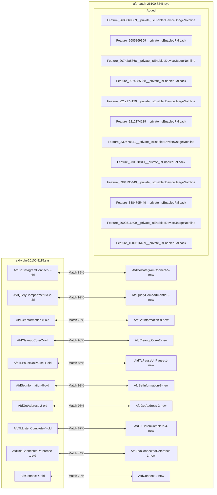
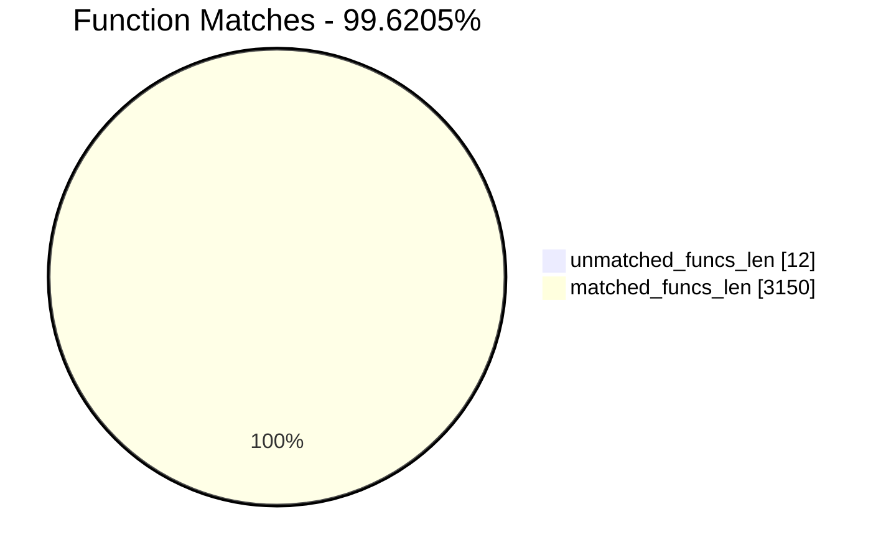
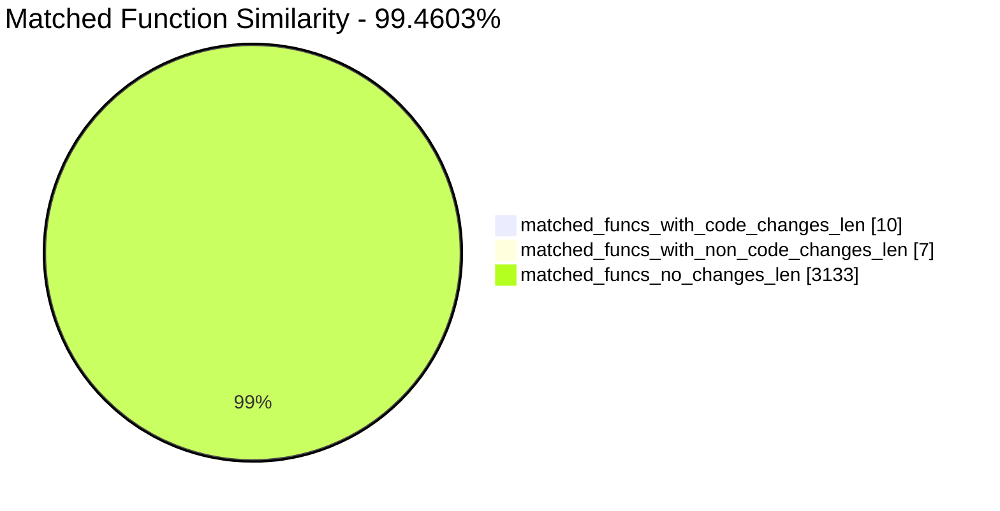
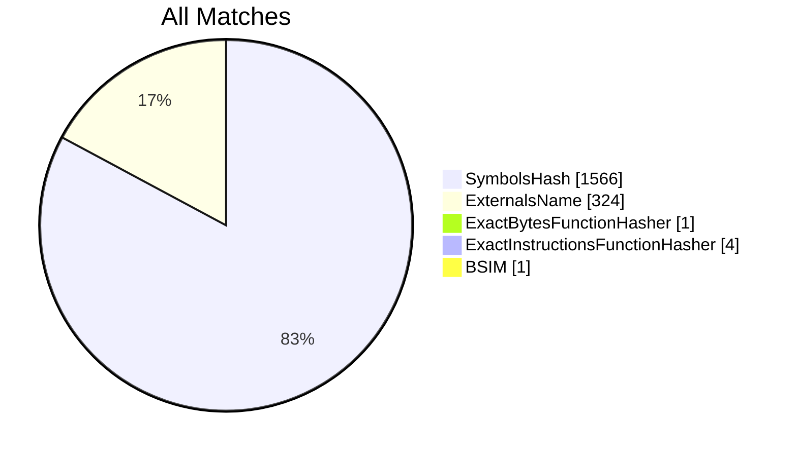
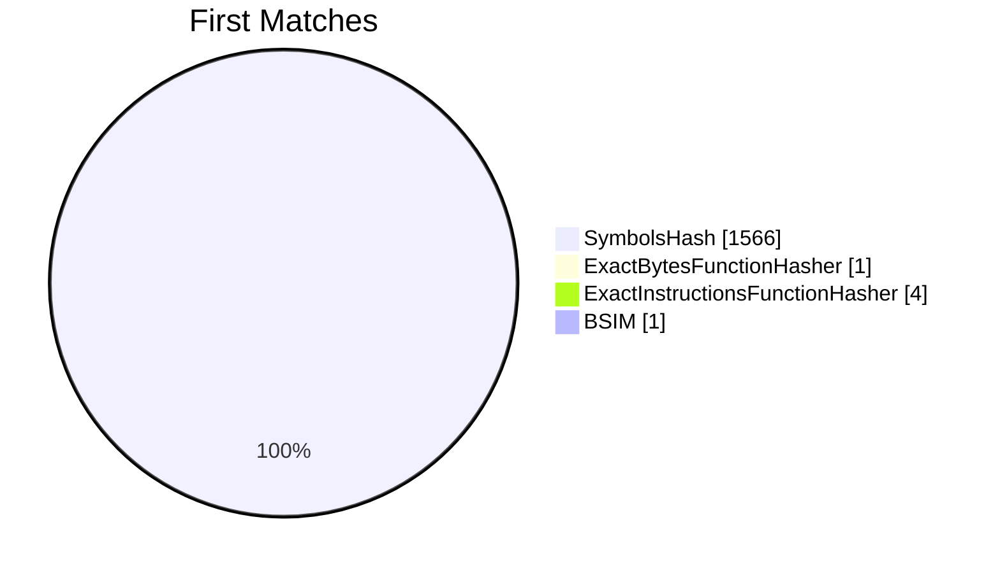
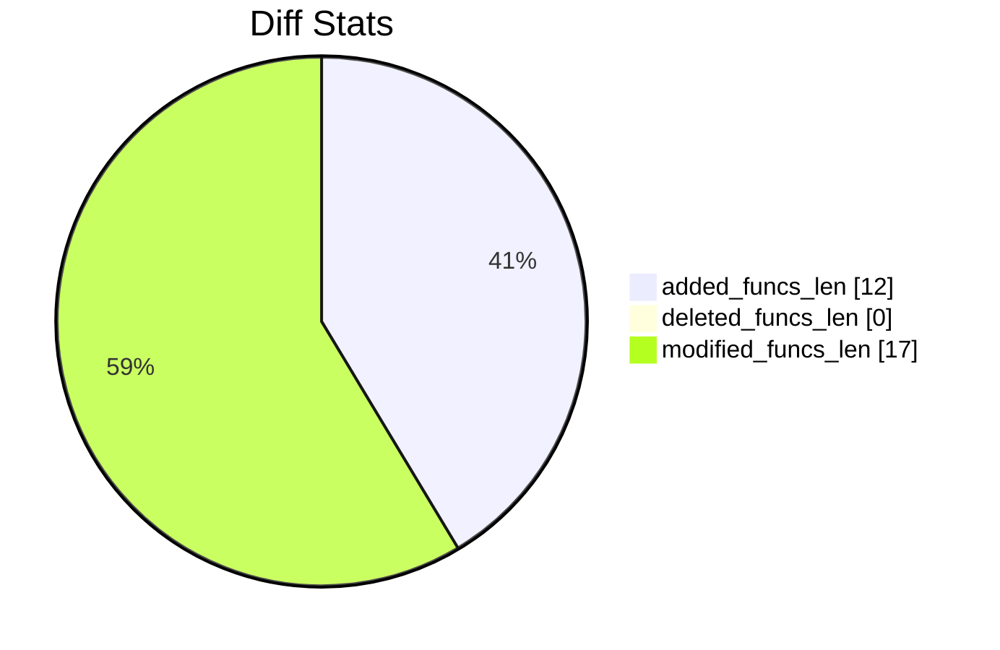
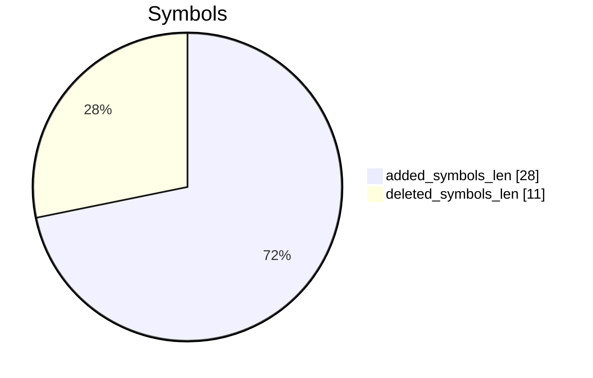

# afd-vuln-26100.8115.sys-afd-patch-26100.8246.sys Diff

# TOC

* [Visual Chart Diff](#visual-chart-diff)
* [Metadata](#metadata)
	* [Ghidra Diff Engine](#ghidra-diff-engine)
		* [Command Line](#command-line)
	* [Binary Metadata Diff](#binary-metadata-diff)
	* [Program Options](#program-options)
	* [Diff Stats](#diff-stats)
	* [Strings](#strings)
* [Deleted](#deleted)
* [Added](#added)
	* [Feature_2685869369__private_IsEnabledDeviceUsageNoInline](#feature_2685869369__private_isenableddeviceusagenoinline)
	* [Feature_2685869369__private_IsEnabledFallback](#feature_2685869369__private_isenabledfallback)
	* [Feature_2074285368__private_IsEnabledDeviceUsageNoInline](#feature_2074285368__private_isenableddeviceusagenoinline)
	* [Feature_2074285368__private_IsEnabledFallback](#feature_2074285368__private_isenabledfallback)
	* [Feature_2212174139__private_IsEnabledDeviceUsageNoInline](#feature_2212174139__private_isenableddeviceusagenoinline)
	* [Feature_2212174139__private_IsEnabledFallback](#feature_2212174139__private_isenabledfallback)
	* [Feature_230678841__private_IsEnabledDeviceUsageNoInline](#feature_230678841__private_isenableddeviceusagenoinline)
	* [Feature_230678841__private_IsEnabledFallback](#feature_230678841__private_isenabledfallback)
	* [Feature_3384795449__private_IsEnabledDeviceUsageNoInline](#feature_3384795449__private_isenableddeviceusagenoinline)
	* [Feature_3384795449__private_IsEnabledFallback](#feature_3384795449__private_isenabledfallback)
	* [Feature_4000516409__private_IsEnabledDeviceUsageNoInline](#feature_4000516409__private_isenableddeviceusagenoinline)
	* [Feature_4000516409__private_IsEnabledFallback](#feature_4000516409__private_isenabledfallback)
* [Modified](#modified)
	* [AfdDoDatagramConnect](#afddodatagramconnect)
	* [AfdQueryCompartmentId](#afdquerycompartmentid)
	* [AfdGetInformation](#afdgetinformation)
	* [AfdCleanupCore](#afdcleanupcore)
	* [AfdTLPauseUnPause](#afdtlpauseunpause)
	* [AfdSetInformation](#afdsetinformation)
	* [AfdGetAddress](#afdgetaddress)
	* [AfdTLListenComplete](#afdtllistencomplete)
	* [AfdAddConnectedReference](#afdaddconnectedreference)
	* [AfdConnect](#afdconnect)
* [Modified (No Code Changes)](#modified-no-code-changes)
	* [NTOSKRNL.EXE::KeAcquireInStackQueuedSpinLock](#ntoskrnlexekeacquireinstackqueuedspinlock)
	* [AfdCompleteIrpList](#afdcompleteirplist)
	* [AfdCleanupReceiveDatagramIrp](#afdcleanupreceivedatagramirp)
	* [NTOSKRNL.EXE::KeReleaseInStackQueuedSpinLock](#ntoskrnlexekereleaseinstackqueuedspinlock)
	* [wil_details_IsEnabledFallback](#wil_details_isenabledfallback)
	* [NTOSKRNL.EXE::IofCompleteRequest](#ntoskrnlexeiofcompleterequest)
	* [AFDETW_TRACECONNECT](#afdetw_traceconnect)

# Visual Chart Diff










# Metadata

## Ghidra Diff Engine

### Command Line

#### Captured Command Line


```
ghidriff --project-location ghidra-proj --project-name cve-26168 --symbols-path symbols --gzfs-path gzfs --threaded --log-level INFO --file-log-level INFO --log-path ghidriff.log --min-func-len 10 --gdt [] --bsim --max-ram-percent 60.0 --max-section-funcs 200 afd-vuln-26100.8115.sys afd-patch-26100.8246.sys
```


#### Verbose Args


<details>

```
--old ['afd-vuln-26100.8115.sys'] --new [['afd-patch-26100.8246.sys']] --engine VersionTrackingDiff --output-path diffs --summary False --project-location ghidra-proj --project-name cve-26168 --symbols-path symbols --gzfs-path gzfs --base-address None --program-options None --threaded True --force-analysis False --force-diff False --no-symbols False --log-level INFO --file-log-level INFO --log-path ghidriff.log --va False --min-func-len 10 --use-calling-counts False --gdt [] --bsim True --bsim-full False --max-ram-percent 60.0 --print-flags False --jvm-args None --side-by-side False --max-section-funcs 200 --md-title None
```


</details>

#### Download Original PEs


```
wget https://msdl.microsoft.com/download/symbols/afd.sys/BED53267B3000/afd.sys -O afd.sys.x64.10.0.26100.8115
wget https://msdl.microsoft.com/download/symbols/afd.sys/48AFE64FB4000/afd.sys -O afd.sys.x64.10.0.26100.8246
```


## Binary Metadata Diff


```diff
--- afd-vuln-26100.8115.sys Meta
+++ afd-patch-26100.8246.sys Meta
@@ -1,44 +1,44 @@
-Program Name: afd-vuln-26100.8115.sys
+Program Name: afd-patch-26100.8246.sys
 Language ID: x86:LE:64:default (4.6)
 Compiler ID: windows
 Processor: x86
 Endian: Little
 Address Size: 64
 Minimum Address: 140000000
 Maximum Address: ff0000184f
-# of Bytes: 735400
+# of Bytes: 739576
 # of Memory Blocks: 15
-# of Instructions: 114569
-# of Defined Data: 4760
-# of Functions: 1575
-# of Symbols: 14019
+# of Instructions: 114884
+# of Defined Data: 4803
+# of Functions: 1587
+# of Symbols: 14076
 # of Data Types: 389
 # of Data Type Categories: 24
 Analyzed: true
 Compiler: visualstudio:unknown
 Created With Ghidra Version: 12.0.4
-Date Created: Tue Apr 21 02:59:51 AST 2026
+Date Created: Tue Apr 21 02:59:52 AST 2026
 Executable Format: Portable Executable (PE)
-Executable Location: /home/cve/repos/win11-forge/lab/CVE-2026-26168/afd-vuln-26100.8115.sys
-Executable MD5: 14e2f36e728d92b5d591555682b51a88
-Executable SHA256: e92c1b11f15fc452d92a13ce2df85fdef8b7c064ef459b5fe1e1cbeac86e495d
-FSRL: file:///home/cve/repos/win11-forge/lab/CVE-2026-26168/afd-vuln-26100.8115.sys?MD5=14e2f36e728d92b5d591555682b51a88
+Executable Location: /home/cve/repos/win11-forge/lab/CVE-2026-26168/afd-patch-26100.8246.sys
+Executable MD5: 249c56721b214c309d8baad2400f8054
+Executable SHA256: ee5ba107472fe7c2566141a20cc46db59c104fce9a9e9e76dd492981a05a2389
+FSRL: file:///home/cve/repos/win11-forge/lab/CVE-2026-26168/afd-patch-26100.8246.sys?MD5=249c56721b214c309d8baad2400f8054
 PDB Age: 1
 PDB File: afd.pdb
-PDB GUID: c5dfb949-9128-94c7-8d00-f3026e1db1b3
+PDB GUID: b2169723-2964-824f-d205-f4c50114a95a
 PDB Loaded: true
 PDB Version: RSDS
 PE Property[CompanyName]: Microsoft Corporation
 PE Property[FileDescription]: Ancillary Function Driver for WinSock
-PE Property[FileVersion]: 10.0.26100.8115 (WinBuild.160101.0800)
+PE Property[FileVersion]: 10.0.26100.8246 (WinBuild.160101.0800)
 PE Property[InternalName]: afd.sys
 PE Property[LegalCopyright]: © Microsoft Corporation. All rights reserved.
 PE Property[OriginalFilename]: afd.sys
 PE Property[ProductName]: Microsoft® Windows® Operating System
-PE Property[ProductVersion]: 10.0.26100.8115
+PE Property[ProductVersion]: 10.0.26100.8246
 PE Property[Translation]: 4b00409
 Preferred Root Namespace Category: 
 RTTI Found: false
 Relocatable: true
 SectionAlignment: 4096
 Should Ask To Analyze: false

```


## Program Options


<details>
<summary>Ghidra afd-vuln-26100.8115.sys Decompiler Options</summary>


|Decompiler Option|Value|
| :---: | :---: |
|Prototype Evaluation|__fastcall|

</details>


<details>
<summary>Ghidra afd-vuln-26100.8115.sys Specification extensions Options</summary>


|Specification extensions Option|Value|
| :---: | :---: |
|FormatVersion|0|
|VersionCounter|0|

</details>


<details>
<summary>Ghidra afd-vuln-26100.8115.sys Analyzers Options</summary>


|Analyzers Option|Value|
| :---: | :---: |
|ASCII Strings|true|
|ASCII Strings.Create Strings Containing Existing Strings|true|
|ASCII Strings.Create Strings Containing References|true|
|ASCII Strings.Force Model Reload|false|
|ASCII Strings.Minimum String Length|LEN_5|
|ASCII Strings.Model File|StringModel.sng|
|ASCII Strings.Require Null Termination for String|true|
|ASCII Strings.Search Only in Accessible Memory Blocks|true|
|ASCII Strings.String Start Alignment|ALIGN_1|
|ASCII Strings.String end alignment|4|
|Aggressive Instruction Finder|false|
|Aggressive Instruction Finder.Create Analysis Bookmarks|true|
|Apply Data Archives|true|
|Apply Data Archives.Archive Chooser|[Auto-Detect]|
|Apply Data Archives.Create Analysis Bookmarks|true|
|Apply Data Archives.GDT User File Archive Path|None|
|Apply Data Archives.User Project Archive Path|None|
|Call Convention ID|true|
|Call Convention ID.Analysis Decompiler Timeout (sec)|60|
|Call-Fixup Installer|true|
|Condense Filler Bytes|false|
|Condense Filler Bytes.Filler Value|Auto|
|Condense Filler Bytes.Minimum number of sequential bytes|1|
|Create Address Tables|true|
|Create Address Tables.Allow Offcut References|false|
|Create Address Tables.Auto Label Table|false|
|Create Address Tables.Create Analysis Bookmarks|true|
|Create Address Tables.Maxmimum Pointer Distance|16777215|
|Create Address Tables.Minimum Pointer Address|4132|
|Create Address Tables.Minimum Table Size|2|
|Create Address Tables.Pointer Alignment|1|
|Create Address Tables.Relocation Table Guide|true|
|Create Address Tables.Table Alignment|4|
|Data Reference|true|
|Data Reference.Address Table Alignment|1|
|Data Reference.Address Table Minimum Size|2|
|Data Reference.Align End of Strings|false|
|Data Reference.Ascii String References|true|
|Data Reference.Create Address Tables|true|
|Data Reference.Minimum String Length|5|
|Data Reference.References to Pointers|true|
|Data Reference.Relocation Table Guide|true|
|Data Reference.Respect Execute Flag|true|
|Data Reference.Subroutine References|true|
|Data Reference.Switch Table References|false|
|Data Reference.Unicode String References|true|
|Decompiler Parameter ID|true|
|Decompiler Parameter ID.Analysis Clear Level|ANALYSIS|
|Decompiler Parameter ID.Analysis Decompiler Timeout (sec)|60|
|Decompiler Parameter ID.Commit Data Types|true|
|Decompiler Parameter ID.Commit Void Return Values|false|
|Decompiler Parameter ID.Prototype Evaluation|__fastcall|
|Decompiler Switch Analysis|true|
|Decompiler Switch Analysis.Analysis Decompiler Timeout (sec)|60|
|Demangler Microsoft|true|
|Demangler Microsoft.Apply Function Calling Conventions|true|
|Demangler Microsoft.Apply Function Signatures|true|
|Demangler Microsoft.C-Style Symbol Interpretation|FUNCTION_IF_EXISTS|
|Demangler Microsoft.Demangle Only Known Mangled Symbols|false|
|Disassemble Entry Points|true|
|Disassemble Entry Points.Respect Execute Flag|true|
|Embedded Media|true|
|Embedded Media.Create Analysis Bookmarks|true|
|External Entry References|true|
|Function ID|true|
|Function ID.Always Apply FID Labels|false|
|Function ID.Create Analysis Bookmarks|true|
|Function ID.Instruction Count Threshold|14.6|
|Function ID.Multiple Match Threshold|30.0|
|Function Start Search|true|
|Function Start Search.Bookmark Functions|false|
|Function Start Search.Search Data Blocks|false|
|Non-Returning Functions - Discovered|true|
|Non-Returning Functions - Discovered.Create Analysis Bookmarks|true|
|Non-Returning Functions - Discovered.Function Non-return Threshold|3|
|Non-Returning Functions - Discovered.Repair Flow Damage|true|
|Non-Returning Functions - Known|true|
|Non-Returning Functions - Known.Create Analysis Bookmarks|true|
|PDB MSDIA|false|
|PDB MSDIA.Search untrusted symbol servers|false|
|PDB Universal|true|
|PDB Universal.Import Source Line Info|true|
|PDB Universal.Search untrusted symbol servers|false|
|Reference|true|
|Reference.Address Table Alignment|1|
|Reference.Address Table Minimum Size|2|
|Reference.Align End of Strings|false|
|Reference.Ascii String References|true|
|Reference.Create Address Tables|true|
|Reference.Minimum String Length|5|
|Reference.References to Pointers|true|
|Reference.Relocation Table Guide|true|
|Reference.Respect Execute Flag|true|
|Reference.Subroutine References|true|
|Reference.Switch Table References|false|
|Reference.Unicode String References|true|
|Scalar Operand References|true|
|Scalar Operand References.Relocation Table Guide|true|
|Shared Return Calls|true|
|Shared Return Calls.Allow Conditional Jumps|false|
|Shared Return Calls.Assume Contiguous Functions Only|true|
|Stack|true|
|Stack.Create Local Variables|true|
|Stack.Create Param Variables|false|
|Stack.Max Threads|2|
|Subroutine References|true|
|Subroutine References.Create Thunks Early|true|
|Variadic Function Signature Override|false|
|Variadic Function Signature Override.Create Analysis Bookmarks|false|
|Windows x86 PE Exception Handling|true|
|Windows x86 PE RTTI Analyzer|true|
|Windows x86 Thread Environment Block (TEB) Analyzer|true|
|Windows x86 Thread Environment Block (TEB) Analyzer.Starting Address of the TEB||
|Windows x86 Thread Environment Block (TEB) Analyzer.Windows OS Version|Windows 7|
|WindowsPE x86 Propagate External Parameters|false|
|WindowsResourceReference|true|
|WindowsResourceReference.Create Analysis Bookmarks|true|
|x86 Constant Reference Analyzer|true|
|x86 Constant Reference Analyzer.Create Data from pointer|false|
|x86 Constant Reference Analyzer.Function parameter/return Pointer analysis|true|
|x86 Constant Reference Analyzer.Max Threads|2|
|x86 Constant Reference Analyzer.Min absolute reference|4|
|x86 Constant Reference Analyzer.Require pointer param data type|false|
|x86 Constant Reference Analyzer.Speculative reference max|256|
|x86 Constant Reference Analyzer.Speculative reference min|1024|
|x86 Constant Reference Analyzer.Stored Value Pointer analysis|true|
|x86 Constant Reference Analyzer.Trust values read from writable memory|true|

</details>


<details>
<summary>Ghidra afd-patch-26100.8246.sys Decompiler Options</summary>


|Decompiler Option|Value|
| :---: | :---: |
|Prototype Evaluation|__fastcall|

</details>


<details>
<summary>Ghidra afd-patch-26100.8246.sys Specification extensions Options</summary>


|Specification extensions Option|Value|
| :---: | :---: |
|FormatVersion|0|
|VersionCounter|0|

</details>


<details>
<summary>Ghidra afd-patch-26100.8246.sys Analyzers Options</summary>


|Analyzers Option|Value|
| :---: | :---: |
|ASCII Strings|true|
|ASCII Strings.Create Strings Containing Existing Strings|true|
|ASCII Strings.Create Strings Containing References|true|
|ASCII Strings.Force Model Reload|false|
|ASCII Strings.Minimum String Length|LEN_5|
|ASCII Strings.Model File|StringModel.sng|
|ASCII Strings.Require Null Termination for String|true|
|ASCII Strings.Search Only in Accessible Memory Blocks|true|
|ASCII Strings.String Start Alignment|ALIGN_1|
|ASCII Strings.String end alignment|4|
|Aggressive Instruction Finder|false|
|Aggressive Instruction Finder.Create Analysis Bookmarks|true|
|Apply Data Archives|true|
|Apply Data Archives.Archive Chooser|[Auto-Detect]|
|Apply Data Archives.Create Analysis Bookmarks|true|
|Apply Data Archives.GDT User File Archive Path|None|
|Apply Data Archives.User Project Archive Path|None|
|Call Convention ID|true|
|Call Convention ID.Analysis Decompiler Timeout (sec)|60|
|Call-Fixup Installer|true|
|Condense Filler Bytes|false|
|Condense Filler Bytes.Filler Value|Auto|
|Condense Filler Bytes.Minimum number of sequential bytes|1|
|Create Address Tables|true|
|Create Address Tables.Allow Offcut References|false|
|Create Address Tables.Auto Label Table|false|
|Create Address Tables.Create Analysis Bookmarks|true|
|Create Address Tables.Maxmimum Pointer Distance|16777215|
|Create Address Tables.Minimum Pointer Address|4132|
|Create Address Tables.Minimum Table Size|2|
|Create Address Tables.Pointer Alignment|1|
|Create Address Tables.Relocation Table Guide|true|
|Create Address Tables.Table Alignment|4|
|Data Reference|true|
|Data Reference.Address Table Alignment|1|
|Data Reference.Address Table Minimum Size|2|
|Data Reference.Align End of Strings|false|
|Data Reference.Ascii String References|true|
|Data Reference.Create Address Tables|true|
|Data Reference.Minimum String Length|5|
|Data Reference.References to Pointers|true|
|Data Reference.Relocation Table Guide|true|
|Data Reference.Respect Execute Flag|true|
|Data Reference.Subroutine References|true|
|Data Reference.Switch Table References|false|
|Data Reference.Unicode String References|true|
|Decompiler Parameter ID|true|
|Decompiler Parameter ID.Analysis Clear Level|ANALYSIS|
|Decompiler Parameter ID.Analysis Decompiler Timeout (sec)|60|
|Decompiler Parameter ID.Commit Data Types|true|
|Decompiler Parameter ID.Commit Void Return Values|false|
|Decompiler Parameter ID.Prototype Evaluation|__fastcall|
|Decompiler Switch Analysis|true|
|Decompiler Switch Analysis.Analysis Decompiler Timeout (sec)|60|
|Demangler Microsoft|true|
|Demangler Microsoft.Apply Function Calling Conventions|true|
|Demangler Microsoft.Apply Function Signatures|true|
|Demangler Microsoft.C-Style Symbol Interpretation|FUNCTION_IF_EXISTS|
|Demangler Microsoft.Demangle Only Known Mangled Symbols|false|
|Disassemble Entry Points|true|
|Disassemble Entry Points.Respect Execute Flag|true|
|Embedded Media|true|
|Embedded Media.Create Analysis Bookmarks|true|
|External Entry References|true|
|Function ID|true|
|Function ID.Always Apply FID Labels|false|
|Function ID.Create Analysis Bookmarks|true|
|Function ID.Instruction Count Threshold|14.6|
|Function ID.Multiple Match Threshold|30.0|
|Function Start Search|true|
|Function Start Search.Bookmark Functions|false|
|Function Start Search.Search Data Blocks|false|
|Non-Returning Functions - Discovered|true|
|Non-Returning Functions - Discovered.Create Analysis Bookmarks|true|
|Non-Returning Functions - Discovered.Function Non-return Threshold|3|
|Non-Returning Functions - Discovered.Repair Flow Damage|true|
|Non-Returning Functions - Known|true|
|Non-Returning Functions - Known.Create Analysis Bookmarks|true|
|PDB MSDIA|false|
|PDB MSDIA.Search untrusted symbol servers|false|
|PDB Universal|true|
|PDB Universal.Import Source Line Info|true|
|PDB Universal.Search untrusted symbol servers|false|
|Reference|true|
|Reference.Address Table Alignment|1|
|Reference.Address Table Minimum Size|2|
|Reference.Align End of Strings|false|
|Reference.Ascii String References|true|
|Reference.Create Address Tables|true|
|Reference.Minimum String Length|5|
|Reference.References to Pointers|true|
|Reference.Relocation Table Guide|true|
|Reference.Respect Execute Flag|true|
|Reference.Subroutine References|true|
|Reference.Switch Table References|false|
|Reference.Unicode String References|true|
|Scalar Operand References|true|
|Scalar Operand References.Relocation Table Guide|true|
|Shared Return Calls|true|
|Shared Return Calls.Allow Conditional Jumps|false|
|Shared Return Calls.Assume Contiguous Functions Only|true|
|Stack|true|
|Stack.Create Local Variables|true|
|Stack.Create Param Variables|false|
|Stack.Max Threads|2|
|Subroutine References|true|
|Subroutine References.Create Thunks Early|true|
|Variadic Function Signature Override|false|
|Variadic Function Signature Override.Create Analysis Bookmarks|false|
|Windows x86 PE Exception Handling|true|
|Windows x86 PE RTTI Analyzer|true|
|Windows x86 Thread Environment Block (TEB) Analyzer|true|
|Windows x86 Thread Environment Block (TEB) Analyzer.Starting Address of the TEB||
|Windows x86 Thread Environment Block (TEB) Analyzer.Windows OS Version|Windows 7|
|WindowsPE x86 Propagate External Parameters|false|
|WindowsResourceReference|true|
|WindowsResourceReference.Create Analysis Bookmarks|true|
|x86 Constant Reference Analyzer|true|
|x86 Constant Reference Analyzer.Create Data from pointer|false|
|x86 Constant Reference Analyzer.Function parameter/return Pointer analysis|true|
|x86 Constant Reference Analyzer.Max Threads|2|
|x86 Constant Reference Analyzer.Min absolute reference|4|
|x86 Constant Reference Analyzer.Require pointer param data type|false|
|x86 Constant Reference Analyzer.Speculative reference max|256|
|x86 Constant Reference Analyzer.Speculative reference min|1024|
|x86 Constant Reference Analyzer.Stored Value Pointer analysis|true|
|x86 Constant Reference Analyzer.Trust values read from writable memory|true|

</details>

## Diff Stats


|Stat|Value|
| :---: | :---: |
|added_funcs_len|12|
|deleted_funcs_len|0|
|modified_funcs_len|17|
|added_symbols_len|28|
|deleted_symbols_len|11|
|diff_time|21.072567224502563|
|deleted_strings_len|0|
|added_strings_len|0|
|match_types|Counter({'SymbolsHash': 1566, 'ExternalsName': 324, 'ExactInstructionsFunctionHasher': 4, 'ExactBytesFunctionHasher': 1, 'BSIM': 1})|
|items_to_process|68|
|diff_types|Counter({'address': 12, 'code': 10, 'length': 10, 'called': 10, 'refcount': 7, 'calling': 3, 'sig': 2})|
|unmatched_funcs_len|12|
|total_funcs_len|3162|
|matched_funcs_len|3150|
|matched_funcs_with_code_changes_len|10|
|matched_funcs_with_non_code_changes_len|7|
|matched_funcs_no_changes_len|3133|
|match_func_similarity_percent|99.4603%|
|func_match_overall_percent|99.6205%|
|first_matches|Counter({'SymbolsHash': 1566, 'ExactInstructionsFunctionHasher': 4, 'ExactBytesFunctionHasher': 1, 'BSIM': 1})|













## Strings


*No string differences found*

# Deleted

# Added

## Feature_2685869369__private_IsEnabledDeviceUsageNoInline

### Function Meta


|Key|afd-patch-26100.8246.sys|
| :---: | :---: |
|name|Feature_2685869369__private_IsEnabledDeviceUsageNoInline|
|fullname|Feature_2685869369__private_IsEnabledDeviceUsageNoInline|
|refcount|14|
|length|49|
|called|Feature_2685869369__private_IsEnabledFallback|
|calling|AfdGetAddress<br>AfdGetInformation<br>AfdQueryCompartmentId<br>AfdSetInformation<br>AfdTLListenComplete<br>AfdTLPauseUnPause|
|paramcount|0|
|address|14004c5ec|
|sig|ulonglong __fastcall Feature_2685869369__private_IsEnabledDeviceUsageNoInline(void)|
|sym_type|Function|
|sym_source|IMPORTED|
|external|False|


```diff
--- Feature_2685869369__private_IsEnabledDeviceUsageNoInline
+++ Feature_2685869369__private_IsEnabledDeviceUsageNoInline
@@ -0,0 +1,17 @@
+
+ulonglong Feature_2685869369__private_IsEnabledDeviceUsageNoInline(void)
+
+{
+  ulonglong uVar1;
+  undefined8 local_res8;
+  
+  local_res8 = (ulonglong)Feature_2685869369__private_featureState;
+  if ((Feature_2685869369__private_featureState & 0x10) == 0) {
+    uVar1 = Feature_2685869369__private_IsEnabledFallback(local_res8,3);
+  }
+  else {
+    uVar1 = (ulonglong)(Feature_2685869369__private_featureState & 1);
+  }
+  return uVar1;
+}
+

```


## Feature_2685869369__private_IsEnabledFallback

### Function Meta


|Key|afd-patch-26100.8246.sys|
| :---: | :---: |
|name|Feature_2685869369__private_IsEnabledFallback|
|fullname|Feature_2685869369__private_IsEnabledFallback|
|refcount|2|
|length|21|
|called|wil_details_IsEnabledFallback|
|calling|Feature_2685869369__private_IsEnabledDeviceUsageNoInline|
|paramcount|2|
|address|14004c624|
|sig|undefined __fastcall Feature_2685869369__private_IsEnabledFallback(ulonglong param_1, int param_2)|
|sym_type|Function|
|sym_source|IMPORTED|
|external|False|


```diff
--- Feature_2685869369__private_IsEnabledFallback
+++ Feature_2685869369__private_IsEnabledFallback
@@ -0,0 +1,8 @@
+
+void Feature_2685869369__private_IsEnabledFallback(ulonglong param_1,int param_2)
+
+{
+  wil_details_IsEnabledFallback(param_1,param_2,&Feature_2685869369__private_descriptor);
+  return;
+}
+

```


## Feature_2074285368__private_IsEnabledDeviceUsageNoInline

### Function Meta


|Key|afd-patch-26100.8246.sys|
| :---: | :---: |
|name|Feature_2074285368__private_IsEnabledDeviceUsageNoInline|
|fullname|Feature_2074285368__private_IsEnabledDeviceUsageNoInline|
|refcount|2|
|length|49|
|called|Feature_2074285368__private_IsEnabledFallback|
|calling|AfdAddConnectedReference|
|paramcount|0|
|address|14004c93c|
|sig|ulonglong __fastcall Feature_2074285368__private_IsEnabledDeviceUsageNoInline(void)|
|sym_type|Function|
|sym_source|IMPORTED|
|external|False|


```diff
--- Feature_2074285368__private_IsEnabledDeviceUsageNoInline
+++ Feature_2074285368__private_IsEnabledDeviceUsageNoInline
@@ -0,0 +1,17 @@
+
+ulonglong Feature_2074285368__private_IsEnabledDeviceUsageNoInline(void)
+
+{
+  ulonglong uVar1;
+  undefined8 local_res8;
+  
+  local_res8 = (ulonglong)Feature_2074285368__private_featureState;
+  if ((Feature_2074285368__private_featureState & 0x10) == 0) {
+    uVar1 = Feature_2074285368__private_IsEnabledFallback(local_res8,3);
+  }
+  else {
+    uVar1 = (ulonglong)(Feature_2074285368__private_featureState & 1);
+  }
+  return uVar1;
+}
+

```


## Feature_2074285368__private_IsEnabledFallback

### Function Meta


|Key|afd-patch-26100.8246.sys|
| :---: | :---: |
|name|Feature_2074285368__private_IsEnabledFallback|
|fullname|Feature_2074285368__private_IsEnabledFallback|
|refcount|2|
|length|21|
|called|wil_details_IsEnabledFallback|
|calling|Feature_2074285368__private_IsEnabledDeviceUsageNoInline|
|paramcount|2|
|address|14004c974|
|sig|undefined __fastcall Feature_2074285368__private_IsEnabledFallback(ulonglong param_1, int param_2)|
|sym_type|Function|
|sym_source|IMPORTED|
|external|False|


```diff
--- Feature_2074285368__private_IsEnabledFallback
+++ Feature_2074285368__private_IsEnabledFallback
@@ -0,0 +1,8 @@
+
+void Feature_2074285368__private_IsEnabledFallback(ulonglong param_1,int param_2)
+
+{
+  wil_details_IsEnabledFallback(param_1,param_2,&Feature_2074285368__private_descriptor);
+  return;
+}
+

```


## Feature_2212174139__private_IsEnabledDeviceUsageNoInline

### Function Meta


|Key|afd-patch-26100.8246.sys|
| :---: | :---: |
|name|Feature_2212174139__private_IsEnabledDeviceUsageNoInline|
|fullname|Feature_2212174139__private_IsEnabledDeviceUsageNoInline|
|refcount|3|
|length|49|
|called|Feature_2212174139__private_IsEnabledFallback|
|calling|AfdCleanupCore|
|paramcount|0|
|address|14004cfa0|
|sig|ulonglong __fastcall Feature_2212174139__private_IsEnabledDeviceUsageNoInline(void)|
|sym_type|Function|
|sym_source|IMPORTED|
|external|False|


```diff
--- Feature_2212174139__private_IsEnabledDeviceUsageNoInline
+++ Feature_2212174139__private_IsEnabledDeviceUsageNoInline
@@ -0,0 +1,17 @@
+
+ulonglong Feature_2212174139__private_IsEnabledDeviceUsageNoInline(void)
+
+{
+  ulonglong uVar1;
+  undefined8 local_res8;
+  
+  local_res8 = (ulonglong)Feature_2212174139__private_featureState;
+  if ((Feature_2212174139__private_featureState & 0x10) == 0) {
+    uVar1 = Feature_2212174139__private_IsEnabledFallback(local_res8,3);
+  }
+  else {
+    uVar1 = (ulonglong)(Feature_2212174139__private_featureState & 1);
+  }
+  return uVar1;
+}
+

```


## Feature_2212174139__private_IsEnabledFallback

### Function Meta


|Key|afd-patch-26100.8246.sys|
| :---: | :---: |
|name|Feature_2212174139__private_IsEnabledFallback|
|fullname|Feature_2212174139__private_IsEnabledFallback|
|refcount|2|
|length|21|
|called|wil_details_IsEnabledFallback|
|calling|Feature_2212174139__private_IsEnabledDeviceUsageNoInline|
|paramcount|2|
|address|14004cfd8|
|sig|undefined __fastcall Feature_2212174139__private_IsEnabledFallback(ulonglong param_1, int param_2)|
|sym_type|Function|
|sym_source|IMPORTED|
|external|False|


```diff
--- Feature_2212174139__private_IsEnabledFallback
+++ Feature_2212174139__private_IsEnabledFallback
@@ -0,0 +1,8 @@
+
+void Feature_2212174139__private_IsEnabledFallback(ulonglong param_1,int param_2)
+
+{
+  wil_details_IsEnabledFallback(param_1,param_2,&Feature_2212174139__private_descriptor);
+  return;
+}
+

```


## Feature_230678841__private_IsEnabledDeviceUsageNoInline

### Function Meta


|Key|afd-patch-26100.8246.sys|
| :---: | :---: |
|name|Feature_230678841__private_IsEnabledDeviceUsageNoInline|
|fullname|Feature_230678841__private_IsEnabledDeviceUsageNoInline|
|refcount|3|
|length|49|
|called|Feature_230678841__private_IsEnabledFallback|
|calling|AfdDoDatagramConnect|
|paramcount|0|
|address|14004d61c|
|sig|ulonglong __fastcall Feature_230678841__private_IsEnabledDeviceUsageNoInline(void)|
|sym_type|Function|
|sym_source|IMPORTED|
|external|False|


```diff
--- Feature_230678841__private_IsEnabledDeviceUsageNoInline
+++ Feature_230678841__private_IsEnabledDeviceUsageNoInline
@@ -0,0 +1,17 @@
+
+ulonglong Feature_230678841__private_IsEnabledDeviceUsageNoInline(void)
+
+{
+  ulonglong uVar1;
+  undefined8 local_res8;
+  
+  local_res8 = (ulonglong)Feature_230678841__private_featureState;
+  if ((Feature_230678841__private_featureState & 0x10) == 0) {
+    uVar1 = Feature_230678841__private_IsEnabledFallback(local_res8,3);
+  }
+  else {
+    uVar1 = (ulonglong)(Feature_230678841__private_featureState & 1);
+  }
+  return uVar1;
+}
+

```


## Feature_230678841__private_IsEnabledFallback

### Function Meta


|Key|afd-patch-26100.8246.sys|
| :---: | :---: |
|name|Feature_230678841__private_IsEnabledFallback|
|fullname|Feature_230678841__private_IsEnabledFallback|
|refcount|2|
|length|21|
|called|wil_details_IsEnabledFallback|
|calling|Feature_230678841__private_IsEnabledDeviceUsageNoInline|
|paramcount|2|
|address|14004d654|
|sig|undefined __fastcall Feature_230678841__private_IsEnabledFallback(ulonglong param_1, int param_2)|
|sym_type|Function|
|sym_source|IMPORTED|
|external|False|


```diff
--- Feature_230678841__private_IsEnabledFallback
+++ Feature_230678841__private_IsEnabledFallback
@@ -0,0 +1,8 @@
+
+void Feature_230678841__private_IsEnabledFallback(ulonglong param_1,int param_2)
+
+{
+  wil_details_IsEnabledFallback(param_1,param_2,&Feature_230678841__private_descriptor);
+  return;
+}
+

```


## Feature_3384795449__private_IsEnabledDeviceUsageNoInline

### Function Meta


|Key|afd-patch-26100.8246.sys|
| :---: | :---: |
|name|Feature_3384795449__private_IsEnabledDeviceUsageNoInline|
|fullname|Feature_3384795449__private_IsEnabledDeviceUsageNoInline|
|refcount|3|
|length|49|
|called|Feature_3384795449__private_IsEnabledFallback|
|calling|AfdConnect|
|paramcount|0|
|address|14004d670|
|sig|ulonglong __fastcall Feature_3384795449__private_IsEnabledDeviceUsageNoInline(void)|
|sym_type|Function|
|sym_source|IMPORTED|
|external|False|


```diff
--- Feature_3384795449__private_IsEnabledDeviceUsageNoInline
+++ Feature_3384795449__private_IsEnabledDeviceUsageNoInline
@@ -0,0 +1,17 @@
+
+ulonglong Feature_3384795449__private_IsEnabledDeviceUsageNoInline(void)
+
+{
+  ulonglong uVar1;
+  undefined8 local_res8;
+  
+  local_res8 = (ulonglong)Feature_3384795449__private_featureState;
+  if ((Feature_3384795449__private_featureState & 0x10) == 0) {
+    uVar1 = Feature_3384795449__private_IsEnabledFallback(local_res8,3);
+  }
+  else {
+    uVar1 = (ulonglong)(Feature_3384795449__private_featureState & 1);
+  }
+  return uVar1;
+}
+

```


## Feature_3384795449__private_IsEnabledFallback

### Function Meta


|Key|afd-patch-26100.8246.sys|
| :---: | :---: |
|name|Feature_3384795449__private_IsEnabledFallback|
|fullname|Feature_3384795449__private_IsEnabledFallback|
|refcount|2|
|length|21|
|called|wil_details_IsEnabledFallback|
|calling|Feature_3384795449__private_IsEnabledDeviceUsageNoInline|
|paramcount|2|
|address|14004d6a8|
|sig|undefined __fastcall Feature_3384795449__private_IsEnabledFallback(ulonglong param_1, int param_2)|
|sym_type|Function|
|sym_source|IMPORTED|
|external|False|


```diff
--- Feature_3384795449__private_IsEnabledFallback
+++ Feature_3384795449__private_IsEnabledFallback
@@ -0,0 +1,8 @@
+
+void Feature_3384795449__private_IsEnabledFallback(ulonglong param_1,int param_2)
+
+{
+  wil_details_IsEnabledFallback(param_1,param_2,&Feature_3384795449__private_descriptor);
+  return;
+}
+

```


## Feature_4000516409__private_IsEnabledDeviceUsageNoInline

### Function Meta


|Key|afd-patch-26100.8246.sys|
| :---: | :---: |
|name|Feature_4000516409__private_IsEnabledDeviceUsageNoInline|
|fullname|Feature_4000516409__private_IsEnabledDeviceUsageNoInline|
|refcount|2|
|length|49|
|called|Feature_4000516409__private_IsEnabledFallback|
|calling|AfdConnect|
|paramcount|0|
|address|14004d6c4|
|sig|ulonglong __fastcall Feature_4000516409__private_IsEnabledDeviceUsageNoInline(void)|
|sym_type|Function|
|sym_source|IMPORTED|
|external|False|


```diff
--- Feature_4000516409__private_IsEnabledDeviceUsageNoInline
+++ Feature_4000516409__private_IsEnabledDeviceUsageNoInline
@@ -0,0 +1,17 @@
+
+ulonglong Feature_4000516409__private_IsEnabledDeviceUsageNoInline(void)
+
+{
+  ulonglong uVar1;
+  undefined8 local_res8;
+  
+  local_res8 = (ulonglong)Feature_4000516409__private_featureState;
+  if ((Feature_4000516409__private_featureState & 0x10) == 0) {
+    uVar1 = Feature_4000516409__private_IsEnabledFallback(local_res8,3);
+  }
+  else {
+    uVar1 = (ulonglong)(Feature_4000516409__private_featureState & 1);
+  }
+  return uVar1;
+}
+

```


## Feature_4000516409__private_IsEnabledFallback

### Function Meta


|Key|afd-patch-26100.8246.sys|
| :---: | :---: |
|name|Feature_4000516409__private_IsEnabledFallback|
|fullname|Feature_4000516409__private_IsEnabledFallback|
|refcount|2|
|length|21|
|called|wil_details_IsEnabledFallback|
|calling|Feature_4000516409__private_IsEnabledDeviceUsageNoInline|
|paramcount|2|
|address|14004d6fc|
|sig|undefined __fastcall Feature_4000516409__private_IsEnabledFallback(ulonglong param_1, int param_2)|
|sym_type|Function|
|sym_source|IMPORTED|
|external|False|


```diff
--- Feature_4000516409__private_IsEnabledFallback
+++ Feature_4000516409__private_IsEnabledFallback
@@ -0,0 +1,8 @@
+
+void Feature_4000516409__private_IsEnabledFallback(ulonglong param_1,int param_2)
+
+{
+  wil_details_IsEnabledFallback(param_1,param_2,&Feature_4000516409__private_descriptor);
+  return;
+}
+

```


# Modified


*Modified functions contain code changes*
## AfdDoDatagramConnect

### Match Info


|Key|afd-vuln-26100.8115.sys - afd-patch-26100.8246.sys|
| :---: | :---: |
|diff_type|code,length,sig,address,called|
|ratio|0.37|
|i_ratio|0.41|
|m_ratio|0.97|
|b_ratio|0.82|
|match_types|SymbolsHash|

### Function Meta Diff


|Key|afd-vuln-26100.8115.sys|afd-patch-26100.8246.sys|
| :---: | :---: | :---: |
|name|AfdDoDatagramConnect|AfdDoDatagramConnect|
|fullname|AfdDoDatagramConnect|AfdDoDatagramConnect|
|refcount|3|3|
|`length`|1200|1266|
|`called`|<details><summary>Expand for full list:<br>AFDETW_TRACECONNECT<br>AfdAllocatePoolPriority<br>AfdAllocateZeroedFromLookasideList<br>AfdIndicateEventSelectEvent<br>AfdIndicatePollEvent<br>AfdNotifySockEventsChangedUnderLock<br>AfdNotifySockIndicateEventsUnlock<br>AfdTLIoControl<br>AfdTLPendRequest<br>AfdTdi_TA6toTA4_InPlace<br>NTOSKRNL.EXE::ExFreePoolWithTag</summary>NTOSKRNL.EXE::IofCallDriver<br>NTOSKRNL.EXE::IofCompleteRequest<br>NTOSKRNL.EXE::KeAcquireInStackQueuedSpinLock<br>NTOSKRNL.EXE::KeReleaseInStackQueuedSpinLock<br>NTOSKRNL.EXE::ObfDereferenceObject<br>PplFreeToLookasideList<br>memcpy<br>memset</details>|<details><summary>Expand for full list:<br>AFDETW_TRACECONNECT<br>AfdAllocatePoolPriority<br>AfdAllocateZeroedFromLookasideList<br>AfdIndicateEventSelectEvent<br>AfdIndicatePollEvent<br>AfdNotifySockEventsChangedUnderLock<br>AfdNotifySockIndicateEventsUnlock<br>AfdTLIoControl<br>AfdTLPendRequest<br>AfdTdi_TA6toTA4_InPlace<br>Feature_230678841__private_IsEnabledDeviceUsageNoInline</summary>NTOSKRNL.EXE::ExFreePoolWithTag<br>NTOSKRNL.EXE::IofCallDriver<br>NTOSKRNL.EXE::IofCompleteRequest<br>NTOSKRNL.EXE::KeAcquireInStackQueuedSpinLock<br>NTOSKRNL.EXE::KeReleaseInStackQueuedSpinLock<br>NTOSKRNL.EXE::ObfDereferenceObject<br>PplFreeToLookasideList<br>memmove<br>memset</details>|
|calling|AfdConnect|AfdConnect|
|paramcount|5|5|
|`address`|14002eb8c|14002ed80|
|`sig`|ulonglong __fastcall AfdDoDatagramConnect(longlong param_1, longlong param_2, ushort * param_3, uint param_4, byte param_5)|ulonglong __fastcall AfdDoDatagramConnect(longlong param_1, longlong param_2, ushort * param_3, ulonglong param_4, byte param_5)|
|sym_type|Function|Function|
|sym_source|IMPORTED|IMPORTED|
|external|False|False|

### AfdDoDatagramConnect Called Diff


```diff
--- AfdDoDatagramConnect called
+++ AfdDoDatagramConnect called
@@ -10,0 +11 @@
+Feature_230678841__private_IsEnabledDeviceUsageNoInline
@@ -18 +19 @@
-memcpy
+memmove
```


### AfdDoDatagramConnect Diff


```diff
--- AfdDoDatagramConnect
+++ AfdDoDatagramConnect
@@ -1,192 +1,219 @@
 
 ulonglong AfdDoDatagramConnect
-                    (longlong param_1,longlong param_2,ushort *param_3,uint param_4,byte param_5)
+                    (longlong param_1,longlong param_2,ushort *param_3,ulonglong param_4,
+                    byte param_5)
 
 {
   uint *puVar1;
-  ushort *puVar2;
+  short *psVar2;
   longlong lVar3;
   longlong lVar4;
   undefined1 uVar5;
   char cVar6;
   uint uVar7;
   void *_Dst;
   undefined8 uVar8;
   ushort *puVar9;
-  undefined8 uVar10;
-  ulonglong uVar11;
-  undefined4 uVar12;
-  undefined8 *puVar13;
-  ushort *puVar14;
-  uint uVar15;
-  undefined8 uVar16;
-  undefined8 local_a8;
-  undefined8 uStack_a0;
+  ulonglong uVar10;
+  undefined8 uVar11;
+  int iVar12;
+  short *psVar13;
+  undefined4 uVar14;
+  undefined8 *puVar15;
+  byte bVar16;
+  undefined8 uVar17;
+  uint uVar18;
+  bool bVar19;
   undefined8 local_98;
-  code *local_88;
-  longlong local_80;
-  undefined4 local_78;
-  undefined4 local_74;
-  int local_70;
-  ushort *local_68;
-  ulonglong local_60;
-  undefined8 local_48;
+  undefined8 uStack_90;
+  undefined8 local_88;
+  code *local_78;
+  longlong local_70;
+  undefined4 local_68;
+  undefined4 local_64;
+  int local_60;
+  ushort *local_58;
+  ulonglong local_50;
+  undefined8 local_38;
   
-  puVar2 = *(ushort **)(param_1 + 0x18);
+  psVar2 = *(short **)(param_1 + 0x18);
   lVar3 = *(longlong *)(param_2 + 0x18);
+  bVar16 = 0;
+  local_88 = 0;
   local_98 = 0;
-  local_a8 = 0;
-  uStack_a0 = 0;
-  puVar14 = puVar2 + 0xb4;
+  uStack_90 = 0;
   LOCK();
-  if (*(int *)puVar14 == 0) {
-    puVar14[0] = 4;
-    puVar14[1] = 0;
+  bVar19 = *(int *)(psVar2 + 0xb8) == 0;
+  if (bVar19) {
+    *(int *)(psVar2 + 0xb8) = 4;
   }
   UNLOCK();
-  if (*(int *)puVar14 != 0) {
-    uVar15 = 0xc000000d;
-    AFDETW_TRACECONNECT(0,0x157c,(short *)puVar2,0xc000000d,(ushort *)0x0);
+  if (!bVar19) {
+    uVar18 = 0xc000000d;
+    AFDETW_TRACECONNECT(0,0x157c,psVar2,0xc000000d,(ushort *)0x0);
     goto LAB_0;
   }
-  puVar14 = (ushort *)0x1;
-  if ((char)puVar2[1] == '\x03' || (char)puVar2[1] == '\x04') {
-    KeAcquireInStackQueuedSpinLock(puVar2 + 0x1c);
-    uVar7 = *(uint *)(puVar2 + 0x58);
-    *(uint *)(puVar2 + 4) = *(uint *)(puVar2 + 4) & 0xfff0ffff;
-    *(uint *)(puVar2 + 0x58) = ((uint)param_5 << 4 ^ uVar7) & 0x10 ^ uVar7;
-    if ((*(uint *)(puVar2 + 4) >> 8 & 1) != 0) {
-      memset(&local_88,0,0x50);
-      AFDETW_TRACECONNECT(0,0x157e,(short *)puVar2,0,param_3);
-      puVar2[0xd6] = 0;
-      puVar2[0xd7] = 0;
-      *(uint *)(puVar2 + 0x24) = *(uint *)(puVar2 + 0x24) & 0xfffffeff;
-      puVar14 = puVar2;
-      AfdNotifySockEventsChangedUnderLock((longlong)puVar2,0,0x100);
-      AfdNotifySockIndicateEventsUnlock((longlong)puVar14,&local_a8,'\0');
+  if ((byte)((char)psVar2[1] - 3U) < 2) {
+    KeAcquireInStackQueuedSpinLock(psVar2 + 0x1c);
+    uVar7 = *(uint *)(psVar2 + 0x58);
+    *(uint *)(psVar2 + 4) = *(uint *)(psVar2 + 4) & 0xfff0ffff;
+    *(uint *)(psVar2 + 0x58) = ((uint)param_5 << 4 ^ uVar7) & 0x10 ^ uVar7;
+    if ((*(uint *)(psVar2 + 4) >> 8 & 1) != 0) {
+      memset(&local_78,0,0x50);
+      AFDETW_TRACECONNECT(0,0x157e,psVar2,0,param_3);
+      psVar2[0xda] = 0;
+      psVar2[0xdb] = 0;
+      *(uint *)(psVar2 + 0x24) = *(uint *)(psVar2 + 0x24) & 0xfffffeff;
+      psVar13 = psVar2;
+      AfdNotifySockEventsChangedUnderLock((longlong)psVar2,0,0x100);
+      AfdNotifySockIndicateEventsUnlock((longlong)psVar13,&local_98,'\0');
       *(undefined8 *)(param_2 + 0x88) = 0;
-      local_88 = AfdTLDgramConnectComplete;
-      local_78 = 0;
-      local_70 = (-(uint)(param_5 != 0) & 0xc) + 0x1c;
-      local_74 = 0xfffd;
-      local_60 = (ulonglong)param_4;
-      local_80 = param_2;
-      local_68 = param_3;
-      uVar7 = AfdTLIoControl(*(undefined **)(*(longlong *)(puVar2 + 0xc) + 8),
-                             *(undefined8 *)(puVar2 + 8),(longlong *)&local_88,puVar2);
-      if ((uVar7 != 0x103) || (cVar6 = AfdTLPendRequest(param_2,local_48,'\x01'), cVar6 == '\0')) {
+      local_78 = AfdTLDgramConnectComplete;
+      local_68 = 0;
+      local_60 = (-(uint)(param_5 != 0) & 0xc) + 0x1c;
+      local_64 = 0xfffd;
+      local_70 = param_2;
+      local_58 = param_3;
+      local_50 = param_4 & 0xffffffff;
+      uVar7 = AfdTLIoControl(*(undefined **)(*(longlong *)(psVar2 + 0xc) + 8),
+                             *(undefined8 *)(psVar2 + 8),(longlong *)&local_78,(longlong)psVar2);
+      if ((uVar7 != 0x103) || (cVar6 = AfdTLPendRequest(param_2,local_38,'\x01'), cVar6 == '\0')) {
         IofCompleteRequest(param_2,AfdPriorityBoost);
       }
       return (ulonglong)uVar7;
     }
-    _Dst = *(void **)(puVar2 + 0x54);
-    uVar15 = 0;
-    if ((_Dst == (void *)0x0) || (*(uint *)(puVar2 + 0x52) < *(uint *)(lVar3 + 0x20))) {
+    _Dst = *(void **)(psVar2 + 0x54);
+    uVar18 = 0;
+    if ((_Dst == (void *)0x0) || (*(uint *)(psVar2 + 0x52) < *(uint *)(lVar3 + 0x20))) {
       if (AfdStandardAddressLength < *(uint *)(lVar3 + 0x20)) {
         _Dst = (void *)AfdAllocatePoolPriority();
       }
       else {
         _Dst = AfdAllocateZeroedFromLookasideList
                          ((ulonglong)uVar7,(longlong)(int)*(uint *)(lVar3 + 0x20));
       }
       if (_Dst == (void *)0x0) {
-        KeReleaseInStackQueuedSpinLock(&local_a8);
-        uVar12 = 0x157f;
-        uVar15 = 0xc000009a;
+        KeReleaseInStackQueuedSpinLock(&local_98);
+        uVar14 = 0x157f;
+        uVar18 = 0xc000009a;
         goto LAB_1;
       }
-      lVar4 = *(longlong *)(puVar2 + 0x54);
+      lVar4 = *(longlong *)(psVar2 + 0x54);
       if (lVar4 != 0) {
-        if (AfdStandardAddressLength < *(uint *)(puVar2 + 0x52)) {
+        if (AfdStandardAddressLength < *(uint *)(psVar2 + 0x52)) {
           ExFreePoolWithTag(lVar4,0x52646641);
         }
         else {
           PplFreeToLookasideList(PplAddressPool,lVar4);
         }
       }
-      *(void **)(puVar2 + 0x54) = _Dst;
+      *(void **)(psVar2 + 0x54) = _Dst;
     }
     puVar1 = (uint *)(lVar3 + 0x20);
-    memcpy(_Dst,*(void **)(lVar3 + 0x28),(longlong)(int)*puVar1);
-    *(uint *)(puVar2 + 0x52) = *puVar1;
-    AFDETW_TRACECONNECT(0,0x1580,(short *)puVar2,0,*(ushort **)(puVar2 + 0x54));
-    if (((*(uint *)(puVar2 + 4) & 0x100) != 0) || ((*(uint *)(puVar2 + 8) & 0x8000) != 0)) {
-      uVar8 = *(undefined8 *)(puVar2 + 0xc);
-      uVar16 = *(undefined8 *)(puVar2 + 0x14);
-      puVar2[0xd6] = 0;
-      puVar2[0xd7] = 0;
-      *(uint *)(puVar2 + 0x24) = *(uint *)(puVar2 + 0x24) & 0xfffffeff;
-      AfdNotifySockEventsChangedUnderLock((longlong)puVar2,0,0x100);
-      if ((*(uint *)(puVar2 + 4) >> 0x16 & 1) == 0) {
-        if ((*(uint *)(puVar2 + 4) >> 0x15 & 1) != 0) {
+    memmove(_Dst,*(void **)(lVar3 + 0x28),(longlong)(int)*puVar1);
+    *(uint *)(psVar2 + 0x52) = *puVar1;
+    AFDETW_TRACECONNECT(0,0x1580,psVar2,0,*(ushort **)(psVar2 + 0x54));
+    if (((*(uint *)(psVar2 + 4) & 0x100) != 0) || ((*(uint *)(psVar2 + 8) & 0x8000) != 0)) {
+      uVar8 = *(undefined8 *)(psVar2 + 0xc);
+      uVar17 = *(undefined8 *)(psVar2 + 0x14);
+      *(uint *)(psVar2 + 0x24) = *(uint *)(psVar2 + 0x24) & 0xfffffeff;
+      psVar2[0xda] = 0;
+      psVar2[0xdb] = 0;
+      AfdNotifySockEventsChangedUnderLock((longlong)psVar2,0,0x100);
+      if ((*(uint *)(psVar2 + 4) >> 0x16 & 1) == 0) {
+        if ((*(uint *)(psVar2 + 4) >> 0x15 & 1) != 0) {
           AfdTdi_TA6toTA4_InPlace(*(int **)(lVar3 + 0x28),puVar1);
         }
       }
       else {
-        uVar10 = AfdTdi_TA6toTA4_InPlace(*(int **)(lVar3 + 0x28),puVar1);
-        if ((char)uVar10 == '\0') {
-          *(uint *)(puVar2 + 0x58) = *(uint *)(puVar2 + 0x58) & 0xffffffdf | 0x40;
+        uVar11 = AfdTdi_TA6toTA4_InPlace(*(int **)(lVar3 + 0x28),puVar1);
+        if ((char)uVar11 == '\0') {
+          *(uint *)(psVar2 + 0x58) = *(uint *)(psVar2 + 0x58) & 0xffffffdf | 0x40;
         }
         else {
-          uVar8 = *(undefined8 *)(*(longlong *)(puVar2 + 0x88) + 8);
-          uVar16 = *(undefined8 *)(*(longlong *)(puVar2 + 0x88) + 0x10);
-          *(uint *)(puVar2 + 0x58) = *(uint *)(puVar2 + 0x58) | 0x20;
-        }
-      }
-      AfdNotifySockIndicateEventsUnlock((longlong)puVar2,&local_a8,'\0');
+          uVar8 = *(undefined8 *)(*(longlong *)(psVar2 + 0x8c) + 8);
+          uVar17 = *(undefined8 *)(*(longlong *)(psVar2 + 0x8c) + 0x10);
+          *(uint *)(psVar2 + 0x58) = *(uint *)(psVar2 + 0x58) | 0x20;
+        }
+      }
+      AfdNotifySockIndicateEventsUnlock((longlong)psVar2,&local_98,'\0');
       lVar4 = *(longlong *)(param_2 + 0xb8);
       *(code **)(lVar4 + -0x10) = AfdRestartDgConnect;
-      *(ushort **)(lVar4 + -8) = puVar2;
+      *(short **)(lVar4 + -8) = psVar2;
       *(undefined1 *)(lVar4 + -0x45) = 0xe0;
       lVar4 = *(longlong *)(param_2 + 0xb8);
       *(longlong *)(lVar4 + -0x30) = lVar3 + 0x30;
       *(undefined8 **)(lVar4 + -0x28) = &AfdInfiniteTimeout;
       *(undefined2 *)(lVar4 + -0x48) = 0x30f;
-      *(undefined8 *)(lVar4 + -0x20) = uVar16;
+      *(undefined8 *)(lVar4 + -0x20) = uVar17;
       *(undefined8 *)(lVar4 + -0x18) = uVar8;
       *(longlong *)(lVar4 + -0x38) = lVar3;
       LOCK();
-      *(int *)(puVar2 + 0x7c) = *(int *)(puVar2 + 0x7c) + 1;
+      *(int *)(psVar2 + 0x7c) = *(int *)(psVar2 + 0x7c) + 1;
       UNLOCK();
-      uVar11 = IofCallDriver(uVar16,param_2);
-      return uVar11;
-    }
-    *(undefined1 *)(puVar2 + 1) = 4;
-    *(uint *)(puVar2 + 4) = *(uint *)(puVar2 + 4) | 0x2000000;
-    AfdIndicateEventSelectEvent((short *)puVar2,0x44,0);
-    puVar9 = puVar2;
-    AfdNotifySockEventsChangedUnderLock((longlong)puVar2,4,0);
-    uVar8 = AfdIndicatePollEvent((short *)puVar9,0x44,0,&local_a8);
-    puVar13 = &local_a8;
+      uVar10 = IofCallDriver(uVar17,param_2);
+      return uVar10;
+    }
+    *(undefined1 *)(psVar2 + 1) = 4;
+    *(uint *)(psVar2 + 4) = *(uint *)(psVar2 + 4) | 0x2000000;
+    AfdIndicateEventSelectEvent(psVar2,0x44,0);
+    psVar13 = psVar2;
+    AfdNotifySockEventsChangedUnderLock((longlong)psVar2,4,0);
+    uVar8 = AfdIndicatePollEvent(psVar13,0x44,0,&local_98);
+    puVar15 = &local_98;
     if ((char)uVar8 != '\0') {
-      puVar13 = (undefined8 *)0x0;
-    }
-    AfdNotifySockIndicateEventsUnlock((longlong)puVar2,puVar13,'\0');
-    puVar9 = *(ushort **)(puVar2 + 0x54);
-    uVar12 = 0x1581;
-  }
-  else {
-    uVar15 = 0xc000000d;
-    uVar12 = 0x157d;
+      puVar15 = (undefined8 *)0x0;
+    }
+    AfdNotifySockIndicateEventsUnlock((longlong)psVar2,puVar15,'\0');
+    puVar9 = *(ushort **)(psVar2 + 0x54);
+    iVar12 = 1;
+    uVar14 = 0x1581;
+  }
+  else {
+    uVar18 = 0xc000000d;
+    uVar14 = 0x157d;
 LAB_1:
     puVar9 = (ushort *)0x0;
-    puVar14 = puVar9;
-  }
-  AFDETW_TRACECONNECT((int)puVar14,uVar12,(short *)puVar2,uVar15,puVar9);
+    iVar12 = 0;
+  }
+  AFDETW_TRACECONNECT(iVar12,uVar14,psVar2,uVar18,puVar9);
   LOCK();
-  puVar2[0xb4] = 0;
-  puVar2[0xb5] = 0;
+  psVar2[0xb8] = 0;
+  psVar2[0xb9] = 0;
   UNLOCK();
 LAB_0:
+  if ((Feature_230678841__private_featureState & 0x10) == 0) {
+    uVar10 = Feature_230678841__private_IsEnabledDeviceUsageNoInline();
+    uVar7 = (uint)uVar10;
+  }
+  else {
+    uVar7 = Feature_230678841__private_featureState & 1;
+  }
+  if (uVar7 != 0) {
+    bVar16 = (byte)((uint)*(undefined4 *)(psVar2 + 4) >> 8) & 1;
+  }
   ObfDereferenceObject(param_1);
-  if ((*(uint *)(puVar2 + 4) >> 8 & 1) == 0) {
+  if ((Feature_230678841__private_featureState & 0x10) == 0) {
+    uVar10 = Feature_230678841__private_IsEnabledDeviceUsageNoInline();
+    uVar7 = (uint)uVar10;
+  }
+  else {
+    uVar7 = Feature_230678841__private_featureState & 1;
+  }
+  if (uVar7 == 0) {
+    bVar19 = (*(uint *)(psVar2 + 4) & 0x100) == 0;
+  }
+  else {
+    bVar19 = bVar16 == 0;
+  }
+  if (bVar19) {
     ExFreePoolWithTag(lVar3,0x49646641);
     *(undefined8 *)(param_2 + 0x18) = 0;
   }
   uVar5 = AfdPriorityBoost;
   *(undefined8 *)(param_2 + 0x38) = 0;
-  *(uint *)(param_2 + 0x30) = uVar15;
+  *(uint *)(param_2 + 0x30) = uVar18;
   IofCompleteRequest(param_2,uVar5);
-  return (ulonglong)uVar15;
+  return (ulonglong)uVar18;
 }
 

```


## AfdQueryCompartmentId

### Match Info


|Key|afd-vuln-26100.8115.sys - afd-patch-26100.8246.sys|
| :---: | :---: |
|diff_type|code,length,address,called|
|ratio|0.72|
|i_ratio|0.69|
|m_ratio|0.93|
|b_ratio|0.92|
|match_types|SymbolsHash|

### Function Meta Diff


|Key|afd-vuln-26100.8115.sys|afd-patch-26100.8246.sys|
| :---: | :---: | :---: |
|name|AfdQueryCompartmentId|AfdQueryCompartmentId|
|fullname|AfdQueryCompartmentId|AfdQueryCompartmentId|
|refcount|7|7|
|`length`|433|503|
|`called`|AfdCloseConnection<br>AfdGetConnectionReferenceFromEndpoint<br>AfdPreventUnbind<br>AfdReallowUnbind<br>AfdTLIoControl<br>AfdTdiTlSyncIoControl<br>memset|AfdCloseConnection<br>AfdGetConnectionReferenceFromEndpoint<br>AfdPreventUnbind<br>AfdReallowUnbind<br>AfdTLIoControl<br>AfdTdiTlSyncIoControl<br>Feature_2685869369__private_IsEnabledDeviceUsageNoInline<br>memset|
|calling|AfdAddressListChange<br>AfdAddressListQuery<br>AfdGetAddress<br>AfdRoutingInterfaceChange<br>AfdRoutingInterfaceQuery<br>AfdTLCreateEndpointComplete|AfdAddressListChange<br>AfdAddressListQuery<br>AfdGetAddress<br>AfdRoutingInterfaceChange<br>AfdRoutingInterfaceQuery<br>AfdTLCreateEndpointComplete|
|paramcount|2|2|
|`address`|14002263c|1400226ec|
|sig|int __fastcall AfdQueryCompartmentId(ushort * param_1, int * param_2)|int __fastcall AfdQueryCompartmentId(ushort * param_1, int * param_2)|
|sym_type|Function|Function|
|sym_source|IMPORTED|IMPORTED|
|external|False|False|

### AfdQueryCompartmentId Called Diff


```diff
--- AfdQueryCompartmentId called
+++ AfdQueryCompartmentId called
@@ -6,0 +7 @@
+Feature_2685869369__private_IsEnabledDeviceUsageNoInline
```


### AfdQueryCompartmentId Diff


```diff
--- AfdQueryCompartmentId
+++ AfdQueryCompartmentId
@@ -1,91 +1,118 @@
 
 int AfdQueryCompartmentId(ushort *param_1,int *param_2)
 
 {
   longlong *plVar1;
   longlong lVar2;
   code *pcVar3;
   bool bVar4;
   int iVar5;
-  undefined2 *puVar6;
-  undefined1 *puVar7;
+  uint uVar6;
+  undefined2 *puVar7;
+  ulonglong uVar8;
+  undefined1 *puVar9;
   undefined1 auStack_78 [8];
   undefined1 auStack_70 [24];
   longlong local_58 [2];
   undefined4 local_48;
   undefined4 local_44;
   undefined4 local_40;
   int *local_28;
   undefined8 local_20;
   
-  puVar7 = auStack_78;
+  puVar9 = auStack_78;
   if (*(longlong *)(param_1 + 0x2c) == 0) {
     if (((*(uint *)(param_1 + 4) >> 8 & 1) != 0) || ((*(uint *)(param_1 + 4) >> 9 & 1) != 0)) {
       memset(local_58,0,0x50);
       bVar4 = false;
       local_48 = 2;
       local_44 = 0xffff;
       local_40 = 0x3004;
       local_20 = 4;
       local_28 = param_2;
       if (((*param_1 != 0xafd1) && (*param_1 != 0x1afd)) &&
          (((((*(byte *)((longlong)param_1 + 5) & 0x10) == 0 || ((param_1[3] & 1) == 0)) &&
            ((*(uint *)(param_1 + 4) & 1) == 0)) && ((char)param_1[1] != '\x04')))) {
         bVar4 = AfdPreventUnbind((longlong)param_1);
         if (!bVar4) {
           return -0x3ffffe7c;
         }
         bVar4 = true;
       }
       if ((*(uint *)(param_1 + 4) >> 8 & 1) == 0) {
         iVar5 = AfdTdiTlSyncIoControl(param_1,local_58);
       }
       else if ((((*param_1 & 0xafd2) == 0xafd2) && ((char)param_1[1] == '\x04')) &&
-              (puVar6 = (undefined2 *)AfdGetConnectionReferenceFromEndpoint(param_1),
-              puVar6 != (undefined2 *)0x0)) {
-        iVar5 = AfdTLIoControl(*(undefined **)(*(longlong *)(puVar6 + 0xc) + 8),
-                               *(undefined8 *)(puVar6 + 8),local_58,(ushort *)0x0);
+              (puVar7 = (undefined2 *)AfdGetConnectionReferenceFromEndpoint(param_1),
+              puVar7 != (undefined2 *)0x0)) {
+        iVar5 = AfdTLIoControl(*(undefined **)(*(longlong *)(puVar7 + 0xc) + 8),
+                               *(undefined8 *)(puVar7 + 8),local_58,0);
         LOCK();
-        plVar1 = (longlong *)(puVar6 + 0x18);
+        plVar1 = (longlong *)(puVar7 + 0x18);
         lVar2 = *plVar1;
         *plVar1 = *plVar1 + -1;
         UNLOCK();
-        puVar7 = auStack_78;
+        puVar9 = auStack_78;
         if (lVar2 < 2) {
           if (lVar2 == 1) {
-            AfdCloseConnection(puVar6);
-            puVar7 = auStack_78;
+            AfdCloseConnection(puVar7);
+            puVar9 = auStack_78;
           }
           else {
             pcVar3 = (code *)swi(0x29);
             (*pcVar3)(0xe);
-            puVar7 = auStack_70;
+            puVar9 = auStack_70;
           }
         }
       }
       else {
+        if ((Feature_2685869369__private_featureState & 0x10) == 0) {
+          uVar8 = Feature_2685869369__private_IsEnabledDeviceUsageNoInline();
+          uVar6 = (uint)uVar8;
+        }
+        else {
+          uVar6 = Feature_2685869369__private_featureState & 1;
+        }
+        if (uVar6 != 0) {
+          LOCK();
+          *(longlong *)(param_1 + 0x84) = *(longlong *)(param_1 + 0x84) + 1;
+          UNLOCK();
+        }
         iVar5 = AfdTLIoControl(*(undefined **)(*(longlong *)(param_1 + 0xc) + 8),
-                               *(undefined8 *)(param_1 + 8),local_58,param_1);
-        puVar7 = auStack_78;
+                               *(undefined8 *)(param_1 + 8),local_58,(longlong)param_1);
+        if ((Feature_2685869369__private_featureState & 0x10) == 0) {
+          uVar8 = Feature_2685869369__private_IsEnabledDeviceUsageNoInline();
+          uVar6 = (uint)uVar8;
+        }
+        else {
+          uVar6 = Feature_2685869369__private_featureState & 1;
+        }
+        puVar9 = auStack_78;
+        if (uVar6 != 0) {
+          LOCK();
+          *(longlong *)(param_1 + 0x84) = *(longlong *)(param_1 + 0x84) + -1;
+          UNLOCK();
+          puVar9 = auStack_78;
+        }
       }
       if (bVar4) {
-        *(undefined8 *)(puVar7 + -8) = 0x1400227b5;
+        *(undefined8 *)(puVar9 + -8) = 0x1400228ab;
         AfdReallowUnbind((longlong)param_1);
       }
       if (iVar5 != -0x3fffff45) {
         if (iVar5 < 0) {
           return iVar5;
         }
         if (*param_2 != 0) {
           return iVar5;
         }
       }
     }
     *param_2 = 1;
   }
   else {
     *param_2 = *(int *)(*(longlong *)(param_1 + 0x2c) + 0x10);
   }
   return 0;
 }
 

```


## AfdGetInformation

### Match Info


|Key|afd-vuln-26100.8115.sys - afd-patch-26100.8246.sys|
| :---: | :---: |
|diff_type|code,length,sig,address,called|
|ratio|0.54|
|i_ratio|0.36|
|m_ratio|0.98|
|b_ratio|0.7|
|match_types|SymbolsHash|

### Function Meta Diff


|Key|afd-vuln-26100.8115.sys|afd-patch-26100.8246.sys|
| :---: | :---: | :---: |
|name|AfdGetInformation|AfdGetInformation|
|fullname|AfdGetInformation|AfdGetInformation|
|refcount|3|3|
|`length`|2025|2124|
|`called`|<details><summary>Expand for full list:<br>AfdCloseConnection<br>AfdGetConnectionReferenceFromEndpoint<br>AfdGetDeliveryStatus<br>AfdIssueDeviceControl<br>AfdPreventUnbind<br>AfdQueryProviderInfo<br>AfdReallowUnbind<br>AfdTLIoControl<br>NTOSKRNL.EXE::ExRaiseDatatypeMisalignment<br>NTOSKRNL.EXE::IoAllocateMdl<br>NTOSKRNL.EXE::IoFreeMdl</summary>NTOSKRNL.EXE::IoIs32bitProcess<br>NTOSKRNL.EXE::MmMapLockedPagesSpecifyCache<br>NTOSKRNL.EXE::MmProbeAndLockPages<br>NTOSKRNL.EXE::MmUnlockPages<br>RtlpCopyDeviceMemory<br>__security_check_cookie<br>memset</details>|<details><summary>Expand for full list:<br>AfdCloseConnection<br>AfdGetConnectionReferenceFromEndpoint<br>AfdGetDeliveryStatus<br>AfdIssueDeviceControl<br>AfdPreventUnbind<br>AfdQueryProviderInfo<br>AfdReallowUnbind<br>AfdTLIoControl<br>Feature_2685869369__private_IsEnabledDeviceUsageNoInline<br>NTOSKRNL.EXE::ExRaiseDatatypeMisalignment<br>NTOSKRNL.EXE::IoAllocateMdl</summary>NTOSKRNL.EXE::IoFreeMdl<br>NTOSKRNL.EXE::IoIs32bitProcess<br>NTOSKRNL.EXE::MmMapLockedPagesSpecifyCache<br>NTOSKRNL.EXE::MmProbeAndLockPages<br>NTOSKRNL.EXE::MmUnlockPages<br>RtlCopyVolatileMemory<br>__security_check_cookie<br>memset</details>|
|calling|||
|paramcount|8|8|
|`address`|1400393a0|140039650|
|`sig`|undefined4 __fastcall AfdGetInformation(longlong param_1, undefined8 param_2, char param_3, int * param_4, uint param_5, undefined8 * param_6, uint param_7, undefined8 * param_8)|undefined4 __fastcall AfdGetInformation(longlong param_1, undefined8 param_2, char param_3, int * param_4, uint param_5, undefined8 param_6, uint param_7, undefined8 * param_8)|
|sym_type|Function|Function|
|sym_source|IMPORTED|IMPORTED|
|external|False|False|

### AfdGetInformation Called Diff


```diff
--- AfdGetInformation called
+++ AfdGetInformation called
@@ -8,0 +9 @@
+Feature_2685869369__private_IsEnabledDeviceUsageNoInline
@@ -16 +17 @@
-RtlpCopyDeviceMemory
+RtlCopyVolatileMemory
```


### AfdGetInformation Diff


```diff
--- AfdGetInformation
+++ AfdGetInformation
@@ -1,342 +1,367 @@
 
 /* WARNING: Function: __security_check_cookie replaced with injection: security_check_cookie */
-/* WARNING: Removing unreachable block (ram,0x000140039878) */
+/* WARNING: Removing unreachable block (ram,0x000140039b3e) */
 /* WARNING: Globals starting with '_' overlap smaller symbols at the same address */
 
 undefined4
 AfdGetInformation(longlong param_1,undefined8 param_2,char param_3,int *param_4,uint param_5,
-                 undefined8 *param_6,uint param_7,undefined8 *param_8)
+                 undefined8 param_6,uint param_7,undefined8 *param_8)
 
 {
   longlong *plVar1;
   ushort *puVar2;
   ushort uVar3;
   int iVar4;
   ushort *puVar5;
-  undefined8 *puVar6;
-  code *pcVar7;
-  undefined8 uVar8;
-  char cVar9;
-  bool bVar10;
+  code *pcVar6;
+  undefined8 uVar7;
+  char cVar8;
+  bool bVar9;
+  uint uVar10;
   undefined4 uVar11;
   undefined2 *puVar12;
   ulonglong uVar13;
-  longlong lVar14;
-  undefined1 *puVar15;
+  void *_Dst;
+  undefined8 *puVar14;
+  longlong lVar15;
   undefined1 *puVar16;
-  undefined1 auStackY_198 [8];
-  undefined1 auStackY_190 [24];
-  int local_164;
-  ulonglong local_130;
-  ulonglong *local_128;
+  undefined1 *puVar17;
+  undefined1 *puVar18;
+  undefined1 auStackY_1a8 [8];
+  undefined1 auStackY_1a0 [24];
+  int local_174;
+  ulonglong local_140;
+  ulonglong *local_138;
+  ushort *local_130;
+  longlong local_128;
   ushort *local_120;
-  longlong local_118;
-  undefined8 *local_110;
-  uint *local_108;
-  ulonglong local_100;
-  undefined8 uStack_f8;
-  ulonglong local_f0;
-  undefined8 uStack_e8;
-  undefined8 local_e0;
-  ulonglong local_d8;
+  undefined8 local_118;
+  uint *local_110;
+  ulonglong local_108;
+  undefined8 uStack_100;
+  ulonglong local_f8;
+  undefined8 uStack_f0;
+  undefined8 local_e8;
+  ulonglong local_e0;
   longlong local_c8 [2];
   undefined4 local_b8;
   undefined4 local_b4;
   undefined4 local_b0;
   ulonglong *local_98;
   undefined8 local_90;
   undefined8 local_78;
   ulonglong uStack_70;
   undefined8 local_68;
   undefined8 uStack_60;
   undefined8 local_58;
   undefined8 uStack_50;
   undefined8 local_48;
   ulonglong local_40;
   
-  puVar15 = auStackY_198;
-  puVar16 = auStackY_198;
-  local_40 = __security_cookie ^ (ulonglong)auStackY_198;
-  local_110 = param_6;
+  puVar17 = auStackY_1a8;
+  puVar16 = auStackY_1a8;
+  puVar18 = auStackY_1a8;
+  local_40 = __security_cookie ^ (ulonglong)auStackY_1a8;
+  local_118 = param_6;
   puVar12 = (undefined2 *)0x0;
-  bVar10 = false;
+  bVar9 = false;
   *param_8 = 0;
   puVar5 = *(ushort **)(param_1 + 0x18);
   uVar3 = *puVar5;
   if (((uVar3 == 0xaafd) || (uVar3 == 0xafd)) || (uVar3 == 0xfa09)) {
 LAB_0:
     uVar11 = 0xc000000d;
-    puVar16 = auStackY_198;
+    puVar16 = auStackY_1a8;
     goto LAB_1;
   }
   local_78 = 0;
   uStack_70 = 0;
   if ((param_5 < 0x10) || (param_7 < 0x10)) {
     uVar11 = 0xc0000023;
     goto LAB_1;
   }
-  local_120 = puVar5;
-  cVar9 = IoIs32bitProcess(0);
-  if (cVar9 == '\0') {
+  local_130 = puVar5;
+  cVar8 = IoIs32bitProcess(0);
+  if (cVar8 == '\0') {
     if ((param_3 != '\0') && (((ulonglong)param_4 & 3) != 0)) {
                     /* WARNING: Subroutine does not return */
       ExRaiseDatatypeMisalignment();
     }
   }
   else if ((param_3 != '\0') && (((ulonglong)param_4 & 3) != 0)) {
                     /* WARNING: Subroutine does not return */
     ExRaiseDatatypeMisalignment();
   }
   iVar4 = *param_4;
   local_78 = CONCAT44(local_78._4_4_,iVar4);
   if (iVar4 == 3) {
 LAB_2:
     if ((*(uint *)(puVar5 + 4) >> 8 & 1) == 0) {
       local_68 = 0;
       uStack_60 = 0;
       local_58 = 0;
       uStack_50 = 0;
       local_48 = 0;
       uVar13 = AfdQueryProviderInfo
-                         ((wchar_t *)(*(longlong *)(puVar5 + 0x84) + 0x18),(longlong)&local_68);
-      puVar16 = auStackY_198;
+                         ((wchar_t *)(*(longlong *)(puVar5 + 0x88) + 0x18),(longlong)&local_68);
+      puVar18 = auStackY_1a8;
       if (-1 < (int)uVar13) {
         uVar11 = local_68._4_4_;
         if (*puVar5 == 0xafd1) {
           uVar11 = uStack_60._4_4_;
         }
         goto LAB_3;
       }
       goto LAB_4;
     }
     memset(local_c8,0,0x50);
     local_b8 = 2;
     local_b4 = 0xffff;
     local_b0 = 0x2003;
     local_98 = &uStack_70;
     local_90 = 4;
     if (((*puVar5 & 0xafd2) == 0xafd2) && ((char)puVar5[1] == '\x04')) {
       puVar12 = (undefined2 *)AfdGetConnectionReferenceFromEndpoint(puVar5);
     }
     if (puVar12 != (undefined2 *)0x0) {
       AfdTLIoControl(*(undefined **)(*(longlong *)(puVar12 + 0xc) + 8),*(undefined8 *)(puVar12 + 8),
-                     local_c8,(ushort *)0x0);
+                     local_c8,0);
       LOCK();
       plVar1 = (longlong *)(puVar12 + 0x18);
-      lVar14 = *plVar1;
+      lVar15 = *plVar1;
       *plVar1 = *plVar1 + -1;
       UNLOCK();
-      puVar16 = auStackY_198;
-      if (lVar14 < 2) {
-        if (lVar14 == 1) goto LAB_5;
+joined_r0x000140039cd3:
+      puVar18 = auStackY_1a8;
+      if (lVar15 < 2) {
+        if (lVar15 == 1) goto LAB_5;
 LAB_6:
-        pcVar7 = (code *)swi(0x29);
-        (*pcVar7)(0xe);
-        puVar16 = auStackY_190;
+        pcVar6 = (code *)swi(0x29);
+        (*pcVar6)(0xe);
+        puVar18 = auStackY_1a0;
       }
       goto LAB_4;
     }
     if ((((*puVar5 == 0xafd1) || (*puVar5 == 0x1afd)) ||
         (((*(byte *)((longlong)puVar5 + 5) & 0x10) != 0 && ((puVar5[3] & 1) != 0)))) ||
        (((*(uint *)(puVar5 + 4) & 1) != 0 || ((char)puVar5[1] == '\x04')))) {
 LAB_7:
+      if ((Feature_2685869369__private_featureState & 0x10) == 0) {
+        uVar13 = Feature_2685869369__private_IsEnabledDeviceUsageNoInline();
+        uVar10 = (uint)uVar13;
+      }
+      else {
+        uVar10 = Feature_2685869369__private_featureState & 1;
+      }
+      if (uVar10 != 0) {
+        LOCK();
+        *(longlong *)(puVar5 + 0x84) = *(longlong *)(puVar5 + 0x84) + 1;
+        UNLOCK();
+      }
       AfdTLIoControl(*(undefined **)(*(longlong *)(puVar5 + 0xc) + 8),*(undefined8 *)(puVar5 + 8),
-                     local_c8,puVar5);
-      puVar16 = auStackY_198;
-      if (bVar10 != false) {
+                     local_c8,(longlong)puVar5);
+      if ((Feature_2685869369__private_featureState & 0x10) == 0) {
+        uVar13 = Feature_2685869369__private_IsEnabledDeviceUsageNoInline();
+        uVar10 = (uint)uVar13;
+      }
+      else {
+        uVar10 = Feature_2685869369__private_featureState & 1;
+      }
+      if (uVar10 != 0) {
+        LOCK();
+        *(longlong *)(puVar5 + 0x84) = *(longlong *)(puVar5 + 0x84) + -1;
+        UNLOCK();
+      }
+      puVar18 = auStackY_1a8;
+      if (bVar9 != false) {
         AfdReallowUnbind((longlong)puVar5);
-        puVar16 = auStackY_198;
+        puVar18 = auStackY_1a8;
       }
       goto LAB_4;
     }
-    bVar10 = AfdPreventUnbind((longlong)puVar5);
-    if (bVar10) {
-      bVar10 = true;
+    bVar9 = AfdPreventUnbind((longlong)puVar5);
+    if (bVar9) {
+      bVar9 = true;
       goto LAB_7;
     }
   }
   else {
     if (iVar4 == 4) {
       if (((((*(uint *)(puVar5 + 4) >> 8 & 1) == 0) && ((*(uint *)(puVar5 + 8) & 0x200) != 0)) ||
           ((*puVar5 & 0xafd2) != 0xafd2)) ||
          (((char)puVar5[1] != '\x04' ||
           (puVar12 = (undefined2 *)AfdGetConnectionReferenceFromEndpoint(puVar5),
           puVar12 == (undefined2 *)0x0)))) {
         uStack_70 = uStack_70 & 0xffffffff00000000;
-        puVar16 = auStackY_198;
       }
       else {
         uVar11 = *(undefined4 *)(puVar12 + 0x3e);
 LAB_8:
         uStack_70 = CONCAT44(uStack_70._4_4_,uVar11);
         LOCK();
         plVar1 = (longlong *)(puVar12 + 0x18);
-        lVar14 = *plVar1;
+        lVar15 = *plVar1;
         *plVar1 = *plVar1 + -1;
         UNLOCK();
-joined_r0x0001400395b1:
-        puVar16 = auStackY_198;
-        if (lVar14 < 2) {
-          if (lVar14 != 1) goto LAB_6;
+        puVar18 = auStackY_1a8;
+        if (lVar15 < 2) {
+          if (lVar15 != 1) goto LAB_6;
 LAB_5:
           AfdCloseConnection(puVar12);
-          puVar16 = auStackY_198;
+          puVar18 = auStackY_1a8;
         }
       }
     }
     else {
       if (iVar4 == 5) {
-        local_108 = (uint *)(puVar5 + 4);
-        if ((((*local_108 >> 8 & 1) == 0) && (0x10 < param_5)) &&
-           (puVar2 = puVar5 + 1, (byte)((char)*puVar2 - 3U) < 2)) {
-          local_130 = local_130 & 0xffffffff;
-          local_100 = 0;
-          uStack_f8 = 0;
-          local_f0 = 0;
-          uStack_e8 = 0;
-          local_e0 = 0;
-          local_d8 = local_d8 & 0xffffffff00000000;
-          lVar14 = IoAllocateMdl(param_4 + 4,param_5 - 0x10,0);
-          local_118 = lVar14;
-          if (lVar14 == 0) {
-            local_164 = -0x3fffff66;
+        local_110 = (uint *)(puVar5 + 4);
+        if ((((*local_110 >> 8 & 1) == 0) && (0x10 < param_5)) &&
+           (puVar2 = puVar5 + 1, local_120 = puVar2, (byte)((char)*puVar2 - 3U) < 2)) {
+          local_140 = local_140 & 0xffffffff;
+          local_108 = 0;
+          uStack_100 = 0;
+          local_f8 = 0;
+          uStack_f0 = 0;
+          local_e8 = 0;
+          local_e0 = local_e0 & 0xffffffff00000000;
+          lVar15 = IoAllocateMdl(param_4 + 4,param_5 - 0x10,0);
+          local_128 = lVar15;
+          if (lVar15 == 0) {
+            local_174 = -0x3fffff66;
           }
           else {
-            MmProbeAndLockPages(lVar14,param_3,1);
-            if ((*(byte *)(lVar14 + 10) & 5) == 0) {
-              local_d8 = MmMapLockedPagesSpecifyCache(lVar14,0,1);
+            MmProbeAndLockPages(lVar15,param_3,1);
+            if ((*(byte *)(lVar15 + 10) & 5) == 0) {
+              local_e0 = MmMapLockedPagesSpecifyCache(lVar15,0,1);
             }
             else {
-              local_d8 = *(ulonglong *)(lVar14 + 0x18);
-            }
-            if (local_d8 == 0) {
-              local_164 = -0x3fffff66;
+              local_e0 = *(ulonglong *)(lVar15 + 0x18);
+            }
+            if (local_e0 == 0) {
+              local_174 = -0x3fffff66;
             }
             else {
-              local_e0 = CONCAT44(local_e0._4_4_,param_5 - 0x10);
-              local_130 = 9;
-              local_128 = &local_100;
-              local_100 = local_100 & 0xffffffff00000000;
-              uStack_f8 = 0;
-              local_f0 = local_f0 & 0xffffffff00000000;
-              uStack_e8 = 0;
-              if (((*puVar5 == 0xafd1) || (*puVar5 == 0x1afd)) ||
-                 ((((*(byte *)((longlong)puVar5 + 5) & 0x10) != 0 && ((puVar5[3] & 1) != 0)) ||
-                  (((*local_108 & 1) != 0 || ((char)*puVar2 == '\x04')))))) {
-                bVar10 = false;
+              local_e8 = CONCAT44(local_e8._4_4_,param_5 - 0x10);
+              local_140 = 9;
+              local_138 = &local_108;
+              local_108 = local_108 & 0xffffffff00000000;
+              uStack_100 = 0;
+              local_f8 = local_f8 & 0xffffffff00000000;
+              uStack_f0 = 0;
+              if (((*puVar5 != 0xafd1) && (*puVar5 != 0x1afd)) &&
+                 ((((*(byte *)((longlong)puVar5 + 5) & 0x10) == 0 || ((puVar5[3] & 1) == 0)) &&
+                  (((*local_110 & 1) == 0 && ((char)*puVar2 != '\x04')))))) {
+                bVar9 = AfdPreventUnbind((longlong)puVar5);
+              }
+              if ((((char)*puVar2 == '\x03') && (bVar9 != false)) || ((char)*puVar2 == '\x04')) {
+                uVar13 = AfdIssueDeviceControl
+                                   (*(undefined8 *)(puVar5 + 0xc),&local_140,0x10,
+                                    (longlong)&uStack_70,4,0xc);
+                local_174 = (int)uVar13;
               }
               else {
-                bVar10 = AfdPreventUnbind((longlong)puVar5);
+                local_174 = -0x3ffffe7c;
               }
-              if ((((char)*puVar2 == '\x03') && (bVar10 != false)) || ((char)*puVar2 == '\x04')) {
-                uVar13 = AfdIssueDeviceControl
-                                   (*(undefined8 *)(puVar5 + 0xc),&local_130,0x10,
-                                    (longlong)&uStack_70,4,0xc);
-                local_164 = (int)uVar13;
-              }
-              else {
-                local_164 = -0x3ffffe7c;
-              }
-              if (bVar10 != false) {
+              if (bVar9 != false) {
                 AfdReallowUnbind((longlong)puVar5);
               }
             }
-            MmUnlockPages(lVar14);
-            IoFreeMdl(lVar14);
-          }
-          puVar16 = auStackY_198;
-          if (-1 < local_164) goto LAB_4;
+            MmUnlockPages(lVar15);
+            IoFreeMdl(lVar15);
+          }
+          puVar18 = auStackY_1a8;
+          if (-1 < local_174) goto LAB_4;
         }
         goto LAB_2;
       }
       uVar11 = AfdReceiveWindowSize;
       if (iVar4 != 6) {
         if (iVar4 != 7) {
           if (iVar4 == 8) {
             if ((((char)puVar5[1] == '\x04') && (*puVar5 != 0xafd1)) &&
                (puVar12 = (undefined2 *)AfdGetConnectionReferenceFromEndpoint(puVar5),
                puVar12 != (undefined2 *)0x0)) {
-              lVar14 = SUB168(SEXT816(-0x29406b2a1a85bd43) *
+              lVar15 = SUB168(SEXT816(-0x29406b2a1a85bd43) *
                               SEXT816(_DAT_9 - *(longlong *)(puVar12 + 0x14)),8) +
                        (_DAT_9 - *(longlong *)(puVar12 + 0x14));
-              uStack_70 = CONCAT44(uStack_70._4_4_,(int)(lVar14 >> 0x17) - (int)(lVar14 >> 0x3f));
+              uStack_70 = CONCAT44(uStack_70._4_4_,(int)(lVar15 >> 0x17) - (int)(lVar15 >> 0x3f));
               LOCK();
               plVar1 = (longlong *)(puVar12 + 0x18);
-              lVar14 = *plVar1;
+              lVar15 = *plVar1;
               *plVar1 = *plVar1 + -1;
               UNLOCK();
-              goto joined_r0x0001400395b1;
+              goto joined_r0x000140039cd3;
             }
             uStack_70 = CONCAT44(uStack_70._4_4_,0xffffffff);
-            puVar16 = auStackY_198;
+            puVar18 = auStackY_1a8;
           }
           else if (iVar4 == 10) {
-            uStack_70 = *(ulonglong *)(puVar5 + 0xe4);
-            puVar16 = auStackY_198;
+            uStack_70 = *(ulonglong *)(puVar5 + 0xe8);
+            puVar18 = auStackY_1a8;
           }
           else {
             if (iVar4 != 0xe) goto LAB_0;
             AfdGetDeliveryStatus(puVar5,(undefined1 *)&uStack_70);
-            puVar16 = auStackY_198;
+            puVar18 = auStackY_1a8;
           }
           goto LAB_4;
         }
         uVar11 = AfdSendWindowSize;
         if ((((*puVar5 & 0xafd2) == 0xafd2) && ((char)puVar5[1] == '\x04')) &&
            (puVar12 = (undefined2 *)AfdGetConnectionReferenceFromEndpoint(puVar5),
            uVar11 = AfdSendWindowSize, puVar12 != (undefined2 *)0x0)) {
           uVar11 = *(undefined4 *)(puVar12 + 0x4a);
           goto LAB_8;
         }
       }
 LAB_3:
       uStack_70 = CONCAT44(uStack_70._4_4_,uVar11);
-      puVar16 = auStackY_198;
+      puVar18 = auStackY_1a8;
     }
 LAB_4:
-    puVar15 = puVar16;
-    if (-1 < *(int *)(puVar15 + 0x34)) {
-      *(undefined8 *)(puVar15 + -8) = 0x140039ae5;
-      cVar9 = IoIs32bitProcess(0);
-      if (cVar9 == '\0') {
-        if (puVar15[0x30] == '\0') {
-          uVar8 = *(undefined8 *)(puVar15 + 0x128);
-          *param_6 = *(undefined8 *)(puVar15 + 0x120);
-          param_6[1] = uVar8;
-        }
-        else {
-          if (*(undefined8 **)MmUserProbeAddress_exref <= param_6) {
-            param_6 = *(undefined8 **)MmUserProbeAddress_exref;
-          }
-          *(undefined8 *)(puVar15 + -8) = 0x140039b69;
-          RtlpCopyDeviceMemory(param_6,puVar15 + 0x120,0x10);
-        }
+    puVar17 = puVar18;
+    if (-1 < *(int *)(puVar18 + 0x34)) {
+      *(undefined8 *)(puVar18 + -8) = 0x140039e0a;
+      cVar8 = IoIs32bitProcess(0);
+      if (cVar8 == '\0') {
+        if (puVar18[0x30] == '\0') {
+          puVar14 = *(undefined8 **)(puVar18 + 0x50);
+          goto LAB_10;
+        }
+        _Dst = *(void **)(puVar18 + 0x50);
+        if (*(void **)MmUserProbeAddress_exref <= *(void **)(puVar18 + 0x50)) {
+          _Dst = *(void **)MmUserProbeAddress_exref;
+        }
+        *(undefined8 *)(puVar18 + -8) = 0x140039e85;
+        RtlCopyVolatileMemory(_Dst,puVar18 + 0x130,0x10);
       }
       else {
-        if (puVar15[0x30] != '\0') {
-          if (((ulonglong)param_6 & 3) != 0) {
+        if (puVar18[0x30] != '\0') {
+          puVar16 = *(undefined1 **)(puVar18 + 0x50);
+          if (((ulonglong)puVar16 & 3) != 0) {
                     /* WARNING: Subroutine does not return */
-            *(undefined8 *)(puVar15 + -8) = 0x140039b02;
+            *(undefined8 *)(puVar18 + -8) = 0x140039e2b;
             ExRaiseDatatypeMisalignment();
           }
-          if (*(undefined8 **)MmUserProbeAddress_exref <= param_6) {
-            param_6 = *(undefined8 **)MmUserProbeAddress_exref;
-          }
-          *(undefined1 *)param_6 = *(undefined1 *)param_6;
-          *(undefined1 *)((longlong)param_6 + 0xf) = *(undefined1 *)((longlong)param_6 + 0xf);
-        }
-        uVar8 = *(undefined8 *)(puVar15 + 0x128);
-        puVar6 = *(undefined8 **)(puVar15 + 0x58);
-        *puVar6 = *(undefined8 *)(puVar15 + 0x120);
-        puVar6[1] = uVar8;
-      }
-      **(undefined8 **)(puVar15 + 0x60) = 0x10;
-    }
-  }
-  uVar11 = *(undefined4 *)(puVar15 + 0x34);
-  puVar16 = puVar15;
+          if (*(undefined1 **)MmUserProbeAddress_exref <= puVar16) {
+            puVar16 = *(undefined1 **)MmUserProbeAddress_exref;
+          }
+          *puVar16 = *puVar16;
+          puVar16[0xf] = puVar16[0xf];
+        }
+        puVar14 = *(undefined8 **)(puVar18 + 0x58);
+LAB_10:
+        uVar7 = *(undefined8 *)(puVar18 + 0x138);
+        *puVar14 = *(undefined8 *)(puVar18 + 0x130);
+        puVar14[1] = uVar7;
+      }
+      **(undefined8 **)(puVar18 + 0x60) = 0x10;
+    }
+  }
+  uVar11 = *(undefined4 *)(puVar17 + 0x34);
+  puVar16 = puVar17;
 LAB_1:
-  *(undefined8 *)(puVar16 + -8) = 0x140039bb2;
+  *(undefined8 *)(puVar16 + -8) = 0x140039ed1;
   return uVar11;
 }
 

```


## AfdCleanupCore

### Match Info


|Key|afd-vuln-26100.8115.sys - afd-patch-26100.8246.sys|
| :---: | :---: |
|diff_type|code,length,called|
|ratio|0.64|
|i_ratio|0.82|
|m_ratio|0.99|
|b_ratio|0.98|
|match_types|SymbolsHash|

### Function Meta Diff


|Key|afd-vuln-26100.8115.sys|afd-patch-26100.8246.sys|
| :---: | :---: | :---: |
|name|AfdCleanupCore|AfdCleanupCore|
|fullname|AfdCleanupCore|AfdCleanupCore|
|refcount|2|2|
|`length`|4364|4460|
|`called`|<details><summary>Expand for full list:<br>AFDETW_TRACEABORT<br>AFDETW_TRACESTATUS<br>AfdBeginAbort<br>AfdBeginDisconnect<br>AfdCleanupConnectionTimerWheelEntry<br>AfdCleanupReceiveDatagramIrp<br>AfdCleanupSuperAccept<br>AfdCloseConnection<br>AfdCloseTransportEndpoint<br>AfdDeleteConnectedReference<br>AfdDisconnectReceive</summary>AfdFreeQueuedConnections<br>AfdIndicateEventSelectEvent<br>AfdIndicatePollEvent<br>AfdIssueDeviceControl<br>AfdNotifyDestroyContext<br>AfdRioFlushReceiveQueue<br>AfdRioFlushSendQueue<br>AfdSanHelperCleanup<br>AfdSanRestartRequestProcessing<br>AfdUnbind<br>Feature_447951161__private_IsEnabledDeviceUsageNoInline<br>NETIO.SYS::NsiDeregisterChangeNotification<br>NTOSKRNL.EXE::EtwWrite<br>NTOSKRNL.EXE::ExFreePoolWithTag<br>NTOSKRNL.EXE::ExWaitForRundownProtectionRelease<br>NTOSKRNL.EXE::IoAcquireCancelSpinLock<br>NTOSKRNL.EXE::IoFreeMdl<br>NTOSKRNL.EXE::IoGetCurrentProcess<br>NTOSKRNL.EXE::IoReleaseCancelSpinLock<br>NTOSKRNL.EXE::IofCompleteRequest<br>NTOSKRNL.EXE::KeAcquireInStackQueuedSpinLock<br>NTOSKRNL.EXE::KeAcquireInStackQueuedSpinLockAtDpcLevel<br>NTOSKRNL.EXE::KeEnterCriticalRegion<br>NTOSKRNL.EXE::KeLeaveCriticalRegion<br>NTOSKRNL.EXE::KeReleaseInStackQueuedSpinLock<br>NTOSKRNL.EXE::KeReleaseInStackQueuedSpinLockFromDpcLevel<br>NTOSKRNL.EXE::MmUnlockPages<br>NTOSKRNL.EXE::PsGetProcessExitTime<br>WPP_SF_lq<br>WPP_SF_lsq<br>WPP_SF_q<br>WPP_SF_qiii<br>__security_check_cookie<br>_guard_dispatch_icall</details>|<details><summary>Expand for full list:<br>AFDETW_TRACEABORT<br>AFDETW_TRACESTATUS<br>AfdBeginAbort<br>AfdBeginDisconnect<br>AfdCleanupConnectionTimerWheelEntry<br>AfdCleanupReceiveDatagramIrp<br>AfdCleanupSuperAccept<br>AfdCloseConnection<br>AfdCloseTransportEndpoint<br>AfdDeleteConnectedReference<br>AfdDisconnectReceive</summary>AfdFreeQueuedConnections<br>AfdIndicateEventSelectEvent<br>AfdIndicatePollEvent<br>AfdIssueDeviceControl<br>AfdNotifyDestroyContext<br>AfdRioFlushReceiveQueue<br>AfdRioFlushSendQueue<br>AfdSanHelperCleanup<br>AfdSanRestartRequestProcessing<br>AfdUnbind<br>Feature_2212174139__private_IsEnabledDeviceUsageNoInline<br>Feature_447951161__private_IsEnabledDeviceUsageNoInline<br>NETIO.SYS::NsiDeregisterChangeNotification<br>NTOSKRNL.EXE::EtwWrite<br>NTOSKRNL.EXE::ExFreePoolWithTag<br>NTOSKRNL.EXE::ExWaitForRundownProtectionRelease<br>NTOSKRNL.EXE::IoAcquireCancelSpinLock<br>NTOSKRNL.EXE::IoFreeMdl<br>NTOSKRNL.EXE::IoGetCurrentProcess<br>NTOSKRNL.EXE::IoReleaseCancelSpinLock<br>NTOSKRNL.EXE::IofCompleteRequest<br>NTOSKRNL.EXE::KeAcquireInStackQueuedSpinLock<br>NTOSKRNL.EXE::KeAcquireInStackQueuedSpinLockAtDpcLevel<br>NTOSKRNL.EXE::KeEnterCriticalRegion<br>NTOSKRNL.EXE::KeLeaveCriticalRegion<br>NTOSKRNL.EXE::KeReleaseInStackQueuedSpinLock<br>NTOSKRNL.EXE::KeReleaseInStackQueuedSpinLockFromDpcLevel<br>NTOSKRNL.EXE::MmUnlockPages<br>NTOSKRNL.EXE::PsGetProcessExitTime<br>WPP_SF_Dq<br>WPP_SF_lsq<br>WPP_SF_q<br>WPP_SF_qiii<br>__security_check_cookie<br>_guard_dispatch_icall</details>|
|calling|AfdDispatch|AfdDispatch|
|paramcount|2|2|
|address|140016510|140016510|
|sig|undefined8 __fastcall AfdCleanupCore(undefined8 param_1, ushort * param_2)|undefined8 __fastcall AfdCleanupCore(undefined8 param_1, ushort * param_2)|
|sym_type|Function|Function|
|sym_source|IMPORTED|IMPORTED|
|external|False|False|

### AfdCleanupCore Called Diff


```diff
--- AfdCleanupCore called
+++ AfdCleanupCore called
@@ -21,0 +22 @@
+Feature_2212174139__private_IsEnabledDeviceUsageNoInline
@@ -40 +41 @@
-WPP_SF_lq
+WPP_SF_Dq
```


### AfdCleanupCore Diff


```diff
--- AfdCleanupCore
+++ AfdCleanupCore
@@ -1,824 +1,860 @@
 
 /* WARNING: Function: _guard_dispatch_icall replaced with injection: guard_dispatch_icall */
 /* WARNING: Function: __security_check_cookie replaced with injection: security_check_cookie */
 /* WARNING: Type propagation algorithm not settling */
 /* WARNING: Globals starting with '_' overlap smaller symbols at the same address */
 
 undefined8 AfdCleanupCore(undefined8 param_1,ushort *param_2)
 
 {
   ushort *puVar1;
   ushort *puVar2;
   undefined1 uVar3;
   ushort uVar4;
   longlong lVar5;
   ushort *puVar6;
   undefined2 *puVar7;
   longlong *plVar8;
   code *pcVar9;
   bool bVar10;
   int iVar11;
   uint uVar12;
-  longlong lVar13;
-  undefined8 uVar14;
-  undefined8 *puVar15;
-  ulonglong uVar16;
-  char *pcVar17;
-  undefined4 uVar18;
-  char cVar19;
-  undefined1 *puVar20;
-  longlong *plVar21;
-  uint uVar22;
+  uint uVar13;
+  longlong lVar14;
+  undefined8 uVar15;
+  undefined8 *puVar16;
+  ulonglong uVar17;
+  char *pcVar18;
+  undefined4 uVar19;
+  char cVar20;
+  undefined1 *puVar21;
+  longlong *plVar22;
   bool bVar23;
   undefined8 uStack_280;
   undefined1 auStack_278 [8];
   undefined1 auStack_270 [24];
   longlong **local_258;
   undefined1 local_250 [32];
   undefined8 local_230;
   undefined8 uStack_228;
   undefined8 local_220;
   uint local_218 [8];
   undefined4 local_1f8 [2];
   longlong local_1f0 [29];
   code *local_108;
   undefined8 local_100;
   undefined4 local_f8;
   undefined4 local_f4;
   undefined4 local_f0;
   undefined8 local_ec;
   undefined8 local_e4;
   undefined8 local_dc;
   undefined8 local_d4;
   undefined8 local_cc;
   undefined4 local_c4;
   undefined4 uStack_c0;
   undefined4 local_bc;
   undefined8 local_b8;
   ulonglong uStack_b0;
   longlong local_a8 [2];
   longlong *local_98;
   undefined8 local_90;
   uint *local_88;
   undefined8 local_80;
   uint *local_78;
   undefined8 local_70;
   uint *local_68;
   undefined8 local_60;
   undefined4 *local_58;
   undefined8 local_50;
   ulonglong local_48;
   
-  puVar20 = auStack_278;
+  puVar21 = auStack_278;
   local_48 = __security_cookie ^ (ulonglong)auStack_278;
-  uVar12 = 1;
+  uVar13 = 1;
   local_230 = 0;
   uStack_228 = 0;
   local_220 = 0;
   local_218[0] = 1;
   local_b8 = param_1;
-  lVar13 = PsGetProcessExitTime();
+  lVar14 = PsGetProcessExitTime();
   KeEnterCriticalRegion();
-  ExWaitForRundownProtectionRelease(param_2 + 0xc0);
+  ExWaitForRundownProtectionRelease(param_2 + 0xc4);
   KeLeaveCriticalRegion();
   KeAcquireInStackQueuedSpinLock(param_2 + 0x1c,&local_230);
   AfdIndicateEventSelectEvent((short *)param_2,0x20,0);
-  plVar21 = (longlong *)0x0;
-  uVar14 = AfdIndicatePollEvent((short *)param_2,0x20,0,&local_230);
-  if ((char)uVar14 != '\0') {
+  plVar22 = (longlong *)0x0;
+  uVar15 = AfdIndicatePollEvent((short *)param_2,0x20,0,&local_230);
+  if ((char)uVar15 != '\0') {
     KeAcquireInStackQueuedSpinLock(param_2 + 0x1c,&local_230);
   }
   lVar5 = *(longlong *)(param_2 + 0x28);
   *(uint *)(param_2 + 4) = *(uint *)(param_2 + 4) | 0x800;
   bVar23 = false;
   if (lVar5 != 0) {
-    uVar22 = 0xc0000241;
+    uVar12 = 0xc0000241;
     if (*param_2 != 0xafd2) {
-      uVar22 = 0xc0000120;
+      uVar12 = 0xc0000120;
     }
     local_1f8[0] = (*(undefined4 **)(lVar5 + 0x38))[1];
     local_218[6] = **(undefined4 **)(lVar5 + 0x38);
     local_218[4] = (*(undefined4 **)(lVar5 + 0x80))[1];
     local_218[2] = **(undefined4 **)(lVar5 + 0x80);
     local_1f0[0] = lVar5;
     if (g_AfdEtwTraceEnable != 0) {
       local_98 = local_1f0;
       local_88 = local_218 + 2;
       local_a8[1] = 0;
-      plVar21 = local_a8;
+      plVar22 = local_a8;
       local_78 = local_218 + 4;
       local_68 = local_218 + 6;
       local_90 = 8;
       local_58 = local_1f8;
       local_258 = &local_98;
       local_80 = 4;
       local_70 = 4;
       local_60 = 4;
       local_50 = 4;
       local_a8[0] = lVar5;
       EtwWrite(g_AfdEtwHandle,&AFD_EVENT_CLOSE_RQ);
     }
     if (-1 < *(int *)(lVar5 + 0x10)) {
       *(undefined4 *)(lVar5 + 0x10) = 0xc0000128;
     }
-    AfdRioFlushReceiveQueue((short *)param_2,uVar22);
-    AfdRioFlushSendQueue((short *)param_2,uVar22);
+    AfdRioFlushReceiveQueue((short *)param_2,uVar12);
+    AfdRioFlushSendQueue((short *)param_2,uVar12);
     *(undefined8 *)(lVar5 + 0x38) = 0;
     *(undefined8 *)(lVar5 + 0x80) = 0;
     MmUnlockPages(*(undefined8 *)(lVar5 + 0x30));
     IoFreeMdl(*(undefined8 *)(lVar5 + 0x30));
     *(undefined8 *)(lVar5 + 0x30) = 0;
     MmUnlockPages(*(undefined8 *)(lVar5 + 0x78));
     IoFreeMdl(*(undefined8 *)(lVar5 + 0x78));
     *(undefined8 *)(lVar5 + 0x78) = 0;
   }
   if ((*(uint *)(param_2 + 4) >> 8 & 1) != 0) {
-    uVar12 = (uint)((*(uint *)(param_2 + 4) & 0x1000) == 0);
-    local_218[0] = uVar12;
+    uVar13 = (uint)((*(uint *)(param_2 + 4) & 0x1000) == 0);
+    local_218[0] = uVar13;
   }
   uVar4 = *param_2;
   if (uVar4 == 0xafd1) {
     KeReleaseInStackQueuedSpinLock(&local_230);
-    puVar20 = auStack_278;
+    puVar21 = auStack_278;
     if ((byte)((char)param_2[1] - 3U) < 2) {
       param_2[0x48] = 0;
       param_2[0x49] = 0;
       param_2[0x4a] = 0;
       param_2[0x4b] = 0;
       puVar1 = param_2 + 0x30;
       local_1f0[1] = 0;
       local_1f0[2] = 0;
       local_1f0[3] = 0;
       do {
         KeAcquireInStackQueuedSpinLock(param_2 + 0x1c,local_1f0 + 1);
         do {
           while( true ) {
             puVar6 = *(ushort **)puVar1;
             if (puVar6 == puVar1) {
               KeReleaseInStackQueuedSpinLock(local_1f0 + 1);
               puVar1 = param_2 + 0x38;
               local_1f0[4] = 0;
               local_1f0[5] = 0;
               local_1f0[6] = 0;
               goto LAB_0;
             }
-            puVar20 = auStack_278;
+            puVar21 = auStack_278;
             if ((*(ushort **)(puVar6 + 4) != puVar1) ||
-               (lVar13 = *(longlong *)puVar6, puVar20 = auStack_278,
-               *(ushort **)(lVar13 + 8) != puVar6)) goto LAB_1;
-            *(longlong *)puVar1 = lVar13;
-            *(ushort **)(lVar13 + 8) = puVar1;
+               (lVar14 = *(longlong *)puVar6, puVar21 = auStack_278,
+               *(ushort **)(lVar14 + 8) != puVar6)) goto LAB_1;
+            *(longlong *)puVar1 = lVar14;
+            *(ushort **)(lVar14 + 8) = puVar1;
             LOCK();
             puVar2 = puVar6 + -0x20;
             puVar2[0] = 0;
             puVar2[1] = 0;
             puVar2[2] = 0;
             puVar2[3] = 0;
             UNLOCK();
             if (*(longlong *)puVar2 != 0) break;
             puVar6[0] = 0;
             puVar6[1] = 0;
             puVar6[2] = 0;
             puVar6[3] = 0;
           }
-          uVar14 = AfdCleanupReceiveDatagramIrp((longlong)(puVar6 + -0x54));
-        } while ((char)uVar14 == '\0');
+          uVar15 = AfdCleanupReceiveDatagramIrp((longlong)(puVar6 + -0x54));
+        } while ((char)uVar15 == '\0');
         KeReleaseInStackQueuedSpinLock(local_1f0 + 1);
         uVar3 = AfdPriorityBoost;
         puVar6[-0x3c] = 0x120;
         puVar6[-0x3b] = 0xc000;
         puVar6[-0x38] = 0;
         puVar6[-0x37] = 0;
         puVar6[-0x36] = 0;
         puVar6[-0x35] = 0;
         IofCompleteRequest(puVar6 + -0x54,uVar3);
       } while( true );
     }
   }
   else if (uVar4 == 0x1afd) {
     if (*(ushort **)(param_2 + 0x40) == param_2 + 0x40) {
       KeReleaseInStackQueuedSpinLock();
-      puVar20 = auStack_278;
+      puVar21 = auStack_278;
     }
     else {
       KeReleaseInStackQueuedSpinLock(&local_230);
       AfdSanRestartRequestProcessing((short *)param_2,-0x3ffffee0);
-      puVar20 = auStack_278;
+      puVar21 = auStack_278;
     }
   }
   else if (uVar4 == 0xafd) {
     KeReleaseInStackQueuedSpinLock(&local_230);
-    lVar13 = IoGetCurrentProcess();
-    puVar20 = auStack_278;
-    if (*(longlong *)(param_2 + 0x18) == lVar13) {
+    lVar14 = IoGetCurrentProcess();
+    puVar21 = auStack_278;
+    if (*(longlong *)(param_2 + 0x18) == lVar14) {
       AfdSanHelperCleanup((longlong)param_2);
-      puVar20 = auStack_278;
+      puVar21 = auStack_278;
     }
   }
   else {
     if (((uVar4 & 0xafd2) == 0xafd2) &&
        (puVar7 = *(undefined2 **)(param_2 + 0x60), puVar7 != (undefined2 *)0x0)) {
       LOCK();
       plVar8 = (longlong *)(puVar7 + 0x18);
       lVar5 = *plVar8;
       *plVar8 = *plVar8 + 1;
       UNLOCK();
-      puVar20 = auStack_278;
+      puVar21 = auStack_278;
       if (lVar5 + 1 < 2) {
         pcVar9 = (code *)swi(0x29);
         (*pcVar9)(0xe);
-        puVar20 = auStack_270;
-      }
-      *(undefined8 *)(puVar20 + -8) = 0x140016a09;
+        puVar21 = auStack_270;
+      }
+      *(undefined8 *)(puVar21 + -8) = 0x140016a09;
       AfdCleanupConnectionTimerWheelEntry(puVar7);
       if ((((char)param_2[1] - 3U & 0xfa) == 0) && ((char)param_2[1] != '\b')) {
-        uVar22 = *(uint *)(puVar7 + 2);
-        uVar16 = (ulonglong)uVar22;
-        if (((uVar22 >> 0xc & 1) == 0) || (((param_2[3] & 1) != 0 || ((param_2[5] & 4) != 0))))
+        uVar12 = *(uint *)(puVar7 + 2);
+        uVar17 = (ulonglong)uVar12;
+        if (((uVar12 >> 0xc & 1) == 0) || (((param_2[3] & 1) != 0 || ((param_2[5] & 4) != 0))))
         goto LAB_2;
         if ((param_2[5] & 1) != 0) {
-          if ((uVar22 & 1) == 0) {
+          if ((uVar12 & 1) == 0) {
             if ((puVar7[0x30] == 0) && (puVar7[0x31] == 0)) goto LAB_3;
           }
           else {
             if ((*(longlong *)(puVar7 + 0x24) + *(longlong *)(puVar7 + 0x20) <
                  *(longlong *)(puVar7 + 0x1c)) ||
                (bVar10 = bVar23, *(char *)((longlong)puVar7 + 0x69) != '\0')) {
               bVar10 = true;
             }
             if ((!bVar10) &&
                (*(longlong *)(puVar7 + 0x28) <=
                 *(longlong *)(puVar7 + 0x2c) + *(longlong *)(puVar7 + 0x30))) {
 LAB_3:
               if (((((*(uint *)(param_2 + 4) >> 8 & 1) == 0) &&
                    ((*(uint *)(param_2 + 8) & 0x200) != 0)) || (*(int *)(puVar7 + 0x32) == 0)) &&
-                 (*(int *)(param_2 + 0xb4) == 0)) goto LAB_2;
+                 (*(int *)(param_2 + 0xb8) == 0)) goto LAB_2;
             }
           }
         }
         if ((*(uint *)(puVar7 + 2) & 0x10) != 0) goto LAB_2;
         if ((*(uint *)(puVar7 + 2) & 1) == 0) {
           if ((puVar7[0x30] != 0) || (puVar7[0x31] != 0)) goto LAB_4;
 LAB_5:
           if ((((*(uint *)(param_2 + 4) >> 8 & 1) != 0) || ((*(uint *)(param_2 + 8) & 0x200) == 0))
              && (*(int *)(puVar7 + 0x32) != 0)) goto LAB_4;
-          if (lVar13 != 0) goto LAB_6;
-          if (((*(int *)(param_2 + 0x7c) != 0) || (*(int *)(param_2 + 0xb4) != 0)) ||
+          if (lVar14 != 0) goto LAB_6;
+          if (((*(int *)(param_2 + 0x7c) != 0) || (*(int *)(param_2 + 0xb8) != 0)) ||
              ((((*(uint *)(param_2 + 4) >> 8 & 1) != 0 || ((*(uint *)(param_2 + 8) & 0x200) == 0))
               && (((*(undefined2 **)(puVar7 + 0x1c) != puVar7 + 0x1c ||
                    (0 < *(int *)(puVar7 + 0x44))) ||
                   (*(undefined2 **)(puVar7 + 0x34) != puVar7 + 0x34)))))) goto LAB_7;
           bVar23 = false;
           if (((*(uint *)(param_2 + 4) >> 0x11 & 1) == 0) &&
              ((*(uint *)(param_2 + 4) = *(uint *)(param_2 + 4) | 0x20000,
               (*(uint *)(param_2 + 4) >> 8 & 1) != 0 || ((*(uint *)(param_2 + 4) & 0x200) != 0)))) {
             bVar23 = true;
           }
           if ((char)param_2[1] != '\x04') goto LAB_2;
-          *(undefined8 *)(puVar20 + -8) = 0x140016bd0;
+          *(undefined8 *)(puVar21 + -8) = 0x140016bd0;
           KeReleaseInStackQueuedSpinLock();
           if (bVar23) {
-            *(undefined8 *)(puVar20 + -8) = 0x140016be1;
+            *(undefined8 *)(puVar21 + -8) = 0x140016be1;
             AfdDisconnectReceive((longlong)puVar7);
           }
-          *(undefined8 *)(puVar20 + -8) = 0x140016beb;
-          puVar15 = AfdBeginDisconnect(param_2,(undefined8 *)0x0);
-          if ((int)puVar15 < 0) {
+          *(undefined8 *)(puVar21 + -8) = 0x140016beb;
+          puVar16 = AfdBeginDisconnect(param_2,(undefined8 *)0x0);
+          if ((int)puVar16 < 0) {
             iVar11 = 6;
-            uVar18 = 0x1f41;
+            uVar19 = 0x1f41;
             goto LAB_8;
           }
         }
         else {
           if ((*(longlong *)(puVar7 + 0x24) + *(longlong *)(puVar7 + 0x20) <
                *(longlong *)(puVar7 + 0x1c)) ||
              (bVar10 = bVar23, *(char *)((longlong)puVar7 + 0x69) != '\0')) {
             bVar10 = true;
           }
           if ((!bVar10) &&
              (*(longlong *)(puVar7 + 0x28) <=
               *(longlong *)(puVar7 + 0x30) + *(longlong *)(puVar7 + 0x2c))) goto LAB_5;
 LAB_4:
-          if (lVar13 == 0) {
+          if (lVar14 == 0) {
 LAB_7:
             if ((*(uint *)(puVar7 + 2) & 1) == 0) {
               bVar23 = puVar7[0x30] == 0;
             }
             else {
               if ((*(longlong *)(puVar7 + 0x24) + *(longlong *)(puVar7 + 0x20) <
                    *(longlong *)(puVar7 + 0x1c)) || (*(char *)((longlong)puVar7 + 0x69) != '\0')) {
                 bVar23 = true;
               }
               bVar23 = !bVar23;
             }
             if (!bVar23) {
               if (((*(uint *)(param_2 + 4) >> 8 & 1) == 0) &&
                  ((*(uint *)(param_2 + 8) & 0x200) != 0)) {
                 if ((DAT_9 & 4) != 0) {
-                  *(undefined8 *)(puVar20 + 0x30) = *(undefined8 *)(puVar7 + 0x24);
-                  *(undefined8 *)(puVar20 + 0x28) = *(undefined8 *)(puVar7 + 0x20);
-                  *(undefined8 *)(puVar20 + 0x20) = *(undefined8 *)(puVar7 + 0x1c);
-                  *(undefined8 *)(puVar20 + -8) = 0x140016c74;
-                  WPP_SF_qiii(uVar16,0xc,plVar21,param_2);
+                  *(undefined8 *)(puVar21 + 0x30) = *(undefined8 *)(puVar7 + 0x24);
+                  *(undefined8 *)(puVar21 + 0x28) = *(undefined8 *)(puVar7 + 0x20);
+                  *(undefined8 *)(puVar21 + 0x20) = *(undefined8 *)(puVar7 + 0x1c);
+                  *(undefined8 *)(puVar21 + -8) = 0x140016c74;
+                  WPP_SF_qiii(uVar17,0xc,plVar22,param_2);
                 }
               }
               else if ((DAT_9 & 4) != 0) {
-                uVar18 = *(undefined4 *)(puVar7 + 0x2c);
-                plVar21 = (longlong *)&WPP_d2b38b0429f53b77cbd2e4881fa2ed61_Traceguids;
-                *(ushort **)(puVar20 + 0x20) = param_2;
-                uVar16 = 0x502;
-                *(undefined8 *)(puVar20 + -8) = 0x140016c9e;
-                WPP_SF_lq(0x502,0xd,&WPP_d2b38b0429f53b77cbd2e4881fa2ed61_Traceguids,uVar18);
+                uVar19 = *(undefined4 *)(puVar7 + 0x2c);
+                plVar22 = (longlong *)&WPP_6dcdd18cd2733cdc988c2d1c082af385_Traceguids;
+                *(ushort **)(puVar21 + 0x20) = param_2;
+                uVar17 = 0x502;
+                *(undefined8 *)(puVar21 + -8) = 0x140016c9e;
+                WPP_SF_Dq(0x502,0xd,&WPP_6dcdd18cd2733cdc988c2d1c082af385_Traceguids,uVar19);
               }
             }
             if ((*(uint *)(puVar7 + 2) & 1) == 0) {
               if (puVar7[0x31] != 0) goto LAB_10;
             }
             else if (*(longlong *)(puVar7 + 0x30) + *(longlong *)(puVar7 + 0x2c) <
                      *(longlong *)(puVar7 + 0x28)) {
 LAB_10:
               if (((*(uint *)(param_2 + 4) >> 8 & 1) == 0) &&
                  ((*(uint *)(param_2 + 8) & 0x200) != 0)) {
                 if ((DAT_9 & 4) != 0) {
-                  *(undefined8 *)(puVar20 + 0x30) = *(undefined8 *)(puVar7 + 0x30);
-                  *(undefined8 *)(puVar20 + 0x28) = *(undefined8 *)(puVar7 + 0x2c);
-                  *(undefined8 *)(puVar20 + 0x20) = *(undefined8 *)(puVar7 + 0x28);
-                  *(undefined8 *)(puVar20 + -8) = 0x140016d00;
-                  WPP_SF_qiii(uVar16,0xe,plVar21,param_2);
+                  *(undefined8 *)(puVar21 + 0x30) = *(undefined8 *)(puVar7 + 0x30);
+                  *(undefined8 *)(puVar21 + 0x28) = *(undefined8 *)(puVar7 + 0x2c);
+                  *(undefined8 *)(puVar21 + 0x20) = *(undefined8 *)(puVar7 + 0x28);
+                  *(undefined8 *)(puVar21 + -8) = 0x140016d00;
+                  WPP_SF_qiii(uVar17,0xe,plVar22,param_2);
                 }
               }
               else if ((DAT_9 & 4) != 0) {
-                uVar18 = *(undefined4 *)(puVar7 + 0x2e);
-                *(ushort **)(puVar20 + 0x20) = param_2;
-                *(undefined8 *)(puVar20 + -8) = 0x140016d2a;
-                WPP_SF_lq(0x502,0xf,&WPP_d2b38b0429f53b77cbd2e4881fa2ed61_Traceguids,uVar18);
+                uVar19 = *(undefined4 *)(puVar7 + 0x2e);
+                *(ushort **)(puVar21 + 0x20) = param_2;
+                *(undefined8 *)(puVar21 + -8) = 0x140016d2a;
+                WPP_SF_Dq(0x502,0xf,&WPP_6dcdd18cd2733cdc988c2d1c082af385_Traceguids,uVar19);
               }
             }
             if (((((*(uint *)(param_2 + 4) >> 8 & 1) != 0) ||
                  ((*(uint *)(param_2 + 8) & 0x200) == 0)) &&
                 (iVar11 = *(int *)(puVar7 + 0x32), iVar11 != 0)) && ((DAT_9 & 4) != 0)) {
-              *(ushort **)(puVar20 + 0x20) = param_2;
-              *(undefined8 *)(puVar20 + -8) = 0x140016d69;
-              WPP_SF_lq(0x502,0x10,&WPP_d2b38b0429f53b77cbd2e4881fa2ed61_Traceguids,iVar11);
+              *(ushort **)(puVar21 + 0x20) = param_2;
+              *(undefined8 *)(puVar21 + -8) = 0x140016d69;
+              WPP_SF_Dq(0x502,0x10,&WPP_6dcdd18cd2733cdc988c2d1c082af385_Traceguids,iVar11);
             }
             if ((*(int *)(param_2 + 0x7c) != 0) && ((DAT_9 & 4) != 0)) {
-              iVar11 = *(int *)(param_2 + 0xb4);
-              pcVar17 = "(accept, connect, or transmit file)";
-              *(ushort **)(puVar20 + 0x28) = param_2;
+              iVar11 = *(int *)(param_2 + 0xb8);
+              pcVar18 = "(accept, connect, or transmit file)";
+              *(ushort **)(puVar21 + 0x28) = param_2;
               if (iVar11 == 0) {
-                pcVar17 = "";
+                pcVar18 = "";
               }
-              *(char **)(puVar20 + 0x20) = pcVar17;
-              *(undefined8 *)(puVar20 + -8) = 0x140016da5;
+              *(char **)(puVar21 + 0x20) = pcVar18;
+              *(undefined8 *)(puVar21 + -8) = 0x140016da5;
               WPP_SF_lsq();
             }
           }
           else {
 LAB_6:
             if ((DAT_9 & 4) != 0) {
                     /* WARNING: Subroutine does not return */
-              *(undefined **)(puVar20 + -8) = &UNK_11;
-              WPP_SF_q(0x502,0xb,&WPP_d2b38b0429f53b77cbd2e4881fa2ed61_Traceguids,param_2);
-            }
-          }
-          *(undefined8 *)(puVar20 + -8) = 0x140016db1;
-          KeReleaseInStackQueuedSpinLock(puVar20 + 0x48);
+              *(undefined **)(puVar21 + -8) = &UNK_11;
+              WPP_SF_q(0x502,0xb,&WPP_6dcdd18cd2733cdc988c2d1c082af385_Traceguids,param_2);
+            }
+          }
+          *(undefined8 *)(puVar21 + -8) = 0x140016db1;
+          KeReleaseInStackQueuedSpinLock(puVar21 + 0x48);
           iVar11 = 7;
-          uVar18 = 8000;
+          uVar19 = 8000;
 LAB_8:
-          *(undefined8 *)(puVar20 + -8) = 0x140016dce;
-          AFDETW_TRACEABORT(2,uVar18,(short *)param_2,iVar11);
-          *(undefined8 *)(puVar20 + -8) = 0x140016dd6;
+          *(undefined8 *)(puVar21 + -8) = 0x140016dce;
+          AFDETW_TRACEABORT(2,uVar19,(short *)param_2,iVar11);
+          *(undefined8 *)(puVar21 + -8) = 0x140016dd6;
           AfdBeginAbort(puVar7);
         }
       }
       else {
 LAB_2:
-        *(undefined8 *)(puVar20 + -8) = 0x140016de4;
-        KeReleaseInStackQueuedSpinLock(puVar20 + 0x48);
+        *(undefined8 *)(puVar21 + -8) = 0x140016de4;
+        KeReleaseInStackQueuedSpinLock(puVar21 + 0x48);
       }
       if (((*(uint *)(param_2 + 4) >> 8 & 1) != 0) || ((*(uint *)(param_2 + 8) & 0x200) == 0)) {
         if (((*(uint *)(param_2 + 4) >> 8 & 1) != 0) &&
            (((*(uint *)(puVar7 + 2) & 0x10) == 0 && (0 < *(int *)(puVar7 + 0x44))))) {
-          uVar14 = *(undefined8 *)(puVar7 + 8);
+          uVar15 = *(undefined8 *)(puVar7 + 8);
           local_108 = _guard_check_icall;
           local_100 = 0;
           local_ec = 0;
           local_e4 = 0;
           local_dc = 0;
           local_d4 = 0;
           local_cc = 0;
           local_c4 = 0;
           uStack_c0 = 0;
           local_bc = 0;
           local_f8 = 0;
           local_f4 = 0xfffd;
           local_f0 = 4;
           pcVar9 = *(code **)(*(longlong *)(puVar7 + 0xc) + 8);
-          *(undefined8 *)(puVar20 + -8) = 0x140016e9a;
-          iVar11 = (*pcVar9)(uVar14,&local_108);
+          *(undefined8 *)(puVar21 + -8) = 0x140016e9a;
+          iVar11 = (*pcVar9)(uVar15,&local_108);
           if (iVar11 != 0x103) {
             if (iVar11 == -0x3ffffdfa) {
               iVar11 = -0x3fffffdd;
             }
-            *(undefined8 *)(puVar20 + -8) = 0x140016ec7;
+            *(undefined8 *)(puVar21 + -8) = 0x140016ec7;
             (*local_108)(local_100,iVar11,CONCAT44(local_bc,uStack_c0));
           }
           if (iVar11 < 0) {
-            *(undefined8 *)(puVar20 + -8) = 0x140016ee2;
+            *(undefined8 *)(puVar21 + -8) = 0x140016ee2;
             AFDETW_TRACEABORT(2,0x1f42,(short *)param_2,1);
-            *(undefined8 *)(puVar20 + -8) = 0x140016eea;
+            *(undefined8 *)(puVar21 + -8) = 0x140016eea;
             AfdBeginAbort(puVar7);
           }
         }
-        plVar21 = (longlong *)(puVar7 + 0x1c);
+        plVar22 = (longlong *)(puVar7 + 0x1c);
         local_1f0[7] = 0;
         local_1f0[8] = 0;
         local_1f0[9] = 0;
         do {
-          *(undefined8 *)(puVar20 + -8) = 0x140016f0a;
+          *(undefined8 *)(puVar21 + -8) = 0x140016f0a;
           KeAcquireInStackQueuedSpinLock(param_2 + 0x1c,local_1f0 + 7);
           while( true ) {
-            plVar8 = (longlong *)*plVar21;
-            if (plVar8 == plVar21) {
-              *(undefined8 *)(puVar20 + -8) = 0x140016f8f;
+            plVar8 = (longlong *)*plVar22;
+            if (plVar8 == plVar22) {
+              *(undefined8 *)(puVar21 + -8) = 0x140016f8f;
               KeReleaseInStackQueuedSpinLock(local_1f0 + 7);
-              plVar21 = (longlong *)(puVar7 + 0x34);
+              plVar22 = (longlong *)(puVar7 + 0x34);
               local_1f0[10] = 0;
               local_1f0[0xb] = 0;
               local_1f0[0xc] = 0;
               goto LAB_12;
             }
-            if (((longlong *)plVar8[1] != plVar21) ||
-               (lVar13 = *plVar8, *(longlong **)(lVar13 + 8) != plVar8)) goto LAB_1;
-            *plVar21 = lVar13;
-            *(longlong **)(lVar13 + 8) = plVar21;
+            if (((longlong *)plVar8[1] != plVar22) ||
+               (lVar14 = *plVar8, *(longlong **)(lVar14 + 8) != plVar8)) goto LAB_1;
+            *plVar22 = lVar14;
+            *(longlong **)(lVar14 + 8) = plVar22;
             LOCK();
-            lVar13 = plVar8[-8];
+            lVar14 = plVar8[-8];
             plVar8[-8] = 0;
             UNLOCK();
-            if (lVar13 != 0) break;
+            if (lVar14 != 0) break;
             *plVar8 = 0;
           }
-          *(undefined8 *)(puVar20 + -8) = 0x140016f59;
+          *(undefined8 *)(puVar21 + -8) = 0x140016f59;
           KeReleaseInStackQueuedSpinLock(local_1f0 + 7);
           uVar3 = AfdPriorityBoost;
           *(undefined4 *)(plVar8 + -0xf) = 0xc0000120;
           plVar8[-0xe] = 0;
-          *(undefined8 *)(puVar20 + -8) = 0x140016f7a;
+          *(undefined8 *)(puVar21 + -8) = 0x140016f7a;
           IofCompleteRequest(plVar8 + -0x15,uVar3);
         } while( true );
       }
 LAB_13:
-      *(undefined8 *)(puVar20 + -8) = 0x140017065;
-      KeAcquireInStackQueuedSpinLock(param_2 + 0x1c,puVar20 + 0x48);
+      *(undefined8 *)(puVar21 + -8) = 0x140017065;
+      KeAcquireInStackQueuedSpinLock(param_2 + 0x1c,puVar21 + 0x48);
       *(uint *)(puVar7 + 2) = *(uint *)(puVar7 + 2) | 0x100000;
-      *(undefined8 *)(puVar20 + -8) = 0x14001707c;
+      *(undefined8 *)(puVar21 + -8) = 0x14001707c;
       AfdDeleteConnectedReference(puVar7,'\x01');
-      *(undefined8 *)(puVar20 + -8) = 0x140017088;
-      KeReleaseInStackQueuedSpinLock(puVar20 + 0x48);
+      *(undefined8 *)(puVar21 + -8) = 0x140017088;
+      KeReleaseInStackQueuedSpinLock(puVar21 + 0x48);
       LOCK();
-      plVar21 = (longlong *)(puVar7 + 0x18);
-      lVar13 = *plVar21;
-      *plVar21 = *plVar21 + -1;
+      plVar22 = (longlong *)(puVar7 + 0x18);
+      lVar14 = *plVar22;
+      *plVar22 = *plVar22 + -1;
       UNLOCK();
-      if (lVar13 < 2) {
-        if (lVar13 == 1) {
-          *(undefined8 *)(puVar20 + -8) = 0x1400170a6;
+      if (lVar14 < 2) {
+        if (lVar14 == 1) {
+          *(undefined8 *)(puVar21 + -8) = 0x1400170a6;
           AfdCloseConnection(puVar7);
         }
         else {
           pcVar9 = (code *)swi(0x29);
           (*pcVar9)(0xe);
-          puVar20 = puVar20 + 8;
+          puVar21 = puVar21 + 8;
         }
       }
     }
     else {
       KeReleaseInStackQueuedSpinLock(&local_230);
     }
     if ((*param_2 & 0xafd4) == 0xafd4) {
-      *(undefined8 *)(puVar20 + -8) = 0x1400170e6;
-      KeAcquireInStackQueuedSpinLock(param_2 + 0x1c,puVar20 + 0x48);
+      *(undefined8 *)(puVar21 + -8) = 0x1400170e6;
+      KeAcquireInStackQueuedSpinLock(param_2 + 0x1c,puVar21 + 0x48);
       if ((*param_2 & 0xafd4) == 0xafd4) {
         puVar1 = param_2 + 0x40;
         while (puVar6 = *(ushort **)puVar1, puVar6 != puVar1) {
           if ((*(ushort **)(puVar6 + 4) != puVar1) ||
-             (lVar13 = *(longlong *)puVar6, *(ushort **)(lVar13 + 8) != puVar6)) goto LAB_1;
-          *(longlong *)puVar1 = lVar13;
-          *(ushort **)(lVar13 + 8) = puVar1;
+             (lVar14 = *(longlong *)puVar6, *(ushort **)(lVar14 + 8) != puVar6)) goto LAB_1;
+          *(longlong *)puVar1 = lVar14;
+          *(ushort **)(lVar14 + 8) = puVar1;
           puVar6[0] = 0;
           puVar6[1] = 0;
           puVar6[2] = 0;
           puVar6[3] = 0;
           if ((**(char **)(puVar6 + 8) == '\x0f') && ((*(char **)(puVar6 + 8))[1] == ' ')) {
-            *(undefined8 *)(puVar20 + -8) = 0x140017154;
+            *(undefined8 *)(puVar21 + -8) = 0x140017154;
             AfdCleanupSuperAccept((longlong)(puVar6 + -0x54),0xc0000120);
           }
           else {
             puVar6[-0x3c] = 0x120;
             puVar6[-0x3b] = 0xc000;
             puVar6[-0x38] = 0;
             puVar6[-0x37] = 0;
             puVar6[-0x36] = 0;
             puVar6[-0x35] = 0;
           }
-          *(undefined8 *)(puVar20 + -8) = 0x14001716d;
-          KeReleaseInStackQueuedSpinLock(puVar20 + 0x48);
+          *(undefined8 *)(puVar21 + -8) = 0x14001716d;
+          KeReleaseInStackQueuedSpinLock(puVar21 + 0x48);
           LOCK();
           puVar2 = puVar6 + -0x20;
           puVar2[0] = 0;
           puVar2[1] = 0;
           puVar2[2] = 0;
           puVar2[3] = 0;
           UNLOCK();
           if (*(longlong *)puVar2 == 0) {
-            puVar20[0x41] = 0;
-            *(undefined8 *)(puVar20 + -8) = 0x14001718f;
-            IoAcquireCancelSpinLock(puVar20 + 0x41);
-            *(undefined8 *)(puVar20 + -8) = 0x1400171a0;
-            IoReleaseCancelSpinLock(puVar20[0x41]);
-          }
-          *(undefined8 *)(puVar20 + -8) = 0x1400171b6;
+            puVar21[0x41] = 0;
+            *(undefined8 *)(puVar21 + -8) = 0x14001718f;
+            IoAcquireCancelSpinLock(puVar21 + 0x41);
+            *(undefined8 *)(puVar21 + -8) = 0x1400171a0;
+            IoReleaseCancelSpinLock(puVar21[0x41]);
+          }
+          *(undefined8 *)(puVar21 + -8) = 0x1400171b6;
           IofCompleteRequest(puVar6 + -0x54,AfdPriorityBoost);
-          *(undefined8 *)(puVar20 + -8) = 0x1400171cb;
-          KeAcquireInStackQueuedSpinLock(param_2 + 0x1c,puVar20 + 0x48);
-        }
-      }
-      *(undefined8 *)(puVar20 + -8) = 0x1400171e1;
-      KeReleaseInStackQueuedSpinLock(puVar20 + 0x48);
-      *(undefined8 *)(puVar20 + -8) = 0x1400171ee;
+          *(undefined8 *)(puVar21 + -8) = 0x1400171cb;
+          KeAcquireInStackQueuedSpinLock(param_2 + 0x1c,puVar21 + 0x48);
+        }
+      }
+      *(undefined8 *)(puVar21 + -8) = 0x1400171e1;
+      KeReleaseInStackQueuedSpinLock(puVar21 + 0x48);
+      *(undefined8 *)(puVar21 + -8) = 0x1400171ee;
       AfdFreeQueuedConnections((short *)param_2);
     }
   }
 LAB_14:
-  lVar13 = *(longlong *)(param_2 + 0x8c);
-  if (lVar13 != 0) {
-    if (*(longlong *)(lVar13 + 0x10) != 0) {
-      *(undefined8 *)(puVar20 + -8) = 0x140017216;
+  lVar14 = *(longlong *)(param_2 + 0x90);
+  if (lVar14 != 0) {
+    if (*(longlong *)(lVar14 + 0x10) != 0) {
+      *(undefined8 *)(puVar21 + -8) = 0x140017216;
       NsiDeregisterChangeNotification(&NPI_MS_IPV6_MODULEID,0x10);
     }
-    if (*(longlong *)(lVar13 + 8) != 0) {
-      *(undefined8 *)(puVar20 + -8) = 0x140017237;
+    if (*(longlong *)(lVar14 + 8) != 0) {
+      *(undefined8 *)(puVar21 + -8) = 0x140017237;
       NsiDeregisterChangeNotification(&NPI_MS_IPV4_MODULEID,0x10);
     }
-    param_2[0x8c] = 0;
-    param_2[0x8d] = 0;
-    param_2[0x8e] = 0;
-    param_2[0x8f] = 0;
-    *(undefined8 *)(puVar20 + -8) = 0x140017252;
-    ExFreePoolWithTag(lVar13,0x71646641);
-  }
-  *(undefined8 *)(puVar20 + -8) = 0x140017267;
-  KeAcquireInStackQueuedSpinLock(param_2 + 0x1c,puVar20 + 0x48);
-  puVar1 = param_2 + 0x90;
+    param_2[0x90] = 0;
+    param_2[0x91] = 0;
+    param_2[0x92] = 0;
+    param_2[0x93] = 0;
+    *(undefined8 *)(puVar21 + -8) = 0x140017252;
+    ExFreePoolWithTag(lVar14,0x71646641);
+  }
+  *(undefined8 *)(puVar21 + -8) = 0x140017267;
+  KeAcquireInStackQueuedSpinLock(param_2 + 0x1c,puVar21 + 0x48);
+  puVar1 = param_2 + 0x94;
   while (puVar6 = *(ushort **)puVar1, puVar6 != puVar1) {
     if ((*(ushort **)(puVar6 + 4) != puVar1) ||
-       (lVar13 = *(longlong *)puVar6, *(ushort **)(lVar13 + 8) != puVar6)) goto LAB_1;
-    *(longlong *)puVar1 = lVar13;
-    *(ushort **)(lVar13 + 8) = puVar1;
+       (lVar14 = *(longlong *)puVar6, *(ushort **)(lVar14 + 8) != puVar6)) goto LAB_1;
+    *(longlong *)puVar1 = lVar14;
+    *(ushort **)(lVar14 + 8) = puVar1;
     puVar6[0] = 0;
     puVar6[1] = 0;
     puVar6[2] = 0;
     puVar6[3] = 0;
-    *(undefined8 *)(puVar20 + -8) = 0x1400172a0;
-    KeReleaseInStackQueuedSpinLock(puVar20 + 0x48);
+    *(undefined8 *)(puVar21 + -8) = 0x1400172a0;
+    KeReleaseInStackQueuedSpinLock(puVar21 + 0x48);
     pcVar9 = *(code **)(puVar6 + 8);
-    *(undefined8 *)(puVar20 + -8) = 0x1400172b4;
+    *(undefined8 *)(puVar21 + -8) = 0x1400172b4;
     (*pcVar9)(param_2,puVar6);
-    *(undefined8 *)(puVar20 + -8) = 0x1400172c4;
-    KeAcquireInStackQueuedSpinLock(param_2 + 0x1c,puVar20 + 0x48);
+    *(undefined8 *)(puVar21 + -8) = 0x1400172c4;
+    KeAcquireInStackQueuedSpinLock(param_2 + 0x1c,puVar21 + 0x48);
   }
 LAB_15:
-  if (*(longlong *)(param_2 + 0xb0) == 0) {
-    *(undefined8 *)(puVar20 + -8) = 0x140017385;
-    KeReleaseInStackQueuedSpinLock(puVar20 + 0x48);
+  if (*(longlong *)(param_2 + 0xb4) == 0) {
+    *(undefined8 *)(puVar21 + -8) = 0x140017385;
+    KeReleaseInStackQueuedSpinLock(puVar21 + 0x48);
   }
   else {
-    puVar20[0x40] = 0;
-    *(undefined8 *)(puVar20 + -8) = 0x1400172f0;
+    puVar21[0x40] = 0;
+    *(undefined8 *)(puVar21 + -8) = 0x1400172f0;
     KeReleaseInStackQueuedSpinLock();
-    *(undefined8 *)(puVar20 + -8) = 0x140017301;
-    IoAcquireCancelSpinLock(puVar20 + 0x40);
-    *(undefined8 *)(puVar20 + -8) = 0x140017316;
-    KeAcquireInStackQueuedSpinLockAtDpcLevel(param_2 + 0x1c,puVar20 + 0x48);
-    lVar13 = *(longlong *)(param_2 + 0xb0);
-    if (lVar13 == 0) {
-      *(undefined8 *)(puVar20 + -8) = 0x140017366;
-      KeReleaseInStackQueuedSpinLockFromDpcLevel(puVar20 + 0x48);
-      uVar3 = puVar20[0x40];
+    *(undefined8 *)(puVar21 + -8) = 0x140017301;
+    IoAcquireCancelSpinLock(puVar21 + 0x40);
+    *(undefined8 *)(puVar21 + -8) = 0x140017316;
+    KeAcquireInStackQueuedSpinLockAtDpcLevel(param_2 + 0x1c,puVar21 + 0x48);
+    lVar14 = *(longlong *)(param_2 + 0xb4);
+    if (lVar14 == 0) {
+      *(undefined8 *)(puVar21 + -8) = 0x140017366;
+      KeReleaseInStackQueuedSpinLockFromDpcLevel(puVar21 + 0x48);
+      uVar3 = puVar21[0x40];
     }
     else {
-      *(undefined1 *)(lVar13 + 0x44) = 1;
+      *(undefined1 *)(lVar14 + 0x44) = 1;
       LOCK();
-      pcVar9 = *(code **)(lVar13 + 0x68);
-      *(undefined8 *)(lVar13 + 0x68) = 0;
+      pcVar9 = *(code **)(lVar14 + 0x68);
+      *(undefined8 *)(lVar14 + 0x68) = 0;
       UNLOCK();
-      *(undefined8 *)(puVar20 + -8) = 0x14001733e;
+      *(undefined8 *)(puVar21 + -8) = 0x14001733e;
       KeReleaseInStackQueuedSpinLockFromDpcLevel();
-      uVar3 = puVar20[0x40];
+      uVar3 = puVar21[0x40];
       if (pcVar9 != (code *)0x0) {
-        *(undefined1 *)(lVar13 + 0x45) = uVar3;
-        *(undefined8 *)(puVar20 + -8) = 0x14001735d;
-        (*pcVar9)(0,lVar13);
+        *(undefined1 *)(lVar14 + 0x45) = uVar3;
+        *(undefined8 *)(puVar21 + -8) = 0x14001735d;
+        (*pcVar9)(0,lVar14);
         goto LAB_16;
       }
     }
-    *(undefined8 *)(puVar20 + -8) = 0x140017377;
+    *(undefined8 *)(puVar21 + -8) = 0x140017377;
     IoReleaseCancelSpinLock(uVar3);
   }
 LAB_16:
   if ((((*(uint *)(param_2 + 4) >> 8 & 1) == 0) && (*(longlong *)(param_2 + 0x80) != 0)) &&
      ((char)param_2[1] != '\x01')) {
-    uVar14 = *(undefined8 *)(param_2 + 0xc);
-    cVar19 = '\0';
+    uVar15 = *(undefined8 *)(param_2 + 0xc);
+    cVar20 = '\0';
+    if ((Feature_2212174139__private_featureState & 0x10) == 0) {
+      *(undefined8 *)(puVar21 + -8) = 0x1400173c8;
+      uVar17 = Feature_2212174139__private_IsEnabledDeviceUsageNoInline();
+      uVar12 = (uint)uVar17;
+    }
+    else {
+      uVar12 = Feature_2212174139__private_featureState & 1;
+    }
+    if (uVar12 != 0) {
+      do {
+        iVar11 = *(int *)(param_2 + 0xb8);
+        if (0 < iVar11) goto LAB_17;
+        LOCK();
+        bVar23 = iVar11 == *(int *)(param_2 + 0xb8);
+        if (bVar23) {
+          *(int *)(param_2 + 0xb8) = iVar11 + -1;
+        }
+        UNLOCK();
+      } while (!bVar23);
+      if ((char)param_2[1] == '\x01') {
+LAB_18:
+        LOCK();
+        *(int *)(param_2 + 0xb8) = *(int *)(param_2 + 0xb8) + 1;
+        UNLOCK();
+        goto LAB_17;
+      }
+    }
     do {
       if ((*(uint *)(param_2 + 4) & 1) == 0) {
-        if ((*param_2 + 0x5030 & 0xfff9) == 0) goto LAB_17;
+        if ((*param_2 + 0x5030 & 0xfff9) == 0) goto LAB_19;
         if (*param_2 == 0xafd1) {
-          puVar20[0x28] = 0xb;
+          puVar21[0x28] = 0xb;
           local_1f0[0x13] = 4;
-          *(undefined4 *)(puVar20 + 0x20) = 0;
+          *(undefined4 *)(puVar21 + 0x20) = 0;
           local_1f0[0x14] = 0;
           local_1f0[0x15] = 0;
-          *(undefined8 *)(puVar20 + -8) = 0x140017475;
+          *(undefined8 *)(puVar21 + -8) = 0x1400174b6;
           AfdIssueDeviceControl
-                    (uVar14,local_1f0 + 0x13,0x18,0,*(undefined4 *)(puVar20 + 0x20),puVar20[0x28]);
-          puVar20[0x28] = 0xb;
+                    (uVar15,local_1f0 + 0x13,0x18,0,*(undefined4 *)(puVar21 + 0x20),puVar21[0x28]);
+          puVar21[0x28] = 0xb;
           local_1f0[0x16] = 10;
-          *(undefined4 *)(puVar20 + 0x20) = 0;
+          *(undefined4 *)(puVar21 + 0x20) = 0;
           local_1f0[0x17] = 0;
           local_1f0[0x18] = 0;
-          *(undefined8 *)(puVar20 + -8) = 0x1400174a1;
+          *(undefined8 *)(puVar21 + -8) = 0x1400174e2;
           AfdIssueDeviceControl
-                    (uVar14,local_1f0 + 0x16,0x18,0,*(undefined4 *)(puVar20 + 0x20),puVar20[0x28]);
-          puVar20[0x28] = 0xb;
+                    (uVar15,local_1f0 + 0x16,0x18,0,*(undefined4 *)(puVar21 + 0x20),puVar21[0x28]);
+          puVar21[0x28] = 0xb;
           local_1f0[0x19] = 2;
-          *(undefined4 *)(puVar20 + 0x20) = 0;
+          *(undefined4 *)(puVar21 + 0x20) = 0;
           local_1f0[0x1a] = 0;
           local_1f0[0x1b] = 0;
-          *(undefined8 *)(puVar20 + -8) = 0x1400174cd;
+          *(undefined8 *)(puVar21 + -8) = 0x14001750e;
           AfdIssueDeviceControl
-                    (uVar14,local_1f0 + 0x19,0x18,0,*(undefined4 *)(puVar20 + 0x20),puVar20[0x28]);
+                    (uVar15,local_1f0 + 0x19,0x18,0,*(undefined4 *)(puVar21 + 0x20),puVar21[0x28]);
           if (((*(uint *)(param_2 + 4) >> 8 & 1) == 0) && ((*(uint *)(param_2 + 8) & 0x100000) == 0)
-             ) goto LAB_18;
-          goto LAB_19;
+             ) goto LAB_20;
+          goto LAB_21;
         }
       }
       else {
-        puVar20[0x28] = 0xb;
+        puVar21[0x28] = 0xb;
         local_1f0[0x10] = 0;
-        *(undefined4 *)(puVar20 + 0x20) = 0;
+        *(undefined4 *)(puVar21 + 0x20) = 0;
         local_1f0[0x11] = 0;
         local_1f0[0x12] = 0;
-        *(undefined8 *)(puVar20 + -8) = 0x1400173f5;
+        *(undefined8 *)(puVar21 + -8) = 0x140017436;
         AfdIssueDeviceControl
-                  (uVar14,local_1f0 + 0x10,0x18,0,*(undefined4 *)(puVar20 + 0x20),puVar20[0x28]);
-LAB_17:
+                  (uVar15,local_1f0 + 0x10,0x18,0,*(undefined4 *)(puVar21 + 0x20),puVar21[0x28]);
+LAB_19:
         if (((*(uint *)(param_2 + 4) >> 8 & 1) != 0) || ((*(uint *)(param_2 + 8) & 0x100000) != 0))
         {
-LAB_19:
-          *(undefined8 *)(puVar20 + -8) = 0x140017412;
-          AfdUnbind((longlong)param_2,cVar19);
-        }
-      }
-LAB_18:
-      if ((cVar19 != '\0') || ((*(uint *)(param_2 + 4) >> 0x16 & 1) == 0)) goto LAB_20;
-      cVar19 = '\x01';
-      uVar14 = *(undefined8 *)(*(longlong *)(param_2 + 0x88) + 8);
+LAB_21:
+          *(undefined8 *)(puVar21 + -8) = 0x140017453;
+          AfdUnbind((longlong)param_2,cVar20);
+        }
+      }
+LAB_20:
+      if ((cVar20 != '\0') || ((*(uint *)(param_2 + 4) >> 0x16 & 1) == 0)) goto LAB_22;
+      cVar20 = '\x01';
+      uVar15 = *(undefined8 *)(*(longlong *)(param_2 + 0x8c) + 8);
     } while( true );
   }
-LAB_21:
-  if ((((*(uint *)(param_2 + 4) >> 8 & 1) != 0) && (uVar12 != 0)) &&
+LAB_17:
+  if ((((*(uint *)(param_2 + 4) >> 8 & 1) != 0) && (uVar13 != 0)) &&
      (((byte)((char)param_2[1] - 2U) < 3 || ((char)param_2[1] == '\a')))) {
-    *(undefined8 *)(puVar20 + -8) = 0x140017517;
-    AfdCloseTransportEndpoint(param_2);
+    *(undefined8 *)(puVar21 + -8) = 0x140017577;
+    AfdCloseTransportEndpoint((longlong)param_2);
   }
   local_1f0[0xd] = 0;
   local_1f0[0xe] = 0;
   local_1f0[0xf] = 0;
-  *(undefined8 *)(puVar20 + -8) = 0x140017533;
+  *(undefined8 *)(puVar21 + -8) = 0x140017593;
   KeAcquireInStackQueuedSpinLock(param_2 + 0x1c,local_1f0 + 0xd);
-  lVar13 = *(longlong *)(param_2 + 0xbc);
-  if (lVar13 == 0) {
-    *(undefined8 *)(puVar20 + -8) = 0x14001758f;
+  lVar14 = *(longlong *)(param_2 + 0xc0);
+  if (lVar14 == 0) {
+    *(undefined8 *)(puVar21 + -8) = 0x1400175ef;
     KeReleaseInStackQueuedSpinLock(local_1f0 + 0xd);
   }
   else {
     if ((Feature_447951161__private_featureState & 0x10) == 0) {
-      *(undefined8 *)(puVar20 + -8) = 0x140017558;
-      uVar16 = Feature_447951161__private_IsEnabledDeviceUsageNoInline();
-      uVar12 = (uint)uVar16;
+      *(undefined8 *)(puVar21 + -8) = 0x1400175b8;
+      uVar17 = Feature_447951161__private_IsEnabledDeviceUsageNoInline();
+      uVar13 = (uint)uVar17;
     }
     else {
-      uVar12 = Feature_447951161__private_featureState & 1;
-    }
-    if (uVar12 == 0) {
-      param_2[0xbc] = 0;
-      param_2[0xbd] = 0;
-      param_2[0xbe] = 0;
-      param_2[0xbf] = 0;
-    }
-    *(undefined8 *)(puVar20 + -8) = 0x14001756e;
+      uVar13 = Feature_447951161__private_featureState & 1;
+    }
+    if (uVar13 == 0) {
+      param_2[0xc0] = 0;
+      param_2[0xc1] = 0;
+      param_2[0xc2] = 0;
+      param_2[0xc3] = 0;
+    }
+    *(undefined8 *)(puVar21 + -8) = 0x1400175ce;
     KeReleaseInStackQueuedSpinLock(local_1f0 + 0xd);
-    *(undefined8 *)(puVar20 + -8) = 0x140017582;
-    AfdNotifyDestroyContext(local_b8,lVar13);
+    *(undefined8 *)(puVar21 + -8) = 0x1400175e2;
+    AfdNotifyDestroyContext(local_b8,lVar14);
   }
   if (g_AfdEtwTraceEnable != 0) {
     local_b8 = 0x3ea1004100003ea;
     uStack_b0 = (ulonglong)(*param_2 != 0xafd1) + 1 | 0x8000000000000004;
-    *(undefined8 *)(puVar20 + -8) = 0x1400175ee;
+    *(undefined8 *)(puVar21 + -8) = 0x14001764e;
     AFDETW_TRACESTATUS(&local_b8,1,0x7d3,(longlong)param_2);
   }
   LOCK();
   _AfdEndpointsCleanedUp = _AfdEndpointsCleanedUp + 1;
   UNLOCK();
-  *(undefined8 *)(puVar20 + -8) = 0x140017606;
+  *(undefined8 *)(puVar21 + -8) = 0x140017666;
   return 0;
 LAB_12:
-  *(undefined8 *)(puVar20 + -8) = 0x140016fb4;
+  *(undefined8 *)(puVar21 + -8) = 0x140016fb4;
   KeAcquireInStackQueuedSpinLock(param_2 + 0x1c,local_1f0 + 10);
   do {
     while( true ) {
-      plVar8 = (longlong *)*plVar21;
-      if (plVar8 == plVar21) {
-        *(undefined8 *)(puVar20 + -8) = 0x14001704b;
+      plVar8 = (longlong *)*plVar22;
+      if (plVar8 == plVar22) {
+        *(undefined8 *)(puVar21 + -8) = 0x14001704b;
         KeReleaseInStackQueuedSpinLock(local_1f0 + 10);
-        uVar12 = *(uint *)(puVar20 + 0x60);
+        uVar13 = *(uint *)(puVar21 + 0x60);
         goto LAB_13;
       }
-      if (((longlong *)plVar8[1] != plVar21) ||
-         (lVar13 = *plVar8, *(longlong **)(lVar13 + 8) != plVar8)) goto LAB_1;
-      *plVar21 = lVar13;
-      *(longlong **)(lVar13 + 8) = plVar21;
+      if (((longlong *)plVar8[1] != plVar22) ||
+         (lVar14 = *plVar8, *(longlong **)(lVar14 + 8) != plVar8)) goto LAB_1;
+      *plVar22 = lVar14;
+      *(longlong **)(lVar14 + 8) = plVar22;
       LOCK();
-      lVar13 = plVar8[-8];
+      lVar14 = plVar8[-8];
       plVar8[-8] = 0;
       UNLOCK();
-      if (lVar13 != 0) break;
+      if (lVar14 != 0) break;
       *plVar8 = 0;
     }
     LOCK();
-    lVar13 = plVar8[-6];
+    lVar14 = plVar8[-6];
     plVar8[-6] = -1;
     UNLOCK();
-  } while (lVar13 == 0);
-  *(undefined8 *)(puVar20 + -8) = 0x140017015;
+  } while (lVar14 == 0);
+  *(undefined8 *)(puVar21 + -8) = 0x140017015;
   KeReleaseInStackQueuedSpinLock(local_1f0 + 10);
   uVar3 = AfdPriorityBoost;
   *(undefined4 *)(plVar8 + -0xf) = 0xc0000120;
   plVar8[-0xe] = 0;
-  *(undefined8 *)(puVar20 + -8) = 0x140017036;
+  *(undefined8 *)(puVar21 + -8) = 0x140017036;
   IofCompleteRequest(plVar8 + -0x15,uVar3);
   goto LAB_12;
 LAB_0:
   KeAcquireInStackQueuedSpinLock(param_2 + 0x1c,local_1f0 + 4);
   do {
     while( true ) {
       puVar6 = *(ushort **)puVar1;
       if (puVar6 == puVar1) {
         KeReleaseInStackQueuedSpinLock(local_1f0 + 4);
-        puVar20 = auStack_278;
+        puVar21 = auStack_278;
         goto LAB_14;
       }
-      puVar20 = auStack_278;
+      puVar21 = auStack_278;
       if ((*(ushort **)(puVar6 + 4) != puVar1) ||
-         (lVar13 = *(longlong *)puVar6, puVar20 = auStack_278, *(ushort **)(lVar13 + 8) != puVar6))
+         (lVar14 = *(longlong *)puVar6, puVar21 = auStack_278, *(ushort **)(lVar14 + 8) != puVar6))
       goto LAB_1;
-      *(longlong *)puVar1 = lVar13;
-      *(ushort **)(lVar13 + 8) = puVar1;
+      *(longlong *)puVar1 = lVar14;
+      *(ushort **)(lVar14 + 8) = puVar1;
       LOCK();
       puVar2 = puVar6 + -0x20;
       puVar2[0] = 0;
       puVar2[1] = 0;
       puVar2[2] = 0;
       puVar2[3] = 0;
       UNLOCK();
       if (*(longlong *)puVar2 != 0) break;
       puVar6[0] = 0;
       puVar6[1] = 0;
       puVar6[2] = 0;
       puVar6[3] = 0;
     }
-    uVar14 = AfdCleanupReceiveDatagramIrp((longlong)(puVar6 + -0x54));
-  } while ((char)uVar14 == '\0');
+    uVar15 = AfdCleanupReceiveDatagramIrp((longlong)(puVar6 + -0x54));
+  } while ((char)uVar15 == '\0');
   KeReleaseInStackQueuedSpinLock(local_1f0 + 4);
   uVar3 = AfdPriorityBoost;
   puVar6[-0x3c] = 0x120;
   puVar6[-0x3b] = 0xc000;
   puVar6[-0x38] = 0;
   puVar6[-0x37] = 0;
   puVar6[-0x36] = 0;
   puVar6[-0x35] = 0;
   IofCompleteRequest(puVar6 + -0x54,uVar3);
   goto LAB_0;
 LAB_1:
   pcVar9 = (code *)swi(0x29);
   (*pcVar9)(3);
-  puVar20 = puVar20 + 8;
+  puVar21 = puVar21 + 8;
   goto LAB_15;
-LAB_20:
-  uVar12 = *(uint *)(puVar20 + 0x60);
-  goto LAB_21;
+LAB_22:
+  if ((Feature_2212174139__private_featureState & 0x10) == 0) {
+    *(undefined8 *)(puVar21 + -8) = 0x140017541;
+    uVar17 = Feature_2212174139__private_IsEnabledDeviceUsageNoInline();
+    uVar12 = (uint)uVar17;
+  }
+  else {
+    uVar12 = Feature_2212174139__private_featureState & 1;
+  }
+  uVar13 = *(uint *)(puVar21 + 0x60);
+  if (uVar12 == 0) goto LAB_17;
+  goto LAB_18;
 }
 

```


## AfdTLPauseUnPause

### Match Info


|Key|afd-vuln-26100.8115.sys - afd-patch-26100.8246.sys|
| :---: | :---: |
|diff_type|code,length,address,called|
|ratio|0.51|
|i_ratio|0.72|
|m_ratio|0.9|
|b_ratio|0.86|
|match_types|SymbolsHash|

### Function Meta Diff


|Key|afd-vuln-26100.8115.sys|afd-patch-26100.8246.sys|
| :---: | :---: | :---: |
|name|AfdTLPauseUnPause|AfdTLPauseUnPause|
|fullname|AfdTLPauseUnPause|AfdTLPauseUnPause|
|refcount|3|3|
|`length`|369|441|
|`called`|AFDETW_TRACEACCEPTPAUSE<br>AfdDereferenceEndpoint<br>AfdTLIoControl<br>NTOSKRNL.EXE::KeAcquireInStackQueuedSpinLock<br>NTOSKRNL.EXE::KeReleaseInStackQueuedSpinLock<br>memset|AFDETW_TRACEACCEPTPAUSE<br>AfdDereferenceEndpoint<br>AfdTLIoControl<br>Feature_2685869369__private_IsEnabledDeviceUsageNoInline<br>NTOSKRNL.EXE::KeAcquireInStackQueuedSpinLock<br>NTOSKRNL.EXE::KeReleaseInStackQueuedSpinLock<br>memset|
|calling|||
|paramcount|1|1|
|`address`|140038dd0|140039040|
|sig|undefined __fastcall AfdTLPauseUnPause(longlong param_1)|undefined __fastcall AfdTLPauseUnPause(longlong param_1)|
|sym_type|Function|Function|
|sym_source|IMPORTED|IMPORTED|
|external|False|False|

### AfdTLPauseUnPause Called Diff


```diff
--- AfdTLPauseUnPause called
+++ AfdTLPauseUnPause called
@@ -3,0 +4 @@
+Feature_2685869369__private_IsEnabledDeviceUsageNoInline
```


### AfdTLPauseUnPause Diff


```diff
--- AfdTLPauseUnPause
+++ AfdTLPauseUnPause
@@ -1,61 +1,87 @@
 
 void AfdTLPauseUnPause(longlong param_1)
 
 {
-  undefined8 *puVar1;
-  ushort *puVar2;
-  undefined4 uVar3;
+  uint uVar1;
+  ulonglong uVar2;
+  undefined8 *puVar3;
+  ushort *puVar4;
+  undefined4 uVar5;
   undefined8 local_78;
   undefined8 uStack_70;
   undefined8 local_68;
   code *local_58;
   ushort *local_50;
   undefined4 local_48;
   undefined4 local_44;
   undefined4 local_40;
   undefined4 *local_38;
   undefined8 local_30;
   
   local_68 = 0;
   local_78 = 0;
   uStack_70 = 0;
   memset(&local_58,0,0x50);
-  puVar2 = (ushort *)(param_1 + -0x140);
+  puVar4 = (ushort *)(param_1 + -0x148);
   local_48 = 1;
   local_44 = 0xffff;
   local_40 = 0x3003;
   local_58 = _guard_check_icall;
-  local_50 = puVar2;
-  KeAcquireInStackQueuedSpinLock(param_1 + -0x108,&local_78);
-  *(undefined1 *)(param_1 + -0x83) = 0;
-  if ((*(uint *)(param_1 + -0x138) & 0x800) == 0) {
-    if ((*(int *)(param_1 + -0x90) < (int)(uint)*(ushort *)(param_1 + -0x82)) ||
-       ((*(uint *)(param_1 + -0x138) & 4) != 0)) {
-      if (((int)(((ulonglong)*(ushort *)(param_1 + -0x82) * 8) / 10) < *(int *)(param_1 + -0x90)) ||
-         ((*(uint *)(param_1 + -0x138) & 4) == 0)) goto LAB_0;
-      puVar1 = &local_78;
-      *(uint *)(param_1 + -0x138) = *(uint *)(param_1 + -0x138) & 0xfffffffb;
+  local_50 = puVar4;
+  KeAcquireInStackQueuedSpinLock(param_1 + -0x110,&local_78);
+  *(undefined1 *)(param_1 + -0x8b) = 0;
+  if ((*(uint *)(param_1 + -0x140) & 0x800) == 0) {
+    if ((*(int *)(param_1 + -0x98) < (int)(uint)*(ushort *)(param_1 + -0x8a)) ||
+       ((*(uint *)(param_1 + -0x140) & 4) != 0)) {
+      if (((int)(((ulonglong)*(ushort *)(param_1 + -0x8a) * 8) / 10) < *(int *)(param_1 + -0x98)) ||
+         ((*(uint *)(param_1 + -0x140) & 4) == 0)) goto LAB_0;
+      puVar3 = &local_78;
+      *(uint *)(param_1 + -0x140) = *(uint *)(param_1 + -0x140) & 0xfffffffb;
       KeReleaseInStackQueuedSpinLock();
       local_38 = &AfdTLSockOptDisable;
-      uVar3 = 0xd3e;
+      uVar5 = 0xd3e;
     }
     else {
-      puVar1 = &local_78;
-      *(uint *)(param_1 + -0x138) = *(uint *)(param_1 + -0x138) | 4;
+      puVar3 = &local_78;
+      *(uint *)(param_1 + -0x140) = *(uint *)(param_1 + -0x140) | 4;
       KeReleaseInStackQueuedSpinLock();
       local_38 = &AfdTLSockOptEnable;
-      uVar3 = 0xd28;
+      uVar5 = 0xd28;
     }
     local_30 = 4;
-    AFDETW_TRACEACCEPTPAUSE(puVar1,(short *)puVar2,uVar3,*(undefined4 *)(param_1 + -0x90));
-    AfdTLIoControl(*(undefined **)(*(longlong *)(param_1 + -0x128) + 8),
-                   *(undefined8 *)(param_1 + -0x130),(longlong *)&local_58,puVar2);
+    AFDETW_TRACEACCEPTPAUSE(puVar3,(short *)puVar4,uVar5,*(undefined4 *)(param_1 + -0x98));
+    if ((Feature_2685869369__private_featureState & 0x10) == 0) {
+      uVar2 = Feature_2685869369__private_IsEnabledDeviceUsageNoInline();
+      uVar1 = (uint)uVar2;
+    }
+    else {
+      uVar1 = Feature_2685869369__private_featureState & 1;
+    }
+    if (uVar1 != 0) {
+      LOCK();
+      *(longlong *)(param_1 + -0x40) = *(longlong *)(param_1 + -0x40) + 1;
+      UNLOCK();
+    }
+    AfdTLIoControl(*(undefined **)(*(longlong *)(param_1 + -0x130) + 8),
+                   *(undefined8 *)(param_1 + -0x138),(longlong *)&local_58,(longlong)puVar4);
+    if ((Feature_2685869369__private_featureState & 0x10) == 0) {
+      uVar2 = Feature_2685869369__private_IsEnabledDeviceUsageNoInline();
+      uVar1 = (uint)uVar2;
+    }
+    else {
+      uVar1 = Feature_2685869369__private_featureState & 1;
+    }
+    if (uVar1 != 0) {
+      LOCK();
+      *(longlong *)(param_1 + -0x40) = *(longlong *)(param_1 + -0x40) + -1;
+      UNLOCK();
+    }
   }
   else {
 LAB_0:
     KeReleaseInStackQueuedSpinLock(&local_78);
   }
-  AfdDereferenceEndpoint(puVar2);
+  AfdDereferenceEndpoint(puVar4);
   return;
 }
 

```


## AfdSetInformation

### Match Info


|Key|afd-vuln-26100.8115.sys - afd-patch-26100.8246.sys|
| :---: | :---: |
|diff_type|code,length,address,called|
|ratio|0.27|
|i_ratio|0.61|
|m_ratio|1.0|
|b_ratio|0.93|
|match_types|SymbolsHash|

### Function Meta Diff


|Key|afd-vuln-26100.8115.sys|afd-patch-26100.8246.sys|
| :---: | :---: | :---: |
|name|AfdSetInformation|AfdSetInformation|
|fullname|AfdSetInformation|AfdSetInformation|
|refcount|3|3|
|`length`|4771|4759|
|`called`|<details><summary>Expand for full list:<br>AFDETW_TRACEOPTION<br>AfdCheckISBEvents<br>AfdCleanupReceiveDatagramIrp<br>AfdCloseConnection<br>AfdGetConnectionReferenceFromEndpoint<br>AfdPreventUnbind<br>AfdReallowUnbind<br>AfdSetInLineMode<br>AfdTLIoControl<br>AfdTdiTlSyncIoControl<br>NTOSKRNL.EXE::ExRaiseDatatypeMisalignment</summary>NTOSKRNL.EXE::IoIs32bitProcess<br>NTOSKRNL.EXE::IofCompleteRequest<br>NTOSKRNL.EXE::KeAcquireInStackQueuedSpinLock<br>NTOSKRNL.EXE::KeInitializeEvent<br>NTOSKRNL.EXE::KeReleaseInStackQueuedSpinLock<br>NTOSKRNL.EXE::KeWaitForSingleObject<br>__security_check_cookie<br>_guard_dispatch_icall</details>|<details><summary>Expand for full list:<br>AFDETW_TRACEOPTION<br>AfdCheckISBEvents<br>AfdCleanupReceiveDatagramIrp<br>AfdCloseConnection<br>AfdCompleteIrpList<br>AfdGetConnectionReferenceFromEndpoint<br>AfdPreventUnbind<br>AfdReallowUnbind<br>AfdSetInLineMode<br>AfdTLIoControl<br>AfdTdiTlSyncIoControl</summary>Feature_2685869369__private_IsEnabledDeviceUsageNoInline<br>NTOSKRNL.EXE::ExRaiseDatatypeMisalignment<br>NTOSKRNL.EXE::IoIs32bitProcess<br>NTOSKRNL.EXE::IofCompleteRequest<br>NTOSKRNL.EXE::KeAcquireInStackQueuedSpinLock<br>NTOSKRNL.EXE::KeInitializeEvent<br>NTOSKRNL.EXE::KeReleaseInStackQueuedSpinLock<br>NTOSKRNL.EXE::KeWaitForSingleObject<br>__security_check_cookie<br>_guard_dispatch_icall</details>|
|calling|||
|paramcount|8|8|
|`address`|14003a2a0|14003a5c0|
|sig|undefined4 __fastcall AfdSetInformation(longlong param_1, undefined8 param_2, char param_3, int * param_4, uint param_5, undefined8 param_6, undefined8 param_7, undefined8 * param_8)|undefined4 __fastcall AfdSetInformation(longlong param_1, undefined8 param_2, char param_3, int * param_4, uint param_5, undefined8 param_6, undefined8 param_7, undefined8 * param_8)|
|sym_type|Function|Function|
|sym_source|IMPORTED|IMPORTED|
|external|False|False|

### AfdSetInformation Called Diff


```diff
--- AfdSetInformation called
+++ AfdSetInformation called
@@ -4,0 +5 @@
+AfdCompleteIrpList
@@ -10,0 +12 @@
+Feature_2685869369__private_IsEnabledDeviceUsageNoInline
```


### AfdSetInformation Diff


```diff
--- AfdSetInformation
+++ AfdSetInformation
@@ -1,825 +1,832 @@
 
 /* WARNING: Function: __security_check_cookie replaced with injection: security_check_cookie */
 /* WARNING: Function: _guard_dispatch_icall replaced with injection: guard_dispatch_icall */
 /* WARNING: Type propagation algorithm not settling */
 
 undefined4
 AfdSetInformation(longlong param_1,undefined8 param_2,char param_3,int *param_4,uint param_5,
                  undefined8 param_6,undefined8 param_7,undefined8 *param_8)
 
 {
   longlong *plVar1;
   word *pwVar2;
   ushort *puVar3;
-  byte *pbVar4;
-  longlong lVar5;
-  ushort uVar6;
-  char *pcVar7;
-  undefined2 *puVar8;
-  ushort *puVar9;
-  code *pcVar10;
-  char cVar11;
-  bool bVar12;
-  int iVar13;
+  longlong lVar4;
+  ushort uVar5;
+  char *pcVar6;
+  undefined2 *puVar7;
+  ushort *puVar8;
+  code *pcVar9;
+  char cVar10;
+  bool bVar11;
+  int iVar12;
+  uint uVar13;
   uint uVar14;
   char *pcVar15;
-  undefined8 uVar16;
-  char *pcVar17;
-  uint *puVar18;
-  undefined8 *puVar19;
-  undefined1 *puVar20;
-  undefined1 *puVar21;
+  ulonglong uVar16;
+  undefined8 uVar17;
+  char *pcVar18;
+  uint *puVar19;
+  byte *pbVar20;
+  undefined8 *puVar21;
   undefined1 *puVar22;
   undefined1 *puVar23;
   undefined1 *puVar24;
   undefined1 *puVar25;
-  uint uVar26;
-  char *pcVar27;
+  undefined1 *puVar26;
+  undefined1 *puVar27;
   uint uVar28;
-  undefined4 uVar29;
-  undefined8 uStackY_240;
-  undefined1 auStackY_238 [8];
-  undefined1 auStackY_230 [24];
-  undefined8 in_stack_fffffffffffffde8;
-  undefined4 local_208 [2];
-  undefined8 local_200 [5];
-  code *local_1d8;
-  char *pcStack_1d0;
-  undefined8 local_1c8;
-  undefined8 uStack_1c0;
-  uint *local_1b8;
-  undefined8 uStack_1b0;
+  char *pcVar29;
+  undefined4 uVar30;
+  undefined8 uStackY_220;
+  undefined1 auStackY_218 [8];
+  undefined1 auStackY_210 [24];
+  undefined8 in_stack_fffffffffffffe08;
+  int local_1e8 [2];
+  undefined8 local_1e0 [5];
+  code *local_1b8;
+  char *pcStack_1b0;
   undefined8 local_1a8;
   undefined8 uStack_1a0;
-  undefined8 local_198;
+  uint *local_198;
   undefined8 uStack_190;
-  longlong alStack_188 [2];
-  undefined8 uStack_178;
-  longlong local_170 [10];
-  undefined8 local_120;
-  undefined8 uStack_118;
-  undefined8 local_110;
-  undefined8 local_108;
-  undefined8 uStack_100;
-  undefined8 local_f8;
-  ushort local_f0 [12];
-  undefined8 uStack_d8;
-  undefined8 local_d0;
-  undefined8 auStack_c8 [3];
-  int aiStack_b0 [2];
-  undefined8 local_a8 [5];
+  undefined8 local_188;
+  undefined8 uStack_180;
+  undefined8 local_178;
+  undefined8 uStack_170;
+  longlong alStack_168 [2];
+  undefined8 uStack_158;
+  longlong local_150 [10];
+  undefined8 local_100;
+  undefined8 uStack_f8;
+  undefined8 local_f0;
+  ushort local_e8 [12];
+  undefined8 uStack_d0;
+  undefined8 local_c8;
+  undefined8 auStack_c0 [3];
+  int aiStack_a8 [2];
+  undefined8 local_a0 [4];
   undefined8 local_7c;
   undefined8 local_74;
   undefined8 local_6c;
   undefined8 local_64;
   undefined8 local_5c;
   undefined8 local_54;
   undefined4 local_4c;
   int local_48 [2];
   uint auStack_40 [2];
   ulonglong local_38;
   
-  uVar14 = (uint)((ulonglong)in_stack_fffffffffffffde8 >> 0x20);
-  puVar20 = auStackY_238;
-  puVar22 = auStackY_238;
-  puVar21 = auStackY_238;
-  puVar25 = auStackY_238;
-  puVar23 = auStackY_238;
-  puVar24 = auStackY_238;
-  local_38 = __security_cookie ^ (ulonglong)auStackY_238;
+  uVar13 = (uint)((ulonglong)in_stack_fffffffffffffe08 >> 0x20);
+  puVar22 = auStackY_218;
+  puVar24 = auStackY_218;
+  puVar23 = auStackY_218;
+  puVar27 = auStackY_218;
+  puVar25 = auStackY_218;
+  puVar26 = auStackY_218;
+  local_38 = __security_cookie ^ (ulonglong)auStackY_218;
   auStack_40[0] = 0;
   local_48[0] = 0;
   local_48[1] = 0;
-  local_200[1] = 0;
-  local_200[2] = 0;
-  local_200[3] = 0;
+  local_1e0[1] = 0;
+  local_1e0[2] = 0;
+  local_1e0[3] = 0;
   pcVar15 = (char *)0x0;
   *param_8 = 0;
-  uVar28 = 0;
-  pcVar27 = (char *)0x0;
-  pcVar7 = *(char **)(param_1 + 0x18);
-  uVar6 = *(ushort *)pcVar7;
-  uVar16 = 0xaafd;
-  if (((uVar6 == 0xaafd) || (uVar16 = 0xafd, uVar6 == 0xafd)) || (uVar16 = 0xfa09, uVar6 == 0xfa09))
+  uVar14 = 0;
+  pcVar29 = (char *)0x0;
+  pcVar6 = *(char **)(param_1 + 0x18);
+  uVar5 = *(ushort *)pcVar6;
+  uVar17 = 0xaafd;
+  if (((uVar5 == 0xaafd) || (uVar17 = 0xafd, uVar5 == 0xafd)) || (uVar17 = 0xfa09, uVar5 == 0xfa09))
   {
-    AFDETW_TRACEOPTION(uVar16,11000,(short *)pcVar7,0,(ulonglong)uVar14 << 0x20,-0x3ffffff3);
-    uVar29 = 0xc000000d;
+    AFDETW_TRACEOPTION(uVar17,11000,(short *)pcVar6,0,(ulonglong)uVar13 << 0x20,-0x3ffffff3);
+    uVar30 = 0xc000000d;
     goto LAB_0;
   }
   if (param_5 < 0x10) {
-    uVar29 = 0xc0000023;
-    AFDETW_TRACEOPTION(0xfa09,0x2af9,(short *)pcVar7,0,(ulonglong)uVar14 << 0x20,-0x3fffffdd);
-    puVar25 = auStackY_238;
+    uVar30 = 0xc0000023;
+    AFDETW_TRACEOPTION(0xfa09,0x2af9,(short *)pcVar6,0,(ulonglong)uVar13 << 0x20,-0x3fffffdd);
+    puVar27 = auStackY_218;
     goto LAB_0;
   }
-  cVar11 = IoIs32bitProcess(0);
-  if (cVar11 == '\0') {
+  cVar10 = IoIs32bitProcess(0);
+  if (cVar10 == '\0') {
     if ((param_3 != '\0') && (((ulonglong)param_4 & 3) != 0)) {
                     /* WARNING: Subroutine does not return */
       ExRaiseDatatypeMisalignment();
     }
   }
   else if ((param_3 != '\0') && (((ulonglong)param_4 & 3) != 0)) {
                     /* WARNING: Subroutine does not return */
     ExRaiseDatatypeMisalignment();
   }
   local_48[0] = *param_4;
   local_48[1] = param_4[1];
   auStack_40[0] = param_4[2];
   auStack_40[1] = param_4[3];
   if (local_48[0] - 1U < 0xf) {
-    pcVar17 = IMAGE_DOS_HEADER_140000000.e_magic +
-              (&switchD_14003a3f1::switchdataD_14007dc6e)[local_48[0] - 1U];
+    pcVar18 = IMAGE_DOS_HEADER_140000000.e_magic +
+              (&switchD_14003a711::switchdataD_14007dc6e)[local_48[0] - 1U];
     switch(local_48[0]) {
     case 1:
-      if (((*(uint *)(pcVar7 + 8) & 0x100) == 0) && ((*(uint *)(pcVar7 + 8) >> 9 & 1) == 0)) {
-        pcVar27 = pcVar15;
-        if (((*(ushort *)pcVar7 & 0xafd2) == 0xafd2) &&
-           (pcVar17 = pcVar7,
-           pcVar27 = (char *)AfdGetConnectionReferenceFromEndpoint((ushort *)pcVar7),
-           pcVar27 != (char *)0x0)) {
-          pcVar17 = pcVar27;
-          uVar16 = AfdSetInLineMode((longlong)pcVar27,(byte)auStack_40[0]);
-          if ((int)uVar16 < 0) {
-            AFDETW_TRACEOPTION((ulonglong)(byte)auStack_40[0],0x2b02,(short *)pcVar7,local_48[0],
-                               CONCAT44(uVar14,auStack_40[0]) & 0xffffffff000000ff,(int)uVar16);
-            puVar24 = auStackY_238;
+      if (((*(uint *)(pcVar6 + 8) & 0x100) == 0) && ((*(uint *)(pcVar6 + 8) >> 9 & 1) == 0)) {
+        pcVar29 = pcVar15;
+        if (((*(ushort *)pcVar6 & 0xafd2) == 0xafd2) &&
+           (pcVar18 = pcVar6,
+           pcVar29 = (char *)AfdGetConnectionReferenceFromEndpoint((ushort *)pcVar6),
+           pcVar29 != (char *)0x0)) {
+          pcVar18 = pcVar29;
+          uVar17 = AfdSetInLineMode((longlong)pcVar29,(byte)auStack_40[0]);
+          if ((int)uVar17 < 0) {
+            AFDETW_TRACEOPTION((ulonglong)(byte)auStack_40[0],0x2b02,(short *)pcVar6,local_48[0],
+                               CONCAT44(uVar13,auStack_40[0]) & 0xffffffff000000ff,(int)uVar17);
+            puVar26 = auStackY_218;
             break;
           }
         }
       }
       else {
-        local_1d8 = (code *)0x0;
-        pcStack_1d0 = (char *)0x0;
-        local_1c8 = 0;
-        uStack_1c0 = 0;
-        local_1b8 = (uint *)0x0;
-        uStack_1b0 = 0;
+        local_1b8 = (code *)0x0;
+        pcStack_1b0 = (char *)0x0;
         local_1a8 = 0;
         uStack_1a0 = 0;
-        local_198 = 0;
+        local_198 = (uint *)0x0;
         uStack_190 = 0;
-        bVar12 = false;
-        if (((*(ushort *)pcVar7 != 0xafd1) && (*(ushort *)pcVar7 != 0x1afd)) &&
-           (((((pcVar7[5] & 0x10U) == 0 || ((*(word *)(pcVar7 + 6) & 1) == 0)) &&
-             ((*(uint *)(pcVar7 + 8) & 1) == 0)) && ((char)*(word *)(pcVar7 + 2) != '\x04')))) {
-          pcVar17 = pcVar7;
-          bVar12 = AfdPreventUnbind((longlong)pcVar7);
-          if (!bVar12) {
-            AFDETW_TRACEOPTION(pcVar17,0x2b09,(short *)pcVar7,local_48[0],
-                               CONCAT44(uVar14,auStack_40[0]) & 0xffffffff000000ff,-0x3ffffe7c);
-            puVar24 = auStackY_238;
+        local_188 = 0;
+        uStack_180 = 0;
+        local_178 = 0;
+        uStack_170 = 0;
+        bVar11 = false;
+        if (((*(ushort *)pcVar6 != 0xafd1) && (*(ushort *)pcVar6 != 0x1afd)) &&
+           (((((pcVar6[5] & 0x10U) == 0 || ((*(word *)(pcVar6 + 6) & 1) == 0)) &&
+             ((*(uint *)(pcVar6 + 8) & 1) == 0)) && ((char)*(word *)(pcVar6 + 2) != '\x04')))) {
+          pcVar18 = pcVar6;
+          bVar11 = AfdPreventUnbind((longlong)pcVar6);
+          if (!bVar11) {
+            AFDETW_TRACEOPTION(pcVar18,0x2b09,(short *)pcVar6,local_48[0],
+                               CONCAT44(uVar13,auStack_40[0]) & 0xffffffff000000ff,-0x3ffffe7c);
+            puVar26 = auStackY_218;
             break;
           }
-          bVar12 = true;
-        }
-        local_1c8 = 0xffff00000001;
-        uStack_1c0 = CONCAT44(uStack_1c0._4_4_,0x100);
-        uStack_1b0 = 4;
-        local_1b8 = &AfdTLSockOptEnable;
+          bVar11 = true;
+        }
+        local_1a8 = 0xffff00000001;
+        uStack_1a0 = CONCAT44(uStack_1a0._4_4_,0x100);
+        uStack_190 = 4;
+        local_198 = &AfdTLSockOptEnable;
         if ((byte)auStack_40[0] == '\0') {
-          local_1b8 = &AfdTLSockOptDisable;
-        }
-        if ((*(uint *)(pcVar7 + 8) & 0x100) == 0) {
-          pcVar17 = pcVar7;
-          iVar13 = AfdTdiTlSyncIoControl((ushort *)pcVar7,(longlong *)&local_1d8);
-          pcVar27 = pcVar15;
+          local_198 = &AfdTLSockOptDisable;
+        }
+        if ((*(uint *)(pcVar6 + 8) & 0x100) == 0) {
+          pcVar18 = pcVar6;
+          local_1e8[0] = AfdTdiTlSyncIoControl((ushort *)pcVar6,(longlong *)&local_1b8);
+          pcVar29 = pcVar15;
         }
         else {
-          if (((*(ushort *)pcVar7 & 0xafd2) == 0xafd2) &&
-             (pcVar15 = pcVar27, (char)*(word *)(pcVar7 + 2) == '\x04')) {
-            pcVar15 = (char *)AfdGetConnectionReferenceFromEndpoint((ushort *)pcVar7);
-          }
-          pcVar27 = pcVar15;
+          if (((*(ushort *)pcVar6 & 0xafd2) == 0xafd2) &&
+             (pcVar15 = pcVar29, (char)*(word *)(pcVar6 + 2) == '\x04')) {
+            pcVar15 = (char *)AfdGetConnectionReferenceFromEndpoint((ushort *)pcVar6);
+          }
+          pcVar29 = pcVar15;
           if (pcVar15 == (char *)0x0) {
-            pcVar17 = *(char **)(*(longlong *)(pcVar7 + 0x18) + 8);
-            iVar13 = AfdTLIoControl(pcVar17,*(undefined8 *)(pcVar7 + 0x10),(longlong *)&local_1d8,
-                                    (ushort *)pcVar7);
+            if ((Feature_2685869369__private_featureState & 0x10) == 0) {
+              uVar16 = Feature_2685869369__private_IsEnabledDeviceUsageNoInline();
+              uVar14 = (uint)uVar16;
+            }
+            else {
+              uVar14 = Feature_2685869369__private_featureState & 1;
+            }
+            if (uVar14 != 0) {
+              LOCK();
+              *(longlong *)(pcVar6 + 0x108) = *(longlong *)(pcVar6 + 0x108) + 1;
+              UNLOCK();
+            }
+            pcVar18 = *(char **)(*(longlong *)(pcVar6 + 0x18) + 8);
+            local_1e8[0] = AfdTLIoControl(pcVar18,*(undefined8 *)(pcVar6 + 0x10),
+                                          (longlong *)&local_1b8,(longlong)pcVar6);
+            if ((Feature_2685869369__private_featureState & 0x10) == 0) {
+              uVar16 = Feature_2685869369__private_IsEnabledDeviceUsageNoInline();
+              uVar14 = (uint)uVar16;
+            }
+            else {
+              uVar14 = Feature_2685869369__private_featureState & 1;
+            }
+            if (uVar14 != 0) {
+              LOCK();
+              *(longlong *)(pcVar6 + 0x108) = *(longlong *)(pcVar6 + 0x108) + -1;
+              UNLOCK();
+            }
           }
           else {
-            pcVar17 = *(char **)(pcVar15 + 0x10);
-            pcVar10 = *(code **)(*(longlong *)(pcVar15 + 0x18) + 8);
-            if (local_1d8 == (code *)0x0) {
-              local_f0[0] = 0;
-              local_f0[1] = 0;
-              local_f0[2] = 0;
-              local_f0[3] = 0;
-              local_f0[4] = 0;
-              local_f0[5] = 0;
-              local_f0[6] = 0;
-              local_f0[7] = 0;
-              local_f0[8] = 0;
-              local_f0[9] = 0;
-              local_f0[10] = 0;
-              local_f0[0xb] = 0;
-              uStack_d8 = 0;
-              local_d0 = 0;
-              KeInitializeEvent(local_f0,1,0);
-              local_1d8 = AfdTLIoComplete;
-              pcStack_1d0 = (char *)local_f0;
-              iVar13 = (*pcVar10)(pcVar17,&local_1d8);
-              if (iVar13 == 0x103) {
-                uVar14 = 0;
-                pcVar17 = (char *)local_f0;
-                KeWaitForSingleObject(pcVar17,0,0,0);
-                uStack_190 = local_d0;
-                iVar13 = (int)uStack_d8;
+            pcVar18 = *(char **)(pcVar15 + 0x10);
+            pcVar9 = *(code **)(*(longlong *)(pcVar15 + 0x18) + 8);
+            if (local_1b8 == (code *)0x0) {
+              local_e8[0] = 0;
+              local_e8[1] = 0;
+              local_e8[2] = 0;
+              local_e8[3] = 0;
+              local_e8[4] = 0;
+              local_e8[5] = 0;
+              local_e8[6] = 0;
+              local_e8[7] = 0;
+              local_e8[8] = 0;
+              local_e8[9] = 0;
+              local_e8[10] = 0;
+              local_e8[0xb] = 0;
+              uStack_d0 = 0;
+              local_c8 = 0;
+              KeInitializeEvent(local_e8,1,0);
+              local_1b8 = AfdTLIoComplete;
+              pcStack_1b0 = (char *)local_e8;
+              local_1e8[0] = (*pcVar9)(pcVar18,&local_1b8);
+              if (local_1e8[0] == 0x103) {
+                uVar13 = 0;
+                pcVar18 = (char *)local_e8;
+                KeWaitForSingleObject(pcVar18,0,0,0);
+                uStack_170 = local_c8;
+                local_1e8[0] = (int)uStack_d0;
               }
-              if (iVar13 == -0x3ffffdfa) {
-                iVar13 = -0x3fffffdd;
+              if (local_1e8[0] == -0x3ffffdfa) {
+                local_1e8[0] = -0x3fffffdd;
               }
             }
             else {
-              iVar13 = (*pcVar10)(pcVar17,&local_1d8);
-              if (iVar13 != 0x103) {
-                if (iVar13 == -0x3ffffdfa) {
-                  iVar13 = -0x3fffffdd;
+              local_1e8[0] = (*pcVar9)(pcVar18,&local_1b8);
+              if (local_1e8[0] != 0x103) {
+                if (local_1e8[0] == -0x3ffffdfa) {
+                  local_1e8[0] = -0x3fffffdd;
                 }
-                pcVar17 = pcStack_1d0;
-                (*local_1d8)(pcStack_1d0,iVar13,uStack_190);
+                pcVar18 = pcStack_1b0;
+                (*local_1b8)(pcStack_1b0,local_1e8[0],uStack_170);
               }
             }
           }
         }
-        if (bVar12) {
-          pcVar17 = pcVar7;
-          AfdReallowUnbind((longlong)pcVar7);
-        }
-        if (iVar13 < 0) {
-          AFDETW_TRACEOPTION(pcVar17,0x2b01,(short *)pcVar7,local_48[0],
-                             CONCAT44(uVar14,auStack_40[0]) & 0xffffffff000000ff,iVar13);
+        if (bVar11) {
+          pcVar18 = pcVar6;
+          AfdReallowUnbind((longlong)pcVar6);
+        }
+        if (local_1e8[0] < 0) {
+          AFDETW_TRACEOPTION(pcVar18,0x2b01,(short *)pcVar6,local_48[0],
+                             CONCAT44(uVar13,auStack_40[0]) & 0xffffffff000000ff,local_1e8[0]);
           break;
         }
       }
-      AFDETW_TRACEOPTION(pcVar17,0x2b03,(short *)pcVar7,local_48[0],
-                         CONCAT44(uVar14,auStack_40[0]) & 0xffffffff000000ff,0);
-      KeAcquireInStackQueuedSpinLock(pcVar7 + 0x38);
-      *(uint *)(pcVar7 + 8) =
-           *(uint *)(pcVar7 + 8) & 0xffffff7f | -(uint)((byte)auStack_40[0] != '\0') & 0x80;
-      KeReleaseInStackQueuedSpinLock(local_200 + 1);
-      puVar24 = auStackY_238;
+      AFDETW_TRACEOPTION(pcVar18,0x2b03,(short *)pcVar6,local_48[0],
+                         CONCAT44(uVar13,auStack_40[0]) & 0xffffffff000000ff,0);
+      KeAcquireInStackQueuedSpinLock(pcVar6 + 0x38);
+      *(uint *)(pcVar6 + 8) =
+           *(uint *)(pcVar6 + 8) & 0xffffff7f | -(uint)((byte)auStack_40[0] != '\0') & 0x80;
+      KeReleaseInStackQueuedSpinLock(local_1e0 + 1);
+      puVar26 = auStackY_218;
       break;
     case 2:
-      KeAcquireInStackQueuedSpinLock(pcVar7 + 0x38);
-      *(uint *)(pcVar7 + 8) =
-           *(uint *)(pcVar7 + 8) & 0xffffffef | -(uint)((byte)auStack_40[0] != '\0') & 0x10;
-      puVar19 = local_200 + 1;
+      KeAcquireInStackQueuedSpinLock(pcVar6 + 0x38);
+      *(uint *)(pcVar6 + 8) =
+           *(uint *)(pcVar6 + 8) & 0xffffffef | -(uint)((byte)auStack_40[0] != '\0') & 0x10;
+      puVar21 = local_1e0 + 1;
       KeReleaseInStackQueuedSpinLock();
-      AFDETW_TRACEOPTION(puVar19,0x2afa,(short *)pcVar7,local_48[0],
-                         CONCAT44(uVar14,*(uint *)(pcVar7 + 8) >> 4) & 0xffffffff00000001,0);
-      puVar24 = auStackY_238;
+      AFDETW_TRACEOPTION(puVar21,0x2afa,(short *)pcVar6,local_48[0],
+                         CONCAT44(uVar13,*(uint *)(pcVar6 + 8) >> 4) & 0xffffffff00000001,0);
+      puVar26 = auStackY_218;
       break;
     default:
-      goto switchD_14003a3f1_caseD_3;
+      goto switchD_14003a711_caseD_3;
     case 6:
     case 7:
-      KeAcquireInStackQueuedSpinLock(pcVar7 + 0x38,local_200 + 1);
-      uVar6 = *(ushort *)pcVar7;
-      if ((((uVar6 & 0xafd2) == 0xafd2) && ((char)*(word *)(pcVar7 + 2) == '\x04')) &&
-         (lVar5 = *(longlong *)(pcVar7 + 0xc0), lVar5 != 0)) {
-        bVar12 = false;
+      KeAcquireInStackQueuedSpinLock(pcVar6 + 0x38,local_1e0 + 1);
+      uVar5 = *(ushort *)pcVar6;
+      if ((((uVar5 & 0xafd2) == 0xafd2) && ((char)*(word *)(pcVar6 + 2) == '\x04')) &&
+         (lVar4 = *(longlong *)(pcVar6 + 0xc0), lVar4 != 0)) {
+        bVar11 = false;
         if (local_48[0] == 7) {
-          puVar20 = auStackY_238;
-          if ((*(uint *)(lVar5 + 4) & 0x4200000) == 0) {
+          puVar22 = auStackY_218;
+          if ((*(uint *)(lVar4 + 4) & 0x4200000) == 0) {
             LOCK();
-            plVar1 = (longlong *)(lVar5 + 0x30);
-            lVar5 = *plVar1;
+            plVar1 = (longlong *)(lVar4 + 0x30);
+            lVar4 = *plVar1;
             *plVar1 = *plVar1 + 1;
             UNLOCK();
-            puVar20 = auStackY_238;
-            if (lVar5 + 1 < 2) {
-              pcVar10 = (code *)swi(0x29);
-              (*pcVar10)(0xe);
-              puVar20 = auStackY_230;
-            }
-            bVar12 = true;
-            *(undefined8 *)(puVar20 + -8) = 0x14003aa9b;
-            KeReleaseInStackQueuedSpinLock(puVar20 + 0x40);
-            lVar5 = *(longlong *)(pcVar7 + 0xc0);
-            *(undefined8 *)(puVar20 + -8) = 0x14003aab2;
-            iVar13 = AfdCheckISBEvents(lVar5,AfdTLSockOptDisable);
-            *(int *)(puVar20 + 0x30) = iVar13;
-            *(undefined8 *)(puVar20 + -8) = 0x14003aac6;
-            KeAcquireInStackQueuedSpinLock(pcVar7 + 0x38,puVar20 + 0x40);
-          }
-          *(uint *)(*(longlong *)(pcVar7 + 0xc0) + 4) =
-               *(uint *)(*(longlong *)(pcVar7 + 0xc0) + 4) | 0x200000;
-          if (bVar12) {
+            puVar22 = auStackY_218;
+            if (lVar4 + 1 < 2) {
+              pcVar9 = (code *)swi(0x29);
+              (*pcVar9)(0xe);
+              puVar22 = auStackY_210;
+            }
+            bVar11 = true;
+            *(undefined8 *)(puVar22 + -8) = 0x14003ae05;
+            KeReleaseInStackQueuedSpinLock(puVar22 + 0x40);
+            lVar4 = *(longlong *)(pcVar6 + 0xc0);
+            *(undefined8 *)(puVar22 + -8) = 0x14003ae1c;
+            iVar12 = AfdCheckISBEvents(lVar4,AfdTLSockOptDisable);
+            *(int *)(puVar22 + 0x30) = iVar12;
+            *(undefined8 *)(puVar22 + -8) = 0x14003ae30;
+            KeAcquireInStackQueuedSpinLock(pcVar6 + 0x38,puVar22 + 0x40);
+          }
+          *(uint *)(*(longlong *)(pcVar6 + 0xc0) + 4) =
+               *(uint *)(*(longlong *)(pcVar6 + 0xc0) + 4) | 0x200000;
+          if (bVar11) {
             LOCK();
-            plVar1 = (longlong *)(*(longlong *)(pcVar7 + 0xc0) + 0x30);
-            lVar5 = *plVar1;
+            plVar1 = (longlong *)(*(longlong *)(pcVar6 + 0xc0) + 0x30);
+            lVar4 = *plVar1;
             *plVar1 = *plVar1 + -1;
             UNLOCK();
-            if (lVar5 < 2) {
-              if (lVar5 == 1) {
-                puVar8 = *(undefined2 **)(pcVar7 + 0xc0);
-                *(undefined8 *)(puVar20 + -8) = 0x14003ab0c;
-                AfdCloseConnection(puVar8);
+            if (lVar4 < 2) {
+              if (lVar4 == 1) {
+                puVar7 = *(undefined2 **)(pcVar6 + 0xc0);
+                *(undefined8 *)(puVar22 + -8) = 0x14003ae76;
+                AfdCloseConnection(puVar7);
               }
               else {
-                pcVar10 = (code *)swi(0x29);
-                (*pcVar10)(0xe);
-                puVar20 = puVar20 + 8;
+                pcVar9 = (code *)swi(0x29);
+                (*pcVar9)(0xe);
+                puVar22 = puVar22 + 8;
               }
             }
           }
 LAB_1:
-          puVar18 = *(uint **)(puVar20 + 0x38);
-          puVar21 = puVar20;
+          puVar19 = *(uint **)(puVar22 + 0x38);
+          puVar23 = puVar22;
         }
         else {
-          puVar18 = (uint *)(lVar5 + 0x90);
-          puVar21 = auStackY_238;
+          puVar19 = (uint *)(lVar4 + 0x90);
+          puVar23 = auStackY_218;
         }
       }
       else {
-        if (uVar6 != 0xafd1) {
-          if (uVar6 == 0x1afd) {
-            puVar19 = local_200 + 1;
+        if (uVar5 != 0xafd1) {
+          if (uVar5 == 0x1afd) {
+            puVar21 = local_1e0 + 1;
             KeReleaseInStackQueuedSpinLock();
-            AFDETW_TRACEOPTION(puVar19,0x2b04,(short *)pcVar7,local_48[0],
-                               CONCAT44(uVar14,auStack_40[0]) & 0xffffffff000000ff,0);
-            puVar24 = auStackY_238;
+            AFDETW_TRACEOPTION(puVar21,0x2b04,(short *)pcVar6,local_48[0],
+                               CONCAT44(uVar13,auStack_40[0]) & 0xffffffff000000ff,0);
+            puVar26 = auStackY_218;
           }
           else {
-            if ((((*(uint *)(pcVar7 + 8) & 0x100) != 0) || ((*(uint *)(pcVar7 + 8) & 0x200) != 0))
-               && ((*(uint *)(pcVar7 + 8) & 0x800) == 0)) goto LAB_1;
-            puVar19 = local_200 + 1;
+            if ((((*(uint *)(pcVar6 + 8) & 0x100) != 0) || ((*(uint *)(pcVar6 + 8) & 0x200) != 0))
+               && ((*(uint *)(pcVar6 + 8) & 0x800) == 0)) goto LAB_1;
+            puVar21 = local_1e0 + 1;
             KeReleaseInStackQueuedSpinLock();
-            AFDETW_TRACEOPTION(puVar19,0x2b05,(short *)pcVar7,local_48[0],
-                               CONCAT44(uVar14,auStack_40[0]) & 0xffffffff000000ff,-0x3ffffff3);
-            puVar24 = auStackY_238;
+            AFDETW_TRACEOPTION(puVar21,0x2b05,(short *)pcVar6,local_48[0],
+                               CONCAT44(uVar13,auStack_40[0]) & 0xffffffff000000ff,-0x3ffffff3);
+            puVar26 = auStackY_218;
           }
           break;
         }
         if (local_48[0] == 7) {
-          puVar18 = (uint *)(pcVar7 + 0xa0);
-          puVar21 = auStackY_238;
+          puVar19 = (uint *)(pcVar6 + 0xa0);
+          puVar23 = auStackY_218;
         }
         else {
-          puVar18 = (uint *)(pcVar7 + 0x98);
-        }
-      }
-      if (*(int *)(puVar21 + 0x1f0) == 7) {
-        pcVar7[0x20] = *(int *)(puVar21 + 0x1f8) == 0;
-      }
-      if (puVar18 != (uint *)0x0) {
-        if ((*(int *)(puVar21 + 0x1f0) == 6) && (*(int *)(puVar21 + 0x1f8) == 0)) {
-          *puVar18 = 1;
-        }
-        else if (((AfdTcpReceiveWindowMax == 0) || (*(int *)(puVar21 + 0x1f0) != 6)) ||
-                ((((*(uint *)(pcVar7 + 8) & 0x100) == 0 && ((*(uint *)(pcVar7 + 8) & 0x200) == 0))
-                 || (*(int *)(*(longlong *)(pcVar7 + 0x108) + 0x18) != 6)))) {
-          *puVar18 = *(uint *)(puVar21 + 0x1f8);
+          puVar19 = (uint *)(pcVar6 + 0x98);
+        }
+      }
+      if (*(int *)(puVar23 + 0x1d0) == 7) {
+        pcVar6[0x20] = *(int *)(puVar23 + 0x1d8) == 0;
+      }
+      if (puVar19 != (uint *)0x0) {
+        if ((*(int *)(puVar23 + 0x1d0) == 6) && (*(int *)(puVar23 + 0x1d8) == 0)) {
+          *puVar19 = 1;
+        }
+        else if (((AfdTcpReceiveWindowMax == 0) || (*(int *)(puVar23 + 0x1d0) != 6)) ||
+                ((((*(uint *)(pcVar6 + 8) & 0x100) == 0 && ((*(uint *)(pcVar6 + 8) & 0x200) == 0))
+                 || (*(int *)(*(longlong *)(pcVar6 + 0x110) + 0x18) != 6)))) {
+          *puVar19 = *(uint *)(puVar23 + 0x1d8);
         }
         else {
-          uVar28 = *(uint *)(puVar21 + 0x1f8);
-          uVar14 = uVar28;
-          if (uVar28 == 0) {
-            uVar14 = 1;
-          }
-          uVar26 = AfdTcpReceiveWindowMax;
-          if ((uVar14 <= AfdTcpReceiveWindowMax) && (uVar26 = uVar28, uVar28 == 0)) {
-            uVar26 = 1;
-          }
-          *puVar18 = uVar26;
-        }
-      }
-      if (((*(int *)(puVar21 + 0x1f0) == 6) &&
-          (((*(uint *)(pcVar7 + 8) & 0x100) != 0 || ((*(uint *)(pcVar7 + 8) & 0x200) != 0)))) &&
-         (uVar6 = *(ushort *)pcVar7, uVar6 != 0xafd1)) {
-        *(undefined8 *)(puVar21 + 0xb0) = 0;
-        *(undefined8 *)(puVar21 + 0xb8) = 0;
-        *(undefined8 *)(puVar21 + 0xc0) = 0;
-        *(undefined8 *)(puVar21 + 200) = 0;
-        *(undefined8 *)(puVar21 + 0xd0) = 0;
-        *(undefined8 *)(puVar21 + 0xd8) = 0;
-        *(undefined8 *)(puVar21 + 0xe0) = 0;
-        *(undefined8 *)(puVar21 + 0xe8) = 0;
-        *(undefined8 *)(puVar21 + 0xf0) = 0;
-        *(undefined8 *)(puVar21 + 0xf8) = 0;
-        if ((uVar6 & 0xafd2) == 0xafd2) {
-          pcVar15 = *(char **)(pcVar7 + 0xc0);
+          uVar14 = *(uint *)(puVar23 + 0x1d8);
+          uVar13 = uVar14;
+          if (uVar14 == 0) {
+            uVar13 = 1;
+          }
+          uVar28 = AfdTcpReceiveWindowMax;
+          if ((uVar13 <= AfdTcpReceiveWindowMax) && (uVar28 = uVar14, uVar14 == 0)) {
+            uVar28 = 1;
+          }
+          *puVar19 = uVar28;
+        }
+      }
+      if (((*(int *)(puVar23 + 0x1d0) == 6) &&
+          (((*(uint *)(pcVar6 + 8) & 0x100) != 0 || ((*(uint *)(pcVar6 + 8) & 0x200) != 0)))) &&
+         (uVar5 = *(ushort *)pcVar6, uVar5 != 0xafd1)) {
+        *(undefined8 *)(puVar23 + 0xb0) = 0;
+        *(undefined8 *)(puVar23 + 0xb8) = 0;
+        *(undefined8 *)(puVar23 + 0xc0) = 0;
+        *(undefined8 *)(puVar23 + 200) = 0;
+        *(undefined8 *)(puVar23 + 0xd0) = 0;
+        *(undefined8 *)(puVar23 + 0xd8) = 0;
+        *(undefined8 *)(puVar23 + 0xe0) = 0;
+        *(undefined8 *)(puVar23 + 0xe8) = 0;
+        *(undefined8 *)(puVar23 + 0xf0) = 0;
+        *(undefined8 *)(puVar23 + 0xf8) = 0;
+        if ((uVar5 & 0xafd2) == 0xafd2) {
+          pcVar15 = *(char **)(pcVar6 + 0xc0);
         }
         else {
           pcVar15 = (char *)0x0;
         }
-        if (((char)*(word *)(pcVar7 + 2) == '\x04') && (pcVar15 != (char *)0x0)) {
+        if (((char)*(word *)(pcVar6 + 2) == '\x04') && (pcVar15 != (char *)0x0)) {
           LOCK();
           pwVar2 = (word *)(pcVar15 + 0x30);
-          lVar5 = *(longlong *)pwVar2;
+          lVar4 = *(longlong *)pwVar2;
           *(longlong *)pwVar2 = *(longlong *)pwVar2 + 1;
           UNLOCK();
-          if (lVar5 + 1 < 2) {
-            pcVar10 = (code *)swi(0x29);
-            (*pcVar10)(0xe);
-            puVar21 = puVar21 + 8;
+          if (lVar4 + 1 < 2) {
+            pcVar9 = (code *)swi(0x29);
+            (*pcVar9)(0xe);
+            puVar23 = puVar23 + 8;
           }
         }
         else {
           pcVar15 = (char *)0x0;
         }
-        *(undefined8 *)(puVar21 + -8) = 0x14003ad49;
-        KeReleaseInStackQueuedSpinLock(puVar21 + 0x40);
-        if ((((*(ushort *)pcVar7 == 0xafd1) || (*(ushort *)pcVar7 == 0x1afd)) ||
-            (((pcVar7[5] & 0x10U) != 0 && ((*(word *)(pcVar7 + 6) & 1) != 0)))) ||
-           (((*(uint *)(pcVar7 + 8) & 1) != 0 || ((char)*(word *)(pcVar7 + 2) == '\x04')))) {
-          bVar12 = false;
+        *(undefined8 *)(puVar23 + -8) = 0x14003b0b3;
+        KeReleaseInStackQueuedSpinLock(puVar23 + 0x40);
+        if ((((*(ushort *)pcVar6 == 0xafd1) || (*(ushort *)pcVar6 == 0x1afd)) ||
+            (((pcVar6[5] & 0x10U) != 0 && ((*(word *)(pcVar6 + 6) & 1) != 0)))) ||
+           (((*(uint *)(pcVar6 + 8) & 1) != 0 || ((char)*(word *)(pcVar6 + 2) == '\x04')))) {
+          bVar11 = false;
         }
         else {
-          *(undefined8 *)(puVar21 + -8) = 0x14003ad81;
-          pcVar27 = pcVar7;
-          bVar12 = AfdPreventUnbind((longlong)pcVar7);
-          if (!bVar12) {
-            *(undefined4 *)(puVar21 + 0x30) = 0xc0000184;
-            *(undefined4 *)(puVar21 + 0x28) = 0xc0000184;
-            *(undefined4 *)(puVar21 + 0x20) = *(undefined4 *)(puVar21 + 0x1f8);
-            *(undefined8 *)(puVar21 + -8) = 0x14003adb5;
-            AFDETW_TRACEOPTION(pcVar27,0x2b0a,(short *)pcVar7,*(undefined4 *)(puVar21 + 0x1f0),
-                               *(undefined8 *)(puVar21 + 0x20),*(int *)(puVar21 + 0x28));
-            puVar24 = puVar21;
-            pcVar27 = pcVar15;
+          *(undefined8 *)(puVar23 + -8) = 0x14003b0eb;
+          pcVar29 = pcVar6;
+          bVar11 = AfdPreventUnbind((longlong)pcVar6);
+          if (!bVar11) {
+            *(undefined4 *)(puVar23 + 0x30) = 0xc0000184;
+            *(undefined4 *)(puVar23 + 0x28) = 0xc0000184;
+            *(undefined4 *)(puVar23 + 0x20) = *(undefined4 *)(puVar23 + 0x1d8);
+            *(undefined8 *)(puVar23 + -8) = 0x14003b11f;
+            AFDETW_TRACEOPTION(pcVar29,0x2b0a,(short *)pcVar6,*(undefined4 *)(puVar23 + 0x1d0),
+                               *(undefined8 *)(puVar23 + 0x20),*(int *)(puVar23 + 0x28));
+            puVar26 = puVar23;
+            pcVar29 = pcVar15;
             break;
           }
-          bVar12 = true;
-        }
-        *(undefined4 *)(puVar21 + 0xc0) = 1;
-        *(undefined4 *)(puVar21 + 0xc4) = 0xffff;
-        *(undefined4 *)(puVar21 + 200) = 0x1002;
-        *(undefined1 **)(puVar21 + 0xd0) = puVar21 + 0x1f8;
-        *(undefined8 *)(puVar21 + 0xd8) = 4;
-        if ((*(uint *)(pcVar7 + 8) & 0x100) == 0) {
-          *(undefined8 *)(puVar21 + -8) = 0x14003af69;
-          pcVar27 = pcVar7;
-          iVar13 = AfdTdiTlSyncIoControl((ushort *)pcVar7,(longlong *)(puVar21 + 0xb0));
+          bVar11 = true;
+        }
+        *(undefined4 *)(puVar23 + 0xc0) = 1;
+        *(undefined4 *)(puVar23 + 0xc4) = 0xffff;
+        *(undefined4 *)(puVar23 + 200) = 0x1002;
+        *(undefined1 **)(puVar23 + 0xd0) = puVar23 + 0x1d8;
+        *(undefined8 *)(puVar23 + 0xd8) = 4;
+        if ((*(uint *)(pcVar6 + 8) & 0x100) == 0) {
+          *(undefined8 *)(puVar23 + -8) = 0x14003b31b;
+          pcVar29 = pcVar6;
+          iVar12 = AfdTdiTlSyncIoControl((ushort *)pcVar6,(longlong *)(puVar23 + 0xb0));
         }
         else if (pcVar15 == (char *)0x0) {
-          uVar16 = *(undefined8 *)(pcVar7 + 0x10);
-          pcVar27 = *(char **)(*(longlong *)(pcVar7 + 0x18) + 8);
-          *(undefined8 *)(puVar21 + -8) = 0x14003af57;
-          iVar13 = AfdTLIoControl(pcVar27,uVar16,(longlong *)(puVar21 + 0xb0),(ushort *)pcVar7);
+          if ((Feature_2685869369__private_featureState & 0x10) == 0) {
+            *(undefined8 *)(puVar23 + -8) = 0x14003b2b9;
+            uVar16 = Feature_2685869369__private_IsEnabledDeviceUsageNoInline();
+            uVar14 = (uint)uVar16;
+          }
+          else {
+            uVar14 = Feature_2685869369__private_featureState & 1;
+          }
+          if (uVar14 != 0) {
+            LOCK();
+            *(longlong *)(pcVar6 + 0x108) = *(longlong *)(pcVar6 + 0x108) + 1;
+            UNLOCK();
+          }
+          uVar17 = *(undefined8 *)(pcVar6 + 0x10);
+          pcVar29 = *(char **)(*(longlong *)(pcVar6 + 0x18) + 8);
+          *(undefined8 *)(puVar23 + -8) = 0x14003b2e1;
+          iVar12 = AfdTLIoControl(pcVar29,uVar17,(longlong *)(puVar23 + 0xb0),(longlong)pcVar6);
+          *(int *)(puVar23 + 0x30) = iVar12;
+          if ((Feature_2685869369__private_featureState & 0x10) == 0) {
+            *(undefined8 *)(puVar23 + -8) = 0x14003b2f9;
+            uVar16 = Feature_2685869369__private_IsEnabledDeviceUsageNoInline();
+            uVar14 = (uint)uVar16;
+          }
+          else {
+            uVar14 = Feature_2685869369__private_featureState & 1;
+          }
+          if (uVar14 != 0) {
+            LOCK();
+            *(longlong *)(pcVar6 + 0x108) = *(longlong *)(pcVar6 + 0x108) + -1;
+            UNLOCK();
+          }
+          iVar12 = *(int *)(puVar23 + 0x30);
         }
         else {
-          pcVar27 = *(char **)(pcVar15 + 0x10);
-          pcVar10 = *(code **)(*(longlong *)(pcVar15 + 0x18) + 8);
-          if (*(longlong *)(puVar21 + 0xb0) == 0) {
-            *(undefined8 *)(puVar21 + 0x170) = 0;
-            *(undefined8 *)(puVar21 + 0x178) = 0;
-            *(undefined8 *)(puVar21 + 0x180) = 0;
-            *(undefined8 *)(puVar21 + 0x188) = 0;
-            *(undefined8 *)(puVar21 + 400) = 0;
-            *(undefined8 *)(puVar21 + -8) = 0x14003aead;
-            KeInitializeEvent(puVar21 + 0x170,1,0);
-            *(code **)(puVar21 + 0xb0) = AfdTLIoComplete;
-            *(undefined1 **)(puVar21 + 0xb8) = puVar21 + 0x170;
-            *(undefined8 *)(puVar21 + -8) = 0x14003aee4;
-            iVar13 = (*pcVar10)(pcVar27,puVar21 + 0xb0);
-            if (iVar13 == 0x103) {
-              *(undefined8 *)(puVar21 + 0x20) = 0;
-              pcVar27 = puVar21 + 0x170;
-              *(undefined8 *)(puVar21 + -8) = 0x14003af0d;
-              KeWaitForSingleObject(pcVar27,0,0,0);
-              iVar13 = *(int *)(puVar21 + 0x188);
-              *(undefined8 *)(puVar21 + 0xf8) = *(undefined8 *)(puVar21 + 400);
-            }
-            if (iVar13 == -0x3ffffdfa) {
-              iVar13 = -0x3fffffdd;
+          pcVar29 = *(char **)(pcVar15 + 0x10);
+          pcVar9 = *(code **)(*(longlong *)(pcVar15 + 0x18) + 8);
+          if (*(longlong *)(puVar23 + 0xb0) == 0) {
+            *(undefined8 *)(puVar23 + 0x158) = 0;
+            *(undefined8 *)(puVar23 + 0x160) = 0;
+            *(undefined8 *)(puVar23 + 0x168) = 0;
+            *(undefined8 *)(puVar23 + 0x170) = 0;
+            *(undefined8 *)(puVar23 + 0x178) = 0;
+            *(undefined8 *)(puVar23 + -8) = 0x14003b217;
+            KeInitializeEvent(puVar23 + 0x158,1,0);
+            *(code **)(puVar23 + 0xb0) = AfdTLIoComplete;
+            *(undefined1 **)(puVar23 + 0xb8) = puVar23 + 0x158;
+            *(undefined8 *)(puVar23 + -8) = 0x14003b24e;
+            iVar12 = (*pcVar9)(pcVar29,puVar23 + 0xb0);
+            if (iVar12 == 0x103) {
+              *(undefined8 *)(puVar23 + 0x20) = 0;
+              pcVar29 = puVar23 + 0x158;
+              *(undefined8 *)(puVar23 + -8) = 0x14003b277;
+              KeWaitForSingleObject(pcVar29,0,0,0);
+              iVar12 = *(int *)(puVar23 + 0x170);
+              *(undefined8 *)(puVar23 + 0xf8) = *(undefined8 *)(puVar23 + 0x178);
+            }
+            if (iVar12 == -0x3ffffdfa) {
+              iVar12 = -0x3fffffdd;
             }
           }
           else {
-            *(undefined8 *)(puVar21 + -8) = 0x14003ae3b;
-            iVar13 = (*pcVar10)(pcVar27,puVar21 + 0xb0);
-            if (iVar13 != 0x103) {
-              if (iVar13 == -0x3ffffdfa) {
-                iVar13 = -0x3fffffdd;
+            *(undefined8 *)(puVar23 + -8) = 0x14003b1a5;
+            iVar12 = (*pcVar9)(pcVar29,puVar23 + 0xb0);
+            if (iVar12 != 0x103) {
+              if (iVar12 == -0x3ffffdfa) {
+                iVar12 = -0x3fffffdd;
               }
-              pcVar27 = *(char **)(puVar21 + 0xb8);
-              *(undefined8 *)(puVar21 + -8) = 0x14003ae76;
-              (**(code **)(puVar21 + 0xb0))(pcVar27,iVar13,*(undefined8 *)(puVar21 + 0xf8));
-            }
-          }
-        }
-        if (bVar12) {
-          *(undefined8 *)(puVar21 + -8) = 0x14003af78;
-          pcVar27 = pcVar7;
-          AfdReallowUnbind((longlong)pcVar7);
-        }
-        *(int *)(puVar21 + 0x28) = iVar13;
-        uVar29 = 0x2b06;
+              pcVar29 = *(char **)(puVar23 + 0xb8);
+              *(undefined8 *)(puVar23 + -8) = 0x14003b1e0;
+              (**(code **)(puVar23 + 0xb0))(pcVar29,iVar12,*(undefined8 *)(puVar23 + 0xf8));
+            }
+          }
+        }
+        if (bVar11) {
+          *(undefined8 *)(puVar23 + -8) = 0x14003b32a;
+          pcVar29 = pcVar6;
+          AfdReallowUnbind((longlong)pcVar6);
+        }
+        *(int *)(puVar23 + 0x28) = iVar12;
+        uVar30 = 0x2b06;
       }
       else {
-        pcVar27 = puVar21 + 0x40;
-        *(undefined8 *)(puVar21 + -8) = 0x14003af8f;
+        pcVar29 = puVar23 + 0x40;
+        *(undefined8 *)(puVar23 + -8) = 0x14003b341;
         KeReleaseInStackQueuedSpinLock();
-        *(undefined4 *)(puVar21 + 0x28) = *(undefined4 *)(puVar21 + 0x30);
-        uVar29 = 0x2b07;
-      }
-      *(undefined4 *)(puVar21 + 0x20) = *(undefined4 *)(puVar21 + 0x1f8);
-      *(undefined8 *)(puVar21 + -8) = 0x14003afbc;
-      AFDETW_TRACEOPTION(pcVar27,uVar29,(short *)pcVar7,*(undefined4 *)(puVar21 + 0x1f0),
-                         *(undefined8 *)(puVar21 + 0x20),*(int *)(puVar21 + 0x28));
-      *(undefined4 *)(puVar21 + 0x30) = 0;
-      puVar24 = puVar21;
-      pcVar27 = pcVar15;
+        *(undefined4 *)(puVar23 + 0x28) = *(undefined4 *)(puVar23 + 0x30);
+        uVar30 = 0x2b07;
+      }
+      *(undefined4 *)(puVar23 + 0x20) = *(undefined4 *)(puVar23 + 0x1d8);
+      *(undefined8 *)(puVar23 + -8) = 0x14003b36e;
+      AFDETW_TRACEOPTION(pcVar29,uVar30,(short *)pcVar6,*(undefined4 *)(puVar23 + 0x1d0),
+                         *(undefined8 *)(puVar23 + 0x20),*(int *)(puVar23 + 0x28));
+      *(undefined4 *)(puVar23 + 0x30) = 0;
+      puVar26 = puVar23;
+      pcVar29 = pcVar15;
       break;
     case 9:
-      if (*(ushort *)pcVar7 == 0xafd1) {
-        KeAcquireInStackQueuedSpinLock(pcVar7 + 0x38,local_200 + 1);
-        *(uint *)(pcVar7 + 0xb0) =
-             *(uint *)(pcVar7 + 0xb0) & 0xfffffffe | (uint)((byte)auStack_40[0] != '\0');
-        puVar19 = local_200 + 1;
+      if (*(ushort *)pcVar6 == 0xafd1) {
+        KeAcquireInStackQueuedSpinLock(pcVar6 + 0x38,local_1e0 + 1);
+        *(uint *)(pcVar6 + 0xb0) =
+             *(uint *)(pcVar6 + 0xb0) & 0xfffffffe | (uint)((byte)auStack_40[0] != '\0');
+        puVar21 = local_1e0 + 1;
         KeReleaseInStackQueuedSpinLock();
-        AFDETW_TRACEOPTION(puVar19,0x2afc,(short *)pcVar7,local_48[0],
-                           CONCAT44(uVar14,*(undefined4 *)(pcVar7 + 0xb0)) & 0xffffffff00000001,0);
-        puVar24 = auStackY_238;
+        AFDETW_TRACEOPTION(puVar21,0x2afc,(short *)pcVar6,local_48[0],
+                           CONCAT44(uVar13,*(undefined4 *)(pcVar6 + 0xb0)) & 0xffffffff00000001,0);
+        puVar26 = auStackY_218;
       }
       else {
-        AFDETW_TRACEOPTION(pcVar17,0x2afb,(short *)pcVar7,local_48[0],(ulonglong)uVar14 << 0x20,
+        AFDETW_TRACEOPTION(pcVar18,0x2afb,(short *)pcVar6,local_48[0],(ulonglong)uVar13 << 0x20,
                            -0x3ffffff3);
-        puVar24 = auStackY_238;
+        puVar26 = auStackY_218;
       }
       break;
     case 0xb:
-      if (*(ushort *)pcVar7 == 0xafd1) {
-        KeAcquireInStackQueuedSpinLock(pcVar7 + 0x38,local_200 + 1);
+      if (*(ushort *)pcVar6 == 0xafd1) {
+        KeAcquireInStackQueuedSpinLock(pcVar6 + 0x38,local_1e0 + 1);
         if ((byte)auStack_40[0] == '\0') {
-          uVar28 = 0x100;
-        }
-        *(uint *)(pcVar7 + 0xb0) = *(uint *)(pcVar7 + 0xb0) & 0xfffffeff | uVar28;
-        puVar19 = local_200 + 1;
+          uVar14 = 0x100;
+        }
+        *(uint *)(pcVar6 + 0xb0) = *(uint *)(pcVar6 + 0xb0) & 0xfffffeff | uVar14;
+        puVar21 = local_1e0 + 1;
         KeReleaseInStackQueuedSpinLock();
-        AFDETW_TRACEOPTION(puVar19,0x2afe,(short *)pcVar7,local_48[0],
-                           CONCAT44(uVar14,*(uint *)(pcVar7 + 0xb0) >> 8) & 0xffffffff00000001,0);
-        puVar24 = auStackY_238;
+        AFDETW_TRACEOPTION(puVar21,0x2afe,(short *)pcVar6,local_48[0],
+                           CONCAT44(uVar13,*(uint *)(pcVar6 + 0xb0) >> 8) & 0xffffffff00000001,0);
+        puVar26 = auStackY_218;
       }
       else {
-        AFDETW_TRACEOPTION(pcVar17,0x2afd,(short *)pcVar7,local_48[0],(ulonglong)uVar14 << 0x20,
+        AFDETW_TRACEOPTION(pcVar18,0x2afd,(short *)pcVar6,local_48[0],(ulonglong)uVar13 << 0x20,
                            -0x3ffffff3);
-        puVar24 = auStackY_238;
+        puVar26 = auStackY_218;
       }
       break;
     case 0xc:
-      if (*(ushort *)pcVar7 == 0xafd1) {
-        KeAcquireInStackQueuedSpinLock(pcVar7 + 0x38,local_200 + 1);
-        uVar28 = 0;
+      if (*(ushort *)pcVar6 == 0xafd1) {
+        KeAcquireInStackQueuedSpinLock(pcVar6 + 0x38,local_1e0 + 1);
+        uVar14 = 0;
         if ((byte)auStack_40[0] == '\0') {
-          uVar28 = 0x200;
-        }
-        *(uint *)(pcVar7 + 0xb0) = *(uint *)(pcVar7 + 0xb0) & 0xfffffdff | uVar28;
-        puVar19 = local_200 + 1;
+          uVar14 = 0x200;
+        }
+        *(uint *)(pcVar6 + 0xb0) = *(uint *)(pcVar6 + 0xb0) & 0xfffffdff | uVar14;
+        puVar21 = local_1e0 + 1;
         KeReleaseInStackQueuedSpinLock();
-        AFDETW_TRACEOPTION(puVar19,0x2b00,(short *)pcVar7,local_48[0],
-                           CONCAT44(uVar14,*(uint *)(pcVar7 + 0xb0) >> 9) & 0xffffffff00000001,0);
-        puVar24 = auStackY_238;
+        AFDETW_TRACEOPTION(puVar21,0x2b00,(short *)pcVar6,local_48[0],
+                           CONCAT44(uVar13,*(uint *)(pcVar6 + 0xb0) >> 9) & 0xffffffff00000001,0);
+        puVar26 = auStackY_218;
       }
       else {
-        AFDETW_TRACEOPTION(pcVar17,0x2aff,(short *)pcVar7,local_48[0],(ulonglong)uVar14 << 0x20,
+        AFDETW_TRACEOPTION(pcVar18,0x2aff,(short *)pcVar6,local_48[0],(ulonglong)uVar13 << 0x20,
                            -0x3ffffff3);
-        puVar24 = auStackY_238;
+        puVar26 = auStackY_218;
       }
       break;
     case 0xf:
-      if ((*(uint *)(pcVar7 + 8) >> 8 & 1) == 0) {
-        AFDETW_TRACEOPTION(pcVar17,0x2b0b,(short *)pcVar7,local_48[0],
-                           CONCAT44(uVar14,param_4[2]) & 0xffffffff000000ff,-0x3fffff45);
-        puVar24 = auStackY_238;
+      if ((*(uint *)(pcVar6 + 8) >> 8 & 1) == 0) {
+        AFDETW_TRACEOPTION(pcVar18,0x2b0b,(short *)pcVar6,local_48[0],
+                           CONCAT44(uVar13,param_4[2]) & 0xffffffff000000ff,-0x3fffff45);
+        puVar26 = auStackY_218;
       }
       else {
-        KeAcquireInStackQueuedSpinLock(pcVar7 + 0x38,local_200 + 1);
-        if ((((*(ushort *)pcVar7 & 0xafd2) == 0xafd2) && ((char)*(word *)(pcVar7 + 2) == '\x04')) &&
-           (pcVar17 = *(char **)(pcVar7 + 0xc0), pcVar17 != (char *)0x0)) {
-          local_a8[3] = 0;
+        KeAcquireInStackQueuedSpinLock(pcVar6 + 0x38,local_1e0 + 1);
+        if ((((*(ushort *)pcVar6 & 0xafd2) == 0xafd2) && ((char)*(word *)(pcVar6 + 2) == '\x04')) &&
+           (pcVar18 = *(char **)(pcVar6 + 0xc0), pcVar18 != (char *)0x0)) {
+          local_a0[2] = 0;
           local_7c = 0;
           local_74 = 0;
           local_6c = 0;
           local_64 = 0;
           local_5c = 0;
           local_54 = 0;
           local_4c = 0;
           LOCK();
-          pwVar2 = (word *)(pcVar17 + 0x30);
-          lVar5 = *(longlong *)pwVar2;
+          pwVar2 = (word *)(pcVar18 + 0x30);
+          lVar4 = *(longlong *)pwVar2;
           *(longlong *)pwVar2 = *(longlong *)pwVar2 + 1;
           UNLOCK();
-          if (lVar5 + 1 < 2) {
-            pcVar10 = (code *)swi(0x29);
-            (*pcVar10)(0xe);
-            puVar22 = auStackY_230;
-          }
-          *(undefined8 *)(puVar22 + -8) = 0x14003b103;
-          KeReleaseInStackQueuedSpinLock(puVar22 + 0x40);
-          *(code **)(puVar22 + 0x1a0) = _guard_check_icall;
-          *(undefined4 *)(puVar22 + 0x1b0) = 0;
-          *(undefined4 *)(puVar22 + 0x1b4) = 0xfffd;
-          *(undefined4 *)(puVar22 + 0x1b8) = 4;
-          uVar16 = *(undefined8 *)(pcVar17 + 0x10);
-          pcVar10 = *(code **)(*(longlong *)(pcVar17 + 0x18) + 8);
-          *(undefined8 *)(puVar22 + -8) = 0x14003b151;
-          iVar13 = (*pcVar10)(uVar16,puVar22 + 0x1a0);
-          if (iVar13 != 0x103) {
-            if (iVar13 == -0x3ffffdfa) {
-              iVar13 = -0x3fffffdd;
-            }
-            *(undefined8 *)(puVar22 + -8) = 0x14003b186;
-            (**(code **)(puVar22 + 0x1a0))
-                      (*(undefined8 *)(puVar22 + 0x1a8),iVar13,*(undefined8 *)(puVar22 + 0x1e8));
-          }
-          pwVar2 = (word *)(pcVar17 + 0x38);
-          *(undefined8 *)(puVar22 + 0x100) = 0;
-          *(undefined8 *)(puVar22 + 0x108) = 0;
-          *(undefined8 *)(puVar22 + 0x110) = 0;
+          if (lVar4 + 1 < 2) {
+            pcVar9 = (code *)swi(0x29);
+            (*pcVar9)(0xe);
+            puVar24 = auStackY_210;
+          }
+          *(undefined8 *)(puVar24 + -8) = 0x14003b4b5;
+          KeReleaseInStackQueuedSpinLock(puVar24 + 0x40);
+          *(code **)(puVar24 + 0x180) = _guard_check_icall;
+          *(undefined4 *)(puVar24 + 400) = 0;
+          *(undefined4 *)(puVar24 + 0x194) = 0xfffd;
+          *(undefined4 *)(puVar24 + 0x198) = 4;
+          uVar17 = *(undefined8 *)(pcVar18 + 0x10);
+          pcVar9 = *(code **)(*(longlong *)(pcVar18 + 0x18) + 8);
+          *(undefined8 *)(puVar24 + -8) = 0x14003b503;
+          iVar12 = (*pcVar9)(uVar17,puVar24 + 0x180);
+          if (iVar12 != 0x103) {
+            if (iVar12 == -0x3ffffdfa) {
+              iVar12 = -0x3fffffdd;
+            }
+            *(undefined8 *)(puVar24 + -8) = 0x14003b538;
+            (**(code **)(puVar24 + 0x180))
+                      (*(undefined8 *)(puVar24 + 0x188),iVar12,*(undefined8 *)(puVar24 + 0x1c8));
+          }
+          pwVar2 = (word *)(pcVar18 + 0x38);
+          *(undefined8 *)(puVar24 + 0x100) = 0;
+          *(undefined8 *)(puVar24 + 0x108) = 0;
+          *(undefined8 *)(puVar24 + 0x110) = 0;
           do {
-            *(undefined8 *)(puVar22 + -8) = 0x14003b1b2;
-            KeAcquireInStackQueuedSpinLock(pcVar7 + 0x38,puVar22 + 0x100);
+            *(undefined8 *)(puVar24 + -8) = 0x14003b564;
+            KeAcquireInStackQueuedSpinLock(pcVar6 + 0x38,puVar24 + 0x100);
             while( true ) {
-              puVar9 = *(ushort **)pwVar2;
-              pcVar27 = pcVar17;
-              if (puVar9 == pwVar2) {
-                puVar24 = puVar22 + 0x100;
-                *(undefined8 *)(puVar22 + -8) = 0x14003b23e;
+              puVar8 = *(ushort **)pwVar2;
+              pcVar29 = pcVar18;
+              if (puVar8 == pwVar2) {
+                puVar26 = puVar24 + 0x100;
+                *(undefined8 *)(puVar24 + -8) = 0x14003b5f7;
                 KeReleaseInStackQueuedSpinLock();
-                *(undefined4 *)(puVar22 + 0x28) = 0;
-                *(uint *)(puVar22 + 0x20) = (uint)(byte)puVar22[0x1f8];
-                *(undefined8 *)(puVar22 + -8) = 0x14003b269;
-                AFDETW_TRACEOPTION(puVar24,0x2b0c,(short *)pcVar7,*(undefined4 *)(puVar22 + 0x1f0),
-                                   *(undefined8 *)(puVar22 + 0x20),*(int *)(puVar22 + 0x28));
-                puVar24 = puVar22;
+                *(undefined4 *)(puVar24 + 0x28) = 0;
+                *(uint *)(puVar24 + 0x20) = (uint)(byte)puVar24[0x1d8];
+                *(undefined8 *)(puVar24 + -8) = 0x14003b622;
+                AFDETW_TRACEOPTION(puVar26,0x2b0c,(short *)pcVar6,*(undefined4 *)(puVar24 + 0x1d0),
+                                   *(undefined8 *)(puVar24 + 0x20),*(int *)(puVar24 + 0x28));
+                puVar26 = puVar24;
                 goto LAB_2;
               }
-              lVar5 = *(longlong *)puVar9;
-              puVar24 = puVar22;
-              if ((*(ushort **)(puVar9 + 4) != pwVar2) || (*(ushort **)(lVar5 + 8) != puVar9))
+              lVar4 = *(longlong *)puVar8;
+              puVar26 = puVar24;
+              if ((*(ushort **)(puVar8 + 4) != pwVar2) || (*(ushort **)(lVar4 + 8) != puVar8))
               goto LAB_3;
-              *(longlong *)pwVar2 = lVar5;
-              *(word **)(lVar5 + 8) = pwVar2;
+              *(longlong *)pwVar2 = lVar4;
+              *(word **)(lVar4 + 8) = pwVar2;
               LOCK();
-              puVar3 = puVar9 + -0x20;
+              puVar3 = puVar8 + -0x20;
               puVar3[0] = 0;
               puVar3[1] = 0;
               puVar3[2] = 0;
               puVar3[3] = 0;
               UNLOCK();
               if (*(longlong *)puVar3 != 0) break;
-              puVar9[0] = 0;
-              puVar9[1] = 0;
-              puVar9[2] = 0;
-              puVar9[3] = 0;
-            }
-            *(undefined8 *)(puVar22 + -8) = 0x14003b204;
-            KeReleaseInStackQueuedSpinLock(puVar22 + 0x100);
-            puVar9[-0x3c] = 0x120;
-            puVar9[-0x3b] = 0xc000;
-            puVar9[-0x38] = 0;
-            puVar9[-0x37] = 0;
-            puVar9[-0x36] = 0;
-            puVar9[-0x35] = 0;
-            *(undefined8 *)(puVar22 + -8) = 0x14003b225;
-            IofCompleteRequest(puVar9 + -0x54,AfdPriorityBoost);
+              puVar8[0] = 0;
+              puVar8[1] = 0;
+              puVar8[2] = 0;
+              puVar8[3] = 0;
+            }
+            *(undefined8 *)(puVar24 + -8) = 0x14003b5bd;
+            KeReleaseInStackQueuedSpinLock(puVar24 + 0x100);
+            puVar8[-0x3c] = 0x120;
+            puVar8[-0x3b] = 0xc000;
+            puVar8[-0x38] = 0;
+            puVar8[-0x37] = 0;
+            puVar8[-0x36] = 0;
+            puVar8[-0x35] = 0;
+            *(undefined8 *)(puVar24 + -8) = 0x14003b5de;
+            IofCompleteRequest(puVar8 + -0x54,AfdPriorityBoost);
           } while( true );
         }
-        if ((*(ushort *)pcVar7 == 0xafd1) && ((byte)((char)*(word *)(pcVar7 + 2) - 3U) < 2)) {
-          KeReleaseInStackQueuedSpinLock(local_200 + 1);
-          pbVar4 = (byte *)(pcVar7 + 0x60);
-          local_120 = 0;
-          uStack_118 = 0;
-          local_110 = 0;
-          KeAcquireInStackQueuedSpinLock(pcVar7 + 0x38,&local_120);
-          while( true ) {
-            puVar9 = *(ushort **)pbVar4;
-            if (puVar9 == (ushort *)pbVar4) {
-              KeReleaseInStackQueuedSpinLock(&local_120);
-              pbVar4 = (byte *)(pcVar7 + 0x70);
-              local_108 = 0;
-              uStack_100 = 0;
-              local_f8 = 0;
-              do {
-                KeAcquireInStackQueuedSpinLock(pcVar7 + 0x38,&local_108);
-                do {
-                  while( true ) {
-                    puVar9 = *(ushort **)pbVar4;
-                    if (puVar9 == (ushort *)pbVar4) goto LAB_4;
-                    lVar5 = *(longlong *)puVar9;
-                    puVar24 = auStackY_238;
-                    if ((*(ushort **)(puVar9 + 4) != (ushort *)pbVar4) ||
-                       (puVar24 = auStackY_238, *(ushort **)(lVar5 + 8) != puVar9))
-                    goto LAB_3;
-                    *(longlong *)pbVar4 = lVar5;
-                    *(byte **)(lVar5 + 8) = pbVar4;
-                    LOCK();
-                    puVar3 = puVar9 + -0x20;
-                    puVar3[0] = 0;
-                    puVar3[1] = 0;
-                    puVar3[2] = 0;
-                    puVar3[3] = 0;
-                    UNLOCK();
-                    if (*(longlong *)puVar3 != 0) break;
-                    puVar9[0] = 0;
-                    puVar9[1] = 0;
-                    puVar9[2] = 0;
-                    puVar9[3] = 0;
-                  }
-                  uVar16 = AfdCleanupReceiveDatagramIrp((longlong)(puVar9 + -0x54));
-                } while ((char)uVar16 == '\0');
-                KeReleaseInStackQueuedSpinLock(&local_108);
-                puVar9[-0x3c] = 0x120;
-                puVar9[-0x3b] = 0xc000;
-                puVar9[-0x38] = 0;
-                puVar9[-0x37] = 0;
-                puVar9[-0x36] = 0;
-                puVar9[-0x35] = 0;
-                IofCompleteRequest(puVar9 + -0x54,AfdPriorityBoost);
-              } while( true );
-            }
-            lVar5 = *(longlong *)puVar9;
-            puVar24 = auStackY_238;
-            if ((*(ushort **)(puVar9 + 4) != (ushort *)pbVar4) ||
-               (puVar24 = auStackY_238, *(ushort **)(lVar5 + 8) != puVar9)) break;
-            *(longlong *)pbVar4 = lVar5;
-            *(byte **)(lVar5 + 8) = pbVar4;
+        if ((*(ushort *)pcVar6 == 0xafd1) && ((byte)((char)*(word *)(pcVar6 + 2) - 3U) < 2)) {
+          KeReleaseInStackQueuedSpinLock(local_1e0 + 1);
+          pbVar20 = (byte *)(pcVar6 + 0x60);
+          local_100 = 0;
+          uStack_f8 = 0;
+          local_f0 = 0;
+          KeAcquireInStackQueuedSpinLock(pcVar6 + 0x38,&local_100);
+          while (puVar8 = *(ushort **)pbVar20, puVar8 != (ushort *)pbVar20) {
+            lVar4 = *(longlong *)puVar8;
+            puVar26 = auStackY_218;
+            if ((*(ushort **)(puVar8 + 4) != (ushort *)pbVar20) ||
+               (puVar26 = auStackY_218, *(ushort **)(lVar4 + 8) != puVar8)) goto LAB_3;
+            *(longlong *)pbVar20 = lVar4;
+            *(byte **)(lVar4 + 8) = pbVar20;
             LOCK();
-            puVar3 = puVar9 + -0x20;
+            puVar3 = puVar8 + -0x20;
             puVar3[0] = 0;
             puVar3[1] = 0;
             puVar3[2] = 0;
             puVar3[3] = 0;
             UNLOCK();
             if (*(longlong *)puVar3 == 0) {
-              puVar9[0] = 0;
-              puVar9[1] = 0;
-              puVar9[2] = 0;
-              puVar9[3] = 0;
+              puVar8[0] = 0;
+              puVar8[1] = 0;
+              puVar8[2] = 0;
+              puVar8[3] = 0;
             }
             else {
-              uVar16 = AfdCleanupReceiveDatagramIrp((longlong)(puVar9 + -0x54));
-              if ((char)uVar16 != '\0') {
-                KeReleaseInStackQueuedSpinLock(&local_120);
-                puVar9[-0x3c] = 0x120;
-                puVar9[-0x3b] = 0xc000;
-                puVar9[-0x38] = 0;
-                puVar9[-0x37] = 0;
-                puVar9[-0x36] = 0;
-                puVar9[-0x35] = 0;
-                IofCompleteRequest(puVar9 + -0x54,AfdPriorityBoost);
-                KeAcquireInStackQueuedSpinLock(pcVar7 + 0x38,&local_120);
+              uVar17 = AfdCleanupReceiveDatagramIrp((longlong)(puVar8 + -0x54));
+              if ((char)uVar17 != '\0') {
+                KeReleaseInStackQueuedSpinLock(&local_100);
+                puVar8[-0x3c] = 0x120;
+                puVar8[-0x3b] = 0xc000;
+                puVar8[-0x38] = 0;
+                puVar8[-0x37] = 0;
+                puVar8[-0x36] = 0;
+                puVar8[-0x35] = 0;
+                IofCompleteRequest(puVar8 + -0x54,AfdPriorityBoost);
+                KeAcquireInStackQueuedSpinLock(pcVar6 + 0x38,&local_100);
               }
             }
           }
-LAB_3:
-          pcVar10 = (code *)swi(0x29);
-          (*pcVar10)(3);
-          puVar23 = puVar24 + 8;
-          pcVar15 = pcVar27;
-LAB_4:
-          puVar24 = puVar23 + 0x130;
-          *(undefined8 *)(puVar23 + -8) = 0x14003b447;
-          KeReleaseInStackQueuedSpinLock();
-          *(undefined4 *)(puVar23 + 0x28) = 0;
-          *(uint *)(puVar23 + 0x20) = (uint)(byte)puVar23[0x1f8];
-          *(undefined8 *)(puVar23 + -8) = 0x14003b472;
-          AFDETW_TRACEOPTION(puVar24,0x2b0d,(short *)pcVar7,*(undefined4 *)(puVar23 + 0x1f0),
-                             *(undefined8 *)(puVar23 + 0x20),*(int *)(puVar23 + 0x28));
-          puVar24 = puVar23;
-          pcVar27 = pcVar15;
-        }
-        else {
-          puVar19 = local_200 + 1;
-          KeReleaseInStackQueuedSpinLock();
-          AFDETW_TRACEOPTION(puVar19,0x2b0e,(short *)pcVar7,local_48[0],
-                             CONCAT44(uVar14,auStack_40[0]) & 0xffffffff000000ff,-0x3ffffe7c);
-          puVar24 = auStackY_238;
-        }
+          goto LAB_4;
+        }
+        puVar21 = local_1e0 + 1;
+        KeReleaseInStackQueuedSpinLock();
+        AFDETW_TRACEOPTION(puVar21,0x2b0e,(short *)pcVar6,local_48[0],
+                           CONCAT44(uVar13,auStack_40[0]) & 0xffffffff000000ff,-0x3ffffe7c);
+        puVar26 = auStackY_218;
       }
     }
   }
   else {
-switchD_14003a3f1_caseD_3:
-    puVar24 = auStackY_238;
-    pcVar27 = pcVar15;
+switchD_14003a711_caseD_3:
+    puVar26 = auStackY_218;
+    pcVar29 = pcVar15;
   }
 LAB_2:
-  if (pcVar27 != (char *)0x0) {
+  if (pcVar29 != (char *)0x0) {
     LOCK();
-    pwVar2 = (word *)(pcVar27 + 0x30);
-    lVar5 = *(longlong *)pwVar2;
+    pwVar2 = (word *)(pcVar29 + 0x30);
+    lVar4 = *(longlong *)pwVar2;
     *(longlong *)pwVar2 = *(longlong *)pwVar2 + -1;
     UNLOCK();
-    if (lVar5 < 2) {
-      if (lVar5 == 1) {
-        *(undefined8 *)(puVar24 + -8) = 0x14003b4e5;
-        AfdCloseConnection((undefined2 *)pcVar27);
-        uVar29 = *(undefined4 *)(puVar24 + 0x30);
-        puVar25 = puVar24;
+    if (lVar4 < 2) {
+      if (lVar4 == 1) {
+        *(undefined8 *)(puVar26 + -8) = 0x14003b7f9;
+        AfdCloseConnection((undefined2 *)pcVar29);
+        uVar30 = *(undefined4 *)(puVar26 + 0x30);
+        puVar27 = puVar26;
         goto LAB_0;
       }
-      pcVar10 = (code *)swi(0x29);
-      (*pcVar10)(0xe);
-      puVar24 = puVar24 + 8;
+      pcVar9 = (code *)swi(0x29);
+      (*pcVar9)(0xe);
+      puVar26 = puVar26 + 8;
     }
   }
-  uVar29 = *(undefined4 *)(puVar24 + 0x30);
-  puVar25 = puVar24;
+  uVar30 = *(undefined4 *)(puVar26 + 0x30);
+  puVar27 = puVar26;
 LAB_0:
-  *(undefined8 *)(puVar25 + -8) = 0x14003b550;
-  return uVar29;
+  *(undefined8 *)(puVar27 + -8) = 0x14003b864;
+  return uVar30;
+LAB_3:
+  pcVar9 = (code *)swi(0x29);
+  (*pcVar9)(3);
+  puVar25 = puVar26 + 8;
+  pcVar15 = pcVar29;
+LAB_4:
+  *(undefined8 *)(puVar25 + -8) = 0x14003b742;
+  KeReleaseInStackQueuedSpinLock(puVar25 + 0x118);
+  pbVar20 = (byte *)(pcVar6 + 0x70);
+  *(undefined8 *)(puVar25 + -8) = 0x14003b760;
+  AfdCompleteIrpList((longlong *)pbVar20,(longlong)pcVar6,-0x3ffffee0,AfdCleanupReceiveDatagramIrp);
+  *(undefined4 *)(puVar25 + 0x28) = 0;
+  *(uint *)(puVar25 + 0x20) = (uint)(byte)puVar25[0x1d8];
+  *(undefined8 *)(puVar25 + -8) = 0x14003b786;
+  AFDETW_TRACEOPTION(pbVar20,0x2b0d,(short *)pcVar6,*(undefined4 *)(puVar25 + 0x1d0),
+                     *(undefined8 *)(puVar25 + 0x20),*(int *)(puVar25 + 0x28));
+  puVar26 = puVar25;
+  pcVar29 = pcVar15;
+  goto LAB_2;
 }
 

```


## AfdGetAddress

### Match Info


|Key|afd-vuln-26100.8115.sys - afd-patch-26100.8246.sys|
| :---: | :---: |
|diff_type|code,length,address,called|
|ratio|0.26|
|i_ratio|0.45|
|m_ratio|0.98|
|b_ratio|0.95|
|match_types|SymbolsHash|

### Function Meta Diff


|Key|afd-vuln-26100.8115.sys|afd-patch-26100.8246.sys|
| :---: | :---: | :---: |
|name|AfdGetAddress|AfdGetAddress|
|fullname|AfdGetAddress|AfdGetAddress|
|refcount|3|3|
|`length`|1716|1776|
|`called`|<details><summary>Expand for full list:<br>AfdCloseConnection<br>AfdGetAddressFileReference<br>AfdGetConnectionReferenceFromEndpoint<br>AfdPreventUnbind<br>AfdQueryCompartmentId<br>AfdReallowUnbind<br>AfdTLIoControl<br>AfdTLPendRequest<br>AfdTcp6RoutingQuery<br>NTOSKRNL.EXE::IoAllocateMdl<br>NTOSKRNL.EXE::IoFreeMdl</summary>NTOSKRNL.EXE::IoGetRelatedDeviceObject<br>NTOSKRNL.EXE::IofCallDriver<br>NTOSKRNL.EXE::IofCompleteRequest<br>NTOSKRNL.EXE::KeAcquireInStackQueuedSpinLock<br>NTOSKRNL.EXE::KeReleaseInStackQueuedSpinLock<br>NTOSKRNL.EXE::MmMapLockedPages<br>NTOSKRNL.EXE::MmMapLockedPagesSpecifyCache<br>NTOSKRNL.EXE::MmProbeAndLockPages<br>NTOSKRNL.EXE::MmUnlockPages<br>NTOSKRNL.EXE::ObfReferenceObject<br>WPP_SF_<br>WPP_SF_L<br>__security_check_cookie<br>memset</details>|<details><summary>Expand for full list:<br>AfdCloseConnection<br>AfdGetAddressFileReference<br>AfdGetConnectionReferenceFromEndpoint<br>AfdPreventUnbind<br>AfdQueryCompartmentId<br>AfdReallowUnbind<br>AfdTLIoControl<br>AfdTLPendRequest<br>AfdTcp6RoutingQuery<br>Feature_2685869369__private_IsEnabledDeviceUsageNoInline<br>NTOSKRNL.EXE::IoAllocateMdl</summary>NTOSKRNL.EXE::IoFreeMdl<br>NTOSKRNL.EXE::IoGetRelatedDeviceObject<br>NTOSKRNL.EXE::IofCallDriver<br>NTOSKRNL.EXE::IofCompleteRequest<br>NTOSKRNL.EXE::KeAcquireInStackQueuedSpinLock<br>NTOSKRNL.EXE::KeReleaseInStackQueuedSpinLock<br>NTOSKRNL.EXE::MmMapLockedPages<br>NTOSKRNL.EXE::MmMapLockedPagesSpecifyCache<br>NTOSKRNL.EXE::MmProbeAndLockPages<br>NTOSKRNL.EXE::MmUnlockPages<br>NTOSKRNL.EXE::ObfReferenceObject<br>WPP_SF_<br>WPP_SF_D<br>__security_check_cookie<br>memset</details>|
|calling|||
|paramcount|2|2|
|`address`|14002ae90|14002af80|
|sig|int __fastcall AfdGetAddress(ulonglong param_1, longlong param_2)|int __fastcall AfdGetAddress(ulonglong param_1, longlong param_2)|
|sym_type|Function|Function|
|sym_source|IMPORTED|IMPORTED|
|external|False|False|

### AfdGetAddress Called Diff


```diff
--- AfdGetAddress called
+++ AfdGetAddress called
@@ -9,0 +10 @@
+Feature_2685869369__private_IsEnabledDeviceUsageNoInline
@@ -23 +24 @@
-WPP_SF_L
+WPP_SF_D
```


### AfdGetAddress Diff


```diff
--- AfdGetAddress
+++ AfdGetAddress
@@ -1,309 +1,333 @@
 
 /* WARNING: Function: __security_check_cookie replaced with injection: security_check_cookie */
 
 int AfdGetAddress(ulonglong param_1,longlong param_2)
 
 {
   longlong *plVar1;
-  uint uVar2;
-  ushort *puVar3;
-  longlong lVar4;
-  code *pcVar5;
+  ushort *puVar2;
+  longlong lVar3;
+  code *pcVar4;
+  bool bVar5;
   bool bVar6;
-  bool bVar7;
-  char cVar8;
+  char cVar7;
+  uint uVar8;
   int iVar9;
-  int iVar10;
-  longlong lVar11;
-  undefined2 *puVar12;
-  ulonglong uVar13;
-  undefined8 uVar14;
+  longlong lVar10;
+  undefined2 *puVar11;
+  ulonglong uVar12;
+  undefined8 uVar13;
+  undefined1 *puVar14;
   undefined8 uVar15;
-  undefined1 *puVar16;
-  bool bVar17;
+  bool bVar16;
   undefined1 auStack_118 [8];
   undefined1 auStack_110 [24];
   ulonglong local_f8;
   undefined4 local_f0;
   int local_e8;
   undefined1 local_e4;
   ushort *local_e0;
   ulonglong local_d8;
   longlong local_d0;
   undefined8 local_c8;
   undefined8 uStack_c0;
   undefined8 local_b8;
   code *local_a8;
   ulonglong local_a0;
   undefined4 local_98;
   undefined4 local_94;
   undefined4 local_90;
   undefined8 local_78;
   ulonglong local_70;
   undefined4 local_58;
   undefined2 uStack_54;
   undefined2 uStack_52;
   undefined4 uStack_50;
   undefined4 uStack_4c;
   undefined4 uStack_48;
   undefined4 uStack_44;
   undefined4 uStack_40;
   undefined2 local_3c;
   ulonglong local_38;
   
-  puVar16 = auStack_118;
+  puVar14 = auStack_118;
   local_38 = __security_cookie ^ (ulonglong)auStack_118;
   bVar6 = false;
   local_e4 = 0;
   local_e8 = 0;
-  puVar3 = *(ushort **)(*(longlong *)(param_2 + 0x30) + 0x18);
-  local_e0 = puVar3;
+  puVar2 = *(ushort **)(*(longlong *)(param_2 + 0x30) + 0x18);
+  local_e0 = puVar2;
   local_d8 = param_1;
-  if ((char)puVar3[1] == '\x03' || (char)puVar3[1] == '\x04') {
+  bVar5 = bVar6;
+  if ((char)puVar2[1] == '\x03' || (char)puVar2[1] == '\x04') {
     *(undefined8 *)(param_1 + 0x38) = 0;
     *(undefined4 *)(param_1 + 0x30) = 0;
-    uVar2 = *(uint *)(param_2 + 8);
-    if ((*(uint *)(puVar3 + 4) >> 8 & 1) == 0) {
-      bVar17 = uVar2 < 0xc;
+    uVar8 = *(uint *)(param_2 + 8);
+    if ((*(uint *)(puVar2 + 4) >> 8 & 1) == 0) {
+      bVar16 = uVar8 < 0xc;
     }
     else {
-      bVar17 = uVar2 < 2;
-    }
-    if (bVar17) goto LAB_0;
+      bVar16 = uVar8 < 2;
+    }
+    if (bVar16) goto LAB_0;
     local_f8 = param_1;
-    lVar11 = IoAllocateMdl(*(undefined8 *)(param_1 + 0x70),uVar2,0);
-    if (lVar11 == 0) {
-      local_e8 = -0x3fffff66;
-      iVar10 = -0x3fffff66;
+    lVar10 = IoAllocateMdl(*(undefined8 *)(param_1 + 0x70),uVar8,0);
+    if (lVar10 == 0) {
+      local_e8 = 0xc000009a;
+      iVar9 = -0x3fffff66;
     }
     else {
       MmProbeAndLockPages(*(undefined8 *)(param_1 + 8),*(undefined1 *)(param_1 + 0x40),1);
-      lVar11 = *(longlong *)(param_1 + 8);
-      if ((*(byte *)(lVar11 + 10) & 5) == 0) {
+      lVar10 = *(longlong *)(param_1 + 8);
+      if ((*(byte *)(lVar10 + 10) & 5) == 0) {
         local_f0 = 0x40000020;
         local_f8 = local_f8 & 0xffffffff00000000;
-        local_d0 = MmMapLockedPagesSpecifyCache(lVar11,0,1);
+        local_d0 = MmMapLockedPagesSpecifyCache(lVar10,0,1);
       }
       else {
-        local_d0 = *(longlong *)(lVar11 + 0x18);
+        local_d0 = *(longlong *)(lVar10 + 0x18);
       }
       if (local_d0 != 0) {
-        if ((*(uint *)(puVar3 + 4) >> 8 & 1) != 0) {
-          memset(&local_a8,0,0x50);
-          local_a8 = AfdTLGetAddressComplete;
-          local_98 = 0;
-          local_94 = 0xfffd;
-          local_90 = 0x10;
-          local_78 = *(undefined8 *)(*(longlong *)(param_1 + 8) + 0x18);
-          local_70 = (ulonglong)*(uint *)(*(longlong *)(param_1 + 8) + 0x28);
-          local_a0 = param_1;
-          if (((*puVar3 == 0xafd2) && ((char)puVar3[1] == '\x04')) &&
-             (puVar12 = (undefined2 *)AfdGetConnectionReferenceFromEndpoint(puVar3),
-             puVar12 != (undefined2 *)0x0)) {
-            *(undefined8 *)(param_1 + 0x88) = 0;
-            iVar9 = AfdTLIoControl(*(undefined **)(*(longlong *)(puVar12 + 0xc) + 8),
-                                   *(undefined8 *)(puVar12 + 8),(longlong *)&local_a8,(ushort *)0x0)
-            ;
-            local_e8 = iVar9;
+        if ((*(uint *)(puVar2 + 4) >> 8 & 1) == 0) {
+          if (((((*puVar2 != 0xafd1) && (*puVar2 != 0x1afd)) &&
+               (((*(byte *)((longlong)puVar2 + 5) & 0x10) == 0 || ((puVar2[3] & 1) == 0)))) &&
+              ((((*(uint *)(puVar2 + 4) & 1) == 0 && ((char)puVar2[1] != '\x04')) &&
+               (bVar16 = AfdPreventUnbind((longlong)puVar2), bVar5 = true, !bVar16)))) ||
+             ((cVar7 = (char)puVar2[1], bVar6 = bVar5, cVar7 == '\x01' || (cVar7 == '\x06')))) {
+LAB_1:
+            iVar9 = -0x3ffffe7c;
+            bVar5 = bVar6;
+            goto LAB_2;
+          }
+          if (((*(short *)(*(longlong *)(puVar2 + 0x78) + 6) == 0x11) || (*puVar2 != 0xafd2)) ||
+             ((cVar7 != '\x04' ||
+              (puVar11 = (undefined2 *)AfdGetConnectionReferenceFromEndpoint(puVar2),
+              puVar11 == (undefined2 *)0x0)))) {
+            if (*puVar2 == 0xafd1) {
+              if ((((*(uint *)(puVar2 + 4) >> 8 & 1) == 0) &&
+                  ((*(uint *)(puVar2 + 8) & 0x8000) == 0)) && ((char)puVar2[1] == '\x04')) {
+                lVar10 = *(longlong *)(puVar2 + 0x78);
+                local_e0 = (ushort *)((ulonglong)local_e0 & 0xffffffff00000000);
+                local_c8 = 0;
+                uStack_c0 = 0;
+                local_b8 = 0;
+                KeAcquireInStackQueuedSpinLock(puVar2 + 0x1c,&local_c8);
+                lVar3 = *(longlong *)(puVar2 + 0x54);
+                if (((lVar3 != 0) && (*(short *)(lVar3 + 6) == 0x17)) &&
+                   (*(short *)(lVar3 + 4) == 0x1a)) {
+                  local_58 = 0x17001a;
+                  uStack_50 = *(undefined4 *)(lVar3 + 0xc);
+                  uStack_4c = *(undefined4 *)(lVar3 + 0x10);
+                  uStack_48 = *(undefined4 *)(lVar3 + 0x14);
+                  uStack_54 = (undefined2)*(undefined4 *)(lVar3 + 8);
+                  uStack_52 = (undefined2)((uint)*(undefined4 *)(lVar3 + 8) >> 0x10);
+                  uStack_44 = (undefined4)*(undefined8 *)(lVar3 + 0x18);
+                  uStack_40 = (undefined4)((ulonglong)*(undefined8 *)(lVar3 + 0x18) >> 0x20);
+                  local_3c = *(undefined2 *)(lVar3 + 0x20);
+                  KeReleaseInStackQueuedSpinLock(&local_c8);
+                  iVar9 = AfdQueryCompartmentId(puVar2,(int *)&local_e0);
+                  if (-1 < iVar9) {
+                    uVar12 = AfdTcp6RoutingQuery((ushort *)&local_58,(undefined2 *)&local_58,
+                                                 local_e0._0_4_);
+                    iVar9 = (int)uVar12;
+                    uStack_54 = *(undefined2 *)(lVar10 + 8);
+                    if (iVar9 < 0) {
+                      if ((DAT_3 & 0x40) != 0) {
+                        WPP_SF_D(0x406,0x19,&WPP_6048f5f3380c3184ed122480416964e6_Traceguids,iVar9);
+                      }
+                    }
+                    else {
+                      if (*(uint *)(param_2 + 8) < 0x26) {
+                        if ((DAT_3 & 0x40) != 0) {
+                          WPP_SF_(0x406,0x18,&WPP_6048f5f3380c3184ed122480416964e6_Traceguids);
+                        }
+                        goto LAB_0;
+                      }
+                      lVar10 = *(longlong *)(param_1 + 8);
+                      if ((*(byte *)(lVar10 + 10) & 5) == 0) {
+                        lVar10 = MmMapLockedPages(lVar10,0);
+                      }
+                      else {
+                        lVar10 = *(longlong *)(lVar10 + 0x18);
+                      }
+                      *(undefined4 *)(lVar10 + 4) = 1;
+                      *(ulonglong *)(lVar10 + 8) = CONCAT26(uStack_52,CONCAT24(uStack_54,local_58));
+                      *(ulonglong *)(lVar10 + 0x10) = CONCAT44(uStack_4c,uStack_50);
+                      *(ulonglong *)(lVar10 + 0x18) = CONCAT44(uStack_44,uStack_48);
+                      *(undefined4 *)(lVar10 + 0x20) = uStack_40;
+                      *(undefined2 *)(lVar10 + 0x24) = local_3c;
+                    }
+                  }
+                  goto LAB_2;
+                }
+                KeReleaseInStackQueuedSpinLock(&local_c8);
+              }
+              if ((((*puVar2 != 0xafd1) || ((*(uint *)(puVar2 + 4) >> 0x16 & 1) == 0)) ||
+                  (((*(uint *)(puVar2 + 4) >> 8 & 1) == 0 && ((*(uint *)(puVar2 + 8) & 0x8000) == 0)
+                   ))) || ((*(uint *)(puVar2 + 0x58) & 0x20) == 0)) goto LAB_4;
+              uVar15 = *(undefined8 *)(*(longlong *)(puVar2 + 0x8c) + 8);
+              ObfReferenceObject(uVar15);
+            }
+            else {
+LAB_4:
+              lVar10 = AfdGetAddressFileReference((longlong)puVar2);
+              if (lVar10 == 0) goto LAB_0;
+              uVar15 = *(undefined8 *)(puVar2 + 0xc);
+            }
+            uVar13 = IoGetRelatedDeviceObject(uVar15);
+          }
+          else {
+            uVar15 = *(undefined8 *)(puVar11 + 8);
+            uVar13 = *(undefined8 *)(puVar11 + 0xc);
+            ObfReferenceObject();
             LOCK();
-            plVar1 = (longlong *)(puVar12 + 0x18);
-            lVar11 = *plVar1;
+            plVar1 = (longlong *)(puVar11 + 0x18);
+            lVar10 = *plVar1;
             *plVar1 = *plVar1 + -1;
             UNLOCK();
-            puVar16 = auStack_118;
-            if (lVar11 < 2) {
-              if (lVar11 == 1) {
-                AfdCloseConnection(puVar12);
-                puVar16 = auStack_118;
+            puVar14 = auStack_118;
+            if (lVar10 < 2) {
+              if (lVar10 == 1) {
+                AfdCloseConnection(puVar11);
+                puVar14 = auStack_118;
               }
               else {
-                pcVar5 = (code *)swi(0x29);
-                (*pcVar5)(0xe);
-                puVar16 = auStack_110;
+                pcVar4 = (code *)swi(0x29);
+                (*pcVar4)(0xe);
+                puVar14 = auStack_110;
               }
             }
-            iVar10 = *(int *)(puVar16 + 0x30);
-          }
-          else {
-            bVar17 = bVar6;
-            if (((((*puVar3 != 0xafd1) && (*puVar3 != 0x1afd)) &&
-                 (((*(byte *)((longlong)puVar3 + 5) & 0x10) == 0 || ((puVar3[3] & 1) == 0)))) &&
-                (((*(uint *)(puVar3 + 4) & 1) == 0 && ((char)puVar3[1] != '\x04')))) &&
-               (bVar7 = AfdPreventUnbind((longlong)puVar3), bVar17 = true, !bVar7))
-            goto LAB_1;
-            *(undefined8 *)(param_1 + 0x88) = 0;
-            iVar9 = AfdTLIoControl(*(undefined **)(*(longlong *)(puVar3 + 0xc) + 8),
-                                   *(undefined8 *)(puVar3 + 8),(longlong *)&local_a8,puVar3);
-            puVar16 = auStack_118;
-            iVar10 = iVar9;
-            if (bVar17) {
-              AfdReallowUnbind((longlong)puVar3);
-              puVar16 = auStack_118;
-            }
-          }
-          if (iVar9 == 0x103) {
-            *(undefined8 *)(puVar16 + -8) = 0x14002b125;
-            cVar8 = AfdTLPendRequest(param_1,*(undefined8 *)(puVar16 + 0xb0),'\x01');
-            if (cVar8 != '\0') goto LAB_2;
-          }
-          *(undefined8 *)(puVar16 + -8) = 0x14002b139;
-          IofCompleteRequest(param_1,AfdPriorityBoost);
-          goto LAB_2;
-        }
-        bVar17 = bVar6;
-        if (((((*puVar3 != 0xafd1) && (*puVar3 != 0x1afd)) &&
-             (((*(byte *)((longlong)puVar3 + 5) & 0x10) == 0 || ((puVar3[3] & 1) == 0)))) &&
-            ((((*(uint *)(puVar3 + 4) & 1) == 0 && ((char)puVar3[1] != '\x04')) &&
-             (bVar7 = AfdPreventUnbind((longlong)puVar3), bVar17 = true, !bVar7)))) ||
-           ((bVar6 = bVar17, cVar8 = (char)puVar3[1], cVar8 == '\x01' || (cVar8 == '\x06')))) {
-LAB_1:
-          iVar10 = -0x3ffffe7c;
-          goto LAB_3;
-        }
-        if (((*(short *)(*(longlong *)(puVar3 + 0x78) + 6) == 0x11) || (*puVar3 != 0xafd2)) ||
-           ((cVar8 != '\x04' ||
-            (puVar12 = (undefined2 *)AfdGetConnectionReferenceFromEndpoint(puVar3),
-            puVar12 == (undefined2 *)0x0)))) {
-          if (*puVar3 == 0xafd1) {
-            if ((((*(uint *)(puVar3 + 4) >> 8 & 1) == 0) && ((*(uint *)(puVar3 + 8) & 0x8000) == 0))
-               && ((char)puVar3[1] == '\x04')) {
-              lVar11 = *(longlong *)(puVar3 + 0x78);
-              local_e0 = (ushort *)((ulonglong)local_e0 & 0xffffffff00000000);
-              local_c8 = 0;
-              uStack_c0 = 0;
-              local_b8 = 0;
-              KeAcquireInStackQueuedSpinLock(puVar3 + 0x1c,&local_c8);
-              lVar4 = *(longlong *)(puVar3 + 0x54);
-              if (((lVar4 != 0) && (*(short *)(lVar4 + 6) == 0x17)) &&
-                 (*(short *)(lVar4 + 4) == 0x1a)) {
-                local_58 = 0x17001a;
-                uStack_50 = *(undefined4 *)(lVar4 + 0xc);
-                uStack_4c = *(undefined4 *)(lVar4 + 0x10);
-                uStack_48 = *(undefined4 *)(lVar4 + 0x14);
-                uStack_54 = (undefined2)*(undefined4 *)(lVar4 + 8);
-                uStack_52 = (undefined2)((uint)*(undefined4 *)(lVar4 + 8) >> 0x10);
-                uStack_44 = (undefined4)*(undefined8 *)(lVar4 + 0x18);
-                uStack_40 = (undefined4)((ulonglong)*(undefined8 *)(lVar4 + 0x18) >> 0x20);
-                local_3c = *(undefined2 *)(lVar4 + 0x20);
-                KeReleaseInStackQueuedSpinLock(&local_c8);
-                iVar10 = AfdQueryCompartmentId(puVar3,(int *)&local_e0);
-                if (-1 < iVar10) {
-                  uVar13 = AfdTcp6RoutingQuery((ushort *)&local_58,(undefined2 *)&local_58,
-                                               local_e0._0_4_);
-                  iVar10 = (int)uVar13;
-                  uStack_54 = *(undefined2 *)(lVar11 + 8);
-                  if (iVar10 < 0) {
-                    if ((DAT_4 & 0x40) != 0) {
-                      WPP_SF_L(0x406,0x19,&WPP_dc53a867bcdd394f39709d3284da1dad_Traceguids,iVar10);
-                    }
-                  }
-                  else {
-                    if (*(uint *)(param_2 + 8) < 0x26) {
-                      if ((DAT_4 & 0x40) != 0) {
-                        WPP_SF_(0x406,0x18,&WPP_dc53a867bcdd394f39709d3284da1dad_Traceguids);
-                      }
-                      goto LAB_0;
-                    }
-                    lVar11 = *(longlong *)(param_1 + 8);
-                    if ((*(byte *)(lVar11 + 10) & 5) == 0) {
-                      lVar11 = MmMapLockedPages(lVar11,0);
-                    }
-                    else {
-                      lVar11 = *(longlong *)(lVar11 + 0x18);
-                    }
-                    *(undefined4 *)(lVar11 + 4) = 1;
-                    *(ulonglong *)(lVar11 + 8) = CONCAT26(uStack_52,CONCAT24(uStack_54,local_58));
-                    *(ulonglong *)(lVar11 + 0x10) = CONCAT44(uStack_4c,uStack_50);
-                    *(ulonglong *)(lVar11 + 0x18) = CONCAT44(uStack_44,uStack_48);
-                    *(undefined4 *)(lVar11 + 0x20) = uStack_40;
-                    *(undefined2 *)(lVar11 + 0x24) = local_3c;
-                  }
-                }
-                goto LAB_3;
-              }
-              KeReleaseInStackQueuedSpinLock(&local_c8);
-            }
-            if ((((*puVar3 != 0xafd1) || ((*(uint *)(puVar3 + 4) >> 0x16 & 1) == 0)) ||
-                (((*(uint *)(puVar3 + 4) >> 8 & 1) == 0 && ((*(uint *)(puVar3 + 8) & 0x8000) == 0)))
-                ) || ((*(uint *)(puVar3 + 0x58) & 0x20) == 0)) goto LAB_5;
-            uVar15 = *(undefined8 *)(*(longlong *)(puVar3 + 0x88) + 8);
-            ObfReferenceObject(uVar15);
-          }
-          else {
-LAB_5:
-            lVar11 = AfdGetAddressFileReference((longlong)puVar3);
-            if (lVar11 == 0) goto LAB_0;
-            uVar15 = *(undefined8 *)(puVar3 + 0xc);
-          }
-          uVar14 = IoGetRelatedDeviceObject(uVar15);
-        }
-        else {
-          uVar15 = *(undefined8 *)(puVar12 + 8);
-          uVar14 = *(undefined8 *)(puVar12 + 0xc);
-          ObfReferenceObject();
+          }
+          lVar10 = *(longlong *)(param_1 + 0xb8);
+          *(code **)(lVar10 + -0x10) = AfdRestartGetAddress;
+          *(undefined8 *)(lVar10 + -8) = uVar15;
+          *(undefined1 *)(lVar10 + -0x45) = 0xe0;
+          lVar10 = *(longlong *)(param_1 + 0xb8);
+          *(undefined2 *)(lVar10 + -0x48) = 0xc0f;
+          *(undefined8 *)(lVar10 + -0x20) = uVar13;
+          *(undefined8 *)(lVar10 + -0x18) = uVar15;
+          *(undefined4 *)(lVar10 + -0x40) = 3;
+          *(undefined8 *)(lVar10 + -0x38) = 0;
           LOCK();
-          plVar1 = (longlong *)(puVar12 + 0x18);
-          lVar11 = *plVar1;
+          *(int *)(puVar2 + 0x7c) = *(int *)(puVar2 + 0x7c) + 1;
+          UNLOCK();
+          *(undefined8 *)(puVar14 + -8) = 0x14002b5d9;
+          iVar9 = IofCallDriver(uVar13,param_1);
+          if (bVar5) {
+            *(undefined8 *)(puVar14 + -8) = 0x14002b5ed;
+            AfdReallowUnbind((longlong)puVar2);
+          }
+          goto LAB_5;
+        }
+        memset(&local_a8,0,0x50);
+        local_a8 = AfdTLGetAddressComplete;
+        local_98 = 0;
+        local_94 = 0xfffd;
+        local_90 = 0x10;
+        local_78 = *(undefined8 *)(*(longlong *)(param_1 + 8) + 0x18);
+        local_70 = (ulonglong)*(uint *)(*(longlong *)(param_1 + 8) + 0x28);
+        local_a0 = param_1;
+        if (((*puVar2 == 0xafd2) && ((char)puVar2[1] == '\x04')) &&
+           (puVar11 = (undefined2 *)AfdGetConnectionReferenceFromEndpoint(puVar2),
+           puVar11 != (undefined2 *)0x0)) {
+          *(undefined8 *)(param_1 + 0x88) = 0;
+          local_e8 = AfdTLIoControl(*(undefined **)(*(longlong *)(puVar11 + 0xc) + 8),
+                                    *(undefined8 *)(puVar11 + 8),(longlong *)&local_a8,0);
+          LOCK();
+          plVar1 = (longlong *)(puVar11 + 0x18);
+          lVar10 = *plVar1;
           *plVar1 = *plVar1 + -1;
           UNLOCK();
-          puVar16 = auStack_118;
-          if (lVar11 < 2) {
-            if (lVar11 == 1) {
-              AfdCloseConnection(puVar12);
-              puVar16 = auStack_118;
+          puVar14 = auStack_118;
+          if (lVar10 < 2) {
+            if (lVar10 == 1) {
+              AfdCloseConnection(puVar11);
+              puVar14 = auStack_118;
             }
             else {
-              pcVar5 = (code *)swi(0x29);
-              (*pcVar5)(0xe);
-              puVar16 = auStack_110;
-            }
-          }
-        }
-        lVar11 = *(longlong *)(param_1 + 0xb8);
-        *(code **)(lVar11 + -0x10) = AfdRestartGetAddress;
-        *(undefined8 *)(lVar11 + -8) = uVar15;
-        *(undefined1 *)(lVar11 + -0x45) = 0xe0;
-        lVar11 = *(longlong *)(param_1 + 0xb8);
-        *(undefined2 *)(lVar11 + -0x48) = 0xc0f;
-        *(undefined8 *)(lVar11 + -0x20) = uVar14;
-        *(undefined8 *)(lVar11 + -0x18) = uVar15;
-        *(undefined4 *)(lVar11 + -0x40) = 3;
-        *(undefined8 *)(lVar11 + -0x38) = 0;
-        LOCK();
-        *(int *)(puVar3 + 0x7c) = *(int *)(puVar3 + 0x7c) + 1;
-        UNLOCK();
-        *(undefined8 *)(puVar16 + -8) = 0x14002b4ad;
-        iVar10 = IofCallDriver(uVar14,param_1);
-        if (bVar6) {
-          *(undefined8 *)(puVar16 + -8) = 0x14002b4c1;
-          AfdReallowUnbind((longlong)puVar3);
-        }
-        goto LAB_2;
+              pcVar4 = (code *)swi(0x29);
+              (*pcVar4)(0xe);
+              puVar14 = auStack_110;
+            }
+          }
+        }
+        else {
+          if (((((*puVar2 != 0xafd1) && (*puVar2 != 0x1afd)) &&
+               (((*(byte *)((longlong)puVar2 + 5) & 0x10) == 0 || ((puVar2[3] & 1) == 0)))) &&
+              (((*(uint *)(puVar2 + 4) & 1) == 0 && ((char)puVar2[1] != '\x04')))) &&
+             (bVar16 = AfdPreventUnbind((longlong)puVar2), bVar5 = true, !bVar16))
+          goto LAB_1;
+          *(undefined8 *)(param_1 + 0x88) = 0;
+          if ((Feature_2685869369__private_featureState & 0x10) == 0) {
+            uVar12 = Feature_2685869369__private_IsEnabledDeviceUsageNoInline();
+            uVar8 = (uint)uVar12;
+          }
+          else {
+            uVar8 = Feature_2685869369__private_featureState & 1;
+          }
+          if (uVar8 != 0) {
+            LOCK();
+            *(longlong *)(puVar2 + 0x84) = *(longlong *)(puVar2 + 0x84) + 1;
+            UNLOCK();
+          }
+          local_e8 = AfdTLIoControl(*(undefined **)(*(longlong *)(puVar2 + 0xc) + 8),
+                                    *(undefined8 *)(puVar2 + 8),(longlong *)&local_a8,
+                                    (longlong)puVar2);
+          if ((Feature_2685869369__private_featureState & 0x10) == 0) {
+            uVar12 = Feature_2685869369__private_IsEnabledDeviceUsageNoInline();
+            uVar8 = (uint)uVar12;
+          }
+          else {
+            uVar8 = Feature_2685869369__private_featureState & 1;
+          }
+          if (uVar8 != 0) {
+            LOCK();
+            *(longlong *)(puVar2 + 0x84) = *(longlong *)(puVar2 + 0x84) + -1;
+            UNLOCK();
+          }
+          puVar14 = auStack_118;
+          if (bVar5) {
+            AfdReallowUnbind((longlong)puVar2);
+            puVar14 = auStack_118;
+          }
+        }
+        if (*(int *)(puVar14 + 0x30) == 0x103) {
+          *(undefined8 *)(puVar14 + -8) = 0x14002b250;
+          cVar7 = AfdTLPendRequest(param_1,*(undefined8 *)(puVar14 + 0xb0),'\x01');
+          if (cVar7 == '\0') goto LAB_6;
+        }
+        else {
+LAB_6:
+          *(undefined8 *)(puVar14 + -8) = 0x14002b264;
+          IofCompleteRequest(param_1,AfdPriorityBoost);
+        }
+        iVar9 = *(int *)(puVar14 + 0x30);
+        goto LAB_5;
       }
-      local_e8 = -0x3fffff66;
-      iVar10 = -0x3fffff66;
+      local_e8 = 0xc000009a;
+      iVar9 = -0x3fffff66;
     }
   }
   else {
 LAB_0:
-    iVar10 = -0x3ffffff3;
+    iVar9 = -0x3ffffff3;
   }
-LAB_3:
-  if (bVar6) {
-    AfdReallowUnbind((longlong)puVar3);
+LAB_2:
+  if (bVar5) {
+    AfdReallowUnbind((longlong)puVar2);
   }
   if (*(longlong *)(param_1 + 8) != 0) {
     if ((*(byte *)(*(longlong *)(param_1 + 8) + 10) & 2) != 0) {
       MmUnlockPages();
     }
     IoFreeMdl(*(undefined8 *)(param_1 + 8));
     *(undefined8 *)(param_1 + 8) = 0;
   }
-  *(int *)(param_1 + 0x30) = iVar10;
+  *(int *)(param_1 + 0x30) = iVar9;
   IofCompleteRequest(param_1,AfdPriorityBoost);
-  puVar16 = auStack_118;
-LAB_2:
-  *(undefined8 *)(puVar16 + -8) = 0x14002b53e;
-  return iVar10;
+  puVar14 = auStack_118;
+LAB_5:
+  *(undefined8 *)(puVar14 + -8) = 0x14002b66a;
+  return iVar9;
 }
 

```


## AfdTLListenComplete

### Match Info


|Key|afd-vuln-26100.8115.sys - afd-patch-26100.8246.sys|
| :---: | :---: |
|diff_type|code,length,address,called|
|ratio|0.53|
|i_ratio|0.55|
|m_ratio|0.9|
|b_ratio|0.87|
|match_types|SymbolsHash|

### Function Meta Diff


|Key|afd-vuln-26100.8115.sys|afd-patch-26100.8246.sys|
| :---: | :---: | :---: |
|name|AfdTLListenComplete|AfdTLListenComplete|
|fullname|AfdTLListenComplete|AfdTLListenComplete|
|refcount|6|6|
|`length`|342|394|
|`called`|AFDETW_TRACELISTEN<br>AfdDerefTLBaseEndpoint<br>NTOSKRNL.EXE::IofCompleteRequest<br>NTOSKRNL.EXE::KeAcquireInStackQueuedSpinLock<br>NTOSKRNL.EXE::KeReleaseInStackQueuedSpinLock<br>WPP_SF_lq<br>_guard_dispatch_icall|AFDETW_TRACELISTEN<br>AfdDerefTLBaseEndpoint<br>Feature_2685869369__private_IsEnabledDeviceUsageNoInline<br>NTOSKRNL.EXE::IofCompleteRequest<br>NTOSKRNL.EXE::KeAcquireInStackQueuedSpinLock<br>NTOSKRNL.EXE::KeReleaseInStackQueuedSpinLock<br>WPP_SF_Dq<br>_guard_dispatch_icall|
|calling|AfdTLDelayAcceptListenComplete<br>AfdTLListen|AfdTLDelayAcceptListenComplete<br>AfdTLListen|
|paramcount|4|4|
|`address`|140038c70|140038ea0|
|sig|undefined __fastcall AfdTLListenComplete(longlong param_1, int param_2, undefined8 param_3, undefined8 param_4)|undefined __fastcall AfdTLListenComplete(longlong param_1, int param_2, undefined8 param_3, undefined8 param_4)|
|sym_type|Function|Function|
|sym_source|IMPORTED|IMPORTED|
|external|False|False|

### AfdTLListenComplete Called Diff


```diff
--- AfdTLListenComplete called
+++ AfdTLListenComplete called
@@ -2,0 +3 @@
+Feature_2685869369__private_IsEnabledDeviceUsageNoInline
@@ -6 +7 @@
-WPP_SF_lq
+WPP_SF_Dq
```


### AfdTLListenComplete Diff


```diff
--- AfdTLListenComplete
+++ AfdTLListenComplete
@@ -1,53 +1,66 @@
 
 /* WARNING: Function: _guard_dispatch_icall replaced with injection: guard_dispatch_icall */
 
 void AfdTLListenComplete(longlong param_1,int param_2,undefined8 param_3,undefined8 param_4)
 
 {
   ushort *puVar1;
-  undefined8 *puVar2;
-  undefined8 uVar3;
+  undefined8 uVar2;
+  undefined8 *puVar3;
   undefined1 uVar4;
-  code *local_48;
-  ushort *local_40;
+  uint uVar5;
+  ulonglong uVar6;
+  code *local_58;
+  ushort *local_50;
+  undefined8 local_48;
+  undefined8 uStack_40;
   undefined8 local_38;
-  undefined8 uStack_30;
-  undefined8 local_28;
   
+  local_48 = 0;
+  uStack_40 = 0;
   local_38 = 0;
-  uStack_30 = 0;
-  local_28 = 0;
   puVar1 = *(ushort **)(*(longlong *)(*(longlong *)(param_1 + 0xb8) + 0x30) + 0x18);
   if ((DAT_0 & 1) != 0) {
-    WPP_SF_lq(0x408,0x1a,&WPP_06feac2cc96034a567e6cb46065a85e4_Traceguids,param_2);
+    WPP_SF_Dq(0x408,0x1a,&WPP_a05665d2c24f340176e01f62b653ed5c_Traceguids,param_2);
   }
   AFDETW_TRACELISTEN(1,0x32d4,(short *)puVar1,(uint)puVar1[0x5f],param_2);
   if (param_2 < 0) {
-    KeAcquireInStackQueuedSpinLock(puVar1 + 0x1c,&local_38);
+    KeAcquireInStackQueuedSpinLock(puVar1 + 0x1c,&local_48);
     *(uint *)(puVar1 + 4) = *(uint *)(puVar1 + 4) & 0xfffffffe;
     *(uint *)(puVar1 + 4) = *(uint *)(puVar1 + 4) & 0xfffffffd;
     puVar1[0x5c] = *(ushort *)(param_1 + 0x90);
     puVar1[0x5d] = *(ushort *)(param_1 + 0x78);
     *puVar1 = *puVar1 & 0xfffb;
-    KeReleaseInStackQueuedSpinLock(&local_38);
+    KeReleaseInStackQueuedSpinLock(&local_48);
   }
   else {
-    puVar2 = *(undefined8 **)(puVar1 + 0xc);
-    uVar3 = *(undefined8 *)(puVar1 + 8);
-    local_48 = _guard_check_icall;
+    uVar2 = *(undefined8 *)(puVar1 + 8);
+    puVar3 = *(undefined8 **)(puVar1 + 0xc);
     *(undefined8 *)(puVar1 + 8) = param_3;
     *(undefined8 *)(puVar1 + 0xc) = param_4;
-    local_40 = puVar1;
-    (*(code *)*puVar2)(uVar3,&local_48);
+    if ((Feature_2685869369__private_featureState & 0x10) == 0) {
+      uVar6 = Feature_2685869369__private_IsEnabledDeviceUsageNoInline();
+      uVar5 = (uint)uVar6;
+    }
+    else {
+      uVar5 = Feature_2685869369__private_featureState & 1;
+    }
+    if (uVar5 != 0) {
+      do {
+      } while (*(longlong *)(puVar1 + 0x84) != 0);
+    }
+    local_58 = _guard_check_icall;
+    local_50 = puVar1;
+    (*(code *)*puVar3)(uVar2,&local_58);
   }
   LOCK();
-  puVar1[0xb4] = 0;
-  puVar1[0xb5] = 0;
+  puVar1[0xb8] = 0;
+  puVar1[0xb9] = 0;
   UNLOCK();
-  AfdDerefTLBaseEndpoint(puVar1);
+  AfdDerefTLBaseEndpoint((longlong)puVar1);
   uVar4 = AfdPriorityBoost;
   *(int *)(param_1 + 0x30) = param_2;
   IofCompleteRequest(param_1,uVar4);
   return;
 }
 

```


## AfdAddConnectedReference

### Match Info


|Key|afd-vuln-26100.8115.sys - afd-patch-26100.8246.sys|
| :---: | :---: |
|diff_type|code,length,address,called|
|ratio|0.43|
|i_ratio|0.31|
|m_ratio|0.79|
|b_ratio|0.44|
|match_types|SymbolsHash|

### Function Meta Diff


|Key|afd-vuln-26100.8115.sys|afd-patch-26100.8246.sys|
| :---: | :---: | :---: |
|name|AfdAddConnectedReference|AfdAddConnectedReference|
|fullname|AfdAddConnectedReference|AfdAddConnectedReference|
|refcount|9|9|
|`length`|151|222|
|`called`|NTOSKRNL.EXE::KeAcquireInStackQueuedSpinLock<br>NTOSKRNL.EXE::KeReleaseInStackQueuedSpinLock<br>WPP_SF_qL|Feature_2074285368__private_IsEnabledDeviceUsageNoInline<br>NTOSKRNL.EXE::KeAcquireInStackQueuedSpinLock<br>NTOSKRNL.EXE::KeReleaseInStackQueuedSpinLock<br>WPP_SF_qL|
|calling|AfdBind<br>AfdConnect<br>AfdConnectEventHandler<br>AfdRestartDelayedAcceptListen<br>AfdSuperConnect<br>AfdTLBindComplete2<br>AfdTLInspectEventHandler<br>AfdTLPrepareConnectionForAccept|AfdBind<br>AfdConnect<br>AfdConnectEventHandler<br>AfdRestartDelayedAcceptListen<br>AfdSuperConnect<br>AfdTLBindComplete2<br>AfdTLInspectEventHandler<br>AfdTLPrepareConnectionForAccept|
|paramcount|1|1|
|`address`|14001e320|140021360|
|sig|undefined __fastcall AfdAddConnectedReference(longlong param_1)|undefined __fastcall AfdAddConnectedReference(longlong param_1)|
|sym_type|Function|Function|
|sym_source|IMPORTED|IMPORTED|
|external|False|False|

### AfdAddConnectedReference Called Diff


```diff
--- AfdAddConnectedReference called
+++ AfdAddConnectedReference called
@@ -0,0 +1 @@
+Feature_2074285368__private_IsEnabledDeviceUsageNoInline
```


### AfdAddConnectedReference Diff


```diff
--- AfdAddConnectedReference
+++ AfdAddConnectedReference
@@ -1,32 +1,63 @@
 
 void AfdAddConnectedReference(longlong param_1)
 
 {
   longlong *plVar1;
   longlong lVar2;
   code *pcVar3;
+  uint uVar4;
+  ulonglong uVar5;
+  undefined1 *puVar6;
+  undefined1 auStack_58 [8];
+  undefined1 auStack_50 [24];
+  int local_38;
   undefined8 local_28;
   undefined8 uStack_20;
   undefined8 local_18;
   
+  puVar6 = auStack_58;
   local_28 = 0;
   uStack_20 = 0;
   local_18 = 0;
   KeAcquireInStackQueuedSpinLock(*(longlong *)(param_1 + 8) + 0x38,&local_28);
   if ((DAT_0 & 0x10) != 0) {
-    WPP_SF_qL(0x404,0x12,&WPP_d08560073b903cce947e44033fde1624_Traceguids,param_1);
+    local_38 = *(int *)(param_1 + 0x30) + 1;
+    WPP_SF_qL(0x404,0x12,&WPP_28a3cbc6699e3cd478b58bcafeb0d443_Traceguids,param_1);
   }
   *(uint *)(param_1 + 4) = *(uint *)(param_1 + 4) | 0x1000;
-  KeReleaseInStackQueuedSpinLock(&local_28);
-  LOCK();
-  plVar1 = (longlong *)(param_1 + 0x30);
-  lVar2 = *plVar1;
-  *plVar1 = *plVar1 + 1;
-  UNLOCK();
-  if (lVar2 + 1 < 2) {
-    pcVar3 = (code *)swi(0x29);
-    (*pcVar3)(0xe);
+  if ((Feature_2074285368__private_featureState & 0x10) == 0) {
+    uVar5 = Feature_2074285368__private_IsEnabledDeviceUsageNoInline();
+    uVar4 = (uint)uVar5;
+  }
+  else {
+    uVar4 = Feature_2074285368__private_featureState & 1;
+  }
+  if (uVar4 == 0) {
+    KeReleaseInStackQueuedSpinLock(&local_28);
+    LOCK();
+    plVar1 = (longlong *)(param_1 + 0x30);
+    lVar2 = *plVar1;
+    *plVar1 = *plVar1 + 1;
+    UNLOCK();
+    if (lVar2 + 1 < 2) {
+      pcVar3 = (code *)swi(0x29);
+      (*pcVar3)(0xe);
+    }
+  }
+  else {
+    LOCK();
+    plVar1 = (longlong *)(param_1 + 0x30);
+    lVar2 = *plVar1;
+    *plVar1 = *plVar1 + 1;
+    UNLOCK();
+    if (lVar2 + 1 < 2) {
+      pcVar3 = (code *)swi(0x29);
+      (*pcVar3)(0xe);
+      puVar6 = auStack_50;
+    }
+    *(undefined8 *)(puVar6 + -8) = 0x140021403;
+    KeReleaseInStackQueuedSpinLock(puVar6 + 0x30);
   }
   return;
 }
 

```


## AfdConnect

### Match Info


|Key|afd-vuln-26100.8115.sys - afd-patch-26100.8246.sys|
| :---: | :---: |
|diff_type|code,length,address,called|
|ratio|0.35|
|i_ratio|0.44|
|m_ratio|0.97|
|b_ratio|0.78|
|match_types|SymbolsHash|

### Function Meta Diff


|Key|afd-vuln-26100.8115.sys|afd-patch-26100.8246.sys|
| :---: | :---: | :---: |
|name|AfdConnect|AfdConnect|
|fullname|AfdConnect|AfdConnect|
|refcount|4|4|
|`length`|3464|3658|
|`called`|<details><summary>Expand for full list:<br>AFDETW_TRACECONNECT<br>AfdAddConnectedReference<br>AfdAllocatePoolPriority<br>AfdAllocateZeroedFromLookasideList<br>AfdCreateConnection<br>AfdDerefTLBaseEndpoint<br>AfdDoDatagramConnect<br>AfdEnableFailedConnectEvent<br>AfdJoinInviteSetup<br>AfdRefTLBaseEndpoint<br>AfdSetupConnectDataBuffers</summary>AfdTLConnectComplete<br>AfdTLConnectComplete2<br>AfdTLPendRequest<br>AfdTdi_IsTA6V4Mapped<br>AfdTdi_TA6toTA4_InPlace<br>NTOSKRNL.EXE::ExAllocatePool2<br>NTOSKRNL.EXE::ExFreePoolWithTag<br>NTOSKRNL.EXE::ExRaiseDatatypeMisalignment<br>NTOSKRNL.EXE::ExRaiseStatus<br>NTOSKRNL.EXE::IoIs32bitProcess<br>NTOSKRNL.EXE::IofCallDriver<br>NTOSKRNL.EXE::IofCompleteRequest<br>NTOSKRNL.EXE::KeAcquireInStackQueuedSpinLock<br>NTOSKRNL.EXE::KeReleaseInStackQueuedSpinLock<br>NTOSKRNL.EXE::ObReferenceObjectByHandle<br>NTOSKRNL.EXE::ObfDereferenceObject<br>NTOSKRNL.EXE::ObfReferenceObject<br>NTOSKRNL.EXE::PsGetCurrentProcessId<br>PplFreeToLookasideList<br>SOCKADDR_SIZE<br>WPP_SF_q<br>_guard_dispatch_icall<br>memcpy<br>memset</details>|<details><summary>Expand for full list:<br>AFDETW_TRACECONNECT<br>AfdAddConnectedReference<br>AfdAllocatePoolPriority<br>AfdAllocateZeroedFromLookasideList<br>AfdCreateConnection<br>AfdDerefTLBaseEndpoint<br>AfdDoDatagramConnect<br>AfdEnableFailedConnectEvent<br>AfdJoinInviteSetup<br>AfdRefTLBaseEndpoint<br>AfdSetupConnectDataBuffers</summary>AfdTLConnectComplete<br>AfdTLConnectComplete2<br>AfdTLPendRequest<br>AfdTdi_IsTA6V4Mapped<br>AfdTdi_TA6toTA4_InPlace<br>Feature_3384795449__private_IsEnabledDeviceUsageNoInline<br>Feature_4000516409__private_IsEnabledDeviceUsageNoInline<br>NTOSKRNL.EXE::ExAllocatePool2<br>NTOSKRNL.EXE::ExFreePoolWithTag<br>NTOSKRNL.EXE::ExRaiseDatatypeMisalignment<br>NTOSKRNL.EXE::ExRaiseStatus<br>NTOSKRNL.EXE::IoIs32bitProcess<br>NTOSKRNL.EXE::IofCallDriver<br>NTOSKRNL.EXE::IofCompleteRequest<br>NTOSKRNL.EXE::KeAcquireInStackQueuedSpinLock<br>NTOSKRNL.EXE::KeReleaseInStackQueuedSpinLock<br>NTOSKRNL.EXE::ObReferenceObjectByHandle<br>NTOSKRNL.EXE::ObfDereferenceObject<br>NTOSKRNL.EXE::ObfReferenceObject<br>NTOSKRNL.EXE::PsGetCurrentProcessId<br>PplFreeToLookasideList<br>SOCKADDR_SIZE<br>WPP_SF_q<br>_guard_dispatch_icall<br>memmove<br>memset</details>|
|calling|||
|paramcount|4|4|
|`address`|14002dd70|14002dea0|
|sig|ulonglong __fastcall AfdConnect(longlong param_1, longlong param_2, undefined8 param_3, ulonglong param_4)|ulonglong __fastcall AfdConnect(longlong param_1, longlong param_2, undefined8 param_3, ulonglong param_4)|
|sym_type|Function|Function|
|sym_source|IMPORTED|IMPORTED|
|external|False|False|

### AfdConnect Called Diff


```diff
--- AfdConnect called
+++ AfdConnect called
@@ -16,0 +17,2 @@
+Feature_3384795449__private_IsEnabledDeviceUsageNoInline
+Feature_4000516409__private_IsEnabledDeviceUsageNoInline
@@ -34 +36 @@
-memcpy
+memmove
```


### AfdConnect Diff


```diff
--- AfdConnect
+++ AfdConnect
@@ -1,545 +1,584 @@
 
 /* WARNING: Function: _guard_dispatch_icall replaced with injection: guard_dispatch_icall */
 
 ulonglong AfdConnect(longlong param_1,longlong param_2,undefined8 param_3,ulonglong param_4)
 
 {
   longlong *plVar1;
   ushort *puVar2;
-  short *psVar3;
-  int *piVar4;
-  undefined2 *puVar5;
-  undefined8 uVar6;
-  code *pcVar7;
-  char cVar8;
-  byte bVar9;
+  char *pcVar3;
+  short *psVar4;
+  int *piVar5;
+  undefined2 *puVar6;
+  undefined8 uVar7;
+  longlong lVar8;
+  code *pcVar9;
   char cVar10;
-  uint uVar11;
-  undefined8 uVar12;
-  ulonglong uVar13;
+  byte bVar11;
+  uint uVar12;
+  undefined8 uVar13;
   undefined **ppuVar14;
-  longlong lVar15;
+  ulonglong uVar15;
   undefined4 uVar16;
   undefined4 *puVar17;
   ushort *puVar18;
   undefined1 *puVar19;
   uint uVar20;
   longlong lVar21;
   bool bVar22;
-  longlong local_res10;
+  bool bVar23;
+  bool bVar24;
   longlong local_res18;
   longlong local_res20;
-  undefined8 uStackY_180;
-  undefined1 auStackY_178 [8];
-  undefined1 auStackY_170 [24];
-  uint local_138;
-  uint local_134;
-  char local_130;
-  longlong local_128;
-  char *local_120;
-  ushort *local_110 [4];
-  longlong local_f0;
-  ushort *local_e8;
-  longlong alStack_d0 [5];
+  undefined8 uStackY_190;
+  undefined1 auStackY_188 [8];
+  undefined1 auStackY_180 [24];
+  uint local_148;
+  uint local_144;
+  char local_140;
+  longlong local_138;
+  longlong local_130;
+  ushort *local_128 [3];
+  longlong alStack_110 [4];
+  ushort *local_f0;
+  longlong alStack_d8 [6];
   undefined4 local_a8 [2];
   undefined8 local_a0 [6];
   undefined8 auStack_70 [7];
   
-  cVar10 = *(char *)(param_2 + 1);
-  local_res18 = CONCAT71(local_res18._1_7_,cVar10);
-  local_res10 = CONCAT71(local_res10._1_7_,cVar10 == '.');
-  lVar15 = *(longlong *)(param_2 + 0x30);
-  puVar18 = *(ushort **)(lVar15 + 0x18);
-  local_134 = 0;
-  local_110[0] = (ushort *)0x0;
-  local_128 = 0;
-  local_res20 = lVar15;
-  cVar8 = IoIs32bitProcess();
-  uVar11 = *(int *)(param_2 + 8) - 1;
-  if (cVar8 == '\0') {
-    if (uVar11 < 0xf) {
+  local_res18 = CONCAT71(local_res18._1_7_,*(char *)(param_2 + 1));
+  local_res20 = CONCAT71(local_res20._1_7_,*(char *)(param_2 + 1) == '.');
+  local_138 = *(longlong *)(param_2 + 0x30);
+  puVar18 = *(ushort **)(local_138 + 0x18);
+  bVar23 = false;
+  bVar24 = false;
+  local_144 = 0;
+  local_128[0] = (ushort *)0x0;
+  local_130 = 0;
+  cVar10 = IoIs32bitProcess();
+  uVar12 = *(int *)(param_2 + 8) - 1;
+  if (cVar10 == '\0') {
+    if (uVar12 < 0xf) {
       uVar16 = 0x138b;
     }
     else {
       if (0x17 < *(uint *)(param_2 + 0x10)) {
         if ((*(char *)(param_1 + 0x40) != '\0') && ((*(ulonglong *)(param_2 + 0x20) & 3) != 0)) {
                     /* WARNING: Subroutine does not return */
           ExRaiseDatatypeMisalignment();
         }
-        local_120 = *(char **)(param_2 + 0x20);
-        local_130 = *local_120;
-        lVar21 = *(longlong *)(local_120 + 0x10);
-        local_f0 = *(longlong *)(local_120 + 8);
-        local_120 = local_120 + 0x18;
-        local_134 = *(int *)(param_2 + 0x10) - 0x18;
+        pcVar3 = *(char **)(param_2 + 0x20);
+        local_140 = *pcVar3;
+        lVar21 = *(longlong *)(pcVar3 + 0x10);
+        alStack_110[3] = *(longlong *)(pcVar3 + 8);
+        local_128[1] = (ushort *)(pcVar3 + 0x18);
+        local_144 = *(int *)(param_2 + 0x10) - 0x18;
         goto LAB_0;
       }
       uVar16 = 0x138c;
     }
 LAB_1:
-    local_138 = 0xc000000d;
+    local_148 = 0xc000000d;
   }
   else {
-    if (uVar11 < 7) {
+    if (uVar12 < 7) {
       uVar16 = 5000;
       goto LAB_1;
     }
     if (*(uint *)(param_2 + 0x10) < 0xc) {
       uVar16 = 0x1389;
       goto LAB_1;
     }
     if ((*(char *)(param_1 + 0x40) != '\0') && ((*(ulonglong *)(param_2 + 0x20) & 3) != 0)) {
                     /* WARNING: Subroutine does not return */
       ExRaiseDatatypeMisalignment();
     }
-    local_120 = *(char **)(param_2 + 0x20);
-    local_130 = *local_120;
-    lVar21 = (longlong)*(int *)(local_120 + 8);
-    local_f0 = (longlong)*(int *)(local_120 + 4);
-    local_120 = local_120 + 0xc;
-    local_134 = *(int *)(param_2 + 0x10) - 0xc;
+    pcVar3 = *(char **)(param_2 + 0x20);
+    local_140 = *pcVar3;
+    lVar21 = (longlong)*(int *)(pcVar3 + 8);
+    alStack_110[3] = (longlong)*(int *)(pcVar3 + 4);
+    local_128[1] = (ushort *)(pcVar3 + 0xc);
+    local_144 = *(int *)(param_2 + 0x10) - 0xc;
 LAB_0:
     if (*puVar18 != 0xaafd) {
+      lVar21 = local_138;
       ObfReferenceObject();
 LAB_2:
+      if ((Feature_3384795449__private_featureState & 0x10) == 0) {
+        uVar15 = Feature_3384795449__private_IsEnabledDeviceUsageNoInline();
+        uVar12 = (uint)uVar15;
+      }
+      else {
+        uVar12 = Feature_3384795449__private_featureState & 1;
+      }
+      puVar19 = auStackY_188;
+      if ((uVar12 != 0) && (bVar24 = true, (*(uint *)(puVar18 + 4) >> 8 & 1) == 0)) {
+        bVar24 = false;
+      }
       if (((*puVar18 != 0xafd1) && (*(char *)(param_1 + 0x40) == '\x01')) &&
          (*(longlong *)(param_1 + 0x70) != 0)) {
-        lVar15 = *(longlong *)(param_1 + 0x98);
+        lVar21 = *(longlong *)(param_1 + 0x98);
         ObfReferenceObject();
-      }
-      puVar19 = auStackY_178;
-      if ((int)local_134 < 0) {
+        bVar23 = true;
+      }
+      if ((int)local_144 < 0) {
         uVar16 = 0x1390;
 LAB_3:
-        local_138 = 0xc000000d;
+        local_148 = 0xc000000d;
 LAB_4:
-        AFDETW_TRACECONNECT(0,uVar16,(short *)puVar18,local_138,(ushort *)0x0);
+        AFDETW_TRACECONNECT(0,uVar16,(short *)puVar18,local_148,(ushort *)0x0);
       }
       else {
         if ((*(uint *)(puVar18 + 4) >> 8 & 1) == 0) {
-          if (7 < local_134) goto LAB_5;
+          if (7 < local_144) goto LAB_5;
           uVar16 = 0x1392;
           goto LAB_3;
         }
-        if (local_134 < 2) {
+        if (local_144 < 2) {
           uVar16 = 0x1391;
           goto LAB_3;
         }
 LAB_5:
-        if (((local_130 == '\0') && (AfdSanServiceHelper != 0)) && (cVar10 != '.')) {
+        if (((local_140 == '\0') && (AfdSanServiceHelper != 0)) && ((char)local_res18 != '.')) {
           if (DAT_6 < '\0') {
-            uVar12 = PsGetCurrentProcessId();
-                    /* WARNING: Subroutine does not return */
-            WPP_SF_q(0x507,10,&WPP_92d2409ae7943da64be9ff8e434312ce_Traceguids,uVar12);
-          }
-          local_138 = 0xc00000fa;
+            uVar13 = PsGetCurrentProcessId();
+                    /* WARNING: Subroutine does not return */
+            WPP_SF_q(0x507,10,&WPP_647e6a56d37e32e1ce353d0f2bfa7b55_Traceguids,uVar13);
+          }
+          local_148 = 0xc00000fa;
           uVar16 = 0x1393;
           goto LAB_4;
         }
         if ((*(uint *)(puVar18 + 4) >> 8 & 1) == 0) {
-          local_128 = ExAllocatePool2(0x61,local_134 + 0x60,0x49646641);
-          *(longlong *)(param_1 + 0x18) = local_128;
-          local_e8 = (ushort *)(local_128 + 0x60);
-          memcpy(local_e8,local_120,(ulonglong)local_134);
-          if ((*(int *)local_e8 != 1) || (local_134 < *(ushort *)(local_128 + 100) + 8)) {
+          local_130 = ExAllocatePool2(0x61,local_144 + 0x60,0x49646641);
+          *(longlong *)(param_1 + 0x18) = local_130;
+          local_f0 = (ushort *)(local_130 + 0x60);
+          memmove(local_f0,local_128[1],(ulonglong)local_144);
+          if ((*(int *)local_f0 != 1) || (local_144 < *(ushort *)(local_130 + 100) + 8)) {
                     /* WARNING: Subroutine does not return */
             ExRaiseStatus(0xc000000d);
           }
-          *(ushort **)(local_128 + 0x28) = local_e8;
-          *(uint *)(local_128 + 0x20) = local_134;
+          *(ushort **)(local_130 + 0x28) = local_f0;
+          *(uint *)(local_130 + 0x20) = local_144;
         }
         else {
-          if (AfdStandardAddressLength < local_134) {
+          if (AfdStandardAddressLength < local_144) {
             param_4 = 0;
-            local_110[0] = (ushort *)AfdAllocatePoolPriority();
+            local_128[0] = (ushort *)AfdAllocatePoolPriority();
           }
           else {
-            local_110[0] = AfdAllocateZeroedFromLookasideList(lVar15,(ulonglong)local_134);
-          }
-          if (local_110[0] == (ushort *)0x0) {
+            local_128[0] = AfdAllocateZeroedFromLookasideList(lVar21,(ulonglong)local_144);
+          }
+          if (local_128[0] == (ushort *)0x0) {
                     /* WARNING: Subroutine does not return */
             ExRaiseStatus(0xc000009a);
           }
-          memcpy(local_110[0],local_120,(ulonglong)local_134);
-          if (0x22 < *local_110[0]) {
+          memmove(local_128[0],local_128[1],(ulonglong)local_144);
+          if (0x22 < *local_128[0]) {
                     /* WARNING: Subroutine does not return */
             ExRaiseStatus(0xc0000141);
           }
-          bVar9 = SOCKADDR_SIZE(*local_110[0]);
-          local_e8 = local_110[0];
-          if (local_134 < bVar9) {
+          bVar11 = SOCKADDR_SIZE(*local_128[0]);
+          local_f0 = local_128[0];
+          if (local_144 < bVar11) {
                     /* WARNING: Subroutine does not return */
             ExRaiseStatus(0xc0000141);
           }
         }
         puVar17 = *(undefined4 **)(param_1 + 0x70);
         if ((puVar17 != (undefined4 *)0x0) && (*(char *)(param_1 + 0x40) == '\x01')) {
           if (*(undefined4 **)MmUserProbeAddress_exref <= puVar17) {
             puVar17 = *(undefined4 **)MmUserProbeAddress_exref;
           }
           *puVar17 = *puVar17;
         }
-        if (local_f0 != 0) {
+        if (alStack_110[3] != 0) {
           if ((char)local_res18 != '.') {
             uVar16 = 0x1395;
             goto LAB_3;
           }
-          local_res18 = 0;
-          local_138 = ObReferenceObjectByHandle
-                                (local_f0,*(uint *)(param_2 + 0x18) >> 0xe & 3,
+          local_res20 = 0;
+          local_148 = ObReferenceObjectByHandle
+                                (alStack_110[3],*(uint *)(param_2 + 0x18) >> 0xe & 3,
                                  *(undefined8 *)IoFileObjectType_exref,
                                  *(undefined1 *)(param_1 + 0x40));
-          if ((int)local_138 < 0) {
+          if ((int)local_148 < 0) {
             uVar16 = 0x1396;
           }
           else {
-            if (*(longlong *)(local_res18 + 8) == AfdDeviceObject) {
-              psVar3 = *(short **)(local_res18 + 0x18);
-              puVar2 = puVar18 + 0xb4;
+            if (*(longlong *)(local_res20 + 8) == AfdDeviceObject) {
+              psVar4 = *(short **)(local_res20 + 0x18);
+              puVar2 = puVar18 + 0xb8;
               LOCK();
               if (*(int *)puVar2 == 0) {
                 puVar2[0] = 4;
                 puVar2[1] = 0;
               }
               UNLOCK();
               if (*(int *)puVar2 != 0) {
                 ObfDereferenceObject();
                 uVar16 = 0x1398;
                 goto LAB_3;
               }
-              if ((*puVar18 != 0xafd1) && ((char)puVar18[1] != '\x03' && (char)puVar18[1] != '\x04')
-                 ) {
+              if ((*puVar18 != 0xafd1) && (1 < (byte)((char)puVar18[1] - 3U))) {
                 ObfDereferenceObject();
                 uVar16 = 0x1584;
                 goto LAB_7;
               }
-              uVar11 = 0xfff9;
-              if ((((((*psVar3 + 0x5030U & 0xfff9) == 0) && ((*(byte *)(psVar3 + 3) & 1) != 0)) &&
-                   ((puVar18[3] & 1) == 0)) &&
-                  ((((char)psVar3[1] == '\x04' && ((*puVar18 + 0x5030 & 0xfffd) == 0)) &&
-                   (*(longlong *)(puVar18 + 0x84) == *(longlong *)(psVar3 + 0x84))))) &&
+              uVar12 = 0xfff9;
+              if (((((((*psVar4 + 0x5030U & 0xfff9) == 0) && ((*(byte *)(psVar4 + 3) & 1) != 0)) &&
+                    ((puVar18[3] & 1) == 0)) &&
+                   (((char)psVar4[1] == '\x04' && ((*puVar18 + 0x5030 & 0xfffd) == 0)))) &&
+                  (*(longlong *)(puVar18 + 0x88) == *(longlong *)(psVar4 + 0x88))) &&
                  ((((*(uint *)(puVar18 + 4) >> 8 & 1) != 0 && ((char)puVar18[1] == '\x02')) ||
                   (((*(uint *)(puVar18 + 4) >> 8 & 1) == 0 && ((char)puVar18[1] == '\x01')))))) {
-                local_res10 = 0;
-                if ((*(uint *)(psVar3 + 4) >> 8 & 1) == 0) {
-                  uVar11 = 0xff01;
+                local_res18 = 0;
+                if ((*(uint *)(psVar4 + 4) >> 8 & 1) == 0) {
+                  uVar12 = 0xff01;
                   uVar20 = 0xff01;
-                  if ((*(uint *)(psVar3 + 8) & 0x200) == 0) goto LAB_8;
+                  if ((*(uint *)(psVar4 + 8) & 0x200) == 0) goto LAB_8;
                 }
                 else {
 LAB_8:
-                  uVar20 = uVar11 & 0xffffff00;
-                }
-                uVar13 = AfdCreateConnection((longlong)puVar18,*(longlong *)(psVar3 + 0x84),
-                                             *(longlong *)(psVar3 + 0x80),uVar20,
-                                             *(uint *)(psVar3 + 4) >> 8 & 1,
+                  uVar20 = uVar12 & 0xffffff00;
+                }
+                uVar15 = AfdCreateConnection((longlong)puVar18,*(longlong *)(psVar4 + 0x88),
+                                             *(longlong *)(psVar4 + 0x80),uVar20,
+                                             *(uint *)(psVar4 + 4) >> 8 & 1,
                                              *(uint *)(puVar18 + 4) >> 7 & 1,
-                                             *(undefined8 *)(puVar18 + 0x18),&local_res10);
-                local_138 = (uint)uVar13;
-                if (local_res10 == 0) {
-                  local_138 = 0xc000009a;
+                                             *(undefined8 *)(puVar18 + 0x18),&local_res18);
+                local_148 = (uint)uVar15;
+                if (local_res18 == 0) {
+                  local_148 = 0xc000009a;
                 }
                 else {
                   LOCK();
-                  bVar22 = *(uint *)(psVar3 + 0xb4) == 0;
+                  bVar22 = *(uint *)(psVar4 + 0xb8) == 0;
                   if (bVar22) {
-                    *(uint *)(psVar3 + 0xb4) = (uint)*(byte *)(psVar3 + 1);
+                    *(uint *)(psVar4 + 0xb8) = (uint)*(byte *)(psVar4 + 1);
                   }
                   UNLOCK();
                   if (!bVar22) goto LAB_9;
-                  AfdJoinInviteSetup((longlong)psVar3,(longlong)puVar18);
+                  AfdJoinInviteSetup((longlong)psVar4,(longlong)puVar18);
                 }
               }
               else {
-                local_res10 = 0;
+                local_res18 = 0;
 LAB_9:
-                local_138 = 0xc000000d;
+                local_148 = 0xc000000d;
               }
               ObfDereferenceObject();
-              if (-1 < (int)local_138) goto LAB_10;
+              if (-1 < (int)local_148) goto LAB_10;
               uVar16 = 0x1399;
               goto LAB_11;
             }
             ObfDereferenceObject();
-            local_138 = 0xc0000008;
+            local_148 = 0xc0000008;
             uVar16 = 0x1397;
           }
           goto LAB_4;
         }
         if (*puVar18 == 0xafd1) {
           if ((*(uint *)(puVar18 + 4) >> 8 & 1) == 0) {
-            uVar13 = AfdDoDatagramConnect(local_res20,param_1,(ushort *)0x0,0,(byte)local_res10);
-            return uVar13;
-          }
-          uVar13 = AfdDoDatagramConnect
-                             (local_res20,param_1,local_110[0],local_134,(byte)local_res10);
-          if (local_134 <= AfdStandardAddressLength) {
-            PplFreeToLookasideList(PplAddressPool,local_110[0]);
-            return uVar13 & 0xffffffff;
-          }
-          ExFreePoolWithTag(local_110[0],0x52646641);
-          return uVar13 & 0xffffffff;
-        }
-        puVar2 = puVar18 + 0xb4;
+            uVar15 = AfdDoDatagramConnect(local_138,param_1,(ushort *)0x0,0,(byte)local_res20);
+            return uVar15;
+          }
+          uVar15 = AfdDoDatagramConnect
+                             (local_138,param_1,local_128[0],(ulonglong)local_144,(byte)local_res20)
+          ;
+          if (local_144 <= AfdStandardAddressLength) {
+            PplFreeToLookasideList(PplAddressPool,local_128[0]);
+            return uVar15 & 0xffffffff;
+          }
+          ExFreePoolWithTag(local_128[0],0x52646641);
+          return uVar15 & 0xffffffff;
+        }
+        puVar2 = puVar18 + 0xb8;
         LOCK();
         if (*(int *)puVar2 == 0) {
           puVar2[0] = 4;
           puVar2[1] = 0;
         }
         UNLOCK();
-        if (*(int *)puVar2 != 0) {
-          uVar16 = 0x139a;
-          goto LAB_3;
-        }
-        if ((*puVar18 + 0x5030 & 0xfffd) == 0) {
-          if (((*(uint *)(puVar18 + 4) & 1) != 0) || ((char)puVar18[1] != '\x03')) {
-            uVar16 = 0x139c;
-            goto LAB_7;
-          }
-          local_res10 = 0;
-          if (((*(uint *)(puVar18 + 4) >> 8 & 1) == 0) &&
-             ((*(uint *)(puVar18 + 4) >> 0x16 & 1) != 0)) {
-            cVar10 = AfdTdi_IsTA6V4Mapped
-                               (*(longlong *)(local_128 + 0x28),*(int *)(local_128 + 0x20));
-            uVar11 = (uint)param_4;
-            if (cVar10 == '\0') goto LAB_12;
-            if (((*(uint *)(puVar18 + 4) >> 8 & 1) != 0) ||
-               (uVar11 = (uint)CONCAT71((int7)(param_4 >> 8),1),
-               (*(uint *)(puVar18 + 8) & 0x200) == 0)) {
-              uVar11 = uVar11 & 0xffffff00;
+        if (*(int *)puVar2 == 0) {
+          if ((*puVar18 + 0x5030 & 0xfffd) == 0) {
+            if (((*(uint *)(puVar18 + 4) & 1) != 0) || ((char)puVar18[1] != '\x03')) {
+              uVar16 = 0x139c;
+              goto LAB_7;
             }
-            uVar13 = AfdCreateConnection((longlong)puVar18,(*(longlong **)(puVar18 + 0x88))[3],
-                                         **(longlong **)(puVar18 + 0x88),uVar11,
-                                         *(uint *)(puVar18 + 4) >> 8 & 1,
-                                         *(uint *)(puVar18 + 4) >> 7 & 1,
-                                         *(undefined8 *)(puVar18 + 0x18),&local_res10);
-            local_138 = (uint)uVar13;
-            if (-1 < (int)local_138) {
-              AFDETW_TRACECONNECT(0,0x139d,(short *)puVar18,local_138,(ushort *)0x0);
-              *(uint *)(local_res10 + 4) = *(uint *)(local_res10 + 4) | 2;
-            }
-          }
-          else {
-LAB_12:
-            uVar11 = (uint)param_4;
-            if (((*(uint *)(puVar18 + 4) >> 8 & 1) != 0) ||
-               (uVar11 = (uint)CONCAT71((int7)(param_4 >> 8),1),
-               (*(uint *)(puVar18 + 8) & 0x200) == 0)) {
-              uVar11 = uVar11 & 0xffffff00;
-            }
-            uVar13 = AfdCreateConnection((longlong)puVar18,*(longlong *)(puVar18 + 0x84),
-                                         *(longlong *)(puVar18 + 0x80),uVar11,
-                                         *(uint *)(puVar18 + 4) >> 8 & 1,
-                                         *(uint *)(puVar18 + 4) >> 7 & 1,
-                                         *(undefined8 *)(puVar18 + 0x18),&local_res10);
-            local_138 = (uint)uVar13;
-          }
-          if (-1 < (int)local_138) {
-            if ((*(uint *)(puVar18 + 4) >> 0x15 & 1) != 0) {
-              *(uint *)(local_res10 + 4) = *(uint *)(local_res10 + 4) | 2;
-            }
-LAB_10:
-            if (DAT_13 < '\0') {
-                    /* WARNING: Subroutine does not return */
-              WPP_SF_q(0x407,0xb,&WPP_92d2409ae7943da64be9ff8e434312ce_Traceguids,puVar18);
-            }
-            AFDETW_TRACECONNECT(0,0x139f,(short *)puVar18,0,local_e8);
-            LOCK();
-            puVar2 = puVar18 + 0x20;
-            lVar15 = *(longlong *)puVar2;
-            *(longlong *)puVar2 = *(longlong *)puVar2 + 1;
-            UNLOCK();
-            if (lVar15 + 1 < 2) {
-              pcVar7 = (code *)swi(0x29);
-              (*pcVar7)(0xe);
-              puVar19 = auStackY_170;
-            }
-            lVar15 = *(longlong *)(puVar19 + 0x188);
-            *(ushort **)(lVar15 + 8) = puVar18;
-            *(longlong *)(puVar18 + 0x60) = lVar15;
-            *puVar18 = 0xafd2;
-            *(undefined8 *)(puVar19 + -8) = 0x14002e770;
-            AfdAddConnectedReference(lVar15);
-            lVar15 = *(longlong *)(puVar19 + 0x188);
-            if ((*(uint *)(puVar18 + 4) >> 8 & 1) == 0) {
-              if ((*(uint *)(lVar15 + 4) & 2) != 0) {
-                piVar4 = *(int **)(*(longlong *)(puVar19 + 0x50) + 0x28);
-                *(undefined8 *)(puVar19 + -8) = 0x14002e79a;
-                AfdTdi_TA6toTA4_InPlace(piVar4,(uint *)(*(longlong *)(puVar19 + 0x50) + 0x20));
-              }
-              *(longlong *)(puVar19 + 0x70) = *(longlong *)(puVar19 + 0x50);
-              *(longlong *)(puVar19 + 0x78) = *(longlong *)(puVar19 + 0x50) + 0x30;
-              if (*(longlong *)(puVar18 + 0x68) != 0) {
-                *(undefined8 *)(puVar19 + -8) = 0x14002e7cb;
-                AfdSetupConnectDataBuffers
-                          ((longlong)puVar18,lVar15,(longlong *)(puVar19 + 0x70),
-                           (longlong *)(puVar19 + 0x78));
+            local_res18 = 0;
+            if (((*(uint *)(puVar18 + 4) >> 8 & 1) == 0) &&
+               ((*(uint *)(puVar18 + 4) >> 0x16 & 1) != 0)) {
+              cVar10 = AfdTdi_IsTA6V4Mapped
+                                 (*(longlong *)(local_130 + 0x28),*(int *)(local_130 + 0x20));
+              uVar12 = (uint)param_4;
+              if (cVar10 == '\0') goto LAB_12;
+              if (((*(uint *)(puVar18 + 4) >> 8 & 1) != 0) ||
+                 (uVar12 = (uint)CONCAT71((int7)(param_4 >> 8),1),
+                 (*(uint *)(puVar18 + 8) & 0x200) == 0)) {
+                uVar12 = uVar12 & 0xffffff00;
+              }
+              uVar15 = AfdCreateConnection((longlong)puVar18,(*(longlong **)(puVar18 + 0x8c))[3],
+                                           **(longlong **)(puVar18 + 0x8c),uVar12,
+                                           *(uint *)(puVar18 + 4) >> 8 & 1,
+                                           *(uint *)(puVar18 + 4) >> 7 & 1,
+                                           *(undefined8 *)(puVar18 + 0x18),&local_res18);
+              local_148 = (uint)uVar15;
+              if (-1 < (int)local_148) {
+                AFDETW_TRACECONNECT(0,0x139d,(short *)puVar18,local_148,(ushort *)0x0);
+                *(uint *)(local_res18 + 4) = *(uint *)(local_res18 + 4) | 2;
               }
             }
             else {
-              *(undefined8 *)(puVar19 + 0x70) = 0;
-              *(undefined8 *)(puVar19 + 0x78) = 0;
+LAB_12:
+              uVar12 = (uint)param_4;
+              if (((*(uint *)(puVar18 + 4) >> 8 & 1) != 0) ||
+                 (uVar12 = (uint)CONCAT71((int7)(param_4 >> 8),1),
+                 (*(uint *)(puVar18 + 8) & 0x200) == 0)) {
+                uVar12 = uVar12 & 0xffffff00;
+              }
+              uVar15 = AfdCreateConnection((longlong)puVar18,*(longlong *)(puVar18 + 0x88),
+                                           *(longlong *)(puVar18 + 0x80),uVar12,
+                                           *(uint *)(puVar18 + 4) >> 8 & 1,
+                                           *(uint *)(puVar18 + 4) >> 7 & 1,
+                                           *(undefined8 *)(puVar18 + 0x18),&local_res18);
+              local_148 = (uint)uVar15;
             }
-            *(undefined8 *)(puVar19 + -8) = 0x14002e7df;
-            AfdEnableFailedConnectEvent((longlong)puVar18);
-            LOCK();
-            plVar1 = (longlong *)(lVar15 + 0x30);
-            lVar15 = *plVar1;
-            *plVar1 = *plVar1 + 1;
-            UNLOCK();
-            if (lVar15 + 1 < 2) {
-              pcVar7 = (code *)swi(0x29);
-              (*pcVar7)(0xe);
-              puVar19 = puVar19 + 8;
+            if (-1 < (int)local_148) {
+              if ((*(uint *)(puVar18 + 4) >> 0x15 & 1) != 0) {
+                *(uint *)(local_res18 + 4) = *(uint *)(local_res18 + 4) | 2;
+              }
+LAB_10:
+              if (DAT_13 < '\0') {
+                    /* WARNING: Subroutine does not return */
+                WPP_SF_q(0x407,0xb,&WPP_647e6a56d37e32e1ce353d0f2bfa7b55_Traceguids,puVar18);
+              }
+              AFDETW_TRACECONNECT(0,0x139f,(short *)puVar18,0,local_f0);
+              LOCK();
+              puVar2 = puVar18 + 0x20;
+              lVar21 = *(longlong *)puVar2;
+              *(longlong *)puVar2 = *(longlong *)puVar2 + 1;
+              UNLOCK();
+              if (lVar21 + 1 < 2) {
+                pcVar9 = (code *)swi(0x29);
+                (*pcVar9)(0xe);
+                puVar19 = auStackY_180;
+              }
+              lVar21 = *(longlong *)(puVar19 + 0x1a0);
+              *(ushort **)(lVar21 + 8) = puVar18;
+              *(longlong *)(puVar18 + 0x60) = lVar21;
+              *puVar18 = 0xafd2;
+              *(undefined8 *)(puVar19 + -8) = 0x14002e916;
+              AfdAddConnectedReference(lVar21);
+              lVar21 = *(longlong *)(puVar19 + 0x1a0);
+              if ((*(uint *)(puVar18 + 4) >> 8 & 1) == 0) {
+                if ((*(uint *)(lVar21 + 4) & 2) != 0) {
+                  piVar5 = *(int **)(*(longlong *)(puVar19 + 0x58) + 0x28);
+                  *(undefined8 *)(puVar19 + -8) = 0x14002e940;
+                  AfdTdi_TA6toTA4_InPlace(piVar5,(uint *)(*(longlong *)(puVar19 + 0x58) + 0x20));
+                }
+                *(longlong *)(puVar19 + 0x78) = *(longlong *)(puVar19 + 0x58);
+                *(longlong *)(puVar19 + 0x80) = *(longlong *)(puVar19 + 0x58) + 0x30;
+                if (*(longlong *)(puVar18 + 0x68) != 0) {
+                  *(undefined8 *)(puVar19 + -8) = 0x14002e977;
+                  AfdSetupConnectDataBuffers
+                            ((longlong)puVar18,lVar21,(longlong *)(puVar19 + 0x78),
+                             (longlong *)(puVar19 + 0x80));
+                }
+              }
+              else {
+                *(undefined8 *)(puVar19 + 0x78) = 0;
+                *(undefined8 *)(puVar19 + 0x80) = 0;
+              }
+              *(undefined8 *)(puVar19 + -8) = 0x14002e98e;
+              AfdEnableFailedConnectEvent((longlong)puVar18);
+              LOCK();
+              plVar1 = (longlong *)(lVar21 + 0x30);
+              lVar21 = *plVar1;
+              *plVar1 = *plVar1 + 1;
+              UNLOCK();
+              if (lVar21 + 1 < 2) {
+                pcVar9 = (code *)swi(0x29);
+                (*pcVar9)(0xe);
+                puVar19 = puVar19 + 8;
+              }
+              if ((*(uint *)(puVar18 + 4) >> 8 & 1) == 0) {
+                lVar21 = *(longlong *)(param_1 + 0xb8);
+                *(code **)(lVar21 + -0x10) = AfdRestartConnect;
+                lVar8 = *(longlong *)(puVar19 + 0x1a0);
+                *(longlong *)(lVar21 + -8) = lVar8;
+                *(undefined1 *)(lVar21 + -0x45) = 0xe0;
+                lVar21 = *(longlong *)(param_1 + 0xb8);
+                *(undefined2 *)(lVar21 + -0x48) = 0x30f;
+                *(undefined8 *)(lVar21 + -0x20) = *(undefined8 *)(lVar8 + 0x18);
+                *(undefined8 *)(lVar21 + -0x18) = *(undefined8 *)(lVar8 + 0x10);
+                *(undefined8 *)(lVar21 + -0x38) = *(undefined8 *)(puVar19 + 0x78);
+                *(undefined8 *)(lVar21 + -0x30) = *(undefined8 *)(puVar19 + 0x80);
+                *(undefined8 **)(lVar21 + -0x28) = &AfdInfiniteTimeout;
+                LOCK();
+                *(int *)(puVar18 + 0x7c) = *(int *)(puVar18 + 0x7c) + 1;
+                UNLOCK();
+                uVar13 = *(undefined8 *)(lVar8 + 0x18);
+                *(undefined8 *)(puVar19 + -8) = 0x14002ebd3;
+                uVar15 = IofCallDriver(uVar13,param_1);
+                return uVar15;
+              }
+              *(undefined8 *)(puVar19 + -8) = 0x14002e9cb;
+              memset(puVar19 + 0xd0,0,0x80);
+              *(code **)(puVar19 + 0xd0) = AfdTLConnectComplete;
+              *(longlong *)(puVar19 + 0xd8) = param_1;
+              *(undefined4 *)(puVar19 + 0xe0) = 0xa0000000;
+              *(undefined8 *)(puVar19 + 0xe8) = *(undefined8 *)(puVar18 + 8);
+              *(undefined8 *)(puVar19 + 0x130) = 0xffffffffffffffff;
+              puVar6 = *(undefined2 **)(puVar19 + 0x1a0);
+              *(undefined2 **)(puVar19 + 0x118) = puVar6;
+              ppuVar14 = &AfdTlClientConnectDispatch;
+              if ((*(byte *)((longlong)puVar18 + 7) & 0x10) != 0) {
+                ppuVar14 = &AfdRioTlClientConnectDispatch;
+              }
+              *(undefined ***)(puVar19 + 0x140) = ppuVar14;
+              uVar13 = *(undefined8 *)(puVar19 + 0x60);
+              *(undefined8 *)(puVar19 + 0x128) = uVar13;
+              *(undefined8 *)(param_1 + 0x88) = 0;
+              *(undefined8 *)(puVar19 + -8) = 0x14002ea52;
+              lVar21 = AfdRefTLBaseEndpoint((longlong)puVar18);
+              if ((char)lVar21 == '\0') {
+                uVar12 = 0xc0000008;
+              }
+              else {
+                pcVar9 = *(code **)(*(longlong *)(*(longlong *)(puVar18 + 0x88) + 0x28) + 0x28);
+                uVar7 = *(undefined8 *)(*(longlong *)(puVar18 + 0x88) + 0x20);
+                *(undefined8 *)(puVar19 + -8) = 0x14002ea7d;
+                uVar12 = (*pcVar9)(uVar7,puVar19 + 0xd0);
+                *(undefined8 *)(puVar19 + -8) = 0x14002ea87;
+                AfdDerefTLBaseEndpoint((longlong)puVar18);
+              }
+              if (AfdStandardAddressLength < *(uint *)(puVar19 + 0x44)) {
+                *(undefined8 *)(puVar19 + -8) = 0x14002eab3;
+                ExFreePoolWithTag(uVar13,0x52646641);
+              }
+              else {
+                *(undefined8 *)(puVar19 + -8) = 0x14002eaa2;
+                PplFreeToLookasideList(PplAddressPool,uVar13);
+              }
+              if (uVar12 == 0x103) {
+                *(undefined8 *)(puVar19 + 0xb0) = 0;
+                *(undefined8 *)(puVar19 + 0xb8) = 0;
+                *(undefined8 *)(puVar19 + 0xc0) = 0;
+                *(undefined8 *)(puVar19 + -8) = 0x14002eb04;
+                KeAcquireInStackQueuedSpinLock(puVar18 + 0x1c,puVar19 + 0xb0);
+                if (*(longlong *)(puVar6 + 0xc) == 0) {
+                  *(undefined8 *)(puVar6 + 0xc) = *(undefined8 *)(puVar19 + 0x138);
+                  *(uint *)(puVar6 + 2) = *(uint *)(puVar6 + 2) | 8;
+                }
+                *(undefined8 *)(puVar19 + -8) = 0x14002eb2e;
+                KeReleaseInStackQueuedSpinLock(puVar19 + 0xb0);
+                *(undefined8 *)(puVar19 + -8) = 0x14002eb46;
+                cVar10 = AfdTLPendRequest(param_1,*(undefined8 *)(puVar19 + 0x138),'\x01');
+                if (cVar10 != '\0') goto LAB_14;
+              }
+              else {
+                *(undefined8 *)(puVar19 + -8) = 0x14002eada;
+                AfdTLConnectComplete
+                          (param_1,uVar12,*(undefined8 *)(puVar19 + 0x120),
+                           *(undefined8 *)(puVar19 + 0x148));
+              }
+              *(undefined8 *)(puVar19 + -8) = 0x14002eb58;
+              AfdTLConnectComplete2(puVar18,puVar6,param_1);
+LAB_14:
+              return (ulonglong)uVar12;
             }
-            if ((*(uint *)(puVar18 + 4) >> 8 & 1) == 0) {
-              lVar15 = *(longlong *)(param_1 + 0xb8);
-              *(code **)(lVar15 + -0x10) = AfdRestartConnect;
-              lVar21 = *(longlong *)(puVar19 + 0x188);
-              *(longlong *)(lVar15 + -8) = lVar21;
-              *(undefined1 *)(lVar15 + -0x45) = 0xe0;
-              lVar15 = *(longlong *)(param_1 + 0xb8);
-              *(undefined2 *)(lVar15 + -0x48) = 0x30f;
-              *(undefined8 *)(lVar15 + -0x20) = *(undefined8 *)(lVar21 + 0x18);
-              *(undefined8 *)(lVar15 + -0x18) = *(undefined8 *)(lVar21 + 0x10);
-              *(undefined8 *)(lVar15 + -0x38) = *(undefined8 *)(puVar19 + 0x70);
-              *(undefined8 *)(lVar15 + -0x30) = *(undefined8 *)(puVar19 + 0x78);
-              *(undefined8 **)(lVar15 + -0x28) = &AfdInfiniteTimeout;
-              LOCK();
-              *(int *)(puVar18 + 0x7c) = *(int *)(puVar18 + 0x7c) + 1;
-              UNLOCK();
-              uVar12 = *(undefined8 *)(lVar21 + 0x18);
-              *(undefined8 *)(puVar19 + -8) = 0x14002ea20;
-              uVar13 = IofCallDriver(uVar12,param_1);
-              return uVar13;
-            }
-            *(undefined8 *)(puVar19 + -8) = 0x14002e819;
-            memset(puVar19 + 0xc0,0,0x80);
-            *(code **)(puVar19 + 0xc0) = AfdTLConnectComplete;
-            *(longlong *)(puVar19 + 200) = param_1;
-            *(undefined4 *)(puVar19 + 0xd0) = 0xa0000000;
-            *(undefined8 *)(puVar19 + 0xd8) = *(undefined8 *)(puVar18 + 8);
-            *(undefined8 *)(puVar19 + 0x120) = 0xffffffffffffffff;
-            puVar5 = *(undefined2 **)(puVar19 + 0x188);
-            *(undefined2 **)(puVar19 + 0x108) = puVar5;
-            ppuVar14 = &AfdTlClientConnectDispatch;
-            if ((*(byte *)((longlong)puVar18 + 7) & 0x10) != 0) {
-              ppuVar14 = &AfdRioTlClientConnectDispatch;
-            }
-            *(undefined ***)(puVar19 + 0x130) = ppuVar14;
-            uVar12 = *(undefined8 *)(puVar19 + 0x68);
-            *(undefined8 *)(puVar19 + 0x118) = uVar12;
-            *(undefined8 *)(param_1 + 0x88) = 0;
-            *(undefined8 *)(puVar19 + -8) = 0x14002e8a0;
-            lVar15 = AfdRefTLBaseEndpoint((longlong)puVar18);
-            if ((char)lVar15 == '\0') {
-              uVar11 = 0xc0000008;
-            }
-            else {
-              pcVar7 = *(code **)(*(longlong *)(*(longlong *)(puVar18 + 0x84) + 0x28) + 0x28);
-              uVar6 = *(undefined8 *)(*(longlong *)(puVar18 + 0x84) + 0x20);
-              *(undefined8 *)(puVar19 + -8) = 0x14002e8cb;
-              uVar11 = (*pcVar7)(uVar6,puVar19 + 0xc0);
-              *(undefined8 *)(puVar19 + -8) = 0x14002e8d5;
-              AfdDerefTLBaseEndpoint(puVar18);
-            }
-            if (AfdStandardAddressLength < *(uint *)(puVar19 + 0x44)) {
-              *(undefined8 *)(puVar19 + -8) = 0x14002e901;
-              ExFreePoolWithTag(uVar12,0x52646641);
-            }
-            else {
-              *(undefined8 *)(puVar19 + -8) = 0x14002e8f0;
-              PplFreeToLookasideList(PplAddressPool,uVar12);
-            }
-            if (uVar11 == 0x103) {
-              *(undefined8 *)(puVar19 + 0xa8) = 0;
-              *(undefined8 *)(puVar19 + 0xb0) = 0;
-              *(undefined8 *)(puVar19 + 0xb8) = 0;
-              *(undefined8 *)(puVar19 + -8) = 0x14002e952;
-              KeAcquireInStackQueuedSpinLock(puVar18 + 0x1c,puVar19 + 0xa8);
-              if (*(longlong *)(puVar5 + 0xc) == 0) {
-                *(undefined8 *)(puVar5 + 0xc) = *(undefined8 *)(puVar19 + 0x128);
-                *(uint *)(puVar5 + 2) = *(uint *)(puVar5 + 2) | 8;
-              }
-              *(undefined8 *)(puVar19 + -8) = 0x14002e97d;
-              KeReleaseInStackQueuedSpinLock(puVar19 + 0xa8);
-              *(undefined8 *)(puVar19 + -8) = 0x14002e995;
-              cVar10 = AfdTLPendRequest(param_1,*(undefined8 *)(puVar19 + 0x128),'\x01');
-              if (cVar10 != '\0') goto LAB_14;
-            }
-            else {
-              *(undefined8 *)(puVar19 + -8) = 0x14002e928;
-              AfdTLConnectComplete
-                        (param_1,uVar11,*(undefined8 *)(puVar19 + 0x110),
-                         *(undefined8 *)(puVar19 + 0x138));
-            }
-            *(undefined8 *)(puVar19 + -8) = 0x14002e9a7;
-            AfdTLConnectComplete2(puVar18,puVar5,param_1);
-LAB_14:
-            return (ulonglong)uVar11;
-          }
-          uVar16 = 0x139e;
+            uVar16 = 0x139e;
+          }
+          else {
+            uVar16 = 0x139b;
+LAB_7:
+            local_148 = 0xc000000d;
+          }
+LAB_11:
+          AFDETW_TRACECONNECT(0,uVar16,(short *)puVar18,local_148,(ushort *)0x0);
+          LOCK();
+          puVar18[0xb8] = 0;
+          puVar18[0xb9] = 0;
+          UNLOCK();
         }
         else {
-          uVar16 = 0x139b;
-LAB_7:
-          local_138 = 0xc000000d;
-        }
-LAB_11:
-        AFDETW_TRACECONNECT(0,uVar16,(short *)puVar18,local_138,(ushort *)0x0);
-        LOCK();
-        puVar18[0xb4] = 0;
-        puVar18[0xb5] = 0;
-        UNLOCK();
-      }
-      ObfDereferenceObject(local_res20);
-      if (((*puVar18 != 0xafd1) && (*(char *)(param_1 + 0x40) == '\x01')) &&
-         (*(longlong *)(param_1 + 0x70) != 0)) {
+          local_148 = 0xc000000d;
+          AFDETW_TRACECONNECT(0,0x139a,(short *)puVar18,0xc000000d,(ushort *)0x0);
+        }
+      }
+      ObfDereferenceObject(local_138);
+      if ((Feature_4000516409__private_featureState & 0x10) == 0) {
+        uVar15 = Feature_4000516409__private_IsEnabledDeviceUsageNoInline();
+        uVar12 = (uint)uVar15;
+      }
+      else {
+        uVar12 = Feature_4000516409__private_featureState & 1;
+      }
+      if (uVar12 == 0) {
+        if ((*puVar18 == 0xafd1) || (*(char *)(param_1 + 0x40) != '\x01')) goto LAB_15;
+        bVar23 = *(longlong *)(param_1 + 0x70) == 0;
+      }
+      else {
+        bVar23 = !bVar23;
+      }
+      if (!bVar23) {
         ObfDereferenceObject(*(undefined8 *)(param_1 + 0x98));
       }
       goto LAB_15;
     }
     param_4 = param_4 & 0xffffffffffffff00;
-    local_138 = ObReferenceObjectByHandle
+    local_148 = ObReferenceObjectByHandle
                           (lVar21,*(uint *)(param_2 + 0x18) >> 0xe & 3,
                            *(undefined8 *)IoFileObjectType_exref);
     puVar2 = puRam0000000000000018;
-    local_res20 = 0;
-    if ((int)local_138 < 0) {
+    local_138 = 0;
+    if ((int)local_148 < 0) {
       uVar16 = 0x138e;
-      local_res20 = 0;
     }
     else {
       if (lRam0000000000000008 == AfdDeviceObject) {
         *(undefined8 *)(param_2 + 0x30) = 0;
-        lVar15 = lVar21;
         puVar18 = puVar2;
         goto LAB_2;
       }
       ObfDereferenceObject();
-      local_138 = 0xc0000008;
+      local_148 = 0xc0000008;
       uVar16 = 0x138f;
     }
   }
-  AFDETW_TRACECONNECT(0,uVar16,(short *)puVar18,local_138,(ushort *)0x0);
+  AFDETW_TRACECONNECT(0,uVar16,(short *)puVar18,local_148,(ushort *)0x0);
 LAB_15:
-  if ((*(uint *)(puVar18 + 4) >> 8 & 1) == 0) {
-    if (local_128 != 0) {
-      ExFreePoolWithTag(local_128,0x49646641);
+  if ((Feature_3384795449__private_featureState & 0x10) == 0) {
+    uVar15 = Feature_3384795449__private_IsEnabledDeviceUsageNoInline();
+    uVar12 = (uint)uVar15;
+  }
+  else {
+    uVar12 = Feature_3384795449__private_featureState & 1;
+  }
+  if (uVar12 == 0) {
+    bVar24 = (*(uint *)(puVar18 + 4) & 0x100) == 0;
+  }
+  else {
+    bVar24 = !bVar24;
+  }
+  if (bVar24) {
+    if (local_130 != 0) {
+      ExFreePoolWithTag(local_130,0x49646641);
       *(undefined8 *)(param_1 + 0x18) = 0;
     }
   }
-  else if (local_110[0] != (ushort *)0x0) {
-    if (AfdStandardAddressLength < local_134) {
-      ExFreePoolWithTag(local_110[0],0x52646641);
+  else if (local_128[0] != (ushort *)0x0) {
+    if (AfdStandardAddressLength < local_144) {
+      ExFreePoolWithTag(local_128[0],0x52646641);
     }
     else {
-      PplFreeToLookasideList(PplAddressPool,local_110[0]);
+      PplFreeToLookasideList(PplAddressPool,local_128[0]);
     }
   }
   *(undefined8 *)(param_1 + 0x38) = 0;
-  *(uint *)(param_1 + 0x30) = local_138;
+  *(uint *)(param_1 + 0x30) = local_148;
   IofCompleteRequest(param_1,AfdPriorityBoost);
-  return (ulonglong)local_138;
+  return (ulonglong)local_148;
 }
 

```


# Modified (No Code Changes)


*Slightly modified functions have no code changes, rather differnces in:*
- refcount
- length
- called
- calling
- name
- fullname

## NTOSKRNL.EXE::KeAcquireInStackQueuedSpinLock

### Match Info


|Key|afd-vuln-26100.8115.sys - afd-patch-26100.8246.sys|
| :---: | :---: |
|diff_type|refcount|
|ratio|1.0|
|i_ratio|1.0|
|m_ratio|1.0|
|b_ratio|1.0|
|match_types|SymbolsHash,ExternalsName|

### Function Meta Diff


|Key|afd-vuln-26100.8115.sys|afd-patch-26100.8246.sys|
| :---: | :---: | :---: |
|name|KeAcquireInStackQueuedSpinLock|KeAcquireInStackQueuedSpinLock|
|fullname|NTOSKRNL.EXE::KeAcquireInStackQueuedSpinLock|NTOSKRNL.EXE::KeAcquireInStackQueuedSpinLock|
|`refcount`|402|401|
|length|0|0|
|called|||
|calling|<details><summary>Expand for full list:<br>AfdAbortConnection<br>AfdAccept<br>AfdAddConnectedReference<br>AfdAddressListChange<br>AfdBCommonChainedReceiveEventHandler<br>AfdBReceive<br>AfdBReceiveEventHandler<br>AfdBeginAbort<br>AfdBeginDisconnect<br>AfdBind<br>AfdCancelAddressListChange</summary>AfdCancelReceiveDatagram<br>AfdCheckISBEvents<br>AfdCleanupAddressListChange<br>AfdCleanupCore<br>AfdCleanupSuperAccept<br>AfdCloseTransportEndpoint<br>AfdCommonDisconnectEventHandler<br>AfdCommonRestartAbort<br>AfdCommonRestartBufferReceive<br>AfdCommonRestartDisconnect<br>AfdCompleteBufferedSendsUnlock<br>AfdCompleteClosePendedTPackets<br>AfdCompleteIrpList<br>AfdCompleteTPackets<br>AfdCompleteTliIoControlCore<br>AfdConnect<br>AfdConnectEventHandler<br>AfdDeferAccept<br>AfdDelayedAcceptListen<br>AfdDeleteConnectedReference<br>AfdDnskNotifyAttachClient<br>AfdDnskNotifyDetachClient<br>AfdDoDatagramConnect<br>AfdDoListenBacklogReplenish<br>AfdEnableFailedConnectEvent<br>AfdEnqueueTPacketsIrp<br>AfdEnqueueTpSendIrp<br>AfdEnumNetworkEvents<br>AfdEventSelect<br>AfdExtractAfdSendMsgInfo<br>AfdFastConnectionReceive<br>AfdFastConnectionSend<br>AfdFastDatagramReceive<br>AfdFastDatagramSend<br>AfdFastTransmitFile<br>AfdFinishConnect<br>AfdFreeQueuedConnections<br>AfdGetAddress<br>AfdGetAddressFileReference<br>AfdGetConnectData<br>AfdGetConnectionReferenceFromEndpoint<br>AfdGetDeliveryStatus<br>AfdGetUnacceptedConnectData<br>AfdHandleISBIoctls<br>AfdHandleIcmpError<br>AfdInitiateListenBacklogReplenish<br>AfdJoinInviteSetup<br>AfdLRRepostReceive<br>AfdNotifyPacketCallback<br>AfdNotifyPostEvents<br>AfdNotifyProcessRegistration<br>AfdNotifySockIndicateEventsUnlock<br>AfdPartialDisconnect<br>AfdPoll32<br>AfdPoll64<br>AfdPreventSecurityDescriptorSet<br>AfdPreventUnbind<br>AfdProcessAddressChangeList<br>AfdProcessBufferSend<br>AfdQueryReceiveInformation<br>AfdQueueTransmit<br>AfdReallowSecurityDescriptorSet<br>AfdReallowUnbind<br>AfdReceive<br>AfdReceiveDatagram<br>AfdReceiveDatagramEventCommonHandler<br>AfdReceiveDatagramEventHandler<br>AfdReceiveEventHandler<br>AfdReceiveExpeditedEventHandler<br>AfdReportConnectionAllocationFailure<br>AfdRestartAccept<br>AfdRestartBufferReceiveDatagram<br>AfdRestartBufferReceiveWithUserIrp<br>AfdRestartConnect<br>AfdRestartDelayedAccept<br>AfdRestartDelayedAcceptListen<br>AfdRestartDelayedSuperAccept<br>AfdRestartDgConnect<br>AfdRestartFastDatagramSend<br>AfdRestartReceive<br>AfdRestartSend<br>AfdRestartSuperAccept<br>AfdRestartSuperConnect<br>AfdRioCleanupQueueContextCq<br>AfdRioConnectedReceiveEventHandler<br>AfdRioConnectionSendWorkRoutine<br>AfdRioCreateRqPair<br>AfdRioFastIo<br>AfdRioFlushConnectionSend<br>AfdRioFlushDgramSend<br>AfdRioHandleIcmpError<br>AfdRioInvalidateCq<br>AfdRioResizeCq<br>AfdRioResizeRqPair<br>AfdRioSendComplete<br>AfdRouteChangeCallback<br>AfdRoutingInterfaceChange<br>AfdSanAcceptCore<br>AfdSanAcquireContext<br>AfdSanCancelAccept<br>AfdSanConnectHandler<br>AfdSanDequeueRequest<br>AfdSanFastCementEndpoint<br>AfdSanFastCompleteAccept<br>AfdSanFastCompleteRequest<br>AfdSanFastResetEvents<br>AfdSanFastSetEvents<br>AfdSanFastUnlockAll<br>AfdSanProcessAddrListForProviderChange<br>AfdSanRedirectRequest<br>AfdSanReferenceEndpointObject<br>AfdSanRestartRequestProcessing<br>AfdSanSetDupingToServiceState<br>AfdSend<br>AfdSendPossibleEventHandler<br>AfdSendQueuedTPSend<br>AfdServiceWaitForListen<br>AfdSetConnectData<br>AfdSetInformation<br>AfdSetQos<br>AfdSetQos32<br>AfdSetupConnectDataBuffers<br>AfdStartListen<br>AfdStartNextQueuedTransmit<br>AfdStartNextTPacketsIrp<br>AfdSuperAccept<br>AfdSuperConnect<br>AfdTLAbortEventHandler<br>AfdTLBindSecurityComplete<br>AfdTLBufferedSendCompleteBatch<br>AfdTLConnectComplete<br>AfdTLConnectEventHandler<br>AfdTLDelayedAcceptCompletion<br>AfdTLDgramBindComplete<br>AfdTLDgramConnectComplete<br>AfdTLDgramReceiveEventHandler<br>AfdTLErrorHandlerConnection<br>AfdTLFastDgramSend<br>AfdTLFastDgramSendComplete<br>AfdTLHandleListenBacklog<br>AfdTLInspectEventHandler<br>AfdTLListenComplete<br>AfdTLPauseUnPause<br>AfdTLPostPendedReceives<br>AfdTLRioDgramReceiveEventHandler<br>AfdTLSuperConnectComplete<br>AfdTLTPacketsSend<br>AfdTPacketsEnableSendAndDisconnect<br>AfdTdiSetDualInet<br>AfdTdiSetInet4Mapped<br>AfdTimerWheelHandler<br>AfdTlSendBacklogEventHandler<br>AfdUnBindSocket<br>AfdValidateGroup<br>AfdWaitForListen<br>AfdWskCancelTransportChangeReq<br>AfdWskCleanupClientPendingRequests<br>AfdWskCleanupTransportChangeReq<br>AfdWskDeinit<br>AfdWskDereferenceClient<br>AfdWskNotifyAttachClient<br>AfdWskNotifyDetachClient<br>WskKnrBuildSiloWaitList<br>WskKnrCleanupClientPendingRequests<br>WskKnrCompletePending<br>WskKnrCompleteRequest<br>WskKnrCreateNameResNamedEvent<br>WskKnrIrpCancel<br>WskKnrNullifyRpcBinding<br>WskKnrPodShutdown<br>WskKnrProcessWaitQueue<br>WskKnrReleaseRpcBinding<br>WskKnrRetainRpcBinding<br>WskKnrRpcInvokeClientWait<br>WskKnrRpcProcessInvoke<br>WskKnrRpcTraverseAllWait</details>|<details><summary>Expand for full list:<br>AfdAbortConnection<br>AfdAccept<br>AfdAddConnectedReference<br>AfdAddressListChange<br>AfdBCommonChainedReceiveEventHandler<br>AfdBReceive<br>AfdBReceiveEventHandler<br>AfdBeginAbort<br>AfdBeginDisconnect<br>AfdBind<br>AfdCancelAddressListChange</summary>AfdCancelReceiveDatagram<br>AfdCheckISBEvents<br>AfdCleanupAddressListChange<br>AfdCleanupCore<br>AfdCleanupSuperAccept<br>AfdCloseTransportEndpoint<br>AfdCommonDisconnectEventHandler<br>AfdCommonRestartAbort<br>AfdCommonRestartBufferReceive<br>AfdCommonRestartDisconnect<br>AfdCompleteBufferedSendsUnlock<br>AfdCompleteClosePendedTPackets<br>AfdCompleteIrpList<br>AfdCompleteTPackets<br>AfdCompleteTliIoControlCore<br>AfdConnect<br>AfdConnectEventHandler<br>AfdDeferAccept<br>AfdDelayedAcceptListen<br>AfdDeleteConnectedReference<br>AfdDnskNotifyAttachClient<br>AfdDnskNotifyDetachClient<br>AfdDoDatagramConnect<br>AfdDoListenBacklogReplenish<br>AfdEnableFailedConnectEvent<br>AfdEnqueueTPacketsIrp<br>AfdEnqueueTpSendIrp<br>AfdEnumNetworkEvents<br>AfdEventSelect<br>AfdExtractAfdSendMsgInfo<br>AfdFastConnectionReceive<br>AfdFastConnectionSend<br>AfdFastDatagramReceive<br>AfdFastDatagramSend<br>AfdFastTransmitFile<br>AfdFinishConnect<br>AfdFreeQueuedConnections<br>AfdGetAddress<br>AfdGetAddressFileReference<br>AfdGetConnectData<br>AfdGetConnectionReferenceFromEndpoint<br>AfdGetDeliveryStatus<br>AfdGetUnacceptedConnectData<br>AfdHandleISBIoctls<br>AfdHandleIcmpError<br>AfdInitiateListenBacklogReplenish<br>AfdJoinInviteSetup<br>AfdLRRepostReceive<br>AfdNotifyPacketCallback<br>AfdNotifyPostEvents<br>AfdNotifyProcessRegistration<br>AfdNotifySockIndicateEventsUnlock<br>AfdPartialDisconnect<br>AfdPoll32<br>AfdPoll64<br>AfdPreventSecurityDescriptorSet<br>AfdPreventUnbind<br>AfdProcessAddressChangeList<br>AfdProcessBufferSend<br>AfdQueryReceiveInformation<br>AfdQueueTransmit<br>AfdReallowSecurityDescriptorSet<br>AfdReallowUnbind<br>AfdReceive<br>AfdReceiveDatagram<br>AfdReceiveDatagramEventCommonHandler<br>AfdReceiveDatagramEventHandler<br>AfdReceiveEventHandler<br>AfdReceiveExpeditedEventHandler<br>AfdReportConnectionAllocationFailure<br>AfdRestartAccept<br>AfdRestartBufferReceiveDatagram<br>AfdRestartBufferReceiveWithUserIrp<br>AfdRestartConnect<br>AfdRestartDelayedAccept<br>AfdRestartDelayedAcceptListen<br>AfdRestartDelayedSuperAccept<br>AfdRestartDgConnect<br>AfdRestartFastDatagramSend<br>AfdRestartReceive<br>AfdRestartSend<br>AfdRestartSuperAccept<br>AfdRestartSuperConnect<br>AfdRioCleanupQueueContextCq<br>AfdRioConnectedReceiveEventHandler<br>AfdRioConnectionSendWorkRoutine<br>AfdRioCreateRqPair<br>AfdRioFastIo<br>AfdRioFlushConnectionSend<br>AfdRioFlushDgramSend<br>AfdRioHandleIcmpError<br>AfdRioInvalidateCq<br>AfdRioResizeCq<br>AfdRioResizeRqPair<br>AfdRioSendComplete<br>AfdRouteChangeCallback<br>AfdRoutingInterfaceChange<br>AfdSanAcceptCore<br>AfdSanAcquireContext<br>AfdSanCancelAccept<br>AfdSanConnectHandler<br>AfdSanDequeueRequest<br>AfdSanFastCementEndpoint<br>AfdSanFastCompleteAccept<br>AfdSanFastCompleteRequest<br>AfdSanFastResetEvents<br>AfdSanFastSetEvents<br>AfdSanFastUnlockAll<br>AfdSanProcessAddrListForProviderChange<br>AfdSanRedirectRequest<br>AfdSanReferenceEndpointObject<br>AfdSanRestartRequestProcessing<br>AfdSanSetDupingToServiceState<br>AfdSend<br>AfdSendPossibleEventHandler<br>AfdSendQueuedTPSend<br>AfdServiceWaitForListen<br>AfdSetConnectData<br>AfdSetInformation<br>AfdSetQos<br>AfdSetQos32<br>AfdSetupConnectDataBuffers<br>AfdStartListen<br>AfdStartNextQueuedTransmit<br>AfdStartNextTPacketsIrp<br>AfdSuperAccept<br>AfdSuperConnect<br>AfdTLAbortEventHandler<br>AfdTLBindSecurityComplete<br>AfdTLBufferedSendCompleteBatch<br>AfdTLConnectComplete<br>AfdTLConnectEventHandler<br>AfdTLDelayedAcceptCompletion<br>AfdTLDgramBindComplete<br>AfdTLDgramConnectComplete<br>AfdTLDgramReceiveEventHandler<br>AfdTLErrorHandlerConnection<br>AfdTLFastDgramSend<br>AfdTLFastDgramSendComplete<br>AfdTLHandleListenBacklog<br>AfdTLInspectEventHandler<br>AfdTLListenComplete<br>AfdTLPauseUnPause<br>AfdTLPostPendedReceives<br>AfdTLRioDgramReceiveEventHandler<br>AfdTLSuperConnectComplete<br>AfdTLTPacketsSend<br>AfdTPacketsEnableSendAndDisconnect<br>AfdTdiSetDualInet<br>AfdTdiSetInet4Mapped<br>AfdTimerWheelHandler<br>AfdTlSendBacklogEventHandler<br>AfdUnBindSocket<br>AfdValidateGroup<br>AfdWaitForListen<br>AfdWskCancelTransportChangeReq<br>AfdWskCleanupClientPendingRequests<br>AfdWskCleanupTransportChangeReq<br>AfdWskDeinit<br>AfdWskDereferenceClient<br>AfdWskNotifyAttachClient<br>AfdWskNotifyDetachClient<br>WskKnrBuildSiloWaitList<br>WskKnrCleanupClientPendingRequests<br>WskKnrCompletePending<br>WskKnrCompleteRequest<br>WskKnrCreateNameResNamedEvent<br>WskKnrIrpCancel<br>WskKnrNullifyRpcBinding<br>WskKnrPodShutdown<br>WskKnrProcessWaitQueue<br>WskKnrReleaseRpcBinding<br>WskKnrRetainRpcBinding<br>WskKnrRpcInvokeClientWait<br>WskKnrRpcProcessInvoke<br>WskKnrRpcTraverseAllWait</details>|
|paramcount|0|0|
|address|EXTERNAL:000000f2|EXTERNAL:000000f2|
|sig|undefined KeAcquireInStackQueuedSpinLock(void)|undefined KeAcquireInStackQueuedSpinLock(void)|
|sym_type|Function|Function|
|sym_source|IMPORTED|IMPORTED|
|external|True|True|

## AfdCompleteIrpList

### Match Info


|Key|afd-vuln-26100.8115.sys - afd-patch-26100.8246.sys|
| :---: | :---: |
|diff_type|refcount,address,calling|
|ratio|1.0|
|i_ratio|0.74|
|m_ratio|1.0|
|b_ratio|1.0|
|match_types|SymbolsHash|

### Function Meta Diff


|Key|afd-vuln-26100.8115.sys|afd-patch-26100.8246.sys|
| :---: | :---: | :---: |
|name|AfdCompleteIrpList|AfdCompleteIrpList|
|fullname|AfdCompleteIrpList|AfdCompleteIrpList|
|`refcount`|9|10|
|length|283|283|
|called|NTOSKRNL.EXE::IofCompleteRequest<br>NTOSKRNL.EXE::KeAcquireInStackQueuedSpinLock<br>NTOSKRNL.EXE::KeReleaseInStackQueuedSpinLock<br>_guard_dispatch_icall|NTOSKRNL.EXE::IofCompleteRequest<br>NTOSKRNL.EXE::KeAcquireInStackQueuedSpinLock<br>NTOSKRNL.EXE::KeReleaseInStackQueuedSpinLock<br>_guard_dispatch_icall|
|`calling`|AfdBeginAbort<br>AfdCommonDisconnectEventHandler<br>AfdCommonRestartAbort|AfdBeginAbort<br>AfdCommonDisconnectEventHandler<br>AfdCommonRestartAbort<br>AfdSetInformation|
|paramcount|4|4|
|`address`|14001b068|14001b0c8|
|sig|undefined __fastcall AfdCompleteIrpList(longlong * param_1, longlong param_2, int param_3, undefined * param_4)|undefined __fastcall AfdCompleteIrpList(longlong * param_1, longlong param_2, int param_3, undefined * param_4)|
|sym_type|Function|Function|
|sym_source|IMPORTED|IMPORTED|
|external|False|False|

### AfdCompleteIrpList Calling Diff


```diff
--- AfdCompleteIrpList calling
+++ AfdCompleteIrpList calling
@@ -3,0 +4 @@
+AfdSetInformation
```


## AfdCleanupReceiveDatagramIrp

### Match Info


|Key|afd-vuln-26100.8115.sys - afd-patch-26100.8246.sys|
| :---: | :---: |
|diff_type|refcount|
|ratio|1.0|
|i_ratio|1.0|
|m_ratio|1.0|
|b_ratio|1.0|
|match_types|SymbolsHash|

### Function Meta Diff


|Key|afd-vuln-26100.8115.sys|afd-patch-26100.8246.sys|
| :---: | :---: | :---: |
|name|AfdCleanupReceiveDatagramIrp|AfdCleanupReceiveDatagramIrp|
|fullname|AfdCleanupReceiveDatagramIrp|AfdCleanupReceiveDatagramIrp|
|`refcount`|6|7|
|length|154|154|
|called|AFDETW_TRACERECVDATAGRAM<br>AfdReceiveDatagramUnlockPages|AFDETW_TRACERECVDATAGRAM<br>AfdReceiveDatagramUnlockPages|
|calling|AfdCancelReceiveDatagram<br>AfdCleanupCore<br>AfdSetInformation|AfdCancelReceiveDatagram<br>AfdCleanupCore<br>AfdSetInformation|
|paramcount|1|1|
|address|1400119d0|1400119d0|
|sig|undefined8 __fastcall AfdCleanupReceiveDatagramIrp(longlong param_1)|undefined8 __fastcall AfdCleanupReceiveDatagramIrp(longlong param_1)|
|sym_type|Function|Function|
|sym_source|IMPORTED|IMPORTED|
|external|False|False|

## NTOSKRNL.EXE::KeReleaseInStackQueuedSpinLock

### Match Info


|Key|afd-vuln-26100.8115.sys - afd-patch-26100.8246.sys|
| :---: | :---: |
|diff_type|refcount|
|ratio|1.0|
|i_ratio|1.0|
|m_ratio|1.0|
|b_ratio|1.0|
|match_types|SymbolsHash,ExternalsName|

### Function Meta Diff


|Key|afd-vuln-26100.8115.sys|afd-patch-26100.8246.sys|
| :---: | :---: | :---: |
|name|KeReleaseInStackQueuedSpinLock|KeReleaseInStackQueuedSpinLock|
|fullname|NTOSKRNL.EXE::KeReleaseInStackQueuedSpinLock|NTOSKRNL.EXE::KeReleaseInStackQueuedSpinLock|
|`refcount`|588|587|
|length|0|0|
|called|||
|calling|<details><summary>Expand for full list:<br>AfdAbortConnection<br>AfdAccept<br>AfdAddConnectedReference<br>AfdAddressListChange<br>AfdBCommonChainedReceiveEventHandler<br>AfdBReceive<br>AfdBReceiveEventHandler<br>AfdBeginAbort<br>AfdBeginDisconnect<br>AfdBind<br>AfdCancelAddressListChange</summary>AfdCancelReceiveDatagram<br>AfdCheckISBEvents<br>AfdCleanupAddressListChange<br>AfdCleanupCore<br>AfdCleanupSuperAccept<br>AfdCloseTransportEndpoint<br>AfdCommonDisconnectEventHandler<br>AfdCommonRestartAbort<br>AfdCommonRestartBufferReceive<br>AfdCommonRestartDisconnect<br>AfdCompleteBufferedSendsUnlock<br>AfdCompleteClosePendedTPackets<br>AfdCompleteIrpList<br>AfdCompleteTPackets<br>AfdCompleteTliIoControlCore<br>AfdConnect<br>AfdConnectEventHandler<br>AfdDeferAccept<br>AfdDelayedAcceptListen<br>AfdDeleteConnectedReference<br>AfdDnskNotifyAttachClient<br>AfdDnskNotifyDetachClient<br>AfdDoDatagramConnect<br>AfdDoListenBacklogReplenish<br>AfdEnqueueTPacketsIrp<br>AfdEnqueueTpSendIrp<br>AfdEnumNetworkEvents<br>AfdEventSelect<br>AfdExtractAfdSendMsgInfo<br>AfdFastConnectionReceive<br>AfdFastConnectionSend<br>AfdFastDatagramReceive<br>AfdFastDatagramSend<br>AfdFastTransmitFile<br>AfdFinishConnect<br>AfdFreeQueuedConnections<br>AfdGetAddress<br>AfdGetAddressFileReference<br>AfdGetConnectData<br>AfdGetConnectionReferenceFromEndpoint<br>AfdGetDeliveryStatus<br>AfdGetUnacceptedConnectData<br>AfdHandleISBIoctls<br>AfdHandleIcmpError<br>AfdIndicatePollEvent<br>AfdInitiateListenBacklogReplenish<br>AfdJoinInviteSetup<br>AfdLRRepostReceive<br>AfdNotifyPacketCallback<br>AfdNotifyPostEvents<br>AfdNotifyProcessRegistration<br>AfdNotifySockIndicateEventsUnlock<br>AfdPartialDisconnect<br>AfdPoll32<br>AfdPoll64<br>AfdPreventSecurityDescriptorSet<br>AfdPreventUnbind<br>AfdProcessAddressChangeList<br>AfdProcessBufferSend<br>AfdQueryReceiveInformation<br>AfdQueueTransmit<br>AfdReallowSecurityDescriptorSet<br>AfdReallowUnbind<br>AfdReceive<br>AfdReceiveDatagram<br>AfdReceiveDatagramEventCommonHandler<br>AfdReceiveDatagramEventHandler<br>AfdReceiveEventHandler<br>AfdReceiveExpeditedEventHandler<br>AfdReportConnectionAllocationFailure<br>AfdRestartAccept<br>AfdRestartBufferReceiveDatagram<br>AfdRestartBufferReceiveWithUserIrp<br>AfdRestartConnect<br>AfdRestartDelayedAccept<br>AfdRestartDelayedAcceptListen<br>AfdRestartDelayedSuperAccept<br>AfdRestartFastDatagramSend<br>AfdRestartSuperAccept<br>AfdRestartSuperConnect<br>AfdRioCleanupQueueContextCq<br>AfdRioConnectedReceiveEventHandler<br>AfdRioConnectionSendWorkRoutine<br>AfdRioCreateRqPair<br>AfdRioFastIo<br>AfdRioFlushConnectionSend<br>AfdRioFlushDgramSend<br>AfdRioHandleIcmpError<br>AfdRioInvalidateCq<br>AfdRioResizeCq<br>AfdRioResizeRqPair<br>AfdRioSendComplete<br>AfdRouteChangeCallback<br>AfdRoutingInterfaceChange<br>AfdSanAcceptCore<br>AfdSanAcquireContext<br>AfdSanCancelAccept<br>AfdSanConnectHandler<br>AfdSanDequeueRequest<br>AfdSanFastCementEndpoint<br>AfdSanFastCompleteAccept<br>AfdSanFastCompleteRequest<br>AfdSanFastResetEvents<br>AfdSanFastSetEvents<br>AfdSanFastUnlockAll<br>AfdSanProcessAddrListForProviderChange<br>AfdSanRedirectRequest<br>AfdSanReferenceEndpointObject<br>AfdSanRestartRequestProcessing<br>AfdSanSetDupingToServiceState<br>AfdSend<br>AfdSendQueuedTPSend<br>AfdServiceWaitForListen<br>AfdSetConnectData<br>AfdSetInformation<br>AfdSetQos<br>AfdSetQos32<br>AfdSetupConnectDataBuffers<br>AfdStartListen<br>AfdStartNextQueuedTransmit<br>AfdStartNextTPacketsIrp<br>AfdSuperAccept<br>AfdSuperConnect<br>AfdTLAbortEventHandler<br>AfdTLBindSecurityComplete<br>AfdTLBufferedSendCompleteBatch<br>AfdTLConnectComplete<br>AfdTLConnectEventHandler<br>AfdTLDelayedAcceptCompletion<br>AfdTLDgramBindComplete<br>AfdTLDgramReceiveEventHandler<br>AfdTLErrorHandlerConnection<br>AfdTLFastDgramSend<br>AfdTLFastDgramSendComplete<br>AfdTLHandleListenBacklog<br>AfdTLInspectEventHandler<br>AfdTLListenComplete<br>AfdTLPauseUnPause<br>AfdTLPostPendedReceives<br>AfdTLRioDgramReceiveEventHandler<br>AfdTLSuperConnectComplete<br>AfdTLTPacketsSend<br>AfdTPacketsEnableSendAndDisconnect<br>AfdTdiSetDualInet<br>AfdTdiSetInet4Mapped<br>AfdTimerWheelHandler<br>AfdTlSendBacklogEventHandler<br>AfdUnBindSocket<br>AfdUpdateConnectionForTimerWheel<br>AfdValidateGroup<br>AfdWaitForListen<br>AfdWskCancelTransportChangeReq<br>AfdWskCleanupClientPendingRequests<br>AfdWskCleanupTransportChangeReq<br>AfdWskDeinit<br>AfdWskDereferenceClient<br>AfdWskNotifyAttachClient<br>AfdWskNotifyDetachClient<br>WskKnrBuildSiloWaitList<br>WskKnrCleanupClientPendingRequests<br>WskKnrCompletePending<br>WskKnrCompleteRequest<br>WskKnrCreateNameResNamedEvent<br>WskKnrIrpCancel<br>WskKnrNullifyRpcBinding<br>WskKnrPodShutdown<br>WskKnrProcessWaitQueue<br>WskKnrReleaseRpcBinding<br>WskKnrRetainRpcBinding<br>WskKnrRpcInvokeClientWait<br>WskKnrRpcProcessInvoke<br>WskKnrRpcTraverseAllWait</details>|<details><summary>Expand for full list:<br>AfdAbortConnection<br>AfdAccept<br>AfdAddConnectedReference<br>AfdAddressListChange<br>AfdBCommonChainedReceiveEventHandler<br>AfdBReceive<br>AfdBReceiveEventHandler<br>AfdBeginAbort<br>AfdBeginDisconnect<br>AfdBind<br>AfdCancelAddressListChange</summary>AfdCancelReceiveDatagram<br>AfdCheckISBEvents<br>AfdCleanupAddressListChange<br>AfdCleanupCore<br>AfdCleanupSuperAccept<br>AfdCloseTransportEndpoint<br>AfdCommonDisconnectEventHandler<br>AfdCommonRestartAbort<br>AfdCommonRestartBufferReceive<br>AfdCommonRestartDisconnect<br>AfdCompleteBufferedSendsUnlock<br>AfdCompleteClosePendedTPackets<br>AfdCompleteIrpList<br>AfdCompleteTPackets<br>AfdCompleteTliIoControlCore<br>AfdConnect<br>AfdConnectEventHandler<br>AfdDeferAccept<br>AfdDelayedAcceptListen<br>AfdDeleteConnectedReference<br>AfdDnskNotifyAttachClient<br>AfdDnskNotifyDetachClient<br>AfdDoDatagramConnect<br>AfdDoListenBacklogReplenish<br>AfdEnqueueTPacketsIrp<br>AfdEnqueueTpSendIrp<br>AfdEnumNetworkEvents<br>AfdEventSelect<br>AfdExtractAfdSendMsgInfo<br>AfdFastConnectionReceive<br>AfdFastConnectionSend<br>AfdFastDatagramReceive<br>AfdFastDatagramSend<br>AfdFastTransmitFile<br>AfdFinishConnect<br>AfdFreeQueuedConnections<br>AfdGetAddress<br>AfdGetAddressFileReference<br>AfdGetConnectData<br>AfdGetConnectionReferenceFromEndpoint<br>AfdGetDeliveryStatus<br>AfdGetUnacceptedConnectData<br>AfdHandleISBIoctls<br>AfdHandleIcmpError<br>AfdIndicatePollEvent<br>AfdInitiateListenBacklogReplenish<br>AfdJoinInviteSetup<br>AfdLRRepostReceive<br>AfdNotifyPacketCallback<br>AfdNotifyPostEvents<br>AfdNotifyProcessRegistration<br>AfdNotifySockIndicateEventsUnlock<br>AfdPartialDisconnect<br>AfdPoll32<br>AfdPoll64<br>AfdPreventSecurityDescriptorSet<br>AfdPreventUnbind<br>AfdProcessAddressChangeList<br>AfdProcessBufferSend<br>AfdQueryReceiveInformation<br>AfdQueueTransmit<br>AfdReallowSecurityDescriptorSet<br>AfdReallowUnbind<br>AfdReceive<br>AfdReceiveDatagram<br>AfdReceiveDatagramEventCommonHandler<br>AfdReceiveDatagramEventHandler<br>AfdReceiveEventHandler<br>AfdReceiveExpeditedEventHandler<br>AfdReportConnectionAllocationFailure<br>AfdRestartAccept<br>AfdRestartBufferReceiveDatagram<br>AfdRestartBufferReceiveWithUserIrp<br>AfdRestartConnect<br>AfdRestartDelayedAccept<br>AfdRestartDelayedAcceptListen<br>AfdRestartDelayedSuperAccept<br>AfdRestartFastDatagramSend<br>AfdRestartSuperAccept<br>AfdRestartSuperConnect<br>AfdRioCleanupQueueContextCq<br>AfdRioConnectedReceiveEventHandler<br>AfdRioConnectionSendWorkRoutine<br>AfdRioCreateRqPair<br>AfdRioFastIo<br>AfdRioFlushConnectionSend<br>AfdRioFlushDgramSend<br>AfdRioHandleIcmpError<br>AfdRioInvalidateCq<br>AfdRioResizeCq<br>AfdRioResizeRqPair<br>AfdRioSendComplete<br>AfdRouteChangeCallback<br>AfdRoutingInterfaceChange<br>AfdSanAcceptCore<br>AfdSanAcquireContext<br>AfdSanCancelAccept<br>AfdSanConnectHandler<br>AfdSanDequeueRequest<br>AfdSanFastCementEndpoint<br>AfdSanFastCompleteAccept<br>AfdSanFastCompleteRequest<br>AfdSanFastResetEvents<br>AfdSanFastSetEvents<br>AfdSanFastUnlockAll<br>AfdSanProcessAddrListForProviderChange<br>AfdSanRedirectRequest<br>AfdSanReferenceEndpointObject<br>AfdSanRestartRequestProcessing<br>AfdSanSetDupingToServiceState<br>AfdSend<br>AfdSendQueuedTPSend<br>AfdServiceWaitForListen<br>AfdSetConnectData<br>AfdSetInformation<br>AfdSetQos<br>AfdSetQos32<br>AfdSetupConnectDataBuffers<br>AfdStartListen<br>AfdStartNextQueuedTransmit<br>AfdStartNextTPacketsIrp<br>AfdSuperAccept<br>AfdSuperConnect<br>AfdTLAbortEventHandler<br>AfdTLBindSecurityComplete<br>AfdTLBufferedSendCompleteBatch<br>AfdTLConnectComplete<br>AfdTLConnectEventHandler<br>AfdTLDelayedAcceptCompletion<br>AfdTLDgramBindComplete<br>AfdTLDgramReceiveEventHandler<br>AfdTLErrorHandlerConnection<br>AfdTLFastDgramSend<br>AfdTLFastDgramSendComplete<br>AfdTLHandleListenBacklog<br>AfdTLInspectEventHandler<br>AfdTLListenComplete<br>AfdTLPauseUnPause<br>AfdTLPostPendedReceives<br>AfdTLRioDgramReceiveEventHandler<br>AfdTLSuperConnectComplete<br>AfdTLTPacketsSend<br>AfdTPacketsEnableSendAndDisconnect<br>AfdTdiSetDualInet<br>AfdTdiSetInet4Mapped<br>AfdTimerWheelHandler<br>AfdTlSendBacklogEventHandler<br>AfdUnBindSocket<br>AfdUpdateConnectionForTimerWheel<br>AfdValidateGroup<br>AfdWaitForListen<br>AfdWskCancelTransportChangeReq<br>AfdWskCleanupClientPendingRequests<br>AfdWskCleanupTransportChangeReq<br>AfdWskDeinit<br>AfdWskDereferenceClient<br>AfdWskNotifyAttachClient<br>AfdWskNotifyDetachClient<br>WskKnrBuildSiloWaitList<br>WskKnrCleanupClientPendingRequests<br>WskKnrCompletePending<br>WskKnrCompleteRequest<br>WskKnrCreateNameResNamedEvent<br>WskKnrIrpCancel<br>WskKnrNullifyRpcBinding<br>WskKnrPodShutdown<br>WskKnrProcessWaitQueue<br>WskKnrReleaseRpcBinding<br>WskKnrRetainRpcBinding<br>WskKnrRpcInvokeClientWait<br>WskKnrRpcProcessInvoke<br>WskKnrRpcTraverseAllWait</details>|
|paramcount|0|0|
|address|EXTERNAL:000000f1|EXTERNAL:000000f1|
|sig|undefined KeReleaseInStackQueuedSpinLock(void)|undefined KeReleaseInStackQueuedSpinLock(void)|
|sym_type|Function|Function|
|sym_source|IMPORTED|IMPORTED|
|external|True|True|

## wil_details_IsEnabledFallback

### Match Info


|Key|afd-vuln-26100.8115.sys - afd-patch-26100.8246.sys|
| :---: | :---: |
|diff_type|refcount,address,calling|
|ratio|1.0|
|i_ratio|0.83|
|m_ratio|1.0|
|b_ratio|1.0|
|match_types|SymbolsHash|

### Function Meta Diff


|Key|afd-vuln-26100.8115.sys|afd-patch-26100.8246.sys|
| :---: | :---: | :---: |
|name|wil_details_IsEnabledFallback|wil_details_IsEnabledFallback|
|fullname|wil_details_IsEnabledFallback|wil_details_IsEnabledFallback|
|`refcount`|14|20|
|length|140|140|
|called|wil_details_FeatureReporting_ReportUsageToService<br>wil_details_FeatureStateCache_ReevaluateCachedFeatureEnabledState<br>wil_details_FeatureStateCache_TryEnableDeviceUsageFastPath|wil_details_FeatureReporting_ReportUsageToService<br>wil_details_FeatureStateCache_ReevaluateCachedFeatureEnabledState<br>wil_details_FeatureStateCache_TryEnableDeviceUsageFastPath|
|`calling`|<details><summary>Expand for full list:<br>Feature_1029379385__private_IsEnabledFallback<br>Feature_1149455673__private_IsEnabledFallback<br>Feature_153818424__private_IsEnabledFallback<br>Feature_1627591994__private_IsEnabledFallback<br>Feature_2078227770__private_IsEnabledFallback<br>Feature_2829529401__private_IsEnabledFallback<br>Feature_3923194169__private_IsEnabledFallback<br>Feature_4190334265__private_IsEnabledFallback<br>Feature_4431_4260__private_IsEnabledFallback<br>Feature_447951161__private_IsEnabledFallback<br>Feature_57479439__private_IsEnabledFallback</summary>Feature_ModernWpp__private_IsEnabledFallback<br>Feature_TCPIP_2025_Wave4_AfdTransmit_MSRC__private_IsEnabledFallback</details>|<details><summary>Expand for full list:<br>Feature_1029379385__private_IsEnabledFallback<br>Feature_1149455673__private_IsEnabledFallback<br>Feature_153818424__private_IsEnabledFallback<br>Feature_1627591994__private_IsEnabledFallback<br>Feature_2074285368__private_IsEnabledFallback<br>Feature_2078227770__private_IsEnabledFallback<br>Feature_2212174139__private_IsEnabledFallback<br>Feature_230678841__private_IsEnabledFallback<br>Feature_2685869369__private_IsEnabledFallback<br>Feature_2829529401__private_IsEnabledFallback<br>Feature_3384795449__private_IsEnabledFallback</summary>Feature_3923194169__private_IsEnabledFallback<br>Feature_4000516409__private_IsEnabledFallback<br>Feature_4190334265__private_IsEnabledFallback<br>Feature_4431_4260__private_IsEnabledFallback<br>Feature_447951161__private_IsEnabledFallback<br>Feature_57479439__private_IsEnabledFallback<br>Feature_ModernWpp__private_IsEnabledFallback<br>Feature_TCPIP_2025_Wave4_AfdTransmit_MSRC__private_IsEnabledFallback</details>|
|paramcount|3|3|
|`address`|14004b464|14004b774|
|sig|uint __fastcall wil_details_IsEnabledFallback(ulonglong param_1, int param_2, undefined8 * param_3)|uint __fastcall wil_details_IsEnabledFallback(ulonglong param_1, int param_2, undefined8 * param_3)|
|sym_type|Function|Function|
|sym_source|IMPORTED|IMPORTED|
|external|False|False|

### wil_details_IsEnabledFallback Calling Diff


```diff
--- wil_details_IsEnabledFallback calling
+++ wil_details_IsEnabledFallback calling
@@ -4,0 +5 @@
+Feature_2074285368__private_IsEnabledFallback
@@ -5,0 +7,3 @@
+Feature_2212174139__private_IsEnabledFallback
+Feature_230678841__private_IsEnabledFallback
+Feature_2685869369__private_IsEnabledFallback
@@ -6,0 +11 @@
+Feature_3384795449__private_IsEnabledFallback
@@ -7,0 +13 @@
+Feature_4000516409__private_IsEnabledFallback
```


## NTOSKRNL.EXE::IofCompleteRequest

### Match Info


|Key|afd-vuln-26100.8115.sys - afd-patch-26100.8246.sys|
| :---: | :---: |
|diff_type|refcount,calling|
|ratio|1.0|
|i_ratio|1.0|
|m_ratio|1.0|
|b_ratio|1.0|
|match_types|SymbolsHash,ExternalsName|

### Function Meta Diff


|Key|afd-vuln-26100.8115.sys|afd-patch-26100.8246.sys|
| :---: | :---: | :---: |
|name|IofCompleteRequest|IofCompleteRequest|
|fullname|NTOSKRNL.EXE::IofCompleteRequest|NTOSKRNL.EXE::IofCompleteRequest|
|`refcount`|241|240|
|length|0|0|
|called|||
|`calling`|<details><summary>Expand for full list:<br>AfdAccept<br>AfdAddressListChange<br>AfdBCommonChainedReceiveEventHandler<br>AfdBReceive<br>AfdBReceiveEventHandler<br>AfdBind<br>AfdCancelAddressListChange<br>AfdCancelISBChange<br>AfdCancelReceive<br>AfdCancelReceiveDatagram<br>AfdCancelRouteChange</summary>AfdCancelSend<br>AfdCancelSuperAccept<br>AfdCancelTPackets<br>AfdCancelWaitForListen<br>AfdCleanupAddressListChange<br>AfdCleanupCore<br>AfdCleanupISBChange<br>AfdCleanupRouteChange<br>AfdCommonRestartBufferReceive<br>AfdCompleteBufferedSendsUnlock<br>AfdCompleteClosePendedTPackets<br>AfdCompleteISBChangeRequests<br>AfdCompleteIrpList<br>AfdCompletePollIrp<br>AfdCompleteTPackets<br>AfdCompleteTliIoControl<br>AfdConnect<br>AfdConnectApcKernelRoutine<br>AfdConnectApcRundownRoutine<br>AfdConnectEventHandler<br>AfdCreate<br>AfdDeferAccept<br>AfdDispatch<br>AfdDispatchDeviceControl<br>AfdDispatchImmediateIrp<br>AfdDoDatagramConnect<br>AfdEtwDispatch<br>AfdFinishSuperAccept<br>AfdFreeQueuedConnections<br>AfdGetAddress<br>AfdGetFreeConnection<br>AfdGetQos<br>AfdHandleISBIoctls<br>AfdHandleIcmpError<br>AfdNoOperation<br>AfdPassQueryDeviceRelation<br>AfdPnpPower<br>AfdPoll32<br>AfdPoll64<br>AfdProcessAddressChangeList<br>AfdReceive<br>AfdReceiveDatagram<br>AfdReceiveDatagramEventCommonHandler<br>AfdReportConnectionAllocationFailure<br>AfdRestartAccept<br>AfdRestartBufferReceiveDatagram<br>AfdRestartDelayedAcceptListen<br>AfdRestartSuperAcceptListen<br>AfdRio<br>AfdRouteChangeCallback<br>AfdRoutingInterfaceChange<br>AfdSanAcceptCore<br>AfdSanAcquireContext<br>AfdSanAddrListChange<br>AfdSanCancelAccept<br>AfdSanCancelConnect<br>AfdSanCancelRequest<br>AfdSanConnectHandler<br>AfdSanFastCompleteAccept<br>AfdSanFastCompleteRequest<br>AfdSanFastTransferCtx<br>AfdSanPollApcKernelRoutine<br>AfdSanPollApcRundownRoutine<br>AfdSanProcessAddrListForProviderChange<br>AfdSanRedirectRequest<br>AfdSanRestartRequestProcessing<br>AfdSend<br>AfdSendDatagram<br>AfdSendMessageDispatch<br>AfdSendQueuedTPSend<br>AfdServiceSuperAccept<br>AfdServiceWaitForListen<br>AfdSetInformation<br>AfdSetQos<br>AfdSocketTransferBegin<br>AfdSocketTransferEnd<br>AfdStartListen<br>AfdSuperAccept<br>AfdSuperAcceptApcRundownRoutine<br>AfdSuperConnect<br>AfdSuperDisconnect<br>AfdTDISendMessage<br>AfdTLBindComplete2<br>AfdTLBindGetAddrComplete<br>AfdTLCompleteBufferUserReceive<br>AfdTLConnectComplete2<br>AfdTLConnectEventHandler<br>AfdTLCreateEndpointComplete<br>AfdTLDelayedAcceptCompletion<br>AfdTLDgramConnectComplete<br>AfdTLDgramSendToComplete<br>AfdTLGetAddressComplete<br>AfdTLInspectEventHandler<br>AfdTLListenComplete<br>AfdTLPostUserReceive<br>AfdTLSendComplete<br>AfdTLSendMsgComplete<br>AfdTLSuperConnectComplete<br>AfdTLVcSendDgram<br>AfdTLVcSendDgramComplete<br>AfdTimeoutPoll<br>AfdTliIoControl<br>AfdTransmitFile<br>AfdTransmitPackets<br>AfdUnBindSocket<br>AfdValidateGroup<br>AfdWaitForListen<br>AfdWskCancelTransportChangeReq<br>AfdWskCleanupTransportChangeReq<br>AfdWskDispatchInternalDeviceControl<br>AfdWskIoctlTransportListChange<br>AfdWskProcessTransportChangeList<br>WskKnrCompleteRequest<br>WskProAPIAccept<br>WskProAPIBind<br>WskProAPICloseSocket<br>WskProAPIConnect<br>WskProAPIConnectEx<br>WskProAPIControlSocket<br>WskProAPIDisconnect<br>WskProAPIDnskQuery<br>WskProAPIGetAddressInfo<br>WskProAPIGetLocalAddress<br>WskProAPIGetNameInfo<br>WskProAPIGetRemoteAddress<br>WskProAPIListen<br>WskProAPIReceive<br>WskProAPIReceiveEx<br>WskProAPIReceiveFrom<br>WskProAPIResume<br>WskProAPISend<br>WskProAPISendEx<br>WskProAPISendMessages<br>WskProAPISendTo<br>WskProAPISocket<br>WskProAPISocketConnect<br>WskProCANCELReceiveFrom<br>WskProCompleteCallbackDisableIrps<br>WskProCompleteReceiveFromIrp<br>WskProControlCallbacks<br>WskProControlSocketCore<br>WskProCoreCloseSocket<br>WskProIRPAccept<br>WskProIRPBind<br>WskProIRPCloseSocket<br>WskProIRPConnect<br>WskProIRPConnectEx<br>WskProIRPDisconnect<br>WskProIRPDnskQuery<br>WskProIRPGetAddressInfo<br>WskProIRPGetNameInfo<br>WskProIRPListen<br>WskProIRPReceive<br>WskProIRPReceiveFrom<br>WskProIRPResume<br>WskProIRPSend<br>WskProIRPSendMessages<br>WskProIRPSendTo<br>WskProIRPSocket<br>WskProIRPSocketConnect<br>WskProTLActivateComplete<br>WskProTLBindComplete<br>WskProTLCloseEndpointComplete<br>WskProTLConnectComplete<br>WskProTLControlRequest<br>WskProTLControlRequestCompletion<br>WskProTLCreateConnectComplete<br>WskProTLCreateEndpointComplete<br>WskProTLEVENTConnect<br>WskProTLGetAddrCompleteIrp<br>WskProTLQueryAddress<br>WskProTLReceiveComplete<br>WskProTLResumeComplete<br>WskProTLSendOrDisconnectComplete<br>WskProTLSendToComplete<br>WskTdiCOMPAddressQuery<br>WskTdiCheckAndCompleteDrainReceive<br>WskTdiHandleDrainReceive<br>WskTdiTLRequestIoControlEndpoint</details>|<details><summary>Expand for full list:<br>AfdAccept<br>AfdAddressListChange<br>AfdBCommonChainedReceiveEventHandler<br>AfdBReceive<br>AfdBReceiveEventHandler<br>AfdBind<br>AfdCancelAddressListChange<br>AfdCancelISBChange<br>AfdCancelReceive<br>AfdCancelReceiveDatagram<br>AfdCancelRouteChange</summary>AfdCancelSend<br>AfdCancelSuperAccept<br>AfdCancelTPackets<br>AfdCancelWaitForListen<br>AfdCleanupAddressListChange<br>AfdCleanupCore<br>AfdCleanupISBChange<br>AfdCleanupRouteChange<br>AfdCommonRestartBufferReceive<br>AfdCompleteBufferedSendsUnlock<br>AfdCompleteClosePendedTPackets<br>AfdCompleteISBChangeRequests<br>AfdCompleteIrpList<br>AfdCompletePollIrp<br>AfdCompleteTPackets<br>AfdCompleteTliIoControl<br>AfdConnect<br>AfdConnectApcKernelRoutine<br>AfdConnectApcRundownRoutine<br>AfdConnectEventHandler<br>AfdCreate<br>AfdDeferAccept<br>AfdDispatch<br>AfdDispatchDeviceControl<br>AfdDispatchImmediateIrp<br>AfdDoDatagramConnect<br>AfdEtwDispatch<br>AfdFinishSuperAccept<br>AfdFreeQueuedConnections<br>AfdGetAddress<br>AfdGetFreeConnection<br>AfdGetQos<br>AfdHandleISBIoctls<br>AfdHandleIcmpError<br>AfdNoOperation<br>AfdPassQueryDeviceRelation<br>AfdPnpPower<br>AfdPoll32<br>AfdPoll64<br>AfdProcessAddressChangeList<br>AfdReceive<br>AfdReceiveDatagram<br>AfdReceiveDatagramEventCommonHandler<br>AfdReportConnectionAllocationFailure<br>AfdRestartAccept<br>AfdRestartBufferReceiveDatagram<br>AfdRestartDelayedAcceptListen<br>AfdRestartSuperAcceptListen<br>AfdRio<br>AfdRouteChangeCallback<br>AfdRoutingInterfaceChange<br>AfdSanAcceptCore<br>AfdSanAcquireContext<br>AfdSanAddrListChange<br>AfdSanCancelAccept<br>AfdSanCancelConnect<br>AfdSanCancelRequest<br>AfdSanConnectHandler<br>AfdSanFastCompleteAccept<br>AfdSanFastCompleteRequest<br>AfdSanFastTransferCtx<br>AfdSanPollApcKernelRoutine<br>AfdSanPollApcRundownRoutine<br>AfdSanProcessAddrListForProviderChange<br>AfdSanRedirectRequest<br>AfdSanRestartRequestProcessing<br>AfdSend<br>AfdSendDatagram<br>AfdSendMessageDispatch<br>AfdSendQueuedTPSend<br>AfdServiceSuperAccept<br>AfdServiceWaitForListen<br>AfdSetInformation<br>AfdSetQos<br>AfdSocketTransferBegin<br>AfdSocketTransferEnd<br>AfdStartListen<br>AfdSuperAccept<br>AfdSuperAcceptApcRundownRoutine<br>AfdSuperConnect<br>AfdSuperDisconnect<br>AfdTDISendMessage<br>AfdTLBindComplete2<br>AfdTLBindGetAddrComplete<br>AfdTLCompleteBufferUserReceive<br>AfdTLConnectComplete2<br>AfdTLConnectEventHandler<br>AfdTLCreateEndpointComplete<br>AfdTLDelayedAcceptCompletion<br>AfdTLDgramConnectComplete<br>AfdTLDgramSendToComplete<br>AfdTLGetAddressComplete<br>AfdTLInspectEventHandler<br>AfdTLListenComplete<br>AfdTLPostUserReceive<br>AfdTLSendComplete<br>AfdTLSendMsgComplete<br>AfdTLSuperConnectComplete<br>AfdTLVcSendDgram<br>AfdTLVcSendDgramComplete<br>AfdTimeoutPoll<br>AfdTliIoControl<br>AfdTransmitFile<br>AfdTransmitPackets<br>AfdUnBindSocket<br>AfdValidateGroup<br>AfdWaitForListen<br>AfdWskCancelTransportChangeReq<br>AfdWskCleanupTransportChangeReq<br>AfdWskDispatchInternalDeviceControl<br>AfdWskIoctlTransportListChange<br>AfdWskProcessTransportChangeList<br>WskKnrCompleteRequest<br>WskProAPIAccept<br>WskProAPIBind<br>WskProAPICloseSocket<br>WskProAPIConnect<br>WskProAPIConnectEx<br>WskProAPIControlSocket<br>WskProAPIDisconnect<br>WskProAPIDnskQuery<br>WskProAPIGetAddressInfo<br>WskProAPIGetLocalAddress<br>WskProAPIGetNameInfo<br>WskProAPIGetRemoteAddress<br>WskProAPIListen<br>WskProAPIReceive<br>WskProAPIReceiveEx<br>WskProAPIReceiveFrom<br>WskProAPIResume<br>WskProAPISend<br>WskProAPISendEx<br>WskProAPISendMessages<br>WskProAPISendTo<br>WskProAPISocket<br>WskProAPISocketConnect<br>WskProCANCELAccept<br>WskProCompleteCallbackDisableIrps<br>WskProCompleteReceiveFromIrp<br>WskProControlCallbacks<br>WskProControlSocketCore<br>WskProCoreCloseSocket<br>WskProIRPAccept<br>WskProIRPBind<br>WskProIRPCloseSocket<br>WskProIRPConnect<br>WskProIRPConnectEx<br>WskProIRPDisconnect<br>WskProIRPDnskQuery<br>WskProIRPGetAddressInfo<br>WskProIRPGetNameInfo<br>WskProIRPListen<br>WskProIRPReceive<br>WskProIRPReceiveFrom<br>WskProIRPResume<br>WskProIRPSend<br>WskProIRPSendMessages<br>WskProIRPSendTo<br>WskProIRPSocket<br>WskProIRPSocketConnect<br>WskProTLActivateComplete<br>WskProTLBindComplete<br>WskProTLCloseEndpointComplete<br>WskProTLConnectComplete<br>WskProTLControlRequest<br>WskProTLControlRequestCompletion<br>WskProTLCreateConnectComplete<br>WskProTLCreateEndpointComplete<br>WskProTLEVENTConnect<br>WskProTLGetAddrCompleteIrp<br>WskProTLQueryAddress<br>WskProTLReceiveComplete<br>WskProTLResumeComplete<br>WskProTLSendOrDisconnectComplete<br>WskProTLSendToComplete<br>WskTdiCOMPAddressQuery<br>WskTdiCheckAndCompleteDrainReceive<br>WskTdiHandleDrainReceive<br>WskTdiTLRequestIoControlEndpoint</details>|
|paramcount|0|0|
|address|EXTERNAL:000000e8|EXTERNAL:000000e8|
|sig|undefined IofCompleteRequest(void)|undefined IofCompleteRequest(void)|
|sym_type|Function|Function|
|sym_source|IMPORTED|IMPORTED|
|external|True|True|

### NTOSKRNL.EXE::IofCompleteRequest Calling Diff


```diff
--- NTOSKRNL.EXE::IofCompleteRequest calling
+++ NTOSKRNL.EXE::IofCompleteRequest calling
@@ -148 +148 @@
-WskProCANCELReceiveFrom
+WskProCANCELAccept
```


## AFDETW_TRACECONNECT

### Match Info


|Key|afd-vuln-26100.8115.sys - afd-patch-26100.8246.sys|
| :---: | :---: |
|diff_type|refcount,address|
|ratio|1.0|
|i_ratio|0.86|
|m_ratio|1.0|
|b_ratio|1.0|
|match_types|SymbolsHash|

### Function Meta Diff


|Key|afd-vuln-26100.8115.sys|afd-patch-26100.8246.sys|
| :---: | :---: | :---: |
|name|AFDETW_TRACECONNECT|AFDETW_TRACECONNECT|
|fullname|AFDETW_TRACECONNECT|AFDETW_TRACECONNECT|
|`refcount`|13|14|
|length|279|279|
|called|AFDETW_TRACECONNECT_CORE<br>__security_check_cookie|AFDETW_TRACECONNECT_CORE<br>__security_check_cookie|
|calling|AfdConnect<br>AfdDoDatagramConnect<br>AfdFinishConnect<br>AfdRestartDgConnect<br>AfdTLDgramConnectComplete|AfdConnect<br>AfdDoDatagramConnect<br>AfdFinishConnect<br>AfdRestartDgConnect<br>AfdTLDgramConnectComplete|
|paramcount|5|5|
|`address`|14002db10|14002dc40|
|sig|undefined __fastcall AFDETW_TRACECONNECT(int param_1, undefined4 param_2, short * param_3, undefined4 param_4, ushort * param_5)|undefined __fastcall AFDETW_TRACECONNECT(int param_1, undefined4 param_2, short * param_3, undefined4 param_4, ushort * param_5)|
|sym_type|Function|Function|
|sym_source|IMPORTED|IMPORTED|
|external|False|False|


<sub>Generated with `ghidriff` version: 1.0.0 on 2026-04-21T03:01:24</sub>