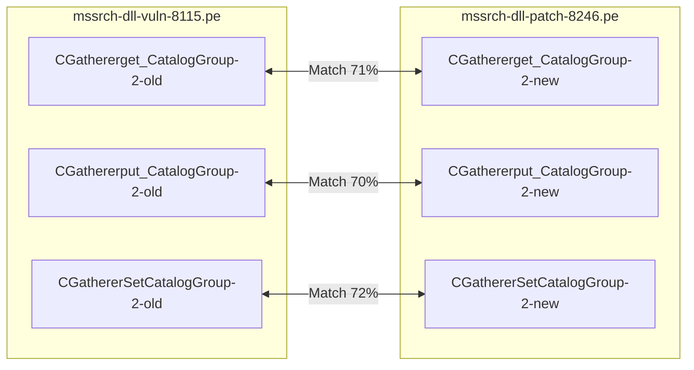
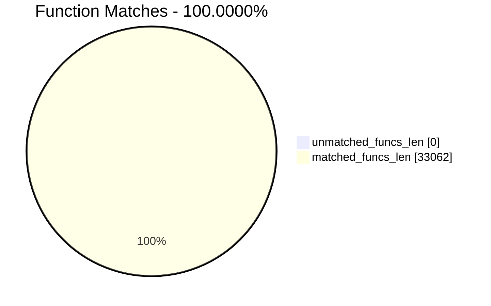
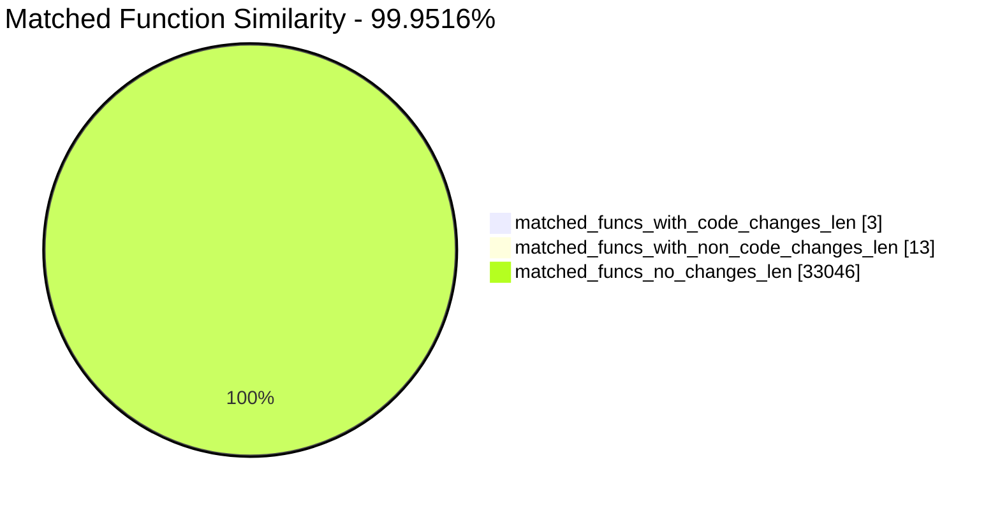
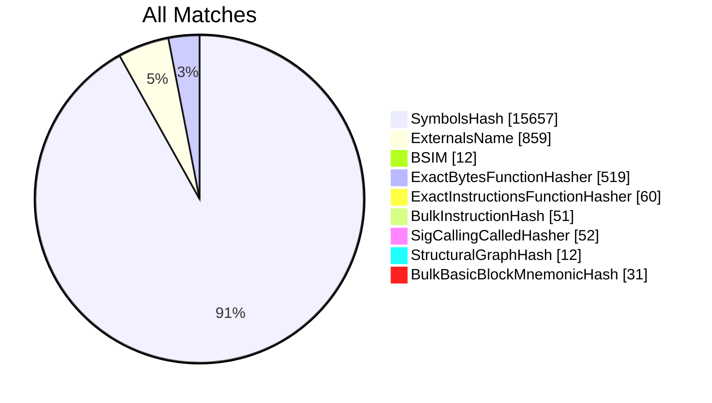
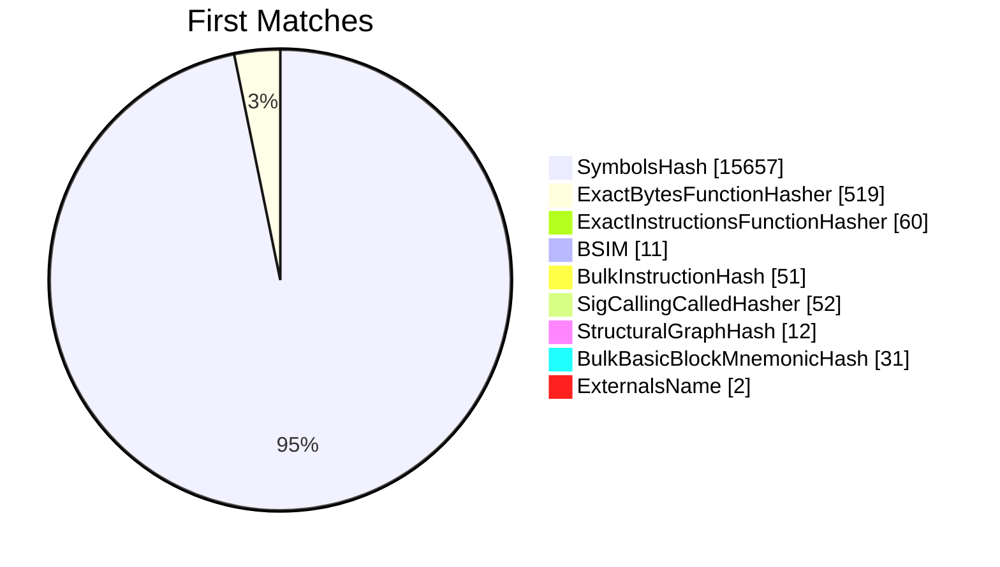
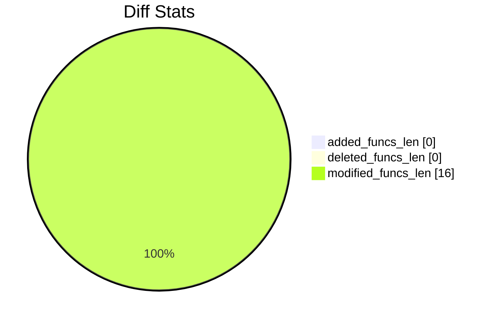
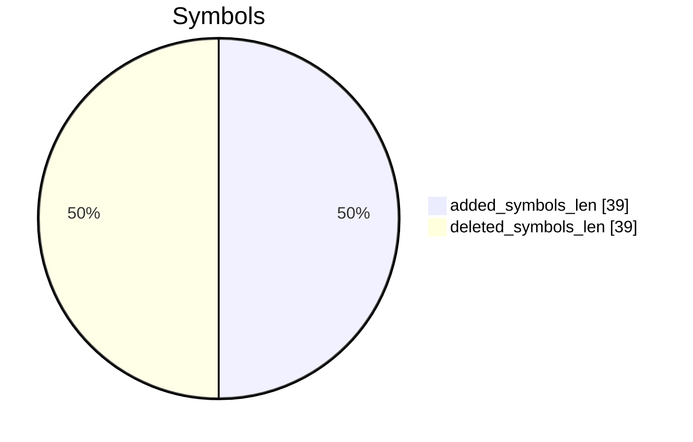

# mssrch-dll-vuln-8115.pe-mssrch-dll-patch-8246.pe Diff

# TOC

* [Visual Chart Diff](#visual-chart-diff)
* [Metadata](#metadata)
	* [Ghidra Diff Engine](#ghidra-diff-engine)
		* [Command Line](#command-line)
	* [Binary Metadata Diff](#binary-metadata-diff)
	* [Program Options](#program-options)
	* [Diff Stats](#diff-stats)
	* [Strings](#strings)
* [Deleted](#deleted)
* [Added](#added)
* [Modified](#modified)
	* [CGatherer::get_CatalogGroup](#cgathererget_cataloggroup)
	* [CGatherer::put_CatalogGroup](#cgathererput_cataloggroup)
	* [CGatherer::SetCatalogGroup](#cgatherersetcataloggroup)
* [Modified (No Code Changes)](#modified-no-code-changes)
	* [TLMString<192,64,32767>](#tlmstring1926432767)
	* [__GSHandlerCheck_EH4](#__gshandlercheck_eh4)
	* [__CxxFrameHandler4](#__cxxframehandler4)
	* [GetWriteAccess](#getwriteaccess)
	* [ReleaseReadAccess](#releasereadaccess)

# Visual Chart Diff










# Metadata

## Ghidra Diff Engine

### Command Line

#### Captured Command Line


```
ghidriff --project-location ghidra-proj --project-name CVE-2026-27909 --symbols-path symbols --gzfs-path gzfs --threaded --log-level INFO --file-log-level INFO --log-path ghidriff.log --min-func-len 10 --gdt [] --bsim --max-ram-percent 60.0 --max-section-funcs 200 mssrch-dll-vuln-8115.pe mssrch-dll-patch-8246.pe
```


#### Verbose Args


<details>

```
--old ['bins/mssrch-dll-vuln-8115.pe'] --new [['bins/mssrch-dll-patch-8246.pe']] --engine VersionTrackingDiff --output-path diffs --summary False --project-location ghidra-proj --project-name CVE-2026-27909 --symbols-path symbols --gzfs-path gzfs --base-address None --program-options None --threaded True --force-analysis False --force-diff False --no-symbols False --log-level INFO --file-log-level INFO --log-path ghidriff.log --va False --min-func-len 10 --use-calling-counts False --gdt [] --bsim True --bsim-full False --max-ram-percent 60.0 --print-flags False --jvm-args None --side-by-side False --max-section-funcs 200 --md-title None
```


</details>

#### Download Original PEs


```
wget https://msdl.microsoft.com/download/symbols/MSSRCH.dll/7359A2C330A000/MSSRCH.dll -O mssrch.dll.x64.7.0.26100.8115
wget https://msdl.microsoft.com/download/symbols/MSSRCH.dll/6E95655A30A000/MSSRCH.dll -O mssrch.dll.x64.7.0.26100.8246
```


## Binary Metadata Diff


```diff
--- mssrch-dll-vuln-8115.pe Meta
+++ mssrch-dll-patch-8246.pe Meta
@@ -1,44 +1,44 @@
-Program Name: mssrch-dll-vuln-8115.pe
+Program Name: mssrch-dll-patch-8246.pe
 Language ID: x86:LE:64:default (4.6)
 Compiler ID: windows
 Processor: x86
 Endian: Little
 Address Size: 64
 Minimum Address: 180000000
 Maximum Address: ff0000184f
 # of Bytes: 3189040
 # of Memory Blocks: 10
-# of Instructions: 550084
-# of Defined Data: 30673
+# of Instructions: 550121
+# of Defined Data: 30676
 # of Functions: 16531
-# of Symbols: 115799
-# of Data Types: 6408
-# of Data Type Categories: 500
+# of Symbols: 115816
+# of Data Types: 6410
+# of Data Type Categories: 501
 Analyzed: true
 Compiler: visualstudio:unknown
 Created With Ghidra Version: 12.0.4
-Date Created: Wed Apr 22 21:17:29 AST 2026
+Date Created: Wed Apr 22 21:17:38 AST 2026
 Executable Format: Portable Executable (PE)
-Executable Location: /home/cve/repos/win11-forge/lab/CVE-2026-27909/bins/mssrch-dll-vuln-8115.pe
-Executable MD5: f3b31c390970ce45fd778cfab769d243
-Executable SHA256: 2bdcffb281c87e1d1dda20cde83bc9607d2cfe12673ef1f0854d08eac2d7c3d8
-FSRL: file:///home/cve/repos/win11-forge/lab/CVE-2026-27909/bins/mssrch-dll-vuln-8115.pe?MD5=f3b31c390970ce45fd778cfab769d243
+Executable Location: /home/cve/repos/win11-forge/lab/CVE-2026-27909/bins/mssrch-dll-patch-8246.pe
+Executable MD5: 73ebf6d5b26b087c0b04fe6105dab069
+Executable SHA256: c318325ae62d65fb210b2688549c464f1813424115c3564dba6c3fe1af978207
+FSRL: file:///home/cve/repos/win11-forge/lab/CVE-2026-27909/bins/mssrch-dll-patch-8246.pe?MD5=73ebf6d5b26b087c0b04fe6105dab069
 PDB Age: 1
 PDB File: mssrch.pdb
-PDB GUID: 6990cf08-7a28-b297-5af9-f1bb2d0aabab
+PDB GUID: ffdb1af4-9296-4744-08a1-a7fc41d014d6
 PDB Loaded: true
 PDB Version: RSDS
 PE Property[CompanyName]: Microsoft Corporation
 PE Property[FileDescription]: Microsoft Embedded Search
-PE Property[FileVersion]: 7.0.26100.8115 (WinBuild.160101.0800)
+PE Property[FileVersion]: 7.0.26100.8246 (WinBuild.160101.0800)
 PE Property[InternalName]: MSSRCH.dll
 PE Property[LegalCopyright]: © Microsoft Corporation. All rights reserved.
 PE Property[OriginalFilename]: MSSRCH.dll
 PE Property[ProductName]: Windows® Search
-PE Property[ProductVersion]: 7.0.26100.8115
+PE Property[ProductVersion]: 7.0.26100.8246
 PE Property[Translation]: 4b00409
 Preferred Root Namespace Category: 
 RTTI Found: true
 Relocatable: true
 SectionAlignment: 4096
 Should Ask To Analyze: false

```


## Program Options


<details>
<summary>Ghidra mssrch-dll-vuln-8115.pe Decompiler Options</summary>


|Decompiler Option|Value|
| :---: | :---: |
|Prototype Evaluation|__fastcall|

</details>


<details>
<summary>Ghidra mssrch-dll-vuln-8115.pe Specification extensions Options</summary>


|Specification extensions Option|Value|
| :---: | :---: |
|FormatVersion|0|
|VersionCounter|0|

</details>


<details>
<summary>Ghidra mssrch-dll-vuln-8115.pe Analyzers Options</summary>


|Analyzers Option|Value|
| :---: | :---: |
|ASCII Strings|true|
|ASCII Strings.Create Strings Containing Existing Strings|true|
|ASCII Strings.Create Strings Containing References|true|
|ASCII Strings.Force Model Reload|false|
|ASCII Strings.Minimum String Length|LEN_5|
|ASCII Strings.Model File|StringModel.sng|
|ASCII Strings.Require Null Termination for String|true|
|ASCII Strings.Search Only in Accessible Memory Blocks|true|
|ASCII Strings.String Start Alignment|ALIGN_1|
|ASCII Strings.String end alignment|4|
|Aggressive Instruction Finder|false|
|Aggressive Instruction Finder.Create Analysis Bookmarks|true|
|Apply Data Archives|true|
|Apply Data Archives.Archive Chooser|[Auto-Detect]|
|Apply Data Archives.Create Analysis Bookmarks|true|
|Apply Data Archives.GDT User File Archive Path|None|
|Apply Data Archives.User Project Archive Path|None|
|Call Convention ID|true|
|Call Convention ID.Analysis Decompiler Timeout (sec)|60|
|Call-Fixup Installer|true|
|Condense Filler Bytes|false|
|Condense Filler Bytes.Filler Value|Auto|
|Condense Filler Bytes.Minimum number of sequential bytes|1|
|Create Address Tables|true|
|Create Address Tables.Allow Offcut References|false|
|Create Address Tables.Auto Label Table|false|
|Create Address Tables.Create Analysis Bookmarks|true|
|Create Address Tables.Maxmimum Pointer Distance|16777215|
|Create Address Tables.Minimum Pointer Address|4132|
|Create Address Tables.Minimum Table Size|2|
|Create Address Tables.Pointer Alignment|1|
|Create Address Tables.Relocation Table Guide|true|
|Create Address Tables.Table Alignment|4|
|Data Reference|true|
|Data Reference.Address Table Alignment|1|
|Data Reference.Address Table Minimum Size|2|
|Data Reference.Align End of Strings|false|
|Data Reference.Ascii String References|true|
|Data Reference.Create Address Tables|true|
|Data Reference.Minimum String Length|5|
|Data Reference.References to Pointers|true|
|Data Reference.Relocation Table Guide|true|
|Data Reference.Respect Execute Flag|true|
|Data Reference.Subroutine References|true|
|Data Reference.Switch Table References|false|
|Data Reference.Unicode String References|true|
|Decompiler Parameter ID|false|
|Decompiler Parameter ID.Analysis Clear Level|ANALYSIS|
|Decompiler Parameter ID.Analysis Decompiler Timeout (sec)|60|
|Decompiler Parameter ID.Commit Data Types|true|
|Decompiler Parameter ID.Commit Void Return Values|false|
|Decompiler Parameter ID.Prototype Evaluation|__fastcall|
|Decompiler Switch Analysis|true|
|Decompiler Switch Analysis.Analysis Decompiler Timeout (sec)|60|
|Demangler Microsoft|true|
|Demangler Microsoft.Apply Function Calling Conventions|true|
|Demangler Microsoft.Apply Function Signatures|true|
|Demangler Microsoft.C-Style Symbol Interpretation|FUNCTION_IF_EXISTS|
|Demangler Microsoft.Demangle Only Known Mangled Symbols|false|
|Disassemble Entry Points|true|
|Disassemble Entry Points.Respect Execute Flag|true|
|Embedded Media|true|
|Embedded Media.Create Analysis Bookmarks|true|
|External Entry References|true|
|Function ID|true|
|Function ID.Always Apply FID Labels|false|
|Function ID.Create Analysis Bookmarks|true|
|Function ID.Instruction Count Threshold|14.6|
|Function ID.Multiple Match Threshold|30.0|
|Function Start Search|true|
|Function Start Search.Bookmark Functions|false|
|Function Start Search.Search Data Blocks|false|
|Non-Returning Functions - Discovered|true|
|Non-Returning Functions - Discovered.Create Analysis Bookmarks|true|
|Non-Returning Functions - Discovered.Function Non-return Threshold|3|
|Non-Returning Functions - Discovered.Repair Flow Damage|true|
|Non-Returning Functions - Known|true|
|Non-Returning Functions - Known.Create Analysis Bookmarks|true|
|PDB MSDIA|false|
|PDB MSDIA.Search untrusted symbol servers|false|
|PDB Universal|true|
|PDB Universal.Import Source Line Info|true|
|PDB Universal.Search untrusted symbol servers|false|
|Reference|true|
|Reference.Address Table Alignment|1|
|Reference.Address Table Minimum Size|2|
|Reference.Align End of Strings|false|
|Reference.Ascii String References|true|
|Reference.Create Address Tables|true|
|Reference.Minimum String Length|5|
|Reference.References to Pointers|true|
|Reference.Relocation Table Guide|true|
|Reference.Respect Execute Flag|true|
|Reference.Subroutine References|true|
|Reference.Switch Table References|false|
|Reference.Unicode String References|true|
|Scalar Operand References|true|
|Scalar Operand References.Relocation Table Guide|true|
|Shared Return Calls|true|
|Shared Return Calls.Allow Conditional Jumps|false|
|Shared Return Calls.Assume Contiguous Functions Only|true|
|Stack|true|
|Stack.Create Local Variables|true|
|Stack.Create Param Variables|false|
|Stack.Max Threads|2|
|Subroutine References|true|
|Subroutine References.Create Thunks Early|true|
|Variadic Function Signature Override|false|
|Variadic Function Signature Override.Create Analysis Bookmarks|false|
|Windows x86 PE Exception Handling|true|
|Windows x86 PE RTTI Analyzer|true|
|Windows x86 Thread Environment Block (TEB) Analyzer|true|
|Windows x86 Thread Environment Block (TEB) Analyzer.Starting Address of the TEB||
|Windows x86 Thread Environment Block (TEB) Analyzer.Windows OS Version|Windows 7|
|WindowsPE x86 Propagate External Parameters|false|
|WindowsResourceReference|true|
|WindowsResourceReference.Create Analysis Bookmarks|true|
|x86 Constant Reference Analyzer|true|
|x86 Constant Reference Analyzer.Create Data from pointer|false|
|x86 Constant Reference Analyzer.Function parameter/return Pointer analysis|true|
|x86 Constant Reference Analyzer.Max Threads|2|
|x86 Constant Reference Analyzer.Min absolute reference|4|
|x86 Constant Reference Analyzer.Require pointer param data type|false|
|x86 Constant Reference Analyzer.Speculative reference max|256|
|x86 Constant Reference Analyzer.Speculative reference min|1024|
|x86 Constant Reference Analyzer.Stored Value Pointer analysis|true|
|x86 Constant Reference Analyzer.Trust values read from writable memory|true|

</details>


<details>
<summary>Ghidra mssrch-dll-patch-8246.pe Decompiler Options</summary>


|Decompiler Option|Value|
| :---: | :---: |
|Prototype Evaluation|__fastcall|

</details>


<details>
<summary>Ghidra mssrch-dll-patch-8246.pe Specification extensions Options</summary>


|Specification extensions Option|Value|
| :---: | :---: |
|FormatVersion|0|
|VersionCounter|0|

</details>


<details>
<summary>Ghidra mssrch-dll-patch-8246.pe Analyzers Options</summary>


|Analyzers Option|Value|
| :---: | :---: |
|ASCII Strings|true|
|ASCII Strings.Create Strings Containing Existing Strings|true|
|ASCII Strings.Create Strings Containing References|true|
|ASCII Strings.Force Model Reload|false|
|ASCII Strings.Minimum String Length|LEN_5|
|ASCII Strings.Model File|StringModel.sng|
|ASCII Strings.Require Null Termination for String|true|
|ASCII Strings.Search Only in Accessible Memory Blocks|true|
|ASCII Strings.String Start Alignment|ALIGN_1|
|ASCII Strings.String end alignment|4|
|Aggressive Instruction Finder|false|
|Aggressive Instruction Finder.Create Analysis Bookmarks|true|
|Apply Data Archives|true|
|Apply Data Archives.Archive Chooser|[Auto-Detect]|
|Apply Data Archives.Create Analysis Bookmarks|true|
|Apply Data Archives.GDT User File Archive Path|None|
|Apply Data Archives.User Project Archive Path|None|
|Call Convention ID|true|
|Call Convention ID.Analysis Decompiler Timeout (sec)|60|
|Call-Fixup Installer|true|
|Condense Filler Bytes|false|
|Condense Filler Bytes.Filler Value|Auto|
|Condense Filler Bytes.Minimum number of sequential bytes|1|
|Create Address Tables|true|
|Create Address Tables.Allow Offcut References|false|
|Create Address Tables.Auto Label Table|false|
|Create Address Tables.Create Analysis Bookmarks|true|
|Create Address Tables.Maxmimum Pointer Distance|16777215|
|Create Address Tables.Minimum Pointer Address|4132|
|Create Address Tables.Minimum Table Size|2|
|Create Address Tables.Pointer Alignment|1|
|Create Address Tables.Relocation Table Guide|true|
|Create Address Tables.Table Alignment|4|
|Data Reference|true|
|Data Reference.Address Table Alignment|1|
|Data Reference.Address Table Minimum Size|2|
|Data Reference.Align End of Strings|false|
|Data Reference.Ascii String References|true|
|Data Reference.Create Address Tables|true|
|Data Reference.Minimum String Length|5|
|Data Reference.References to Pointers|true|
|Data Reference.Relocation Table Guide|true|
|Data Reference.Respect Execute Flag|true|
|Data Reference.Subroutine References|true|
|Data Reference.Switch Table References|false|
|Data Reference.Unicode String References|true|
|Decompiler Parameter ID|false|
|Decompiler Parameter ID.Analysis Clear Level|ANALYSIS|
|Decompiler Parameter ID.Analysis Decompiler Timeout (sec)|60|
|Decompiler Parameter ID.Commit Data Types|true|
|Decompiler Parameter ID.Commit Void Return Values|false|
|Decompiler Parameter ID.Prototype Evaluation|__fastcall|
|Decompiler Switch Analysis|true|
|Decompiler Switch Analysis.Analysis Decompiler Timeout (sec)|60|
|Demangler Microsoft|true|
|Demangler Microsoft.Apply Function Calling Conventions|true|
|Demangler Microsoft.Apply Function Signatures|true|
|Demangler Microsoft.C-Style Symbol Interpretation|FUNCTION_IF_EXISTS|
|Demangler Microsoft.Demangle Only Known Mangled Symbols|false|
|Disassemble Entry Points|true|
|Disassemble Entry Points.Respect Execute Flag|true|
|Embedded Media|true|
|Embedded Media.Create Analysis Bookmarks|true|
|External Entry References|true|
|Function ID|true|
|Function ID.Always Apply FID Labels|false|
|Function ID.Create Analysis Bookmarks|true|
|Function ID.Instruction Count Threshold|14.6|
|Function ID.Multiple Match Threshold|30.0|
|Function Start Search|true|
|Function Start Search.Bookmark Functions|false|
|Function Start Search.Search Data Blocks|false|
|Non-Returning Functions - Discovered|true|
|Non-Returning Functions - Discovered.Create Analysis Bookmarks|true|
|Non-Returning Functions - Discovered.Function Non-return Threshold|3|
|Non-Returning Functions - Discovered.Repair Flow Damage|true|
|Non-Returning Functions - Known|true|
|Non-Returning Functions - Known.Create Analysis Bookmarks|true|
|PDB MSDIA|false|
|PDB MSDIA.Search untrusted symbol servers|false|
|PDB Universal|true|
|PDB Universal.Import Source Line Info|true|
|PDB Universal.Search untrusted symbol servers|false|
|Reference|true|
|Reference.Address Table Alignment|1|
|Reference.Address Table Minimum Size|2|
|Reference.Align End of Strings|false|
|Reference.Ascii String References|true|
|Reference.Create Address Tables|true|
|Reference.Minimum String Length|5|
|Reference.References to Pointers|true|
|Reference.Relocation Table Guide|true|
|Reference.Respect Execute Flag|true|
|Reference.Subroutine References|true|
|Reference.Switch Table References|false|
|Reference.Unicode String References|true|
|Scalar Operand References|true|
|Scalar Operand References.Relocation Table Guide|true|
|Shared Return Calls|true|
|Shared Return Calls.Allow Conditional Jumps|false|
|Shared Return Calls.Assume Contiguous Functions Only|true|
|Stack|true|
|Stack.Create Local Variables|true|
|Stack.Create Param Variables|false|
|Stack.Max Threads|2|
|Subroutine References|true|
|Subroutine References.Create Thunks Early|true|
|Variadic Function Signature Override|false|
|Variadic Function Signature Override.Create Analysis Bookmarks|false|
|Windows x86 PE Exception Handling|true|
|Windows x86 PE RTTI Analyzer|true|
|Windows x86 Thread Environment Block (TEB) Analyzer|true|
|Windows x86 Thread Environment Block (TEB) Analyzer.Starting Address of the TEB||
|Windows x86 Thread Environment Block (TEB) Analyzer.Windows OS Version|Windows 7|
|WindowsPE x86 Propagate External Parameters|false|
|WindowsResourceReference|true|
|WindowsResourceReference.Create Analysis Bookmarks|true|
|x86 Constant Reference Analyzer|true|
|x86 Constant Reference Analyzer.Create Data from pointer|false|
|x86 Constant Reference Analyzer.Function parameter/return Pointer analysis|true|
|x86 Constant Reference Analyzer.Max Threads|2|
|x86 Constant Reference Analyzer.Min absolute reference|4|
|x86 Constant Reference Analyzer.Require pointer param data type|false|
|x86 Constant Reference Analyzer.Speculative reference max|256|
|x86 Constant Reference Analyzer.Speculative reference min|1024|
|x86 Constant Reference Analyzer.Stored Value Pointer analysis|true|
|x86 Constant Reference Analyzer.Trust values read from writable memory|true|

</details>

## Diff Stats


|Stat|Value|
| :---: | :---: |
|added_funcs_len|0|
|deleted_funcs_len|0|
|modified_funcs_len|16|
|added_symbols_len|39|
|deleted_symbols_len|39|
|diff_time|58.98786473274231|
|deleted_strings_len|0|
|added_strings_len|0|
|match_types|Counter({'SymbolsHash': 15657, 'ExternalsName': 859, 'ExactBytesFunctionHasher': 519, 'ExactInstructionsFunctionHasher': 60, 'SigCallingCalledHasher': 52, 'BulkInstructionHash': 51, 'BulkBasicBlockMnemonicHash': 31, 'BSIM': 12, 'StructuralGraphHash': 12})|
|items_to_process|94|
|diff_types|Counter({'refcount': 13, 'calling': 11, 'called': 11, 'address': 9, 'sig': 7, 'fullname': 6, 'parent': 6, 'name': 4, 'code': 3, 'length': 3})|
|unmatched_funcs_len|0|
|total_funcs_len|33062|
|matched_funcs_len|33062|
|matched_funcs_with_code_changes_len|3|
|matched_funcs_with_non_code_changes_len|13|
|matched_funcs_no_changes_len|33046|
|match_func_similarity_percent|99.9516%|
|func_match_overall_percent|100.0000%|
|first_matches|Counter({'SymbolsHash': 15657, 'ExactBytesFunctionHasher': 519, 'ExactInstructionsFunctionHasher': 60, 'SigCallingCalledHasher': 52, 'BulkInstructionHash': 51, 'BulkBasicBlockMnemonicHash': 31, 'StructuralGraphHash': 12, 'BSIM': 11, 'ExternalsName': 2})|













## Strings


*No string differences found*

# Deleted

# Added

# Modified


*Modified functions contain code changes*
## CGatherer::get_CatalogGroup

### Match Info


|Key|mssrch-dll-vuln-8115.pe - mssrch-dll-patch-8246.pe|
| :---: | :---: |
|diff_type|code,length,address,called|
|ratio|0.82|
|i_ratio|0.46|
|m_ratio|0.75|
|b_ratio|0.71|
|match_types|SymbolsHash|

### Function Meta Diff


|Key|mssrch-dll-vuln-8115.pe|mssrch-dll-patch-8246.pe|
| :---: | :---: | :---: |
|name|get_CatalogGroup|get_CatalogGroup|
|fullname|CGatherer::get_CatalogGroup|CGatherer::get_CatalogGroup|
|refcount|4|4|
|`length`|147|270|
|`called`|CLMString::GetBuffer<br>OLEAUT32.DLL::Ordinal_2<br>SetComError<class_CGatherPluginMgr><br>wil::details::in1diag3::Return_Hr|CLMString::GetBuffer<br>CSyncReadWrite::GetReadAccess<br>CSyncReadWrite::ReleaseReadAccess<br>OLEAUT32.DLL::Ordinal_2<br>SetComError<class_CGatherPluginMgr><br>TLMString<192,64,32767>::TLMString<192,64,32767><br>TLMString<192,64,32767>::~TLMString<192,64,32767><br>__security_check_cookie<br>wil::details::in1diag3::Return_Hr|
|calling|||
|paramcount|2|2|
|`address`|1801943b0|1801943f0|
|sig|long __thiscall get_CatalogGroup(CGatherer * this, wchar_t * * param_1)|long __thiscall get_CatalogGroup(CGatherer * this, wchar_t * * param_1)|
|sym_type|Function|Function|
|sym_source|ANALYSIS|ANALYSIS|
|external|False|False|

### CGatherer::get_CatalogGroup Called Diff


```diff
--- CGatherer::get_CatalogGroup called
+++ CGatherer::get_CatalogGroup called
@@ -1,0 +2,2 @@
+CSyncReadWrite::GetReadAccess
+CSyncReadWrite::ReleaseReadAccess
@@ -3,0 +6,3 @@
+TLMString<192,64,32767>::TLMString<192,64,32767>
+TLMString<192,64,32767>::~TLMString<192,64,32767>
+__security_check_cookie
```


### CGatherer::get_CatalogGroup Diff


```diff
--- CGatherer::get_CatalogGroup
+++ CGatherer::get_CatalogGroup
@@ -1,35 +1,44 @@
 
+/* WARNING: Function: __security_check_cookie replaced with injection: security_check_cookie */
 /* public: virtual long __cdecl CGatherer::get_CatalogGroup(wchar_t * __ptr64 * __ptr64) __ptr64 */
 
 long __thiscall CGatherer::get_CatalogGroup(CGatherer *this,wchar_t **param_1)
 
 {
   wchar_t *pwVar1;
   uint uVar2;
   long lVar3;
   void *unaff_retaddr;
+  undefined1 auStack_1d8 [32];
+  TLMString<192,64,32767> local_1b8 [416];
+  ulonglong local_18;
   
+  local_18 = __security_cookie ^ (ulonglong)auStack_1d8;
   if (*(int *)(this + 0x4b8) == 0) {
     if (param_1 != (wchar_t **)0x0) {
-      pwVar1 = CLMString::GetBuffer((CLMString *)(this + 0xe18),0);
+      CSyncReadWrite::GetReadAccess((CSyncReadWrite *)(this + 0x600));
+      TLMString<192,64,32767>::TLMString<192,64,32767>(local_1b8,(CLMString *)(this + 0xe18));
+      CSyncReadWrite::ReleaseReadAccess((CSyncReadWrite *)(this + 0x600));
+      pwVar1 = CLMString::GetBuffer((CLMString *)local_1b8,0);
       pwVar1 = (wchar_t *)Ordinal_2(pwVar1);
       *param_1 = pwVar1;
-      return ~-(uint)(pwVar1 != (wchar_t *)0x0) & 0x8007000e;
+      TLMString<192,64,32767>::~TLMString<192,64,32767>(local_1b8);
+      return ~-(uint)(*param_1 != (wchar_t *)0x0) & 0x8007000e;
     }
     lVar3 = -0x7fffbffd;
     SetComError<class_CGatherPluginMgr>
               (-0x7fffbffd,(_GUID *)&_GUID_b05651f6_9b10_425e_b616_1fcd828db3b1);
     uVar2 = 0x47b;
   }
   else {
     lVar3 = -0x7ffbf2e5;
     SetComError<class_CGatherPluginMgr>
               (-0x7ffbf2e5,(_GUID *)&_GUID_b05651f6_9b10_425e_b616_1fcd828db3b1);
     uVar2 = 0x479;
   }
   wil::details::in1diag3::Return_Hr
             (unaff_retaddr,uVar2,
              "onecoreuap\\base\\appmodel\\Search\\mssrch\\gather\\include\\GatherObj.hxx",lVar3);
   return lVar3;
 }
 

```


## CGatherer::put_CatalogGroup

### Match Info


|Key|mssrch-dll-vuln-8115.pe - mssrch-dll-patch-8246.pe|
| :---: | :---: |
|diff_type|code,length,address,called|
|ratio|0.68|
|i_ratio|0.59|
|m_ratio|0.92|
|b_ratio|0.7|
|match_types|SymbolsHash|

### Function Meta Diff


|Key|mssrch-dll-vuln-8115.pe|mssrch-dll-patch-8246.pe|
| :---: | :---: | :---: |
|name|put_CatalogGroup|put_CatalogGroup|
|fullname|CGatherer::put_CatalogGroup|CGatherer::put_CatalogGroup|
|refcount|4|4|
|`length`|282|221|
|`called`|CGatherer::SetCatalogGroup<br>SetComError<class_CGatherPluginMgr><br>TLMString<192,64,32767>::TLMString<192,64,32767><br>TLMString<192,64,32767>::~TLMString<192,64,32767><br>__security_check_cookie<br>wil::details::in1diag3::Return_Hr|CGatherer::SetCatalogGroup<br>SetComError<class_CGatherPluginMgr><br>TLMString<192,64,32767>::TLMString<192,64,32767><br>wil::details::in1diag3::Return_Hr|
|calling|||
|paramcount|2|2|
|`address`|180194d00|180194dc0|
|sig|long __thiscall put_CatalogGroup(CGatherer * this, wchar_t * param_1)|long __thiscall put_CatalogGroup(CGatherer * this, wchar_t * param_1)|
|sym_type|Function|Function|
|sym_source|ANALYSIS|ANALYSIS|
|external|False|False|

### CGatherer::put_CatalogGroup Called Diff


```diff
--- CGatherer::put_CatalogGroup called
+++ CGatherer::put_CatalogGroup called
@@ -4,2 +3,0 @@
-TLMString<192,64,32767>::~TLMString<192,64,32767>
-__security_check_cookie
```


### CGatherer::put_CatalogGroup Diff


```diff
--- CGatherer::put_CatalogGroup
+++ CGatherer::put_CatalogGroup
@@ -1,49 +1,44 @@
 
-/* WARNING: Function: __security_check_cookie replaced with injection: security_check_cookie */
 /* public: virtual long __cdecl CGatherer::put_CatalogGroup(wchar_t * __ptr64) __ptr64 */
 
 long __thiscall CGatherer::put_CatalogGroup(CGatherer *this,wchar_t *param_1)
 
 {
   long lVar1;
-  uint uVar2;
+  undefined8 uVar2;
+  uint uVar3;
   void *unaff_retaddr;
-  undefined1 auStack_1d8 [32];
-  TLMString<192,64,32767> local_1b8 [416];
-  ulonglong local_18;
+  TLMString<192,64,32767> local_1a8 [416];
   
-  local_18 = __security_cookie ^ (ulonglong)auStack_1d8;
   if (*(int *)(this + 0x4b8) == 0) {
     if (param_1 == (wchar_t *)0x0) {
-      TLMString<192,64,32767>::TLMString<192,64,32767>(local_1b8,L"");
-      lVar1 = SetCatalogGroup(this,local_1b8);
-      TLMString<192,64,32767>::~TLMString<192,64,32767>(local_1b8);
+      uVar2 = TLMString<192,64,32767>::TLMString<192,64,32767>(local_1a8,L"");
+      lVar1 = SetCatalogGroup(this,uVar2);
       SetComError<class_CGatherPluginMgr>
                 (lVar1,(_GUID *)&_GUID_b05651f6_9b10_425e_b616_1fcd828db3b1);
       if (lVar1 < 0) {
-        uVar2 = 0x486;
+        uVar3 = 0x486;
         goto LAB_0;
       }
     }
-    TLMString<192,64,32767>::TLMString<192,64,32767>(local_1b8,param_1);
-    lVar1 = SetCatalogGroup(this,local_1b8);
-    TLMString<192,64,32767>::~TLMString<192,64,32767>(local_1b8);
+    uVar2 = TLMString<192,64,32767>::TLMString<192,64,32767>(local_1a8,param_1);
+    lVar1 = SetCatalogGroup(this,uVar2);
     SetComError<class_CGatherPluginMgr>(lVar1,(_GUID *)&_GUID_b05651f6_9b10_425e_b616_1fcd828db3b1);
     if (-1 < lVar1) {
       return 0;
     }
-    uVar2 = 0x489;
+    uVar3 = 0x489;
   }
   else {
     lVar1 = -0x7ffbf2e5;
     SetComError<class_CGatherPluginMgr>
               (-0x7ffbf2e5,(_GUID *)&_GUID_b05651f6_9b10_425e_b616_1fcd828db3b1);
-    uVar2 = 0x483;
+    uVar3 = 0x483;
   }
 LAB_0:
   wil::details::in1diag3::Return_Hr
-            (unaff_retaddr,uVar2,
+            (unaff_retaddr,uVar3,
              "onecoreuap\\base\\appmodel\\Search\\mssrch\\gather\\include\\GatherObj.hxx",lVar1);
   return lVar1;
 }
 

```


## CGatherer::SetCatalogGroup

### Match Info


|Key|mssrch-dll-vuln-8115.pe - mssrch-dll-patch-8246.pe|
| :---: | :---: |
|diff_type|code,length,sig,called|
|ratio|0.82|
|i_ratio|0.33|
|m_ratio|0.72|
|b_ratio|0.72|
|match_types|SymbolsHash|

### Function Meta Diff


|Key|mssrch-dll-vuln-8115.pe|mssrch-dll-patch-8246.pe|
| :---: | :---: | :---: |
|name|SetCatalogGroup|SetCatalogGroup|
|fullname|CGatherer::SetCatalogGroup|CGatherer::SetCatalogGroup|
|refcount|3|3|
|`length`|106|174|
|`called`|API-MS-WIN-CORE-ERRORHANDLING-L1-1-0.DLL::GetLastError<br>CConfigNode::SetValue<br>TLMString<32,32,1024>::operator=|API-MS-WIN-CORE-ERRORHANDLING-L1-1-0.DLL::GetLastError<br>CConfigNode::SetValue<br>CSyncReadWrite::GetWriteAccess<br>CSyncReadWrite::ReleaseWriteAccess<br>TLMString<192,64,32767>::operator=<br>TLMString<192,64,32767>::~TLMString<192,64,32767>|
|calling|CGatherer::put_CatalogGroup|CGatherer::put_CatalogGroup|
|paramcount|2|2|
|address|180193ed8|180193ed8|
|`sig`|long __thiscall SetCatalogGroup(CGatherer * this, TLMString<192,64,32767> * param_1)|long __thiscall SetCatalogGroup(CGatherer * this, TLMString<192,64,32767> param_1)|
|sym_type|Function|Function|
|sym_source|ANALYSIS|ANALYSIS|
|external|False|False|

### CGatherer::SetCatalogGroup Called Diff


```diff
--- CGatherer::SetCatalogGroup called
+++ CGatherer::SetCatalogGroup called
@@ -3 +3,4 @@
-TLMString<32,32,1024>::operator=
+CSyncReadWrite::GetWriteAccess
+CSyncReadWrite::ReleaseWriteAccess
+TLMString<192,64,32767>::operator=
+TLMString<192,64,32767>::~TLMString<192,64,32767>
```


### CGatherer::SetCatalogGroup Diff


```diff
--- CGatherer::SetCatalogGroup
+++ CGatherer::SetCatalogGroup
@@ -1,29 +1,33 @@
 
-/* public: long __cdecl CGatherer::SetCatalogGroup(class TLMString<192,64,32767> const & __ptr64)
-   __ptr64 */
+/* public: long __cdecl CGatherer::SetCatalogGroup(class TLMString<192,64,32767>) __ptr64 */
 
-long __thiscall CGatherer::SetCatalogGroup(CGatherer *this,TLMString<192,64,32767> *param_1)
+long __thiscall CGatherer::SetCatalogGroup(CGatherer *this,TLMString<192,64,32767> *param_2)
 
 {
+  CSyncReadWrite *this_00;
   int iVar1;
   DWORD DVar2;
   
-  TLMString<32,32,1024>::operator=
-            ((TLMString<32,32,1024> *)(this + 0xe18),(TLMString<32,32,1024> *)param_1);
+  this_00 = (CSyncReadWrite *)(this + 0x600);
+  CSyncReadWrite::GetWriteAccess(this_00);
+  TLMString<192,64,32767>::operator=((TLMString<192,64,32767> *)(this + 0xe18),param_2);
   iVar1 = CConfigNode::SetValue
                     ((CConfigNode *)(this + 0xb0),L"CatalogGroup",(CLMString *)(this + 0xe18));
   if (iVar1 == 0) {
     DVar2 = GetLastError();
     if (0 < (int)DVar2) {
       DVar2 = DVar2 & 0xffff | 0x80070000;
     }
     if (DVar2 == 0x80070006) {
       DVar2 = 0x80040d04;
     }
+    CSyncReadWrite::ReleaseWriteAccess(this_00);
   }
   else {
+    CSyncReadWrite::ReleaseWriteAccess(this_00);
     DVar2 = 0;
   }
+  TLMString<192,64,32767>::~TLMString<192,64,32767>(param_2);
   return DVar2;
 }
 

```


# Modified (No Code Changes)


*Slightly modified functions have no code changes, rather differnces in:*
- refcount
- length
- called
- calling
- name
- fullname

## TLMString<192,64,32767>

### Match Info


|Key|mssrch-dll-vuln-8115.pe - mssrch-dll-patch-8246.pe|
| :---: | :---: |
|diff_type|refcount,calling|
|ratio|1.0|
|i_ratio|1.0|
|m_ratio|1.0|
|b_ratio|1.0|
|match_types|SymbolsHash|

### Function Meta Diff


|Key|mssrch-dll-vuln-8115.pe|mssrch-dll-patch-8246.pe|
| :---: | :---: | :---: |
|name|TLMString<192,64,32767>|TLMString<192,64,32767>|
|fullname|TLMString<192,64,32767>::TLMString<192,64,32767>|TLMString<192,64,32767>::TLMString<192,64,32767>|
|`refcount`|25|26|
|length|66|66|
|called|CLMString::AssignInConstructor|CLMString::AssignInConstructor|
|`calling`|<details><summary>Expand for full list:<br>CGatherTableClient::BatchGetCurrentEntriesRaw<br>CGatherTableClient::TestAPI<br>CGatherer::AdviseStatus<br>CGatherer::CreateMatchingTransactions<br>CPerceivedTypeFilterSink::_CollectAndCalculateProperties<br>CRobotThread::Thread<br>CSitePath::GetSearchPropertyMappingUrl<br>CStartPage::get_DisplayName<br>CStartPageCollection::AddOverrideId<br>CStartPageCollection::GetStartAddressesByPrefix<br>CStartPageCollection::Remove</summary>CTransaction::MakeNewTransaction<br>CURL::NormalizeCSMURL<br>CUrlConverter::AddStartPageUrl<br>GatherObjPriorityHelper::PriorityCalculator::CalculatePathPriorityFactor<br>StartPageTableIterator::Next<br>std::_Default_allocator_traits<class_std::allocator<class_TLMString<192,64,32767>_>_>::construct<class_TLMString<192,64,32767>,class_TLMString<192,64,32767>_><br>std::_Default_allocator_traits<class_std::allocator<struct_std::_Tree_node<struct_FATNotificationSource::SNotification,void*___ptr64>_>_>::construct<struct_FATNotificationSource::SNotification,struct_FATNotificationSource::SNotification_const&___ptr64><br>std::_Default_allocator_traits<class_std::allocator<struct_std::_Tree_node<struct_std::pair<class_TLMString<192,64,32767>_const_,wchar_t>,void*___ptr64>_>_>::construct<struct_std::pair<class_TLMString<192,64,32767>_const_,wchar_t>,struct_std::pair<class_TLMString<192,64,32767>,wchar_t>_><br>std::_Default_allocator_traits<class_std::allocator<struct_std::_Tree_node<struct_std::pair<wchar_t_const_,class_TLMString<192,64,32767>_>,void*___ptr64>_>_>::construct<struct_std::pair<wchar_t_const_,class_TLMString<192,64,32767>_>,struct_std::pair<wchar_t,class_TLMString<192,64,32767>_>_><br>std::for_each<std::_Tree_iterator<std::_Tree_val<std::_Tree_simple_types<std::pair<wchar_t_const_,TLMString<192,64,32767>_>_>_>_>,<lambda_6bc73823bc2a18a820347913076c17de>_></details>|<details><summary>Expand for full list:<br>CGatherTableClient::BatchGetCurrentEntriesRaw<br>CGatherTableClient::TestAPI<br>CGatherer::AdviseStatus<br>CGatherer::CreateMatchingTransactions<br>CGatherer::get_CatalogGroup<br>CPerceivedTypeFilterSink::_CollectAndCalculateProperties<br>CRobotThread::Thread<br>CSitePath::GetSearchPropertyMappingUrl<br>CStartPage::get_DisplayName<br>CStartPageCollection::AddOverrideId<br>CStartPageCollection::GetStartAddressesByPrefix</summary>CStartPageCollection::Remove<br>CTransaction::MakeNewTransaction<br>CURL::NormalizeCSMURL<br>CUrlConverter::AddStartPageUrl<br>GatherObjPriorityHelper::PriorityCalculator::CalculatePathPriorityFactor<br>StartPageTableIterator::Next<br>std::_Default_allocator_traits<class_std::allocator<class_TLMString<192,64,32767>_>_>::construct<class_TLMString<192,64,32767>,class_TLMString<192,64,32767>_><br>std::_Default_allocator_traits<class_std::allocator<struct_std::_Tree_node<struct_FATNotificationSource::SNotification,void*___ptr64>_>_>::construct<struct_FATNotificationSource::SNotification,struct_FATNotificationSource::SNotification_const&___ptr64><br>std::_Default_allocator_traits<class_std::allocator<struct_std::_Tree_node<struct_std::pair<class_TLMString<192,64,32767>_const_,wchar_t>,void*___ptr64>_>_>::construct<struct_std::pair<class_TLMString<192,64,32767>_const_,wchar_t>,struct_std::pair<class_TLMString<192,64,32767>,unsigned_short>_><br>std::_Default_allocator_traits<class_std::allocator<struct_std::_Tree_node<struct_std::pair<wchar_t_const_,class_TLMString<192,64,32767>_>,void*___ptr64>_>_>::construct<struct_std::pair<wchar_t_const_,class_TLMString<192,64,32767>_>,struct_std::pair<wchar_t,class_TLMString<192,64,32767>_>_><br>std::for_each<std::_Tree_iterator<std::_Tree_val<std::_Tree_simple_types<std::pair<wchar_t_const_,TLMString<192,64,32767>_>_>_>_>,<lambda_6bc73823bc2a18a820347913076c17de>_></details>|
|paramcount|2|2|
|address|180095628|180095628|
|sig|undefined __thiscall TLMString<192,64,32767>(TLMString<192,64,32767> * this, CLMString * param_1)|undefined __thiscall TLMString<192,64,32767>(TLMString<192,64,32767> * this, CLMString * param_1)|
|sym_type|Function|Function|
|sym_source|ANALYSIS|ANALYSIS|
|external|False|False|

### TLMString<192,64,32767> Calling Diff


```diff
--- TLMString<192,64,32767>::TLMString<192,64,32767> calling
+++ TLMString<192,64,32767>::TLMString<192,64,32767> calling
@@ -4,0 +5 @@
+CGatherer::get_CatalogGroup
@@ -19 +20 @@
-std::_Default_allocator_traits<class_std::allocator<struct_std::_Tree_node<struct_std::pair<class_TLMString<192,64,32767>_const_,wchar_t>,void*___ptr64>_>_>::construct<struct_std::pair<class_TLMString<192,64,32767>_const_,wchar_t>,struct_std::pair<class_TLMString<192,64,32767>,wchar_t>_>
+std::_Default_allocator_traits<class_std::allocator<struct_std::_Tree_node<struct_std::pair<class_TLMString<192,64,32767>_const_,wchar_t>,void*___ptr64>_>_>::construct<struct_std::pair<class_TLMString<192,64,32767>_const_,wchar_t>,struct_std::pair<class_TLMString<192,64,32767>,unsigned_short>_>
```


## __GSHandlerCheck_EH4

### Match Info


|Key|mssrch-dll-vuln-8115.pe - mssrch-dll-patch-8246.pe|
| :---: | :---: |
|diff_type|refcount,address|
|ratio|1.0|
|i_ratio|0.97|
|m_ratio|1.0|
|b_ratio|1.0|
|match_types|SymbolsHash|

### Function Meta Diff


|Key|mssrch-dll-vuln-8115.pe|mssrch-dll-patch-8246.pe|
| :---: | :---: | :---: |
|name|__GSHandlerCheck_EH4|__GSHandlerCheck_EH4|
|fullname|__GSHandlerCheck_EH4|__GSHandlerCheck_EH4|
|`refcount`|830|831|
|length|127|127|
|called|__CxxFrameHandler4<br>__GSHandlerCheckCommon|__CxxFrameHandler4<br>__GSHandlerCheckCommon|
|calling|||
|paramcount|0|0|
|`address`|18021da58|18021dad8|
|sig|undefined __GSHandlerCheck_EH4(void)|undefined __GSHandlerCheck_EH4(void)|
|sym_type|Function|Function|
|sym_source|IMPORTED|IMPORTED|
|external|False|False|

## __CxxFrameHandler4

### Match Info


|Key|mssrch-dll-vuln-8115.pe - mssrch-dll-patch-8246.pe|
| :---: | :---: |
|diff_type|refcount|
|ratio|1.0|
|i_ratio|1.0|
|m_ratio|1.0|
|b_ratio|1.0|
|match_types|SymbolsHash|

### Function Meta Diff


|Key|mssrch-dll-vuln-8115.pe|mssrch-dll-patch-8246.pe|
| :---: | :---: | :---: |
|name|__CxxFrameHandler4|__CxxFrameHandler4|
|fullname|__CxxFrameHandler4|__CxxFrameHandler4|
|`refcount`|1839|1840|
|length|6|6|
|called|||
|calling|__GSHandlerCheck_EH4|__GSHandlerCheck_EH4|
|paramcount|0|0|
|address|1800d329a|1800d329a|
|sig|undefined __CxxFrameHandler4(void)|undefined __CxxFrameHandler4(void)|
|sym_type|Function|Function|
|sym_source|IMPORTED|IMPORTED|
|external|False|False|

## GetWriteAccess

### Match Info


|Key|mssrch-dll-vuln-8115.pe - mssrch-dll-patch-8246.pe|
| :---: | :---: |
|diff_type|refcount,calling|
|ratio|1.0|
|i_ratio|1.0|
|m_ratio|1.0|
|b_ratio|1.0|
|match_types|SymbolsHash|

### Function Meta Diff


|Key|mssrch-dll-vuln-8115.pe|mssrch-dll-patch-8246.pe|
| :---: | :---: | :---: |
|name|GetWriteAccess|GetWriteAccess|
|fullname|CSyncReadWrite::GetWriteAccess|CSyncReadWrite::GetWriteAccess|
|`refcount`|166|167|
|length|155|155|
|called|API-MS-WIN-CORE-PROCESSTHREADS-L1-1-0.DLL::GetCurrentThreadId<br>API-MS-WIN-CORE-SYNCH-L1-1-0.DLL::EnterCriticalSection<br>API-MS-WIN-CORE-SYNCH-L1-1-0.DLL::LeaveCriticalSection<br>CEventSem::Reset<br>CEventSem::Wait<br>CSyncReadWrite::LokInitWriteEvent|API-MS-WIN-CORE-PROCESSTHREADS-L1-1-0.DLL::GetCurrentThreadId<br>API-MS-WIN-CORE-SYNCH-L1-1-0.DLL::EnterCriticalSection<br>API-MS-WIN-CORE-SYNCH-L1-1-0.DLL::LeaveCriticalSection<br>CEventSem::Reset<br>CEventSem::Wait<br>CSyncReadWrite::LokInitWriteEvent|
|`calling`|<details><summary>Expand for full list:<br>CAccessControlImpl::AccessCheck<br>CAccessControlImpl::AssignFromBlob<br>CAccessControlImpl::InitFromSid<br>CAccessControlImpl::InitWithLoad<br>CCatalogManager::AddCatalogForPlugin<br>CCatalogManager::CreateNewCatalog<br>CCatalogManager::DismountApplication<br>CCatalogManager::DismountProject<br>CCatalogManager::MountApplication<br>CCatalogManager::RemoveCatalog<br>CCatalogManager::ResetCatalog</summary>CCatalogManager::Terminate<br>CCrawl::AddStartPage<br>CCrawl::AddStartPagesToIterator<br>CCrawl::RemoveStartPage<br>CCrawl::RemoveStartPages<br>CExclusiveOptional::CExclusiveOptional<br>CExtCll::AddInternal<br>CExtCll::Remove<br>CGatherApplication::SetDefaultCatalogConfigUrl<br>CGatherApplication::SetDefaultProjectPath<br>CGatherApplication::SetDeletedCountSync<br>CGatherApplication::SetDisplayName<br>CGatherApplication::SetFilterSecurity<br>CGatherApplication::SetGatherLogsPath<br>CGatherApplicationCollection::CreateUserCatalog<br>CGatherApplicationCollection::Dismount<br>CGatherApplicationCollection::LoadUserCatalog<br>CGatherApplicationCollection::Mount<br>CGatherApplicationCollection::RemoveForUninstall<br>CGatherApplicationCollection::Term<br>CGatherApplicationCollection::_Add<br>CGatherPrjCollection::AddInternal<br>CGatherPrjCollection::Dismount<br>CGatherPrjCollection::DismountAll<br>CGatherPrjCollection::Mount<br>CGatherPrjCollection::RemoveAll<br>CGatherPrjCollection::RemoveProject<br>CGatherPrjCollection::Shutdown<br>CGatherPrjCollection::Terminate<br>CGatherStore::DeleteTables<br>CGatherStore::InitNew<br>CGatherer::CheckExclusionRules<br>CGatherer::Remove<br>CGatherer::SetDisableRecovery<br>CGatherer::SetDisableRobotsExclusion<br>CGatherer::SetFollowComplexUrls<br>CGatherer::SetLogExcluded<br>CGatherer::SetLogSuccess<br>CGatherer::SetProperty<br>CGatherer::UpdateCatalogSignature<br>CGatherer::UpdateCheckPointSignature<br>CGatheringService::DeleteFilterPool<br>CGatheringService::DisconnectSites<br>CGatheringService::GetFilterPool<br>CGatheringService::Init<br>CGatheringService::SetByPassList<br>CGatheringService::SetDefaultApplicationsPath<br>CGatheringService::SetEmailAddress<br>CGatheringService::SetIgnoreCertCNError<br>CGatheringService::SetMaxGrowFactor<br>CGatheringService::SetPerformanceLevel<br>CGatheringService::SetProxy<br>CGatheringService::SetProxyName<br>CGatheringService::SetRetryLimit<br>CGatheringService::SetUserAgent<br>CGatheringService::Start<br>CGthrPrj::AddFilterDriver<br>CGthrPrj::AdviseStatusChange<br>CGthrPrj::FinishRemove<br>CGthrPrj::RemoveFilterDriver<br>CGthrPrj::Term<br>CLanguageResourcePools::InvalidateLanguageResources<br>CLanguageResourcePools::LookupLanguageResource<br>CLanguageResourcePools::Shutdown<br>CLog::SetMaxLogs<br>CLog::StartNewLog<br>CLog::put_MaxLogs<br>CPerceivedTypePlugin::Cleanup<br>CPluginCollection::Remove<br>CPluginCollection::RemoveAll<br>CPluginCollection::Term<br>CPluginCollection::_Add<br>CPluginMgrCollection::Add<br>CPluginMgrCollection::Remove<br>CPluginMgrCollection::RemoveAll<br>CProtocol::SetIncluded<br>CProtocol::SetProgIdHandler<br>CProtocolCollection::RemoveAll<br>CRobotThreadPool::GetThread<br>CRobotThreadPool::PutThread<br>CRobotThreadPool::SetThreads<br>CRobotThreadPool::SetThreadsPriority<br>CRobotThreadPool::Shutdown<br>CRobotThreadPool::StopThreadsIdleTooLong<br>CRobotThreadPool::TryRemoveThread<br>CSitePath::Remove<br>CSitePath::SetApplyToDavHref<br>CSitePath::SetDefault<br>CSitePath::SetEvaluationOrder<br>CSitePath::SetFollowComplexUrls<br>CSitePath::SetHierarchical<br>CSitePath::SetIncludeSubdirs<br>CSitePath::SetIncluded<br>CSitePath::SetNoContent<br>CSitePath::SetPattern<br>CSitePath::SetSearchPropertyMappingUrl<br>CSitePath::SetSuppressIndex<br>CSitePathCollection::Add<br>CSitePathCollection::ChangeOrder<br>CSitePathCollection::Remove<br>CSitePathCollection::RemoveAll<br>CSitePathCollection::Shutdown<br>CSitePathCollection::get_Item<br>CSiteRestrCollection::Add<br>CSiteRestrCollection::ChangeOrder<br>CSiteRestrCollection::RemoveAll<br>CSiteRestrCollection::Term<br>CSiteRestriction::Remove<br>CSiteRestriction::SetApplyToDavHref<br>CSiteRestriction::SetFollowComplexUrls<br>CSiteRestriction::SetIncluded<br>CSiteRestriction::Term<br>CStartPage::SetCreatedBy<br>CStartPage::SetDisplayName<br>CStartPage::SetModifiedBy<br>CStartPageCollection::AddOverrideId<br>CStartPageCollection::OnDataChange<br>CStartPageCollection::Remove<br>CStartPageCollection::RemoveAll<br>CStartPageCollection::Shutdown<br>CUMapCll::Add<br>CUMapCll::Remove<br>CUMapCll::RemoveAll<br>CUsnMonNotificationSource::ProcessNotification<br>CUsnMonNotificationSource::_AddStartAddress<br>CUsnMonitorNotifier::AddNotificationSource<br>CUsnMonitorNotifier::AddNotificationVolume<br>CUsnMonitorNotifier::AddOrUpdateChangeTrackingPath<br>CUsnMonitorNotifier::DecrementVolumeRefcountAndSignalRefresh<br>CUsnMonitorNotifier::EnsurePathIsMonitored<br>CUsnMonitorNotifier::RemoveNotificationSource<br>CUsnMonitorNotifier::SetApplicationName<br>CUsnMonitorNotifier::Thread<br>CUsnMonitorNotifier::lokDetectUsnJournals<br>CUsnMonitorNotifier::~CUsnMonitorNotifier<br>CUsnVolume::SetFirstFutureUsn<br>CUsnVolume::SetReadOffset<br>CWaitThreadList::SetActivityHandle<br>CWaitThreadList::StartActivity<br>CWaitThreadList::StopActivity<br>CWaitThreadList::~CWaitThreadList</details>|<details><summary>Expand for full list:<br>CAccessControlImpl::AccessCheck<br>CAccessControlImpl::AssignFromBlob<br>CAccessControlImpl::InitFromSid<br>CAccessControlImpl::InitWithLoad<br>CCatalogManager::AddCatalogForPlugin<br>CCatalogManager::CreateNewCatalog<br>CCatalogManager::DismountApplication<br>CCatalogManager::DismountProject<br>CCatalogManager::MountApplication<br>CCatalogManager::RemoveCatalog<br>CCatalogManager::ResetCatalog</summary>CCatalogManager::Terminate<br>CCrawl::AddStartPage<br>CCrawl::AddStartPagesToIterator<br>CCrawl::RemoveStartPage<br>CCrawl::RemoveStartPages<br>CExclusiveOptional::CExclusiveOptional<br>CExtCll::AddInternal<br>CExtCll::Remove<br>CGatherApplication::SetDefaultCatalogConfigUrl<br>CGatherApplication::SetDefaultProjectPath<br>CGatherApplication::SetDeletedCountSync<br>CGatherApplication::SetDisplayName<br>CGatherApplication::SetFilterSecurity<br>CGatherApplication::SetGatherLogsPath<br>CGatherApplicationCollection::CreateUserCatalog<br>CGatherApplicationCollection::Dismount<br>CGatherApplicationCollection::LoadUserCatalog<br>CGatherApplicationCollection::Mount<br>CGatherApplicationCollection::RemoveForUninstall<br>CGatherApplicationCollection::Term<br>CGatherApplicationCollection::_Add<br>CGatherPrjCollection::AddInternal<br>CGatherPrjCollection::Dismount<br>CGatherPrjCollection::DismountAll<br>CGatherPrjCollection::Mount<br>CGatherPrjCollection::RemoveAll<br>CGatherPrjCollection::RemoveProject<br>CGatherPrjCollection::Shutdown<br>CGatherPrjCollection::Terminate<br>CGatherStore::DeleteTables<br>CGatherStore::InitNew<br>CGatherer::CheckExclusionRules<br>CGatherer::Remove<br>CGatherer::SetCatalogGroup<br>CGatherer::SetDisableRecovery<br>CGatherer::SetDisableRobotsExclusion<br>CGatherer::SetFollowComplexUrls<br>CGatherer::SetLogExcluded<br>CGatherer::SetLogSuccess<br>CGatherer::SetProperty<br>CGatherer::UpdateCatalogSignature<br>CGatherer::UpdateCheckPointSignature<br>CGatheringService::DeleteFilterPool<br>CGatheringService::DisconnectSites<br>CGatheringService::GetFilterPool<br>CGatheringService::Init<br>CGatheringService::SetByPassList<br>CGatheringService::SetDefaultApplicationsPath<br>CGatheringService::SetEmailAddress<br>CGatheringService::SetIgnoreCertCNError<br>CGatheringService::SetMaxGrowFactor<br>CGatheringService::SetPerformanceLevel<br>CGatheringService::SetProxy<br>CGatheringService::SetProxyName<br>CGatheringService::SetRetryLimit<br>CGatheringService::SetUserAgent<br>CGatheringService::Start<br>CGthrPrj::AddFilterDriver<br>CGthrPrj::AdviseStatusChange<br>CGthrPrj::FinishRemove<br>CGthrPrj::RemoveFilterDriver<br>CGthrPrj::Term<br>CLanguageResourcePools::InvalidateLanguageResources<br>CLanguageResourcePools::LookupLanguageResource<br>CLanguageResourcePools::Shutdown<br>CLog::SetMaxLogs<br>CLog::StartNewLog<br>CLog::put_MaxLogs<br>CPerceivedTypePlugin::Cleanup<br>CPluginCollection::Remove<br>CPluginCollection::RemoveAll<br>CPluginCollection::Term<br>CPluginCollection::_Add<br>CPluginMgrCollection::Add<br>CPluginMgrCollection::Remove<br>CPluginMgrCollection::RemoveAll<br>CProtocol::SetIncluded<br>CProtocol::SetProgIdHandler<br>CProtocolCollection::RemoveAll<br>CRobotThreadPool::GetThread<br>CRobotThreadPool::PutThread<br>CRobotThreadPool::SetThreads<br>CRobotThreadPool::SetThreadsPriority<br>CRobotThreadPool::Shutdown<br>CRobotThreadPool::StopThreadsIdleTooLong<br>CRobotThreadPool::TryRemoveThread<br>CSitePath::Remove<br>CSitePath::SetApplyToDavHref<br>CSitePath::SetDefault<br>CSitePath::SetEvaluationOrder<br>CSitePath::SetFollowComplexUrls<br>CSitePath::SetHierarchical<br>CSitePath::SetIncludeSubdirs<br>CSitePath::SetIncluded<br>CSitePath::SetNoContent<br>CSitePath::SetPattern<br>CSitePath::SetSearchPropertyMappingUrl<br>CSitePath::SetSuppressIndex<br>CSitePathCollection::Add<br>CSitePathCollection::ChangeOrder<br>CSitePathCollection::Remove<br>CSitePathCollection::RemoveAll<br>CSitePathCollection::Shutdown<br>CSitePathCollection::get_Item<br>CSiteRestrCollection::Add<br>CSiteRestrCollection::ChangeOrder<br>CSiteRestrCollection::RemoveAll<br>CSiteRestrCollection::Term<br>CSiteRestriction::Remove<br>CSiteRestriction::SetApplyToDavHref<br>CSiteRestriction::SetFollowComplexUrls<br>CSiteRestriction::SetIncluded<br>CSiteRestriction::Term<br>CStartPage::SetCreatedBy<br>CStartPage::SetDisplayName<br>CStartPage::SetModifiedBy<br>CStartPageCollection::AddOverrideId<br>CStartPageCollection::OnDataChange<br>CStartPageCollection::Remove<br>CStartPageCollection::RemoveAll<br>CStartPageCollection::Shutdown<br>CUMapCll::Add<br>CUMapCll::Remove<br>CUMapCll::RemoveAll<br>CUsnMonNotificationSource::ProcessNotification<br>CUsnMonNotificationSource::_AddStartAddress<br>CUsnMonitorNotifier::AddNotificationSource<br>CUsnMonitorNotifier::AddNotificationVolume<br>CUsnMonitorNotifier::AddOrUpdateChangeTrackingPath<br>CUsnMonitorNotifier::DecrementVolumeRefcountAndSignalRefresh<br>CUsnMonitorNotifier::EnsurePathIsMonitored<br>CUsnMonitorNotifier::RemoveNotificationSource<br>CUsnMonitorNotifier::SetApplicationName<br>CUsnMonitorNotifier::Thread<br>CUsnMonitorNotifier::lokDetectUsnJournals<br>CUsnMonitorNotifier::~CUsnMonitorNotifier<br>CUsnVolume::SetFirstFutureUsn<br>CUsnVolume::SetReadOffset<br>CWaitThreadList::SetActivityHandle<br>CWaitThreadList::StartActivity<br>CWaitThreadList::StopActivity<br>CWaitThreadList::~CWaitThreadList</details>|
|paramcount|1|1|
|address|180014bcc|180014bcc|
|sig|void __thiscall GetWriteAccess(CSyncReadWrite * this)|void __thiscall GetWriteAccess(CSyncReadWrite * this)|
|sym_type|Function|Function|
|sym_source|ANALYSIS|ANALYSIS|
|external|False|False|

### GetWriteAccess Calling Diff


```diff
--- CSyncReadWrite::GetWriteAccess calling
+++ CSyncReadWrite::GetWriteAccess calling
@@ -44,0 +45 @@
+CGatherer::SetCatalogGroup
```


## ReleaseReadAccess

### Match Info


|Key|mssrch-dll-vuln-8115.pe - mssrch-dll-patch-8246.pe|
| :---: | :---: |
|diff_type|refcount,calling|
|ratio|1.0|
|i_ratio|1.0|
|m_ratio|1.0|
|b_ratio|1.0|
|match_types|SymbolsHash|

### Function Meta Diff


|Key|mssrch-dll-vuln-8115.pe|mssrch-dll-patch-8246.pe|
| :---: | :---: | :---: |
|name|ReleaseReadAccess|ReleaseReadAccess|
|fullname|CSyncReadWrite::ReleaseReadAccess|CSyncReadWrite::ReleaseReadAccess|
|`refcount`|465|466|
|length|159|159|
|called|API-MS-WIN-CORE-SYNCH-L1-1-0.DLL::EnterCriticalSection<br>API-MS-WIN-CORE-SYNCH-L1-1-0.DLL::LeaveCriticalSection<br>CEventSem::Set<br>CSyncReadWrite::LokInitWriteEvent|API-MS-WIN-CORE-SYNCH-L1-1-0.DLL::EnterCriticalSection<br>API-MS-WIN-CORE-SYNCH-L1-1-0.DLL::LeaveCriticalSection<br>CEventSem::Set<br>CSyncReadWrite::LokInitWriteEvent|
|`calling`|<details><summary>Expand for full list:<br>CAccessControlImpl::GetBlob<br>CActiveQueue::ProvideRobotThread<br>CBackOffController::PendingNotifications<br>CCatalogManager::AddCatalogForPlugin<br>CCatalogManager::CreateNewCatalog<br>CCatalogManager::GetCatalog<br>CCatalogManager::LookUpPlugin<br>CCatalogManager::MountApplication<br>CCatalogManager::MountProject<br>CCatalogManager::ResetCatalog<br>CCrawl::ContainsStartPage</summary>CCrawl::GetLogSA<br>CCrawl::ResetPreviousCrawlStopped<br>CCrawl::WasPreviousCrawlStopped<br>CEnumAllGatherCatalogs::Reset<br>CEnumAllGatherCatalogs::~CEnumAllGatherCatalogs<br>CExtCll::MatchURL<br>CExtCll::get_ExtensionList<br>CFilterDriver::AddSameTransactionLink<br>CGatherApplication::GetDefaultCatalogConfigUrl<br>CGatherApplication::GetDefaultProjectPath<br>CGatherApplication::GetDeletedCountSync<br>CGatherApplication::GetDisplayName<br>CGatherApplication::GetFilterSecurity<br>CGatherApplication::GetGatherLogsPath<br>CGatherApplication::InitNew<br>CGatherApplicationCollection::CheckCrawlInterval<br>CGatherApplicationCollection::CreateUserCatalog<br>CGatherApplicationCollection::LoadUserCatalog<br>CGatherApplicationCollection::LookupApplication<br>CGatherApplicationCollection::LookupProject<br>CGatherApplicationCollection::NotifyBackoffStatus<br>CGatherApplicationCollection::NotifyPluginsStatus<br>CGatherApplicationCollection::OnDataChange<br>CGatherApplicationCollection::PingPlugins<br>CGatherApplicationCollection::RequestShutdown<br>CGatherApplicationCollection::SetPerformanceLevel<br>CGatherApplicationCollection::Shutdown<br>CGatherApplicationCollection::get_Item<br>CGatherPrjCollection::CheckCrawlInterval<br>CGatherPrjCollection::IsPluginBeingUsed<br>CGatherPrjCollection::LookupProject<br>CGatherPrjCollection::NotifyBackoffStatus<br>CGatherPrjCollection::NotifyPluginsStatus<br>CGatherPrjCollection::OnDataChange<br>CGatherPrjCollection::PingPlugins<br>CGatherPrjCollection::RequestGathererShutdown<br>CGatherPrjCollection::RequestPluginShutdown<br>CGatherPrjCollection::SetPerformanceLevel<br>CGatherer::CheckExclusionRules<br>CGatherer::DeleteUnvisitedEntriesFromMapIterator<br>CGatherer::ForceFullCrawlOnFullCrawlsInProgress<br>CGatherer::GetFollowComplexUrls<br>CGatherer::GetLogExcluded<br>CGatherer::GetLogSuccess<br>CGatherer::GetProperty<br>CGatherer::IsExtensionExcluded<br>CGatherer::LoadCrawls<br>CGatherer::MakeScheduledCrawlInProgress<br>CGatherer::OnDataChangeAdvise<br>CGatherer::OnDataChangeForContainerFile<br>CGatherer::OnDataChangeInline<br>CGatherer::ProcessStartCrawlStatus<br>CGatherer::SetNotificationConnectedStatistic<br>CGatherer::UpdateLastCrawlTime<br>CGatherer::get_DisableRecovery<br>CGatherer::get_DisableRobotsExclusion<br>CGatheringManager::ForceBackoffTemporarily<br>CGatheringManager::GetApplicationsInternal<br>CGatheringManager::GetBackoffFeatureState<br>CGatheringManager::GetBackoffParameter<br>CGatheringManager::GetBackoffReason<br>CGatheringManager::SetBackoffFeatureState<br>CGatheringManager::SetBackoffParameter<br>CGatheringManager::get_ByPassList<br>CGatheringManager::get_GatherApplications<br>CGatheringManager::get_IgnoreCertCNError<br>CGatheringManager::get_LocalByPassProxy<br>CGatheringManager::get_MaxGrowFactor<br>CGatheringManager::get_PortNumber<br>CGatheringManager::get_ProxyName<br>CGatheringManager::get_UseProxy<br>CGatheringService::ClearGeneratedAutocategoriesIfNeeded<br>CGatheringService::DoForEveryFilterPool<br>CGatheringService::DoForEveryFilterPool<br>CGatheringService::GetDefaultApplicationsPath<br>CGatheringService::GetEmailAddress<br>CGatheringService::GetRetryLimit<br>CGatheringService::GetRunningDaemonCount<br>CGatheringService::GetUserAgent<br>CGatheringService::LookupProject<br>CGatheringService::Start<br>CGthrPrj::AdviseRequestStatus<br>CGthrPrj::CancelTransactions<br>CGthrPrj::Dismount<br>CGthrPrj::GetBulkFilenameEnumerator<br>CGthrPrj::GetGatherDataChange<br>CGthrPrj::GetGatherer<br>CGthrPrj::GetNewTransaction<br>CGthrPrj::GetProjectSecurity<br>CGthrPrj::HistoryQuery<br>CGthrPrj::LookupGathererRules<br>CGthrPrj::NotifyBackoffStatus<br>CGthrPrj::OnAccessListChange<br>CGthrPrj::OnDataChange<br>CGthrPrj::OnDataChange<br>CGthrPrj::OnNewPluginAdded<br>CGthrPrj::Pause<br>CGthrPrj::PauseWithReason<br>CGthrPrj::PingPlugins<br>CGthrPrj::RemoveRequest<br>CGthrPrj::ReportProjectLogError<br>CGthrPrj::RequestGathererShutdown<br>CGthrPrj::Reset<br>CGthrPrj::Resume<br>CGthrPrj::SetDoneAddingLinksTransaction<br>CGthrPrj::SetTransactionsLimit<br>CGthrPrj::Start<br>CGthrPrj::StartAdaptive<br>CGthrPrj::StartFullIncremental<br>CGthrPrj::StartIncremental<br>CGthrPrj::Stop<br>CGthrPrj::StoppedTransaction<br>CGthrPrj::UpdateHistory<br>CGthrPrj::UpdateHistoryEntryCalculatedFlags<br>CGthrPrj::get_Gather<br>CGthrPrj::get_InProgressUrls<br>CGthrPrj::get_PendingUrls<br>CLanguageResourcePools::InvalidateLanguageResources<br>CLanguageResourcePools::LookupLanguageResource<br>CLanguageResourcePools::RemoveObsoleteResources<br>CLanguageResourcePools::UpdateMaxTokenSize<br>CLanguageResourcePools::getLocaleForFPS<br>CLog::GetMaxLogs<br>CLog::get_CurrentLog<br>CNonExclusiveOptional::~CNonExclusiveOptional<br>CNonExclusiveReleaseable::~CNonExclusiveReleaseable<br>CPluginCollection::AdviseStatusChange<br>CPluginCollection::ContainsPlugin<br>CPluginCollection::NotifyPluginsStatus<br>CPluginCollection::PingPlugins<br>CPluginCollection::PrepareStatusChange<br>CPluginCollection::Remove<br>CPluginCollection::RequestShutdown<br>CPluginCollection::SetPerformanceLevel<br>CPluginCollection::ShutdownPlugins<br>CPluginCollection::get_Item<br>CPluginCollectionSink::BuildSinkLists<br>CPluginCollectionSink::OnActiveDataChange<br>CPluginMgrCollection::GetProtectedCatalogManager<br>CPluginMgrCollection::LookupPluginManager<br>CPluginMgrCollection::SetPerformanceLevel<br>CPluginMgrCollection::ShutdownPlugins<br>CProtocol::GetIncluded<br>CProtocolCollection::MatchURL<br>CProtocolCollection::Shutdown<br>CRobotThread::RunImageCategoryGenerationTransaction<br>CRobotThread::Thread<br>CRobotThreadPool::StopThreads<br>CSitePath::GetEvaluationOrder<br>CSitePath::GetSearchPropertyMappingUrl<br>CSitePath::GetSuppressIndex<br>CSitePath::get_ApplyToDavHref<br>CSitePath::get_Default<br>CSitePath::get_FollowComplexUrls<br>CSitePath::get_Hierarchical<br>CSitePath::get_IncludeSubdirs<br>CSitePath::get_Included<br>CSitePath::get_NoContentIndex<br>CSitePath::get_Pattern<br>CSitePathCollection::MatchURL<br>CSiteRestrCollection::Remove<br>CSiteRestrCollection::get_Item<br>CSiteRestrCollection::get_ItemAt<br>CSiteRestriction::get_ApplyToDavHref<br>CSiteRestriction::get_FollowComplexUrls<br>CSiteRestriction::get_Included<br>CStartPage::SetLastConnectionTime<br>CStartPage::SetLastFailureTime<br>CStartPage::SetLastRetryTime<br>CStartPage::SetNextRetryTime<br>CStartPage::SetStatisticsType<br>CStartPage::get_CreatedBy<br>CStartPage::get_DisplayName<br>CStartPage::get_ModifiedBy<br>CStartPage::get_StatisticVar<br>CStartPageCollection::ForceFullCrawlOnAllStartAddresses<br>CStartPageCollection::GetMinCrawlTime<br>CStartPageCollection::GetStartPagesByType<br>CStartPageCollection::GetStartPagesForCrawlType<br>CStartPageCollection::InitializeDirectoryNotifications<br>CStartPageCollection::IsShutdown<br>CStartPageCollection::IsStartAddressValid<br>CStartPageCollection::LookupStartPageByIdentifier<br>CStartPageCollection::ProcessDriveLetterChange<br>CStartPageCollection::ProcessNonDriveLetterVolumeChange<br>CStartPageCollection::get_Item<br>CStartPageCollection::get_ItemAt<br>CTransaction::SetStatusInternal<br>CUMapCll::MapURLNew<br>CUMapCll::Shutdown<br>CUsnMonNotificationSource::PersistToRegistry<br>CUsnMonNotificationSource::ProcessNotification<br>CUsnMonitorNotifier::PersistToRegistry<br>CUsnMonitorNotifier::Thread<br>CUsnVolume::CheckRegistry<br>CUsnVolume::PersistToRegistry<br>CWaitThreadList::RecordOtherSleepTime<br>CWaitThreadList::SetBackoffDepth<br>LogCrawl<br>TCollection<IApplicationPlugins,&_GUID_b05651c1_9b10_425e_b616_1fcd828db3b1,&LIBID_MSSITLB,CPluginManager,CNamedISList<CPluginManager,IApplicationPlugin>,CNamedListIter<CPluginManager,IApplicationPlugin>,IApplicationPlugin,&_GUID_b05651c2_9b10_425e_b616_1fcd828db3b1,_ObjectToVariant<CPluginManager>_>::ForEachItem<<lambda_cc882d97c922ad6dbda8f191ba319b52>_><br>TCollection<IPlugins,&_GUID_b05651c3_9b10_425e_b616_1fcd828db3b1,&LIBID_MSSITLB,CPlugin,CNamedISList<CPlugin,IPlugin>,CNamedListIter<CPlugin,IPlugin>,IPlugin,&_GUID_b05651c4_9b10_425e_b616_1fcd828db3b1,_ObjectToVariant<CPlugin>_>::ForEachItem<<lambda_80c191ed9e3cb53238b9f8d718fa3247>_><br>TCollection<struct_IApplicationPlugins,&struct___s_GUID_const__GUID_b05651c1_9b10_425e_b616_1fcd828db3b1,&struct__GUID_const_LIBID_MSSITLB,class_CPluginManager,class_CNamedISList<class_CPluginManager,struct_IApplicationPlugin>,class_CNamedListIter<class_CPluginManager,struct_IApplicationPlugin>,struct_IApplicationPlugin,&struct___s_GUID_const__GUID_b05651c2_9b10_425e_b616_1fcd828db3b1,class__ObjectToVariant<class_CPluginManager>_>::get_Item<br>TCollection<struct_IApplicationPlugins,&struct___s_GUID_const__GUID_b05651c1_9b10_425e_b616_1fcd828db3b1,&struct__GUID_const_LIBID_MSSITLB,class_CPluginManager,class_CNamedISList<class_CPluginManager,struct_IApplicationPlugin>,class_CNamedListIter<class_CPluginManager,struct_IApplicationPlugin>,struct_IApplicationPlugin,&struct___s_GUID_const__GUID_b05651c2_9b10_425e_b616_1fcd828db3b1,class__ObjectToVariant<class_CPluginManager>_>::get_Item<br>TCollection<struct_IExtensions,&struct___s_GUID_const__GUID_9d0876ca_02dc_453a_95d9_f2194a656442,&struct__GUID_const_LIBID_MSSITLB,class_CExt,class_CTComObjHMap<class_TLMString<16,32,256>,class_CExt,class_CLMSubStr>,class_CTComObjHMapIter<class_TLMString<16,32,256>,class_CExt,class_CLMSubStr>,struct_IExtension,&struct___s_GUID_const__GUID_b05651cd_9b10_425e_b616_1fcd828db3b1,class__ObjectToVariant<class_CExt>_>::get_Item<br>TCollection<struct_IExtensions,&struct___s_GUID_const__GUID_9d0876ca_02dc_453a_95d9_f2194a656442,&struct__GUID_const_LIBID_MSSITLB,class_CExt,class_CTComObjHMap<class_TLMString<16,32,256>,class_CExt,class_CLMSubStr>,class_CTComObjHMapIter<class_TLMString<16,32,256>,class_CExt,class_CLMSubStr>,struct_IExtension,&struct___s_GUID_const__GUID_b05651cd_9b10_425e_b616_1fcd828db3b1,class__ObjectToVariant<class_CExt>_>::get_Item<br>TCollection<struct_IGatherApplications2,&struct___s_GUID_const__GUID_b05651e5_9b10_425e_b616_1fcd828db3b1,&struct__GUID_const_LIBID_MSSITLB,class_CGatherApplication,class_CTComObjHMap<class_TLMString<32,32,1024>,class_CGatherApplication,class_CLMSubStr>,class_CTComObjHMapIter<class_TLMString<32,32,1024>,class_CGatherApplication,class_CLMSubStr>,struct_IGatherApplication,&struct___s_GUID_const__GUID_8cdade03_6c87_4ae3_a02f_a011f204fa4b,class__ObjectToVariant<class_CGatherApplication>_>::get_Item<br>TCollection<struct_IGatherApplications2,&struct___s_GUID_const__GUID_b05651e5_9b10_425e_b616_1fcd828db3b1,&struct__GUID_const_LIBID_MSSITLB,class_CGatherApplication,class_CTComObjHMap<class_TLMString<32,32,1024>,class_CGatherApplication,class_CLMSubStr>,class_CTComObjHMapIter<class_TLMString<32,32,1024>,class_CGatherApplication,class_CLMSubStr>,struct_IGatherApplication,&struct___s_GUID_const__GUID_8cdade03_6c87_4ae3_a02f_a011f204fa4b,class__ObjectToVariant<class_CGatherApplication>_>::get_Item<br>TCollection<struct_IGatherApplications2,&struct___s_GUID_const__GUID_b05651e5_9b10_425e_b616_1fcd828db3b1,&struct__GUID_const_LIBID_MSSITLB,class_CGatherApplication,class_CTComObjHMap<class_TLMString<32,32,1024>,class_CGatherApplication,class_CLMSubStr>,class_CTComObjHMapIter<class_TLMString<32,32,1024>,class_CGatherApplication,class_CLMSubStr>,struct_IGatherApplication,&struct___s_GUID_const__GUID_8cdade03_6c87_4ae3_a02f_a011f204fa4b,class__ObjectToVariant<class_CGatherApplication>_>::get__NewEnum<br>TCollection<struct_IGatherLogs,&struct___s_GUID_const__GUID_b05651d8_9b10_425e_b616_1fcd828db3b1,&struct__GUID_const_LIBID_MSSITLB,class_CGatherLog,class_CNamedISList<class_CGatherLog,struct_IGatherLog>,class_CNamedListIter<class_CGatherLog,struct_IGatherLog>,struct_IGatherLog,&struct___s_GUID_const__GUID_b05651d9_9b10_425e_b616_1fcd828db3b1,class__ObjectToVariant<class_CGatherLog>_>::get_Item<br>TCollection<struct_IGatherLogs,&struct___s_GUID_const__GUID_b05651d8_9b10_425e_b616_1fcd828db3b1,&struct__GUID_const_LIBID_MSSITLB,class_CGatherLog,class_CNamedISList<class_CGatherLog,struct_IGatherLog>,class_CNamedListIter<class_CGatherLog,struct_IGatherLog>,struct_IGatherLog,&struct___s_GUID_const__GUID_b05651d9_9b10_425e_b616_1fcd828db3b1,class__ObjectToVariant<class_CGatherLog>_>::get_Item<br>TCollection<struct_IGatherLogs,&struct___s_GUID_const__GUID_b05651d8_9b10_425e_b616_1fcd828db3b1,&struct__GUID_const_LIBID_MSSITLB,class_CGatherLog,class_CNamedISList<class_CGatherLog,struct_IGatherLog>,class_CNamedListIter<class_CGatherLog,struct_IGatherLog>,struct_IGatherLog,&struct___s_GUID_const__GUID_b05651d9_9b10_425e_b616_1fcd828db3b1,class__ObjectToVariant<class_CGatherLog>_>::get__NewEnum<br>TCollection<struct_IMappings,&struct___s_GUID_const__GUID_b05651d3_9b10_425e_b616_1fcd828db3b1,&struct__GUID_const_LIBID_MSSITLB,class_CUMap,class_CTComObjHMap<class_TLMString<192,64,32767>,class_CUMap,class_CLMSubStr>,class_CTComObjHMapIter<class_TLMString<192,64,32767>,class_CUMap,class_CLMSubStr>,struct_IMapping,&struct___s_GUID_const__GUID_b05651d4_9b10_425e_b616_1fcd828db3b1,class__ObjectToVariant<class_CUMap>_>::get_Item<br>TCollection<struct_IMappings,&struct___s_GUID_const__GUID_b05651d3_9b10_425e_b616_1fcd828db3b1,&struct__GUID_const_LIBID_MSSITLB,class_CUMap,class_CTComObjHMap<class_TLMString<192,64,32767>,class_CUMap,class_CLMSubStr>,class_CTComObjHMapIter<class_TLMString<192,64,32767>,class_CUMap,class_CLMSubStr>,struct_IMapping,&struct___s_GUID_const__GUID_b05651d4_9b10_425e_b616_1fcd828db3b1,class__ObjectToVariant<class_CUMap>_>::get_Item<br>TCollection<struct_IMappings,&struct___s_GUID_const__GUID_b05651d3_9b10_425e_b616_1fcd828db3b1,&struct__GUID_const_LIBID_MSSITLB,class_CUMap,class_CTComObjHMap<class_TLMString<192,64,32767>,class_CUMap,class_CLMSubStr>,class_CTComObjHMapIter<class_TLMString<192,64,32767>,class_CUMap,class_CLMSubStr>,struct_IMapping,&struct___s_GUID_const__GUID_b05651d4_9b10_425e_b616_1fcd828db3b1,class__ObjectToVariant<class_CUMap>_>::get__NewEnum<br>TCollection<struct_IPlugins,&struct___s_GUID_const__GUID_b05651c3_9b10_425e_b616_1fcd828db3b1,&struct__GUID_const_LIBID_MSSITLB,class_CPlugin,class_CNamedISList<class_CPlugin,struct_IPlugin>,class_CNamedListIter<class_CPlugin,struct_IPlugin>,struct_IPlugin,&struct___s_GUID_const__GUID_b05651c4_9b10_425e_b616_1fcd828db3b1,class__ObjectToVariant<class_CPlugin>_>::get_Item<br>TCollection<struct_IPlugins,&struct___s_GUID_const__GUID_b05651c3_9b10_425e_b616_1fcd828db3b1,&struct__GUID_const_LIBID_MSSITLB,class_CPlugin,class_CNamedISList<class_CPlugin,struct_IPlugin>,class_CNamedListIter<class_CPlugin,struct_IPlugin>,struct_IPlugin,&struct___s_GUID_const__GUID_b05651c4_9b10_425e_b616_1fcd828db3b1,class__ObjectToVariant<class_CPlugin>_>::get_Item<br>TCollection<struct_IPlugins,&struct___s_GUID_const__GUID_b05651c3_9b10_425e_b616_1fcd828db3b1,&struct__GUID_const_LIBID_MSSITLB,class_CPlugin,class_CNamedISList<class_CPlugin,struct_IPlugin>,class_CNamedListIter<class_CPlugin,struct_IPlugin>,struct_IPlugin,&struct___s_GUID_const__GUID_b05651c4_9b10_425e_b616_1fcd828db3b1,class__ObjectToVariant<class_CPlugin>_>::get__NewEnum<br>TCollection<struct_IProjects2,&struct___s_GUID_const__GUID_b05651ea_9b10_425e_b616_1fcd828db3b1,&struct__GUID_const_LIBID_MSSITLB,class_CGthrPrj,class_CTComObjHMap<class_TLMString<32,32,1024>,class_CGthrPrj,class_CLMSubStr>,class_CTComObjHMapIter<class_TLMString<32,32,1024>,class_CGthrPrj,class_CLMSubStr>,struct_IGatherProjectAdmin,&struct___s_GUID_const__GUID_b05651df_9b10_425e_b616_1fcd828db3b1,class__ObjectToVariant<class_CGthrPrj>_>::get_Item<br>TCollection<struct_IProjects2,&struct___s_GUID_const__GUID_b05651ea_9b10_425e_b616_1fcd828db3b1,&struct__GUID_const_LIBID_MSSITLB,class_CGthrPrj,class_CTComObjHMap<class_TLMString<32,32,1024>,class_CGthrPrj,class_CLMSubStr>,class_CTComObjHMapIter<class_TLMString<32,32,1024>,class_CGthrPrj,class_CLMSubStr>,struct_IGatherProjectAdmin,&struct___s_GUID_const__GUID_b05651df_9b10_425e_b616_1fcd828db3b1,class__ObjectToVariant<class_CGthrPrj>_>::get__NewEnum<br>TCollection<struct_IProtocols,&struct___s_GUID_const__GUID_b05651d5_9b10_425e_b616_1fcd828db3b1,&struct__GUID_const_LIBID_MSSITLB,class_CProtocol,class_CNamedISList<class_CProtocol,struct_IProtocol>,class_CNamedListIter<class_CProtocol,struct_IProtocol>,struct_IProtocol,&struct___s_GUID_const__GUID_b05651d6_9b10_425e_b616_1fcd828db3b1,class__ObjectToVariant<class_CProtocol>_>::get_Item<br>TCollection<struct_IProtocols,&struct___s_GUID_const__GUID_b05651d5_9b10_425e_b616_1fcd828db3b1,&struct__GUID_const_LIBID_MSSITLB,class_CProtocol,class_CNamedISList<class_CProtocol,struct_IProtocol>,class_CNamedListIter<class_CProtocol,struct_IProtocol>,struct_IProtocol,&struct___s_GUID_const__GUID_b05651d6_9b10_425e_b616_1fcd828db3b1,class__ObjectToVariant<class_CProtocol>_>::get_Item<br>TCollection<struct_ISitePaths3,&struct___s_GUID_const__GUID_879e374d_ff52_4057_a483_227ba487b305,&struct__GUID_const_LIBID_MSSITLB,class_CSitePath,class_CNamedISList<class_CSitePath,struct_ISitePath>,class_CNamedListIter<class_CSitePath,struct_ISitePath>,struct_ISitePath,&struct___s_GUID_const__GUID_b05651ca_9b10_425e_b616_1fcd828db3b1,class__ObjectToVariant<class_CSitePath>_>::get_Item<br>TCollection<struct_ISitePaths3,&struct___s_GUID_const__GUID_879e374d_ff52_4057_a483_227ba487b305,&struct__GUID_const_LIBID_MSSITLB,class_CSitePath,class_CNamedISList<class_CSitePath,struct_ISitePath>,class_CNamedListIter<class_CSitePath,struct_ISitePath>,struct_ISitePath,&struct___s_GUID_const__GUID_b05651ca_9b10_425e_b616_1fcd828db3b1,class__ObjectToVariant<class_CSitePath>_>::get_Item<br>TCollection<struct_ISitePaths3,&struct___s_GUID_const__GUID_879e374d_ff52_4057_a483_227ba487b305,&struct__GUID_const_LIBID_MSSITLB,class_CSitePath,class_CNamedISList<class_CSitePath,struct_ISitePath>,class_CNamedListIter<class_CSitePath,struct_ISitePath>,struct_ISitePath,&struct___s_GUID_const__GUID_b05651ca_9b10_425e_b616_1fcd828db3b1,class__ObjectToVariant<class_CSitePath>_>::get__NewEnum<br>TCollection<struct_ISiteRestrictions3,&struct___s_GUID_const__GUID_13ceca1c_85e3_48f1_8b96_6c2335ff122a,&struct__GUID_const_LIBID_MSSITLB,class_CSiteRestriction,class_CNamedISList<class_CSiteRestriction,struct_ISiteRestriction>,class_CNamedListIter<class_CSiteRestriction,struct_ISiteRestriction>,struct_ISiteRestriction,&struct___s_GUID_const__GUID_b05651c7_9b10_425e_b616_1fcd828db3b1,class__ObjectToVariant<class_CSiteRestriction>_>::get_Item<br>TCollection<struct_ISiteRestrictions3,&struct___s_GUID_const__GUID_13ceca1c_85e3_48f1_8b96_6c2335ff122a,&struct__GUID_const_LIBID_MSSITLB,class_CSiteRestriction,class_CNamedISList<class_CSiteRestriction,struct_ISiteRestriction>,class_CNamedListIter<class_CSiteRestriction,struct_ISiteRestriction>,struct_ISiteRestriction,&struct___s_GUID_const__GUID_b05651c7_9b10_425e_b616_1fcd828db3b1,class__ObjectToVariant<class_CSiteRestriction>_>::get_Item<br>TCollection<struct_ISiteRestrictions3,&struct___s_GUID_const__GUID_13ceca1c_85e3_48f1_8b96_6c2335ff122a,&struct__GUID_const_LIBID_MSSITLB,class_CSiteRestriction,class_CNamedISList<class_CSiteRestriction,struct_ISiteRestriction>,class_CNamedListIter<class_CSiteRestriction,struct_ISiteRestriction>,struct_ISiteRestriction,&struct___s_GUID_const__GUID_b05651c7_9b10_425e_b616_1fcd828db3b1,class__ObjectToVariant<class_CSiteRestriction>_>::get__NewEnum<br>TCollection<struct_IStartAddresses4,&struct___s_GUID_const__GUID_3155ef53_8bdd_484b_86a1_b82b77e803ab,&struct__GUID_const_LIBID_MSSITLB,class_CStartPage,class_CNamedISList<class_CStartPage,struct_IStartAddress>,class_CNamedListIter<class_CStartPage,struct_IStartAddress>,struct_IStartAddress,&struct___s_GUID_const__GUID_b05651d0_9b10_425e_b616_1fcd828db3b1,class__ObjectToVariant<class_CStartPage>_>::get_Item<br>TCollection<struct_IStartAddresses4,&struct___s_GUID_const__GUID_3155ef53_8bdd_484b_86a1_b82b77e803ab,&struct__GUID_const_LIBID_MSSITLB,class_CStartPage,class_CNamedISList<class_CStartPage,struct_IStartAddress>,class_CNamedListIter<class_CStartPage,struct_IStartAddress>,struct_IStartAddress,&struct___s_GUID_const__GUID_b05651d0_9b10_425e_b616_1fcd828db3b1,class__ObjectToVariant<class_CStartPage>_>::get_Item<br>TCollection<struct_IStartAddresses4,&struct___s_GUID_const__GUID_3155ef53_8bdd_484b_86a1_b82b77e803ab,&struct__GUID_const_LIBID_MSSITLB,class_CStartPage,class_CNamedISList<class_CStartPage,struct_IStartAddress>,class_CNamedListIter<class_CStartPage,struct_IStartAddress>,struct_IStartAddress,&struct___s_GUID_const__GUID_b05651d0_9b10_425e_b616_1fcd828db3b1,class__ObjectToVariant<class_CStartPage>_>::get__NewEnum<br>TNonDualCollection<struct_IGatherPluginContext,&struct___s_GUID_const__GUID_c731059e_ac80_11d1_8df3_00c04fb6ef4f,class_CVariantObject,class_CTComObjHMap<class_TLMString<32,32,1024>,class_CVariantObject,class_CLMSubStr>,class_CTComObjHMapIter<class_TLMString<32,32,1024>,class_CVariantObject,class_CLMSubStr>,class__VariantToVariant<class_CVariantObject>_>::GetItem</details>|<details><summary>Expand for full list:<br>CAccessControlImpl::GetBlob<br>CActiveQueue::ProvideRobotThread<br>CBackOffController::PendingNotifications<br>CCatalogManager::AddCatalogForPlugin<br>CCatalogManager::CreateNewCatalog<br>CCatalogManager::GetCatalog<br>CCatalogManager::LookUpPlugin<br>CCatalogManager::MountApplication<br>CCatalogManager::MountProject<br>CCatalogManager::ResetCatalog<br>CCrawl::ContainsStartPage</summary>CCrawl::GetLogSA<br>CCrawl::ResetPreviousCrawlStopped<br>CCrawl::WasPreviousCrawlStopped<br>CEnumAllGatherCatalogs::Reset<br>CEnumAllGatherCatalogs::~CEnumAllGatherCatalogs<br>CExtCll::MatchURL<br>CExtCll::get_ExtensionList<br>CFilterDriver::AddSameTransactionLink<br>CGatherApplication::GetDefaultCatalogConfigUrl<br>CGatherApplication::GetDefaultProjectPath<br>CGatherApplication::GetDeletedCountSync<br>CGatherApplication::GetDisplayName<br>CGatherApplication::GetFilterSecurity<br>CGatherApplication::GetGatherLogsPath<br>CGatherApplication::InitNew<br>CGatherApplicationCollection::CheckCrawlInterval<br>CGatherApplicationCollection::CreateUserCatalog<br>CGatherApplicationCollection::LoadUserCatalog<br>CGatherApplicationCollection::LookupApplication<br>CGatherApplicationCollection::LookupProject<br>CGatherApplicationCollection::NotifyBackoffStatus<br>CGatherApplicationCollection::NotifyPluginsStatus<br>CGatherApplicationCollection::OnDataChange<br>CGatherApplicationCollection::PingPlugins<br>CGatherApplicationCollection::RequestShutdown<br>CGatherApplicationCollection::SetPerformanceLevel<br>CGatherApplicationCollection::Shutdown<br>CGatherApplicationCollection::get_Item<br>CGatherPrjCollection::CheckCrawlInterval<br>CGatherPrjCollection::IsPluginBeingUsed<br>CGatherPrjCollection::LookupProject<br>CGatherPrjCollection::NotifyBackoffStatus<br>CGatherPrjCollection::NotifyPluginsStatus<br>CGatherPrjCollection::OnDataChange<br>CGatherPrjCollection::PingPlugins<br>CGatherPrjCollection::RequestGathererShutdown<br>CGatherPrjCollection::RequestPluginShutdown<br>CGatherPrjCollection::SetPerformanceLevel<br>CGatherer::CheckExclusionRules<br>CGatherer::DeleteUnvisitedEntriesFromMapIterator<br>CGatherer::ForceFullCrawlOnFullCrawlsInProgress<br>CGatherer::GetFollowComplexUrls<br>CGatherer::GetLogExcluded<br>CGatherer::GetLogSuccess<br>CGatherer::GetProperty<br>CGatherer::IsExtensionExcluded<br>CGatherer::LoadCrawls<br>CGatherer::MakeScheduledCrawlInProgress<br>CGatherer::OnDataChangeAdvise<br>CGatherer::OnDataChangeForContainerFile<br>CGatherer::OnDataChangeInline<br>CGatherer::ProcessStartCrawlStatus<br>CGatherer::SetNotificationConnectedStatistic<br>CGatherer::UpdateLastCrawlTime<br>CGatherer::get_CatalogGroup<br>CGatherer::get_DisableRecovery<br>CGatherer::get_DisableRobotsExclusion<br>CGatheringManager::ForceBackoffTemporarily<br>CGatheringManager::GetApplicationsInternal<br>CGatheringManager::GetBackoffFeatureState<br>CGatheringManager::GetBackoffParameter<br>CGatheringManager::GetBackoffReason<br>CGatheringManager::SetBackoffFeatureState<br>CGatheringManager::SetBackoffParameter<br>CGatheringManager::get_ByPassList<br>CGatheringManager::get_GatherApplications<br>CGatheringManager::get_IgnoreCertCNError<br>CGatheringManager::get_LocalByPassProxy<br>CGatheringManager::get_MaxGrowFactor<br>CGatheringManager::get_PortNumber<br>CGatheringManager::get_ProxyName<br>CGatheringManager::get_UseProxy<br>CGatheringService::ClearGeneratedAutocategoriesIfNeeded<br>CGatheringService::DoForEveryFilterPool<br>CGatheringService::DoForEveryFilterPool<br>CGatheringService::GetDefaultApplicationsPath<br>CGatheringService::GetEmailAddress<br>CGatheringService::GetRetryLimit<br>CGatheringService::GetRunningDaemonCount<br>CGatheringService::GetUserAgent<br>CGatheringService::LookupProject<br>CGatheringService::Start<br>CGthrPrj::AdviseRequestStatus<br>CGthrPrj::CancelTransactions<br>CGthrPrj::Dismount<br>CGthrPrj::GetBulkFilenameEnumerator<br>CGthrPrj::GetGatherDataChange<br>CGthrPrj::GetGatherer<br>CGthrPrj::GetNewTransaction<br>CGthrPrj::GetProjectSecurity<br>CGthrPrj::HistoryQuery<br>CGthrPrj::LookupGathererRules<br>CGthrPrj::NotifyBackoffStatus<br>CGthrPrj::OnAccessListChange<br>CGthrPrj::OnDataChange<br>CGthrPrj::OnDataChange<br>CGthrPrj::OnNewPluginAdded<br>CGthrPrj::Pause<br>CGthrPrj::PauseWithReason<br>CGthrPrj::PingPlugins<br>CGthrPrj::RemoveRequest<br>CGthrPrj::ReportProjectLogError<br>CGthrPrj::RequestGathererShutdown<br>CGthrPrj::Reset<br>CGthrPrj::Resume<br>CGthrPrj::SetDoneAddingLinksTransaction<br>CGthrPrj::SetTransactionsLimit<br>CGthrPrj::Start<br>CGthrPrj::StartAdaptive<br>CGthrPrj::StartFullIncremental<br>CGthrPrj::StartIncremental<br>CGthrPrj::Stop<br>CGthrPrj::StoppedTransaction<br>CGthrPrj::UpdateHistory<br>CGthrPrj::UpdateHistoryEntryCalculatedFlags<br>CGthrPrj::get_Gather<br>CGthrPrj::get_InProgressUrls<br>CGthrPrj::get_PendingUrls<br>CLanguageResourcePools::InvalidateLanguageResources<br>CLanguageResourcePools::LookupLanguageResource<br>CLanguageResourcePools::RemoveObsoleteResources<br>CLanguageResourcePools::UpdateMaxTokenSize<br>CLanguageResourcePools::getLocaleForFPS<br>CLog::GetMaxLogs<br>CLog::get_CurrentLog<br>CNonExclusiveOptional::~CNonExclusiveOptional<br>CNonExclusiveReleaseable::~CNonExclusiveReleaseable<br>CPluginCollection::AdviseStatusChange<br>CPluginCollection::ContainsPlugin<br>CPluginCollection::NotifyPluginsStatus<br>CPluginCollection::PingPlugins<br>CPluginCollection::PrepareStatusChange<br>CPluginCollection::Remove<br>CPluginCollection::RequestShutdown<br>CPluginCollection::SetPerformanceLevel<br>CPluginCollection::ShutdownPlugins<br>CPluginCollection::get_Item<br>CPluginCollectionSink::BuildSinkLists<br>CPluginCollectionSink::OnActiveDataChange<br>CPluginMgrCollection::GetProtectedCatalogManager<br>CPluginMgrCollection::LookupPluginManager<br>CPluginMgrCollection::SetPerformanceLevel<br>CPluginMgrCollection::ShutdownPlugins<br>CProtocol::GetIncluded<br>CProtocolCollection::MatchURL<br>CProtocolCollection::Shutdown<br>CRobotThread::RunImageCategoryGenerationTransaction<br>CRobotThread::Thread<br>CRobotThreadPool::StopThreads<br>CSitePath::GetEvaluationOrder<br>CSitePath::GetSearchPropertyMappingUrl<br>CSitePath::GetSuppressIndex<br>CSitePath::get_ApplyToDavHref<br>CSitePath::get_Default<br>CSitePath::get_FollowComplexUrls<br>CSitePath::get_Hierarchical<br>CSitePath::get_IncludeSubdirs<br>CSitePath::get_Included<br>CSitePath::get_NoContentIndex<br>CSitePath::get_Pattern<br>CSitePathCollection::MatchURL<br>CSiteRestrCollection::Remove<br>CSiteRestrCollection::get_Item<br>CSiteRestrCollection::get_ItemAt<br>CSiteRestriction::get_ApplyToDavHref<br>CSiteRestriction::get_FollowComplexUrls<br>CSiteRestriction::get_Included<br>CStartPage::SetLastConnectionTime<br>CStartPage::SetLastFailureTime<br>CStartPage::SetLastRetryTime<br>CStartPage::SetNextRetryTime<br>CStartPage::SetStatisticsType<br>CStartPage::get_CreatedBy<br>CStartPage::get_DisplayName<br>CStartPage::get_ModifiedBy<br>CStartPage::get_StatisticVar<br>CStartPageCollection::ForceFullCrawlOnAllStartAddresses<br>CStartPageCollection::GetMinCrawlTime<br>CStartPageCollection::GetStartPagesByType<br>CStartPageCollection::GetStartPagesForCrawlType<br>CStartPageCollection::InitializeDirectoryNotifications<br>CStartPageCollection::IsShutdown<br>CStartPageCollection::IsStartAddressValid<br>CStartPageCollection::LookupStartPageByIdentifier<br>CStartPageCollection::ProcessDriveLetterChange<br>CStartPageCollection::ProcessNonDriveLetterVolumeChange<br>CStartPageCollection::get_Item<br>CStartPageCollection::get_ItemAt<br>CTransaction::SetStatusInternal<br>CUMapCll::MapURLNew<br>CUMapCll::Shutdown<br>CUsnMonNotificationSource::PersistToRegistry<br>CUsnMonNotificationSource::ProcessNotification<br>CUsnMonitorNotifier::PersistToRegistry<br>CUsnMonitorNotifier::Thread<br>CUsnVolume::CheckRegistry<br>CUsnVolume::PersistToRegistry<br>CWaitThreadList::RecordOtherSleepTime<br>CWaitThreadList::SetBackoffDepth<br>LogCrawl<br>TCollection<IApplicationPlugins,&_GUID_b05651c1_9b10_425e_b616_1fcd828db3b1,&LIBID_MSSITLB,CPluginManager,CNamedISList<CPluginManager,IApplicationPlugin>,CNamedListIter<CPluginManager,IApplicationPlugin>,IApplicationPlugin,&_GUID_b05651c2_9b10_425e_b616_1fcd828db3b1,_ObjectToVariant<CPluginManager>_>::ForEachItem<<lambda_cc882d97c922ad6dbda8f191ba319b52>_><br>TCollection<IPlugins,&_GUID_b05651c3_9b10_425e_b616_1fcd828db3b1,&LIBID_MSSITLB,CPlugin,CNamedISList<CPlugin,IPlugin>,CNamedListIter<CPlugin,IPlugin>,IPlugin,&_GUID_b05651c4_9b10_425e_b616_1fcd828db3b1,_ObjectToVariant<CPlugin>_>::ForEachItem<<lambda_80c191ed9e3cb53238b9f8d718fa3247>_><br>TCollection<struct_IApplicationPlugins,&struct___s_GUID_const__GUID_b05651c1_9b10_425e_b616_1fcd828db3b1,&struct__GUID_const_LIBID_MSSITLB,class_CPluginManager,class_CNamedISList<class_CPluginManager,struct_IApplicationPlugin>,class_CNamedListIter<class_CPluginManager,struct_IApplicationPlugin>,struct_IApplicationPlugin,&struct___s_GUID_const__GUID_b05651c2_9b10_425e_b616_1fcd828db3b1,class__ObjectToVariant<class_CPluginManager>_>::get_Item<br>TCollection<struct_IApplicationPlugins,&struct___s_GUID_const__GUID_b05651c1_9b10_425e_b616_1fcd828db3b1,&struct__GUID_const_LIBID_MSSITLB,class_CPluginManager,class_CNamedISList<class_CPluginManager,struct_IApplicationPlugin>,class_CNamedListIter<class_CPluginManager,struct_IApplicationPlugin>,struct_IApplicationPlugin,&struct___s_GUID_const__GUID_b05651c2_9b10_425e_b616_1fcd828db3b1,class__ObjectToVariant<class_CPluginManager>_>::get_Item<br>TCollection<struct_IExtensions,&struct___s_GUID_const__GUID_9d0876ca_02dc_453a_95d9_f2194a656442,&struct__GUID_const_LIBID_MSSITLB,class_CExt,class_CTComObjHMap<class_TLMString<16,32,256>,class_CExt,class_CLMSubStr>,class_CTComObjHMapIter<class_TLMString<16,32,256>,class_CExt,class_CLMSubStr>,struct_IExtension,&struct___s_GUID_const__GUID_b05651cd_9b10_425e_b616_1fcd828db3b1,class__ObjectToVariant<class_CExt>_>::get_Item<br>TCollection<struct_IExtensions,&struct___s_GUID_const__GUID_9d0876ca_02dc_453a_95d9_f2194a656442,&struct__GUID_const_LIBID_MSSITLB,class_CExt,class_CTComObjHMap<class_TLMString<16,32,256>,class_CExt,class_CLMSubStr>,class_CTComObjHMapIter<class_TLMString<16,32,256>,class_CExt,class_CLMSubStr>,struct_IExtension,&struct___s_GUID_const__GUID_b05651cd_9b10_425e_b616_1fcd828db3b1,class__ObjectToVariant<class_CExt>_>::get_Item<br>TCollection<struct_IExtensions,&struct___s_GUID_const__GUID_9d0876ca_02dc_453a_95d9_f2194a656442,&struct__GUID_const_LIBID_MSSITLB,class_CExt,class_CTComObjHMap<class_TLMString<16,32,256>,class_CExt,class_CLMSubStr>,class_CTComObjHMapIter<class_TLMString<16,32,256>,class_CExt,class_CLMSubStr>,struct_IExtension,&struct___s_GUID_const__GUID_b05651cd_9b10_425e_b616_1fcd828db3b1,class__ObjectToVariant<class_CExt>_>::get__NewEnum<br>TCollection<struct_IGatherApplications2,&struct___s_GUID_const__GUID_b05651e5_9b10_425e_b616_1fcd828db3b1,&struct__GUID_const_LIBID_MSSITLB,class_CGatherApplication,class_CTComObjHMap<class_TLMString<32,32,1024>,class_CGatherApplication,class_CLMSubStr>,class_CTComObjHMapIter<class_TLMString<32,32,1024>,class_CGatherApplication,class_CLMSubStr>,struct_IGatherApplication,&struct___s_GUID_const__GUID_8cdade03_6c87_4ae3_a02f_a011f204fa4b,class__ObjectToVariant<class_CGatherApplication>_>::get_Item<br>TCollection<struct_IGatherApplications2,&struct___s_GUID_const__GUID_b05651e5_9b10_425e_b616_1fcd828db3b1,&struct__GUID_const_LIBID_MSSITLB,class_CGatherApplication,class_CTComObjHMap<class_TLMString<32,32,1024>,class_CGatherApplication,class_CLMSubStr>,class_CTComObjHMapIter<class_TLMString<32,32,1024>,class_CGatherApplication,class_CLMSubStr>,struct_IGatherApplication,&struct___s_GUID_const__GUID_8cdade03_6c87_4ae3_a02f_a011f204fa4b,class__ObjectToVariant<class_CGatherApplication>_>::get_Item<br>TCollection<struct_IGatherApplications2,&struct___s_GUID_const__GUID_b05651e5_9b10_425e_b616_1fcd828db3b1,&struct__GUID_const_LIBID_MSSITLB,class_CGatherApplication,class_CTComObjHMap<class_TLMString<32,32,1024>,class_CGatherApplication,class_CLMSubStr>,class_CTComObjHMapIter<class_TLMString<32,32,1024>,class_CGatherApplication,class_CLMSubStr>,struct_IGatherApplication,&struct___s_GUID_const__GUID_8cdade03_6c87_4ae3_a02f_a011f204fa4b,class__ObjectToVariant<class_CGatherApplication>_>::get__NewEnum<br>TCollection<struct_IGatherLogs,&struct___s_GUID_const__GUID_b05651d8_9b10_425e_b616_1fcd828db3b1,&struct__GUID_const_LIBID_MSSITLB,class_CGatherLog,class_CNamedISList<class_CGatherLog,struct_IGatherLog>,class_CNamedListIter<class_CGatherLog,struct_IGatherLog>,struct_IGatherLog,&struct___s_GUID_const__GUID_b05651d9_9b10_425e_b616_1fcd828db3b1,class__ObjectToVariant<class_CGatherLog>_>::get_Item<br>TCollection<struct_IGatherLogs,&struct___s_GUID_const__GUID_b05651d8_9b10_425e_b616_1fcd828db3b1,&struct__GUID_const_LIBID_MSSITLB,class_CGatherLog,class_CNamedISList<class_CGatherLog,struct_IGatherLog>,class_CNamedListIter<class_CGatherLog,struct_IGatherLog>,struct_IGatherLog,&struct___s_GUID_const__GUID_b05651d9_9b10_425e_b616_1fcd828db3b1,class__ObjectToVariant<class_CGatherLog>_>::get_Item<br>TCollection<struct_IGatherLogs,&struct___s_GUID_const__GUID_b05651d8_9b10_425e_b616_1fcd828db3b1,&struct__GUID_const_LIBID_MSSITLB,class_CGatherLog,class_CNamedISList<class_CGatherLog,struct_IGatherLog>,class_CNamedListIter<class_CGatherLog,struct_IGatherLog>,struct_IGatherLog,&struct___s_GUID_const__GUID_b05651d9_9b10_425e_b616_1fcd828db3b1,class__ObjectToVariant<class_CGatherLog>_>::get__NewEnum<br>TCollection<struct_IMappings,&struct___s_GUID_const__GUID_b05651d3_9b10_425e_b616_1fcd828db3b1,&struct__GUID_const_LIBID_MSSITLB,class_CUMap,class_CTComObjHMap<class_TLMString<192,64,32767>,class_CUMap,class_CLMSubStr>,class_CTComObjHMapIter<class_TLMString<192,64,32767>,class_CUMap,class_CLMSubStr>,struct_IMapping,&struct___s_GUID_const__GUID_b05651d4_9b10_425e_b616_1fcd828db3b1,class__ObjectToVariant<class_CUMap>_>::get_Item<br>TCollection<struct_IMappings,&struct___s_GUID_const__GUID_b05651d3_9b10_425e_b616_1fcd828db3b1,&struct__GUID_const_LIBID_MSSITLB,class_CUMap,class_CTComObjHMap<class_TLMString<192,64,32767>,class_CUMap,class_CLMSubStr>,class_CTComObjHMapIter<class_TLMString<192,64,32767>,class_CUMap,class_CLMSubStr>,struct_IMapping,&struct___s_GUID_const__GUID_b05651d4_9b10_425e_b616_1fcd828db3b1,class__ObjectToVariant<class_CUMap>_>::get_Item<br>TCollection<struct_IPlugins,&struct___s_GUID_const__GUID_b05651c3_9b10_425e_b616_1fcd828db3b1,&struct__GUID_const_LIBID_MSSITLB,class_CPlugin,class_CNamedISList<class_CPlugin,struct_IPlugin>,class_CNamedListIter<class_CPlugin,struct_IPlugin>,struct_IPlugin,&struct___s_GUID_const__GUID_b05651c4_9b10_425e_b616_1fcd828db3b1,class__ObjectToVariant<class_CPlugin>_>::get_Item<br>TCollection<struct_IPlugins,&struct___s_GUID_const__GUID_b05651c3_9b10_425e_b616_1fcd828db3b1,&struct__GUID_const_LIBID_MSSITLB,class_CPlugin,class_CNamedISList<class_CPlugin,struct_IPlugin>,class_CNamedListIter<class_CPlugin,struct_IPlugin>,struct_IPlugin,&struct___s_GUID_const__GUID_b05651c4_9b10_425e_b616_1fcd828db3b1,class__ObjectToVariant<class_CPlugin>_>::get_Item<br>TCollection<struct_IPlugins,&struct___s_GUID_const__GUID_b05651c3_9b10_425e_b616_1fcd828db3b1,&struct__GUID_const_LIBID_MSSITLB,class_CPlugin,class_CNamedISList<class_CPlugin,struct_IPlugin>,class_CNamedListIter<class_CPlugin,struct_IPlugin>,struct_IPlugin,&struct___s_GUID_const__GUID_b05651c4_9b10_425e_b616_1fcd828db3b1,class__ObjectToVariant<class_CPlugin>_>::get__NewEnum<br>TCollection<struct_IProjects2,&struct___s_GUID_const__GUID_b05651ea_9b10_425e_b616_1fcd828db3b1,&struct__GUID_const_LIBID_MSSITLB,class_CGthrPrj,class_CTComObjHMap<class_TLMString<32,32,1024>,class_CGthrPrj,class_CLMSubStr>,class_CTComObjHMapIter<class_TLMString<32,32,1024>,class_CGthrPrj,class_CLMSubStr>,struct_IGatherProjectAdmin,&struct___s_GUID_const__GUID_b05651df_9b10_425e_b616_1fcd828db3b1,class__ObjectToVariant<class_CGthrPrj>_>::get_Item<br>TCollection<struct_IProjects2,&struct___s_GUID_const__GUID_b05651ea_9b10_425e_b616_1fcd828db3b1,&struct__GUID_const_LIBID_MSSITLB,class_CGthrPrj,class_CTComObjHMap<class_TLMString<32,32,1024>,class_CGthrPrj,class_CLMSubStr>,class_CTComObjHMapIter<class_TLMString<32,32,1024>,class_CGthrPrj,class_CLMSubStr>,struct_IGatherProjectAdmin,&struct___s_GUID_const__GUID_b05651df_9b10_425e_b616_1fcd828db3b1,class__ObjectToVariant<class_CGthrPrj>_>::get__NewEnum<br>TCollection<struct_IProtocols,&struct___s_GUID_const__GUID_b05651d5_9b10_425e_b616_1fcd828db3b1,&struct__GUID_const_LIBID_MSSITLB,class_CProtocol,class_CNamedISList<class_CProtocol,struct_IProtocol>,class_CNamedListIter<class_CProtocol,struct_IProtocol>,struct_IProtocol,&struct___s_GUID_const__GUID_b05651d6_9b10_425e_b616_1fcd828db3b1,class__ObjectToVariant<class_CProtocol>_>::get_Item<br>TCollection<struct_IProtocols,&struct___s_GUID_const__GUID_b05651d5_9b10_425e_b616_1fcd828db3b1,&struct__GUID_const_LIBID_MSSITLB,class_CProtocol,class_CNamedISList<class_CProtocol,struct_IProtocol>,class_CNamedListIter<class_CProtocol,struct_IProtocol>,struct_IProtocol,&struct___s_GUID_const__GUID_b05651d6_9b10_425e_b616_1fcd828db3b1,class__ObjectToVariant<class_CProtocol>_>::get_Item<br>TCollection<struct_ISitePaths3,&struct___s_GUID_const__GUID_879e374d_ff52_4057_a483_227ba487b305,&struct__GUID_const_LIBID_MSSITLB,class_CSitePath,class_CNamedISList<class_CSitePath,struct_ISitePath>,class_CNamedListIter<class_CSitePath,struct_ISitePath>,struct_ISitePath,&struct___s_GUID_const__GUID_b05651ca_9b10_425e_b616_1fcd828db3b1,class__ObjectToVariant<class_CSitePath>_>::get_Item<br>TCollection<struct_ISitePaths3,&struct___s_GUID_const__GUID_879e374d_ff52_4057_a483_227ba487b305,&struct__GUID_const_LIBID_MSSITLB,class_CSitePath,class_CNamedISList<class_CSitePath,struct_ISitePath>,class_CNamedListIter<class_CSitePath,struct_ISitePath>,struct_ISitePath,&struct___s_GUID_const__GUID_b05651ca_9b10_425e_b616_1fcd828db3b1,class__ObjectToVariant<class_CSitePath>_>::get_Item<br>TCollection<struct_ISitePaths3,&struct___s_GUID_const__GUID_879e374d_ff52_4057_a483_227ba487b305,&struct__GUID_const_LIBID_MSSITLB,class_CSitePath,class_CNamedISList<class_CSitePath,struct_ISitePath>,class_CNamedListIter<class_CSitePath,struct_ISitePath>,struct_ISitePath,&struct___s_GUID_const__GUID_b05651ca_9b10_425e_b616_1fcd828db3b1,class__ObjectToVariant<class_CSitePath>_>::get__NewEnum<br>TCollection<struct_ISiteRestrictions3,&struct___s_GUID_const__GUID_13ceca1c_85e3_48f1_8b96_6c2335ff122a,&struct__GUID_const_LIBID_MSSITLB,class_CSiteRestriction,class_CNamedISList<class_CSiteRestriction,struct_ISiteRestriction>,class_CNamedListIter<class_CSiteRestriction,struct_ISiteRestriction>,struct_ISiteRestriction,&struct___s_GUID_const__GUID_b05651c7_9b10_425e_b616_1fcd828db3b1,class__ObjectToVariant<class_CSiteRestriction>_>::get_Item<br>TCollection<struct_ISiteRestrictions3,&struct___s_GUID_const__GUID_13ceca1c_85e3_48f1_8b96_6c2335ff122a,&struct__GUID_const_LIBID_MSSITLB,class_CSiteRestriction,class_CNamedISList<class_CSiteRestriction,struct_ISiteRestriction>,class_CNamedListIter<class_CSiteRestriction,struct_ISiteRestriction>,struct_ISiteRestriction,&struct___s_GUID_const__GUID_b05651c7_9b10_425e_b616_1fcd828db3b1,class__ObjectToVariant<class_CSiteRestriction>_>::get_Item<br>TCollection<struct_ISiteRestrictions3,&struct___s_GUID_const__GUID_13ceca1c_85e3_48f1_8b96_6c2335ff122a,&struct__GUID_const_LIBID_MSSITLB,class_CSiteRestriction,class_CNamedISList<class_CSiteRestriction,struct_ISiteRestriction>,class_CNamedListIter<class_CSiteRestriction,struct_ISiteRestriction>,struct_ISiteRestriction,&struct___s_GUID_const__GUID_b05651c7_9b10_425e_b616_1fcd828db3b1,class__ObjectToVariant<class_CSiteRestriction>_>::get__NewEnum<br>TCollection<struct_IStartAddresses4,&struct___s_GUID_const__GUID_3155ef53_8bdd_484b_86a1_b82b77e803ab,&struct__GUID_const_LIBID_MSSITLB,class_CStartPage,class_CNamedISList<class_CStartPage,struct_IStartAddress>,class_CNamedListIter<class_CStartPage,struct_IStartAddress>,struct_IStartAddress,&struct___s_GUID_const__GUID_b05651d0_9b10_425e_b616_1fcd828db3b1,class__ObjectToVariant<class_CStartPage>_>::get_Item<br>TCollection<struct_IStartAddresses4,&struct___s_GUID_const__GUID_3155ef53_8bdd_484b_86a1_b82b77e803ab,&struct__GUID_const_LIBID_MSSITLB,class_CStartPage,class_CNamedISList<class_CStartPage,struct_IStartAddress>,class_CNamedListIter<class_CStartPage,struct_IStartAddress>,struct_IStartAddress,&struct___s_GUID_const__GUID_b05651d0_9b10_425e_b616_1fcd828db3b1,class__ObjectToVariant<class_CStartPage>_>::get_Item<br>TCollection<struct_IStartAddresses4,&struct___s_GUID_const__GUID_3155ef53_8bdd_484b_86a1_b82b77e803ab,&struct__GUID_const_LIBID_MSSITLB,class_CStartPage,class_CNamedISList<class_CStartPage,struct_IStartAddress>,class_CNamedListIter<class_CStartPage,struct_IStartAddress>,struct_IStartAddress,&struct___s_GUID_const__GUID_b05651d0_9b10_425e_b616_1fcd828db3b1,class__ObjectToVariant<class_CStartPage>_>::get__NewEnum<br>TNonDualCollection<struct_IGatherPluginContext,&struct___s_GUID_const__GUID_c731059e_ac80_11d1_8df3_00c04fb6ef4f,class_CVariantObject,class_CTComObjHMap<class_TLMString<32,32,1024>,class_CVariantObject,class_CLMSubStr>,class_CTComObjHMapIter<class_TLMString<32,32,1024>,class_CVariantObject,class_CLMSubStr>,class__VariantToVariant<class_CVariantObject>_>::GetItem</details>|
|paramcount|1|1|
|address|18001d570|18001d570|
|sig|void __thiscall ReleaseReadAccess(CSyncReadWrite * this)|void __thiscall ReleaseReadAccess(CSyncReadWrite * this)|
|sym_type|Function|Function|
|sym_source|ANALYSIS|ANALYSIS|
|external|False|False|

### ReleaseReadAccess Calling Diff


```diff
--- CSyncReadWrite::ReleaseReadAccess calling
+++ CSyncReadWrite::ReleaseReadAccess calling
@@ -65,0 +66 @@
+CGatherer::get_CatalogGroup
@@ -216,0 +218 @@
+TCollection<struct_IExtensions,&struct___s_GUID_const__GUID_9d0876ca_02dc_453a_95d9_f2194a656442,&struct__GUID_const_LIBID_MSSITLB,class_CExt,class_CTComObjHMap<class_TLMString<16,32,256>,class_CExt,class_CLMSubStr>,class_CTComObjHMapIter<class_TLMString<16,32,256>,class_CExt,class_CLMSubStr>,struct_IExtension,&struct___s_GUID_const__GUID_b05651cd_9b10_425e_b616_1fcd828db3b1,class__ObjectToVariant<class_CExt>_>::get__NewEnum
@@ -225 +226,0 @@
-TCollection<struct_IMappings,&struct___s_GUID_const__GUID_b05651d3_9b10_425e_b616_1fcd828db3b1,&struct__GUID_const_LIBID_MSSITLB,class_CUMap,class_CTComObjHMap<class_TLMString<192,64,32767>,class_CUMap,class_CLMSubStr>,class_CTComObjHMapIter<class_TLMString<192,64,32767>,class_CUMap,class_CLMSubStr>,struct_IMapping,&struct___s_GUID_const__GUID_b05651d4_9b10_425e_b616_1fcd828db3b1,class__ObjectToVariant<class_CUMap>_>::get__NewEnum
```


<sub>Generated with `ghidriff` version: 1.0.0 on 2026-04-22T21:22:42</sub>