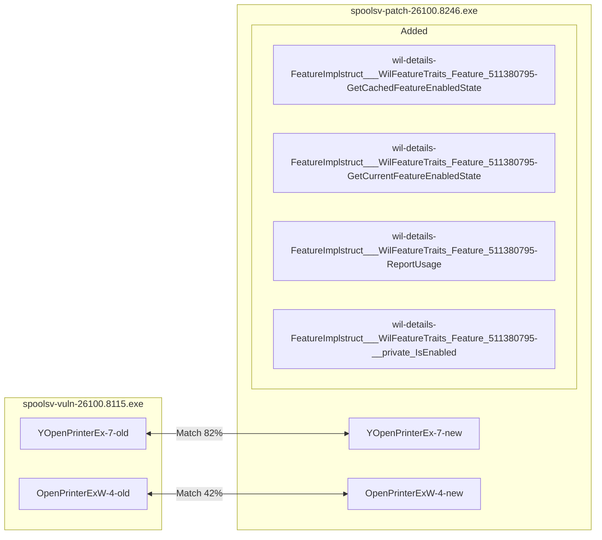
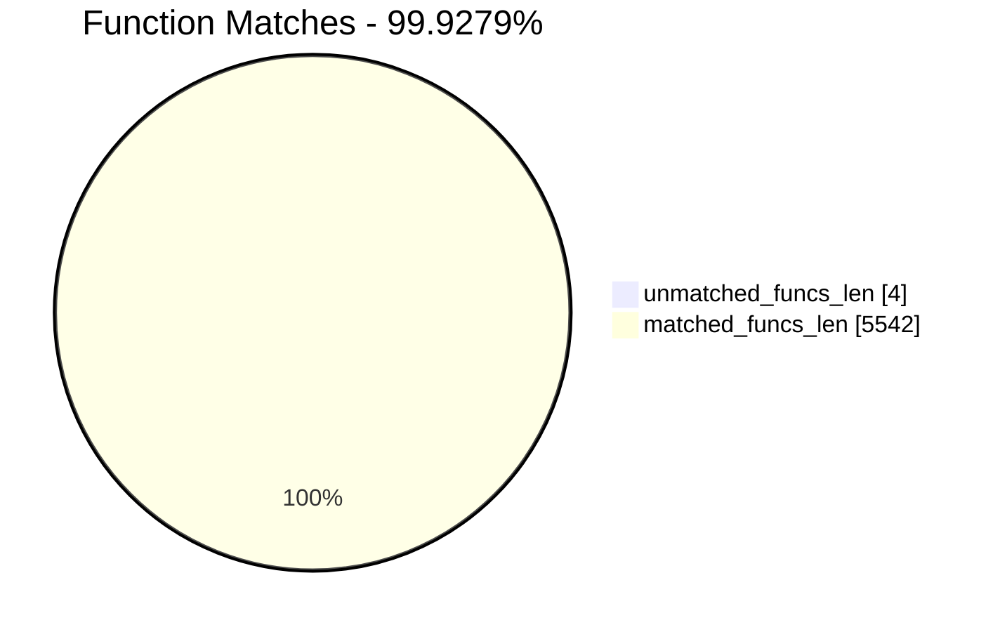
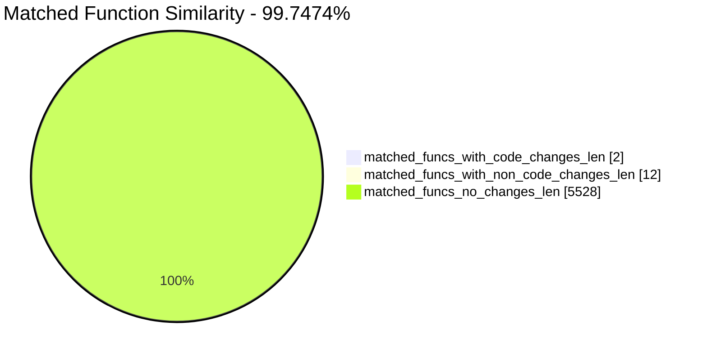
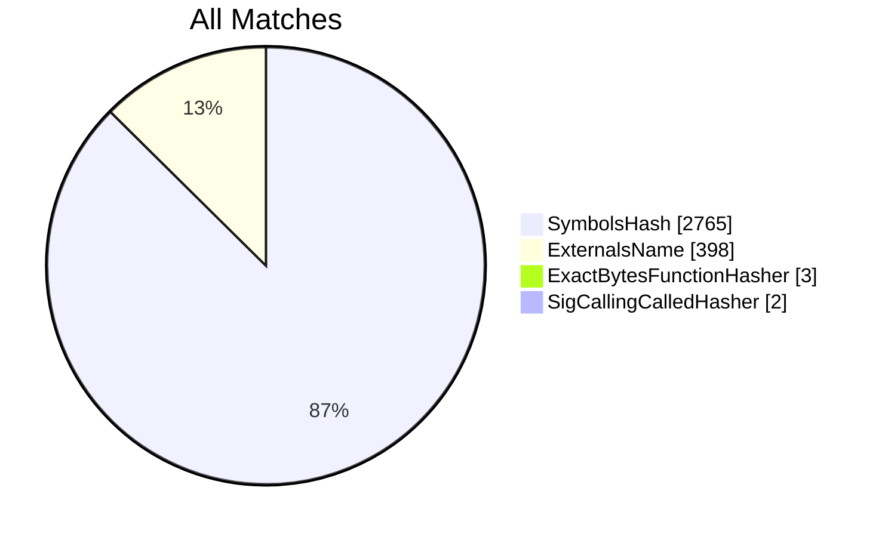
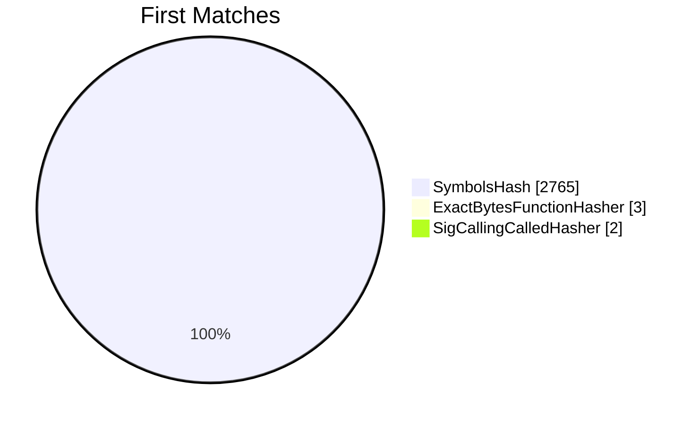
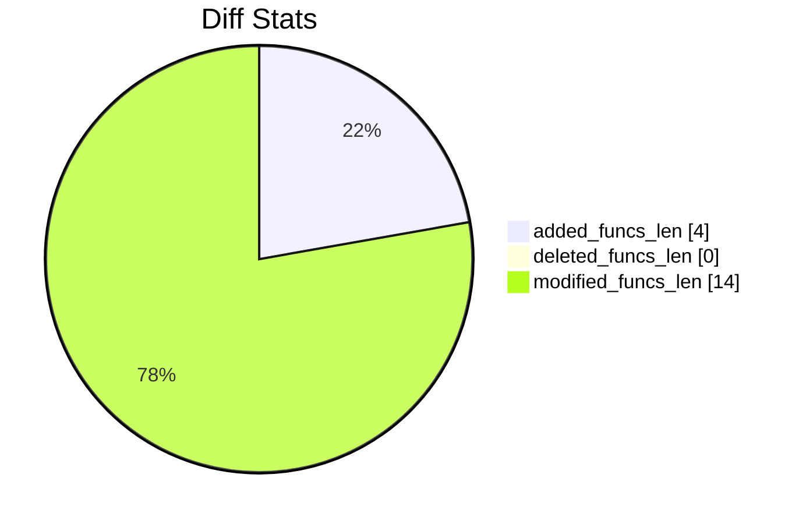

# spoolsv-vuln-26100.8115.exe-spoolsv-patch-26100.8246.exe Diff

# TOC

* [Visual Chart Diff](#visual-chart-diff)
* [Metadata](#metadata)
	* [Ghidra Diff Engine](#ghidra-diff-engine)
		* [Command Line](#command-line)
	* [Binary Metadata Diff](#binary-metadata-diff)
	* [Program Options](#program-options)
	* [Diff Stats](#diff-stats)
	* [Strings](#strings)
* [Deleted](#deleted)
* [Added](#added)
	* [wil::details::FeatureImpl<struct___WilFeatureTraits_Feature_511380795>::GetCachedFeatureEnabledState](#wildetailsfeatureimplstruct___wilfeaturetraits_feature_511380795getcachedfeatureenabledstate)
	* [wil::details::FeatureImpl<struct___WilFeatureTraits_Feature_511380795>::GetCurrentFeatureEnabledState](#wildetailsfeatureimplstruct___wilfeaturetraits_feature_511380795getcurrentfeatureenabledstate)
	* [wil::details::FeatureImpl<struct___WilFeatureTraits_Feature_511380795>::ReportUsage](#wildetailsfeatureimplstruct___wilfeaturetraits_feature_511380795reportusage)
	* [wil::details::FeatureImpl<struct___WilFeatureTraits_Feature_511380795>::__private_IsEnabled](#wildetailsfeatureimplstruct___wilfeaturetraits_feature_511380795__private_isenabled)
* [Modified](#modified)
	* [YOpenPrinterEx](#yopenprinterex)
	* [OpenPrinterExW](#openprinterexw)
* [Modified (No Code Changes)](#modified-no-code-changes)
	* [WilApi_GetFeatureEnabledState](#wilapi_getfeatureenabledstate)
	* [ReportUsageToService](#reportusagetoservice)
	* [RouterOpenPrinterW](#routeropenprinterw)
	* [push_back](#push_back)
	* [EnsureSubscribedToFeatureConfigurationChanges](#ensuresubscribedtofeatureconfigurationchanges)
	* [__GSHandlerCheck](#__gshandlercheck)
	* [API-MS-WIN-CORE-SYNCH-L1-1-0.DLL::AcquireSRWLockExclusive](#api-ms-win-core-synch-l1-1-0dllacquiresrwlockexclusive)
	* [API-MS-WIN-CORE-PROCESSTHREADS-L1-1-0.DLL::GetCurrentProcessId](#api-ms-win-core-processthreads-l1-1-0dllgetcurrentprocessid)
	* [__security_check_cookie](#__security_check_cookie)
	* [~unique_storage<struct_wil::details::resource_policy<struct__RTL_SRWLOCK*___ptr64,void_(__cdecl*)(struct__RTL_SRWLOCK*___ptr64),&void___cdecl_ReleaseSRWLockExclusive(struct__RTL_SRWLOCK*___ptr64),struct_wistd::integral_constant<unsigned___int64,1>,struct__RTL_SRWLOCK*___ptr64,struct__RTL_SRWLOCK*___ptr64,0,std::nullptr_t>_>](#unique_storagestruct_wildetailsresource_policystruct__rtl_srwlock___ptr64void___cdeclstruct__rtl_srwlock___ptr64void___cdecl_releasesrwlockexclusivestruct__rtl_srwlock___ptr64struct_wistdintegral_constantunsigned___int641struct__rtl_srwlock___ptr64struct__rtl_srwlock___ptr640stdnullptr_t_)
	* [API-MS-WIN-CORE-ERRORHANDLING-L1-1-0.DLL::SetLastError](#api-ms-win-core-errorhandling-l1-1-0dllsetlasterror)
	* [RPCRT4.DLL::RpcServerInqCallAttributesW](#rpcrt4dllrpcserverinqcallattributesw)

# Visual Chart Diff










# Metadata

## Ghidra Diff Engine

### Command Line

#### Captured Command Line


```
ghidriff --project-location ghidra-proj --project-name cve-33101 --symbols-path symbols --gzfs-path gzfs --threaded --log-level INFO --file-log-level INFO --log-path ghidriff.log --min-func-len 10 --gdt [] --bsim --max-ram-percent 60.0 --max-section-funcs 200 spoolsv-vuln-26100.8115.exe spoolsv-patch-26100.8246.exe
```


#### Verbose Args


<details>

```
--old ['spoolsv-vuln-26100.8115.exe'] --new [['spoolsv-patch-26100.8246.exe']] --engine VersionTrackingDiff --output-path diffs --summary False --project-location ghidra-proj --project-name cve-33101 --symbols-path symbols --gzfs-path gzfs --base-address None --program-options None --threaded True --force-analysis False --force-diff False --no-symbols False --log-level INFO --file-log-level INFO --log-path ghidriff.log --va False --min-func-len 10 --use-calling-counts False --gdt [] --bsim True --bsim-full False --max-ram-percent 60.0 --print-flags False --jvm-args None --side-by-side False --max-section-funcs 200 --md-title None
```


</details>

#### Download Original PEs


```
wget https://msdl.microsoft.com/download/symbols/spoolsv.exe/FE409FF0F2000/spoolsv.exe -O spoolsv.exe.x64.10.0.26100.8115
wget https://msdl.microsoft.com/download/symbols/spoolsv.exe/2C054C77F2000/spoolsv.exe -O spoolsv.exe.x64.10.0.26100.8246
```


## Binary Metadata Diff


```diff
--- spoolsv-vuln-26100.8115.exe Meta
+++ spoolsv-patch-26100.8246.exe Meta
@@ -1,44 +1,44 @@
-Program Name: spoolsv-vuln-26100.8115.exe
+Program Name: spoolsv-patch-26100.8246.exe
 Language ID: x86:LE:64:default (4.6)
 Compiler ID: windows
 Processor: x86
 Endian: Little
 Address Size: 64
 Minimum Address: 140000000
 Maximum Address: ff0000184f
 # of Bytes: 993712
 # of Memory Blocks: 10
-# of Instructions: 129442
-# of Defined Data: 13258
-# of Functions: 2771
-# of Symbols: 25987
-# of Data Types: 1698
+# of Instructions: 129667
+# of Defined Data: 13260
+# of Functions: 2775
+# of Symbols: 26026
+# of Data Types: 1699
 # of Data Type Categories: 158
 Analyzed: true
 Compiler: visualstudio:unknown
 Created With Ghidra Version: 12.0.4
-Date Created: Tue Apr 21 02:09:39 AST 2026
+Date Created: Tue Apr 21 02:09:41 AST 2026
 Executable Format: Portable Executable (PE)
-Executable Location: /home/cve/repos/win11-forge/lab/CVE-2026-33101/spoolsv-vuln-26100.8115.exe
-Executable MD5: 505287a7ccfd83ecaa6323d2bbd183af
-Executable SHA256: ec330b947471abec30208959ca5dd9cc842c48e8f33bf58ea97dcd5e2a34ba38
-FSRL: file:///home/cve/repos/win11-forge/lab/CVE-2026-33101/spoolsv-vuln-26100.8115.exe?MD5=505287a7ccfd83ecaa6323d2bbd183af
+Executable Location: /home/cve/repos/win11-forge/lab/CVE-2026-33101/spoolsv-patch-26100.8246.exe
+Executable MD5: 21ed19aaccc7b2ad7ffa5227ee2b21e3
+Executable SHA256: 22c017cfe911260a5e7c446f72e44a95b4f272b54018050862470536d82c8ce6
+FSRL: file:///home/cve/repos/win11-forge/lab/CVE-2026-33101/spoolsv-patch-26100.8246.exe?MD5=21ed19aaccc7b2ad7ffa5227ee2b21e3
 PDB Age: 1
 PDB File: spoolsv.pdb
-PDB GUID: 8245a1c4-2034-60fc-933c-e98d98f6416d
+PDB GUID: 38f398c6-5225-05ae-3902-81a2c2592d81
 PDB Loaded: true
 PDB Version: RSDS
 PE Property[CompanyName]: Microsoft Corporation
 PE Property[FileDescription]: Spooler SubSystem App
-PE Property[FileVersion]: 10.0.26100.8115 (WinBuild.160101.0800)
+PE Property[FileVersion]: 10.0.26100.8246 (WinBuild.160101.0800)
 PE Property[InternalName]: spoolsv.exe
 PE Property[LegalCopyright]: © Microsoft Corporation. All rights reserved.
 PE Property[OriginalFilename]: spoolsv.exe
 PE Property[ProductName]: Microsoft® Windows® Operating System
-PE Property[ProductVersion]: 10.0.26100.8115
+PE Property[ProductVersion]: 10.0.26100.8246
 PE Property[Translation]: 4b00409
 Preferred Root Namespace Category: 
 RTTI Found: true
 Relocatable: true
 SectionAlignment: 4096
 Should Ask To Analyze: false

```


## Program Options


<details>
<summary>Ghidra spoolsv-vuln-26100.8115.exe Decompiler Options</summary>


|Decompiler Option|Value|
| :---: | :---: |
|Prototype Evaluation|__fastcall|

</details>


<details>
<summary>Ghidra spoolsv-vuln-26100.8115.exe Specification extensions Options</summary>


|Specification extensions Option|Value|
| :---: | :---: |
|FormatVersion|0|
|VersionCounter|0|

</details>


<details>
<summary>Ghidra spoolsv-vuln-26100.8115.exe Analyzers Options</summary>


|Analyzers Option|Value|
| :---: | :---: |
|ASCII Strings|true|
|ASCII Strings.Create Strings Containing Existing Strings|true|
|ASCII Strings.Create Strings Containing References|true|
|ASCII Strings.Force Model Reload|false|
|ASCII Strings.Minimum String Length|LEN_5|
|ASCII Strings.Model File|StringModel.sng|
|ASCII Strings.Require Null Termination for String|true|
|ASCII Strings.Search Only in Accessible Memory Blocks|true|
|ASCII Strings.String Start Alignment|ALIGN_1|
|ASCII Strings.String end alignment|4|
|Aggressive Instruction Finder|false|
|Aggressive Instruction Finder.Create Analysis Bookmarks|true|
|Apply Data Archives|true|
|Apply Data Archives.Archive Chooser|[Auto-Detect]|
|Apply Data Archives.Create Analysis Bookmarks|true|
|Apply Data Archives.GDT User File Archive Path|None|
|Apply Data Archives.User Project Archive Path|None|
|Call Convention ID|true|
|Call Convention ID.Analysis Decompiler Timeout (sec)|60|
|Call-Fixup Installer|true|
|Condense Filler Bytes|false|
|Condense Filler Bytes.Filler Value|Auto|
|Condense Filler Bytes.Minimum number of sequential bytes|1|
|Create Address Tables|true|
|Create Address Tables.Allow Offcut References|false|
|Create Address Tables.Auto Label Table|false|
|Create Address Tables.Create Analysis Bookmarks|true|
|Create Address Tables.Maxmimum Pointer Distance|16777215|
|Create Address Tables.Minimum Pointer Address|4132|
|Create Address Tables.Minimum Table Size|2|
|Create Address Tables.Pointer Alignment|1|
|Create Address Tables.Relocation Table Guide|true|
|Create Address Tables.Table Alignment|4|
|Data Reference|true|
|Data Reference.Address Table Alignment|1|
|Data Reference.Address Table Minimum Size|2|
|Data Reference.Align End of Strings|false|
|Data Reference.Ascii String References|true|
|Data Reference.Create Address Tables|true|
|Data Reference.Minimum String Length|5|
|Data Reference.References to Pointers|true|
|Data Reference.Relocation Table Guide|true|
|Data Reference.Respect Execute Flag|true|
|Data Reference.Subroutine References|true|
|Data Reference.Switch Table References|false|
|Data Reference.Unicode String References|true|
|Decompiler Parameter ID|true|
|Decompiler Parameter ID.Analysis Clear Level|ANALYSIS|
|Decompiler Parameter ID.Analysis Decompiler Timeout (sec)|60|
|Decompiler Parameter ID.Commit Data Types|true|
|Decompiler Parameter ID.Commit Void Return Values|false|
|Decompiler Parameter ID.Prototype Evaluation|__fastcall|
|Decompiler Switch Analysis|true|
|Decompiler Switch Analysis.Analysis Decompiler Timeout (sec)|60|
|Demangler Microsoft|true|
|Demangler Microsoft.Apply Function Calling Conventions|true|
|Demangler Microsoft.Apply Function Signatures|true|
|Demangler Microsoft.C-Style Symbol Interpretation|FUNCTION_IF_EXISTS|
|Demangler Microsoft.Demangle Only Known Mangled Symbols|false|
|Disassemble Entry Points|true|
|Disassemble Entry Points.Respect Execute Flag|true|
|Embedded Media|true|
|Embedded Media.Create Analysis Bookmarks|true|
|External Entry References|true|
|Function ID|true|
|Function ID.Always Apply FID Labels|false|
|Function ID.Create Analysis Bookmarks|true|
|Function ID.Instruction Count Threshold|14.6|
|Function ID.Multiple Match Threshold|30.0|
|Function Start Search|true|
|Function Start Search.Bookmark Functions|false|
|Function Start Search.Search Data Blocks|false|
|Non-Returning Functions - Discovered|true|
|Non-Returning Functions - Discovered.Create Analysis Bookmarks|true|
|Non-Returning Functions - Discovered.Function Non-return Threshold|3|
|Non-Returning Functions - Discovered.Repair Flow Damage|true|
|Non-Returning Functions - Known|true|
|Non-Returning Functions - Known.Create Analysis Bookmarks|true|
|PDB MSDIA|false|
|PDB MSDIA.Search untrusted symbol servers|false|
|PDB Universal|true|
|PDB Universal.Import Source Line Info|true|
|PDB Universal.Search untrusted symbol servers|false|
|Reference|true|
|Reference.Address Table Alignment|1|
|Reference.Address Table Minimum Size|2|
|Reference.Align End of Strings|false|
|Reference.Ascii String References|true|
|Reference.Create Address Tables|true|
|Reference.Minimum String Length|5|
|Reference.References to Pointers|true|
|Reference.Relocation Table Guide|true|
|Reference.Respect Execute Flag|true|
|Reference.Subroutine References|true|
|Reference.Switch Table References|false|
|Reference.Unicode String References|true|
|Scalar Operand References|true|
|Scalar Operand References.Relocation Table Guide|true|
|Shared Return Calls|true|
|Shared Return Calls.Allow Conditional Jumps|false|
|Shared Return Calls.Assume Contiguous Functions Only|true|
|Stack|true|
|Stack.Create Local Variables|true|
|Stack.Create Param Variables|false|
|Stack.Max Threads|2|
|Subroutine References|true|
|Subroutine References.Create Thunks Early|true|
|Variadic Function Signature Override|false|
|Variadic Function Signature Override.Create Analysis Bookmarks|false|
|Windows x86 PE Exception Handling|true|
|Windows x86 PE RTTI Analyzer|true|
|Windows x86 Thread Environment Block (TEB) Analyzer|true|
|Windows x86 Thread Environment Block (TEB) Analyzer.Starting Address of the TEB||
|Windows x86 Thread Environment Block (TEB) Analyzer.Windows OS Version|Windows 7|
|WindowsPE x86 Propagate External Parameters|false|
|WindowsResourceReference|true|
|WindowsResourceReference.Create Analysis Bookmarks|true|
|x86 Constant Reference Analyzer|true|
|x86 Constant Reference Analyzer.Create Data from pointer|false|
|x86 Constant Reference Analyzer.Function parameter/return Pointer analysis|true|
|x86 Constant Reference Analyzer.Max Threads|2|
|x86 Constant Reference Analyzer.Min absolute reference|4|
|x86 Constant Reference Analyzer.Require pointer param data type|false|
|x86 Constant Reference Analyzer.Speculative reference max|256|
|x86 Constant Reference Analyzer.Speculative reference min|1024|
|x86 Constant Reference Analyzer.Stored Value Pointer analysis|true|
|x86 Constant Reference Analyzer.Trust values read from writable memory|true|

</details>


<details>
<summary>Ghidra spoolsv-patch-26100.8246.exe Decompiler Options</summary>


|Decompiler Option|Value|
| :---: | :---: |
|Prototype Evaluation|__fastcall|

</details>


<details>
<summary>Ghidra spoolsv-patch-26100.8246.exe Specification extensions Options</summary>


|Specification extensions Option|Value|
| :---: | :---: |
|FormatVersion|0|
|VersionCounter|0|

</details>


<details>
<summary>Ghidra spoolsv-patch-26100.8246.exe Analyzers Options</summary>


|Analyzers Option|Value|
| :---: | :---: |
|ASCII Strings|true|
|ASCII Strings.Create Strings Containing Existing Strings|true|
|ASCII Strings.Create Strings Containing References|true|
|ASCII Strings.Force Model Reload|false|
|ASCII Strings.Minimum String Length|LEN_5|
|ASCII Strings.Model File|StringModel.sng|
|ASCII Strings.Require Null Termination for String|true|
|ASCII Strings.Search Only in Accessible Memory Blocks|true|
|ASCII Strings.String Start Alignment|ALIGN_1|
|ASCII Strings.String end alignment|4|
|Aggressive Instruction Finder|false|
|Aggressive Instruction Finder.Create Analysis Bookmarks|true|
|Apply Data Archives|true|
|Apply Data Archives.Archive Chooser|[Auto-Detect]|
|Apply Data Archives.Create Analysis Bookmarks|true|
|Apply Data Archives.GDT User File Archive Path|None|
|Apply Data Archives.User Project Archive Path|None|
|Call Convention ID|true|
|Call Convention ID.Analysis Decompiler Timeout (sec)|60|
|Call-Fixup Installer|true|
|Condense Filler Bytes|false|
|Condense Filler Bytes.Filler Value|Auto|
|Condense Filler Bytes.Minimum number of sequential bytes|1|
|Create Address Tables|true|
|Create Address Tables.Allow Offcut References|false|
|Create Address Tables.Auto Label Table|false|
|Create Address Tables.Create Analysis Bookmarks|true|
|Create Address Tables.Maxmimum Pointer Distance|16777215|
|Create Address Tables.Minimum Pointer Address|4132|
|Create Address Tables.Minimum Table Size|2|
|Create Address Tables.Pointer Alignment|1|
|Create Address Tables.Relocation Table Guide|true|
|Create Address Tables.Table Alignment|4|
|Data Reference|true|
|Data Reference.Address Table Alignment|1|
|Data Reference.Address Table Minimum Size|2|
|Data Reference.Align End of Strings|false|
|Data Reference.Ascii String References|true|
|Data Reference.Create Address Tables|true|
|Data Reference.Minimum String Length|5|
|Data Reference.References to Pointers|true|
|Data Reference.Relocation Table Guide|true|
|Data Reference.Respect Execute Flag|true|
|Data Reference.Subroutine References|true|
|Data Reference.Switch Table References|false|
|Data Reference.Unicode String References|true|
|Decompiler Parameter ID|true|
|Decompiler Parameter ID.Analysis Clear Level|ANALYSIS|
|Decompiler Parameter ID.Analysis Decompiler Timeout (sec)|60|
|Decompiler Parameter ID.Commit Data Types|true|
|Decompiler Parameter ID.Commit Void Return Values|false|
|Decompiler Parameter ID.Prototype Evaluation|__fastcall|
|Decompiler Switch Analysis|true|
|Decompiler Switch Analysis.Analysis Decompiler Timeout (sec)|60|
|Demangler Microsoft|true|
|Demangler Microsoft.Apply Function Calling Conventions|true|
|Demangler Microsoft.Apply Function Signatures|true|
|Demangler Microsoft.C-Style Symbol Interpretation|FUNCTION_IF_EXISTS|
|Demangler Microsoft.Demangle Only Known Mangled Symbols|false|
|Disassemble Entry Points|true|
|Disassemble Entry Points.Respect Execute Flag|true|
|Embedded Media|true|
|Embedded Media.Create Analysis Bookmarks|true|
|External Entry References|true|
|Function ID|true|
|Function ID.Always Apply FID Labels|false|
|Function ID.Create Analysis Bookmarks|true|
|Function ID.Instruction Count Threshold|14.6|
|Function ID.Multiple Match Threshold|30.0|
|Function Start Search|true|
|Function Start Search.Bookmark Functions|false|
|Function Start Search.Search Data Blocks|false|
|Non-Returning Functions - Discovered|true|
|Non-Returning Functions - Discovered.Create Analysis Bookmarks|true|
|Non-Returning Functions - Discovered.Function Non-return Threshold|3|
|Non-Returning Functions - Discovered.Repair Flow Damage|true|
|Non-Returning Functions - Known|true|
|Non-Returning Functions - Known.Create Analysis Bookmarks|true|
|PDB MSDIA|false|
|PDB MSDIA.Search untrusted symbol servers|false|
|PDB Universal|true|
|PDB Universal.Import Source Line Info|true|
|PDB Universal.Search untrusted symbol servers|false|
|Reference|true|
|Reference.Address Table Alignment|1|
|Reference.Address Table Minimum Size|2|
|Reference.Align End of Strings|false|
|Reference.Ascii String References|true|
|Reference.Create Address Tables|true|
|Reference.Minimum String Length|5|
|Reference.References to Pointers|true|
|Reference.Relocation Table Guide|true|
|Reference.Respect Execute Flag|true|
|Reference.Subroutine References|true|
|Reference.Switch Table References|false|
|Reference.Unicode String References|true|
|Scalar Operand References|true|
|Scalar Operand References.Relocation Table Guide|true|
|Shared Return Calls|true|
|Shared Return Calls.Allow Conditional Jumps|false|
|Shared Return Calls.Assume Contiguous Functions Only|true|
|Stack|true|
|Stack.Create Local Variables|true|
|Stack.Create Param Variables|false|
|Stack.Max Threads|2|
|Subroutine References|true|
|Subroutine References.Create Thunks Early|true|
|Variadic Function Signature Override|false|
|Variadic Function Signature Override.Create Analysis Bookmarks|false|
|Windows x86 PE Exception Handling|true|
|Windows x86 PE RTTI Analyzer|true|
|Windows x86 Thread Environment Block (TEB) Analyzer|true|
|Windows x86 Thread Environment Block (TEB) Analyzer.Starting Address of the TEB||
|Windows x86 Thread Environment Block (TEB) Analyzer.Windows OS Version|Windows 7|
|WindowsPE x86 Propagate External Parameters|false|
|WindowsResourceReference|true|
|WindowsResourceReference.Create Analysis Bookmarks|true|
|x86 Constant Reference Analyzer|true|
|x86 Constant Reference Analyzer.Create Data from pointer|false|
|x86 Constant Reference Analyzer.Function parameter/return Pointer analysis|true|
|x86 Constant Reference Analyzer.Max Threads|2|
|x86 Constant Reference Analyzer.Min absolute reference|4|
|x86 Constant Reference Analyzer.Require pointer param data type|false|
|x86 Constant Reference Analyzer.Speculative reference max|256|
|x86 Constant Reference Analyzer.Speculative reference min|1024|
|x86 Constant Reference Analyzer.Stored Value Pointer analysis|true|
|x86 Constant Reference Analyzer.Trust values read from writable memory|true|

</details>

## Diff Stats


|Stat|Value|
| :---: | :---: |
|added_funcs_len|4|
|deleted_funcs_len|0|
|modified_funcs_len|14|
|added_symbols_len|0|
|deleted_symbols_len|0|
|diff_time|22.146615505218506|
|deleted_strings_len|0|
|added_strings_len|0|
|match_types|Counter({'SymbolsHash': 2765, 'ExternalsName': 398, 'ExactBytesFunctionHasher': 3, 'SigCallingCalledHasher': 2})|
|items_to_process|18|
|diff_types|Counter({'refcount': 13, 'calling': 11, 'address': 10, 'code': 2, 'length': 2, 'called': 2})|
|unmatched_funcs_len|4|
|total_funcs_len|5546|
|matched_funcs_len|5542|
|matched_funcs_with_code_changes_len|2|
|matched_funcs_with_non_code_changes_len|12|
|matched_funcs_no_changes_len|5528|
|match_func_similarity_percent|99.7474%|
|func_match_overall_percent|99.9279%|
|first_matches|Counter({'SymbolsHash': 2765, 'ExactBytesFunctionHasher': 3, 'SigCallingCalledHasher': 2})|











```mermaid
pie showData
    title Symbols
"added_symbols_len" : 0
"deleted_symbols_len" : 0
```

## Strings


*No string differences found*

# Deleted

# Added

## wil::details::FeatureImpl<struct___WilFeatureTraits_Feature_511380795>::GetCachedFeatureEnabledState

### Function Meta


|Key|spoolsv-patch-26100.8246.exe|
| :---: | :---: |
|name|GetCachedFeatureEnabledState|
|fullname|wil::details::FeatureImpl<struct___WilFeatureTraits_Feature_511380795>::GetCachedFeatureEnabledState|
|refcount|3|
|length|294|
|called|API-MS-WIN-CORE-SYNCH-L1-1-0.DLL::AcquireSRWLockExclusive<br>wil::details::EnsureSubscribedToFeatureConfigurationChanges<br>wil::details::FeatureImpl<struct___WilFeatureTraits_Feature_511380795>::GetCurrentFeatureEnabledState<br>wil::details::unique_storage<struct_wil::details::resource_policy<struct__RTL_SRWLOCK*___ptr64,void_(__cdecl*)(struct__RTL_SRWLOCK*___ptr64),&void___cdecl_ReleaseSRWLockExclusive(struct__RTL_SRWLOCK*___ptr64),struct_wistd::integral_constant<unsigned___int64,1>,struct__RTL_SRWLOCK*___ptr64,struct__RTL_SRWLOCK*___ptr64,0,std::nullptr_t>_>::~unique_storage<struct_wil::details::resource_policy<struct__RTL_SRWLOCK*___ptr64,void_(__cdecl*)(struct__RTL_SRWLOCK*___ptr64),&void___cdecl_ReleaseSRWLockExclusive(struct__RTL_SRWLOCK*___ptr64),struct_wistd::integral_constant<unsigned___int64,1>,struct__RTL_SRWLOCK*___ptr64,struct__RTL_SRWLOCK*___ptr64,0,std::nullptr_t>_><br>wil::details_abi::heap_buffer::push_back|
|calling|wil::details::FeatureImpl<struct___WilFeatureTraits_Feature_511380795>::ReportUsage<br>wil::details::FeatureImpl<struct___WilFeatureTraits_Feature_511380795>::__private_IsEnabled|
|paramcount|1|
|address|1400525e0|
|sig|wil_details_FeatureStateCache __thiscall GetCachedFeatureEnabledState(FeatureImpl<struct___WilFeatureTraits_Feature_511380795> * this)|
|sym_type|Function|
|sym_source|ANALYSIS|
|external|False|


```diff
--- wil::details::FeatureImpl<struct___WilFeatureTraits_Feature_511380795>::GetCachedFeatureEnabledState
+++ wil::details::FeatureImpl<struct___WilFeatureTraits_Feature_511380795>::GetCachedFeatureEnabledState
@@ -0,0 +1,81 @@
+
+/* WARNING: Removing unreachable block (ram,0x000140052632) */
+/* WARNING: Removing unreachable block (ram,0x000140052638) */
+/* WARNING: Globals starting with '_' overlap smaller symbols at the same address */
+/* private: union wil_details_FeatureStateCache __cdecl wil::details::FeatureImpl<struct
+   __WilFeatureTraits_Feature_511380795>::GetCachedFeatureEnabledState(void) __ptr64 */
+
+void __thiscall
+wil::details::FeatureImpl<struct___WilFeatureTraits_Feature_511380795>::GetCachedFeatureEnabledState
+          (FeatureImpl<struct___WilFeatureTraits_Feature_511380795> *this)
+
+{
+  uint uVar1;
+  uint uVar2;
+  uint uVar3;
+  FeatureImpl<struct___WilFeatureTraits_Feature_511380795> *this_00;
+  uint uVar4;
+  uint *in_RDX;
+  bool bVar5;
+  uint local_res10 [2];
+  undefined *local_res18 [2];
+  undefined4 local_38;
+  undefined4 local_34;
+  FeatureImpl<struct___WilFeatureTraits_Feature_511380795> *local_30;
+  
+  in_RDX[0] = 0;
+  in_RDX[1] = 0;
+  uVar3 = *(uint *)this;
+  *in_RDX = uVar3;
+  if (((byte)uVar3 & 6) == 6) {
+    return;
+  }
+  this_00 = this;
+  uVar2 = EnsureSubscribedToFeatureConfigurationChanges();
+  GetCurrentFeatureEnabledState(this_00,(int *)local_res10);
+  uVar3 = *in_RDX;
+  do {
+    uVar1 = uVar3;
+    *in_RDX = uVar1;
+    uVar4 = uVar1;
+    if ((uVar1 & 4) == 0) {
+      uVar4 = uVar1 & 0xfffffbff | local_res10[0] & 0x400 | 4;
+      *in_RDX = uVar4;
+    }
+    LOCK();
+    uVar3 = *(uint *)this;
+    bVar5 = uVar1 == uVar3;
+    if (bVar5) {
+      *(uint *)this = uVar4;
+      uVar3 = uVar1;
+    }
+    UNLOCK();
+  } while (!bVar5);
+  if (((uVar1 & 4) != 0) || (_g_enabledStateManager == 0)) goto LAB_1400526df;
+  AcquireSRWLockExclusive((PSRWLOCK)&DAT_1400d5130);
+  local_res18[0] = &DAT_1400d5130;
+  if ((uVar2 == 0) || (uVar2 != DAT_1400d5144)) {
+LAB_1400526d2:
+    LOCK();
+    *(uint *)this = *(uint *)this & 0xfffffffb;
+    UNLOCK();
+  }
+  else {
+    local_34 = 0;
+    local_38 = 3;
+    local_30 = this;
+    bVar5 = details_abi::heap_buffer::push_back((heap_buffer *)&DAT_1400d5178,&local_38,0x10);
+    if (!bVar5) goto LAB_1400526d2;
+  }
+  unique_storage<struct_wil::details::resource_policy<struct__RTL_SRWLOCK*___ptr64,void_(__cdecl*)(struct__RTL_SRWLOCK*___ptr64),&void___cdecl_ReleaseSRWLockExclusive(struct__RTL_SRWLOCK*___ptr64),struct_wistd::integral_constant<unsigned___int64,1>,struct__RTL_SRWLOCK*___ptr64,struct__RTL_SRWLOCK*___ptr64,0,std::nullptr_t>_>
+  ::
+  ~unique_storage<struct_wil::details::resource_policy<struct__RTL_SRWLOCK*___ptr64,void_(__cdecl*)(struct__RTL_SRWLOCK*___ptr64),&void___cdecl_ReleaseSRWLockExclusive(struct__RTL_SRWLOCK*___ptr64),struct_wistd::integral_constant<unsigned___int64,1>,struct__RTL_SRWLOCK*___ptr64,struct__RTL_SRWLOCK*___ptr64,0,std::nullptr_t>_>
+            ((unique_storage<struct_wil::details::resource_policy<struct__RTL_SRWLOCK*___ptr64,void_(__cdecl*)(struct__RTL_SRWLOCK*___ptr64),&void___cdecl_ReleaseSRWLockExclusive(struct__RTL_SRWLOCK*___ptr64),struct_wistd::integral_constant<unsigned___int64,1>,struct__RTL_SRWLOCK*___ptr64,struct__RTL_SRWLOCK*___ptr64,0,std::nullptr_t>_>
+              *)local_res18);
+LAB_1400526df:
+  if ((*in_RDX & 2) == 0) {
+    *in_RDX = *in_RDX & 0xfffff63e | local_res10[0] & 0x9c1;
+  }
+  return;
+}
+

```


## wil::details::FeatureImpl<struct___WilFeatureTraits_Feature_511380795>::GetCurrentFeatureEnabledState

### Function Meta


|Key|spoolsv-patch-26100.8246.exe|
| :---: | :---: |
|name|GetCurrentFeatureEnabledState|
|fullname|wil::details::FeatureImpl<struct___WilFeatureTraits_Feature_511380795>::GetCurrentFeatureEnabledState|
|refcount|2|
|length|174|
|called|wil::details::WilApi_GetFeatureEnabledState|
|calling|wil::details::FeatureImpl<struct___WilFeatureTraits_Feature_511380795>::GetCachedFeatureEnabledState|
|paramcount|2|
|address|140052710|
|sig|wil_details_FeatureStateCache __thiscall GetCurrentFeatureEnabledState(FeatureImpl<struct___WilFeatureTraits_Feature_511380795> * this, int * param_1)|
|sym_type|Function|
|sym_source|ANALYSIS|
|external|False|


```diff
--- wil::details::FeatureImpl<struct___WilFeatureTraits_Feature_511380795>::GetCurrentFeatureEnabledState
+++ wil::details::FeatureImpl<struct___WilFeatureTraits_Feature_511380795>::GetCurrentFeatureEnabledState
@@ -0,0 +1,45 @@
+
+/* private: union wil_details_FeatureStateCache __cdecl wil::details::FeatureImpl<struct
+   __WilFeatureTraits_Feature_511380795>::GetCurrentFeatureEnabledState(int * __ptr64) __ptr64 */
+
+int * __thiscall
+wil::details::FeatureImpl<struct___WilFeatureTraits_Feature_511380795>::
+GetCurrentFeatureEnabledState
+          (FeatureImpl<struct___WilFeatureTraits_Feature_511380795> *this,int *param_1)
+
+{
+  bool bVar1;
+  FEATURE_ENABLED_STATE FVar2;
+  uint uVar3;
+  uint uVar4;
+  uint uVar5;
+  uint uVar6;
+  int *in_R8;
+  
+  FVar2 = WilApi_GetFeatureEnabledState(0x39fc099,(FEATURE_CHANGE_TIME)param_1,in_R8);
+  param_1[0] = 0;
+  param_1[1] = 0;
+  uVar5 = -(uint)((FVar2 & 0x40) != 0) & 0x800 | -(uint)((FVar2 & 0x80) != 0) & 0x400;
+  uVar6 = uVar5 | (FVar2 & 3) << 7;
+  *param_1 = uVar6;
+  if ((FVar2 & 0xffffff3f) == 0) {
+    uVar3 = 0x40;
+  }
+  else {
+    uVar3 = 0;
+    if ((FVar2 & 0xffffff3f) == 2) {
+      uVar3 = 0x40;
+    }
+  }
+  bVar1 = false;
+  uVar4 = 1;
+  if ((uVar5 == 0xc00) || (uVar3 != 0)) {
+    bVar1 = true;
+  }
+  if ((uVar3 == 0) || (!bVar1)) {
+    uVar4 = 0;
+  }
+  *param_1 = uVar6 | uVar3 | uVar4;
+  return param_1;
+}
+

```


## wil::details::FeatureImpl<struct___WilFeatureTraits_Feature_511380795>::ReportUsage

### Function Meta


|Key|spoolsv-patch-26100.8246.exe|
| :---: | :---: |
|name|ReportUsage|
|fullname|wil::details::FeatureImpl<struct___WilFeatureTraits_Feature_511380795>::ReportUsage|
|refcount|2|
|length|127|
|called|wil::details::FeatureImpl<struct___WilFeatureTraits_Feature_511380795>::GetCachedFeatureEnabledState<br>wil::details::ReportUsageToService|
|calling|wil::details::FeatureImpl<struct___WilFeatureTraits_Feature_511380795>::__private_IsEnabled|
|paramcount|4|
|address|1400528cc|
|sig|void __thiscall ReportUsage(FeatureImpl<struct___WilFeatureTraits_Feature_511380795> * this, bool param_1, ReportingKind param_2, __uint64 param_3)|
|sym_type|Function|
|sym_source|ANALYSIS|
|external|False|


```diff
--- wil::details::FeatureImpl<struct___WilFeatureTraits_Feature_511380795>::ReportUsage
+++ wil::details::FeatureImpl<struct___WilFeatureTraits_Feature_511380795>::ReportUsage
@@ -0,0 +1,31 @@
+
+/* public: void __cdecl wil::details::FeatureImpl<struct
+   __WilFeatureTraits_Feature_511380795>::ReportUsage(bool,enum wil::ReportingKind,unsigned __int64)
+   __ptr64 */
+
+void __thiscall
+wil::details::FeatureImpl<struct___WilFeatureTraits_Feature_511380795>::ReportUsage
+          (FeatureImpl<struct___WilFeatureTraits_Feature_511380795> *this,bool param_1,
+          ReportingKind param_2,__uint64 param_3)
+
+{
+  ulonglong *puVar1;
+  ulonglong uVar2;
+  undefined4 local_res8;
+  undefined2 local_resc;
+  __uint64 in_stack_ffffffffffffffe0;
+  
+  uVar2 = (ulonglong)*(uint *)this;
+  if ((*(uint *)this & 4) == 0) {
+    puVar1 = (ulonglong *)GetCachedFeatureEnabledState(this);
+    uVar2 = *puVar1;
+  }
+  local_res8 = 0;
+  local_resc = 2;
+  ReportUsageToService
+            ((wil_details_FeatureReportingCache *)(this + 8),0x39fc099,(uint)uVar2 >> 10 & 1,
+             (uint)(uVar2 >> 0xb) & 1,(FEATURE_LOGGED_TRAITS *)&local_res8,(uint)param_1,3,
+             in_stack_ffffffffffffffe0);
+  return;
+}
+

```


## wil::details::FeatureImpl<struct___WilFeatureTraits_Feature_511380795>::__private_IsEnabled

### Function Meta


|Key|spoolsv-patch-26100.8246.exe|
| :---: | :---: |
|name|__private_IsEnabled|
|fullname|wil::details::FeatureImpl<struct___WilFeatureTraits_Feature_511380795>::__private_IsEnabled|
|refcount|5|
|length|53|
|called|wil::details::FeatureImpl<struct___WilFeatureTraits_Feature_511380795>::GetCachedFeatureEnabledState<br>wil::details::FeatureImpl<struct___WilFeatureTraits_Feature_511380795>::ReportUsage|
|calling|OpenPrinterExW|
|paramcount|1|
|address|140052a94|
|sig|bool __thiscall __private_IsEnabled(FeatureImpl<struct___WilFeatureTraits_Feature_511380795> * this)|
|sym_type|Function|
|sym_source|ANALYSIS|
|external|False|


```diff
--- wil::details::FeatureImpl<struct___WilFeatureTraits_Feature_511380795>::__private_IsEnabled
+++ wil::details::FeatureImpl<struct___WilFeatureTraits_Feature_511380795>::__private_IsEnabled
@@ -0,0 +1,18 @@
+
+/* public: bool __cdecl wil::details::FeatureImpl<struct
+   __WilFeatureTraits_Feature_511380795>::__private_IsEnabled(void) __ptr64 */
+
+bool __thiscall
+wil::details::FeatureImpl<struct___WilFeatureTraits_Feature_511380795>::__private_IsEnabled
+          (FeatureImpl<struct___WilFeatureTraits_Feature_511380795> *this)
+
+{
+  ReportingKind in_R8D;
+  __uint64 in_R9;
+  undefined1 local_res10;
+  
+  GetCachedFeatureEnabledState(this);
+  ReportUsage(this,(bool)(local_res10 & 1),in_R8D,in_R9);
+  return (bool)(local_res10 & 1);
+}
+

```


# Modified


*Modified functions contain code changes*
## YOpenPrinterEx

### Match Info


|Key|spoolsv-vuln-26100.8115.exe - spoolsv-patch-26100.8246.exe|
| :---: | :---: |
|diff_type|code,length,address,called|
|ratio|0.55|
|i_ratio|0.51|
|m_ratio|0.82|
|b_ratio|0.82|
|match_types|SymbolsHash|

### Function Meta Diff


|Key|spoolsv-vuln-26100.8115.exe|spoolsv-patch-26100.8246.exe|
| :---: | :---: | :---: |
|name|YOpenPrinterEx|YOpenPrinterEx|
|fullname|YOpenPrinterEx|YOpenPrinterEx|
|refcount|11|11|
|`length`|892|629|
|`called`|API-MS-WIN-CORE-ERRORHANDLING-L1-1-0.DLL::GetLastError<br>API-MS-WIN-CORE-ERRORHANDLING-L1-1-0.DLL::SetLastError<br>BoolFromHResult<br>McTemplateU0zqd_EtwEventWriteTransfer<br>PrvCheckLocalCall<br>RPCRT4.DLL::RpcImpersonateClient<br>RPCRT4.DLL::RpcRevertToSelf<br>RouterOpenPrinterW<br>SplIsValidDevmodeNoSize<struct__devicemodeW,unsigned_short><br>YRevertToSelf|<details><summary>Expand for full list:<br>API-MS-WIN-CORE-ERRORHANDLING-L1-1-0.DLL::GetLastError<br>API-MS-WIN-CORE-ERRORHANDLING-L1-1-0.DLL::SetLastError<br>BoolFromHResult<br>McTemplateU0zqd_EtwEventWriteTransfer<br>OpenPrinterExW<br>PrvCheckLocalCall<br>RPCRT4.DLL::RpcImpersonateClient<br>RPCRT4.DLL::RpcRevertToSelf<br>RouterOpenPrinterW<br>SplIsValidDevmodeNoSize<struct__devicemodeW,unsigned_short><br>YRevertToSelf</summary></details>|
|calling|RpcSplOpenPrinter|RpcSplOpenPrinter|
|paramcount|7|7|
|`address`|140005390|140006470|
|sig|ulong __cdecl YOpenPrinterEx(ushort * param_1, void * * param_2, ushort * param_3, _DEVMODE_CONTAINER * param_4, ulong param_5, Call_Route param_6, _SPLCLIENT_CONTAINER * param_7)|ulong __cdecl YOpenPrinterEx(ushort * param_1, void * * param_2, ushort * param_3, _DEVMODE_CONTAINER * param_4, ulong param_5, Call_Route param_6, _SPLCLIENT_CONTAINER * param_7)|
|sym_type|Function|Function|
|sym_source|ANALYSIS|ANALYSIS|
|external|False|False|

### YOpenPrinterEx Called Diff


```diff
--- YOpenPrinterEx called
+++ YOpenPrinterEx called
@@ -4,0 +5 @@
+OpenPrinterExW
```


### YOpenPrinterEx Diff


```diff
--- YOpenPrinterEx
+++ YOpenPrinterEx
@@ -1,137 +1,104 @@
 
 /* unsigned long __cdecl YOpenPrinterEx(unsigned short * __ptr64,void * __ptr64 * __ptr64,unsigned
    short * __ptr64,struct _DEVMODE_CONTAINER * __ptr64,unsigned long,enum Call_Route,struct
    _SPLCLIENT_CONTAINER * __ptr64) */
 
 ulong __cdecl
 YOpenPrinterEx(ushort *param_1,void **param_2,ushort *param_3,_DEVMODE_CONTAINER *param_4,
               ulong param_5,Call_Route param_6,_SPLCLIENT_CONTAINER *param_7)
 
 {
-  int iVar1;
-  _devicemodeW *p_Var2;
-  bool bVar3;
-  int iVar4;
-  DWORD DVar5;
-  ulong uVar6;
-  uint uVar7;
+  _devicemodeW *p_Var1;
+  bool bVar2;
+  int iVar3;
+  DWORD DVar4;
+  ulong uVar5;
+  uint uVar6;
   undefined7 extraout_var;
-  ushort *puVar8;
-  void *pvVar9;
-  ulonglong uVar10;
+  ushort *puVar7;
+  ulonglong uVar8;
   _PRINTER_DEFAULTSW local_68;
   undefined8 local_50;
   undefined8 uStack_48;
   undefined8 local_40;
   undefined8 uStack_38;
   undefined8 local_30;
   undefined8 uStack_28;
   undefined8 local_20;
   
-  pvVar9 = (void *)0x0;
-  iVar4 = 0;
   local_68._20_4_ = 0;
-  if ((g_bNoPrintersMode) && (uVar7 = PrvCheckLocalCall(), uVar7 == 0)) {
+  if ((g_bNoPrintersMode) && (uVar6 = PrvCheckLocalCall(), uVar6 == 0)) {
     return 0x709;
   }
   if ((param_7 != (_SPLCLIENT_CONTAINER *)0x0) && (*(longlong *)(param_7 + 8) == 0)) {
     return 0x57;
   }
-  if ((param_6 == 1) && (DVar5 = RpcImpersonateClient((RPC_BINDING_HANDLE)0x0), DVar5 != 0)) {
-    SetLastError(DVar5);
-    DVar5 = GetLastError();
-    return DVar5;
+  if ((param_6 == 1) && (DVar4 = RpcImpersonateClient((RPC_BINDING_HANDLE)0x0), DVar4 != 0)) {
+    SetLastError(DVar4);
+    DVar4 = GetLastError();
+    return DVar4;
   }
   if (param_4 == (_DEVMODE_CONTAINER *)0x0) {
 LAB_0:
     YRevertToSelf(param_6);
-    uVar6 = 0x57;
+    uVar5 = 0x57;
   }
   else {
-    p_Var2 = *(_devicemodeW **)(param_4 + 8);
-    uVar10 = 0;
-    if (p_Var2 != (_devicemodeW *)0x0) {
-      uVar10 = 0x8007000d;
+    p_Var1 = *(_devicemodeW **)(param_4 + 8);
+    uVar8 = 0;
+    if (p_Var1 != (_devicemodeW *)0x0) {
+      uVar8 = 0x8007000d;
       if ((0x4b < *(uint *)param_4) &&
-         ((uint)p_Var2->dmDriverExtra + (uint)p_Var2->dmSize <= *(uint *)param_4)) {
-        uVar7 = SplIsValidDevmodeNoSize<struct__devicemodeW,unsigned_short>(p_Var2);
-        uVar10 = (ulonglong)uVar7;
+         ((uint)p_Var1->dmDriverExtra + (uint)p_Var1->dmSize <= *(uint *)param_4)) {
+        uVar6 = SplIsValidDevmodeNoSize<struct__devicemodeW,unsigned_short>(p_Var1);
+        uVar8 = (ulonglong)uVar6;
       }
-      bVar3 = BoolFromHResult((uint)uVar10);
-      if ((int)CONCAT71(extraout_var,bVar3) == 0) goto LAB_0;
+      bVar2 = BoolFromHResult((uint)uVar8);
+      if ((int)CONCAT71(extraout_var,bVar2) == 0) goto LAB_0;
     }
     local_68.pDevMode = *(LPDEVMODEW *)(param_4 + 8);
     local_68.DesiredAccess = param_5;
     local_68.pDatatype = (LPWSTR)param_3;
     if (param_7 == (_SPLCLIENT_CONTAINER *)0x0) {
       local_50 = 0;
       uStack_48 = 0;
       local_20 = 0;
       local_40 = 0;
       uStack_38 = 0;
       local_30 = 0;
       uStack_28 = 0;
       if ((Microsoft_Windows_DocumentsEnableBits & 2) != 0) {
         GetLastError();
         McTemplateU0zqd_EtwEventWriteTransfer
-                  (uVar10,&DocPerf_OpenPrinter2_Start,(wchar_t *)param_1,0);
+                  (uVar8,&DocPerf_OpenPrinter2_Start,(wchar_t *)param_1,0);
       }
-      puVar8 = param_1;
-      iVar4 = RouterOpenPrinterW(param_1,param_2,&local_68,(uchar *)0x0,0,1);
+      puVar7 = param_1;
+      iVar3 = RouterOpenPrinterW(param_1,param_2,&local_68,(uchar *)0x0,0,1);
       if ((Microsoft_Windows_DocumentsEnableBits & 2) != 0) {
         GetLastError();
         McTemplateU0zqd_EtwEventWriteTransfer
-                  (puVar8,&DocPerf_OpenPrinter2_Stop,(wchar_t *)param_1,0);
+                  (puVar7,&DocPerf_OpenPrinter2_Stop,(wchar_t *)param_1,0);
       }
     }
     else {
-      iVar1 = *(int *)param_7;
-      if (iVar1 == 4) {
-        iVar4 = RouterOpenPrinterW(param_1,param_2,&local_68,*(uchar **)(param_7 + 8),4,1);
-        if (iVar4 == 0) {
-          *(undefined8 *)(*(longlong *)(param_7 + 8) + 0x28) = 0;
-        }
-        else {
-          *(void **)(*(longlong *)(param_7 + 8) + 0x28) = *param_2;
-        }
-      }
-      else if (iVar1 == 1) {
-        iVar4 = RouterOpenPrinterW(param_1,param_2,&local_68,*(uchar **)(param_7 + 8),1,1);
-      }
-      else if (iVar1 == 2) {
-        iVar4 = RouterOpenPrinterW(param_1,param_2,&local_68,(uchar *)0x0,0,1);
-        if (iVar4 != 0) {
-          pvVar9 = *param_2;
-        }
-        **(undefined8 **)(param_7 + 8) = pvVar9;
-      }
-      else if (iVar1 == 3) {
-        iVar4 = RouterOpenPrinterW(param_1,param_2,&local_68,*(uchar **)(param_7 + 8),3,1);
-        if (iVar4 != 0) {
-          pvVar9 = *param_2;
-        }
-        *(void **)(*(longlong *)(param_7 + 8) + 0x30) = pvVar9;
-      }
-      else {
-        SetLastError(0x7c);
-      }
+      iVar3 = OpenPrinterExW(param_1,param_2,&local_68,param_7);
     }
     if (param_6 == 1) {
-      DVar5 = GetLastError();
+      DVar4 = GetLastError();
       RpcRevertToSelf();
-      SetLastError(DVar5);
+      SetLastError(DVar4);
     }
-    if (iVar4 == 0) {
+    if (iVar3 == 0) {
       *param_2 = (void *)0x0;
-      uVar6 = GetLastError();
+      uVar5 = GetLastError();
     }
     else {
       LOCK();
       ServerHandleCount = ServerHandleCount + 1;
       UNLOCK();
-      uVar6 = 0;
+      uVar5 = 0;
     }
   }
-  return uVar6;
+  return uVar5;
 }
 

```


## OpenPrinterExW

### Match Info


|Key|spoolsv-vuln-26100.8115.exe - spoolsv-patch-26100.8246.exe|
| :---: | :---: |
|diff_type|code,refcount,length,address,calling,called|
|ratio|0.16|
|i_ratio|0.05|
|m_ratio|0.61|
|b_ratio|0.42|
|match_types|SymbolsHash|

### Function Meta Diff


|Key|spoolsv-vuln-26100.8115.exe|spoolsv-patch-26100.8246.exe|
| :---: | :---: | :---: |
|name|OpenPrinterExW|OpenPrinterExW|
|fullname|OpenPrinterExW|OpenPrinterExW|
|`refcount`|4|5|
|`length`|280|617|
|`called`|API-MS-WIN-CORE-ERRORHANDLING-L1-1-0.DLL::SetLastError<br>RouterOpenPrinterW|API-MS-WIN-CORE-ERRORHANDLING-L1-1-0.DLL::SetLastError<br>API-MS-WIN-CORE-PROCESSTHREADS-L1-1-0.DLL::GetCurrentProcessId<br>RPCRT4.DLL::RpcServerInqCallAttributesW<br>RouterOpenPrinterW<br>__security_check_cookie<br>wil::details::FeatureImpl<struct___WilFeatureTraits_Feature_511380795>::__private_IsEnabled|
|`calling`||YOpenPrinterEx|
|paramcount|4|4|
|`address`|140005940|1400066f0|
|sig|int __cdecl OpenPrinterExW(ushort * param_1, void * * param_2, _PRINTER_DEFAULTSW * param_3, _SPLCLIENT_CONTAINER * param_4)|int __cdecl OpenPrinterExW(ushort * param_1, void * * param_2, _PRINTER_DEFAULTSW * param_3, _SPLCLIENT_CONTAINER * param_4)|
|sym_type|Function|Function|
|sym_source|ANALYSIS|ANALYSIS|
|external|False|False|

### OpenPrinterExW Called Diff


```diff
--- OpenPrinterExW called
+++ OpenPrinterExW called
@@ -1,0 +2,2 @@
+API-MS-WIN-CORE-PROCESSTHREADS-L1-1-0.DLL::GetCurrentProcessId
+RPCRT4.DLL::RpcServerInqCallAttributesW
@@ -2,0 +5,2 @@
+__security_check_cookie
+wil::details::FeatureImpl<struct___WilFeatureTraits_Feature_511380795>::__private_IsEnabled
```


### OpenPrinterExW Calling Diff


```diff
--- OpenPrinterExW calling
+++ OpenPrinterExW calling
@@ -0,0 +1 @@
+YOpenPrinterEx
```


### OpenPrinterExW Diff


```diff
--- OpenPrinterExW
+++ OpenPrinterExW
@@ -1,51 +1,141 @@
 
+/* WARNING: Function: __security_check_cookie replaced with injection: security_check_cookie */
 /* int __cdecl OpenPrinterExW(unsigned short * __ptr64,void * __ptr64 * __ptr64,struct
    _PRINTER_DEFAULTSW * __ptr64,struct _SPLCLIENT_CONTAINER * __ptr64) */
 
 int __cdecl
 OpenPrinterExW(ushort *param_1,void **param_2,_PRINTER_DEFAULTSW *param_3,
               _SPLCLIENT_CONTAINER *param_4)
 
 {
-  int iVar1;
-  void *pvVar2;
+  bool bVar1;
+  bool bVar2;
+  int iVar3;
+  DWORD DVar4;
+  longlong lVar5;
+  undefined8 *puVar6;
+  undefined1 auStackY_f8 [32];
+  undefined8 local_c8;
+  undefined8 uStack_c0;
+  undefined8 local_b8;
+  undefined8 uStack_b0;
+  undefined8 local_a8;
+  undefined8 uStack_a0;
+  undefined8 local_98;
+  undefined8 uStack_90;
+  undefined8 local_88;
+  undefined8 uStack_80;
+  undefined8 local_78;
+  undefined8 uStack_70;
+  undefined8 local_68;
+  undefined8 uStack_60;
+  ulonglong local_58;
   
-                    /* 0x5940  3  PrvOpenPrinterExW */
-  pvVar2 = (void *)0x0;
+                    /* 0x66f0  3  PrvOpenPrinterExW */
+  local_58 = __security_cookie ^ (ulonglong)auStackY_f8;
+  local_c8 = 0;
+  uStack_c0 = 0;
+  local_b8 = 0;
+  uStack_b0 = 0;
+  local_a8 = 0;
+  uStack_a0 = 0;
+  local_98 = 0;
+  uStack_90 = 0;
+  local_88 = 0;
+  uStack_80 = 0;
+  local_78 = 0;
+  uStack_70 = 0;
+  local_68 = 0;
+  uStack_60 = 0;
+  bVar2 = wil::details::FeatureImpl<struct___WilFeatureTraits_Feature_511380795>::
+          __private_IsEnabled(&`private:_static_class_wil::details::FeatureImpl<struct___WilFeatureTraits_Feature_511380795>&___ptr64___cdecl_wil::Feature<struct___WilFeatureTraits_Feature_511380795>::GetImpl(void)'
+                               ::__l2::impl);
+  bVar1 = false;
+  if (bVar2) {
+    local_c8 = 0x1000000002;
+    iVar3 = RpcServerInqCallAttributesW(0,&local_c8);
+    if (iVar3 == 0) {
+      DVar4 = GetCurrentProcessId();
+      bVar1 = DVar4 == (DWORD)local_88;
+    }
+    else if (iVar3 == 0x6bd) {
+      bVar1 = true;
+    }
+  }
   if (param_4 != (_SPLCLIENT_CONTAINER *)0x0) {
-    iVar1 = *(int *)param_4;
-    if (iVar1 == 4) {
-      iVar1 = RouterOpenPrinterW(param_1,param_2,param_3,*(uchar **)(param_4 + 8),4,1);
-      if (iVar1 == 0) {
-        *(undefined8 *)(*(longlong *)(param_4 + 8) + 0x28) = 0;
-        return 0;
+    iVar3 = *(int *)param_4;
+    if (iVar3 == 1) {
+      iVar3 = RouterOpenPrinterW(param_1,param_2,param_3,*(uchar **)(param_4 + 8),1,1);
+      return iVar3;
+    }
+    if (iVar3 == 2) {
+      iVar3 = RouterOpenPrinterW(param_1,param_2,param_3,(uchar *)0x0,0,1);
+      bVar2 = wil::details::FeatureImpl<struct___WilFeatureTraits_Feature_511380795>::
+              __private_IsEnabled(&`private:_static_class_wil::details::FeatureImpl<struct___WilFeatureTraits_Feature_511380795>&___ptr64___cdecl_wil::Feature<struct___WilFeatureTraits_Feature_511380795>::GetImpl(void)'
+                                   ::__l2::impl);
+      if (bVar2) {
+        if ((iVar3 == 0) || (!bVar1)) {
+          **(undefined8 **)(param_4 + 8) = 0;
+          return iVar3;
+        }
+        puVar6 = *(undefined8 **)(param_4 + 8);
       }
-      *(void **)(*(longlong *)(param_4 + 8) + 0x28) = *param_2;
-      return iVar1;
+      else {
+        puVar6 = *(undefined8 **)(param_4 + 8);
+        if (iVar3 == 0) {
+          *puVar6 = 0;
+          return 0;
+        }
+      }
+      *puVar6 = *param_2;
+      return iVar3;
     }
-    if (iVar1 == 1) {
-      iVar1 = RouterOpenPrinterW(param_1,param_2,param_3,*(uchar **)(param_4 + 8),1,1);
-      return iVar1;
+    if (iVar3 == 3) {
+      iVar3 = RouterOpenPrinterW(param_1,param_2,param_3,*(uchar **)(param_4 + 8),3,1);
+      bVar2 = wil::details::FeatureImpl<struct___WilFeatureTraits_Feature_511380795>::
+              __private_IsEnabled(&`private:_static_class_wil::details::FeatureImpl<struct___WilFeatureTraits_Feature_511380795>&___ptr64___cdecl_wil::Feature<struct___WilFeatureTraits_Feature_511380795>::GetImpl(void)'
+                                   ::__l2::impl);
+      if (bVar2) {
+        if ((iVar3 == 0) || (!bVar1)) {
+          *(undefined8 *)(*(longlong *)(param_4 + 8) + 0x30) = 0;
+          return iVar3;
+        }
+        lVar5 = *(longlong *)(param_4 + 8);
+      }
+      else {
+        lVar5 = *(longlong *)(param_4 + 8);
+        if (iVar3 == 0) {
+          *(undefined8 *)(lVar5 + 0x30) = 0;
+          return 0;
+        }
+      }
+      *(void **)(lVar5 + 0x30) = *param_2;
+      return iVar3;
     }
-    if (iVar1 == 2) {
-      iVar1 = RouterOpenPrinterW(param_1,param_2,param_3,(uchar *)0x0,0,1);
-      if (iVar1 != 0) {
-        **(undefined8 **)(param_4 + 8) = *param_2;
-        return iVar1;
+    if (iVar3 == 4) {
+      iVar3 = RouterOpenPrinterW(param_1,param_2,param_3,*(uchar **)(param_4 + 8),4,1);
+      bVar2 = wil::details::FeatureImpl<struct___WilFeatureTraits_Feature_511380795>::
+              __private_IsEnabled(&`private:_static_class_wil::details::FeatureImpl<struct___WilFeatureTraits_Feature_511380795>&___ptr64___cdecl_wil::Feature<struct___WilFeatureTraits_Feature_511380795>::GetImpl(void)'
+                                   ::__l2::impl);
+      if (bVar2) {
+        if ((iVar3 == 0) || (!bVar1)) {
+          *(undefined8 *)(*(longlong *)(param_4 + 8) + 0x28) = 0;
+          return iVar3;
+        }
+        lVar5 = *(longlong *)(param_4 + 8);
       }
-      **(undefined8 **)(param_4 + 8) = 0;
-      return 0;
-    }
-    if (iVar1 == 3) {
-      iVar1 = RouterOpenPrinterW(param_1,param_2,param_3,*(uchar **)(param_4 + 8),3,1);
-      if (iVar1 != 0) {
-        pvVar2 = *param_2;
+      else {
+        lVar5 = *(longlong *)(param_4 + 8);
+        if (iVar3 == 0) {
+          *(undefined8 *)(lVar5 + 0x28) = 0;
+          return 0;
+        }
       }
-      *(void **)(*(longlong *)(param_4 + 8) + 0x30) = pvVar2;
-      return iVar1;
+      *(void **)(lVar5 + 0x28) = *param_2;
+      return iVar3;
     }
   }
   SetLastError(0x7c);
   return 0;
 }
 

```


# Modified (No Code Changes)


*Slightly modified functions have no code changes, rather differnces in:*
- refcount
- length
- called
- calling
- name
- fullname

## WilApi_GetFeatureEnabledState

### Match Info


|Key|spoolsv-vuln-26100.8115.exe - spoolsv-patch-26100.8246.exe|
| :---: | :---: |
|diff_type|refcount,address,calling|
|ratio|1.0|
|i_ratio|0.78|
|m_ratio|1.0|
|b_ratio|1.0|
|match_types|SymbolsHash|

### Function Meta Diff


|Key|spoolsv-vuln-26100.8115.exe|spoolsv-patch-26100.8246.exe|
| :---: | :---: | :---: |
|name|WilApi_GetFeatureEnabledState|WilApi_GetFeatureEnabledState|
|fullname|wil::details::WilApi_GetFeatureEnabledState|wil::details::WilApi_GetFeatureEnabledState|
|`refcount`|15|16|
|length|35|35|
|called|_guard_dispatch_icall$thunk$10345483385596137414|_guard_dispatch_icall$thunk$10345483385596137414|
|`calling`|<details><summary>Expand for full list:<br>wil::details::FeatureImpl<struct___WilFeatureTraits_Feature_ImplVal>::GetCurrentFeatureEnabledState<br>wil::details::FeatureImpl<struct___WilFeatureTraits_Feature_PrintIppPsaStabilityFixes_2505>::GetCurrentFeatureEnabledState<br>wil::details::FeatureImpl<struct___WilFeatureTraits_Feature_PrintPlatformStabilizationFixes_2505>::GetCurrentFeatureEnabledState<br>wil::details::FeatureImpl<struct___WilFeatureTraits_Feature_Print_PlatformStabilizationFixes_2025_Wave1>::GetCurrentFeatureEnabledState<br>wil::details::FeatureImpl<struct___WilFeatureTraits_Feature_Print_PlatformStabilizationFixes_2026_Wave1>::GetCurrentFeatureEnabledState<br>wil::details::FeatureImpl<struct___WilFeatureTraits_Feature_Standalone_26_01_NonSec>::GetCurrentFeatureEnabledState<br>wil::details::FeatureImpl<struct___WilFeatureTraits_Feature_Standalone_26_02_NonSec>::GetCurrentFeatureEnabledState<br>wil::details::FeatureImpl<struct___WilFeatureTraits_Feature_Standalone_26_03_NonSec>::GetCurrentFeatureEnabledState<br>wil::details::FeatureImpl<struct___WilFeatureTraits_Feature_Ten2Loc>::GetCurrentFeatureEnabledState<br>wil::details::FeatureImpl<struct___WilFeatureTraits_Feature_TestAccPerf>::GetCurrentFeatureEnabledState<br>wil::details::FeatureImpl<struct___WilFeatureTraits_Feature_TestLoc1Perf>::GetCurrentFeatureEnabledState</summary>wil::details::FeatureImpl<struct___WilFeatureTraits_Feature_UexTest7>::GetCurrentFeatureEnabledState<br>wil::details::FeatureImpl<struct___WilFeatureTraits_Feature_UxLabTest>::GetCurrentFeatureEnabledState<br>wil::details::FeatureImpl<struct___WilFeatureTraits_Feature_VirtualPrinter_API_Enhancements>::GetCurrentFeatureEnabledState<br>wil::details::FeatureImpl<struct___WilFeatureTraits_Feature_WindowsProtectedPrintSpoolerWorker>::GetCurrentFeatureEnabledState</details>|<details><summary>Expand for full list:<br>wil::details::FeatureImpl<struct___WilFeatureTraits_Feature_511380795>::GetCurrentFeatureEnabledState<br>wil::details::FeatureImpl<struct___WilFeatureTraits_Feature_ImplVal>::GetCurrentFeatureEnabledState<br>wil::details::FeatureImpl<struct___WilFeatureTraits_Feature_PrintIppPsaStabilityFixes_2505>::GetCurrentFeatureEnabledState<br>wil::details::FeatureImpl<struct___WilFeatureTraits_Feature_PrintPlatformStabilizationFixes_2505>::GetCurrentFeatureEnabledState<br>wil::details::FeatureImpl<struct___WilFeatureTraits_Feature_Print_PlatformStabilizationFixes_2025_Wave1>::GetCurrentFeatureEnabledState<br>wil::details::FeatureImpl<struct___WilFeatureTraits_Feature_Print_PlatformStabilizationFixes_2026_Wave1>::GetCurrentFeatureEnabledState<br>wil::details::FeatureImpl<struct___WilFeatureTraits_Feature_Standalone_26_01_NonSec>::GetCurrentFeatureEnabledState<br>wil::details::FeatureImpl<struct___WilFeatureTraits_Feature_Standalone_26_02_NonSec>::GetCurrentFeatureEnabledState<br>wil::details::FeatureImpl<struct___WilFeatureTraits_Feature_Standalone_26_03_NonSec>::GetCurrentFeatureEnabledState<br>wil::details::FeatureImpl<struct___WilFeatureTraits_Feature_Ten2Loc>::GetCurrentFeatureEnabledState<br>wil::details::FeatureImpl<struct___WilFeatureTraits_Feature_TestAccPerf>::GetCurrentFeatureEnabledState</summary>wil::details::FeatureImpl<struct___WilFeatureTraits_Feature_TestLoc1Perf>::GetCurrentFeatureEnabledState<br>wil::details::FeatureImpl<struct___WilFeatureTraits_Feature_UexTest7>::GetCurrentFeatureEnabledState<br>wil::details::FeatureImpl<struct___WilFeatureTraits_Feature_UxLabTest>::GetCurrentFeatureEnabledState<br>wil::details::FeatureImpl<struct___WilFeatureTraits_Feature_VirtualPrinter_API_Enhancements>::GetCurrentFeatureEnabledState<br>wil::details::FeatureImpl<struct___WilFeatureTraits_Feature_WindowsProtectedPrintSpoolerWorker>::GetCurrentFeatureEnabledState</details>|
|paramcount|3|3|
|`address`|14002ad98|14002adc8|
|sig|FEATURE_ENABLED_STATE __cdecl WilApi_GetFeatureEnabledState(uint param_1, FEATURE_CHANGE_TIME param_2, int * param_3)|FEATURE_ENABLED_STATE __cdecl WilApi_GetFeatureEnabledState(uint param_1, FEATURE_CHANGE_TIME param_2, int * param_3)|
|sym_type|Function|Function|
|sym_source|ANALYSIS|ANALYSIS|
|external|False|False|

### WilApi_GetFeatureEnabledState Calling Diff


```diff
--- wil::details::WilApi_GetFeatureEnabledState calling
+++ wil::details::WilApi_GetFeatureEnabledState calling
@@ -0,0 +1 @@
+wil::details::FeatureImpl<struct___WilFeatureTraits_Feature_511380795>::GetCurrentFeatureEnabledState
```


## ReportUsageToService

### Match Info


|Key|spoolsv-vuln-26100.8115.exe - spoolsv-patch-26100.8246.exe|
| :---: | :---: |
|diff_type|refcount,address,calling|
|ratio|1.0|
|i_ratio|0.87|
|m_ratio|1.0|
|b_ratio|1.0|
|match_types|SymbolsHash|

### Function Meta Diff


|Key|spoolsv-vuln-26100.8115.exe|spoolsv-patch-26100.8246.exe|
| :---: | :---: | :---: |
|name|ReportUsageToService|ReportUsageToService|
|fullname|wil::details::ReportUsageToService|wil::details::ReportUsageToService|
|`refcount`|16|17|
|length|154|154|
|called|_guard_dispatch_icall$thunk$10345483385596137414<br>wil::details::ReportUsageToServiceDirect<br>wil_details_MapReportingKind|_guard_dispatch_icall$thunk$10345483385596137414<br>wil::details::ReportUsageToServiceDirect<br>wil_details_MapReportingKind|
|`calling`|<details><summary>Expand for full list:<br>wil::details::FeatureImpl<struct___WilFeatureTraits_Feature_ImplVal>::ReportUsage<br>wil::details::FeatureImpl<struct___WilFeatureTraits_Feature_PrintIppPsaStabilityFixes_2505>::ReportUsage<br>wil::details::FeatureImpl<struct___WilFeatureTraits_Feature_PrintPlatformStabilizationFixes_2505>::ReportUsage<br>wil::details::FeatureImpl<struct___WilFeatureTraits_Feature_Print_PlatformStabilizationFixes_2025_Wave1>::ReportUsage<br>wil::details::FeatureImpl<struct___WilFeatureTraits_Feature_Print_PlatformStabilizationFixes_2026_Wave1>::ReportUsage<br>wil::details::FeatureImpl<struct___WilFeatureTraits_Feature_Standalone_26_01_NonSec>::ReportUsage<br>wil::details::FeatureImpl<struct___WilFeatureTraits_Feature_Standalone_26_02_NonSec>::ReportUsage<br>wil::details::FeatureImpl<struct___WilFeatureTraits_Feature_Standalone_26_03_NonSec>::ReportUsage<br>wil::details::FeatureImpl<struct___WilFeatureTraits_Feature_Ten2Loc>::ReportUsage<br>wil::details::FeatureImpl<struct___WilFeatureTraits_Feature_TestAccPerf>::ReportUsage<br>wil::details::FeatureImpl<struct___WilFeatureTraits_Feature_TestLoc1Perf>::ReportUsage</summary>wil::details::FeatureImpl<struct___WilFeatureTraits_Feature_UexTest7>::ReportUsage<br>wil::details::FeatureImpl<struct___WilFeatureTraits_Feature_UxLabTest>::ReportUsage<br>wil::details::FeatureImpl<struct___WilFeatureTraits_Feature_VirtualPrinter_API_Enhancements>::ReportUsage<br>wil::details::FeatureImpl<struct___WilFeatureTraits_Feature_WindowsProtectedPrintSpoolerWorker>::ReportUsage</details>|<details><summary>Expand for full list:<br>wil::details::FeatureImpl<struct___WilFeatureTraits_Feature_511380795>::ReportUsage<br>wil::details::FeatureImpl<struct___WilFeatureTraits_Feature_ImplVal>::ReportUsage<br>wil::details::FeatureImpl<struct___WilFeatureTraits_Feature_PrintIppPsaStabilityFixes_2505>::ReportUsage<br>wil::details::FeatureImpl<struct___WilFeatureTraits_Feature_PrintPlatformStabilizationFixes_2505>::ReportUsage<br>wil::details::FeatureImpl<struct___WilFeatureTraits_Feature_Print_PlatformStabilizationFixes_2025_Wave1>::ReportUsage<br>wil::details::FeatureImpl<struct___WilFeatureTraits_Feature_Print_PlatformStabilizationFixes_2026_Wave1>::ReportUsage<br>wil::details::FeatureImpl<struct___WilFeatureTraits_Feature_Standalone_26_01_NonSec>::ReportUsage<br>wil::details::FeatureImpl<struct___WilFeatureTraits_Feature_Standalone_26_02_NonSec>::ReportUsage<br>wil::details::FeatureImpl<struct___WilFeatureTraits_Feature_Standalone_26_03_NonSec>::ReportUsage<br>wil::details::FeatureImpl<struct___WilFeatureTraits_Feature_Ten2Loc>::ReportUsage<br>wil::details::FeatureImpl<struct___WilFeatureTraits_Feature_TestAccPerf>::ReportUsage</summary>wil::details::FeatureImpl<struct___WilFeatureTraits_Feature_TestLoc1Perf>::ReportUsage<br>wil::details::FeatureImpl<struct___WilFeatureTraits_Feature_UexTest7>::ReportUsage<br>wil::details::FeatureImpl<struct___WilFeatureTraits_Feature_UxLabTest>::ReportUsage<br>wil::details::FeatureImpl<struct___WilFeatureTraits_Feature_VirtualPrinter_API_Enhancements>::ReportUsage<br>wil::details::FeatureImpl<struct___WilFeatureTraits_Feature_WindowsProtectedPrintSpoolerWorker>::ReportUsage</details>|
|paramcount|8|8|
|`address`|14002ab74|14002aba4|
|sig|void __cdecl ReportUsageToService(wil_details_FeatureReportingCache * param_1, uint param_2, int param_3, int param_4, FEATURE_LOGGED_TRAITS * param_5, int param_6, wil_ReportingKind param_7, __uint64 param_8)|void __cdecl ReportUsageToService(wil_details_FeatureReportingCache * param_1, uint param_2, int param_3, int param_4, FEATURE_LOGGED_TRAITS * param_5, int param_6, wil_ReportingKind param_7, __uint64 param_8)|
|sym_type|Function|Function|
|sym_source|ANALYSIS|ANALYSIS|
|external|False|False|

### ReportUsageToService Calling Diff


```diff
--- wil::details::ReportUsageToService calling
+++ wil::details::ReportUsageToService calling
@@ -0,0 +1 @@
+wil::details::FeatureImpl<struct___WilFeatureTraits_Feature_511380795>::ReportUsage
```


## RouterOpenPrinterW

### Match Info


|Key|spoolsv-vuln-26100.8115.exe - spoolsv-patch-26100.8246.exe|
| :---: | :---: |
|diff_type|refcount,address|
|ratio|1.0|
|i_ratio|0.73|
|m_ratio|1.0|
|b_ratio|1.0|
|match_types|SymbolsHash|

### Function Meta Diff


|Key|spoolsv-vuln-26100.8115.exe|spoolsv-patch-26100.8246.exe|
| :---: | :---: | :---: |
|name|RouterOpenPrinterW|RouterOpenPrinterW|
|fullname|RouterOpenPrinterW|RouterOpenPrinterW|
|`refcount`|18|14|
|length|2047|2047|
|called|<details><summary>Expand for full list:<br>API-MS-WIN-CORE-ERRORHANDLING-L1-1-0.DLL::GetLastError<br>API-MS-WIN-CORE-ERRORHANDLING-L1-1-0.DLL::SetLastError<br>API-MS-WIN-CORE-HEAP-L1-1-0.DLL::HeapAlloc<br>API-MS-WIN-CORE-HEAP-L1-1-0.DLL::HeapFree<br>API-MS-WIN-CORE-SYNCH-L1-1-0.DLL::EnterCriticalSection<br>API-MS-WIN-CORE-SYNCH-L1-1-0.DLL::LeaveCriticalSection<br>API-MS-WIN-CRT-PRIVATE-L1-1-0.DLL::_o__wcsicmp<br>API-MS-WIN-CRT-PRIVATE-L1-1-0.DLL::wcsstr<br>FindProvidorFromConnection<br>FreePrinterHandle<br>GetClientLevel</summary>LPatchUserDevmodes<br>NRouter::AddEntrytoRouterCache<br>NRouter::DeleteEntryfromRouterCache<br>NRouter::FindEntryinRouterCache<br>PrvCheckLocalCall<br>PrvDllAllocSplMem<br>PrvDllFreeSplStr<br>PrvSpoolssTelemetry::WriteDbgTraceError<br>PrvSpoolssTelemetry::WriteDbgTraceInfo<br>PrvWaitForSpoolerInitialization<br>PrvbGetDevModePerUser<br>TryOpenPrinterAndCache<br>_guard_dispatch_icall$thunk$10345483385596137414<br>memcpy</details>|<details><summary>Expand for full list:<br>API-MS-WIN-CORE-ERRORHANDLING-L1-1-0.DLL::GetLastError<br>API-MS-WIN-CORE-ERRORHANDLING-L1-1-0.DLL::SetLastError<br>API-MS-WIN-CORE-HEAP-L1-1-0.DLL::HeapAlloc<br>API-MS-WIN-CORE-HEAP-L1-1-0.DLL::HeapFree<br>API-MS-WIN-CORE-SYNCH-L1-1-0.DLL::EnterCriticalSection<br>API-MS-WIN-CORE-SYNCH-L1-1-0.DLL::LeaveCriticalSection<br>API-MS-WIN-CRT-PRIVATE-L1-1-0.DLL::_o__wcsicmp<br>API-MS-WIN-CRT-PRIVATE-L1-1-0.DLL::wcsstr<br>FindProvidorFromConnection<br>FreePrinterHandle<br>GetClientLevel</summary>LPatchUserDevmodes<br>NRouter::AddEntrytoRouterCache<br>NRouter::DeleteEntryfromRouterCache<br>NRouter::FindEntryinRouterCache<br>PrvCheckLocalCall<br>PrvDllAllocSplMem<br>PrvDllFreeSplStr<br>PrvSpoolssTelemetry::WriteDbgTraceError<br>PrvSpoolssTelemetry::WriteDbgTraceInfo<br>PrvWaitForSpoolerInitialization<br>PrvbGetDevModePerUser<br>TryOpenPrinterAndCache<br>_guard_dispatch_icall$thunk$10345483385596137414<br>memcpy</details>|
|calling|NRouter::TUserTokenTable::AddSession<br>OpenPrinterExW<br>PrvGetPrinterW<br>PrvOpenPrinter2W<br>PrvOpenPrinterPort2W<br>PrvOpenPrinterPortWithClientInfo<br>PrvOpenPrinterW<br>YOpenPrinterEx|NRouter::TUserTokenTable::AddSession<br>OpenPrinterExW<br>PrvGetPrinterW<br>PrvOpenPrinter2W<br>PrvOpenPrinterPort2W<br>PrvOpenPrinterPortWithClientInfo<br>PrvOpenPrinterW<br>YOpenPrinterEx|
|paramcount|6|6|
|`address`|140005a70|140006b80|
|sig|int __cdecl RouterOpenPrinterW(ushort * param_1, void * * param_2, _PRINTER_DEFAULTSW * param_3, uchar * param_4, ulong param_5, int param_6)|int __cdecl RouterOpenPrinterW(ushort * param_1, void * * param_2, _PRINTER_DEFAULTSW * param_3, uchar * param_4, ulong param_5, int param_6)|
|sym_type|Function|Function|
|sym_source|ANALYSIS|ANALYSIS|
|external|False|False|

## push_back

### Match Info


|Key|spoolsv-vuln-26100.8115.exe - spoolsv-patch-26100.8246.exe|
| :---: | :---: |
|diff_type|refcount,address,calling|
|ratio|1.0|
|i_ratio|0.89|
|m_ratio|1.0|
|b_ratio|1.0|
|match_types|SymbolsHash|

### Function Meta Diff


|Key|spoolsv-vuln-26100.8115.exe|spoolsv-patch-26100.8246.exe|
| :---: | :---: | :---: |
|name|push_back|push_back|
|fullname|wil::details_abi::heap_buffer::push_back|wil::details_abi::heap_buffer::push_back|
|`refcount`|20|21|
|length|90|90|
|called|memcpy_s<br>wil::details_abi::heap_buffer::ensure|memcpy_s<br>wil::details_abi::heap_buffer::ensure|
|`calling`|<details><summary>Expand for full list:<br>wil::details::EnabledStateManager::QueueBackgroundUsageReporting<br>wil::details::EnabledStateManager::SubscribeFeatureStateCacheToConfigurationChanges<br>wil::details::FeatureImpl<struct___WilFeatureTraits_Feature_ImplVal>::GetCachedFeatureEnabledState<br>wil::details::FeatureImpl<struct___WilFeatureTraits_Feature_PrintIppPsaStabilityFixes_2505>::GetCachedFeatureEnabledState<br>wil::details::FeatureImpl<struct___WilFeatureTraits_Feature_PrintPlatformStabilizationFixes_2505>::GetCachedFeatureEnabledState<br>wil::details::FeatureImpl<struct___WilFeatureTraits_Feature_Print_PlatformStabilizationFixes_2025_Wave1>::GetCachedFeatureEnabledState<br>wil::details::FeatureImpl<struct___WilFeatureTraits_Feature_Print_PlatformStabilizationFixes_2026_Wave1>::GetCachedFeatureEnabledState<br>wil::details::FeatureImpl<struct___WilFeatureTraits_Feature_Standalone_26_01_NonSec>::GetCachedFeatureEnabledState<br>wil::details::FeatureImpl<struct___WilFeatureTraits_Feature_Standalone_26_02_NonSec>::GetCachedFeatureEnabledState<br>wil::details::FeatureImpl<struct___WilFeatureTraits_Feature_Standalone_26_03_NonSec>::GetCachedFeatureEnabledState<br>wil::details::FeatureImpl<struct___WilFeatureTraits_Feature_Ten2Loc>::GetCachedFeatureEnabledState</summary>wil::details::FeatureImpl<struct___WilFeatureTraits_Feature_TestAccPerf>::GetCachedFeatureEnabledState<br>wil::details::FeatureImpl<struct___WilFeatureTraits_Feature_TestLoc1Perf>::GetCachedFeatureEnabledState<br>wil::details::FeatureImpl<struct___WilFeatureTraits_Feature_UexTest7>::GetCachedFeatureEnabledState<br>wil::details::FeatureImpl<struct___WilFeatureTraits_Feature_UxLabTest>::GetCachedFeatureEnabledState<br>wil::details::FeatureImpl<struct___WilFeatureTraits_Feature_VirtualPrinter_API_Enhancements>::GetCachedFeatureEnabledState<br>wil::details::FeatureImpl<struct___WilFeatureTraits_Feature_WindowsProtectedPrintSpoolerWorker>::GetCachedFeatureEnabledState<br>wil::details::FeatureStateManager::QueueBackgroundSRUMUsageReporting<br>wil::details_abi::SubscriptionList::SubscribeUnderLock</details>|<details><summary>Expand for full list:<br>wil::details::EnabledStateManager::QueueBackgroundUsageReporting<br>wil::details::EnabledStateManager::SubscribeFeatureStateCacheToConfigurationChanges<br>wil::details::FeatureImpl<struct___WilFeatureTraits_Feature_511380795>::GetCachedFeatureEnabledState<br>wil::details::FeatureImpl<struct___WilFeatureTraits_Feature_ImplVal>::GetCachedFeatureEnabledState<br>wil::details::FeatureImpl<struct___WilFeatureTraits_Feature_PrintIppPsaStabilityFixes_2505>::GetCachedFeatureEnabledState<br>wil::details::FeatureImpl<struct___WilFeatureTraits_Feature_PrintPlatformStabilizationFixes_2505>::GetCachedFeatureEnabledState<br>wil::details::FeatureImpl<struct___WilFeatureTraits_Feature_Print_PlatformStabilizationFixes_2025_Wave1>::GetCachedFeatureEnabledState<br>wil::details::FeatureImpl<struct___WilFeatureTraits_Feature_Print_PlatformStabilizationFixes_2026_Wave1>::GetCachedFeatureEnabledState<br>wil::details::FeatureImpl<struct___WilFeatureTraits_Feature_Standalone_26_01_NonSec>::GetCachedFeatureEnabledState<br>wil::details::FeatureImpl<struct___WilFeatureTraits_Feature_Standalone_26_02_NonSec>::GetCachedFeatureEnabledState<br>wil::details::FeatureImpl<struct___WilFeatureTraits_Feature_Standalone_26_03_NonSec>::GetCachedFeatureEnabledState</summary>wil::details::FeatureImpl<struct___WilFeatureTraits_Feature_Ten2Loc>::GetCachedFeatureEnabledState<br>wil::details::FeatureImpl<struct___WilFeatureTraits_Feature_TestAccPerf>::GetCachedFeatureEnabledState<br>wil::details::FeatureImpl<struct___WilFeatureTraits_Feature_TestLoc1Perf>::GetCachedFeatureEnabledState<br>wil::details::FeatureImpl<struct___WilFeatureTraits_Feature_UexTest7>::GetCachedFeatureEnabledState<br>wil::details::FeatureImpl<struct___WilFeatureTraits_Feature_UxLabTest>::GetCachedFeatureEnabledState<br>wil::details::FeatureImpl<struct___WilFeatureTraits_Feature_VirtualPrinter_API_Enhancements>::GetCachedFeatureEnabledState<br>wil::details::FeatureImpl<struct___WilFeatureTraits_Feature_WindowsProtectedPrintSpoolerWorker>::GetCachedFeatureEnabledState<br>wil::details::FeatureStateManager::QueueBackgroundSRUMUsageReporting<br>wil::details_abi::SubscriptionList::SubscribeUnderLock</details>|
|paramcount|3|3|
|`address`|140024774|1400247a4|
|sig|bool __thiscall push_back(heap_buffer * this, void * param_1, __uint64 param_2)|bool __thiscall push_back(heap_buffer * this, void * param_1, __uint64 param_2)|
|sym_type|Function|Function|
|sym_source|ANALYSIS|ANALYSIS|
|external|False|False|

### push_back Calling Diff


```diff
--- wil::details_abi::heap_buffer::push_back calling
+++ wil::details_abi::heap_buffer::push_back calling
@@ -2,0 +3 @@
+wil::details::FeatureImpl<struct___WilFeatureTraits_Feature_511380795>::GetCachedFeatureEnabledState
```


## EnsureSubscribedToFeatureConfigurationChanges

### Match Info


|Key|spoolsv-vuln-26100.8115.exe - spoolsv-patch-26100.8246.exe|
| :---: | :---: |
|diff_type|refcount,address,calling|
|ratio|1.0|
|i_ratio|0.78|
|m_ratio|1.0|
|b_ratio|1.0|
|match_types|SymbolsHash|

### Function Meta Diff


|Key|spoolsv-vuln-26100.8115.exe|spoolsv-patch-26100.8246.exe|
| :---: | :---: | :---: |
|name|EnsureSubscribedToFeatureConfigurationChanges|EnsureSubscribedToFeatureConfigurationChanges|
|fullname|wil::details::EnsureSubscribedToFeatureConfigurationChanges|wil::details::EnsureSubscribedToFeatureConfigurationChanges|
|`refcount`|17|18|
|length|32|32|
|called|wil::details::EnabledStateManager::EnsureSubscribedToFeatureConfigurationChangesImpl|wil::details::EnabledStateManager::EnsureSubscribedToFeatureConfigurationChangesImpl|
|`calling`|<details><summary>Expand for full list:<br>wil::details::FeatureImpl<struct___WilFeatureTraits_Feature_ImplVal>::GetCachedFeatureEnabledState<br>wil::details::FeatureImpl<struct___WilFeatureTraits_Feature_PrintIppPsaStabilityFixes_2505>::GetCachedFeatureEnabledState<br>wil::details::FeatureImpl<struct___WilFeatureTraits_Feature_PrintPlatformStabilizationFixes_2505>::GetCachedFeatureEnabledState<br>wil::details::FeatureImpl<struct___WilFeatureTraits_Feature_Print_PlatformStabilizationFixes_2025_Wave1>::GetCachedFeatureEnabledState<br>wil::details::FeatureImpl<struct___WilFeatureTraits_Feature_Print_PlatformStabilizationFixes_2026_Wave1>::GetCachedFeatureEnabledState<br>wil::details::FeatureImpl<struct___WilFeatureTraits_Feature_Standalone_26_01_NonSec>::GetCachedFeatureEnabledState<br>wil::details::FeatureImpl<struct___WilFeatureTraits_Feature_Standalone_26_02_NonSec>::GetCachedFeatureEnabledState<br>wil::details::FeatureImpl<struct___WilFeatureTraits_Feature_Standalone_26_03_NonSec>::GetCachedFeatureEnabledState<br>wil::details::FeatureImpl<struct___WilFeatureTraits_Feature_Ten2Loc>::GetCachedFeatureEnabledState<br>wil::details::FeatureImpl<struct___WilFeatureTraits_Feature_TestAccPerf>::GetCachedFeatureEnabledState<br>wil::details::FeatureImpl<struct___WilFeatureTraits_Feature_TestLoc1Perf>::GetCachedFeatureEnabledState</summary>wil::details::FeatureImpl<struct___WilFeatureTraits_Feature_UexTest7>::GetCachedFeatureEnabledState<br>wil::details::FeatureImpl<struct___WilFeatureTraits_Feature_UxLabTest>::GetCachedFeatureEnabledState<br>wil::details::FeatureImpl<struct___WilFeatureTraits_Feature_VirtualPrinter_API_Enhancements>::GetCachedFeatureEnabledState<br>wil::details::FeatureImpl<struct___WilFeatureTraits_Feature_WindowsProtectedPrintSpoolerWorker>::GetCachedFeatureEnabledState<br>wil::details::IsFeatureConfigured</details>|<details><summary>Expand for full list:<br>wil::details::FeatureImpl<struct___WilFeatureTraits_Feature_511380795>::GetCachedFeatureEnabledState<br>wil::details::FeatureImpl<struct___WilFeatureTraits_Feature_ImplVal>::GetCachedFeatureEnabledState<br>wil::details::FeatureImpl<struct___WilFeatureTraits_Feature_PrintIppPsaStabilityFixes_2505>::GetCachedFeatureEnabledState<br>wil::details::FeatureImpl<struct___WilFeatureTraits_Feature_PrintPlatformStabilizationFixes_2505>::GetCachedFeatureEnabledState<br>wil::details::FeatureImpl<struct___WilFeatureTraits_Feature_Print_PlatformStabilizationFixes_2025_Wave1>::GetCachedFeatureEnabledState<br>wil::details::FeatureImpl<struct___WilFeatureTraits_Feature_Print_PlatformStabilizationFixes_2026_Wave1>::GetCachedFeatureEnabledState<br>wil::details::FeatureImpl<struct___WilFeatureTraits_Feature_Standalone_26_01_NonSec>::GetCachedFeatureEnabledState<br>wil::details::FeatureImpl<struct___WilFeatureTraits_Feature_Standalone_26_02_NonSec>::GetCachedFeatureEnabledState<br>wil::details::FeatureImpl<struct___WilFeatureTraits_Feature_Standalone_26_03_NonSec>::GetCachedFeatureEnabledState<br>wil::details::FeatureImpl<struct___WilFeatureTraits_Feature_Ten2Loc>::GetCachedFeatureEnabledState<br>wil::details::FeatureImpl<struct___WilFeatureTraits_Feature_TestAccPerf>::GetCachedFeatureEnabledState</summary>wil::details::FeatureImpl<struct___WilFeatureTraits_Feature_TestLoc1Perf>::GetCachedFeatureEnabledState<br>wil::details::FeatureImpl<struct___WilFeatureTraits_Feature_UexTest7>::GetCachedFeatureEnabledState<br>wil::details::FeatureImpl<struct___WilFeatureTraits_Feature_UxLabTest>::GetCachedFeatureEnabledState<br>wil::details::FeatureImpl<struct___WilFeatureTraits_Feature_VirtualPrinter_API_Enhancements>::GetCachedFeatureEnabledState<br>wil::details::FeatureImpl<struct___WilFeatureTraits_Feature_WindowsProtectedPrintSpoolerWorker>::GetCachedFeatureEnabledState<br>wil::details::IsFeatureConfigured</details>|
|paramcount|0|0|
|`address`|140022614|140022644|
|sig|uint __cdecl EnsureSubscribedToFeatureConfigurationChanges(void)|uint __cdecl EnsureSubscribedToFeatureConfigurationChanges(void)|
|sym_type|Function|Function|
|sym_source|ANALYSIS|ANALYSIS|
|external|False|False|

### EnsureSubscribedToFeatureConfigurationChanges Calling Diff


```diff
--- wil::details::EnsureSubscribedToFeatureConfigurationChanges calling
+++ wil::details::EnsureSubscribedToFeatureConfigurationChanges calling
@@ -0,0 +1 @@
+wil::details::FeatureImpl<struct___WilFeatureTraits_Feature_511380795>::GetCachedFeatureEnabledState
```


## __GSHandlerCheck

### Match Info


|Key|spoolsv-vuln-26100.8115.exe - spoolsv-patch-26100.8246.exe|
| :---: | :---: |
|diff_type|refcount,address|
|ratio|1.0|
|i_ratio|0.88|
|m_ratio|1.0|
|b_ratio|1.0|
|match_types|SymbolsHash|

### Function Meta Diff


|Key|spoolsv-vuln-26100.8115.exe|spoolsv-patch-26100.8246.exe|
| :---: | :---: | :---: |
|name|__GSHandlerCheck|__GSHandlerCheck|
|fullname|__GSHandlerCheck|__GSHandlerCheck|
|`refcount`|123|124|
|length|29|29|
|called|__GSHandlerCheckCommon|__GSHandlerCheckCommon|
|calling|||
|paramcount|4|4|
|`address`|140083340|140083620|
|sig|undefined8 __fastcall __GSHandlerCheck(undefined8 param_1, undefined8 param_2, undefined8 param_3, longlong param_4)|undefined8 __fastcall __GSHandlerCheck(undefined8 param_1, undefined8 param_2, undefined8 param_3, longlong param_4)|
|sym_type|Function|Function|
|sym_source|IMPORTED|IMPORTED|
|external|False|False|

## API-MS-WIN-CORE-SYNCH-L1-1-0.DLL::AcquireSRWLockExclusive

### Match Info


|Key|spoolsv-vuln-26100.8115.exe - spoolsv-patch-26100.8246.exe|
| :---: | :---: |
|diff_type|refcount,calling|
|ratio|1.0|
|i_ratio|1.0|
|m_ratio|1.0|
|b_ratio|1.0|
|match_types|SymbolsHash,ExternalsName|

### Function Meta Diff


|Key|spoolsv-vuln-26100.8115.exe|spoolsv-patch-26100.8246.exe|
| :---: | :---: | :---: |
|name|AcquireSRWLockExclusive|AcquireSRWLockExclusive|
|fullname|API-MS-WIN-CORE-SYNCH-L1-1-0.DLL::AcquireSRWLockExclusive|API-MS-WIN-CORE-SYNCH-L1-1-0.DLL::AcquireSRWLockExclusive|
|`refcount`|35|36|
|length|0|0|
|called|||
|`calling`|<details><summary>Expand for full list:<br><lambda_5035b992506f4af81a770c5842624510>::<lambda_invoker_cdecl><br>wil::details::EnabledStateManager::EnsureSubscribedToFeatureConfigurationChangesImpl<br>wil::details::EnabledStateManager::EnsureSubscribedToUsageFlush<br>wil::details::EnabledStateManager::OnStateChange<br>wil::details::EnabledStateManager::OnTimer<br>wil::details::EnabledStateManager::ProcessShutdown<br>wil::details::EnabledStateManager::QueueBackgroundUsageReporting<br>wil::details::EnabledStateManager::SubscribeFeatureStateCacheToConfigurationChanges<br>wil::details::FeatureImpl<struct___WilFeatureTraits_Feature_ImplVal>::GetCachedFeatureEnabledState<br>wil::details::FeatureImpl<struct___WilFeatureTraits_Feature_PrintIppPsaStabilityFixes_2505>::GetCachedFeatureEnabledState<br>wil::details::FeatureImpl<struct___WilFeatureTraits_Feature_PrintPlatformStabilizationFixes_2505>::GetCachedFeatureEnabledState</summary>wil::details::FeatureImpl<struct___WilFeatureTraits_Feature_Print_PlatformStabilizationFixes_2025_Wave1>::GetCachedFeatureEnabledState<br>wil::details::FeatureImpl<struct___WilFeatureTraits_Feature_Print_PlatformStabilizationFixes_2026_Wave1>::GetCachedFeatureEnabledState<br>wil::details::FeatureImpl<struct___WilFeatureTraits_Feature_Standalone_26_01_NonSec>::GetCachedFeatureEnabledState<br>wil::details::FeatureImpl<struct___WilFeatureTraits_Feature_Standalone_26_02_NonSec>::GetCachedFeatureEnabledState<br>wil::details::FeatureImpl<struct___WilFeatureTraits_Feature_Standalone_26_03_NonSec>::GetCachedFeatureEnabledState<br>wil::details::FeatureImpl<struct___WilFeatureTraits_Feature_Ten2Loc>::GetCachedFeatureEnabledState<br>wil::details::FeatureImpl<struct___WilFeatureTraits_Feature_TestAccPerf>::GetCachedFeatureEnabledState<br>wil::details::FeatureImpl<struct___WilFeatureTraits_Feature_TestLoc1Perf>::GetCachedFeatureEnabledState<br>wil::details::FeatureImpl<struct___WilFeatureTraits_Feature_UexTest7>::GetCachedFeatureEnabledState<br>wil::details::FeatureImpl<struct___WilFeatureTraits_Feature_UxLabTest>::GetCachedFeatureEnabledState<br>wil::details::FeatureImpl<struct___WilFeatureTraits_Feature_VirtualPrinter_API_Enhancements>::GetCachedFeatureEnabledState<br>wil::details::FeatureImpl<struct___WilFeatureTraits_Feature_WindowsProtectedPrintSpoolerWorker>::GetCachedFeatureEnabledState<br>wil::details::FeatureStateManager::EnsureStateData<br>wil::details::FeatureStateManager::OnTimer<br>wil::details::FeatureStateManager::QueueBackgroundSRUMUsageReporting<br>wil::details::FeatureStateManager::RecordFeatureUsage<br>wil::details::FeatureStateManager::SubscribeToUsageFlush<br>wil::details::WilApiImpl_SubscribeFeatureStateChangeNotification<br>wil::details_abi::FeatureStateData::RecordUsage<br>wil::details_abi::SubscriptionList::OnSignaled<br>wil::details_abi::SubscriptionList::Unsubscribe</details>|<details><summary>Expand for full list:<br><lambda_5035b992506f4af81a770c5842624510>::<lambda_invoker_cdecl><br>wil::details::EnabledStateManager::EnsureSubscribedToFeatureConfigurationChangesImpl<br>wil::details::EnabledStateManager::EnsureSubscribedToUsageFlush<br>wil::details::EnabledStateManager::OnStateChange<br>wil::details::EnabledStateManager::OnTimer<br>wil::details::EnabledStateManager::ProcessShutdown<br>wil::details::EnabledStateManager::QueueBackgroundUsageReporting<br>wil::details::EnabledStateManager::SubscribeFeatureStateCacheToConfigurationChanges<br>wil::details::FeatureImpl<struct___WilFeatureTraits_Feature_511380795>::GetCachedFeatureEnabledState<br>wil::details::FeatureImpl<struct___WilFeatureTraits_Feature_ImplVal>::GetCachedFeatureEnabledState<br>wil::details::FeatureImpl<struct___WilFeatureTraits_Feature_PrintIppPsaStabilityFixes_2505>::GetCachedFeatureEnabledState</summary>wil::details::FeatureImpl<struct___WilFeatureTraits_Feature_PrintPlatformStabilizationFixes_2505>::GetCachedFeatureEnabledState<br>wil::details::FeatureImpl<struct___WilFeatureTraits_Feature_Print_PlatformStabilizationFixes_2025_Wave1>::GetCachedFeatureEnabledState<br>wil::details::FeatureImpl<struct___WilFeatureTraits_Feature_Print_PlatformStabilizationFixes_2026_Wave1>::GetCachedFeatureEnabledState<br>wil::details::FeatureImpl<struct___WilFeatureTraits_Feature_Standalone_26_01_NonSec>::GetCachedFeatureEnabledState<br>wil::details::FeatureImpl<struct___WilFeatureTraits_Feature_Standalone_26_02_NonSec>::GetCachedFeatureEnabledState<br>wil::details::FeatureImpl<struct___WilFeatureTraits_Feature_Standalone_26_03_NonSec>::GetCachedFeatureEnabledState<br>wil::details::FeatureImpl<struct___WilFeatureTraits_Feature_Ten2Loc>::GetCachedFeatureEnabledState<br>wil::details::FeatureImpl<struct___WilFeatureTraits_Feature_TestAccPerf>::GetCachedFeatureEnabledState<br>wil::details::FeatureImpl<struct___WilFeatureTraits_Feature_TestLoc1Perf>::GetCachedFeatureEnabledState<br>wil::details::FeatureImpl<struct___WilFeatureTraits_Feature_UexTest7>::GetCachedFeatureEnabledState<br>wil::details::FeatureImpl<struct___WilFeatureTraits_Feature_UxLabTest>::GetCachedFeatureEnabledState<br>wil::details::FeatureImpl<struct___WilFeatureTraits_Feature_VirtualPrinter_API_Enhancements>::GetCachedFeatureEnabledState<br>wil::details::FeatureImpl<struct___WilFeatureTraits_Feature_WindowsProtectedPrintSpoolerWorker>::GetCachedFeatureEnabledState<br>wil::details::FeatureStateManager::EnsureStateData<br>wil::details::FeatureStateManager::OnTimer<br>wil::details::FeatureStateManager::QueueBackgroundSRUMUsageReporting<br>wil::details::FeatureStateManager::RecordFeatureUsage<br>wil::details::FeatureStateManager::SubscribeToUsageFlush<br>wil::details::WilApiImpl_SubscribeFeatureStateChangeNotification<br>wil::details_abi::FeatureStateData::RecordUsage<br>wil::details_abi::SubscriptionList::OnSignaled<br>wil::details_abi::SubscriptionList::Unsubscribe</details>|
|paramcount|1|1|
|address|EXTERNAL:00000094|EXTERNAL:00000094|
|sig|void __stdcall AcquireSRWLockExclusive(PSRWLOCK SRWLock)|void __stdcall AcquireSRWLockExclusive(PSRWLOCK SRWLock)|
|sym_type|Function|Function|
|sym_source|IMPORTED|IMPORTED|
|external|True|True|

### API-MS-WIN-CORE-SYNCH-L1-1-0.DLL::AcquireSRWLockExclusive Calling Diff


```diff
--- API-MS-WIN-CORE-SYNCH-L1-1-0.DLL::AcquireSRWLockExclusive calling
+++ API-MS-WIN-CORE-SYNCH-L1-1-0.DLL::AcquireSRWLockExclusive calling
@@ -8,0 +9 @@
+wil::details::FeatureImpl<struct___WilFeatureTraits_Feature_511380795>::GetCachedFeatureEnabledState
```


## API-MS-WIN-CORE-PROCESSTHREADS-L1-1-0.DLL::GetCurrentProcessId

### Match Info


|Key|spoolsv-vuln-26100.8115.exe - spoolsv-patch-26100.8246.exe|
| :---: | :---: |
|diff_type|refcount,calling|
|ratio|1.0|
|i_ratio|1.0|
|m_ratio|1.0|
|b_ratio|1.0|
|match_types|SymbolsHash,ExternalsName|

### Function Meta Diff


|Key|spoolsv-vuln-26100.8115.exe|spoolsv-patch-26100.8246.exe|
| :---: | :---: | :---: |
|name|GetCurrentProcessId|GetCurrentProcessId|
|fullname|API-MS-WIN-CORE-PROCESSTHREADS-L1-1-0.DLL::GetCurrentProcessId|API-MS-WIN-CORE-PROCESSTHREADS-L1-1-0.DLL::GetCurrentProcessId|
|`refcount`|6|7|
|length|0|0|
|called|||
|`calling`|LogSpoolerForcedShutdown<br>LogSpoolerStartStop<br>__security_init_cookie<br>wil::details_abi::ProcessLocalStorageData<class_wil::details_abi::FeatureStateData>::Acquire<br>wil::details_abi::ProcessLocalStorageData<struct_wil::details_abi::ProcessLocalData>::Acquire|LogSpoolerForcedShutdown<br>LogSpoolerStartStop<br>OpenPrinterExW<br>__security_init_cookie<br>wil::details_abi::ProcessLocalStorageData<class_wil::details_abi::FeatureStateData>::Acquire<br>wil::details_abi::ProcessLocalStorageData<struct_wil::details_abi::ProcessLocalData>::Acquire|
|paramcount|0|0|
|address|EXTERNAL:000000b6|EXTERNAL:000000b6|
|sig|DWORD __stdcall GetCurrentProcessId(void)|DWORD __stdcall GetCurrentProcessId(void)|
|sym_type|Function|Function|
|sym_source|IMPORTED|IMPORTED|
|external|True|True|

### API-MS-WIN-CORE-PROCESSTHREADS-L1-1-0.DLL::GetCurrentProcessId Calling Diff


```diff
--- API-MS-WIN-CORE-PROCESSTHREADS-L1-1-0.DLL::GetCurrentProcessId calling
+++ API-MS-WIN-CORE-PROCESSTHREADS-L1-1-0.DLL::GetCurrentProcessId calling
@@ -2,0 +3 @@
+OpenPrinterExW
```


## __security_check_cookie

### Match Info


|Key|spoolsv-vuln-26100.8115.exe - spoolsv-patch-26100.8246.exe|
| :---: | :---: |
|diff_type|refcount,address,calling|
|ratio|1.0|
|i_ratio|0.62|
|m_ratio|1.0|
|b_ratio|1.0|
|match_types|SymbolsHash|

### Function Meta Diff


|Key|spoolsv-vuln-26100.8115.exe|spoolsv-patch-26100.8246.exe|
| :---: | :---: | :---: |
|name|__security_check_cookie|__security_check_cookie|
|fullname|__security_check_cookie|__security_check_cookie|
|`refcount`|151|152|
|length|30|30|
|called|__report_gsfailure|__report_gsfailure|
|`calling`|<details><summary>Expand for full list:<br>AddSpecialIpv4Address<br>CheckCallerRpcContext<br>CleanupUserPropertyBags<br>CreateMediumIntegritySplWow64<br>DevmodeSizePatchTelemetry::WriteDbgTraceError<br>DevmodeSizePatchTelemetry::WriteDbgTraceInfo<br>DuplicateDaclWithLPACCapability<br>DuplicateDaclWithSpecialPermission<br>FindFirstPrinterChangeNotificationWorker<br>FindProvidor<br>FindProvidorFromConnection</summary>GetCachedDefaultDevModeAndSize<br>GetCurrentNetworkIdInternal<br>GetNetworkIdWorker<br>GetOSSuite<br>GetPrintScanBroker<br>GetProviderInfo<br>GetRpcOverTcpPortString<br>GetServerFullyQualifiedName<br>GetServerPrincipalName<br>GetUserTokens<br>GrantPrintBrokerProcessAccess<br>HasPrintServerRole<br>InitializeProvidersInProviderOrder<br>InternalAddPerMachineConnection<br>InternalCreateSplWowProcess<br>InternalDeletePerMachineConnection<br>InternalEnumConnectedPrinters<br>InternalEnumPerMachineConnections<br>IsDriverOperationAllowedForTesting<br>IsIPAddress<br>IsLocalCall<br>IsNetworkPPP<br>IsServerSKU<br>IsSpoolerWorkerProcess<br>IsUserAdmin<br>IsWindowsStarterEdition<br>LPatchDevmodeOfHandleType<br>McTemplateU0_EtwEventWriteTransfer<br>McTemplateU0z_EtwEventWriteTransfer<br>McTemplateU0zqd_EtwEventWriteTransfer<br>MigratePerMachineConnections<br>NCoreLibrary::GetGuidString<br>NCoreLibrary::TRegistry::GetStringHelper<br>NRouter::InitializeRouterCache<br>NRouter::TUserTokenTable::AddSession<br>NSecurityLibrary::ElevateIntegrityLevelIfLow<br>NSecurityLibrary::ElevateIntegrityLevelIfLowDirectly<br>NSecurityLibrary::ElevateIntegrityLevelIfLowViaBroker<br>NSecurityLibrary::GetPrintScanBroker<br>NSecurityLibrary::RemoveModernAttributes<br>NSecurityLibrary::TSidUserContext::GetAuthenticationIdAndIntegrity<br>PackPrinterLevel4<br>PackPrinterLevel4User<br>PerfLibTelemetry::WriteDbgTraceInfo<br>PrintPLMTelemetry::WriteDbgTraceError<br>PrintPLMTelemetry::WriteDbgTraceInfo<br>PrinterPLM::IsServerSKU<br>ProcessUtils::IsCurrentProcess<br>PrvAddJobW<br>PrvAddPrinterExW<br>PrvBuildOtherNamesFromMachineName<br>PrvCheckLocalCall<br>PrvEnumPrintersW<br>PrvSplCommitSpoolData<br>PrvSplRegisterForDeviceEvents<br>PrvSpoolssInit<br>PrvSpoolssTelemetry::NullDacl<br>PrvSpoolssTelemetry::WriteDbgTraceError<br>PrvSpoolssTelemetry::WriteDbgTraceInfo<br>PrvStartDocPrinterW<br>PrvUpdatePrinterRegAllEx<br>PrvUpdatePrinterRegUser<br>PrvbGetDevModePerUser<br>ReadRegistryPerMachineInformation<br>ReadRegistryPerUserInformation<br>RegOpenCachedConnectionKey<br>RegisterForNotifications<br>RegisterForPnPEvents<br>RemovePrinterConnectionInRegistry<br>ResetWindowsProtectedPrintConfigurationForError<br>RpcManager::RegisterRpc<br>RpcManager::VerifyRpcValidSecurityLevelForWinspool<br>STRING_HANDLE_bind<br>SandboxTelemetry::WriteDbgTraceError<br>SandboxTelemetry::WriteDbgTraceInfo<br>SecurityHelper::IsInAdministratorGroup<br>ServerGetPolicy<br>SetPermissionsForAppContainer<br>SetSpoolerPriorityClass<br>SplIpcInitialize<br>SplLibTelemetry::DefaultPrinterChanged<br>SplLibTelemetry::WriteDbgTraceError<br>SplLibTelemetry::WriteDbgTraceInfo<br>SplLogEvent2<br>SplLogRouterEvent<br>SpoolerCreateServiceAccount<br>SpoolerInitAll<br>SpoolerInitializeSpooler<br>SpoolerServiceTelemetry::DriverInstallAdminOnly_<br>SpoolerServiceTelemetry::LegacyDrivers_<br>SpoolerServiceTelemetry::RpcAuthnLevelPrivacyEnabled_<br>SpoolerServiceTelemetry::WriteDbgTraceError<br>SpoolerServiceTelemetry::WriteDbgTraceInfo<br>SpoolerStartChildProcess<br>TNameResolutionCache::AddName<br>TNameResolutionCache::CacheGetAddrInfo<br>TNameResolutionCache::CheckIfNameIsInNodeCacheUsingIp<br>TNameResolutionCache::ProcessDnsQueryResults<br>TNameResolutionCache::ProcessGetAddrInfoResults<br>TSpoolerPerMachineConnections::AddConnection<br>TSpoolerPerMachineConnections::DeleteConnection<br>TSpoolerPolicy::CalculatePushedEventCrc<br>TSpoolerPolicy::GetUserSidFromToken<br>TSpoolerPolicy::PushToMachine<br>TSpoolerPolicy::PushToUser<br>TraceLoggingRegisterEx_EtwEventRegister_EtwEventSetInformation<br>UalCloseSession<br>UalCollectData<br>UalOpenSession<br>UalPrintTelemetry::WriteDbgTraceError<br>UalPrintTelemetry::WriteDbgTraceInfo<br>UpdatePrinterInfo<br>WriteRegistryPerMachineInformation<br>WriteRegistryPerUserInformation<br>__GSHandlerCheckCommon<br>_tlgWriteTemplate<long___cdecl(struct__tlgProvider_t_const*___ptr64,void_const*___ptr64,struct__GUID_const*___ptr64,struct__GUID_const*___ptr64,unsigned_int,struct__EVENT_DATA_DESCRIPTOR*___ptr64),&long___cdecl__tlgWriteTransfer_EtwEventWriteTransfer(struct__tlgProvider_t_const*___ptr64,void_const*___ptr64,struct__GUID_const*___ptr64,struct__GUID_const*___ptr64,unsigned_int,struct__EVENT_DATA_DESCRIPTOR*___ptr64),struct__GUID_const*___ptr64,struct__GUID_const*___ptr64>::Write<struct__tlgWrapSz<char>,struct__tlgWrapSz<unsigned_short>_><br>_tlgWriteTemplate<long___cdecl(struct__tlgProvider_t_const*___ptr64,void_const*___ptr64,struct__GUID_const*___ptr64,struct__GUID_const*___ptr64,unsigned_int,struct__EVENT_DATA_DESCRIPTOR*___ptr64),&long___cdecl__tlgWriteTransfer_EtwEventWriteTransfer(struct__tlgProvider_t_const*___ptr64,void_const*___ptr64,struct__GUID_const*___ptr64,struct__GUID_const*___ptr64,unsigned_int,struct__EVENT_DATA_DESCRIPTOR*___ptr64),struct__GUID_const*___ptr64,struct__GUID_const*___ptr64>::Write<struct__tlgWrapperByVal<4>,struct__tlgWrapperByVal<4>,struct__tlgWrapperByVal<4>,struct__tlgWrapperByVal<8>_><br>_tlgWriteTemplate<long___cdecl(struct__tlgProvider_t_const*___ptr64,void_const*___ptr64,struct__GUID_const*___ptr64,struct__GUID_const*___ptr64,unsigned_int,struct__EVENT_DATA_DESCRIPTOR*___ptr64),&long___cdecl__tlgWriteTransfer_EtwEventWriteTransfer(struct__tlgProvider_t_const*___ptr64,void_const*___ptr64,struct__GUID_const*___ptr64,struct__GUID_const*___ptr64,unsigned_int,struct__EVENT_DATA_DESCRIPTOR*___ptr64),struct__GUID_const*___ptr64,struct__GUID_const*___ptr64>::Write<struct__tlgWrapperByVal<8>,struct__tlgWrapperByVal<4>,struct__tlgWrapSz<char>,struct__tlgWrapperByVal<4>,struct__tlgWrapSz<char>,struct__tlgWrapperByVal<4>,struct__tlgWrapSz<unsigned_short>,struct__tlgWrapperByVal<4>,struct__tlgWrapSz<char>,struct__tlgWrapperByVal<4>,struct__tlgWrapSz<char>,struct__tlgWrapSz<unsigned_short>,struct__tlgWrapperByVal<4>,struct__tlgWrapSz<char>,struct__tlgWrapSz<unsigned_short>,struct__tlgWrapperByVal<4>,struct__tlgWrapperByVal<4>,struct__tlgWrapSz<char>_><br>_tlgWriteTemplate<long___cdecl(struct__tlgProvider_t_const*___ptr64,void_const*___ptr64,struct__GUID_const*___ptr64,struct__GUID_const*___ptr64,unsigned_int,struct__EVENT_DATA_DESCRIPTOR*___ptr64),&long___cdecl__tlgWriteTransfer_EtwEventWriteTransfer(struct__tlgProvider_t_const*___ptr64,void_const*___ptr64,struct__GUID_const*___ptr64,struct__GUID_const*___ptr64,unsigned_int,struct__EVENT_DATA_DESCRIPTOR*___ptr64),struct__GUID_const*___ptr64,struct__GUID_const*___ptr64>::Write<struct__tlgWrapperByVal<8>,struct__tlgWrapperByVal<8>,struct__tlgWrapperByVal<4>,struct__tlgWrapSz<char>,struct__tlgWrapperByVal<4>,struct__tlgWrapSz<char>,struct__tlgWrapperByVal<4>,struct__tlgWrapSz<unsigned_short>,struct__tlgWrapperByVal<4>,struct__tlgWrapSz<char>,struct__tlgWrapperByVal<4>,struct__tlgWrapSz<char>,struct__tlgWrapSz<unsigned_short>,struct__tlgWrapperByVal<4>,struct__tlgWrapSz<char>,struct__tlgWrapSz<unsigned_short>_><br>_tlgWriteTemplate<long___cdecl(struct__tlgProvider_t_const*___ptr64,void_const*___ptr64,struct__GUID_const*___ptr64,struct__GUID_const*___ptr64,unsigned_int,struct__EVENT_DATA_DESCRIPTOR*___ptr64),&long___cdecl__tlgWriteTransfer_EventWriteTransfer(struct__tlgProvider_t_const*___ptr64,void_const*___ptr64,struct__GUID_const*___ptr64,struct__GUID_const*___ptr64,unsigned_int,struct__EVENT_DATA_DESCRIPTOR*___ptr64),struct__GUID_const*___ptr64,struct__GUID_const*___ptr64>::Write<struct__tlgWrapSz<char>,struct__tlgWrapSz<unsigned_short>_><br>_tlgWriteTemplate<long___cdecl(struct__tlgProvider_t_const*___ptr64,void_const*___ptr64,struct__GUID_const*___ptr64,struct__GUID_const*___ptr64,unsigned_int,struct__EVENT_DATA_DESCRIPTOR*___ptr64),&long___cdecl__tlgWriteTransfer_EventWriteTransfer(struct__tlgProvider_t_const*___ptr64,void_const*___ptr64,struct__GUID_const*___ptr64,struct__GUID_const*___ptr64,unsigned_int,struct__EVENT_DATA_DESCRIPTOR*___ptr64),struct__GUID_const*___ptr64,struct__GUID_const*___ptr64>::Write<struct__tlgWrapSz<unsigned_short>,struct__tlgWrapperByVal<4>,struct__tlgWrapperByVal<4>,struct__tlgWrapSz<unsigned_short>,struct__tlgWrapperByVal<2>_><br>_tlgWriteTemplate<long___cdecl(struct__tlgProvider_t_const*___ptr64,void_const*___ptr64,struct__GUID_const*___ptr64,struct__GUID_const*___ptr64,unsigned_int,struct__EVENT_DATA_DESCRIPTOR*___ptr64),&long___cdecl__tlgWriteTransfer_EventWriteTransfer(struct__tlgProvider_t_const*___ptr64,void_const*___ptr64,struct__GUID_const*___ptr64,struct__GUID_const*___ptr64,unsigned_int,struct__EVENT_DATA_DESCRIPTOR*___ptr64),struct__GUID_const*___ptr64,struct__GUID_const*___ptr64>::Write<struct__tlgWrapperByVal<4>,struct__tlgWrapSz<unsigned_short>,struct__tlgWrapSz<unsigned_short>,struct__tlgWrapSz<unsigned_short>,struct__tlgWrapSz<unsigned_short>,struct__tlgWrapSz<unsigned_short>,struct__tlgWrapSz<unsigned_short>_><br>_tlgWriteTemplate<long___cdecl(struct__tlgProvider_t_const*___ptr64,void_const*___ptr64,struct__GUID_const*___ptr64,struct__GUID_const*___ptr64,unsigned_int,struct__EVENT_DATA_DESCRIPTOR*___ptr64),&long___cdecl__tlgWriteTransfer_EventWriteTransfer(struct__tlgProvider_t_const*___ptr64,void_const*___ptr64,struct__GUID_const*___ptr64,struct__GUID_const*___ptr64,unsigned_int,struct__EVENT_DATA_DESCRIPTOR*___ptr64),struct__GUID_const*___ptr64,struct__GUID_const*___ptr64>::Write<struct__tlgWrapperByVal<4>,struct__tlgWrapperByVal<4>_><br>_tlgWriteTemplate<long___cdecl(struct__tlgProvider_t_const*___ptr64,void_const*___ptr64,struct__GUID_const*___ptr64,struct__GUID_const*___ptr64,unsigned_int,struct__EVENT_DATA_DESCRIPTOR*___ptr64),&long___cdecl__tlgWriteTransfer_EventWriteTransfer(struct__tlgProvider_t_const*___ptr64,void_const*___ptr64,struct__GUID_const*___ptr64,struct__GUID_const*___ptr64,unsigned_int,struct__EVENT_DATA_DESCRIPTOR*___ptr64),struct__GUID_const*___ptr64,struct__GUID_const*___ptr64>::Write<struct__tlgWrapperByVal<8>,struct__tlgWrapSz<unsigned_short>,struct__tlgWrapSz<unsigned_short>,struct__tlgWrapperByVal<4>,struct__tlgWrapperByVal<4>,struct__tlgWrapSz<unsigned_short>,struct__tlgWrapSz<unsigned_short>,struct__tlgWrapperByVal<4>_><br>wil::GetFailureLogString<br>wil::ResultException::what<br>wil::details::GetModuleInformation<br>wil::details::ReportFailure_Msg<2><br>wil::details::ReportFailure_Return<1><br>wil::details::ReportFailure_Return<2><br>wil::details_abi::ProcessLocalStorageData<class_wil::details_abi::FeatureStateData>::Acquire<br>wil::details_abi::ProcessLocalStorageData<struct_wil::details_abi::ProcessLocalData>::Acquire<br>wil::details_abi::RecordWnfUsageIndex<br>wil::details_abi::SemaphoreValue::CreateFromValueInternal<br>wil::details_abi::SemaphoreValue::TryGetValueInternal<br>wil::details_abi::UsageIndexes::Record<br>wil_RtlStagingConfig_QueryFeatureState<br>wil_details_RecordCachedUsage<br>wil_details_WriteSRUMWnfUsageBuffer</details>|<details><summary>Expand for full list:<br>AddSpecialIpv4Address<br>CheckCallerRpcContext<br>CleanupUserPropertyBags<br>CreateMediumIntegritySplWow64<br>DevmodeSizePatchTelemetry::WriteDbgTraceError<br>DevmodeSizePatchTelemetry::WriteDbgTraceInfo<br>DuplicateDaclWithLPACCapability<br>DuplicateDaclWithSpecialPermission<br>FindFirstPrinterChangeNotificationWorker<br>FindProvidor<br>FindProvidorFromConnection</summary>GetCachedDefaultDevModeAndSize<br>GetCurrentNetworkIdInternal<br>GetNetworkIdWorker<br>GetOSSuite<br>GetPrintScanBroker<br>GetProviderInfo<br>GetRpcOverTcpPortString<br>GetServerFullyQualifiedName<br>GetServerPrincipalName<br>GetUserTokens<br>GrantPrintBrokerProcessAccess<br>HasPrintServerRole<br>InitializeProvidersInProviderOrder<br>InternalAddPerMachineConnection<br>InternalCreateSplWowProcess<br>InternalDeletePerMachineConnection<br>InternalEnumConnectedPrinters<br>InternalEnumPerMachineConnections<br>IsDriverOperationAllowedForTesting<br>IsIPAddress<br>IsLocalCall<br>IsNetworkPPP<br>IsServerSKU<br>IsSpoolerWorkerProcess<br>IsUserAdmin<br>IsWindowsStarterEdition<br>LPatchDevmodeOfHandleType<br>McTemplateU0_EtwEventWriteTransfer<br>McTemplateU0z_EtwEventWriteTransfer<br>McTemplateU0zqd_EtwEventWriteTransfer<br>MigratePerMachineConnections<br>NCoreLibrary::GetGuidString<br>NCoreLibrary::TRegistry::GetStringHelper<br>NRouter::InitializeRouterCache<br>NRouter::TUserTokenTable::AddSession<br>NSecurityLibrary::ElevateIntegrityLevelIfLow<br>NSecurityLibrary::ElevateIntegrityLevelIfLowDirectly<br>NSecurityLibrary::ElevateIntegrityLevelIfLowViaBroker<br>NSecurityLibrary::GetPrintScanBroker<br>NSecurityLibrary::RemoveModernAttributes<br>NSecurityLibrary::TSidUserContext::GetAuthenticationIdAndIntegrity<br>OpenPrinterExW<br>PackPrinterLevel4<br>PackPrinterLevel4User<br>PerfLibTelemetry::WriteDbgTraceInfo<br>PrintPLMTelemetry::WriteDbgTraceError<br>PrintPLMTelemetry::WriteDbgTraceInfo<br>PrinterPLM::IsServerSKU<br>ProcessUtils::IsCurrentProcess<br>PrvAddJobW<br>PrvAddPrinterExW<br>PrvBuildOtherNamesFromMachineName<br>PrvCheckLocalCall<br>PrvEnumPrintersW<br>PrvSplCommitSpoolData<br>PrvSplRegisterForDeviceEvents<br>PrvSpoolssInit<br>PrvSpoolssTelemetry::NullDacl<br>PrvSpoolssTelemetry::WriteDbgTraceError<br>PrvSpoolssTelemetry::WriteDbgTraceInfo<br>PrvStartDocPrinterW<br>PrvUpdatePrinterRegAllEx<br>PrvUpdatePrinterRegUser<br>PrvbGetDevModePerUser<br>ReadRegistryPerMachineInformation<br>ReadRegistryPerUserInformation<br>RegOpenCachedConnectionKey<br>RegisterForNotifications<br>RegisterForPnPEvents<br>RemovePrinterConnectionInRegistry<br>ResetWindowsProtectedPrintConfigurationForError<br>RpcManager::RegisterRpc<br>RpcManager::VerifyRpcValidSecurityLevelForWinspool<br>STRING_HANDLE_bind<br>SandboxTelemetry::WriteDbgTraceError<br>SandboxTelemetry::WriteDbgTraceInfo<br>SecurityHelper::IsInAdministratorGroup<br>ServerGetPolicy<br>SetPermissionsForAppContainer<br>SetSpoolerPriorityClass<br>SplIpcInitialize<br>SplLibTelemetry::DefaultPrinterChanged<br>SplLibTelemetry::WriteDbgTraceError<br>SplLibTelemetry::WriteDbgTraceInfo<br>SplLogEvent2<br>SplLogRouterEvent<br>SpoolerCreateServiceAccount<br>SpoolerInitAll<br>SpoolerInitializeSpooler<br>SpoolerServiceTelemetry::DriverInstallAdminOnly_<br>SpoolerServiceTelemetry::LegacyDrivers_<br>SpoolerServiceTelemetry::RpcAuthnLevelPrivacyEnabled_<br>SpoolerServiceTelemetry::WriteDbgTraceError<br>SpoolerServiceTelemetry::WriteDbgTraceInfo<br>SpoolerStartChildProcess<br>TNameResolutionCache::AddName<br>TNameResolutionCache::CacheGetAddrInfo<br>TNameResolutionCache::CheckIfNameIsInNodeCacheUsingIp<br>TNameResolutionCache::ProcessDnsQueryResults<br>TNameResolutionCache::ProcessGetAddrInfoResults<br>TSpoolerPerMachineConnections::AddConnection<br>TSpoolerPerMachineConnections::DeleteConnection<br>TSpoolerPolicy::CalculatePushedEventCrc<br>TSpoolerPolicy::GetUserSidFromToken<br>TSpoolerPolicy::PushToMachine<br>TSpoolerPolicy::PushToUser<br>TraceLoggingRegisterEx_EtwEventRegister_EtwEventSetInformation<br>UalCloseSession<br>UalCollectData<br>UalOpenSession<br>UalPrintTelemetry::WriteDbgTraceError<br>UalPrintTelemetry::WriteDbgTraceInfo<br>UpdatePrinterInfo<br>WriteRegistryPerMachineInformation<br>WriteRegistryPerUserInformation<br>__GSHandlerCheckCommon<br>_tlgWriteTemplate<long___cdecl(struct__tlgProvider_t_const*___ptr64,void_const*___ptr64,struct__GUID_const*___ptr64,struct__GUID_const*___ptr64,unsigned_int,struct__EVENT_DATA_DESCRIPTOR*___ptr64),&long___cdecl__tlgWriteTransfer_EtwEventWriteTransfer(struct__tlgProvider_t_const*___ptr64,void_const*___ptr64,struct__GUID_const*___ptr64,struct__GUID_const*___ptr64,unsigned_int,struct__EVENT_DATA_DESCRIPTOR*___ptr64),struct__GUID_const*___ptr64,struct__GUID_const*___ptr64>::Write<struct__tlgWrapSz<char>,struct__tlgWrapSz<unsigned_short>_><br>_tlgWriteTemplate<long___cdecl(struct__tlgProvider_t_const*___ptr64,void_const*___ptr64,struct__GUID_const*___ptr64,struct__GUID_const*___ptr64,unsigned_int,struct__EVENT_DATA_DESCRIPTOR*___ptr64),&long___cdecl__tlgWriteTransfer_EtwEventWriteTransfer(struct__tlgProvider_t_const*___ptr64,void_const*___ptr64,struct__GUID_const*___ptr64,struct__GUID_const*___ptr64,unsigned_int,struct__EVENT_DATA_DESCRIPTOR*___ptr64),struct__GUID_const*___ptr64,struct__GUID_const*___ptr64>::Write<struct__tlgWrapperByVal<4>,struct__tlgWrapperByVal<4>,struct__tlgWrapperByVal<4>,struct__tlgWrapperByVal<8>_><br>_tlgWriteTemplate<long___cdecl(struct__tlgProvider_t_const*___ptr64,void_const*___ptr64,struct__GUID_const*___ptr64,struct__GUID_const*___ptr64,unsigned_int,struct__EVENT_DATA_DESCRIPTOR*___ptr64),&long___cdecl__tlgWriteTransfer_EtwEventWriteTransfer(struct__tlgProvider_t_const*___ptr64,void_const*___ptr64,struct__GUID_const*___ptr64,struct__GUID_const*___ptr64,unsigned_int,struct__EVENT_DATA_DESCRIPTOR*___ptr64),struct__GUID_const*___ptr64,struct__GUID_const*___ptr64>::Write<struct__tlgWrapperByVal<8>,struct__tlgWrapperByVal<4>,struct__tlgWrapSz<char>,struct__tlgWrapperByVal<4>,struct__tlgWrapSz<char>,struct__tlgWrapperByVal<4>,struct__tlgWrapSz<unsigned_short>,struct__tlgWrapperByVal<4>,struct__tlgWrapSz<char>,struct__tlgWrapperByVal<4>,struct__tlgWrapSz<char>,struct__tlgWrapSz<unsigned_short>,struct__tlgWrapperByVal<4>,struct__tlgWrapSz<char>,struct__tlgWrapSz<unsigned_short>,struct__tlgWrapperByVal<4>,struct__tlgWrapperByVal<4>,struct__tlgWrapSz<char>_><br>_tlgWriteTemplate<long___cdecl(struct__tlgProvider_t_const*___ptr64,void_const*___ptr64,struct__GUID_const*___ptr64,struct__GUID_const*___ptr64,unsigned_int,struct__EVENT_DATA_DESCRIPTOR*___ptr64),&long___cdecl__tlgWriteTransfer_EtwEventWriteTransfer(struct__tlgProvider_t_const*___ptr64,void_const*___ptr64,struct__GUID_const*___ptr64,struct__GUID_const*___ptr64,unsigned_int,struct__EVENT_DATA_DESCRIPTOR*___ptr64),struct__GUID_const*___ptr64,struct__GUID_const*___ptr64>::Write<struct__tlgWrapperByVal<8>,struct__tlgWrapperByVal<8>,struct__tlgWrapperByVal<4>,struct__tlgWrapSz<char>,struct__tlgWrapperByVal<4>,struct__tlgWrapSz<char>,struct__tlgWrapperByVal<4>,struct__tlgWrapSz<unsigned_short>,struct__tlgWrapperByVal<4>,struct__tlgWrapSz<char>,struct__tlgWrapperByVal<4>,struct__tlgWrapSz<char>,struct__tlgWrapSz<unsigned_short>,struct__tlgWrapperByVal<4>,struct__tlgWrapSz<char>,struct__tlgWrapSz<unsigned_short>_><br>_tlgWriteTemplate<long___cdecl(struct__tlgProvider_t_const*___ptr64,void_const*___ptr64,struct__GUID_const*___ptr64,struct__GUID_const*___ptr64,unsigned_int,struct__EVENT_DATA_DESCRIPTOR*___ptr64),&long___cdecl__tlgWriteTransfer_EventWriteTransfer(struct__tlgProvider_t_const*___ptr64,void_const*___ptr64,struct__GUID_const*___ptr64,struct__GUID_const*___ptr64,unsigned_int,struct__EVENT_DATA_DESCRIPTOR*___ptr64),struct__GUID_const*___ptr64,struct__GUID_const*___ptr64>::Write<struct__tlgWrapSz<char>,struct__tlgWrapSz<unsigned_short>_><br>_tlgWriteTemplate<long___cdecl(struct__tlgProvider_t_const*___ptr64,void_const*___ptr64,struct__GUID_const*___ptr64,struct__GUID_const*___ptr64,unsigned_int,struct__EVENT_DATA_DESCRIPTOR*___ptr64),&long___cdecl__tlgWriteTransfer_EventWriteTransfer(struct__tlgProvider_t_const*___ptr64,void_const*___ptr64,struct__GUID_const*___ptr64,struct__GUID_const*___ptr64,unsigned_int,struct__EVENT_DATA_DESCRIPTOR*___ptr64),struct__GUID_const*___ptr64,struct__GUID_const*___ptr64>::Write<struct__tlgWrapSz<unsigned_short>,struct__tlgWrapperByVal<4>,struct__tlgWrapperByVal<4>,struct__tlgWrapSz<unsigned_short>,struct__tlgWrapperByVal<2>_><br>_tlgWriteTemplate<long___cdecl(struct__tlgProvider_t_const*___ptr64,void_const*___ptr64,struct__GUID_const*___ptr64,struct__GUID_const*___ptr64,unsigned_int,struct__EVENT_DATA_DESCRIPTOR*___ptr64),&long___cdecl__tlgWriteTransfer_EventWriteTransfer(struct__tlgProvider_t_const*___ptr64,void_const*___ptr64,struct__GUID_const*___ptr64,struct__GUID_const*___ptr64,unsigned_int,struct__EVENT_DATA_DESCRIPTOR*___ptr64),struct__GUID_const*___ptr64,struct__GUID_const*___ptr64>::Write<struct__tlgWrapperByVal<4>,struct__tlgWrapSz<unsigned_short>,struct__tlgWrapSz<unsigned_short>,struct__tlgWrapSz<unsigned_short>,struct__tlgWrapSz<unsigned_short>,struct__tlgWrapSz<unsigned_short>,struct__tlgWrapSz<unsigned_short>_><br>_tlgWriteTemplate<long___cdecl(struct__tlgProvider_t_const*___ptr64,void_const*___ptr64,struct__GUID_const*___ptr64,struct__GUID_const*___ptr64,unsigned_int,struct__EVENT_DATA_DESCRIPTOR*___ptr64),&long___cdecl__tlgWriteTransfer_EventWriteTransfer(struct__tlgProvider_t_const*___ptr64,void_const*___ptr64,struct__GUID_const*___ptr64,struct__GUID_const*___ptr64,unsigned_int,struct__EVENT_DATA_DESCRIPTOR*___ptr64),struct__GUID_const*___ptr64,struct__GUID_const*___ptr64>::Write<struct__tlgWrapperByVal<4>,struct__tlgWrapperByVal<4>_><br>_tlgWriteTemplate<long___cdecl(struct__tlgProvider_t_const*___ptr64,void_const*___ptr64,struct__GUID_const*___ptr64,struct__GUID_const*___ptr64,unsigned_int,struct__EVENT_DATA_DESCRIPTOR*___ptr64),&long___cdecl__tlgWriteTransfer_EventWriteTransfer(struct__tlgProvider_t_const*___ptr64,void_const*___ptr64,struct__GUID_const*___ptr64,struct__GUID_const*___ptr64,unsigned_int,struct__EVENT_DATA_DESCRIPTOR*___ptr64),struct__GUID_const*___ptr64,struct__GUID_const*___ptr64>::Write<struct__tlgWrapperByVal<8>,struct__tlgWrapSz<unsigned_short>,struct__tlgWrapSz<unsigned_short>,struct__tlgWrapperByVal<4>,struct__tlgWrapperByVal<4>,struct__tlgWrapSz<unsigned_short>,struct__tlgWrapSz<unsigned_short>,struct__tlgWrapperByVal<4>_><br>wil::GetFailureLogString<br>wil::ResultException::what<br>wil::details::GetModuleInformation<br>wil::details::ReportFailure_Msg<2><br>wil::details::ReportFailure_Return<1><br>wil::details::ReportFailure_Return<2><br>wil::details_abi::ProcessLocalStorageData<class_wil::details_abi::FeatureStateData>::Acquire<br>wil::details_abi::ProcessLocalStorageData<struct_wil::details_abi::ProcessLocalData>::Acquire<br>wil::details_abi::RecordWnfUsageIndex<br>wil::details_abi::SemaphoreValue::CreateFromValueInternal<br>wil::details_abi::SemaphoreValue::TryGetValueInternal<br>wil::details_abi::UsageIndexes::Record<br>wil_RtlStagingConfig_QueryFeatureState<br>wil_details_RecordCachedUsage<br>wil_details_WriteSRUMWnfUsageBuffer</details>|
|paramcount|1|1|
|`address`|14001c620|14001c650|
|sig|void __cdecl __security_check_cookie(uintptr_t _StackCookie)|void __cdecl __security_check_cookie(uintptr_t _StackCookie)|
|sym_type|Function|Function|
|sym_source|IMPORTED|IMPORTED|
|external|False|False|

### __security_check_cookie Calling Diff


```diff
--- __security_check_cookie calling
+++ __security_check_cookie calling
@@ -52,0 +53 @@
+OpenPrinterExW
```


## ~unique_storage<struct_wil::details::resource_policy<struct__RTL_SRWLOCK*___ptr64,void_(__cdecl*)(struct__RTL_SRWLOCK*___ptr64),&void___cdecl_ReleaseSRWLockExclusive(struct__RTL_SRWLOCK*___ptr64),struct_wistd::integral_constant<unsigned___int64,1>,struct__RTL_SRWLOCK*___ptr64,struct__RTL_SRWLOCK*___ptr64,0,std::nullptr_t>_>

### Match Info


|Key|spoolsv-vuln-26100.8115.exe - spoolsv-patch-26100.8246.exe|
| :---: | :---: |
|diff_type|refcount,address,calling|
|ratio|1.0|
|i_ratio|0.75|
|m_ratio|1.0|
|b_ratio|1.0|
|match_types|SymbolsHash|

### Function Meta Diff


|Key|spoolsv-vuln-26100.8115.exe|spoolsv-patch-26100.8246.exe|
| :---: | :---: | :---: |
|name|~unique_storage<struct_wil::details::resource_policy<struct__RTL_SRWLOCK*___ptr64,void_(__cdecl*)(struct__RTL_SRWLOCK*___ptr64),&void___cdecl_ReleaseSRWLockExclusive(struct__RTL_SRWLOCK*___ptr64),struct_wistd::integral_constant<unsigned___int64,1>,struct__RTL_SRWLOCK*___ptr64,struct__RTL_SRWLOCK*___ptr64,0,std::nullptr_t>_>|~unique_storage<struct_wil::details::resource_policy<struct__RTL_SRWLOCK*___ptr64,void_(__cdecl*)(struct__RTL_SRWLOCK*___ptr64),&void___cdecl_ReleaseSRWLockExclusive(struct__RTL_SRWLOCK*___ptr64),struct_wistd::integral_constant<unsigned___int64,1>,struct__RTL_SRWLOCK*___ptr64,struct__RTL_SRWLOCK*___ptr64,0,std::nullptr_t>_>|
|fullname|wil::details::unique_storage<struct_wil::details::resource_policy<struct__RTL_SRWLOCK*___ptr64,void_(__cdecl*)(struct__RTL_SRWLOCK*___ptr64),&void___cdecl_ReleaseSRWLockExclusive(struct__RTL_SRWLOCK*___ptr64),struct_wistd::integral_constant<unsigned___int64,1>,struct__RTL_SRWLOCK*___ptr64,struct__RTL_SRWLOCK*___ptr64,0,std::nullptr_t>_>::~unique_storage<struct_wil::details::resource_policy<struct__RTL_SRWLOCK*___ptr64,void_(__cdecl*)(struct__RTL_SRWLOCK*___ptr64),&void___cdecl_ReleaseSRWLockExclusive(struct__RTL_SRWLOCK*___ptr64),struct_wistd::integral_constant<unsigned___int64,1>,struct__RTL_SRWLOCK*___ptr64,struct__RTL_SRWLOCK*___ptr64,0,std::nullptr_t>_>|wil::details::unique_storage<struct_wil::details::resource_policy<struct__RTL_SRWLOCK*___ptr64,void_(__cdecl*)(struct__RTL_SRWLOCK*___ptr64),&void___cdecl_ReleaseSRWLockExclusive(struct__RTL_SRWLOCK*___ptr64),struct_wistd::integral_constant<unsigned___int64,1>,struct__RTL_SRWLOCK*___ptr64,struct__RTL_SRWLOCK*___ptr64,0,std::nullptr_t>_>::~unique_storage<struct_wil::details::resource_policy<struct__RTL_SRWLOCK*___ptr64,void_(__cdecl*)(struct__RTL_SRWLOCK*___ptr64),&void___cdecl_ReleaseSRWLockExclusive(struct__RTL_SRWLOCK*___ptr64),struct_wistd::integral_constant<unsigned___int64,1>,struct__RTL_SRWLOCK*___ptr64,struct__RTL_SRWLOCK*___ptr64,0,std::nullptr_t>_>|
|`refcount`|35|36|
|length|29|29|
|called|API-MS-WIN-CORE-SYNCH-L1-1-0.DLL::ReleaseSRWLockExclusive|API-MS-WIN-CORE-SYNCH-L1-1-0.DLL::ReleaseSRWLockExclusive|
|`calling`|<details><summary>Expand for full list:<br><lambda_5035b992506f4af81a770c5842624510>::<lambda_invoker_cdecl><br>wil::details::EnabledStateManager::EnsureSubscribedToFeatureConfigurationChangesImpl<br>wil::details::EnabledStateManager::EnsureSubscribedToUsageFlush<br>wil::details::EnabledStateManager::OnStateChange<br>wil::details::EnabledStateManager::OnTimer<br>wil::details::EnabledStateManager::ProcessShutdown<br>wil::details::EnabledStateManager::QueueBackgroundUsageReporting<br>wil::details::EnabledStateManager::SubscribeFeatureStateCacheToConfigurationChanges<br>wil::details::FeatureImpl<struct___WilFeatureTraits_Feature_ImplVal>::GetCachedFeatureEnabledState<br>wil::details::FeatureImpl<struct___WilFeatureTraits_Feature_PrintIppPsaStabilityFixes_2505>::GetCachedFeatureEnabledState<br>wil::details::FeatureImpl<struct___WilFeatureTraits_Feature_PrintPlatformStabilizationFixes_2505>::GetCachedFeatureEnabledState</summary>wil::details::FeatureImpl<struct___WilFeatureTraits_Feature_Print_PlatformStabilizationFixes_2025_Wave1>::GetCachedFeatureEnabledState<br>wil::details::FeatureImpl<struct___WilFeatureTraits_Feature_Print_PlatformStabilizationFixes_2026_Wave1>::GetCachedFeatureEnabledState<br>wil::details::FeatureImpl<struct___WilFeatureTraits_Feature_Standalone_26_01_NonSec>::GetCachedFeatureEnabledState<br>wil::details::FeatureImpl<struct___WilFeatureTraits_Feature_Standalone_26_02_NonSec>::GetCachedFeatureEnabledState<br>wil::details::FeatureImpl<struct___WilFeatureTraits_Feature_Standalone_26_03_NonSec>::GetCachedFeatureEnabledState<br>wil::details::FeatureImpl<struct___WilFeatureTraits_Feature_Ten2Loc>::GetCachedFeatureEnabledState<br>wil::details::FeatureImpl<struct___WilFeatureTraits_Feature_TestAccPerf>::GetCachedFeatureEnabledState<br>wil::details::FeatureImpl<struct___WilFeatureTraits_Feature_TestLoc1Perf>::GetCachedFeatureEnabledState<br>wil::details::FeatureImpl<struct___WilFeatureTraits_Feature_UexTest7>::GetCachedFeatureEnabledState<br>wil::details::FeatureImpl<struct___WilFeatureTraits_Feature_UxLabTest>::GetCachedFeatureEnabledState<br>wil::details::FeatureImpl<struct___WilFeatureTraits_Feature_VirtualPrinter_API_Enhancements>::GetCachedFeatureEnabledState<br>wil::details::FeatureImpl<struct___WilFeatureTraits_Feature_WindowsProtectedPrintSpoolerWorker>::GetCachedFeatureEnabledState<br>wil::details::FeatureStateManager::EnsureStateData<br>wil::details::FeatureStateManager::OnTimer<br>wil::details::FeatureStateManager::QueueBackgroundSRUMUsageReporting<br>wil::details::FeatureStateManager::RecordFeatureUsage<br>wil::details::FeatureStateManager::SubscribeToUsageFlush<br>wil::details::WilApiImpl_SubscribeFeatureStateChangeNotification<br>wil::details_abi::FeatureStateData::RecordUsage<br>wil::details_abi::SubscriptionList::OnSignaled<br>wil::details_abi::SubscriptionList::Unsubscribe</details>|<details><summary>Expand for full list:<br><lambda_5035b992506f4af81a770c5842624510>::<lambda_invoker_cdecl><br>wil::details::EnabledStateManager::EnsureSubscribedToFeatureConfigurationChangesImpl<br>wil::details::EnabledStateManager::EnsureSubscribedToUsageFlush<br>wil::details::EnabledStateManager::OnStateChange<br>wil::details::EnabledStateManager::OnTimer<br>wil::details::EnabledStateManager::ProcessShutdown<br>wil::details::EnabledStateManager::QueueBackgroundUsageReporting<br>wil::details::EnabledStateManager::SubscribeFeatureStateCacheToConfigurationChanges<br>wil::details::FeatureImpl<struct___WilFeatureTraits_Feature_511380795>::GetCachedFeatureEnabledState<br>wil::details::FeatureImpl<struct___WilFeatureTraits_Feature_ImplVal>::GetCachedFeatureEnabledState<br>wil::details::FeatureImpl<struct___WilFeatureTraits_Feature_PrintIppPsaStabilityFixes_2505>::GetCachedFeatureEnabledState</summary>wil::details::FeatureImpl<struct___WilFeatureTraits_Feature_PrintPlatformStabilizationFixes_2505>::GetCachedFeatureEnabledState<br>wil::details::FeatureImpl<struct___WilFeatureTraits_Feature_Print_PlatformStabilizationFixes_2025_Wave1>::GetCachedFeatureEnabledState<br>wil::details::FeatureImpl<struct___WilFeatureTraits_Feature_Print_PlatformStabilizationFixes_2026_Wave1>::GetCachedFeatureEnabledState<br>wil::details::FeatureImpl<struct___WilFeatureTraits_Feature_Standalone_26_01_NonSec>::GetCachedFeatureEnabledState<br>wil::details::FeatureImpl<struct___WilFeatureTraits_Feature_Standalone_26_02_NonSec>::GetCachedFeatureEnabledState<br>wil::details::FeatureImpl<struct___WilFeatureTraits_Feature_Standalone_26_03_NonSec>::GetCachedFeatureEnabledState<br>wil::details::FeatureImpl<struct___WilFeatureTraits_Feature_Ten2Loc>::GetCachedFeatureEnabledState<br>wil::details::FeatureImpl<struct___WilFeatureTraits_Feature_TestAccPerf>::GetCachedFeatureEnabledState<br>wil::details::FeatureImpl<struct___WilFeatureTraits_Feature_TestLoc1Perf>::GetCachedFeatureEnabledState<br>wil::details::FeatureImpl<struct___WilFeatureTraits_Feature_UexTest7>::GetCachedFeatureEnabledState<br>wil::details::FeatureImpl<struct___WilFeatureTraits_Feature_UxLabTest>::GetCachedFeatureEnabledState<br>wil::details::FeatureImpl<struct___WilFeatureTraits_Feature_VirtualPrinter_API_Enhancements>::GetCachedFeatureEnabledState<br>wil::details::FeatureImpl<struct___WilFeatureTraits_Feature_WindowsProtectedPrintSpoolerWorker>::GetCachedFeatureEnabledState<br>wil::details::FeatureStateManager::EnsureStateData<br>wil::details::FeatureStateManager::OnTimer<br>wil::details::FeatureStateManager::QueueBackgroundSRUMUsageReporting<br>wil::details::FeatureStateManager::RecordFeatureUsage<br>wil::details::FeatureStateManager::SubscribeToUsageFlush<br>wil::details::WilApiImpl_SubscribeFeatureStateChangeNotification<br>wil::details_abi::FeatureStateData::RecordUsage<br>wil::details_abi::SubscriptionList::OnSignaled<br>wil::details_abi::SubscriptionList::Unsubscribe</details>|
|paramcount|1|1|
|`address`|14001c1d4|14001c204|
|sig|void __thiscall ~unique_storage<struct_wil::details::resource_policy<struct__RTL_SRWLOCK*___ptr64,void_(__cdecl*)(struct__RTL_SRWLOCK*___ptr64),&void___cdecl_ReleaseSRWLockExclusive(struct__RTL_SRWLOCK*___ptr64),struct_wistd::integral_constant<unsigned___int64,1>,struct__RTL_SRWLOCK*___ptr64,struct__RTL_SRWLOCK*___ptr64,0,std::nullptr_t>_>(unique_storage<struct_wil::details::resource_policy<struct__RTL_SRWLOCK*___ptr64,void_(__cdecl*)(struct__RTL_SRWLOCK*___ptr64),&void___cdecl_ReleaseSRWLockExclusive(struct__RTL_SRWLOCK*___ptr64),struct_wistd::integral_constant<unsigned___int64,1>,struct__RTL_SRWLOCK*___ptr64,struct__RTL_SRWLOCK*___ptr64,0,std::nullptr_t>_> * this)|void __thiscall ~unique_storage<struct_wil::details::resource_policy<struct__RTL_SRWLOCK*___ptr64,void_(__cdecl*)(struct__RTL_SRWLOCK*___ptr64),&void___cdecl_ReleaseSRWLockExclusive(struct__RTL_SRWLOCK*___ptr64),struct_wistd::integral_constant<unsigned___int64,1>,struct__RTL_SRWLOCK*___ptr64,struct__RTL_SRWLOCK*___ptr64,0,std::nullptr_t>_>(unique_storage<struct_wil::details::resource_policy<struct__RTL_SRWLOCK*___ptr64,void_(__cdecl*)(struct__RTL_SRWLOCK*___ptr64),&void___cdecl_ReleaseSRWLockExclusive(struct__RTL_SRWLOCK*___ptr64),struct_wistd::integral_constant<unsigned___int64,1>,struct__RTL_SRWLOCK*___ptr64,struct__RTL_SRWLOCK*___ptr64,0,std::nullptr_t>_> * this)|
|sym_type|Function|Function|
|sym_source|ANALYSIS|ANALYSIS|
|external|False|False|

### ~unique_storage<struct_wil::details::resource_policy<struct__RTL_SRWLOCK*___ptr64,void_(__cdecl*)(struct__RTL_SRWLOCK*___ptr64),&void___cdecl_ReleaseSRWLockExclusive(struct__RTL_SRWLOCK*___ptr64),struct_wistd::integral_constant<unsigned___int64,1>,struct__RTL_SRWLOCK*___ptr64,struct__RTL_SRWLOCK*___ptr64,0,std::nullptr_t>_> Calling Diff


```diff
--- wil::details::unique_storage<struct_wil::details::resource_policy<struct__RTL_SRWLOCK*___ptr64,void_(__cdecl*)(struct__RTL_SRWLOCK*___ptr64),&void___cdecl_ReleaseSRWLockExclusive(struct__RTL_SRWLOCK*___ptr64),struct_wistd::integral_constant<unsigned___int64,1>,struct__RTL_SRWLOCK*___ptr64,struct__RTL_SRWLOCK*___ptr64,0,std::nullptr_t>_>::~unique_storage<struct_wil::details::resource_policy<struct__RTL_SRWLOCK*___ptr64,void_(__cdecl*)(struct__RTL_SRWLOCK*___ptr64),&void___cdecl_ReleaseSRWLockExclusive(struct__RTL_SRWLOCK*___ptr64),struct_wistd::integral_constant<unsigned___int64,1>,struct__RTL_SRWLOCK*___ptr64,struct__RTL_SRWLOCK*___ptr64,0,std::nullptr_t>_> calling
+++ wil::details::unique_storage<struct_wil::details::resource_policy<struct__RTL_SRWLOCK*___ptr64,void_(__cdecl*)(struct__RTL_SRWLOCK*___ptr64),&void___cdecl_ReleaseSRWLockExclusive(struct__RTL_SRWLOCK*___ptr64),struct_wistd::integral_constant<unsigned___int64,1>,struct__RTL_SRWLOCK*___ptr64,struct__RTL_SRWLOCK*___ptr64,0,std::nullptr_t>_>::~unique_storage<struct_wil::details::resource_policy<struct__RTL_SRWLOCK*___ptr64,void_(__cdecl*)(struct__RTL_SRWLOCK*___ptr64),&void___cdecl_ReleaseSRWLockExclusive(struct__RTL_SRWLOCK*___ptr64),struct_wistd::integral_constant<unsigned___int64,1>,struct__RTL_SRWLOCK*___ptr64,struct__RTL_SRWLOCK*___ptr64,0,std::nullptr_t>_> calling
@@ -8,0 +9 @@
+wil::details::FeatureImpl<struct___WilFeatureTraits_Feature_511380795>::GetCachedFeatureEnabledState
```


## API-MS-WIN-CORE-ERRORHANDLING-L1-1-0.DLL::SetLastError

### Match Info


|Key|spoolsv-vuln-26100.8115.exe - spoolsv-patch-26100.8246.exe|
| :---: | :---: |
|diff_type|refcount,calling|
|ratio|1.0|
|i_ratio|1.0|
|m_ratio|1.0|
|b_ratio|1.0|
|match_types|SymbolsHash,ExternalsName|

### Function Meta Diff


|Key|spoolsv-vuln-26100.8115.exe|spoolsv-patch-26100.8246.exe|
| :---: | :---: | :---: |
|name|SetLastError|SetLastError|
|fullname|API-MS-WIN-CORE-ERRORHANDLING-L1-1-0.DLL::SetLastError|API-MS-WIN-CORE-ERRORHANDLING-L1-1-0.DLL::SetLastError|
|`refcount`|242|241|
|length|0|0|
|called|||
|`calling`|<details><summary>Expand for full list:<br>?NullAddPrinterConnection@@YAHPEAG@Z<br>ALLOCMEM<br>AddJobWorkerW<br>BasicMarshallDownStructure<br>BasicMarshallUpStructure<br>BoolFromHResult<br>ChooseDefaultPrinter<br>CustomMarshallUpEntry<br>DeleteSubKeyTree<br>FindFirstPrinterChangeNotificationWorker<br>FindProvidor</summary>GetCachedDefaultDevModeAndSize<br>GetUniqueSessionKey<br>InternalClosePrinter<br>InternalGetDefaultPrinter<br>InternalSetDefaultPrinter<br>LPatchUserDevmodes<br>MarshallUpStructuresArrayWithPointerOffset<br>NCOMLibrary::ComLeakCleaner::Cleanup<br>NCOMLibrary::ComLeakCleaner::ComLeakCleaner<br>NCoreLibrary::FromHResult<br>NSecurityLibrary::ElevateIntegrityLevelIfLowDirectly<br>NullClusterSplIsAlive<br>NullDeletePrinterDriver<br>NullInternalGetPrinterDriver<br>NullReportJobProcessingProgress<br>OpenPrinterExW<br>PrinterPLM::~PrinterPLM<br>PrvAbortPrinter<br>PrvAddFormW<br>PrvAddJobW<br>PrvAddMonitorW<br>PrvAddPortExW<br>PrvAddPortW<br>PrvAddPrintProcessorW<br>PrvAddPrintProvidorW<br>PrvAddPrinterDriverExW<br>PrvAddPrinterDriverW<br>PrvAddPrinterExW<br>PrvAppendPrinterNotifyInfoData<br>PrvBuildOtherNamesFromMachineName<br>PrvCheckLocalCall<br>PrvConfigurePortW<br>PrvCreatePrinterIC<br>PrvDeleteFormW<br>PrvDeletePortW<br>PrvDeletePrintProvidorW<br>PrvDeletePrinter<br>PrvDeletePrinterDataExW<br>PrvDeletePrinterDataW<br>PrvDeletePrinterIC<br>PrvDeletePrinterKeyW<br>PrvDllAllocSplMem<br>PrvEndDocPrinter<br>PrvEndPagePrinter<br>PrvEnumFormsW<br>PrvEnumJobsW<br>PrvEnumMonitorsW<br>PrvEnumPerMachineConnectionsW<br>PrvEnumPortsW<br>PrvEnumPrintProcessorDatatypesW<br>PrvEnumPrintProcessorsW<br>PrvEnumPrinterDataExW<br>PrvEnumPrinterDataW<br>PrvEnumPrinterDriversW<br>PrvEnumPrinterKeyW<br>PrvEnumPrintersW<br>PrvFindClosePrinterChangeNotification<br>PrvFlushPrinter<br>PrvGetFormW<br>PrvGetJobAttributesEx<br>PrvGetJobW<br>PrvGetPrintProcessorDirectoryW<br>PrvGetPrinterDataExW<br>PrvGetPrinterDataW<br>PrvGetPrinterDriverDirectoryW<br>PrvGetPrinterDriverExW<br>PrvGetPrinterW<br>PrvGetShrinkedSize<br>PrvImpersonatePrinterClient<br>PrvMarshallDownStructure<br>PrvMarshallDownStructuresArray<br>PrvMarshallUpStructure<br>PrvOldGetPrinterDriverW<br>PrvOpenPrinter2W<br>PrvPartialReplyPrinterChangeNotification<br>PrvPlayGdiScriptOnPrinterIC<br>PrvPrinterMessageBoxW<br>PrvReadPrinter<br>PrvReplyClosePrinter<br>PrvReplyOpenPrinter<br>PrvResetPrinterW<br>PrvRevertToPrinterSelf<br>PrvRouterAddPrinterConnection2<br>PrvRouterFindNextPrinterChangeNotification<br>PrvRouterInstallPrinterDriverPackageFromConnection<br>PrvRouterRefreshPrinterChangeNotification<br>PrvRouterReplyPrinter<br>PrvScheduleJob<br>PrvSeekPrinter<br>PrvSetFormW<br>PrvSetJobW<br>PrvSetPrinterDataExW<br>PrvSetPrinterDataW<br>PrvSetPrinterW<br>PrvSplCloseSpoolFileHandle<br>PrvSplCommitSpoolData<br>PrvSplGetClientUserHandle<br>PrvSplGetSpoolFileInfo<br>PrvSplPromptUIInUsersSession<br>PrvSplReadPrinter<br>PrvSplRegisterForSessionEvents<br>PrvSpoolerFindFirstPrinterChangeNotification<br>PrvStartDocPrinterW<br>PrvStartPagePrinter<br>PrvWaitForPrinterChange<br>PrvWritePrinter<br>PrvXcvDataW<br>PrvbGetDevModePerUser<br>PrvbSetDevModePerUser<br>ReplyPrinterChangeNotificationWorker<br>RouterOpenPrinterW<br>RpcClientFindFirstPrinterChangeNotification<br>RpcRemoteFindFirstPrinterChangeNotificationEx<br>SetupChange<br>SetupChangeBehavior<br>SetupClientInfo<br>SetupReplyNotification<br>SplCommitSpoolDataWorker<br>SplLibTelemetry::DefaultPrinterChanged<br>SpoolerInitAll<br>StartDocPrinterWorkerW<br>StrCatAlloc<br>StrNCatBuff<br>TSpoolerPerMachineConnections::MigrateAllConnectionsToUserWorker<br>UpdateMRUPrinterIfApplicable<br>UpdateProvidorOrder<br>YAddPortEx<br>YAddPrinterConnection<br>YAddPrinterDriver<br>YAddPrinterDriverEx<br>YClosePrinter<br>YEnumForms<br>YEnumJobs<br>YEnumPrinterDataEx<br>YEnumPrinters<br>YGetPrinter<br>YGetPrinterData<br>YGetPrinterDataEx<br>YGetPrinterDriver2<br>YImpersonateClient<br>YOpenPrinterEx<br>YRevertToSelf<br>YSeekPrinter<br>YSetPort<br>YSetPrinterData<br>bGetDevModeLocation<br>sandbox::DocumentPropertiesAdapter::DocumentPropertiesW<br>sandbox::DriverJobAttributesAdapter::QueryAttributes<br>sandbox::DriverJobAttributesAdapter::QueryAttributes<br>sandbox::DriverJobAttributesAdapter::QueryAttributes<br>sandbox::DriverJobAttributesAdapter::QueryAttributes<br>wil::last_error_context::~last_error_context</details>|<details><summary>Expand for full list:<br>?NullAddPrinterConnection@@YAHPEAG@Z<br>ALLOCMEM<br>AddJobWorkerW<br>BasicMarshallDownStructure<br>BasicMarshallUpStructure<br>BoolFromHResult<br>ChooseDefaultPrinter<br>CustomMarshallUpEntry<br>DeleteSubKeyTree<br>FindFirstPrinterChangeNotificationWorker<br>FindProvidor</summary>GetCachedDefaultDevModeAndSize<br>GetUniqueSessionKey<br>InternalClosePrinter<br>InternalGetDefaultPrinter<br>InternalSetDefaultPrinter<br>LPatchUserDevmodes<br>MarshallUpStructuresArrayWithPointerOffset<br>NCOMLibrary::ComLeakCleaner::Cleanup<br>NCOMLibrary::ComLeakCleaner::ComLeakCleaner<br>NCoreLibrary::FromHResult<br>NSecurityLibrary::ElevateIntegrityLevelIfLowDirectly<br>NullClusterSplIsAlive<br>NullDeletePrinterDriver<br>NullInternalGetPrinterDriver<br>NullReportJobProcessingProgress<br>OpenPrinterExW<br>PrinterPLM::~PrinterPLM<br>PrvAbortPrinter<br>PrvAddFormW<br>PrvAddJobW<br>PrvAddMonitorW<br>PrvAddPortExW<br>PrvAddPortW<br>PrvAddPrintProcessorW<br>PrvAddPrintProvidorW<br>PrvAddPrinterDriverExW<br>PrvAddPrinterDriverW<br>PrvAddPrinterExW<br>PrvAppendPrinterNotifyInfoData<br>PrvBuildOtherNamesFromMachineName<br>PrvCheckLocalCall<br>PrvConfigurePortW<br>PrvCreatePrinterIC<br>PrvDeleteFormW<br>PrvDeletePortW<br>PrvDeletePrintProvidorW<br>PrvDeletePrinter<br>PrvDeletePrinterDataExW<br>PrvDeletePrinterDataW<br>PrvDeletePrinterIC<br>PrvDeletePrinterKeyW<br>PrvDllAllocSplMem<br>PrvEndDocPrinter<br>PrvEndPagePrinter<br>PrvEnumFormsW<br>PrvEnumJobsW<br>PrvEnumMonitorsW<br>PrvEnumPerMachineConnectionsW<br>PrvEnumPortsW<br>PrvEnumPrintProcessorDatatypesW<br>PrvEnumPrintProcessorsW<br>PrvEnumPrinterDataExW<br>PrvEnumPrinterDataW<br>PrvEnumPrinterDriversW<br>PrvEnumPrinterKeyW<br>PrvEnumPrintersW<br>PrvFindClosePrinterChangeNotification<br>PrvFlushPrinter<br>PrvGetFormW<br>PrvGetJobAttributesEx<br>PrvGetJobW<br>PrvGetPrintProcessorDirectoryW<br>PrvGetPrinterDataExW<br>PrvGetPrinterDataW<br>PrvGetPrinterDriverDirectoryW<br>PrvGetPrinterDriverExW<br>PrvGetPrinterW<br>PrvGetShrinkedSize<br>PrvImpersonatePrinterClient<br>PrvMarshallDownStructure<br>PrvMarshallDownStructuresArray<br>PrvMarshallUpStructure<br>PrvOldGetPrinterDriverW<br>PrvOpenPrinter2W<br>PrvPartialReplyPrinterChangeNotification<br>PrvPlayGdiScriptOnPrinterIC<br>PrvPrinterMessageBoxW<br>PrvReadPrinter<br>PrvReplyClosePrinter<br>PrvReplyOpenPrinter<br>PrvResetPrinterW<br>PrvRevertToPrinterSelf<br>PrvRouterAddPrinterConnection2<br>PrvRouterFindNextPrinterChangeNotification<br>PrvRouterInstallPrinterDriverPackageFromConnection<br>PrvRouterRefreshPrinterChangeNotification<br>PrvRouterReplyPrinter<br>PrvScheduleJob<br>PrvSeekPrinter<br>PrvSetFormW<br>PrvSetJobW<br>PrvSetPrinterDataExW<br>PrvSetPrinterDataW<br>PrvSetPrinterW<br>PrvSplCloseSpoolFileHandle<br>PrvSplCommitSpoolData<br>PrvSplGetClientUserHandle<br>PrvSplGetSpoolFileInfo<br>PrvSplPromptUIInUsersSession<br>PrvSplReadPrinter<br>PrvSplRegisterForSessionEvents<br>PrvSpoolerFindFirstPrinterChangeNotification<br>PrvStartDocPrinterW<br>PrvStartPagePrinter<br>PrvWaitForPrinterChange<br>PrvWritePrinter<br>PrvXcvDataW<br>PrvbGetDevModePerUser<br>PrvbSetDevModePerUser<br>ReplyPrinterChangeNotificationWorker<br>RouterOpenPrinterW<br>RpcClientFindFirstPrinterChangeNotification<br>RpcRemoteFindFirstPrinterChangeNotificationEx<br>SetupChange<br>SetupChangeBehavior<br>SetupClientInfo<br>SetupReplyNotification<br>SplCommitSpoolDataWorker<br>SplLibTelemetry::DefaultPrinterChanged<br>SpoolerInitAll<br>StartDocPrinterWorkerW<br>StrCatAlloc<br>StrNCatBuff<br>TSpoolerPerMachineConnections::MigrateAllConnectionsToUserWorker<br>UpdateMRUPrinterIfApplicable<br>UpdateProvidorOrder<br>YAddPortEx<br>YAddPrinterConnection<br>YAddPrinterDriver<br>YAddPrinterDriverEx<br>YClosePrinter<br>YEnumForms<br>YEnumJobs<br>YEnumPrinterDataEx<br>YEnumPrinters<br>YGetPrinter<br>YGetPrinterData<br>YGetPrinterDataEx<br>YGetPrinterDriver2<br>YImpersonateClient<br>YOpenPrinterEx<br>YRevertToSelf<br>YSeekPrinter<br>YSetPort<br>YSetPrinterData<br>bGetDevModeLocation<br>sandbox::DocumentPropertiesAdapter::DocumentPropertiesW<br>sandbox::DriverJobAttributesAdapter::QueryAttributes<br>sandbox::DriverJobAttributesAdapter::QueryAttributes<br>sandbox::DriverJobAttributesAdapter::QueryAttributes<br>sandbox::DriverJobAttributesAdapter::QueryAttributes<br>wil::last_error_context::~last_error_context</details>|
|paramcount|1|1|
|address|EXTERNAL:000000ae|EXTERNAL:000000ae|
|sig|void __stdcall SetLastError(DWORD dwErrCode)|void __stdcall SetLastError(DWORD dwErrCode)|
|sym_type|Function|Function|
|sym_source|IMPORTED|IMPORTED|
|external|True|True|

### API-MS-WIN-CORE-ERRORHANDLING-L1-1-0.DLL::SetLastError Calling Diff


```diff

```


## RPCRT4.DLL::RpcServerInqCallAttributesW

### Match Info


|Key|spoolsv-vuln-26100.8115.exe - spoolsv-patch-26100.8246.exe|
| :---: | :---: |
|diff_type|refcount,calling|
|ratio|1.0|
|i_ratio|1.0|
|m_ratio|1.0|
|b_ratio|1.0|
|match_types|SymbolsHash,ExternalsName|

### Function Meta Diff


|Key|spoolsv-vuln-26100.8115.exe|spoolsv-patch-26100.8246.exe|
| :---: | :---: | :---: |
|name|RpcServerInqCallAttributesW|RpcServerInqCallAttributesW|
|fullname|RPCRT4.DLL::RpcServerInqCallAttributesW|RPCRT4.DLL::RpcServerInqCallAttributesW|
|`refcount`|3|4|
|length|0|0|
|called|||
|`calling`|CheckCallerRpcContext<br>RpcManager::VerifyRpcValidSecurityLevelForWinspool|CheckCallerRpcContext<br>OpenPrinterExW<br>RpcManager::VerifyRpcValidSecurityLevelForWinspool|
|paramcount|0|0|
|address|EXTERNAL:000000f6|EXTERNAL:000000f6|
|sig|undefined RpcServerInqCallAttributesW(void)|undefined RpcServerInqCallAttributesW(void)|
|sym_type|Function|Function|
|sym_source|IMPORTED|IMPORTED|
|external|True|True|

### RPCRT4.DLL::RpcServerInqCallAttributesW Calling Diff


```diff
--- RPCRT4.DLL::RpcServerInqCallAttributesW calling
+++ RPCRT4.DLL::RpcServerInqCallAttributesW calling
@@ -1,0 +2 @@
+OpenPrinterExW
```


<sub>Generated with `ghidriff` version: 1.0.0 on 2026-04-21T02:12:10</sub>